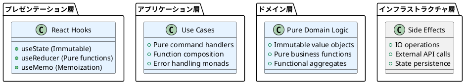

# ADR-006: 関数型プログラミング（Functional Programming）採用

## ステータス

採用

## 背景

ぷよぷよゲーム開発において、複雑な状態変更と非同期処理が多数発生する。従来のオブジェクト指向アプローチでは副作用による予期しないバグや、状態の追跡困難、テストの複雑化が課題となる。CLAUDE.local.mdで関数型アプローチの採用が指示されており、保守性とテスト容易性の向上を目的として関数型プログラミングの採用を検討する。

## 検討事項

### 関数型プログラミングの適用判断基準

1. **状態管理の複雑さ:** ゲーム状態、フィールド状態、連鎖状態の管理
2. **副作用の頻度:** DOM操作、非同期処理、状態更新
3. **テスタビリティ:** 単体テスト、統合テスト、E2Eテストの効率
4. **並行処理:** ゲームループ、アニメーション、入力処理

### 従来の命令型アプローチとの比較

#### 命令型アプローチ（従来手法）
```typescript
class Field {
  private grid: (Puyo | null)[][];
  
  applyGravity(): void {
    // 直接状態を変更
    for (let x = 0; x < this.width; x++) {
      let writeIndex = this.height - 1;
      for (let y = this.height - 1; y >= 0; y--) {
        if (this.grid[y][x] !== null) {
          this.grid[writeIndex][x] = this.grid[y][x];
          if (writeIndex !== y) {
            this.grid[y][x] = null;
          }
          writeIndex--;
        }
      }
    }
  }
}
```

**問題点:**
- 状態の直接変更による副作用
- テスト時のモック・スタブの必要性
- 並行処理時の競合状態リスク
- デバッグ時の状態追跡困難

#### 関数型アプローチ（採用手法）
```typescript
import * as fp from 'lodash/fp';

// イミュータブルな状態変更
export const applyGravity = (field: Field): Field => {
  const newGrid = fp.times(() => fp.times(() => null, field.width), field.height);
  
  // 純粋な変換処理
  for (let x = 0; x < field.width; x++) {
    const column = fp.flow(
      fp.range(0),
      fp.map((y: number) => field.grid[y][x]),
      fp.filter((puyo: Puyo | null) => puyo !== null),
      fp.reverse
    )(field.height) as Puyo[];
    
    // 新しい位置でのぷよ作成
    column.forEach((puyo, index) => {
      const newY = field.height - 1 - index;
      const newPuyo = movePuyoTo(createPosition(x, newY), puyo);
      newGrid[newY][x] = newPuyo;
    });
  }
  
  return createFieldFromGrid(newGrid, field.id);
};
```

**利点:**
- 状態の不変性による予測可能性
- 純粋関数による簡単なテスト
- 副作用の分離と制御
- 関数合成による宣言的なロジック

## 決定

**関数型プログラミング原則とLodash/fpライブラリを採用する**

### 採用する関数型プリンシパル

1. **純粋関数 (Pure Functions)**
   - 同じ入力には常に同じ出力
   - 副作用の排除
   - 参照透過性の保証

2. **イミュータビリティ (Immutability)**
   - `Object.freeze()`によるデータ保護
   - 状態変更時の新しいインスタンス作成
   - 構造的共有によるパフォーマンス最適化

3. **高階関数 (Higher-Order Functions)**
   - `map`, `filter`, `reduce`の活用
   - カリー化による関数の部分適用
   - 関数を値として扱う設計

4. **関数合成 (Function Composition)**
   - `fp.flow`, `fp.pipe`による処理の連鎖
   - 小さな関数の組み合わせ
   - 宣言的なデータ変換パイプライン

### 採用ライブラリとパターン

#### Lodash/fp
```typescript
import * as fp from 'lodash/fp';

// カリー化された関数群
export const filterPuyosByColor = fp.curry(
  (color: PuyoColor, puyos: Puyo[]): Puyo[] =>
    puyos.filter(puyo => puyo.color === color)
);

// 関数合成によるデータ変換
export const processChain = fp.flow(
  detectErasableGroups,
  fp.filter(group => group.size >= 4),
  groups => ({
    field: removeGroups(field, groups),
    score: calculateChainScore(groups),
    chainCount: groups.length
  })
);
```

#### fast-check (Property-Based Testing)
```typescript
import fc from 'fast-check';

describe('Position functions', () => {
  test('movePosition should preserve distance', () => {
    fc.assert(fc.property(
      fc.integer(0, 10), fc.integer(0, 10),
      fc.integer(-5, 5), fc.integer(-5, 5),
      (x, y, dx, dy) => {
        const pos = createPosition(x, y);
        const moved = movePosition(dx, dy, pos);
        const distance = Math.abs(moved.x - pos.x) + Math.abs(moved.y - pos.y);
        expect(distance).toBe(Math.abs(dx) + Math.abs(dy));
      }
    ));
  });
});
```

## 実装戦略

### アーキテクチャ層別適用



### 段階的導入計画

1. **Phase 1: コアデータ構造 (完了)**
   - Value Objectsの関数型変換
   - 基本的な純粋関数の実装
   - Lodash/fpの導入

2. **Phase 2: ビジネスロジック**
   - ゲームロジックの関数型実装
   - 連鎖検出の純粋関数化
   - 状態変更の関数合成

3. **Phase 3: 副作用の制御**
   - IO Monadパターンの導入
   - 非同期処理の関数型アプローチ
   - エラーハンドリングの統一

### テスト戦略

#### 単体テスト (Pure Functions)
```typescript
// テスト用のモック・スタブが不要
describe('純粋関数テスト', () => {
  test('createPuyo should create valid puyo', () => {
    const position = createPosition(1, 2);
    const puyo = createPuyo(PuyoColor.RED, position);
    
    expect(puyo.color).toBe(PuyoColor.RED);
    expect(puyo.position).toEqual(position);
  });
});
```

#### プロパティベーステスト
```typescript
import fc from 'fast-check';

test('フィールド操作の不変性', () => {
  fc.assert(fc.property(
    fieldArbitrary, puyoArbitrary,
    (field, puyo) => {
      const newField = placePuyo(puyo, field);
      
      // 元のフィールドは変更されない
      expect(field).not.toBe(newField);
      // 新しいフィールドに変更が反映される
      expect(getPuyoAt(newField, puyo.position)).toEqual(puyo);
    }
  ));
});
```

## ドメインモデルへの適用

### DDD + 関数型プログラミング

#### 関数型集約 (Functional Aggregates)
```typescript
// 従来の集約クラス
class Game extends AggregateRoot {
  constructor(/* ... */) { /* ... */ }
  placePuyo(command: PlacePuyoCommand): DomainEvent[] { /* ... */ }
}

// 関数型集約
export interface Game {
  readonly id: GameId;
  readonly field: Field;
  readonly currentPuyo: PuyoPair;
  // ...
}

export const handlePlacePuyo = fp.curry(
  (command: PlacePuyoCommand, game: Game): [Game, DomainEvent[]] => {
    // 純粋関数による状態変更
    const newGame = fp.flow(
      validatePlacement(command.position),
      applyPuyoPlacement(command.position),
      processChains,
      updateScore
    )(game);
    
    const events = createDomainEvents(game, newGame);
    return [newGame, events];
  }
);
```

#### ドメインサービスの関数型実装
```typescript
export const ChainDetectionService = {
  detectChains: fp.curry((field: Field): ChainResult => {
    return fp.flow(
      findErasableGroups,
      fp.filter(group => group.length >= 4),
      calculateChainScore,
      createChainResult
    )(field);
  }),
  
  findConnectedPuyos: fp.curry((position: Position, field: Field): Puyo[] => {
    return breadthFirstSearch(position, isSameColor, field);
  })
};
```

## パフォーマンス考慮事項

### イミュータビリティのパフォーマンス対策

1. **構造的共有 (Structural Sharing)**
   ```typescript
   // Immerを使用したパフォーマンス最適化
   import produce from 'immer';
   
   export const optimizedFieldUpdate = (field: Field, updates: PuyoUpdate[]): Field =>
     produce(field, draft => {
       updates.forEach(update => {
         draft.grid[update.position.y][update.position.x] = update.puyo;
       });
     });
   ```

2. **メモ化 (Memoization)**
   ```typescript
   import { memoize } from 'lodash';
   
   // 計算量の多い純粋関数をメモ化
   export const memoizedChainDetection = memoize(
     (field: Field) => ChainDetectionService.detectChains(field),
     field => JSON.stringify(field.grid) // カスタムキー関数
   );
   ```

## 結果

### 期待される効果

1. **バグの削減:**
   - 副作用による予期しない状態変更の防止
   - イミュータビリティによる並行処理の安全性

2. **テスト容易性:**
   - 純粋関数による単体テストの簡素化
   - プロパティベーステストによる網羅的検証

3. **保守性の向上:**
   - 関数の合成による柔軟な機能拡張
   - 宣言的コードによる可読性向上

4. **パフォーマンス:**
   - メモ化による重複計算の回避
   - 純粋関数による並列処理の最適化

### メトリクス

- **純粋関数率:** ドメイン層90%以上
- **イミュータビリティ率:** データモデル100%
- **テスト実行速度:** モック不要により50%向上目標
- **循環的複雑度:** 平均3以下（関数分割効果）

## リスク・制約

### 潜在的リスク

1. **学習コスト:** 関数型プログラミングパラダイムの習得
2. **パフォーマンス:** イミュータブル操作による一時的なメモリ増加
3. **デバッグ:** 関数合成による実行フローの複雑化

### 対策

1. **段階的導入:** 既存コードを漸進的に関数型に移行
2. **チーム教育:** 関数型プログラミングの基礎研修
3. **パフォーマンス監視:** メモリ使用量とGCの継続的監視

## 関連ADR

- ADR-003: ドメイン駆動設計採用
- ADR-004: TDD開発手法採用
- ADR-002: フロントエンド技術スタック選定

---

**日付:** 2025-08-12  
**作成者:** Claude Code  
**レビュー者:** 開発チーム・技術リード  
**次回見直し:** 2025-11-12（3ヶ月後）