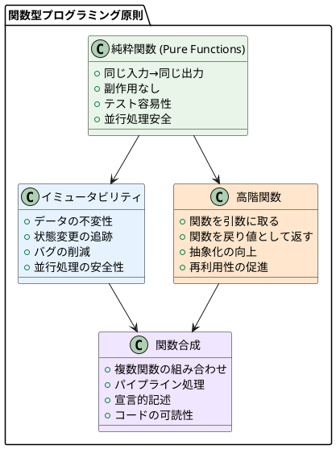
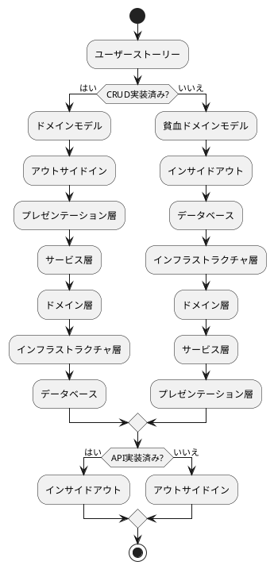
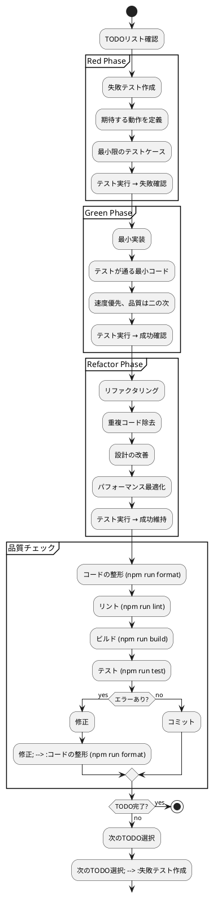
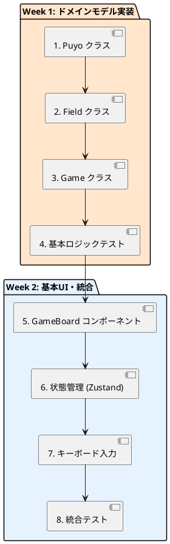
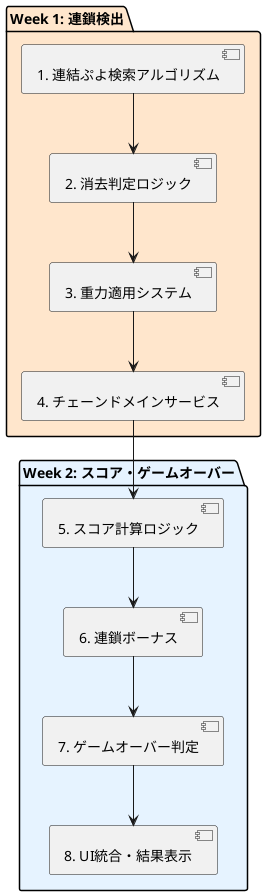
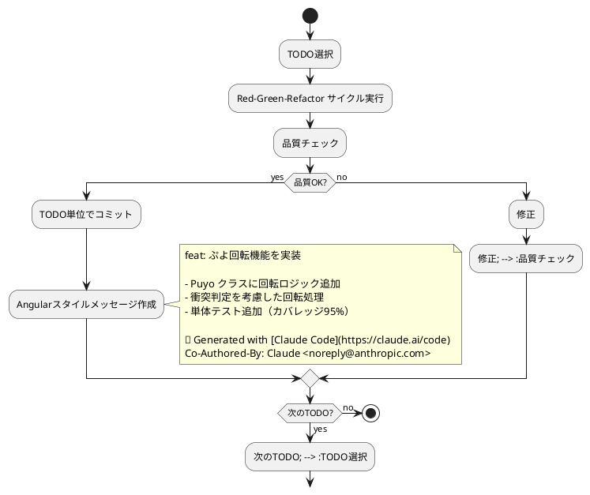

# 実装戦略

## 概要

このドキュメントでは、ぷよぷよゲーム開発における具体的な実装戦略を定義します。CLAUDE.local.mdで指定されたTDD開発フローと、設計ドキュメントに基づいた段階的実装アプローチを採用します。

## 実装アプローチ

### 1. 関数型プログラミングアプローチの採用

本プロジェクトでは、以下の関数型プログラミングの原則を採用し、より堅牢で保守性の高いコードを実現します。



#### 1.1 純粋関数の実装

ぷよぷよゲームのドメインロジックは純粋関数として実装し、テスタビリティと予測可能性を確保します。

```typescript
// 純粋関数の例: ぷよの移動
export const movePuyo = (puyo: Puyo, direction: Direction): Puyo => {
  const newPosition = calculateNewPosition(puyo.position, direction);
  return Puyo.create(puyo.color, newPosition);
};

// 純粋関数の例: 連鎖検出
export const detectChain = (field: Field): PuyoGroup[] => {
  return field.getAllPuyos()
    .groupBy(puyo => puyo.color)
    .map(group => findConnectedGroup(field, group))
    .filter(group => group.size >= 4);
};

// 純粋関数の例: スコア計算  
export const calculateScore = (chainCount: number, puyoCount: number): number => {
  const baseScore = puyoCount * 10;
  const chainBonus = chainCount > 1 ? Math.pow(2, chainCount - 1) * 50 : 0;
  return baseScore + chainBonus;
};
```

#### 1.2 イミュータブルなデータ構造

すべてのドメインオブジェクトはイミュータブルに設計し、状態変更時は新しいインスタンスを生成します。

```typescript
// イミュータブルなField実装
export class Field {
  private constructor(private readonly grid: ReadonlyArray<ReadonlyArray<Puyo | null>>) {
    Object.freeze(this);
  }
  
  // 新しいFieldインスタンスを返す
  placePuyo(puyo: Puyo): Field {
    const newGrid = this.grid.map((row, y) =>
      row.map((cell, x) =>
        x === puyo.position.x && y === puyo.position.y ? puyo : cell
      )
    );
    return new Field(newGrid);
  }
  
  // 関数型スタイルでのぷよ削除
  removePuyos(positions: Position[]): Field {
    const positionSet = new Set(positions.map(p => `${p.x},${p.y}`));
    const newGrid = this.grid.map((row, y) =>
      row.map((cell, x) =>
        positionSet.has(`${x},${y}`) ? null : cell
      )
    );
    return new Field(newGrid);
  }
}
```

#### 1.3 Lodashによる関数型ユーティリティ

Lodash/fpを活用して、宣言的で読みやすいデータ変換処理を実装します。

```typescript
import * as fp from 'lodash/fp';

// 関数合成による連鎖処理パイプライン
const processChain = fp.flow(
  detectErasableGroups,
  groups => groups.filter(group => group.size >= 4),
  erasableGroups => ({
    field: removeGroups(field, erasableGroups),
    score: calculateChainScore(erasableGroups),
    chainCount: erasableGroups.length
  })
);

// カリー化された関数の活用
const filterPuyosByColor = fp.curry((color: PuyoColor, puyos: Puyo[]) =>
  puyos.filter(puyo => puyo.color === color)
);

const filterRedPuyos = filterPuyosByColor(PuyoColor.RED);
const filterBluePuyos = filterPuyosByColor(PuyoColor.BLUE);

// 高階関数による抽象化
const createPuyoTransformer = (transform: (puyo: Puyo) => Puyo) =>
  (field: Field): Field =>
    field.mapPuyos(transform);

const movePuyosDown = createPuyoTransformer(puyo => 
  puyo.moveTo(puyo.position.moveDown())
);
```

### 2. インサイドアウト vs アウトサイドイン



### 2. 選択基準

**インサイドアウトアプローチ（推奨）:**

- **対象:** ドメインモデル（Puyo, Field, Game, Chain）

- **理由:** 

  - 新規プロジェクトでCRUD未実装
  - 複雑なゲームロジックをドメイン中心で構築
  - テストファーストな開発が可能

**アウトサイドインアプローチ（部分採用）:**

- **対象:** UI インタラクション（キーボード、タッチ操作）

- **理由:**
  - ユーザー体験を早期に確認
  - フィードバックループを短縮

## TDD実装サイクル

### Red-Green-Refactorサイクル



## 実装順序

### Phase 3: 開発フェーズ

#### Iteration 1: ゲーム基盤（MVP）



#### Iteration 2: 消去・連鎖システム



## ドメイン層実装戦略

### 1. 関数型ドメインモデル

#### 1.1 純粋関数による値オブジェクト

関数型アプローチでは、値オブジェクトを純粋関数とイミュータブルデータで実装します。

```typescript
// 関数型スタイルのPuyo実装
export interface PuyoData {
  readonly color: PuyoColor;
  readonly position: Position;
}

// ファクトリ関数（純粋関数）
export const createPuyo = (color: PuyoColor, position: Position): PuyoData => {
  validatePuyoColor(color);
  validatePosition(position);
  return Object.freeze({ color, position });
};

// 純粋関数による操作
export const movePuyo = (puyo: PuyoData, newPosition: Position): PuyoData =>
  createPuyo(puyo.color, newPosition);

export const isPuyoEqual = (puyo1: PuyoData, puyo2: PuyoData): boolean =>
  puyo1.color === puyo2.color && isPositionEqual(puyo1.position, puyo2.position);

export const isPuyoAt = (position: Position) => (puyo: PuyoData): boolean =>
  isPositionEqual(puyo.position, position);

export const isSameColor = (color: PuyoColor) => (puyo: PuyoData): boolean =>
  puyo.color === color;

// TDDテストの例
describe('関数型Puyo操作', () => {
  test('createPuyoは不変なPuyoデータを生成する', () => {
    // Given
    const color = PuyoColor.RED;
    const position = { x: 1, y: 2 };
    
    // When
    const puyo = createPuyo(color, position);
    
    // Then
    expect(puyo.color).toBe(color);
    expect(puyo.position).toEqual(position);
    expect(Object.isFrozen(puyo)).toBe(true);
  });
  
  test('movePuyoは新しいPuyoインスタンスを返す', () => {
    // Given
    const puyo = createPuyo(PuyoColor.RED, { x: 1, y: 2 });
    const newPosition = { x: 2, y: 3 };
    
    // When
    const movedPuyo = movePuyo(puyo, newPosition);
    
    // Then
    expect(movedPuyo.position).toEqual(newPosition);
    expect(puyo.position).toEqual({ x: 1, y: 2 }); // 元のpuyoは変更されない
    expect(movedPuyo).not.toBe(puyo); // 新しいインスタンス
  });
});
```

#### 1.2 Lodash/fpによるデータ変換

```typescript
import * as fp from 'lodash/fp';

// 関数合成によるPuyo操作パイプライン
export const processPuyoGroup = fp.flow(
  // ぷよリストを色でグループ化
  fp.groupBy((puyo: PuyoData) => puyo.color),
  
  // 各グループを連結ぷよ検索
  fp.mapValues(findConnectedPuyos),
  
  // 4個以上のグループのみフィルター
  fp.pickBy(group => group.length >= 4),
  
  // フラットな配列に変換
  fp.flatten
);

// カリー化された検索関数
export const findPuyosBy = fp.curry(
  (predicate: (puyo: PuyoData) => boolean, puyos: PuyoData[]) =>
    puyos.filter(predicate)
);

export const findPuyosByColor = findPuyosBy(isSameColor);
export const findPuyosAt = findPuyosBy(isPuyoAt);

// 使用例
const redPuyos = findPuyosByColor(PuyoColor.RED)(allPuyos);
const puyosAtPosition = findPuyosAt({ x: 0, y: 0 })(allPuyos);
```

### 2. エンティティ（Entities）

#### Field実装例

```typescript
// Red: 失敗テスト
describe('Field', () => {
  test('空のフィールドを作成できる', () => {
    // Given & When
    const field = Field.createEmpty();
    
    // Then
    expect(field.isEmpty()).toBe(true);
    expect(field.getWidth()).toBe(6);
    expect(field.getHeight()).toBe(12);
  });
  
  test('指定位置にPuyoを配置できる', () => {
    // Given
    const field = Field.createEmpty();
    const puyo = Puyo.create(PuyoColor.RED, new Position(0, 0));
    
    // When
    const newField = field.placePuyo(puyo);
    
    // Then
    expect(newField.getPuyoAt(new Position(0, 0))).toEqual(puyo);
  });
});

// Green: 最小実装
export class Field {
  private constructor(
    private readonly grid: (Puyo | null)[][],
    private readonly width: number = 6,
    private readonly height: number = 12
  ) {}
  
  static createEmpty(): Field {
    const grid = Array(12).fill(null)
      .map(() => Array(6).fill(null));
    return new Field(grid);
  }
  
  isEmpty(): boolean {
    return this.grid.every(row => 
      row.every(cell => cell === null)
    );
  }
  
  placePuyo(puyo: Puyo): Field {
    const newGrid = this.copyGrid();
    const pos = puyo.getPosition();
    newGrid[pos.getY()][pos.getX()] = puyo;
    return new Field(newGrid);
  }
  
  getPuyoAt(position: Position): Puyo | null {
    return this.grid[position.getY()][position.getX()];
  }
}
```

### 3. ドメインサービス（Domain Services）

#### ChainDetectionService実装例

```typescript
// Red: 失敗テスト
describe('ChainDetectionService', () => {
  test('4つ以上の同色ぷよが隣接している場合、消去対象として検出される', () => {
    // Given
    const field = createFieldWithPattern([
      ['R', 'R', '.', '.', '.', '.'],
      ['R', 'R', '.', '.', '.', '.'],
      ['.', '.', '.', '.', '.', '.'],
    ]);
    const service = new ChainDetectionService();
    
    // When
    const result = service.detectErasableGroups(field);
    
    // Then
    expect(result).toHaveLength(1);
    expect(result[0].size).toBe(4);
    expect(result[0].color).toBe(PuyoColor.RED);
  });
});

// Green: 最小実装
export class ChainDetectionService {
  detectErasableGroups(field: Field): PuyoGroup[] {
    const visited = new Set<string>();
    const erasableGroups: PuyoGroup[] = [];
    
    for (let y = 0; y < field.getHeight(); y++) {
      for (let x = 0; x < field.getWidth(); x++) {
        const position = new Position(x, y);
        const puyo = field.getPuyoAt(position);
        
        if (puyo && !visited.has(position.toString())) {
          const group = this.findConnectedGroup(
            field, position, puyo.getColor(), visited
          );
          
          if (group.size >= 4) {
            erasableGroups.push(group);
          }
        }
      }
    }
    
    return erasableGroups;
  }
  
  private findConnectedGroup(
    field: Field, 
    startPos: Position, 
    color: PuyoColor, 
    visited: Set<string>
  ): PuyoGroup {
    // 深度優先探索による連結ぷよ検索
    const group = new PuyoGroup(color);
    const stack = [startPos];
    
    while (stack.length > 0) {
      const currentPos = stack.pop()!;
      
      if (visited.has(currentPos.toString())) continue;
      
      const puyo = field.getPuyoAt(currentPos);
      if (!puyo || puyo.getColor() !== color) continue;
      
      visited.add(currentPos.toString());
      group.addPuyo(puyo);
      
      // 隣接位置をスタックに追加
      const neighbors = currentPos.getNeighbors();
      stack.push(...neighbors.filter(pos => 
        field.isValidPosition(pos) && 
        !visited.has(pos.toString())
      ));
    }
    
    return group;
  }
}
```

## アプリケーション層実装戦略

### 1. ゲームサービス（Game Service）

```typescript
// Red: 失敗テスト
describe('GameService', () => {
  test('ゲーム開始時に初期状態が正しく設定される', () => {
    // Given
    const gameRepository = createMockGameRepository();
    const service = new GameService(gameRepository);
    
    // When
    const gameId = service.startNewGame();
    
    // Then
    const game = service.getGame(gameId);
    expect(game.getState()).toBe(GameState.READY);
    expect(game.getScore().getCurrent()).toBe(0);
    expect(game.getField().isEmpty()).toBe(true);
  });
  
  test('プレイヤー入力を処理してゲーム状態を更新できる', () => {
    // Given
    const service = new GameService(createMockGameRepository());
    const gameId = service.startNewGame();
    const command = new MovePuyoCommand(Direction.LEFT);
    
    // When
    const result = service.handlePlayerInput(gameId, command);
    
    // Then
    expect(result.isSuccess()).toBe(true);
    expect(result.getEvents()).toContainEqual(
      expect.objectContaining({ type: 'PuyoMovedEvent' })
    );
  });
});

// Green: 最小実装
export class GameService {
  constructor(
    private gameRepository: GameRepository,
    private chainDetectionService: ChainDetectionService = new ChainDetectionService()
  ) {}
  
  startNewGame(): GameId {
    const gameId = GameId.generate();
    const game = Game.startNew(gameId);
    
    this.gameRepository.save(game);
    return gameId;
  }
  
  handlePlayerInput(gameId: GameId, command: InputCommand): GameResult {
    const game = this.gameRepository.findById(gameId);
    if (!game) {
      return GameResult.failure('Game not found');
    }
    
    const events = game.handleInput(command);
    this.gameRepository.save(game);
    
    return GameResult.success(events);
  }
  
  getGame(gameId: GameId): Game {
    return this.gameRepository.findById(gameId);
  }
}
```

## プレゼンテーション層実装戦略

### 1. Reactコンポーネント設計

```typescript
// React Testing Library を使用したコンポーネントテスト
describe('GameBoardComponent', () => {
  test('フィールドの状態を正しく表示する', () => {
    // Given
    const field = createFieldWithPattern([
      ['R', 'G', '.', '.', '.', '.'],
      ['B', 'Y', '.', '.', '.', '.'],
    ]);
    
    // When
    render(<GameBoard field={field} />);
    
    // Then
    expect(screen.getByTestId('puyo-0-0')).toHaveClass('puyo-red');
    expect(screen.getByTestId('puyo-1-0')).toHaveClass('puyo-green');
    expect(screen.getByTestId('puyo-0-1')).toHaveClass('puyo-blue');
    expect(screen.getByTestId('puyo-1-1')).toHaveClass('puyo-yellow');
  });
  
  test('キーボード入力を適切に処理する', () => {
    // Given
    const mockHandleInput = jest.fn();
    render(<GameBoard onInput={mockHandleInput} />);
    
    // When
    fireEvent.keyDown(document, { key: 'ArrowLeft' });
    
    // Then
    expect(mockHandleInput).toHaveBeenCalledWith(
      expect.objectContaining({ type: 'MOVE_LEFT' })
    );
  });
});

// コンポーネント実装
interface GameBoardProps {
  field: Field;
  currentPuyo?: PuyoPair;
  onInput?: (command: InputCommand) => void;
}

export const GameBoard: React.FC<GameBoardProps> = ({ 
  field, 
  currentPuyo, 
  onInput 
}) => {
  // キーボード入力ハンドリング
  useEffect(() => {
    const handleKeyDown = (event: KeyboardEvent) => {
      const command = mapKeyToCommand(event.key);
      if (command && onInput) {
        onInput(command);
      }
    };
    
    document.addEventListener('keydown', handleKeyDown);
    return () => document.removeEventListener('keydown', handleKeyDown);
  }, [onInput]);
  
  return (
    <div className="game-board" data-testid="game-board">
      {Array.from({ length: field.getHeight() }, (_, y) => 
        Array.from({ length: field.getWidth() }, (_, x) => {
          const position = new Position(x, y);
          const puyo = field.getPuyoAt(position);
          
          return (
            <div 
              key={`${x}-${y}`}
              data-testid={`puyo-${x}-${y}`}
              className={`cell ${puyo ? `puyo-${puyo.getColor().toLowerCase()}` : 'empty'}`}
            />
          );
        })
      )}
    </div>
  );
};
```

### 2. 関数型状態管理（Zustand）

関数型アプローチでは、状態更新を純粋関数で行い、Immer等を使用してイミュータブルな更新を実現します。

```typescript
import { create } from 'zustand';
import { immer } from 'zustand/middleware/immer';
import * as fp from 'lodash/fp';

// 関数型スタイルのゲーム状態
interface GameState {
  readonly currentGame: GameData | null;
  readonly gameStatus: GameStatus;
  readonly history: GameData[];
}

// ゲーム状態管理のアクション
interface GameActions {
  startNewGame: () => void;
  handleInput: (command: InputCommand) => void;
  resetGame: () => void;
  undoMove: () => void;
}

// 純粋関数による状態更新関数
const gameStateReducers = {
  startNewGame: (state: GameState): GameState => ({
    ...state,
    currentGame: createInitialGame(),
    gameStatus: GameStatus.PLAYING,
    history: []
  }),
  
  updateGame: (state: GameState, newGame: GameData): GameState => ({
    ...state,
    currentGame: newGame,
    history: [...state.history, state.currentGame].filter(Boolean).slice(-10) // 最新10手を保持
  }),
  
  resetGame: (state: GameState): GameState => ({
    currentGame: null,
    gameStatus: GameStatus.NOT_STARTED,
    history: []
  }),
  
  undoMove: (state: GameState): GameState => {
    const previousGame = state.history[state.history.length - 1];
    if (!previousGame) return state;
    
    return {
      ...state,
      currentGame: previousGame,
      history: state.history.slice(0, -1)
    };
  }
};

// Zustandストアの作成
export const useGameStore = create<GameState & GameActions>()(
  immer((set, get) => ({
    // 初期状態
    currentGame: null,
    gameStatus: GameStatus.NOT_STARTED,
    history: [],
    
    // アクション（純粋関数を使用）
    startNewGame: () => set(gameStateReducers.startNewGame),
    
    handleInput: (command: InputCommand) => {
      const { currentGame } = get();
      if (!currentGame) return;
      
      // 純粋関数によるゲーム状態更新
      const newGame = processGameCommand(currentGame, command);
      set(state => gameStateReducers.updateGame(state, newGame));
    },
    
    resetGame: () => set(gameStateReducers.resetGame),
    undoMove: () => set(gameStateReducers.undoMove)
  }))
);

// 純粋関数によるゲーム処理
const processGameCommand = (game: GameData, command: InputCommand): GameData => {
  return fp.flow(
    validateCommand(command),
    applyCommand(command),
    checkForChains,
    updateScore,
    checkGameOver
  )(game);
};

// コンポーネントでの使用（関数型スタイル）
export const GameContainer: React.FC = () => {
  const gameState = useGameStore();
  
  return (
    <GameView 
      gameState={gameState}
      onInput={gameState.handleInput}
      onStart={gameState.startNewGame}
      onReset={gameState.resetGame}
      onUndo={gameState.undoMove}
    />
  );
};

// 純粋コンポーネント
const GameView: React.FC<GameViewProps> = ({ 
  gameState, 
  onInput, 
  onStart, 
  onReset, 
  onUndo 
}) => {
  if (gameState.gameStatus === GameStatus.NOT_STARTED) {
    return <StartScreen onStart={onStart} />;
  }
  
  return (
    <div>
      <GameBoard 
        field={gameState.currentGame?.field}
        currentPuyo={gameState.currentGame?.currentPuyo}
        onInput={onInput}
      />
      <GameControls 
        onReset={onReset}
        onUndo={onUndo}
        canUndo={gameState.history.length > 0}
      />
      <ScoreDisplay score={gameState.currentGame?.score} />
    </div>
  );
};
```

## 関数型テスト戦略実装

### 1. 純粋関数のテスト

関数型プログラミングでは、純粋関数が中心となるため、テストが非常に簡潔になります。

```typescript
// 純粋関数のテスト例
describe('純粋関数のテスト', () => {
  test('movePuyo: 純粋関数は同じ入力に対して常に同じ出力を返す', () => {
    // Given
    const puyo = createPuyo(PuyoColor.RED, { x: 1, y: 2 });
    const direction = Direction.LEFT;
    
    // When
    const result1 = movePuyo(puyo, direction);
    const result2 = movePuyo(puyo, direction);
    
    // Then
    expect(result1).toEqual(result2);
    expect(result1.position).toEqual({ x: 0, y: 2 });
  });
  
  test('calculateScore: 副作用がないため簡単にテストできる', () => {
    // Given & When & Then
    expect(calculateScore(1, 4)).toBe(40);  // 基本スコア
    expect(calculateScore(2, 4)).toBe(90);  // 2連鎖ボーナス
    expect(calculateScore(3, 4)).toBe(240); // 3連鎖ボーナス
  });
});
```

### 2. Property-Based Testing

関数型プログラミングと相性の良いProperty-Based Testingを活用します。

```typescript
import fc from 'fast-check';

describe('Property-Based Testing', () => {
  test('movePuyo: 移動後のぷよは元の色を保持する', () => {
    fc.assert(fc.property(
      fc.constantFrom(...Object.values(PuyoColor)), // 色の生成
      fc.record({ x: fc.integer(0, 5), y: fc.integer(0, 11) }), // 位置の生成
      fc.constantFrom(...Object.values(Direction)), // 方向の生成
      (color, position, direction) => {
        // Given
        const puyo = createPuyo(color, position);
        
        // When
        const movedPuyo = movePuyo(puyo, direction);
        
        // Then
        expect(movedPuyo.color).toBe(color); // 色は変わらない
        expect(movedPuyo).not.toBe(puyo);    // 新しいインスタンス
      }
    ));
  });
  
  test('処理チェーンの結合法則', () => {
    fc.assert(fc.property(
      fc.array(fc.record({ 
        color: fc.constantFrom(...Object.values(PuyoColor)),
        position: fc.record({ x: fc.integer(0, 5), y: fc.integer(0, 11) })
      })),
      (puyoDataList) => {
        const puyos = puyoDataList.map(data => createPuyo(data.color, data.position));
        
        // 処理チェーンが結合法則を満たすことを確認
        const process1 = fp.flow(filterRedPuyos, movePuyosDown);
        const process2 = fp.flow(movePuyosDown, filterRedPuyos);
        
        // 特定の条件下で結果が同じになることを確認
        // (この例では、赤ぷよ以外は移動に影響しない前提)
        if (puyos.every(puyo => puyo.color === PuyoColor.RED)) {
          expect(process1(puyos)).toEqual(process2(puyos));
        }
      }
    ));
  });
});
```

### 3. 関数型テストデータビルダー

```typescript
export class GameTestDataBuilder {
  private game: Game;
  
  constructor() {
    this.game = Game.startNew(GameId.generate());
  }
  
  withField(pattern: string[][]): GameTestDataBuilder {
    const field = FieldFactory.createFromPattern(pattern);
    this.game = this.game.withField(field);
    return this;
  }
  
  withScore(score: number): GameTestDataBuilder {
    this.game = this.game.withScore(new Score(score, 0));
    return this;
  }
  
  withState(state: GameState): GameTestDataBuilder {
    this.game = this.game.withState(state);
    return this;
  }
  
  build(): Game {
    return this.game;
  }
}

// ファクトリヘルパー
export class FieldFactory {
  static createFromPattern(pattern: string[][]): Field {
    const field = Field.createEmpty();
    
    return pattern.reduce((acc, row, y) => {
      return row.reduce((fieldAcc, cell, x) => {
        if (cell !== '.') {
          const color = this.mapCharToColor(cell);
          const puyo = Puyo.create(color, new Position(x, y));
          return fieldAcc.placePuyo(puyo);
        }
        return fieldAcc;
      }, acc);
    }, field);
  }
  
  private static mapCharToColor(char: string): PuyoColor {
    const colorMap = {
      'R': PuyoColor.RED,
      'G': PuyoColor.GREEN,
      'B': PuyoColor.BLUE,
      'Y': PuyoColor.YELLOW,
      'P': PuyoColor.PURPLE
    };
    
    return colorMap[char] || PuyoColor.RED;
  }
}
```

### 2. 統合テスト

```typescript
describe('ゲーム統合テスト', () => {
  test('完全なゲームフローが正しく動作する', async () => {
    // Given: ゲーム開始
    const gameService = new GameService(new InMemoryGameRepository());
    const gameId = gameService.startNewGame();
    
    // When: 一連のプレイヤー操作を実行
    await gameService.handlePlayerInput(gameId, new MovePuyoCommand(Direction.LEFT));
    await gameService.handlePlayerInput(gameId, new RotatePuyoCommand());
    await gameService.handlePlayerInput(gameId, new QuickDropCommand());
    
    // Then: ゲーム状態が期待通りに更新される
    const game = gameService.getGame(gameId);
    expect(game.getState()).toBe(GameState.PLACING_NEXT_PUYO);
    expect(game.getField().isEmpty()).toBe(false);
  });
  
  test('連鎖が正しく発生してスコアが加算される', async () => {
    // Given: 連鎖が発生しやすい初期フィールド
    const field = FieldFactory.createFromPattern([
      ['.', '.', '.', '.', '.', '.'],
      ['.', '.', '.', '.', '.', '.'],
      ['R', 'R', 'R', '.', '.', '.'],
      ['G', 'G', 'B', '.', '.', '.'],
      ['G', 'B', 'B', '.', '.', '.']
    ]);
    
    const game = new GameTestDataBuilder()
      .withField(field)
      .withScore(0)
      .build();
    
    const gameService = new GameService(new InMemoryGameRepository());
    gameService.saveGame(game);
    
    // When: 連鎖を発生させる操作
    const redPuyo = Puyo.create(PuyoColor.RED, new Position(3, 2));
    const placePuyoCommand = new PlacePuyoCommand(redPuyo);
    const result = await gameService.handlePlayerInput(game.getId(), placePuyoCommand);
    
    // Then: 連鎖が発生してスコアが加算される
    const updatedGame = gameService.getGame(game.getId());
    expect(updatedGame.getScore().getCurrent()).toBeGreaterThan(0);
    expect(result.getEvents()).toContainEqual(
      expect.objectContaining({ type: 'ChainOccurredEvent' })
    );
  });
});
```

## コミット戦略

### TODOベースのコミット



### コミットメッセージ規約

```markdown
<type>(<scope>): <subject>

<body>

<footer>
```

**Type:**
- `feat`: 新機能追加
- `fix`: バグ修正  
- `refactor`: リファクタリング
- `test`: テスト追加・修正
- `docs`: ドキュメント更新
- `style`: コード整形
- `chore`: ビルド・設定変更

**Scope:**
- `domain`: ドメイン層
- `app`: アプリケーション層
- `ui`: プレゼンテーション層
- `infra`: インフラストラクチャ層

## エラーハンドリング戦略

### 1. ドメインエラー

```typescript
// ドメインエラーの定義
export abstract class DomainError extends Error {
  abstract readonly code: string;
  abstract readonly severity: 'warning' | 'error' | 'critical';
}

export class InvalidPuyoPlacementError extends DomainError {
  readonly code = 'INVALID_PUYO_PLACEMENT';
  readonly severity = 'warning';
  
  constructor(position: Position, reason: string) {
    super(`Cannot place puyo at ${position}: ${reason}`);
  }
}

export class GameOverError extends DomainError {
  readonly code = 'GAME_OVER';
  readonly severity = 'error';
  
  constructor(finalScore: number) {
    super(`Game over with final score: ${finalScore}`);
  }
}

// ドメイン層での使用
export class Game {
  handleInput(command: InputCommand): DomainEvent[] {
    try {
      switch (command.type) {
        case 'MOVE_PUYO':
          return this.handleMovePuyo(command as MovePuyoCommand);
        case 'PLACE_PUYO':
          return this.handlePlacePuyo(command as PlacePuyoCommand);
        default:
          throw new InvalidCommandError(command.type);
      }
    } catch (error) {
      if (error instanceof DomainError) {
        return [new GameErrorEvent(this.id, error)];
      }
      throw error; // 予期しないエラーは再スロー
    }
  }
  
  private handlePlacePuyo(command: PlacePuyoCommand): DomainEvent[] {
    const position = command.puyo.getPosition();
    
    if (!this.field.canPlacePuyoAt(position)) {
      throw new InvalidPuyoPlacementError(
        position, 
        'Position is already occupied'
      );
    }
    
    // 正常処理...
    return [new PuyoPlacedEvent(this.id, command.puyo)];
  }
}
```

### 2. アプリケーション層エラー処理

```typescript
export class GameService {
  async handlePlayerInput(
    gameId: GameId, 
    command: InputCommand
  ): Promise<GameResult> {
    try {
      const game = await this.gameRepository.findById(gameId);
      if (!game) {
        return GameResult.failure('Game not found', 'GAME_NOT_FOUND');
      }
      
      const events = game.handleInput(command);
      await this.gameRepository.save(game);
      
      // ドメインイベントをアプリケーションイベントに変換
      await this.eventBus.publishAll(events);
      
      return GameResult.success(events);
      
    } catch (error) {
      if (error instanceof DomainError) {
        return GameResult.failure(error.message, error.code);
      }
      
      // 予期しないエラーはログに記録して汎用エラーを返す
      this.logger.error('Unexpected error in GameService', error);
      return GameResult.failure('Internal server error', 'INTERNAL_ERROR');
    }
  }
}

export class GameResult {
  private constructor(
    private readonly success: boolean,
    private readonly events: DomainEvent[] = [],
    private readonly errorMessage?: string,
    private readonly errorCode?: string
  ) {}
  
  static success(events: DomainEvent[]): GameResult {
    return new GameResult(true, events);
  }
  
  static failure(message: string, code: string): GameResult {
    return new GameResult(false, [], message, code);
  }
  
  isSuccess(): boolean { return this.success; }
  getEvents(): DomainEvent[] { return [...this.events]; }
  getErrorMessage(): string | undefined { return this.errorMessage; }
  getErrorCode(): string | undefined { return this.errorCode; }
}
```

## パフォーマンス最適化戦略

### 1. メモ化とReactの最適化

```typescript
// コンポーネントの最適化
export const GameBoard = React.memo<GameBoardProps>(({ 
  field, 
  currentPuyo, 
  onInput 
}) => {
  // 重い計算のメモ化
  const fieldCells = useMemo(() => {
    return field.getCells().map((row, y) => 
      row.map((puyo, x) => ({
        key: `${x}-${y}`,
        puyo,
        position: new Position(x, y)
      }))
    );
  }, [field]);
  
  // イベントハンドラのメモ化
  const handleKeyDown = useCallback((event: KeyboardEvent) => {
    const command = mapKeyToCommand(event.key);
    if (command && onInput) {
      onInput(command);
    }
  }, [onInput]);
  
  useEffect(() => {
    document.addEventListener('keydown', handleKeyDown);
    return () => document.removeEventListener('keydown', handleKeyDown);
  }, [handleKeyDown]);
  
  return (
    <div className="game-board">
      {fieldCells.map(row => 
        row.map(({ key, puyo, position }) => (
          <PuyoCell key={key} puyo={puyo} position={position} />
        ))
      )}
    </div>
  );
});

// 比較関数をカスタマイズ
GameBoard.displayName = 'GameBoard';
```

### 2. バンドル最適化

```typescript
// 動的インポートによる遅延ロード
const GameSettingsModal = lazy(() => import('./GameSettingsModal'));
const GameHistoryModal = lazy(() => import('./GameHistoryModal'));

export const GameContainer: React.FC = () => {
  const [showSettings, setShowSettings] = useState(false);
  
  return (
    <div>
      <GameBoard />
      
      <Suspense fallback={<div>Loading...</div>}>
        {showSettings && (
          <GameSettingsModal onClose={() => setShowSettings(false)} />
        )}
      </Suspense>
    </div>
  );
};
```

### 3. 関数型テストデータビルダー

関数型アプローチでは、テストデータ生成も純粋関数で行います。

```typescript
// 関数型テストデータビルダー
export const createTestGame = (overrides: Partial<GameData> = {}): GameData => ({
  field: createEmptyField(),
  currentPuyo: createRandomPuyoPair(),
  nextPuyo: createRandomPuyoPair(),
  score: 0,
  chainCount: 0,
  gameStatus: GameStatus.PLAYING,
  ...overrides
});

// パターンベースのフィールド生成
export const createFieldFromPattern = (pattern: string[][]): FieldData =>
  pattern.map((row, y) =>
    row.map((char, x) => 
      char !== '.' ? createPuyo(charToColor(char), { x, y }) : null
    )
  );

// 関数合成によるテストシナリオ生成
export const createChainScenario = fp.flow(
  createFieldFromPattern([
    ['.', '.', '.', '.', '.', '.'],
    ['.', '.', '.', '.', '.', '.'],
    ['R', 'R', 'R', '.', '.', '.'],
    ['G', 'G', 'B', '.', '.', '.'],
    ['G', 'B', 'B', '.', '.', '.']
  ]),
  field => createTestGame({ field }),
  game => ({ ...game, currentPuyo: createPuyo(PuyoColor.RED, { x: 3, y: 2 }) })
);

// 使用例
describe('連鎖テストシナリオ', () => {
  test('3連鎖が正しく動作する', () => {
    // Given
    const gameData = createChainScenario();
    
    // When
    const result = processGameCommand(gameData, { type: 'PLACE_PUYO' });
    
    // Then
    expect(result.chainCount).toBe(3);
    expect(result.score).toBeGreaterThan(200);
  });
});
```

## パフォーマンス最適化（関数型）

### 1. メモ化による計算最適化

```typescript
import memoize from 'lodash/memoize';

// 重い計算の結果をメモ化
export const findConnectedPuyos = memoize(
  (field: FieldData, startPosition: Position, color: PuyoColor): PuyoData[] => {
    // 計算集約的な連結探索
    return searchConnectedPuyos(field, startPosition, color);
  },
  // キーの生成関数
  (field, position, color) => `${fieldToString(field)}_${position.x}_${position.y}_${color}`
);

// React.useMemoとの組み合わせ
export const GameBoard: React.FC<GameBoardProps> = ({ field, currentPuyo }) => {
  const renderedCells = useMemo(() =>
    field.map(row => 
      row.map(puyo => puyo ? renderPuyo(puyo) : renderEmptyCell())
    ),
    [field] // fieldが変更されたときのみ再計算
  );
  
  return <div className="game-board">{renderedCells}</div>;
};
```

### 2. 関数合成による効率的なパイプライン

```typescript
// 効率的なデータ処理パイプライン
export const optimizedChainProcess = fp.flow(
  // 1パスで複数の処理を実行
  field => field.reduce((acc, row, y) => {
    row.forEach((puyo, x) => {
      if (puyo) {
        acc.puyosByColor[puyo.color] = acc.puyosByColor[puyo.color] || [];
        acc.puyosByColor[puyo.color].push({ puyo, position: { x, y } });
        acc.totalCount++;
      }
    });
    return acc;
  }, { puyosByColor: {}, totalCount: 0 }),
  
  // 連結検索を色ごとに並列実行
  ({ puyosByColor, totalCount }) => ({
    erasableGroups: Object.entries(puyosByColor)
      .map(([color, puyos]) => findConnectedGroups(puyos))
      .flat()
      .filter(group => group.length >= 4),
    totalCount
  })
);
```

## まとめ

この関数型プログラミング実装戦略により以下を実現：

1. **関数型原則**: 純粋関数・イミュータビリティ・高階関数・関数合成の採用
2. **テスタビリティ**: 副作用のない純粋関数による簡潔なテスト
3. **保守性**: 予測可能で理解しやすいコード構造
4. **並行処理安全性**: 共有状態変更のない安全な並行処理
5. **宣言的記述**: Lodash/fpによる読みやすいデータ変換
6. **型安全性**: TypeScriptによる厳密な型チェック

### 関数型アプローチの利点

- **バグ削減**: イミュータビリティにより予期しない副作用を防止
- **テスト効率**: 純粋関数は入力・出力が明確でテストが簡単
- **並行処理**: 状態共有がないため競合状態が発生しない
- **デバッグ容易性**: データフローが明確で追跡しやすい
- **再利用性**: 汎用的な純粋関数は様々な場面で再利用可能

次のPhase 3（開発）では、この関数型プログラミング戦略に基づいて、Lodash/fpを活用したぷよぷよゲームの実装を進めていきます。