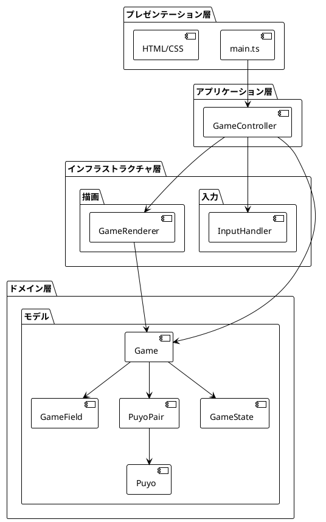
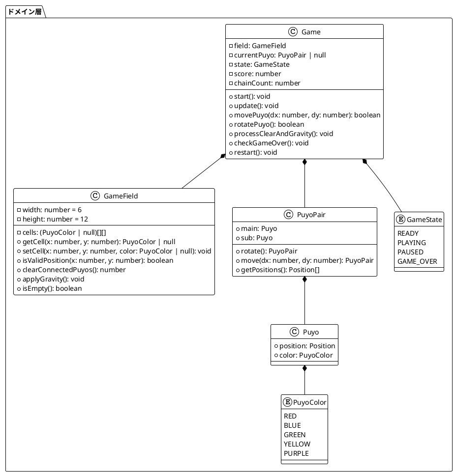
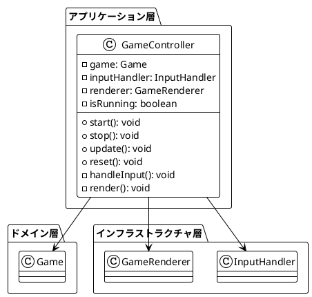
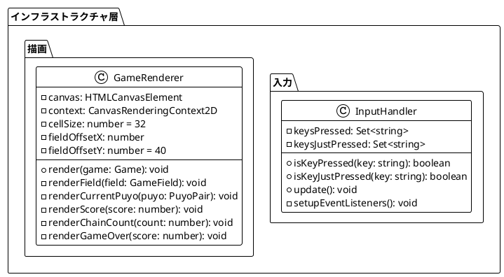
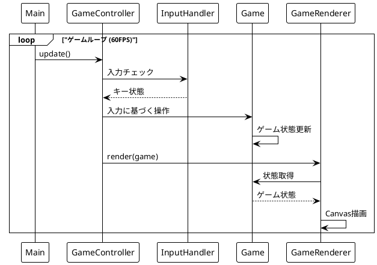
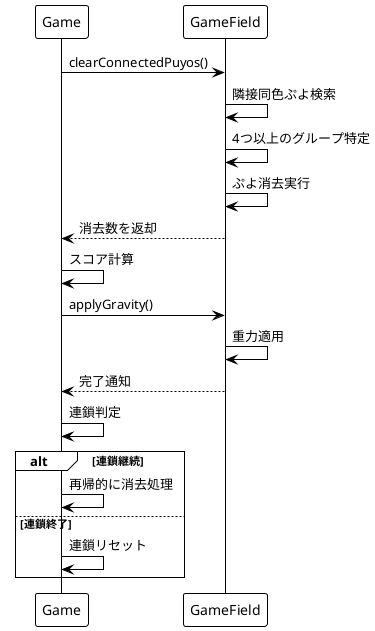
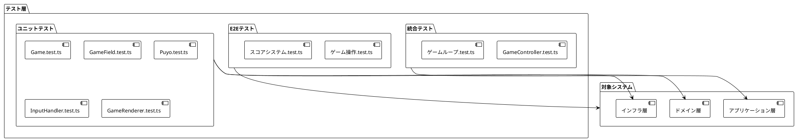

# アプリケーションアーキテクチャ

## 概要

本ぷよぷよゲームは、**ドメイン駆動設計（DDD）**を採用し、ビジネスロジックを中心とした3層アーキテクチャで構成されています。
テスト駆動開発（TDD）により高品質で保守性の高いコードベースを実現しています。

## アーキテクチャ方針

### 設計原則

- **関心の分離**: 各層が明確な責務を持つ
- **依存関係逆転**: 上位層が下位層の抽象に依存
- **単一責任**: 各クラスが単一の責務を持つ
- **開放閉鎖**: 拡張に開き、修正に閉じる

### テスト戦略

- **ユニットテスト**: 各コンポーネントの独立したテスト
- **統合テスト**: 層間の連携テスト
- **E2Eテスト**: エンドツーエンドの動作確認

## 全体アーキテクチャ

## 層別詳細設計

### ドメイン層

**責務**: ビジネスロジックとルールの実装

### アプリケーション層

**責務**: ユースケースの実行とドメインとインフラの調整

### インフラストラクチャ層

**責務**: 技術的な実装詳細（入出力、描画等）

## データフロー

### ゲームループのデータフロー

### ぷよ消去・連鎖のデータフロー

## 技術仕様

### 実行環境

| 項目 | 仕様 |
|------|------|
| ランタイム | ブラウザ（モダンブラウザ対応） |
| 描画 | HTML5 Canvas API |
| フレームレート | 60 FPS |
| 解像度 | 320x480 px |

### パフォーマンス特性

| 項目 | 仕様 |
|------|------|
| ゲームループ | requestAnimationFrame |
| 描画最適化 | 差分描画（全体再描画） |
| メモリ使用量 | 軽量（配列ベース状態管理） |
| レスポンス性 | リアルタイム入力処理 |

### テスト構成

## 拡張性・保守性

### 新機能追加パターン

1. **新しいぷよタイプ**: PuyoColor列挙型に追加
2. **新しいゲームモード**: GameState追加またはStrategyパターン
3. **新しい入力方式**: InputHandler拡張
4. **新しい描画効果**: GameRenderer拡張

### 変更影響範囲の制限

- **ドメイン変更**: アプリケーション層以下に影響
- **UI変更**: インフラ層のみに影響
- **入力方式変更**: InputHandlerのみに影響
- **描画変更**: GameRendererのみに影響

## セキュリティ考慮事項

### 入力検証

- キー入力の妥当性チェック
- ゲーム状態の整合性検証
- 不正な操作の防止

### データ保護

- ローカルストレージは使用せず
- ネットワーク通信なし
- クライアントサイドのみの実行

## まとめ

本アーキテクチャにより以下を実現：

- **高い保守性**: 明確な層分離と責務分担
- **優れたテスタビリティ**: 各層の独立したテスト
- **拡張性**: 新機能の追加が容易
- **パフォーマンス**: 効率的なゲームループと描画
- **型安全性**: TypeScriptによる静的型チェック