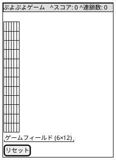
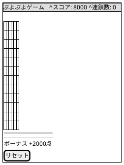

# ユーザーインターフェース設計

## 概要

ぷよぷよゲームのユーザーインターフェース設計を定義します。シンプルで直感的な操作性を重視し、ゲームプレイに集中できるUIを目指します。

## 画面構成

### メイン画面

### ゲームプレイ中の画面

```plantuml
@startsalt
{+
  {* ぷよぷよゲーム | ^スコア: 1200 ^連鎖数: 0 }
  |
  {
    .
    {#
      . | . | <color:red>●</color> | . | . | .
      . | . | <color:red>●</color> | . | . | .
      . | . | . | . | . | .
      . | . | . | . | . | .
      . | . | . | . | . | .
      . | . | . | . | . | .
      . | . | . | . | . | .
      . | . | . | . | . | .
      . | <color:green>●</color> | . | . | . | .
      <color:blue>●</color> | <color:green>●</color> | <color:red>●</color> | . | <color:yellow>●</color> | .
      <color:blue>●</color> | <color:green>●</color> | <color:red>●</color> | <color:red>●</color> | <color:yellow>●</color> | <color:purple>●</color>
      <color:blue>●</color> | <color:green>●</color> | <color:red>●</color> | <color:red>●</color> | <color:yellow>●</color> | <color:purple>●</color>
    }
    " 落下中のぷよ "
  }
  |
  [ リセット ]
}
@endsalt
```

### 連鎖発生中の画面

```plantuml
@startsalt
{+
  {* ぷよぷよゲーム | ^スコア: 5600 ^連鎖数: 3 }
  |
  {
    .
    {#
      . | . | . | . | . | .
      . | . | . | . | . | .
      . | . | . | . | . | .
      . | . | . | . | . | .
      . | . | . | . | . | .
      . | . | . | . | . | .
      . | . | . | . | . | .
      . | . | ==<color:red>●</color>== | ==<color:red>●</color>== | . | .
      . | <color:green>●</color> | ==<color:red>●</color>== | ==<color:red>●</color>== | . | .
      <color:blue>●</color> | <color:green>●</color> | . | . | <color:yellow>●</color> | .
      <color:blue>●</color> | <color:green>●</color> | <color:yellow>●</color> | . | <color:yellow>●</color> | <color:purple>●</color>
      <color:blue>●</color> | <color:green>●</color> | <color:yellow>●</color> | <color:purple>●</color> | <color:yellow>●</color> | <color:purple>●</color>
    }
    " 消去中のぷよ（==で囲まれた部分） "
  }
  |
  [ リセット ]
}
@endsalt
```

### ゲームオーバー画面

```plantuml
@startsalt
{+
  {* ぷよぷよゲーム | ^スコア: 12500 ^連鎖数: 0 }
  |
  {
    .
    {#
      . | . | <color:red>●</color> | . | . | .
      . | . | <color:red>●</color> | . | . | .
      . | <color:blue>●</color> | <color:red>●</color> | . | . | .
      . | <color:blue>●</color> | <color:red>●</color> | . | . | .
      . | <color:blue>●</color> | <color:green>●</color> | . | . | .
      . | <color:blue>●</color> | <color:green>●</color> | <color:yellow>●</color> | . | .
      . | <color:purple>●</color> | <color:green>●</color> | <color:yellow>●</color> | . | .
      <color:red>●</color> | <color:purple>●</color> | <color:green>●</color> | <color:yellow>●</color> | . | .
      <color:red>●</color> | <color:purple>●</color> | <color:blue>●</color> | <color:yellow>●</color> | . | <color:red>●</color>
      <color:red>●</color> | <color:purple>●</color> | <color:blue>●</color> | <color:green>●</color> | <color:yellow>●</color> | <color:red>●</color>
      <color:red>●</color> | <color:green>●</color> | <color:blue>●</color> | <color:green>●</color> | <color:yellow>●</color> | <color:red>●</color>
      <color:blue>●</color> | <color:green>●</color> | <color:blue>●</color> | <color:green>●</color> | <color:yellow>●</color> | <color:red>●</color>
    }
    {
      ==ゲームオーバー==
      --
      最終スコア: 12500
      --
      Rキーでリスタート
    }
  }
  |
  [ リセット ]
}
@endsalt
```

### 全消しボーナス画面

## 画面要素

### 1. ヘッダー部
- **タイトル**: 「ぷよぷよゲーム」を中央に表示
- **背景色**: #2c3e50（ダークグレー）
- **文字色**: #ffffff（白）

### 2. スコア表示部
- **スコア**: 現在の得点を表示
- **連鎖数**: 現在の連鎖数を表示（連鎖中のみ）
- **フォント**: 等幅フォント（monospace）
- **背景色**: #34495e（グレー）
- **文字色**: #ffffff（白）

### 3. ゲームフィールド
- **サイズ**: 6列×12行
- **セルサイズ**: 40px × 40px
- **枠線**: 2px solid #7f8c8d
- **背景色**: #ecf0f1（ライトグレー）
- **中央配置**: 画面の中央に配置

### 4. ぷよの表示
- **サイズ**: 36px × 36px（セル内に2pxの余白）
- **形状**: 円形（border-radius: 50%）
- **色**:
  - 赤: #e74c3c
  - 青: #3498db
  - 黄: #f1c40f
  - 緑: #27ae60
  - 紫: #9b59b6
- **影**: 軽いドロップシャドウで立体感を演出

### 5. コントロール部
- **リセットボタン**: 
  - サイズ: 120px × 40px
  - 背景色: #e74c3c（赤）
  - 文字色: #ffffff（白）
  - ホバー時: 背景色を明るく

### 6. ゲームオーバー画面
- **オーバーレイ**: 半透明の黒（rgba(0, 0, 0, 0.8)）
- **メッセージ**: 
  - 「ゲームオーバー」（大きく表示）
  - 最終スコア表示
  - 「Rキーでリスタート」の案内
- **文字色**: #ffffff（白）

## 操作方法

### キーボード操作
- **←/→キー**: ぷよを左右に移動
- **↑キー**: ぷよを時計回りに回転
- **↓キー**: ぷよを高速落下
- **Rキー**: ゲームをリスタート（ゲームオーバー時）

### タッチ操作（将来実装）
- **左右スワイプ**: ぷよを左右に移動
- **タップ**: ぷよを回転
- **下スワイプ**: ぷよを高速落下

## レスポンシブデザイン

### デスクトップ（幅 > 768px）
- 標準レイアウトを使用
- セルサイズ: 40px × 40px

### モバイル（幅 <= 768px）
- 画面幅に合わせてフィールドを縮小
- セルサイズ: 計算式 `(画面幅 - 40px) / 6`
- タッチ操作を有効化

## アニメーション

### ぷよの落下
- **duration**: 16ms（60fps）
- **easing**: linear

### ぷよの消去
- **効果**: フェードアウト
- **duration**: 300ms
- **easing**: ease-out

### 連鎖表示
- **効果**: 連鎖数をポップアップ表示
- **duration**: 1000ms
- **アニメーション**: スケールアップ → フェードアウト

### 全消しボーナス
- **効果**: 画面全体にパーティクルエフェクト
- **メッセージ**: 「全消し！」を大きく表示
- **duration**: 2000ms

## アクセシビリティ

### キーボード操作
- すべての機能がキーボードで操作可能
- フォーカス管理の実装

### 色覚多様性対応
- ぷよの色に加えて、形状やパターンでの識別も検討
- 高コントラストモードの提供

### スクリーンリーダー対応
- ARIAラベルの適切な設定
- ゲーム状態の音声案内

## パフォーマンス最適化

### Canvas描画
- requestAnimationFrameを使用した効率的な描画
- 変更があった部分のみを再描画
- ダブルバッファリングの実装

### メモリ管理
- 不要なオブジェクトの適切な破棄
- オブジェクトプールの実装（ぷよオブジェクトの再利用）

## 将来の拡張

### 追加予定の機能
- サウンドエフェクト
- BGM
- ハイスコアランキング
- 難易度設定
- カラーテーマ切り替え
- マルチプレイヤー対応