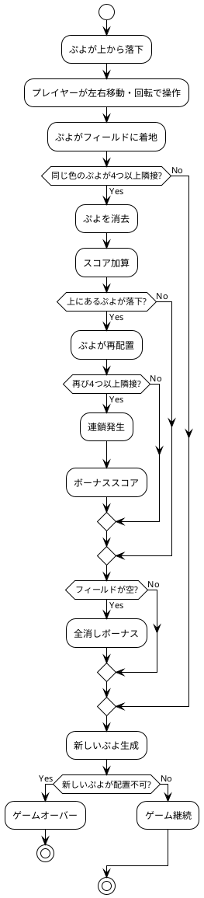
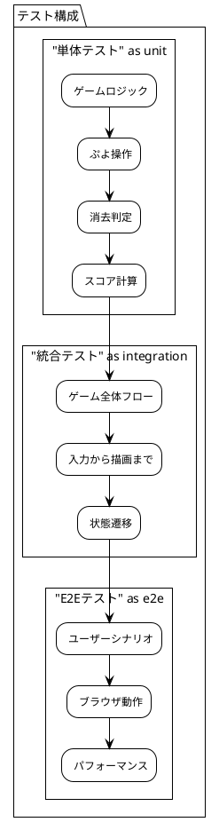

# 要件定義

## 概要

このセクションでは、ぷよぷよゲーム開発プロジェクトの要件定義に関する情報を提供します。ユーザーストーリー、受け入れ基準、イテレーション計画などを含みます。

## ドキュメント一覧

- [要件](./要件.md) - ゲーム機能の詳細要件とイテレーション計画

## ゲーム概要

### ぷよぷよゲームとは

ぷよぷよは、落ちてくる色付きの「ぷよ」を操作して、同じ色のぷよを4つ以上つなげて消去するパズルゲームです。連鎖反応を起こすことで高得点を狙うことができます。

### 基本ルール

## ユーザーストーリー

### プレイヤーの基本操作

- **ぷよの移動**: 左右矢印キーでぷよを移動
- **ぷよの回転**: 上矢印キーでぷよを回転
- **高速落下**: 下矢印キーでぷよを高速落下
- **ゲーム管理**: ゲーム開始、リスタート、一時停止

### ゲームシステム

- **消去システム**: 同じ色のぷよ4つ以上で消去
- **連鎖システム**: 消去後の落下で新たな消去が発生
- **スコアシステム**: 基本点＋連鎖ボーナス＋全消しボーナス
- **ゲームオーバー**: 新しいぷよが配置できない状態

## 技術要件

### 機能要件

- **描画性能**: 60FPS でのスムーズな描画
- **入力応答性**: キー入力の遅延 < 16ms
- **ゲーム状態管理**: セーブ・ロード機能（将来拡張）

### 非機能要件

- **ブラウザ対応**: Chrome, Firefox, Safari, Edge の最新版
- **レスポンシブ対応**: デスクトップ・タブレット対応
- **アクセシビリティ**: キーボード操作対応

### 品質要件

- **テストカバレッジ**: 80%以上
- **コード品質**: ESLint エラー 0件
- **パフォーマンス**: ページ読み込み時間 < 3秒

## イテレーション計画

### 開発スケジュール

| イテレーション | 機能 | 期間 | 主要な成果物 |
|---------------|------|------|-------------|
| 1 | ゲーム開始 | 1日 | 基本的なゲームループ |
| 2 | ぷよの移動 | 1日 | 左右移動・自動落下 |
| 3 | ぷよの回転 | 1日 | 回転機能・壁キック |
| 4 | 高速落下 | 1日 | 下キー高速落下 |
| 5 | ぷよの消去 | 1日 | 4つ以上の消去判定 |
| 6 | 連鎖反応 | 1日 | 連鎖システム |
| 7 | 全消しボーナス | 1日 | 特別なボーナス |
| 8 | ゲームオーバー | 1日 | 終了条件・リスタート |

### 各イテレーションの詳細

詳細な TODO、受け入れ基準、ふりかえりについては [要件](./要件.md) を参照してください。

## 受け入れプロセス

### 受け入れ基準の確認

各イテレーションで以下を確認：

1. **機能の動作**: 仕様通りに動作すること
2. **品質基準**: テスト・リント・ビルドが成功すること
3. **ユーザビリティ**: 操作感が自然であること
4. **パフォーマンス**: レスポンスが適切であること

### テスト戦略

## 制約と前提

### 技術的制約

- **実行環境**: モダンブラウザのみ対応
- **描画方式**: HTML5 Canvas API 使用
- **状態管理**: クライアントサイドのみ

### ビジネス制約

- **開発期間**: 約12日間
- **チーム規模**: 1名（AI アシスト付き）
- **予算**: 無料ツールのみ使用

### 品質制約

- **保守性**: 可読性・拡張性を重視
- **テスタビリティ**: テスト駆動開発を徹底
- **ドキュメント**: 適切な文書化を実施

## 関連リンク

- [開発ドキュメント](../development/) - 開発計画とプロセス
- [アーキテクチャ決定ログ](../adr/) - 技術選択の記録
- [運用ドキュメント](../operation/) - 環境構築とCI/CD
- [開発日誌](../journal/) - 開発進捗の記録