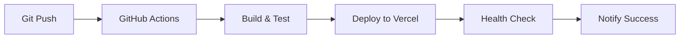

# デプロイメント戦略

Vercel + GitHub Actionsを採用

日付: 2025-01-06

## ステータス

2025-01-06 承認済み

## コンテキスト

ぷよぷよゲームのデプロイメントとホスティングに関する要件：

- 継続的デプロイメント（CD）
- 高い可用性とパフォーマンス
- 簡単なロールバック機能
- プレビュー環境の自動生成
- 費用対効果

候補：

1. Vercel + GitHub Actions
2. Netlify + GitHub Actions
3. AWS S3 + CloudFront + GitHub Actions
4. Firebase Hosting + GitHub Actions
5. GitHub Pages

## 決定

**Vercel + GitHub Actions** を採用する

### 理由

**Vercel:**

- Reactアプリケーションに最適化
- 自動的なCDNとエッジ最適化
- プレビューデプロイメントの自動生成
- ゼロ設定デプロイメント
- 優れたパフォーマンス（Core Web Vitals最適化）
- 無料枠で十分な制限

**GitHub Actions:**

- GitHubとの完全統合
- 豊富なアクションライブラリ
- 無料枠（2000分/月）
- 柔軟なワークフロー設計
- シークレット管理機能

**他の候補を除外した理由:**

- Netlify: Vercelと同等だが、React最適化でVercelが優位
- AWS: 設定複雑性とコスト懸念
- Firebase: Google依存とオーバースペック
- GitHub Pages: 動的機能制限とCDN性能

## 影響

### ポジティブな影響

- **デプロイ速度**: プッシュから本番まで数分
- **プレビュー機能**: PR毎の自動プレビュー環境
- **パフォーマンス**: グローバルCDNとエッジ最適化
- **コスト効率**: 無料枠内での運用
- **開発体験**: シンプルな設定とデプロイ
- **スケーラビリティ**: 自動スケーリング

### ネガティブな影響

- **ベンダーロックイン**: Vercel依存
- **カスタマイズ制限**: サーバーサイド処理の制約
- **コスト**: 大規模利用時の料金増加
- **デバッグ難易度**: サーバーレス環境でのデバッグ

### 軽減策

- Infrastructure as Code（設定ファイル）による移行準備
- モニタリングとアラートによる問題早期発見
- コスト監視とアラート設定

## アーキテクチャ詳細

### デプロイフロー



### 環境構成

| 環境 | ブランチ | URL | 用途 |
|------|---------|-----|------|
| Production | main | https://puyo-game.vercel.app | 本番環境 |
| Preview | PR branches | https://puyo-game-git-{branch}.vercel.app | PR確認 |
| Development | - | http://localhost:5173 | ローカル開発 |

### GitHub Actions ワークフロー

```yaml
name: Deploy

on:
  push:
    branches: [main]
  pull_request:
    branches: [main]

jobs:
  deploy:
    runs-on: ubuntu-latest
    steps:
      - uses: actions/checkout@v3
      
      - name: Setup Node.js
        uses: actions/setup-node@v3
        with:
          node-version: '18'
          cache: 'npm'
      
      - name: Install dependencies
        run: npm ci
      
      - name: Run tests
        run: npm run test
      
      - name: Build
        run: npm run build
      
      - name: Deploy to Vercel
        uses: amondnet/vercel-action@v20
        with:
          vercel-token: ${{ secrets.VERCEL_TOKEN }}
          vercel-org-id: ${{ secrets.ORG_ID }}
          vercel-project-id: ${{ secrets.PROJECT_ID }}
          vercel-args: ${{ github.event_name == 'push' && '--prod' || '' }}
```

### Vercel設定

```json
{
  "name": "puyo-puyo-game",
  "version": 2,
  "buildCommand": "npm run build",
  "outputDirectory": "dist",
  "installCommand": "npm ci",
  "framework": null,
  "headers": [
    {
      "source": "/(.*)",
      "headers": [
        {
          "key": "X-Frame-Options",
          "value": "DENY"
        },
        {
          "key": "X-Content-Type-Options",
          "value": "nosniff"
        }
      ]
    }
  ]
}
```

## パフォーマンス最適化

### ビルド最適化
- Tree shaking
- Code splitting
- 静的アセット最適化
- Source map除外（本番）

### Vercel最適化
- Edge Functions活用
- ISR（Incremental Static Regeneration）
- Image Optimization
- Analytics統合

## モニタリング

### Vercel Analytics
- Core Web Vitals監視
- ページビュー統計
- パフォーマンス指標

### カスタム監視
```typescript
// Web Vitals報告
import { getCLS, getFID, getFCP, getLCP, getTTFB } from 'web-vitals';

function sendToAnalytics(metric) {
  // Vercel Analyticsに送信
  analytics.track(metric.name, metric.value);
}

getCLS(sendToAnalytics);
getFID(sendToAnalytics);
getFCP(sendToAnalytics);
getLCP(sendToAnalytics);
getTTFB(sendToAnalytics);
```

## セキュリティ

### 設定
- セキュリティヘッダーの設定
- HTTPS強制
- CSP（Content Security Policy）

### シークレット管理
- Vercelトークンのシークレット化
- 環境変数の適切な管理
- アクセス権限の最小化

## 障害対応

### ロールバック手順
```bash
# 1. 前バージョンのデプロイIDを確認
vercel list

# 2. 前バージョンをプロダクションに昇格
vercel promote [deployment-url] --scope [team-name]
```

### 障害検知
- Vercel Status監視
- カスタムヘルスチェック
- アラート通知（Slack/Email）

## コスト管理

### 無料枠制限
- 帯域幅: 100GB/月
- ビルド時間: 無制限
- Function実行: 100GB-Hours
- ドメイン: 独自ドメイン対応

### コスト監視
- 使用量ダッシュボード監視
- 月次コストレビュー
- アラート設定

## コンプライアンス

この決定の遵守は以下により確認：

- vercel.json設定ファイルの存在
- GitHub Actions ワークフローの設定
- 自動デプロイの実行確認
- プレビュー環境の生成確認

## 備考

- 決定者: 開発チーム
- 影響範囲: デプロイとホスティング全体
- レビュー予定: 3ヶ月後、コスト・パフォーマンス評価