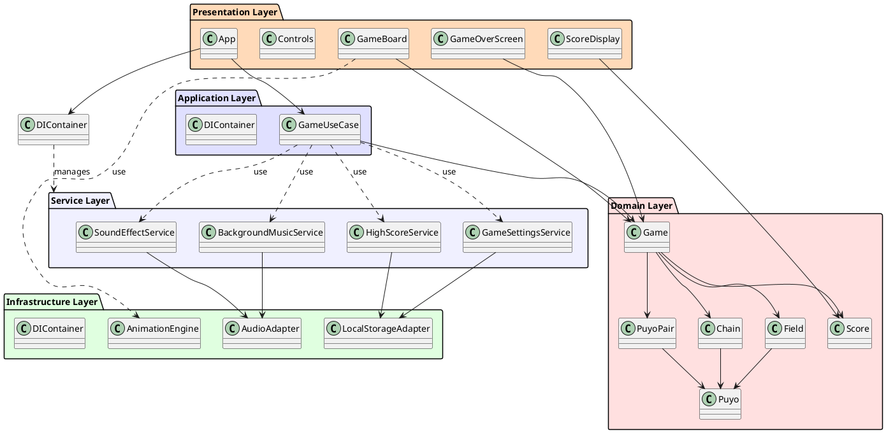
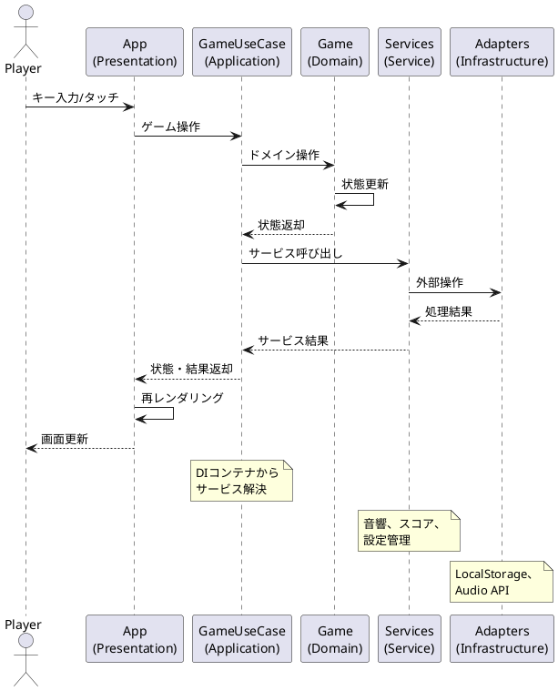

# アーキテクチャ設計

## 概要

ぷよぷよゲームは、レイヤードアーキテクチャを採用し、関心事の分離と依存関係の明確化を図ります。TypeScriptとReactを使用したWebアプリケーションとして実装します。

## アーキテクチャ全体図

## レイヤー構成

### 1. プレゼンテーション層（Presentation Layer）

**責任:**

- ユーザーインターフェースの表示
- ユーザー入力の受け付け
- ゲーム状態の視覚的表現

**主要コンポーネント:**

- `App`: アプリケーションのルートコンポーネント、DIコンテナの初期化
- `GameBoard`: ゲームフィールドの表示
- `ScoreDisplay`: スコア・連鎖数の表示
- `Controls`: 操作ボタン（モバイル用）
- `GameOverScreen`: ゲームオーバー画面

### 2. アプリケーション層（Application Layer）

**責任:**

- ユースケースの実装
- ドメインロジックの調整とフロー制御
- プレゼンテーション層とドメイン層の橋渡し

**主要コンポーネント:**

- `GameUseCase`: ゲーム全体のユースケース実装
  - ゲーム操作の統一インターフェース提供
  - ドメインモデルへの委譲
  - サービス層との連携
- `DIContainer`: 依存性注入コンテナ
  - サービスの登録と解決
  - シングルトン・ファクトリパターン実装
  - 型安全なサービス解決

### 3. ドメイン層（Domain Layer）

**責任:**

- ビジネスロジックの実装
- ゲームルールの表現
- ドメインモデルの管理

**主要コンポーネント:**

- `Game`: ゲーム全体の状態管理
- `Field`: フィールドの状態管理
- `Puyo`: 個々のぷよ
- `PuyoPair`: 落下中のぷよペア
- `Chain`: 連鎖情報
- `Score`: スコア情報

### 4. サービス層（Service Layer）

**責任:**

- ドメインを横断する機能の実装
- 外部サービスとの連携
- アプリケーション全体で使用される共通機能

**主要コンポーネント:**

- `SoundEffectService`: 効果音の再生管理
- `BackgroundMusicService`: BGMの再生・制御
- `HighScoreService`: ハイスコアの管理・永続化
- `GameSettingsService`: ゲーム設定の管理

### 5. インフラストラクチャ層（Infrastructure Layer）

**責任:**

- 外部システムとの連携
- 技術的な実装詳細
- プラットフォーム固有の機能

**主要コンポーネント:**

- `LocalStorageAdapter`: ブラウザのLocalStorage操作
- `AnimationEngine`: CSS/Canvas アニメーション制御
- `AudioAdapter`: Web Audio API の抽象化
- `DIContainer`: 依存性注入の基盤実装

## 設計原則

### 1. 依存関係逆転の原則（DIP）
- 上位レイヤーは下位レイヤーに依存しない
- 具象クラスではなくインターフェースに依存する
- ドメイン層は他のレイヤーに依存しない

### 2. 単一責任の原則（SRP）
- 各クラスは単一の責任を持つ
- 変更理由は1つに限定される

### 3. 開放閉鎖の原則（OCP）
- 拡張に対して開いている
- 修正に対して閉じている

### 4. インターフェース分離の原則（ISP）
- クライアントが使用しないメソッドに依存しない
- 特定の目的に特化したインターフェースを提供

### 5. リスコフの置換原則（LSP）
- 派生クラスは基底クラスと置換可能

## データフロー

## 技術選定

### フロントエンド
- **TypeScript**: 型安全性とIDEサポート
- **React**: コンポーネントベースUI
- **CSS Modules**: スタイルのスコープ管理
- **Canvas API**: ゲームグラフィックス描画

### 状態管理・依存性注入
- **React useState/useRef**: ローカル状態管理
- **DIContainer**: 依存性注入による疎結合実現
- **GameUseCase**: アプリケーションレイヤーでの状態調整

### ビルドツール
- **Vite**: 高速な開発サーバーとビルド
- **ESLint**: コード品質管理
- **Prettier**: コードフォーマット

### テスティング
- **Vitest**: 単体テスト
- **React Testing Library**: コンポーネントテスト
- **Playwright**: E2Eテスト

## 非技術的な設計決定

### パフォーマンス最適化
- Reactの仮想DOMを活用した効率的な再描画
- Canvas APIを使用したゲームフィールドの描画
- requestAnimationFrameを使用したスムーズなアニメーション

### 拡張性
- 新しいぷよの色や特殊ぷよの追加が容易
- ゲームモードの追加が可能
- AIプレイヤーの実装が可能な設計

### メンテナンス性
- レイヤー間の明確な境界とSOLID原則の遵守
- 依存性注入によるテスタビリティとモック可能性の向上
- 型安全なTypeScriptによるコンパイル時エラー検出
- GameUseCaseパターンによる複雑性の集約
- 包括的な単体・統合テストカバレッジ

## アーキテクチャの進化

### リファクタリング実施内容（Iteration 3 → 4 間）

1. **アプリケーション層の導入**
   - App.tsxからビジネスロジックを分離
   - GameUseCaseクラスでユースケースを統一管理
   - プレゼンテーション層の責任を明確化

2. **依存性注入システム構築**
   - 型安全なDIContainerの実装
   - サービス層の抽象化とインターフェース化
   - シングルトン・ファクトリパターンの実装

3. **Clean Architecture準拠**
   - 依存関係の方向を内側（ドメイン）に統一
   - 各層の責任分離の強化
   - 疎結合・高凝集の実現

### 設計品質指標

- **複雑度**: App.tsx 332行 → リファクタリング後のコンポーネント分離
- **型安全性**: any型の完全排除、型推論の活用
- **テスタビリティ**: DIによるモック注入、単体テスト18クラス345テストケース
- **保守性**: SOLID原則遵守、明確なレイヤー境界