# ユーザーインターフェース設計

## 概要

ぷよぷよゲームのユーザーインターフェースは、直感的で視覚的に楽しく、レスポンシブデザインに対応したものとします。

## 全体レイアウト

```plantuml
@startsalt
{
  {T
    + ぷよぷよゲーム
    ++ <&media-play> スタート | <&media-pause> ポーズ | <&reload> リスタート
  }
  |
  {
    {
      スコア: 0
      --
      連鎖: 0
      --
      レベル: 1
    } | {
      == ゲームフィールド ==
      {#
        . | . | . | . | . | .
        . | . | . | . | . | .
        . | . | . | . | . | .
        . | . | . | . | . | .
        . | . | . | . | . | .
        . | . | . | . | . | .
        . | . | . | . | . | .
        . | . | . | . | . | .
        . | . | . | . | . | .
        . | . | . | . | . | .
        . | . | . | . | . | .
        . | . | . | . | . | .
        X | X | X | X | X | X
      }
    } | {
      == NEXT ==
      {#
        R | R
        B | B
      }
      --
      {#
        G | G
        Y | Y
      }
    }
  }
  |
  {
    [<] 左移動 | [v] 落下 | [>] 右移動 | [^] 回転
  }
}
```

## 詳細UI設計

### 1. ゲームフィールド

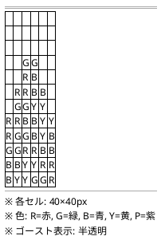

### 2. ぷよ表示

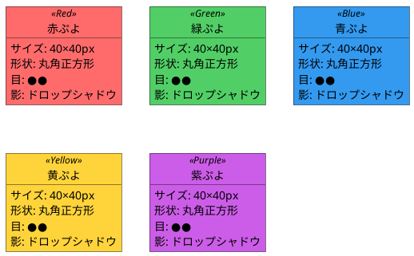

### 3. コントロール

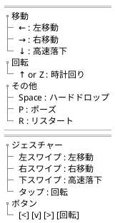

## ゲーム状態別UI

### 1. タイトル画面

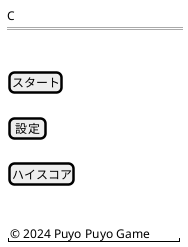

### 2. ゲーム中

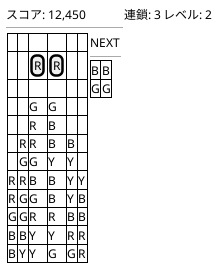

### 3. ポーズ画面

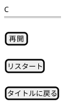

### 4. ゲームオーバー画面

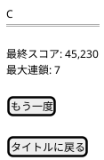

## レスポンシブデザイン

### デスクトップ (1024px以上)
- ゲームフィールド: 中央配置
- サイドパネル: スコア表示とNEXT表示
- キーボード操作メイン

### タブレット (768px〜1023px)
- ゲームフィールド: 画面幅に合わせて調整
- コンパクトなUI配置
- タッチ操作ボタン表示

### モバイル (767px以下)
- ゲームフィールド: 画面幅いっぱい
- 縦長レイアウト
- 大きめのタッチ操作ボタン

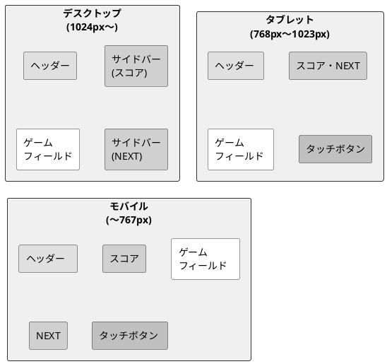

## タッチ操作UI

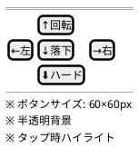

## アニメーション仕様

### 1. ぷよ落下
- イージング: ease-in
- 落下速度: レベルに応じて加速
- ゴースト表示: 不透明度 30%

### 2. ぷよ消去
- フェードアウト: 0.3秒
- パーティクルエフェクト
- 連鎖時は派手なエフェクト

### 3. 連鎖表示
- 数字がポップアップ
- スケールアニメーション
- 連鎖数に応じて色変化

### 4. 全消し
- 画面全体フラッシュ
- "全消し！"テキスト表示
- 星のパーティクル

## カラーパレット

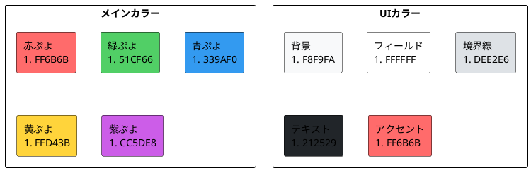

## アクセシビリティ対応

### 1. カラーユニバーサルデザイン
- 色だけでなく形状でも識別可能
- 高コントラストモード対応
- 色覚異常シミュレーション確認

### 2. キーボードナビゲーション
- すべての機能にキーボードでアクセス可能
- フォーカス表示の明確化
- ショートカットキーの提供

### 3. スクリーンリーダー対応
- 適切なARIAラベル
- ゲーム状態の音声読み上げ
- 重要なイベントの通知

### 4. モーション設定
- アニメーション無効化オプション
- 低モーションモード
- エフェクト強度調整