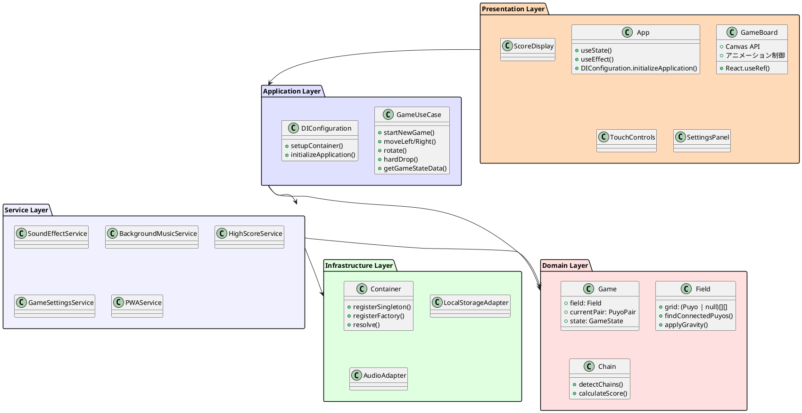

# 実装詳細

## 概要

このドキュメントでは、ぷよぷよゲームアプリケーションの具体的な実装内容について詳しく説明します。Clean Architectureに基づいた4層構造での実装方針と、各層における具体的な実装詳細を記載します。

## 実装アーキテクチャ

### レイヤー構成と実装



## 各層の実装詳細

### 1. プレゼンテーション層（Presentation Layer）

#### App.tsx - ルートコンポーネント
```typescript
// 依存性注入の初期化
useState(() => {
  DIConfiguration.initializeApplication()
  return null
})

// サービス解決
const [gameUseCase] = useState(() =>
  container.resolve<GameUseCase>(GAME_USE_CASE)
)
```

**主要実装内容:**

- DIコンテナの初期化とサービス解決
- ゲーム状態に応じたUI制御
- キーボード・タッチイベントハンドリング
- BGM・効果音の状態変化制御

#### GameBoard.tsx - ゲーム盤面
```typescript
// Canvas APIによる描画
const canvasRef = useRef<HTMLCanvasElement>(null)
const drawField = useCallback((field: Field) => {
  const canvas = canvasRef.current
  const ctx = canvas?.getContext('2d')
  // ぷよ描画ロジック
}, [])
```

**実装特徴:**

- Canvas APIを使用した高性能描画
- React useRefによるCanvas制御
- アニメーション状態管理
- レスポンシブ対応

#### コンポーネント設計原則
- 単一責任の原則に基づく細分化
- プロパティによる疎結合
- React Hooksによる状態管理
- TypeScriptによる型安全性

### 2. アプリケーション層（Application Layer）

#### GameUseCase.ts - ユースケース統合
```typescript
export class GameUseCase {
  private game: Game = new Game()

  public startNewGame(): void {
    this.game.start()
  }

  public moveLeft(): boolean {
    return this.game.moveCurrentPairLeft()
  }

  // プレゼンテーション層用データ変換
  public getGameStateData(): GameStateData {
    const fieldData: PuyoData[][] = []
    const field = this.game.field
    
    for (let y = 0; y < field.height; y++) {
      fieldData[y] = []
      for (let x = 0; x < field.width; x++) {
        const puyo = field.getPuyo(x, y)
        fieldData[y][x] = {
          color: puyo ? puyo.color : 'empty'
        }
      }
    }
    
    return {
      isPlaying: this.isPlaying(),
      isPaused: this.isPaused(), 
      isGameOver: this.isGameOver(),
      currentScore: this.game.score,
      chainCount: this.game.lastChainResult?.chainCount || 0,
      fieldData,
      nextPair: this.getNextPairData()
    }
  }
}
```

**実装ポイント:**

- ドメインロジックとUI層の橋渡し
- データ変換による層間疎結合
- ビジネス操作の統一インターフェース

#### DIConfiguration.ts - 依存性注入設定
```typescript
export class DIConfiguration {
  public static setupContainer(): void {
    // アプリケーション層サービス
    container.registerFactory(GAME_USE_CASE, () => new GameUseCase())

    // サービス層サービス（シングルトン）
    container.registerSingleton(SOUND_EFFECT_SERVICE, soundEffect)
    container.registerSingleton(BACKGROUND_MUSIC_SERVICE, backgroundMusic)
    container.registerSingleton(HIGH_SCORE_SERVICE, highScoreService)
    container.registerSingleton(GAME_SETTINGS_SERVICE, gameSettingsService)
  }
}
```

### 3. サービス層（Service Layer）

#### 音響サービス実装
```typescript
// SoundEffectService.tsx
class SoundEffectService {
  private audioElements: Map<SoundType, HTMLAudioElement> = new Map()

  public async play(type: SoundType): Promise<void> {
    try {
      const audio = this.getAudioElement(type)
      audio.currentTime = 0
      await audio.play()
    } catch (error) {
      console.error(`Failed to play sound ${type}:`, error)
    }
  }
}
```

#### PWAService実装
```typescript
export class PWAService {
  public async registerSW(): Promise<void> {
    // 開発環境では Service Worker の登録をスキップ
    if (import.meta.env.DEV) {
      console.log('PWA: Service Worker registration skipped in development mode')
      return
    }

    if ('serviceWorker' in navigator) {
      this.wb = new Workbox('/sw.js')
      // イベントハンドラー設定...
    }
  }
}
```

### 4. ドメイン層（Domain Layer）

#### Game.ts - ゲームコア
```typescript
export class Game {
  public state: GameState = GameState.READY
  public score: number = 0
  public field: Field
  public currentPair: PuyoPair | null = null
  public nextPair: PuyoPair | null = null
  public lastChainResult: ChainResult | null = null
  private chain: Chain

  public moveCurrentPairLeft(): boolean {
    if (!this.currentPair || this.state !== GameState.PLAYING) {
      return false
    }
    
    const newX = this.currentPair.x - 1
    if (this.field.canPlacePuyoPair(this.currentPair, newX, this.currentPair.y)) {
      this.currentPair.x = newX
      return true
    }
    return false
  }
}
```

#### Field.ts - フィールド管理
```typescript
export class Field {
  public readonly height = 16 // 隠しライン2行 + 表示14行
  public readonly width = 6
  private grid: (Puyo | null)[][]

  public findConnectedPuyos(x: number, y: number): [number, number][] {
    const puyo = this.getPuyo(x, y)
    if (!puyo) return []

    const visited = new Set<string>()
    const result: [number, number][] = []
    this.dfs(x, y, puyo.color, visited, result)
    return result
  }

  public applyGravity(): boolean {
    let moved = false
    // 重力処理の実装...
    return moved
  }
}
```

#### Chain.ts - 連鎖システム
```typescript
export class Chain {
  public detectAndExecute(): ChainResult | null {
    const chainDetails: ChainStep[] = []
    let totalScore = 0
    let totalErasedCount = 0
    let stepNumber = 1

    while (true) {
      const step = this.executeSingleStep(stepNumber)
      if (step.erasedPuyos.length === 0) break

      chainDetails.push(step)
      totalScore += step.stepScore
      totalErasedCount += step.erasedPuyos.length
      stepNumber++

      this.field.applyGravity()
    }

    return chainDetails.length > 0 ? {
      chainCount: chainDetails.length,
      totalErasedCount,
      score: totalScore,
      chainDetails
    } : null
  }
}
```

### 5. インフラストラクチャ層（Infrastructure Layer）

#### Container.ts - DIコンテナ
```typescript
export class Container {
  private singletons: Map<string, unknown> = new Map()
  private factories: Map<string, () => unknown> = new Map()

  public registerSingleton<T>(token: string, instance: T): void {
    this.singletons.set(token, instance)
  }

  public registerFactory<T>(token: string, factory: () => T): void {
    this.factories.set(token, factory)
  }

  public resolve<T>(token: string): T {
    // シングルトン解決
    if (this.singletons.has(token)) {
      return this.singletons.get(token) as T
    }

    // ファクトリー解決
    if (this.factories.has(token)) {
      const factory = this.factories.get(token)!
      return factory() as T
    }

    throw new Error(`No registration found for token: ${token}`)
  }
}
```

## テスト実装戦略

### 3層テスト構造

#### 単体テスト（Unit Tests）
```typescript
// ドメインロジックの例
describe('Chain', () => {
  it('基本的な4個消去が正しく動作する', () => {
    // 3A Pattern (Arrange-Act-Assert)
    const field = new Field()
    // ... フィールド設定
    
    const chain = new Chain(field)
    const result = chain.detectAndExecute()
    
    expect(result).not.toBeNull()
    expect(result!.chainCount).toBe(1)
    expect(result!.totalErasedCount).toBe(4)
  })
})
```

#### 統合テスト（Integration Tests）
```typescript
// コンポーネント統合テスト
describe('GameBoard Integration', () => {
  it('ゲーム開始から基本操作まで統合動作する', () => {
    render(<App />)
    
    const startButton = screen.getByTestId('start-button')
    fireEvent.click(startButton)
    
    const gameBoard = screen.getByTestId('game-board')
    expect(gameBoard).toBeInTheDocument()
  })
})
```

#### E2Eテスト（End-to-End Tests）
```typescript
// Playwrightによるブラウザテスト
test('ゲーム開始から基本操作まで', async ({ page }) => {
  await page.goto('/')
  
  await page.click('[data-testid="start-button"]')
  await expect(page.locator('[data-testid="game-board"]')).toBeVisible()
  
  // キーボード操作テスト
  await page.keyboard.press('ArrowLeft')
  await page.keyboard.press('ArrowRight')
  await page.keyboard.press('ArrowUp') // 回転
})
```

## パフォーマンス最適化

### レンダリング最適化
```typescript
// React.memo によるメモ化
export const PuyoCell = React.memo<PuyoCellProps>(({ puyo, x, y }) => {
  return (
    <div 
      className={`puyo-cell ${puyo?.color || 'empty'}`}
      style={{ gridColumn: x + 1, gridRow: y + 1 }}
    />
  )
})

// useCallback によるコールバック最適化
const handleMove = useCallback((direction: 'left' | 'right') => {
  const moved = direction === 'left' 
    ? gameUseCase.moveLeft() 
    : gameUseCase.moveRight()
  
  if (moved) {
    soundEffectService.play(SoundType.PUYO_MOVE)
    forceRender()
  }
}, [gameUseCase, soundEffectService, forceRender])
```

### バンドル最適化
```typescript
// vite.config.ts
export default defineConfig({
  build: {
    rollupOptions: {
      output: {
        manualChunks: {
          'react-vendor': ['react', 'react-dom'],
        },
      },
    },
    minify: 'terser',
    terserOptions: {
      compress: {
        drop_console: true,
        drop_debugger: true,
      },
    },
  },
})
```

## アーキテクチャ監視

### dependency-cruiser設定
```javascript
// .dependency-cruiser.cjs
module.exports = {
  forbidden: [
    {
      name: 'presentation-layer-boundaries',
      comment: 'プレゼンテーション層は上位層のみ参照可能',
      severity: 'error',
      from: { path: '^src/components' },
      to: {
        path: '^src/(?!application|services|utils|styles|hooks|types\\.ts)',
        pathNot: '^src/(application|services|utils|styles|hooks|components|types\\.ts)',
      },
    },
    // ... その他のルール
  ],
}
```

## 型安全性の実装

### 共通型定義
```typescript
// types.ts
export interface PuyoData {
  color: string
}

export interface PuyoPairData {
  main: PuyoData
  sub: PuyoData
}

export interface GameStateData {
  isPlaying: boolean
  isPaused: boolean
  isGameOver: boolean
  currentScore: number
  chainCount: number
  fieldData: PuyoData[][]
  nextPair: PuyoPairData | null
}
```

### 厳格なTypeScript設定
```json
// tsconfig.json
{
  "compilerOptions": {
    "strict": true,
    "noImplicitReturns": true,
    "noImplicitAny": true,
    "noUnusedLocals": true,
    "noUnusedParameters": true
  }
}
```

## 実装のベストプラクティス

### 1. SOLID原則の適用
- **S**ingle Responsibility: 各クラスは単一の責任
- **O**pen/Closed: 拡張に開いて修正に閉じている
- **L**iskov Substitution: 派生クラスは基底クラスと置換可能
- **I**nterface Segregation: 使用しないインターフェースに依存しない
- **D**ependency Inversion: 具象ではなく抽象に依存

### 2. テスト駆動開発（TDD）
- Red: 失敗するテストを書く
- Green: テストを通す最小実装
- Refactor: リファクタリングで品質向上

### 3. 継続的品質管理
- ESLint による静的解析
- Prettier による自動フォーマット
- dependency-cruiser によるアーキテクチャ監視
- Vitest による単体・統合テスト
- Playwright による E2E テスト

この実装により、保守性・拡張性・テスタビリティを兼ね備えたクリーンなアーキテクチャを実現しています。