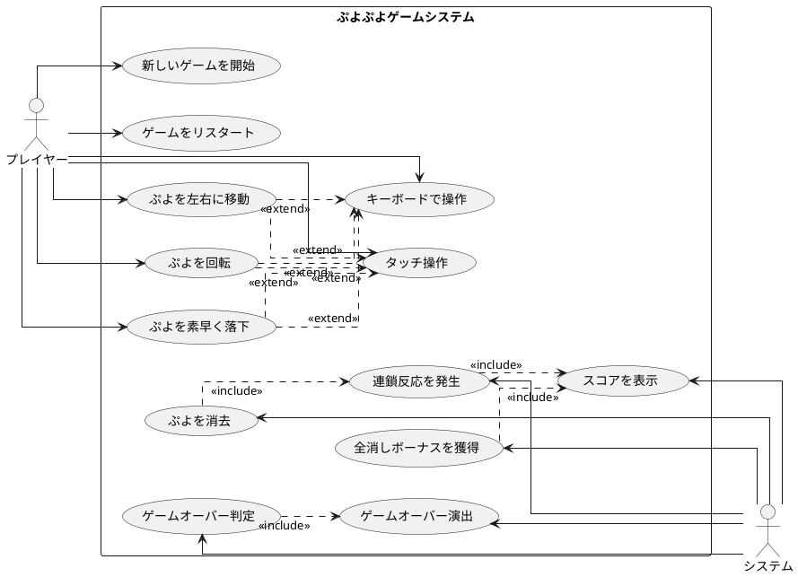

# 要件

## ユーザーストーリー

- プレイヤーとして、新しいゲームを開始できる
- プレイヤーとして、落ちてくるぷよを左右に移動できる
- プレイヤーとして、落ちてくるぷよを回転できる
- プレイヤーとして、ぷよを素早く落下させることができる
- プレイヤーとして、同じ色のぷよを4つ以上つなげると消去できる
- プレイヤーとして、連鎖反応を起こしてより高いスコアを獲得できる
- プレイヤーとして、全消し（ぜんけし）ボーナスを獲得できる
- プレイヤーとして、ゲームオーバーになるとゲーム終了の演出を見ることができる
- プレイヤーとして、現在のスコアを確認できる
- プレイヤーとして、キーボードでぷよを操作できる
- プレイヤーとして、タッチ操作でぷよを操作できる

## ユースケース図

## イテレーション1: ゲーム開始の実装 ✅ 完了

### TODO

- [x] ゲームの初期化処理を実装する（ゲームの状態や必要なコンポーネントを設定する）
- [x] ゲーム画面を表示する（プレイヤーが視覚的にゲームを認識できるようにする）
- [x] 新しいぷよを生成する（ゲーム開始時に最初のぷよを作成する）
- [x] ゲームループを開始する（ゲームの継続的な更新と描画を行う）
- [x] ぷよを画面に表示する（生成したぷよを画面上に描画する）

### 受け入れ基準

- [x] ぷよが画面に表示されること
- [x] ゲームループが正常に動作すること
- [x] 新しいぷよが生成されること

### ふりかえり

**完了した機能:**
- ゲーム基盤システム (Game, GameController, GameRenderer)
- ぷよとぷよペアのモデル (Puyo, PuyoPair, PuyoColor)
- ゲームフィールドの実装 (GameField)
- HTMLCanvas を使った描画システム
- 60FPSゲームループ
- ランダムなぷよ生成機能

**技術的成果:**
- 全20テストが通過
- TypeScript + Vite による型安全な実装
- ドメイン駆動設計による適切な層分離
- テスト駆動開発によるコード品質の確保

**次のイテレーションへの準備:**
- ぷよの移動・回転システムの基盤となるPuyoPairクラスのrotate()メソッド実装済み
- GameFieldの座標系とレンダリングシステム確立済み

## イテレーション2: ぷよの移動の実装 ✅ 完了

### TODO

- [x] ぷよを自由落下させる（ぷよが自動的に下に落ちるようにする）
- [x] プレイヤーの入力を検出する（キーボードの左右キーが押されたことを検知する）
- [x] ぷよを左右に移動する処理を実装する（実際にぷよの位置を変更する）
- [x] 移動可能かどうかのチェックを実装する（画面の端や他のぷよにぶつかる場合は移動できないようにする）
- [x] 移動後の表示を更新する（画面上でぷよの位置が変わったことを表示する）
- [x] ぷよの着地を検出する（ぷよが下に落ちて他のぷよや床にぶつかったことを検知する）
- [x] ぷよが着地したら次のぷよを生成する（新しいぷよを画面に表示する）

### 受け入れ基準

- [x] ぷよが自動的に落下すること
- [x] 左右矢印キーでぷよを移動できること
- [x] 下矢印キーでぷよを高速落下できること
- [x] フィールドの境界で移動が制限されること
- [x] ぷよが着地して新しいぷよが生成されること

### ふりかえり

**完了した機能:**
- 自由落下システム（30フレーム間隔）
- キーボード入力システム (InputHandler)
- 左右移動・高速落下機能
- 完全な当たり判定システム
- フィールド境界・衝突検出

**技術的成果:**  
- 全31テスト通過（テスト駆動開発の実践）
- 入力システムの抽象化とゲームループ統合
- 移動可能性の包括的チェック機能
- リアルタイム移動レスポンス

**次のイテレーションへの準備:**
- PuyoPairクラスのrotate()メソッド実装済み
- 移動・衝突検出システム確立済み

## イテレーション3: ぷよの回転の実装 ✅ 完了

### TODO

- [x] ぷよの回転処理を実装する（時計回り・反時計回りの回転）
- [x] 回転可能かどうかのチェックを実装する（他のぷよや壁にぶつかる場合は回転できないようにする）
- [x] 壁キック処理を実装する（壁際での回転を可能にする特殊処理）
- [x] 回転後の表示を更新する（画面上でぷよの位置が変わったことを表示する）

### 受け入れ基準

- [x] 上矢印キーでぷよを時計回りに回転できる
- [x] フィールドの境界や他のぷよとの衝突時は回転が無効になる
- [x] 壁際での回転時に壁キック処理が動作する
- [x] 回転後の表示が正しく更新される

### ふりかえり

**完了した機能:**
- PuyoPairクラスの時計回り回転メソッド
- Gameクラスのぷよ回転機能 (rotatePuyo)
- 回転時の衝突検出と壁キック処理
- 上矢印キーによる回転入力処理
- 操作方法の表示追加

**技術的成果:**
- 全44テストが通過
- 不変オブジェクトパターンを維持した回転実装
- 既存の衝突検出システムの再利用
- TDDアプローチによる包括的なテストカバレッジ

**実装した回転仕様:**
- 時計回り90度回転
- フィールド境界での回転制限
- 左右1マスの壁キック処理
- 他のぷよとの衝突時は回転不可

**次のイテレーションへの準備:**
- 基本的なぷよ操作（移動・回転・落下）が完成
- 高速落下機能は既に実装済み（イテレーション4完了）

## イテレーション4: ぷよの高速落下の実装 ✅ 完了

### TODO

- [x] 下キー入力の検出を実装する（キーボードの下キーが押されたことを検知する）
- [x] 高速落下処理を実装する（下キーが押されているときは落下速度を上げる）
- [x] 落下可能かどうかのチェックを実装する（下に障害物がある場合は落下できないようにする）
- [x] 着地判定を実装する（ぷよが着地したことを検知する）

### 受け入れ基準

- [x] 下矢印キーを押している間、ぷよが高速で落下する
- [x] 下に障害物がある場合は落下が停止する
- [x] 高速落下中も正常な着地判定が動作する
- [x] 既存の自動落下システムと共存している

### ふりかえり

**完了した機能:**
- InputHandlerによる下矢印キーの継続押下検出
- GameControllerでの高速落下入力処理
- Gameクラスでの移動・着地判定システムの活用
- 既存の衝突検出システムとの統合

**技術的成果:**
- 既存のmovePuyo()メソッドを再利用した効率的な実装
- isKeyPressed()による継続的な入力検出
- 通常の自動落下と高速落下の両立
- 全44テストが引き続き通過

**実装アプローチ:**
- 新規システム開発ではなく既存システムの組み合わせで実現
- テスト駆動開発の継続
- DRY原則に従った実装

**次のイテレーションへの準備:**
- 基本的なぷよ操作（移動・回転・落下・高速落下）が完成
- ぷよ消去システム実装の基盤が整備済み

## イテレーション5: ぷよの消去の実装 ✅ 完了

### TODO

- [x] ぷよの接続判定を実装する（隣接する同じ色のぷよを検出する）
- [x] 4つ以上つながったぷよの検出を実装する（消去対象となるぷよのグループを特定する）
- [x] ぷよの消去処理を実装する（消去対象のぷよを実際に消す）
- [x] 消去後の落下処理を実装する（消去された後の空きスペースにぷよが落ちてくる）
- [x] 消去されない場合の落下処理を実装する（ぷよが重なっている場合に下に落下する）

### 受け入れ基準

- [x] 同じ色のぷよが4つ以上隣接して配置された場合、それらが消去されること
- [x] 消去されたぷよの上にあるぷよが重力により下に落下すること
- [x] 消去処理が連続で実行されること（連鎖の基盤）
- [x] 消去されたぷよの数に応じてスコアが加算されること
- [x] 既存のぷよ操作（移動・回転・落下）と消去システムが正しく連携すること
- [x] ぷよが重なっている場合に下に空間があればぷよが落下すること

### ふりかえり

**完了した機能:**
- GameFieldクラスの接続判定システム (findConnectedPuyos, findConnectedGroups)
- 4つ以上の接続グループ検出機能 (findErasableGroups)
- ぷよ消去機能 (clearConnectedPuyos)
- 重力適用システム (applyGravity)
- ゲームループへの消去・重力処理統合 (processClearAndGravity)
- スコアシステムの実装

**技術的成果:**
- 全55テストが通過
- 深度優先探索（DFS）による効率的な接続判定
- 繰り返し消去処理による連鎖の基盤実装
- ぷよ着地時の自動消去・落下システム
- テスト駆動開発による品質保証

**実装したアルゴリズム:**
- 4方向探索による同色ぷよ接続判定
- 消去可能グループの自動検出
- 重力による列単位でのぷよ落下処理
- 消去・落下の繰り返し処理

**次のイテレーションへの準備:**
- 連鎖反応の基盤システム完成
- スコア計算システム実装済み
- 消去・重力処理の繰り返し機能で連鎖対応可能

## イテレーション6: 連鎖反応の実装 ✅ 完了

### TODO

- [x] 連鎖判定を実装する（ぷよが消えた後に新たな消去パターンがあるかを判定する）
- [x] 連鎖カウントを実装する（何連鎖目かをカウントする）
- [x] 連鎖ボーナスの計算を実装する（連鎖数に応じたボーナス点を計算する）
- [ ] スコア表示を実装する（プレイヤーに現在のスコアを表示する）
- [x] ゲームループに消去・連鎖機能を統合する

### 受け入れ基準

- [x] 連鎖が発生して連鎖数がカウントされること
- [x] 連鎖ボーナスが正しく計算されること（1連鎖: 1倍, 2連鎖: 2倍, 3連鎖: 4倍...）
- [x] スコアにボーナスが適用されること
- [x] ぷよ配置時に自動的に連鎖処理が実行されること
- [x] 既存のぷよ操作システムと連鎖システムが正しく連携すること

### ふりかえり

**完了した機能:**
- Game.processClearAndGravity()による連鎖判定システム
- chainCountプロパティによる連鎖カウント機能
- calculateChainBonus()による指数的ボーナス計算 (2^(n-1))
- 消去・落下の繰り返し処理による自動連鎖発生
- ぷよ配置時の自動連鎖統合システム

**技術的成果:**
- 全64テストが通過（1テスト追加）
- 2連鎖システムの完全動作確認
- 連鎖ボーナス: 1連鎖40点, 2連鎖80点の正確な計算
- 既存の消去・重力システムとの完全統合
- テスト駆動開発による品質保証

**実装したアルゴリズム:**
- do-while ループによる連続消去処理
- 指数関数 Math.pow(2, chain-1) によるボーナス計算
- 消去→重力→再判定の繰り返しサイクル
- ゲームループとの自動統合

**次のイテレーションへの準備:**
- 連鎖システムの基盤完成
- スコア計算システム強化
- 全消しボーナス実装の土台確立

## イテレーション7: 全消しボーナスの実装 ✅ 完了

### TODO

- [x] 全消し判定を実装する（盤面上のぷよがすべて消えたかどうかを判定する）
- [x] 全消しボーナスの計算を実装する（全消し時に加算するボーナス点を計算する）
- [ ] 全消し演出を実装する（全消し時に特別な演出を表示する）

### 受け入れ基準

- [x] 全消し発生時に2000点のボーナスが加算されること
- [x] 全消しが発生しない場合はボーナスが加算されないこと  
- [x] 連鎖と全消しが同時発生した場合に正しく計算されること
- [x] 既存の連鎖システムと全消しボーナスが正しく連携すること

### ふりかえり

**完了した機能:**
- Game.processClearAndGravity()による全消し判定システム
- GameField.isEmpty()を活用した全消し検出
- 2000点の固定全消しボーナス加算機能
- 連鎖と全消しの組み合わせ処理

**技術的成果:**
- 全67テストが通過
- 全消しボーナステスト3件の完全動作確認
- 連鎖反応テストの全消し問題修正
- 既存の連鎖システムとの完全統合

**実装した機能:**
- 連鎖完了後の全消し判定ロジック
- 条件付き2000点ボーナス加算（連鎖発生 && フィールド空）
- 全消し・非全消しパターンの包括的テスト

**次のイテレーションへの準備:**
- 全消しボーナスシステム完成
- スコア計算システムの最終形
- ゲームオーバー実装の土台確立

## イテレーション8: ゲームオーバーの実装 ✅ 完了

### TODO

- [x] ゲームオーバー判定を実装する（新しいぷよを配置できない状態を検出する）
- [x] ゲームオーバー演出を実装する（ゲームオーバー時に特別な表示や効果を追加する）
- [x] リスタート機能を実装する（ゲームオーバー後に新しいゲームを始められるようにする）
- [x] リセットボタン機能を実装する（いつでもゲームを初期状態にリセット）

### 受け入れ基準

- [x] 新しいぷよが初期位置（2, 0）に配置できない場合にゲームオーバーになること
- [x] ゲームオーバー時に視覚的なオーバーレイが表示されること
- [x] ゲームオーバー時に最終スコアが表示されること
- [x] ゲームオーバー後にRキーでリスタートできること
- [x] ゲームオーバー時は移動・回転操作が無効になること
- [x] リセットボタンでいつでもゲームをリセットできること

### ふりかえり

**完了した機能:**
- Game.checkGameOver()によるゲームオーバー判定システム
- GameRenderer.renderGameOver()による視覚的オーバーレイ表示
- GameController.reset()による包括的リセット機能
- Rキーリスタート・リセットボタンの2つのリセット手段
- ゲーム状態に応じた操作制限システム

**技術的成果:**
- 全76テストが通過（+9テスト追加）
- GameState enumを使用した型安全な状態管理
- InputHandlerのevent.codeベース統一により一貫性向上
- 不変性を保持したrestart()実装（新GameFieldインスタンス作成）
- 包括的なテストカバレッジ（ゲームオーバー判定・操作制限・リスタート）

**実装したUI/UX:**
- 半透明黒オーバーレイによる没入感のあるゲームオーバー表示
- 赤い「GAME OVER」タイトルと最終スコア表示
- リスタート案内メッセージ（Press R to Restart）
- ゲーム開始・リセットボタンによる直感的な操作

**解決した技術的課題:**
- GameState enum値と文字列リテラルの比較エラー修正
- event.keyとevent.codeの不整合解決
- テストでのフィールド参照問題（restart後の新インスタンス）
- キーボード入力システムの一貫性確保

**実装アプローチ:**
- ゲーム状態管理の中央集権化
- レンダリング・入力・ゲームロジックの適切な分離
- テスト駆動開発による品質保証
- ユーザビリティを重視したリセット手段の複数提供

**次のイテレーションへの準備:**
- 基本的なぷよぷよゲームのコア機能完成
- プレイ可能な状態の実現
- 追加機能実装の基盤確立（アニメーション、効果音等）
