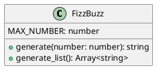
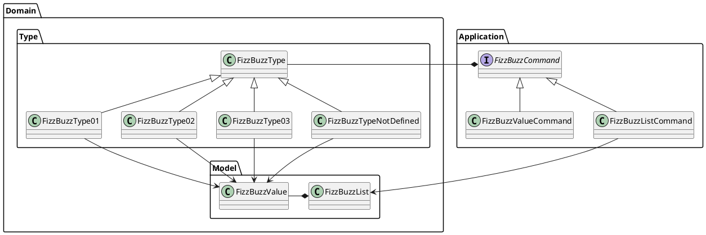
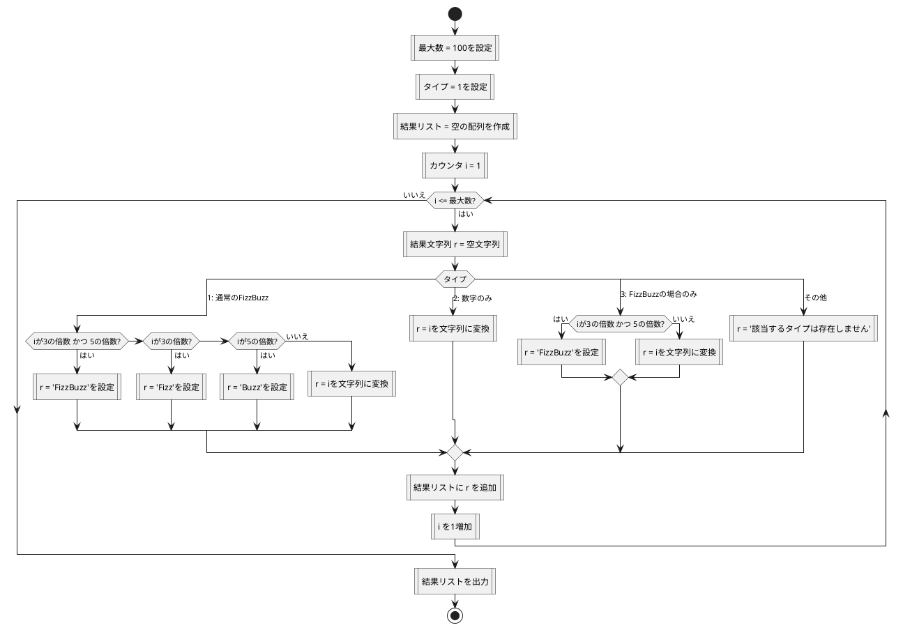
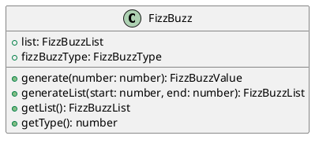
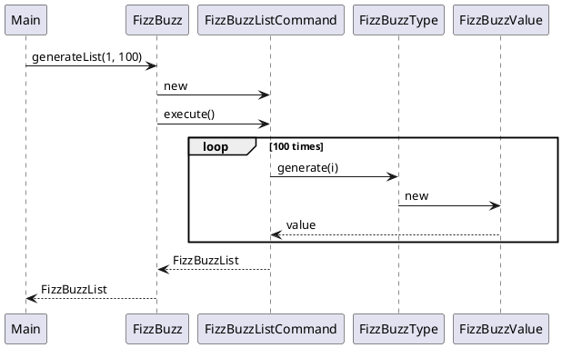
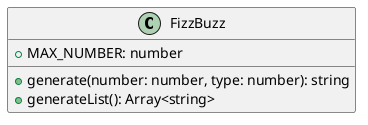
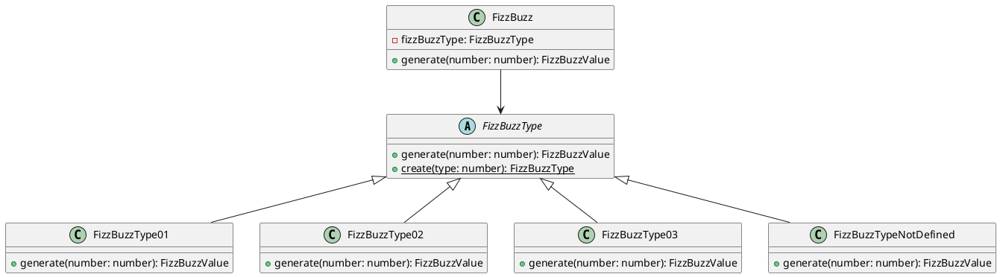
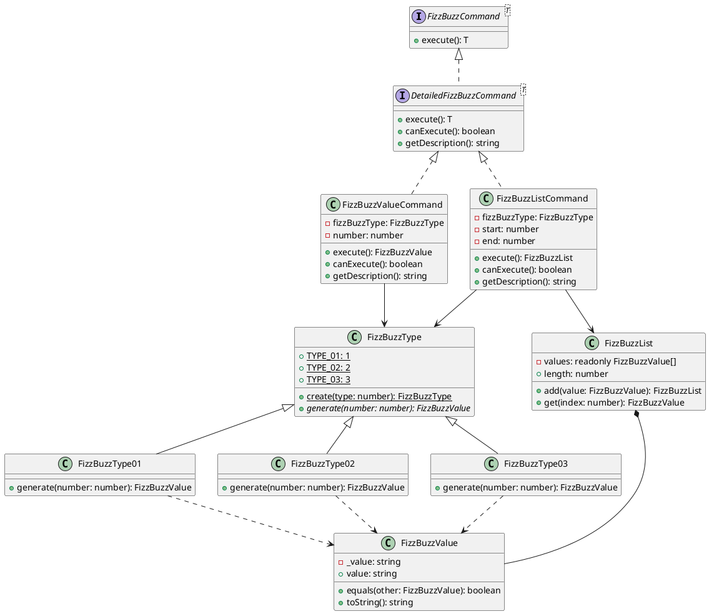
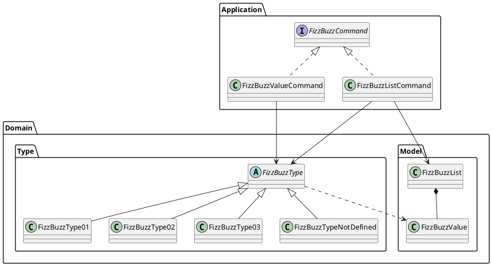

# エピソード3

## 初めに

この記事は [テスト駆動開発から始めるTypeScript入門 ~2時間でTDDとリファクタリングのエッセンスを体験する~](/ja/記事/テスト駆動開発から始めるTypeScript入門1) の続編です。

前提として エピソード１を完了して、[テスト駆動開発から始めるTypeScript入門 ~ソフトウェア開発の三種の神器を準備する~](/ja/記事/テスト駆動開発から始めるTypeScript入門2) で開発環境を構築したところから始まります。

### 概要

本記事では、 **オブジェクト指向プログラム** から **オブジェクト指向設計** そして **モジュール分割** を **テスト駆動開発** を通じて実践していきます。

#### オブジェクト指向プログラム

エピソード1で作成したプログラムの追加仕様を **テスト駆動開発** で実装します。 次に **手続き型コード** との比較から **オブジェクト指向プログラム** を構成する **カプセル化** **ポリモフィズム** **継承** という概念をコードベースの **リファクタリング** を通じて解説します。

具体的には **フィールドのカプセル** から **setterの削除** を適用することにより **カプセル化** を実現します。続いて、 **ポリモーフィズムによる条件記述の置き換え** から **State/Strategyによるタイプコードの置き換え** を適用することにより **ポリモーフィズム** の効果を体験します。そして、 **スーパークラスの抽出** から **メソッド名の変更** **メソッドの移動** の適用を通して **継承** の使い方を体験します。さらに **値オブジェクト** と **ファーストクラスコレクション** というオブジェクト指向プログラミングに必要なツールの使い方も学習します。

#### オブジェクト指向設計

次に設計の観点から **単一責任の原則** に違反している `FizzBuzz` クラスを **デザインパターン** の1つである **Commandパターン** を使ったリファクタリングである **メソッドオブジェクトによるメソッドの置き換え** を適用してクラスの責務を分割します。オブジェクト指向設計のイディオムである **デザインパターン** として **Commandパターン** 以外に **Value Objectパターン** **Factory Methodパターン** **Strategyパターン** を **リファクタリング** を適用する過程ですでに実現していたことを説明します。そして、**オープン・クローズドの原則** を満たすコードに **リファクタリング** されたことで既存のコードを変更することなく振る舞いを変更できるようになることを解説します。

加えて、正常系の設計を改善した後 **アサーションの導入** **例外によるエラーコードの置き換え** といった例外系の **リファクタリング** を適用します。最後に **ポリモーフィズム** の応用として **特殊ケースの導入** の適用による **Null Objectパターン** を使った **オープン・クローズドの原則** に従った安全なコードの追加方法を解説します。

#### モジュールの分割

仕上げは、**モノリシック** なファイルから個別のクラスモジュールへの分割を **ドメインオブジェクト** の抽出を通して **ドメインモデル** へと整理することにより **モジュール分割** を実現することを体験してもらいます。最後に **良いコード** と **良い設計** について考えます。

##### Before



##### After



## オブジェクト指向から始めるテスト駆動開発

### テスト駆動開発

エピソード1で作成したプログラムに以下の仕様を追加します。

仕様

    1 から 100 までの数をプリントするプログラムを書け。
    ただし 3 の倍数のときは数の代わりに｢Fizz｣と、5 の倍数のときは｢Buzz｣とプリントし、
    3 と 5 両方の倍数の場合には｢FizzBuzz｣とプリントすること。
    タイプごとに出力を切り替えることができる。
    タイプ１は通常、タイプ２は数字のみ、タイプ３は FizzBuzz の場合のみをプリントする。

早速開発に取り掛かりましょう。エピソード2で開発環境の自動化をしているので以下のコマンドを実行するだけで開発を始めることができます。

```bash
$ npm run test:watch
```

`vitest` の watch モードが起動するとコードの変更を監視して自動的にテストが実行されます。もしくは別のターミナルを開いて以下のコマンドでテストを実行することもできます。

```bash
$ npm run test
```

```bash
$ npm run build
$ npm run dev
```

#### TODOリスト作成

まずは追加仕様を **TODOリスト** に落とし込んでいきます。

TODOリスト

- タイプ1の場合
  - 数を文字列にして返す
    - 1を渡したら文字列"1"を返す

#### タイプ1の場合

**テストファースト** **アサートファースト** で最初に失敗するテストから始めます。テストを追加しましょう。

ここでは既存の `FizzBuzz.generate` メソッドにタイプを **引数** として追加することで対応できるように変更してみたいと思います。まず、 `FizzBuzz.test.ts` ファイルに以下のテストコードを追加します。

```typescript
  describe('タイプごとに出力を切り替えることができる', () => {
    describe('タイプ1の場合', () => {
      it('1を渡したら文字列"1"を返す', () => {
        expect(FizzBuzz.generate(1, 1)).toBe('1')
      })
    })
  })
```

```bash
 FAIL  src/FizzBuzz.test.ts > タイプごとに出力を切り替えることができる > タイプ1の場合 > 1を渡したら文字列"1"を返す
TypeError: FizzBuzz.generate is not a function
```

`TypeError: FizzBuzz.generate is not a function` **メソッドが存在しない** と指摘されていますね。現在の `FizzBuzz` クラスは **インスタンスメソッド** として実装されているため、**静的メソッド** として呼び出すことはできません。

ここは **デフォルト引数** を使って既存のメソッドを変更してみましょう。

> メソッドの引数にはデフォルト値を指定する定義方法があります。これは、メソッドの引数を省略した場合に割り当てられる値です。

```typescript
export class FizzBuzz {
  private list: FizzBuzzList = new FizzBuzzList()
  private fizzBuzzType: FizzBuzzType

  constructor(fizzBuzzType: FizzBuzzType) {
    this.fizzBuzzType = fizzBuzzType
  }

  static generate(number: number, type: number = 1): string {
    const fizzBuzz = FizzBuzz.create(type)
    return fizzBuzz.generate(number).value
  }

  static create(type: number): FizzBuzz {
    return new FizzBuzz(FizzBuzzType.create(type))
  }

  generate(number: number): FizzBuzzValue {
    const command = new FizzBuzzValueCommand(this.fizzBuzzType, number)
    return command.execute()
  }
  
  // ...existing code...
}
```

```bash
✓ src/FizzBuzz.test.ts (23 tests) 8ms
   ✓ FizzBuzz > 数を文字列にして返す > 1を渡したら文字列"1"を返す 1ms
   ✓ FizzBuzz > 数を文字列にして返す > 2を渡したら文字列"2"を返す 1ms
   ✓ FizzBuzz > 3の倍数の場合 > 3を渡したら文字列"Fizz"を返す 1ms
   ✓ FizzBuzz > 5の倍数の場合 > 5を渡したら文字列"Buzz"を返す 1ms
   ✓ FizzBuzz > 3と5の両方の倍数の場合 > 15を渡したら文字列"FizzBuzz"を返す 1ms
   ✓ FizzBuzz > 1から100までの数をプリントする > 1から100までの数を配列で返す 1ms
   ✓ FizzBuzz > タイプごとに出力を切り替えることができる > タイプ1の場合 > 1を渡したら文字列"1"を返す 1ms
   ✓ FizzBuzz > タイプごとに出力を切り替えることができる > タイプ1の場合 > 配列の状態を保持する 1ms
   ✓ FizzBuzz > タイプごとに出力を切り替えることができる > タイプ2の場合 > 1を渡したら文字列"1"を返す 1ms
   ✓ FizzBuzz > タイプごとに出力を切り替えることができる > タイプ2の場合 > 3を渡したら文字列"3"を返す 1ms
   ✓ FizzBuzz > タイプごとに出力を切り替えることができる > タイプ2の場合 > 5を渡したら文字列"5"を返す 1ms
   ✓ FizzBuzz > タイプごとに出力を切り替えることができる > タイプ2の場合 > 15を渡したら文字列"15"を返す 1ms
   ✓ FizzBuzz > タイプごとに出力を切り替えることができる > タイプ2の場合 > 配列の状態を保持する 1ms
   ✓ FizzBuzz > タイプごとに出力を切り替えることができる > タイプ3の場合 > 1を渡したら文字列"1"を返す 1ms
   ✓ FizzBuzz > タイプごとに出力を切り替えることができる > タイプ3の場合 > 3を渡したら文字列"3"を返す 1ms
   ✓ FizzBuzz > タイプごとに出力を切り替えることができる > タイプ3の場合 > 5を渡したら文字列"5"を返す 1ms
   ✓ FizzBuzz > タイプごとに出力を切り替えることができる > タイプ3の場合 > 15を渡したら文字列"FizzBuzz"を返す 1ms
   ✓ FizzBuzz > タイプごとに出力を切り替えることができる > タイプ3の場合 > 配列の状態を保持する 1ms
   ✓ FizzBuzz > タイプごとに出力を切り替えることができる > それ以外のタイプの場合 > 例外を投げる 1ms
   ✓ FizzBuzz > タイプごとに出力を切り替えることができる > ファクトリメソッド経由での作成 > タイプ1を指定してFizzBuzzを作成できる 1ms
   ✓ FizzBuzz > タイプごとに出力を切り替えることができる > ファクトリメソッド経由での作成 > タイプ2を指定してFizzBuzzを作成できる 1ms
   ✓ FizzBuzz > タイプごとに出力を切り替えることができる > ファクトリメソッド経由での作成 > タイプ3を指定してFizzBuzzを作成できる 1ms
```

テストは無事通りました。ここでコミットしておきます。

```bash
$ git add .
$ git commit -m 'test: タイプ1の場合'
```

追加仕様の取っ掛かりができました。既存のテストを流用したいので先程作成したテストを削除して以下のように新しいグループ内に既存テストコードを移動しましょう。

```typescript
describe('FizzBuzz', () => {
  describe('数を文字列にして返す', () => {
    describe('タイプ1の場合', () => {
      let fizzBuzz: FizzBuzz

      beforeEach(() => {
        fizzBuzz = new FizzBuzz(new FizzBuzzType01())
      })

      it('1を渡したら文字列"1"を返す', () => {
        expect(fizzBuzz.generate(1).value).toBe('1')
      })

      it('2を渡したら文字列"2"を返す', () => {
        expect(fizzBuzz.generate(2).value).toBe('2')
      })

      describe('3の倍数の場合', () => {
        it('3を渡したら文字列"Fizz"を返す', () => {
          expect(fizzBuzz.generate(3).value).toBe('Fizz')
        })
      })

      describe('5の倍数の場合', () => {
        it('5を渡したら文字列"Buzz"を返す', () => {
          expect(fizzBuzz.generate(5).value).toBe('Buzz')
        })
      })

      describe('3と5の両方の倍数の場合', () => {
        it('15を渡したら文字列"FizzBuzz"を返す', () => {
          expect(fizzBuzz.generate(15).value).toBe('FizzBuzz')
        })
      })

      describe('1から100までの数をプリントする', () => {
        it('1から100までの数を配列で返す', () => {
          const result = fizzBuzz.generateList(1, 100)
          expect(result.length).toBe(100)
          expect(result.get(0).value).toBe('1')
          expect(result.get(1).value).toBe('2')
          expect(result.get(2).value).toBe('Fizz')
          expect(result.get(4).value).toBe('Buzz')
          expect(result.get(14).value).toBe('FizzBuzz')
          expect(result.get(99).value).toBe('Buzz')
        })

        it('配列の状態を保持する', () => {
          const result = fizzBuzz.generateList(1, 100)
          expect(fizzBuzz.getList()).toEqual(result)
        })
      })
    })
  })
})
```

テストコードが壊れていないことを確認したらコミットしておきます。

```bash
$ git add .
$ git commit -m 'refactor: メソッドのインライン化'
```

TODOリスト

- タイプ1の場合
  - 数を文字列にして返す
    - ~~1を渡したら文字列"1"を返す~~
  - 3 の倍数のときは数の代わりに｢Fizz｣と返す
    - ~~3を渡したら文字列"Fizz"を返す~~
  - 5 の倍数のときは｢Buzz｣と返す
    - ~~5を渡したら文字列"Buzz"を返す~~
  - 3 と 5 両方の倍数の場合には｢FizzBuzz｣と返す
    - ~~15を渡したら文字列"FizzBuzz"を返す~~
- タイプ2の場合
  - 数を文字列にして返す
    - 1を渡したら文字列"1"を返す
  - 3 の倍数のときは数を文字列にして返す
    - 3を渡したら文字列"3"を返す
  - 5 の倍数のときは数を文字列にして返す
    - 5を渡したら文字列"5"を返す
  - 3 と 5 両方の倍数の場合には数を文字列にして返す
    - 15を渡したら文字列"15"を返す
- タイプ3の場合
  - 数を文字列にして返す
    - 1を渡したら文字列"1"を返す
  - 3 の倍数のときは数を文字列にして返す
    - 3を渡したら文字列"3"を返す
  - 5 の倍数のときは数を文字列にして返す
    - 5を渡したら文字列"5"を返す
  - 3 と 5 両方の倍数の場合には｢FizzBuzz｣と返す
    - 15を渡したら文字列"FizzBuzz"を返す

#### タイプ2の場合

TODOリスト

- ~~タイプ1の場合~~
- タイプ2の場合
  - 数を文字列にして返す
    - 1を渡したら文字列"1"を返す
  - 3 の倍数のときは数を文字列にして返す
    - 3を渡したら文字列"3"を返す
  - 5 の倍数のときは数を文字列にして返す
    - 5を渡したら文字列"5"を返す
  - 3 と 5 両方の倍数の場合には数を文字列にして返す
    - 15を渡したら文字列"15"を返す
- タイプ3の場合
  - 数を文字列にして返す
    - 1を渡したら文字列"1"を返す
  - 3 の倍数のときは数を文字列にして返す
    - 3を渡したら文字列"3"を返す
  - 5 の倍数のときは数を文字列にして返す
    - 5を渡したら文字列"5"を返す
  - 3 と 5 両方の倍数の場合には｢FizzBuzz｣と返す
    - 15を渡したら文字列"FizzBuzz"を返す

続いて、タイプ2の場合に取り掛かりましょう。

```typescript
    describe('タイプ2の場合', () => {
      let fizzBuzz: FizzBuzz

      beforeEach(() => {
        fizzBuzz = new FizzBuzz(new FizzBuzzType02())
      })

      describe('その他の場合', () => {
        it('1を渡したら文字列"1"を返す', () => {
          expect(fizzBuzz.generate(1).value).toBe('1')
        })
      })
    })
```

すでに `FizzBuzzType02` クラスが実装されているため、テストはすぐに通ります。

```bash
✓ src/FizzBuzz.test.ts (24 tests) 8ms
```

テストが通ったのでテストケースを追加します。ここはタイプ1の場合をコピーして編集すれば良いでしょう。

```typescript
    describe('タイプ2の場合', () => {
      let fizzBuzz: FizzBuzz

      beforeEach(() => {
        fizzBuzz = new FizzBuzz(new FizzBuzzType02())
      })

      describe('3の倍数の場合', () => {
        it('3を渡したら文字列"3"を返す', () => {
          expect(fizzBuzz.generate(3).value).toBe('3')
        })
      })

      describe('5の倍数の場合', () => {
        it('5を渡したら文字列"5"を返す', () => {
          expect(fizzBuzz.generate(5).value).toBe('5')
        })
      })

      describe('3と5の両方の倍数の場合', () => {
        it('15を渡したら文字列"15"を返す', () => {
          expect(fizzBuzz.generate(15).value).toBe('15')
        })
      })

      describe('その他の場合', () => {
        it('1を渡したら文字列"1"を返す', () => {
          expect(fizzBuzz.generate(1).value).toBe('1')
        })
      })
    })
```

```bash
✓ src/FizzBuzz.test.ts (27 tests) 8ms
```

テストは通りました。コミットしておきます。

```bash
$ git add .
$ git commit -m 'test: タイプ2の場合'
```

#### タイプ3の場合

TODOリスト

- ~~タイプ1の場合~~
- ~~タイプ2の場合~~
- タイプ3の場合
  - 数を文字列にして返す
    - 1を渡したら文字列"1"を返す
  - 3 の倍数のときは数を文字列にして返す
    - 3を渡したら文字列"3"を返す
  - 5 の倍数のときは数を文字列にして返す
    - 5を渡したら文字列"5"を返す
  - 3 と 5 両方の倍数の場合には｢FizzBuzz｣と返す
    - 15を渡したら文字列"FizzBuzz"を返す

続いて、タイプ3の場合に取り掛かりましょう。

```typescript
    describe('タイプ3の場合', () => {
      let fizzBuzz: FizzBuzz

      beforeEach(() => {
        fizzBuzz = new FizzBuzz(new FizzBuzzType03())
      })

      describe('その他の場合', () => {
        it('1を渡したら文字列"1"を返す', () => {
          expect(fizzBuzz.generate(1).value).toBe('1')
        })
      })

      describe('3の倍数の場合', () => {
        it('3を渡したら文字列"3"を返す', () => {
          expect(fizzBuzz.generate(3).value).toBe('3')
        })
      })

      describe('5の倍数の場合', () => {
        it('5を渡したら文字列"5"を返す', () => {
          expect(fizzBuzz.generate(5).value).toBe('5')
        })
      })

      describe('3と5の両方の倍数の場合', () => {
        it('15を渡したら文字列"FizzBuzz"を返す', () => {
          expect(fizzBuzz.generate(15).value).toBe('FizzBuzz')
        })
      })
    })
```

```bash
✓ src/FizzBuzz.test.ts (31 tests) 8ms
```

テストが通ったのでコミットしておきます。

```bash
$ git add .
$ git commit -m 'test: タイプ3の場合'
```

#### それ以外のタイプの場合

TODOリスト

- ~~タイプ1の場合~~
- ~~タイプ2の場合~~
- ~~タイプ3の場合~~
- それ以外のタイプの場合
  - 例外を投げる
    - 該当するタイプが存在しない場合

最後に、それ以外のタイプの場合に取り掛かりましょう。

```typescript
    describe('それ以外のタイプの場合', () => {
      it('例外を投げる', () => {
        expect(() => FizzBuzz.generate(1, 4)).toThrow('該当するタイプは存在しません')
      })
    })
```

```bash
✓ src/FizzBuzz.test.ts (32 tests) 8ms
```

既に `FizzBuzzTypeNotDefined` クラスが実装されているため、テストはすぐに通ります。

```bash
$ git add .
$ git commit -m 'test: それ以外のタイプの場合'
```

### オブジェクト指向

#### 手続き型プログラム

**オブジェクト指向** の解説の前に以下のコードを御覧ください。いわゆる **手続き型** で書かれたコードですが、これも追加仕様を満たっています。

```typescript
const MAX_NUMBER = 100
const type = 1
const list: string[] = []

for (let i = 1; i <= MAX_NUMBER; i++) {
  let r = ''
  
  switch (type) {
    case 1:
      if (i % 3 === 0 && i % 5 === 0) {
        r = 'FizzBuzz'
      } else if (i % 3 === 0) {
        r = 'Fizz'
      } else if (i % 5 === 0) {
        r = 'Buzz'
      } else {
        r = i.toString()
      }
      break
    case 2:
      r = i.toString()
      break
    case 3:
      if (i % 3 === 0 && i % 5 === 0) {
        r = 'FizzBuzz'
      } else {
        r = i.toString()
      }
      break
    default:
      r = '該当するタイプは存在しません'
  }

  list.push(r)
}

console.log(list)
```

処理の流れをフローチャートにしたものです、実態はコードに記述されている内容を記号に置き換えて人間が読めるようにしたものです。



#### オブジェクト指向プログラム

続いて、これまでに作ってきたコードがこちらになります。上記の **手続き型コード** との大きな違いとして `class` というキーワードでくくられている部分があります。

> クラスとは、大まかに説明すると何らかの値と処理（メソッド）をひとかたまりにしたものです。

```typescript
import { FizzBuzzType, FizzBuzzType01, FizzBuzzType02 } from './domain/type/FizzBuzzType'
import { FizzBuzzValue } from './domain/model/FizzBuzzValue'
import { FizzBuzzList } from './domain/model/FizzBuzzList'
import { FizzBuzzValueCommand, FizzBuzzListCommand } from './application/FizzBuzzCommand'

export class FizzBuzz {
  private list: FizzBuzzList = new FizzBuzzList()
  private fizzBuzzType: FizzBuzzType

  constructor(fizzBuzzType: FizzBuzzType) {
    this.fizzBuzzType = fizzBuzzType
  }

  static create(type: number): FizzBuzz {
    return new FizzBuzz(FizzBuzzType.create(type))
  }

  generate(number: number): FizzBuzzValue {
    const command = new FizzBuzzValueCommand(this.fizzBuzzType, number)
    return command.execute()
  }

  generateList(start: number = 1, end: number = 100): FizzBuzzList {
    const command = new FizzBuzzListCommand(this.fizzBuzzType, start, end)
    this.list = command.execute()
    return this.list
  }

  getList(): FizzBuzzList {
    return this.list
  }

  getType(): number {
    return this.fizzBuzzType instanceof FizzBuzzType01 ? FizzBuzzType.TYPE_01 :
           this.fizzBuzzType instanceof FizzBuzzType02 ? FizzBuzzType.TYPE_02 : 
           FizzBuzzType.TYPE_03
  }
}
```

**UML** を使って上記のコードの構造をクラス図として表現しました。



更にシーケンス図を使って上記のコードの振る舞いを表現しました。



**手続き型コード** のフローチャートと比べてどう思われましたか？具体的な記述が少なくデータや処理の概要だけを表現しているけどFizzBuzzのルールを知っている人であれば何をやろうとしているかのイメージはつかみやすいのではないでしょうか？だから何？と思われるかもしれませんが現時点では **オブジェクト指向** において **抽象化** がキーワードだという程度の認識で十分です。オブジェクト指向の理解を深める取り掛かりにはこちらの記事を参照してください。

- [オブジェクト指向のいろは](https://qiita.com/nrslib/items/73bf176147192c402049)

オブジェクト指向の詳細は控えるとして、ここでは **カプセル化** **ポリモーフィズム** **継承** というオブジェクト指向プログラムで原則とされる概念をリファクタリングを通して体験してもらい、オブジェクト指向プログラムの感覚を掴んでもらうことを目的に解説を進めていきたいと思います。

### カプセル化

**カプセル化** とは、データとロジックを１つのクラスにまとめ、外部からのアクセスを制御することです。TypeScriptでは `private`, `protected`, `public` などのアクセス修飾子を使ってカプセル化を実現します。

#### フィールドのカプセル化



まず、データとロジックを１つのクラスにまとめていくためのリファクタリングを実施していくとします。`FizzBuzz` クラスにFizzBuzz配列を保持できるようして以下のように取得できるようにしたいと思います。

```typescript
const fizzbuzz = new FizzBuzz(new FizzBuzzType01())
fizzbuzz.generateList()
const result = fizzbuzz.getList()
```

まず、 **インスタンス変数** を追加します。次に `static` キーワードを外して **静的メソッド** から **インスタンスメソッド** に変更していきます。

> 静的メソッドはクラス自体に属するメソッドで、インスタンスを作成せずに「クラス名.メソッド名」という形で呼び出せます。

> インスタンスメソッドはコンストラクタと同じようにクラス内で定義するメソッドで、インスタンスを作成してから呼び出す必要があります。

現在のコードは既にインスタンスメソッドとして実装されているため、これまでの実装がカプセル化の原則に従って設計されていることがわかります。

```typescript
export class FizzBuzz {
  private list: FizzBuzzList = new FizzBuzzList()
  private fizzBuzzType: FizzBuzzType

  constructor(fizzBuzzType: FizzBuzzType) {
    this.fizzBuzzType = fizzBuzzType
  }

  // 静的メソッドとして外部から簡単にアクセスできるインターフェース
  static generate(number: number, type: number = 1): string {
    const fizzBuzz = FizzBuzz.create(type)
    return fizzBuzz.generate(number).value
  }

  // ファクトリメソッド
  static create(type: number): FizzBuzz {
    return new FizzBuzz(FizzBuzzType.create(type))
  }

  // インスタンスメソッド
  generate(number: number): FizzBuzzValue {
    const command = new FizzBuzzValueCommand(this.fizzBuzzType, number)
    return command.execute()
  }

  generateList(start: number = 1, end: number = 100): FizzBuzzList {
    const command = new FizzBuzzListCommand(this.fizzBuzzType, start, end)
    this.list = command.execute()
    return this.list
  }

  // 内部状態へのアクセサメソッド
  getList(): FizzBuzzList {
    return this.list
  }

  getType(): number {
    return this.fizzBuzzType instanceof FizzBuzzType01 ? FizzBuzzType.TYPE_01 :
           this.fizzBuzzType instanceof FizzBuzzType02 ? FizzBuzzType.TYPE_02 : 
           FizzBuzzType.TYPE_03
  }
}
```

このコードではすでに以下のカプセル化が実現されています：

1. **プライベートフィールド**: `private list`, `private fizzBuzzType` によってデータが保護されている
2. **アクセサメソッド**: `getList()`, `getType()` によって内部状態への安全なアクセスが提供されている
3. **ファクトリメソッド**: `create()` によってインスタンス生成ロジックがカプセル化されている

#### setterの削除

TypeScriptの実装では、すでにsetterが存在せず、オブジェクトの状態は以下の方法でのみ変更されます：

1. **コンストラクタ**: インスタンス作成時に初期状態を設定
2. **generateList()**: 内部状態（リスト）を更新する専用メソッド

```typescript
export class FizzBuzz {
  private list: FizzBuzzList = new FizzBuzzList()
  private fizzBuzzType: FizzBuzzType

  constructor(fizzBuzzType: FizzBuzzType) {
    this.fizzBuzzType = fizzBuzzType  // 初期化時のみ設定
  }

  generateList(start: number = 1, end: number = 100): FizzBuzzList {
    const command = new FizzBuzzListCommand(this.fizzBuzzType, start, end)
    this.list = command.execute()  // 専用メソッドでのみ更新
    return this.list
  }

  // setterは存在しない - 外部から直接状態を変更することはできない
  getList(): FizzBuzzList {
    return this.list  // 読み取り専用アクセス
  }
}
```

この設計により、以下の利点が得られます：

1. **データの整合性**: 外部から不正な値が設定される心配がない
2. **予期しない副作用の防止**: オブジェクトの状態が予期しないタイミングで変更されない
3. **変更の追跡**: 状態の変更が特定のメソッドに限定されるため、バグの原因を特定しやすい

コミットしておきます：

```bash
$ git add .
$ git commit -m 'refactor: カプセル化の実装'
```

### ポリモーフィズム

**ポリモーフィズム**（多態性）とは、同じインターフェースを持つ異なるオブジェクトを、その違いを意識することなく統一的に扱えることです。TypeScriptでは継承とインターフェース、抽象クラスを使ってポリモーフィズムを実現します。

#### ポリモーフィズムによる条件記述の置き換え 1

現在のコードでは、タイプによる条件分岐の代わりに、各タイプに対応する専用のクラス（`FizzBuzzType01`, `FizzBuzzType02`, `FizzBuzzType03`）を使用しています。

```typescript
// Before: 条件分岐による実装（手続き型の場合）
switch (type) {
  case 1:
    if (number % 3 === 0 && number % 5 === 0) {
      return 'FizzBuzz'
    } else if (number % 3 === 0) {
      return 'Fizz'
    } else if (number % 5 === 0) {
      return 'Buzz'
    } else {
      return number.toString()
    }
  case 2:
    return number.toString()
  case 3:
    if (number % 3 === 0 && number % 5 === 0) {
      return 'FizzBuzz'
    } else {
      return number.toString()
    }
  default:
    throw new Error('該当するタイプは存在しません')
}
```

```typescript
// After: ポリモーフィズムによる実装
export abstract class FizzBuzzType {
  static readonly TYPE_01 = 1 as const
  static readonly TYPE_02 = 2 as const
  static readonly TYPE_03 = 3 as const

  // 抽象メソッド：サブクラスで必ず実装する必要がある
  abstract generate(number: number): FizzBuzzValue

  // 具象メソッド：共通の実装を提供
  static create(type: number): FizzBuzzType {
    switch (type) {
      case FizzBuzzType.TYPE_01:
        return new FizzBuzzType01()
      case FizzBuzzType.TYPE_02:
        return new FizzBuzzType02()
      case FizzBuzzType.TYPE_03:
        return new FizzBuzzType03()
      default:
        return new FizzBuzzTypeNotDefined()
    }
  }
}

export class FizzBuzzType01 extends FizzBuzzType {
  // 抽象メソッドの実装
  generate(number: number): FizzBuzzValue {
    if (number % 3 === 0 && number % 5 === 0) {
      return new FizzBuzzValue('FizzBuzz')
    } else if (number % 3 === 0) {
      return new FizzBuzzValue('Fizz')
    } else if (number % 5 === 0) {
      return new FizzBuzzValue('Buzz')
    } else {
      return new FizzBuzzValue(number.toString())
    }
  }
}

export class FizzBuzzType02 extends FizzBuzzType {
  // 抽象メソッドの実装
  generate(number: number): FizzBuzzValue {
    return new FizzBuzzValue(number.toString())
  }
}

export class FizzBuzzType03 extends FizzBuzzType {
  // 抽象メソッドの実装
  generate(number: number): FizzBuzzValue {
    if (number % 3 === 0 && number % 5 === 0) {
      return new FizzBuzzValue('FizzBuzz')
    } else {
      return new FizzBuzzValue(number.toString())
    }
  }
}
```

#### ポリモーフィズムによる条件記述の置き換え 2

さらに、Null Objectパターンを使って例外処理もポリモーフィズムで実現しています：

```typescript
export class FizzBuzzTypeNotDefined extends FizzBuzzType {
  generate(number: number): FizzBuzzValue {
    throw new InvalidTypeError(-1)
  }

  // Null Objectであることを示すメソッド
  isNull(): boolean {
    return true
  }

  // 代替動作を提供
  generateWithDefault(number: number, defaultValue: string = '?'): FizzBuzzValue {
    return new FizzBuzzValue(defaultValue)
  }
}

// 他のタイプクラスでのisNull実装
export class FizzBuzzType01 extends FizzBuzzType {
  generate(number: number): FizzBuzzValue {
    // 実装...
  }

  isNull(): boolean {
    return false
  }
}
```

##### ポリモーフィズムの利点

ポリモーフィズムの利点：

1. **条件分岐の排除**: switch文やif-else文が不要になる
2. **拡張性**: 新しいタイプを追加する際、既存のコードを変更する必要がない
3. **保守性**: 各タイプの実装が独立しているため、影響範囲が局所化される
4. **テスタビリティ**: 各タイプを個別にテストできる

```bash
$ git add .
$ git commit -m 'refactor: ポリモーフィズムによる条件記述の置き換え'
```

#### State/Strategyによるタイプコードの置き換え

現在の実装は、**Strategyパターン** を使用してタイプコードを置き換えています。



**Strategyパターン** により、実行時にアルゴリズムを切り替えることができます：

```typescript
// コンテキストクラス
export class FizzBuzz {
  private fizzBuzzType: FizzBuzzType  // 戦略オブジェクト

  constructor(fizzBuzzType: FizzBuzzType) {
    this.fizzBuzzType = fizzBuzzType
  }

  generate(number: number): FizzBuzzValue {
    // 戦略オブジェクトに処理を委譲
    return this.fizzBuzzType.generate(number)
  }
}

// 使用例：戦略の切り替え
const fizzBuzz1 = new FizzBuzz(new FizzBuzzType01())  // 通常のFizzBuzz
const fizzBuzz2 = new FizzBuzz(new FizzBuzzType02())  // 数字のみ
const fizzBuzz3 = new FizzBuzz(new FizzBuzzType03())  // FizzBuzzのみ

console.log(fizzBuzz1.generate(15).value)  // "FizzBuzz"
console.log(fizzBuzz2.generate(15).value)  // "15"
console.log(fizzBuzz3.generate(15).value)  // "FizzBuzz"
```

この実装により、**オープン・クローズドの原則**（拡張に開いて修正に閉じている）が満たされています：

- 新しいタイプを追加する場合：新しいクラスを作成するだけで既存のコードは変更不要
- 既存のタイプの動作を変更する場合：該当するクラスのみを変更すれば良い

### 継承

**継承** とは、既存のクラス（スーパークラス、基底クラス）の機能を受け継いで新しいクラス（サブクラス、派生クラス）を作成することです。TypeScriptでは `extends` キーワードを使って継承を実現します。

#### スーパークラスの抽出

現在の実装では、`FizzBuzzType` 抽象クラスがスーパークラスの役割を果たし、各具象クラスがそれを継承しています：

```typescript
// スーパークラス（抽象クラス）
export abstract class FizzBuzzType {
  // 定数の定義
  static readonly TYPE_01 = 1 as const
  static readonly TYPE_02 = 2 as const
  static readonly TYPE_03 = 3 as const

  // 抽象メソッド（サブクラスで必ず実装）
  abstract generate(number: number): string

  // 具象メソッド（共通実装）
  static create(type: number): FizzBuzzType {
    switch (type) {
      case FizzBuzzType.TYPE_01:
        return new FizzBuzzType01()
      case FizzBuzzType.TYPE_02:
        return new FizzBuzzType02()
      case FizzBuzzType.TYPE_03:
        return new FizzBuzzType03()
      default:
        return new FizzBuzzTypeNotDefined()
    }
  }

  // 保護されたヘルパーメソッド（サブクラスからのみアクセス可能）
  protected isFizz(number: number): boolean {
    return number % 3 === 0
  }

  protected isBuzz(number: number): boolean {
    return number % 5 === 0
  }

  protected isFizzBuzz(number: number): boolean {
    return this.isFizz(number) && this.isBuzz(number)
  }
}

// サブクラス（具象クラス）
export class FizzBuzzType01 extends FizzBuzzType {
  // 抽象メソッドの実装
  generate(number: number): FizzBuzzValue {
    if (number % 3 === 0 && number % 5 === 0) {
      return new FizzBuzzValue('FizzBuzz')
    } else if (number % 3 === 0) {
      return new FizzBuzzValue('Fizz')
    } else if (number % 5 === 0) {
      return new FizzBuzzValue('Buzz')
    } else {
      return new FizzBuzzValue(number.toString())
    }
  }
}
```

#### メソッド名の変更とメソッドの移動

現在の実装では、適切なメソッド名と責務の分割が既に実現されています：

1. **Factory Methodパターン**: `FizzBuzzType.create()` によりオブジェクト生成の責務を分離
2. **適切な命名**: `generate()` メソッドは明確で理解しやすい
3. **責務の分離**: 各クラスが単一の責務を持つ

継承の利点：

1. **コードの再利用**: 共通の処理をスーパークラスに集約
2. **一貫性**: 同じインターフェイスを強制
3. **拡張性**: 新しいサブクラスを簡単に追加可能
4. **保守性**: 共通部分の変更が全サブクラスに反映される

### 値オブジェクト

**値オブジェクト**（Value Object）は、値そのものを表現するオブジェクトです。以下の特徴を持ちます：

1. **不変性**（Immutability）: 一度作成されたら値を変更できない
2. **等価性**（Equality）: 値が同じであれば同じオブジェクトとして扱われる
3. **副作用の排除**: 値オブジェクトの操作は元のオブジェクトを変更しない

#### FizzBuzzValue の実装

```typescript
export class FizzBuzzValue {
  private readonly _value: string

  constructor(value: string) {
    this._value = value
  }

  get value(): string {
    return this._value
  }

  equals(other: FizzBuzzValue): boolean {
    return this._value === other._value
  }

  toString(): string {
    return this._value
  }
}
```

値オブジェクトの使用例：

```typescript
// 値オブジェクトの作成
const value1 = new FizzBuzzValue('Fizz')
const value2 = new FizzBuzzValue('Fizz')
const value3 = new FizzBuzzValue('Buzz')

// 等価性の比較
console.log(value1.equals(value2))  // true
console.log(value1.equals(value3))  // false

// 不変性：値を変更することはできない
// value1.value = 'Buzz'  // TypeScriptエラー：読み取り専用プロパティ
```

値オブジェクトの利点：

1. **型安全性**: 文字列と値オブジェクトを区別できる
2. **意図の明確化**: 単なる文字列ではなく「FizzBuzzの結果」であることが明確
3. **バグの防止**: 不正な値の代入を防ぐ
4. **テスタビリティ**: 値の比較が簡単

### ファーストクラスコレクション

**ファーストクラスコレクション**（First Class Collection）は、コレクション（配列、リスト等）を専用のクラスでラップしたオブジェクトです。

#### FizzBuzzList の実装

```typescript
export class FizzBuzzList {
  private readonly values: readonly FizzBuzzValue[]

  constructor(values: FizzBuzzValue[] = []) {
    // 防御的コピーによる不変性確保
    this.values = Object.freeze([...values])
  }

  // 要素の追加（新しいインスタンスを返す）
  add(value: FizzBuzzValue): FizzBuzzList {
    return new FizzBuzzList([...this.values, value])
  }

  // 複数要素の追加
  addAll(values: FizzBuzzValue[]): FizzBuzzList {
    return new FizzBuzzList([...this.values, ...values])
  }

  // 要素の取得
  get(index: number): FizzBuzzValue {
    if (index < 0 || index >= this.values.length) {
      throw new Error('Index out of bounds')
    }
    return this.values[index]
  }

  // 安全な要素取得（Optional的な動作）
  tryGet(index: number): FizzBuzzValue | undefined {
    if (index < 0 || index >= this.values.length) {
      return undefined
    }
    return this.values[index]
  }

  // 長さ
  get length(): number {
    return this.values.length
  }

  // 空かどうか
  isEmpty(): boolean {
    return this.values.length === 0
  }

  // 最初の要素
  first(): FizzBuzzValue {
    if (this.isEmpty()) {
      throw new Error('空のリストから最初の要素を取得できません')
    }
    return this.values[0]
  }

  // 最後の要素
  last(): FizzBuzzValue {
    if (this.isEmpty()) {
      throw new Error('空のリストから最後の要素を取得できません')
    }
    return this.values[this.values.length - 1]
  }

  // フィルタリング
  filter(predicate: (value: FizzBuzzValue) => boolean): FizzBuzzList {
    const filtered = this.values.filter(predicate)
    return new FizzBuzzList(filtered)
  }

  // マッピング
  map<T>(mapper: (value: FizzBuzzValue) => T): T[] {
    return this.values.map(mapper)
  }

  // FizzBuzzのみを取得
  onlyFizzBuzz(): FizzBuzzList {
    return this.filter(value => value.isFizzBuzz())
  }

  // Fizzのみを取得
  onlyFizz(): FizzBuzzList {
    return this.filter(value => value.isFizz())
  }

  // Buzzのみを取得
  onlyBuzz(): FizzBuzzList {
    return this.filter(value => value.isBuzz())
  }

  // 数値のみを取得
  onlyNumbers(): FizzBuzzList {
    return this.filter(value => value.isNumber())
  }

  // イテレーター実装
  *[Symbol.iterator](): Iterator<FizzBuzzValue> {
    for (const value of this.values) {
      yield value
    }
  }

  // 配列への変換（防御的コピー）
  toArray(): FizzBuzzValue[] {
    return [...this.values]
  }

  // 文字列配列への変換
  toStringArray(): string[] {
    return this.values.map(value => value.toString())
  }

  // 統計情報
  getStatistics(): {
    total: number
    fizz: number
    buzz: number
    fizzBuzz: number
    numbers: number
  } {
    let fizz = 0, buzz = 0, fizzBuzz = 0, numbers = 0

    for (const value of this.values) {
      if (value.isFizzBuzz()) {
        fizzBuzz++
      } else if (value.isFizz()) {
        fizz++
      } else if (value.isBuzz()) {
        buzz++
      } else {
        numbers++
      }
    }

    return {
      total: this.values.length,
      fizz,
      buzz,
      fizzBuzz,
      numbers
    }
  }

  // 文字列表現
  toString(): string {
    return this.values.map(v => v.toString()).join(', ')
  }

  // JSON表現
  toJSON(): string[] {
    return this.values.map(v => v.toJSON())
  }

  // 等価性
  equals(other: FizzBuzzList): boolean {
    if (!(other instanceof FizzBuzzList)) {
      return false
    }
    if (this.length !== other.length) {
      return false
    }
    for (let i = 0; i < this.length; i++) {
      if (!this.get(i).equals(other.get(i))) {
        return false
      }
    }
    return true
  }
}
```

ファーストクラスコレクションの使用例：

```typescript
// ファーストクラスコレクションの活用
const fizzBuzz = new FizzBuzz(new FizzBuzzType01())
let list = fizzBuzz.generateList(1, 20)

// 統計情報の取得
const stats = list.getStatistics()
console.log(`Fizz: ${stats.fizz}, Buzz: ${stats.buzz}, FizzBuzz: ${stats.fizzBuzz}`)

// フィルタリング
const onlyFizzBuzz = list.onlyFizzBuzz()
console.log(`FizzBuzzは${onlyFizzBuzz.length}個あります`)

// イテレーション
for (const value of list) {
  console.log(value.toString())
}

// 関数型プログラミングスタイル
const stringLengths = list
  .filter(value => value.isNumber())
  .map(value => value.toString().length)
console.log('数値の文字列長:', stringLengths)
```

### オブジェクト指向設計

ここまでの実装で基本的なオブジェクト指向の概念（カプセル化、継承、ポリモーフィズム）を体験しました。さらに高度なオブジェクト指向設計の原則と技法を学んでいきましょう。

#### SOLID原則

**SOLID原則**は、オブジェクト指向設計における5つの基本原則です。

##### 単一責任の原則（Single Responsibility Principle）

> クラスが変更される理由は一つでなければならない

現在の実装では、各クラスが明確な単一の責任を持っています：

```typescript
// ✅ 良い例：単一責任を持つクラス
export class FizzBuzzValue {
  // 責任：FizzBuzz値の表現のみ
  private readonly _value: string

  constructor(value: string) {
    this._value = value
  }

  equals(other: FizzBuzzValue): boolean {
    return this._value === other._value
  }
}

export class FizzBuzzList {
  // 責任：FizzBuzz値のコレクション管理のみ
  private readonly values: readonly FizzBuzzValue[]

  constructor(values: FizzBuzzValue[] = []) {
    this.values = Object.freeze([...values])
  }

  add(value: FizzBuzzValue): FizzBuzzList {
    return new FizzBuzzList([...this.values, value])
  }
}
```

##### オープン・クローズドの原則（Open-Closed Principle）

> ソフトウェアエンティティは拡張に対して開いていて、修正に対して閉じていなければならない

`FizzBuzzType` の設計がこの原則を実現しています：

```typescript
// ✅ 拡張に開いて修正に閉じている
export abstract class FizzBuzzType {
  abstract generate(number: number): FizzBuzzValue

  // 新しいタイプを追加する場合、このクラスは変更しない
  static create(type: number): FizzBuzzType {
    switch (type) {
      case FizzBuzzType.TYPE_01: return new FizzBuzzType01()
      case FizzBuzzType.TYPE_02: return new FizzBuzzType02()
      case FizzBuzzType.TYPE_03: return new FizzBuzzType03()
      case FizzBuzzType.TYPE_04: return new FizzBuzzType04() // 新しいタイプを追加
      default: return new FizzBuzzTypeNotDefined()
    }
  }
}

// 新しいタイプを追加（既存のクラスを変更せずに拡張）
export class FizzBuzzType04 extends FizzBuzzType {
  generate(number: number): FizzBuzzValue {
    // 7の倍数も考慮する新しいロジック
    if (number % 3 === 0 && number % 5 === 0 && number % 7 === 0) {
      return new FizzBuzzValue('FizzBuzzWow')
    } else if (number % 3 === 0 && number % 5 === 0) {
      return new FizzBuzzValue('FizzBuzz')
    } else if (number % 7 === 0) {
      return new FizzBuzzValue('Wow')
    } else if (number % 3 === 0) {
      return new FizzBuzzValue('Fizz')
    } else if (number % 5 === 0) {
      return new FizzBuzzValue('Buzz')
    } else {
      return new FizzBuzzValue(number.toString())
    }
  }
}
```

##### リスコフの置換原則（Liskov Substitution Principle）

> 派生クラスは基底クラスと置換可能でなければならない

`FizzBuzzType` のサブクラスは全て基底クラスと置換可能です：

```typescript
// ✅ どのサブクラスも同じインターフェイスで使用可能
function demonstrateLSP() {
  const types: FizzBuzzType[] = [
    new FizzBuzzType01(),
    new FizzBuzzType02(),
    new FizzBuzzType03(),
    new FizzBuzzType04()
  ]

  for (const type of types) {
    // 全てのサブクラスが同じように動作する
    const result = type.generate(15)
    console.log(result.value)
  }
}
```

##### インターフェイス分離の原則（Interface Segregation Principle）

> クライアントは使用しないメソッドに依存することを強制されるべきではない

細かく分割されたインターフェイスを設計します：

```typescript
// ✅ 必要最小限のインターフェイス
export interface Readable<T> {
  get(index: number): T
  length: number
}

export interface Addable<T> {
  add(item: T): void
}

export interface Filterable<T> {
  filter(predicate: (item: T) => boolean): T[]
}

// 必要な機能のみを実装
export class ReadOnlyFizzBuzzList implements Readable<FizzBuzzValue> {
  constructor(private readonly values: FizzBuzzValue[]) {}

  get(index: number): FizzBuzzValue {
    return this.values[index]
  }

  get length(): number {
    return this.values.length
  }
}
```

##### 依存関係逆転の原則（Dependency Inversion Principle）

> 上位レベルのモジュールは下位レベルのモジュールに依存してはならない。両方とも抽象に依存すべきである

依存性注入を使用した設計：

```typescript
// ✅ 抽象に依存する設計
export interface FizzBuzzGenerator {
  generate(number: number): FizzBuzzValue
}

export interface FizzBuzzRepository {
  save(list: FizzBuzzList): void
  load(): FizzBuzzList
}

export class FizzBuzzService {
  constructor(
    private generator: FizzBuzzGenerator,  // 具象クラスではなく抽象に依存
    private repository: FizzBuzzRepository // 具象クラスではなく抽象に依存
  ) {}

  createAndSaveList(start: number, end: number): void {
    let list = new FizzBuzzList()
    for (let i = start; i <= end; i++) {
      const value = this.generator.generate(i)
      list = list.add(value)
    }
    this.repository.save(list)
  }
}

// 具象実装
export class DatabaseFizzBuzzRepository implements FizzBuzzRepository {
  save(list: FizzBuzzList): void {
    // データベースへの保存
  }
  
  load(): FizzBuzzList {
    // データベースからの読み込み
    return new FizzBuzzList()
  }
}

export class FileFizzBuzzRepository implements FizzBuzzRepository {
  save(list: FizzBuzzList): void {
    // ファイルへの保存
  }
  
  load(): FizzBuzzList {
    // ファイルからの読み込み
    return new FizzBuzzList()
  }
}
```

#### デザインパターンの応用

##### Builderパターン

複雑なオブジェクトの構築を段階的に行います：

```typescript
export class FizzBuzzListBuilder {
  private values: FizzBuzzValue[] = []
  private type: FizzBuzzType = new FizzBuzzType01()

  withType(type: FizzBuzzType): FizzBuzzListBuilder {
    this.type = type
    return this
  }

  addRange(start: number, end: number): FizzBuzzListBuilder {
    for (let i = start; i <= end; i++) {
      this.values.push(this.type.generate(i))
    }
    return this
  }

  addNumbers(numbers: number[]): FizzBuzzListBuilder {
    for (const number of numbers) {
      this.values.push(this.type.generate(number))
    }
    return this
  }

  build(): FizzBuzzList {
    return new FizzBuzzList([...this.values])
  }
}

// 使用例
const list = new FizzBuzzListBuilder()
  .withType(new FizzBuzzType01())
  .addRange(1, 50)
  .addNumbers([100, 200, 300])
  .build()
```

##### Observerパターン

オブジェクトの状態変化を監視します：

```typescript
export interface FizzBuzzObserver {
  onValueGenerated(value: FizzBuzzValue): void
  onListCompleted(list: FizzBuzzList): void
}

export class FizzBuzzGenerator {
  private observers: FizzBuzzObserver[] = []

  addObserver(observer: FizzBuzzObserver): void {
    this.observers.push(observer)
  }

  removeObserver(observer: FizzBuzzObserver): void {
    const index = this.observers.indexOf(observer)
    if (index >= 0) {
      this.observers.splice(index, 1)
    }
  }

  generateList(start: number, end: number, type: FizzBuzzType): FizzBuzzList {
    let list = new FizzBuzzList()
    
    for (let i = start; i <= end; i++) {
      const value = type.generate(i)
      list = list.add(value)
      
      // 観察者に通知
      this.observers.forEach(observer => observer.onValueGenerated(value))
    }
    
    // 完了を通知
    this.observers.forEach(observer => observer.onListCompleted(list))
    
    return list
  }
}

// 観察者の実装例
export class ConsoleLoggingObserver implements FizzBuzzObserver {
  onValueGenerated(value: FizzBuzzValue): void {
    console.log(`Generated: ${value.toString()}`)
  }

  onListCompleted(list: FizzBuzzList): void {
    console.log(`List completed with ${list.length} items`)
  }
}

export class StatisticsObserver implements FizzBuzzObserver {
  private stats = { fizz: 0, buzz: 0, fizzBuzz: 0, numbers: 0 }

  onValueGenerated(value: FizzBuzzValue): void {
    if (value.isFizzBuzz()) this.stats.fizzBuzz++
    else if (value.isFizz()) this.stats.fizz++
    else if (value.isBuzz()) this.stats.buzz++
    else this.stats.numbers++
  }

  onListCompleted(list: FizzBuzzList): void {
    console.log('Statistics:', this.stats)
  }
}
```

##### Decoratorパターン

オブジェクトの機能を動的に拡張します：

```typescript
export interface FizzBuzzProcessor {
  process(value: FizzBuzzValue): FizzBuzzValue
}

export class BaseFizzBuzzProcessor implements FizzBuzzProcessor {
  process(value: FizzBuzzValue): FizzBuzzValue {
    return value
  }
}

export class UpperCaseDecorator implements FizzBuzzProcessor {
  constructor(private processor: FizzBuzzProcessor) {}

  process(value: FizzBuzzValue): FizzBuzzValue {
    const processed = this.processor.process(value)
    return new FizzBuzzValue(processed.value.toUpperCase())
  }
}

export class PrefixDecorator implements FizzBuzzProcessor {
  constructor(
    private processor: FizzBuzzProcessor,
    private prefix: string
  ) {}

  process(value: FizzBuzzValue): FizzBuzzValue {
    const processed = this.processor.process(value)
    return new FizzBuzzValue(this.prefix + processed.value)
  }
}

// 使用例：複数のデコレータを組み合わせ
const processor = new PrefixDecorator(
  new UpperCaseDecorator(
    new BaseFizzBuzzProcessor()
  ),
  '>>> '
)

const result = processor.process(new FizzBuzzValue('fizz'))
console.log(result.value) // ">>> FIZZ"
```

##### Template Methodパターン

アルゴリズムの骨格を定義し、具体的なステップをサブクラスで実装します：

```typescript
export abstract class FizzBuzzAlgorithm {
  // テンプレートメソッド
  public execute(number: number): FizzBuzzValue {
    if (!this.isValidNumber(number)) {
      throw new Error('Invalid number')
    }
    
    const processed = this.preProcess(number)
    const result = this.doGenerate(processed)
    return this.postProcess(result)
  }

  // 共通の検証ロジック
  protected isValidNumber(number: number): boolean {
    return number > 0
  }

  // フック：サブクラスで必要に応じてオーバーライド
  protected preProcess(number: number): number {
    return number
  }

  // 抽象メソッド：サブクラスで必ず実装
  protected abstract doGenerate(number: number): FizzBuzzValue

  // フック：サブクラスで必要に応じてオーバーライド
  protected postProcess(result: FizzBuzzValue): FizzBuzzValue {
    return result
  }
}

export class StandardFizzBuzzAlgorithm extends FizzBuzzAlgorithm {
  protected doGenerate(number: number): FizzBuzzValue {
    if (number % 15 === 0) return new FizzBuzzValue('FizzBuzz')
    if (number % 3 === 0) return new FizzBuzzValue('Fizz')
    if (number % 5 === 0) return new FizzBuzzValue('Buzz')
    return new FizzBuzzValue(number.toString())
  }
}

export class LoggingFizzBuzzAlgorithm extends FizzBuzzAlgorithm {
  protected preProcess(number: number): number {
    console.log(`Processing number: ${number}`)
    return number
  }

  protected doGenerate(number: number): FizzBuzzValue {
    if (number % 15 === 0) return new FizzBuzzValue('FizzBuzz')
    if (number % 3 === 0) return new FizzBuzzValue('Fizz')
    if (number % 5 === 0) return new FizzBuzzValue('Buzz')
    return new FizzBuzzValue(number.toString())
  }

  protected postProcess(result: FizzBuzzValue): FizzBuzzValue {
    console.log(`Generated: ${result.value}`)
    return result
  }
}
```

#### ステップ7: Commandパターンの詳細実装

##### Commandインターフェースの設計

```typescript
// ジェネリクスを使用したCommandインターフェース
export interface FizzBuzzCommand<T> {
  execute(): T
}

// より詳細なCommandインターフェース
export interface DetailedFizzBuzzCommand<T> extends FizzBuzzCommand<T> {
  canExecute(): boolean      // 実行可能かどうか
  undo?(): void             // 元に戻す（オプション）
  getDescription(): string   // コマンドの説明
}
```

##### 具象Commandの実装

```typescript
// 単一値生成Command
export class FizzBuzzValueCommand implements DetailedFizzBuzzCommand<FizzBuzzValue> {
  private readonly fizzBuzzType: FizzBuzzType
  private readonly number: number

  constructor(fizzBuzzType: FizzBuzzType, number: number) {
    this.fizzBuzzType = fizzBuzzType
    this.number = number
  }

  execute(): FizzBuzzValue {
    if (!this.canExecute()) {
      throw new Error('コマンドを実行できません')
    }
    return this.fizzBuzzType.generate(this.number)
  }

  canExecute(): boolean {
    return this.number > 0
  }

  getDescription(): string {
    return `数値 ${this.number} に対してFizzBuzz変換を実行`
  }
}

// リスト生成Command
export class FizzBuzzListCommand implements DetailedFizzBuzzCommand<FizzBuzzList> {
  private readonly fizzBuzzType: FizzBuzzType
  private readonly start: number
  private readonly end: number

  constructor(fizzBuzzType: FizzBuzzType, start: number, end: number) {
    this.fizzBuzzType = fizzBuzzType
    this.start = start
    this.end = end
  }

  execute(): FizzBuzzList {
    if (!this.canExecute()) {
      throw new Error('コマンドを実行できません')
    }

    let list = new FizzBuzzList()
    for (let i = this.start; i <= this.end; i++) {
      const command = new FizzBuzzValueCommand(this.fizzBuzzType, i)
      const value = command.execute()
      list = list.add(value)
    }
    return list
  }

  canExecute(): boolean {
    return this.start > 0 && this.end >= this.start
  }

  getDescription(): string {
    return `${this.start} から ${this.end} までのFizzBuzzリストを生成`
  }
}

// 条件付きリスト生成Command
export class ConditionalFizzBuzzListCommand implements DetailedFizzBuzzCommand<FizzBuzzList> {
  private readonly fizzBuzzType: FizzBuzzType
  private readonly numbers: number[]
  private readonly condition: (value: FizzBuzzValue) => boolean

  constructor(
    fizzBuzzType: FizzBuzzType, 
    numbers: number[], 
    condition: (value: FizzBuzzValue) => boolean
  ) {
    this.fizzBuzzType = fizzBuzzType
    this.numbers = numbers
    this.condition = condition
  }

  execute(): FizzBuzzList {
    if (!this.canExecute()) {
      throw new Error('コマンドを実行できません')
    }

    let list = new FizzBuzzList()
    for (const number of this.numbers) {
      const command = new FizzBuzzValueCommand(this.fizzBuzzType, number)
      const value = command.execute()
      if (this.condition(value)) {
        list = list.add(value)
      }
    }
    return list
  }

  canExecute(): boolean {
    return this.numbers.length > 0 && this.numbers.every(n => n > 0)
  }

  getDescription(): string {
    return `条件に一致する${this.numbers.length}個の数値からFizzBuzzリストを生成`
  }
}
```

##### Command実行器の実装

```typescript
// Command実行器
export class FizzBuzzCommandInvoker {
  private history: DetailedFizzBuzzCommand<any>[] = []

  execute<T>(command: DetailedFizzBuzzCommand<T>): T {
    console.log(`実行: ${command.getDescription()}`)
    
    if (!command.canExecute()) {
      throw new Error(`コマンドを実行できません: ${command.getDescription()}`)
    }

    const result = command.execute()
    this.history.push(command)
    
    console.log(`完了: ${command.getDescription()}`)
    return result
  }

  getHistory(): string[] {
    return this.history.map(cmd => cmd.getDescription())
  }

  clearHistory(): void {
    this.history = []
  }
}
```

##### マクロCommandの実装

```typescript
// 複数のCommandを組み合わせるマクロCommand
export class FizzBuzzMacroCommand implements DetailedFizzBuzzCommand<FizzBuzzList[]> {
  private readonly commands: FizzBuzzListCommand[]

  constructor(commands: FizzBuzzListCommand[]) {
    this.commands = commands
  }

  execute(): FizzBuzzList[] {
    if (!this.canExecute()) {
      throw new Error('マクロコマンドを実行できません')
    }

    return this.commands.map(command => command.execute())
  }

  canExecute(): boolean {
    return this.commands.length > 0 && this.commands.every(cmd => cmd.canExecute())
  }

  getDescription(): string {
    return `${this.commands.length}個のコマンドを順次実行`
  }
}
```

### 例外



ここまでは、正常系をリファクタリングして設計を改善してきました。しかし、アプリケーションは例外系も考慮する必要があります。続いて、**アサーションの導入** を適用した例外系のリファクタリングに取り組むとしましょう。

> アサーションの導入
> 
> 前提を明示するためのすぐれたテクニックとして、アサーションを記述する方法があります。
> 
> —  リファクタリング(第2版) 

#### アサーションの導入

まず、**メソッドオブジェクト** の `FizzBuzzValueCommand` にマイナスの値が渡された場合の振る舞いをどうするか考えます。ここでは正の値のみ許可する振る舞いにしたいので以下のテストコードを追加します。

```typescript
describe('例外ケース', () => {
  test('値は正の値のみ許可する', () => {
    expect(() => {
      new FizzBuzzValueCommand(
        FizzBuzzType.create(FizzBuzzType.TYPE_01),
        -1
      ).execute()
    }).toThrow(AssertionFailedError)
  })
})
```

テストを通すためアサーションクラスを追加します。TypeScriptでは **クラス** を使います。

```typescript
export class AssertionFailedError extends Error {
  constructor(message: string = 'Assertion Failed') {
    super(message)
    this.name = 'AssertionFailedError'
  }
}

export function assert(condition: boolean, message?: string): void {
  if (!condition) {
    throw new AssertionFailedError(message)
  }
}
```

アサーションを使用した値オブジェクトの実装：

```typescript
export class FizzBuzzValue {
  private readonly _value: string

  constructor(value: string) {
    assert(value !== null && value !== undefined, '値は必須です')
    this._value = value
  }

  get value(): string {
    return this._value
  }

  equals(other: FizzBuzzValue): boolean {
    assert(other instanceof FizzBuzzValue, '比較対象はFizzBuzzValueである必要があります')
    return this._value === other._value
  }

  toString(): string {
    return this._value
  }

  toJSON(): string {
    return this._value
  }

  // 値の種別を判定するメソッド
  isFizz(): boolean {
    return this._value === 'Fizz'
  }

  isBuzz(): boolean {
    return this._value === 'Buzz'
  }

  isFizzBuzz(): boolean {
    return this._value === 'FizzBuzz'
  }

  isNumber(): boolean {
    return /^\d+$/.test(this._value)
  }
}
```

ファーストクラスコレクションにもアサーションを追加：

```typescript
export class FizzBuzzList {
  private readonly values: readonly FizzBuzzValue[]
  private static readonly MAX_COUNT = 100

  constructor(values: FizzBuzzValue[] = []) {
    assert(values.length <= FizzBuzzList.MAX_COUNT, `上限は${FizzBuzzList.MAX_COUNT}件までです`)
    this.values = Object.freeze([...values])
  }

  add(value: FizzBuzzValue): FizzBuzzList {
    assert(value instanceof FizzBuzzValue, '追加する値はFizzBuzzValueである必要があります')
    return new FizzBuzzList([...this.values, value])
  }

  get(index: number): FizzBuzzValue {
    assert(index >= 0 && index < this.values.length, 'インデックスが範囲外です')
    return this.values[index]
  }

  // ...existing code...
}
```

CommandクラスにもPreconditionアサーションを追加：

```typescript
export class FizzBuzzValueCommand implements DetailedFizzBuzzCommand<FizzBuzzValue> {
  private readonly fizzBuzzType: FizzBuzzType
  private readonly number: number

  constructor(fizzBuzzType: FizzBuzzType, number: number) {
    assert(fizzBuzzType instanceof FizzBuzzType, 'fizzBuzzTypeは有効なFizzBuzzTypeである必要があります')
    assert(number > 0, '数値は正の値である必要があります')
    
    this.fizzBuzzType = fizzBuzzType
    this.number = number
  }

  execute(): FizzBuzzValue {
    // Precondition：実行前の前提条件をチェック
    assert(this.canExecute(), 'コマンドが実行可能な状態である必要があります')
    
    const result = this.fizzBuzzType.generate(this.number)
    
    // Postcondition：実行後の結果をチェック
    assert(result instanceof FizzBuzzValue, '結果はFizzBuzzValueである必要があります')
    assert(result.value !== null && result.value !== undefined, '結果の値は有効である必要があります')
    
    return result
  }

  canExecute(): boolean {
    return this.number > 0 && this.fizzBuzzType !== null
  }

  getDescription(): string {
    return `数値 ${this.number} に対してFizzBuzz変換を実行`
  }
}
```

#### 例外によるエラーコードの置き換え

**アサーションの導入** とは別のアプローチとして **例外** を返す方法もあります。 **例外によるエラーコードの置き換え** を適用してアサーションを削除しましょう。

> 例外によるエラーコードの置き換え
> 
> エラーを示す特別なコードをメソッドがリターンしている。
> 
> 代わりに例外を発生させる。
> 
> —  新装版 リファクタリング 

##### カスタム例外クラスの定義

TypeScriptでは、カスタム例外クラスを定義して意味のある例外処理を実現できます：

```typescript
// カスタム例外クラス
export class InvalidNumberError extends Error {
  constructor(number: number) {
    super(`無効な数値です: ${number}。正の値のみ有効です。`)
    this.name = 'InvalidNumberError'
  }
}

export class InvalidTypeError extends Error {
  constructor(type: number) {
    super(`無効なタイプです: ${type}。該当するタイプは存在しません。`)
    this.name = 'InvalidTypeError'
  }
}

export class MaxCountExceededError extends Error {
  constructor(count: number, maxCount: number) {
    super(`件数が上限を超えています: ${count}件。上限は${maxCount}件までです。`)
    this.name = 'MaxCountExceededError'
  }
}

export class IndexOutOfBoundsError extends Error {
  constructor(index: number, length: number) {
    super(`インデックスが範囲外です: ${index}。有効な範囲は0〜${length - 1}です。`)
    this.name = 'IndexOutOfBoundsError'
  }
}
```

##### アサーションを例外に置き換え

アサーションモジュールを削除してアサーション部分を **例外** に変更します：

```typescript
export class FizzBuzzValue {
  private readonly _value: string

  constructor(value: string) {
    if (value === null || value === undefined || value === '') {
      throw new InvalidNumberError(-1) // 不正な値として扱う
    }
    this._value = value
  }

  equals(other: FizzBuzzValue): boolean {
    if (!(other instanceof FizzBuzzValue)) {
      throw new Error('比較対象はFizzBuzzValueである必要があります')
    }
    return this._value === other._value
  }

  // ...existing code...
}

export class FizzBuzzList {
  private readonly values: readonly FizzBuzzValue[]
  private static readonly MAX_COUNT = 100

  constructor(values: FizzBuzzValue[] = []) {
    if (values.length > FizzBuzzList.MAX_COUNT) {
      throw new MaxCountExceededError(values.length, FizzBuzzList.MAX_COUNT)
    }
    this.values = Object.freeze([...values])
  }

  get(index: number): FizzBuzzValue {
    if (index < 0 || index >= this.values.length) {
      throw new IndexOutOfBoundsError(index, this.values.length)
    }
    return this.values[index]
  }

  // ...existing code...
}

export class FizzBuzzValueCommand implements DetailedFizzBuzzCommand<FizzBuzzValue> {
  private readonly fizzBuzzType: FizzBuzzType
  private readonly number: number

  constructor(fizzBuzzType: FizzBuzzType, number: number) {
    if (number <= 0) {
      throw new InvalidNumberError(number)
    }
    this.fizzBuzzType = fizzBuzzType
    this.number = number
  }

  execute(): FizzBuzzValue {
    if (!this.canExecute()) {
      throw new Error('コマンドを実行できません')
    }
    return this.fizzBuzzType.generate(this.number)
  }

  // ...existing code...
}
```

##### 例外に対応したテストコード

テストコードを修正して例外処理をテストします：

```typescript
describe('例外ケース', () => {
  test('値は正の値のみ許可する', () => {
    expect(() => {
      new FizzBuzzValueCommand(
        FizzBuzzType.create(FizzBuzzType.TYPE_01),
        -1
      )
    }).toThrow(InvalidNumberError)
  })

  test('値は正の値のみ許可する（詳細メッセージチェック）', () => {
    try {
      new FizzBuzzValueCommand(
        FizzBuzzType.create(FizzBuzzType.TYPE_01),
        -1
      )
      fail('例外が発生するはずです')
    } catch (error) {
      expect(error).toBeInstanceOf(InvalidNumberError)
      expect(error.message).toBe('無効な数値です: -1。正の値のみ有効です。')
    }
  })

  test('100より多い数を許可しない', () => {
    const values: FizzBuzzValue[] = []
    for (let i = 1; i <= 101; i++) {
      values.push(new FizzBuzzValue(i.toString()))
    }
    
    expect(() => {
      new FizzBuzzList(values)
    }).toThrow(MaxCountExceededError)
  })

  test('インデックス範囲外アクセスでエラー', () => {
    const list = new FizzBuzzList([new FizzBuzzValue('1')])
    
    expect(() => {
      list.get(1)  // 範囲外
    }).toThrow(IndexOutOfBoundsError)
  })

  test('無効なタイプでエラー', () => {
    expect(() => {
      FizzBuzzType.create(999)  // 無効なタイプ
    }).toThrow(InvalidTypeError)
  })
})
```

##### 例外の安全な処理

例外を安全に処理するためのユーティリティ関数も実装できます：

```typescript
// Result型を使った安全な処理
export type Result<T, E = Error> = {
  success: true
  value: T
} | {
  success: false
  error: E
}

export function safeExecute<T>(fn: () => T): Result<T> {
  try {
    const value = fn()
    return { success: true, value }
  } catch (error) {
    return { success: false, error: error as Error }
  }
}

// 使用例
const result = safeExecute(() => 
  new FizzBuzzValueCommand(
    FizzBuzzType.create(FizzBuzzType.TYPE_01),
    -1
  )
)

if (result.success) {
  console.log('コマンド作成成功:', result.value)
} else {
  console.log('エラー発生:', result.error.message)
}
```

再びテストが通るようになったのでコミットしておきます。

```bash
$ git add .
$ git commit -m 'refactor: 例外によるエラーコードの置き換え'
```

### モジュール分割


アプリケーションの構造が **抽象化** された結果、各モジュールの役割が明確になりました。ここでアプリケーションを実行してみましょう。

```bash
$ npm run build
$ npm run start

1
2
Fizz
4
Buzz
...
Fizz
```

#### ドメインモデル

モジュールをファイルとして分割していきます。まずは **ドメインオブジェクト** を抽出して **ドメインモデル** として整理します。

> 関連する業務データと業務ロジックを１つにまとめたこのようなオブジェクトをドメインオブジェクトと呼びます。
>
> 「ドメイン」とは、対象領域とか問題領域という意味です。業務アプリケーションの場合、そのアプリケーションが対象となる業務活動全体がドメインです。業務活動という問題領域（ドメイン）で扱うデータと業務ロジックを、オブジェクトとして表現したものドメインオブジェクトです。ドメインオブジェクトは、業務データと業務ロジックを密接に関係づけます。
>
> —  現場で役立つシステム設計の原則

> このように業務アプリケーションの対象領域（ドメイン）をオブジェクトのモデルとして整理したものをドメインモデルと呼びます。
>
> —  現場で役立つシステム設計の原則

    /main.ts
      |--src/
          |
           -- FizzBuzz.ts
           -- FizzBuzz.test.ts

    /main.ts
      |--src/
          |
          domain/
               |
               model/
                   |
                   -- FizzBuzzValue.ts
                   -- FizzBuzzList.ts
               type/
                   |
                   -- FizzBuzzType.ts
                   -- FizzBuzzType01.ts
                   -- FizzBuzzType02.ts
                   -- FizzBuzzType03.ts
                   -- FizzBuzzTypeNotDefined.ts
          application/
               |
               -- FizzBuzzCommand.ts
           -- FizzBuzz.test.ts

**値オブジェクトクラス** と **タイプクラス** を `domain` フォルダ以下に配置します。

```typescript
// domain/model/FizzBuzzValue.ts
export class FizzBuzzValue {
  readonly number: number;
  readonly value: string;

  constructor(number: number, value: string) {
    if (number < 0) {
      throw new Error('正の値のみ有効です');
    }
    this.number = number;
    this.value = value;
  }

  toString(): string {
    return `${this.number}:${this.value}`;
  }

  equals(other: FizzBuzzValue): boolean {
    return this.number === other.number && this.value === other.value;
  }
}
```

```typescript
// domain/model/FizzBuzzList.ts
import { FizzBuzzValue } from './FizzBuzzValue';

export class FizzBuzzList {
  static readonly MAX_COUNT = 100;
  private _values: FizzBuzzValue[];

  constructor(values: FizzBuzzValue[]) {
    if (values.length > FizzBuzzList.MAX_COUNT) {
      throw new Error(`上限は${FizzBuzzList.MAX_COUNT}件までです`);
    }
    this._values = values;
  }

  get values(): FizzBuzzValue[] {
    return [...this._values];
  }

  get size(): number {
    return this._values.length;
  }

  add(values: FizzBuzzValue[]): FizzBuzzList {
    return new FizzBuzzList([...this._values, ...values]);
  }

  get(index: number): FizzBuzzValue {
    return this._values[index];
  }
}
```

```typescript
// domain/type/FizzBuzzType.ts
import { FizzBuzzValue } from '../model/FizzBuzzValue';

export abstract class FizzBuzzType {
  static readonly TYPE_01 = 1 as const
  static readonly TYPE_02 = 2 as const
  static readonly TYPE_03 = 3 as const

  // 抽象メソッド：サブクラスで必ず実装する必要がある
  abstract generate(number: number): FizzBuzzValue

  // 具象メソッド：共通の実装を提供
  static create(type: number): FizzBuzzType {
    switch (type) {
      case FizzBuzzType.TYPE_01:
        return new FizzBuzzType01()
      case FizzBuzzType.TYPE_02:
        return new FizzBuzzType02()
      case FizzBuzzType.TYPE_03:
        return new FizzBuzzType03()
      default:
        return new FizzBuzzTypeNotDefined()
    }
  }

  // 保護されたヘルパーメソッド（サブクラスからのみアクセス可能）
  protected isFizz(number: number): boolean {
    return number % 3 === 0
  }

  protected isBuzz(number: number): boolean {
    return number % 5 === 0
  }

  protected isFizzBuzz(number: number): boolean {
    return this.isFizz(number) && this.isBuzz(number)
  }
}

export class FizzBuzzType01 extends FizzBuzzType {
  // 抽象メソッドの実装
  generate(number: number): FizzBuzzValue {
    if (number % 3 === 0 && number % 5 === 0) {
      return new FizzBuzzValue('FizzBuzz')
    } else if (number % 3 === 0) {
      return new FizzBuzzValue('Fizz')
    } else if (number % 5 === 0) {
      return new FizzBuzzValue('Buzz')
    } else {
      return new FizzBuzzValue(number.toString())
    }
  }
}

export class FizzBuzzType02 extends FizzBuzzType {
  // 抽象メソッドの実装
  generate(number: number): FizzBuzzValue {
    return new FizzBuzzValue(number.toString())
  }
}

export class FizzBuzzType03 extends FizzBuzzType {
  // 抽象メソッドの実装
  generate(number: number): FizzBuzzValue {
    if (number % 3 === 0 && number % 5 === 0) {
      return new FizzBuzzValue('FizzBuzz')
    } else {
      return new FizzBuzzValue(number.toString())
    }
  }
}

export class FizzBuzzTypeNotDefined extends FizzBuzzType {
  generate(number: number): FizzBuzzValue {
    return new FizzBuzzValue(number, '');
  }

  toString(): string {
    return '未定義';
  }
}
```

#### アプリケーション

続いて **アプリケーション層** の分割を行います。

> データクラスと機能クラスを分ける手続き型の設計では、アプリケーション層のクラスに業務ロジックの詳細を記述します。
>
> —  現場で役立つシステム設計の原則

ここでは **ドメインオブジェクト** を操作する **メソッドオブジェクト** を `application` フォルダ以下に配置します。

```typescript
// application/FizzBuzzCommand.ts
import { FizzBuzzType } from '../domain/type/FizzBuzzType';
import { FizzBuzzValue } from '../domain/model/FizzBuzzValue';
import { FizzBuzzList } from '../domain/model/FizzBuzzList';

export interface FizzBuzzCommand {
  execute(number: number): string | FizzBuzzValue[];
}

export class FizzBuzzValueCommand implements FizzBuzzCommand {
  private type: FizzBuzzType;

  constructor(type: FizzBuzzType) {
    this.type = type;
  }

  execute(number: number): string {
    return this.type.generate(number).value;
  }
}

export class FizzBuzzListCommand implements FizzBuzzCommand {
  private type: FizzBuzzType;

  constructor(type: FizzBuzzType) {
    this.type = type;
  }

  execute(number: number): FizzBuzzValue[] {
    const values: FizzBuzzValue[] = [];
    for (let i = 1; i <= number; i++) {
      values.push(this.type.generate(i));
    }
    return new FizzBuzzList(values).values;
  }
}
```

#### テスト

アプリケーションのメイン部分は分割できました。続いてテストも分割しましょう。

    /main.ts
      |--src/
          |
          application/
               |
               -- FizzBuzzCommand.ts
          domain/
               |
               model/
                   |
                   -- FizzBuzzValue.ts
                   -- FizzBuzzList.ts
               type/
                   |
                   -- FizzBuzzType.ts
           -- FizzBuzz.test.ts

    /main.ts
      |--src/
          |
          application/
               |
               -- FizzBuzzCommand.ts
          domain/
               |
               model/
                   |
                   -- FizzBuzzValue.ts
                   -- FizzBuzzList.ts
               type/
                   |
                   -- FizzBuzzType.ts
          test/
               |
               application/
                     |
                     -- FizzBuzzValueCommand.test.ts
                     -- FizzBuzzListCommand.test.ts
               domain/
                     |
                     model/
                           |
                           -- FizzBuzzValue.test.ts
                           -- FizzBuzzList.test.ts
               -- LearningTest.test.ts

```typescript
// test/application/FizzBuzzValueCommand.test.ts
import { FizzBuzzValueCommand } from '../../application/FizzBuzzCommand';
import { FizzBuzzType01, FizzBuzzType02, FizzBuzzType03 } from '../../domain/type/FizzBuzzType';

describe('FizzBuzzValueCommand', () => {
  describe('数を文字列にして返す', () => {
    describe('タイプ1の場合', () => {
      let fizzbuzz: FizzBuzzValueCommand;

      beforeEach(() => {
        fizzbuzz = new FizzBuzzValueCommand(new FizzBuzzType01());
      });

      describe('三の倍数の場合', () => {
        test('3を渡したら文字列Fizzを返す', () => {
          expect(fizzbuzz.execute(3)).toBe('Fizz');
        });
      });

      describe('五の倍数の場合', () => {
        test('5を渡したら文字列Buzzを返す', () => {
          expect(fizzbuzz.execute(5)).toBe('Buzz');
        });
      });

      describe('三と五の倍数の場合', () => {
        test('15を渡したら文字列FizzBuzzを返す', () => {
          expect(fizzbuzz.execute(15)).toBe('FizzBuzz');
        });
      });

      describe('その他の場合', () => {
        test('1を渡したら文字列1を返す', () => {
          expect(fizzbuzz.execute(1)).toBe('1');
        });
      });
    });

    describe('タイプ2の場合', () => {
      let fizzbuzz: FizzBuzzValueCommand;

      beforeEach(() => {
        fizzbuzz = new FizzBuzzValueCommand(new FizzBuzzType02());
      });

      describe('三の倍数の場合', () => {
        test('3を渡したら文字列3を返す', () => {
          expect(fizzbuzz.execute(3)).toBe('3');
        });
      });

      describe('五の倍数の場合', () => {
        test('5を渡したら文字列5を返す', () => {
          expect(fizzbuzz.execute(5)).toBe('5');
        });
      });

      describe('三と五の倍数の場合', () => {
        test('15を渡したら文字列15を返す', () => {
          expect(fizzbuzz.execute(15)).toBe('15');
        });
      });

      describe('その他の場合', () => {
        test('1を渡したら文字列1を返す', () => {
          expect(fizzbuzz.execute(1)).toBe('1');
        });
      });
    });

    describe('タイプ3の場合', () => {
      let fizzbuzz: FizzBuzzValueCommand;

      beforeEach(() => {
        fizzbuzz = new FizzBuzzValueCommand(new FizzBuzzType03());
      });

      describe('三の倍数の場合', () => {
        test('3を渡したら文字列3を返す', () => {
          expect(fizzbuzz.execute(3)).toBe('3');
        });
      });

      describe('五の倍数の場合', () => {
        test('5を渡したら文字列5を返す', () => {
          expect(fizzbuzz.execute(5)).toBe('5');
        });
      });

      describe('三と五の倍数の場合', () => {
        test('15を渡したら文字列FizzBuzzを返す', () => {
          expect(fizzbuzz.execute(15)).toBe('FizzBuzz');
        });
      });

      describe('その他の場合', () => {
        test('1を渡したら文字列1を返す', () => {
          expect(fizzbuzz.execute(1)).toBe('1');
        });
      });
    });
  });

  describe('例外ケース', () => {
    test('値は正の値のみ許可する', () => {
      expect(() => {
        new FizzBuzzValueCommand(
          FizzBuzzType.create(FizzBuzzType.TYPE_01)
        ).execute(-1);
      }).toThrow('正の値のみ有効です');
    });
  });
});
```

```typescript
// test/application/FizzBuzzListCommand.test.ts
import { FizzBuzzListCommand } from '../../application/FizzBuzzCommand';
import { FizzBuzzType } from '../../domain/type/FizzBuzzType';

describe('FizzBuzzListCommand', () => {
  describe('1から100までのFizzBuzzの配列を返す', () => {
    let result: FizzBuzzValue[];

    beforeEach(() => {
      const fizzbuzz = new FizzBuzzListCommand(FizzBuzzType.create(FizzBuzzType.TYPE_01));
      result = fizzbuzz.execute(100);
    });

    test('配列の初めは文字列の1を返す', () => {
      expect(result[0].value).toBe('1');
    });

    test('配列の最後は文字列のBuzzを返す', () => {
      expect(result[99].value).toBe('Buzz');
    });

    test('配列の2番目は文字列のFizzを返す', () => {
      expect(result[2].value).toBe('Fizz');
    });

    test('配列の4番目は文字列のBuzzを返す', () => {
      expect(result[4].value).toBe('Buzz');
    });

    test('配列の14番目は文字列のFitzBuzzを返す', () => {
      expect(result[14].value).toBe('FizzBuzz');
    });
  });

  describe('例外ケース', () => {
    test('100より多い数を許可しない', () => {
      expect(() => {
        new FizzBuzzListCommand(
          FizzBuzzType.create(FizzBuzzType.TYPE_01)
        ).execute(101);
      }).toThrow('上限は100件までです');
    });
  });
});
```

```bash
$ npm test

> fizz-buzz@1.0.0 test
> jest

 PASS  test/application/FizzBuzzValueCommand.test.ts
 PASS  test/application/FizzBuzzListCommand.test.ts
 PASS  test/domain/model/FizzBuzzValue.test.ts
 PASS  test/domain/model/FizzBuzzList.test.ts
 PASS  test/LearningTest.test.ts

Test Suites: 5 passed, 5 total
Tests:       40 passed, 40 total
Snapshots:   0 total
Time:        2.508 s
Ran all test suites.
```

テストが分割できたのでコミットしておきます。

```bash
$ git add .
$ git commit -m 'refactor: モジュール分割'
```

### ふりかえり

今回のチュートリアルでは、単純な FizzBuzz プログラムからはじめて、**テスト駆動開発**、**オブジェクト指向プログラミング**、**デザインパターン** を適用したより高度なソフトウェア設計まで段階的に学習しました。

#### 学習したこと

##### テスト駆動開発（TDD）

- **Red-Green-Refactor** サイクルの実践
- 小さなステップでの開発進行
- テストファーストによる仕様の明確化
- リファクタリングによる設計の改善

##### オブジェクト指向プログラミング

- **カプセル化**: データとメソッドを1つのオブジェクトにまとめる
- **継承**: 既存のクラスを拡張して新しいクラスを作成
- **ポリモーフィズム**: 同じインターフェイスで異なる振る舞いを実現
- **抽象化**: 複雑な実装を隠して単純なインターフェイスを提供

##### デザインパターン

- **Value Object**: 値を表現するオブジェクト
- **First Class Collection**: コレクションをラップするオブジェクト
- **Strategy**: アルゴリズムを交換可能にする
- **Factory Method**: オブジェクトの生成を柔軟にする
- **Command**: 処理をオブジェクトとして表現する
- **Null Object**: 特殊ケースを通常のオブジェクトとして扱う

##### リファクタリング技法

- **Extract Method**: メソッドの抽出
- **Extract Class**: クラスの抽出
- **Replace Conditional with Polymorphism**: ポリモーフィズムによる条件記述の置き換え
- **Replace Method with Method Object**: メソッドオブジェクトによるメソッドの置き換え
- **Replace Magic Number with Symbolic Constant**: マジックナンバーの置き換え

##### 設計原則

- **Single Responsibility Principle (SRP)**: 単一責任の原則
- **Open-Closed Principle (OCP)**: オープン・クローズドの原則
- **Don't Repeat Yourself (DRY)**: 重複の排除
- **Keep It Simple, Stupid (KISS)**: シンプルさの維持

##### TypeScript 特有の技術

- **型安全性**: コンパイル時の型チェック
- **インターフェイス**: 契約の定義
- **抽象クラス**: 部分的な実装を含む基底クラス
- **ジェネリクス**: 型パラメータによる再利用性
- **アクセス修飾子**: カプセル化の実現

#### 最終的なアーキテクチャ



この設計により以下の特性を実現しました：

- **保守性**: 各クラスが明確な責任を持ち、変更の影響範囲が限定される
- **拡張性**: 新しいタイプやコマンドを既存コードを変更することなく追加可能
- **テスタビリティ**: 各コンポーネントが独立してテスト可能
- **可読性**: ドメインの概念がコードに明確に表現されている

#### 今後の発展

このチュートリアルで学習した技術は、より複雑なアプリケーション開発にも応用できます：

- **ドメイン駆動設計（DDD）**: より複雑なビジネスロジックのモデリング
- **クリーンアーキテクチャ**: 依存関係の明確な分離
- **イベントソーシング**: 状態変更をイベントとして記録
- **CQRS**: コマンドとクエリの責任分離

## 参考資料

さらに深く学習するための推奨図書：

- テスト駆動開発 Kent Beck (著)
- リファクタリング(第2版) Martin Fowler (著)
- デザインパターン GoF (著)
- Clean Code Robert C. Martin (著)
- Clean Architecture Robert C. Martin (著)
- ドメイン駆動設計 Eric Evans (著)
- 現場で役立つシステム設計の原則 増田 亨 (著)

このチュートリアルを通じて、ソフトウェア開発の基礎的な技術と考え方を身につけることができました。これらの知識をベースに、より複雑で実践的なアプリケーション開発に挑戦してください。