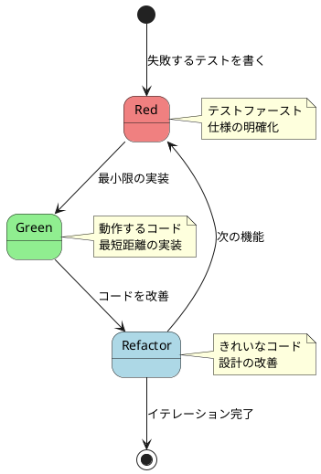
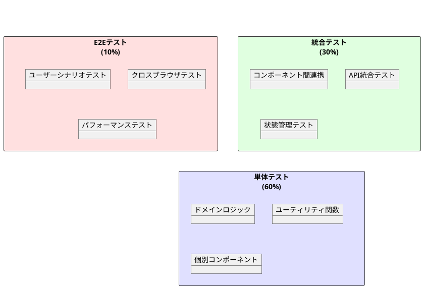
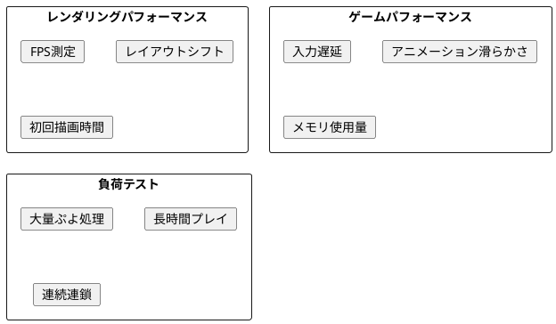

# テスト戦略

## 概要

ぷよぷよゲームの品質を保証するため、テスト駆動開発（TDD）を採用し、包括的なテスト戦略を策定します。

## TDD開発サイクル



## 3層テスト戦略



### 1. 単体テスト（Unit Tests）

**対象:**

- ドメインモデル（Puyo, Field, Game, Chain）
- ビジネスロジック（スコア計算、連鎖検出）
- ユーティリティ関数
- 個別のReactコンポーネント

**ツール:**

- Vitest: 高速なテストランナー
- React Testing Library: コンポーネントテスト
- Mock Service Worker: API モック

**テストケース例:**

```typescript
describe('Puyo', () => {
  test('同じ色のぷよを判定できる', () => {
    const puyo1 = new Puyo(PuyoColor.RED);
    const puyo2 = new Puyo(PuyoColor.RED);
    const puyo3 = new Puyo(PuyoColor.BLUE);
    
    expect(puyo1.isSameColor(puyo2)).toBe(true);
    expect(puyo1.isSameColor(puyo3)).toBe(false);
  });
});

describe('Field', () => {
  test('4つ以上連結したぷよを検出できる', () => {
    const field = new Field(6, 13);
    // ぷよを配置
    field.placePuyo(new Puyo(PuyoColor.RED), 0, 12);
    field.placePuyo(new Puyo(PuyoColor.RED), 1, 12);
    field.placePuyo(new Puyo(PuyoColor.RED), 2, 12);
    field.placePuyo(new Puyo(PuyoColor.RED), 3, 12);
    
    const connected = field.findConnectedPuyos(0, 12);
    expect(connected).toHaveLength(4);
  });
});
```

### 2. 統合テスト（Integration Tests）

**対象:**

- レイヤー間の連携
- 状態管理の統合
- イベントフローの検証

**ツール:**

- Vitest
- React Testing Library
- Testing Hooks

**テストケース例:**

```typescript
describe('GameController Integration', () => {
  test('ぷよの移動から表示更新まで', async () => {
    const { getByTestId } = render(<App />);
    const gameBoard = getByTestId('game-board');
    
    // 左移動
    fireEvent.keyDown(document, { key: 'ArrowLeft' });
    
    // フィールドの更新を確認
    await waitFor(() => {
      expect(gameBoard).toHaveTextContent('移動完了');
    });
  });
});
```

### 3. E2Eテスト（End-to-End Tests）

**対象:**

- 完全なユーザーシナリオ
- ブラウザ互換性
- パフォーマンス

**ツール:**

- Playwright: クロスブラウザ自動化
- Lighthouse: パフォーマンス測定

**テストケース例:**

```typescript
test('ゲーム開始から連鎖まで', async ({ page }) => {
  await page.goto('/');
  
  // ゲーム開始
  await page.click('button:has-text("スタート")');
  
  // ぷよ操作
  await page.keyboard.press('ArrowLeft');
  await page.keyboard.press('ArrowLeft');
  await page.keyboard.press('Space'); // ハードドロップ
  
  // 連鎖発生を確認
  await expect(page.locator('.chain-counter')).toContainText('1連鎖');
});
```

## レイヤー別テスト戦略

### プレゼンテーション層

**テスト内容:**

- コンポーネントの表示
- ユーザーインタラクション
- レスポンシブデザイン

**アプローチ:**

- スナップショットテスト
- ビジュアルリグレッションテスト
- アクセシビリティテスト

### アプリケーション層

**テスト内容:**

- ユースケースの実行
- 入力検証
- エラーハンドリング

**アプローチ:**

- モックを使用した独立テスト
- 境界値テスト
- 異常系テスト

### ドメイン層

**テスト内容:**

- ビジネスルール
- 不変条件
- ドメインイベント

**アプローチ:**

- プロパティベーステスト
- 状態遷移テスト
- イベント駆動テスト

### インフラストラクチャ層

**テスト内容:**

- 外部システム連携
- データ永続化
- パフォーマンス

**アプローチ:**

- インメモリ実装でのテスト
- 契約テスト
- 負荷テスト

## パフォーマンステスト



**パフォーマンス目標:**

- 60 FPS の維持
- 入力遅延 < 16ms
- メモリリーク 0
- 初回描画 < 3秒

## テストデータ管理

### フィクスチャ
```typescript
// テスト用フィールドデータ
export const fixtures = {
  emptyField: createEmptyField(),
  nearChain: createFieldWithPattern([
    '......',
    '......',
    '...R..',
    '..RR..',
    '..RB..',
  ]),
  gameOver: createFieldWithPattern([
    '..RB..',
    'RRBBGG',
    'RRBBGG',
    // ... 満杯状態
  ])
};
```

### ファクトリー
```typescript
// テストデータ生成
export const factories = {
  puyo: (color?: PuyoColor) => new Puyo(color || PuyoColor.RED),
  field: (width = 6, height = 13) => new Field(width, height),
  game: (status?: GameStatus) => new Game(status || GameStatus.PLAYING)
};
```

## CI/CDでのテスト実行

```yaml
# .github/workflows/test.yml
name: Test

on: [push, pull_request]

jobs:
  test:
    runs-on: ubuntu-latest
    steps:
      - uses: actions/checkout@v3
      - uses: actions/setup-node@v3
      
      - name: Install dependencies
        run: npm ci
        
      - name: Run unit tests
        run: npm run test:unit
        
      - name: Run integration tests
        run: npm run test:integration
        
      - name: Run E2E tests
        run: npm run test:e2e
        
      - name: Upload coverage
        uses: codecov/codecov-action@v3
```

## テストカバレッジ目標

### レイヤー別カバレッジ目標

| レイヤー | カバレッジ目標 |
|---------|--------------|
| ドメイン層 | 95%以上 |
| アプリケーション層 | 85%以上 |
| プレゼンテーション層 | 80%以上 |
| インフラストラクチャ層 | 70%以上 |
| **全体** | **85%以上** |

### Codecov統合設定

| 項目 | 目標値 | 闾値 |
|------|--------|------|
| 全体プロジェクト | 85% | 2% |
| 新規コード（Patch） | 90% | 5% |
| 関数カバレッジ | 90% | - |
| ブランチカバレッジ | 80% | - |

### カバレッジ管理機能

- **PRコメント**: カバレッジ変化の自動レポート
- **トレンド解析**: 長期的な品質変化の追跡
- **闾値アラート**: カバレッジ低下時のCI失敗
- **バッジ表示**: READMEでのリアルタイムステータス

## テスト実行方針

### 開発時
- ファイル保存時に関連テストを自動実行
- プリコミットフックでテスト実行
- TDDサイクルの厳守

### CI/CD
- プルリクエスト時に全テスト実行
- マージ時にE2Eテスト実行
- 定期的な負荷テスト実行

### リリース前
- 全ブラウザでのE2Eテスト
- パフォーマンステスト
- セキュリティテスト