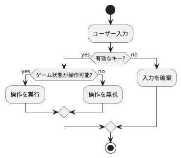
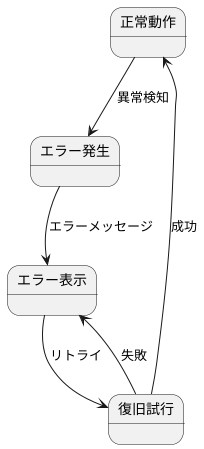
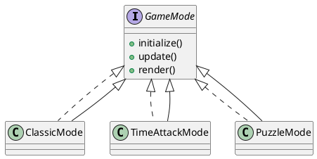
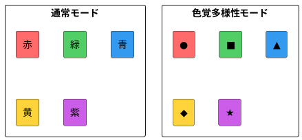

# 非機能要件定義

## 概要

ぷよぷよゲームの品質属性に関する要件を定義します。ユーザビリティ、パフォーマンス、セキュリティなどの非機能的側面を規定します。

## パフォーマンス要件

### レスポンス時間
| 操作 | 目標値 | 最大許容値 |
|------|--------|-----------|
| キー入力反応 | < 16ms | < 33ms |
| ぷよ移動・回転 | < 16ms | < 33ms |
| 画面描画更新 | 60 FPS | 30 FPS |
| ゲーム開始 | < 1秒 | < 3秒 |
| 連鎖演出開始 | < 100ms | < 200ms |

### リソース使用
| リソース | 目標値 | 最大許容値 |
|---------|--------|-----------|
| メモリ使用量 | < 100MB | < 200MB |
| CPU使用率 | < 30% | < 50% |
| 初回ロード時間 | < 3秒 | < 5秒 |
| バンドルサイズ | < 500KB | < 1MB |

### スケーラビリティ
- 同時プレイヤー数: N/A（シングルプレイヤー）
- フィールドサイズ: 6×13固定
- 最大連鎖数: 制限なし（メモリ許容範囲内）

## セキュリティ要件

### データ保護
- ローカルストレージのスコアデータ暗号化
- XSS攻撃対策（React標準機能）
- CSRFトークン不要（ステートレス）

### 入力検証


### セキュリティヘッダー
```typescript
// セキュリティヘッダー設定
{
  "Content-Security-Policy": "default-src 'self'",
  "X-Frame-Options": "DENY",
  "X-Content-Type-Options": "nosniff",
  "Referrer-Policy": "strict-origin-when-cross-origin"
}
```

## 可用性要件

### システム稼働率
- 目標稼働率: 99.9%（Vercelホスティング）
- 計画停止: 月1回、最大30分
- 障害復旧時間: < 1時間

### エラーハンドリング


### データバックアップ
- ハイスコア: ローカルストレージに自動保存
- ゲーム状態: セッション中はメモリ保持
- 復旧方法: リロードで初期状態から再開

## 拡張性要件

### 機能拡張
- 新しいぷよの色追加: 設定ファイルで対応
- ゲームモード追加: プラグインアーキテクチャ
- AI対戦機能: インターフェース準備済み

### コード拡張性


## 互換性要件

### ブラウザサポート
| ブラウザ | 最小バージョン |
|---------|--------------|
| Chrome | 90+ |
| Firefox | 88+ |
| Safari | 14+ |
| Edge | 90+ |
| モバイルChrome | 90+ |
| モバイルSafari | 14+ |

### デバイス対応
- デスクトップ: 1024px以上
- タブレット: 768px〜1023px
- スマートフォン: 767px以下
- タッチデバイス: フルサポート

### 画面解像度
- 最小: 360×640px
- 推奨: 1920×1080px
- 最大: 制限なし（レスポンシブ対応）

## アクセシビリティ要件

### WCAG 2.1準拠
- レベルAA準拠
- キーボードナビゲーション完全対応
- スクリーンリーダー対応

### カラーアクセシビリティ


### 操作性
- フォーカス表示: 明確な輪郭線
- タブ順序: 論理的な順序
- エラーメッセージ: 具体的で分かりやすい
- 音声フィードバック: オプション

## メンテナンス性要件

### コード品質
| 指標 | 目標値 |
|------|--------|
| テストカバレッジ | > 85% |
| 技術的負債比率 | < 5% |
| 循環的複雑度 | < 10 |
| コード重複率 | < 3% |

### ドキュメント
- インラインコメント: 複雑なロジックに必須
- APIドキュメント: TypeDoc自動生成
- アーキテクチャ文書: 常に最新化
- 運用手順書: 詳細な手順記載

### 監視・ログ
```typescript
// ログレベル定義
enum LogLevel {
  ERROR = 'error',   // エラー情報
  WARN = 'warn',     // 警告情報
  INFO = 'info',     // 一般情報
  DEBUG = 'debug'    // デバッグ情報
}

// 監視項目
interface Metrics {
  fps: number;              // フレームレート
  memoryUsage: number;      // メモリ使用量
  errorCount: number;       // エラー発生数
  sessionDuration: number;  // プレイ時間
}
```

## 性能測定方法

### パフォーマンス測定
```javascript
// Performance API使用
performance.mark('game-start');
// ゲーム処理
performance.mark('game-end');
performance.measure('game-duration', 'game-start', 'game-end');
```

### メトリクス収集
- Google Analytics 4: ユーザー行動分析
- Sentry: エラー監視
- Web Vitals: パフォーマンス指標

### 負荷テスト
- 1000回の連続操作テスト
- 1時間の連続プレイテスト
- メモリリーク検出テスト

## コンプライアンス要件

### プライバシー
- 個人情報非収集
- Cookieは必要最小限
- GDPR/CCPA対応不要（個人情報なし）

### ライセンス
- MITライセンス
- オープンソース公開
- 商用利用可能

### アトリビューション
- 使用ライブラリのライセンス表示
- アセットの著作権表示
- 貢献者リスト維持