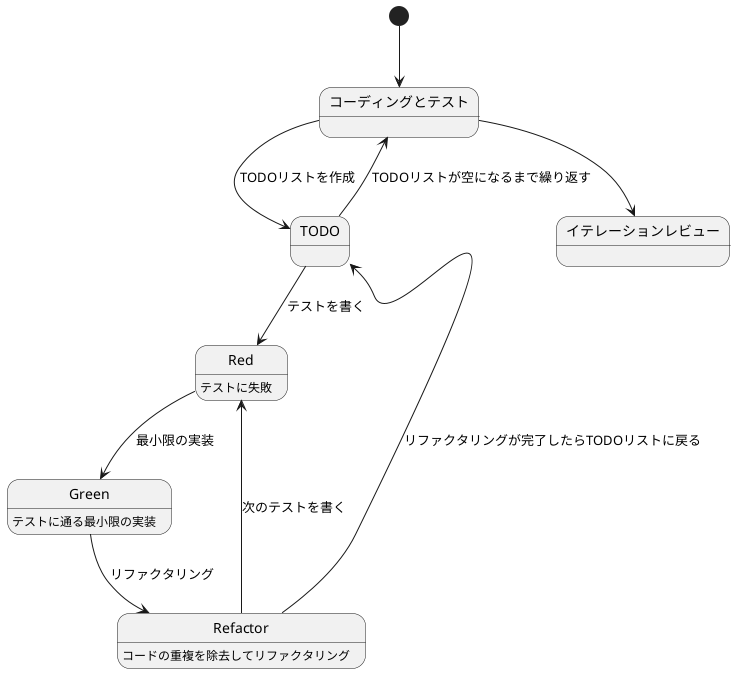
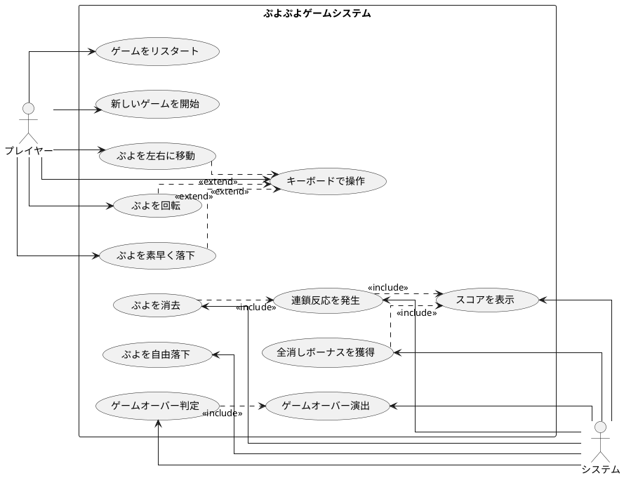

# Pyxel で始めるぷよぷよテスト駆動開発入門 - Python でレトロゲーム開発を学ぶ

## はじめに

みなさん、こんにちは！今日は私と一緒にテスト駆動開発（TDD）を使って、Python と Pyxel でぷよぷよゲームを作っていきましょう。さて、プログラミングの旅に出る前に、皆さんは「テスト駆動開発」について聞いたことがありますか？もしかしたら「テストって、コードを書いた後にするものじゃないの？」と思われるかもしれませんね。

> テストを書きながら開発することによって、設計が良い方向に変わり、コードが改善され続け、それによって自分自身が開発に前向きになること、それがテスト駆動開発の目指すゴールです。
>
> — Kent Beck 『テスト駆動開発』 付録C　訳者解説：テスト駆動開発の現在

この記事では、私たちが一緒にぷよぷよゲームを実装しながら、テスト駆動開発の基本的な流れと考え方を学んでいきます。まるでモブプログラミングのセッションのように、あなたと私が一緒に考え、コードを書き、改善していく過程を体験しましょう。「でも、ぷよぷよって結構複雑なゲームじゃないの？」と思われるかもしれませんが、心配いりません。各章では、ユーザーストーリーに基づいた機能を、テスト、実装、解説の順に少しずつ進めていきますよ。一歩一歩、着実に進んでいきましょう！

### 本記事の特徴

本記事は、既存の TypeScript 版「ぷよぷよから始めるテスト駆動開発入門」を Python+Pyxel 版として再構成したものです。以下の特徴があります：

- **レトロゲーム開発**: Pyxel を使った 8bit スタイルのゲーム開発
- **現代的 Python 環境**: uv、Ruff、mypy などの最新ツールチェーン
- **TDD の実践**: テスト駆動開発を実ゲーム開発で体験
- **段階的学習**: イテレーションごとに機能を追加していく

### テスト駆動開発のサイクル

さて、テスト駆動開発では、どのように進めていけばいいのでしょうか？「テストを書いてから実装する」というのは分かりましたが、具体的にはどんな手順で進めるのでしょうか？

私がいつも実践しているのは、以下の3つのステップを繰り返すサイクルです。皆さんも一緒にやってみましょう：

1. **Red（赤）**: まず失敗するテストを書きます。「え？わざと失敗するテストを？」と思われるかもしれませんが、これには重要な意味があるんです。これから実装する機能が何をすべきかを明確にするためなんですよ。
2. **Green（緑）**: 次に、テストが通るように、最小限のコードを実装します。この段階では、きれいなコードよりも「とにかく動くこと」を優先します。「最小限」というのがポイントです。必要以上のことはしないようにしましょう。
3. **Refactor（リファクタリング）**: 最後に、コードの品質を改善します。テストが通ることを確認しながら、重複を取り除いたり、わかりやすい名前をつけたりします。「動くけど汚いコード」から「動いてきれいなコード」へと進化させるんです。

> レッド・グリーン・リファクタリング。それがTDDのマントラだ。
>
> — Kent Beck 『テスト駆動開発』

このサイクルを「Red-Green-Refactor」サイクルと呼びます。「赤・緑・リファクタリング」のリズムを刻むように、このサイクルを繰り返していくんです。これによって、少しずつ機能を追加し、コードの品質を高めていきましょう。皆さんも一緒にこのリズムを体感してみてください！



### 開発環境

さて、実際にコードを書く前に、私たちが使用する開発環境について少しお話ししておきましょう。皆さんは「道具選びは仕事の半分」という言葉を聞いたことがありますか？プログラミングでも同じことが言えるんです。

> 道具はあなたの能力を増幅します。道具のできが優れており、簡単に使いこなせるようになっていれば、より生産的になれるのです。
>
> — 達人プログラマー 熟達に向けたあなたの旅（第2版）

「どんなツールを使えばいいの？」と思われるかもしれませんね。今回のプロジェクトでは、以下のツールを使用していきます：

- **言語**: Python 3.10+ — 「Pythonって初心者向けじゃないの？」と思われるかもしれませんが、型ヒントを使うことで、大規模な開発でもバグを減らしやすくなるんです。
- **ゲームエンジン**: Pyxel — 日本で開発されたレトロゲームエンジンです。シンプルで直感的な API が特徴です。
- **パッケージマネージャ**: uv — 次世代の高速 Python パッケージマネージャーです。pip よりも圧倒的に速いんです！
- **テストフレームワーク**: pytest — Python の標準的なテストフレームワークです。
- **静的解析**: Ruff — 従来の flake8、pylint、black を置き換える統合ツールです。
- **型チェック**: mypy — 静的型チェッカーで、Python に型安全性をもたらします。
- **タスクランナー**: tox — 「同じ作業の繰り返しって退屈じゃないですか？」そんな反復的なタスクを自動化してくれます。
- **バージョン管理**: Git — コードの変更履歴を追跡し、「あれ？昨日までちゃんと動いてたのに...」というときに過去の状態に戻れる魔法のツールです。

これらのツールを使って、テスト駆動開発の流れに沿ってぷよぷよゲームを実装していきましょう。「環境構築って難しそう...」と心配される方もいるかもしれませんが手順に従って進めればそんなに難しいことではありません。詳細はイテレーション0: 環境の構築で解説します。

## 要件

### ユーザーストーリー

さて、実際にコードを書き始める前に、少し立ち止まって考えてみましょう。「何を作るのか？」という基本的な問いかけです。私たちが作るぷよぷよゲームは、どのような機能を持つべきでしょうか？

アジャイル開発では、この「何を作るのか？」という問いに対して、「ユーザーストーリー」という形で答えを出します。皆さんは「ユーザーストーリー」という言葉を聞いたことがありますか？

> ユーザーストーリーは、ソフトウェア要求を表現するための軽量な手法である。ユーザーストーリーは、システムについてユーザーまたは顧客の視点からフィーチャの概要を記述したものだ。
> ユーザーストーリーには形式が定められておらず、標準的な記法もない。とはいえ、次のような形式でストーリーを考えてみると便利である。「＜ユーザーの種類＞として、＜機能や性能＞がほしい。それは＜ビジネス価値＞のためだ」という形のテンプレートに従うと、
> たとえば次のようなストーリーを書ける。「本の購入者として、ＩＳＢＮで本を検索したい。それは探している本をすばやく見つけるためだ」
>
> — Mike Cohn 『アジャイルな見積と計画づくり』

つまり、「プレイヤーとして、〇〇ができる（〇〇したいから）」という形式で機能を表現するんです。これによって、「誰のため」の「どんな機能」を「なぜ」作るのかが明確になります。素晴らしいですよね！

では、私たちのぷよぷよゲームでは、どんなユーザーストーリーが考えられるでしょうか？一緒に考えてみましょう：

- プレイヤーとして、新しいゲームを開始できる（ゲームの基本機能として必要ですよね！）
- プレイヤーとして、落ちてくるぷよを左右に移動できる（ぷよを適切な位置に配置したいですよね）
- プレイヤーとして、落ちてくるぷよを回転できる（戦略的にぷよを配置するために必要です）
- プレイヤーとして、ぷよを素早く落下させることができる（「早く次のぷよを落としたい！」というときのために）
- プレイヤーとして、同じ色のぷよを4つ以上つなげると消去できる（これがぷよぷよの醍醐味ですよね！）
- プレイヤーとして、連鎖反応を起こしてより高いスコアを獲得できる（「れ〜んさ〜ん！」と叫びたくなりますよね）
- プレイヤーとして、全消し（ぜんけし）ボーナスを獲得できる（「やった！全部消えた！」という達成感を味わいたいですよね）
- プレイヤーとして、ゲームオーバーになるとゲーム終了の演出を見ることができる（終わりが明確でないとモヤモヤしますよね）
- プレイヤーとして、現在のスコアを確認できる（「今どれくらい点数取れてるかな？」と気になりますよね）
- プレイヤーとして、キーボードでぷよを操作できる（PCでプレイするなら必須ですよね）

「うわ、結構たくさんあるな...」と思われるかもしれませんが、心配いりません！これらのユーザーストーリーを一つずつ実装していくことで、徐々にゲームを完成させていきましょう。テスト駆動開発の素晴らしいところは、各ストーリーを小さなタスクに分解し、テスト→実装→リファクタリングのサイクルで少しずつ進められることなんです。一歩一歩、着実に進んでいきましょう！

### ユースケース図

ユーザーストーリーを整理したところで、「これらの機能がどのように関連しているのか、全体像が見えるといいな」と思いませんか？そんなときに役立つのが「ユースケース図」です。
「ユースケース図って何？」と思われるかもしれませんね。ユースケース図は、システムと外部アクター（ここではプレイヤーとシステム自体）の相互作用を視覚的に表現するための図です。「絵に描いて整理すると分かりやすい」というやつですね。

> ユースケースは、システムの振る舞いに関する利害関係者の契約を表現するものです。
>
> — アリスター・コーバーン 『ユースケース実践ガイド』

「百聞は一見にしかず」というように、実際に見てみるのが一番分かりやすいですよね。では、私たちのぷよぷよゲームのユースケース図を見てみましょう：



この図を見ると、プレイヤーとシステムの役割分担がよくわかりますね。プレイヤーはゲームの開始や操作を担当し、システムはぷよの消去判定やスコア計算などの内部処理を担当しています。また、キーボード操作は「拡張（extend）」関係にあり、ぷよの移動や回転などの基本操作を異なる入力方法で実現していることがわかります（TypeScript 版ではタッチ操作もサポートしていましたが、Python+Pyxel 版ではキーボード操作に集中します）。

このようにユースケース図を作成することで、システムの全体像を把握し、実装すべき機能の関連性を明確にすることができます。それでは、実際のコード実装に進んでいきましょう！

誤解しないでもらいたいのですが本来ユースケースとはテキストで記述するものでありユースケース図は概要を把握するための手段に過ぎないということです。

> 楕円、矢印、人型おアイコンから構成されているUMLのユースケース図は、ユースケースを把握するための表記法ではありません。
> 楕円や矢印は、ユースケースをのパッケージや分解を表すもので、内容を表すものではありません。
>
> — アリスター・コーバーン 『ユースケース実践ガイド』

## リリース計画

要件もわかった、プログラミング開始だ！ちょっと待ってください、何事も計画を立てる事は大事なことです。ユースケース図を見てください、結構いろんなことがありますよね。何から取り組みますか？
「スコアの表示」ですか？「ゲームオーバー判定」ですか？でもまずは「新しいゲームを開始」しないとつながりとして難しいですよね。もちろん実際にプログラミングしながら順番を考えてもいいですけど間違った順番で進めると直すのが大変ですよね。
それにこれからどんなものを作るのかは事前にある程度イメージを固めておきたいものです（いきなり「ゲームオーバー」になるゲームはやりたくないですよね）。

> 計画づくりとは「なにをいつまでに作ればいいのか？」という質問に答える作業だと私は考えている
>
> — Mike Cohn 『アジャイルな見積と計画づくり』

今回の目的はぷよぷよゲームを遊べるための最小限の機能の実装です。目的を実現するためにやるべきことをイテレーションという単位でまとめましょう。「全部やること洗い出すの？そんな先のことはわからないよ！」と思いますよね。安心してください今決めることは大まかな作業の流れと前後関係の整理だけです。
細かい部分は各イテレーションでおいおい明確になってきます。その手助けをしてくれるのがテスト駆動開発なのです。

> 正しい設計を、正しいタイミングで行う。動かしてから、正しくする。
>
> — Kent Beck 『テスト駆動開発』

今回はユーザーストーリーとユースケース図から以下のイテレーション計画に従ってぷよぷよゲームをリリースします。

- **イテレーション0**: 環境の構築と Pyxel 入門
- **イテレーション1**: ゲーム開始の実装
- **イテレーション2**: ぷよの移動の実装
- **イテレーション3**: ぷよの回転の実装
- **イテレーション4**: ぷよの自由落下の実装
- **イテレーション5**: ぷよの高速落下の実装
- **イテレーション6**: ぷよの消去の実装
- **イテレーション7**: 連鎖反応の実装
- **イテレーション8**: 全消しボーナスの実装
- **イテレーション9**: ゲームオーバーの実装
- **イテレーション10**: UI の改善

では、ぷよぷよゲーム開発スタートです！

## イテレーション0: 環境の構築と Pyxel 入門

...と言いたいところですがまずは環境の構築をしなければなりません。「プログラミングなんてどの言語でやるか決めるぐらいでしょ？」と思うかもしれませんが家を建てるときにしっかりとした基礎工事が必要なように開発環境もしっかりとした準備が必要です。
家を建てた後に基礎がダメだと困ったことになりますからね。

### ソフトウェア開発の三種の神器

良いコードを書き続けるためには何が必要になるでしょうか？それは[ソフトウェア開発の三種の神器](https://t-wada.hatenablog.jp/entry/clean-code-that-works)と呼ばれるものです。

> 今日のソフトウェア開発の世界において絶対になければならない3つの技術的な柱があります。
> 三本柱と言ったり、三種の神器と言ったりしていますが、それらは
>
>   - バージョン管理
>   - テスティング
>   - 自動化
>
> の3つです。
>
> —  https://t-wada.hatenablog.jp/entry/clean-code-that-works

本章では開発環境のセットアップとして、これら三種の神器を準備していきます。環境構築は退屈に感じるかもしれませんが、これらのツールがあることで、安心してコードを書くことができるようになります。一緒に進んでいきましょう！

### バージョン管理: Git とコミットメッセージ

バージョン管理システムとして Git を使います。Git については既に使用していると仮定しますが、コミットメッセージについて1つだけ重要なルールを確認しておきましょう。

#### コミットメッセージの書き方

私たちのプロジェクトでは、[Conventional Commits](https://www.conventionalcommits.org/ja/)の書式に従ってコミットメッセージを書きます。具体的には、それぞれのコミットメッセージはヘッダ、ボディ、フッタで構成されます。

```
<タイプ>(<スコープ>): <タイトル>
<空行>
<ボディ>
<空行>
<フッタ>
```

ヘッダは必須で、スコープは任意です。コミットメッセージのタイトルは50文字までにしましょう（GitHub上で読みやすくなります）。

コミットのタイプは次を用います：

- **feat**: 新しい機能
- **fix**: バグ修正
- **docs**: ドキュメント変更のみ
- **style**: コードに影響を与えない変更（空白、フォーマットなど）
- **refactor**: 機能追加でもバグ修正でもないコード変更
- **perf**: パフォーマンスを改善するコード変更
- **test**: テストの追加や修正
- **chore**: ビルドプロセスや補助ツールの変更

例えば：

```bash
git commit -m 'feat: ゲーム初期化機能を追加'
git commit -m 'refactor: メソッドの抽出'
git commit -m 'test: ぷよ消去のテストケースを追加'
```

### テスティング: パッケージマネージャとテスト環境

良いコードを書くためには、コードが正しく動作することを確認するテストが欠かせません。そのためのツールをセットアップしていきましょう。

#### パッケージマネージャ: uv

外部ライブラリやツールを管理するために **uv** を使います。

> uvとは、Pythonプロジェクトの依存関係を管理し、仮想環境を自動で作成・管理する高速なPythonパッケージマネージャーです。従来のpipやpoetryよりも高速で、プロジェクトの初期化から依存関係の管理まで一元的に行えます。
>
> — Pythonパッケージ管理

**uv** でプロジェクトを初期化しましょう。まず、プロジェクトディレクトリを作成します：

```bash
mkdir puyo-puyo-python
cd puyo-puyo-python
```

次に、**uv** でプロジェクトを初期化します：

```bash
uv init
```

これで `pyproject.toml` が作成されます。これは **uv** がパッケージの依存関係とプロジェクト設定を管理するためのファイルです。

内容を確認してみましょう：

```toml
[project]
name = "puyo-puyo-python"
version = "0.1.0"
description = "Pyxelで始めるぷよぷよテスト駆動開発入門"
readme = "README.md"
requires-python = ">=3.10"
dependencies = []
```

#### Pyxel のインストール

まず、ゲームエンジンである Pyxel をインストールします：

```bash
uv add pyxel
```

これで Pyxel がプロジェクトに追加されました。`pyproject.toml` を確認すると、dependencies に pyxel が追加されているはずです：

```toml
[project]
name = "puyo-puyo-python"
version = "0.1.0"
description = "Pyxelで始めるぷよぷよテスト駆動開発入門"
readme = "README.md"
requires-python = ">=3.10"
dependencies = [
    "pyxel>=2.2.16",
]
```

#### 開発依存関係のインストール

次に、開発に必要なツールをインストールします：

```bash
uv add --dev pytest pytest-cov ruff mypy tox
```

これで以下のツールがインストールされました：

- **pytest**: テストフレームワーク
- **pytest-cov**: コードカバレッジ計測
- **ruff**: リンター・フォーマッター
- **mypy**: 静的型チェッカー
- **tox**: タスクランナー

`pyproject.toml` に開発依存関係が追加されます：

```toml
[project.optional-dependencies]
dev = [
    "pytest>=8.4.1",
    "pytest-cov>=6.2.1",
    "ruff>=0.12.3",
    "mypy>=1.17.0",
    "tox>=4.27.0",
]
```

### Pyxel の基本

Pyxel は日本で開発されたレトロゲームエンジンです。8bit スタイルのゲーム作成に特化しており、以下の特徴があります：

- **シンプルな API**: 初心者にも分かりやすい直感的なインターフェース
- **レトロスタイル**: 16色パレット、8bit 音源によるノスタルジックなゲーム体験
- **高いパフォーマンス**: Rust ベースで動作が軽快
- **日本語サポート**: 日本語ドキュメントとコミュニティ
- **教育目的に最適**: ゲーム開発の基礎を学ぶのに理想的

#### 最小限の Pyxel アプリケーション

Pyxel の基本を理解するために、最小限のアプリケーションを作成してみましょう。`lib/hello_pyxel.py` というファイルを作成します：

```python
import pyxel

class App:
    def __init__(self):
        pyxel.init(160, 120, title="Hello Pyxel")
        pyxel.run(self.update, self.draw)

    def update(self):
        if pyxel.btnp(pyxel.KEY_Q):
            pyxel.quit()

    def draw(self):
        pyxel.cls(0)
        pyxel.text(55, 41, "Hello, Pyxel!", pyxel.frame_count % 16)
        pyxel.text(50, 50, "Press Q to quit", 7)

App()
```

このコードを実行してみましょう：

```bash
uv run python lib/hello_pyxel.py
```

ウィンドウが表示され、「Hello, Pyxel!」というテキストが色を変えながら表示されます。Q キーを押すとプログラムが終了します。

#### Pyxel の基本的な構造

Pyxel のアプリケーションは、以下の基本構造を持ちます：

1. **初期化（init）**: ウィンドウサイズやタイトルを設定
2. **ゲームループ（run）**: `update` と `draw` を繰り返し実行
3. **更新（update）**: ゲーム状態の更新（入力処理、物理演算など）
4. **描画（draw）**: 画面への描画

```python
import pyxel

class App:
    def __init__(self):
        # 1. 初期化: ウィンドウを160x120ピクセルで作成
        pyxel.init(160, 120, title="My App")
        # 2. ゲームループ開始
        pyxel.run(self.update, self.draw)

    def update(self):
        # 3. 更新: 毎フレーム呼ばれる（60FPS）
        pass

    def draw(self):
        # 4. 描画: 毎フレーム呼ばれる（60FPS）
        pyxel.cls(0)  # 画面をクリア（色0 = 黒）
```

#### Pyxel の主要な API

Pyxel でよく使う API を紹介します：

**ウィンドウ制御**:
```python
pyxel.init(width, height, title="")  # ウィンドウ初期化
pyxel.run(update, draw)              # ゲームループ開始
pyxel.quit()                         # アプリケーション終了
```

**描画**:
```python
pyxel.cls(col)                       # 画面クリア
pyxel.pset(x, y, col)                # ピクセル描画
pyxel.line(x1, y1, x2, y2, col)      # 直線描画
pyxel.rect(x, y, w, h, col)          # 四角形（輪郭）
pyxel.rectb(x, y, w, h, col)         # 四角形（塗りつぶし）
pyxel.circ(x, y, r, col)             # 円（輪郭）
pyxel.circb(x, y, r, col)            # 円（塗りつぶし）
pyxel.text(x, y, s, col)             # テキスト描画
```

**入力**:
```python
pyxel.btn(key)                       # キーが押されているか
pyxel.btnp(key)                      # キーが押された瞬間か
pyxel.btnr(key)                      # キーが離された瞬間か
```

**その他**:
```python
pyxel.frame_count                    # フレーム数（ゲーム開始からの経過フレーム）
```

#### キーコード

Pyxel で使用できる主なキーコード：

```python
pyxel.KEY_SPACE    # スペースキー
pyxel.KEY_ENTER    # エンターキー
pyxel.KEY_LEFT     # 左矢印キー
pyxel.KEY_RIGHT    # 右矢印キー
pyxel.KEY_UP       # 上矢印キー
pyxel.KEY_DOWN     # 下矢印キー
pyxel.KEY_Q        # Qキー
pyxel.KEY_A        # Aキー
pyxel.KEY_Z        # Zキー
```

#### カラーパレット

Pyxel は 16 色のカラーパレットを持ちます：

| 番号 | 色 | 番号 | 色 |
|------|------|------|------|
| 0 | 黒 | 8 | 赤 |
| 1 | 濃紺 | 9 | オレンジ |
| 2 | 紫 | 10 | 黄色 |
| 3 | 緑 | 11 | 黄緑 |
| 4 | 茶色 | 12 | 水色 |
| 5 | 濃灰色 | 13 | 灰色 |
| 6 | 薄灰色 | 14 | ピンク |
| 7 | 白 | 15 | 薄ピンク |

これで Pyxel の基本を理解できました！

### プロジェクト構造の作成

ぷよぷよゲームのプロジェクト構造を作成します：

```bash
mkdir -p lib test
touch lib/__init__.py
touch test/__init__.py
```

最終的なディレクトリ構造：

```
puyo-puyo-python/
├── lib/
│   ├── __init__.py
│   └── (ゲームのソースコード)
├── test/
│   ├── __init__.py
│   └── (テストコード)
├── pyproject.toml
├── tox.ini
└── README.md
```

### 自動化: 品質管理ツールのセットアップ

#### 静的コード解析: Ruff

良いコードを書き続けるためにはコードの品質を維持していく必要があります。Python 用の静的コード解析ツール **Ruff** を使って確認してみましょう。

Ruff は高速でモダンな Python リンター・フォーマッターで、従来の flake8、pylint、black などを置き換える統合ツールです。

設定ファイル `.ruff.toml` を作成します：

```toml
line-length = 88
target-version = "py310"

[lint]
select = [
    "E",  # pycodestyle errors
    "W",  # pycodestyle warnings
    "F",  # pyflakes
    "I",  # isort
    "B",  # flake8-bugbear
    "C4", # flake8-comprehensions
    "UP", # pyupgrade
]
ignore = []

[format]
quote-style = "double"
indent-style = "space"
skip-magic-trailing-comma = false
line-ending = "auto"

[lint.per-file-ignores]
"test/**/*.py" = ["E501"]  # Allow long lines in tests

[lint.mccabe]
max-complexity = 7  # 循環的複雑度の制限
```

> 循環的複雑度 (Cyclomatic complexity) とは、ソフトウェア測定法の一つであり、コードがどれぐらい複雑であるかをメソッド単位で数値にして表す指標。

リンターを実行してみます：

```bash
uv run ruff check .
```

自動修正も可能です：

```bash
uv run ruff check . --fix
```

#### コードフォーマッタ: Ruff format

良いコードであるためにはフォーマットも大切な要素です。

> 優れたソースコードは「目に優しい」ものでなければいけない。
>
> — リーダブルコード

**Ruff** はリンターとしてだけでなく、コードフォーマッターとしても機能します。従来の black の代替として使えます。

フォーマットをチェック：

```bash
uv run ruff format --check .
```

自動フォーマット：

```bash
uv run ruff format .
```

#### コードカバレッジ: pytest-cov

静的コードコード解析による品質の確認はできました。では動的なテストに関してはどうでしょうか？**コードカバレッジ** を確認する必要があります。

> コード網羅率（コードもうらりつ、英: Code coverage）コードカバレッジは、ソフトウェアテストで用いられる尺度の1つである。プログラムのソースコードがテストされた割合を意味する。この場合のテストはコードを見ながら行うもので、ホワイトボックステストに分類される。
>
> — ウィキペディア

Python 用コードカバレッジ検出プログラムとして **pytest-cov** を使います。これは先程 **uv** でインストール済みです。

`pyproject.toml` にテストとカバレッジの設定を追加します：

```toml
[tool.pytest.ini_options]
testpaths = ["test"]
python_files = ["test_*.py"]
python_classes = ["Test*"]
python_functions = ["test_*"]
addopts = "--cov=lib --cov-report=html --cov-report=term-missing"

[tool.coverage.run]
source = ["lib"]

[tool.coverage.report]
exclude_lines = [
    "pragma: no cover",
    "def __repr__",
    "raise AssertionError",
    "raise NotImplementedError",
]
```

テストを実施します（まだテストがないのでエラーになります）：

```bash
uv run pytest test/ -v --cov=lib --cov-report=term-missing
```

テスト実行後に `htmlcov` というフォルダが作成されます。その中の `index.html` を開くとカバレッジ状況を確認できます。

#### 型チェック: mypy

Python は動的型付け言語ですが、型ヒントを使って静的型チェックを行うことで、より安全で保守性の高いコードを書くことができます。

> mypy とは、Python のための静的型チェッカーです。型ヒント（Type Hints）を使用してコードの型安全性を検証し、実行前に型エラーを検出できます。
>
> — Python 型チェック

**mypy** を使って型チェックを実行してみましょう：

```bash
uv run mypy lib test
```

mypy の設定は `pyproject.toml` で管理できます：

```toml
[tool.mypy]
python_version = "3.10"
warn_return_any = true
warn_unused_configs = true
disallow_untyped_defs = true
```

型チェック機能により、以下のようなメリットがあります：

- 実行前に型エラーを検出
- IDE での補完機能の向上
- コードの可読性と保守性の向上
- リファクタリング時の安全性向上

#### タスクランナー: tox

ここまででテストの実行、静的コード解析、コードフォーマット、コードカバレッジを実施することができるようになりました。でもコマンドを実行するのにそれぞれコマンドを覚えておくのは面倒ですよね。いちいち調べるのが面倒なことは全部 **タスクランナー** にやらせるようにしましょう。

> タスクランナーとは、アプリケーションのビルドなど、一定の手順で行う作業をコマンド一つで実行できるように予めタスクとして定義したものです。
>
> — Python ビルドツール

Python のタスクランナーは **tox** です。

> tox は Python におけるタスクランナーです。tox コマンドと起点となる tox.ini というタスクを記述するファイルを用意することで、複数の Python 環境でのテスト実行や、タスクの一覧表示を行えます。
>
> — Python ビルドツール

`tox.ini` を作成します：

```ini
[tox]
envlist = py310,lint,type,coverage
skip_missing_interpreters = true

[testenv]
deps =
    pytest
    pytest-cov
commands = pytest {posargs}

[testenv:test]
deps =
    pytest
    pytest-cov
commands = pytest --cov=lib --cov-report=html --cov-report=term-missing --verbose

[testenv:lint]
deps = ruff
commands =
    ruff check .
    ruff format --check .

[testenv:format]
deps = ruff
commands = ruff format .

[testenv:type]
deps =
    mypy
    pytest
    pyxel
commands = mypy lib test

[testenv:coverage]
deps =
    pytest
    pytest-cov
commands = pytest --cov=lib --cov-report=html --cov-report=term-missing
```

タスクを実行してみましょう：

```bash
# すべての品質チェックとテストを実行
uv run tox

# 個別タスクの実行
uv run tox -e test        # テストのみ
uv run tox -e lint        # リンターのみ
uv run tox -e type        # 型チェックのみ
uv run tox -e coverage    # カバレッジレポートのみ
uv run tox -e format      # フォーマットのみ
```

### 最終的な開発ワークフロー

これで [ソフトウェア開発の三種の神器](https://t-wada.hatenablog.jp/entry/clean-code-that-works) の準備が完了しました。最終的な開発ワークフローは以下のようになります：

1. **開発開始**: `uv run tox` を実行して品質チェック
2. **コード作成**: テスト駆動開発のサイクル（Red-Green-Refactor）
3. **品質確認**: 各ツールが自動で品質をチェック
4. **コミット**: 品質チェックを通ったコードを Git にコミット

### 使用可能なコマンド一覧

```bash
# すべての品質チェックとテストを実行（推奨）
uv run tox

# 個別タスクの実行
uv run tox -e test        # テストのみ
uv run tox -e lint        # リンターのみ
uv run tox -e type        # 型チェックのみ
uv run tox -e coverage    # カバレッジレポートのみ
uv run tox -e format      # フォーマットのみ

# 個別コマンドの実行
uv run pytest            # テスト実行
uv run ruff check .       # リンター実行
uv run ruff format .      # フォーマッター実行
uv run mypy lib test      # 型チェック実行
```

### 構築した環境の特徴

- **uv**: 高速な Python パッケージマネージャーと仮想環境管理
- **Pyxel**: レトロゲーム開発エンジン
- **Ruff**: 従来の flake8、pylint、black を置き換える統合リンター・フォーマッター
- **mypy**: 静的型チェックによる型安全性の確保
- **pytest + pytest-cov**: テスト実行とカバレッジ計測
- **tox**: 複数環境での品質チェックとタスク管理

この環境により、次回の開発からは最初にコマンドラインで `uv run tox` を実行すれば良いコードを書くためのタスクを自動で実行してくれるようになるので、コードを書くことに集中できるようになりました。

### コミット履歴

今回のセットアップ作業で作成されたコミット：

```bash
git init
git add .
git commit -m 'chore: プロジェクト初期化とPyxel環境セットアップ'
```

では、次のイテレーションに進むとしましょう。

---

**注意**: イテレーション1以降の内容は、TypeScript 版から Python+Pyxel 版への移植作業中です。続きは順次追加していきます。

## イテレーション1以降（準備中）

現在、TypeScript 版の内容を Python+Pyxel に適応する作業を進めています。以下のイテレーションが順次追加されます：

- イテレーション1: ゲーム開始の実装
- イテレーション2: ぷよの移動の実装
- イテレーション3: ぷよの回転の実装
- イテレーション4: ぷよの自由落下の実装
- イテレーション5: ぷよの高速落下の実装
- イテレーション6: ぷよの消去の実装
- イテレーション7: 連鎖反応の実装
- イテレーション8: 全消しボーナスの実装
- イテレーション9: ゲームオーバーの実装
- イテレーション10: UI の改善

## 参考資料

- [テスト駆動開発入門](https://amzn.asia/d/6425grx)
- [実践テスト駆動開発](https://www.amazon.co.jp/dp/4798124583)
- [ぷよぷよプログラミング](https://puyo.sega.jp/program/)
- [Pyxel 公式ドキュメント](https://github.com/kitao/pyxel/blob/main/docs/README.ja.md)
- [Python 公式ドキュメント](https://docs.python.org/ja/3/)
- [uv ドキュメント](https://github.com/astral-sh/uv)
- [Ruff ドキュメント](https://docs.astral.sh/ruff/)
- [pytest ドキュメント](https://docs.pytest.org/)
- [mypy ドキュメント](https://mypy.readthedocs.io/)
