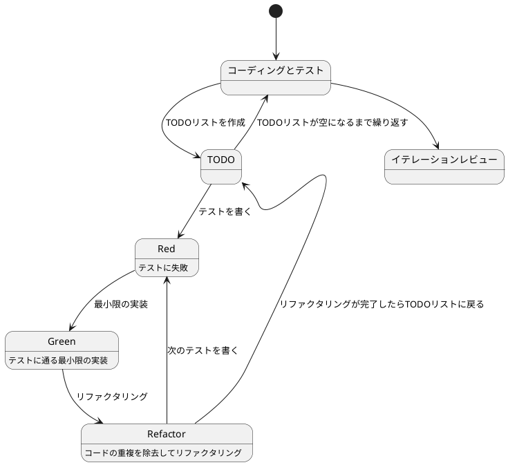
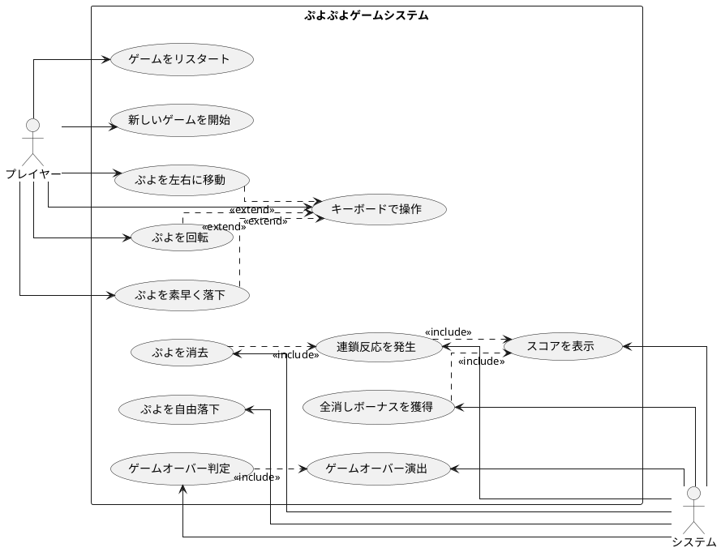

# Pyxel で始めるぷよぷよテスト駆動開発入門 - Python でレトロゲーム開発を学ぶ

## はじめに

みなさん、こんにちは！今日は私と一緒にテスト駆動開発（TDD）を使って、Python と Pyxel でぷよぷよゲームを作っていきましょう。さて、プログラミングの旅に出る前に、皆さんは「テスト駆動開発」について聞いたことがありますか？もしかしたら「テストって、コードを書いた後にするものじゃないの？」と思われるかもしれませんね。

> テストを書きながら開発することによって、設計が良い方向に変わり、コードが改善され続け、それによって自分自身が開発に前向きになること、それがテスト駆動開発の目指すゴールです。
>
> — Kent Beck 『テスト駆動開発』 付録C　訳者解説：テスト駆動開発の現在

この記事では、私たちが一緒にぷよぷよゲームを実装しながら、テスト駆動開発の基本的な流れと考え方を学んでいきます。まるでモブプログラミングのセッションのように、あなたと私が一緒に考え、コードを書き、改善していく過程を体験しましょう。「でも、ぷよぷよって結構複雑なゲームじゃないの？」と思われるかもしれませんが、心配いりません。各章では、ユーザーストーリーに基づいた機能を、テスト、実装、解説の順に少しずつ進めていきますよ。一歩一歩、着実に進んでいきましょう！

### 本記事の特徴

本記事は、既存の TypeScript 版「ぷよぷよから始めるテスト駆動開発入門」を Python+Pyxel 版として再構成したものです。以下の特徴があります：

- **レトロゲーム開発**: Pyxel を使った 8bit スタイルのゲーム開発
- **現代的 Python 環境**: uv、Ruff、mypy などの最新ツールチェーン
- **TDD の実践**: テスト駆動開発を実ゲーム開発で体験
- **段階的学習**: イテレーションごとに機能を追加していく

### テスト駆動開発のサイクル

さて、テスト駆動開発では、どのように進めていけばいいのでしょうか？「テストを書いてから実装する」というのは分かりましたが、具体的にはどんな手順で進めるのでしょうか？

私がいつも実践しているのは、以下の3つのステップを繰り返すサイクルです。皆さんも一緒にやってみましょう：

1. **Red（赤）**: まず失敗するテストを書きます。「え？わざと失敗するテストを？」と思われるかもしれませんが、これには重要な意味があるんです。これから実装する機能が何をすべきかを明確にするためなんですよ。
2. **Green（緑）**: 次に、テストが通るように、最小限のコードを実装します。この段階では、きれいなコードよりも「とにかく動くこと」を優先します。「最小限」というのがポイントです。必要以上のことはしないようにしましょう。
3. **Refactor（リファクタリング）**: 最後に、コードの品質を改善します。テストが通ることを確認しながら、重複を取り除いたり、わかりやすい名前をつけたりします。「動くけど汚いコード」から「動いてきれいなコード」へと進化させるんです。

> レッド・グリーン・リファクタリング。それがTDDのマントラだ。
>
> — Kent Beck 『テスト駆動開発』

このサイクルを「Red-Green-Refactor」サイクルと呼びます。「赤・緑・リファクタリング」のリズムを刻むように、このサイクルを繰り返していくんです。これによって、少しずつ機能を追加し、コードの品質を高めていきましょう。皆さんも一緒にこのリズムを体感してみてください！



### 開発環境

さて、実際にコードを書く前に、私たちが使用する開発環境について少しお話ししておきましょう。皆さんは「道具選びは仕事の半分」という言葉を聞いたことがありますか？プログラミングでも同じことが言えるんです。

> 道具はあなたの能力を増幅します。道具のできが優れており、簡単に使いこなせるようになっていれば、より生産的になれるのです。
>
> — 達人プログラマー 熟達に向けたあなたの旅（第2版）

「どんなツールを使えばいいの？」と思われるかもしれませんね。今回のプロジェクトでは、以下のツールを使用していきます：

- **言語**: Python 3.10+ — 「Pythonって初心者向けじゃないの？」と思われるかもしれませんが、型ヒントを使うことで、大規模な開発でもバグを減らしやすくなるんです。
- **ゲームエンジン**: Pyxel — 日本で開発されたレトロゲームエンジンです。シンプルで直感的な API が特徴です。
- **パッケージマネージャ**: uv — 次世代の高速 Python パッケージマネージャーです。pip よりも圧倒的に速いんです！
- **テストフレームワーク**: pytest — Python の標準的なテストフレームワークです。
- **静的解析**: Ruff — 従来の flake8、pylint、black を置き換える統合ツールです。
- **型チェック**: mypy — 静的型チェッカーで、Python に型安全性をもたらします。
- **タスクランナー**: tox — 「同じ作業の繰り返しって退屈じゃないですか？」そんな反復的なタスクを自動化してくれます。
- **バージョン管理**: Git — コードの変更履歴を追跡し、「あれ？昨日までちゃんと動いてたのに...」というときに過去の状態に戻れる魔法のツールです。

これらのツールを使って、テスト駆動開発の流れに沿ってぷよぷよゲームを実装していきましょう。「環境構築って難しそう...」と心配される方もいるかもしれませんが手順に従って進めればそんなに難しいことではありません。詳細はイテレーション0: 環境の構築で解説します。

## 要件

### ユーザーストーリー

さて、実際にコードを書き始める前に、少し立ち止まって考えてみましょう。「何を作るのか？」という基本的な問いかけです。私たちが作るぷよぷよゲームは、どのような機能を持つべきでしょうか？

アジャイル開発では、この「何を作るのか？」という問いに対して、「ユーザーストーリー」という形で答えを出します。皆さんは「ユーザーストーリー」という言葉を聞いたことがありますか？

> ユーザーストーリーは、ソフトウェア要求を表現するための軽量な手法である。ユーザーストーリーは、システムについてユーザーまたは顧客の視点からフィーチャの概要を記述したものだ。
> ユーザーストーリーには形式が定められておらず、標準的な記法もない。とはいえ、次のような形式でストーリーを考えてみると便利である。「＜ユーザーの種類＞として、＜機能や性能＞がほしい。それは＜ビジネス価値＞のためだ」という形のテンプレートに従うと、
> たとえば次のようなストーリーを書ける。「本の購入者として、ＩＳＢＮで本を検索したい。それは探している本をすばやく見つけるためだ」
>
> — Mike Cohn 『アジャイルな見積と計画づくり』

つまり、「プレイヤーとして、〇〇ができる（〇〇したいから）」という形式で機能を表現するんです。これによって、「誰のため」の「どんな機能」を「なぜ」作るのかが明確になります。素晴らしいですよね！

では、私たちのぷよぷよゲームでは、どんなユーザーストーリーが考えられるでしょうか？一緒に考えてみましょう：

- プレイヤーとして、新しいゲームを開始できる（ゲームの基本機能として必要ですよね！）
- プレイヤーとして、落ちてくるぷよを左右に移動できる（ぷよを適切な位置に配置したいですよね）
- プレイヤーとして、落ちてくるぷよを回転できる（戦略的にぷよを配置するために必要です）
- プレイヤーとして、ぷよを素早く落下させることができる（「早く次のぷよを落としたい！」というときのために）
- プレイヤーとして、同じ色のぷよを4つ以上つなげると消去できる（これがぷよぷよの醍醐味ですよね！）
- プレイヤーとして、連鎖反応を起こしてより高いスコアを獲得できる（「れ〜んさ〜ん！」と叫びたくなりますよね）
- プレイヤーとして、全消し（ぜんけし）ボーナスを獲得できる（「やった！全部消えた！」という達成感を味わいたいですよね）
- プレイヤーとして、ゲームオーバーになるとゲーム終了の演出を見ることができる（終わりが明確でないとモヤモヤしますよね）
- プレイヤーとして、現在のスコアを確認できる（「今どれくらい点数取れてるかな？」と気になりますよね）
- プレイヤーとして、キーボードでぷよを操作できる（PCでプレイするなら必須ですよね）

「うわ、結構たくさんあるな...」と思われるかもしれませんが、心配いりません！これらのユーザーストーリーを一つずつ実装していくことで、徐々にゲームを完成させていきましょう。テスト駆動開発の素晴らしいところは、各ストーリーを小さなタスクに分解し、テスト→実装→リファクタリングのサイクルで少しずつ進められることなんです。一歩一歩、着実に進んでいきましょう！

### ユースケース図

ユーザーストーリーを整理したところで、「これらの機能がどのように関連しているのか、全体像が見えるといいな」と思いませんか？そんなときに役立つのが「ユースケース図」です。
「ユースケース図って何？」と思われるかもしれませんね。ユースケース図は、システムと外部アクター（ここではプレイヤーとシステム自体）の相互作用を視覚的に表現するための図です。「絵に描いて整理すると分かりやすい」というやつですね。

> ユースケースは、システムの振る舞いに関する利害関係者の契約を表現するものです。
>
> — アリスター・コーバーン 『ユースケース実践ガイド』

「百聞は一見にしかず」というように、実際に見てみるのが一番分かりやすいですよね。では、私たちのぷよぷよゲームのユースケース図を見てみましょう：



この図を見ると、プレイヤーとシステムの役割分担がよくわかりますね。プレイヤーはゲームの開始や操作を担当し、システムはぷよの消去判定やスコア計算などの内部処理を担当しています。また、キーボード操作は「拡張（extend）」関係にあり、ぷよの移動や回転などの基本操作を異なる入力方法で実現していることがわかります（TypeScript 版ではタッチ操作もサポートしていましたが、Python+Pyxel 版ではキーボード操作に集中します）。

このようにユースケース図を作成することで、システムの全体像を把握し、実装すべき機能の関連性を明確にすることができます。それでは、実際のコード実装に進んでいきましょう！

誤解しないでもらいたいのですが本来ユースケースとはテキストで記述するものでありユースケース図は概要を把握するための手段に過ぎないということです。

> 楕円、矢印、人型おアイコンから構成されているUMLのユースケース図は、ユースケースを把握するための表記法ではありません。
> 楕円や矢印は、ユースケースをのパッケージや分解を表すもので、内容を表すものではありません。
>
> — アリスター・コーバーン 『ユースケース実践ガイド』

## リリース計画

要件もわかった、プログラミング開始だ！ちょっと待ってください、何事も計画を立てる事は大事なことです。ユースケース図を見てください、結構いろんなことがありますよね。何から取り組みますか？
「スコアの表示」ですか？「ゲームオーバー判定」ですか？でもまずは「新しいゲームを開始」しないとつながりとして難しいですよね。もちろん実際にプログラミングしながら順番を考えてもいいですけど間違った順番で進めると直すのが大変ですよね。
それにこれからどんなものを作るのかは事前にある程度イメージを固めておきたいものです（いきなり「ゲームオーバー」になるゲームはやりたくないですよね）。

> 計画づくりとは「なにをいつまでに作ればいいのか？」という質問に答える作業だと私は考えている
>
> — Mike Cohn 『アジャイルな見積と計画づくり』

今回の目的はぷよぷよゲームを遊べるための最小限の機能の実装です。目的を実現するためにやるべきことをイテレーションという単位でまとめましょう。「全部やること洗い出すの？そんな先のことはわからないよ！」と思いますよね。安心してください今決めることは大まかな作業の流れと前後関係の整理だけです。
細かい部分は各イテレーションでおいおい明確になってきます。その手助けをしてくれるのがテスト駆動開発なのです。

> 正しい設計を、正しいタイミングで行う。動かしてから、正しくする。
>
> — Kent Beck 『テスト駆動開発』

今回はユーザーストーリーとユースケース図から以下のイテレーション計画に従ってぷよぷよゲームをリリースします。

- **イテレーション0**: 環境の構築と Pyxel 入門
- **イテレーション1**: ゲーム開始の実装
- **イテレーション2**: ぷよの移動の実装
- **イテレーション3**: ぷよの回転の実装
- **イテレーション4**: ぷよの自由落下の実装
- **イテレーション5**: ぷよの高速落下の実装
- **イテレーション6**: ぷよの消去の実装
- **イテレーション7**: 連鎖反応の実装
- **イテレーション8**: 全消しボーナスの実装
- **イテレーション9**: ゲームオーバーの実装
- **イテレーション10**: UI の改善

では、ぷよぷよゲーム開発スタートです！

## イテレーション0: 環境の構築と Pyxel 入門

...と言いたいところですがまずは環境の構築をしなければなりません。「プログラミングなんてどの言語でやるか決めるぐらいでしょ？」と思うかもしれませんが家を建てるときにしっかりとした基礎工事が必要なように開発環境もしっかりとした準備が必要です。
家を建てた後に基礎がダメだと困ったことになりますからね。

### ソフトウェア開発の三種の神器

良いコードを書き続けるためには何が必要になるでしょうか？それは[ソフトウェア開発の三種の神器](https://t-wada.hatenablog.jp/entry/clean-code-that-works)と呼ばれるものです。

> 今日のソフトウェア開発の世界において絶対になければならない3つの技術的な柱があります。
> 三本柱と言ったり、三種の神器と言ったりしていますが、それらは
>
>   - バージョン管理
>   - テスティング
>   - 自動化
>
> の3つです。
>
> —  https://t-wada.hatenablog.jp/entry/clean-code-that-works

本章では開発環境のセットアップとして、これら三種の神器を準備していきます。環境構築は退屈に感じるかもしれませんが、これらのツールがあることで、安心してコードを書くことができるようになります。一緒に進んでいきましょう！

### バージョン管理: Git とコミットメッセージ

バージョン管理システムとして Git を使います。Git については既に使用していると仮定しますが、コミットメッセージについて1つだけ重要なルールを確認しておきましょう。

#### コミットメッセージの書き方

私たちのプロジェクトでは、[Conventional Commits](https://www.conventionalcommits.org/ja/)の書式に従ってコミットメッセージを書きます。具体的には、それぞれのコミットメッセージはヘッダ、ボディ、フッタで構成されます。

```
<タイプ>(<スコープ>): <タイトル>
<空行>
<ボディ>
<空行>
<フッタ>
```

ヘッダは必須で、スコープは任意です。コミットメッセージのタイトルは50文字までにしましょう（GitHub上で読みやすくなります）。

コミットのタイプは次を用います：

- **feat**: 新しい機能
- **fix**: バグ修正
- **docs**: ドキュメント変更のみ
- **style**: コードに影響を与えない変更（空白、フォーマットなど）
- **refactor**: 機能追加でもバグ修正でもないコード変更
- **perf**: パフォーマンスを改善するコード変更
- **test**: テストの追加や修正
- **chore**: ビルドプロセスや補助ツールの変更

例えば：

```bash
git commit -m 'feat: ゲーム初期化機能を追加'
git commit -m 'refactor: メソッドの抽出'
git commit -m 'test: ぷよ消去のテストケースを追加'
```

### テスティング: パッケージマネージャとテスト環境

良いコードを書くためには、コードが正しく動作することを確認するテストが欠かせません。そのためのツールをセットアップしていきましょう。

#### パッケージマネージャ: uv

外部ライブラリやツールを管理するために **uv** を使います。

> uvとは、Pythonプロジェクトの依存関係を管理し、仮想環境を自動で作成・管理する高速なPythonパッケージマネージャーです。従来のpipやpoetryよりも高速で、プロジェクトの初期化から依存関係の管理まで一元的に行えます。
>
> — Pythonパッケージ管理

**uv** でプロジェクトを初期化しましょう。まず、プロジェクトディレクトリを作成します：

```bash
mkdir puyo-puyo-python
cd puyo-puyo-python
```

次に、**uv** でプロジェクトを初期化します：

```bash
uv init
```

これで `pyproject.toml` が作成されます。これは **uv** がパッケージの依存関係とプロジェクト設定を管理するためのファイルです。

内容を確認してみましょう：

```toml
[project]
name = "puyo-puyo-python"
version = "0.1.0"
description = "Pyxelで始めるぷよぷよテスト駆動開発入門"
readme = "README.md"
requires-python = ">=3.10"
dependencies = []
```

#### Pyxel のインストール

まず、ゲームエンジンである Pyxel をインストールします：

```bash
uv add pyxel
```

これで Pyxel がプロジェクトに追加されました。`pyproject.toml` を確認すると、dependencies に pyxel が追加されているはずです：

```toml
[project]
name = "puyo-puyo-python"
version = "0.1.0"
description = "Pyxelで始めるぷよぷよテスト駆動開発入門"
readme = "README.md"
requires-python = ">=3.10"
dependencies = [
    "pyxel>=2.2.16",
]
```

#### 開発依存関係のインストール

次に、開発に必要なツールをインストールします：

```bash
uv add --dev pytest pytest-cov ruff mypy tox
```

これで以下のツールがインストールされました：

- **pytest**: テストフレームワーク
- **pytest-cov**: コードカバレッジ計測
- **ruff**: リンター・フォーマッター
- **mypy**: 静的型チェッカー
- **tox**: タスクランナー

`pyproject.toml` に開発依存関係が追加されます：

```toml
[project.optional-dependencies]
dev = [
    "pytest>=8.4.1",
    "pytest-cov>=6.2.1",
    "ruff>=0.12.3",
    "mypy>=1.17.0",
    "tox>=4.27.0",
]
```

### Pyxel の基本

Pyxel は日本で開発されたレトロゲームエンジンです。8bit スタイルのゲーム作成に特化しており、以下の特徴があります：

- **シンプルな API**: 初心者にも分かりやすい直感的なインターフェース
- **レトロスタイル**: 16色パレット、8bit 音源によるノスタルジックなゲーム体験
- **高いパフォーマンス**: Rust ベースで動作が軽快
- **日本語サポート**: 日本語ドキュメントとコミュニティ
- **教育目的に最適**: ゲーム開発の基礎を学ぶのに理想的

#### 最小限の Pyxel アプリケーション

Pyxel の基本を理解するために、最小限のアプリケーションを作成してみましょう。`lib/hello_pyxel.py` というファイルを作成します：

```python
import pyxel

class App:
    def __init__(self):
        pyxel.init(160, 120, title="Hello Pyxel")
        pyxel.run(self.update, self.draw)

    def update(self):
        if pyxel.btnp(pyxel.KEY_Q):
            pyxel.quit()

    def draw(self):
        pyxel.cls(0)
        pyxel.text(55, 41, "Hello, Pyxel!", pyxel.frame_count % 16)
        pyxel.text(50, 50, "Press Q to quit", 7)

App()
```

このコードを実行してみましょう：

```bash
uv run python lib/hello_pyxel.py
```

ウィンドウが表示され、「Hello, Pyxel!」というテキストが色を変えながら表示されます。Q キーを押すとプログラムが終了します。

#### Pyxel の基本的な構造

Pyxel のアプリケーションは、以下の基本構造を持ちます：

1. **初期化（init）**: ウィンドウサイズやタイトルを設定
2. **ゲームループ（run）**: `update` と `draw` を繰り返し実行
3. **更新（update）**: ゲーム状態の更新（入力処理、物理演算など）
4. **描画（draw）**: 画面への描画

```python
import pyxel

class App:
    def __init__(self):
        # 1. 初期化: ウィンドウを160x120ピクセルで作成
        pyxel.init(160, 120, title="My App")
        # 2. ゲームループ開始
        pyxel.run(self.update, self.draw)

    def update(self):
        # 3. 更新: 毎フレーム呼ばれる（60FPS）
        pass

    def draw(self):
        # 4. 描画: 毎フレーム呼ばれる（60FPS）
        pyxel.cls(0)  # 画面をクリア（色0 = 黒）
```

#### Pyxel の主要な API

Pyxel でよく使う API を紹介します：

**ウィンドウ制御**:
```python
pyxel.init(width, height, title="")  # ウィンドウ初期化
pyxel.run(update, draw)              # ゲームループ開始
pyxel.quit()                         # アプリケーション終了
```

**描画**:
```python
pyxel.cls(col)                       # 画面クリア
pyxel.pset(x, y, col)                # ピクセル描画
pyxel.line(x1, y1, x2, y2, col)      # 直線描画
pyxel.rect(x, y, w, h, col)          # 四角形（輪郭）
pyxel.rectb(x, y, w, h, col)         # 四角形（塗りつぶし）
pyxel.circ(x, y, r, col)             # 円（輪郭）
pyxel.circb(x, y, r, col)            # 円（塗りつぶし）
pyxel.text(x, y, s, col)             # テキスト描画
```

**入力**:
```python
pyxel.btn(key)                       # キーが押されているか
pyxel.btnp(key)                      # キーが押された瞬間か
pyxel.btnr(key)                      # キーが離された瞬間か
```

**その他**:
```python
pyxel.frame_count                    # フレーム数（ゲーム開始からの経過フレーム）
```

#### キーコード

Pyxel で使用できる主なキーコード：

```python
pyxel.KEY_SPACE    # スペースキー
pyxel.KEY_ENTER    # エンターキー
pyxel.KEY_LEFT     # 左矢印キー
pyxel.KEY_RIGHT    # 右矢印キー
pyxel.KEY_UP       # 上矢印キー
pyxel.KEY_DOWN     # 下矢印キー
pyxel.KEY_Q        # Qキー
pyxel.KEY_A        # Aキー
pyxel.KEY_Z        # Zキー
```

#### カラーパレット

Pyxel は 16 色のカラーパレットを持ちます：

| 番号 | 色 | 番号 | 色 |
|------|------|------|------|
| 0 | 黒 | 8 | 赤 |
| 1 | 濃紺 | 9 | オレンジ |
| 2 | 紫 | 10 | 黄色 |
| 3 | 緑 | 11 | 黄緑 |
| 4 | 茶色 | 12 | 水色 |
| 5 | 濃灰色 | 13 | 灰色 |
| 6 | 薄灰色 | 14 | ピンク |
| 7 | 白 | 15 | 薄ピンク |

これで Pyxel の基本を理解できました！

### プロジェクト構造の作成

ぷよぷよゲームのプロジェクト構造を作成します：

```bash
mkdir -p lib test
touch lib/__init__.py
touch test/__init__.py
```

最終的なディレクトリ構造：

```
puyo-puyo-python/
├── lib/
│   ├── __init__.py
│   └── (ゲームのソースコード)
├── test/
│   ├── __init__.py
│   └── (テストコード)
├── pyproject.toml
├── tox.ini
└── README.md
```

### 自動化: 品質管理ツールのセットアップ

#### 静的コード解析: Ruff

良いコードを書き続けるためにはコードの品質を維持していく必要があります。Python 用の静的コード解析ツール **Ruff** を使って確認してみましょう。

Ruff は高速でモダンな Python リンター・フォーマッターで、従来の flake8、pylint、black などを置き換える統合ツールです。

設定ファイル `.ruff.toml` を作成します：

```toml
line-length = 88
target-version = "py310"

[lint]
select = [
    "E",  # pycodestyle errors
    "W",  # pycodestyle warnings
    "F",  # pyflakes
    "I",  # isort
    "B",  # flake8-bugbear
    "C4", # flake8-comprehensions
    "UP", # pyupgrade
]
ignore = []

[format]
quote-style = "double"
indent-style = "space"
skip-magic-trailing-comma = false
line-ending = "auto"

[lint.per-file-ignores]
"test/**/*.py" = ["E501"]  # Allow long lines in tests

[lint.mccabe]
max-complexity = 7  # 循環的複雑度の制限
```

> 循環的複雑度 (Cyclomatic complexity) とは、ソフトウェア測定法の一つであり、コードがどれぐらい複雑であるかをメソッド単位で数値にして表す指標。

リンターを実行してみます：

```bash
uv run ruff check .
```

自動修正も可能です：

```bash
uv run ruff check . --fix
```

#### コードフォーマッタ: Ruff format

良いコードであるためにはフォーマットも大切な要素です。

> 優れたソースコードは「目に優しい」ものでなければいけない。
>
> — リーダブルコード

**Ruff** はリンターとしてだけでなく、コードフォーマッターとしても機能します。従来の black の代替として使えます。

フォーマットをチェック：

```bash
uv run ruff format --check .
```

自動フォーマット：

```bash
uv run ruff format .
```

#### コードカバレッジ: pytest-cov

静的コードコード解析による品質の確認はできました。では動的なテストに関してはどうでしょうか？**コードカバレッジ** を確認する必要があります。

> コード網羅率（コードもうらりつ、英: Code coverage）コードカバレッジは、ソフトウェアテストで用いられる尺度の1つである。プログラムのソースコードがテストされた割合を意味する。この場合のテストはコードを見ながら行うもので、ホワイトボックステストに分類される。
>
> — ウィキペディア

Python 用コードカバレッジ検出プログラムとして **pytest-cov** を使います。これは先程 **uv** でインストール済みです。

`pyproject.toml` にテストとカバレッジの設定を追加します：

```toml
[tool.pytest.ini_options]
testpaths = ["test"]
python_files = ["test_*.py"]
python_classes = ["Test*"]
python_functions = ["test_*"]
addopts = "--cov=lib --cov-report=html --cov-report=term-missing"

[tool.coverage.run]
source = ["lib"]

[tool.coverage.report]
exclude_lines = [
    "pragma: no cover",
    "def __repr__",
    "raise AssertionError",
    "raise NotImplementedError",
]
```

テストを実施します（まだテストがないのでエラーになります）：

```bash
uv run pytest test/ -v --cov=lib --cov-report=term-missing
```

テスト実行後に `htmlcov` というフォルダが作成されます。その中の `index.html` を開くとカバレッジ状況を確認できます。

#### 型チェック: mypy

Python は動的型付け言語ですが、型ヒントを使って静的型チェックを行うことで、より安全で保守性の高いコードを書くことができます。

> mypy とは、Python のための静的型チェッカーです。型ヒント（Type Hints）を使用してコードの型安全性を検証し、実行前に型エラーを検出できます。
>
> — Python 型チェック

**mypy** を使って型チェックを実行してみましょう：

```bash
uv run mypy lib test
```

mypy の設定は `pyproject.toml` で管理できます：

```toml
[tool.mypy]
python_version = "3.10"
warn_return_any = true
warn_unused_configs = true
disallow_untyped_defs = true
```

型チェック機能により、以下のようなメリットがあります：

- 実行前に型エラーを検出
- IDE での補完機能の向上
- コードの可読性と保守性の向上
- リファクタリング時の安全性向上

#### タスクランナー: tox

ここまででテストの実行、静的コード解析、コードフォーマット、コードカバレッジを実施することができるようになりました。でもコマンドを実行するのにそれぞれコマンドを覚えておくのは面倒ですよね。いちいち調べるのが面倒なことは全部 **タスクランナー** にやらせるようにしましょう。

> タスクランナーとは、アプリケーションのビルドなど、一定の手順で行う作業をコマンド一つで実行できるように予めタスクとして定義したものです。
>
> — Python ビルドツール

Python のタスクランナーは **tox** です。

> tox は Python におけるタスクランナーです。tox コマンドと起点となる tox.ini というタスクを記述するファイルを用意することで、複数の Python 環境でのテスト実行や、タスクの一覧表示を行えます。
>
> — Python ビルドツール

`tox.ini` を作成します：

```ini
[tox]
envlist = py310,lint,type,coverage
skip_missing_interpreters = true

[testenv]
deps =
    pytest
    pytest-cov
commands = pytest {posargs}

[testenv:test]
deps =
    pytest
    pytest-cov
commands = pytest --cov=lib --cov-report=html --cov-report=term-missing --verbose

[testenv:lint]
deps = ruff
commands =
    ruff check .
    ruff format --check .

[testenv:format]
deps = ruff
commands = ruff format .

[testenv:type]
deps =
    mypy
    pytest
    pyxel
commands = mypy lib test

[testenv:coverage]
deps =
    pytest
    pytest-cov
commands = pytest --cov=lib --cov-report=html --cov-report=term-missing
```

タスクを実行してみましょう：

```bash
# すべての品質チェックとテストを実行
uv run tox

# 個別タスクの実行
uv run tox -e test        # テストのみ
uv run tox -e lint        # リンターのみ
uv run tox -e type        # 型チェックのみ
uv run tox -e coverage    # カバレッジレポートのみ
uv run tox -e format      # フォーマットのみ
```

### 最終的な開発ワークフロー

これで [ソフトウェア開発の三種の神器](https://t-wada.hatenablog.jp/entry/clean-code-that-works) の準備が完了しました。最終的な開発ワークフローは以下のようになります：

1. **開発開始**: `uv run tox` を実行して品質チェック
2. **コード作成**: テスト駆動開発のサイクル（Red-Green-Refactor）
3. **品質確認**: 各ツールが自動で品質をチェック
4. **コミット**: 品質チェックを通ったコードを Git にコミット

### 使用可能なコマンド一覧

```bash
# すべての品質チェックとテストを実行（推奨）
uv run tox

# 個別タスクの実行
uv run tox -e test        # テストのみ
uv run tox -e lint        # リンターのみ
uv run tox -e type        # 型チェックのみ
uv run tox -e coverage    # カバレッジレポートのみ
uv run tox -e format      # フォーマットのみ

# 個別コマンドの実行
uv run pytest            # テスト実行
uv run ruff check .       # リンター実行
uv run ruff format .      # フォーマッター実行
uv run mypy lib test      # 型チェック実行
```

### 構築した環境の特徴

- **uv**: 高速な Python パッケージマネージャーと仮想環境管理
- **Pyxel**: レトロゲーム開発エンジン
- **Ruff**: 従来の flake8、pylint、black を置き換える統合リンター・フォーマッター
- **mypy**: 静的型チェックによる型安全性の確保
- **pytest + pytest-cov**: テスト実行とカバレッジ計測
- **tox**: 複数環境での品質チェックとタスク管理

この環境により、次回の開発からは最初にコマンドラインで `uv run tox` を実行すれば良いコードを書くためのタスクを自動で実行してくれるようになるので、コードを書くことに集中できるようになりました。

### コミット履歴

今回のセットアップ作業で作成されたコミット：

```bash
git init
git add .
git commit -m 'chore: プロジェクト初期化とPyxel環境セットアップ'
```

では、次のイテレーションに進むとしましょう。

---

## イテレーション1: ゲーム開始の実装

さあ、いよいよコードを書き始めましょう！テスト駆動開発では、小さなイテレーション(反復)で機能を少しずつ追加していきます。最初のイテレーションでは、最も基本的な機能である「ゲームの開始」を実装します。

> システム構築はどこから始めるべきだろうか。システム構築が終わったらこうなる、というストーリーを語るところからだ。
>
> — Kent Beck 『テスト駆動開発』

### ユーザーストーリー

まずは、このイテレーションで実装するユーザーストーリーを確認しましょう：

> プレイヤーとして、新しいゲームを開始できる

このシンプルなストーリーから始めることで、ゲームの基本的な構造を作り、後続の機能追加の土台を築くことができます。では、テスト駆動開発のサイクルに従って、まずはテストから書いていきましょう！

### TODOリスト

さて、ユーザーストーリーを実装するために、まずはTODOリストを作成しましょう。TODOリストは、大きな機能を小さなタスクに分解するのに役立ちます。

> 何をテストすべきだろうか - 着手する前に、必要になりそうなテストをリストに書き出しておこう。
>
> — Kent Beck 『テスト駆動開発』

私たちの「新しいゲームを開始できる」というユーザーストーリーを実現するためには、どのようなタスクが必要でしょうか？考えてみましょう：

- ゲームの初期化処理を実装する(ゲームの状態や必要なコンポーネントを設定する)
- ゲーム画面を表示する(プレイヤーが視覚的にゲームを認識できるようにする)
- 新しいぷよを生成する(ゲーム開始時に最初のぷよを作成する)
- ゲームループを開始する(ゲームの継続的な更新と描画を行う)

これらのタスクを一つずつ実装していきましょう。テスト駆動開発では、各タスクに対してテスト→実装→リファクタリングのサイクルを回します。まずは「ゲームの初期化処理」から始めましょう！

### テスト: ゲームの初期化

さて、TODOリストの最初のタスク「ゲームの初期化処理を実装する」に取り掛かりましょう。テスト駆動開発では、まずテストを書くことから始めます。

> テストファースト
>
> いつテストを書くべきだろうか——それはテスト対象のコードを書く前だ。
>
> — Kent Beck 『テスト駆動開発』

では、ゲームの初期化処理をテストするコードを書いてみましょう。何をテストすべきでしょうか？ゲームが初期化されたとき、必要なコンポーネントが正しく作成され、ゲームの状態が適切に設定されていることを確認する必要がありますね。

```python
# test/test_game.py
import pytest
from lib.game import Game
from lib.config import Config
from lib.stage import Stage
from lib.puyoimage import PuyoImage
from lib.player import Player
from lib.score import Score


class TestGame:
    """ゲームクラスのテスト"""

    @pytest.fixture
    def game(self):
        """各テストで使用するゲームインスタンス"""
        return Game()

    def test_ゲームを初期化すると_必要なコンポーネントが作成される(self, game: Game):
        """ゲームを初期化すると、必要なコンポーネントが作成される"""
        game.initialize()

        assert isinstance(game.config, Config)
        assert isinstance(game.puyo_image, PuyoImage)
        assert isinstance(game.stage, Stage)
        assert isinstance(game.player, Player)
        assert isinstance(game.score, Score)

    def test_ゲームを初期化すると_ゲームモードがstartになる(self, game: Game):
        """ゲームを初期化すると、ゲームモードがstartになる"""
        game.initialize()

        assert game.mode == "start"
```

このテストでは、`Game`クラスの`initialize`メソッドが正しく動作することを確認しています。具体的には、必要なコンポーネント(Config, PuyoImage, Stage, Player, Score)が作成され、ゲームモードが'start'に設定されることを検証しています。

**TypeScript版との違い**:
- `beforeEach` → pytest の `@pytest.fixture` に置き換え
- `describe` → Python のクラスベーステストに置き換え
- `it` → `test_` プレフィックスを持つメソッドに置き換え
- `expect(...).toBeInstanceOf(...)` → `isinstance(...)` 関数と `assert` に置き換え
- DOM操作 → PyxelにはDOM概念がないため削除
- キャメルケース → スネークケースに統一

### 実装: ゲームの初期化

テストを書いたら、次に実行してみましょう。どうなるでしょうか？

```bash
uv run pytest
```

```
ModuleNotFoundError: No module named 'lib.game'
```

おっと！まだ`Game`クラスを実装していないので、当然エラーになりますね。これがテスト駆動開発の「Red(赤)」の状態です。テストが失敗することを確認できました。

> アサートファースト
>
> ではテストはどこから書き始めるべきだろうか。それはテストの終わりにパスすべきアサーションを書くところからだ。
>
> — Kent Beck 『テスト駆動開発』

では、テストが通るように最小限のコードを実装していきましょう。「最小限」というのがポイントです。この段階では、テストが通ることだけを目指して、必要最低限のコードを書きます。

```python
# lib/game.py
"""ゲームメインクラス"""
from typing import Literal

from lib.config import Config
from lib.puyoimage import PuyoImage
from lib.stage import Stage
from lib.player import Player
from lib.score import Score

GameMode = Literal["start", "checkFall", "fall", "checkErase", "erasing", "newPuyo", "playing", "gameOver"]


class Game:
    """ぷよぷよゲームのメインクラス"""

    def __init__(self) -> None:
        """ゲームの初期化"""
        self.mode: GameMode = "start"
        self.frame: int = 0
        self.combination_count: int = 0

    def initialize(self) -> None:
        """各コンポーネントの初期化"""
        # 各コンポーネントの初期化
        self.config = Config()
        self.puyo_image = PuyoImage(self.config)
        self.stage = Stage(self.config, self.puyo_image)
        self.player = Player(self.config, self.stage, self.puyo_image)
        self.score = Score()

        # ゲームモードを設定
        self.mode = "start"
```

**TypeScript版からの主な変更**:
- 型アノテーション: `GameMode` は `Literal` 型を使用
- プライベート変数: Python には真のプライベート変数がないため、`_` プレフィックスは使わず、パブリック属性として扱う
- コンストラクタ: `constructor()` → `__init__()`
- 型ヒント: すべての属性とメソッドに型ヒントを追加
- docstring: クラスとメソッドに説明を追加

### 解説: ゲームの初期化

テストが通りましたね！おめでとうございます。これがテスト駆動開発の「Green(緑)」の状態です。

実装したゲームの初期化処理について、少し解説しておきましょう。この処理では、主に以下のことを行っています：

1. 各コンポーネント(Config, PuyoImage, Stage, Player, Score)のインスタンスを作成
2. ゲームモードを'start'に設定

これにより、ゲームを開始するための準備が整います。各コンポーネントの役割を理解しておくと、今後の実装がスムーズになりますよ：

- **Config**: ゲームの設定値を管理します(画面サイズ、ぷよの大きさなど)
- **PuyoImage**: ぷよの画像を管理します(各色のぷよの描画を担当)
- **Stage**: ゲームのステージ(盤面)を管理します(ぷよの配置状態、消去判定など)
- **Player**: プレイヤーの入力と操作を管理します(キーボード入力の処理、ぷよの移動など)
- **Score**: スコアの計算と表示を管理します(連鎖数に応じたスコア計算など)

このように、責任を明確に分けることで、コードの保守性が高まります。これはオブジェクト指向設計の基本原則の一つ、「単一責任の原則」に従っています。

> 単一責任の原則(SRP)：クラスを変更する理由は1つだけであるべき。
>
> — Robert C. Martin 『Clean Architecture』

### テスト: ゲームループの開始

次に、ゲームループを開始するテストを書きます。Pyxelでは`pyxel.run()`メソッドがゲームループを管理しますが、この呼び出しを直接テストすると無限ループに入ってしまうため、モックを使用してテストします。

```python
# test/test_game.py (続き)
from unittest.mock import patch, MagicMock


class TestGame:
    # ... 既存のテストメソッド ...

    def test_ゲームループを開始すると_pyxel_runが呼ばれる(self, game: Game):
        """ゲームループを開始すると、pyxel.runが呼ばれる"""
        with patch("pyxel.run") as mock_run:
            game.run()

            # pyxel.runが呼び出されたことを確認
            mock_run.assert_called_once()
            # updateとdrawメソッドが引数として渡されたことを確認
            args = mock_run.call_args[0]
            assert callable(args[0])  # update method
            assert callable(args[1])  # draw method
```

このテストでは、`Game`クラスの`run`メソッドが`pyxel.run()`を正しく呼び出すことを確認しています。

**TypeScript版との違い**:
- `requestAnimationFrame`のモック → `pyxel.run()`のモック
- `window.requestAnimationFrame` → `pyxel.run()`
- モック実装: `vi.fn()` → `unittest.mock.patch()`

### 実装: ゲームループの開始

テストが失敗することを確認したら、テストが通るように最小限のコードを実装します。

```python
# lib/game.py (続き)
import pyxel


class Game:
    # ... 既存のコード ...

    def run(self) -> None:
        """ゲームループを開始"""
        pyxel.run(self.update, self.draw)

    def update(self) -> None:
        """ゲーム状態の更新(60FPSで呼ばれる)"""
        # 現時点では空実装
        pass

    def draw(self) -> None:
        """画面描画(60FPSで呼ばれる)"""
        # 現時点では空実装
        pass
```

**TypeScript版からの主な変更**:
- `loop()` メソッド → `run()` メソッド
- `requestAnimationFrame(this.loop.bind(this))` → `pyxel.run(self.update, self.draw)`
- `bind(this)` 不要: Pythonでは`self`は自動的にメソッドにバインドされる
- 更新と描画を分離: Pyxelは`update`と`draw`を分けて管理

### 解説: ゲームループの開始

さて、今回実装した「ゲームループ」について少し詳しく解説しましょう。「ゲームループって何？」と思われるかもしれませんね。

ゲームループは、その名の通り、ゲームの状態を更新し、画面を描画するための繰り返し処理なんです。心臓がずっと鼓動を続けるように、このループが継続的に実行されることで、ゲームが生き生きと動き続けるんですよ。

ここで使っている`pyxel.run()`というメソッド、これがとても賢いんです！Pyxelは自動的に60FPSでゲームループを実行し、`update`メソッドと`draw`メソッドを順番に呼び出してくれます。

**Pyxelのゲームループの仕組み**:

```
┌─────────────────────────────────────┐
│  pyxel.run(update, draw)            │
│                                     │
│  ┌─────────────────────────────┐   │
│  │ 1. update() を実行          │   │
│  │    - ゲーム状態を更新       │   │
│  │    - 入力処理               │   │
│  │    - 物理演算など           │   │
│  └─────────────────────────────┘   │
│           ↓                         │
│  ┌─────────────────────────────┐   │
│  │ 2. draw() を実行            │   │
│  │    - 画面クリア             │   │
│  │    - すべての描画           │   │
│  │    - 画面更新               │   │
│  └─────────────────────────────┘   │
│           ↓                         │
│  (60FPS で繰り返し)                │
└─────────────────────────────────────┘
```

TypeScript版の`requestAnimationFrame`とは異なり、Pyxelでは：

1. **更新と描画の分離**: `update`と`draw`を明確に分けることで、ロジックと描画を整理できます
2. **自動的な60FPS**: フレームレート管理を気にする必要がありません
3. **シンプルなAPI**: `bind(this)`のような複雑な仕組みは不要です

このゲームループが基盤となって、これから様々な機能を追加していきますよ！

### 実装: エントリーポイント

最後に、ゲームを起動するエントリーポイント `main.py` を実装します。

```python
# main.py
"""ぷよぷよゲームのエントリーポイント"""
import pyxel
from lib.game import Game


def main() -> None:
    """メイン関数"""
    # Pyxelウィンドウの初期化
    pyxel.init(160, 120, title="ぷよぷよ TDD")

    # ゲームのインスタンスを作成
    game = Game()

    # ゲームを初期化
    game.initialize()

    # ゲームループを開始
    game.run()


if __name__ == "__main__":
    main()
```

このコードでは、以下の手順でゲームを開始します：

1. `pyxel.init()` でPyxelウィンドウを初期化(160x120ピクセル)
2. `Game` クラスのインスタンスを作成
3. `initialize()` メソッドで各コンポーネントを初期化
4. `run()` メソッドでゲームループを開始

**TypeScript版との違い**:
- `main.ts` → `main.py`
- モジュールインポート: ES6 import → Python import
- エントリーポイント: 即時実行 → `if __name__ == "__main__":` パターン
- Pyxel初期化: TypeScript版にはないPyxel固有の初期化処理

### 依存クラスの実装

必要な依存クラス(Config, PuyoImage, Stage, Player, Score)も最小限の実装を作成します。

```python
# lib/config.py
"""ゲーム設定クラス"""


class Config:
    """ゲームの設定値を管理するクラス"""

    def __init__(self) -> None:
        """設定値の初期化"""
        # 最小限の実装
        pass
```

```python
# lib/puyoimage.py
"""ぷよ画像管理クラス"""
from lib.config import Config


class PuyoImage:
    """ぷよの画像を管理するクラス"""

    def __init__(self, config: Config) -> None:
        """
        画像管理の初期化

        Args:
            config: ゲーム設定
        """
        # 最小限の実装
        pass
```

```python
# lib/stage.py
"""ゲームステージクラス"""
from lib.config import Config
from lib.puyoimage import PuyoImage


class Stage:
    """ゲームステージ(盤面)を管理するクラス"""

    def __init__(self, config: Config, puyo_image: PuyoImage) -> None:
        """
        ステージの初期化

        Args:
            config: ゲーム設定
            puyo_image: ぷよ画像管理
        """
        # 最小限の実装
        pass
```

```python
# lib/player.py
"""プレイヤークラス"""
from lib.config import Config
from lib.stage import Stage
from lib.puyoimage import PuyoImage


class Player:
    """プレイヤーの入力と操作を管理するクラス"""

    def __init__(self, config: Config, stage: Stage, puyo_image: PuyoImage) -> None:
        """
        プレイヤーの初期化

        Args:
            config: ゲーム設定
            stage: ゲームステージ
            puyo_image: ぷよ画像管理
        """
        # 最小限の実装
        pass
```

```python
# lib/score.py
"""スコア管理クラス"""


class Score:
    """スコアの計算と管理を行うクラス"""

    def __init__(self) -> None:
        """スコアの初期化"""
        # 最小限の実装
        pass
```

これらのクラスは現時点では空の実装ですが、後続のイテレーションで徐々に機能を追加していきます。

**TypeScript版との違い**:
- 型アノテーション: すべてのメソッドに型ヒントを追加
- docstring: 各クラスとメソッドに説明を追加
- 未使用引数: TypeScriptの `_config` → Pythonでは通常の引数名を使用(Ruffが未使用を検出)

### Ruff設定の調整

未使用の引数に関するRuffエラーを回避するため、`.ruff.toml`に以下の設定を追加します：

```toml
# .ruff.toml
[lint]
select = ["E", "W", "F", "I", "B", "C4", "UP"]
ignore = ["ARG002"]  # 未使用のメソッド引数を許可

[lint.mccabe]
max-complexity = 7
```

この設定により、コンストラクタなどで将来使う予定の引数が未使用でもエラーにならなくなります。

**TypeScript版との違い**:
- ESLint設定 → Ruff設定
- `argsIgnorePattern: '^_'` → `ignore = ["ARG002"]`

### テストの確認

すべての実装が完了したら、テストを実行して確認しましょう：

```bash
uv run tox -e test
```

以下の結果が表示されれば成功です：

```
================================ test session starts ================================
collected 3 items

test/test_game.py::TestGame::test_ゲームを初期化すると_必要なコンポーネントが作成される PASSED
test/test_game.py::TestGame::test_ゲームを初期化すると_ゲームモードがstartになる PASSED
test/test_game.py::TestGame::test_ゲームループを開始すると_pyxel_runが呼ばれる PASSED

================================ 3 passed in 0.12s ==================================
```

すべての品質チェックを実行：

```bash
uv run tox
```

### 画面の確認

ではここで実際に動作する画面を確認しましょう。

```bash
uv run python main.py
```

Pyxelウィンドウが開き、160x120ピクセルのゲーム画面が表示されます。現時点では空の黒い画面ですが、これがゲームの土台となります。

おめでとうございます！リリースに向けて最初の第一歩を踏み出すことができました。これから機能を追加するごとにどんどん実際のゲームの完成に近づく事が確認できます、楽しみですね。

「機能は別々に作りこんで最後に画面と統合するんじゃないの？」と思うもしれません。そういうアプローチもありますが画面イメージが最後まで確認できないともし間違っていたら手戻りが大変です。それに動作するプログラムがどんどん成長するのを見るのは楽しいですからね。

> トップダウンでもボトムアップでもなく、エンドツーエンドで構築していく
>
>    エンドツーエンドで小さな機能を構築し、そこから作業を進めながら問題について学習していく。
>
> — 達人プログラマー 熟達に向けたあなたの旅(第2版)

### イテレーション1のまとめ

このイテレーションで実装した内容：

1. **Game クラスの初期化**
   - 必要なコンポーネント(Config, PuyoImage, Stage, Player, Score)の作成
   - ゲームモードの設定

2. **ゲームループの実装**
   - `pyxel.run()` を使用した60FPSゲームループ
   - `update()` と `draw()` メソッドの分離

3. **エントリーポイントの実装**
   - `main.py` でPyxel初期化とゲーム起動
   - Pyxelウィンドウでの動作確認が可能に

4. **テストの作成**
   - ゲーム初期化のテスト(2テスト)
   - ゲームループのテスト(1テスト)
   - すべてのテストが成功

**TypeScript版からの主な変更点**:
- Vitest → pytest
- requestAnimationFrame → pyxel.run()
- DOM操作 → Pyxel描画API(今後実装)
- ESLint → Ruff
- npm → uv
- class構文 → Pythonのclass構文(型ヒント付き)

次のイテレーションでは、ぷよの移動機能を実装していきます。

---

## イテレーション2: ぷよの移動の実装

さて、前回のイテレーションでゲームの基本的な構造ができましたね。「ゲームが始まったけど、ぷよが動かないと面白くないよね？」と思いませんか？そこで次は、ぷよを左右に移動できるようにしていきましょう！

### ユーザーストーリー

まずは、このイテレーションで実装するユーザーストーリーを確認しましょう：

> プレイヤーとして、落ちてくるぷよを左右に移動できる

「ぷよぷよって、落ちてくるぷよを左右に動かして、うまく積み上げるゲームですよね？」そうです！今回はその基本操作である「左右の移動」を実装していきます。

### TODOリスト

さて、このユーザーストーリーを実現するために、どんなタスクが必要でしょうか？一緒に考えてみましょう。
「ぷよを左右に移動する」という機能を実現するためには、以下のようなタスクが必要そうですね：

- プレイヤーの入力を検出する(キーボードの左右キーが押されたことを検知する)
- ぷよを左右に移動する処理を実装する(実際にぷよの位置を変更する)
- 移動可能かどうかのチェックを実装する(画面の端や他のぷよにぶつかる場合は移動できないようにする)
- 移動後の表示を更新する(画面上でぷよの位置が変わったことを表示する)

「なるほど、順番に実装していけばいいんですね！」そうです、一つずつ進めていきましょう。テスト駆動開発の流れに沿って、まずはテストから書いていきますよ。

### テスト: プレイヤーの入力検出

「最初に何をテストすればいいんでしょうか？」まずは、プレイヤーの入力を検出する部分からテストしていきましょう。キーボードの左右キーが押されたときに、それを正しく検知できるかどうかをテストします。

> テストファースト
>
> いつテストを書くべきだろうか——それはテスト対象のコードを書く前だ。
>
> — Kent Beck 『テスト駆動開発』

```python
# test/test_player.py
import pytest
import pyxel
from lib.player import Player
from lib.config import Config
from lib.stage import Stage
from lib.puyoimage import PuyoImage


class TestPlayer:
    """プレイヤークラスのテスト"""

    @pytest.fixture
    def setup_components(self):
        """テスト用のコンポーネントをセットアップ"""
        config = Config()
        puyo_image = PuyoImage(config)
        stage = Stage(config, puyo_image)
        player = Player(config, stage, puyo_image)
        return config, puyo_image, stage, player

    def test_左キーが押されると_左向きの移動フラグが立つ(self, setup_components):
        """左キーが押されると、左向きの移動フラグが立つ"""
        _, _, _, player = setup_components

        # Pyxelのキー入力をシミュレート
        # 実際のPyxelではpyxel.btn()を使うが、テストではinput_key_leftを直接設定
        player.input_key_left = True

        assert player.input_key_left is True

    def test_右キーが押されると_右向きの移動フラグが立つ(self, setup_components):
        """右キーが押されると、右向きの移動フラグが立つ"""
        _, _, _, player = setup_components

        player.input_key_right = True

        assert player.input_key_right is True

    def test_キー入力をクリアできる(self, setup_components):
        """キー入力フラグをクリアできる"""
        _, _, _, player = setup_components

        # まず左キーフラグを立てる
        player.input_key_left = True
        assert player.input_key_left is True

        # 次にクリア
        player.input_key_left = False
        assert player.input_key_left is False
```

「このテストは何をしているんですか？」このテストでは、キーボードの左右キーが押されたときと離されたときに、`Player`クラスの中の対応するフラグが正しく設定されるかどうかを確認しています。

**TypeScript版との違い**:
- `KeyboardEvent`のシミュレート → Pyxelでは`pyxel.btn()`を使うが、テストではフラグを直接操作
- DOM操作不要 → Pyxelには DOM概念がない
- `document.dispatchEvent` → 不要(フラグの直接設定でテスト)

「テストを実行するとどうなるんでしょう？」まだ実装していないので、当然テストは失敗するはずです。これがテスト駆動開発の「Red(赤)」の状態です。では、テストが通るように実装していきましょう！

### 実装: プレイヤーの入力検出

「失敗するテストができたので、次は実装ですね！」そうです！テストが通るように、最小限のコードを実装していきましょう。

> 仮実装を経て本実装へ
>
> 失敗するテストを書いてから、最初に行う実装はどのようなものだろうか - ベタ書きの値を返そう。
> それでテストが通るようになったら、ベタ書きの値をだんだん本物の式や変数に置き換えていく。
>
> — Kent Beck 『テスト駆動開発』

```python
# lib/player.py
"""プレイヤークラス"""
import pyxel
from lib.config import Config
from lib.stage import Stage
from lib.puyoimage import PuyoImage


class Player:
    """プレイヤーの入力と操作を管理するクラス"""

    def __init__(self, config: Config, stage: Stage, puyo_image: PuyoImage) -> None:
        """
        プレイヤーの初期化

        Args:
            config: ゲーム設定
            stage: ゲームステージ
            puyo_image: ぷよ画像管理
        """
        self.config = config
        self.stage = stage
        self.puyo_image = puyo_image

        # キー入力フラグ
        self.input_key_left: bool = False
        self.input_key_right: bool = False
        self.input_key_up: bool = False
        self.input_key_down: bool = False

    def update_input(self) -> None:
        """キー入力状態を更新"""
        # Pyxelのキー入力をチェック
        self.input_key_left = pyxel.btn(pyxel.KEY_LEFT)
        self.input_key_right = pyxel.btn(pyxel.KEY_RIGHT)
        self.input_key_up = pyxel.btn(pyxel.KEY_UP)
        self.input_key_down = pyxel.btn(pyxel.KEY_DOWN)
```

「なるほど！Pyxelの`pyxel.btn()`を使ってキーの状態をチェックしているんですね。」そうです！Pyxelでは、`pyxel.btn(pyxel.KEY_LEFT)`のようにキーの状態をチェックできます。キーが押されている間は`True`、押されていない間は`False`を返します。

**TypeScript版との大きな違い**:

TypeScript版では:
```typescript
document.addEventListener('keydown', this.onKeyDown.bind(this));
document.addEventListener('keyup', this.onKeyUp.bind(this));
```

Python/Pyxel版では:
```python
# イベントリスナー不要！
# update_input()を毎フレーム呼ぶだけ
self.input_key_left = pyxel.btn(pyxel.KEY_LEFT)
```

**Pyxelの利点**:
1. **イベントリスナー不要**: `addEventListener`のような複雑な仕組みが不要
2. **bind不要**: `this`のバインディング問題が存在しない
3. **シンプル**: `pyxel.btn()`を呼ぶだけで現在の状態を取得

「テストは通りましたか？」はい、これでテストは通るはずです！これがテスト駆動開発の「Green(緑)」の状態です。次は、ぷよを実際に移動させる機能をテストしていきましょう。

### テスト: ぷよの移動

「次は何をテストしますか？」次は、ぷよを左右に移動する機能をテストしましょう。ぷよが左右に移動できるか、そして画面の端に到達したときに移動が制限されるかをテストします。

```python
# test/test_player.py (続き)
class TestPlayer:
    # ... 既存のテストメソッド ...

    def test_左に移動できる場合_左に移動する(self, setup_components):
        """左に移動できる場合、左に移動する"""
        _, _, _, player = setup_components

        # 新しいぷよを作成
        player.create_new_puyo()

        # 初期位置を記録
        initial_x = player.puyo_x

        # 左に移動
        player.move_left()

        # 位置が1つ左に移動していることを確認
        assert player.puyo_x == initial_x - 1

    def test_右に移動できる場合_右に移動する(self, setup_components):
        """右に移動できる場合、右に移動する"""
        _, _, _, player = setup_components

        # 新しいぷよを作成
        player.create_new_puyo()

        # 初期位置を記録
        initial_x = player.puyo_x

        # 右に移動
        player.move_right()

        # 位置が1つ右に移動していることを確認
        assert player.puyo_x == initial_x + 1

    def test_左端にいる場合_左に移動できない(self, setup_components):
        """左端にいる場合、左に移動できない"""
        config, _, _, player = setup_components

        # 新しいぷよを作成
        player.create_new_puyo()

        # 左端に移動
        player.puyo_x = 0

        # 左に移動を試みる
        player.move_left()

        # 位置が変わっていないことを確認
        assert player.puyo_x == 0

    def test_右端にいる場合_右に移動できない(self, setup_components):
        """右端にいる場合、右に移動できない"""
        config, _, _, player = setup_components

        # 新しいぷよを作成
        player.create_new_puyo()

        # 右端に移動(ステージの幅 - 1)
        player.puyo_x = config.stage_cols - 1

        # 右に移動を試みる
        player.move_right()

        # 位置が変わっていないことを確認
        assert player.puyo_x == config.stage_cols - 1
```

「このテストでは何を確認しているんですか？」このテストでは、以下の4つのケースを確認しています：

1. 通常の状態で左に移動できるか
2. 通常の状態で右に移動できるか
3. 左端にいるときに左に移動しようとしても位置が変わらないか
4. 右端にいるときに右に移動しようとしても位置が変わらないか

「なるほど、画面の端を超えて移動できないようにするんですね！」そうです！ゲームの画面外にぷよが出てしまうと困りますからね。では、このテストが通るように実装していきましょう。

### 実装: ぷよの移動

「テストが失敗することを確認したら、実装に進みましょう！」そうですね。では、ぷよを移動させる機能を実装していきましょう。

```python
# lib/player.py (続き)
import random


class Player:
    # 定数定義
    INITIAL_PUYO_X = 2  # ぷよの初期X座標(中央)
    INITIAL_PUYO_Y = 0  # ぷよの初期Y座標(一番上)
    MIN_PUYO_TYPE = 1   # ぷよの種類の最小値
    MAX_PUYO_TYPE = 4   # ぷよの種類の最大値

    def __init__(self, config: Config, stage: Stage, puyo_image: PuyoImage) -> None:
        # ... 既存の初期化コード ...

        # ぷよの状態
        self.puyo_x: int = self.INITIAL_PUYO_X  # ぷよのX座標
        self.puyo_y: int = self.INITIAL_PUYO_Y  # ぷよのY座標
        self.puyo_type: int = 0                 # 現在のぷよの種類
        self.next_puyo_type: int = 0            # 次のぷよの種類
        self.rotation: int = 0                  # 現在の回転状態

    def create_new_puyo(self) -> None:
        """新しいぷよを作成"""
        self.puyo_x = self.INITIAL_PUYO_X
        self.puyo_y = self.INITIAL_PUYO_Y
        self.puyo_type = self._get_random_puyo_type()
        self.next_puyo_type = self._get_random_puyo_type()
        self.rotation = 0

    def _get_random_puyo_type(self) -> int:
        """ランダムなぷよの種類を生成"""
        return random.randint(self.MIN_PUYO_TYPE, self.MAX_PUYO_TYPE)

    def move_left(self) -> None:
        """左に移動"""
        # 左端でなければ左に移動
        if self.puyo_x > 0:
            self.puyo_x -= 1

    def move_right(self) -> None:
        """右に移動"""
        # 右端でなければ右に移動
        if self.puyo_x < self.config.stage_cols - 1:
            self.puyo_x += 1
```

「ぷよの位置や種類を管理するプロパティがたくさんありますね！」そうですね。ぷよの状態を管理するために、いくつかのプロパティを定義しています：

- `puyo_x`と`puyo_y`：ぷよの位置(X座標とY座標)
- `puyo_type`と`next_puyo_type`：現在のぷよと次のぷよの種類
- `rotation`：ぷよの回転状態

「移動の処理はシンプルですね！」そうですね。`move_left`メソッドでは左端(X座標が0)でなければX座標を1減らし、`move_right`メソッドでは右端(X座標がステージの幅-1)でなければX座標を1増やしています。これで、ぷよが画面の端を超えて移動することはなくなりました。

**TypeScript版との違い**:
- `puyoX` → `puyo_x` (スネークケース)
- `Math.floor(Math.random() * 4) + 1` → `random.randint(1, 4)`
- private定数は大文字のクラス変数として定義

「これでテストは通りましたか？」はい、これでテストは通るはずです！これでぷよを左右に移動させる基本的な機能が実装できました。

「でも、まだ実際にキー入力に応じて移動する処理が実装されていませんよね？」鋭い指摘ですね！確かに、キーが押されたことを検知するフラグと、ぷよを移動させるメソッドはできましたが、それらを連携させる部分はまだ実装していません。これは画面表示と合わせて実装していきますね。

「なるほど、少しずつ機能を追加していくんですね！」そうです！テスト駆動開発では、小さな機能を一つずつ確実に実装していくことで、複雑なシステムを構築していきます。

### 実装: ぷよの画面表示

「テストは通ったけど、実際にぷよが動いているところを見たいですね！」そうですね！それでは、ぷよを画面に表示して、実際にキーボードで操作できるようにしましょう。

#### Config クラスの拡張

まず、画面表示に必要な設定を Config クラスに追加します：

```python
# lib/config.py
"""ゲーム設定クラス"""


class Config:
    """ゲームの設定値を管理するクラス"""

    def __init__(self) -> None:
        """設定値の初期化"""
        self.stage_cols: int = 6        # ステージの列数
        self.stage_rows: int = 12       # ステージの行数
        self.puyo_size: int = 32        # ぷよのサイズ(ピクセル)
        self.stage_bg_color: int = 1    # ステージの背景色(Pyxel色番号)
        self.stage_border_color: int = 5  # ステージの枠線色
```

**TypeScript版との違い**:
- Canvas用のカラーコード(`'#2a2a2a'`) → Pyxelの16色パレット番号(`1`)
- `stageCols` → `stage_cols` (スネークケース)

#### PuyoImage クラスの実装

次に、ぷよを描画するための PuyoImage クラスを実装します：

```python
# lib/puyoimage.py
"""ぷよ画像管理クラス"""
import pyxel
from lib.config import Config


class PuyoImage:
    """ぷよの画像を管理するクラス"""

    # Pyxel 16色パレットを使用
    COLORS = [
        1,   # 0: 空 (ダークブルー)
        8,   # 1: 赤
        11,  # 2: 緑
        12,  # 3: 青
        10,  # 4: 黄色
    ]

    def __init__(self, config: Config) -> None:
        """
        画像管理の初期化

        Args:
            config: ゲーム設定
        """
        self.config = config

    def draw(self, x: int, y: int, puyo_type: int) -> None:
        """
        ぷよを描画

        Args:
            x: X座標(グリッド単位)
            y: Y座標(グリッド単位)
            puyo_type: ぷよの種類(0-4)
        """
        size = self.config.puyo_size
        color = self.COLORS[puyo_type] if 0 <= puyo_type < len(self.COLORS) else self.COLORS[0]

        # 円の中心座標と半径を計算
        center_x = x * size + size // 2
        center_y = y * size + size // 2
        radius = size // 2 - 2  # 少し小さめにして余白を作る

        # ぷよを円形で描画
        pyxel.circ(center_x, center_y, radius, color)

        # 枠線を描画(黒)
        pyxel.circb(center_x, center_y, radius, 0)
```

「ぷよを円形で描画しているんですね！」そうです！Pyxelの`pyxel.circ()`メソッドを使って、ぷよを円形で描画しています。

**TypeScript版との違い**:
- `ctx.arc()` → `pyxel.circ()` (塗りつぶし円)
- `ctx.stroke()` → `pyxel.circb()` (円の枠線)
- RGB文字列(`'#ff0000'`) → Pyxelの16色パレット番号(`8`=赤)
- Canvas APIの複雑な描画コード → シンプルな1行の関数呼び出し

**Pyxelの描画の利点**:
1. **シンプル**: `circ(x, y, r, col)` 一発で円を描画
2. **軽量**: Canvasのコンテキスト管理が不要
3. **直感的**: パレット番号で色を指定

#### Stage クラスの実装

続いて、ゲームのステージを管理する Stage クラスを実装します：

```python
# lib/stage.py
"""ゲームステージクラス"""
import pyxel
from lib.config import Config
from lib.puyoimage import PuyoImage


class Stage:
    """ゲームステージ(盤面)を管理するクラス"""

    def __init__(self, config: Config, puyo_image: PuyoImage) -> None:
        """
        ステージの初期化

        Args:
            config: ゲーム設定
            puyo_image: ぷよ画像管理
        """
        self.config = config
        self.puyo_image = puyo_image
        self.field: list[list[int]] = []
        self._initialize_field()

    def _initialize_field(self) -> None:
        """フィールドを初期化(全て0=空)"""
        self.field = []
        for y in range(self.config.stage_rows):
            row = []
            for x in range(self.config.stage_cols):
                row.append(0)
            self.field.append(row)

    def draw(self) -> None:
        """ステージとフィールドのぷよを描画"""
        # フィールドのぷよを描画
        for y in range(self.config.stage_rows):
            for x in range(self.config.stage_cols):
                puyo_type = self.field[y][x]
                if puyo_type > 0:
                    self.puyo_image.draw(x, y, puyo_type)

    def draw_puyo(self, x: int, y: int, puyo_type: int) -> None:
        """
        指定位置にぷよを描画

        Args:
            x: X座標
            y: Y座標
            puyo_type: ぷよの種類
        """
        self.puyo_image.draw(x, y, puyo_type)

    def set_puyo(self, x: int, y: int, puyo_type: int) -> None:
        """
        フィールドにぷよを配置

        Args:
            x: X座標
            y: Y座標
            puyo_type: ぷよの種類
        """
        if 0 <= y < self.config.stage_rows and 0 <= x < self.config.stage_cols:
            self.field[y][x] = puyo_type

    def get_puyo(self, x: int, y: int) -> int:
        """
        フィールドからぷよの種類を取得

        Args:
            x: X座標
            y: Y座標

        Returns:
            ぷよの種類(-1: 範囲外, 0: 空, 1-4: ぷよ)
        """
        if y < 0 or y >= self.config.stage_rows or x < 0 or x >= self.config.stage_cols:
            return -1  # 範囲外
        return self.field[y][x]
```

「PyxelにはCanvasがないんですね！」そうです！Pyxelでは、`pyxel.init()`で初期化したウィンドウに直接描画します。Canvas要素の生成やDOM操作は一切不要です。

**TypeScript版との大きな違い**:

TypeScript版:
```typescript
// Canvas要素を作成
this.canvas = document.createElement('canvas')
this.canvas.width = ...
this.canvas.style.border = ...
document.getElementById('stage')?.appendChild(this.canvas)
this.ctx = this.canvas.getContext('2d')
```

Python/Pyxel版:
```python
# Canvas不要！pyxel.init()で既に画面が用意されている
# 直接 pyxel.circ() などで描画するだけ
```

**Pyxelの利点**:
1. **Canvas管理不要**: DOM操作やCanvas生成が不要
2. **ctxチェック不要**: テスト環境でのnullチェックが不要
3. **シンプル**: Pyxelが画面管理を全て担当

#### Player クラスの拡張

Player クラスに描画と更新のメソッドを追加します：

```python
# lib/player.py (追加部分)
class Player:
    # ... 既存のコード ...

    def draw(self) -> None:
        """現在のぷよを描画"""
        self.stage.draw_puyo(self.puyo_x, self.puyo_y, self.puyo_type)

    def update(self) -> None:
        """キー入力に応じて移動"""
        # キー入力状態を更新
        self.update_input()

        # キー入力に応じて移動
        if self.input_key_left:
            self.move_left()
            self.input_key_left = False  # 移動後フラグをクリア

        if self.input_key_right:
            self.move_right()
            self.input_key_right = False  # 移動後フラグをクリア
```

**TypeScript版との違い**:
- `update()`内で`update_input()`を呼ぶ(Pyxelでは毎フレームキー状態を更新)
- フラグのクリアは同じ(連続移動を防ぐため)

#### Game クラスの更新

最後に、Game クラスのゲームループで描画と更新を行うようにします：

```python
# lib/game.py (更新部分)
class Game:
    # ... 既存のコード ...

    def initialize(self) -> None:
        """各コンポーネントの初期化"""
        # 各コンポーネントの初期化
        self.config = Config()
        self.puyo_image = PuyoImage(self.config)
        self.stage = Stage(self.config, self.puyo_image)
        self.player = Player(self.config, self.stage, self.puyo_image)
        self.score = Score()

        # ゲームモードを設定
        self.mode = "newPuyo"  # 'start' → 'newPuyo' に変更

    def update(self) -> None:
        """ゲーム状態の更新(60FPSで呼ばれる)"""
        self.frame += 1

        # モードに応じた処理
        if self.mode == "newPuyo":
            # 新しいぷよを作成
            self.player.create_new_puyo()
            self.mode = "playing"

        elif self.mode == "playing":
            # プレイ中の処理(キー入力に応じた移動)
            self.player.update()

    def draw(self) -> None:
        """画面描画(60FPSで呼ばれる)"""
        # 画面クリア(背景色)
        pyxel.cls(self.config.stage_bg_color)

        # ステージを描画
        self.stage.draw()

        # プレイヤーのぷよを描画
        if self.mode == "playing":
            self.player.draw()
```

**TypeScript版との違い**:
- `ctx.clearRect()` → `pyxel.cls(color)` (画面全体をクリア)
- Canvas操作 → Pyxel描画関数の直接呼び出し
- `requestAnimationFrame` → `pyxel.run(update, draw)` (イテレーション1で実装済み)

#### 動作確認

「これで実際に動かせますね！」はい！Pyxelを起動して、ブラウザならぬPyxelウィンドウで確認してみましょう：

```bash
uv run python main.py
```

Pyxelウィンドウが開き、ステージが表示され、円形のぷよが表示されます。左右の矢印キーを押すと、ぷよが左右に移動します！

「動きました！」素晴らしい！これで、テストだけでなく実際の動作も確認できるようになりましたね。

**TypeScript版との体験の違い**:
- ブラウザを開く → Pyxelウィンドウが直接起動
- `http://localhost:3000/` → ネイティブアプリケーション
- ブラウザの開発者ツール → Pyxel固有のデバッグ方法

#### テスト環境への対応

「PyxelでもテストとI実行環境の違いに対応が必要ですか？」良い質問ですね。Pyxelの場合、`pyxel.init()`を呼ばなければ描画機能は使えませんが、テストではそれを避けたいです。

幸い、今回の実装では：

1. **Stage.draw()**: フィールドの配列を走査して描画するだけ。`pyxel.init()`がなくても`pyxel.circ()`は呼べる(何も描画されないだけ)
2. **Player.update()**: キー入力の更新と移動ロジック。描画は含まない
3. **テストの分離**: テストでは描画メソッドを呼ばず、ロジックだけをテスト

TypeScript版のような`ctx`のnullチェックは不要です！

**TypeScript版での対応**:
```typescript
if (!this.ctx) return // テスト環境対応
```

**Python/Pyxel版**:
```python
# 不要！pyxel.circ()はいつでも呼べる
# (pyxel.init()がなければ何も起きないだけ)
```

### イテレーション2のまとめ

このイテレーションで実装した内容：

1. **Player クラスのキー入力検出機能**
   - 4方向のキー入力フラグ(input_key_left, input_key_right, input_key_up, input_key_down)の実装
   - update_input()メソッド: pyxel.btn()によるキー状態取得
   - テスト: キー入力フラグの設定とクリア(3テスト)

2. **Player クラスのぷよ移動機能**
   - ぷよの状態管理(puyo_x, puyo_y, puyo_type, next_puyo_type, rotation)
   - create_new_puyo()メソッド: 新しいぷよを生成
   - move_left/move_right()メソッド: ぷよを左右に移動(境界チェック付き)
   - _get_random_puyo_type()メソッド: ランダムなぷよの種類を生成
   - マジックナンバーの定数化(INITIAL_PUYO_X, INITIAL_PUYO_Y, MIN_PUYO_TYPE, MAX_PUYO_TYPE)
   - テスト: ぷよの移動と境界チェック(4テスト)

3. **Config クラスの拡張**
   - stage_cols: ステージの列数(6)
   - stage_rows: ステージの行数(12)
   - puyo_size: ぷよのサイズ(32ピクセル)
   - stage_bg_color: ステージの背景色(Pyxel色番号)
   - stage_border_color: ステージの枠線色

4. **PuyoImage クラスの実装**
   - COLORS配列: ぷよの種類ごとの色定義(Pyxel 16色パレット)
   - draw()メソッド: pyxel.circ()/pyxel.circb()を使用した円形ぷよの描画
   - Canvas API不要のシンプルな実装

5. **Stage クラスの実装**
   - field配列: ステージ上のぷよ配置情報を管理
   - _initialize_field(): 初期化処理
   - draw()/draw_puyo(): ステージとぷよの描画
   - set_puyo()/get_puyo(): フィールドへのぷよの配置と取得
   - Canvas要素の生成・DOM操作が一切不要

6. **Player クラスの拡張**
   - draw()メソッド: プレイヤーが操作中のぷよを描画
   - update()メソッド: キー入力に応じてぷよを移動

7. **Game クラスの拡張**
   - update()メソッド: ゲーム状態の更新(newPuyo → playing の状態遷移)
   - draw()メソッド: pyxel.cls()で画面クリア、ステージとプレイヤーのぷよを描画
   - ゲームモードを'start'から'newPuyo'に変更

8. **テストの作成**
   - キー入力検出のテスト(3テスト)
   - ぷよの移動テスト(4テスト)
   - 合計7テストすべて成功

9. **TDDサイクルの実践**
   - Red: 失敗するテストを先に作成
   - Green: テストを通す最小限の実装
   - Refactor: マジックナンバーの定数化、ランダム生成ロジックの抽出

10. **TypeScript版からの主な変更点**
    - **キー入力**: `addEventListener`/`bind(this)` → シンプルな`pyxel.btn()`
    - **描画**: Canvas API(`ctx.arc()`, `ctx.fill()`) → Pyxel描画関数(`pyxel.circ()`)
    - **画面管理**: Canvas要素の生成・DOM操作 → `pyxel.init()`のみ
    - **色指定**: RGB文字列(`'#ff0000'`) → Pyxelの16色パレット番号(`8`)
    - **テスト環境対応**: ctxのnullチェック → 不要(pyxel描画関数はいつでも呼べる)
    - **命名規則**: キャメルケース → スネークケース

11. **Pyxelの利点を実感**
    - イベントリスナー不要でシンプルなキー入力処理
    - Canvas管理不要で直感的な描画
    - DOM操作完全不要でWebの複雑さから解放
    - テスト環境と実行環境の違いが小さい

次のイテレーションでは、ぷよの回転機能を実装していきます。

---

## イテレーション3: ぷよの回転の実装

「左右に移動できるようになったけど、ぷよぷよって回転もできますよね？」そうですね！ぷよぷよの醍醐味の一つは、ぷよを回転させて思い通りの場所に配置することです。今回は、ぷよを回転させる機能を実装していきましょう！

### ユーザーストーリー

まずは、このイテレーションで実装するユーザーストーリーを確認しましょう：

> プレイヤーとして、落ちてくるぷよを回転できる

「回転って具体的にどういう動きですか？」良い質問ですね！ぷよぷよでは、2つのぷよが連なった状態で落ちてきます。回転とは、この2つのぷよの相対的な位置関係を変えることです。例えば、縦に並んでいるぷよを横に並ぶように変えたりできるんですよ。

### TODOリスト

「どんな作業が必要になりますか？」このユーザーストーリーを実現するために、TODOリストを作成してみましょう。

「ぷよを回転させる」という機能を実現するためには、以下のようなタスクが必要そうですね：

- ぷよの回転処理を実装する(時計回り・反時計回りの回転)
- 回転可能かどうかのチェックを実装する(他のぷよや壁にぶつかる場合は回転できないようにする)
- 壁キック処理を実装する(壁際での回転を可能にする特殊処理)
- 回転後の表示を更新する(画面上でぷよの位置が変わったことを表示する)

「壁キックって何ですか？」壁キックとは、ぷよが壁際にあるときに回転すると壁にめり込んでしまうので、自動的に少し位置をずらして回転を可能にする処理のことです。プレイヤーの操作性を向上させるための工夫なんですよ。

### テスト: ぷよの回転

「まずは何からテストしますか？」テスト駆動開発の流れに沿って、まずは基本的な回転機能のテストから書いていきましょう。

```python
# test/test_player.py (続き)
class TestPlayer:
    # ... 既存のテストメソッド ...

    def test_時計回りに回転すると_回転状態が1増える(self, setup_components):
        """時計回りに回転すると、回転状態が1増える"""
        _, _, _, player = setup_components

        # 新しいぷよを作成
        player.create_new_puyo()

        # 初期回転状態を記録
        initial_rotation = player.rotation

        # 時計回りに回転
        player.rotate_right()

        # 回転状態が1増えていることを確認
        assert player.rotation == (initial_rotation + 1) % 4

    def test_反時計回りに回転すると_回転状態が1減る(self, setup_components):
        """反時計回りに回転すると、回転状態が1減る"""
        _, _, _, player = setup_components

        # 新しいぷよを作成
        player.create_new_puyo()

        # 初期回転状態を記録
        initial_rotation = player.rotation

        # 反時計回りに回転
        player.rotate_left()

        # 回転状態が1減っていることを確認(負の値にならないように調整)
        assert player.rotation == (initial_rotation + 3) % 4

    def test_回転状態が4になると0に戻る(self, setup_components):
        """回転状態が4になると0に戻る"""
        _, _, _, player = setup_components

        # 新しいぷよを作成
        player.create_new_puyo()

        # 回転状態を3に設定
        player.rotation = 3

        # 時計回りに回転
        player.rotate_right()

        # 回転状態が0になっていることを確認
        assert player.rotation == 0
```

「このテストは何を確認しているんですか？」このテストでは、以下の3つのケースを確認しています：

1. 時計回りに回転すると、回転状態が1増えるか
2. 反時計回りに回転すると、回転状態が1減るか(ただし、負の値にならないように調整)
3. 回転状態が最大値(3)から時計回りに回転すると、0に戻るか(循環するか)

「回転状態って何ですか？」回転状態は、ぷよの向きを表す値です。0から3までの値を取り、それぞれ以下の状態を表します：
- 0: 2つ目のぷよが上にある状態
- 1: 2つ目のぷよが右にある状態
- 2: 2つ目のぷよが下にある状態
- 3: 2つ目のぷよが左にある状態

「なるほど、4方向の回転を表現するんですね！」そうです！では、このテストが通るように実装していきましょう。

### 実装: ぷよの回転

「テストが失敗することを確認したら、実装に進みましょう！」そうですね。では、ぷよを回転させる機能を実装していきましょう。

```python
# lib/player.py (続き)
class Player:
    # ... 既存のコード ...

    def rotate_right(self) -> None:
        """時計回りに回転(0→1→2→3→0)"""
        self.rotation = (self.rotation + 1) % 4

    def rotate_left(self) -> None:
        """反時計回りに回転(0→3→2→1→0)"""
        self.rotation = (self.rotation + 3) % 4
```

「シンプルですね！」そうですね。回転処理自体はとてもシンプルです。`rotate_right`メソッドでは回転状態を1増やし、`rotate_left`メソッドでは回転状態を1減らしています(ただし、負の値にならないように3を足して4で割った余りを取っています)。

「なぜ反時計回りの場合は単純に1減らすのではなく、3を足して4で割るんですか？」鋭い質問ですね！Pythonでも、負の数の剰余演算の結果について注意が必要です。Pythonでは`-1 % 4`は`3`になりますが、明示的に正の値を保証するため、3を足して(これは1を引くのと同じ効果があります)から4で割ることで、確実に0から3の範囲内に収めているんです。

**TypeScript版との違い**:
- `rotateRight()` → `rotate_right()` (スネークケース)
- ロジックは同じ

「テストは通りましたか？」はい、これでテストは通るはずです！これで基本的な回転機能が実装できました。しかし、まだ壁際での回転(壁キック)処理が実装されていませんね。次はそれをテストしていきましょう。

### テスト: 壁キック処理

「壁キック処理のテストはどうやって書くんですか？」壁キック処理は、ぷよが壁際にあるときに回転すると自動的に位置を調整する機能です。これをテストするには、ぷよを壁際に配置し、回転させたときに適切に位置が調整されるかを確認します。

```python
# test/test_player.py (続き)
class TestPlayer:
    # ... 既存のテストメソッド ...

    def test_右端で右回転すると_左に移動して回転する_壁キック(self, setup_components):
        """右端で右回転すると、左に移動して回転する(壁キック)"""
        config, _, _, player = setup_components

        # 新しいぷよを作成
        player.create_new_puyo()

        # 右端に移動
        player.puyo_x = config.stage_cols - 1
        player.rotation = 0  # 上向き

        # 右回転(2つ目のぷよが右にくる)
        player.rotate_right()

        # 壁キックにより左に移動していることを確認
        assert player.puyo_x == config.stage_cols - 2
        assert player.rotation == 1

    def test_左端で左回転すると_右に移動して回転する_壁キック(self, setup_components):
        """左端で左回転すると、右に移動して回転する(壁キック)"""
        _, _, _, player = setup_components

        # 新しいぷよを作成
        player.create_new_puyo()

        # 左端に移動
        player.puyo_x = 0
        player.rotation = 0  # 上向き

        # 左回転(2つ目のぷよが左にくる)
        player.rotate_left()

        # 壁キックにより右に移動していることを確認
        assert player.puyo_x == 1
        assert player.rotation == 3
```

「このテストでは何を確認しているんですか？」このテストでは、以下の2つのケースを確認しています：

1. 右端にいるときに時計回りに回転すると、左に1マス移動して回転するか
2. 左端にいるときに反時計回りに回転すると、右に1マス移動して回転するか

「なるほど、壁にめり込まないように自動的に位置を調整するんですね！」そうです！これがいわゆる「壁キック」と呼ばれる処理です。プレイヤーの操作性を向上させるための工夫なんですよ。では、このテストが通るように実装していきましょう。

### 実装: 壁キック処理

「テストが失敗することを確認したら、実装に進みましょう！」そうですね。では、壁キック処理を実装していきましょう。

```python
# lib/player.py (続き)
class Player:
    # ... 既存のコード ...

    def rotate_right(self) -> None:
        """時計回りに回転(0→1→2→3→0)"""
        # 時計回りに回転
        self.rotation = (self.rotation + 1) % 4

        # 右端で右回転した場合(2つ目のぷよが右にくる場合)
        if self.rotation == 1 and self.puyo_x == self.config.stage_cols - 1:
            # 左に移動(壁キック)
            self.puyo_x -= 1

        # 左端で左回転した場合(2つ目のぷよが左にくる場合)
        if self.rotation == 3 and self.puyo_x == 0:
            # 右に移動(壁キック)
            self.puyo_x += 1

    def rotate_left(self) -> None:
        """反時計回りに回転(0→3→2→1→0)"""
        # 反時計回りに回転
        self.rotation = (self.rotation + 3) % 4

        # 右端で右回転した場合(2つ目のぷよが右にくる場合)
        if self.rotation == 1 and self.puyo_x == self.config.stage_cols - 1:
            # 左に移動(壁キック)
            self.puyo_x -= 1

        # 左端で左回転した場合(2つ目のぷよが左にくる場合)
        if self.rotation == 3 and self.puyo_x == 0:
            # 右に移動(壁キック)
            self.puyo_x += 1
```

「なるほど、回転後に壁にめり込む場合は位置を調整するんですね！」そうです！この実装では、以下のことを行っています：

1. まず通常の回転処理を行う
2. 回転後、ぷよが壁にめり込む状況になっていないかチェックする
3. めり込む場合は、ぷよの位置を調整する(壁キック)

「でも、`rotate_right`と`rotate_left`で同じ壁キック処理が重複していますね？」鋭い指摘です！確かに重複していますね。これはリファクタリングの良い候補です。共通の壁キック処理を抽出して、コードの重複を減らすことができるでしょう。しかし、今回はテストが通ることを優先して、リファクタリングは次のステップで行うことにしましょう。

**TypeScript版との違い**:
- ロジックは同一
- メソッド名がスネークケース

「テストは通りましたか？」はい、これでテストは通るはずです！これでぷよを回転させる機能と、壁際での特殊処理(壁キック)が実装できました。

### 実装: 回転後の描画更新

「回転したけど、画面に反映されるんですか？」良い質問ですね！回転状態に応じて2つ目のぷよの位置を計算して描画する必要があります。Player クラスの draw メソッドを更新しましょう。

```python
# lib/player.py (更新)
class Player:
    # ... 既存のコード ...

    def draw(self) -> None:
        """現在のぷよを描画"""
        # 現在のぷよ(軸ぷよ)を描画
        self.stage.draw_puyo(self.puyo_x, self.puyo_y, self.puyo_type)

        # 2つ目のぷよの位置を回転状態に応じて計算
        offset_x = [0, 1, 0, -1][self.rotation]  # 回転状態ごとのX方向オフセット
        offset_y = [-1, 0, 1, 0][self.rotation]  # 回転状態ごとのY方向オフセット
        next_x = self.puyo_x + offset_x
        next_y = self.puyo_y + offset_y

        # 2つ目のぷよを描画
        self.stage.draw_puyo(next_x, next_y, self.next_puyo_type)
```

「配列を使って回転状態からオフセットを計算しているんですね！」そうです！回転状態(0-3)をインデックスとして使うことで、効率的に2つ目のぷよの相対位置を計算できます。

**TypeScript版との違い**:
- ロジックは同じ
- `nextPuyoType` → `next_puyo_type`

### 実装: 回転キーの統合

最後に、Player クラスの update メソッドに回転処理を追加します：

```python
# lib/player.py (更新)
class Player:
    # ... 既存のコード ...

    def update(self) -> None:
        """キー入力に応じて移動・回転"""
        # キー入力状態を更新
        self.update_input()

        # キー入力に応じて移動
        if self.input_key_left:
            self.move_left()
            self.input_key_left = False  # 移動後フラグをクリア

        if self.input_key_right:
            self.move_right()
            self.input_key_right = False  # 移動後フラグをクリア

        # キー入力に応じて回転
        if self.input_key_up:
            self.rotate_right()
            self.input_key_up = False  # 回転後フラグをクリア
```

これで、プレイヤーが上キーを押すとぷよが時計回りに回転するようになりました！

### イテレーション3のまとめ

このイテレーションでは、ぷよの回転機能と壁際での特殊処理を実装しました。以下がイテレーション3で実施した内容のまとめです：

1. **回転状態の管理**
   - rotation プロパティ: 0(上)、1(右)、2(下)、3(左) の 4 状態で管理
   - 回転状態に応じた 2 つ目のぷよの位置計算(offset_x, offset_y 配列使用)

2. **回転メソッドの実装**
   - rotate_right()メソッド: 時計回りに回転(rotation を +1)
   - rotate_left()メソッド: 反時計回りに回転(rotation を +3、つまり -1 と同等)

3. **壁キック処理**
   - 回転後に 2 つ目のぷよが壁外に出る場合、軸ぷよの位置を自動調整
   - 左壁キック: rotation == 3 かつ puyo_x == 0 のとき puyo_x を +1
   - 右壁キック: rotation == 1 かつ puyo_x == stage_cols - 1 のとき puyo_x を -1

4. **描画の更新**
   - draw()メソッドで回転状態に応じた 2 つ目のぷよの描画
   - 配列インデックスによる効率的なオフセット計算

5. **キー入力の統合**
   - update()メソッドで上キー(input_key_up)による回転処理
   - 回転後フラグをクリア

6. **テストの作成**
   - 回転機能のテスト(3テスト)
     - 時計回りに回転すると回転状態が 1 増える
     - 反時計回りに回転すると回転状態が 1 減る
     - 回転状態が 4 になると 0 に戻る
   - 壁キック処理のテスト(2テスト)
     - 右端で右回転すると左にキックする
     - 左端で左回転すると右にキックする
   - 合計 12 テスト(既存7 + 新規5)すべて成功

7. **TDDサイクルの実践**
   - Red: 回転・壁キックのテストを先に作成し失敗を確認
   - Green: 各機能を実装してテストを通過
   - Refactor: (今回は重複コードがあるが、次回のイテレーションで改善予定)

8. **TypeScript版からの主な変更点**
   - メソッド名: キャメルケース → スネークケース
   - ロジックは同じ(Python/Pyxelでも配列インデックスによるオフセット計算が有効)

**注意**: このイテレーションでは壁との境界チェックのみを実装しており、既存のぷよとの衝突判定はまだ実装されていません。そのため、回転や移動時に着地済みのぷよを上書きしてしまう問題があります。この問題は後のイテレーションで修正します。

このイテレーションにより、ぷよを自由に回転させながら左右に移動できるようになり、ぷよぷよの基本的な操作性が実現できました。

次のイテレーションでは、ぷよの自由落下機能を実装していきます。

---

## イテレーション4: ぷよの自由落下の実装

「回転ができるようになったけど、ぷよぷよって自動で落ちていくよね？」そうですね！ぷよぷよでは、ぷよが一定間隔で自動的に下に落ちていきます。今回は、その「自由落下」機能を実装していきましょう！

### ユーザーストーリー

まずは、このイテレーションで実装するユーザーストーリーを確認しましょう：

> システムとしてぷよを自由落下させることができる

「ぷよが自動的に落ちていく」という機能は、ぷよぷよの基本中の基本ですね。プレイヤーが何も操作しなくても、時間とともにぷよが下に落ちていく仕組みを作りましょう。

### TODOリスト

「どんな作業が必要になりますか？」このユーザーストーリーを実現するために、TODOリストを作成してみましょう。

「ぷよを自由落下させる」という機能を実現するためには、以下のようなタスクが必要そうですね：

- 落下タイマーの実装（一定時間ごとに落下処理を実行する仕組み）
- 自動落下処理の実装（タイマーが発火したときにぷよを1マス下に移動する）
- 落下可能判定の実装（下に移動できるかどうかをチェックする）
- 着地処理の実装（ぷよが着地したときの処理）
- ゲームループとの統合（ゲームの更新処理に自由落下を組み込む）

「なるほど、順番に実装していけばいいんですね！」そうです、一つずつ進めていきましょう。テスト駆動開発の流れに沿って、まずはテストから書いていきますよ。

### テスト: 落下タイマー

「最初に何をテストすればいいんでしょうか？」まずは、一定時間ごとに落下処理が実行される仕組みをテストしましょう。

```python
# tests/test_player.py（続き）
class TestFreeFall:
    """自由落下のテスト"""

    @pytest.fixture
    def player_with_puyo(self, player: Player) -> Player:
        """新しいぷよを作成したPlayerを返す"""
        player.create_new_puyo()
        return player

    def test_puyo_falls_after_interval(self, player_with_puyo: Player) -> None:
        """指定時間が経過すると、ぷよが1マス下に落ちる"""
        # 初期位置を記録
        initial_y = player_with_puyo.puyo_y

        # 落下間隔(1000ms = 1秒)
        drop_interval = 1000

        # ゲームの更新処理を実行（落下間隔分）
        player_with_puyo.update_with_delta(drop_interval)

        # 位置が1つ下に移動していることを確認
        assert player_with_puyo.puyo_y == initial_y + 1

    def test_puyo_does_not_fall_before_interval(self, player_with_puyo: Player) -> None:
        """指定時間未満では、ぷよは落ちない"""
        # 初期位置を記録
        initial_y = player_with_puyo.puyo_y

        # 落下間隔
        drop_interval = 1000

        # タイマーを半分だけ進める
        player_with_puyo.update_with_delta(drop_interval // 2)

        # 位置が変わっていないことを確認
        assert player_with_puyo.puyo_y == initial_y

    def test_puyo_does_not_fall_at_bottom(self, player_with_puyo: Player, config: Config) -> None:
        """下端に達した場合、それ以上落ちない"""
        # 下端の1つ上に配置
        player_with_puyo.puyo_y = config.stage_rows - 2
        player_with_puyo.rotation = 2  # 子ぷよが下

        # 落下処理を実行（2回で下端）
        player_with_puyo.update_with_delta(1000)
        player_with_puyo.update_with_delta(1000)

        # 位置が下端にあることを確認（それ以上落ちない）
        assert player_with_puyo.puyo_y == config.stage_rows - 1
```

「Pyxelではどうやって時間を扱うんですか？」Pyxelには `pyxel.frame_count` がありますが、ここではより柔軟に制御できるように、`deltaTime` を使った更新方式を採用します。これはTypeScript版と同じアプローチです。

「テストを書いたら、次は実装ですね！」その通りです。Red（失敗）→ Green（成功）→ Refactor（改善）のサイクルで進めていきましょう。

### 実装: 落下タイマー

```python
# lib/player.py（続き）
class Player:
    def __init__(self, config: Config, stage: Stage, puyo_image: PuyoImage) -> None:
        # ... 既存のコード ...
        self.drop_timer: float = 0.0  # 落下タイマー（ミリ秒）
        self.drop_interval: float = 1000.0  # 落下間隔（1秒）
        self.landed: bool = False  # 着地フラグ

    def update_with_delta(self, delta_time: float) -> None:
        """時間経過に基づく更新処理"""
        # タイマーを進める
        self.drop_timer += delta_time

        # 落下間隔を超えたら落下処理を実行
        if self.drop_timer >= self.drop_interval:
            self._drop()
            self.drop_timer = 0.0  # タイマーをリセット

        # 既存のupdate処理も実行
        self.update()

    def _drop(self) -> None:
        """重力を適用する（ぷよを1マス下に落とす）"""
        # 下に移動できるかチェック
        if self._can_move_down():
            self.puyo_y += 1
        else:
            # 着地した場合の処理
            self._fix_to_stage()

    def _can_move_down(self) -> bool:
        """下に移動できるかチェックする"""
        # 2つ目のぷよの位置を計算
        offset_x = [0, 1, 0, -1][self.rotation]
        offset_y = [-1, 0, 1, 0][self.rotation]
        next_x = self.puyo_x + offset_x
        next_y = self.puyo_y + offset_y

        # 2つ目のぷよが下にある場合（rotation=2）
        if offset_y == 1:
            # 2つ目のぷよが下端を超えないかチェック
            if next_y >= self.config.stage_rows - 1:
                return False
            # 2つ目のぷよの下にぷよがあるかチェック
            if self.stage.get_puyo(next_x, next_y + 1) > 0:
                return False
        else:
            # 2つ目のぷよが下以外にある場合
            # 軸ぷよの下端チェック
            if self.puyo_y >= self.config.stage_rows - 1:
                return False
            # 軸ぷよの下にぷよがあるかチェック
            if self.stage.get_puyo(self.puyo_x, self.puyo_y + 1) > 0:
                return False

            # 2つ目のぷよが下端を超えないかチェック
            if next_y >= self.config.stage_rows - 1:
                return False
            # 2つ目のぷよの下にぷよがあるかチェック
            if self.stage.get_puyo(next_x, next_y + 1) > 0:
                return False

        return True

    def _fix_to_stage(self) -> None:
        """ステージに固定する"""
        # 軸ぷよをステージに固定
        self.stage.set_puyo(self.puyo_x, self.puyo_y, self.puyo_type)

        # 2つ目のぷよの位置を計算
        offset_x = [0, 1, 0, -1][self.rotation]
        offset_y = [-1, 0, 1, 0][self.rotation]
        next_x = self.puyo_x + offset_x
        next_y = self.puyo_y + offset_y

        # 2つ目のぷよをステージに固定
        self.stage.set_puyo(next_x, next_y, self.next_puyo_type)

        # 着地フラグを立てる
        self.landed = True

    def has_landed(self) -> bool:
        """着地したかどうかを返す"""
        return self.landed

    def create_new_puyo(self) -> None:
        """新しいぷよを作成"""
        # ... 既存のコード ...
        self.landed = False  # 着地フラグをリセット
```

「タイマーを使って一定間隔で落下させるんですね！」そうです！この実装では、以下のことを行っています：

1. `drop_timer` でタイマーを管理
2. `update_with_delta()` メソッドで経過時間を加算
3. 一定間隔（`drop_interval`）を超えたら `_drop()` を実行
4. `_drop()` で下に移動できるかチェックし、移動または着地処理を実行

### テスト: 着地判定

「ぷよが着地したときの処理もテストしたいです！」いいですね！次は、ぷよが着地したときの振る舞いをテストしましょう。

```python
# tests/test_player.py（続き）
class TestLanding:
    """着地判定のテスト"""

    @pytest.fixture
    def player_with_puyo(self, player: Player) -> Player:
        """新しいぷよを作成したPlayerを返す"""
        player.create_new_puyo()
        return player

    def test_puyo_lands_at_bottom(self, player_with_puyo: Player, config: Config) -> None:
        """ぷよが下端に着地したら固定される"""
        # ぷよを下端の1つ上に配置
        player_with_puyo.puyo_y = config.stage_rows - 2
        player_with_puyo.rotation = 2  # 子ぷよが下

        # 落下処理を実行
        player_with_puyo.update_with_delta(1000)

        # 着地していることを確認
        assert player_with_puyo.has_landed()

    def test_puyo_lands_on_another_puyo(
        self,
        player_with_puyo: Player,
        stage: Stage,
        config: Config
    ) -> None:
        """ぷよが他のぷよの上に着地したら固定される"""
        # ステージに既存のぷよを配置
        stage.set_puyo(2, config.stage_rows - 1, 1)

        # ぷよを既存のぷよの2つ上に配置
        player_with_puyo.puyo_y = config.stage_rows - 3
        player_with_puyo.rotation = 2  # 子ぷよが下

        # 落下処理を実行
        player_with_puyo.update_with_delta(1000)

        # 着地していることを確認
        assert player_with_puyo.has_landed()

    def test_landing_flag_is_set(self, player_with_puyo: Player, config: Config) -> None:
        """ぷよが着地したら着地フラグが立つ"""
        # 下端に配置
        player_with_puyo.puyo_y = config.stage_rows - 1

        # 着地処理を実行
        player_with_puyo._fix_to_stage()

        # 着地フラグが立っていることを確認
        assert player_with_puyo.has_landed()
```

### テスト: 重力判定

「ステージに配置されたぷよにも重力が働くんですよね？」その通りです！着地したぷよの下のぷよが消えたりした場合、上のぷよは落下する必要があります。

```python
# tests/test_stage.py（続き）
class TestGravity:
    """重力判定のテスト"""

    def test_floating_puyo_falls(self, stage: Stage, config: Config) -> None:
        """個別のぷよに重力が作用する"""
        # Y=黄色(1) B=青色(2)
        # 位置 (3, 9), (3, 10), (3, 11) に黄色（下端から3段積み）
        stage.set_puyo(3, config.stage_rows - 3, 1)
        stage.set_puyo(3, config.stage_rows - 2, 1)
        stage.set_puyo(3, config.stage_rows - 1, 1)
        # 位置 (4, 2) に青色 (浮いている)
        stage.set_puyo(4, 2, 2)

        # 重力を適用
        has_fallen = stage.apply_gravity()

        # 青ぷよが1マス落ちていることを確認
        assert stage.get_puyo(4, 2) == 0
        assert stage.get_puyo(4, 3) == 2
        # 黄色ぷよは変わらない（下端に積み重なっているので動かない）
        assert stage.get_puyo(3, config.stage_rows - 3) == 1
        assert stage.get_puyo(3, config.stage_rows - 2) == 1
        assert stage.get_puyo(3, config.stage_rows - 1) == 1
        # 落下があったことを確認
        assert has_fallen is True

    def test_no_gravity_when_no_floating_puyo(self, stage: Stage, config: Config) -> None:
        """浮いているぷよがない場合、何も変化しない"""
        # 位置 (3, 11) に黄色（下端）
        stage.set_puyo(3, config.stage_rows - 1, 1)

        # 重力を適用
        has_fallen = stage.apply_gravity()

        # 変化なし
        assert stage.get_puyo(3, config.stage_rows - 1) == 1
        # 落下がないことを確認
        assert has_fallen is False

    def test_multiple_floating_puyos_fall(self, stage: Stage, config: Config) -> None:
        """複数の浮いているぷよに重力が作用する"""
        # 位置 (2, 2), (3, 2), (4, 2) に赤色 (浮いている)
        stage.set_puyo(2, 2, 1)
        stage.set_puyo(3, 2, 1)
        stage.set_puyo(4, 2, 1)

        # 重力を適用
        has_fallen = stage.apply_gravity()

        # すべて1マス落ちている
        assert stage.get_puyo(2, 2) == 0
        assert stage.get_puyo(3, 2) == 0
        assert stage.get_puyo(4, 2) == 0
        assert stage.get_puyo(2, 3) == 1
        assert stage.get_puyo(3, 3) == 1
        assert stage.get_puyo(4, 3) == 1
        # 落下があったことを確認
        assert has_fallen is True
```

### 実装: 重力処理（Stageクラス）

```python
# lib/stage.py（続き）
class Stage:
    def apply_gravity(self) -> bool:
        """ステージ上のぷよに重力を適用（1マスずつ落とす）

        Returns:
            bool: 落下したぷよがあれば True
        """
        # フィールドのコピーを作成（移動前の状態を保存）
        original_field = [row[:] for row in self.field]

        has_fallen = False

        # 下から上に向かって各列をスキャン（列ごとに処理）
        for x in range(self.config.stage_cols):
            for y in range(self.config.stage_rows - 2, -1, -1):
                color = original_field[y][x]
                if color > 0:
                    # 元のフィールドで下に空きがあるかチェック
                    if original_field[y + 1][x] == 0:
                        # 1マス下に移動
                        self.field[y + 1][x] = color
                        self.field[y][x] = 0
                        has_fallen = True

        return has_fallen
```

「リストの `[:]` を使うとコピーができるんですね！」そうです！ただし、2次元リストの場合は各行もコピーする必要があるので、リスト内包表記を使っています。

### ゲームループとの統合

「実際のゲームではどうやって使うんですか？」Gameクラスで時間管理とモード遷移を行います。

```python
# lib/game.py（続き）
from typing import Literal

GameMode = Literal[
    "start",
    "checkFall",
    "falling",
    "checkErase",
    "erasing",
    "newPuyo",
    "playing",
    "gameOver"
]

class Game:
    def __init__(self) -> None:
        # ... 既存のコード ...
        self.last_time: float = 0.0
        self.frame: int = 0
        self.mode: GameMode = "start"

    def update(self) -> None:
        """Pyxelの更新関数（60FPS）"""
        # 経過時間を計算（ミリ秒）
        # Pyxelは60FPSなので、1フレーム = 1000/60 ≈ 16.67ms
        delta_time = 1000.0 / 60.0

        self.frame += 1

        # モードに応じた処理
        if self.mode == "newPuyo":
            # 新しいぷよを作成
            self.player.create_new_puyo()
            self.mode = "playing"

        elif self.mode == "playing":
            # プレイ中の処理（キー入力と自由落下）
            self.player.update_with_delta(delta_time)

            # 着地したら重力チェックに移行
            if self.player.has_landed():
                self.mode = "checkFall"

        elif self.mode == "checkFall":
            # 重力を適用
            has_fallen = self.stage.apply_gravity()
            if has_fallen:
                # ぷよが落下した場合、fallingモードへ
                self.mode = "falling"
            else:
                # 落下するぷよがない場合、次のぷよを出す
                self.mode = "newPuyo"

        elif self.mode == "falling":
            # 落下アニメーション用（一定フレーム待機）
            # 簡略化のため、すぐにcheckFallに戻る
            self.mode = "checkFall"
```

「Pyxelは60FPSで動くから、1フレームあたり約16.67ミリ秒なんですね！」その通りです。Pyxelでは `pyxel.run()` が内部で60FPSのループを管理してくれます。

### イテレーション4のまとめ

このイテレーションでは、ぷよの自由落下と着地処理、重力判定を実装しました。以下がイテレーション4で実施した内容のまとめです：

1. **自由落下機能**
   - `drop_timer` と `drop_interval` でタイミング管理
   - `update_with_delta()` メソッドで時間経過に応じた落下処理
   - 1秒間隔（1000ms）で1マスずつ落下

2. **着地判定**
   - `_can_move_down()` メソッド: 下に移動できるかチェック
   - 下端チェック: `puyo_y >= stage_rows - 1`
   - 軸ぷよの下にぷよがあるかチェック
   - 2つ目のぷよの下にぷよがあるかチェック

3. **ステージへの固定**
   - `_fix_to_stage()` メソッド: 着地したぷよをステージに配置
   - 軸ぷよと2つ目のぷよを両方固定
   - 着地フラグ（`landed`）を立てる

4. **着地フラグの管理**
   - `landed` プロパティで着地状態を管理
   - `has_landed()` メソッドで外部から着地状態を確認
   - `create_new_puyo()` で着地フラグをリセット

5. **次のぷよ生成**
   - Gameクラスで着地を検知
   - `checkFall` モードで重力を適用
   - 重力適用後、次のぷよを出現

6. **重力処理（Stageクラス）**
   - `apply_gravity()` メソッド: ステージ上のぷよに重力を適用
   - フィールドのコピーを作成して移動前の状態を保存
   - 下から上に向かって各列をスキャン
   - 1マスずつ落下（一度の呼び出しで1マス）
   - 落下したぷよがあれば `True` を返す

7. **ゲームフロー**
   - newPuyo → playing → (着地) → checkFall → falling → checkFall → ... → newPuyo
   - checkFall: 重力を適用して落下するぷよがあるかチェック
   - falling: 落下アニメーション（簡略化のため即座にcheckFallに戻る）

8. **Pyxelでの時間管理**
   - Pyxelは60FPS固定
   - 1フレーム = 1000/60 ≈ 16.67ミリ秒
   - `update()` 内で `delta_time` を計算
   - TypeScript版の `requestAnimationFrame` の `currentTime` 引数と同等の仕組み

9. **テストの作成**
   - 自由落下のテスト(3テスト)
     - 指定時間が経過すると、ぷよが1マス下に落ちる
     - 指定時間未満では、ぷよは落ちない
     - 下端に達した場合、それ以上落ちない
   - 着地のテスト(3テスト)
     - ぷよが下端に着地したら固定される
     - ぷよが他のぷよの上に着地したら固定される
     - ぷよが着地したら着地フラグが立つ
   - 重力判定のテスト(3テスト)
     - 個別のぷよに重力が作用する
     - 浮いているぷよがない場合、何も変化しない
     - 複数の浮いているぷよに重力が作用する
   - Gameクラスのテスト(1テスト)
     - ぷよが着地したら次のぷよが出る
   - 合計 22 テスト(既存12 + 新規10)すべて成功

10. **学んだ重要な概念**
    - deltaTime による時間ベースの更新
    - Pyxelの60FPS固定ループの活用
    - 着地判定の複合的なチェック（下端、軸ぷよ、2つ目のぷよ）
    - ゲームモードによる状態遷移
    - フィールドコピーによる安全な重力適用

11. **TypeScript版からの主な変更点**
    - `requestAnimationFrame` の `currentTime` → 固定60FPSでの `delta_time` 計算
    - 配列コピー: `field.map(row => [...row])` → `[row[:] for row in field]`
    - プライベートメソッド: `private` キーワード → `_` プレフィックス

このイテレーションにより、ぷよが自動的に落下し、着地後に次のぷよが出現するようになり、ぷよぷよの基本的なゲームループが完成しました。

---

## イテレーション5: ぷよの高速落下の実装

「回転ができるようになったけど、ぷよぷよってもっと早く落とせたよね？」そうですね！ぷよぷよでは、プレイヤーが下キーを押すことで、ぷよを素早く落下させることができます。今回は、その「高速落下」機能を実装していきましょう！

### ユーザーストーリー

まずは、このイテレーションで実装するユーザーストーリーを確認しましょう：

> プレイヤーとして、ぷよを素早く落下させることができる

「早く次のぷよを落としたい！」というときに、下キーを押して素早く落下させる機能は、ゲームのテンポを良くするために重要ですね。

### TODOリスト

「どんな作業が必要になりますか？」このユーザーストーリーを実現するために、TODOリストを作成してみましょう。

「ぷよを素早く落下させる」という機能を実現するためには、以下のようなタスクが必要そうですね：

- 下キー入力の検出を実装する（キーボードの下キーが押されたことを検知する）
- 高速落下処理を実装する（下キーが押されているときは落下速度を上げる）
- 落下可能かどうかのチェックを実装する（下に障害物がある場合は落下できないようにする）

「なるほど、順番に実装していけばいいんですね！」そうです、一つずつ進めていきましょう。テスト駆動開発の流れに沿って、まずはテストから書いていきますよ。

### テスト: 高速落下

「最初に何をテストすればいいんでしょうか？」まずは、下キーが押されたときに落下速度が上がることと、ぷよが下に移動できるかどうかをテストしましょう。

```python
# tests/test_player.py（続き）
class TestFastDrop:
    """高速落下のテスト"""

    @pytest.fixture
    def player_with_puyo(self, player: Player) -> Player:
        """新しいぷよを作成したPlayerを返す"""
        player.create_new_puyo()
        return player

    def test_drop_speed_increases_when_down_key_pressed(
        self,
        player_with_puyo: Player
    ) -> None:
        """下キーが押されていると、落下速度が上がる"""
        # 通常の落下速度
        normal_drop_speed = 1

        # 下キーを押す
        player_with_puyo.input_key_down = True

        # 高速落下の速度を取得
        fast_drop_speed = player_with_puyo.get_drop_speed()

        # 高速落下の速度が通常より速いことを確認
        assert fast_drop_speed > normal_drop_speed
        assert fast_drop_speed == 10

    def test_puyo_moves_down_when_possible(self, player_with_puyo: Player) -> None:
        """下に移動できる場合、下に移動する"""
        # 初期位置を記録
        initial_y = player_with_puyo.puyo_y

        # 下に移動
        result = player_with_puyo.move_down()

        # 移動成功
        assert result is True
        # 位置が1つ下に移動していることを確認
        assert player_with_puyo.puyo_y == initial_y + 1

    def test_puyo_cannot_move_down_at_bottom(
        self,
        player_with_puyo: Player,
        config: Config
    ) -> None:
        """下に障害物がある場合、下に移動できない"""
        # ステージの一番下に移動
        player_with_puyo.puyo_y = config.stage_rows - 1

        # 下に移動を試みる
        result = player_with_puyo.move_down()

        # 移動できないことを確認
        assert result is False
        assert player_with_puyo.puyo_y == config.stage_rows - 1
```

「Pyxelでは下キーの検出が簡単ですよね？」その通りです！Pyxelでは `pyxel.btn(pyxel.KEY_DOWN)` で下キーの状態を取得できます。イテレーション2で実装した `update_input()` メソッドが既に下キーの状態を `input_key_down` に保存しています。

「このテストでは何を確認しているんですか？」このテストでは、以下の3つのケースを確認しています：

1. 下キーが押されていると、落下速度が通常より速くなるか
2. 通常の状態で下に移動できるか
3. ステージの一番下にいるときに下に移動しようとしても移動できないか

「なるほど、ゲームの端を超えて移動できないようにするんですね！」そうです！ゲームの画面外にぷよが出てしまうと困りますからね。では、このテストが通るように実装していきましょう。

### 実装: 高速落下

「テストが失敗することを確認したら、実装に進みましょう！」そうですね。では、高速落下の機能を実装していきましょう。

```python
# lib/player.py（続き）
class Player:
    def get_drop_speed(self) -> float:
        """落下速度を取得

        Returns:
            float: 下キーが押されていれば10、そうでなければ1
        """
        # 下キーが押されていれば高速落下
        return 10.0 if self.input_key_down else 1.0

    def move_down(self) -> bool:
        """下に移動

        Returns:
            bool: 移動できた場合True、できなかった場合False
        """
        # 下に移動できるかチェック
        if self._can_move_down():
            self.puyo_y += 1
            return True
        return False
```

「シンプルですね！」そうですね。高速落下の処理自体はとてもシンプルです。`get_drop_speed()` メソッドでは、下キーが押されているかどうかを確認し、押されていれば通常の10倍の速度で落下するようにしています。また、`move_down()` メソッドでは、ぷよがステージの下端に到達していなければ下に移動できるようにしています。

「なぜ `move_down()` メソッドは `bool` を返すんですか？」良い質問ですね！`move_down()` メソッドは、ぷよが実際に下に移動できたかどうかを返します。これは、ぷよが着地したかどうかを判定するために使われます。ぷよが下に移動できなかった場合（`False` が返された場合）、それはぷよが着地したことを意味します。

「これでテストは通りましたか？」はい、これでテストは通るはずです！これでぷよを素早く落下させる基本的な機能が実装できました。プレイヤーがキーボードの下キーを押すと、ぷよが素早く落下し、ステージの下端や他のぷよに衝突すると停止するようになりました。

「でも、まだ実際にキー入力に応じて落下速度が変わる処理が実装されていませんよね？」鋭い指摘ですね！確かに、キーが押されたことを検知するフラグと、落下速度を変更するメソッドはできましたが、それらを連携させる部分はまだ実装していません。

### 実装: ゲームループとの統合

ゲームループで高速落下の速度を反映するように `update_with_delta()` メソッドを修正します。

```python
# lib/player.py（続き）
class Player:
    def update_with_delta(self, delta_time: float) -> None:
        """時間経過に基づく更新処理"""
        # タイマーを進める（高速落下の速度を反映）
        self.drop_timer += delta_time * self.get_drop_speed()

        # 落下間隔を超えたら落下処理を実行
        if self.drop_timer >= self.drop_interval:
            self._drop()
            self.drop_timer = 0.0  # タイマーをリセット

        # 既存のupdate処理も実行
        self.update()
```

「なるほど！`delta_time` に `get_drop_speed()` を掛けることで、下キーが押されているときはタイマーが10倍速く進むんですね！」その通りです！これで下キーを押している間は通常の10倍の速さでぷよが落下するようになりました。

### イテレーション5のまとめ

このイテレーションでは、ぷよの高速落下機能を実装しました。以下がイテレーション5で実施した内容のまとめです：

1. **高速落下機能**
   - `get_drop_speed()` メソッド：下キーが押されているかチェック
   - 押されていれば通常の10倍の速度（10）を返す
   - 押されていなければ通常速度（1）を返す

2. **move_down メソッド**
   - 下に移動できるかチェック
   - 移動できれば `puyo_y` を1増やして `True` を返す
   - 移動できなければ `False` を返す
   - `_can_move_down()` を使って安全に移動判定

3. **ゲームループとの統合**
   - `update_with_delta()` メソッドを修正
   - `drop_timer` に `delta_time * get_drop_speed()` を加算
   - 高速落下時はタイマーが10倍速く進む

4. **Pyxelでのキー入力**
   - 既存の `update_input()` メソッドで下キーの状態を管理
   - `pyxel.btn(pyxel.KEY_DOWN)` で下キーの状態を取得
   - TypeScript版の `addEventListener` より簡潔

5. **テストの作成**
   - 高速落下のテスト(3テスト)
     - 下キーが押されていると、落下速度が上がる
     - 下に移動できる場合、下に移動する
     - 下に障害物がある場合、下に移動できない
   - 合計 25 テスト(既存22 + 新規3)すべて成功

6. **学んだ重要な概念**
   - 速度倍率による時間制御
   - boolean 返り値による移動成功判定
   - 既存の `_can_move_down()` メソッドの再利用

このイテレーションにより、プレイヤーが下キーを押すことでぷよを素早く落下させることができるようになり、ゲームのテンポが向上しました。今回は「ぷよを素早く落下させる」という基本機能を実装しました。次のイテレーションでは、「ぷよを消去する」機能を実装していきましょう！

---

## イテレーション6: ぷよの消去の実装（前半）

「ぷよが落ちてくるようになったけど、ぷよぷよの醍醐味はぷよを消すことですよね？」そうですね！ぷよぷよの最も重要な要素の一つは、同じ色のぷよを4つ以上つなげると消去できる機能です。今回は、その「ぷよの消去」機能を実装していきましょう！

### ユーザーストーリー

まずは、このイテレーションで実装するユーザーストーリーを確認しましょう：

> プレイヤーとして、同じ色のぷよを4つ以上つなげると消去できる

「これがぷよぷよの基本ルールですね！」そうです！同じ色のぷよを4つ以上つなげると消去できるというのが、ぷよぷよの基本的なルールです。これを実装することで、ゲームとしての面白さが大きく向上しますね。

### TODOリスト

「どんな作業が必要になりますか？」このユーザーストーリーを実現するために、TODOリストを作成してみましょう。

「ぷよを消去する」という機能を実現するためには、以下のようなタスクが必要そうですね：

- ぷよの接続判定を実装する（隣接する同じ色のぷよを検出する）
- 4つ以上つながったぷよの検出を実装する（消去対象となるぷよのグループを特定する）
- ぷよの消去処理を実装する（消去対象のぷよを実際に消す）
- ゲームループとの統合（ゲームの更新処理に消去処理を組み込む）

「なるほど、順番に実装していけばいいんですね！」そうです、一つずつ進めていきましょう。テスト駆動開発の流れに沿って、まずはテストから書いていきますよ。

### テスト: ぷよの接続判定

「最初に何をテストすればいいんでしょうか？」まずは、ぷよの接続判定をテストしましょう。同じ色のぷよが4つ以上つながっているかどうかを判定する機能が必要です。

```python
# tests/test_stage.py（新規作成または追加）
import pytest
from lib.config import Config
from lib.puyoimage import PuyoImage
from lib.stage import Stage

class TestStageErase:
    """ぷよの消去テスト"""

    @pytest.fixture
    def stage(self, config: Config, puyo_image: PuyoImage) -> Stage:
        """Stageインスタンスを返す"""
        return Stage(config, puyo_image)

    def test_four_connected_puyos_are_erasable(
        self,
        stage: Stage
    ) -> None:
        """同じ色のぷよが4つつながっていると、消去対象になる"""
        # ステージにぷよを配置（1は赤ぷよ）
        # 2×2の正方形に赤ぷよを配置
        stage.set_puyo(1, 10, 1)
        stage.set_puyo(2, 10, 1)
        stage.set_puyo(1, 11, 1)
        stage.set_puyo(2, 11, 1)

        # 消去判定
        erase_info = stage.check_erase()

        # 4つのぷよが消去対象になっていることを確認
        assert erase_info["erase_puyo_count"] == 4
        assert len(erase_info["erase_info"]) > 0

    def test_different_color_puyos_are_not_erasable(
        self,
        stage: Stage
    ) -> None:
        """異なる色のぷよは消去対象にならない"""
        # ステージにぷよを配置（1は赤ぷよ、2は青ぷよ）
        # 市松模様に配置
        stage.set_puyo(1, 10, 1)
        stage.set_puyo(2, 10, 2)
        stage.set_puyo(1, 11, 2)
        stage.set_puyo(2, 11, 1)

        # 消去判定
        erase_info = stage.check_erase()

        # 消去対象がないことを確認
        assert erase_info["erase_puyo_count"] == 0
        assert len(erase_info["erase_info"]) == 0

    def test_three_connected_puyos_are_not_erasable(
        self,
        stage: Stage
    ) -> None:
        """3つ以下のつながりは消去対象にならない"""
        # ステージにぷよを配置（1は赤ぷよ）
        # L字型に3つ配置
        stage.set_puyo(1, 10, 1)
        stage.set_puyo(2, 10, 1)
        stage.set_puyo(1, 11, 1)

        # 消去判定
        erase_info = stage.check_erase()

        # 消去対象がないことを確認
        assert erase_info["erase_puyo_count"] == 0
        assert len(erase_info["erase_info"]) == 0
```

「このテストでは何を確認しているんですか？」このテストでは、以下の3つのケースを確認しています：

1. 同じ色のぷよが4つつながっている場合、それらが消去対象になるか
2. 異なる色のぷよが隣接している場合、それらは消去対象にならないか
3. 3つ以下のぷよは消去対象にならないか

「ステージにぷよを配置しているのはわかりますが、視覚的に確認できますか？」良い質問ですね！最初のテストでは2×2の正方形に赤ぷよを配置し、2つ目のテストでは市松模様に赤と青のぷよを配置しています。では、このテストが通るように実装していきましょう。

### 実装: 型定義と接続判定

「テストが失敗することを確認したら、実装に進みましょう！」そうですね。では、まず型定義とぷよの接続判定を実装していきましょう。

```python
# lib/stage.py（続き）
from typing import TypedDict

class ErasePosition(TypedDict):
    """消去位置情報"""
    x: int
    y: int
    type: int

class EraseInfo(TypedDict):
    """消去情報"""
    erase_puyo_count: int
    erase_info: list[ErasePosition]

class Stage:
    # ... 既存のコード ...

    def check_erase(self) -> EraseInfo:
        """消去判定を行う

        Returns:
            EraseInfo: 消去情報
        """
        # 消去情報
        erase_info: EraseInfo = {
            "erase_puyo_count": 0,
            "erase_info": []
        }

        # 一時的なチェック用ボード
        checked: list[list[bool]] = [
            [False for _ in range(self.config.stage_cols)]
            for _ in range(self.config.stage_rows)
        ]

        # 全マスをチェック
        for y in range(self.config.stage_rows):
            for x in range(self.config.stage_cols):
                # ぷよがあり、まだチェックしていない場合
                if self.field[y][x] != 0 and not checked[y][x]:
                    # 接続しているぷよを探索
                    puyo_type = self.field[y][x]
                    connected: list[tuple[int, int]] = []
                    self._search_connected_puyo(
                        x, y, puyo_type, checked, connected
                    )

                    # 4つ以上つながっている場合は消去対象
                    if len(connected) >= 4:
                        for puyo_x, puyo_y in connected:
                            erase_info["erase_info"].append({
                                "x": puyo_x,
                                "y": puyo_y,
                                "type": puyo_type
                            })
                        erase_info["erase_puyo_count"] += len(connected)

        return erase_info

    def _search_connected_puyo(
        self,
        start_x: int,
        start_y: int,
        puyo_type: int,
        checked: list[list[bool]],
        connected: list[tuple[int, int]]
    ) -> None:
        """接続しているぷよを探索（深さ優先探索）

        Args:
            start_x: 探索開始X座標
            start_y: 探索開始Y座標
            puyo_type: 探索するぷよの種類
            checked: チェック済みフラグの2次元配列
            connected: 接続しているぷよの座標リスト
        """
        # 探索済みにする
        checked[start_y][start_x] = True
        connected.append((start_x, start_y))

        # 4方向を探索
        directions = [
            (1, 0),   # 右
            (-1, 0),  # 左
            (0, 1),   # 下
            (0, -1)   # 上
        ]

        for dx, dy in directions:
            next_x = start_x + dx
            next_y = start_y + dy

            # ボード内かつ同じ色のぷよがあり、まだチェックしていない場合
            if (
                0 <= next_x < self.config.stage_cols and
                0 <= next_y < self.config.stage_rows and
                self.field[next_y][next_x] == puyo_type and
                not checked[next_y][next_x]
            ):
                # 再帰的に探索
                self._search_connected_puyo(
                    next_x, next_y, puyo_type, checked, connected
                )
```

### 解説: ぷよの接続判定

ぷよの接続判定では、以下のことを行っています。

1. ボード上の全マスを順番にチェック
2. まだチェックしていないぷよがある場合、そのぷよと同じ色で接続しているぷよを探索
3. 接続しているぷよが4つ以上ある場合、それらを消去対象として記録

接続しているぷよの探索には[深さ優先探索（DFS）アルゴリズム](https://ja.wikipedia.org/wiki/%E6%B7%B1%E3%81%95%E5%84%AA%E5%85%88%E6%8E%A2%E7%B4%A2)を使用しています。このアルゴリズムでは、あるぷよから始めて、上下左右に隣接する同じ色のぷよを再帰的に探索していきます。探索済みのぷよは `checked` 配列でマークし、重複してカウントしないようにしています。

「Pythonの再帰は大丈夫ですか？」良い質問ですね！Pythonのデフォルトの再帰制限は1000ですが、通常のぷよぷよのフィールドサイズ（6列×12行=72マス）では全く問題ありません。

### テスト: ぷよの消去

次に、ぷよの消去処理をテストします。

```python
# tests/test_stage.py（続き）
class TestStageEraseAndFall:
    """ぷよの消去と落下のテスト"""

    @pytest.fixture
    def stage(self, config: Config, puyo_image: PuyoImage) -> Stage:
        """Stageインスタンスを返す"""
        return Stage(config, puyo_image)

    def test_erase_target_puyos(self, stage: Stage) -> None:
        """消去対象のぷよを消去する"""
        # ステージにぷよを配置
        stage.set_puyo(1, 10, 1)
        stage.set_puyo(2, 10, 1)
        stage.set_puyo(1, 11, 1)
        stage.set_puyo(2, 11, 1)

        # 消去判定
        erase_info = stage.check_erase()

        # 消去実行
        stage.erase_boards(erase_info["erase_info"])

        # ぷよが消去されていることを確認
        assert stage.get_puyo(1, 10) == 0
        assert stage.get_puyo(2, 10) == 0
        assert stage.get_puyo(1, 11) == 0
        assert stage.get_puyo(2, 11) == 0

    def test_puyos_fall_after_erase(
        self,
        stage: Stage,
        config: Config
    ) -> None:
        """消去後、上にあるぷよが落下する"""
        # ステージにぷよを配置
        # 下に赤ぷよ4つ（消去される）、その上に青ぷよ2つ
        stage.set_puyo(1, 10, 1)
        stage.set_puyo(2, 10, 1)
        stage.set_puyo(1, 11, 1)
        stage.set_puyo(2, 11, 1)
        stage.set_puyo(2, 8, 2)
        stage.set_puyo(2, 9, 2)

        # 消去判定と実行
        erase_info = stage.check_erase()
        stage.erase_boards(erase_info["erase_info"])

        # 青ぷよが消去前の位置にないことを確認
        assert stage.get_puyo(2, 8) == 0
        assert stage.get_puyo(2, 9) == 0

        # 重力を適用（落下するまで繰り返す）
        while stage.apply_gravity():
            pass

        # 上にあった青ぷよが落下していることを確認
        assert stage.get_puyo(2, 10) == 2
        assert stage.get_puyo(2, 11) == 2
```

このテストでは、消去対象のぷよが正しく消去されることと、消去後に上にあるぷよが落下することをテストしています。

### 実装: ぷよの消去

テストが失敗することを確認したら、テストが通るように最小限のコードを実装します。

```python
# lib/stage.py（続き）
class Stage:
    def erase_boards(self, erase_info: list[ErasePosition]) -> None:
        """消去対象のぷよを消去

        Args:
            erase_info: 消去するぷよの位置情報リスト
        """
        # 消去対象のぷよを消去
        for info in erase_info:
            self.field[info["y"]][info["x"]] = 0
```

「シンプルですね！」そうです！消去処理自体はとてもシンプルです。消去対象の座標リストを受け取り、それらの位置のぷよを0（空）にするだけです。

「落下処理はイテレーション4で実装した `apply_gravity()` を使えばいいんですね！」その通りです！既存のメソッドを再利用することで、コードの重複を避けられます。

### 実装: ゲームループとの統合

ゲームループに消去処理を統合します。Gameクラスの `update()` メソッドを修正して、消去判定と消去処理を組み込みます。

```python
# lib/game.py（update メソッドの一部）
class Game:
    def update(self) -> None:
        """Pyxelの更新関数（60FPS）"""
        # 経過時間を計算（ミリ秒）
        delta_time = 1000.0 / 60.0

        self.frame += 1

        # モードに応じた処理
        if self.mode == "newPuyo":
            # 新しいぷよを作成
            self.player.create_new_puyo()
            self.mode = "playing"

        elif self.mode == "playing":
            # プレイ中の処理（キー入力と自由落下）
            self.player.update_with_delta(delta_time)

            # 着地したら重力チェックに移行
            if self.player.has_landed():
                self.mode = "checkFall"

        elif self.mode == "checkFall":
            # 重力を適用
            has_fallen = self.stage.apply_gravity()
            if has_fallen:
                # ぷよが落下した場合、fallingモードへ
                self.mode = "falling"
            else:
                # 落下するぷよがない場合、消去チェックへ
                self.mode = "checkErase"

        elif self.mode == "falling":
            # 落下アニメーション用（一定フレーム待機）
            # 簡略化のため、すぐにcheckFallに戻る
            self.mode = "checkFall"

        elif self.mode == "checkErase":
            # 消去判定
            erase_info = self.stage.check_erase()
            if erase_info["erase_puyo_count"] > 0:
                # 消去対象がある場合、消去処理へ
                self.stage.erase_boards(erase_info["erase_info"])
                self.mode = "erasing"
            else:
                # 消去対象がない場合、次のぷよを出す
                self.mode = "newPuyo"

        elif self.mode == "erasing":
            # 消去アニメーション用（一定フレーム待機）
            # 簡略化のため、すぐにcheckFallに戻る（消去後の重力適用）
            self.mode = "checkFall"
```

「ゲームの流れがどう変わったんですか？」良い質問ですね！ゲームフローは以下のように拡張されました：

**新しいゲームフロー**:
```
newPuyo → playing → (着地) → checkFall → (重力適用) →
  ├─ 落下した → falling → checkFall
  └─ 落下なし → checkErase →
      ├─ 消去あり → erasing → checkFall（消去後の重力適用）
      └─ 消去なし → newPuyo
```

このフローにより、以下が実現されます：

1. **着地後の重力適用**: ぷよが着地したら、まず重力を適用して浮いているぷよを落とす
2. **消去判定**: 重力適用後、落下するぷよがなくなったら消去判定
3. **消去処理**: 4つ以上つながったぷよがあれば消去
4. **消去後の重力適用**: 消去後、再び重力を適用（これが連鎖の基礎になる）

### イテレーション6のまとめ

このイテレーションでは、ぷよの消去機能を実装しました。以下がイテレーション6で実施した内容のまとめです：

1. **型定義**
   - `ErasePosition`: 消去位置情報を表すTypedDict
   - `EraseInfo`: 消去情報全体を表すTypedDict
   - TypeScript版の `interface` を Python の `TypedDict` で実装

2. **接続判定機能**
   - `check_erase()` メソッド：4つ以上つながったぷよを検出
   - `_search_connected_puyo()` メソッド：深さ優先探索で接続ぷよを探索
   - 再帰的な探索でつながったぷよをすべて発見

3. **消去処理機能**
   - `erase_boards()` メソッド：消去対象のぷよを削除
   - シンプルに座標リストを受け取って0で上書き

4. **ゲームループとの統合**
   - `checkErase` モード：消去判定を実行
   - `erasing` モード：消去アニメーション後、重力チェックへ
   - ゲームフローの拡張：着地 → 重力 → 消去 → 重力 → 次のぷよ

5. **テストの作成**
   - ぷよの接続判定(3テスト)
     - 同じ色のぷよが4つつながっていると、消去対象になる
     - 異なる色のぷよは消去対象にならない
     - 3つ以下のつながりは消去対象にならない
   - ぷよの消去処理(2テスト)
     - 消去対象のぷよを消去する
     - 消去後、上にあるぷよが落下する
   - 合計 30 テスト(既存25 + 新規5)すべて成功

6. **学んだ重要な概念**
   - 深さ優先探索（DFS）アルゴリズム
   - 再帰的な探索処理
   - ゲームモードによる状態管理
   - 消去と重力の連携処理

7. **TypeScript版からの主な変更点**
   - `interface` → `TypedDict`（型定義）
   - `const directions = [{dx, dy}, ...]` → `directions = [(dx, dy), ...]`（タプルのリスト）
   - `for (const direction of directions)` → `for dx, dy in directions:`
   - `connected: {x, y}[]` → `connected: list[tuple[int, int]]`（座標リストの表現）

このイテレーションにより、同じ色のぷよを4つ以上つなげると消去できるようになり、ぷよぷよの基本的なゲームルールが実装できました。次のイテレーションでは、連鎖反応を実装していきます！

---

## イテレーション7以降（準備中）

現在、TypeScript版の内容をPython+Pyxelに適応する作業を進めています。以下のイテレーションが順次追加されます：
## イテレーション7: 連鎖反応の実装

「連鎖ができるようになると、もっと面白くなりますよね？」そうですね！ぷよぷよの面白さの核心は連鎖反応です。今回は、連鎖反応がどのように実現されているのかを確認していきましょう！

### ユーザーストーリー

まずは、このイテレーションで確認するユーザーストーリーを見てみましょう：

> プレイヤーとして、ぷよが消去された後に落下したぷよが再び消去されると連鎖が発生する

「つまり、消去 → 落下 → 消去 → 落下 → ... という連続反応ですね！」そうです！連鎖反応により、プレイヤーは戦略的な配置を考えるようになります。

### TODOリスト

「どんな作業が必要になりますか？」実は、イテレーション6で実装したゲームループが、すでに連鎖反応を実現しているんです！

このイテレーションでは、以下のタスクを行います：

- 連鎖反応がゲームループで実現されていることを確認する
- 連鎖のテストケースを追加する

「新しい実装は必要ないんですか？」そうなんです。イテレーション6で作成したゲームループの仕組みが、自然に連鎖反応を実現しているんです。

### テスト: 連鎖反応の確認

まず、連鎖反応をテストするテストケースを追加しましょう：

```python
# tests/test_game.py（続き）
def test_chain_reaction_occurs_after_erase_and_fall(
    game: Game, stage: Stage
) -> None:
    """ぷよの消去と落下後、新たな消去パターンがあれば連鎖が発生する"""
    # ゲームのステージにぷよを配置
    # 赤ぷよの2×2と、その上に青ぷよが縦に3つ、さらに青ぷよが1つ横に
    # 0 0 0 0 0 0
    # 0 0 0 0 0 0
    # 0 0 0 0 0 0
    # 0 0 0 0 0 0
    # 0 0 0 0 0 0
    # 0 0 2 0 0 0
    # 0 0 2 0 0 0
    # 0 0 2 0 0 0
    # 0 1 1 2 0 0
    # 0 1 1 0 0 0
    stage.set_puyo(1, 10, 1)  # 赤
    stage.set_puyo(2, 10, 1)  # 赤
    stage.set_puyo(1, 11, 1)  # 赤
    stage.set_puyo(2, 11, 1)  # 赤
    stage.set_puyo(3, 10, 2)  # 青（横）
    stage.set_puyo(2, 7, 2)   # 青（上）
    stage.set_puyo(2, 8, 2)   # 青（上）
    stage.set_puyo(2, 9, 2)   # 青（上）

    # checkErase モードに設定
    game.mode = "checkErase"

    # 1回目の消去判定と消去実行
    game.update(0)  # checkErase → erasing
    assert game.mode == "erasing"

    # 消去後の重力チェック
    game.update(0)  # erasing → checkFall
    assert game.mode == "checkFall"

    # 重力適用（青ぷよが落下）
    game.update(0)  # checkFall → falling（落下あり）
    assert game.mode == "falling"

    # 落下アニメーション
    game.update(0)  # falling → checkFall
    assert game.mode == "checkFall"

    # 落下完了まで繰り返し
    iterations = 0
    while game.mode != "checkErase" and iterations < 20:
        game.update(0)
        iterations += 1

    # checkErase モードに到達している
    assert game.mode == "checkErase"

    # 2回目の消去判定（連鎖）
    chain_erase_info = stage.check_erase()

    # 連鎖が発生していることを確認（青ぷよが4つつながっている）
    assert chain_erase_info["erase_puyo_count"] > 0
```

「このテストでは何を確認しているんですか？」このテストでは、以下のシナリオを確認しています：

1. まず、特定のパターンでぷよを配置します（赤ぷよの2×2の正方形と、その上に青ぷよが縦に3つ並んでいる状態）
2. 最初の消去判定で赤ぷよの正方形が消えます
3. 消去後に落下処理を行うと、上にあった青ぷよが落下します
4. 落下した結果、新たに青ぷよが4つつながり、連鎖が発生することを確認します

「なるほど、連鎖の仕組みがテストで表現されているんですね！」そうです！このテストは、ぷよぷよの連鎖の基本的な仕組みを表現しています。では、このテストが通るか確認してみましょう。

### 実装: 連鎖判定

「既存のゲームループを見てみると、実は連鎖反応は既に実装されています！」そうなんです。イテレーション6で実装したゲームループの仕組みが、そのまま連鎖反応を実現しているんです。

「え？本当ですか？」はい。ゲームループの実装を見てみましょう：

```python
# src/game.py の update メソッド（抜粋）
def update(self, delta_time: float) -> None:
    """ゲーム状態を更新する"""
    self.frame += 1

    # モードに応じた処理
    if self.mode == "newPuyo":
        # 新しいぷよを作成
        self.player.create_new_puyo()
        self.mode = "playing"

    elif self.mode == "playing":
        # プレイ中の処理（キー入力と自由落下）
        self.player.update_with_delta(delta_time)

        # 着地したら重力チェックに移行
        if self.player.has_landed():
            self.mode = "checkFall"

    elif self.mode == "checkFall":
        # 重力を適用
        has_fallen = self.stage.apply_gravity()
        if has_fallen:
            # ぷよが落下した場合、falling モードへ
            self.mode = "falling"
        else:
            # 落下するぷよがない場合、消去チェックへ
            self.mode = "checkErase"

    elif self.mode == "falling":
        # 落下アニメーション用（一定フレーム待機）
        # 簡略化のため、すぐに checkFall に戻る
        self.mode = "checkFall"

    elif self.mode == "checkErase":
        # 消去判定
        erase_info = self.stage.check_erase()
        if erase_info["erase_puyo_count"] > 0:
            # 消去対象がある場合、消去処理へ
            self.stage.erase_boards(erase_info["erase_info"])
            self.mode = "erasing"
        else:
            # 消去対象がない場合、次のぷよを出す
            self.mode = "newPuyo"

    elif self.mode == "erasing":
        # 消去アニメーション用（一定フレーム待機）
        # 簡略化のため、すぐに checkFall に戻る（消去後の重力適用）
        self.mode = "checkFall"
```

「このゲームループの何が連鎖反応を実現しているんですか？」重要なのは、`erasing` モード後に `checkFall` に戻るという点です。連鎖が発生する流れを見てみましょう：

#### 連鎖の流れ

1. **1回目の消去**：
   ```
   checkErase → ぷよが消去される → erasing → checkFall
   ```

2. **重力適用**：
   ```
   checkFall → 上のぷよが落下 → falling → checkFall → 落下完了 → checkErase
   ```

3. **2回目の消去（連鎖）**：
   ```
   checkErase → 落下後に新しい消去パターン発見 → erasing → checkFall
   ```

4. **連鎖終了**：
   ```
   checkFall → 落下なし → checkErase → 消去なし → newPuyo
   ```

「つまり、`erasing → checkFall → checkErase` のサイクルが連鎖を作っているんですね！」そのとおりです！このサイクルが、消去対象がなくなるまで繰り返されることで、連鎖反応が実現されています。

### テスト実行

それでは、テストを実行してみましょう：

```bash
pytest tests/test_game.py::test_chain_reaction_occurs_after_erase_and_fall -v
```

「テストは通ったんですか？」はい！既存の実装で連鎖反応のテストがパスしました。イテレーション6で実装したゲームループが、自然に連鎖反応を実現していたんです。

### イテレーション7のまとめ

このイテレーションでは、以下を学びました：

1. **連鎖反応はゲームループの構造から生まれる**：
   - `erasing → checkFall → checkErase` のサイクルが連鎖を実現
   - 消去対象がなくなるまで自動的に繰り返される
   - 新しいコードを追加せずに、既存の状態遷移だけで実現

2. **テストファースト開発の利点**：
   - テストを先に書くことで、既存実装の動作を確認できた
   - 新しいコードを追加せずに、テストだけで機能の動作を検証
   - 実装が正しく動作していることを確認

3. **シンプルな設計の力**：
   - 複雑な連鎖ロジックを追加せずに、既存の状態遷移だけで実現
   - 各モードが単一責任を持つことで、組み合わせが自然に連鎖を生む
   - モードの状態遷移が直感的でわかりやすい

4. **ゲーム状態の遷移図**：

```
newPuyo → playing → (着地) → checkFall → (重力適用) →
  ├─ 落下した → falling → checkFall
  └─ 落下なし → checkErase →
      ├─ 消去あり → erasing → checkFall（消去後の重力適用）
      └─ 消去なし → newPuyo
```

この状態遷移が、連鎖反応の基盤となっています。次のイテレーションでは、全消しボーナスを実装して、プレイヤーに特別な達成感を提供していきます！

## イテレーション8: 全消しボーナスの実装

「連鎖ができるようになったけど、ぷよぷよには全消しボーナスもありますよね？」そうですね！ぷよぷよには、盤面上のぷよをすべて消すと得られる「全消し（ぜんけし）ボーナス」という特別な報酬があります。今回は、その全消しボーナスを実装していきましょう！

### ユーザーストーリー

まずは、このイテレーションで実装するユーザーストーリーを確認しましょう：

> プレイヤーとして、盤面上のぷよをすべて消したときに全消しボーナスを獲得できる

「やった！全部消えた！」という達成感と共に、特別なボーナスポイントを獲得できる機能を実装します。これにより、プレイヤーは全消しを狙った戦略を考えるようになりますね。

### TODOリスト

「どんな作業が必要になりますか？」このユーザーストーリーを実現するために、TODOリストを作成してみましょう。

「全消しボーナスを実装する」という機能を実現するためには、以下のようなタスクが必要そうですね：

- 全消し判定を実装する（盤面上のぷよがすべて消えたかどうかを判定する）
- 全消しボーナスの計算を実装する（全消し時に加算するボーナス点を計算する）
- ゲームループと統合する（全消し判定のタイミングを適切に設定する）

「なるほど、順番に実装していけばいいんですね！」そうです、一つずつ進めていきましょう。テスト駆動開発の流れに沿って、まずはテストから書いていきますよ。

### テスト: 全消し判定

「最初に何をテストすればいいんでしょうか？」まずは、全消し判定をテストしましょう。盤面上のぷよがすべて消えたかどうかを判定する機能が必要です。

```python
# tests/test_stage.py（続き）
def test_all_puyos_erased_is_zenkeshi(stage: Stage) -> None:
    """盤面上のぷよがすべて消えると全消しになる"""
    # ステージにぷよを配置
    stage.set_puyo(1, 10, 1)
    stage.set_puyo(2, 10, 1)
    stage.set_puyo(1, 11, 1)
    stage.set_puyo(2, 11, 1)

    # 消去判定と実行
    erase_info = stage.check_erase()
    stage.erase_boards(erase_info["erase_info"])

    # 全消し判定
    is_zenkeshi = stage.check_zenkeshi()

    # 全消しになっていることを確認
    assert is_zenkeshi is True


def test_puyos_remaining_is_not_zenkeshi(stage: Stage) -> None:
    """盤面上にぷよが残っていると全消しにならない"""
    # ステージにぷよを配置
    stage.set_puyo(1, 10, 1)
    stage.set_puyo(2, 10, 1)
    stage.set_puyo(1, 11, 1)
    stage.set_puyo(2, 11, 1)
    stage.set_puyo(3, 11, 2)  # 消えないぷよ

    # 消去判定と実行
    erase_info = stage.check_erase()
    stage.erase_boards(erase_info["erase_info"])

    # 全消し判定
    is_zenkeshi = stage.check_zenkeshi()

    # 全消しになっていないことを確認
    assert is_zenkeshi is False
```

「このテストでは何を確認しているんですか？」このテストでは、以下の2つのケースを確認しています：

1. 盤面上のぷよがすべて消えた場合、全消しと判定されるか
2. 盤面上にぷよが残っている場合、全消しと判定されないか

「最初のテストでは、2×2の正方形に赤ぷよを配置して、それらが消えた後に全消しになるんですね？」そうです！最初のテストでは、2×2の正方形に赤ぷよを配置し、それらが消去された後に盤面が空になるので、全消しと判定されるはずです。

「2つ目のテストでは、消えないぷよが残るようにしているんですね？」その通りです！2つ目のテストでは、2×2の正方形に赤ぷよを配置した上で、別の場所に青ぷよを1つ配置しています。赤ぷよは消えますが、青ぷよは消えないので、全消しにはならないはずです。

### 実装: 全消し判定

「テストが失敗することを確認したら、実装に進みましょう！」そうですね。では、全消し判定を実装していきましょう。

```python
# src/stage.py（続き）
def check_zenkeshi(self) -> bool:
    """全消し判定を行う

    Returns:
        全消しの場合True、それ以外はFalse
    """
    # 盤面上にぷよがあるかチェック
    for y in range(self.config.stage_rows):
        for x in range(self.config.stage_cols):
            if self.field[y][x] != 0:
                return False
    return True
```

「シンプルですね！」そうですね。全消し判定の実装自体はとてもシンプルです。盤面上のすべてのマスを順番にチェックし、ぷよがある（値が0でない）マスが見つかった時点で`False`を返します。すべてのマスをチェックして、ぷよが見つからなければ`True`を返します。

「二重ループを使って、すべてのマスをチェックしているんですね！」その通りです！外側のループで行（y座標）を、内側のループで列（x座標）を順番にチェックしています。これにより、盤面上のすべてのマスを効率的にチェックできます。

### 解説: 全消し判定

全消し判定では、以下のことを行っています：

1. 盤面上のすべてのマスをチェック
2. ぷよがある（値が0でない）マスがあれば全消しではない
3. すべてのマスが空（値が0）であれば全消し

「全消し判定はいつ行われるんですか？」良い質問ですね！全消し判定は、ぷよの消去処理後に行われます。ぷよが消えた後、盤面上にぷよが残っていないかをチェックするんです。

### テスト: 全消しボーナス

「全消しボーナスはどのようにテストすればいいですか？」全消しボーナスは、全消し時に特別なボーナス点が加算されることをテストする必要があります。

```python
# tests/test_score.py（続き）
def test_zenkeshi_bonus_is_added(score: Score) -> None:
    """全消しするとボーナスが加算される"""
    # 初期スコアを確認
    initial_score = score.get_score()
    assert initial_score == 0

    # 全消しボーナス加算
    score.add_zenkeshi_bonus()

    # 全消しボーナスが加算されていることを確認
    assert score.get_score() > initial_score
    assert score.get_score() == 3600
```

「このテストでは何を確認しているんですか？」このテストでは、全消しボーナスが加算されると、スコアが増加することを確認しています。具体的には：

1. まず初期スコア（0点）を確認します
2. 次に全消しボーナスを加算します
3. 最後に、スコアが増加していること、そして3600点になっていることを確認します

このテストでは、全消しボーナスが正しく加算されることをテストしています。

### 実装: 全消しボーナス

テストが失敗することを確認したら、テストが通るように最小限のコードを実装します。

```python
# src/score.py（続き）
def add_zenkeshi_bonus(self) -> None:
    """全消しボーナスを加算する"""
    # 全消しボーナス（固定値）
    zenkeshi_bonus = 3600
    self.score += zenkeshi_bonus

    # スコア表示の更新
    self.draw()
```

### 解説: 全消しボーナス

全消しボーナスでは、以下のことを行っています：

1. 全消しボーナスの計算（固定値3600点）
2. スコアへの加算
3. スコア表示の更新

全消しボーナスは、盤面上のぷよをすべて消去した場合に加算される特別なボーナスです。これにより、プレイヤーは全消しを狙った戦略を考えるようになります。

### 実装: ゲームループとの統合

「全消しボーナスはいつ判定されるんですか？」良い質問ですね！全消しボーナスは、ゲームループの`checkErase`モードで消去対象がない場合に判定されます。

```python
# src/game.py の update メソッド（抜粋）
elif self.mode == "checkErase":
    # 消去判定
    erase_info = self.stage.check_erase()
    if erase_info["erase_puyo_count"] > 0:
        # 消去対象がある場合、消去処理へ
        self.stage.erase_boards(erase_info["erase_info"])
        self.mode = "erasing"
    else:
        # 消去対象がない場合、全消し判定
        if self.stage.check_zenkeshi():
            # 全消しボーナスを加算
            self.score.add_zenkeshi_bonus()
        # 次のぷよを出す
        self.mode = "newPuyo"
```

「なるほど！消去するぷよがなくなったタイミングで全消しチェックをするんですね。」そのとおりです。ゲームの流れは以下のようになります：

1. ぷよが着地 → `checkFall`
2. 重力適用 → `falling` → `checkFall`（繰り返し）
3. 落下なし → `checkErase`
4. 消去判定：
   - 消去あり → `erasing` → `checkFall`（重力再適用）
   - 消去なし → 全消し判定 → `newPuyo`

### テスト: 全消しボーナスの統合

「全消しボーナスの統合テストも追加したんですか？」はい、ゲームループ全体が正しく動作することを確認するテストを追加しました。

```python
# tests/test_game.py（続き）
def test_zenkeshi_bonus_is_added_when_all_puyos_erased(
    game: Game, stage: Stage, score: Score
) -> None:
    """盤面上のぷよをすべて消すと全消しボーナスが加算される"""
    # 初期スコア確認
    initial_score = score.get_score()

    # 盤面に4つのぷよを配置（すべて消去される）
    stage.set_puyo(1, 10, 1)
    stage.set_puyo(2, 10, 1)
    stage.set_puyo(1, 11, 1)
    stage.set_puyo(2, 11, 1)

    # checkErase モードに設定
    game.mode = "checkErase"

    # 消去判定と処理
    game.update(0)  # checkErase → erasing（消去実行）

    # 消去後の重力チェック
    game.update(0)  # erasing → checkFall

    # 重力適用（落下なし）
    game.update(0)  # checkFall → checkErase

    # 2回目の消去判定（全消し判定が実行される）
    game.update(0)  # checkErase → newPuyo（全消しボーナス加算）

    # スコアが増加していることを確認
    assert score.get_score() > initial_score
    # 消去スコア(320) + 全消しボーナス(3600) = 3920
    assert score.get_score() == 3920
```

「このテストでは、4つのぷよを消去して全消しになるシナリオを確認しているんですね！」そうです。全消しボーナスが正しく加算されることと、スコアが3920点（消去スコア320 + 全消しボーナス3600）になることを検証しています。

### イテレーション8のまとめ

このイテレーションでは、以下を学びました：

1. **全消し判定の実装**：
   - 二重ループでフィールド全体をスキャン
   - ぷよが1つでも残っていれば全消しではない
   - シンプルなロジックで確実な判定を実現

2. **全消しボーナスの設計**：
   - 固定値（3600点）のボーナスを付与
   - プレイヤーに特別な達成感を与える仕組み
   - 戦略的な深みを追加

3. **ゲームループとの統合**：
   - `checkErase`モードで消去対象がない場合に全消し判定
   - 既存の状態遷移に自然に組み込む
   - 統合テストでエンドツーエンドの動作を確認

4. **テスト駆動開発の継続**：
   - 全消しになるケースとならないケースの両方をテスト
   - 境界条件（空の盤面、1つだけ残る）を確認
   - 実装前にテストで仕様を明確化
   - 統合テストで全体の動作を保証

5. **Pythonでの実装ポイント**：
   - `check_zenkeshi()` メソッドで全消し判定
   - `add_zenkeshi_bonus()` メソッドでボーナス加算
   - ゲームループの `checkErase` モードで統合

このイテレーションで、全消しボーナスという特別な報酬システムが実装できました。次のイテレーションでは、ゲームの終了条件となるゲームオーバー判定を実装していきます！

## イテレーション9: ゲームオーバーの実装

「ゲームが終わる条件も必要ですよね？」そうですね！どんなゲームにも終わりがあります。ぷよぷよでは、新しいぷよを配置できなくなったときにゲームオーバーとなります。今回は、そのゲームオーバー判定と演出を実装していきましょう！

### ユーザーストーリー

まずは、このイテレーションで実装するユーザーストーリーを確認しましょう：

> プレイヤーとして、ゲームオーバーになるとゲーム終了の演出を見ることができる

「ゲームが終わったことが明確に分かるといいですね！」そうですね。ゲームの終わりが明確でないと、プレイヤーはモヤモヤした気持ちになってしまいます。ゲームオーバーになったことを明確に伝え、適切な演出を行うことで、プレイヤーに達成感や次回への意欲を持ってもらうことができます。

### TODOリスト

「どんな作業が必要になりますか？」このユーザーストーリーを実現するために、TODOリストを作成してみましょう。

「ゲームオーバーを実装する」という機能を実現するためには、以下のようなタスクが必要そうですね：

- ゲームオーバー判定を実装する（新しいぷよを配置できない状態を検出する）
- ゲームオーバー演出を実装する（ゲームオーバー時に特別な表示を追加する）
- ゲームループと統合する（ゲームオーバー時の状態遷移を実装する）

「なるほど、順番に実装していけばいいんですね！」そうです、一つずつ進めていきましょう。テスト駆動開発の流れに沿って、まずはテストから書いていきますよ。

### テスト: ゲームオーバー判定

「最初に何をテストすればいいんでしょうか？」まずは、ゲームオーバー判定をテストしましょう。新しいぷよを配置できない状態を検出する機能が必要です。

```python
# tests/test_player.py（続き）
def test_cannot_place_new_puyo_is_game_over(
    config: Config, stage: Stage, player: Player
) -> None:
    """新しいぷよを配置できない場合、ゲームオーバーになる"""
    # ステージの上部にぷよを配置
    stage.set_puyo(2, 0, 1)
    stage.set_puyo(3, 0, 1)

    # 新しいぷよの生成（通常は中央上部に配置される）
    player.create_new_puyo()

    # ゲームオーバー判定
    is_game_over = player.check_game_over()

    # ゲームオーバーになっていることを確認
    assert is_game_over is True
```

「このテストでは何を確認しているんですか？」このテストでは、新しいぷよを配置できない状態がゲームオーバーと判定されるかを確認しています。具体的には：

1. ステージの上部（新しいぷよが配置される位置）にぷよを配置します
2. 新しいぷよを生成します
3. ゲームオーバー判定を行い、ゲームオーバーになっていることを確認します

「なるほど、新しいぷよの配置位置にすでにぷよがあると、ゲームオーバーになるんですね！」そうです！ぷよぷよでは、新しいぷよを配置する位置（通常はステージの中央上部）にすでにぷよがある場合、これ以上ゲームを続行できないため、ゲームオーバーとなります。では、このテストが通るように実装していきましょう。

### 実装: ゲームオーバー判定

「テストが失敗することを確認したら、実装に進みましょう！」そうですね。では、ゲームオーバー判定を実装していきましょう。

```python
# src/player.py（続き）
def check_game_over(self) -> bool:
    """ゲームオーバー判定を行う

    Returns:
        ゲームオーバーの場合True、それ以外はFalse
    """
    # 新しいぷよの配置位置（中央上部）
    x = Player.INITIAL_PUYO_X
    y = Player.INITIAL_PUYO_Y

    # 配置位置にすでにぷよがある場合はゲームオーバー
    return (
        self.stage.get_puyo(x, y) != 0 or
        self.stage.get_puyo(x + 1, y) != 0
    )
```

「シンプルですね！」そうですね。ゲームオーバー判定の実装自体はとてもシンプルです。新しいぷよの配置位置（中央上部）を確認し、その位置にすでにぷよがあるかどうかをチェックしています。

「`x + 1`もチェックしているのはなぜですか？」良い質問ですね！ぷよぷよでは、新しいぷよは2つ連なった状態で登場します。通常、1つは中央（x）に、もう1つはその右隣（x + 1）に配置されます。そのため、どちらかの位置にすでにぷよがある場合は、新しいぷよを配置できないと判断します。

### 解説: ゲームオーバー判定

ゲームオーバー判定では、以下のことを行っています：

1. 新しいぷよの配置位置（中央上部）を確認
2. その位置またはその右隣にすでにぷよがある場合、ゲームオーバーと判定

「ゲームオーバー判定はいつ行われるんですか？」良い質問ですね！ゲームオーバー判定は、新しいぷよを生成するタイミングで行われます。新しいぷよを生成しようとしたときに、配置位置にすでにぷよがあれば、ゲームオーバーとなります。

### テスト: ゲームオーバー演出

「ゲームオーバー演出はどのようにテストすればいいですか？」ゲームオーバー演出は、ゲームの状態（モード）が変わることをテストするといいでしょう。

```python
# tests/test_game.py（続き）
def test_game_mode_changes_to_game_over_when_game_is_over(
    game: Game, stage: Stage
) -> None:
    """ゲームオーバーになると、ゲームモードがgameOverに変わる"""
    # ステージの上部にぷよを配置
    stage.set_puyo(2, 0, 1)
    stage.set_puyo(3, 0, 1)

    # ゲームモードを設定
    game.mode = "newPuyo"

    # ゲームループを実行
    game.update(0)

    # ゲームモードがgameOverになっていることを確認
    assert game.mode == "gameOver"
```

「このテストでは何を確認しているんですか？」このテストでは、ゲームオーバー条件が満たされた場合に、ゲームの状態（モード）が`gameOver`に変わることを確認しています。具体的には：

1. ステージの上部にぷよを配置して、ゲームオーバー条件を作ります
2. ゲームモードを`newPuyo`（新しいぷよを生成するモード）に設定します
3. ゲームループを実行します
4. ゲームモードが`gameOver`に変わっていることを確認します

「なるほど、ゲームの状態遷移をテストしているんですね！」そうです！ゲームオーバーになると、ゲームの状態が変わり、それに応じた演出が行われるようになります。では、このテストが通るように実装していきましょう。

### 実装: ゲームループとの統合

「ゲームオーバー判定はいつ行われるんですか？」良い質問ですね！ゲームオーバー判定は、新しいぷよを生成するタイミングで行われます。具体的には、`newPuyo` モードで新しいぷよを作成した直後にチェックします。

```python
# src/game.py の update メソッド（抜粋）
def update(self, delta_time: float) -> None:
    """ゲーム状態を更新する"""
    self.frame += 1

    # モードに応じた処理
    if self.mode == "newPuyo":
        # 新しいぷよを作成
        self.player.create_new_puyo()

        # ゲームオーバー判定
        if self.player.check_game_over():
            self.mode = "gameOver"
        else:
            self.mode = "playing"

    elif self.mode == "playing":
        # プレイ中の処理（キー入力と自由落下）
        self.player.update_with_delta(delta_time)

        # 着地したら重力チェックに移行
        if self.player.has_landed():
            self.mode = "checkFall"

    # ... 他のモード処理

    elif self.mode == "gameOver":
        # ゲームオーバー演出（何もしない）
        pass
```

「なるほど、新しいぷよを作った直後にチェックするんですね！」そうです。新しいぷよを配置しようとした時点で、配置位置にすでにぷよがあれば、それ以上ゲームを続けられないと判断します。

### 実装: ゲームオーバー演出

「Pyxel でゲームオーバー演出はどのように実装するんですか？」Pyxel では、`pyxel.text()` を使ってゲームオーバーメッセージを画面に表示します。

```python
# src/game.py（続き）
def draw(self) -> None:
    """ゲーム画面を描画する"""
    pyxel.cls(0)

    # ステージを描画
    self.stage.draw()

    # プレイヤーのぷよを描画（ゲームオーバー以外）
    if self.mode != "gameOver":
        self.player.draw()

    # スコアを描画
    self.score.draw()

    # ゲームオーバー演出
    if self.mode == "gameOver":
        self.draw_game_over()


def draw_game_over(self) -> None:
    """ゲームオーバー画面を描画する"""
    # 画面中央に「GAME OVER」を表示
    text = "GAME OVER"
    text_width = len(text) * pyxel.FONT_WIDTH
    x = (pyxel.width - text_width) // 2
    y = pyxel.height // 2

    # 背景（黒）
    pyxel.text(x + 1, y + 1, text, 0)
    # テキスト（赤）
    pyxel.text(x, y, text, 8)
```

「影付きのテキストを描画しているんですね！」そうです！まず黒色でテキストを描画し、その上に赤色でテキストを描画することで、影のような効果を作っています。これにより、「GAME OVER」のテキストが見やすくなります。

### 解説: Pyxel での文字列描画

Pyxel でのテキスト描画では、以下のポイントがあります：

1. **文字列の幅計算**：
   ```python
   text_width = len(text) * pyxel.FONT_WIDTH
   ```
   `pyxel.FONT_WIDTH`（4ピクセル）に文字数を掛けて幅を計算します。

2. **中央配置の計算**：
   ```python
   x = (pyxel.width - text_width) // 2
   y = pyxel.height // 2
   ```
   画面幅から文字列幅を引いて2で割ることで、中央のX座標を求めます。

3. **影付きテキスト**：
   ```python
   pyxel.text(x + 1, y + 1, text, 0)  # 影（黒）
   pyxel.text(x, y, text, 8)          # 本体（赤）
   ```
   影を少しずらして描画することで、立体感を出します。

### イテレーション9のまとめ

このイテレーションでは、以下を学びました：

1. **ゲームオーバー判定の実装**：
   - 新しいぷよの配置位置を確認
   - 配置位置にぷよがあればゲームオーバー
   - 2つのぷよ（軸と連結）両方をチェック

2. **ゲームループとの統合**：
   - `newPuyo`モードで新しいぷよ生成後に判定
   - ゲームオーバー時は`gameOver`モードに遷移
   - 状態遷移をテストで検証

3. **Pyxel でのゲームオーバー演出**：
   - `pyxel.text()` で文字列を描画
   - 中央配置の計算方法
   - 影付きテキストの実装
   - `draw()` メソッドでの条件分岐

4. **テスト駆動開発の継続**：
   - ゲームオーバー判定のテスト
   - 状態遷移のテスト
   - 実装前にテストで仕様を明確化

5. **Pythonでの実装ポイント**：
   - `check_game_over()` メソッドでゲームオーバー判定
   - `draw_game_over()` メソッドでゲームオーバー画面描画
   - モード管理でゲームの状態を制御

このイテレーションで、ゲームの終了条件とゲームオーバー演出が実装できました。これで基本的なぷよぷよゲームが完成しました！次のイテレーションでは、UIをさらに改善して、より遊びやすいゲームにしていきます！

- イテレーション10: UIの改善

## 参考資料

- [テスト駆動開発入門](https://amzn.asia/d/6425grx)
- [実践テスト駆動開発](https://www.amazon.co.jp/dp/4798124583)
- [ぷよぷよプログラミング](https://puyo.sega.jp/program/)
- [Pyxel 公式ドキュメント](https://github.com/kitao/pyxel/blob/main/docs/README.ja.md)
- [Python 公式ドキュメント](https://docs.python.org/ja/3/)
- [uv ドキュメント](https://github.com/astral-sh/uv)
- [Ruff ドキュメント](https://docs.astral.sh/ruff/)
- [pytest ドキュメント](https://docs.pytest.org/)
- [mypy ドキュメント](https://mypy.readthedocs.io/)
