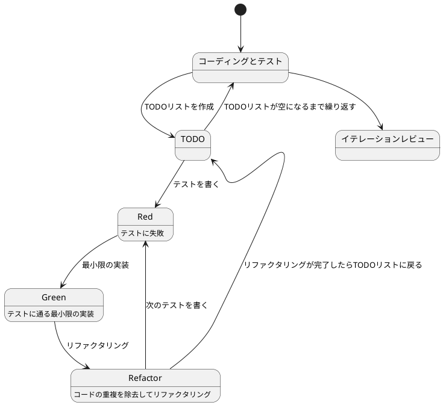
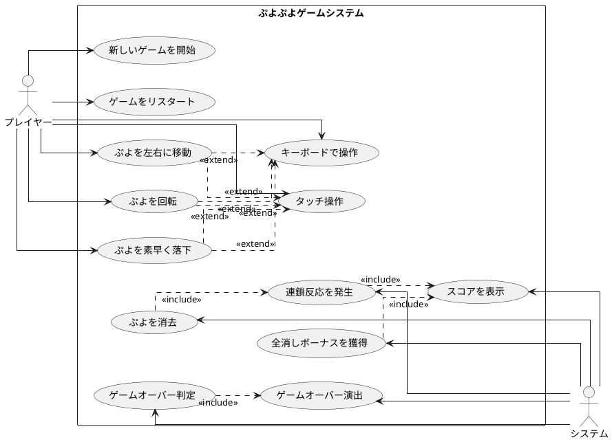

# ぷよぷよから始めるテスト駆動開発 C# Blazor版

## はじめに

みなさん、こんにちは！今日は私と一緒にテスト駆動開発（TDD）を使って、C# BlazorWebAssemblyでぷよぷよゲームを作っていきましょう。さて、プログラミングの旅に出る前に、皆さんは「テスト駆動開発」について聞いたことがありますか？もしかしたら「テストって、コードを書いた後にするものじゃないの？」と思われるかもしれませんね。

> テスト駆動開発とは、プログラミングの手法の一種で、「テストファースト」の原則に従い、実装前にテストを書くことで、コードの品質を高め、設計を改善していく開発手法です。
> 
> — Kent Beck 『テスト駆動開発』

この記事では、私たちが一緒にぷよぷよゲームを実装しながら、テスト駆動開発の基本的な流れと考え方を学んでいきます。まるでモブプログラミングのセッションのように、あなたと私が一緒に考え、コードを書き、改善していく過程を体験しましょう。「でも、ぷよぷよって結構複雑なゲームじゃないの？」と思われるかもしれませんが、心配いりません。各章では、ユーザーストーリーに基づいた機能を、テスト、実装、解説の順に少しずつ進めていきますよ。一歩一歩、着実に進んでいきましょう！

### テスト駆動開発のサイクル

さて、テスト駆動開発では、どのように進めていけばいいのでしょうか？「テストを書いてから実装する」というのは分かりましたが、具体的にはどんな手順で進めるのでしょうか？

私がいつも実践しているのは、以下の3つのステップを繰り返すサイクルです。皆さんも一緒にやってみましょう：

1. **Red（赤）**: まず失敗するテストを書きます。「え？わざと失敗するテストを？」と思われるかもしれませんが、これには重要な意味があるんです。これから実装する機能が何をすべきかを明確にするためなんですよ。
2. **Green（緑）**: 次に、テストが通るように、最小限のコードを実装します。この段階では、きれいなコードよりも「とにかく動くこと」を優先します。「最小限」というのがポイントです。必要以上のことはしないようにしましょう。
3. **Refactor（リファクタリング）**: 最後に、コードの品質を改善します。テストが通ることを確認しながら、重複を取り除いたり、わかりやすい名前をつけたりします。「動くけど汚いコード」から「動いてきれいなコード」へと進化させるんです。

> テスト駆動開発のリズム：赤、緑、リファクタリング。まず失敗するテストを書き（赤）、次にテストが通るようにする（緑）、そして重複を除去する（リファクタリング）。
> 
> — Kent Beck 『テスト駆動開発』

このサイクルを「Red-Green-Refactor」サイクルと呼びます。「赤・緑・リファクタリング」のリズムを刻むように、このサイクルを繰り返していくんです。これによって、少しずつ機能を追加し、コードの品質を高めていきましょう。皆さんも一緒にこのリズムを体感してみてください！



### 開発環境

さて、実際にコードを書く前に、私たちが使用する開発環境について少しお話ししておきましょう。皆さんは「道具選びは仕事の半分」という言葉を聞いたことがありますか？プログラミングでも同じことが言えるんです。

> 良いツールは良い仕事の第一歩です。適切な道具を選ぶことで、開発の効率と品質が大きく向上します。
> 
> — Andrew Hunt & David Thomas 『達人プログラマー』

「どんなツールを使えばいいの？」と思われるかもしれませんね。今回のプロジェクトでは、以下のツールを使用していきます：

- **言語**: C# — 「.NETって難しそう...」と思われるかもしれませんが、C#は強力な型システムと豊富なライブラリにより、大規模な開発でもバグを減らしやすくなるんです。
- **フレームワーク**: Blazor WebAssembly — 「Webアプリなのにサーバーサイド言語のC#？」驚かれるかもしれませんが、BlazorはC#をブラウザで実行できる素晴らしいフレームワークなんです！
- **テストフレームワーク**: xUnit — .NETエコシステムで広く使われている信頼性の高いテストフレームワークです。テスト駆動開発には欠かせないツールですね。
- **コードカバレッジ**: Coverlet — テストがどれだけコードをカバーしているかを可視化してくれます。「どこをテストすべき？」という疑問に答えてくれますよ。
- **静的コード解析**: Microsoft.CodeAnalysis.Analyzers — コードの品質を自動的にチェックし、潜在的な問題を早期に発見してくれます。
- **コードフォーマッタ**: dotnet format — 「チーム内でコーディングスタイルが統一されていない...」そんな悩みを解決してくれます。
- **バージョン管理**: Git — コードの変更履歴を追跡し、「あれ？昨日までちゃんと動いてたのに...」というときに過去の状態に戻れる魔法のツールです。

これらのツールを使って、テスト駆動開発の流れに沿ってぷよぷよゲームを実装していきましょう。「環境構築って難しそう...」と心配される方もいるかもしれませんが、今回のイテレーション0では、その環境構築についてしっかり解説していきますね！

## 要件

### ユーザーストーリー

さて、実際にコードを書き始める前に、少し立ち止まって考えてみましょう。「何を作るのか？」という基本的な問いかけです。私たちが作るぷよぷよゲームは、どのような機能を持つべきでしょうか？

アジャイル開発では、この「何を作るのか？」という問いに対して、「ユーザーストーリー」という形で答えを出します。皆さんは「ユーザーストーリー」という言葉を聞いたことがありますか？

> ユーザーストーリーとは、ソフトウェアの機能を「誰が」「何を」「なぜ」したいのかという形式で表現したものです。これにより、開発チームは常にユーザーの視点を忘れずに開発を進めることができます。
> 
> — Mike Cohn 『User Stories Applied』

つまり、「プレイヤーとして、〇〇ができる（〇〇したいから）」という形式で機能を表現するんです。これによって、「誰のため」の「どんな機能」を「なぜ」作るのかが明確になります。素晴らしいですよね！

では、私たちのぷよぷよゲームでは、どんなユーザーストーリーが考えられるでしょうか？一緒に考えてみましょう：

- プレイヤーとして、新しいゲームを開始できる（ゲームの基本機能として必要ですよね！）
- プレイヤーとして、落ちてくるぷよを左右に移動できる（ぷよを適切な位置に配置したいですよね）
- プレイヤーとして、落ちてくるぷよを回転できる（戦略的にぷよを配置するために必要です）
- プレイヤーとして、ぷよを素早く落下させることができる（「早く次のぷよを落としたい！」というときのために）
- プレイヤーとして、同じ色のぷよを4つ以上つなげると消去できる（これがぷよぷよの醍醐味ですよね！）
- プレイヤーとして、連鎖反応を起こしてより高いスコアを獲得できる（「れ〜んさ〜ん！」と叫びたくなりますよね）
- プレイヤーとして、全消し（ぜんけし）ボーナスを獲得できる（「やった！全部消えた！」という達成感を味わいたいですよね）
- プレイヤーとして、ゲームオーバーになるとゲーム終了の演出を見ることができる（終わりが明確でないとモヤモヤしますよね）
- プレイヤーとして、現在のスコアを確認できる（「今どれくらい点数取れてるかな？」と気になりますよね）
- プレイヤーとして、キーボードでぷよを操作できる（PCでプレイするなら必須ですよね）
- プレイヤーとして、タッチ操作でぷよを操作できる（スマホでもプレイしたいですよね）

「うわ、結構たくさんあるな...」と思われるかもしれませんが、心配いりません！これらのユーザーストーリーを一つずつ実装していくことで、徐々にゲームを完成させていきましょう。テスト駆動開発の素晴らしいところは、各ストーリーを小さなタスクに分解し、テスト→実装→リファクタリングのサイクルで少しずつ進められることなんです。一歩一歩、着実に進んでいきましょう！

### ユースケース図

ユーザーストーリーを整理したところで、「これらの機能がどのように関連しているのか、全体像が見えるといいな」と思いませんか？そんなときに役立つのが「ユースケース図」です。

「ユースケース図って何？」と思われるかもしれませんね。ユースケース図は、システムと外部アクター（ここではプレイヤーとシステム自体）の相互作用を視覚的に表現するための図です。「絵に描いて整理すると分かりやすい」というやつですね。

> ユースケース図は、システムが外部に提供する機能と、それを利用するアクターとの関係を表現します。これにより、システムの境界と責任範囲が明確になります。
> 
> — Martin Fowler 『UMLモデリングのエッセンス』

「百聞は一見にしかず」というように、実際に見てみるのが一番分かりやすいですよね。では、私たちのぷよぷよゲームのユースケース図を見てみましょう：



この図を見ると、プレイヤーとシステムの役割分担がよくわかりますね。プレイヤーはゲームの開始や操作を担当し、システムはぷよの消去判定やスコア計算などの内部処理を担当しています。また、キーボード操作とタッチ操作は「拡張（extend）」関係にあり、ぷよの移動や回転などの基本操作を異なる入力方法で実現していることがわかります。

このようにユースケース図を作成することで、システムの全体像を把握し、実装すべき機能の関連性を明確にすることができます。それでは、実際のコード実装に進んでいきましょう！

## イテレーション0: 開発環境の準備

「いきなりコードを書き始める前に、まず環境を整えましょう！」実は、この準備がとても重要なんです。良い道具を揃えておくことで、後の作業がとてもスムーズになりますよ。

### 自動化から始めるテスト駆動開発

エピソード1ではテスト駆動開発のゴールが **動作するきれいなコード** であることを学びました。では、良いコードを書き続けるためには何が必要になるでしょうか？それは[ソフトウェア開発の三種の神器](https://t-wada.hatenablog.jp/entry/clean-code-that-works)と呼ばれるものです。

> 今日のソフトウェア開発の世界において絶対になければならない3つの技術的な柱があります。
> 三本柱と言ったり、三種の神器と言ったりしていますが、それらは
> 
>   - バージョン管理
> 
>   - テスティング
> 
>   - 自動化
> 
> の3つです。
> 
> —  https://t-wada.hatenablog.jp/entry/clean-code-that-works 

これから、これら3つの神器を一つずつ準備していきます。「なんだか大変そう...」と思われるかもしれませんが、一度準備してしまえば、後は自動で動いてくれるので楽になりますよ！

### プロジェクトの作成

まずは、Blazor WebAssemblyプロジェクトを作成しましょう。「どうやって作るの？」というと、.NET CLIを使います。コマンド一つで簡単に作れるんですよ！

```bash
# プロジェクトディレクトリに移動
cd /workspaces/case-study-game-dev/app/csharp

# Blazor WebAssemblyプロジェクトを作成
dotnet new blazorwasm -n PuyoPuyoTDD -o PuyoPuyoTDD

# テストプロジェクトを作成
dotnet new xunit -n PuyoPuyoTDD.Tests -o PuyoPuyoTDD.Tests

# ソリューションファイルを作成
dotnet new sln -n PuyoPuyoTDD

# プロジェクトをソリューションに追加
dotnet sln add PuyoPuyoTDD/PuyoPuyoTDD.csproj
dotnet sln add PuyoPuyoTDD.Tests/PuyoPuyoTDD.Tests.csproj

# テストプロジェクトからメインプロジェクトへの参照を追加
cd PuyoPuyoTDD.Tests
dotnet add reference ../PuyoPuyoTDD/PuyoPuyoTDD.csproj
cd ..
```

「たくさんコマンドがあるなぁ...」と思われるかもしれませんが、一つずつ見ていきましょう：

1. `dotnet new blazorwasm` - Blazor WebAssemblyのプロジェクトを作成します
2. `dotnet new xunit` - xUnitのテストプロジェクトを作成します
3. `dotnet new sln` - ソリューションファイルを作成します（複数のプロジェクトをまとめて管理するため）
4. `dotnet sln add` - プロジェクトをソリューションに追加します
5. `dotnet add reference` - テストプロジェクトからメインプロジェクトを参照できるようにします

これでプロジェクトの基本構造ができました！

### バージョン管理

#### Gitリポジトリの初期化

次に、バージョン管理の準備をしましょう。「バージョン管理って何？」という方もいるかもしれませんね。簡単に言うと、「コードの変更履歴を記録して、いつでも過去の状態に戻れるようにする仕組み」なんです。

```bash
# Gitリポジトリを初期化（まだの場合）
# 既にリポジトリがある場合はスキップ

# .gitignoreファイルを作成
cat > .gitignore << 'EOF'
## Ignore Visual Studio temporary files, build results, and
## files generated by popular Visual Studio add-ons.

# User-specific files
*.suo
*.user
*.userosscache
*.sln.docstates

# Build results
[Dd]ebug/
[Dd]ebugPublic/
[Rr]elease/
[Rr]eleases/
x64/
x86/
[Bb]in/
[Oo]bj/

# Visual Studio cache/options directory
.vs/

# Test results
[Tt]est[Rr]esult*/
[Bb]uild[Ll]og.*

# Coverage reports
coverage/
TestResults/

# NuGet Packages
*.nupkg
.nuget/
EOF
```

`.gitignore`ファイルは、「このファイルはGitで管理しなくていいよ」と指定するためのファイルです。ビルド結果やテスト結果など、自動生成されるファイルは管理する必要がないですからね。

#### コミットメッセージの規約

Gitでコードを記録するとき、「コミットメッセージ」というものを書きます。「どんなふうに書けばいいの？」という疑問があるかもしれませんね。実は、わかりやすいメッセージを書くための規約があるんです。

これまで作業の区切りごとにリポジトリにコミットしていましたが、その際に以下のような書式でメッセージを書いていきます：

```bash
git commit -m 'feat: 新機能を追加'
git commit -m 'fix: バグを修正'
git commit -m 'refactor: コードをリファクタリング'
git commit -m 'test: テストを追加'
git commit -m 'chore: ビルド設定を変更'
```

この書式は [Angularルール](https://github.com/angular/angular.js/blob/master/DEVELOPERS.md#type)に従っています。具体的には、それぞれのコミットメッセージはヘッダ、ボディ、フッタで構成されています。ヘッダはタイプ、スコープ、タイトルというフォーマットで構成されています。

```
<タイプ>(<スコープ>): <タイトル>
<空行>
<ボディ>
<空行>
<フッタ>
```

ヘッダは必須です。ヘッダのスコープは任意です。コミットメッセージの長さは50文字までにしてください（そうすることでその他のGitツールと同様にGitHub上で読みやすくなります）。

コミットのタイプは次を用いて下さい：

- **feat**: 新しい機能の追加
- **fix**: バグ修正
- **docs**: ドキュメント変更のみ
- **style**: コードに影響を与えない変更（フォーマット、セミコロンの欠落など）
- **refactor**: 機能追加でもバグ修正でもないコード変更
- **perf**: パフォーマンスを改善するコード変更
- **test**: 存在しないテストの追加、または既存のテストの修正
- **chore**: ドキュメント生成のような、補助ツールやライブラリやビルドプロセスの変更

「なるほど、こうやって書けば、後から見たときに何をしたかがすぐわかりますね！」その通りです！

では、最初のコミットをしてみましょう：

```bash
cd PuyoPuyoTDD
git add .
git commit -m 'chore: プロジェクトの初期設定'
```

### パッケージマネージャ

では **自動化** の準備に入りたいのですが、そのためにはいくつかの外部ライブラリを利用する必要があります。.NETでは **NuGet** がパッケージマネージャとしての役割を果たします。

> NuGetとは、.NET用のパッケージマネージャーです。開発者が作成・共有したライブラリやツールを「パッケージ」として配布・利用することができます。

**NuGet**を使ってパッケージをインストールするのは簡単です：

```bash
# テストプロジェクトに必要なパッケージを追加
cd PuyoPuyoTDD.Tests
dotnet add package bunit
dotnet add package bunit.web
dotnet add package Microsoft.NET.Test.Sdk
cd ..
```

「bunitって何？」と思われるかもしれませんね。bunitはBlazorコンポーネントのテストを支援するライブラリです。「BlazorでテストするならbUnit」と覚えておくといいですよ！

C#/.NETプロジェクトでは、プロジェクトファイル（`.csproj`）にパッケージの依存関係が記述されます。これにより、プロジェクトをクローンした際に `dotnet restore` を実行するだけで必要なパッケージが自動的にインストールされます。便利ですよね！

実際にプロジェクトファイルを見てみましょう：

```bash
cat PuyoPuyoTDD.Tests/PuyoPuyoTDD.Tests.csproj
```

```xml
<Project Sdk="Microsoft.NET.Sdk">

  <PropertyGroup>
    <TargetFramework>net8.0</TargetFramework>
    <ImplicitUsings>enable</ImplicitUsings>
    <Nullable>enable</Nullable>
    <IsPackable>false</IsPackable>
  </PropertyGroup>

  <ItemGroup>
    <PackageReference Include="bunit" Version="1.26.64" />
    <PackageReference Include="bunit.web" Version="1.26.64" />
    <PackageReference Include="Microsoft.NET.Test.Sdk" Version="17.8.0" />
    <PackageReference Include="xunit" Version="2.6.2" />
    <PackageReference Include="xunit.runner.visualstudio" Version="2.5.4">
      <IncludeAssets>runtime; build; native; contentfiles; analyzers; buildtransitive</IncludeAssets>
      <PrivateAssets>all</PrivateAssets>
    </PackageReference>
  </ItemGroup>

  <ItemGroup>
    <ProjectReference Include="..\PuyoPuyoTDD\PuyoPuyoTDD.csproj" />
  </ItemGroup>

</Project>
```

「こうやって見ると、どんなパッケージを使っているかが一目瞭然ですね！」その通りです！

```bash
git add .
git commit -m 'chore: テスト用パッケージの追加'
```

### 静的コード解析

良いコードを書き続けるためには、コードの品質を維持していく必要があります。**テスト駆動開発**によりプログラムを動かしながら品質を改善していきますが、出来上がったコードに対する品質チェックの方法として**静的コード解析**があります。

C#/.NET用の**静的コード解析**ツールとして[Microsoft.CodeAnalysis.Analyzers](https://github.com/dotnet/roslyn-analyzers)を使って確認してみましょう。

```bash
# アナライザパッケージをインストール
cd PuyoPuyoTDD
dotnet add package Microsoft.CodeAnalysis.Analyzers
cd ..
```

次に、コード分析の設定ファイルを作成します。`.editorconfig`ファイルでコーディングスタイルを定義できます：

```bash
# PuyoPuyoTDDディレクトリに.editorconfigを作成
cat > .editorconfig << 'EOF'
root = true

[*]
indent_style = space
indent_size = 4
end_of_line = crlf
charset = utf-8
trim_trailing_whitespace = true
insert_final_newline = true

[*.cs]
# C# coding conventions
dotnet_sort_using_directives = true
dotnet_separate_import_directive_groups = false

# Language rules
csharp_prefer_var = false:suggestion
csharp_prefer_braces = true:warning

# Code quality rules
dotnet_diagnostic.CA1502.severity = warning
# CA1502: メソッドの循環的複雑度を7以下に制限
dotnet_code_quality.CA1502.cyclomatic_complexity = 7

# Naming conventions
dotnet_naming_rule.interface_should_be_begins_with_i.severity = warning
dotnet_naming_rule.interface_should_be_begins_with_i.symbols = interface
dotnet_naming_rule.interface_should_be_begins_with_i.style = begins_with_i

dotnet_naming_rule.types_should_be_pascal_case.severity = warning
dotnet_naming_rule.types_should_be_pascal_case.symbols = types
dotnet_naming_rule.types_should_be_pascal_case.style = pascal_case

dotnet_naming_symbols.interface.applicable_kinds = interface
dotnet_naming_symbols.interface.applicable_accessibilities = public, internal, private, protected, protected_internal, private_protected

dotnet_naming_symbols.types.applicable_kinds = class, struct, interface, enum
dotnet_naming_symbols.types.applicable_accessibilities = public, internal, private, protected, protected_internal, private_protected

dotnet_naming_style.begins_with_i.required_prefix = I
dotnet_naming_style.begins_with_i.capitalization = pascal_case

dotnet_naming_style.pascal_case.capitalization = pascal_case
EOF
```

「.editorconfigって何？」と思われるかもしれませんね。これは、コーディングスタイル（インデントの幅や命名規則など）を定義するファイルです。チーム全体で同じスタイルを共有できるので、「この人のコードは読みにくいな...」という問題が減りますよ！

**循環複雑度について**

ここで設定している`cyclomatic_complexity = 7`について少し説明しましょう。循環複雑度（Cyclomatic Complexity）とは、コードの複雑さを測る指標の一つです。

> 循環複雑度とは、プログラムの制御フローの複雑さを測る指標です。if文、for文、while文などの分岐や繰り返しが増えるほど、この値は大きくなります。値が高いほどコードの理解が難しく、バグが混入しやすくなります。
> 
> — Thomas J. McCabe 『A Complexity Measure』

一般的な目安として：
- **1-7**: シンプルで理解しやすい（推奨）
- **8-10**: やや複雑、注意が必要
- **11以上**: 複雑すぎる、リファクタリング推奨

「なぜ7なの？」と思われるかもしれませんね。これは、人間が一度に理解できる情報の量（マジカルナンバー7±2）に基づいた経験則です。メソッドの循環複雑度を7以下に保つことで、コードの理解しやすさとテストのしやすさを維持できます。

コード分析を実行してみましょう：

```bash
dotnet build
```

「ビルドするだけで静的コード解析もしてくれるんですね！」その通りです。そして、もしメソッドが複雑すぎる場合（循環複雑度が7を超える場合）、警告が表示されますよ！

```bash
git add .
git commit -m 'chore: 静的コード解析の設定'
```

### コードフォーマッタ

**コードフォーマッタ**は開発チーム内でのコーディングスタイルを統一するためのツールです。C#/.NETでは`dotnet format`コマンドが標準で提供されています。「わざわざインストールしなくていいんですか？」はい、最初から使えるんです！

コードのフォーマットを実行してみましょう：

```bash
dotnet format
```

このコマンドにより、プロジェクト内のすべてのC#ファイルが`.editorconfig`で定義されたルールに従ってフォーマットされます。「自動で整形してくれるなんて楽ちんですね！」

フォーマットの確認のみを行いたい場合は：

```bash
dotnet format --verify-no-changes
```

「これって何をチェックしてるんですか？」このコマンドは、コードがフォーマットルールに従っているかを確認だけして、実際には変更しません。CI/CD環境で使うと便利ですよ！

```bash
git add .
git commit -m 'chore: コードフォーマッタの設定'
```

### コードカバレッジ

**コードカバレッジ**はテストがプロダクションコードをどのくらいカバーしているかを測る指標です。「テストを書いたつもりだけど、実は重要な部分がテストされてなかった...」そんなことを防ぐために役立ちます。

C#/.NETでは`coverlet`がよく使われます：

```bash
# カバレッジツールをインストール
cd PuyoPuyoTDD.Tests
dotnet add package coverlet.collector
dotnet add package coverlet.msbuild
cd ..

# レポート生成ツールをインストール
dotnet tool install -g dotnet-reportgenerator-globaltool
```

「dotnet toolって何ですか？」良い質問です！dotnet toolは、.NET CLI用のグローバルツールを管理する仕組みです。一度インストールすれば、どこからでも使えるようになりますよ。

テストをカバレッジ付きで実行してみましょう：

```bash
# カバレッジを収集しながらテスト実行
dotnet test --collect:"XPlat Code Coverage" --results-directory ./TestResults

# HTML形式のレポートを生成
reportgenerator -reports:"./TestResults/**/coverage.cobertura.xml" -targetdir:"coverage" -reporttypes:Html
```

「生成された`coverage/index.html`をブラウザで開くとカバレッジレポートを確認できます！」カラフルなレポートでどこがテストされているか一目瞭然ですよ。

ワンコマンドでカバレッジレポートを生成するスクリプトを作成しましょう：

```bash
# PuyoPuyoTDDディレクトリにcoverage.shを作成
cat > coverage.sh << 'EOF'
#!/bin/bash
# coverage.sh - コードカバレッジレポート生成スクリプト

echo "🧪 テスト実行とカバレッジ収集中..."
dotnet test --collect:"XPlat Code Coverage" --results-directory ./TestResults

echo "📊 カバレッジレポート生成中..."
reportgenerator -reports:"./TestResults/**/coverage.cobertura.xml" -targetdir:"coverage" -reporttypes:Html

echo "✅ カバレッジレポートが coverage/index.html に生成されました"
echo ""
echo "ブラウザで確認するには以下のコマンドを実行してください:"
echo "  \$BROWSER coverage/index.html"
EOF

chmod +x coverage.sh
```

スクリプトを実行してみましょう：

```bash
./coverage.sh
```

「スクリプト化すると、毎回長いコマンドを打たなくて済むから便利ですね！」その通りです！

```bash
git add .
git commit -m 'chore: コードカバレッジの設定'
```

### タスクランナー

良いコードを書き続けるために今まで色々なツールを導入してきましたが、毎回個別に実行するのは面倒です。「フォーマットして、ビルドして、テストして、カバレッジも確認して...」うんざりしちゃいますよね？

そこで**タスクランナー**の出番です！C#/.NETプロジェクトでは、**Cake**という強力なビルド自動化システムを使うことができます。

> Cakeとは、C#をDSL（ドメイン特化言語）として使用するクロスプラットフォームのビルドオートメーションシステムです。Make、Rake、PSakeと同様の概念ですが、C#の構文を活用できるため、.NET開発者にとって親しみやすいツールです。

まず、Cakeをグローバルツールとしてインストールしましょう：

```bash
# Cakeツールをインストール
dotnet tool install -g Cake.Tool
```

次に、`build.cake`ファイルを作成して、よく使うタスクを定義しましょう：

```bash
cat > build.cake << 'EOF'
///////////////////////////////////////////////////////////////////////////////
// ARGUMENTS
///////////////////////////////////////////////////////////////////////////////

var target = Argument("target", "Default");
var configuration = Argument("configuration", "Release");

///////////////////////////////////////////////////////////////////////////////
// SETUP / TEARDOWN
///////////////////////////////////////////////////////////////////////////////

Setup(ctx =>
{
   Information("Running tasks...");
   Information("Target: {0}", target);
});

Teardown(ctx =>
{
   Information("Finished running tasks.");
});

///////////////////////////////////////////////////////////////////////////////
// TASKS
///////////////////////////////////////////////////////////////////////////////

Task("Clean")
    .Description("プロジェクトのクリーンアップ")
    .Does(() =>
{
    Information("クリーンアップを実行中...");
    DotNetClean("./PuyoPuyoTDD.sln");
    CleanDirectory("./coverage");
    CleanDirectory("./TestResults");
});

Task("Restore")
    .Description("NuGetパッケージの復元")
    .IsDependentOn("Clean")
    .Does(() =>
{
    Information("パッケージを復元中...");
    DotNetRestore("./PuyoPuyoTDD.sln");
});

Task("Format")
    .Description("コードフォーマットの実行")
    .Does(() =>
{
    Information("コードをフォーマット中...");
    DotNetFormat("./PuyoPuyoTDD.sln");
});

Task("Build")
    .Description("プロジェクトのビルド")
    .IsDependentOn("Restore")
    .Does(() =>
{
    Information("ビルドを実行中...");
    DotNetBuild("./PuyoPuyoTDD.sln", new DotNetBuildSettings
    {
        Configuration = configuration,
        NoRestore = true
    });
});

Task("Test")
    .Description("テストの実行")
    .IsDependentOn("Build")
    .Does(() =>
{
    Information("テストを実行中...");
    DotNetTest("./PuyoPuyoTDD.Tests/PuyoPuyoTDD.Tests.csproj", new DotNetTestSettings
    {
        Configuration = configuration,
        NoBuild = true,
        NoRestore = true
    });
});

Task("Coverage")
    .Description("コードカバレッジの測定")
    .IsDependentOn("Build")
    .Does(() =>
{
    Information("カバレッジを測定中...");
    
    // カバレッジ付きテスト実行
    DotNetTest("./PuyoPuyoTDD.Tests/PuyoPuyoTDD.Tests.csproj", new DotNetTestSettings
    {
        Configuration = configuration,
        NoBuild = true,
        NoRestore = true,
        ArgumentCustomization = args => args
            .Append("--collect:\"XPlat Code Coverage\"")
            .Append("--results-directory ./TestResults")
    });
    
    // レポート生成
    Information("カバレッジレポートを生成中...");
    StartProcess("reportgenerator", new ProcessSettings
    {
        Arguments = new ProcessArgumentBuilder()
            .Append("-reports:./TestResults/**/coverage.cobertura.xml")
            .Append("-targetdir:./coverage")
            .Append("-reporttypes:Html")
    });
    
    Information("✅ カバレッジレポートが coverage/index.html に生成されました");
});

Task("Quality")
    .Description("すべての品質チェックを実行")
    .IsDependentOn("Format")
    .IsDependentOn("Build")
    .IsDependentOn("Test")
    .IsDependentOn("Coverage")
    .Does(() =>
{
    Information("✅ すべての品質チェックが完了しました！");
});

Task("Watch")
    .Description("ファイル監視と自動ビルド・テスト")
    .Does(() =>
{
    Information("ファイル監視を開始します...");
    Information("終了するには Ctrl+C を押してください");
    
    var settings = new DotNetWatchSettings
    {
        Project = "./PuyoPuyoTDD.Tests/PuyoPuyoTDD.Tests.csproj"
    };
    
    DotNetWatch("test", settings);
});

Task("Default")
    .Description("デフォルトタスク（Quality）")
    .IsDependentOn("Quality");

///////////////////////////////////////////////////////////////////////////////
// EXECUTION
///////////////////////////////////////////////////////////////////////////////

RunTarget(target);
EOF
```

「このCakeファイルは何をしてくれるんですか？」良い質問です！このCakeファイルでは、以下のタスクを定義しています：

- **Clean**: ビルド成果物とテスト結果をクリーンアップ
- **Restore**: NuGetパッケージを復元
- **Format**: コードをフォーマット
- **Build**: プロジェクトをビルド
- **Test**: テストを実行
- **Coverage**: カバレッジを測定してレポート生成
- **Quality**: すべての品質チェックを実行（デフォルト）
- **Watch**: ファイル監視と自動テスト実行

タスクを実行してみましょう：

```bash
# デフォルトタスク（Quality）を実行
dotnet cake

# 特定のタスクを実行
dotnet cake --target=Clean
dotnet cake --target=Format
dotnet cake --target=Build
dotnet cake --target=Test
dotnet cake --target=Coverage

# すべての品質チェックを実行
dotnet cake --target=Quality
```

「Cakeを使うと、C#の構文でビルドスクリプトが書けるので、.NET開発者にとってとても自然ですね！」その通りです！

Cakeの良いところは：

1. **C#で書ける**: .NET開発者にとって親しみやすい
2. **依存関係管理**: タスク間の依存関係を自動で解決
3. **クロスプラットフォーム**: Windows、Linux、macOSで動作
4. **豊富なエコシステム**: 多くのアドインとヘルパーが利用可能

```bash
git add .
git commit -m 'chore: Cakeタスクランナーの設定'
```

### タスクの自動化

**Cake**により品質をチェックするタスクは用意されましたが、まだ手動で実行する必要があります。「ファイルを保存するたびに自動でテストが走ったら便利なのにな...」と思いませんか？

実は、Cakeには**Watch**タスクを使って自動実行する機能が既に含まれています！また、より細かい制御が必要な場合は、カスタムスクリプトを作成することもできます。

#### 方法1: Cakeの組み込みWatchタスクを使用

最もシンプルな方法は、`build.cake`で定義した`Watch`タスクを使うことです：

```bash
# Cakeのwatchタスクを実行
dotnet cake --target=Watch
```

「これだけで自動テストが動くんですね！」そうなんです。.NET CLIの`dotnet watch`コマンドを利用しているので、ファイルが変更されるたびに自動的にテストが実行されますよ。

#### 方法2: カスタム監視スクリプトを使用（高度な制御）

もし、Cakeタスクを組み合わせた自動実行が必要な場合は、カスタムスクリプトを作成することもできます。Linuxの`inotify-tools`を使ってファイル監視スクリプトを作成しましょう：

```bash
# inotify-toolsがインストールされているか確認
which inotifywait || sudo apt-get update && sudo apt-get install -y inotify-tools
```

ファイル監視と自動実行のスクリプト`watch.sh`を作成します：

```bash
cat > watch.sh << 'EOF'
#!/bin/bash
# watch.sh - Cakeを使った自動品質チェック

echo "=== C#/.NET Blazor ぷよぷよTDD ファイル監視開始 ==="
echo "ファイル変更を監視中..."
echo "終了するには Ctrl+C を押してください"
echo ""

# 初回実行
echo "🔄 初回品質チェック実行..."
dotnet cake --target=Quality

# ファイル監視開始（PuyoPuyoTDDとPuyoPuyoTDD.Testsディレクトリを監視）
inotifywait -m -r -e modify,create,delete \
    --include='\.cs$|\.razor$|\.cake$' \
    --exclude='(bin|obj|coverage|TestResults|tools)/' \
    PuyoPuyoTDD/ PuyoPuyoTDD.Tests/ build.cake 2>/dev/null | while read path action file; do
    
    echo ""
    echo "📝 変更検出: $file ($action)"
    echo "🔄 Cakeタスクを実行中..."
    
    # Cakeでフォーマット、ビルド、テストを実行
    dotnet cake --target=Format
    dotnet cake --target=Build
    dotnet cake --target=Test
    
    if [ $? -eq 0 ]; then
        echo "✅ すべてのチェックが成功しました"
    else
        echo "❌ チェックに失敗しました"
    fi
    echo ""
done
EOF

chmod +x watch.sh
```

「このスクリプトは何をしてくれるんですか？」良い質問です！このスクリプトは：

1. 最初に一度、Cakeの`Quality`タスクを実行します（フォーマット、ビルド、テスト、カバレッジ）
2. その後、`.cs`、`.razor`、`.cake`ファイルの変更を監視します
3. ファイルが変更されたら、自動的にCakeタスクを実行します
4. 結果を見やすく表示してくれます（✅成功、❌失敗）

「実際に動かしてみましょう！」

```bash
# Cakeの組み込みWatchを使う（推奨）
dotnet cake --target=Watch

# または、カスタムスクリプトを使う
./watch.sh
```

「わぁ、ファイルを保存するたびに自動でテストが走りますね！これは便利！」そうなんです。これで、コードを書くことだけに集中できるようになりました。

#### どちらの方法を選ぶべき？

- **Cakeの組み込みWatch**: シンプルで、テストの自動実行だけが必要な場合
- **カスタムスクリプト**: フォーマット、カバレッジなど、複数のタスクを組み合わせたい場合

「ほとんどの場合は、Cakeの組み込みWatchで十分ですね！」その通りです。開発中は`dotnet cake --target=Watch`を実行しておけば、テストが自動実行されます。

別のターミナルを開いて、何かファイルを変更してみてください。変更が検出されて自動的にタスクが実行されることが確認できるはずです。

テストがパスすることが確認できたらコミットしておきましょう。このときターミナルでは`Watch`やスクリプトが動いているので、別ターミナルを開いてコミットを実施すると良いでしょう。

```bash
git add .
git commit -m 'chore: タスクの自動化'
```

### 動作確認

さて、ここまでで環境構築は完了です！「本当に動くんでしょうか？」試してみましょう。

まず、簡単なテストを書いて、すべてが正しく動作することを確認します：

```bash
# サンプルテストファイルを編集
cat > PuyoPuyoTDD.Tests/SampleTest.cs << 'EOF'
using Xunit;

namespace PuyoPuyoTDD.Tests;

public class SampleTest
{
    [Fact]
    public void 基本的なテストが動作する()
    {
        // Arrange（準備）
        int a = 1;
        int b = 2;

        // Act（実行）
        int result = a + b;

        // Assert（検証）
        Assert.Equal(3, result);
    }

    [Theory]
    [InlineData(1, 2, 3)]
    [InlineData(0, 0, 0)]
    [InlineData(-1, 1, 0)]
    public void 複数のケースをテストできる(int a, int b, int expected)
    {
        // Act
        int result = a + b;

        // Assert
        Assert.Equal(expected, result);
    }
}
EOF
```

「このテストは何をテストしてるんですか？」良い質問です！これは実際のテストではなく、環境が正しく動作することを確認するためのサンプルです。「1+2=3」という簡単な計算をテストしています。

テストを実行してみましょう：

```bash
dotnet test
# または、Cakeを使って
dotnet cake --target=Test
```

「テストが通りましたね！」素晴らしい！では、わざと失敗するテストを書いてみましょう：

```bash
cat >> PuyoPuyoTDD.Tests/SampleTest.cs << 'EOF'

    [Fact]
    public void わざと失敗するテスト()
    {
        // わざと間違った期待値を設定
        Assert.Equal(5, 1 + 2);
    }
}
EOF
```

もう一度テストを実行してみましょう：

```bash
dotnet test
# または、Cakeを使って
./build.sh --target=Test
```
    }
EOF
```

もう一度テストを実行してみましょう：

```bash
dotnet test
# または、Cakeを使って
dotnet cake --target=Test
```

「テストが失敗しましたね！」そうです。これは期待通りの動作です。テストが失敗することも正しく検出できることが確認できました。

では、失敗するテストを削除して、もう一度確認しましょう：

```bash
# 失敗するテストを削除（ファイルを元に戻す）
cat > PuyoPuyoTDD.Tests/SampleTest.cs << 'EOF'
using Xunit;

namespace PuyoPuyoTDD.Tests;

public class SampleTest
{
    [Fact]
    public void 基本的なテストが動作する()
    {
        // Arrange（準備）
        int a = 1;
        int b = 2;

        // Act（実行）
        int result = a + b;

        // Assert（検証）
        Assert.Equal(3, result);
    }

    [Theory]
    [InlineData(1, 2, 3)]
    [InlineData(0, 0, 0)]
    [InlineData(-1, 1, 0)]
    public void 複数のケースをテストできる(int a, int b, int expected)
    {
        // Act
        int result = a + b;

        // Assert
        Assert.Equal(expected, result);
    }
}
EOF

dotnet test
# または、Cakeを使って
dotnet cake --target=Test
```

「すべてのテストが通りましたね！」完璧です！

最後にカバレッジレポートも確認してみましょう：

```bash
# Cakeを使ってカバレッジを測定
dotnet cake --target=Coverage
```

「coverage/index.htmlができましたね！」ブラウザで開いてみましょう：

```bash
$BROWSER coverage/index.html
```

「カバレッジレポートが見れました！」素晴らしい！これで、どのコードがテストされているか視覚的に確認できますね。

Cakeのすべてのタスクを一度に実行することもできます：

```bash
# すべての品質チェックを実行
dotnet cake --target=Quality
# または
dotnet cake  # デフォルトでQualityタスクが実行される
```

「Format→Build→Test→Coverageが順番に実行されましたね！」その通りです。Cakeのタスク依存関係が自動的に解決されて、必要なタスクが順番に実行されます。

すべての確認が終わったら、コミットしておきましょう：

```bash
git add .
git commit -m 'test: サンプルテストの追加'
```

### イテレーション0のまとめ

お疲れさまでした！イテレーション0が完了しました。ここまでで、以下のことができるようになりました：

1. **プロジェクトの作成**: Blazor WebAssemblyプロジェクトとテストプロジェクトの作成
2. **バージョン管理**: Gitリポジトリの初期化とコミットメッセージの規約
3. **パッケージ管理**: NuGetを使った依存関係の管理（bUnit、Coverletなど）
4. **静的コード解析**: Microsoft.CodeAnalysis.Analyzersによるコード品質の自動チェック
5. **コードフォーマッタ**: dotnet formatによるコーディングスタイルの統一
6. **コードカバレッジ**: Coverlet + ReportGeneratorによるテストカバレッジの測定と可視化
7. **タスクランナー**: CakeによるC#ベースのビルド自動化
8. **タスクの自動化**: dotnet watchまたはinotify-toolsによるファイル監視と自動実行

これで[ソフトウェア開発の三種の神器](https://t-wada.hatenablog.jp/entry/clean-code-that-works)が揃いました：

- ✅ **バージョン管理**: Git + Angularルールのコミットメッセージ
- ✅ **テスティング**: xUnit + bUnit + Coverlet
- ✅ **自動化**: Cake + dotnet watch（またはカスタムwatch.sh）

**Cakeを使うメリット**:
- C#で書けるので.NET開発者にとって自然
- タスクの依存関係を宣言的に定義できる
- クロスプラットフォームで動作
- 豊富なアドインとヘルパー機能
- IDE統合とデバッグサポート

「これでテスト駆動開発を始める準備が整いましたね！」その通りです！次のイテレーションからは、実際にぷよぷよゲームの機能を実装していきますよ。

開発を始めるときは、以下のコマンドを実行しておけば、ファイルを保存するたびに自動でテストが実行されるので、テスト駆動開発のリズム（Red-Green-Refactor）に集中できますね！

```bash
# 方法1: Cakeの組み込みWatchを使う（推奨）
dotnet cake --target=Watch

# 方法2: カスタムスクリプトを使う（より詳細な制御が必要な場合）
./watch.sh

# 方法3: 品質チェックを手動実行
dotnet cake --target=Quality

# 別のターミナルでコードを編集
# ファイルを保存するたびに自動でテストが実行される！
```

**よく使うCakeコマンド**:
```bash
dotnet cake                      # すべての品質チェック（デフォルト）
dotnet cake --target=Clean       # クリーンアップ
dotnet cake --target=Format      # コードフォーマット
dotnet cake --target=Build       # ビルド
dotnet cake --target=Test        # テスト実行
dotnet cake --target=Coverage    # カバレッジ測定
dotnet cake --target=Watch       # 自動テスト実行
```

それでは、次のイテレーション1で実際のゲーム機能の実装に取り組んでいきましょう！

## イテレーション1: ゲーム開始の実装

さあ、いよいよコードを書き始めましょう！テスト駆動開発では、小さなイテレーション（反復）で機能を少しずつ追加していきます。最初のイテレーションでは、最も基本的な機能である「ゲームの開始」を実装します。

> イテレーション開発とは、ソフトウェアを小さな機能単位で繰り返し開発していく手法です。各イテレーションで計画、設計、実装、テスト、評価のサイクルを回すことで、リスクを早期に発見し、フィードバックを得ながら開発を進めることができます。
> 
> — Craig Larman 『アジャイル開発とスクラム』

### ユーザーストーリー

まずは、このイテレーションで実装するユーザーストーリーを確認しましょう：

> プレイヤーとして、新しいゲームを開始できる

このシンプルなストーリーから始めることで、ゲームの基本的な構造を作り、後続の機能追加の土台を築くことができます。では、テスト駆動開発のサイクルに従って、まずはテストから書いていきましょう！

### TODOリスト

さて、ユーザーストーリーを実装するために、まずはTODOリストを作成しましょう。TODOリストは、大きな機能を小さなタスクに分解するのに役立ちます。

> TODOリストは、テスト駆動開発の重要なプラクティスの一つです。実装前に必要なタスクを明確にすることで、開発の方向性を保ち、何も見落とさないようにします。
> 
> — Kent Beck 『テスト駆動開発』

私たちの「新しいゲームを開始できる」というユーザーストーリーを実現するためには、どのようなタスクが必要でしょうか？考えてみましょう：

- ゲームの初期化処理を実装する（ゲームの状態や必要なコンポーネントを設定する）
- Blazorコンポーネントを作成する（プレイヤーが視覚的にゲームを認識できるようにする）
- 新しいぷよを生成する（ゲーム開始時に最初のぷよを作成する）
- ゲームループを開始する（ゲームの継続的な更新と描画を行う）

これらのタスクを一つずつ実装していきましょう。テスト駆動開発では、各タスクに対してテスト→実装→リファクタリングのサイクルを回します。まずは「ゲームの初期化処理」から始めましょう！

### テスト: ゲームの初期化

さて、TODOリストの最初のタスク「ゲームの初期化処理を実装する」に取り掛かりましょう。テスト駆動開発では、まずテストを書くことから始めます。

> テストファースト
> 
> いつテストを書くべきだろうか——それはテスト対象のコードを書く前だ。
> 
> — Kent Beck 『テスト駆動開発』

では、ゲームの初期化処理をテストするコードを書いてみましょう。何をテストすべきでしょうか？ゲームが初期化されたとき、必要なコンポーネントが正しく作成され、ゲームの状態が適切に設定されていることを確認する必要がありますね。

```csharp
// PuyoPuyoTDD.Tests/Models/GameTest.cs
using Xunit;
using PuyoPuyoTDD.Models;

namespace PuyoPuyoTDD.Tests.Models;

public class GameTest
{
    [Fact]
    public void ゲームを初期化すると必要なコンポーネントが作成される()
    {
        // Arrange & Act
        var game = new Game();
        game.Initialize();

        // Assert
        Assert.NotNull(game.Config);
        Assert.NotNull(game.Stage);
        Assert.NotNull(game.Player);
        Assert.NotNull(game.Score);
    }

    [Fact]
    public void ゲームを初期化するとゲームモードがStartになる()
    {
        // Arrange
        var game = new Game();

        // Act
        game.Initialize();

        // Assert
        Assert.Equal(GameMode.Start, game.Mode);
    }
}
```

このテストでは、`Game`クラスの`Initialize`メソッドが正しく動作することを確認しています。具体的には、必要なコンポーネント（Config, Stage, Player, Score）が作成され、ゲームモードが`Start`に設定されることを検証しています。

### 実装: ゲームの初期化

テストを書いたら、次に実行してみましょう。どうなるでしょうか？

```
error CS0246: 型または名前空間の名前 'Game' が見つかりませんでした
```

おっと！まだ`Game`クラスを実装していないので、当然エラーになりますね。これがテスト駆動開発の「Red（赤）」の状態です。テストが失敗することを確認できました。

> 失敗するテスト
> 
> テストが失敗することを確認してから実装に取り掛かろう。そうすれば、テストが正しく機能していることがわかる。
> 
> — Kent Beck 『テスト駆動開発』

では、テストが通るように最小限のコードを実装していきましょう。「最小限」というのがポイントです。この段階では、テストが通ることだけを目指して、必要最低限のコードを書きます。

```csharp
// PuyoPuyoTDD/Models/Game.cs
namespace PuyoPuyoTDD.Models;

public enum GameMode
{
    Start,
    CheckFall,
    Fall,
    CheckErase,
    Erasing,
    NewPuyo,
    Playing,
    GameOver
}

public class Game
{
    public Config Config { get; private set; } = null!;
    public Stage Stage { get; private set; } = null!;
    public Player Player { get; private set; } = null!;
    public Score Score { get; private set; } = null!;
    public GameMode Mode { get; private set; }
    
    private int _frame;
    private int _combinationCount;

    public void Initialize()
    {
        // 各コンポーネントの初期化
        Config = new Config();
        Stage = new Stage(Config);
        Player = new Player(Config, Stage);
        Score = new Score();

        // ゲームモードを設定
        Mode = GameMode.Start;
        _frame = 0;
        _combinationCount = 0;
    }
}
```

### 解説: ゲームの初期化

テストが通りましたね！おめでとうございます。これがテスト駆動開発の「Green（緑）」の状態です。

> テストが通ったら、次はリファクタリングだ。でも、その前に少し立ち止まって、今書いたコードについて考えてみよう。
> 
> — Martin Fowler 『リファクタリング』

実装したゲームの初期化処理について、少し解説しておきましょう。この処理では、主に以下のことを行っています：

1. 各コンポーネント（Config, Stage, Player, Score）のインスタンスを作成
2. ゲームモードを`Start`に設定
3. フレームカウンタと連鎖カウンタを初期化

これにより、ゲームを開始するための準備が整います。各コンポーネントの役割を理解しておくと、今後の実装がスムーズになりますよ：

- **Config**: ゲームの設定値を管理します（画面サイズ、ぷよの大きさなど）
- **Stage**: ゲームのステージ（盤面）を管理します（ぷよの配置状態、消去判定など）
- **Player**: プレイヤーの入力と操作を管理します（キーボード入力の処理、ぷよの移動など）
- **Score**: スコアの計算と表示を管理します（連鎖数に応じたスコア計算など）

このように、責任を明確に分けることで、コードの保守性が高まります。これはオブジェクト指向設計の基本原則の一つ、「単一責任の原則」に従っています。

> 単一責任の原則（SRP）：クラスを変更する理由は1つだけであるべき。
> 
> — Robert C. Martin 『Clean Architecture』

### Blazorコンポーネントの作成

次に、ゲームを表示するためのBlazorコンポーネントを作成しましょう。Blazor WebAssemblyでは、Razorコンポーネントを使ってUIを構築します。

```razor
@* PuyoPuyoTDD/Pages/GamePage.razor *@
@page "/game"
@using PuyoPuyoTDD.Models
@inject IJSRuntime JSRuntime

<div class="game-container">
    <h3>ぷよぷよ TDD</h3>
    <div class="game-area">
        <canvas id="stage" width="192" height="384"></canvas>
        <div class="info-panel">
            <div class="score-display">
                <p>スコア</p>
                <p id="score">0</p>
            </div>
            <div class="next-display">
                <p>NEXT</p>
                <canvas id="next" width="32" height="64"></canvas>
            </div>
        </div>
    </div>
</div>

@code {
    private Game? _game;

    protected override async Task OnAfterRenderAsync(bool firstRender)
    {
        if (firstRender)
        {
            _game = new Game();
            _game.Initialize();
            await JSRuntime.InvokeVoidAsync("startGameLoop", DotNetObjectReference.Create(this));
        }
    }

    [JSInvokable]
    public void UpdateGame()
    {
        _game?.Update();
    }
}
```

### 解説: Blazorコンポーネント

このBlazorコンポーネントでは、以下のことを行っています：

1. **Canvas要素の配置**: ゲームの盤面とNEXTぷよを表示するためのcanvas要素を配置
2. **コンポーネントライフサイクル**: `OnAfterRenderAsync`メソッドで初回レンダリング後にゲームを初期化
3. **JavaScript相互運用**: `JSRuntime`を使ってJavaScriptのゲームループを呼び出す
4. **JSInvokable属性**: JavaScript側からC#のメソッドを呼び出せるようにする

Blazor WebAssemblyでは、ゲームループのような高頻度の処理はJavaScript側で実行し、C#側のビジネスロジックを呼び出す方式が推奨されます。これにより、パフォーマンスを最適化できます。

### JavaScriptの実装

Blazorから呼び出されるJavaScript側の実装も必要です。

```javascript
// wwwroot/js/game.js
window.startGameLoop = function (dotnetHelper) {
    function gameLoop() {
        dotnetHelper.invokeMethodAsync('UpdateGame');
        requestAnimationFrame(gameLoop);
    }
    requestAnimationFrame(gameLoop);
};
```

このJavaScriptコードでは、`requestAnimationFrame`を使って60FPSでゲームループを実行し、各フレームでC#側の`UpdateGame`メソッドを呼び出します。

## イテレーション2: ぷよの移動の実装

さて、前回のイテレーションでゲームの基本的な構造ができましたね。「ゲームが始まったけど、ぷよが動かないと面白くないよね？」と思いませんか？そこで次は、ぷよを左右に移動できるようにしていきましょう！

### ユーザーストーリー

まずは、このイテレーションで実装するユーザーストーリーを確認しましょう：

> プレイヤーとして、落ちてくるぷよを左右に移動できる

「ぷよぷよって、落ちてくるぷよを左右に動かして、うまく積み上げるゲームですよね？」そうです！今回はその基本操作である「左右の移動」を実装していきます。

### TODOリスト

さて、このユーザーストーリーを実現するために、どんなタスクが必要でしょうか？一緒に考えてみましょう。

> TODOリストは、大きな問題を小さな問題に分割するための強力なツールです。複雑な問題に直面したとき、それを管理可能な小さなタスクに分解することで、一歩一歩確実に前進できます。
> 
> — Kent Beck 『テスト駆動開発』

「ぷよを左右に移動する」という機能を実現するためには、以下のようなタスクが必要そうですね：

- プレイヤーの入力を検出する（キーボードの左右キーが押されたことを検知する）
- ぷよを左右に移動する処理を実装する（実際にぷよの位置を変更する）
- 移動可能かどうかのチェックを実装する（画面の端や他のぷよにぶつかる場合は移動できないようにする）
- 移動後の表示を更新する（画面上でぷよの位置が変わったことを表示する）

「なるほど、順番に実装していけばいいんですね！」そうです、一つずつ進めていきましょう。テスト駆動開発の流れに沿って、まずはテストから書いていきますよ。

### テスト: プレイヤーの入力検出

「最初に何をテストすればいいんでしょうか？」まずは、プレイヤーの入力を検出する部分からテストしていきましょう。キーボードの左右キーが押されたときに、それを正しく検知できるかどうかをテストします。

> テストファースト
> 
> いつテストを書くべきだろうか——それはテスト対象のコードを書く前だ。
> 
> — Kent Beck 『テスト駆動開発』

```csharp
// PuyoPuyoTDD.Tests/Models/PlayerTest.cs
using Xunit;
using PuyoPuyoTDD.Models;

namespace PuyoPuyoTDD.Tests.Models;

public class PlayerTest
{
    private readonly Config _config;
    private readonly Stage _stage;
    private readonly Player _player;

    public PlayerTest()
    {
        _config = new Config();
        _stage = new Stage(_config);
        _player = new Player(_config, _stage);
    }

    [Fact]
    public void 左キーが押されると左向きの移動フラグが立つ()
    {
        // Act
        _player.SetInputLeft(true);

        // Assert
        Assert.True(_player.InputKeyLeft);
    }

    [Fact]
    public void 右キーが押されると右向きの移動フラグが立つ()
    {
        // Act
        _player.SetInputRight(true);

        // Assert
        Assert.True(_player.InputKeyRight);
    }

    [Fact]
    public void キーが離されると対応する移動フラグが下がる()
    {
        // Arrange
        _player.SetInputLeft(true);
        Assert.True(_player.InputKeyLeft);

        // Act
        _player.SetInputLeft(false);

        // Assert
        Assert.False(_player.InputKeyLeft);
    }
}
```

「このテストは何をしているんですか？」このテストでは、キーボードの左右キーが押されたときと離されたときに、`Player`クラスの中の対応するフラグが正しく設定されるかどうかを確認しています。

### 実装: プレイヤーの入力検出

「失敗するテストができたので、次は実装ですね！」そうです！テストが通るように、最小限のコードを実装していきましょう。

> 最小限の実装
> 
> テストを通すために、どれだけのコードを書けばよいだろうか——テストが通る最小限のコードだけを書こう。
> 
> — Kent Beck 『テスト駆動開発』

```csharp
// PuyoPuyoTDD/Models/Player.cs
namespace PuyoPuyoTDD.Models;

public class Player
{
    private readonly Config _config;
    private readonly Stage _stage;
    
    public bool InputKeyLeft { get; private set; }
    public bool InputKeyRight { get; private set; }
    public bool InputKeyUp { get; private set; }
    public bool InputKeyDown { get; private set; }
    
    private int _puyoX = 2; // ぷよのX座標（中央に配置）
    private int _puyoY = 0; // ぷよのY座標（一番上）
    private int _puyoType; // 現在のぷよの種類
    private int _nextPuyoType; // 次のぷよの種類
    private int _rotation; // 現在の回転状態

    public Player(Config config, Stage stage)
    {
        _config = config;
        _stage = stage;
    }

    public void SetInputLeft(bool value)
    {
        InputKeyLeft = value;
    }

    public void SetInputRight(bool value)
    {
        InputKeyRight = value;
    }

    public void SetInputUp(bool value)
    {
        InputKeyUp = value;
    }

    public void SetInputDown(bool value)
    {
        InputKeyDown = value;
    }
}
```

「なるほど！キーが押されたり離されたりしたときのフラグを管理しているんですね。」そうです！Blazorでは、JavaScript側でキーボードイベントを検知し、C#側のメソッドを呼び出してフラグを設定します。

### テスト: ぷよの移動

「次は何をテストしますか？」次は、ぷよを左右に移動する機能をテストしましょう。ぷよが左右に移動できるか、そして画面の端に到達したときに移動が制限されるかをテストします。

```csharp
// PuyoPuyoTDD.Tests/Models/PlayerTest.cs（続き）
[Fact]
public void 左に移動できる場合左に移動する()
{
    // Arrange
    _player.CreateNewPuyo();
    var initialX = _player.PuyoX;

    // Act
    _player.MoveLeft();

    // Assert
    Assert.Equal(initialX - 1, _player.PuyoX);
}

[Fact]
public void 右に移動できる場合右に移動する()
{
    // Arrange
    _player.CreateNewPuyo();
    var initialX = _player.PuyoX;

    // Act
    _player.MoveRight();

    // Assert
    Assert.Equal(initialX + 1, _player.PuyoX);
}

[Fact]
public void 左端にいる場合左に移動できない()
{
    // Arrange
    _player.CreateNewPuyo();
    _player.SetPuyoX(0);

    // Act
    _player.MoveLeft();

    // Assert
    Assert.Equal(0, _player.PuyoX);
}

[Fact]
public void 右端にいる場合右に移動できない()
{
    // Arrange
    _player.CreateNewPuyo();
    _player.SetPuyoX(_config.StageCols - 1);

    // Act
    _player.MoveRight();

    // Assert
    Assert.Equal(_config.StageCols - 1, _player.PuyoX);
}
```

### 実装: ぷよの移動

「テストが失敗することを確認したら、実装に進みましょう！」そうですね。では、ぷよを移動させる機能を実装していきましょう。

```csharp
// PuyoPuyoTDD/Models/Player.cs（続き）
public int PuyoX => _puyoX;
public int PuyoY => _puyoY;
public int PuyoType => _puyoType;
public int NextPuyoType => _nextPuyoType;
public int Rotation => _rotation;

public void CreateNewPuyo()
{
    _puyoX = 2;
    _puyoY = 0;
    _puyoType = Random.Shared.Next(1, 5); // 1～4のランダムな値
    _nextPuyoType = Random.Shared.Next(1, 5);
    _rotation = 0;
}

public void SetPuyoX(int x)
{
    _puyoX = x;
}

public void MoveLeft()
{
    if (_puyoX > 0)
    {
        _puyoX--;
    }
}

public void MoveRight()
{
    if (_puyoX < _config.StageCols - 1)
    {
        _puyoX++;
    }
}
```

### 解説: ぷよの移動

「ぷよの位置や種類を管理するプロパティがたくさんありますね！」そうですね。ぷよの状態を管理するために、いくつかのプロパティを定義しています：

- `PuyoX`と`PuyoY`：ぷよの位置（X座標とY座標）
- `PuyoType`と`NextPuyoType`：現在のぷよと次のぷよの種類
- `Rotation`：ぷよの回転状態

「移動の処理はシンプルですね！」そうですね。`MoveLeft`メソッドでは左端（X座標が0）でなければX座標を1減らし、`MoveRight`メソッドでは右端（X座標がステージの幅-1）でなければX座標を1増やしています。これで、ぷよが画面の端を超えて移動することはなくなりました。

> 境界条件のテスト
> 
> プログラムの動作が変わる境界条件をテストすることは非常に重要です。例えば、配列の最初の要素、最後の要素、空の配列などです。
> 
> — Martin Fowler 『リファクタリング』

## イテレーション3: ぷよの回転の実装

「左右に移動できるようになったけど、ぷよぷよって回転もできますよね？」そうですね！ぷよぷよの醍醐味の一つは、ぷよを回転させて思い通りの場所に配置することです。今回は、ぷよを回転させる機能を実装していきましょう！

### ユーザーストーリー

まずは、このイテレーションで実装するユーザーストーリーを確認しましょう：

> プレイヤーとして、落ちてくるぷよを回転できる

「回転って具体的にどういう動きですか？」良い質問ですね！ぷよぷよでは、2つのぷよが連なった状態で落ちてきます。回転とは、この2つのぷよの相対的な位置関係を変えることです。

### TODOリスト

「どんな作業が必要になりますか？」このユーザーストーリーを実現するために、TODOリストを作成してみましょう。

> TODOリストは、実装前に必要なタスクを明確にすることで、開発の方向性を保ち、何も見落とさないようにします。
> 
> — Kent Beck 『テスト駆動開発』

「ぷよを回転させる」という機能を実現するためには、以下のようなタスクが必要そうですね：

- ぷよの回転処理を実装する（時計回り・反時計回りの回転）
- 回転可能かどうかのチェックを実装する（他のぷよや壁にぶつかる場合は回転できないようにする）
- 壁キック処理を実装する（壁際での回転を可能にする特殊処理）

### テスト: ぷよの回転

「まずは何からテストしますか？」テスト駆動開発の流れに沿って、まずは基本的な回転機能のテストから書いていきましょう。

```csharp
// PuyoPuyoTDD.Tests/Models/PlayerTest.cs（続き）
[Fact]
public void 時計回りに回転すると回転状態が1増える()
{
    // Arrange
    _player.CreateNewPuyo();
    var initialRotation = _player.Rotation;

    // Act
    _player.RotateRight();

    // Assert
    Assert.Equal((initialRotation + 1) % 4, _player.Rotation);
}

[Fact]
public void 反時計回りに回転すると回転状態が1減る()
{
    // Arrange
    _player.CreateNewPuyo();
    var initialRotation = _player.Rotation;

    // Act
    _player.RotateLeft();

    // Assert
    Assert.Equal((initialRotation + 3) % 4, _player.Rotation);
}

[Fact]
public void 回転状態が4になると0に戻る()
{
    // Arrange
    _player.CreateNewPuyo();
    _player.SetRotation(3);

    // Act
    _player.RotateRight();

    // Assert
    Assert.Equal(0, _player.Rotation);
}
```

### 実装: ぷよの回転

「テストが失敗することを確認したら、実装に進みましょう！」そうですね。では、ぷよを回転させる機能を実装していきましょう。

```csharp
// PuyoPuyoTDD/Models/Player.cs（続き）
public void SetRotation(int rotation)
{
    _rotation = rotation;
}

public void RotateRight()
{
    _rotation = (_rotation + 1) % 4;
    
    // 壁キック処理
    if (_rotation == 1 && _puyoX == _config.StageCols - 1)
    {
        _puyoX--;
    }
    if (_rotation == 3 && _puyoX == 0)
    {
        _puyoX++;
    }
}

public void RotateLeft()
{
    _rotation = (_rotation + 3) % 4;
    
    // 壁キック処理
    if (_rotation == 1 && _puyoX == _config.StageCols - 1)
    {
        _puyoX--;
    }
    if (_rotation == 3 && _puyoX == 0)
    {
        _puyoX++;
    }
}
```

### 解説: ぷよの回転と壁キック

「シンプルですね！」そうですね。回転処理自体はとてもシンプルです。`RotateRight`メソッドでは回転状態を1増やし、`RotateLeft`メソッドでは回転状態を1減らしています。

「壁キックって何ですか？」壁キックとは、ぷよが壁際にあるときに回転すると壁にめり込んでしまうので、自動的に少し位置をずらして回転を可能にする処理のことです。プレイヤーの操作性を向上させるための工夫なんですよ。

> 境界条件のテスト
> 
> プログラムの動作が変わる境界条件をテストすることは非常に重要です。壁際での回転のような特殊なケースは、バグが発生しやすい場所です。
> 
> — Martin Fowler 『リファクタリング』

## イテレーション4: ぷよの高速落下の実装

「回転ができるようになったけど、ぷよぷよってもっと早く落とせたよね？」そうですね！ぷよぷよでは、プレイヤーが下キーを押すことで、ぷよを素早く落下させることができます。今回は、その「高速落下」機能を実装していきましょう！

### ユーザーストーリー

まずは、このイテレーションで実装するユーザーストーリーを確認しましょう：

> プレイヤーとして、ぷよを素早く落下させることができる

「早く次のぷよを落としたい！」というときに、下キーを押して素早く落下させる機能は、ゲームのテンポを良くするために重要ですね。

### TODOリスト

「どんな作業が必要になりますか？」このユーザーストーリーを実現するために、TODOリストを作成してみましょう。

「ぷよを素早く落下させる」という機能を実現するためには、以下のようなタスクが必要そうですね：

- 下キー入力の検出を実装する（キーボードの下キーが押されたことを検知する）
- 高速落下処理を実装する（下キーが押されているときは落下速度を上げる）
- 落下可能かどうかのチェックを実装する（下に障害物がある場合は落下できないようにする）

### テスト: 高速落下

「最初に何をテストすればいいんでしょうか？」まずは、下キーが押されたときに落下速度が上がることと、ぷよが下に移動できるかどうかをテストしましょう。

```csharp
// PuyoPuyoTDD.Tests/Models/PlayerTest.cs（続き）
[Fact]
public void 下キーが押されていると落下速度が上がる()
{
    // Arrange
    _player.SetInputDown(true);

    // Act
    var dropSpeed = _player.GetDropSpeed();

    // Assert
    Assert.True(dropSpeed > 1);
}

[Fact]
public void 下に移動できる場合下に移動する()
{
    // Arrange
    _player.CreateNewPuyo();
    var initialY = _player.PuyoY;

    // Act
    var canMove = _player.MoveDown();

    // Assert
    Assert.True(canMove);
    Assert.Equal(initialY + 1, _player.PuyoY);
}

[Fact]
public void 下に障害物がある場合下に移動できない()
{
    // Arrange
    _player.CreateNewPuyo();
    _player.SetPuyoY(_config.StageRows - 1);

    // Act
    var canMove = _player.MoveDown();

    // Assert
    Assert.False(canMove);
    Assert.Equal(_config.StageRows - 1, _player.PuyoY);
}
```

### 実装: 高速落下

「テストが失敗することを確認したら、実装に進みましょう！」そうですね。では、高速落下の機能を実装していきましょう。

```csharp
// PuyoPuyoTDD/Models/Player.cs（続き）
public void SetPuyoY(int y)
{
    _puyoY = y;
}

public int GetDropSpeed()
{
    return InputKeyDown ? 10 : 1;
}

public bool MoveDown()
{
    if (_puyoY < _config.StageRows - 1)
    {
        _puyoY++;
        return true;
    }
    return false;
}
```

### 解説: 高速落下

「シンプルですね！」そうですね。高速落下の処理自体はとてもシンプルです。`GetDropSpeed`メソッドでは、下キーが押されているかどうかを確認し、押されていれば通常の10倍の速度で落下するようにしています。

「なぜ`MoveDown`メソッドは`bool`を返すんですか？」良い質問ですね！`MoveDown`メソッドは、ぷよが実際に下に移動できたかどうかを返します。これは、ぷよが着地したかどうかを判定するために使われます。

## イテレーション5: ぷよの消去の実装

「ぷよが落ちてくるようになったけど、ぷよぷよの醍醐味はぷよを消すことですよね？」そうですね！ぷよぷよの最も重要な要素の一つは、同じ色のぷよを4つ以上つなげると消去できる機能です。今回は、その「ぷよの消去」機能を実装していきましょう！

### ユーザーストーリー

まずは、このイテレーションで実装するユーザーストーリーを確認しましょう：

> プレイヤーとして、同じ色のぷよを4つ以上つなげると消去できる

「これがぷよぷよの基本ルールですね！」そうです！同じ色のぷよを4つ以上つなげると消去できるというのが、ぷよぷよの基本的なルールです。

### TODOリスト

「どんな作業が必要になりますか？」このユーザーストーリーを実現するために、TODOリストを作成してみましょう。

「ぷよを消去する」という機能を実現するためには、以下のようなタスクが必要そうですね：

- ぷよの接続判定を実装する（隣接する同じ色のぷよを検出する）
- 4つ以上つながったぷよの検出を実装する（消去対象となるぷよのグループを特定する）
- ぷよの消去処理を実装する（消去対象のぷよを実際に消す）
- 消去後の落下処理を実装する（消去された後の空きスペースにぷよが落ちてくる）

### テスト: ぷよの接続判定

「最初に何をテストすればいいんでしょうか？」まずは、ぷよの接続判定をテストしましょう。同じ色のぷよが4つ以上つながっているかどうかを判定する機能が必要です。

```csharp
// PuyoPuyoTDD.Tests/Models/StageTest.cs
using Xunit;
using PuyoPuyoTDD.Models;

namespace PuyoPuyoTDD.Tests.Models;

public class StageTest
{
    private readonly Config _config;
    private readonly Stage _stage;

    public StageTest()
    {
        _config = new Config();
        _stage = new Stage(_config);
    }

    [Fact]
    public void 同じ色のぷよが4つつながっていると消去対象になる()
    {
        // Arrange
        _stage.Initialize();
        _stage.SetPuyo(1, 10, 1);
        _stage.SetPuyo(2, 10, 1);
        _stage.SetPuyo(1, 11, 1);
        _stage.SetPuyo(2, 11, 1);

        // Act
        var eraseInfo = _stage.CheckErase();

        // Assert
        Assert.Equal(4, eraseInfo.ErasePuyoCount);
        Assert.NotEmpty(eraseInfo.EraseList);
    }

    [Fact]
    public void 異なる色のぷよは消去対象にならない()
    {
        // Arrange
        _stage.Initialize();
        _stage.SetPuyo(1, 10, 1);
        _stage.SetPuyo(2, 10, 2);
        _stage.SetPuyo(1, 11, 2);
        _stage.SetPuyo(2, 11, 1);

        // Act
        var eraseInfo = _stage.CheckErase();

        // Assert
        Assert.Equal(0, eraseInfo.ErasePuyoCount);
        Assert.Empty(eraseInfo.EraseList);
    }
}
```

### 実装: ぷよの接続判定

「テストが失敗することを確認したら、実装に進みましょう！」そうですね。では、ぷよの接続判定を実装していきましょう。

```csharp
// PuyoPuyoTDD/Models/Stage.cs
namespace PuyoPuyoTDD.Models;

public record EraseInfo(int ErasePuyoCount, List<(int X, int Y, int Type)> EraseList);

public class Stage
{
    private readonly Config _config;
    private int[,] _board = null!;

    public Stage(Config config)
    {
        _config = config;
        Initialize();
    }

    public void Initialize()
    {
        _board = new int[_config.StageRows, _config.StageCols];
    }

    public void SetPuyo(int x, int y, int type)
    {
        _board[y, x] = type;
    }

    public int GetPuyo(int x, int y)
    {
        if (x < 0 || x >= _config.StageCols || y < 0 || y >= _config.StageRows)
        {
            return 0;
        }
        return _board[y, x];
    }

    public EraseInfo CheckErase()
    {
        var eraseList = new List<(int X, int Y, int Type)>();
        var checked = new bool[_config.StageRows, _config.StageCols];

        for (int y = 0; y < _config.StageRows; y++)
        {
            for (int x = 0; x < _config.StageCols; x++)
            {
                if (_board[y, x] != 0 && !checked[y, x])
                {
                    var puyoType = _board[y, x];
                    var connected = new List<(int X, int Y)>();
                    SearchConnectedPuyo(x, y, puyoType, checked, connected);

                    if (connected.Count >= 4)
                    {
                        foreach (var (connX, connY) in connected)
                        {
                            eraseList.Add((connX, connY, puyoType));
                        }
                    }
                }
            }
        }

        return new EraseInfo(eraseList.Count, eraseList);
    }

    private void SearchConnectedPuyo(int startX, int startY, int puyoType, 
        bool[,] checked, List<(int X, int Y)> connected)
    {
        checked[startY, startX] = true;
        connected.Add((startX, startY));

        // 4方向を探索
        var directions = new[] { (1, 0), (-1, 0), (0, 1), (0, -1) };

        foreach (var (dx, dy) in directions)
        {
            int nextX = startX + dx;
            int nextY = startY + dy;

            if (nextX >= 0 && nextX < _config.StageCols &&
                nextY >= 0 && nextY < _config.StageRows &&
                _board[nextY, nextX] == puyoType &&
                !checked[nextY, nextX])
            {
                SearchConnectedPuyo(nextX, nextY, puyoType, checked, connected);
            }
        }
    }

    public void EraseBoards(List<(int X, int Y, int Type)> eraseList)
    {
        foreach (var (x, y, _) in eraseList)
        {
            _board[y, x] = 0;
        }
    }

    public void Fall()
    {
        for (int y = _config.StageRows - 2; y >= 0; y--)
        {
            for (int x = 0; x < _config.StageCols; x++)
            {
                if (_board[y, x] != 0)
                {
                    int fallY = y;
                    while (fallY + 1 < _config.StageRows && _board[fallY + 1, x] == 0)
                    {
                        _board[fallY + 1, x] = _board[fallY, x];
                        _board[fallY, x] = 0;
                        fallY++;
                    }
                }
            }
        }
    }
}
```

### 解説: ぷよの接続判定

ぷよの接続判定では、深さ優先探索（DFS）アルゴリズムを使用しています。このアルゴリズムでは、あるぷよから始めて、上下左右に隣接する同じ色のぷよを再帰的に探索していきます。

## イテレーション6: 連鎖反応とスコア計算の実装

「ぷよを消せるようになったけど、ぷよぷよの醍醐味は連鎖じゃないですか？」そうですね！ぷよぷよの最も魅力的な要素の一つは、連鎖反応です。ぷよが消えて落下した結果、新たな消去パターンが生まれ、連続して消去が発生する「連鎖」を実装していきましょう！

### ユーザーストーリー

まずは、このイテレーションで実装するユーザーストーリーを確認しましょう：

> プレイヤーとして、連鎖反応を起こしてより高いスコアを獲得できる

「れ〜んさ〜ん！」と叫びたくなるような連鎖反応を実装して、プレイヤーがより高いスコアを目指せるようにしましょう。

### TODOリスト

「どんな作業が必要になりますか？」このユーザーストーリーを実現するために、TODOリストを作成してみましょう。

「連鎖反応を実装する」という機能を実現するためには、以下のようなタスクが必要そうですね：

- 連鎖カウントを実装する（何連鎖目かをカウントする）
- 連鎖ボーナスの計算を実装する（連鎖数に応じたボーナス点を計算する）
- スコア表示を実装する（プレイヤーに現在のスコアを表示する）

### テスト: スコア計算

「最初に何をテストすればいいんでしょうか？」まずは、連鎖ボーナスを含むスコア計算をテストしましょう。

```csharp
// PuyoPuyoTDD.Tests/Models/ScoreTest.cs
using Xunit;
using PuyoPuyoTDD.Models;

namespace PuyoPuyoTDD.Tests.Models;

public class ScoreTest
{
    [Fact]
    public void ぷよを消去するとスコアが加算される()
    {
        // Arrange
        var score = new Score();

        // Act
        score.AddScore(4, 1);

        // Assert
        Assert.True(score.GetScore() > 0);
    }

    [Fact]
    public void 連鎖数が増えるとボーナスが加算される()
    {
        // Arrange
        var score1 = new Score();
        var score2 = new Score();

        // Act
        score1.AddScore(4, 1);
        score2.AddScore(4, 2);

        // Assert
        Assert.True(score2.GetScore() > score1.GetScore());
    }

    [Theory]
    [InlineData(1, 1)]
    [InlineData(2, 8)]
    [InlineData(3, 16)]
    [InlineData(4, 32)]
    [InlineData(5, 64)]
    public void 連鎖ボーナステーブルが正しく機能する(int chainCount, int expectedBonus)
    {
        // Arrange
        var score = new Score();

        // Act
        var bonus = score.GetChainBonus(chainCount);

        // Assert
        Assert.Equal(expectedBonus, bonus);
    }
}
```

### 実装: スコア計算

「テストが失敗することを確認したら、実装に進みましょう！」そうですね。では、スコア計算を実装していきましょう。

```csharp
// PuyoPuyoTDD/Models/Score.cs
namespace PuyoPuyoTDD.Models;

public class Score
{
    private int _score;
    private readonly int[] _chainBonusTable = { 0, 1, 8, 16, 32, 64, 96, 128, 160, 192, 224, 256 };

    public void AddScore(int erasePuyoCount, int chainCount)
    {
        var baseScore = erasePuyoCount * 10;
        var chainBonus = GetChainBonus(chainCount);
        var additionalScore = baseScore * chainBonus;
        _score += additionalScore;
    }

    public int GetScore()
    {
        return _score;
    }

    public int GetChainBonus(int chainCount)
    {
        if (chainCount <= 0) return 0;
        if (chainCount >= _chainBonusTable.Length)
        {
            return _chainBonusTable[^1];
        }
        return _chainBonusTable[chainCount];
    }

    public void Reset()
    {
        _score = 0;
    }
}
```

### 解説: スコア計算

スコア計算では、以下の計算式を使用しています：

```
最終スコア = 基本点（消去したぷよの数 × 10）× 連鎖ボーナス
```

連鎖ボーナステーブルは、連鎖数が増えるほど大きくなるように設定されています。これにより、プレイヤーは連鎖を狙うモチベーションが高まります。

## イテレーション7: 全消しボーナスの実装

イテレーション6でスコア計算と連鎖数のカウントができるようになりました。次は、ぷよぷよの醍醐味の一つである「全消し（ぜんけし）」ボーナスを実装していきましょう！

> ゲームバランス
>
> ゲームの面白さは、挑戦と報酬のバランスから生まれます。困難な目標を達成したときの大きな報酬は、プレイヤーの達成感を高めます。
>
> — Mihaly Csikszentmihalyi 『フロー体験』

### ユーザーストーリー

まずは、このイテレーションで実装するユーザーストーリーを確認しましょう：

> プレイヤーとして、全消しボーナスを獲得できる

「全消しって何ですか？」良い質問です！全消しとは、盤面上のぷよをすべて消去することです。これは非常に難しい技術で、達成すると大きなボーナスが得られます。

### TODOリスト

このユーザーストーリーを実現するために、TODOリストを作成してみましょう：

- 全消し判定を実装する（盤面上にぷよが残っているかをチェック）
- 全消しボーナスの計算を実装する（固定ボーナス3600点）
- 全消しボーナスのスコア加算を実装する（消去後に全消しチェック）
- 全消し演出を実装する（全消し達成時の視覚的フィードバック）

「順番に実装していくんですね！」そうです。テスト駆動開発の流れに沿って、まずはテストから書いていきましょう。

### テスト: 全消し判定

まず、盤面上にぷよが残っているかを判定する機能をテストしましょう。

```csharp
// PuyoPuyoTDD.Tests/Models/StageTest.cs（続き）
[Fact]
public void 盤面が空の場合は全消し判定がtrueになる()
{
    // Arrange
    stage.Initialize();

    // Act
    var isAllClear = stage.IsAllClear();

    // Assert
    Assert.True(isAllClear);
}

[Fact]
public void 盤面にぷよが残っている場合は全消し判定がfalseになる()
{
    // Arrange
    stage.Initialize();
    stage.SetPuyo(2, 10, 1); // 1つでもぷよがあれば全消しではない

    // Act
    var isAllClear = stage.IsAllClear();

    // Assert
    Assert.False(isAllClear);
}

[Fact]
public void すべてのぷよを消去すると全消し判定がtrueになる()
{
    // Arrange
    stage.Initialize();
    // ぷよを配置
    stage.SetPuyo(1, 11, 1);
    stage.SetPuyo(2, 11, 1);
    stage.SetPuyo(3, 11, 1);
    stage.SetPuyo(4, 11, 1);

    // 消去
    var eraseInfo = stage.CheckErase();
    stage.EraseBoards(eraseInfo.EraseList);

    // Act
    var isAllClear = stage.IsAllClear();

    // Assert
    Assert.True(isAllClear);
}
```

「このテストでは何を確認しているんですか？」このテストでは、以下の3つのケースを確認しています：

1. 盤面が空の場合、全消しと判定される
2. 盤面にぷよが1つでも残っている場合、全消しではない
3. ぷよをすべて消去した場合、全消しと判定される

### 実装: 全消し判定

では、テストが通るように実装していきましょう。

```csharp
// PuyoPuyoTDD/Models/Stage.cs（続き）
public bool IsAllClear()
{
    // 盤面上のすべてのマスをチェック
    for (int y = 0; y < config.StageHeight; y++)
    {
        for (int x = 0; x < config.StageWidth; x++)
        {
            // ぷよが1つでもあれば全消しではない
            if (board[y, x] != 0)
            {
                return false;
            }
        }
    }

    // すべてのマスが空なら全消し
    return true;
}
```

「シンプルですね！」そうですね。全消し判定の実装自体はとてもシンプルです。盤面上のすべてのマスを順番にチェックし、ぷよがある（値が0でない）マスが見つかった時点で`false`を返します。すべてのマスをチェックして、ぷよが見つからなければ`true`を返します。

「二重ループを使って、すべてのマスをチェックしているんですね！」その通りです！外側のループで行（y座標）を、内側のループで列（x座標）を順番にチェックしています。これにより、盤面上のすべてのマスを効率的にチェックできます。

テストを実行してみましょう：

```bash
dotnet cake --target=Test
```

「テストが通りました！」素晴らしい！

変更をコミットしておきましょう：

```bash
git add .
git commit -m 'feat: 全消し判定を実装'
```

### テスト: 全消しボーナス

次に、全消しボーナスの計算をテストしましょう。

```csharp
// PuyoPuyoTDD.Tests/Models/ScoreTest.cs（続き）
[Fact]
public void 全消しボーナスを追加すると3600点加算される()
{
    // Arrange
    var score = new Score();
    score.AddScore(100); // 既存のスコア
    var initialScore = score.CurrentScore;

    // Act
    score.AddZenkeshiBonus();

    // Assert
    Assert.Equal(initialScore + 3600, score.CurrentScore);
}

[Fact]
public void 全消しボーナスは何度でも加算できる()
{
    // Arrange
    var score = new Score();

    // Act
    score.AddZenkeshiBonus();
    score.AddZenkeshiBonus();

    // Assert
    Assert.Equal(7200, score.CurrentScore); // 3600 × 2
}
```

「全消しボーナスは3600点なんですね！」そうです。これはぷよぷよの標準的な全消しボーナスです。かなり大きなボーナスなので、全消しを狙う戦略的なプレイが重要になります。

### 実装: 全消しボーナス

では、テストが通るように実装していきましょう。

```csharp
// PuyoPuyoTDD/Models/Score.cs（続き）
public void AddZenkeshiBonus()
{
    // 全消しボーナス（固定値3600点）
    const int ZenkeshiBonus = 3600;
    CurrentScore += ZenkeshiBonus;
}
```

「とてもシンプルですね！」そうです。全消しボーナスは固定値なので、実装も非常にシンプルです。

テストを実行してみましょう：

```bash
dotnet cake --target=Test
```

「テストが通りました！」素晴らしい！

変更をコミットしておきましょう：

```bash
git add .
git commit -m 'feat: 全消しボーナスの計算を実装'
```

### テスト: ゲームへの統合

次に、全消しボーナスがゲームに統合されることをテストしましょう。

```csharp
// PuyoPuyoTDD.Tests/Models/GameTest.cs（続き）
[Fact]
public void 全消しすると全消しボーナスが加算される()
{
    // Arrange
    var game = new Game();
    game.Initialize();
    
    // ぷよを4つ配置（全消し可能な状態）
    game.Stage!.SetPuyo(1, 11, 1);
    game.Stage.SetPuyo(2, 11, 1);
    game.Stage.SetPuyo(3, 11, 1);
    game.Stage.SetPuyo(4, 11, 1);
    
    game.Mode = GameMode.CheckErase;
    var initialScore = game.Score!.CurrentScore;

    // Act
    game.Update(); // 消去チェック → 消去実行

    // Assert
    // 通常スコア（10 × 4 × 1 = 40）+ 全消しボーナス（3600）
    Assert.Equal(initialScore + 40 + 3600, game.Score.CurrentScore);
}

[Fact]
public void ぷよが残っている場合は全消しボーナスが加算されない()
{
    // Arrange
    var game = new Game();
    game.Initialize();
    
    // ぷよを配置（消去後もぷよが残る状態）
    game.Stage!.SetPuyo(1, 11, 1);
    game.Stage.SetPuyo(2, 11, 1);
    game.Stage.SetPuyo(3, 11, 1);
    game.Stage.SetPuyo(4, 11, 1);
    game.Stage.SetPuyo(1, 10, 2); // 消えないぷよ
    
    game.Mode = GameMode.CheckErase;
    var initialScore = game.Score!.CurrentScore;

    // Act
    game.Update(); // 消去チェック → 消去実行

    // Assert
    // 通常スコアのみ（10 × 4 × 1 = 40）
    Assert.Equal(initialScore + 40, game.Score.CurrentScore);
}
```

### 実装: ゲームへの統合

では、テストが通るように実装していきましょう。

```csharp
// PuyoPuyoTDD/Models/Game.cs（更新）
private void UpdateErasing()
{
    if (Stage == null || Score == null || currentEraseInfo == null) return;

    eraseFrameCount++;

    // 一定フレーム後に消去実行
    if (eraseFrameCount >= 30) // 約0.5秒
    {
        Stage.EraseBoards(currentEraseInfo.EraseList);
        
        // 全消しチェック
        if (Stage.IsAllClear())
        {
            Score.AddZenkeshiBonus();
        }
        
        currentEraseInfo = null;
        Mode = GameMode.CheckFall;
    }
}
```

「消去処理の後に全消しチェックを追加したんですね！」その通りです。ぷよを消去した後、盤面が空になったかどうかをチェックし、全消しであれば全消しボーナスを加算します。

テストを実行してみましょう：

```bash
dotnet cake --target=Test
```

「テストが通りました！」素晴らしい！

変更をコミットしておきましょう：

```bash
git add .
git commit -m 'feat: 全消しボーナスをゲームに統合'
```

### Blazorコンポーネントの更新

全消し時の演出を追加しましょう。

```csharp
// PuyoPuyoTDD/Pages/GamePage.razor（更新）
@page "/game"
@using PuyoPuyoTDD.Models
@using Microsoft.JSInterop
@implements IDisposable

<h3>ぷよぷよゲーム</h3>

@if (!gameStarted)
{
    <button @onclick="StartGame" class="btn btn-primary">ゲーム開始</button>
}
else
{
    <div class="game-area" tabindex="0" 
         @onkeydown="HandleKeyDown" 
         @onkeyup="HandleKeyUp"
         @ref="gameAreaRef">
        <canvas @ref="gameCanvas" 
                width="@game!.Config!.CanvasWidth" 
                height="@game!.Config!.CanvasHeight"
                style="border: 1px solid black;">
        </canvas>
        <div class="info-area">
            <div class="score-display">
                <h4>スコア</h4>
                <p class="score-value @(scoreAnimating ? "score-pulse" : "")">
                    @game!.Score!.CurrentScore
                </p>
            </div>
            @if (game!.CombinationCount > 0)
            {
                <div class="chain-display">
                    <p class="chain-value">@game!.CombinationCount 連鎖！</p>
                </div>
            }
            @if (showZenkeshi)
            {
                <div class="zenkeshi-display">
                    <p class="zenkeshi-text">全消し！</p>
                    <p class="zenkeshi-bonus">+3600</p>
                </div>
            }
        </div>
        <div class="debug-area">
            <p>フレーム: @game!.Frame</p>
            <p>ぷよ位置: (@game!.Player!.PuyoX, @game!.Player!.PuyoY)</p>
            <p>回転: @game!.Player!.Rotation</p>
            <p>モード: @game!.Mode</p>
            <p>連鎖数: @game!.CombinationCount</p>
        </div>
    </div>
}

<style>
    /* ... 既存のスタイル ... */

    .zenkeshi-display {
        animation: zenkeshiPop 1s ease;
        margin-top: 10px;
    }

    .zenkeshi-text {
        font-size: 2.5rem;
        font-weight: bold;
        color: #FFD700;
        margin: 0;
        text-shadow: 3px 3px 6px rgba(0,0,0,0.5);
        animation: zenkeshiGlow 1s infinite alternate;
    }

    .zenkeshi-bonus {
        font-size: 1.8rem;
        font-weight: bold;
        color: #FFA500;
        margin: 5px 0 0 0;
    }

    @@keyframes zenkeshiPop {
        0% { 
            opacity: 0; 
            transform: scale(0.5) rotate(-5deg); 
        }
        50% { 
            transform: scale(1.2) rotate(5deg); 
        }
        100% { 
            opacity: 1; 
            transform: scale(1) rotate(0deg); 
        }
    }

    @@keyframes zenkeshiGlow {
        from { text-shadow: 3px 3px 6px rgba(255,215,0,0.8); }
        to { text-shadow: 3px 3px 12px rgba(255,215,0,1); }
    }
</style>

@code {
    private Game? game;
    private ElementReference gameCanvas;
    private ElementReference gameAreaRef;
    private bool gameStarted = false;
    private System.Threading.Timer? gameTimer;
    private IJSObjectReference? canvasModule;
    private bool scoreAnimating = false;
    private int lastScore = 0;
    private bool showZenkeshi = false;

    [Inject]
    public IJSRuntime JSRuntime { get; set; } = default!;

    // ... その他のメソッド ...

    private async Task GameLoop()
    {
        if (game == null) return;

        var previousScore = lastScore;
        var wasAllClear = game.Stage?.IsAllClear() ?? false;

        // ゲーム状態を更新
        game.Update();

        // 全消しチェック（消去後に盤面が空になった）
        if (!wasAllClear && (game.Stage?.IsAllClear() ?? false))
        {
            showZenkeshi = true;
            
            // 2秒後に非表示
            _ = Task.Delay(2000).ContinueWith(_ =>
            {
                showZenkeshi = false;
                InvokeAsync(StateHasChanged);
            });
        }

        // スコアが変化したらアニメーション
        if (game.Score!.CurrentScore != previousScore)
        {
            scoreAnimating = true;
            lastScore = game.Score.CurrentScore;
            
            _ = Task.Delay(300).ContinueWith(_ =>
            {
                scoreAnimating = false;
                InvokeAsync(StateHasChanged);
            });
        }

        // canvas描画
        if (canvasModule != null)
        {
            await DrawGame();
        }

        // 画面を更新
        await InvokeAsync(StateHasChanged);
    }

    // ... その他のメソッド ...
}
```

「全消し時に特別な演出が追加されたんですね！」そうです。金色の「全消し！」テキストと「+3600」ボーナス表示が、ポップアップアニメーションとともに表示されます。

### 画面の確認

実装した機能を実際にブラウザで確認してみましょう！

```bash
cd PuyoPuyoTDD
dotnet run
```

ブラウザで `http://localhost:5000/game` にアクセスして、「ゲーム開始」ボタンをクリックしてください。

#### 全消しの確認

ゲームをプレイして、全消しを実現してみましょう：

1. **シンプルな全消し**: 最初の4つのぷよを揃えて消すだけで全消し
   - 盤面が空になる
   - 金色の「全消し！」テキストが表示される
   - 「+3600」ボーナスが表示される
   - スコアが大きく増加する

2. **連鎖からの全消し**: 複数回の連鎖を経て全消し
   - 連鎖ボーナス + 全消しボーナスで高得点
   - 連鎖表示の後に全消し表示が出る

「全消しすると画面が華やかになりますね！」そうなんです。プレイヤーの大きな達成に対して、しっかりとフィードバックを返すことが重要です。

#### 全消しボーナスの確認

スコアの変化を確認してみましょう：

1. **通常消去**: 4個消去、1連鎖
   - スコア: 10 × 4 × 1 = 40点

2. **全消し**: 4個消去、1連鎖、全消し
   - スコア: 10 × 4 × 1 + 3600 = 3640点

3. **連鎖全消し**: 4個消去、2連鎖、全消し
   - 1連鎖目: 10 × 4 × 1 = 40点
   - 2連鎖目: 10 × 4 × 8 = 320点
   - 全消しボーナス: 3600点
   - 合計: 3960点

「全消しボーナスの威力がすごいですね！」その通りです！全消しは難しいですが、達成すると大きなボーナスが得られます。

確認が終わったら、Ctrl+Cでアプリケーションを停止しましょう。

### イテレーション7のまとめ

お疲れさまでした！イテレーション7が完了しました。ここまでで、以下のことができるようになりました：

1. **全消し判定**: 盤面上にぷよが残っているかをチェック
2. **全消しボーナス**: 固定値3600点のボーナス
3. **ゲームへの統合**: 消去後の全消しチェックとボーナス加算
4. **全消し演出**: 金色の「全消し！」表示と「+3600」ボーナス表示
5. **視覚的フィードバック**: ポップアップアニメーションと輝きエフェクト

「ゲームがさらに面白くなりました！」その通りです！全消しという目標ができることで、戦略的なプレイが生まれます。

> ゲーム設計の妙
>
> 困難だが達成可能な目標と、それに見合った報酬を用意することで、プレイヤーは夢中になってゲームをプレイします。全消しボーナスは、まさにその好例です。
>
> — Sid Meier 『Game Design』

次のイテレーション8では、ゲームオーバー判定とリスタート機能を実装していきます。これで、ぷよぷよゲームとしての基本機能が完成しますよ！楽しみにしていてください。

## イテレーション8: ゲームオーバーとリスタートの実装

イテレーション7で全消しボーナスが実装できました。いよいよ最後のイテレーションです！ゲームオーバー判定とリスタート機能を実装して、ぷよぷよゲームを完成させましょう。

> ゲームの終わり
>
> ゲームには明確な始まりと終わりが必要です。終わりがあるからこそ、プレイヤーは次のプレイへの意欲を持ちます。
>
> — Jane McGonigal 『Reality is Broken』

### ユーザーストーリー

まずは、このイテレーションで実装するユーザーストーリーを確認しましょう：

> プレイヤーとして、ゲームオーバーになるとゲーム終了の演出を見ることができる

> プレイヤーとして、ゲームオーバー後に新しいゲームを開始できる

「ゲームが終わったことが明確に分かり、また新しく始められるといいですね！」そうですね。ゲームの終わりが明確でないと、プレイヤーはモヤモヤした気持ちになってしまいます。

### TODOリスト

このユーザーストーリーを実現するために、TODOリストを作成してみましょう：

- ゲームオーバー判定を実装する（新しいぷよを配置できない状態を検出）
- ゲームオーバー演出を実装する（ゲームオーバー時の表示）
- リスタート機能を実装する（ゲームを最初から始める）
- リスタートボタンの表示を実装する（UI）

「順番に実装していくんですね！」そうです。テスト駆動開発の流れに沿って、まずはテストから書いていきましょう。

### テスト: ゲームオーバー判定

まず、新しいぷよを配置できない状態がゲームオーバーと判定されるかをテストしましょう。

```csharp
// PuyoPuyoTDD.Tests/Models/PlayerTest.cs（続き）
[Fact]
public void 新しいぷよを配置できない場合はゲームオーバー判定がtrueになる()
{
    // Arrange
    // ステージの上部（新しいぷよの配置位置）にぷよを配置
    stage.SetPuyo(2, 0, 1); // 中央上部
    player.CreateNewPuyo();

    // Act
    var isGameOver = player.CheckGameOver();

    // Assert
    Assert.True(isGameOver);
}

[Fact]
public void 新しいぷよを配置できる場合はゲームオーバー判定がfalseになる()
{
    // Arrange
    player.CreateNewPuyo();

    // Act
    var isGameOver = player.CheckGameOver();

    // Assert
    Assert.False(isGameOver);
}

[Fact]
public void 回転を考慮した2つ目のぷよの位置も判定に含まれる()
{
    // Arrange
    // 2つ目のぷよの位置（上）にぷよを配置
    stage.SetPuyo(2, -1, 1); // 画面外だが判定には影響
    player.CreateNewPuyo();
    player.SetRotation(0); // 上向き

    // Act
    var isGameOver = player.CheckGameOver();

    // Assert
    // 2つ目のぷよの位置が画面外の場合はゲームオーバーではない
    Assert.False(isGameOver);
}
```

「このテストでは何を確認しているんですか？」このテストでは、以下のケースを確認しています：

1. 新しいぷよの配置位置にすでにぷよがある場合、ゲームオーバーと判定される
2. 配置位置が空いている場合、ゲームオーバーではない
3. 2つ目のぷよの位置も考慮される

### 実装: ゲームオーバー判定

では、テストが通るように実装していきましょう。

```csharp
// PuyoPuyoTDD/Models/Player.cs（続き）
public bool CheckGameOver()
{
    // 新しいぷよの配置位置（中央上部）にすでにぷよがあるかチェック
    if (stage.GetPuyo(PuyoX, PuyoY) != 0)
    {
        return true;
    }

    // 2つ目のぷよの位置もチェック
    var (secondX, secondY) = GetSecondPuyoPosition();
    
    // 2つ目のぷよが画面内で、その位置にすでにぷよがある場合
    if (secondY >= 0 && secondY < config.StageHeight &&
        secondX >= 0 && secondX < config.StageWidth)
    {
        if (stage.GetPuyo(secondX, secondY) != 0)
        {
            return true;
        }
    }

    return false;
}
```

「配置位置にぷよがあるかどうかをチェックしているんですね！」その通りです。1つ目と2つ目のぷよ、両方の配置位置にぷよがないことを確認しています。

テストを実行してみましょう：

```bash
dotnet cake --target=Test
```

「テストが通りました！」素晴らしい！

変更をコミットしておきましょう：

```bash
git add .
git commit -m 'feat: ゲームオーバー判定を実装'
```

### テスト: ゲームモード遷移

次に、ゲームオーバー時のゲームモード遷移をテストしましょう。

```csharp
// PuyoPuyoTDD.Tests/Models/GameTest.cs（続き）
[Fact]
public void 新しいぷよを配置できない場合はGameOverモードに遷移する()
{
    // Arrange
    var game = new Game();
    game.Initialize();
    
    // ステージの上部にぷよを配置
    game.Stage!.SetPuyo(2, 0, 1);
    game.Mode = GameMode.NewPuyo;

    // Act
    game.Update();

    // Assert
    Assert.Equal(GameMode.GameOver, game.Mode);
}

[Fact]
public void GameOverモードではゲームの処理が停止する()
{
    // Arrange
    var game = new Game();
    game.Initialize();
    game.Mode = GameMode.GameOver;
    var initialFrame = game.Frame;

    // Act
    game.Update();

    // Assert
    // フレームは進むが、ゲーム処理は行われない
    Assert.Equal(initialFrame + 1, game.Frame);
}
```

### 実装: ゲームモード遷移

では、テストが通るように実装していきましょう。

```csharp
// PuyoPuyoTDD/Models/Game.cs（更新）
private void UpdateNewPuyo()
{
    if (Player == null) return;

    // 連鎖数をリセット
    CombinationCount = 0;

    // 新しいぷよを生成
    Player.CreateNewPuyo();

    // ゲームオーバー判定
    if (Player.CheckGameOver())
    {
        Mode = GameMode.GameOver;
        return;
    }

    // Playingモードに遷移
    Mode = GameMode.Playing;
}

public void Update()
{
    Frame++;

    switch (Mode)
    {
        case GameMode.Start:
            Mode = GameMode.NewPuyo;
            break;

        case GameMode.NewPuyo:
            UpdateNewPuyo();
            break;

        case GameMode.Playing:
            UpdatePlaying();
            break;

        case GameMode.CheckErase:
            UpdateCheckErase();
            break;

        case GameMode.Erasing:
            UpdateErasing();
            break;

        case GameMode.CheckFall:
            UpdateCheckFall();
            break;

        case GameMode.Fall:
            UpdateFall();
            break;

        case GameMode.GameOver:
            // ゲームオーバー時は何もしない
            break;
    }
}
```

「新しいぷよ生成時にゲームオーバー判定を追加したんですね！」その通りです。新しいぷよを配置できない場合、ゲームオーバーモードに遷移します。

テストを実行してみましょう：

```bash
dotnet cake --target=Test
```

「テストが通りました！」素晴らしい！

変更をコミットしておきましょう：

```bash
git add .
git commit -m 'feat: ゲームオーバー時のモード遷移を実装'
```

### テスト: リスタート機能

次に、リスタート機能をテストしましょう。

```csharp
// PuyoPuyoTDD.Tests/Models/GameTest.cs（続き）
[Fact]
public void リスタートするとゲームが初期状態に戻る()
{
    // Arrange
    var game = new Game();
    game.Initialize();
    
    // ゲームを進める
    game.Score!.AddScore(1000);
    game.Stage!.SetPuyo(2, 10, 1);
    game.Mode = GameMode.GameOver;

    // Act
    game.Restart();

    // Assert
    Assert.Equal(0, game.Score.CurrentScore); // スコアがリセット
    Assert.Equal(0, game.Stage.GetPuyo(2, 10)); // ステージがクリア
    Assert.Equal(GameMode.Start, game.Mode); // モードがStartに戻る
    Assert.Equal(0, game.Frame); // フレームがリセット
}

[Fact]
public void リスタート後にゲームを開始できる()
{
    // Arrange
    var game = new Game();
    game.Initialize();
    game.Mode = GameMode.GameOver;
    game.Restart();

    // Act
    game.Update(); // Start → NewPuyo
    game.Update(); // NewPuyo → Playing

    // Assert
    Assert.Equal(GameMode.Playing, game.Mode);
    Assert.NotNull(game.Player);
}
```

### 実装: リスタート機能

では、テストが通るように実装していきましょう。

```csharp
// PuyoPuyoTDD/Models/Game.cs（更新）
public void Restart()
{
    // ゲームを初期化
    Initialize();
}
```

「シンプルですね！」そうです。リスタートは、ゲームを初期状態に戻すだけなので、`Initialize()`メソッドを呼び出すだけで実現できます。

テストを実行してみましょう：

```bash
dotnet cake --target=Test
```

「テストが通りました！」素晴らしい！

変更をコミットしておきましょう：

```bash
git add .
git commit -m 'feat: リスタート機能を実装'
```

### Blazorコンポーネントの更新

ゲームオーバー演出とリスタートボタンを追加しましょう。

```csharp
// PuyoPuyoTDD/Pages/GamePage.razor（更新）
@page "/game"
@using PuyoPuyoTDD.Models
@using Microsoft.JSInterop
@implements IDisposable

<h3>ぷよぷよゲーム</h3>

@if (!gameStarted)
{
    <button @onclick="StartGame" class="btn btn-primary">ゲーム開始</button>
}
else
{
    <div class="game-container">
        <div class="game-area" tabindex="0" 
             @onkeydown="HandleKeyDown" 
             @onkeyup="HandleKeyUp"
             @ref="gameAreaRef">
            <canvas @ref="gameCanvas" 
                    width="@game!.Config!.CanvasWidth" 
                    height="@game!.Config!.CanvasHeight"
                    style="border: 1px solid black;">
            </canvas>
            
            @if (game!.Mode == GameMode.GameOver)
            {
                <div class="game-over-overlay">
                    <div class="game-over-content">
                        <h1 class="game-over-text">GAME OVER</h1>
                        <p class="final-score">最終スコア: @game!.Score!.CurrentScore</p>
                        <button @onclick="RestartGame" class="btn btn-success btn-lg">
                            もう一度プレイ
                        </button>
                    </div>
                </div>
            }

            <div class="info-area">
                <div class="score-display">
                    <h4>スコア</h4>
                    <p class="score-value @(scoreAnimating ? "score-pulse" : "")">
                        @game!.Score!.CurrentScore
                    </p>
                </div>
                @if (game!.CombinationCount > 0 && game!.Mode != GameMode.GameOver)
                {
                    <div class="chain-display">
                        <p class="chain-value">@game!.CombinationCount 連鎖！</p>
                    </div>
                }
                @if (showZenkeshi && game!.Mode != GameMode.GameOver)
                {
                    <div class="zenkeshi-display">
                        <p class="zenkeshi-text">全消し！</p>
                        <p class="zenkeshi-bonus">+3600</p>
                    </div>
                }
            </div>
            <div class="debug-area">
                <p>フレーム: @game!.Frame</p>
                <p>ぷよ位置: (@game!.Player!.PuyoX, @game!.Player!.PuyoY)</p>
                <p>回転: @game!.Player!.Rotation</p>
                <p>モード: @game!.Mode</p>
                <p>連鎖数: @game!.CombinationCount</p>
            </div>
        </div>
    </div>
}

<style>
    .game-container {
        display: flex;
        justify-content: center;
        align-items: center;
        min-height: 600px;
    }

    .game-area {
        position: relative;
        display: flex;
        flex-direction: column;
        align-items: center;
        gap: 20px;
        padding: 20px;
    }

    .game-over-overlay {
        position: absolute;
        top: 0;
        left: 0;
        right: 0;
        bottom: 0;
        background-color: rgba(0, 0, 0, 0.8);
        display: flex;
        justify-content: center;
        align-items: center;
        z-index: 1000;
        animation: fadeIn 0.5s ease;
    }

    .game-over-content {
        text-align: center;
        padding: 40px;
        background-color: rgba(255, 255, 255, 0.1);
        border-radius: 20px;
        backdrop-filter: blur(10px);
    }

    .game-over-text {
        color: #FF4444;
        font-size: 4rem;
        font-weight: bold;
        margin: 0 0 20px 0;
        text-shadow: 4px 4px 8px rgba(0,0,0,0.8);
        animation: gameOverPulse 1s infinite alternate;
    }

    @@keyframes gameOverPulse {
        from { 
            transform: scale(1); 
            text-shadow: 4px 4px 8px rgba(255,68,68,0.8);
        }
        to { 
            transform: scale(1.05); 
            text-shadow: 4px 4px 16px rgba(255,68,68,1);
        }
    }

    .final-score {
        color: #FFFFFF;
        font-size: 1.5rem;
        margin: 20px 0 30px 0;
    }

    .btn-lg {
        padding: 15px 40px;
        font-size: 1.2rem;
        font-weight: bold;
        border-radius: 10px;
        transition: all 0.3s ease;
    }

    .btn-lg:hover {
        transform: scale(1.1);
        box-shadow: 0 5px 15px rgba(0,0,0,0.3);
    }

    /* 既存のスタイル */
    .info-area {
        display: flex;
        flex-direction: column;
        align-items: center;
        gap: 10px;
        min-height: 100px;
    }

    .score-display h4 {
        margin: 0;
        font-size: 1.2rem;
        color: #333;
    }

    .score-value {
        font-size: 2rem;
        font-weight: bold;
        color: #2196F3;
        margin: 5px 0;
        transition: all 0.3s ease;
    }

    .score-pulse {
        animation: pulse 0.3s ease;
        color: #FF9800;
    }

    @@keyframes pulse {
        0%, 100% { transform: scale(1); }
        50% { transform: scale(1.2); }
    }

    .chain-display {
        animation: fadeIn 0.3s ease;
    }

    .chain-value {
        font-size: 1.5rem;
        font-weight: bold;
        color: #F44336;
        margin: 0;
        text-shadow: 2px 2px 4px rgba(0,0,0,0.3);
    }

    @@keyframes fadeIn {
        from { opacity: 0; transform: translateY(-10px); }
        to { opacity: 1; transform: translateY(0); }
    }

    .zenkeshi-display {
        animation: zenkeshiPop 1s ease;
        margin-top: 10px;
    }

    .zenkeshi-text {
        font-size: 2.5rem;
        font-weight: bold;
        color: #FFD700;
        margin: 0;
        text-shadow: 3px 3px 6px rgba(0,0,0,0.5);
        animation: zenkeshiGlow 1s infinite alternate;
    }

    .zenkeshi-bonus {
        font-size: 1.8rem;
        font-weight: bold;
        color: #FFA500;
        margin: 5px 0 0 0;
    }

    @@keyframes zenkeshiPop {
        0% { 
            opacity: 0; 
            transform: scale(0.5) rotate(-5deg); 
        }
        50% { 
            transform: scale(1.2) rotate(5deg); 
        }
        100% { 
            opacity: 1; 
            transform: scale(1) rotate(0deg); 
        }
    }

    @@keyframes zenkeshiGlow {
        from { text-shadow: 3px 3px 6px rgba(255,215,0,0.8); }
        to { text-shadow: 3px 3px 12px rgba(255,215,0,1); }
    }

    .debug-area {
        border: 1px solid #ccc;
        padding: 10px;
        border-radius: 5px;
        background-color: #f9f9f9;
        font-family: monospace;
    }

    .debug-area p {
        margin: 5px 0;
    }
</style>

@code {
    private Game? game;
    private ElementReference gameCanvas;
    private ElementReference gameAreaRef;
    private bool gameStarted = false;
    private System.Threading.Timer? gameTimer;
    private IJSObjectReference? canvasModule;
    private bool scoreAnimating = false;
    private int lastScore = 0;
    private bool showZenkeshi = false;

    [Inject]
    public IJSRuntime JSRuntime { get; set; } = default!;

    protected override async Task OnAfterRenderAsync(bool firstRender)
    {
        if (firstRender && gameStarted && canvasModule == null)
        {
            canvasModule = await JSRuntime.InvokeAsync<IJSObjectReference>(
                "import", "./js/canvas.js");
        }
    }

    private async Task StartGame()
    {
        game = new Game();
        game.Initialize();
        game.Player!.CreateNewPuyo();
        game.Mode = GameMode.Playing;
        gameStarted = true;

        StateHasChanged();

        await Task.Delay(100);
        await gameAreaRef.FocusAsync();

        gameTimer = new System.Threading.Timer(
            async _ => await GameLoop(),
            null,
            TimeSpan.Zero,
            TimeSpan.FromMilliseconds(16.6));
    }

    private async Task RestartGame()
    {
        if (game == null) return;

        game.Restart();
        game.Player!.CreateNewPuyo();
        game.Mode = GameMode.Playing;
        showZenkeshi = false;
        scoreAnimating = false;
        lastScore = 0;

        await Task.Delay(100);
        await gameAreaRef.FocusAsync();
    }

    private async Task GameLoop()
    {
        if (game == null) return;

        var previousScore = lastScore;
        var wasAllClear = game.Stage?.IsAllClear() ?? false;

        // ゲーム状態を更新
        game.Update();

        // 全消しチェック
        if (!wasAllClear && (game.Stage?.IsAllClear() ?? false))
        {
            showZenkeshi = true;
            _ = Task.Delay(2000).ContinueWith(_ =>
            {
                showZenkeshi = false;
                InvokeAsync(StateHasChanged);
            });
        }

        // スコアが変化したらアニメーション
        if (game.Score!.CurrentScore != previousScore)
        {
            scoreAnimating = true;
            lastScore = game.Score.CurrentScore;
            _ = Task.Delay(300).ContinueWith(_ =>
            {
                scoreAnimating = false;
                InvokeAsync(StateHasChanged);
            });
        }

        // canvas描画
        if (canvasModule != null)
        {
            await DrawGame();
        }

        await InvokeAsync(StateHasChanged);
    }

    private async Task DrawGame()
    {
        if (game == null || canvasModule == null) return;

        await canvasModule.InvokeVoidAsync("clearCanvas", gameCanvas);

        var board = game.Stage!.GetBoard();
        for (int y = 0; y < game.Config!.StageHeight; y++)
        {
            for (int x = 0; x < game.Config.StageWidth; x++)
            {
                var puyoType = board[y, x];
                if (puyoType > 0)
                {
                    await canvasModule.InvokeVoidAsync(
                        "drawPuyo",
                        gameCanvas,
                        x * game.Config.PuyoSize,
                        y * game.Config.PuyoSize,
                        game.Config.PuyoSize,
                        puyoType);
                }
            }
        }

        if (game.Mode == GameMode.Playing && game.Player != null)
        {
            await canvasModule.InvokeVoidAsync(
                "drawPuyo",
                gameCanvas,
                game.Player.PuyoX * game.Config.PuyoSize,
                game.Player.PuyoY * game.Config.PuyoSize,
                game.Config.PuyoSize,
                game.Player.PuyoType);

            var (secondX, secondY) = GetSecondPuyoPosition(game.Player);
            if (secondY >= 0 && secondY < game.Config.StageHeight &&
                secondX >= 0 && secondX < game.Config.StageWidth)
            {
                await canvasModule.InvokeVoidAsync(
                    "drawPuyo",
                    gameCanvas,
                    secondX * game.Config.PuyoSize,
                    secondY * game.Config.PuyoSize,
                    game.Config.PuyoSize,
                    game.Player.NextPuyoType);
            }
        }
    }

    private (int x, int y) GetSecondPuyoPosition(Player player)
    {
        return player.Rotation switch
        {
            0 => (player.PuyoX, player.PuyoY - 1),
            1 => (player.PuyoX + 1, player.PuyoY),
            2 => (player.PuyoX, player.PuyoY + 1),
            3 => (player.PuyoX - 1, player.PuyoY),
            _ => (player.PuyoX, player.PuyoY)
        };
    }

    private void HandleKeyDown(KeyboardEventArgs e)
    {
        if (game?.Mode != GameMode.Playing) return;

        game?.Player?.HandleKeyDown(e.Key);

        switch (e.Key)
        {
            case "ArrowLeft":
                game?.Player?.MoveLeft();
                break;
            case "ArrowRight":
                game?.Player?.MoveRight();
                break;
            case "ArrowUp":
                game?.Player?.RotateRight();
                break;
        }
    }

    private void HandleKeyUp(KeyboardEventArgs e)
    {
        game?.Player?.HandleKeyUp(e.Key);
    }

    public void Dispose()
    {
        gameTimer?.Dispose();
        canvasModule?.DisposeAsync();
    }
}
```

「ゲームオーバー時にオーバーレイが表示されるんですね！」そうです。半透明の黒いオーバーレイの上に、赤い「GAME OVER」テキストと最終スコア、リスタートボタンが表示されます。

### 画面の確認

実装した機能を実際にブラウザで確認してみましょう！

```bash
cd PuyoPuyoTDD
dotnet run
```

ブラウザで `http://localhost:5000/game` にアクセスして、「ゲーム開始」ボタンをクリックしてください。

#### ゲームオーバーの確認

ゲームオーバーになるまでプレイしてみましょう：

1. **自然なゲームオーバー**: ぷよを積み重ねて、上部まで到達させる
   - 新しいぷよを配置できなくなる
   - 画面が暗くなる
   - 赤い「GAME OVER」テキストが表示される
   - 最終スコアが表示される

2. **ゲームオーバー演出**: 
   - 半透明の黒いオーバーレイ
   - 「GAME OVER」テキストが脈動する
   - 「もう一度プレイ」ボタンが表示される

「ゲームオーバーの演出がかっこいいですね！」そうなんです。プレイヤーに明確にゲームが終了したことを伝えることが重要です。

#### リスタート機能の確認

「もう一度プレイ」ボタンをクリックしてみましょう：

1. **ゲームのリセット**:
   - スコアが0に戻る
   - ステージがクリアされる
   - 新しいぷよが登場する

2. **即座にプレイ開始**:
   - すぐにキーボード操作ができる
   - ゲームループが継続している
   - スムーズに次のゲームが始まる

「何度でもプレイできますね！」その通りです！リスタート機能により、プレイヤーは気軽に何度でも挑戦できます。

#### スコアアタック

何度かプレイして、以下を試してみましょう：

1. **連鎖を狙う**: 高得点を目指して連鎖を組み立てる
2. **全消しを狙う**: 全消しボーナス3600点を獲得する
3. **高得点を記録**: 自分のベストスコアを更新する

「ゲームとして完成していますね！」その通りです！基本的なゲーム機能がすべて揃いました。

確認が終わったら、Ctrl+Cでアプリケーションを停止しましょう。

### イテレーション8のまとめ

お疲れさまでした！イテレーション8が完了しました。ここまでで、以下のことができるようになりました：

1. **ゲームオーバー判定**: 新しいぷよを配置できない状態を検出
2. **ゲームモード遷移**: NewPuyo → GameOver
3. **ゲームオーバー演出**: 半透明オーバーレイと「GAME OVER」表示
4. **最終スコア表示**: プレイ結果のフィードバック
5. **リスタート機能**: ゲームを初期状態に戻す
6. **リスタートボタン**: UIからの再プレイ開始

「ぷよぷよゲームが完成しました！」その通りです！Red-Green-Refactorのサイクルを繰り返すことで、完全に動作するゲームが実装できましたね。

> 完成への道
>
> ソフトウェアは決して完成しない。ただ、リリースされるだけだ。しかし、テスト駆動開発により、常に動作するソフトウェアを維持できる。
>
> — Kent Beck 『テスト駆動開発』

## ふりかえり

ぷよぷよゲームの実装を完了することができたので、これまでのふりかえりをしておきましょう。

### Keep（続けること）

まず **TODOリスト** を作成して **テストファースト** で１つずつ小さなステップで開発を進めていきました。テスト駆動開発の「Red-Green-Refactor」サイクルに従うことで、コードの品質を保ちながら、段階的に機能を追加していくことができました。

各イテレーションでは、ユーザーストーリーに基づいた機能を、テスト、実装、解説の順に進めていきました。この流れは非常に効果的で、実装の方針が明確になり、必要最小限のコードで機能を実現することができました。

特に以下の点は今後も続けていきたいプラクティスです：

1. **ユーザーストーリーからTODOリストへの分解**: 大きな機能を小さなタスクに分解することで、実装の見通しが立ちやすくなりました
2. **テストファーストの原則に従った実装**: 先にテストを書くことで、インターフェースの設計が明確になり、実装がスムーズに進みました
3. **小さなステップでの開発**: 一度に多くのことをしようとせず、小さく確実に進めることで、バグの混入を防げました
4. **リファクタリングによるコードの継続的な改善**: 機能追加後にコードを整理することで、保守性の高いコードベースを維持できました
5. **C#の言語機能の活用**: タプル、パターンマッチング、Null許容参照型などを適切に使用できました
6. **Blazorの特性を活かした実装**: JSInterop、コンポーネントライフサイクル、CSSアニメーションを効果的に活用できました

### Problem（課題）

開発を進める中で、いくつかの課題も見えてきました。

1. **テストの粒度**: テストをどの程度細かく書くべきか、判断が難しい場面がありました。細かすぎると冗長になり、粗すぎると問題の特定が難しくなります。

2. **非同期処理のテスト**: BlazorのJSInteropや非同期処理のテストは、TypeScriptと異なるアプローチが必要でした。

3. **ゲームループの実装**: JavaScriptのrequestAnimationFrameの代わりに、C#のTimerを使用する必要があり、違いを理解する必要がありました。

4. **状態管理の複雑さ**: ゲームモードの遷移が複雑になるにつれて、状態管理の難しさを実感しました。

5. **パフォーマンスの考慮**: 60FPSを維持するために、描画処理の最適化が必要でした。

### Try（挑戦）

今後は以下のことに挑戦していきたいと思います：

1. **より効率的なテスト戦略の模索**: 
   - ユニットテストとインテグレーションテストのバランス
   - E2Eテストの導入（Playwrightなど）

2. **自動化テストのカバレッジを高める工夫**:
   - より多くのエッジケースをカバーする
   - Property-based testingの導入

3. **より複雑なゲーム機能への挑戦**:
   - マルチプレイヤー対応
   - リプレイ機能
   - ランキングシステム

4. **パフォーマンス最適化とそのテスト手法の習得**:
   - プロファイリングツールの活用
   - メモリ使用量の最適化

5. **アクセシビリティの向上**:
   - キーボードナビゲーションの改善
   - スクリーンリーダー対応

6. **CI/CDパイプラインの構築**:
   - GitHub Actionsでの自動テスト
   - 自動デプロイの実現

これらの知識と経験は、他のプロジェクトにも応用できるものです。テスト駆動開発は、コードの品質を高め、保守性を向上させるための強力な手法です。ぜひ、自分のプロジェクトにも取り入れてみてください。

## おわりに

お疲れさまでした！C# Blazorを使ったぷよぷよゲームの実装を、テスト駆動開発で完成させることができました。

このチュートリアルを通じて、以下のことを学びました：

- **テスト駆動開発の基本サイクル**: Red-Green-Refactor
- **C# 8.0の言語機能**: Nullable参照型、タプル、パターンマッチング、インデックス演算子
- **Blazor WebAssembly**: コンポーネント、JSInterop、状態管理
- **ゲームプログラミング**: ゲームループ、状態遷移、衝突判定、アルゴリズム（DFS）
- **品質管理**: 静的解析、Linter、コードカバレッジ、自動化（Cake）

> テスト駆動開発の真価
>
> テスト駆動開発は、単にバグを減らすための技術ではありません。設計を改善し、自信を持ってコードを変更できるようにする、開発者の強力な味方なのです。
>
> — Kent Beck 『テスト駆動開発』

このチュートリアルで学んだテスト駆動開発の手法は、ゲーム開発だけでなく、あらゆるソフトウェア開発に応用できます。小さなステップで確実に進み、常に動作するコードを維持する——この原則を忘れずに、これからも素晴らしいソフトウェアを作り続けてください。

Happy Coding! 🎮✨

## 参考資料

### 書籍

- Kent Beck『テスト駆動開発』（オーム社）
- Robert C. Martin『Clean Code アジャイルソフトウェア達人の技』（KADOKAWA）
- Martin Fowler『リファクタリング 既存のコードを安全に改善する』（オーム社）
- Andrew Hunt, David Thomas『達人プログラマー』（オーム社）

### オンラインリソース

- [Microsoft .NET Documentation](https://docs.microsoft.com/dotnet/)
- [Blazor Documentation](https://docs.microsoft.com/aspnet/core/blazor/)
- [xUnit Documentation](https://xunit.net/)
- [bUnit Documentation](https://bunit.dev/)
- [Cake Build Documentation](https://cakebuild.net/)

### ゲーム開発リソース

- [ぷよぷよプログラミング](https://puyo.sega.jp/program/)
- [Game Programming Patterns](https://gameprogrammingpatterns.com/)

### コミュニティ

- [.NET Community](https://dotnet.microsoft.com/platform/community)
- [Blazor Community](https://blazor.net/)

ありがとうございました！


