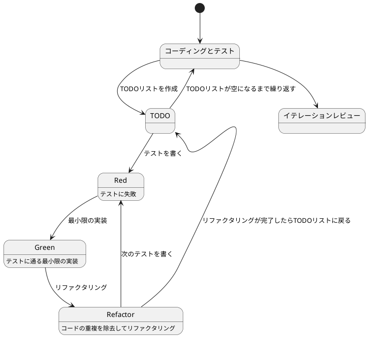
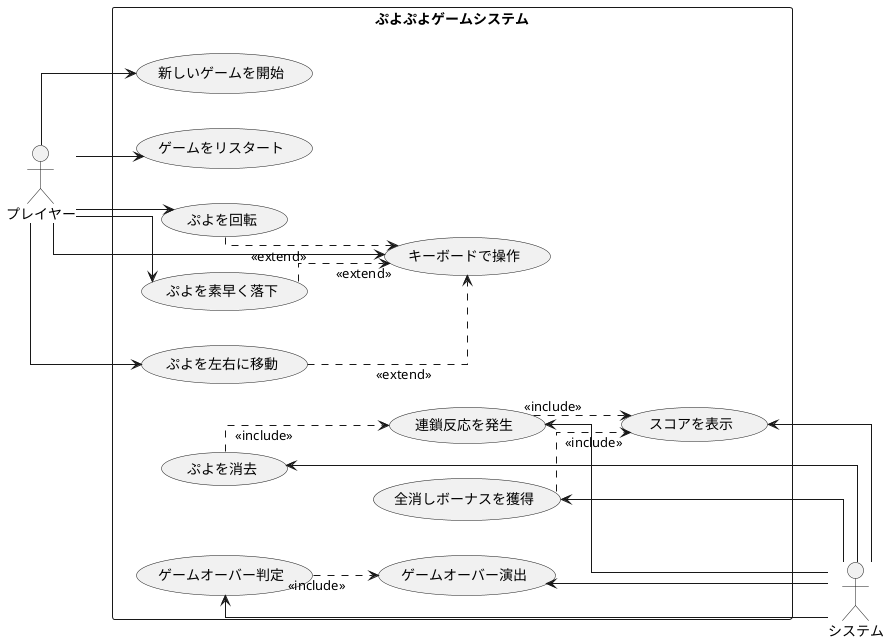

# ぷよぷよから始めるテスト駆動開発 C# WPF版

## はじめに

みなさん、こんにちは！今日は私と一緒にテスト駆動開発（TDD）を使って、C# WPF（Windows Presentation Foundation）でぷよぷよゲームを作っていきましょう。さて、プログラミングの旅に出る前に、皆さんは「テスト駆動開発」について聞いたことがありますか？もしかしたら「テストって、コードを書いた後にするものじゃないの？」と思われるかもしれませんね。

> テスト駆動開発とは、プログラミングの手法の一種で、「テストファースト」の原則に従い、実装前にテストを書くことで、コードの品質を高め、設計を改善していく開発手法です。
> 
> — Kent Beck 『テスト駆動開発』

この記事では、私たちが一緒にぷよぷよゲームを実装しながら、テスト駆動開発の基本的な流れと考え方を学んでいきます。まるでモブプログラミングのセッションのように、あなたと私が一緒に考え、コードを書き、改善していく過程を体験しましょう。「でも、ぷよぷよって結構複雑なゲームじゃないの？」と思われるかもしれませんが、心配いりません。各章では、ユーザーストーリーに基づいた機能を、テスト、実装、解説の順に少しずつ進めていきますよ。一歩一歩、着実に進んでいきましょう！

### テスト駆動開発のサイクル

さて、テスト駆動開発では、どのように進めていけばいいのでしょうか？「テストを書いてから実装する」というのは分かりましたが、具体的にはどんな手順で進めるのでしょうか？

私がいつも実践しているのは、以下の3つのステップを繰り返すサイクルです。皆さんも一緒にやってみましょう：

1. **Red（赤）**: まず失敗するテストを書きます。「え？わざと失敗するテストを？」と思われるかもしれませんが、これには重要な意味があるんです。これから実装する機能が何をすべきかを明確にするためなんですよ。
2. **Green（緑）**: 次に、テストが通るように、最小限のコードを実装します。この段階では、きれいなコードよりも「とにかく動くこと」を優先します。「最小限」というのがポイントです。必要以上のことはしないようにしましょう。
3. **Refactor（リファクタリング）**: 最後に、コードの品質を改善します。テストが通ることを確認しながら、重複を取り除いたり、わかりやすい名前をつけたりします。「動くけど汚いコード」から「動いてきれいなコード」へと進化させるんです。

> テスト駆動開発のリズム：赤、緑、リファクタリング。まず失敗するテストを書き（赤）、次にテストが通るようにする（緑）、そして重複を除去する（リファクタリング）。
> 
> — Kent Beck 『テスト駆動開発』

このサイクルを「Red-Green-Refactor」サイクルと呼びます。「赤・緑・リファクタリング」のリズムを刻むように、このサイクルを繰り返していくんです。これによって、少しずつ機能を追加し、コードの品質を高めていきましょう。皆さんも一緒にこのリズムを体感してみてください！



### 開発環境

さて、実際にコードを書く前に、私たちが使用する開発環境について少しお話ししておきましょう。皆さんは「道具選びは仕事の半分」という言葉を聞いたことがありますか？プログラミングでも同じことが言えるんです。

> 良いツールは良い仕事の第一歩です。適切な道具を選ぶことで、開発の効率と品質が大きく向上します。
> 
> — Andrew Hunt & David Thomas 『達人プログラマー』

「どんなツールを使えばいいの？」と思われるかもしれませんね。今回のプロジェクトでは、以下のツールを使用していきます：

- **言語**: C# — 「.NETって難しそう...」と思われるかもしれませんが、C#は強力な型システムと豊富なライブラリにより、大規模な開発でもバグを減らしやすくなるんです。
- **フレームワーク**: WPF（Windows Presentation Foundation）— 「デスクトップアプリって今更？」と思われるかもしれませんが、WPFは強力なデータバインディングとXAMLによる宣言的UI定義により、保守性の高いデスクトップアプリケーションを作成できます。
- **アーキテクチャパターン**: MVVM（Model-View-ViewModel）— WPFの強力なデータバインディング機能を最大限に活用するアーキテクチャパターンです。
- **テストフレームワーク**: xUnit — .NETエコシステムで広く使われている信頼性の高いテストフレームワークです。テスト駆動開発には欠かせないツールですね。
- **コードカバレッジ**: Coverlet — テストがどれだけコードをカバーしているかを可視化してくれます。「どこをテストすべき？」という疑問に答えてくれますよ。
- **静的コード解析**: Microsoft.CodeAnalysis.Analyzers — コードの品質を自動的にチェックし、潜在的な問題を早期に発見してくれます。
- **コードフォーマッタ**: dotnet format — 「チーム内でコーディングスタイルが統一されていない...」そんな悩みを解決してくれます。
- **バージョン管理**: Git — コードの変更履歴を追跡し、「あれ？昨日までちゃんと動いてたのに...」というときに過去の状態に戻れる魔法のツールです。

これらのツールを使って、テスト駆動開発の流れに沿ってぷよぷよゲームを実装していきましょう。「環境構築って難しそう...」と心配される方もいるかもしれませんが、今回のイテレーション0では、その環境構築についてしっかり解説していきますね！

## 要件

### ユーザーストーリー

さて、実際にコードを書き始める前に、少し立ち止まって考えてみましょう。「何を作るのか？」という基本的な問いかけです。私たちが作るぷよぷよゲームは、どのような機能を持つべきでしょうか？

アジャイル開発では、この「何を作るのか？」という問いに対して、「ユーザーストーリー」という形で答えを出します。皆さんは「ユーザーストーリー」という言葉を聞いたことがありますか？

> ユーザーストーリーとは、ソフトウェアの機能を「誰が」「何を」「なぜ」したいのかという形式で表現したものです。これにより、開発チームは常にユーザーの視点を忘れずに開発を進めることができます。
> 
> — Mike Cohn 『User Stories Applied』

つまり、「プレイヤーとして、〇〇ができる（〇〇したいから）」という形式で機能を表現するんです。これによって、「誰のため」の「どんな機能」を「なぜ」作るのかが明確になります。素晴らしいですよね！

では、私たちのぷよぷよゲームでは、どんなユーザーストーリーが考えられるでしょうか？一緒に考えてみましょう：

- プレイヤーとして、新しいゲームを開始できる（ゲームの基本機能として必要ですよね！）
- プレイヤーとして、落ちてくるぷよを左右に移動できる（ぷよを適切な位置に配置したいですよね）
- プレイヤーとして、落ちてくるぷよを回転できる（戦略的にぷよを配置するために必要です）
- プレイヤーとして、ぷよを素早く落下させることができる（「早く次のぷよを落としたい！」というときのために）
- プレイヤーとして、同じ色のぷよを4つ以上つなげると消去できる（これがぷよぷよの醍醐味ですよね！）
- プレイヤーとして、連鎖反応を起こしてより高いスコアを獲得できる（「れ〜んさ〜ん！」と叫びたくなりますよね）
- プレイヤーとして、全消し（ぜんけし）ボーナスを獲得できる（「やった！全部消えた！」という達成感を味わいたいですよね）
- プレイヤーとして、ゲームオーバーになるとゲーム終了の演出を見ることができる（終わりが明確でないとモヤモヤしますよね）
- プレイヤーとして、現在のスコアを確認できる（「今どれくらい点数取れてるかな？」と気になりますよね）
- プレイヤーとして、キーボードでぷよを操作できる（PCでプレイするなら必須ですよね）

「うわ、結構たくさんあるな...」と思われるかもしれませんが、心配いりません！これらのユーザーストーリーを一つずつ実装していくことで、徐々にゲームを完成させていきましょう。テスト駆動開発の素晴らしいところは、各ストーリーを小さなタスクに分解し、テスト→実装→リファクタリングのサイクルで少しずつ進められることなんです。一歩一歩、着実に進んでいきましょう！

### ユースケース図

ユーザーストーリーを整理したところで、「これらの機能がどのように関連しているのか、全体像が見えるといいな」と思いませんか？そんなときに役立つのが「ユースケース図」です。

「ユースケース図って何？」と思われるかもしれませんね。ユースケース図は、システムと外部アクター（ここではプレイヤーとシステム自体）の相互作用を視覚的に表現するための図です。「絵に描いて整理すると分かりやすい」というやつですね。

> ユースケース図は、システムが外部に提供する機能と、それを利用するアクターとの関係を表現します。これにより、システムの境界と責任範囲が明確になります。
> 
> — Martin Fowler 『UMLモデリングのエッセンス』

「百聞は一見にしかず」というように、実際に見てみるのが一番分かりやすいですよね。では、私たちのぷよぷよゲームのユースケース図を見てみましょう：



この図を見ると、プレイヤーとシステムの役割分担がよくわかりますね。プレイヤーはゲームの開始や操作を担当し、システムはぷよの消去判定やスコア計算などの内部処理を担当しています。また、キーボード操作は「拡張（extend）」関係にあり、ぷよの移動や回転などの基本操作を実現していることがわかります。

このようにユースケース図を作成することで、システムの全体像を把握し、実装すべき機能の関連性を明確にすることができます。それでは、実際のコード実装に進んでいきましょう！

## イテレーション0: 開発環境の準備

「いきなりコードを書き始める前に、まず環境を整えましょう！」実は、この準備がとても重要なんです。良い道具を揃えておくことで、後の作業がとてもスムーズになりますよ。

### 自動化から始めるテスト駆動開発

エピソード1ではテスト駆動開発のゴールが **動作するきれいなコード** であることを学びました。では、良いコードを書き続けるためには何が必要になるでしょうか？それは[ソフトウェア開発の三種の神器](https://t-wada.hatenablog.jp/entry/clean-code-that-works)と呼ばれるものです。

> 今日のソフトウェア開発の世界において絶対になければならない3つの技術的な柱があります。
> 三本柱と言ったり、三種の神器と言ったりしていますが、それらは
> 
>   - バージョン管理
> 
>   - テスティング
> 
>   - 自動化
> 
> の3つです。
> 
> —  https://t-wada.hatenablog.jp/entry/clean-code-that-works 

これから、これら3つの神器を一つずつ準備していきます。「なんだか大変そう...」と思われるかもしれませんが、一度準備してしまえば、後は自動で動いてくれるので楽になりますよ！

### プロジェクトの作成

まずは、WPFプロジェクトを作成しましょう。「どうやって作るの？」というと、.NET CLIを使います。コマンド一つで簡単に作れるんですよ！

```bash
# プロジェクトディレクトリに移動
cd /workspaces/case-study-game-dev/app/csharp

# WPFプロジェクトを作成
dotnet new wpf -n PuyoPuyoWPF -o PuyoPuyoWPF

# テストプロジェクトを作成
dotnet new xunit -n PuyoPuyoWPF.Tests -o PuyoPuyoWPF.Tests

# ソリューションファイルを作成
dotnet new sln -n PuyoPuyoWPF

# プロジェクトをソリューションに追加
dotnet sln add PuyoPuyoWPF/PuyoPuyoWPF.csproj
dotnet sln add PuyoPuyoWPF.Tests/PuyoPuyoWPF.Tests.csproj

# テストプロジェクトからメインプロジェクトへの参照を追加
cd PuyoPuyoWPF.Tests
dotnet add reference ../PuyoPuyoWPF/PuyoPuyoWPF.csproj
cd ..
```

「たくさんコマンドがあるなぁ...」と思われるかもしれませんが、一つずつ見ていきましょう：

1. `dotnet new wpf` - WPFのプロジェクトを作成します
2. `dotnet new xunit` - xUnitのテストプロジェクトを作成します
3. `dotnet new sln` - ソリューションファイルを作成します（複数のプロジェクトをまとめて管理するため）
4. `dotnet sln add` - プロジェクトをソリューションに追加します
5. `dotnet add reference` - テストプロジェクトからメインプロジェクトを参照できるようにします

これでプロジェクトの基本構造ができました！

### バージョン管理

#### Gitリポジトリの初期化

次に、バージョン管理の準備をしましょう。「バージョン管理って何？」という方もいるかもしれませんね。簡単に言うと、「コードの変更履歴を記録して、いつでも過去の状態に戻れるようにする仕組み」なんです。

```bash
# Gitリポジトリを初期化（まだの場合）
# 既にリポジトリがある場合はスキップ

# .gitignoreファイルを作成
cat > .gitignore << 'EOF'
## Ignore Visual Studio temporary files, build results, and
## files generated by popular Visual Studio add-ons.

# User-specific files
*.suo
*.user
*.userosscache
*.sln.docstates

# Build results
[Dd]ebug/
[Dd]ebugPublic/
[Rr]elease/
[Rr]eleases/
x64/
x86/
[Bb]in/
[Oo]bj/

# Visual Studio cache/options directory
.vs/

# Test results
[Tt]est[Rr]esult*/
[Bb]uild[Ll]og.*

# Coverage reports
coverage/
TestResults/

# NuGet Packages
*.nupkg
.nuget/
EOF
```

`.gitignore`ファイルは、「このファイルはGitで管理しなくていいよ」と指定するためのファイルです。ビルド結果やテスト結果など、自動生成されるファイルは管理する必要がないですからね。

#### コミットメッセージの規約

Gitでコードを記録するとき、「コミットメッセージ」というものを書きます。「どんなふうに書けばいいの？」という疑問があるかもしれませんね。実は、わかりやすいメッセージを書くための規約があるんです。

これまで作業の区切りごとにリポジトリにコミットしていましたが、その際に以下のような書式でメッセージを書いていきます：

```bash
git commit -m 'feat: 新機能を追加'
git commit -m 'fix: バグを修正'
git commit -m 'refactor: コードをリファクタリング'
git commit -m 'test: テストを追加'
git commit -m 'chore: ビルド設定を変更'
```

この書式は [Angularルール](https://github.com/angular/angular.js/blob/master/DEVELOPERS.md#type)に従っています。具体的には、それぞれのコミットメッセージはヘッダ、ボディ、フッタで構成されています。ヘッダはタイプ、スコープ、タイトルというフォーマットで構成されています。

```
<タイプ>(<スコープ>): <タイトル>
<空行>
<ボディ>
<空行>
<フッタ>
```

ヘッダは必須です。ヘッダのスコープは任意です。コミットメッセージの長さは50文字までにしてください（そうすることでその他のGitツールと同様にGitHub上で読みやすくなります）。

コミットのタイプは次を用いて下さい：

- **feat**: 新しい機能の追加
- **fix**: バグ修正
- **docs**: ドキュメント変更のみ
- **style**: コードに影響を与えない変更（フォーマット、セミコロンの欠落など）
- **refactor**: 機能追加でもバグ修正でもないコード変更
- **perf**: パフォーマンスを改善するコード変更
- **test**: 存在しないテストの追加、または既存のテストの修正
- **chore**: ドキュメント生成のような、補助ツールやライブラリやビルドプロセスの変更

「なるほど、こうやって書けば、後から見たときに何をしたかがすぐわかりますね！」その通りです！

では、最初のコミットをしてみましょう：

```bash
cd PuyoPuyoWPF
git add .
git commit -m 'chore: プロジェクトの初期設定'
```

### パッケージマネージャ

では **自動化** の準備に入りたいのですが、そのためにはいくつかの外部ライブラリを利用する必要があります。.NETでは **NuGet** がパッケージマネージャとしての役割を果たします。

> NuGetとは、.NET用のパッケージマネージャーです。開発者が作成・共有したライブラリやツールを「パッケージ」として配布・利用することができます。

**NuGet**を使ってパッケージをインストールするのは簡単です：

```bash
# WPFプロジェクトに必要なパッケージを追加
cd PuyoPuyoWPF
# MVVMライブラリ（CommunityToolkit.Mvvm）を追加
dotnet add package CommunityToolkit.Mvvm
cd ..

# テストプロジェクトに必要なパッケージを追加
cd PuyoPuyoWPF.Tests
dotnet add package Microsoft.NET.Test.Sdk
dotnet add package xunit
dotnet add package xunit.runner.visualstudio
dotnet add package Moq  # モックフレームワーク
cd ..
```

「CommunityToolkit.Mvvmって何？」と思われるかもしれませんね。これはMicrosoft公式のMVVMライブラリで、WPFアプリケーション開発を強力にサポートしてくれます。「WPFでMVVMやるならCommunityToolkit.Mvvm」と覚えておくといいですよ！

C#/.NETプロジェクトでは、プロジェクトファイル（`.csproj`）にパッケージの依存関係が記述されます。これにより、プロジェクトをクローンした際に `dotnet restore` を実行するだけで必要なパッケージが自動的にインストールされます。便利ですよね！

実際にプロジェクトファイルを見てみましょう：

```bash
cat PuyoPuyoWPF.Tests/PuyoPuyoWPF.Tests.csproj
```

```xml
<Project Sdk="Microsoft.NET.Sdk">

  <PropertyGroup>
    <TargetFramework>net8.0</TargetFramework>
    <ImplicitUsings>enable</ImplicitUsings>
    <Nullable>enable</Nullable>
    <IsPackable>false</IsPackable>
  </PropertyGroup>

  <ItemGroup>
    <PackageReference Include="Microsoft.NET.Test.Sdk" Version="17.8.0" />
    <PackageReference Include="Moq" Version="4.20.70" />
    <PackageReference Include="xunit" Version="2.6.2" />
    <PackageReference Include="xunit.runner.visualstudio" Version="2.5.4">
      <IncludeAssets>runtime; build; native; contentfiles; analyzers; buildtransitive</IncludeAssets>
      <PrivateAssets>all</PrivateAssets>
    </PackageReference>
  </ItemGroup>

  <ItemGroup>
    <ProjectReference Include="..\PuyoPuyoWPF\PuyoPuyoWPF.csproj" />
  </ItemGroup>

</Project>
```

「こうやって見ると、どんなパッケージを使っているかが一目瞭然ですね！」その通りです！

```bash
git add .
git commit -m 'chore: テスト用パッケージの追加'
```

### 静的コード解析

良いコードを書き続けるためには、コードの品質を維持していく必要があります。**テスト駆動開発**によりプログラムを動かしながら品質を改善していきますが、出来上がったコードに対する品質チェックの方法として**静的コード解析**があります。

C#/.NET用の**静的コード解析**ツールとして[Microsoft.CodeAnalysis.Analyzers](https://github.com/dotnet/roslyn-analyzers)を使って確認してみましょう。

```bash
# アナライザパッケージをインストール
cd PuyoPuyoWPF
dotnet add package Microsoft.CodeAnalysis.Analyzers
cd ..
```

次に、コード分析の設定ファイルを作成します。`.editorconfig`ファイルでコーディングスタイルを定義できます：

```bash
# PuyoPuyoWPFディレクトリに.editorconfigを作成
cat > .editorconfig << 'EOF'
root = true

[*]
indent_style = space
indent_size = 4
end_of_line = crlf
charset = utf-8
trim_trailing_whitespace = true
insert_final_newline = true

[*.cs]
# C# coding conventions
dotnet_sort_using_directives = true
dotnet_separate_import_directive_groups = false

# Language rules
csharp_prefer_var = false:suggestion
csharp_prefer_braces = true:warning

# Code quality rules
dotnet_diagnostic.CA1502.severity = warning
# CA1502: メソッドの循環的複雑度を7以下に制限
dotnet_code_quality.CA1502.cyclomatic_complexity = 7

# Naming conventions
dotnet_naming_rule.interface_should_be_begins_with_i.severity = warning
dotnet_naming_rule.interface_should_be_begins_with_i.symbols = interface
dotnet_naming_rule.interface_should_be_begins_with_i.style = begins_with_i

dotnet_naming_rule.types_should_be_pascal_case.severity = warning
dotnet_naming_rule.types_should_be_pascal_case.symbols = types
dotnet_naming_rule.types_should_be_pascal_case.style = pascal_case

dotnet_naming_symbols.interface.applicable_kinds = interface
dotnet_naming_symbols.interface.applicable_accessibilities = public, internal, private, protected, protected_internal, private_protected

dotnet_naming_symbols.types.applicable_kinds = class, struct, interface, enum
dotnet_naming_symbols.types.applicable_accessibilities = public, internal, private, protected, protected_internal, private_protected

dotnet_naming_style.begins_with_i.required_prefix = I
dotnet_naming_style.begins_with_i.capitalization = pascal_case

dotnet_naming_style.pascal_case.capitalization = pascal_case
EOF
```

「.editorconfigって何？」と思われるかもしれませんね。これは、コーディングスタイル（インデントの幅や命名規則など）を定義するファイルです。チーム全体で同じスタイルを共有できるので、「この人のコードは読みにくいな...」という問題が減りますよ！

**循環複雑度について**

ここで設定している`cyclomatic_complexity = 7`について少し説明しましょう。循環複雑度（Cyclomatic Complexity）とは、コードの複雑さを測る指標の一つです。

> 循環複雑度とは、プログラムの制御フローの複雑さを測る指標です。if文、for文、while文などの分岐や繰り返しが増えるほど、この値は大きくなります。値が高いほどコードの理解が難しく、バグが混入しやすくなります。
> 
> — Thomas J. McCabe 『A Complexity Measure』

一般的な目安として：
- **1-7**: シンプルで理解しやすい（推奨）
- **8-10**: やや複雑、注意が必要
- **11以上**: 複雑すぎる、リファクタリング推奨

「なぜ7なの？」と思われるかもしれませんね。これは、人間が一度に理解できる情報の量（マジカルナンバー7±2）に基づいた経験則です。メソッドの循環複雑度を7以下に保つことで、コードの理解しやすさとテストのしやすさを維持できます。

コード分析を実行してみましょう：

```bash
dotnet build
```

「ビルドするだけで静的コード解析もしてくれるんですね！」その通りです。そして、もしメソッドが複雑すぎる場合（循環複雑度が7を超える場合）、警告が表示されますよ！

```bash
git add .
git commit -m 'chore: 静的コード解析の設定'
```

### Lintツール

**Lintツール**は、コードの品質をさらに高めるための静的解析ツールです。「.editorconfigの設定だけじゃ不十分なの？」と思われるかもしれませんが、Lintツールはより詳細なルールチェックや、C#固有のベストプラクティスを検証してくれます。

C#/.NETでは**StyleCop Analyzers**が人気です。StyleCopはコーディング規約違反をコンパイル時に検出し、警告やエラーとして通知してくれます。

```bash
cd PuyoPuyoWPF
dotnet add package StyleCop.Analyzers
dotnet add package Microsoft.CodeAnalysis.NetAnalyzers
cd ..
```

「Microsoft.CodeAnalysis.NetAnalyzersって何ですか?」 これは.NETの公式コードアナライザーで、パフォーマンスの問題やセキュリティの懸念、API使用方法の誤りなどを検出してくれます。StyleCopと組み合わせることで、包括的なコード品質チェックが可能になります。

次に、StyleCopの設定ファイル`stylecop.json`を作成します：

```bash
cat > PuyoPuyoWPF/stylecop.json << 'EOF'
{
  "$schema": "https://raw.githubusercontent.com/DotNetAnalyzers/StyleCopAnalyzers/master/StyleCop.Analyzers/StyleCop.Analyzers/Settings/stylecop.schema.json",
  "settings": {
    "documentationRules": {
      "companyName": "PuyoPuyo",
      "copyrightText": "Copyright (c) {companyName}. All rights reserved.",
      "xmlHeader": false,
      "fileNamingConvention": "stylecop"
    },
    "namingRules": {
      "allowCommonHungarianPrefixes": false,
      "allowedHungarianPrefixes": []
    },
    "orderingRules": {
      "systemUsingDirectivesFirst": true,
      "usingDirectivesPlacement": "outsideNamespace",
      "blankLinesBetweenUsingGroups": "require"
    },
    "layoutRules": {
      "newlineAtEndOfFile": "require"
    },
    "maintainabilityRules": {
      "topLevelTypes": []
    }
  }
}
EOF
```

「これは何を設定しているんですか？」良い質問です！各セクションを見ていきましょう：

- **documentationRules**: XMLドキュメントコメントのルール
  - `companyName`: 会社名を設定（著作権表示で使用）
  - `xmlHeader`: ファイルヘッダーのXMLコメントを要求するかどうか
- **namingRules**: 命名規則
  - `allowCommonHungarianPrefixes`: ハンガリアン記法を許可するか
- **orderingRules**: using文の順序に関するルール
  - `systemUsingDirectivesFirst`: System.*のusing文を最初に配置
  - `usingDirectivesPlacement`: using文をnamespaceの外側に配置
- **layoutRules**: レイアウトのルール
  - `newlineAtEndOfFile`: ファイル末尾に改行を要求

さらに、`.editorconfig`にもStyleCop固有のルールを追加しましょう：

```bash
cat >> .editorconfig << 'EOF'

# StyleCop Analyzers の設定

# SA1600: 要素にXMLドキュメントコメントが必要
dotnet_diagnostic.SA1600.severity = none

# SA1633: ファイルヘッダーが必要
dotnet_diagnostic.SA1633.severity = none

# SA1101: 修飾名を使用する必要がある
dotnet_diagnostic.SA1101.severity = none

# SA1309: フィールド名はアンダースコアで始めてはいけない
dotnet_diagnostic.SA1309.severity = none

# SA1200: Using ディレクティブは名前空間内に配置する
dotnet_diagnostic.SA1200.severity = none

# SA1413: 末尾のコンマを使用する
dotnet_diagnostic.SA1413.severity = suggestion

# SA1028: コードの末尾に空白を含めない
dotnet_diagnostic.SA1028.severity = warning
EOF
```

「これらのルールは何を意味しているんですか？」順番に説明しましょう：

- **SA1600 (none)**: すべての要素にドキュメントコメントを要求しない（学習用プロジェクトのため緩和）
- **SA1633 (none)**: ファイルヘッダーのコメントを要求しない
- **SA1101 (none)**: `this.`修飾子を強制しない（モダンなC#スタイル）
- **SA1309 (none)**: プライベートフィールドに`_`プレフィックスを許可（モダンなC#の慣習）
- **SA1200 (none)**: using文をnamespaceの外側に配置することを許可（.NET 6+のスタイル）
- **SA1413 (suggestion)**: 配列やコレクションの末尾にカンマを使うことを推奨
- **SA1028 (warning)**: 行末の空白を警告

これらの設定により、モダンなC#の記述スタイルを維持しつつ、重要なコード品質チェックは有効にしています。

Lintチェックを実行してみましょう：

```bash
# ビルド時にLintチェックが自動実行されます
dotnet build

# 警告をエラーとして扱う場合
dotnet build /p:TreatWarningsAsErrors=true
```

「警告をエラーにするとどうなるの？」良い質問です！通常、警告があってもビルドは成功しますが、`TreatWarningsAsErrors=true`を指定すると、警告があるとビルドが失敗します。これにより、チーム全体でコード品質基準を厳格に守ることができます。CI/CD環境で特に有効ですよ！

```bash
git add .
git commit -m 'chore: Lintツールの設定'
```

### コードフォーマッタ

**コードフォーマッタ**は開発チーム内でのコーディングスタイルを統一するためのツールです。C#/.NETでは`dotnet format`コマンドが標準で提供されています。「わざわざインストールしなくていいんですか？」はい、最初から使えるんです！

コードのフォーマットを実行してみましょう：

```bash
dotnet format
```

このコマンドにより、プロジェクト内のすべてのC#ファイルが`.editorconfig`で定義されたルールに従ってフォーマットされます。「自動で整形してくれるなんて楽ちんですね！」

フォーマットの確認のみを行いたい場合は：

```bash
dotnet format --verify-no-changes
```

「これって何をチェックしてるんですか？」このコマンドは、コードがフォーマットルールに従っているかを確認だけして、実際には変更しません。CI/CD環境で使うと便利ですよ！

```bash
git add .
git commit -m 'chore: コードフォーマッタの設定'
```

### コードカバレッジ

**コードカバレッジ**はテストがプロダクションコードをどのくらいカバーしているかを測る指標です。「テストを書いたつもりだけど、実は重要な部分がテストされてなかった...」そんなことを防ぐために役立ちます。

C#/.NETでは`coverlet`がよく使われます：

```bash
# カバレッジツールをインストール
cd PuyoPuyoWPF.Tests
dotnet add package coverlet.collector
dotnet add package coverlet.msbuild
cd ..

# レポート生成ツールをインストール
dotnet tool install -g dotnet-reportgenerator-globaltool
```

「dotnet toolって何ですか？」良い質問です！dotnet toolは、.NET CLI用のグローバルツールを管理する仕組みです。一度インストールすれば、どこからでも使えるようになりますよ。

テストをカバレッジ付きで実行してみましょう：

```bash
# カバレッジを収集しながらテスト実行
dotnet test --collect:"XPlat Code Coverage" --results-directory ./TestResults

# HTML形式のレポートを生成
reportgenerator -reports:"./TestResults/**/coverage.cobertura.xml" -targetdir:"coverage" -reporttypes:Html
```

「生成された`coverage/index.html`をブラウザで開くとカバレッジレポートを確認できます！」カラフルなレポートでどこがテストされているか一目瞭然ですよ。

ワンコマンドでカバレッジレポートを生成するスクリプトを作成しましょう：

```bash
# PuyoPuyoWPFディレクトリにcoverage.shを作成
cat > coverage.sh << 'EOF'
#!/bin/bash
# coverage.sh - コードカバレッジレポート生成スクリプト

echo "🧪 テスト実行とカバレッジ収集中..."
dotnet test --collect:"XPlat Code Coverage" --results-directory ./TestResults

echo "📊 カバレッジレポート生成中..."
reportgenerator -reports:"./TestResults/**/coverage.cobertura.xml" -targetdir:"coverage" -reporttypes:Html

echo "✅ カバレッジレポートが coverage/index.html に生成されました"
echo ""
echo "ブラウザで確認するには以下のコマンドを実行してください:"
echo "  \$BROWSER coverage/index.html"
EOF

chmod +x coverage.sh
```

スクリプトを実行してみましょう：

```bash
./coverage.sh
```

「スクリプト化すると、毎回長いコマンドを打たなくて済むから便利ですね！」その通りです！

```bash
git add .
git commit -m 'chore: コードカバレッジの設定'
```

### タスクランナー

良いコードを書き続けるために今まで色々なツールを導入してきましたが、毎回個別に実行するのは面倒です。「フォーマットして、ビルドして、テストして、カバレッジも確認して...」うんざりしちゃいますよね？

そこで**タスクランナー**の出番です！C#/.NETプロジェクトでは、**Cake**という強力なビルド自動化システムを使うことができます。

> Cakeとは、C#をDSL（ドメイン特化言語）として使用するクロスプラットフォームのビルドオートメーションシステムです。Make、Rake、PSakeと同様の概念ですが、C#の構文を活用できるため、.NET開発者にとって親しみやすいツールです。

まず、Cakeをグローバルツールとしてインストールしましょう：

```bash
# Cakeツールをインストール
dotnet tool install -g Cake.Tool
```

次に、`build.cake`ファイルを作成して、よく使うタスクを定義しましょう：

```bash
cat > build.cake << 'EOF'
///////////////////////////////////////////////////////////////////////////////
// ARGUMENTS
///////////////////////////////////////////////////////////////////////////////

var target = Argument("target", "Default");
var configuration = Argument("configuration", "Release");

///////////////////////////////////////////////////////////////////////////////
// SETUP / TEARDOWN
///////////////////////////////////////////////////////////////////////////////

Setup(ctx =>
{
   Information("Running tasks...");
   Information("Target: {0}", target);
});

Teardown(ctx =>
{
   Information("Finished running tasks.");
});

///////////////////////////////////////////////////////////////////////////////
// TASKS
///////////////////////////////////////////////////////////////////////////////

Task("Clean")
    .Description("プロジェクトのクリーンアップ")
    .Does(() =>
{
    Information("クリーンアップを実行中...");
    DotNetClean("./PuyoPuyoWPF.sln");
    CleanDirectory("./coverage");
    CleanDirectory("./TestResults");
});

Task("Restore")
    .Description("NuGetパッケージの復元")
    .IsDependentOn("Clean")
    .Does(() =>
{
    Information("パッケージを復元中...");
    DotNetRestore("./PuyoPuyoWPF.sln");
});

Task("Format")
    .Description("コードフォーマットの実行")
    .Does(() =>
{
    Information("コードをフォーマット中...");
    DotNetFormat("./PuyoPuyoWPF.sln");
});

Task("Build")
    .Description("プロジェクトのビルド")
    .IsDependentOn("Restore")
    .Does(() =>
{
    Information("ビルドを実行中...");
    DotNetBuild("./PuyoPuyoWPF.sln", new DotNetBuildSettings
    {
        Configuration = configuration,
        NoRestore = true
    });
});

Task("Lint")
    .Description("コードのLintチェック")
    .IsDependentOn("Build")
    .Does(() =>
{
    Information("Lintチェックを実行中...");
    
    // 警告をエラーとして扱ってビルド
    var lintSettings = new DotNetBuildSettings
    {
        Configuration = configuration,
        NoRestore = true,
        MSBuildSettings = new DotNetMSBuildSettings()
    };
    lintSettings.MSBuildSettings.TreatAllWarningsAs = MSBuildTreatAllWarningsAs.Error;
    
    try
    {
        DotNetBuild("./PuyoPuyoWPF.sln", lintSettings);
        Information("✅ Lintチェックが成功しました");
    }
    catch
    {
        Warning("⚠️ Lintチェックで警告またはエラーが見つかりました");
        throw;
    }
});

Task("Test")
    .Description("テストの実行")
    .IsDependentOn("Build")
    .Does(() =>
{
    Information("テストを実行中...");
    DotNetTest("./PuyoPuyoWPF.Tests/PuyoPuyoWPF.Tests.csproj", new DotNetTestSettings
    {
        Configuration = configuration,
        NoBuild = true,
        NoRestore = true
    });
});

Task("Coverage")
    .Description("コードカバレッジの測定")
    .IsDependentOn("Build")
    .Does(() =>
{
    Information("カバレッジを測定中...");
    
    // カバレッジ付きテスト実行
    DotNetTest("./PuyoPuyoWPF.Tests/PuyoPuyoWPF.Tests.csproj", new DotNetTestSettings
    {
        Configuration = configuration,
        NoBuild = true,
        NoRestore = true,
        ArgumentCustomization = args => args
            .Append("--collect:\"XPlat Code Coverage\"")
            .Append("--results-directory ./TestResults")
    });
    
    // レポート生成
    Information("カバレッジレポートを生成中...");
    StartProcess("reportgenerator", new ProcessSettings
    {
        Arguments = new ProcessArgumentBuilder()
            .Append("-reports:./TestResults/**/coverage.cobertura.xml")
            .Append("-targetdir:./coverage")
            .Append("-reporttypes:Html")
    });
    
    Information("✅ カバレッジレポートが coverage/index.html に生成されました");
});

Task("Quality")
    .Description("すべての品質チェックを実行")
    .IsDependentOn("Format")
    .IsDependentOn("Lint")
    .IsDependentOn("Build")
    .IsDependentOn("Test")
    .IsDependentOn("Coverage")
    .Does(() =>
{
    Information("✅ すべての品質チェックが完了しました！");
});

Task("Watch")
    .Description("ファイル監視と自動ビルド・テスト")
    .Does(() =>
{
    Information("ファイル監視を開始します...");
    Information("終了するには Ctrl+C を押してください");
    
    var settings = new DotNetWatchSettings
    {
        Project = "./PuyoPuyoWPF.Tests/PuyoPuyoWPF.Tests.csproj"
    };
    
    DotNetWatch("test", settings);
});

Task("Default")
    .Description("デフォルトタスク（Quality）")
    .IsDependentOn("Quality");

///////////////////////////////////////////////////////////////////////////////
// EXECUTION
///////////////////////////////////////////////////////////////////////////////

RunTarget(target);
EOF
```

「このCakeファイルは何をしてくれるんですか？」良い質問です！このCakeファイルでは、以下のタスクを定義しています：

- **Clean**: ビルド成果物とテスト結果をクリーンアップ
- **Restore**: NuGetパッケージを復元
- **Format**: コードをフォーマット
- **Build**: プロジェクトをビルド
- **Lint**: コードのLintチェック（警告をエラーとして扱う）
- **Test**: テストを実行
- **Coverage**: カバレッジを測定してレポート生成
- **Quality**: すべての品質チェックを実行（デフォルト）
- **Watch**: ファイル監視と自動テスト実行

タスクを実行してみましょう：

```bash
# デフォルトタスク（Quality）を実行
dotnet cake

# 特定のタスクを実行
dotnet cake --target=Clean
dotnet cake --target=Format
dotnet cake --target=Build
dotnet cake --target=Lint
dotnet cake --target=Test
dotnet cake --target=Coverage

# すべての品質チェックを実行
dotnet cake --target=Quality
```

「Cakeを使うと、C#の構文でビルドスクリプトが書けるので、.NET開発者にとってとても自然ですね！」その通りです！

Cakeの良いところは：

1. **C#で書ける**: .NET開発者にとって親しみやすい
2. **依存関係管理**: タスク間の依存関係を自動で解決
3. **クロスプラットフォーム**: Windows、Linux、macOSで動作
4. **豊富なエコシステム**: 多くのアドインとヘルパーが利用可能

```bash
git add .
git commit -m 'chore: Cakeタスクランナーの設定'
```

### タスクの自動化

**Cake**により品質をチェックするタスクは用意されましたが、まだ手動で実行する必要があります。「ファイルを保存するたびに自動でテストが走ったら便利なのにな...」と思いませんか？

実は、Cakeには**Watch**タスクを使って自動実行する機能が既に含まれています！

#### Cakeの組み込みWatchタスクを使用

最もシンプルな方法は、`build.cake`で定義した`Watch`タスクを使うことです：

```bash
# Cakeのwatchタスクを実行
dotnet cake --target=Watch
```

「これだけで自動テストが動くんですね！」そうなんです。.NET CLIの`dotnet watch`コマンドを利用しているので、ファイルが変更されるたびに自動的にテストが実行されますよ。

別のターミナルを開いて、何かファイルを変更してみてください。変更が検出されて自動的にタスクが実行されることが確認できるはずです。

テストがパスすることが確認できたらコミットしておきましょう。このときターミナルでは`Watch`が動いているので、別ターミナルを開いてコミットを実施すると良いでしょう。

```bash
git add .
git commit -m 'chore: タスクの自動化'
```

### 動作確認

さて、ここまでで環境構築は完了です！「本当に動くんでしょうか？」試してみましょう。

まず、簡単なテストを書いて、すべてが正しく動作することを確認します：

```bash
# サンプルテストファイルを編集
cat > PuyoPuyoWPF.Tests/SampleTest.cs << 'EOF'
using Xunit;

namespace PuyoPuyoWPF.Tests;

public class SampleTest
{
    [Fact]
    public void 基本的なテストが動作する()
    {
        // Arrange（準備）
        int a = 1;
        int b = 2;

        // Act（実行）
        int result = a + b;

        // Assert（検証）
        Assert.Equal(3, result);
    }

    [Theory]
    [InlineData(1, 2, 3)]
    [InlineData(0, 0, 0)]
    [InlineData(-1, 1, 0)]
    public void 複数のケースをテストできる(int a, int b, int expected)
    {
        // Act
        int result = a + b;

        // Assert
        Assert.Equal(expected, result);
    }
}
EOF
```

「このテストは何をテストしてるんですか？」良い質問です！これは実際のテストではなく、環境が正しく動作することを確認するためのサンプルです。「1+2=3」という簡単な計算をテストしています。

テストを実行してみましょう：

```bash
dotnet test
# または、Cakeを使って
dotnet cake --target=Test
```

「テストが通りましたね！」素晴らしい！では、わざと失敗するテストを書いてみましょう：

```bash
cat >> PuyoPuyoWPF.Tests/SampleTest.cs << 'EOF'

    [Fact]
    public void わざと失敗するテスト()
    {
        // わざと間違った期待値を設定
        Assert.Equal(5, 1 + 2);
    }
}
EOF
```

もう一度テストを実行してみましょう：

```bash
dotnet test
# または、Cakeを使って
dotnet cake --target=Test
```

「テストが失敗しましたね！」そうです。これは期待通りの動作です。テストが失敗することも正しく検出できることが確認できました。

では、失敗するテストを削除して、もう一度確認しましょう：

```bash
# 失敗するテストを削除（ファイルを元に戻す）
cat > PuyoPuyoWPF.Tests/SampleTest.cs << 'EOF'
using Xunit;

namespace PuyoPuyoWPF.Tests;

public class SampleTest
{
    [Fact]
    public void 基本的なテストが動作する()
    {
        // Arrange（準備）
        int a = 1;
        int b = 2;

        // Act（実行）
        int result = a + b;

        // Assert（検証）
        Assert.Equal(3, result);
    }

    [Theory]
    [InlineData(1, 2, 3)]
    [InlineData(0, 0, 0)]
    [InlineData(-1, 1, 0)]
    public void 複数のケースをテストできる(int a, int b, int expected)
    {
        // Act
        int result = a + b;

        // Assert
        Assert.Equal(expected, result);
    }
}
EOF

dotnet test
# または、Cakeを使って
dotnet cake --target=Test
```

「すべてのテストが通りましたね！」完璧です！

最後にカバレッジレポートも確認してみましょう：

```bash
# Cakeを使ってカバレッジを測定
dotnet cake --target=Coverage
```

「coverage/index.htmlができましたね！」ブラウザで開いてみましょう：

```bash
$BROWSER coverage/index.html
```

「カバレッジレポートが見れました！」素晴らしい！これで、どのコードがテストされているか視覚的に確認できますね。

Cakeのすべてのタスクを一度に実行することもできます：

```bash
# すべての品質チェックを実行
dotnet cake --target=Quality
# または
dotnet cake  # デフォルトでQualityタスクが実行される
```

「Format→Build→Test→Coverageが順番に実行されましたね！」その通りです。Cakeのタスク依存関係が自動的に解決されて、必要なタスクが順番に実行されます。

すべての確認が終わったら、コミットしておきましょう：

```bash
git add .
git commit -m 'test: サンプルテストの追加'
```

### イテレーション0のまとめ

お疲れさまでした！イテレーション0が完了しました。ここまでで、以下のことができるようになりました：

1. **プロジェクトの作成**: WPFプロジェクトとテストプロジェクトの作成
2. **バージョン管理**: Gitリポジトリの初期化とコミットメッセージの規約
3. **パッケージ管理**: NuGetを使った依存関係の管理（CommunityToolkit.Mvvm、Moqなど）
4. **静的コード解析**: Microsoft.CodeAnalysis.Analyzersによるコード品質の自動チェック
5. **コードフォーマッタ**: dotnet formatによるコーディングスタイルの統一
6. **コードカバレッジ**: Coverlet + ReportGeneratorによるテストカバレッジの測定と可視化
7. **タスクランナー**: CakeによるC#ベースのビルド自動化
8. **タスクの自動化**: dotnet watchによるファイル監視と自動実行

これで[ソフトウェア開発の三種の神器](https://t-wada.hatenablog.jp/entry/clean-code-that-works)が揃いました：

- ✅ **バージョン管理**: Git + Angularルールのコミットメッセージ
- ✅ **テスティング**: xUnit + Moq + Coverlet
- ✅ **自動化**: Cake + dotnet watch

**Cakeを使うメリット**:
- C#で書けるので.NET開発者にとって自然
- タスクの依存関係を宣言的に定義できる
- クロスプラットフォームで動作
- 豊富なアドインとヘルパー機能
- IDE統合とデバッグサポート

「これでテスト駆動開発を始める準備が整いましたね！」その通りです！次のイテレーションからは、実際にぷよぷよゲームの機能を実装していきますよ。

開発を始めるときは、以下のコマンドを実行しておけば、ファイルを保存するたびに自動でテストが実行されるので、テスト駆動開発のリズム（Red-Green-Refactor）に集中できますね！

```bash
# Cakeの組み込みWatchを使う
dotnet cake --target=Watch

# 別のターミナルでコードを編集
# ファイルを保存するたびに自動でテストが実行される！
```

**よく使うCakeコマンド**:
```bash
dotnet cake                      # すべての品質チェック（デフォルト）
dotnet cake --target=Clean       # クリーンアップ
dotnet cake --target=Format      # コードフォーマット
dotnet cake --target=Build       # ビルド
dotnet cake --target=Test        # テスト実行
dotnet cake --target=Coverage    # カバレッジ測定
dotnet cake --target=Watch       # 自動テスト実行
```

それでは、次のイテレーション1で実際のゲーム機能の実装に取り組んでいきましょう！
