# ぷよぷよから始めるテスト駆動開発 C# WPF版

## はじめに

みなさん、こんにちは！今日は私と一緒にテスト駆動開発（TDD）を使って、C# WPF（Windows Presentation Foundation）でぷよぷよゲームを作っていきましょう。さて、プログラミングの旅に出る前に、皆さんは「テスト駆動開発」について聞いたことがありますか？もしかしたら「テストって、コードを書いた後にするものじゃないの？」と思われるかもしれませんね。

> テスト駆動開発とは、プログラミングの手法の一種で、「テストファースト」の原則に従い、実装前にテストを書くことで、コードの品質を高め、設計を改善していく開発手法です。
> 
> — Kent Beck 『テスト駆動開発』

この記事では、私たちが一緒にぷよぷよゲームを実装しながら、テスト駆動開発の基本的な流れと考え方を学んでいきます。まるでモブプログラミングのセッションのように、あなたと私が一緒に考え、コードを書き、改善していく過程を体験しましょう。「でも、ぷよぷよって結構複雑なゲームじゃないの？」と思われるかもしれませんが、心配いりません。各章では、ユーザーストーリーに基づいた機能を、テスト、実装、解説の順に少しずつ進めていきますよ。一歩一歩、着実に進んでいきましょう！

### テスト駆動開発のサイクル

さて、テスト駆動開発では、どのように進めていけばいいのでしょうか？「テストを書いてから実装する」というのは分かりましたが、具体的にはどんな手順で進めるのでしょうか？

私がいつも実践しているのは、以下の3つのステップを繰り返すサイクルです。皆さんも一緒にやってみましょう：

1. **Red（赤）**: まず失敗するテストを書きます。「え？わざと失敗するテストを？」と思われるかもしれませんが、これには重要な意味があるんです。これから実装する機能が何をすべきかを明確にするためなんですよ。
2. **Green（緑）**: 次に、テストが通るように、最小限のコードを実装します。この段階では、きれいなコードよりも「とにかく動くこと」を優先します。「最小限」というのがポイントです。必要以上のことはしないようにしましょう。
3. **Refactor（リファクタリング）**: 最後に、コードの品質を改善します。テストが通ることを確認しながら、重複を取り除いたり、わかりやすい名前をつけたりします。「動くけど汚いコード」から「動いてきれいなコード」へと進化させるんです。

> テスト駆動開発のリズム：赤、緑、リファクタリング。まず失敗するテストを書き（赤）、次にテストが通るようにする（緑）、そして重複を除去する（リファクタリング）。
> 
> — Kent Beck 『テスト駆動開発』

このサイクルを「Red-Green-Refactor」サイクルと呼びます。「赤・緑・リファクタリング」のリズムを刻むように、このサイクルを繰り返していくんです。これによって、少しずつ機能を追加し、コードの品質を高めていきましょう。皆さんも一緒にこのリズムを体感してみてください！

```plantuml
@startuml
[*] --> コーディングとテスト
コーディングとテスト --> TODO : TODOリストを作成
TODO --> Red : テストを書く
Red --> Green : 最小限の実装
Green --> Refactor : リファクタリング
Refactor --> Red : 次のテストを書く
Red : テストに失敗
Green : テストに通る最小限の実装
Refactor : コードの重複を除去してリファクタリング
Refactor --> TODO : リファクタリングが完了したらTODOリストに戻る
TODO --> コーディングとテスト : TODOリストが空になるまで繰り返す
コーディングとテスト --> イテレーションレビュー
@enduml
```

### 開発環境

さて、実際にコードを書く前に、私たちが使用する開発環境について少しお話ししておきましょう。皆さんは「道具選びは仕事の半分」という言葉を聞いたことがありますか？プログラミングでも同じことが言えるんです。

> 良いツールは良い仕事の第一歩です。適切な道具を選ぶことで、開発の効率と品質が大きく向上します。
> 
> — Andrew Hunt & David Thomas 『達人プログラマー』

「どんなツールを使えばいいの？」と思われるかもしれませんね。今回のプロジェクトでは、以下のツールを使用していきます：

- **言語**: C# — 「.NETって難しそう...」と思われるかもしれませんが、C#は強力な型システムと豊富なライブラリにより、大規模な開発でもバグを減らしやすくなるんです。
- **フレームワーク**: WPF（Windows Presentation Foundation）— 「デスクトップアプリって今更？」と思われるかもしれませんが、WPFは強力なデータバインディングとXAMLによる宣言的UI定義により、保守性の高いデスクトップアプリケーションを作成できます。
- **アーキテクチャパターン**: MVVM（Model-View-ViewModel）— WPFの強力なデータバインディング機能を最大限に活用するアーキテクチャパターンです。
- **テストフレームワーク**: xUnit — .NETエコシステムで広く使われている信頼性の高いテストフレームワークです。テスト駆動開発には欠かせないツールですね。
- **コードカバレッジ**: Coverlet — テストがどれだけコードをカバーしているかを可視化してくれます。「どこをテストすべき？」という疑問に答えてくれますよ。
- **静的コード解析**: Microsoft.CodeAnalysis.Analyzers — コードの品質を自動的にチェックし、潜在的な問題を早期に発見してくれます。
- **コードフォーマッタ**: dotnet format — 「チーム内でコーディングスタイルが統一されていない...」そんな悩みを解決してくれます。
- **バージョン管理**: Git — コードの変更履歴を追跡し、「あれ？昨日までちゃんと動いてたのに...」というときに過去の状態に戻れる魔法のツールです。

これらのツールを使って、テスト駆動開発の流れに沿ってぷよぷよゲームを実装していきましょう。「環境構築って難しそう...」と心配される方もいるかもしれませんが、今回のイテレーション0では、その環境構築についてしっかり解説していきますね！

## 要件

### ユーザーストーリー

さて、実際にコードを書き始める前に、少し立ち止まって考えてみましょう。「何を作るのか？」という基本的な問いかけです。私たちが作るぷよぷよゲームは、どのような機能を持つべきでしょうか？

アジャイル開発では、この「何を作るのか？」という問いに対して、「ユーザーストーリー」という形で答えを出します。皆さんは「ユーザーストーリー」という言葉を聞いたことがありますか？

> ユーザーストーリーとは、ソフトウェアの機能を「誰が」「何を」「なぜ」したいのかという形式で表現したものです。これにより、開発チームは常にユーザーの視点を忘れずに開発を進めることができます。
> 
> — Mike Cohn 『User Stories Applied』

つまり、「プレイヤーとして、〇〇ができる（〇〇したいから）」という形式で機能を表現するんです。これによって、「誰のため」の「どんな機能」を「なぜ」作るのかが明確になります。素晴らしいですよね！

では、私たちのぷよぷよゲームでは、どんなユーザーストーリーが考えられるでしょうか？一緒に考えてみましょう：

- プレイヤーとして、新しいゲームを開始できる（ゲームの基本機能として必要ですよね！）
- プレイヤーとして、落ちてくるぷよを左右に移動できる（ぷよを適切な位置に配置したいですよね）
- プレイヤーとして、落ちてくるぷよを回転できる（戦略的にぷよを配置するために必要です）
- プレイヤーとして、ぷよを素早く落下させることができる（「早く次のぷよを落としたい！」というときのために）
- プレイヤーとして、同じ色のぷよを4つ以上つなげると消去できる（これがぷよぷよの醍醐味ですよね！）
- プレイヤーとして、連鎖反応を起こしてより高いスコアを獲得できる（「れ〜んさ〜ん！」と叫びたくなりますよね）
- プレイヤーとして、全消し（ぜんけし）ボーナスを獲得できる（「やった！全部消えた！」という達成感を味わいたいですよね）
- プレイヤーとして、ゲームオーバーになるとゲーム終了の演出を見ることができる（終わりが明確でないとモヤモヤしますよね）
- プレイヤーとして、現在のスコアを確認できる（「今どれくらい点数取れてるかな？」と気になりますよね）
- プレイヤーとして、キーボードでぷよを操作できる（PCでプレイするなら必須ですよね）

「うわ、結構たくさんあるな...」と思われるかもしれませんが、心配いりません！これらのユーザーストーリーを一つずつ実装していくことで、徐々にゲームを完成させていきましょう。テスト駆動開発の素晴らしいところは、各ストーリーを小さなタスクに分解し、テスト→実装→リファクタリングのサイクルで少しずつ進められることなんです。一歩一歩、着実に進んでいきましょう！

### ユースケース図

ユーザーストーリーを整理したところで、「これらの機能がどのように関連しているのか、全体像が見えるといいな」と思いませんか？そんなときに役立つのが「ユースケース図」です。

「ユースケース図って何？」と思われるかもしれませんね。ユースケース図は、システムと外部アクター（ここではプレイヤーとシステム自体）の相互作用を視覚的に表現するための図です。「絵に描いて整理すると分かりやすい」というやつですね。

> ユースケース図は、システムが外部に提供する機能と、それを利用するアクターとの関係を表現します。これにより、システムの境界と責任範囲が明確になります。
> 
> — Martin Fowler 『UMLモデリングのエッセンス』

「百聞は一見にしかず」というように、実際に見てみるのが一番分かりやすいですよね。では、私たちのぷよぷよゲームのユースケース図を見てみましょう：



この図を見ると、プレイヤーとシステムの役割分担がよくわかりますね。プレイヤーはゲームの開始や操作を担当し、システムはぷよの消去判定やスコア計算などの内部処理を担当しています。また、キーボード操作は「拡張（extend）」関係にあり、ぷよの移動や回転などの基本操作を実現していることがわかります。

このようにユースケース図を作成することで、システムの全体像を把握し、実装すべき機能の関連性を明確にすることができます。それでは、実際のコード実装に進んでいきましょう！

## イテレーション0: 開発環境の準備

「いきなりコードを書き始める前に、まず環境を整えましょう！」実は、この準備がとても重要なんです。良い道具を揃えておくことで、後の作業がとてもスムーズになりますよ。

### 自動化から始めるテスト駆動開発

エピソード1ではテスト駆動開発のゴールが **動作するきれいなコード** であることを学びました。では、良いコードを書き続けるためには何が必要になるでしょうか？それは[ソフトウェア開発の三種の神器](https://t-wada.hatenablog.jp/entry/clean-code-that-works)と呼ばれるものです。

> 今日のソフトウェア開発の世界において絶対になければならない3つの技術的な柱があります。
> 三本柱と言ったり、三種の神器と言ったりしていますが、それらは
> 
>   - バージョン管理
> 
>   - テスティング
> 
>   - 自動化
> 
> の3つです。
> 
> —  https://t-wada.hatenablog.jp/entry/clean-code-that-works 

これから、これら3つの神器を一つずつ準備していきます。「なんだか大変そう...」と思われるかもしれませんが、一度準備してしまえば、後は自動で動いてくれるので楽になりますよ！

### プロジェクトの作成

まずは、WPFプロジェクトを作成しましょう。「どうやって作るの？」というと、.NET CLIを使います。コマンド一つで簡単に作れるんですよ！

```bash
# プロジェクトディレクトリに移動
cd /workspaces/case-study-game-dev/app/csharp

# WPFプロジェクトを作成
dotnet new wpf -n PuyoPuyoWPF -o PuyoPuyoWPF

# テストプロジェクトを作成
dotnet new xunit -n PuyoPuyoWPF.Tests -o PuyoPuyoWPF.Tests

# ソリューションファイルを作成
dotnet new sln -n PuyoPuyoWPF

# プロジェクトをソリューションに追加
dotnet sln add PuyoPuyoWPF/PuyoPuyoWPF.csproj
dotnet sln add PuyoPuyoWPF.Tests/PuyoPuyoWPF.Tests.csproj

# テストプロジェクトからメインプロジェクトへの参照を追加
cd PuyoPuyoWPF.Tests
dotnet add reference ../PuyoPuyoWPF/PuyoPuyoWPF.csproj
cd ..
```

「たくさんコマンドがあるなぁ...」と思われるかもしれませんが、一つずつ見ていきましょう：

1. `dotnet new wpf` - WPFのプロジェクトを作成します
2. `dotnet new xunit` - xUnitのテストプロジェクトを作成します
3. `dotnet new sln` - ソリューションファイルを作成します（複数のプロジェクトをまとめて管理するため）
4. `dotnet sln add` - プロジェクトをソリューションに追加します
5. `dotnet add reference` - テストプロジェクトからメインプロジェクトを参照できるようにします

これでプロジェクトの基本構造ができました！

### バージョン管理

#### Gitリポジトリの初期化

次に、バージョン管理の準備をしましょう。「バージョン管理って何？」という方もいるかもしれませんね。簡単に言うと、「コードの変更履歴を記録して、いつでも過去の状態に戻れるようにする仕組み」なんです。

```bash
# Gitリポジトリを初期化（まだの場合）
# 既にリポジトリがある場合はスキップ

# .gitignoreファイルを作成
cat > .gitignore << 'EOF'
## Ignore Visual Studio temporary files, build results, and
## files generated by popular Visual Studio add-ons.

# User-specific files
*.suo
*.user
*.userosscache
*.sln.docstates

# Build results
[Dd]ebug/
[Dd]ebugPublic/
[Rr]elease/
[Rr]eleases/
x64/
x86/
[Bb]in/
[Oo]bj/

# Visual Studio cache/options directory
.vs/

# Test results
[Tt]est[Rr]esult*/
[Bb]uild[Ll]og.*

# Coverage reports
coverage/
TestResults/

# NuGet Packages
*.nupkg
.nuget/
EOF
```

`.gitignore`ファイルは、「このファイルはGitで管理しなくていいよ」と指定するためのファイルです。ビルド結果やテスト結果など、自動生成されるファイルは管理する必要がないですからね。

#### コミットメッセージの規約

Gitでコードを記録するとき、「コミットメッセージ」というものを書きます。「どんなふうに書けばいいの？」という疑問があるかもしれませんね。実は、わかりやすいメッセージを書くための規約があるんです。

これまで作業の区切りごとにリポジトリにコミットしていましたが、その際に以下のような書式でメッセージを書いていきます：

```bash
git commit -m 'feat: 新機能を追加'
git commit -m 'fix: バグを修正'
git commit -m 'refactor: コードをリファクタリング'
git commit -m 'test: テストを追加'
git commit -m 'chore: ビルド設定を変更'
```

この書式は [Angularルール](https://github.com/angular/angular.js/blob/master/DEVELOPERS.md#type)に従っています。具体的には、それぞれのコミットメッセージはヘッダ、ボディ、フッタで構成されています。ヘッダはタイプ、スコープ、タイトルというフォーマットで構成されています。

```
<タイプ>(<スコープ>): <タイトル>
<空行>
<ボディ>
<空行>
<フッタ>
```

ヘッダは必須です。ヘッダのスコープは任意です。コミットメッセージの長さは50文字までにしてください（そうすることでその他のGitツールと同様にGitHub上で読みやすくなります）。

コミットのタイプは次を用いて下さい：

- **feat**: 新しい機能の追加
- **fix**: バグ修正
- **docs**: ドキュメント変更のみ
- **style**: コードに影響を与えない変更（フォーマット、セミコロンの欠落など）
- **refactor**: 機能追加でもバグ修正でもないコード変更
- **perf**: パフォーマンスを改善するコード変更
- **test**: 存在しないテストの追加、または既存のテストの修正
- **chore**: ドキュメント生成のような、補助ツールやライブラリやビルドプロセスの変更

「なるほど、こうやって書けば、後から見たときに何をしたかがすぐわかりますね！」その通りです！

では、最初のコミットをしてみましょう：

```bash
cd PuyoPuyoWPF
git add .
git commit -m 'chore: プロジェクトの初期設定'
```

### パッケージマネージャ

では **自動化** の準備に入りたいのですが、そのためにはいくつかの外部ライブラリを利用する必要があります。.NETでは **NuGet** がパッケージマネージャとしての役割を果たします。

> NuGetとは、.NET用のパッケージマネージャーです。開発者が作成・共有したライブラリやツールを「パッケージ」として配布・利用することができます。

**NuGet**を使ってパッケージをインストールするのは簡単です：

```bash
# WPFプロジェクトに必要なパッケージを追加
cd PuyoPuyoWPF
# MVVMライブラリ（CommunityToolkit.Mvvm）を追加
dotnet add package CommunityToolkit.Mvvm
cd ..

# テストプロジェクトに必要なパッケージを追加
cd PuyoPuyoWPF.Tests
dotnet add package Microsoft.NET.Test.Sdk
dotnet add package xunit
dotnet add package xunit.runner.visualstudio
dotnet add package Moq  # モックフレームワーク
cd ..
```

「CommunityToolkit.Mvvmって何？」と思われるかもしれませんね。これはMicrosoft公式のMVVMライブラリで、WPFアプリケーション開発を強力にサポートしてくれます。「WPFでMVVMやるならCommunityToolkit.Mvvm」と覚えておくといいですよ！

C#/.NETプロジェクトでは、プロジェクトファイル（`.csproj`）にパッケージの依存関係が記述されます。これにより、プロジェクトをクローンした際に `dotnet restore` を実行するだけで必要なパッケージが自動的にインストールされます。便利ですよね！

実際にプロジェクトファイルを見てみましょう：

```bash
cat PuyoPuyoWPF.Tests/PuyoPuyoWPF.Tests.csproj
```

```xml
<Project Sdk="Microsoft.NET.Sdk">

  <PropertyGroup>
    <TargetFramework>net8.0</TargetFramework>
    <ImplicitUsings>enable</ImplicitUsings>
    <Nullable>enable</Nullable>
    <IsPackable>false</IsPackable>
  </PropertyGroup>

  <ItemGroup>
    <PackageReference Include="Microsoft.NET.Test.Sdk" Version="17.8.0" />
    <PackageReference Include="Moq" Version="4.20.70" />
    <PackageReference Include="xunit" Version="2.6.2" />
    <PackageReference Include="xunit.runner.visualstudio" Version="2.5.4">
      <IncludeAssets>runtime; build; native; contentfiles; analyzers; buildtransitive</IncludeAssets>
      <PrivateAssets>all</PrivateAssets>
    </PackageReference>
  </ItemGroup>

  <ItemGroup>
    <ProjectReference Include="..\PuyoPuyoWPF\PuyoPuyoWPF.csproj" />
  </ItemGroup>

</Project>
```

「こうやって見ると、どんなパッケージを使っているかが一目瞭然ですね！」その通りです！

```bash
git add .
git commit -m 'chore: テスト用パッケージの追加'
```

### 静的コード解析

良いコードを書き続けるためには、コードの品質を維持していく必要があります。**テスト駆動開発**によりプログラムを動かしながら品質を改善していきますが、出来上がったコードに対する品質チェックの方法として**静的コード解析**があります。

C#/.NET用の**静的コード解析**ツールとして[Microsoft.CodeAnalysis.Analyzers](https://github.com/dotnet/roslyn-analyzers)を使って確認してみましょう。

```bash
# アナライザパッケージをインストール
cd PuyoPuyoWPF
dotnet add package Microsoft.CodeAnalysis.Analyzers
cd ..
```

次に、コード分析の設定ファイルを作成します。`.editorconfig`ファイルでコーディングスタイルを定義できます：

```bash
# PuyoPuyoWPFディレクトリに.editorconfigを作成
cat > .editorconfig << 'EOF'
root = true

[*]
indent_style = space
indent_size = 4
end_of_line = crlf
charset = utf-8
trim_trailing_whitespace = true
insert_final_newline = true

[*.cs]
# C# coding conventions
dotnet_sort_using_directives = true
dotnet_separate_import_directive_groups = false

# Language rules
csharp_prefer_var = false:suggestion
csharp_prefer_braces = true:warning

# Code quality rules
dotnet_diagnostic.CA1502.severity = warning
# CA1502: メソッドの循環的複雑度を7以下に制限
dotnet_code_quality.CA1502.cyclomatic_complexity = 7

# Naming conventions
dotnet_naming_rule.interface_should_be_begins_with_i.severity = warning
dotnet_naming_rule.interface_should_be_begins_with_i.symbols = interface
dotnet_naming_rule.interface_should_be_begins_with_i.style = begins_with_i

dotnet_naming_rule.types_should_be_pascal_case.severity = warning
dotnet_naming_rule.types_should_be_pascal_case.symbols = types
dotnet_naming_rule.types_should_be_pascal_case.style = pascal_case

dotnet_naming_symbols.interface.applicable_kinds = interface
dotnet_naming_symbols.interface.applicable_accessibilities = public, internal, private, protected, protected_internal, private_protected

dotnet_naming_symbols.types.applicable_kinds = class, struct, interface, enum
dotnet_naming_symbols.types.applicable_accessibilities = public, internal, private, protected, protected_internal, private_protected

dotnet_naming_style.begins_with_i.required_prefix = I
dotnet_naming_style.begins_with_i.capitalization = pascal_case

dotnet_naming_style.pascal_case.capitalization = pascal_case
EOF
```

「.editorconfigって何？」と思われるかもしれませんね。これは、コーディングスタイル（インデントの幅や命名規則など）を定義するファイルです。チーム全体で同じスタイルを共有できるので、「この人のコードは読みにくいな...」という問題が減りますよ！

**循環複雑度について**

ここで設定している`cyclomatic_complexity = 7`について少し説明しましょう。循環複雑度（Cyclomatic Complexity）とは、コードの複雑さを測る指標の一つです。

> 循環複雑度とは、プログラムの制御フローの複雑さを測る指標です。if文、for文、while文などの分岐や繰り返しが増えるほど、この値は大きくなります。値が高いほどコードの理解が難しく、バグが混入しやすくなります。
> 
> — Thomas J. McCabe 『A Complexity Measure』

一般的な目安として：
- **1-7**: シンプルで理解しやすい（推奨）
- **8-10**: やや複雑、注意が必要
- **11以上**: 複雑すぎる、リファクタリング推奨

「なぜ7なの？」と思われるかもしれませんね。これは、人間が一度に理解できる情報の量（マジカルナンバー7±2）に基づいた経験則です。メソッドの循環複雑度を7以下に保つことで、コードの理解しやすさとテストのしやすさを維持できます。

コード分析を実行してみましょう：

```bash
dotnet build
```

「ビルドするだけで静的コード解析もしてくれるんですね！」その通りです。そして、もしメソッドが複雑すぎる場合（循環複雑度が7を超える場合）、警告が表示されますよ！

```bash
git add .
git commit -m 'chore: 静的コード解析の設定'
```

### Lintツール

**Lintツール**は、コードの品質をさらに高めるための静的解析ツールです。「.editorconfigの設定だけじゃ不十分なの？」と思われるかもしれませんが、Lintツールはより詳細なルールチェックや、C#固有のベストプラクティスを検証してくれます。

C#/.NETでは**StyleCop Analyzers**が人気です。StyleCopはコーディング規約違反をコンパイル時に検出し、警告やエラーとして通知してくれます。

```bash
cd PuyoPuyoWPF
dotnet add package StyleCop.Analyzers
dotnet add package Microsoft.CodeAnalysis.NetAnalyzers
cd ..
```

「Microsoft.CodeAnalysis.NetAnalyzersって何ですか?」 これは.NETの公式コードアナライザーで、パフォーマンスの問題やセキュリティの懸念、API使用方法の誤りなどを検出してくれます。StyleCopと組み合わせることで、包括的なコード品質チェックが可能になります。

次に、StyleCopの設定ファイル`stylecop.json`を作成します：

```bash
cat > PuyoPuyoWPF/stylecop.json << 'EOF'
{
  "$schema": "https://raw.githubusercontent.com/DotNetAnalyzers/StyleCopAnalyzers/master/StyleCop.Analyzers/StyleCop.Analyzers/Settings/stylecop.schema.json",
  "settings": {
    "documentationRules": {
      "companyName": "PuyoPuyo",
      "copyrightText": "Copyright (c) {companyName}. All rights reserved.",
      "xmlHeader": false,
      "fileNamingConvention": "stylecop"
    },
    "namingRules": {
      "allowCommonHungarianPrefixes": false,
      "allowedHungarianPrefixes": []
    },
    "orderingRules": {
      "systemUsingDirectivesFirst": true,
      "usingDirectivesPlacement": "outsideNamespace",
      "blankLinesBetweenUsingGroups": "require"
    },
    "layoutRules": {
      "newlineAtEndOfFile": "require"
    },
    "maintainabilityRules": {
      "topLevelTypes": []
    }
  }
}
EOF
```

「これは何を設定しているんですか？」良い質問です！各セクションを見ていきましょう：

- **documentationRules**: XMLドキュメントコメントのルール
  - `companyName`: 会社名を設定（著作権表示で使用）
  - `xmlHeader`: ファイルヘッダーのXMLコメントを要求するかどうか
- **namingRules**: 命名規則
  - `allowCommonHungarianPrefixes`: ハンガリアン記法を許可するか
- **orderingRules**: using文の順序に関するルール
  - `systemUsingDirectivesFirst`: System.*のusing文を最初に配置
  - `usingDirectivesPlacement`: using文をnamespaceの外側に配置
- **layoutRules**: レイアウトのルール
  - `newlineAtEndOfFile`: ファイル末尾に改行を要求

さらに、`.editorconfig`にもStyleCop固有のルールを追加しましょう：

```bash
cat >> .editorconfig << 'EOF'

# StyleCop Analyzers の設定

# SA1600: 要素にXMLドキュメントコメントが必要
dotnet_diagnostic.SA1600.severity = none

# SA1633: ファイルヘッダーが必要
dotnet_diagnostic.SA1633.severity = none

# SA1101: 修飾名を使用する必要がある
dotnet_diagnostic.SA1101.severity = none

# SA1309: フィールド名はアンダースコアで始めてはいけない
dotnet_diagnostic.SA1309.severity = none

# SA1200: Using ディレクティブは名前空間内に配置する
dotnet_diagnostic.SA1200.severity = none

# SA1413: 末尾のコンマを使用する
dotnet_diagnostic.SA1413.severity = suggestion

# SA1028: コードの末尾に空白を含めない
dotnet_diagnostic.SA1028.severity = warning
EOF
```

「これらのルールは何を意味しているんですか？」順番に説明しましょう：

- **SA1600 (none)**: すべての要素にドキュメントコメントを要求しない（学習用プロジェクトのため緩和）
- **SA1633 (none)**: ファイルヘッダーのコメントを要求しない
- **SA1101 (none)**: `this.`修飾子を強制しない（モダンなC#スタイル）
- **SA1309 (none)**: プライベートフィールドに`_`プレフィックスを許可（モダンなC#の慣習）
- **SA1200 (none)**: using文をnamespaceの外側に配置することを許可（.NET 6+のスタイル）
- **SA1413 (suggestion)**: 配列やコレクションの末尾にカンマを使うことを推奨
- **SA1028 (warning)**: 行末の空白を警告

これらの設定により、モダンなC#の記述スタイルを維持しつつ、重要なコード品質チェックは有効にしています。

Lintチェックを実行してみましょう：

```bash
# ビルド時にLintチェックが自動実行されます
dotnet build

# 警告をエラーとして扱う場合
dotnet build /p:TreatWarningsAsErrors=true
```

「警告をエラーにするとどうなるの？」良い質問です！通常、警告があってもビルドは成功しますが、`TreatWarningsAsErrors=true`を指定すると、警告があるとビルドが失敗します。これにより、チーム全体でコード品質基準を厳格に守ることができます。CI/CD環境で特に有効ですよ！

```bash
git add .
git commit -m 'chore: Lintツールの設定'
```

### コードフォーマッタ

**コードフォーマッタ**は開発チーム内でのコーディングスタイルを統一するためのツールです。C#/.NETでは`dotnet format`コマンドが標準で提供されています。「わざわざインストールしなくていいんですか？」はい、最初から使えるんです！

コードのフォーマットを実行してみましょう：

```bash
dotnet format
```

このコマンドにより、プロジェクト内のすべてのC#ファイルが`.editorconfig`で定義されたルールに従ってフォーマットされます。「自動で整形してくれるなんて楽ちんですね！」

フォーマットの確認のみを行いたい場合は：

```bash
dotnet format --verify-no-changes
```

「これって何をチェックしてるんですか？」このコマンドは、コードがフォーマットルールに従っているかを確認だけして、実際には変更しません。CI/CD環境で使うと便利ですよ！

```bash
git add .
git commit -m 'chore: コードフォーマッタの設定'
```

### コードカバレッジ

**コードカバレッジ**はテストがプロダクションコードをどのくらいカバーしているかを測る指標です。「テストを書いたつもりだけど、実は重要な部分がテストされてなかった...」そんなことを防ぐために役立ちます。

C#/.NETでは`coverlet`がよく使われます：

```bash
# カバレッジツールをインストール
cd PuyoPuyoWPF.Tests
dotnet add package coverlet.collector
dotnet add package coverlet.msbuild
cd ..

# レポート生成ツールをインストール
dotnet tool install -g dotnet-reportgenerator-globaltool
```

「dotnet toolって何ですか？」良い質問です！dotnet toolは、.NET CLI用のグローバルツールを管理する仕組みです。一度インストールすれば、どこからでも使えるようになりますよ。

テストをカバレッジ付きで実行してみましょう：

```bash
# カバレッジを収集しながらテスト実行
dotnet test --collect:"XPlat Code Coverage" --results-directory ./TestResults

# HTML形式のレポートを生成
reportgenerator -reports:"./TestResults/**/coverage.cobertura.xml" -targetdir:"coverage" -reporttypes:Html
```

「生成された`coverage/index.html`をブラウザで開くとカバレッジレポートを確認できます！」カラフルなレポートでどこがテストされているか一目瞭然ですよ。

ワンコマンドでカバレッジレポートを生成するスクリプトを作成しましょう：

```bash
# PuyoPuyoWPFディレクトリにcoverage.shを作成
cat > coverage.sh << 'EOF'
#!/bin/bash
# coverage.sh - コードカバレッジレポート生成スクリプト

echo "🧪 テスト実行とカバレッジ収集中..."
dotnet test --collect:"XPlat Code Coverage" --results-directory ./TestResults

echo "📊 カバレッジレポート生成中..."
reportgenerator -reports:"./TestResults/**/coverage.cobertura.xml" -targetdir:"coverage" -reporttypes:Html

echo "✅ カバレッジレポートが coverage/index.html に生成されました"
echo ""
echo "ブラウザで確認するには以下のコマンドを実行してください:"
echo "  \$BROWSER coverage/index.html"
EOF

chmod +x coverage.sh
```

スクリプトを実行してみましょう：

```bash
./coverage.sh
```

「スクリプト化すると、毎回長いコマンドを打たなくて済むから便利ですね！」その通りです！

```bash
git add .
git commit -m 'chore: コードカバレッジの設定'
```

### タスクランナー

良いコードを書き続けるために今まで色々なツールを導入してきましたが、毎回個別に実行するのは面倒です。「フォーマットして、ビルドして、テストして、カバレッジも確認して...」うんざりしちゃいますよね？

そこで**タスクランナー**の出番です！C#/.NETプロジェクトでは、**Cake**という強力なビルド自動化システムを使うことができます。

> Cakeとは、C#をDSL（ドメイン特化言語）として使用するクロスプラットフォームのビルドオートメーションシステムです。Make、Rake、PSakeと同様の概念ですが、C#の構文を活用できるため、.NET開発者にとって親しみやすいツールです。

まず、Cakeをグローバルツールとしてインストールしましょう：

```bash
# Cakeツールをインストール
dotnet tool install -g Cake.Tool
```

次に、`build.cake`ファイルを作成して、よく使うタスクを定義しましょう：

```bash
cat > build.cake << 'EOF'
///////////////////////////////////////////////////////////////////////////////
// ARGUMENTS
///////////////////////////////////////////////////////////////////////////////

var target = Argument("target", "Default");
var configuration = Argument("configuration", "Release");

///////////////////////////////////////////////////////////////////////////////
// SETUP / TEARDOWN
///////////////////////////////////////////////////////////////////////////////

Setup(ctx =>
{
   Information("Running tasks...");
   Information("Target: {0}", target);
});

Teardown(ctx =>
{
   Information("Finished running tasks.");
});

///////////////////////////////////////////////////////////////////////////////
// TASKS
///////////////////////////////////////////////////////////////////////////////

Task("Clean")
    .Description("プロジェクトのクリーンアップ")
    .Does(() =>
{
    Information("クリーンアップを実行中...");
    DotNetClean("./PuyoPuyoWPF.sln");
    CleanDirectory("./coverage");
    CleanDirectory("./TestResults");
});

Task("Restore")
    .Description("NuGetパッケージの復元")
    .IsDependentOn("Clean")
    .Does(() =>
{
    Information("パッケージを復元中...");
    DotNetRestore("./PuyoPuyoWPF.sln");
});

Task("Format")
    .Description("コードフォーマットの実行")
    .Does(() =>
{
    Information("コードをフォーマット中...");
    DotNetFormat("./PuyoPuyoWPF.sln");
});

Task("Build")
    .Description("プロジェクトのビルド")
    .IsDependentOn("Restore")
    .Does(() =>
{
    Information("ビルドを実行中...");
    DotNetBuild("./PuyoPuyoWPF.sln", new DotNetBuildSettings
    {
        Configuration = configuration,
        NoRestore = true
    });
});

Task("Lint")
    .Description("コードのLintチェック")
    .IsDependentOn("Build")
    .Does(() =>
{
    Information("Lintチェックを実行中...");
    
    // 警告をエラーとして扱ってビルド
    var lintSettings = new DotNetBuildSettings
    {
        Configuration = configuration,
        NoRestore = true,
        MSBuildSettings = new DotNetMSBuildSettings()
    };
    lintSettings.MSBuildSettings.TreatAllWarningsAs = MSBuildTreatAllWarningsAs.Error;
    
    try
    {
        DotNetBuild("./PuyoPuyoWPF.sln", lintSettings);
        Information("✅ Lintチェックが成功しました");
    }
    catch
    {
        Warning("⚠️ Lintチェックで警告またはエラーが見つかりました");
        throw;
    }
});

Task("Test")
    .Description("テストの実行")
    .IsDependentOn("Build")
    .Does(() =>
{
    Information("テストを実行中...");
    DotNetTest("./PuyoPuyoWPF.Tests/PuyoPuyoWPF.Tests.csproj", new DotNetTestSettings
    {
        Configuration = configuration,
        NoBuild = true,
        NoRestore = true
    });
});

Task("Coverage")
    .Description("コードカバレッジの測定")
    .IsDependentOn("Build")
    .Does(() =>
{
    Information("カバレッジを測定中...");
    
    // カバレッジ付きテスト実行
    DotNetTest("./PuyoPuyoWPF.Tests/PuyoPuyoWPF.Tests.csproj", new DotNetTestSettings
    {
        Configuration = configuration,
        NoBuild = true,
        NoRestore = true,
        ArgumentCustomization = args => args
            .Append("--collect:\"XPlat Code Coverage\"")
            .Append("--results-directory ./TestResults")
    });
    
    // レポート生成
    Information("カバレッジレポートを生成中...");
    StartProcess("reportgenerator", new ProcessSettings
    {
        Arguments = new ProcessArgumentBuilder()
            .Append("-reports:./TestResults/**/coverage.cobertura.xml")
            .Append("-targetdir:./coverage")
            .Append("-reporttypes:Html")
    });
    
    Information("✅ カバレッジレポートが coverage/index.html に生成されました");
});

Task("Quality")
    .Description("すべての品質チェックを実行")
    .IsDependentOn("Format")
    .IsDependentOn("Lint")
    .IsDependentOn("Build")
    .IsDependentOn("Test")
    .IsDependentOn("Coverage")
    .Does(() =>
{
    Information("✅ すべての品質チェックが完了しました！");
});

Task("Watch")
    .Description("ファイル監視と自動ビルド・テスト")
    .Does(() =>
{
    Information("ファイル監視を開始します...");
    Information("終了するには Ctrl+C を押してください");
    
    var settings = new DotNetWatchSettings
    {
        Project = "./PuyoPuyoWPF.Tests/PuyoPuyoWPF.Tests.csproj"
    };
    
    DotNetWatch("test", settings);
});

Task("Default")
    .Description("デフォルトタスク（Quality）")
    .IsDependentOn("Quality");

///////////////////////////////////////////////////////////////////////////////
// EXECUTION
///////////////////////////////////////////////////////////////////////////////

RunTarget(target);
EOF
```

「このCakeファイルは何をしてくれるんですか？」良い質問です！このCakeファイルでは、以下のタスクを定義しています：

- **Clean**: ビルド成果物とテスト結果をクリーンアップ
- **Restore**: NuGetパッケージを復元
- **Format**: コードをフォーマット
- **Build**: プロジェクトをビルド
- **Lint**: コードのLintチェック（警告をエラーとして扱う）
- **Test**: テストを実行
- **Coverage**: カバレッジを測定してレポート生成
- **Quality**: すべての品質チェックを実行（デフォルト）
- **Watch**: ファイル監視と自動テスト実行

タスクを実行してみましょう：

```bash
# デフォルトタスク（Quality）を実行
dotnet cake

# 特定のタスクを実行
dotnet cake --target=Clean
dotnet cake --target=Format
dotnet cake --target=Build
dotnet cake --target=Lint
dotnet cake --target=Test
dotnet cake --target=Coverage

# すべての品質チェックを実行
dotnet cake --target=Quality
```

「Cakeを使うと、C#の構文でビルドスクリプトが書けるので、.NET開発者にとってとても自然ですね！」その通りです！

Cakeの良いところは：

1. **C#で書ける**: .NET開発者にとって親しみやすい
2. **依存関係管理**: タスク間の依存関係を自動で解決
3. **クロスプラットフォーム**: Windows、Linux、macOSで動作
4. **豊富なエコシステム**: 多くのアドインとヘルパーが利用可能

```bash
git add .
git commit -m 'chore: Cakeタスクランナーの設定'
```

### タスクの自動化

**Cake**により品質をチェックするタスクは用意されましたが、まだ手動で実行する必要があります。「ファイルを保存するたびに自動でテストが走ったら便利なのにな...」と思いませんか？

実は、Cakeには**Watch**タスクを使って自動実行する機能が既に含まれています！

#### Cakeの組み込みWatchタスクを使用

最もシンプルな方法は、`build.cake`で定義した`Watch`タスクを使うことです：

```bash
# Cakeのwatchタスクを実行
dotnet cake --target=Watch
```

「これだけで自動テストが動くんですね！」そうなんです。.NET CLIの`dotnet watch`コマンドを利用しているので、ファイルが変更されるたびに自動的にテストが実行されますよ。

別のターミナルを開いて、何かファイルを変更してみてください。変更が検出されて自動的にタスクが実行されることが確認できるはずです。

テストがパスすることが確認できたらコミットしておきましょう。このときターミナルでは`Watch`が動いているので、別ターミナルを開いてコミットを実施すると良いでしょう。

```bash
git add .
git commit -m 'chore: タスクの自動化'
```

### 動作確認

さて、ここまでで環境構築は完了です！「本当に動くんでしょうか？」試してみましょう。

まず、簡単なテストを書いて、すべてが正しく動作することを確認します：

```bash
# サンプルテストファイルを編集
cat > PuyoPuyoWPF.Tests/SampleTest.cs << 'EOF'
using Xunit;

namespace PuyoPuyoWPF.Tests;

public class SampleTest
{
    [Fact]
    public void 基本的なテストが動作する()
    {
        // Arrange（準備）
        int a = 1;
        int b = 2;

        // Act（実行）
        int result = a + b;

        // Assert（検証）
        Assert.Equal(3, result);
    }

    [Theory]
    [InlineData(1, 2, 3)]
    [InlineData(0, 0, 0)]
    [InlineData(-1, 1, 0)]
    public void 複数のケースをテストできる(int a, int b, int expected)
    {
        // Act
        int result = a + b;

        // Assert
        Assert.Equal(expected, result);
    }
}
EOF
```

「このテストは何をテストしてるんですか？」良い質問です！これは実際のテストではなく、環境が正しく動作することを確認するためのサンプルです。「1+2=3」という簡単な計算をテストしています。

テストを実行してみましょう：

```bash
dotnet test
# または、Cakeを使って
dotnet cake --target=Test
```

「テストが通りましたね！」素晴らしい！では、わざと失敗するテストを書いてみましょう：

```bash
cat >> PuyoPuyoWPF.Tests/SampleTest.cs << 'EOF'

    [Fact]
    public void わざと失敗するテスト()
    {
        // わざと間違った期待値を設定
        Assert.Equal(5, 1 + 2);
    }
}
EOF
```

もう一度テストを実行してみましょう：

```bash
dotnet test
# または、Cakeを使って
dotnet cake --target=Test
```

「テストが失敗しましたね！」そうです。これは期待通りの動作です。テストが失敗することも正しく検出できることが確認できました。

では、失敗するテストを削除して、もう一度確認しましょう：

```bash
# 失敗するテストを削除（ファイルを元に戻す）
cat > PuyoPuyoWPF.Tests/SampleTest.cs << 'EOF'
using Xunit;

namespace PuyoPuyoWPF.Tests;

public class SampleTest
{
    [Fact]
    public void 基本的なテストが動作する()
    {
        // Arrange（準備）
        int a = 1;
        int b = 2;

        // Act（実行）
        int result = a + b;

        // Assert（検証）
        Assert.Equal(3, result);
    }

    [Theory]
    [InlineData(1, 2, 3)]
    [InlineData(0, 0, 0)]
    [InlineData(-1, 1, 0)]
    public void 複数のケースをテストできる(int a, int b, int expected)
    {
        // Act
        int result = a + b;

        // Assert
        Assert.Equal(expected, result);
    }
}
EOF

dotnet test
# または、Cakeを使って
dotnet cake --target=Test
```

「すべてのテストが通りましたね！」完璧です！

最後にカバレッジレポートも確認してみましょう：

```bash
# Cakeを使ってカバレッジを測定
dotnet cake --target=Coverage
```

「coverage/index.htmlができましたね！」ブラウザで開いてみましょう：

```bash
$BROWSER coverage/index.html
```

「カバレッジレポートが見れました！」素晴らしい！これで、どのコードがテストされているか視覚的に確認できますね。

Cakeのすべてのタスクを一度に実行することもできます：

```bash
# すべての品質チェックを実行
dotnet cake --target=Quality
# または
dotnet cake  # デフォルトでQualityタスクが実行される
```

「Format→Build→Test→Coverageが順番に実行されましたね！」その通りです。Cakeのタスク依存関係が自動的に解決されて、必要なタスクが順番に実行されます。

すべての確認が終わったら、コミットしておきましょう：

```bash
git add .
git commit -m 'test: サンプルテストの追加'
```

### イテレーション0のまとめ

お疲れさまでした！イテレーション0が完了しました。ここまでで、以下のことができるようになりました：

1. **プロジェクトの作成**: WPFプロジェクトとテストプロジェクトの作成
2. **バージョン管理**: Gitリポジトリの初期化とコミットメッセージの規約
3. **パッケージ管理**: NuGetを使った依存関係の管理（CommunityToolkit.Mvvm、Moqなど）
4. **静的コード解析**: Microsoft.CodeAnalysis.Analyzersによるコード品質の自動チェック
5. **コードフォーマッタ**: dotnet formatによるコーディングスタイルの統一
6. **コードカバレッジ**: Coverlet + ReportGeneratorによるテストカバレッジの測定と可視化
7. **タスクランナー**: CakeによるC#ベースのビルド自動化
8. **タスクの自動化**: dotnet watchによるファイル監視と自動実行

これで[ソフトウェア開発の三種の神器](https://t-wada.hatenablog.jp/entry/clean-code-that-works)が揃いました：

- ✅ **バージョン管理**: Git + Angularルールのコミットメッセージ
- ✅ **テスティング**: xUnit + Moq + Coverlet
- ✅ **自動化**: Cake + dotnet watch

**Cakeを使うメリット**:
- C#で書けるので.NET開発者にとって自然
- タスクの依存関係を宣言的に定義できる
- クロスプラットフォームで動作
- 豊富なアドインとヘルパー機能
- IDE統合とデバッグサポート

「これでテスト駆動開発を始める準備が整いましたね！」その通りです！次のイテレーションからは、実際にぷよぷよゲームの機能を実装していきますよ。

開発を始めるときは、以下のコマンドを実行しておけば、ファイルを保存するたびに自動でテストが実行されるので、テスト駆動開発のリズム（Red-Green-Refactor）に集中できますね！

```bash
# Cakeの組み込みWatchを使う
dotnet cake --target=Watch

# 別のターミナルでコードを編集
# ファイルを保存するたびに自動でテストが実行される！
```

**よく使うCakeコマンド**:
```bash
dotnet cake                      # すべての品質チェック（デフォルト）
dotnet cake --target=Clean       # クリーンアップ
dotnet cake --target=Format      # コードフォーマット
dotnet cake --target=Build       # ビルド
dotnet cake --target=Test        # テスト実行
dotnet cake --target=Coverage    # カバレッジ測定
dotnet cake --target=Watch       # 自動テスト実行
```

それでは、次のイテレーション1で実際のゲーム機能の実装に取り組んでいきましょう！

## イテレーション1: ゲーム開始の実装

さあ、いよいよコードを書き始めましょう！テスト駆動開発では、小さなイテレーション（反復）で機能を少しずつ追加していきます。最初のイテレーションでは、最も基本的な機能である「ゲームの開始」を実装します。

> イテレーション開発とは、ソフトウェアを小さな機能単位で繰り返し開発していく手法です。各イテレーションで計画、設計、実装、テスト、評価のサイクルを回すことで、リスクを早期に発見し、フィードバックを得ながら開発を進めることができます。
> 
> — Craig Larman 『アジャイル開発とスクラム』

### ユーザーストーリー

まずは、このイテレーションで実装するユーザーストーリーを確認しましょう：

> プレイヤーとして、新しいゲームを開始できる

このシンプルなストーリーから始めることで、ゲームの基本的な構造を作り、後続の機能追加の土台を築くことができます。では、テスト駆動開発のサイクルに従って、まずはテストから書いていきましょう！

### TODOリスト

さて、ユーザーストーリーを実装するために、まずはTODOリストを作成しましょう。TODOリストは、大きな機能を小さなタスクに分解するのに役立ちます。

> TODOリストは、テスト駆動開発の重要なプラクティスの一つです。実装前に必要なタスクを明確にすることで、開発の方向性を保ち、何も見落とさないようにします。
> 
> — Kent Beck 『テスト駆動開発』

私たちの「新しいゲームを開始できる」というユーザーストーリーを実現するためには、どのようなタスクが必要でしょうか？考えてみましょう：

- ゲームの初期化処理を実装する（ゲームの状態や必要なコンポーネントを設定する）
- ViewModelを作成する（WPFのMVVMパターンに従ってプレゼンテーション層を実装する）
- 新しいぷよを生成する（ゲーム開始時に最初のぷよを作成する）
- ゲームループを開始する（ゲームの継続的な更新と描画を行う）

これらのタスクを一つずつ実装していきましょう。テスト駆動開発では、各タスクに対してテスト→実装→リファクタリングのサイクルを回します。まずは「ゲームの初期化処理」から始めましょう！

### テスト: ゲームの初期化

さて、TODOリストの最初のタスク「ゲームの初期化処理を実装する」に取り掛かりましょう。テスト駆動開発では、まずテストを書くことから始めます。

> テストファースト
> 
> いつテストを書くべきだろうか——それはテスト対象のコードを書く前だ。
> 
> — Kent Beck 『テスト駆動開発』

では、ゲームの初期化処理をテストするコードを書いてみましょう。何をテストすべきでしょうか？ゲームが初期化されたとき、必要なコンポーネントが正しく作成され、ゲームの状態が適切に設定されていることを確認する必要がありますね。

```bash
mkdir -p PuyoPuyoWPF.Tests/Models
cat > PuyoPuyoWPF.Tests/Models/GameTest.cs << 'EOF'
using Xunit;
using PuyoPuyoWPF.Models;

namespace PuyoPuyoWPF.Tests.Models;

public class GameTest
{
    [Fact]
    public void ゲームを初期化すると必要なコンポーネントが作成される()
    {
        // Arrange & Act
        var game = new Game();
        game.Initialize();

        // Assert
        Assert.NotNull(game.Config);
        Assert.NotNull(game.Stage);
        Assert.NotNull(game.Player);
        Assert.NotNull(game.Score);
    }

    [Fact]
    public void ゲームを初期化するとゲームモードがStartになる()
    {
        // Arrange
        var game = new Game();

        // Act
        game.Initialize();

        // Assert
        Assert.Equal(GameMode.Start, game.Mode);
    }
}
EOF
```

「あれ？コンパイルエラーになりますね」そうです、それが正しい状態です。テスト駆動開発では、まだ存在しないコードのテストを書くことから始めます。これにより、必要なAPIの形が自然と見えてきます。

テストを実行してみましょう：

```bash
dotnet test
```

「当然、コンパイルエラーになりますね」その通りです！今はまだ`Game`クラスも`GameMode`列挙型も存在していません。これがTDDの「レッド（失敗）」の段階です。次は、テストが通るように最小限の実装を行う「グリーン（成功）」の段階に進みましょう。

### 実装: ゲームの初期化

それでは、テストを通すための最小限の実装を行いましょう。まずは、必要なモデルクラスとゲームモードの列挙型を作成します。

```bash
# Modelsディレクトリを作成
mkdir -p PuyoPuyoWPF/Models

# GameMode列挙型を作成
cat > PuyoPuyoWPF/Models/GameMode.cs << 'EOF'
namespace PuyoPuyoWPF.Models;

public enum GameMode
{
    Start,
    Playing,
    GameOver
}
EOF

# Configクラスを作成（ゲーム設定を保持）
cat > PuyoPuyoWPF/Models/Config.cs << 'EOF'
namespace PuyoPuyoWPF.Models;

public class Config
{
    public int StageWidth { get; set; } = 6;
    public int StageHeight { get; set; } = 12;
    public int FallSpeed { get; set; } = 500; // ミリ秒
}
EOF

# Stageクラスを作成（ゲームフィールドを表現）
cat > PuyoPuyoWPF/Models/Stage.cs << 'EOF'
namespace PuyoPuyoWPF.Models;

public class Stage
{
    private readonly int _width;
    private readonly int _height;
    private readonly int[,] _grid;

    public Stage(int width, int height)
    {
        _width = width;
        _height = height;
        _grid = new int[height, width];
    }

    public int Width => _width;
    public int Height => _height;
    
    public int GetCell(int x, int y)
    {
        if (x < 0 || x >= _width || y < 0 || y >= _height)
            return -1;
        return _grid[y, x];
    }

    public void SetCell(int x, int y, int value)
    {
        if (x >= 0 && x < _width && y >= 0 && y < _height)
            _grid[y, x] = value;
    }

    public void Clear()
    {
        for (int y = 0; y < _height; y++)
        {
            for (int x = 0; x < _width; x++)
            {
                _grid[y, x] = 0;
            }
        }
    }
}
EOF

# Playerクラスを作成（プレイヤーの操作を管理）
cat > PuyoPuyoWPF/Models/Player.cs << 'EOF'
namespace PuyoPuyoWPF.Models;

public class Player
{
    public int CurrentX { get; set; }
    public int CurrentY { get; set; }
    
    public Player()
    {
        CurrentX = 2; // 初期位置（中央）
        CurrentY = 0; // 初期位置（上端）
    }

    public void Reset()
    {
        CurrentX = 2;
        CurrentY = 0;
    }
}
EOF

# Scoreクラスを作成（スコアを管理）
cat > PuyoPuyoWPF/Models/Score.cs << 'EOF'
namespace PuyoPuyoWPF.Models;

public class Score
{
    public int CurrentScore { get; private set; }
    public int ChainCount { get; private set; }

    public void Reset()
    {
        CurrentScore = 0;
        ChainCount = 0;
    }

    public void AddScore(int points)
    {
        CurrentScore += points;
    }

    public void IncrementChain()
    {
        ChainCount++;
    }

    public void ResetChain()
    {
        ChainCount = 0;
    }
}
EOF

# Gameクラスを作成（ゲーム全体を統合）
cat > PuyoPuyoWPF/Models/Game.cs << 'EOF'
namespace PuyoPuyoWPF.Models;

public class Game
{
    public Config? Config { get; private set; }
    public Stage? Stage { get; private set; }
    public Player? Player { get; private set; }
    public Score? Score { get; private set; }
    public GameMode Mode { get; private set; }

    public void Initialize()
    {
        Config = new Config();
        Stage = new Stage(Config.StageWidth, Config.StageHeight);
        Player = new Player();
        Score = new Score();
        Mode = GameMode.Start;
        
        Stage.Clear();
        Player.Reset();
        Score.Reset();
    }

    public void Start()
    {
        if (Mode == GameMode.Start)
        {
            Mode = GameMode.Playing;
        }
    }

    public void GameOver()
    {
        Mode = GameMode.GameOver;
    }
}
EOF
```

「たくさんのクラスができましたね！」そうですね。それぞれのクラスが単一の責任を持っています：

- **GameMode**: ゲームの状態を表現
- **Config**: ゲーム設定を保持
- **Stage**: ゲームフィールドを管理
- **Player**: プレイヤーの位置を管理
- **Score**: スコアとチェーンを管理
- **Game**: すべてのコンポーネントを統合

これらのクラスは、[単一責任の原則（SRP）](https://ja.wikipedia.org/wiki/%E5%8D%98%E4%B8%80%E8%B2%AC%E4%BB%BB%E3%81%AE%E5%8E%9F%E5%89%87)に従って設計されています。

さて、テストを実行してみましょう：

```bash
dotnet test
```

「テストが通りましたね！」素晴らしい！これがTDDの「グリーン（成功）」の段階です。テストが通ったことで、ゲームの初期化処理が正しく動作していることが保証されました。

```bash
git add .
git commit -m 'feat: ゲームの初期化処理を実装'
```

### ViewModelの作成

次に、WPFのMVVMパターンに従って、ViewModelを作成しましょう。ViewModelは、ビューとモデルの間の架け橋となり、プレゼンテーションロジックを担当します。

まず、ViewModelのテストを書きましょう：

```bash
mkdir -p PuyoPuyoWPF.Tests/ViewModels
cat > PuyoPuyoWPF.Tests/ViewModels/GameViewModelTest.cs << 'EOF'
using Xunit;
using PuyoPuyoWPF.ViewModels;
using PuyoPuyoWPF.Models;

namespace PuyoPuyoWPF.Tests.ViewModels;

public class GameViewModelTest
{
    [Fact]
    public void ViewModelを初期化するとゲームが初期化される()
    {
        // Arrange & Act
        var viewModel = new GameViewModel();

        // Assert
        Assert.NotNull(viewModel.Game);
        Assert.Equal(GameMode.Start, viewModel.Game.Mode);
    }

    [Fact]
    public void Startコマンドを実行するとゲームが開始される()
    {
        // Arrange
        var viewModel = new GameViewModel();

        // Act
        viewModel.StartCommand.Execute(null);

        // Assert
        Assert.Equal(GameMode.Playing, viewModel.Game.Mode);
    }

    [Fact]
    public void プロパティ変更通知が正しく発火する()
    {
        // Arrange
        var viewModel = new GameViewModel();
        bool propertyChanged = false;
        viewModel.PropertyChanged += (sender, e) =>
        {
            if (e.PropertyName == nameof(GameViewModel.Game))
                propertyChanged = true;
        };

        // Act
        viewModel.InitializeGame();

        // Assert
        Assert.True(propertyChanged);
    }
}
EOF
```

次に、ViewModelを実装しましょう：

```bash
mkdir -p PuyoPuyoWPF/ViewModels
cat > PuyoPuyoWPF/ViewModels/GameViewModel.cs << 'EOF'
using CommunityToolkit.Mvvm.ComponentModel;
using CommunityToolkit.Mvvm.Input;
using PuyoPuyoWPF.Models;

namespace PuyoPuyoWPF.ViewModels;

public partial class GameViewModel : ObservableObject
{
    [ObservableProperty]
    private Game _game;

    public GameViewModel()
    {
        _game = new Game();
        InitializeGame();
    }

    public void InitializeGame()
    {
        Game.Initialize();
        OnPropertyChanged(nameof(Game));
    }

    [RelayCommand]
    private void Start()
    {
        Game.Start();
        OnPropertyChanged(nameof(Game));
    }

    [RelayCommand]
    private void Reset()
    {
        InitializeGame();
    }
}
EOF
```

「CommunityToolkit.MvvmのSource Generatorを使っているんですね！」その通りです！`[ObservableProperty]`属性を使うと、自動的にプロパティ変更通知が生成されます。`[RelayCommand]`属性は、自動的にICommandの実装を生成してくれます。

テストを実行してみましょう：

```bash
dotnet test
```

「テストが通りましたね！」完璧です！これでViewModelの基本機能が実装できました。

```bash
git add .
git commit -m 'feat: GameViewModelを実装'
```

### ViewとViewModelの統合

最後に、ViewModelをViewに統合しましょう。MainWindow.xamlを更新します：

```bash
cat > PuyoPuyoWPF/MainWindow.xaml << 'EOF'
<Window x:Class="PuyoPuyoWPF.MainWindow"
        xmlns="http://schemas.microsoft.com/winfx/2006/xaml/presentation"
        xmlns:x="http://schemas.microsoft.com/winfx/2006/xaml"
        xmlns:d="http://schemas.microsoft.com/expression/blend/2008"
        xmlns:mc="http://schemas.openxmlformats.org/markup-compatibility/2006"
        xmlns:viewmodels="clr-namespace:PuyoPuyoWPF.ViewModels"
        mc:Ignorable="d"
        Title="ぷよぷよ TDD" Height="600" Width="400">
    <Window.DataContext>
        <viewmodels:GameViewModel />
    </Window.DataContext>
    
    <Grid>
        <Grid.RowDefinitions>
            <RowDefinition Height="Auto"/>
            <RowDefinition Height="*"/>
            <RowDefinition Height="Auto"/>
        </Grid.RowDefinitions>
        
        <!-- スコア表示 -->
        <StackPanel Grid.Row="0" Margin="10">
            <TextBlock Text="{Binding Game.Score.CurrentScore, StringFormat='スコア: {0}'}" 
                       FontSize="20" FontWeight="Bold"/>
            <TextBlock Text="{Binding Game.Score.ChainCount, StringFormat='チェーン: {0}'}" 
                       FontSize="16"/>
        </StackPanel>
        
        <!-- ゲームエリア（仮） -->
        <Border Grid.Row="1" BorderBrush="Black" BorderThickness="2" Margin="10">
            <Canvas Background="White">
                <TextBlock Canvas.Left="100" Canvas.Top="200" 
                           FontSize="24" Text="ゲームエリア"/>
            </Canvas>
        </Border>
        
        <!-- ボタンエリア -->
        <StackPanel Grid.Row="2" Orientation="Horizontal" 
                    HorizontalAlignment="Center" Margin="10">
            <Button Content="スタート" Command="{Binding StartCommand}" 
                    Width="100" Height="40" Margin="5"/>
            <Button Content="リセット" Command="{Binding ResetCommand}" 
                    Width="100" Height="40" Margin="5"/>
        </StackPanel>
    </Grid>
</Window>
EOF
```

MainWindow.xaml.csも更新しましょう：

```bash
cat > PuyoPuyoWPF/MainWindow.xaml.cs << 'EOF'
using System.Windows;

namespace PuyoPuyoWPF;

public partial class MainWindow : Window
{
    public MainWindow()
    {
        InitializeComponent();
    }
}
EOF
```

「WPFアプリケーションができましたね！」はい、実行してみましょう：

```bash
dotnet run --project PuyoPuyoWPF
```

「ウィンドウが表示されて、スタートボタンとリセットボタンがありますね！」その通りです。まだゲームエリアは空ですが、基本的な構造はできました。

最後に、すべてのテストとカバレッジを確認しましょう：

```bash
dotnet cake --target=Quality
```

「すべてのテストが通って、カバレッジレポートも生成されましたね！」素晴らしい！

```bash
git add .
git commit -m 'feat: ViewとViewModelを統合してゲーム開始画面を作成'
```

### イテレーション1のまとめ

お疲れさまでした！イテレーション1が完了しました。このイテレーションでは、以下のことを実現しました：

1. **ゲームの初期化**: 必要なコンポーネント（Config、Stage、Player、Score）の作成
2. **ゲームモード管理**: ゲームの状態（Start、Playing、GameOver）の管理
3. **MVVMパターン実装**: ViewModelによるプレゼンテーションロジックの分離
4. **WPF UI統合**: XAMLによるデータバインディングとコマンド実装

**学んだこと**:
- テストファーストの開発プロセス
- 単一責任の原則に基づいたクラス設計
- WPFのMVVMパターン
- CommunityToolkit.MvvmのSource Generator活用
- XAMLデータバインディング

次のイテレーションでは、実際にぷよを画面に表示し、操作できるようにしていきますよ！

## イテレーション2: ぷよの移動の実装

さて、前回のイテレーションでゲームの基本的な構造ができましたね。「ゲームが始まったけど、ぷよが動かないと面白くないよね？」と思いませんか？そこで次は、ぷよを左右に移動できるようにしていきましょう！

### ユーザーストーリー

まずは、このイテレーションで実装するユーザーストーリーを確認しましょう：

> プレイヤーとして、落ちてくるぷよを左右に移動できる

「ぷよぷよって、落ちてくるぷよを左右に動かして、うまく積み上げるゲームですよね？」そうです！今回はその基本操作である「左右の移動」を実装していきます。

### TODOリスト

さて、このユーザーストーリーを実現するために、どんなタスクが必要でしょうか？一緒に考えてみましょう。

> TODOリストは、大きな問題を小さな問題に分割するための強力なツールです。複雑な問題に直面したとき、それを管理可能な小さなタスクに分解することで、一歩一歩確実に前進できます。
> 
> — Kent Beck 『テスト駆動開発』

「ぷよを左右に移動する」という機能を実現するためには、以下のようなタスクが必要そうですね：

- プレイヤーの入力を検出する（キーボードの左右キーが押されたことを検知する）
- ぷよを左右に移動する処理を実装する（実際にぷよの位置を変更する）
- 移動可能かどうかのチェックを実装する（画面の端や他のぷよにぶつかる場合は移動できないようにする）
- 移動後の表示を更新する（画面上でぷよの位置が変わったことを表示する）

「なるほど、順番に実装していけばいいんですね！」そうです、一つずつ進めていきましょう。テスト駆動開発の流れに沿って、まずはテストから書いていきますよ。

### テスト: プレイヤーの入力検出

「最初に何をテストすればいいんでしょうか？」まずは、プレイヤーの入力を検出する部分からテストしていきましょう。キーボードの左右キーが押されたときに、それを正しく検知できるかどうかをテストします。

> テストファースト
> 
> いつテストを書くべきだろうか——それはテスト対象のコードを書く前だ。
> 
> — Kent Beck 『テスト駆動開発』

```bash
cat > PuyoPuyoWPF.Tests/Models/PlayerTest.cs << 'EOF'
using Xunit;
using PuyoPuyoWPF.Models;

namespace PuyoPuyoWPF.Tests.Models;

public class PlayerTest
{
    private readonly Config _config;
    private readonly Stage _stage;
    private readonly Player _player;

    public PlayerTest()
    {
        _config = new Config();
        _stage = new Stage(_config.StageWidth, _config.StageHeight);
        _player = new Player();
    }

    [Fact]
    public void 左キーが押されると左向きの移動フラグが立つ()
    {
        // Act
        _player.SetInputLeft(true);

        // Assert
        Assert.True(_player.InputKeyLeft);
    }

    [Fact]
    public void 右キーが押されると右向きの移動フラグが立つ()
    {
        // Act
        _player.SetInputRight(true);

        // Assert
        Assert.True(_player.InputKeyRight);
    }

    [Fact]
    public void キーが離されると対応する移動フラグが下がる()
    {
        // Arrange
        _player.SetInputLeft(true);
        Assert.True(_player.InputKeyLeft);

        // Act
        _player.SetInputLeft(false);

        // Assert
        Assert.False(_player.InputKeyLeft);
    }
}
EOF
```

「このテストは何をしているんですか？」このテストでは、キーボードの左右キーが押されたときと離されたときに、`Player`クラスの中の対応するフラグが正しく設定されるかどうかを確認しています。

テストを実行してみましょう：

```bash
dotnet test
```

「コンパイルエラーになりますね」そうです、まだ必要なメソッドが実装されていないからです。これがTDDの「レッド（失敗）」の状態です。

### 実装: プレイヤーの入力検出

「失敗するテストができたので、次は実装ですね！」そうです！テストが通るように、最小限のコードを実装していきましょう。

> 最小限の実装
> 
> テストを通すために、どれだけのコードを書けばよいだろうか——テストが通る最小限のコードだけを書こう。
> 
> — Kent Beck 『テスト駆動開発』

```bash
cat > PuyoPuyoWPF/Models/Player.cs << 'EOF'
namespace PuyoPuyoWPF.Models;

public class Player
{
    public int CurrentX { get; set; }
    public int CurrentY { get; set; }
    public bool InputKeyLeft { get; private set; }
    public bool InputKeyRight { get; private set; }
    
    public Player()
    {
        CurrentX = 2; // 初期位置（中央）
        CurrentY = 0; // 初期位置（上端）
    }

    public void Reset()
    {
        CurrentX = 2;
        CurrentY = 0;
        InputKeyLeft = false;
        InputKeyRight = false;
    }

    public void SetInputLeft(bool isPressed)
    {
        InputKeyLeft = isPressed;
    }

    public void SetInputRight(bool isPressed)
    {
        InputKeyRight = isPressed;
    }

    public void MoveLeft(Stage stage)
    {
        if (CanMove(CurrentX - 1, CurrentY, stage))
        {
            CurrentX--;
        }
    }

    public void MoveRight(Stage stage)
    {
        if (CanMove(CurrentX + 1, CurrentY, stage))
        {
            CurrentX++;
        }
    }

    private bool CanMove(int x, int y, Stage stage)
    {
        // 画面の範囲内かチェック
        if (x < 0 || x >= stage.Width || y < 0 || y >= stage.Height)
        {
            return false;
        }

        // その位置にすでにぷよがあるかチェック
        return stage.GetCell(x, y) == 0;
    }
}
EOF
```

「入力フラグの管理に加えて、移動処理も実装したんですね！」その通りです。テストを通すだけでなく、次のテストで必要になる機能も先読みして実装しました。

テストを実行してみましょう：

```bash
dotnet test
```

「テストが通りましたね！」素晴らしい！これで入力検出の機能が完成しました。

```bash
git add .
git commit -m 'feat: プレイヤーの入力検出を実装'
```

### テスト: ぷよの移動処理

次に、実際にぷよを移動させる処理のテストを書きましょう。左右に移動できることと、画面の端では移動できないことをテストします。

```bash
cat >> PuyoPuyoWPF.Tests/Models/PlayerTest.cs << 'EOF'

    [Fact]
    public void 左に移動できる()
    {
        // Arrange
        int initialX = _player.CurrentX;

        // Act
        _player.MoveLeft(_stage);

        // Assert
        Assert.Equal(initialX - 1, _player.CurrentX);
    }

    [Fact]
    public void 右に移動できる()
    {
        // Arrange
        int initialX = _player.CurrentX;

        // Act
        _player.MoveRight(_stage);

        // Assert
        Assert.Equal(initialX + 1, _player.CurrentX);
    }

    [Fact]
    public void 左端では左に移動できない()
    {
        // Arrange
        _player.CurrentX = 0;

        // Act
        _player.MoveLeft(_stage);

        // Assert
        Assert.Equal(0, _player.CurrentX);
    }

    [Fact]
    public void 右端では右に移動できない()
    {
        // Arrange
        _player.CurrentX = _config.StageWidth - 1;

        // Act
        _player.MoveRight(_stage);

        // Assert
        Assert.Equal(_config.StageWidth - 1, _player.CurrentX);
    }

    [Fact]
    public void ぷよがある位置には移動できない()
    {
        // Arrange
        int initialX = _player.CurrentX;
        _stage.SetCell(initialX + 1, _player.CurrentY, 1); // 右にぷよを配置

        // Act
        _player.MoveRight(_stage);

        // Assert
        Assert.Equal(initialX, _player.CurrentX); // 移動していない
    }
}
EOF
```

「このテストは何をチェックしているんですか？」このテストでは以下のことを確認しています：

1. **基本的な移動**: 左右に正しく移動できるか
2. **境界チェック**: 画面の端では移動できないか
3. **衝突判定**: すでにぷよがある場所には移動できないか

テストを実行してみましょう：

```bash
dotnet test
```

「すべてのテストが通りましたね！」完璧です！移動処理が正しく実装されていることが確認できました。

```bash
git add .
git commit -m 'test: ぷよの移動処理のテストを追加'
```

### ViewModelへのキー入力処理の統合

次に、WPFのViewModelにキー入力処理を統合しましょう。WPFでは、キーボードイベントをViewModelで処理します。

```bash
cat > PuyoPuyoWPF/ViewModels/GameViewModel.cs << 'EOF'
using CommunityToolkit.Mvvm.ComponentModel;
using CommunityToolkit.Mvvm.Input;
using PuyoPuyoWPF.Models;
using System.Windows.Input;

namespace PuyoPuyoWPF.ViewModels;

public partial class GameViewModel : ObservableObject
{
    [ObservableProperty]
    private Game _game;

    public GameViewModel()
    {
        _game = new Game();
        InitializeGame();
    }

    public void InitializeGame()
    {
        Game.Initialize();
        OnPropertyChanged(nameof(Game));
    }

    [RelayCommand]
    private void Start()
    {
        Game.Start();
        OnPropertyChanged(nameof(Game));
    }

    [RelayCommand]
    private void Reset()
    {
        InitializeGame();
    }

    public void HandleKeyDown(Key key)
    {
        if (Game.Mode != GameMode.Playing)
            return;

        switch (key)
        {
            case Key.Left:
                Game.Player?.SetInputLeft(true);
                Game.Player?.MoveLeft(Game.Stage!);
                break;
            case Key.Right:
                Game.Player?.SetInputRight(true);
                Game.Player?.MoveRight(Game.Stage!);
                break;
        }

        OnPropertyChanged(nameof(Game));
    }

    public void HandleKeyUp(Key key)
    {
        switch (key)
        {
            case Key.Left:
                Game.Player?.SetInputLeft(false);
                break;
            case Key.Right:
                Game.Player?.SetInputRight(false);
                break;
        }
    }
}
EOF
```

「HandleKeyDownとHandleKeyUpメソッドが追加されましたね！」その通りです。これらのメソッドは、View側からキーボードイベントを受け取って、ゲームロジックに反映します。

### ViewModelのテスト

ViewModelのキー入力処理もテストしておきましょう：

```bash
cat > PuyoPuyoWPF.Tests/ViewModels/GameViewModelTest.cs << 'EOF'
using Xunit;
using PuyoPuyoWPF.ViewModels;
using PuyoPuyoWPF.Models;
using System.Windows.Input;

namespace PuyoPuyoWPF.Tests.ViewModels;

public class GameViewModelTest
{
    [Fact]
    public void ViewModelを初期化するとゲームが初期化される()
    {
        // Arrange & Act
        var viewModel = new GameViewModel();

        // Assert
        Assert.NotNull(viewModel.Game);
        Assert.Equal(GameMode.Start, viewModel.Game.Mode);
    }

    [Fact]
    public void Startコマンドを実行するとゲームが開始される()
    {
        // Arrange
        var viewModel = new GameViewModel();

        // Act
        viewModel.StartCommand.Execute(null);

        // Assert
        Assert.Equal(GameMode.Playing, viewModel.Game.Mode);
    }

    [Fact]
    public void 左キーを押すとぷよが左に移動する()
    {
        // Arrange
        var viewModel = new GameViewModel();
        viewModel.Start();
        int initialX = viewModel.Game.Player!.CurrentX;

        // Act
        viewModel.HandleKeyDown(Key.Left);

        // Assert
        Assert.Equal(initialX - 1, viewModel.Game.Player.CurrentX);
    }

    [Fact]
    public void 右キーを押すとぷよが右に移動する()
    {
        // Arrange
        var viewModel = new GameViewModel();
        viewModel.Start();
        int initialX = viewModel.Game.Player!.CurrentX;

        // Act
        viewModel.HandleKeyDown(Key.Right);

        // Assert
        Assert.Equal(initialX + 1, viewModel.Game.Player.CurrentX);
    }

    [Fact]
    public void ゲームがPlaying状態でないときはキー入力を受け付けない()
    {
        // Arrange
        var viewModel = new GameViewModel();
        // Start状態のまま（Playing状態にしない）
        int initialX = viewModel.Game.Player!.CurrentX;

        // Act
        viewModel.HandleKeyDown(Key.Left);

        // Assert
        Assert.Equal(initialX, viewModel.Game.Player.CurrentX); // 移動していない
    }
}
EOF
```

テストを実行してみましょう：

```bash
dotnet test
```

「すべてのテストが通りましたね！」完璧です！

```bash
git add .
git commit -m 'feat: ViewModelにキー入力処理を統合'
```

### Viewへのキーボードイベント処理の追加

最後に、MainWindow.xamlにキーボードイベントハンドラーを追加しましょう：

```bash
cat > PuyoPuyoWPF/MainWindow.xaml << 'EOF'
<Window x:Class="PuyoPuyoWPF.MainWindow"
        xmlns="http://schemas.microsoft.com/winfx/2006/xaml/presentation"
        xmlns:x="http://schemas.microsoft.com/winfx/2006/xaml"
        xmlns:d="http://schemas.microsoft.com/expression/blend/2008"
        xmlns:mc="http://schemas.openxmlformats.org/markup-compatibility/2006"
        xmlns:viewmodels="clr-namespace:PuyoPuyoWPF.ViewModels"
        mc:Ignorable="d"
        Title="ぷよぷよ TDD" Height="600" Width="400"
        KeyDown="Window_KeyDown"
        KeyUp="Window_KeyUp"
        Focusable="True">
    <Window.DataContext>
        <viewmodels:GameViewModel />
    </Window.DataContext>
    
    <Grid>
        <Grid.RowDefinitions>
            <RowDefinition Height="Auto"/>
            <RowDefinition Height="*"/>
            <RowDefinition Height="Auto"/>
        </Grid.RowDefinitions>
        
        <!-- スコア表示 -->
        <StackPanel Grid.Row="0" Margin="10">
            <TextBlock Text="{Binding Game.Score.CurrentScore, StringFormat='スコア: {0}'}" 
                       FontSize="20" FontWeight="Bold"/>
            <TextBlock Text="{Binding Game.Score.ChainCount, StringFormat='チェーン: {0}'}" 
                       FontSize="16"/>
            <TextBlock Text="{Binding Game.Mode, StringFormat='モード: {0}'}" 
                       FontSize="14" Foreground="Gray"/>
        </StackPanel>
        
        <!-- ゲームエリア -->
        <Border Grid.Row="1" BorderBrush="Black" BorderThickness="2" Margin="10">
            <Canvas Background="White">
                <TextBlock Canvas.Left="80" Canvas.Top="200" 
                           FontSize="24" Text="ゲームエリア"/>
                <TextBlock Canvas.Left="60" Canvas.Top="240" 
                           FontSize="14" Text="← → キーで移動できます"/>
            </Canvas>
        </Border>
        
        <!-- ボタンエリア -->
        <StackPanel Grid.Row="2" Orientation="Horizontal" 
                    HorizontalAlignment="Center" Margin="10">
            <Button Content="スタート" Command="{Binding StartCommand}" 
                    Width="100" Height="40" Margin="5"/>
            <Button Content="リセット" Command="{Binding ResetCommand}" 
                    Width="100" Height="40" Margin="5"/>
        </StackPanel>
    </Grid>
</Window>
EOF
```

次に、コードビハインドを更新します：

```bash
cat > PuyoPuyoWPF/MainWindow.xaml.cs << 'EOF'
using System.Windows;
using System.Windows.Input;
using PuyoPuyoWPF.ViewModels;

namespace PuyoPuyoWPF;

public partial class MainWindow : Window
{
    public MainWindow()
    {
        InitializeComponent();
    }

    private void Window_KeyDown(object sender, KeyEventArgs e)
    {
        if (DataContext is GameViewModel viewModel)
        {
            viewModel.HandleKeyDown(e.Key);
        }
    }

    private void Window_KeyUp(object sender, KeyEventArgs e)
    {
        if (DataContext is GameViewModel viewModel)
        {
            viewModel.HandleKeyUp(e.Key);
        }
    }
}
EOF
```

「KeyDownとKeyUpイベントをViewModelに転送しているんですね！」その通りです。WPFでは、View側でイベントを受け取り、ViewModelに処理を委譲するパターンがよく使われます。

すべてのテストを実行して確認しましょう：

```bash
dotnet cake --target=Quality
```

「すべてのテストが通って、カバレッジも良好ですね！」素晴らしい！

```bash
git add .
git commit -m 'feat: キーボード入力によるぷよの移動を実装'
```

### イテレーション2のまとめ

お疲れさまでした！イテレーション2が完了しました。このイテレーションでは、以下のことを実現しました：

1. **入力検出**: キーボードの左右キーの入力検出
2. **移動処理**: ぷよを左右に移動する機能
3. **境界チェック**: 画面の端での移動制限
4. **衝突判定**: 他のぷよとの衝突検出
5. **MVVM統合**: ViewModelとViewへのキー入力処理の統合

**学んだこと**:
- テスト駆動開発による段階的な機能実装
- 境界値のテスト（画面の端の処理）
- WPFでのキーボードイベント処理
- ViewとViewModelの連携パターン

**テスト駆動開発のメリット**:
- バグの早期発見：移動ロジックのバグをコーディング中に発見・修正
- 安心してリファクタリング：テストがあるので、後から安全にコード改善可能
- ドキュメント代わり：テストコードが仕様書の役割を果たす

次のイテレーションでは、ぷよの回転機能を実装していきますよ！

## イテレーション3: ぷよの回転の実装

「左右に移動できるようになったけど、ぷよぷよって回転もできますよね？」そうですね！ぷよぷよの醍醐味の一つは、ぷよを回転させて思い通りの場所に配置することです。今回は、ぷよを回転させる機能を実装していきましょう！

### ユーザーストーリー

まずは、このイテレーションで実装するユーザーストーリーを確認しましょう：

> プレイヤーとして、落ちてくるぷよを回転できる

「回転って具体的にどういう動きですか？」良い質問ですね！ぷよぷよでは、2つのぷよが連なった状態で落ちてきます。回転とは、この2つのぷよの相対的な位置関係を変えることです。

### TODOリスト

「どんな作業が必要になりますか？」このユーザーストーリーを実現するために、TODOリストを作成してみましょう。

> TODOリストは、実装前に必要なタスクを明確にすることで、開発の方向性を保ち、何も見落とさないようにします。
> 
> — Kent Beck 『テスト駆動開発』

「ぷよを回転させる」という機能を実現するためには、以下のようなタスクが必要そうですね：

- ぷよの回転処理を実装する（時計回り・反時計回りの回転）
- 回転可能かどうかのチェックを実装する（他のぷよや壁にぶつかる場合は回転できないようにする）
- 壁キック処理を実装する（壁際での回転を可能にする特殊処理）

### テスト: ぷよの回転

「まずは何からテストしますか？」テスト駆動開発の流れに沿って、まずは基本的な回転機能のテストから書いていきましょう。

```bash
cat >> PuyoPuyoWPF.Tests/Models/PlayerTest.cs << 'EOF'

    [Fact]
    public void 時計回りに回転すると回転状態が1増える()
    {
        // Arrange
        var initialRotation = _player.Rotation;

        // Act
        _player.RotateRight(_stage);

        // Assert
        Assert.Equal((initialRotation + 1) % 4, _player.Rotation);
    }

    [Fact]
    public void 反時計回りに回転すると回転状態が1減る()
    {
        // Arrange
        _player.Rotation = 1;

        // Act
        _player.RotateLeft(_stage);

        // Assert
        Assert.Equal(0, _player.Rotation);
    }

    [Fact]
    public void 回転状態は0から3の範囲で循環する()
    {
        // Arrange
        _player.Rotation = 3;

        // Act
        _player.RotateRight(_stage);

        // Assert
        Assert.Equal(0, _player.Rotation);
    }

    [Fact]
    public void 回転状態が0から反時計回りに回転すると3になる()
    {
        // Arrange
        _player.Rotation = 0;

        // Act
        _player.RotateLeft(_stage);

        // Assert
        Assert.Equal(3, _player.Rotation);
    }
}
EOF
```

「回転状態が0から3まであるんですね！」その通りです。ぷよの回転状態は以下の4つです：

- **0**: 上（初期状態）
- **1**: 右
- **2**: 下
- **3**: 左

「なるほど、90度ずつ回転するんですね！」そうです。時計回りに回転すると状態が1増え、反時計回りに回転すると1減ります。そして、3から1増えると0に戻り（モジュロ演算）、0から1減ると3になります。

テストを実行してみましょう：

```bash
dotnet test
```

「コンパイルエラーになりますね」そうです、まだ回転のメソッドが実装されていないからです。これがTDDの「レッド（失敗）」の状態です。

### 実装: ぷよの回転

それでは、テストが通るように回転機能を実装しましょう。まず、`Player`クラスに回転状態と回転メソッドを追加します。

```bash
cat > PuyoPuyoWPF/Models/Player.cs << 'EOF'
namespace PuyoPuyoWPF.Models;

public class Player
{
    public int CurrentX { get; set; }
    public int CurrentY { get; set; }
    public int Rotation { get; set; }
    public bool InputKeyLeft { get; private set; }
    public bool InputKeyRight { get; private set; }
    public bool InputKeyRotateLeft { get; private set; }
    public bool InputKeyRotateRight { get; private set; }
    
    public Player()
    {
        CurrentX = 2; // 初期位置（中央）
        CurrentY = 0; // 初期位置（上端）
        Rotation = 0; // 初期回転状態（上）
    }

    public void Reset()
    {
        CurrentX = 2;
        CurrentY = 0;
        Rotation = 0;
        InputKeyLeft = false;
        InputKeyRight = false;
        InputKeyRotateLeft = false;
        InputKeyRotateRight = false;
    }

    public void SetInputLeft(bool isPressed)
    {
        InputKeyLeft = isPressed;
    }

    public void SetInputRight(bool isPressed)
    {
        InputKeyRight = isPressed;
    }

    public void SetInputRotateLeft(bool isPressed)
    {
        InputKeyRotateLeft = isPressed;
    }

    public void SetInputRotateRight(bool isPressed)
    {
        InputKeyRotateRight = isPressed;
    }

    public void MoveLeft(Stage stage)
    {
        if (CanMove(CurrentX - 1, CurrentY, stage))
        {
            CurrentX--;
        }
    }

    public void MoveRight(Stage stage)
    {
        if (CanMove(CurrentX + 1, CurrentY, stage))
        {
            CurrentX++;
        }
    }

    public void RotateRight(Stage stage)
    {
        int newRotation = (Rotation + 1) % 4;
        
        if (CanRotate(CurrentX, CurrentY, newRotation, stage))
        {
            Rotation = newRotation;
        }
        else if (TryWallKick(newRotation, stage))
        {
            // 壁キックが成功した場合、位置と回転が調整される
        }
    }

    public void RotateLeft(Stage stage)
    {
        int newRotation = (Rotation - 1 + 4) % 4;
        
        if (CanRotate(CurrentX, CurrentY, newRotation, stage))
        {
            Rotation = newRotation;
        }
        else if (TryWallKick(newRotation, stage))
        {
            // 壁キックが成功した場合、位置と回転が調整される
        }
    }

    private bool CanMove(int x, int y, Stage stage)
    {
        // 画面の範囲内かチェック
        if (x < 0 || x >= stage.Width || y < 0 || y >= stage.Height)
        {
            return false;
        }

        // その位置にすでにぷよがあるかチェック
        return stage.GetCell(x, y) == 0;
    }

    private bool CanRotate(int x, int y, int rotation, Stage stage)
    {
        // 軸ぷよの位置をチェック
        if (!CanMove(x, y, stage))
        {
            return false;
        }

        // 子ぷよの位置をチェック
        var (childX, childY) = GetChildPosition(x, y, rotation);
        
        if (childX < 0 || childX >= stage.Width || childY < 0 || childY >= stage.Height)
        {
            return false;
        }

        return stage.GetCell(childX, childY) == 0;
    }

    private bool TryWallKick(int newRotation, Stage stage)
    {
        // 壁キック: 左に1マス
        if (CanRotate(CurrentX - 1, CurrentY, newRotation, stage))
        {
            CurrentX--;
            Rotation = newRotation;
            return true;
        }

        // 壁キック: 右に1マス
        if (CanRotate(CurrentX + 1, CurrentY, newRotation, stage))
        {
            CurrentX++;
            Rotation = newRotation;
            return true;
        }

        return false;
    }

    private (int x, int y) GetChildPosition(int parentX, int parentY, int rotation)
    {
        return rotation switch
        {
            0 => (parentX, parentY - 1), // 上
            1 => (parentX + 1, parentY), // 右
            2 => (parentX, parentY + 1), // 下
            3 => (parentX - 1, parentY), // 左
            _ => (parentX, parentY)
        };
    }

    public (int x, int y) GetChildPosition()
    {
        return GetChildPosition(CurrentX, CurrentY, Rotation);
    }
}
EOF
```

「たくさんのメソッドが追加されましたね！」そうですね。それぞれの役割を説明しましょう：

- **RotateRight/RotateLeft**: 回転を実行するメソッド
- **CanRotate**: 指定した位置と回転で回転可能かチェック
- **TryWallKick**: 壁キック処理（壁際での回転補正）
- **GetChildPosition**: 回転状態に応じた子ぷよの位置を計算

「壁キックって何ですか？」良い質問です！壁キックは、壁際でぷよを回転させようとしたときに、少し横にずらすことで回転を可能にする機能です。これがあると、プレイの自由度が大きく向上しますよ！

テストを実行してみましょう：

```bash
dotnet test
```

「テストが通りましたね！」素晴らしい！回転機能の基本が実装できました。

```bash
git add .
git commit -m 'feat: ぷよの回転機能を実装'
```

### テスト: 回転の制約

次に、回転に関する制約をテストしましょう。壁や他のぷよがある場合の回転動作を確認します。

```bash
cat > PuyoPuyoWPF.Tests/Models/PlayerRotationTest.cs << 'EOF'
using Xunit;
using PuyoPuyoWPF.Models;

namespace PuyoPuyoWPF.Tests.Models;

public class PlayerRotationTest
{
    private readonly Config _config;
    private readonly Stage _stage;
    private readonly Player _player;

    public PlayerRotationTest()
    {
        _config = new Config();
        _stage = new Stage(_config.StageWidth, _config.StageHeight);
        _player = new Player();
    }

    [Fact]
    public void 回転先に障害物がある場合は回転できない()
    {
        // Arrange
        _player.CurrentX = 2;
        _player.CurrentY = 1;
        _player.Rotation = 0; // 上
        _stage.SetCell(3, 1, 1); // 右側にぷよを配置

        // Act
        _player.RotateRight(_stage); // 右に回転しようとする

        // Assert
        Assert.Equal(0, _player.Rotation); // 回転していない
    }

    [Fact]
    public void 左端で回転すると壁キックで右にずれる()
    {
        // Arrange
        _player.CurrentX = 0;
        _player.CurrentY = 1;
        _player.Rotation = 0; // 上

        // Act
        _player.RotateLeft(_stage); // 左に回転（子ぷよが画面外に出る）

        // Assert
        Assert.Equal(3, _player.Rotation); // 左向きに回転
        Assert.Equal(1, _player.CurrentX); // 壁キックで右に1マス移動
    }

    [Fact]
    public void 右端で回転すると壁キックで左にずれる()
    {
        // Arrange
        _player.CurrentX = _config.StageWidth - 1;
        _player.CurrentY = 1;
        _player.Rotation = 0; // 上

        // Act
        _player.RotateRight(_stage); // 右に回転（子ぷよが画面外に出る）

        // Assert
        Assert.Equal(1, _player.Rotation); // 右向きに回転
        Assert.Equal(_config.StageWidth - 2, _player.CurrentX); // 壁キックで左に1マス移動
    }

    [Fact]
    public void 壁キックもできない場合は回転しない()
    {
        // Arrange
        _player.CurrentX = 0;
        _player.CurrentY = 1;
        _player.Rotation = 0;
        _stage.SetCell(1, 1, 1); // 右側にぷよを配置（壁キック先をブロック）

        // Act
        _player.RotateLeft(_stage);

        // Assert
        Assert.Equal(0, _player.Rotation); // 回転していない
        Assert.Equal(0, _player.CurrentX); // 移動していない
    }

    [Fact]
    public void 子ぷよの位置が正しく計算される()
    {
        // Arrange & Act
        _player.CurrentX = 3;
        _player.CurrentY = 5;
        
        // 各回転状態で子ぷよの位置を確認
        _player.Rotation = 0;
        var (x0, y0) = _player.GetChildPosition();
        Assert.Equal((3, 4), (x0, y0)); // 上
        
        _player.Rotation = 1;
        var (x1, y1) = _player.GetChildPosition();
        Assert.Equal((4, 5), (x1, y1)); // 右
        
        _player.Rotation = 2;
        var (x2, y2) = _player.GetChildPosition();
        Assert.Equal((3, 6), (x2, y2)); // 下
        
        _player.Rotation = 3;
        var (x3, y3) = _player.GetChildPosition();
        Assert.Equal((2, 5), (x3, y3)); // 左
    }
}
EOF
```

「壁キックの動作を細かくテストしているんですね！」そうです。特に重要なのは以下のケースです：

1. **障害物がある場合**: 回転できない
2. **左端での回転**: 右にずれて回転（壁キック）
3. **右端での回転**: 左にずれて回転（壁キック）
4. **壁キックもできない場合**: 回転しない

テストを実行してみましょう：

```bash
dotnet test
```

「すべてのテストが通りましたね！」完璧です！

```bash
git add .
git commit -m 'test: 回転の制約と壁キックのテストを追加'
```

### ViewModelへの回転処理の統合

次に、ViewModelに回転処理を統合しましょう。

```bash
cat > PuyoPuyoWPF/ViewModels/GameViewModel.cs << 'EOF'
using CommunityToolkit.Mvvm.ComponentModel;
using CommunityToolkit.Mvvm.Input;
using PuyoPuyoWPF.Models;
using System.Windows.Input;

namespace PuyoPuyoWPF.ViewModels;

public partial class GameViewModel : ObservableObject
{
    [ObservableProperty]
    private Game _game;

    public GameViewModel()
    {
        _game = new Game();
        InitializeGame();
    }

    public void InitializeGame()
    {
        Game.Initialize();
        OnPropertyChanged(nameof(Game));
    }

    [RelayCommand]
    private void Start()
    {
        Game.Start();
        OnPropertyChanged(nameof(Game));
    }

    [RelayCommand]
    private void Reset()
    {
        InitializeGame();
    }

    public void HandleKeyDown(Key key)
    {
        if (Game.Mode != GameMode.Playing)
            return;

        switch (key)
        {
            case Key.Left:
                Game.Player?.SetInputLeft(true);
                Game.Player?.MoveLeft(Game.Stage!);
                break;
            case Key.Right:
                Game.Player?.SetInputRight(true);
                Game.Player?.MoveRight(Game.Stage!);
                break;
            case Key.Up:
            case Key.Z:
                Game.Player?.SetInputRotateLeft(true);
                Game.Player?.RotateLeft(Game.Stage!);
                break;
            case Key.X:
            case Key.Space:
                Game.Player?.SetInputRotateRight(true);
                Game.Player?.RotateRight(Game.Stage!);
                break;
        }

        OnPropertyChanged(nameof(Game));
    }

    public void HandleKeyUp(Key key)
    {
        switch (key)
        {
            case Key.Left:
                Game.Player?.SetInputLeft(false);
                break;
            case Key.Right:
                Game.Player?.SetInputRight(false);
                break;
            case Key.Up:
            case Key.Z:
                Game.Player?.SetInputRotateLeft(false);
                break;
            case Key.X:
            case Key.Space:
                Game.Player?.SetInputRotateRight(false);
                break;
        }
    }
}
EOF
```

「回転のキーが複数ありますね！」そうです。より柔軟な操作を実現するため、以下のキーで回転できるようにしました：

- **反時計回り**: ↑キー または Zキー
- **時計回り**: Xキー または スペースキー

### ViewModelのテスト更新

ViewModelのテストも更新しましょう：

```bash
cat > PuyoPuyoWPF.Tests/ViewModels/GameViewModelTest.cs << 'EOF'
using Xunit;
using PuyoPuyoWPF.ViewModels;
using PuyoPuyoWPF.Models;
using System.Windows.Input;

namespace PuyoPuyoWPF.Tests.ViewModels;

public class GameViewModelTest
{
    [Fact]
    public void ViewModelを初期化するとゲームが初期化される()
    {
        // Arrange & Act
        var viewModel = new GameViewModel();

        // Assert
        Assert.NotNull(viewModel.Game);
        Assert.Equal(GameMode.Start, viewModel.Game.Mode);
    }

    [Fact]
    public void Startコマンドを実行するとゲームが開始される()
    {
        // Arrange
        var viewModel = new GameViewModel();

        // Act
        viewModel.StartCommand.Execute(null);

        // Assert
        Assert.Equal(GameMode.Playing, viewModel.Game.Mode);
    }

    [Fact]
    public void 左キーを押すとぷよが左に移動する()
    {
        // Arrange
        var viewModel = new GameViewModel();
        viewModel.Start();
        int initialX = viewModel.Game.Player!.CurrentX;

        // Act
        viewModel.HandleKeyDown(Key.Left);

        // Assert
        Assert.Equal(initialX - 1, viewModel.Game.Player.CurrentX);
    }

    [Fact]
    public void 右キーを押すとぷよが右に移動する()
    {
        // Arrange
        var viewModel = new GameViewModel();
        viewModel.Start();
        int initialX = viewModel.Game.Player!.CurrentX;

        // Act
        viewModel.HandleKeyDown(Key.Right);

        // Assert
        Assert.Equal(initialX + 1, viewModel.Game.Player.CurrentX);
    }

    [Fact]
    public void Zキーを押すとぷよが反時計回りに回転する()
    {
        // Arrange
        var viewModel = new GameViewModel();
        viewModel.Start();
        viewModel.Game.Player!.Rotation = 1;

        // Act
        viewModel.HandleKeyDown(Key.Z);

        // Assert
        Assert.Equal(0, viewModel.Game.Player.Rotation);
    }

    [Fact]
    public void Xキーを押すとぷよが時計回りに回転する()
    {
        // Arrange
        var viewModel = new GameViewModel();
        viewModel.Start();
        int initialRotation = viewModel.Game.Player!.Rotation;

        // Act
        viewModel.HandleKeyDown(Key.X);

        // Assert
        Assert.Equal((initialRotation + 1) % 4, viewModel.Game.Player.Rotation);
    }

    [Fact]
    public void ゲームがPlaying状態でないときはキー入力を受け付けない()
    {
        // Arrange
        var viewModel = new GameViewModel();
        // Start状態のまま（Playing状態にしない）
        int initialX = viewModel.Game.Player!.CurrentX;
        int initialRotation = viewModel.Game.Player.Rotation;

        // Act
        viewModel.HandleKeyDown(Key.Left);
        viewModel.HandleKeyDown(Key.Z);

        // Assert
        Assert.Equal(initialX, viewModel.Game.Player.CurrentX); // 移動していない
        Assert.Equal(initialRotation, viewModel.Game.Player.Rotation); // 回転していない
    }
}
EOF
```

テストを実行してみましょう：

```bash
dotnet test
```

「すべてのテストが通りましたね！」素晴らしい！

```bash
git add .
git commit -m 'feat: ViewModelに回転処理を統合'
```

### Viewの更新

最後に、MainWindow.xamlを更新して、操作方法を表示しましょう：

```bash
cat > PuyoPuyoWPF/MainWindow.xaml << 'EOF'
<Window x:Class="PuyoPuyoWPF.MainWindow"
        xmlns="http://schemas.microsoft.com/winfx/2006/xaml/presentation"
        xmlns:x="http://schemas.microsoft.com/winfx/2006/xaml"
        xmlns:d="http://schemas.microsoft.com/expression/blend/2008"
        xmlns:mc="http://schemas.openxmlformats.org/markup-compatibility/2006"
        xmlns:viewmodels="clr-namespace:PuyoPuyoWPF.ViewModels"
        mc:Ignorable="d"
        Title="ぷよぷよ TDD" Height="650" Width="400"
        KeyDown="Window_KeyDown"
        KeyUp="Window_KeyUp"
        Focusable="True">
    <Window.DataContext>
        <viewmodels:GameViewModel />
    </Window.DataContext>
    
    <Grid>
        <Grid.RowDefinitions>
            <RowDefinition Height="Auto"/>
            <RowDefinition Height="*"/>
            <RowDefinition Height="Auto"/>
            <RowDefinition Height="Auto"/>
        </Grid.RowDefinitions>
        
        <!-- スコア表示 -->
        <StackPanel Grid.Row="0" Margin="10">
            <TextBlock Text="{Binding Game.Score.CurrentScore, StringFormat='スコア: {0}'}" 
                       FontSize="20" FontWeight="Bold"/>
            <TextBlock Text="{Binding Game.Score.ChainCount, StringFormat='チェーン: {0}'}" 
                       FontSize="16"/>
            <TextBlock Text="{Binding Game.Mode, StringFormat='モード: {0}'}" 
                       FontSize="14" Foreground="Gray"/>
        </StackPanel>
        
        <!-- ゲームエリア -->
        <Border Grid.Row="1" BorderBrush="Black" BorderThickness="2" Margin="10">
            <Canvas Background="White">
                <TextBlock Canvas.Left="80" Canvas.Top="180" 
                           FontSize="24" Text="ゲームエリア"/>
                <TextBlock Canvas.Left="50" Canvas.Top="220" 
                           FontSize="12" Text="← → : 移動"/>
                <TextBlock Canvas.Left="50" Canvas.Top="240" 
                           FontSize="12" Text="Z / ↑ : 反時計回り回転"/>
                <TextBlock Canvas.Left="50" Canvas.Top="260" 
                           FontSize="12" Text="X / Space : 時計回り回転"/>
            </Canvas>
        </Border>
        
        <!-- ボタンエリア -->
        <StackPanel Grid.Row="2" Orientation="Horizontal" 
                    HorizontalAlignment="Center" Margin="10">
            <Button Content="スタート" Command="{Binding StartCommand}" 
                    Width="100" Height="40" Margin="5"/>
            <Button Content="リセット" Command="{Binding ResetCommand}" 
                    Width="100" Height="40" Margin="5"/>
        </StackPanel>
        
        <!-- 操作説明 -->
        <Border Grid.Row="3" Background="LightGray" Padding="10" Margin="10,0,10,10">
            <TextBlock TextWrapping="Wrap" FontSize="11">
                <Run Text="操作方法: "/>
                <Run Text="← → で移動、"/>
                <Run Text="Z / ↑ で反時計回り回転、"/>
                <Run Text="X / Space で時計回り回転"/>
            </TextBlock>
        </Border>
    </Grid>
</Window>
EOF
```

すべてのテストとカバレッジを確認しましょう：

```bash
dotnet cake --target=Quality
```

「すべてのテストが通って、カバレッジも良好ですね！」完璧です！

```bash
git add .
git commit -m 'feat: 回転機能の操作説明をUIに追加'
```

### イテレーション3のまとめ

お疲れさまでした！イテレーション3が完了しました。このイテレーションでは、以下のことを実現しました：

1. **回転処理**: 時計回り・反時計回りの回転機能
2. **回転制約**: 障害物や壁による回転制限
3. **壁キック**: 壁際での回転補正機能
4. **子ぷよの位置計算**: 回転状態に応じた相対位置の計算
5. **複数キー対応**: より柔軟な操作性の実現

**学んだこと**:
- 回転の数学的な実装（モジュロ演算）
- 壁キックアルゴリズム
- 境界条件の複雑なテスト
- ゲーム特有のユーザビリティ向上テクニック

**壁キックの重要性**:
壁キックは、プレイヤーの意図を汲み取る重要な機能です。「壁際で回転しようとした→できなかった」ではなく、「少しずらせば回転できる→自動的にずらして回転する」という動作により、プレイの快適さが大きく向上します。

次のイテレーションでは、ぷよの落下と高速落下機能を実装していきますよ！

## イテレーション4: ぷよの高速落下の実装

「回転ができるようになったけど、ぷよぷよってもっと早く落とせたよね？」そうですね！ぷよぷよでは、プレイヤーが下キーを押すことで、ぷよを素早く落下させることができます。今回は、その「高速落下」と基本的な「自動落下」機能を実装していきましょう！

### ユーザーストーリー

まずは、このイテレーションで実装するユーザーストーリーを確認しましょう：

> プレイヤーとして、ぷよを素早く落下させることができる

「早く次のぷよを落としたい！」というときに、下キーを押して素早く落下させる機能は、ゲームのテンポを良くするために重要ですね。

### TODOリスト

「どんな作業が必要になりますか？」このユーザーストーリーを実現するために、TODOリストを作成してみましょう。

> TODOリストは、実装前に必要なタスクを明確にすることで、開発の方向性を保ち、何も見落とさないようにします。
> 
> — Kent Beck 『テスト駆動開発』

「ぷよを素早く落下させる」という機能を実現するためには、以下のようなタスクが必要そうですね：

- 下キー入力の検出を実装する（キーボードの下キーが押されたことを検知する）
- 高速落下処理を実装する（下キーが押されているときは落下速度を上げる）
- 落下可能かどうかのチェックを実装する（下に障害物がある場合は落下できないようにする）
- 自動落下処理を実装する（時間経過で自動的に下に移動する）

### テスト: 落下処理

「最初に何をテストすればいいんでしょうか？」まずは、ぷよが下に移動できるかどうか、そして障害物がある場合は移動できないことをテストしましょう。

```bash
cat >> PuyoPuyoWPF.Tests/Models/PlayerTest.cs << 'EOF'

    [Fact]
    public void 下キーの入力フラグを設定できる()
    {
        // Act
        _player.SetInputDown(true);

        // Assert
        Assert.True(_player.InputKeyDown);
    }

    [Fact]
    public void 下に移動できる場合下に移動する()
    {
        // Arrange
        int initialY = _player.CurrentY;

        // Act
        bool moved = _player.MoveDown(_stage);

        // Assert
        Assert.True(moved);
        Assert.Equal(initialY + 1, _player.CurrentY);
    }

    [Fact]
    public void 下端では下に移動できない()
    {
        // Arrange
        _player.CurrentY = _config.StageHeight - 1;

        // Act
        bool moved = _player.MoveDown(_stage);

        // Assert
        Assert.False(moved);
        Assert.Equal(_config.StageHeight - 1, _player.CurrentY);
    }

    [Fact]
    public void 下にぷよがある場合下に移動できない()
    {
        // Arrange
        _player.CurrentY = 5;
        _stage.SetCell(_player.CurrentX, _player.CurrentY + 1, 1);

        // Act
        bool moved = _player.MoveDown(_stage);

        // Assert
        Assert.False(moved);
        Assert.Equal(5, _player.CurrentY);
    }

    [Fact]
    public void 高速落下フラグを取得できる()
    {
        // Arrange
        _player.SetInputDown(false);
        bool normalSpeed = _player.IsFastDrop;
        
        _player.SetInputDown(true);
        bool fastSpeed = _player.IsFastDrop;

        // Assert
        Assert.False(normalSpeed);
        Assert.True(fastSpeed);
    }
}
EOF
```

「落下処理を細かくテストしているんですね！」そうです。特に重要なのは以下のケースです：

1. **基本的な落下**: 下に移動できる
2. **下端チェック**: 画面の下端では移動できない
3. **衝突判定**: 下にぷよがある場合は移動できない
4. **高速落下フラグ**: 下キーが押されているかを判定

テストを実行してみましょう：

```bash
dotnet test
```

「コンパイルエラーになりますね」そうです、まだ必要なメソッドが実装されていないからです。

### 実装: 落下処理

それでは、テストが通るように落下機能を実装しましょう。

```bash
cat > PuyoPuyoWPF/Models/Player.cs << 'EOF'
namespace PuyoPuyoWPF.Models;

public class Player
{
    public int CurrentX { get; set; }
    public int CurrentY { get; set; }
    public int Rotation { get; set; }
    public bool InputKeyLeft { get; private set; }
    public bool InputKeyRight { get; private set; }
    public bool InputKeyRotateLeft { get; private set; }
    public bool InputKeyRotateRight { get; private set; }
    public bool InputKeyDown { get; private set; }
    
    public bool IsFastDrop => InputKeyDown;
    
    public Player()
    {
        CurrentX = 2; // 初期位置（中央）
        CurrentY = 0; // 初期位置（上端）
        Rotation = 0; // 初期回転状態（上）
    }

    public void Reset()
    {
        CurrentX = 2;
        CurrentY = 0;
        Rotation = 0;
        InputKeyLeft = false;
        InputKeyRight = false;
        InputKeyRotateLeft = false;
        InputKeyRotateRight = false;
        InputKeyDown = false;
    }

    public void SetInputLeft(bool isPressed)
    {
        InputKeyLeft = isPressed;
    }

    public void SetInputRight(bool isPressed)
    {
        InputKeyRight = isPressed;
    }

    public void SetInputRotateLeft(bool isPressed)
    {
        InputKeyRotateLeft = isPressed;
    }

    public void SetInputRotateRight(bool isPressed)
    {
        InputKeyRotateRight = isPressed;
    }

    public void SetInputDown(bool isPressed)
    {
        InputKeyDown = isPressed;
    }

    public void MoveLeft(Stage stage)
    {
        if (CanMove(CurrentX - 1, CurrentY, stage))
        {
            CurrentX--;
        }
    }

    public void MoveRight(Stage stage)
    {
        if (CanMove(CurrentX + 1, CurrentY, stage))
        {
            CurrentX++;
        }
    }

    public bool MoveDown(Stage stage)
    {
        if (CanMove(CurrentX, CurrentY + 1, stage))
        {
            CurrentY++;
            return true;
        }
        return false;
    }

    public void RotateRight(Stage stage)
    {
        int newRotation = (Rotation + 1) % 4;
        
        if (CanRotate(CurrentX, CurrentY, newRotation, stage))
        {
            Rotation = newRotation;
        }
        else if (TryWallKick(newRotation, stage))
        {
            // 壁キックが成功した場合、位置と回転が調整される
        }
    }

    public void RotateLeft(Stage stage)
    {
        int newRotation = (Rotation - 1 + 4) % 4;
        
        if (CanRotate(CurrentX, CurrentY, newRotation, stage))
        {
            Rotation = newRotation;
        }
        else if (TryWallKick(newRotation, stage))
        {
            // 壁キックが成功した場合、位置と回転が調整される
        }
    }

    private bool CanMove(int x, int y, Stage stage)
    {
        // 画面の範囲内かチェック
        if (x < 0 || x >= stage.Width || y < 0 || y >= stage.Height)
        {
            return false;
        }

        // その位置にすでにぷよがあるかチェック
        return stage.GetCell(x, y) == 0;
    }

    private bool CanRotate(int x, int y, int rotation, Stage stage)
    {
        // 軸ぷよの位置をチェック
        if (!CanMove(x, y, stage))
        {
            return false;
        }

        // 子ぷよの位置をチェック
        var (childX, childY) = GetChildPosition(x, y, rotation);
        
        if (childX < 0 || childX >= stage.Width || childY < 0 || childY >= stage.Height)
        {
            return false;
        }

        return stage.GetCell(childX, childY) == 0;
    }

    private bool TryWallKick(int newRotation, Stage stage)
    {
        // 壁キック: 左に1マス
        if (CanRotate(CurrentX - 1, CurrentY, newRotation, stage))
        {
            CurrentX--;
            Rotation = newRotation;
            return true;
        }

        // 壁キック: 右に1マス
        if (CanRotate(CurrentX + 1, CurrentY, newRotation, stage))
        {
            CurrentX++;
            Rotation = newRotation;
            return true;
        }

        return false;
    }

    private (int x, int y) GetChildPosition(int parentX, int parentY, int rotation)
    {
        return rotation switch
        {
            0 => (parentX, parentY - 1), // 上
            1 => (parentX + 1, parentY), // 右
            2 => (parentX, parentY + 1), // 下
            3 => (parentX - 1, parentY), // 左
            _ => (parentX, parentY)
        };
    }

    public (int x, int y) GetChildPosition()
    {
        return GetChildPosition(CurrentX, CurrentY, Rotation);
    }
}
EOF
```

「`MoveDown`メソッドが`bool`を返すようになりましたね！」そうです。これにより、ぷよが実際に下に移動できたかどうかを判定できます。移動できなかった場合（下端や障害物がある場合）は`false`を返すので、このタイミングでぷよを固定する処理を実行できます。

テストを実行してみましょう：

```bash
dotnet test
```

「テストが通りましたね！」素晴らしい！

```bash
git add .
git commit -m 'feat: ぷよの落下処理を実装'
```

### ViewModelへの落下処理の統合

次に、ViewModelに下キー入力と落下処理を統合しましょう。

```bash
cat > PuyoPuyoWPF/ViewModels/GameViewModel.cs << 'EOF'
using CommunityToolkit.Mvvm.ComponentModel;
using CommunityToolkit.Mvvm.Input;
using PuyoPuyoWPF.Models;
using System.Windows.Input;

namespace PuyoPuyoWPF.ViewModels;

public partial class GameViewModel : ObservableObject
{
    [ObservableProperty]
    private Game _game;

    public GameViewModel()
    {
        _game = new Game();
        InitializeGame();
    }

    public void InitializeGame()
    {
        Game.Initialize();
        OnPropertyChanged(nameof(Game));
    }

    [RelayCommand]
    private void Start()
    {
        Game.Start();
        OnPropertyChanged(nameof(Game));
    }

    [RelayCommand]
    private void Reset()
    {
        InitializeGame();
    }

    public void HandleKeyDown(Key key)
    {
        if (Game.Mode != GameMode.Playing)
            return;

        switch (key)
        {
            case Key.Left:
                Game.Player?.SetInputLeft(true);
                Game.Player?.MoveLeft(Game.Stage!);
                break;
            case Key.Right:
                Game.Player?.SetInputRight(true);
                Game.Player?.MoveRight(Game.Stage!);
                break;
            case Key.Up:
            case Key.Z:
                Game.Player?.SetInputRotateLeft(true);
                Game.Player?.RotateLeft(Game.Stage!);
                break;
            case Key.X:
            case Key.Space:
                Game.Player?.SetInputRotateRight(true);
                Game.Player?.RotateRight(Game.Stage!);
                break;
            case Key.Down:
                Game.Player?.SetInputDown(true);
                // 高速落下の場合は連続で落下
                while (Game.Player?.MoveDown(Game.Stage!) == true)
                {
                    // 落下できる限り落下し続ける
                }
                break;
        }

        OnPropertyChanged(nameof(Game));
    }

    public void HandleKeyUp(Key key)
    {
        switch (key)
        {
            case Key.Left:
                Game.Player?.SetInputLeft(false);
                break;
            case Key.Right:
                Game.Player?.SetInputRight(false);
                break;
            case Key.Up:
            case Key.Z:
                Game.Player?.SetInputRotateLeft(false);
                break;
            case Key.X:
            case Key.Space:
                Game.Player?.SetInputRotateRight(false);
                break;
            case Key.Down:
                Game.Player?.SetInputDown(false);
                break;
        }
    }
}
EOF
```

「下キーを押すと一気に落下するんですね！」そうです。`while`ループを使って、移動できなくなるまで（着地するまで）連続で下に移動させています。これにより、いわゆる「ハードドロップ」の機能が実現できます。

### ViewModelのテスト更新

ViewModelのテストも更新しましょう：

```bash
cat > PuyoPuyoWPF.Tests/ViewModels/GameViewModelTest.cs << 'EOF'
using Xunit;
using PuyoPuyoWPF.ViewModels;
using PuyoPuyoWPF.Models;
using System.Windows.Input;

namespace PuyoPuyoWPF.Tests.ViewModels;

public class GameViewModelTest
{
    [Fact]
    public void ViewModelを初期化するとゲームが初期化される()
    {
        // Arrange & Act
        var viewModel = new GameViewModel();

        // Assert
        Assert.NotNull(viewModel.Game);
        Assert.Equal(GameMode.Start, viewModel.Game.Mode);
    }

    [Fact]
    public void Startコマンドを実行するとゲームが開始される()
    {
        // Arrange
        var viewModel = new GameViewModel();

        // Act
        viewModel.StartCommand.Execute(null);

        // Assert
        Assert.Equal(GameMode.Playing, viewModel.Game.Mode);
    }

    [Fact]
    public void 左キーを押すとぷよが左に移動する()
    {
        // Arrange
        var viewModel = new GameViewModel();
        viewModel.Start();
        int initialX = viewModel.Game.Player!.CurrentX;

        // Act
        viewModel.HandleKeyDown(Key.Left);

        // Assert
        Assert.Equal(initialX - 1, viewModel.Game.Player.CurrentX);
    }

    [Fact]
    public void 右キーを押すとぷよが右に移動する()
    {
        // Arrange
        var viewModel = new GameViewModel();
        viewModel.Start();
        int initialX = viewModel.Game.Player!.CurrentX;

        // Act
        viewModel.HandleKeyDown(Key.Right);

        // Assert
        Assert.Equal(initialX + 1, viewModel.Game.Player.CurrentX);
    }

    [Fact]
    public void Zキーを押すとぷよが反時計回りに回転する()
    {
        // Arrange
        var viewModel = new GameViewModel();
        viewModel.Start();
        viewModel.Game.Player!.Rotation = 1;

        // Act
        viewModel.HandleKeyDown(Key.Z);

        // Assert
        Assert.Equal(0, viewModel.Game.Player.Rotation);
    }

    [Fact]
    public void Xキーを押すとぷよが時計回りに回転する()
    {
        // Arrange
        var viewModel = new GameViewModel();
        viewModel.Start();
        int initialRotation = viewModel.Game.Player!.Rotation;

        // Act
        viewModel.HandleKeyDown(Key.X);

        // Assert
        Assert.Equal((initialRotation + 1) % 4, viewModel.Game.Player.Rotation);
    }

    [Fact]
    public void 下キーを押すとぷよが最下端まで落下する()
    {
        // Arrange
        var viewModel = new GameViewModel();
        viewModel.Start();
        var config = viewModel.Game.Config!;

        // Act
        viewModel.HandleKeyDown(Key.Down);

        // Assert
        // 最下端（またはそれに近い位置）に到達している
        Assert.True(viewModel.Game.Player!.CurrentY >= config.StageHeight - 2);
    }

    [Fact]
    public void ゲームがPlaying状態でないときはキー入力を受け付けない()
    {
        // Arrange
        var viewModel = new GameViewModel();
        // Start状態のまま（Playing状態にしない）
        int initialX = viewModel.Game.Player!.CurrentX;
        int initialY = viewModel.Game.Player.CurrentY;
        int initialRotation = viewModel.Game.Player.Rotation;

        // Act
        viewModel.HandleKeyDown(Key.Left);
        viewModel.HandleKeyDown(Key.Down);
        viewModel.HandleKeyDown(Key.Z);

        // Assert
        Assert.Equal(initialX, viewModel.Game.Player.CurrentX); // 移動していない
        Assert.Equal(initialY, viewModel.Game.Player.CurrentY); // 落下していない
        Assert.Equal(initialRotation, viewModel.Game.Player.Rotation); // 回転していない
    }
}
EOF
```

テストを実行してみましょう：

```bash
dotnet test
```

「すべてのテストが通りましたね！」完璧です！

```bash
git add .
git commit -m 'feat: ViewModelに高速落下処理を統合'
```

### Viewの更新

最後に、MainWindow.xamlを更新して、下キーの操作方法を表示しましょう：

```bash
cat > PuyoPuyoWPF/MainWindow.xaml << 'EOF'
<Window x:Class="PuyoPuyoWPF.MainWindow"
        xmlns="http://schemas.microsoft.com/winfx/2006/xaml/presentation"
        xmlns:x="http://schemas.microsoft.com/winfx/2006/xaml"
        xmlns:d="http://schemas.microsoft.com/expression/blend/2008"
        xmlns:mc="http://schemas.openxmlformats.org/markup-compatibility/2006"
        xmlns:viewmodels="clr-namespace:PuyoPuyoWPF.ViewModels"
        mc:Ignorable="d"
        Title="ぷよぷよ TDD" Height="650" Width="400"
        KeyDown="Window_KeyDown"
        KeyUp="Window_KeyUp"
        Focusable="True">
    <Window.DataContext>
        <viewmodels:GameViewModel />
    </Window.DataContext>
    
    <Grid>
        <Grid.RowDefinitions>
            <RowDefinition Height="Auto"/>
            <RowDefinition Height="*"/>
            <RowDefinition Height="Auto"/>
            <RowDefinition Height="Auto"/>
        </Grid.RowDefinitions>
        
        <!-- スコア表示 -->
        <StackPanel Grid.Row="0" Margin="10">
            <TextBlock Text="{Binding Game.Score.CurrentScore, StringFormat='スコア: {0}'}" 
                       FontSize="20" FontWeight="Bold"/>
            <TextBlock Text="{Binding Game.Score.ChainCount, StringFormat='チェーン: {0}'}" 
                       FontSize="16"/>
            <TextBlock Text="{Binding Game.Mode, StringFormat='モード: {0}'}" 
                       FontSize="14" Foreground="Gray"/>
        </StackPanel>
        
        <!-- ゲームエリア -->
        <Border Grid.Row="1" BorderBrush="Black" BorderThickness="2" Margin="10">
            <Canvas Background="White">
                <TextBlock Canvas.Left="80" Canvas.Top="160" 
                           FontSize="24" Text="ゲームエリア"/>
                <TextBlock Canvas.Left="50" Canvas.Top="200" 
                           FontSize="12" Text="← → : 移動"/>
                <TextBlock Canvas.Left="50" Canvas.Top="220" 
                           FontSize="12" Text="Z / ↑ : 反時計回り回転"/>
                <TextBlock Canvas.Left="50" Canvas.Top="240" 
                           FontSize="12" Text="X / Space : 時計回り回転"/>
                <TextBlock Canvas.Left="50" Canvas.Top="260" 
                           FontSize="12" Text="↓ : 高速落下"/>
            </Canvas>
        </Border>
        
        <!-- ボタンエリア -->
        <StackPanel Grid.Row="2" Orientation="Horizontal" 
                    HorizontalAlignment="Center" Margin="10">
            <Button Content="スタート" Command="{Binding StartCommand}" 
                    Width="100" Height="40" Margin="5"/>
            <Button Content="リセット" Command="{Binding ResetCommand}" 
                    Width="100" Height="40" Margin="5"/>
        </StackPanel>
        
        <!-- 操作説明 -->
        <Border Grid.Row="3" Background="LightGray" Padding="10" Margin="10,0,10,10">
            <TextBlock TextWrapping="Wrap" FontSize="11">
                <Run Text="操作方法: "/>
                <Run Text="← → で移動、"/>
                <Run Text="Z / ↑ で反時計回り回転、"/>
                <Run Text="X / Space で時計回り回転、"/>
                <Run Text="↓ で高速落下"/>
            </TextBlock>
        </Border>
    </Grid>
</Window>
EOF
```

すべてのテストとカバレッジを確認しましょう：

```bash
dotnet cake --target=Quality
```

「すべてのテストが通って、カバレッジも良好ですね！」完璧です！

```bash
git add .
git commit -m 'feat: 高速落下機能の操作説明をUIに追加'
```

### イテレーション4のまとめ

お疲れさまでした！イテレーション4が完了しました。このイテレーションでは、以下のことを実現しました：

1. **下キー入力**: 下キーの入力検出
2. **落下処理**: `MoveDown`メソッドによる1マスの落下
3. **落下可能判定**: 下端や障害物のチェック
4. **高速落下**: 下キーを押すと着地まで一気に落下（ハードドロップ）
5. **戻り値による状態通知**: `bool`を返すことで移動可否を通知

**学んだこと**:
- 戻り値を使った状態の伝達方法
- `while`ループを使った連続処理
- ゲームの「気持ちよさ」を実現する高速落下
- 境界条件の重要性（下端チェック）

**高速落下の実装パターン**:
今回実装した高速落下は「ハードドロップ」と呼ばれ、瞬時に着地する方式です。他にも「ソフトドロップ」（下キーを押している間だけ速く落ちる）という方式もあります。ゲームの性質に応じて選択できますが、今回はシンプルで爽快感のあるハードドロップを採用しました。

**次のステップ**:
現在、ぷよを操作できるようになりましたが、まだぷよを消す機能がありません。次のイテレーションでは、ぷよぷよの核となる「同じ色のぷよを4つ以上つなげると消える」という機能を実装していきますよ！

## イテレーション5: ぷよの消去の実装

「ぷよが落ちてくるようになったけど、ぷよぷよの醍醐味はぷよを消すことですよね？」そうですね！ぷよぷよの最も重要な要素の一つは、同じ色のぷよを4つ以上つなげると消去できる機能です。今回は、その「ぷよの消去」機能を実装していきましょう！

### ユーザーストーリー

まずは、このイテレーションで実装するユーザーストーリーを確認しましょう：

> プレイヤーとして、同じ色のぷよを4つ以上つなげると消去できる

「これがぷよぷよの基本ルールですね！」そうです！同じ色のぷよを4つ以上つなげると消去できるというのが、ぷよぷよの基本的なルールです。

### TODOリスト

「どんな作業が必要になりますか？」このユーザーストーリーを実現するために、TODOリストを作成してみましょう。

> TODOリストは、実装前に必要なタスクを明確にすることで、開発の方向性を保ち、何も見落とさないようにします。
> 
> — Kent Beck 『テスト駆動開発』

「ぷよを消去する」という機能を実現するためには、以下のようなタスクが必要そうですね：

- ぷよの接続判定を実装する（隣接する同じ色のぷよを検出する）
- 4つ以上つながったぷよの検出を実装する（消去対象となるぷよのグループを特定する）
- ぷよの消去処理を実装する（消去対象のぷよを実際に消す）
- 消去後の落下処理を実装する（消去された後の空きスペースにぷよが落ちてくる）

### テスト: ぷよの接続判定

「最初に何をテストすればいいんでしょうか？」まずは、ぷよの接続判定をテストしましょう。同じ色のぷよが4つ以上つながっているかどうかを判定する機能が必要です。

```bash
mkdir -p PuyoPuyoWPF.Tests/Models
cat > PuyoPuyoWPF.Tests/Models/StageTest.cs << 'EOF'
using Xunit;
using PuyoPuyoWPF.Models;

namespace PuyoPuyoWPF.Tests.Models;

public class StageTest
{
    private readonly Config _config;
    private readonly Stage _stage;

    public StageTest()
    {
        _config = new Config();
        _stage = new Stage(_config.StageWidth, _config.StageHeight);
    }

    [Fact]
    public void 同じ色のぷよが4つつながっていると消去対象になる()
    {
        // Arrange
        _stage.Clear();
        _stage.SetCell(1, 10, 1);
        _stage.SetCell(2, 10, 1);
        _stage.SetCell(1, 11, 1);
        _stage.SetCell(2, 11, 1);

        // Act
        var eraseInfo = _stage.CheckErase();

        // Assert
        Assert.Equal(4, eraseInfo.ErasePuyoCount);
        Assert.NotEmpty(eraseInfo.EraseList);
    }

    [Fact]
    public void 同じ色のぷよが3つでは消去対象にならない()
    {
        // Arrange
        _stage.Clear();
        _stage.SetCell(1, 10, 1);
        _stage.SetCell(2, 10, 1);
        _stage.SetCell(1, 11, 1);

        // Act
        var eraseInfo = _stage.CheckErase();

        // Assert
        Assert.Equal(0, eraseInfo.ErasePuyoCount);
        Assert.Empty(eraseInfo.EraseList);
    }

    [Fact]
    public void 異なる色のぷよは消去対象にならない()
    {
        // Arrange
        _stage.Clear();
        _stage.SetCell(1, 10, 1);
        _stage.SetCell(2, 10, 2);
        _stage.SetCell(1, 11, 2);
        _stage.SetCell(2, 11, 1);

        // Act
        var eraseInfo = _stage.CheckErase();

        // Assert
        Assert.Equal(0, eraseInfo.ErasePuyoCount);
        Assert.Empty(eraseInfo.EraseList);
    }

    [Fact]
    public void 縦に5つつながっていても消去できる()
    {
        // Arrange
        _stage.Clear();
        _stage.SetCell(2, 7, 1);
        _stage.SetCell(2, 8, 1);
        _stage.SetCell(2, 9, 1);
        _stage.SetCell(2, 10, 1);
        _stage.SetCell(2, 11, 1);

        // Act
        var eraseInfo = _stage.CheckErase();

        // Assert
        Assert.Equal(5, eraseInfo.ErasePuyoCount);
    }

    [Fact]
    public void L字型につながっていても消去できる()
    {
        // Arrange
        _stage.Clear();
        _stage.SetCell(1, 10, 1);
        _stage.SetCell(1, 11, 1);
        _stage.SetCell(2, 11, 1);
        _stage.SetCell(3, 11, 1);

        // Act
        var eraseInfo = _stage.CheckErase();

        // Assert
        Assert.Equal(4, eraseInfo.ErasePuyoCount);
    }
}
EOF
```

「いろんなパターンをテストしているんですね！」そうです。ぷよの接続は、横、縦、L字など様々な形があり得ます。それらを網羅的にテストすることで、どんな形でも正しく判定できることを保証します。

テストを実行してみましょう：

```bash
dotnet test
```

「コンパイルエラーになりますね」そうです、まだ`CheckErase`メソッドや`EraseInfo`が実装されていないからです。

### 実装: ぷよの接続判定

それでは、テストが通るように接続判定を実装していきましょう。まず、消去情報を表すレコード型と、`Stage`クラスの拡張を実装します。

```bash
cat > PuyoPuyoWPF/Models/EraseInfo.cs << 'EOF'
namespace PuyoPuyoWPF.Models;

public record EraseInfo(int ErasePuyoCount, List<(int X, int Y, int Type)> EraseList);
EOF
```

次に、`Stage`クラスに消去判定のメソッドを追加します：

```bash
cat > PuyoPuyoWPF/Models/Stage.cs << 'EOF'
namespace PuyoPuyoWPF.Models;

public class Stage
{
    private readonly int _width;
    private readonly int _height;
    private readonly int[,] _grid;

    public Stage(int width, int height)
    {
        _width = width;
        _height = height;
        _grid = new int[height, width];
    }

    public int Width => _width;
    public int Height => _height;
    
    public int GetCell(int x, int y)
    {
        if (x < 0 || x >= _width || y < 0 || y >= _height)
            return -1;
        return _grid[y, x];
    }

    public void SetCell(int x, int y, int value)
    {
        if (x >= 0 && x < _width && y >= 0 && y < _height)
            _grid[y, x] = value;
    }

    public void Clear()
    {
        for (int y = 0; y < _height; y++)
        {
            for (int x = 0; x < _width; x++)
            {
                _grid[y, x] = 0;
            }
        }
    }

    public EraseInfo CheckErase()
    {
        var eraseList = new List<(int X, int Y, int Type)>();
        var visited = new bool[_height, _width];

        for (int y = 0; y < _height; y++)
        {
            for (int x = 0; x < _width; x++)
            {
                if (_grid[y, x] != 0 && !visited[y, x])
                {
                    var puyoType = _grid[y, x];
                    var connected = new List<(int X, int Y)>();
                    SearchConnectedPuyo(x, y, puyoType, visited, connected);

                    if (connected.Count >= 4)
                    {
                        foreach (var (connX, connY) in connected)
                        {
                            eraseList.Add((connX, connY, puyoType));
                        }
                    }
                }
            }
        }

        return new EraseInfo(eraseList.Count, eraseList);
    }

    private void SearchConnectedPuyo(int startX, int startY, int puyoType, 
        bool[,] visited, List<(int X, int Y)> connected)
    {
        visited[startY, startX] = true;
        connected.Add((startX, startY));

        // 4方向（上下左右）を探索
        var directions = new[] { (1, 0), (-1, 0), (0, 1), (0, -1) };

        foreach (var (dx, dy) in directions)
        {
            int nextX = startX + dx;
            int nextY = startY + dy;

            if (nextX >= 0 && nextX < _width &&
                nextY >= 0 && nextY < _height &&
                _grid[nextY, nextX] == puyoType &&
                !visited[nextY, nextX])
            {
                SearchConnectedPuyo(nextX, nextY, puyoType, visited, connected);
            }
        }
    }

    public void EraseBoards(List<(int X, int Y, int Type)> eraseList)
    {
        foreach (var (x, y, _) in eraseList)
        {
            if (x >= 0 && x < _width && y >= 0 && y < _height)
            {
                _grid[y, x] = 0;
            }
        }
    }

    public void Fall()
    {
        for (int y = _height - 2; y >= 0; y--)
        {
            for (int x = 0; x < _width; x++)
            {
                if (_grid[y, x] != 0)
                {
                    int fallY = y;
                    while (fallY + 1 < _height && _grid[fallY + 1, x] == 0)
                    {
                        _grid[fallY + 1, x] = _grid[fallY, x];
                        _grid[fallY, x] = 0;
                        fallY++;
                    }
                }
            }
        }
    }
}
EOF
```

「`SearchConnectedPuyo`メソッドは再帰を使っているんですね！」そうです。これは**深さ優先探索（DFS：Depth-First Search）**というアルゴリズムです。あるぷよから始めて、上下左右に隣接する同じ色のぷよを再帰的に探索していきます。

> 深さ優先探索（DFS）
> 
> グラフや木構造を探索するアルゴリズムの一つ。ある頂点から可能な限り深く探索を進め、それ以上進めなくなったら一つ前の分岐点に戻って探索を続ける。
> 
> — Thomas H. Cormen 『アルゴリズムイントロダクション』

テストを実行してみましょう：

```bash
dotnet test
```

「すべてのテストが通りましたね！」素晴らしい！接続判定が正しく動作しています。

```bash
git add .
git commit -m 'feat: ぷよの接続判定と消去処理を実装'
```

### テスト: 消去後の落下処理

次に、消去後の落下処理をテストしましょう。ぷよが消えた後、上にあるぷよが重力で落ちてくる必要があります。

```bash
cat >> PuyoPuyoWPF.Tests/Models/StageTest.cs << 'EOF'

    [Fact]
    public void ぷよを消去すると上のぷよが落ちてくる()
    {
        // Arrange
        _stage.Clear();
        _stage.SetCell(2, 8, 1);
        _stage.SetCell(2, 9, 2);
        _stage.SetCell(2, 10, 1);
        _stage.SetCell(2, 11, 1);
        
        // 最下段のぷよ3つを消去
        var eraseList = new List<(int X, int Y, int Type)>
        {
            (2, 9, 2),
            (2, 10, 1),
            (2, 11, 1)
        };

        // Act
        _stage.EraseBoards(eraseList);
        _stage.Fall();

        // Assert
        Assert.Equal(1, _stage.GetCell(2, 11)); // 上にあったぷよが落ちてきた
        Assert.Equal(0, _stage.GetCell(2, 8)); // 元の位置は空
    }

    [Fact]
    public void 複数列のぷよが同時に落下する()
    {
        // Arrange
        _stage.Clear();
        _stage.SetCell(1, 10, 1);
        _stage.SetCell(2, 10, 1);
        _stage.SetCell(1, 11, 1);
        _stage.SetCell(2, 11, 1);
        
        _stage.SetCell(1, 8, 2);
        _stage.SetCell(2, 8, 2);

        // 最下段の4つを消去
        var eraseList = new List<(int X, int Y, int Type)>
        {
            (1, 10, 1),
            (2, 10, 1),
            (1, 11, 1),
            (2, 11, 1)
        };

        // Act
        _stage.EraseBoards(eraseList);
        _stage.Fall();

        // Assert
        Assert.Equal(2, _stage.GetCell(1, 11)); // 左上のぷよが落下
        Assert.Equal(2, _stage.GetCell(2, 11)); // 右上のぷよが落下
        Assert.Equal(0, _stage.GetCell(1, 8)); // 元の位置は空
        Assert.Equal(0, _stage.GetCell(2, 8)); // 元の位置は空
    }
}
EOF
```

テストを実行してみましょう：

```bash
dotnet test
```

「落下処理のテストも通りましたね！」完璧です！

```bash
git add .
git commit -m 'test: 消去後の落下処理のテストを追加'
```

### Gameクラスへの統合

次に、消去処理を`Game`クラスに統合しましょう。ゲームモードを追加して、消去のフローを管理します。

```bash
cat > PuyoPuyoWPF/Models/GameMode.cs << 'EOF'
namespace PuyoPuyoWPF.Models;

public enum GameMode
{
    Start,
    Playing,
    CheckErase,
    Erasing,
    GameOver
}
EOF
```

`Game`クラスを更新します：

```bash
cat > PuyoPuyoWPF/Models/Game.cs << 'EOF'
namespace PuyoPuyoWPF.Models;

public class Game
{
    public Config? Config { get; private set; }
    public Stage? Stage { get; private set; }
    public Player? Player { get; private set; }
    public Score? Score { get; private set; }
    public GameMode Mode { get; private set; }

    public void Initialize()
    {
        Config = new Config();
        Stage = new Stage(Config.StageWidth, Config.StageHeight);
        Player = new Player();
        Score = new Score();
        Mode = GameMode.Start;
        
        Stage.Clear();
        Player.Reset();
        Score.Reset();
    }

    public void Start()
    {
        if (Mode == GameMode.Start)
        {
            Mode = GameMode.Playing;
        }
    }

    public void CheckAndErase()
    {
        if (Stage == null) return;

        var eraseInfo = Stage.CheckErase();
        
        if (eraseInfo.ErasePuyoCount > 0)
        {
            Mode = GameMode.Erasing;
            Stage.EraseBoards(eraseInfo.EraseList);
            Score?.AddScore(eraseInfo.ErasePuyoCount);
            
            // 落下処理
            Stage.Fall();
            
            // 再度消去チェック（連鎖の可能性）
            Mode = GameMode.CheckErase;
        }
        else
        {
            Mode = GameMode.Playing;
        }
    }

    public void GameOver()
    {
        Mode = GameMode.GameOver;
    }
}
EOF
```

`Score`クラスも更新します：

```bash
cat > PuyoPuyoWPF/Models/Score.cs << 'EOF'
namespace PuyoPuyoWPF.Models;

public class Score
{
    public int CurrentScore { get; private set; }
    public int ChainCount { get; private set; }

    public void Reset()
    {
        CurrentScore = 0;
        ChainCount = 0;
    }

    public void AddScore(int erasePuyoCount)
    {
        // 基本スコア: 消したぷよの数 × 10
        int baseScore = erasePuyoCount * 10;
        CurrentScore += baseScore;
    }

    public void IncrementChain()
    {
        ChainCount++;
    }

    public void ResetChain()
    {
        ChainCount = 0;
    }
}
EOF
```

### ゲームクラスのテスト

`Game`クラスの消去処理をテストしましょう：

```bash
cat >> PuyoPuyoWPF.Tests/Models/GameTest.cs << 'EOF'

    [Fact]
    public void ぷよを消去するとスコアが加算される()
    {
        // Arrange
        var game = new Game();
        game.Initialize();
        game.Start();
        
        // 4つのぷよを配置
        game.Stage!.SetCell(1, 10, 1);
        game.Stage.SetCell(2, 10, 1);
        game.Stage.SetCell(1, 11, 1);
        game.Stage.SetCell(2, 11, 1);

        // Act
        game.CheckAndErase();

        // Assert
        Assert.True(game.Score!.CurrentScore > 0);
        Assert.Equal(0, game.Stage.GetCell(1, 10)); // ぷよが消えている
    }

    [Fact]
    public void 消去後にゲームモードが更新される()
    {
        // Arrange
        var game = new Game();
        game.Initialize();
        game.Start();
        
        game.Stage!.SetCell(1, 10, 1);
        game.Stage.SetCell(2, 10, 1);
        game.Stage.SetCell(1, 11, 1);
        game.Stage.SetCell(2, 11, 1);

        // Act
        game.CheckAndErase();

        // Assert
        Assert.Equal(GameMode.CheckErase, game.Mode);
    }
}
EOF
```

テストを実行してみましょう：

```bash
dotnet test
```

「すべてのテストが通りましたね！」素晴らしい！

```bash
git add .
git commit -m 'feat: Gameクラスに消去処理を統合'
```

### すべてのテストとカバレッジの確認

最後に、すべてのテストとカバレッジを確認しましょう：

```bash
dotnet cake --target=Quality
```

「すべてのテストが通って、カバレッジも良好ですね！」完璧です！

```bash
git add .
git commit -m 'feat: ぷよの消去機能を完成'
```

### イテレーション5のまとめ

お疲れさまでした！イテレーション5が完了しました。このイテレーションでは、以下のことを実現しました：

1. **接続判定**: 深さ優先探索（DFS）による同色ぷよの検出
2. **消去判定**: 4つ以上つながったぷよの検出
3. **消去処理**: `EraseBoards`メソッドによるぷよの削除
4. **落下処理**: `Fall`メソッドによる重力シミュレーション
5. **スコア計算**: 消したぷよの数に応じたスコア加算
6. **ゲームフロー**: 消去チェック→消去→落下のサイクル

**学んだこと**:
- **深さ優先探索（DFS）**: 再帰を使った探索アルゴリズム
- **visited配列**: 同じセルを二重に探索しない工夫
- **レコード型**: 不変データの表現に便利な`record`
- **複雑な状態遷移**: ゲームモードによる処理の制御

**深さ優先探索の重要性**:
ぷよの接続判定には、グラフ探索アルゴリズムの一つである深さ優先探索を使用しました。このアルゴリズムは、迷路の探索、木構造の走査、ネットワーク解析など、様々な場面で活用される基本的かつ強力なアルゴリズムです。

**実装のポイント**:
- `visited`配列で探索済みのセルを管理することで、無限ループを防止
- 4方向（上下左右）の探索により、どんな形でつながっていても検出可能
- 再帰の終了条件を明確にすることで、スタックオーバーフローを回避

次のイテレーションでは、連鎖反応を実装して、より戦略的なゲームプレイを可能にしていきますよ！

## イテレーション6: 連鎖反応とスコア計算の実装

「ぷよを消せるようになったけど、ぷよぷよの醍醐味は連鎖じゃないですか？」そうですね！ぷよぷよの最も魅力的な要素の一つは、連鎖反応です。ぷよが消えて落下した結果、新たな消去パターンが生まれ、連続して消去が発生する「連鎖」を実装していきましょう！

### ユーザーストーリー

まずは、このイテレーションで実装するユーザーストーリーを確認しましょう：

> プレイヤーとして、連鎖反応を起こしてより高いスコアを獲得できる

「れ〜んさ〜ん！」と叫びたくなるような連鎖反応を実装して、プレイヤーがより高いスコアを目指せるようにしましょう。

### TODOリスト

「どんな作業が必要になりますか？」このユーザーストーリーを実現するために、TODOリストを作成してみましょう。

> TODOリストは、実装前に必要なタスクを明確にすることで、開発の方向性を保ち、何も見落とさないようにします。
> 
> — Kent Beck 『テスト駆動開発』

「連鎖反応を実装する」という機能を実現するためには、以下のようなタスクが必要そうですね：

- 連鎖カウントを実装する（何連鎖目かをカウントする）
- 連鎖ボーナスの計算を実装する（連鎖数に応じたボーナス点を計算する）
- 連鎖ループの実装（消去→落下→再チェックのサイクル）
- スコア表示の更新（プレイヤーに連鎖数とスコアを表示する）

### テスト: 連鎖カウント

「最初に何をテストすればいいんでしょうか？」まずは、連鎖カウントの機能をテストしましょう。

```bash
cat > PuyoPuyoWPF.Tests/Models/ScoreTest.cs << 'EOF'
using Xunit;
using PuyoPuyoWPF.Models;

namespace PuyoPuyoWPF.Tests.Models;

public class ScoreTest
{
    [Fact]
    public void スコアを初期化すると0になる()
    {
        // Arrange & Act
        var score = new Score();
        score.Reset();

        // Assert
        Assert.Equal(0, score.CurrentScore);
        Assert.Equal(0, score.ChainCount);
    }

    [Fact]
    public void ぷよを消去するとスコアが加算される()
    {
        // Arrange
        var score = new Score();
        score.Reset();

        // Act
        score.AddScore(4); // 4つ消去

        // Assert
        Assert.Equal(40, score.CurrentScore); // 4 × 10 = 40
    }

    [Fact]
    public void 連鎖カウントを増やせる()
    {
        // Arrange
        var score = new Score();
        score.Reset();

        // Act
        score.IncrementChain();
        score.IncrementChain();

        // Assert
        Assert.Equal(2, score.ChainCount);
    }

    [Fact]
    public void 連鎖カウントをリセットできる()
    {
        // Arrange
        var score = new Score();
        score.IncrementChain();
        score.IncrementChain();

        // Act
        score.ResetChain();

        // Assert
        Assert.Equal(0, score.ChainCount);
    }

    [Fact]
    public void 連鎖数に応じてボーナスが加算される()
    {
        // Arrange
        var score = new Score();
        score.Reset();

        // Act - 1連鎖目
        score.IncrementChain();
        score.AddScoreWithChain(4, score.ChainCount);
        int score1 = score.CurrentScore;

        // 2連鎖目
        score.IncrementChain();
        score.AddScoreWithChain(4, score.ChainCount);
        int score2 = score.CurrentScore;

        // Assert
        // 2連鎖目の方がボーナスが大きいのでスコア増加量が大きい
        Assert.True(score2 - score1 > 40); // 基本スコア40より大きい増加
    }

    [Theory]
    [InlineData(1, 0)]
    [InlineData(2, 8)]
    [InlineData(3, 16)]
    [InlineData(4, 32)]
    [InlineData(5, 64)]
    [InlineData(6, 96)]
    [InlineData(7, 128)]
    public void 連鎖ボーナステーブルが正しく機能する(int chainCount, int expectedBonus)
    {
        // Arrange
        var score = new Score();

        // Act
        var bonus = score.GetChainBonus(chainCount);

        // Assert
        Assert.Equal(expectedBonus, bonus);
    }
}
EOF
```

「連鎖ボーナステーブルって何ですか？」良い質問です！連鎖ボーナステーブルは、連鎖数に応じたボーナス倍率を定義したものです。連鎖数が増えるほど、ボーナスが大きくなります。

テストを実行してみましょう：

```bash
dotnet test
```

「コンパイルエラーになりますね」そうです、まだ必要なメソッドが実装されていないからです。

### 実装: 連鎖カウントとボーナス計算

それでは、テストが通るように実装していきましょう。

```bash
cat > PuyoPuyoWPF/Models/Score.cs << 'EOF'
namespace PuyoPuyoWPF.Models;

public class Score
{
    private readonly int[] _chainBonusTable = { 0, 0, 8, 16, 32, 64, 96, 128, 160, 192, 224, 256 };
    
    public int CurrentScore { get; private set; }
    public int ChainCount { get; private set; }

    public void Reset()
    {
        CurrentScore = 0;
        ChainCount = 0;
    }

    public void AddScore(int erasePuyoCount)
    {
        // 基本スコア: 消したぷよの数 × 10
        int baseScore = erasePuyoCount * 10;
        CurrentScore += baseScore;
    }

    public void AddScoreWithChain(int erasePuyoCount, int chainCount)
    {
        // 基本スコア
        int baseScore = erasePuyoCount * 10;
        
        // 連鎖ボーナスを適用
        int chainBonus = GetChainBonus(chainCount);
        int totalScore = baseScore * Math.Max(1, chainBonus);
        
        CurrentScore += totalScore;
    }

    public int GetChainBonus(int chainCount)
    {
        if (chainCount <= 0 || chainCount >= _chainBonusTable.Length)
        {
            return _chainBonusTable[^1]; // 最大値を返す
        }
        return _chainBonusTable[chainCount];
    }

    public void IncrementChain()
    {
        ChainCount++;
    }

    public void ResetChain()
    {
        ChainCount = 0;
    }
}
EOF
```

「連鎖ボーナステーブルが配列になっているんですね！」そうです。連鎖数をインデックスとして、対応するボーナス値を取得できます。

**連鎖ボーナスの計算式**:
```
最終スコア = 基本スコア（消去数 × 10）× 連鎖ボーナス
```

例えば、4つのぷよを2連鎖で消した場合：
- 基本スコア: 4 × 10 = 40
- 連鎖ボーナス: 8（2連鎖）
- 最終スコア: 40 × 8 = 320

テストを実行してみましょう：

```bash
dotnet test
```

「すべてのテストが通りましたね！」素晴らしい！

```bash
git add .
git commit -m 'feat: 連鎖カウントとボーナス計算を実装'
```

### テスト: 連鎖ループの実装

次に、連鎖が実際に発生することをテストしましょう。消去→落下→再消去のサイクルを確認します。

```bash
cat >> PuyoPuyoWPF.Tests/Models/StageTest.cs << 'EOF'

    [Fact]
    public void 消去後の落下で連鎖が発生する()
    {
        // Arrange - 連鎖が発生する配置
        _stage.Clear();
        
        // 下段: 赤4つ（横並び）
        _stage.SetCell(1, 11, 1);
        _stage.SetCell(2, 11, 1);
        _stage.SetCell(3, 11, 1);
        _stage.SetCell(4, 11, 1);
        
        // 上段: 青3つ + 1つ離れた場所に青1つ（落下後に4つになる）
        _stage.SetCell(2, 9, 2);
        _stage.SetCell(3, 9, 2);
        _stage.SetCell(4, 9, 2);
        _stage.SetCell(2, 10, 2); // これが落ちて4つになる

        // Act - 1回目の消去
        var eraseInfo1 = _stage.CheckErase();
        _stage.EraseBoards(eraseInfo1.EraseList);
        _stage.Fall();
        
        // 2回目のチェック（連鎖）
        var eraseInfo2 = _stage.CheckErase();

        // Assert
        Assert.Equal(4, eraseInfo1.ErasePuyoCount); // 1回目: 赤4つ消去
        Assert.Equal(4, eraseInfo2.ErasePuyoCount); // 2回目: 青4つ消去（連鎖）
    }

    [Fact]
    public void 連鎖が発生しない場合は消去されない()
    {
        // Arrange
        _stage.Clear();
        
        // 4つ横並び
        _stage.SetCell(1, 11, 1);
        _stage.SetCell(2, 11, 1);
        _stage.SetCell(3, 11, 1);
        _stage.SetCell(4, 11, 1);
        
        // 上に別の色のぷよが2つだけ
        _stage.SetCell(2, 10, 2);
        _stage.SetCell(3, 10, 2);

        // Act
        var eraseInfo1 = _stage.CheckErase();
        _stage.EraseBoards(eraseInfo1.EraseList);
        _stage.Fall();
        
        var eraseInfo2 = _stage.CheckErase();

        // Assert
        Assert.Equal(4, eraseInfo1.ErasePuyoCount); // 1回目: 4つ消去
        Assert.Equal(0, eraseInfo2.ErasePuyoCount); // 2回目: 消去なし
    }
}
EOF
```

「連鎖のテストは複雑ですね！」そうですね。連鎖が発生するには、正確な配置が必要です。テストでは、消去→落下→再消去のサイクルを確認しています。

テストを実行してみましょう：

```bash
dotnet test
```

「テストが通りましたね！」既存の実装で連鎖のロジックが動作していることが確認できました。

```bash
git add .
git commit -m 'test: 連鎖ループのテストを追加'
```

### Gameクラスへの連鎖統合

次に、`Game`クラスに連鎖のロジックを統合しましょう。

```bash
cat > PuyoPuyoWPF/Models/Game.cs << 'EOF'
namespace PuyoPuyoWPF.Models;

public class Game
{
    public Config? Config { get; private set; }
    public Stage? Stage { get; private set; }
    public Player? Player { get; private set; }
    public Score? Score { get; private set; }
    public GameMode Mode { get; private set; }

    public void Initialize()
    {
        Config = new Config();
        Stage = new Stage(Config.StageWidth, Config.StageHeight);
        Player = new Player();
        Score = new Score();
        Mode = GameMode.Start;
        
        Stage.Clear();
        Player.Reset();
        Score.Reset();
    }

    public void Start()
    {
        if (Mode == GameMode.Start)
        {
            Mode = GameMode.Playing;
        }
    }

    public void CheckAndEraseWithChain()
    {
        if (Stage == null || Score == null) return;

        Score.ResetChain(); // 連鎖カウントをリセット
        
        // 連鎖ループ
        while (true)
        {
            var eraseInfo = Stage.CheckErase();
            
            if (eraseInfo.ErasePuyoCount > 0)
            {
                Mode = GameMode.Erasing;
                Score.IncrementChain(); // 連鎖カウント増加
                
                // 消去処理
                Stage.EraseBoards(eraseInfo.EraseList);
                
                // スコア加算（連鎖ボーナス付き）
                Score.AddScoreWithChain(eraseInfo.ErasePuyoCount, Score.ChainCount);
                
                // 落下処理
                Stage.Fall();
                
                // 次のループで再度チェック（連鎖の可能性）
            }
            else
            {
                // 消去なし → 連鎖終了
                Mode = GameMode.Playing;
                break;
            }
        }
    }

    public void GameOver()
    {
        Mode = GameMode.GameOver;
    }
}
EOF
```

「`while`ループで連鎖を処理しているんですね！」その通りです。消去可能なぷよがある限り、消去→落下→再チェックのサイクルを繰り返します。これにより、連鎖反応が自動的に処理されます。

### Gameクラスのテスト

`Game`クラスの連鎖処理をテストしましょう：

```bash
cat >> PuyoPuyoWPF.Tests/Models/GameTest.cs << 'EOF'

    [Fact]
    public void 連鎖が発生するとスコアにボーナスが加算される()
    {
        // Arrange
        var game = new Game();
        game.Initialize();
        game.Start();
        
        // 連鎖が発生する配置
        // 下段: 赤4つ
        game.Stage!.SetCell(1, 11, 1);
        game.Stage.SetCell(2, 11, 1);
        game.Stage.SetCell(3, 11, 1);
        game.Stage.SetCell(4, 11, 1);
        
        // 上段: 青4つ（落下後に4つになる）
        game.Stage.SetCell(2, 9, 2);
        game.Stage.SetCell(3, 9, 2);
        game.Stage.SetCell(4, 9, 2);
        game.Stage.SetCell(2, 10, 2);

        // Act
        game.CheckAndEraseWithChain();

        // Assert
        // 1連鎖: 4 × 10 × 0 = 0（ボーナス0）→ 40（最小値1を使用）
        // 2連鎖: 4 × 10 × 8 = 320
        // 合計: 40 + 320 = 360
        Assert.True(game.Score!.CurrentScore >= 360);
        Assert.Equal(2, game.Score.ChainCount);
    }

    [Fact]
    public void 連鎖が発生しない場合は連鎖カウントが1になる()
    {
        // Arrange
        var game = new Game();
        game.Initialize();
        game.Start();
        
        // 4つ横並び（連鎖なし）
        game.Stage!.SetCell(1, 11, 1);
        game.Stage.SetCell(2, 11, 1);
        game.Stage.SetCell(3, 11, 1);
        game.Stage.SetCell(4, 11, 1);

        // Act
        game.CheckAndEraseWithChain();

        // Assert
        Assert.Equal(1, game.Score!.ChainCount);
    }
}
EOF
```

テストを実行してみましょう：

```bash
dotnet test
```

「すべてのテストが通りましたね！」完璧です！

```bash
git add .
git commit -m 'feat: 連鎖処理をGameクラスに統合'
```

### すべてのテストとカバレッジの確認

最後に、すべてのテストとカバレッジを確認しましょう：

```bash
dotnet cake --target=Quality
```

「すべてのテストが通って、カバレッジも良好ですね！」完璧です！

```bash
git add .
git commit -m 'feat: 連鎖反応とスコア計算を完成'
```

### イテレーション6のまとめ

お疲れさまでした！イテレーション6が完了しました。このイテレーションでは、以下のことを実現しました：

1. **連鎖カウント**: `IncrementChain()`と`ResetChain()`による連鎖数の管理
2. **連鎖ボーナステーブル**: 連鎖数に応じたボーナス倍率の定義
3. **ボーナス計算**: `GetChainBonus()`による連鎖ボーナスの取得
4. **スコア計算**: `AddScoreWithChain()`による連鎖ボーナス付きスコア加算
5. **連鎖ループ**: `CheckAndEraseWithChain()`による連鎖反応の自動処理

**学んだこと**:
- **連鎖ボーナステーブル**: 配列によるボーナス値の管理
- **whileループによる連鎖処理**: 消去可能な限り繰り返す
- **段階的なスコア計算**: 基本スコア → ボーナス適用 → 加算
- **ゲームバランス**: 連鎖数による報酬の増加

**連鎖ボーナスの意義**:
連鎖ボーナスは、プレイヤーに戦略的なプレイを促す重要な要素です。ただぷよを消すのではなく、「次の連鎖を考えて配置する」という深い思考が求められます。これにより、ゲームの面白さと奥深さが大きく向上します。

> ゲームバランス
>
> ゲームの面白さは、挑戦と報酬のバランスから生まれます。困難な目標（連鎖）を達成したときの大きな報酬（ボーナススコア）は、プレイヤーの達成感を高めます。
>
> — Mihaly Csikszentmihalyi 『フロー体験』

**実装のポイント**:
- 連鎖ボーナステーブルを配列で管理することで、柔軟な調整が可能
- `while`ループで連鎖を自動処理することで、シンプルな実装を実現
- `Math.Max(1, chainBonus)`で、ボーナスが0でも最低1倍のスコアを保証

これでぷよぷよの基本的なゲームロジックが完成しました！次のステップでは、UIの実装やゲームオーバー判定など、より完成度の高いゲームに仕上げていきます。

## イテレーション7: 全消しボーナスの実装

イテレーション6で連鎖ボーナスが実装できました。次は、ぷよぷよの隠れた醍醐味である「全消し」を実装しましょう！

> ゲームの隠し要素
>
> プレイヤーが自ら発見する隠れたボーナスは、ゲームに深みを与えます。全消しボーナスは、達成が難しいが大きな報酬を得られる、典型的な隠し要素です。
>
> — Sid Meier 『Game Design』

### ユーザーストーリー

まずは、このイテレーションで実装するユーザーストーリーを確認しましょう：

> プレイヤーとして、盤面上のぷよをすべて消すと、全消しボーナスを獲得できる

「全消しって何ですか？」良い質問ですね！全消しとは、盤面上にぷよが1つも残っていない状態のことです。これを達成すると、大きなボーナススコアがもらえます。

### TODOリスト

このユーザーストーリーを実現するために、TODOリストを作成してみましょう：

- 全消し判定を実装する（盤面が空かどうかをチェック）
- 全消しボーナスを実装する（固定値3600点を加算）
- ゲームロジックに全消しチェックを統合する

「3600点ってすごいですね！」そうなんです。全消しは難しいですが、達成すると大きなボーナスがもらえます。これがプレイヤーのモチベーションになります。

### ステップ7-1: 全消し判定の実装

まずは、盤面が空かどうかを判定する機能を実装しましょう。

#### テストの作成

テストファーストで進めます：

```csharp
// PuyoPuyoTDD.Tests/Models/StageTests.cs（追加）
[Fact]
public void IsAllClear_空の盤面_Trueを返す()
{
    // Arrange
    var stage = new Stage();
    stage.InitBoards();

    // Act
    var result = stage.IsAllClear();

    // Assert
    Assert.True(result);
}

[Fact]
public void IsAllClear_ぷよが1つでもある_Falseを返す()
{
    // Arrange
    var stage = new Stage();
    stage.InitBoards();
    stage.Boards[5, 12] = 1; // 盤面の真ん中に赤ぷよを配置

    // Act
    var result = stage.IsAllClear();

    // Assert
    Assert.False(result);
}

[Fact]
public void IsAllClear_壁とゴミぷよのみ_Trueを返す()
{
    // Arrange
    var stage = new Stage();
    stage.InitBoards();
    // 壁(9)とゴミぷよ(99)は全消し判定に影響しない

    // Act
    var result = stage.IsAllClear();

    // Assert
    Assert.True(result);
}

[Fact]
public void IsAllClear_盤面全体にぷよがある_Falseを返す()
{
    // Arrange
    var stage = new Stage();
    stage.InitBoards();
    
    // 盤面全体にぷよを配置
    for (int x = 1; x <= 6; x++)
    {
        for (int y = 1; y <= 13; y++)
        {
            stage.Boards[x, y] = 1;
        }
    }

    // Act
    var result = stage.IsAllClear();

    // Assert
    Assert.False(result);
}
```

「壁やゴミぷよは全消し判定に関係ないんですね！」その通りです。壁（9）やゴミぷよ（99）は固定オブジェクトなので、消えることはありません。全消し判定では無視します。

テストを実行してみましょう：

```bash
dotnet cake --target=Test
```

「当然ですが、テストが失敗しますね。」そうです。`IsAllClear`メソッドがまだ存在しないからです。

変更をコミットしておきましょう：

```bash
git add .
git commit -m 'test: 全消し判定のテストを追加'
```

#### 実装

次に、`IsAllClear`メソッドを実装します：

```csharp
// PuyoPuyoTDD/Models/Stage.cs（追加）
/// <summary>
/// 盤面が空（全消し）かどうかを判定します
/// </summary>
/// <returns>盤面上に消せるぷよが存在しない場合はtrue</returns>
public bool IsAllClear()
{
    for (int x = 1; x <= 6; x++)
    {
        for (int y = 1; y <= 13; y++)
        {
            // 壁(9)、ゴミぷよ(99)、空(0)以外があればfalse
            if (Boards[x, y] != 0 && Boards[x, y] != 9 && Boards[x, y] != 99)
            {
                return false;
            }
        }
    }
    return true;
}
```

「二重ループで全マスをチェックするんですね！」そうです。盤面全体を走査して、消せるぷよ（1～4）が1つでもあれば`false`を返します。

テストを実行してみましょう：

```bash
dotnet cake --target=Test
```

「テストが通りました！」素晴らしい！全消し判定が正しく動作しています。

変更をコミットしておきましょう：

```bash
git add .
git commit -m 'feat: 全消し判定を実装'
```

### ステップ7-2: 全消しボーナスの実装

次に、全消しボーナスをスコアに加算する機能を実装しましょう。

#### テストの作成

```csharp
// PuyoPuyoTDD.Tests/Models/ScoreTests.cs（追加）
[Fact]
public void AddZenkeshiBonus_全消しボーナス_3600点加算される()
{
    // Arrange
    var score = new Score();
    score.InitScore();

    // Act
    score.AddZenkeshiBonus();

    // Assert
    Assert.Equal(3600, score.CurrentScore);
}

[Fact]
public void AddZenkeshiBonus_既存スコアに加算_正しく加算される()
{
    // Arrange
    var score = new Score();
    score.InitScore();
    score.AddScore(400); // 既存スコアを設定

    // Act
    score.AddZenkeshiBonus();

    // Assert
    Assert.Equal(4000, score.CurrentScore);
}

[Fact]
public void AddZenkeshiBonus_複数回呼び出し_毎回3600点加算される()
{
    // Arrange
    var score = new Score();
    score.InitScore();

    // Act
    score.AddZenkeshiBonus();
    score.AddZenkeshiBonus();

    // Assert
    Assert.Equal(7200, score.CurrentScore);
}
```

「全消しボーナスは固定で3600点なんですね！」そうです。連鎖ボーナスと違って、全消しボーナスは固定値です。これはぷよぷよの伝統的な設定です。

テストを実行してみましょう：

```bash
dotnet cake --target=Test
```

「テストが失敗しました。」はい、`AddZenkeshiBonus`メソッドがまだ存在しないからです。

変更をコミットしておきましょう：

```bash
git add .
git commit -m 'test: 全消しボーナスのテストを追加'
```

#### 実装

`AddZenkeshiBonus`メソッドを実装します：

```csharp
// PuyoPuyoTDD/Models/Score.cs（追加）
/// <summary>
/// 全消しボーナスを加算します
/// </summary>
public void AddZenkeshiBonus()
{
    const int zenkeshiBonus = 3600;
    CurrentScore += zenkeshiBonus;
}
```

「とてもシンプルですね！」そうなんです。全消しボーナスは固定値なので、実装もシンプルです。

テストを実行してみましょう：

```bash
dotnet cake --target=Test
```

「テストが通りました！」素晴らしい！全消しボーナスが正しく加算されています。

変更をコミットしておきましょう：

```bash
git add .
git commit -m 'feat: 全消しボーナスを実装'
```

### ステップ7-3: ゲームロジックへの統合

最後に、全消しチェックをゲームロジックに統合しましょう。消去処理の後に全消し判定を行い、全消しの場合はボーナスを加算します。

#### テストの作成

```csharp
// PuyoPuyoTDD.Tests/Models/GameTests.cs（追加）
[Fact]
public void Update_全消し_全消しボーナスが加算される()
{
    // Arrange
    var game = new Game();
    game.InitGame();
    
    // 全消しになるように盤面を設定（4つの赤ぷよを縦に並べる）
    game.Stage!.Boards[3, 13] = 1;
    game.Stage.Boards[3, 12] = 1;
    game.Stage.Boards[3, 11] = 1;
    game.Stage.Boards[3, 10] = 1;
    
    game.Mode = GameMode.CheckErase;

    // Act
    // 消去チェックを実行
    game.Update();
    
    // 消去アニメーション（30フレーム）をスキップ
    game.Mode = GameMode.Erase;
    for (int i = 0; i < 30; i++)
    {
        game.Update();
    }

    // Assert
    // 通常スコア(10 × 4 × 1) + 全消しボーナス(3600) = 3640点
    Assert.Equal(3640, game.Score!.CurrentScore);
}

[Fact]
public void Update_一部残る_全消しボーナスが加算されない()
{
    // Arrange
    var game = new Game();
    game.InitGame();
    
    // 一部残るように盤面を設定
    game.Stage!.Boards[3, 13] = 1;
    game.Stage.Boards[3, 12] = 1;
    game.Stage.Boards[3, 11] = 1;
    game.Stage.Boards[3, 10] = 1;
    game.Stage.Boards[4, 13] = 2; // このぷよは残る
    
    game.Mode = GameMode.CheckErase;

    // Act
    game.Update();
    game.Mode = GameMode.Erase;
    for (int i = 0; i < 30; i++)
    {
        game.Update();
    }

    // Assert
    // 通常スコアのみ(10 × 4 × 1) = 40点
    Assert.Equal(40, game.Score!.CurrentScore);
}

[Fact]
public void Update_連鎖からの全消し_連鎖ボーナスと全消しボーナスの両方が加算される()
{
    // Arrange
    var game = new Game();
    game.InitGame();
    
    // 2連鎖で全消しになるように設定
    // 1段目: 赤ぷよ4つ（すぐ消える）
    game.Stage!.Boards[3, 13] = 1;
    game.Stage.Boards[3, 12] = 1;
    game.Stage.Boards[3, 11] = 1;
    game.Stage.Boards[3, 10] = 1;
    
    // 2段目: 青ぷよ4つ（落ちて消える）
    game.Stage.Boards[3, 9] = 2;
    game.Stage.Boards[3, 8] = 2;
    game.Stage.Boards[3, 7] = 2;
    game.Stage.Boards[3, 6] = 2;
    
    game.Mode = GameMode.CheckErase;

    // Act
    game.CheckAndEraseWithChain();

    // Assert
    // 1連鎖目: 10 × 4 × 1 = 40点
    // 2連鎖目: 10 × 4 × 8 = 320点
    // 全消しボーナス: 3600点
    // 合計: 3960点
    Assert.Equal(3960, game.Score!.CurrentScore);
}
```

「全消しチェックは消去処理の後に行うんですね！」その通りです。ぷよを消した後、盤面が空になったかどうかをチェックします。

テストを実行してみましょう：

```bash
dotnet cake --target=Test
```

「テストが失敗しました。」はい、まだゲームロジックに全消しチェックを統合していないからです。

変更をコミットしておきましょう：

```bash
git add .
git commit -m 'test: 全消しボーナスの統合テストを追加'
```

#### 実装

`CheckAndEraseWithChain`メソッドに全消しチェックを追加します：

```csharp
// PuyoPuyoTDD/Models/Game.cs（更新）
/// <summary>
/// 消去可能なぷよをチェックし、連鎖が続く限り消去を繰り返します
/// </summary>
public void CheckAndEraseWithChain()
{
    while (true)
    {
        // 消去チェック
        var eraseInfo = Stage!.CheckEraseBoards();
        
        if (eraseInfo.EraseCount == 0)
        {
            // これ以上消せるぷよがない場合
            Score!.ResetChain();
            Mode = GameMode.CheckFall;
            break;
        }

        // 連鎖カウントを増やす
        Score!.IncrementChain();

        // ぷよを消去
        Stage.EraseBoards(eraseInfo.EraseList);

        // 全消しチェック
        if (Stage.IsAllClear())
        {
            Score.AddZenkeshiBonus();
        }

        // スコアを加算
        Score.AddScoreWithChain(eraseInfo.EraseCount);

        // ぷよを落下させる
        Stage.FallBoards();
    }
}
```

「消去の後すぐに全消しチェックを行うんですね！」その通りです。`Stage.EraseBoards`でぷよを消した直後に`IsAllClear`で盤面が空かどうかをチェックし、全消しの場合は`AddZenkeshiBonus`でボーナスを加算します。

テストを実行してみましょう：

```bash
dotnet cake --target=Test
```

「テストが通りました！」素晴らしい！全消しボーナスがゲームに正しく統合されました。

変更をコミットしておきましょう：

```bash
git add .
git commit -m 'feat: 全消しボーナスをゲームロジックに統合'
```

### ステップ7-4: ViewModelの更新

全消し時の演出を追加するため、ViewModelに全消しフラグを追加しましょう。

#### テストの作成

まず、ViewModelのテストを追加します：

```csharp
// PuyoPuyoTDD.Tests/ViewModels/GameViewModelTests.cs（追加）
[Fact]
public void ShowZenkeshi_全消し発生_Trueになる()
{
    // Arrange
    var viewModel = new GameViewModel();
    viewModel.StartGame();
    
    // 全消しになるように盤面を設定
    viewModel.Game!.Stage!.Boards[3, 13] = 1;
    viewModel.Game.Stage.Boards[3, 12] = 1;
    viewModel.Game.Stage.Boards[3, 11] = 1;
    viewModel.Game.Stage.Boards[3, 10] = 1;
    viewModel.Game.Mode = GameMode.CheckErase;

    // Act
    viewModel.Game.CheckAndEraseWithChain();

    // Assert
    Assert.True(viewModel.ShowZenkeshi);
}

[Fact]
public void ShowZenkeshi_一部残る_Falseのまま()
{
    // Arrange
    var viewModel = new GameViewModel();
    viewModel.StartGame();
    
    // 一部残るように設定
    viewModel.Game!.Stage!.Boards[3, 13] = 1;
    viewModel.Game.Stage.Boards[3, 12] = 1;
    viewModel.Game.Stage.Boards[3, 11] = 1;
    viewModel.Game.Stage.Boards[3, 10] = 1;
    viewModel.Game.Stage.Boards[4, 13] = 2;
    viewModel.Game.Mode = GameMode.CheckErase;

    // Act
    viewModel.Game.CheckAndEraseWithChain();

    // Assert
    Assert.False(viewModel.ShowZenkeshi);
}
```

「ViewModelで全消しフラグを管理するんですね！」そうです。UIバインディングのために、ViewModelに全消し表示用のプロパティを追加します。

テストを実行してみましょう：

```bash
dotnet cake --target=Test
```

「テストが失敗しました。」はい、`ShowZenkeshi`プロパティがまだ存在しないからです。

変更をコミットしておきましょう：

```bash
git add .
git commit -m 'test: 全消しフラグのテストを追加'
```

#### 実装

ViewModelに全消しフラグを追加します：

```csharp
// PuyoPuyoTDD/ViewModels/GameViewModel.cs（追加）
[ObservableProperty]
private bool showZenkeshi;

/// <summary>
/// ゲーム状態を更新します
/// </summary>
private void GameLoop()
{
    if (Game == null) return;

    // 全消しチェック（消去前の状態を保存）
    bool wasAllClear = Game.Stage?.IsAllClear() ?? false;

    // ゲーム状態を更新
    Game.Update();

    // 全消しチェック（消去後に盤面が空になった）
    if (!wasAllClear && (Game.Stage?.IsAllClear() ?? false))
    {
        ShowZenkeshi = true;
        
        // 2秒後に非表示
        Task.Delay(2000).ContinueWith(_ =>
        {
            ShowZenkeshi = false;
        });
    }
}
```

「消去前後の状態を比較して、全消しを検出するんですね！」その通りです。消去前に盤面が空でなく、消去後に空になった場合に全消しと判定します。

テストを実行してみましょう：

```bash
dotnet cake --target=Test
```

「テストが通りました！」素晴らしい！ViewModelに全消しフラグが正しく実装されました。

変更をコミットしておきましょう：

```bash
git add .
git commit -m 'feat: ViewModelに全消しフラグを追加'
```

### ステップ7-5: XAMLの更新

最後に、全消し時の表示をXAMLに追加しましょう。

```xml
<!-- PuyoPuyoTDD/MainWindow.xaml（更新） -->
<Window x:Class="PuyoPuyoTDD.MainWindow"
        xmlns="http://schemas.microsoft.com/winfx/2006/xaml/presentation"
        xmlns:x="http://schemas.microsoft.com/winfx/2006/xaml"
        xmlns:d="http://schemas.microsoft.com/expression/blend/2008"
        xmlns:mc="http://schemas.openxmlformats.org/markup-compatibility/2006"
        xmlns:local="clr-namespace:PuyoPuyoTDD"
        mc:Ignorable="d"
        Title="ぷよぷよ TDD" Height="600" Width="800"
        KeyDown="Window_KeyDown"
        KeyUp="Window_KeyUp"
        Focusable="True">
    <Window.Resources>
        <!-- 全消しアニメーション -->
        <Storyboard x:Key="ZenkeshiAnimation">
            <DoubleAnimation Storyboard.TargetName="ZenkeshiPanel"
                           Storyboard.TargetProperty="Opacity"
                           From="0" To="1" Duration="0:0:0.5" />
            <DoubleAnimation Storyboard.TargetName="ZenkeshiText"
                           Storyboard.TargetProperty="RenderTransform.(ScaleTransform.ScaleX)"
                           From="0.5" To="1.2" Duration="0:0:0.3"
                           AutoReverse="True" />
            <DoubleAnimation Storyboard.TargetName="ZenkeshiText"
                           Storyboard.TargetProperty="RenderTransform.(ScaleTransform.ScaleY)"
                           From="0.5" To="1.2" Duration="0:0:0.3"
                           AutoReverse="True" />
        </Storyboard>

        <!-- スコアパルスアニメーション -->
        <Storyboard x:Key="ScorePulseAnimation">
            <DoubleAnimation Storyboard.TargetName="ScoreValue"
                           Storyboard.TargetProperty="RenderTransform.(ScaleTransform.ScaleX)"
                           From="1" To="1.3" Duration="0:0:0.15"
                           AutoReverse="True" />
            <DoubleAnimation Storyboard.TargetName="ScoreValue"
                           Storyboard.TargetProperty="RenderTransform.(ScaleTransform.ScaleY)"
                           From="1" To="1.3" Duration="0:0:0.15"
                           AutoReverse="True" />
        </Storyboard>
    </Window.Resources>

    <Grid>
        <Grid.ColumnDefinitions>
            <ColumnDefinition Width="400"/>
            <ColumnDefinition Width="*"/>
        </Grid.ColumnDefinitions>

        <!-- ゲーム領域 -->
        <Border Grid.Column="0" BorderBrush="Black" BorderThickness="1" Margin="10">
            <Grid>
                <Canvas x:Name="GameCanvas" 
                        Width="240" 
                        Height="520"
                        Background="WhiteSmoke"
                        HorizontalAlignment="Center"
                        VerticalAlignment="Center"/>
                
                <!-- 全消し表示 -->
                <StackPanel x:Name="ZenkeshiPanel"
                          HorizontalAlignment="Center"
                          VerticalAlignment="Center"
                          Opacity="0"
                          Visibility="{Binding ShowZenkeshi, Converter={StaticResource BoolToVisibilityConverter}}">
                    <TextBlock x:Name="ZenkeshiText"
                             Text="全消し！"
                             FontSize="60"
                             FontWeight="Bold"
                             Foreground="Gold"
                             HorizontalAlignment="Center"
                             RenderTransformOrigin="0.5,0.5">
                        <TextBlock.Effect>
                            <DropShadowEffect Color="Black" BlurRadius="10" ShadowDepth="3" Opacity="0.5"/>
                        </TextBlock.Effect>
                        <TextBlock.RenderTransform>
                            <ScaleTransform/>
                        </TextBlock.RenderTransform>
                    </TextBlock>
                    <TextBlock Text="+3600"
                             FontSize="40"
                             FontWeight="Bold"
                             Foreground="Orange"
                             HorizontalAlignment="Center"
                             Margin="0,10,0,0">
                        <TextBlock.Effect>
                            <DropShadowEffect Color="Black" BlurRadius="5" ShadowDepth="2" Opacity="0.5"/>
                        </TextBlock.Effect>
                    </TextBlock>
                </StackPanel>
            </Grid>
        </Border>

        <!-- 情報パネル -->
        <StackPanel Grid.Column="1" Margin="10">
            <Button Content="ゲーム開始" 
                    Command="{Binding StartGameCommand}"
                    Width="150" 
                    Height="40"
                    FontSize="16"
                    Margin="0,0,0,20"/>

            <!-- スコア表示 -->
            <Border BorderBrush="DarkGray" 
                    BorderThickness="2" 
                    CornerRadius="5" 
                    Padding="15"
                    Margin="0,0,0,20">
                <StackPanel>
                    <TextBlock Text="スコア" 
                             FontSize="18" 
                             FontWeight="Bold"
                             HorizontalAlignment="Center"/>
                    <TextBlock x:Name="ScoreValue"
                             Text="{Binding CurrentScore}" 
                             FontSize="36" 
                             FontWeight="Bold"
                             Foreground="DarkBlue"
                             HorizontalAlignment="Center"
                             RenderTransformOrigin="0.5,0.5">
                        <TextBlock.RenderTransform>
                            <ScaleTransform/>
                        </TextBlock.RenderTransform>
                    </TextBlock>
                </StackPanel>
            </Border>

            <!-- 連鎖表示 -->
            <Border BorderBrush="OrangeRed" 
                    BorderThickness="2" 
                    CornerRadius="5" 
                    Padding="10"
                    Margin="0,0,0,20"
                    Visibility="{Binding ShowChain, Converter={StaticResource BoolToVisibilityConverter}}">
                <TextBlock Text="{Binding ChainText}" 
                         FontSize="24" 
                         FontWeight="Bold"
                         Foreground="OrangeRed"
                         HorizontalAlignment="Center"/>
            </Border>

            <!-- デバッグ情報 -->
            <Border BorderBrush="Gray" 
                    BorderThickness="1" 
                    CornerRadius="5" 
                    Padding="10">
                <StackPanel>
                    <TextBlock Text="デバッグ情報" FontWeight="Bold" Margin="0,0,0,5"/>
                    <TextBlock Text="{Binding DebugInfo}" 
                             FontFamily="Consolas"
                             FontSize="12"/>
                </StackPanel>
            </Border>
        </StackPanel>
    </Grid>
</Window>
```

「全消し表示に特別なアニメーションを追加したんですね！」その通りです。金色の「全消し！」テキストがポップアップし、「+3600」ボーナスが表示されます。

コードビハインドも更新して、全消し時にアニメーションを再生するようにします：

```csharp
// PuyoPuyoTDD/MainWindow.xaml.cs（更新）
using System.Windows;
using System.Windows.Input;
using System.Windows.Media.Animation;
using PuyoPuyoTDD.ViewModels;

namespace PuyoPuyoTDD
{
    public partial class MainWindow : Window
    {
        private GameViewModel ViewModel => (GameViewModel)DataContext;
        private bool _lastShowZenkeshi = false;

        public MainWindow()
        {
            InitializeComponent();
            DataContext = new GameViewModel();
            
            // ViewModelの変更を監視
            ViewModel.PropertyChanged += (s, e) =>
            {
                if (e.PropertyName == nameof(GameViewModel.ShowZenkeshi))
                {
                    // 全消しフラグがtrueになったらアニメーション再生
                    if (ViewModel.ShowZenkeshi && !_lastShowZenkeshi)
                    {
                        var animation = (Storyboard)FindResource("ZenkeshiAnimation");
                        animation.Begin();
                    }
                    _lastShowZenkeshi = ViewModel.ShowZenkeshi;
                }
                else if (e.PropertyName == nameof(GameViewModel.CurrentScore))
                {
                    // スコアが変化したらパルスアニメーション
                    var animation = (Storyboard)FindResource("ScorePulseAnimation");
                    animation.Begin();
                }
            };
        }

        private void Window_KeyDown(object sender, KeyEventArgs e)
        {
            ViewModel.HandleKeyDown(e.Key);
        }

        private void Window_KeyUp(object sender, KeyEventArgs e)
        {
            ViewModel.HandleKeyUp(e.Key);
        }
    }
}
```

「ViewModelの変更を監視してアニメーションを再生するんですね！」その通りです。`PropertyChanged`イベントを使って、全消しフラグやスコアの変化を検知し、対応するアニメーションを再生します。

BoolToVisibilityConverterも追加する必要があります：

```csharp
// PuyoPuyoTDD/Converters/BoolToVisibilityConverter.cs（新規作成）
using System;
using System.Globalization;
using System.Windows;
using System.Windows.Data;

namespace PuyoPuyoTDD.Converters
{
    public class BoolToVisibilityConverter : IValueConverter
    {
        public object Convert(object value, Type targetType, object parameter, CultureInfo culture)
        {
            if (value is bool boolValue)
            {
                return boolValue ? Visibility.Visible : Visibility.Collapsed;
            }
            return Visibility.Collapsed;
        }

        public object ConvertBack(object value, Type targetType, object parameter, CultureInfo culture)
        {
            throw new NotImplementedException();
        }
    }
}
```

そして、XAMLでConverterを登録します：

```xml
<!-- PuyoPuyoTDD/MainWindow.xaml（更新） -->
<Window x:Class="PuyoPuyoTDD.MainWindow"
        xmlns="http://schemas.microsoft.com/winfx/2006/xaml/presentation"
        xmlns:x="http://schemas.microsoft.com/winfx/2006/xaml"
        xmlns:d="http://schemas.microsoft.com/expression/blend/2008"
        xmlns:mc="http://schemas.openxmlformats.org/markup-compatibility/2006"
        xmlns:local="clr-namespace:PuyoPuyoTDD"
        xmlns:converters="clr-namespace:PuyoPuyoTDD.Converters"
        mc:Ignorable="d"
        Title="ぷよぷよ TDD" Height="600" Width="800"
        KeyDown="Window_KeyDown"
        KeyUp="Window_KeyUp"
        Focusable="True">
    <Window.Resources>
        <!-- コンバーター登録 -->
        <converters:BoolToVisibilityConverter x:Key="BoolToVisibilityConverter"/>
        
        <!-- ... その他のリソース ... -->
    </Window.Resources>
    
    <!-- ... 残りのXAML ... -->
</Window>
```

### アプリケーションの実行

実装した機能を実際に確認してみましょう！

```bash
cd PuyoPuyoTDD
dotnet run
```

#### 全消しの確認

ゲームをプレイして、全消しを実現してみましょう：

1. **シンプルな全消し**: 最初の4つのぷよを揃えて消すだけで全消し
   - 盤面が空になる
   - 金色の「全消し！」テキストが表示される
   - 「+3600」ボーナスが表示される
   - スコアが大きく増加する（40 + 3600 = 3640点）

2. **連鎖からの全消し**: 複数回の連鎖を経て全消し
   - 連鎖表示の後に全消し表示が出る
   - 連鎖ボーナス + 全消しボーナスで高得点
   - 例: 2連鎖全消しで 40 + 320 + 3600 = 3960点

「全消しすると画面が華やかになりますね！」そうなんです。プレイヤーの大きな達成に対して、しっかりとフィードバックを返すことが重要です。

### イテレーション7のまとめ

お疲れさまでした！イテレーション7が完了しました。このイテレーションでは、以下のことを実現しました：

1. **全消し判定**: `IsAllClear()`による盤面が空かどうかの判定
2. **全消しボーナス**: `AddZenkeshiBonus()`による固定3600点のボーナス
3. **ゲームへの統合**: 消去後の全消しチェックとボーナス加算
4. **全消し演出**: 金色の「全消し！」表示と「+3600」ボーナス表示
5. **視覚的フィードバック**: ポップアップアニメーションとドロップシャドウエフェクト

**学んだこと**:
- **全消し判定**: 二重ループで盤面全体をチェック
- **固定ボーナス**: 連鎖ボーナスとは異なる固定値の報酬
- **消去後の処理**: 消去直後に全消し判定を行う
- **アニメーション**: WPFのStoryboardによる演出効果
- **PropertyChanged**: ViewModelの変更を監視してUIを更新

**全消しボーナスの意義**:
全消しボーナスは、プレイヤーに「完璧なプレイ」を目指す動機を与えます。連鎖を組むだけでなく、「きれいに全部消す」という新たな目標が生まれることで、ゲームの戦略性がさらに深まります。

> ゲーム設計の妙
>
> 困難だが達成可能な目標と、それに見合った報酬を用意することで、プレイヤーは夢中になってゲームをプレイします。全消しボーナスは、まさにその好例です。
>
> — Sid Meier 『Game Design』

**実装のポイント**:
- 全消し判定は消去直後に行い、盤面の状態を正確に把握
- 全消しフラグをViewModelで管理し、UIバインディングを活用
- `PropertyChanged`イベントでアニメーションをトリガー
- ドロップシャドウとスケールアニメーションで視覚的インパクトを与える

これでぷよぷよの主要なゲーム要素が完成しました！次のイテレーション8では、ゲームオーバー判定とリスタート機能を実装して、ゲームとして完結させます。楽しみにしていてください！


