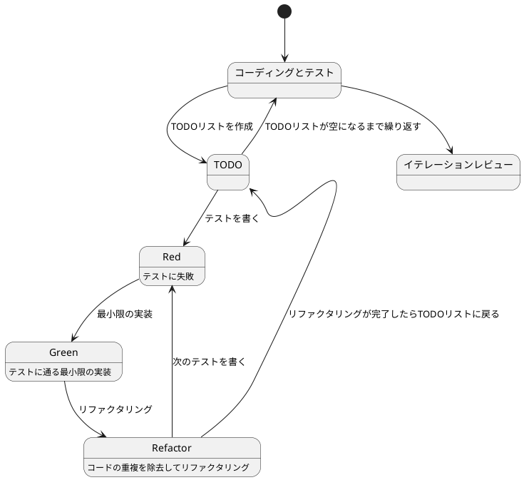
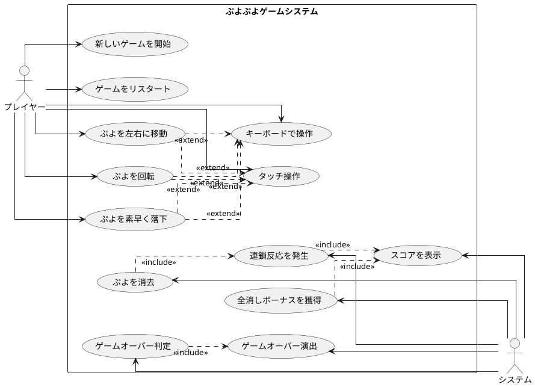

# ぷよぷよから始めるテスト駆動開発 (Elixir版)

## はじめに

みなさん、こんにちは！今日は私と一緒にテスト駆動開発（TDD）を使って、Elixirでぷよぷよゲームを作っていきましょう。「Elixirでゲーム開発？」と思われるかもしれませんが、Elixirの強力な並行処理とPhoenix LiveViewのリアルタイム通信機能を活用すれば、マルチプレイヤー対応のゲームも簡単に作れるんです！

> テスト駆動開発とは、プログラミングの手法の一種で、「テストファースト」の原則に従い、実装前にテストを書くことで、コードの品質を高め、設計を改善していく開発手法です。
>
> — Kent Beck 『テスト駆動開発』

この記事では、私たちが一緒にぷよぷよゲームを実装しながら、テスト駆動開発の基本的な流れと考え方を学んでいきます。まるでモブプログラミングのセッションのように、あなたと私が一緒に考え、コードを書き、改善していく過程を体験しましょう。

### Elixirでゲーム開発を選んだ理由

「なぜElixirなの？」と思われるかもしれませんね。いくつか理由があります：

1. **関数型プログラミング**: イミュータブルなデータ構造により、ゲームの状態管理が明確になります
2. **並行処理**: 将来的にマルチプレイヤー機能を追加しやすい設計になります
3. **Phoenix LiveView**: リアルタイムなゲーム体験を提供できます
4. **パターンマッチング**: ゲームの状態遷移が直感的に書けます
5. **強力なツール**: Mix、ExUnit、Credoなど、開発環境が充実しています

### テスト駆動開発のサイクル

さて、テスト駆動開発では、どのように進めていけばいいのでしょうか？「テストを書いてから実装する」というのは分かりましたが、具体的にはどんな手順で進めるのでしょうか？

私がいつも実践しているのは、以下の3つのステップを繰り返すサイクルです。皆さんも一緒にやってみましょう：

1. **Red（赤）**: まず失敗するテストを書きます。「え？わざと失敗するテストを？」と思われるかもしれませんが、これには重要な意味があるんです。これから実装する機能が何をすべきかを明確にするためなんですよ。
2. **Green（緑）**: 次に、テストが通るように、最小限のコードを実装します。この段階では、きれいなコードよりも「とにかく動くこと」を優先します。「最小限」というのがポイントです。必要以上のことはしないようにしましょう。
3. **Refactor（リファクタリング）**: 最後に、コードの品質を改善します。テストが通ることを確認しながら、重複を取り除いたり、わかりやすい名前をつけたりします。「動くけど汚いコード」から「動いてきれいなコード」へと進化させるんです。

> テスト駆動開発のリズム：赤、緑、リファクタリング。まず失敗するテストを書き（赤）、次にテストが通るようにする（緑）、そして重複を除去する（リファクタリング）。
>
> — Kent Beck 『テスト駆動開発』

このサイクルを「Red-Green-Refactor」サイクルと呼びます。「赤・緑・リファクタリング」のリズムを刻むように、このサイクルを繰り返していくんです。これによって、少しずつ機能を追加し、コードの品質を高めていきましょう。



### 開発環境

さて、実際にコードを書く前に、私たちが使用する開発環境について少しお話ししておきましょう。

今回のプロジェクトでは、以下のツールを使用していきます：

- **言語**: Elixir 1.16+ — 関数型プログラミング言語で、Erlang VMの上で動作します
- **ビルドツール**: Mix — Elixirの標準ビルドツールで、プロジェクト管理からテスト実行まで統合的に管理できます
- **テストフレームワーク**: ExUnit — Elixir標準のテストフレームワークです
- **静的解析**: Credo — Elixir専用の静的コード解析ツールです
- **コードカバレッジ**: ExCoveralls — テストカバレッジを測定します
- **フロントエンド**: Phoenix LiveView — リアルタイムなWebアプリケーションを構築します
- **バージョン管理**: Git — コードの変更履歴を追跡します

これらのツールを使って、テスト駆動開発の流れに沿ってぷよぷよゲームを実装していきましょう。

---

## 要件

### ユーザーストーリー

さて、実際にコードを書き始める前に、少し立ち止まって考えてみましょう。「何を作るのか？」という基本的な問いかけです。私たちが作るぷよぷよゲームは、どのような機能を持つべきでしょうか？

アジャイル開発では、この「何を作るのか？」という問いに対して、「ユーザーストーリー」という形で答えを出します。

> ユーザーストーリーとは、ソフトウェアの機能を「誰が」「何を」「なぜ」したいのかという形式で表現したものです。これにより、開発チームは常にユーザーの視点を忘れずに開発を進めることができます。
>
> — Mike Cohn 『User Stories Applied』

では、私たちのぷよぷよゲームでは、どんなユーザーストーリーが考えられるでしょうか？

- プレイヤーとして、新しいゲームを開始できる
- プレイヤーとして、落ちてくるぷよを左右に移動できる
- プレイヤーとして、落ちてくるぷよを回転できる
- プレイヤーとして、ぷよを素早く落下させることができる
- プレイヤーとして、同じ色のぷよを4つ以上つなげると消去できる
- プレイヤーとして、連鎖反応を起こしてより高いスコアを獲得できる
- プレイヤーとして、全消し（ぜんけし）ボーナスを獲得できる
- プレイヤーとして、ゲームオーバーになるとゲーム終了の演出を見ることができる
- プレイヤーとして、現在のスコアを確認できる
- プレイヤーとして、キーボードでぷよを操作できる
- プレイヤーとして、タッチ操作でぷよを操作できる

### ユースケース図

ユーザーストーリーを整理したところで、「これらの機能がどのように関連しているのか、全体像が見えるといいな」と思いませんか？そんなときに役立つのが「ユースケース図」です。



---

## イテレーション0: プロジェクトセットアップと開発環境構築

### イテレーション0の目標

実際にコードを書き始める前に、「動作するきれいなコード」を継続的に書き続けられる環境を整えます。これが**イテレーション0**です。

> ソフトウェア開発において、適切な開発環境の構築は成功の半分です。良いツールは良い仕事の第一歩となります。
>
> — Andrew Hunt & David Thomas 『達人プログラマー』

このイテレーションで実現すること：

1. **プロジェクトの作成**: Mixを使用したプロジェクトの初期化
2. **開発ツールの導入**: Credo（静的解析）、ExCoveralls（カバレッジ）、mix_test_watch（自動テスト）
3. **開発ガイドの作成**: チーム開発のためのドキュメント整備
4. **品質基準の設定**: コード品質を保つためのルール策定

### ステップ1: プロジェクト作成

まずは、新しいElixirプロジェクトを作成しましょう。

```bash
# プロジェクトを作成
mix new puyo_puyo --module PuyoPuyo
cd puyo_puyo
```

これで、以下のような構造のプロジェクトが生成されます：

```
puyo_puyo/
├── lib/
│   └── puyo_puyo.ex         # メインモジュール
├── test/
│   ├── puyo_puyo_test.exs   # テストファイル
│   └── test_helper.exs       # テスト設定
├── mix.exs                   # プロジェクト設定
└── README.md                 # プロジェクト説明
```

### ステップ2: Git初期化

バージョン管理を開始します。これは「ソフトウェア開発の三種の神器」の一つです。

```bash
# Gitリポジトリを初期化
git init

# .gitignoreを作成
cat > .gitignore << 'EOF'
# The directory Mix will write compiled artifacts to.
/_build/

# If you run "mix test --cover", coverage assets end up here.
/cover/

# The directory Mix downloads your dependencies sources to.
/deps/

# Where third-party dependencies like ExDoc output generated docs.
/doc/

# Ignore .fetch files in case you like to edit your project deps locally.
/.fetch

# If the VM crashes, it generates a dump, let's ignore it too.
erl_crash.dump

# Also ignore archive artifacts (built via "mix archive.build").
*.ez

# Ignore package tarball (built via "mix hex.build").
puyo_puyo-*.tar

# Temporary files, for example, from tests.
/tmp/
EOF

# 初回コミット
git add -A
git commit -m "chore: プロジェクトの初期セットアップ"
```

### ステップ3: 依存関係の設定

開発に必要なツールを `mix.exs` に追加します。

```elixir
defmodule PuyoPuyo.MixProject do
  use Mix.Project

  def project do
    [
      app: :puyo_puyo,
      version: "0.1.0",
      elixir: "~> 1.16",
      start_permanent: Mix.env() == :prod,
      deps: deps(),

      # テストカバレッジの設定
      test_coverage: [tool: ExCoveralls],
      preferred_cli_env: [
        coveralls: :test,
        "coveralls.detail": :test,
        "coveralls.html": :test
      ],

      # ドキュメント設定
      name: "PuyoPuyo",
      source_url: "https://github.com/yourusername/puyo_puyo",
      docs: [
        main: "PuyoPuyo",
        extras: ["README.md"]
      ]
    ]
  end

  def application do
    [
      extra_applications: [:logger]
    ]
  end

  defp deps do
    [
      # 静的コード解析
      {:credo, "~> 1.7", only: [:dev, :test], runtime: false},
      # コードカバレッジ
      {:excoveralls, "~> 0.18", only: :test},
      # ファイル監視（自動テスト実行）
      {:mix_test_watch, "~> 1.0", only: [:dev, :test], runtime: false},
      # ドキュメント生成
      {:ex_doc, "~> 0.31", only: :dev, runtime: false}
    ]
  end
end
```

### ステップ4: 依存関係のインストール

```bash
# 依存関係を取得
mix deps.get

# コミット
git add mix.exs mix.lock
git commit -m "chore: 開発ツールの依存関係を追加"
```

### ステップ5: 静的解析ツール（Credo）の設定

Credoは、Elixirのベストプラクティスに従ったコードを書くための静的解析ツールです。

```bash
# Credo設定ファイルを生成
mix credo gen.config
```

生成された `.credo.exs` をカスタマイズします。特に、サイクロマティック複雑度を7に設定します。

`.credo.exs` を編集：

```elixir
%{
  configs: [
    %{
      name: "default",
      files: %{
        included: [
          "lib/",
          "src/",
          "test/",
          "web/",
          "apps/*/lib/",
          "apps/*/src/",
          "apps/*/test/",
          "apps/*/web/"
        ],
        excluded: [~r"/_build/", ~r"/deps/", ~r"/node_modules/"]
      },
      plugins: [],
      requires: [],
      strict: true,
      parse_timeout: 5000,
      color: true,
      checks: %{
        enabled: [
          # サイクロマティック複雑度を7に設定
          {Credo.Check.Refactor.CyclomaticComplexity, [max_complexity: 7]},

          # その他の推奨設定
          {Credo.Check.Refactor.Nesting, [max_nesting: 3]},
          {Credo.Check.Design.AliasUsage, []},
          {Credo.Check.Readability.ModuleDoc, []},
          {Credo.Check.Readability.FunctionNames, []},
          {Credo.Check.Readability.VariableNames, []},
          {Credo.Check.Warning.UnusedEnumOperation, []},
          {Credo.Check.Warning.UnusedKeywordOperation, []},
          {Credo.Check.Warning.UnusedListOperation, []},
          {Credo.Check.Warning.UnusedTupleOperation, []}
        ],
        disabled: []
      }
    }
  ]
}
```

#### サイクロマティック複雑度とは

**サイクロマティック複雑度（Cyclomatic Complexity）**は、コードの複雑さを測る指標です：

- **計算方法**: 条件分岐（`if`、`case`、`cond`）とループの数に基づいて計算
- **複雑度7の意味**: 関数内に最大7つの独立した実行パスが許容される
- **推奨値**:
  - 1-7: 低い複雑度（理解しやすい）
  - 8-10: 中程度の複雑度（まだ管理可能）
  - 11以上: 高い複雑度（リファクタリング推奨）

複雑度が高い関数は、テストが難しく、バグが混入しやすくなります。TDDでは、複雑度を低く保つことで、テストしやすく保守しやすいコードを書くことができます。

```bash
# Credoを実行してみる
mix credo --strict

# サイクロマティック複雑度の詳細を確認
mix credo --format=flycheck
```

初期状態では、いくつかの警告が表示されるかもしれません。それらを修正していきましょう。

### ステップ6: モジュールドキュメントの追加

Credoが指摘する `@moduledoc` を追加します。

`lib/puyo_puyo.ex` を編集：

```elixir
defmodule PuyoPuyo do
  @moduledoc """
  ぷよぷよゲームのメインモジュールです。

  このモジュールは、テスト駆動開発の実践例として、
  ぷよぷよゲームのコアロジックを実装しています。

  ## 特徴

  - イミュータブルなゲーム状態管理
  - パターンマッチングによる状態遷移
  - ExUnitを使用したテスト駆動開発
  """

  @doc """
  Hello world.

  ## Examples

      iex> PuyoPuyo.hello()
      :world

  """
  def hello do
    :world
  end
end
```

### ステップ7: コードフォーマッタの設定

`.formatter.exs` を編集して、プロジェクトのフォーマット設定を調整：

```elixir
# .formatter.exs
[
  inputs: ["{mix,.formatter}.exs", "{config,lib,test}/**/*.{ex,exs}"],
  line_length: 100,
  import_deps: []
]
```

```bash
# コードを自動整形
mix format

# フォーマット状態をチェック
mix format --check-formatted

# コミット
git add -A
git commit -m "chore: 静的解析ツールの設定とモジュールドキュメント追加"
```

### ステップ8: カスタムMixタスクの作成

開発効率を向上させるため、よく使用するコマンドを統合したカスタムタスクを作成します。

```bash
mkdir -p lib/mix/tasks
```

`lib/mix/tasks/check.ex` を作成：

```elixir
defmodule Mix.Tasks.Check do
  @moduledoc """
  開発時の基本チェックを実行するタスクです。

  以下のチェックを実行します：
  - mix format --check-formatted (フォーマットチェック)
  - mix credo (静的解析)
  - mix test (テスト実行)
  """

  use Mix.Task

  @shortdoc "基本的なコード品質チェック"

  def run(_args) do
    Mix.shell().info("==> 基本チェックを開始します")

    # フォーマットチェック
    Mix.shell().info("\n==> フォーマットチェック")
    Mix.Task.run("format", ["--check-formatted"])
    Mix.shell().info("✓ フォーマットチェック 完了")

    # 静的解析
    Mix.shell().info("\n==> 静的解析")
    Mix.Task.run("credo", ["--strict"])
    Mix.shell().info("✓ 静的解析 完了")

    # テスト実行
    Mix.shell().info("\n==> テスト実行")
    Mix.Task.run("test", [])
    Mix.shell().info("✓ テスト実行 完了")

    Mix.shell().info("\n🎉 基本チェックが完了しました！")
  end
end
```

`lib/mix/tasks/dev.ex` を作成：

```elixir
defmodule Mix.Tasks.Dev do
  @moduledoc """
  開発時によく使用するタスクのためのショートカットです。
  """

  use Mix.Task

  @shortdoc "開発用ショートカットコマンド"

  def run(["test"]) do
    Mix.Task.run("test", [])
  end

  def run(["format"]) do
    Mix.Task.run("format", [])
    Mix.shell().info("✓ コードをフォーマットしました")
  end

  def run(["coverage"]) do
    Mix.Task.run("coveralls.html", [])
    Mix.shell().info("✓ カバレッジレポートを生成しました (cover/excoveralls.html)")
  end

  def run(["watch"]) do
    Mix.Task.run("test.watch", [])
  end

  def run(_) do
    Mix.shell().info("""
    使用可能なコマンド:

      mix dev test          # テストを実行
      mix dev format        # コードをフォーマット
      mix dev coverage      # カバレッジレポートを生成
      mix dev watch         # ファイル監視モード
    """)
  end
end
```

```bash
# 動作確認
mix check

# コミット
git add -A
git commit -m "chore: カスタムMixタスクを追加"
```

### ステップ9: 開発ガイドの作成

チーム開発のため、開発手順をドキュメント化します。

`DEVELOPMENT.md` を作成：

```markdown
# 開発ガイド

## 開発環境のセットアップ

### 必要な環境

- Elixir 1.16 以上
- Erlang/OTP 26 以上
- Git

### 初期セットアップ

\`\`\`bash
# 依存関係のインストール
mix deps.get

# 開発ツールの動作確認
mix check
\`\`\`

## 使用可能なツール

### 基本コマンド

- `mix test` - テスト実行
- `mix format` - コード整形
- `mix credo` - 静的解析
- `mix coveralls` - カバレッジ測定
- `mix coveralls.html` - HTMLカバレッジレポート生成

### 統合コマンド

- `mix check` - 基本チェック (format, credo, test)

### 開発用コマンド

- `mix dev` - 利用可能なコマンド一覧
- `mix dev test` - テスト実行
- `mix dev format` - フォーマット実行
- `mix dev coverage` - カバレッジレポート生成
- `mix dev watch` - ファイル監視モード

### 自動化

- `mix test.watch` - ファイル変更時の自動テスト実行

## 開発フロー

### Red-Green-Refactorサイクル

1. **Red（赤）**: 失敗するテストを書く
2. **Green（緑）**: テストが通る最小限の実装
3. **Refactor（リファクタリング）**: コードの品質を改善

### 推奨ワークフロー

1. **新機能・バグ修正の開始**
   \`\`\`bash
   # ファイル監視モードで開発
   mix dev watch
   \`\`\`

2. **コードを書く**
   - テストを書く（Red）
   - 実装する（Green）
   - リファクタリングする（Refactor）

3. **コミット前のチェック**
   \`\`\`bash
   # 自動フォーマット
   mix format

   # 品質チェック
   mix check
   \`\`\`

4. **コミット**
   \`\`\`bash
   git add -A
   git commit -m "feat: 新機能を追加"
   \`\`\`

## コミットメッセージ規約

Angularコミットメッセージ規約に従います：

- `feat`: 新機能
- `fix`: バグ修正
- `docs`: ドキュメントのみの変更
- `style`: コードの動作に影響しない変更
- `refactor`: バグ修正や機能追加以外のコード変更
- `test`: テストの追加や修正
- `chore`: ビルドプロセスやツールの変更

例：
\`\`\`bash
git commit -m "feat: ぷよの移動機能を実装"
git commit -m "test: ぷよの回転テストを追加"
git commit -m "refactor: ゲーム状態管理をモジュール分割"
\`\`\`

## 品質基準

- **フォーマット**: Elixir標準フォーマッタに準拠（100%）
- **静的解析**: Credoのルールをクリア
- **サイクロマティック複雑度**: 関数あたり7以下
- **ネストの深さ**: 最大3レベル
- **テストカバレッジ**: 80%以上を目標
- **全テスト**: パス必須

### コード複雑度について

**サイクロマティック複雑度7以下**を維持することで：
- テストが書きやすくなる
- バグが発見しやすくなる
- コードの理解が容易になる
- 保守性が向上する

複雑度が7を超える場合は、関数を分割することを検討してください。

## トラブルシューティング

### フォーマットエラー

\`\`\`bash
# 問題
mix format --check-formatted
# The following files are not formatted: ...

# 解決
mix format
\`\`\`

### Credo警告

\`\`\`bash
# 警告を確認
mix credo --strict

# 詳細を確認
mix credo explain path/to/file.ex:line_number
\`\`\`

### 依存関係の問題

\`\`\`bash
# キャッシュをクリア
mix deps.clean --all
mix deps.get
\`\`\`
```

```bash
# コミット
git add DEVELOPMENT.md
git commit -m "docs: 開発ガイドを追加"
```

### ステップ10: README更新

`README.md` を更新してプロジェクトの概要を記載：

```markdown
# PuyoPuyo

Elixirとテスト駆動開発で実装するぷよぷよゲーム

## 概要

このプロジェクトは、テスト駆動開発（TDD）の実践例として、
Elixirでぷよぷよゲームを実装する過程を示しています。

## 特徴

- **テスト駆動開発**: Red-Green-Refactorサイクルに従った開発
- **関数型プログラミング**: イミュータブルなデータ構造
- **パターンマッチング**: Elixirの強力な機能を活用
- **品質管理**: Credo、ExCoveralls、mix_test_watchによる自動化

## 開発環境

- Elixir 1.16+
- Erlang/OTP 26+

## セットアップ

\`\`\`bash
# 依存関係のインストール
mix deps.get

# テスト実行
mix test

# 品質チェック
mix check
\`\`\`

## 開発

詳細な開発手順については [DEVELOPMENT.md](DEVELOPMENT.md) を参照してください。

## ライセンス

MIT License
```

```bash
# コミット
git add README.md
git commit -m "docs: README を更新"
```

### ステップ11: 動作確認

すべてのツールが正しく動作するか確認します。

```bash
# フォーマットチェック
mix format --check-formatted

# 静的解析
mix credo --strict

# テスト実行
mix test

# カバレッジ測定
mix coveralls

# HTMLカバレッジレポート生成
mix coveralls.html

# 統合チェック
mix check
```

### イテレーション0の完了

おめでとうございます！これで開発環境の構築が完了しました。

#### 達成したこと

✅ プロジェクトの作成とGit初期化
✅ 開発ツールの導入（Credo、ExCoveralls、mix_test_watch）
✅ カスタムMixタスクの作成
✅ 開発ガイドのドキュメント化
✅ 品質基準の設定

#### プロジェクト構成

```
puyo_puyo/
├── lib/
│   ├── puyo_puyo.ex              # メインモジュール
│   └── mix/
│       └── tasks/
│           ├── check.ex          # 基本チェックタスク
│           └── dev.ex            # 開発用タスク
├── test/
│   ├── puyo_puyo_test.exs        # テストファイル
│   └── test_helper.exs
├── .credo.exs                    # Credo設定
├── .formatter.exs                # フォーマッタ設定
├── .gitignore                    # Git除外設定
├── mix.exs                       # プロジェクト設定
├── DEVELOPMENT.md                # 開発ガイド
└── README.md                     # プロジェクト説明
```

#### コミット履歴

```bash
git log --oneline
```

```
* docs: README を更新
* docs: 開発ガイドを追加
* chore: カスタムMixタスクを追加
* chore: 静的解析ツールの設定とモジュールドキュメント追加
* chore: 開発ツールの依存関係を追加
* chore: プロジェクトの初期セットアップ
```

### 次のステップ

イテレーション0で開発環境が整いました。次のイテレーションから、実際のゲームロジックの実装を始めます：

- **イテレーション1**: ゲームの初期化とゲーム状態の管理
- **イテレーション2**: ステージ（フィールド）の実装
- **イテレーション3**: ぷよの生成と表示
- **イテレーション4**: ぷよの移動と回転
- **イテレーション5**: ぷよの自由落下
- **イテレーション6**: ぷよの消去判定
- **イテレーション7**: 連鎖反応の実装
- **イテレーション8**: スコア計算
- **イテレーション9**: ゲームオーバー判定
- **イテレーション10**: Phoenix LiveViewによるUI実装

それでは、Red-Green-Refactorのリズムで、「動作するきれいなコード」を書いていきましょう！

---

## 参考資料

### 公式ドキュメント
- [Elixir公式ドキュメント](https://elixir-lang.org/docs.html)
- [Mix documentation](https://hexdocs.pm/mix/Mix.html)
- [ExUnit documentation](https://hexdocs.pm/ex_unit/ExUnit.html)

### 使用ツール
- [Credo](https://github.com/rrrene/credo) - 静的コード解析
- [ExCoveralls](https://github.com/parroty/excoveralls) - コードカバレッジ
- [mix_test_watch](https://github.com/lpil/mix-test.watch) - ファイル監視

### 書籍
- Kent Beck 『テスト駆動開発』
- Andrew Hunt & David Thomas 『達人プログラマー』
- Mike Cohn 『User Stories Applied』

Elixirの世界で「動作するきれいなコード」を継続的に書き続ける環境が整いました。開発を楽しんでください！

---

## イテレーション1: ゲームの初期化とゲーム状態の管理

さあ、いよいよコードを書き始めましょう！テスト駆動開発では、小さなイテレーション（反復）で機能を少しずつ追加していきます。最初のイテレーションでは、最も基本的な機能である「ゲームの初期化とゲーム状態の管理」を実装します。

> イテレーション開発とは、ソフトウェアを小さな機能単位で繰り返し開発していく手法です。各イテレーションで計画、設計、実装、テスト、評価のサイクルを回すことで、リスクを早期に発見し、フィードバックを得ながら開発を進めることができます。
>
> — Craig Larman 『アジャイル開発とスクラム』

### ユーザーストーリー

まずは、このイテレーションで実装するユーザーストーリーを確認しましょう：

> プレイヤーとして、新しいゲームを開始できる

このシンプルなストーリーから始めることで、ゲームの基本的な構造を作り、後続の機能追加の土台を築くことができます。では、テスト駆動開発のサイクルに従って、まずはテストから書いていきましょう！

### TODOリスト

さて、ユーザーストーリーを実装するために、まずはTODOリストを作成しましょう。TODOリストは、大きな機能を小さなタスクに分解するのに役立ちます。

> TODOリストは、テスト駆動開発の重要なプラクティスの一つです。実装前に必要なタスクを明確にすることで、開発の方向性を保ち、何も見落とさないようにします。
>
> — Kent Beck 『テスト駆動開発』

私たちの「新しいゲームを開始できる」というユーザーストーリーを実現するためには、どのようなタスクが必要でしょうか？考えてみましょう：

- [x] ゲーム状態を表現する構造体を定義する
- [x] ゲームの初期化処理を実装する
- [ ] ゲームモードの状態遷移を実装する
- [ ] ゲーム設定情報を管理するモジュールを作成する

これらのタスクを一つずつ実装していきましょう。テスト駆動開発では、各タスクに対してテスト→実装→リファクタリングのサイクルを回します。まずは「ゲーム状態の定義」から始めましょう！

### テスト: ゲームモジュールの作成

さて、TODOリストの最初のタスク「ゲーム状態を表現する構造体を定義する」に取り掛かりましょう。テスト駆動開発では、まずテストを書くことから始めます。

> テストファースト
>
> いつテストを書くべきだろうか——それはテスト対象のコードを書く前だ。
>
> — Kent Beck 『テスト駆動開発』

では、ゲームモジュールの基本的な動作をテストするコードを書いてみましょう。

`test/puyo_puyo/game_test.exs` を作成：

```elixir
defmodule PuyoPuyo.GameTest do
  use ExUnit.Case
  alias PuyoPuyo.Game

  describe "new/0" do
    test "新しいゲーム構造体を作成する" do
      game = Game.new()

      assert %Game{} = game
      assert game.mode == :start
      assert game.frame == 0
      assert game.chain_count == 0
    end
  end

  describe "initialize/1" do
    test "ゲームを初期化すると、必要なコンポーネントが作成される" do
      game = Game.new()
      initialized_game = Game.initialize(game)

      assert initialized_game.config != nil
      assert initialized_game.stage != nil
      assert initialized_game.score != nil
      assert initialized_game.mode == :new_puyo
    end

    test "初期化済みのゲーム状態はイミュータブルである" do
      game = Game.new()
      initialized_game = Game.initialize(game)

      # 元のゲーム状態は変更されない
      assert game.mode == :start
      assert initialized_game.mode == :new_puyo
    end
  end
end
```

このテストでは、`Game`モジュールの基本的な動作を確認しています：

1. `new/0`関数で新しいゲーム構造体を作成できる
2. `initialize/1`関数でゲームを初期化できる
3. 初期化後、必要なコンポーネントが設定される
4. イミュータブルなデータ構造になっている（元のデータは変更されない）

### テスト実行（Red）

テストを実行してみましょう：

```bash
mix test test/puyo_puyo/game_test.exs
```

当然エラーになります：

```
** (CompileError) test/puyo_puyo/game_test.exs:2: module PuyoPuyo.Game is not loaded
```

これがテスト駆動開発の「Red（赤）」の状態です。では、テストが通るように実装していきましょう！

### 実装: ゲーム構造体の定義

まず、`lib/puyo_puyo/game.ex` を作成してゲーム構造体を定義します：

```elixir
defmodule PuyoPuyo.Game do
  @moduledoc """
  ぷよぷよゲームのメインモジュールです。

  ゲーム全体の状態を管理し、ゲームループの制御を行います。
  """

  @type game_mode ::
          :start
          | :check_fall
          | :fall
          | :check_erase
          | :erasing
          | :new_puyo
          | :playing
          | :game_over

  @type t :: %__MODULE__{
          mode: game_mode(),
          frame: non_neg_integer(),
          chain_count: non_neg_integer(),
          config: map() | nil,
          stage: map() | nil,
          score: map() | nil
        }

  defstruct mode: :start,
            frame: 0,
            chain_count: 0,
            config: nil,
            stage: nil,
            score: nil

  @doc """
  新しいゲーム構造体を作成します。

  ## Examples

      iex> game = PuyoPuyo.Game.new()
      iex> game.mode
      :start

  """
  @spec new() :: t()
  def new do
    %__MODULE__{}
  end

  @doc """
  ゲームを初期化します。

  必要なコンポーネント（設定、ステージ、スコア）を作成し、
  ゲームモードを `:new_puyo` に設定します。

  ## Parameters

    - game: 初期化するゲーム構造体

  ## Returns

    初期化されたゲーム構造体

  ## Examples

      iex> game = PuyoPuyo.Game.new()
      iex> initialized = PuyoPuyo.Game.initialize(game)
      iex> initialized.mode
      :new_puyo

  """
  @spec initialize(t()) :: t()
  def initialize(%__MODULE__{} = game) do
    # 各コンポーネントの初期化（現時点では仮実装）
    config = %{rows: 12, cols: 6, puyo_size: 32}
    stage = %{grid: [], rows: 12, cols: 6}
    score = %{current: 0, chain: 0}

    # 新しいゲーム状態を返す（イミュータブル）
    %{game | config: config, stage: stage, score: score, mode: :new_puyo}
  end
end
```

### テスト実行（Green）

もう一度テストを実行してみましょう：

```bash
mix test test/puyo_puyo/game_test.exs
```

結果：

```
...

Finished in 0.05 seconds
3 tests, 0 failures
```

おめでとうございます！テストが通りました。これがテスト駆動開発の「Green（緑）」の状態です。

### 解説: Elixirのイミュータブルなデータ構造

テストが通りましたね！実装したコードについて、少し解説しておきましょう。

#### 構造体（Struct）の定義

Elixirでは、`defstruct`を使って構造体を定義します：

```elixir
defstruct mode: :start,
          frame: 0,
          chain_count: 0,
          config: nil,
          stage: nil,
          score: nil
```

これは、オブジェクト指向言語のクラスに似ていますが、重要な違いがあります：

- **イミュータブル**: 一度作成したデータは変更できません
- **データと振る舞いの分離**: データ（構造体）と振る舞い（関数）が明確に分離されています

#### 型指定（Type Specification）

Elixirでは、`@type`と`@spec`を使って型を指定できます：

```elixir
@type game_mode :: :start | :check_fall | :fall | ...
@type t :: %__MODULE__{...}

@spec new() :: t()
@spec initialize(t()) :: t()
```

これにより：
- コードの意図が明確になる
- Dialyzer（静的解析ツール）で型エラーを検出できる
- ドキュメント生成時に型情報が含まれる

#### イミュータブルな更新

`initialize/1`関数を見てみましょう：

```elixir
def initialize(%__MODULE__{} = game) do
  config = %{...}
  stage = %{...}
  score = %{...}

  # 新しいゲーム状態を返す
  %{game | config: config, stage: stage, score: score, mode: :new_puyo}
end
```

`%{game | ...}`という構文は、**既存のデータをコピーして一部を更新した新しいデータを作成**します。元の`game`は変更されません。

これがElixirの強力な特性です：

```elixir
game1 = Game.new()              # mode: :start
game2 = Game.initialize(game1)  # mode: :new_puyo
# game1.mode はまだ :start のまま！
```

#### パターンマッチングによる型チェック

関数定義で`%__MODULE__{} = game`というパターンを使っています：

```elixir
def initialize(%__MODULE__{} = game) do
```

これは：
- 引数が`Game`構造体であることを保証
- 間違った型が渡されるとランタイムエラーになる
- 自己文書化されたコード

### コミット

では、ここまでの実装をコミットしましょう：

```bash
# テストを実行して確認
mix test

# フォーマットと品質チェック
mix format
mix check

# コミット
git add lib/puyo_puyo/game.ex test/puyo_puyo/game_test.exs
git commit -m "feat: ゲーム構造体と初期化機能を実装

- Game構造体の定義（イミュータブルなゲーム状態）
- new/0関数で新しいゲームを作成
- initialize/1関数でゲームを初期化
- 型指定とドキュメントを追加
- ExUnitによるテスト実装

イテレーション1の基盤が完成"
```

### Refactor: 型安全性の向上

さて、テストが通りましたが、コードをもう少し改善できそうです。現在、`config`、`stage`、`score`は単なる`map()`として扱っていますが、これらも専用の構造体にした方が型安全性が高まります。

しかし、テスト駆動開発の原則に従い、**まずは動くコードを書いてから改善する**というアプローチを取ります。この改善は次のイテレーションで行いましょう。

> リファクタリングのタイミング
>
> リファクタリングは、新しい機能を追加する前か、バグを修正した後に行うのが良い。テストが通っている状態でリファクタリングすれば、安全に改善できる。
>
> — Martin Fowler 『リファクタリング』

### イテレーション1の振り返り

このイテレーションで達成したこと：

✅ ゲーム構造体の定義
✅ 基本的な初期化処理
✅ イミュータブルなデータ構造の採用
✅ 型指定による安全性の向上
✅ テスト駆動開発のサイクル実践

#### 学んだこと

1. **Elixirの構造体**: `defstruct`でイミュータブルなデータ構造を定義
2. **型指定**: `@type`と`@spec`で型安全性を向上
3. **パターンマッチング**: 関数引数で型をチェック
4. **イミュータブルな更新**: `%{struct | field: value}`構文
5. **ExUnit**: Elixirの標準テストフレームワーク

#### 次のステップ

次のイテレーションでは、以下を実装します：

- ステージ（フィールド）の実装
- ゲーム設定情報の専用モジュール化
- スコア管理の専用モジュール化

それでは、Red-Green-Refactorのリズムで、「動作するきれいなコード」を書いていきましょう！

---

## イテレーション2: ゲームコンポーネントの型安全なモジュール化

### イテレーション2の目標

イテレーション1では、ゲームの基本的な構造を作成しました。しかし、`config`、`stage`、`score`を単なる`map()`として扱っていましたね。このイテレーションでは、これらを専用の構造体に分割し、**型安全性を高め、責任を明確にする**リファクタリングを行います。

> リファクタリングとは、外部から見た振る舞いを変えずに、内部構造を改善することです。テストが通っている状態で行うことで、安全に品質を向上できます。
>
> — Martin Fowler 『リファクタリング』

このイテレーションで実現すること：

1. **Config構造体**: ゲーム設定情報の専用モジュール
2. **Stage構造体**: ステージ（フィールド）の専用モジュール
3. **Score構造体**: スコア管理の専用モジュール
4. **型安全性の向上**: 各コンポーネントに明確な型を持たせる

### ユーザーストーリー

このイテレーションで実装するユーザーストーリー：

> 開発者として、ゲームの各コンポーネントが明確に分離されており、型安全な操作ができるようにしたい

### TODOリスト

- [x] Config構造体を作成し、テストを書く
- [x] Stage構造体を作成し、テストを書く
- [x] Score構造体を作成し、テストを書く
- [x] Game構造体を更新して型安全な構造体を使用する
- [ ] ぷよの生成と表示機能を追加する

それでは、テスト駆動開発のサイクルに従って、一つずつ実装していきましょう！

### ステップ1: Config構造体の作成

まず、ゲーム設定情報を管理する`Config`構造体を作成します。

#### テスト: Config構造体（Red）

`test/puyo_puyo/config_test.exs` を作成：

```elixir
defmodule PuyoPuyo.ConfigTest do
  use ExUnit.Case
  alias PuyoPuyo.Config

  describe "new/0" do
    test "デフォルト設定でConfig構造体を作成する" do
      config = Config.new()

      assert %Config{} = config
      assert config.rows == 12
      assert config.cols == 6
      assert config.puyo_size == 32
    end
  end

  describe "new/1" do
    test "カスタム設定でConfig構造体を作成する" do
      config = Config.new(rows: 16, cols: 8)

      assert config.rows == 16
      assert config.cols == 8
      assert config.puyo_size == 32  # デフォルト値
    end

    test "一部の設定だけをカスタマイズできる" do
      config = Config.new(puyo_size: 48)

      assert config.rows == 12       # デフォルト値
      assert config.cols == 6        # デフォルト値
      assert config.puyo_size == 48
    end
  end
end
```

テストを実行：

```bash
mix test test/puyo_puyo/config_test.exs
```

エラー：
```
** (CompileError) test/puyo_puyo/config_test.exs:2: module PuyoPuyo.Config is not loaded
```

#### 実装: Config構造体（Green）

`lib/puyo_puyo/config.ex` を作成：

```elixir
defmodule PuyoPuyo.Config do
  @moduledoc """
  ぷよぷよゲームの設定情報を管理するモジュールです。

  ステージのサイズやぷよのサイズなど、ゲーム全体の設定を保持します。
  """

  @type t :: %__MODULE__{
          rows: pos_integer(),
          cols: pos_integer(),
          puyo_size: pos_integer()
        }

  defstruct rows: 12,
            cols: 6,
            puyo_size: 32

  @doc """
  デフォルト設定でConfig構造体を作成します。

  ## Examples

      iex> config = PuyoPuyo.Config.new()
      iex> config.rows
      12

  """
  @spec new() :: t()
  def new do
    %__MODULE__{}
  end

  @doc """
  カスタム設定でConfig構造体を作成します。

  ## Parameters

    - opts: キーワードリスト形式の設定オプション

  ## Examples

      iex> config = PuyoPuyo.Config.new(rows: 16, cols: 8)
      iex> {config.rows, config.cols}
      {16, 8}

  """
  @spec new(keyword()) :: t()
  def new(opts) when is_list(opts) do
    struct(__MODULE__, opts)
  end
end
```

テストを実行：

```bash
mix test test/puyo_puyo/config_test.exs
```

結果：
```
...

Finished in 0.03 seconds
3 tests, 0 failures
```

#### 解説: struct/2関数とキーワードリスト

新しく使用したElixirの機能について解説します：

**struct/2関数**：
```elixir
struct(__MODULE__, opts)
```

`struct/2`関数は、構造体とキーワードリストを受け取り、指定されたフィールドを更新した新しい構造体を作成します。`defstruct`で定義されていないキーがあるとエラーになるため、型安全です。

**キーワードリスト**：
```elixir
Config.new(rows: 16, cols: 8)
```

Elixirのキーワードリストは`[{:rows, 16}, {:cols, 8}]`のシンタックスシュガーです。関数のオプション引数として広く使われています。

**ガード句 when is_list(opts)**：
```elixir
def new(opts) when is_list(opts) do
```

ガード句は、関数が実行される条件を指定します。`is_list(opts)`により、引数がリストでない場合はこの関数にマッチしません。

### ステップ2: Stage構造体の作成

次に、ゲームフィールドを管理する`Stage`構造体を作成します。

#### テスト: Stage構造体（Red）

`test/puyo_puyo/stage_test.exs` を作成：

```elixir
defmodule PuyoPuyo.StageTest do
  use ExUnit.Case
  alias PuyoPuyo.{Config, Stage}

  setup do
    config = Config.new()
    {:ok, config: config}
  end

  describe "new/1" do
    test "Config構造体からStage構造体を作成する", %{config: config} do
      stage = Stage.new(config)

      assert %Stage{} = stage
      assert stage.rows == config.rows
      assert stage.cols == config.cols
      assert length(stage.grid) == config.rows
    end

    test "グリッドはすべて0で初期化される", %{config: config} do
      stage = Stage.new(config)

      # すべてのセルが0であることを確認
      for row <- stage.grid do
        assert length(row) == config.cols
        assert Enum.all?(row, &(&1 == 0))
      end
    end
  end

  describe "get_puyo/3" do
    test "指定位置のぷよを取得できる", %{config: config} do
      stage = Stage.new(config)
      stage = Stage.set_puyo(stage, 5, 10, 1)

      assert Stage.get_puyo(stage, 5, 10) == 1
    end

    test "範囲外の位置はnilを返す", %{config: config} do
      stage = Stage.new(config)

      assert Stage.get_puyo(stage, -1, 0) == nil
      assert Stage.get_puyo(stage, 0, -1) == nil
      assert Stage.get_puyo(stage, 100, 0) == nil
      assert Stage.get_puyo(stage, 0, 100) == nil
    end
  end

  describe "set_puyo/4" do
    test "指定位置にぷよを設定できる", %{config: config} do
      stage = Stage.new(config)
      updated_stage = Stage.set_puyo(stage, 3, 5, 2)

      assert Stage.get_puyo(updated_stage, 3, 5) == 2
      # 元のstageは変更されていない（イミュータブル）
      assert Stage.get_puyo(stage, 3, 5) == 0
    end

    test "範囲外の位置には設定されない", %{config: config} do
      stage = Stage.new(config)
      updated_stage = Stage.set_puyo(stage, -1, 0, 1)

      # stageは変更されない
      assert updated_stage == stage
    end
  end
end
```

テストを実行：

```bash
mix test test/puyo_puyo/stage_test.exs
```

エラー：
```
** (CompileError) test/puyo_puyo/stage_test.exs:2: module PuyoPuyo.Stage is not loaded
```

#### 実装: Stage構造体（Green）

`lib/puyo_puyo/stage.ex` を作成：

```elixir
defmodule PuyoPuyo.Stage do
  @moduledoc """
  ぷよぷよゲームのステージ（フィールド）を管理するモジュールです。

  2次元グリッドとしてぷよの配置を管理し、ぷよの取得・設定操作を提供します。
  """

  alias PuyoPuyo.Config

  @type t :: %__MODULE__{
          rows: pos_integer(),
          cols: pos_integer(),
          grid: [[non_neg_integer()]]
        }

  defstruct [:rows, :cols, :grid]

  @doc """
  Config構造体からStage構造体を作成します。

  グリッドはすべて0（空）で初期化されます。

  ## Parameters

    - config: ゲーム設定情報

  ## Examples

      iex> config = PuyoPuyo.Config.new()
      iex> stage = PuyoPuyo.Stage.new(config)
      iex> {stage.rows, stage.cols}
      {12, 6}

  """
  @spec new(Config.t()) :: t()
  def new(%Config{} = config) do
    # 2次元グリッドを作成（すべて0で初期化）
    grid =
      for _row <- 1..config.rows do
        for _col <- 1..config.cols, do: 0
      end

    %__MODULE__{
      rows: config.rows,
      cols: config.cols,
      grid: grid
    }
  end

  @doc """
  指定位置のぷよを取得します。

  ## Parameters

    - stage: ステージ構造体
    - col: 列番号（0始まり）
    - row: 行番号（0始まり）

  ## Returns

    ぷよの種類（0は空）。範囲外の場合はnil。

  ## Examples

      iex> config = PuyoPuyo.Config.new()
      iex> stage = PuyoPuyo.Stage.new(config)
      iex> PuyoPuyo.Stage.get_puyo(stage, 0, 0)
      0

  """
  @spec get_puyo(t(), integer(), integer()) :: non_neg_integer() | nil
  def get_puyo(%__MODULE__{} = stage, col, row) do
    with true <- row >= 0 and row < stage.rows,
         true <- col >= 0 and col < stage.cols,
         row_data <- Enum.at(stage.grid, row),
         puyo when not is_nil(puyo) <- Enum.at(row_data, col) do
      puyo
    else
      _ -> nil
    end
  end

  @doc """
  指定位置にぷよを設定します。

  ## Parameters

    - stage: ステージ構造体
    - col: 列番号（0始まり）
    - row: 行番号（0始まり）
    - puyo_type: ぷよの種類（0は空）

  ## Returns

    更新されたステージ構造体。範囲外の場合は元のステージをそのまま返す。

  ## Examples

      iex> config = PuyoPuyo.Config.new()
      iex> stage = PuyoPuyo.Stage.new(config)
      iex> updated = PuyoPuyo.Stage.set_puyo(stage, 3, 5, 1)
      iex> PuyoPuyo.Stage.get_puyo(updated, 3, 5)
      1

  """
  @spec set_puyo(t(), integer(), integer(), non_neg_integer()) :: t()
  def set_puyo(%__MODULE__{} = stage, col, row, puyo_type) do
    if row >= 0 and row < stage.rows and col >= 0 and col < stage.cols do
      new_grid =
        stage.grid
        |> List.update_at(row, fn row_data ->
          List.replace_at(row_data, col, puyo_type)
        end)

      %{stage | grid: new_grid}
    else
      stage
    end
  end
end
```

テストを実行：

```bash
mix test test/puyo_puyo/stage_test.exs
```

結果：
```
.....

Finished in 0.05 seconds
5 tests, 0 failures
```

#### 解説: with式とイミュータブルなリスト操作

新しく使用したElixirの機能について解説します：

**with式**：
```elixir
with true <- row >= 0 and row < stage.rows,
     true <- col >= 0 and col < stage.cols,
     row_data <- Enum.at(stage.grid, row),
     puyo when not is_nil(puyo) <- Enum.at(row_data, col) do
  puyo
else
  _ -> nil
end
```

`with`式は、複数の条件チェックを連鎖させるための構文です。いずれかの条件が失敗すると`else`節に移ります。ネストを減らし、可読性を向上させます。

**List.update_at/3**：
```elixir
List.update_at(stage.grid, row, fn row_data ->
  List.replace_at(row_data, col, puyo_type)
end)
```

`List.update_at/3`は、リストの指定位置の要素を更新関数で変換した新しいリストを返します。元のリストは変更されません（イミュータブル）。

**List.replace_at/3**：
```elixir
List.replace_at(row_data, col, puyo_type)
```

`List.replace_at/3`は、リストの指定位置の要素を新しい値で置き換えた新しいリストを返します。

**パイプ演算子 |>**：
```elixir
stage.grid
|> List.update_at(row, fn row_data -> ... end)
```

パイプ演算子は、左辺の値を右辺の関数の第1引数として渡します。複数の関数呼び出しを読みやすく連鎖できます。

### ステップ3: Score構造体の作成

最後に、スコアを管理する`Score`構造体を作成します。

#### テスト: Score構造体（Red）

`test/puyo_puyo/score_test.exs` を作成：

```elixir
defmodule PuyoPuyo.ScoreTest do
  use ExUnit.Case
  alias PuyoPuyo.Score

  describe "new/0" do
    test "Score構造体を作成する" do
      score = Score.new()

      assert %Score{} = score
      assert score.current == 0
      assert score.chain == 0
    end
  end

  describe "add/2" do
    test "消去したぷよの数に応じてスコアが加算される" do
      score = Score.new()
      updated_score = Score.add(score, erase_count: 4, chain: 1)

      # 基本点 = 4 × 10 = 40
      assert updated_score.current == 40
      assert updated_score.chain == 1
    end

    test "連鎖数に応じてボーナスが加算される" do
      score = Score.new()
      updated_score = Score.add(score, erase_count: 4, chain: 2)

      # 基本点 = 4 × 10 = 40
      # 連鎖ボーナス = 2 × 2 × 50 = 200
      # 合計 = 40 + 200 = 240
      assert updated_score.current == 240
      assert updated_score.chain == 2
    end

    test "1連鎖の場合はボーナスなし" do
      score = Score.new()
      updated_score = Score.add(score, erase_count: 4, chain: 1)

      # 基本点のみ
      assert updated_score.current == 40
    end

    test "複数回加算できる" do
      score = Score.new()

      score = Score.add(score, erase_count: 4, chain: 1)  # 40点
      score = Score.add(score, erase_count: 5, chain: 2)  # 50 + 200 = 250点

      # 合計290点
      assert score.current == 290
    end
  end

  describe "reset_chain/1" do
    test "連鎖数をリセットする" do
      score = Score.new()
      score = Score.add(score, erase_count: 4, chain: 3)

      reset_score = Score.reset_chain(score)

      assert reset_score.chain == 0
      assert reset_score.current == score.current  # スコアは維持
    end
  end
end
```

テストを実行：

```bash
mix test test/puyo_puyo/score_test.exs
```

エラー：
```
** (CompileError) test/puyo_puyo/score_test.exs:2: module PuyoPuyo.Score is not loaded
```

#### 実装: Score構造体（Green）

`lib/puyo_puyo/score.ex` を作成：

```elixir
defmodule PuyoPuyo.Score do
  @moduledoc """
  ぷよぷよゲームのスコアを管理するモジュールです。

  スコア計算のロジックと連鎖数の管理を行います。
  """

  @type t :: %__MODULE__{
          current: non_neg_integer(),
          chain: non_neg_integer()
        }

  defstruct current: 0,
            chain: 0

  @doc """
  新しいScore構造体を作成します。

  ## Examples

      iex> score = PuyoPuyo.Score.new()
      iex> score.current
      0

  """
  @spec new() :: t()
  def new do
    %__MODULE__{}
  end

  @doc """
  消去したぷよの数と連鎖数に応じてスコアを加算します。

  スコア計算式：
  - 基本点 = 消去数 × 10
  - 連鎖ボーナス = 連鎖数 × 連鎖数 × 50 （2連鎖以上）
  - 獲得点 = 基本点 + 連鎖ボーナス

  ## Parameters

    - score: Score構造体
    - opts: キーワードリスト
      - erase_count: 消去したぷよの数
      - chain: 現在の連鎖数

  ## Examples

      iex> score = PuyoPuyo.Score.new()
      iex> updated = PuyoPuyo.Score.add(score, erase_count: 4, chain: 2)
      iex> updated.current
      240

  """
  @spec add(t(), keyword()) :: t()
  def add(%__MODULE__{} = score, opts) do
    erase_count = Keyword.fetch!(opts, :erase_count)
    chain = Keyword.fetch!(opts, :chain)

    base_points = erase_count * 10
    chain_bonus = if chain > 1, do: chain * chain * 50, else: 0
    earned_points = base_points + chain_bonus

    %{score | current: score.current + earned_points, chain: chain}
  end

  @doc """
  連鎖数をリセットします。

  連鎖が終了したときに呼び出されます。

  ## Parameters

    - score: Score構造体

  ## Examples

      iex> score = PuyoPuyo.Score.new()
      iex> score = PuyoPuyo.Score.add(score, erase_count: 4, chain: 3)
      iex> reset = PuyoPuyo.Score.reset_chain(score)
      iex> reset.chain
      0

  """
  @spec reset_chain(t()) :: t()
  def reset_chain(%__MODULE__{} = score) do
    %{score | chain: 0}
  end
end
```

テストを実行：

```bash
mix test test/puyo_puyo/score_test.exs
```

結果：
```
.....

Finished in 0.04 seconds
5 tests, 0 failures
```

#### 解説: Keyword.fetch!/2

新しく使用したElixirの機能について解説します：

**Keyword.fetch!/2**：
```elixir
erase_count = Keyword.fetch!(opts, :erase_count)
chain = Keyword.fetch!(opts, :chain)
```

`Keyword.fetch!/2`は、キーワードリストから指定されたキーの値を取得します。キーが存在しない場合は例外を発生させます。これにより、必須パラメータの存在を保証できます。

`!`が付いている関数は、エラー時に例外を発生させる慣習があります。

### ステップ4: Game構造体の更新

これで3つの構造体が完成しました。最後に、`Game`構造体を更新して型安全な構造体を使用するようにします。

#### テスト: 型安全なGame構造体（Red）

`test/puyo_puyo/game_test.exs` に新しいテストを追加：

```elixir
# 既存のテストの後に追加

describe "initialize/1 with type-safe structs" do
  test "型安全な構造体で初期化される" do
    game = Game.new()
    initialized_game = Game.initialize(game)

    # Config構造体であることを確認
    assert %PuyoPuyo.Config{} = initialized_game.config
    assert initialized_game.config.rows == 12
    assert initialized_game.config.cols == 6

    # Stage構造体であることを確認
    assert %PuyoPuyo.Stage{} = initialized_game.stage
    assert initialized_game.stage.rows == 12
    assert initialized_game.stage.cols == 6

    # Score構造体であることを確認
    assert %PuyoPuyo.Score{} = initialized_game.score
    assert initialized_game.score.current == 0
  end
end
```

テストを実行：

```bash
mix test test/puyo_puyo/game_test.exs
```

エラー：
```
1) test initialize/1 with type-safe structs 型安全な構造体で初期化される (PuyoPuyo.GameTest)
```

#### 実装: 型安全なGame構造体（Green）

`lib/puyo_puyo/game.ex` を更新：

```elixir
defmodule PuyoPuyo.Game do
  @moduledoc """
  ぷよぷよゲームのメインモジュールです。

  ゲーム全体の状態を管理し、ゲームループの制御を行います。
  """

  alias PuyoPuyo.{Config, Stage, Score}

  @type game_mode ::
          :start
          | :check_fall
          | :fall
          | :check_erase
          | :erasing
          | :new_puyo
          | :playing
          | :game_over

  @type t :: %__MODULE__{
          mode: game_mode(),
          frame: non_neg_integer(),
          chain_count: non_neg_integer(),
          config: Config.t() | nil,
          stage: Stage.t() | nil,
          score: Score.t() | nil
        }

  defstruct mode: :start,
            frame: 0,
            chain_count: 0,
            config: nil,
            stage: nil,
            score: nil

  @doc """
  新しいゲーム構造体を作成します。

  ## Examples

      iex> game = PuyoPuyo.Game.new()
      iex> game.mode
      :start

  """
  @spec new() :: t()
  def new do
    %__MODULE__{}
  end

  @doc """
  ゲームを初期化します。

  必要なコンポーネント（設定、ステージ、スコア）を作成し、
  ゲームモードを `:new_puyo` に設定します。

  ## Parameters

    - game: 初期化するゲーム構造体

  ## Returns

    初期化されたゲーム構造体

  ## Examples

      iex> game = PuyoPuyo.Game.new()
      iex> initialized = PuyoPuyo.Game.initialize(game)
      iex> initialized.mode
      :new_puyo

  """
  @spec initialize(t()) :: t()
  def initialize(%__MODULE__{} = game) do
    # 型安全な構造体で初期化
    config = Config.new()
    stage = Stage.new(config)
    score = Score.new()

    %{game | config: config, stage: stage, score: score, mode: :new_puyo}
  end
end
```

テストを実行：

```bash
mix test
```

結果：
```
...............

Finished in 0.12 seconds
16 tests, 0 failures
```

全テストが通りました！

#### 解説: aliasによるモジュール名の短縮

**alias**：
```elixir
alias PuyoPuyo.{Config, Stage, Score}
```

`alias`は、長いモジュール名を短縮するための機能です。これにより、`PuyoPuyo.Config`を単に`Config`として参照できます。

中括弧`{}`を使うことで、複数のモジュールを一度にエイリアスできます。

### コミット

では、ここまでの実装をコミットしましょう：

```bash
# テストを実行して確認
mix test

# フォーマットと品質チェック
mix format
mix check

# コミット
git add lib/puyo_puyo/ test/puyo_puyo/
git commit -m "feat: ゲームコンポーネントを型安全な構造体に分割

- Config構造体を作成（ゲーム設定情報の管理）
- Stage構造体を作成（2次元グリッドによるフィールド管理）
- Score構造体を作成（スコア計算と連鎖管理）
- Game構造体を更新（型安全な構造体を使用）
- 各構造体に対応するテストを実装
- Elixirの関数型プログラミング機能を活用
  - struct/2による柔軟な構造体作成
  - withによる条件チェックの連鎖
  - イミュータブルなリスト操作

イテレーション2の型安全なリファクタリングが完了"
```

### イテレーション2の振り返り

このイテレーションで達成したこと：

✅ Config構造体の作成とテスト
✅ Stage構造体の作成とテスト
✅ Score構造体の作成とテスト
✅ Game構造体の型安全な更新
✅ 16個のテストすべてパス

#### プロジェクト構造

```
puyo_puyo/
├── lib/
│   └── puyo_puyo/
│       ├── game.ex          # ゲーム全体の管理
│       ├── config.ex        # 設定情報
│       ├── stage.ex         # ステージ（フィールド）
│       └── score.ex         # スコア管理
├── test/
│   └── puyo_puyo/
│       ├── game_test.exs    # ゲームのテスト
│       ├── config_test.exs  # 設定のテスト
│       ├── stage_test.exs   # ステージのテスト
│       └── score_test.exs   # スコアのテスト
```

#### 学んだこと

1. **struct/2関数**: キーワードリストから構造体を柔軟に作成
2. **with式**: 複数の条件チェックを読みやすく連鎖
3. **ガード句**: 関数の実行条件を型レベルで制約
4. **イミュータブルなリスト操作**: List.update_at/3とList.replace_at/3
5. **alias**: モジュール名を短縮して可読性向上
6. **Keyword.fetch!/2**: 必須パラメータの存在を保証

#### 次のステップ

次のイテレーションでは、以下を実装します：

- プレイヤーモジュールの作成（ぷよの生成と操作）
- ぷよの移動と回転機能
- キーボード入力の処理
- ぷよの自由落下

それでは、Red-Green-Refactorのリズムで、「動作するきれいなコード」を書いていきましょう！

---

## イテレーション3: プレイヤーモジュールとぷよの回転

### イテレーション3の目標

イテレーション2では、ゲームの各コンポーネントを型安全な構造体に分割しました。このイテレーションでは、**プレイヤーの操作を管理するPlayerモジュール**を作成し、特にぷよの回転機能を実装します。

> ぷよぷよの醍醐味の一つは、ぷよを回転させて思い通りの場所に配置することです。回転機能は、プレイヤーが戦略的にぷよを配置するための重要な要素です。

このイテレーションで実現すること：

1. **Player構造体**: プレイヤーの操作状態とぷよペアを管理
2. **ぷよペアの生成**: 軸ぷよと2つ目のぷよからなるペアの作成
3. **回転機能**: 時計回り・反時計回りの回転
4. **壁キック処理**: 壁際での回転を可能にする特殊処理
5. **境界チェック**: 回転時の衝突判定

### ユーザーストーリー

このイテレーションで実装するユーザーストーリー：

> プレイヤーとして、落ちてくるぷよを回転できる

### TODOリスト

- [x] Player構造体を作成し、基本的な状態を管理する
- [x] ぷよペアの生成機能を実装する
- [x] 回転機能を実装する（時計回り・反時計回り）
- [x] 壁キック処理を実装する
- [ ] ぷよの移動機能を実装する（次のイテレーション）

### ステップ1: Player構造体の作成

まず、プレイヤーの状態を管理する`Player`構造体を作成します。

#### テスト: Player構造体（Red）

`test/puyo_puyo/player_test.exs` を作成：

```elixir
defmodule PuyoPuyo.PlayerTest do
  use ExUnit.Case
  alias PuyoPuyo.{Config, Stage, Player}

  setup do
    config = Config.new()
    stage = Stage.new(config)
    {:ok, config: config, stage: stage}
  end

  describe "new/2" do
    test "Config構造体とStage構造体からPlayer構造体を作成する", %{config: config, stage: stage} do
      player = Player.new(config, stage)

      assert %Player{} = player
      assert player.puyo_x == 2  # 初期位置はステージ中央
      assert player.puyo_y == 0  # 初期位置は一番上
      assert player.rotation == 0  # 初期回転状態は0（上向き）
      assert player.puyo_type == 0  # まだぷよは生成されていない
      assert player.next_puyo_type == 0
      assert player.landed == false
    end
  end

  describe "create_puyo/1" do
    test "新しいぷよペアを生成する", %{config: config, stage: stage} do
      player = Player.new(config, stage)
      updated_player = Player.create_puyo(player)

      # ぷよタイプが設定されている（1-4のいずれか）
      assert updated_player.puyo_type in 1..4
      assert updated_player.next_puyo_type in 1..4
      assert updated_player.rotation == 0
      assert updated_player.landed == false
    end

    test "ぷよペアの初期位置が正しい", %{config: config, stage: stage} do
      player = Player.new(config, stage)
      updated_player = Player.create_puyo(player)

      assert updated_player.puyo_x == 2  # ステージ中央
      assert updated_player.puyo_y == 0  # 一番上
    end
  end
end
```

テストを実行：

```bash
mix test test/puyo_puyo/player_test.exs
```

エラー：
```
** (CompileError) test/puyo_puyo/player_test.exs:2: module PuyoPuyo.Player is not loaded
```

#### 実装: Player構造体（Green）

`lib/puyo_puyo/player.ex` を作成：

```elixir
defmodule PuyoPuyo.Player do
  @moduledoc """
  プレイヤーの操作を管理するモジュールです。

  落下中のぷよペアの状態を管理し、移動・回転などの操作を提供します。
  """

  alias PuyoPuyo.{Config, Stage}

  @initial_puyo_x 2
  @initial_puyo_y 0
  @min_puyo_type 1
  @max_puyo_type 4

  @type t :: %__MODULE__{
          config: Config.t(),
          stage: Stage.t(),
          puyo_x: integer(),
          puyo_y: integer(),
          puyo_type: non_neg_integer(),
          next_puyo_type: non_neg_integer(),
          rotation: 0..3,
          landed: boolean()
        }

  defstruct [
    :config,
    :stage,
    puyo_x: @initial_puyo_x,
    puyo_y: @initial_puyo_y,
    puyo_type: 0,
    next_puyo_type: 0,
    rotation: 0,
    landed: false
  ]

  @doc """
  新しいPlayer構造体を作成します。

  ## Parameters

    - config: ゲーム設定情報
    - stage: ステージ構造体

  ## Examples

      iex> config = PuyoPuyo.Config.new()
      iex> stage = PuyoPuyo.Stage.new(config)
      iex> player = PuyoPuyo.Player.new(config, stage)
      iex> player.puyo_x
      2

  """
  @spec new(Config.t(), Stage.t()) :: t()
  def new(%Config{} = config, %Stage{} = stage) do
    %__MODULE__{
      config: config,
      stage: stage
    }
  end

  @doc """
  新しいぷよペアを生成します。

  ランダムな色のぷよペア（軸ぷよと2つ目のぷよ）を生成し、
  初期位置と初期回転状態に設定します。

  ## Parameters

    - player: Player構造体

  ## Returns

    更新されたPlayer構造体

  ## Examples

      iex> config = PuyoPuyo.Config.new()
      iex> stage = PuyoPuyo.Stage.new(config)
      iex> player = PuyoPuyo.Player.new(config, stage)
      iex> updated = PuyoPuyo.Player.create_puyo(player)
      iex> updated.puyo_type in 1..4
      true

  """
  @spec create_puyo(t()) :: t()
  def create_puyo(%__MODULE__{} = player) do
    %{
      player
      | puyo_x: @initial_puyo_x,
        puyo_y: @initial_puyo_y,
        puyo_type: random_puyo_type(),
        next_puyo_type: random_puyo_type(),
        rotation: 0,
        landed: false
    }
  end

  # ランダムなぷよタイプを生成（1-4）
  defp random_puyo_type do
    Enum.random(@min_puyo_type..@max_puyo_type)
  end
end
```

テストを実行：

```bash
mix test test/puyo_puyo/player_test.exs
```

結果：
```
....

Finished in 0.03 seconds
4 tests, 0 failures
```

#### 解説: ぷよペアの概念

ぷよぷよでは、2つのぷよが連なった「ぷよペア」が落下します：

**軸ぷよ（puyo_type）**：
- プレイヤーが直接制御する中心のぷよ
- 座標 `(puyo_x, puyo_y)` に配置

**2つ目のぷよ（next_puyo_type）**：
- 軸ぷよに対して相対的に配置されるぷよ
- 回転状態によって位置が変わる

**回転状態（rotation）**：
- 0: 2つ目のぷよが上にある（↑）
- 1: 2つ目のぷよが右にある（→）
- 2: 2つ目のぷよが下にある（↓）
- 3: 2つ目のぷよが左にある（←）

### ステップ2: 回転機能の実装

次に、ぷよを回転させる機能を実装します。

#### テスト: 回転機能（Red）

`test/puyo_puyo/player_test.exs` に追加：

```elixir
describe "rotate_right/1" do
  test "時計回りに回転すると、回転状態が1増える", %{config: config, stage: stage} do
    player =
      Player.new(config, stage)
      |> Player.create_puyo()

    initial_rotation = player.rotation
    updated_player = Player.rotate_right(player)

    assert updated_player.rotation == rem(initial_rotation + 1, 4)
  end

  test "回転状態が3から0に循環する", %{config: config, stage: stage} do
    player =
      Player.new(config, stage)
      |> Player.create_puyo()
      |> Map.put(:rotation, 3)

    updated_player = Player.rotate_right(player)

    assert updated_player.rotation == 0
  end
end

describe "rotate_left/1" do
  test "反時計回りに回転すると、回転状態が1減る", %{config: config, stage: stage} do
    player =
      Player.new(config, stage)
      |> Player.create_puyo()

    initial_rotation = player.rotation
    updated_player = Player.rotate_left(player)

    assert updated_player.rotation == rem(initial_rotation + 3, 4)
  end

  test "回転状態が0から3に循環する", %{config: config, stage: stage} do
    player =
      Player.new(config, stage)
      |> Player.create_puyo()
      |> Map.put(:rotation, 0)

    updated_player = Player.rotate_left(player)

    assert updated_player.rotation == 3
  end
end
```

テストを実行：

```bash
mix test test/puyo_puyo/player_test.exs
```

エラー：
```
** (UndefinedFunctionError) function PuyoPuyo.Player.rotate_right/1 is undefined
```

#### 実装: 基本的な回転機能（Green）

`lib/puyo_puyo/player.ex` に追加：

```elixir
# 2つ目のぷよのオフセット（回転状態に応じた相対位置）
# 上、右、下、左の順
@offset_x [0, 1, 0, -1]
@offset_y [-1, 0, 1, 0]

@doc """
時計回りに回転します。

## Parameters

  - player: Player構造体

## Returns

  更新されたPlayer構造体

## Examples

    iex> config = PuyoPuyo.Config.new()
    iex> stage = PuyoPuyo.Stage.new(config)
    iex> player = PuyoPuyo.Player.new(config, stage)
    iex> player = PuyoPuyo.Player.create_puyo(player)
    iex> rotated = PuyoPuyo.Player.rotate_right(player)
    iex> rotated.rotation
    1

"""
@spec rotate_right(t()) :: t()
def rotate_right(%__MODULE__{} = player) do
  # 時計回りに回転（0→1→2→3→0）
  new_rotation = rem(player.rotation + 1, 4)
  %{player | rotation: new_rotation}
end

@doc """
反時計回りに回転します。

## Parameters

  - player: Player構造体

## Returns

  更新されたPlayer構造体

## Examples

    iex> config = PuyoPuyo.Config.new()
    iex> stage = PuyoPuyo.Stage.new(config)
    iex> player = PuyoPuyo.Player.new(config, stage)
    iex> player = PuyoPuyo.Player.create_puyo(player)
    iex> rotated = PuyoPuyo.Player.rotate_left(player)
    iex> rotated.rotation
    3

"""
@spec rotate_left(t()) :: t()
def rotate_left(%__MODULE__{} = player) do
  # 反時計回りに回転（0→3→2→1→0）
  # +3は-1と同じ効果（負の数を避けるため）
  new_rotation = rem(player.rotation + 3, 4)
  %{player | rotation: new_rotation}
end
```

テストを実行：

```bash
mix test test/puyo_puyo/player_test.exs
```

結果：
```
........

Finished in 0.05 seconds
8 tests, 0 failures
```

#### 解説: 剰余演算と循環

Elixirの`rem/2`関数は剰余（remainder）を計算します：

**時計回りの回転**：
```elixir
rem(rotation + 1, 4)  # 0→1→2→3→0
```

**反時計回りの回転**：
```elixir
rem(rotation + 3, 4)  # 0→3→2→1→0
```

なぜ+3なのか？
- 反時計回りは-1と同じ
- しかし、`rem(-1, 4)`は`-1`を返す可能性がある
- `rem(3, 4)`は`3`を返し、これは-1と同等（mod 4）
- これにより常に0-3の範囲内に収まる

### ステップ3: 壁キック処理の実装

壁際での回転を可能にする「壁キック」処理を実装します。

#### テスト: 壁キック処理（Red）

`test/puyo_puyo/player_test.exs` に追加：

```elixir
describe "wall kick" do
  test "右端で右回転時に左に移動する", %{config: config, stage: stage} do
    player =
      Player.new(config, stage)
      |> Player.create_puyo()
      |> Map.put(:puyo_x, config.cols - 1)  # 右端に配置
      |> Map.put(:rotation, 0)  # 上向き

    # 右回転（2つ目のぷよが右にくる）
    updated_player = Player.rotate_right(player)

    # 壁キックにより左に移動していることを確認
    assert updated_player.puyo_x == config.cols - 2
    assert updated_player.rotation == 1
  end

  test "左端で左回転時に右に移動する", %{config: config, stage: stage} do
    player =
      Player.new(config, stage)
      |> Player.create_puyo()
      |> Map.put(:puyo_x, 0)  # 左端に配置
      |> Map.put(:rotation, 0)  # 上向き

    # 左回転（2つ目のぷよが左にくる）
    updated_player = Player.rotate_left(player)

    # 壁キックにより右に移動していることを確認
    assert updated_player.puyo_x == 1
    assert updated_player.rotation == 3
  end

  test "回転後にステージ上のぷよと衝突する場合は回転しない", %{config: config, stage: stage} do
    # ステージに障害物を配置
    stage = Stage.set_puyo(stage, 3, 0, 1)

    player =
      Player.new(config, stage)
      |> Map.put(:stage, stage)
      |> Player.create_puyo()
      |> Map.put(:puyo_x, 2)
      |> Map.put(:rotation, 0)

    initial_rotation = player.rotation

    # 右回転を試みる（2つ目のぷよがcol=3に移動しようとする）
    updated_player = Player.rotate_right(player)

    # 衝突するため回転できない
    assert updated_player.rotation == initial_rotation
  end
end
```

テストを実行：

```bash
mix test test/puyo_puyo/player_test.exs
```

エラー：テストが失敗します（壁キック処理がまだ実装されていないため）。

#### 実装: 壁キック処理（Green）

`lib/puyo_puyo/player.ex` を更新：

```elixir
@spec rotate_right(t()) :: t()
def rotate_right(%__MODULE__{} = player) do
  # 時計回りに回転（0→1→2→3→0）
  new_rotation = rem(player.rotation + 1, 4)

  # 回転可能かチェック
  if can_rotate?(player, new_rotation) do
    # 壁キック処理を適用
    apply_wall_kick(player, new_rotation)
  else
    player  # 回転できない場合は元の状態を返す
  end
end

@spec rotate_left(t()) :: t()
def rotate_left(%__MODULE__{} = player) do
  # 反時計回りに回転（0→3→2→1→0）
  new_rotation = rem(player.rotation + 3, 4)

  # 回転可能かチェック
  if can_rotate?(player, new_rotation) do
    # 壁キック処理を適用
    apply_wall_kick(player, new_rotation)
  else
    player  # 回転できない場合は元の状態を返す
  end
end

# 回転可能かチェック
defp can_rotate?(%__MODULE__{} = player, new_rotation) do
  # 2つ目のぷよの新しい位置を計算
  next_x = player.puyo_x + Enum.at(@offset_x, new_rotation)
  next_y = player.puyo_y + Enum.at(@offset_y, new_rotation)

  # 壁キック後の位置を計算
  {kicked_puyo_x, kicked_next_x} = calculate_wall_kick(player, next_x)

  # X座標の範囲チェック
  x_in_range =
    kicked_puyo_x >= 0 and kicked_puyo_x < player.config.cols and
      kicked_next_x >= 0 and kicked_next_x < player.config.cols

  # Y座標の範囲チェック
  y_in_range = next_y >= 0 and next_y < player.config.rows

  # 既存のぷよとの衝突チェック
  puyo_collision =
    if player.puyo_y >= 0 and player.puyo_y < player.config.rows do
      Stage.get_puyo(player.stage, kicked_puyo_x, player.puyo_y) == 0
    else
      true
    end

  next_puyo_collision =
    if y_in_range do
      Stage.get_puyo(player.stage, kicked_next_x, next_y) == 0
    else
      true
    end

  x_in_range and puyo_collision and next_puyo_collision
end

# 壁キック処理を適用
defp apply_wall_kick(%__MODULE__{} = player, new_rotation) do
  # 2つ目のぷよの新しい位置を計算
  next_x = player.puyo_x + Enum.at(@offset_x, new_rotation)

  # 壁キック後の位置を計算
  {kicked_puyo_x, _kicked_next_x} = calculate_wall_kick(player, next_x)

  %{player | rotation: new_rotation, puyo_x: kicked_puyo_x}
end

# 壁キックの位置調整を計算
defp calculate_wall_kick(player, next_x) do
  puyo_x = player.puyo_x

  # 右端で右回転した場合（2つ目のぷよが右にくる場合）
  puyo_x =
    if next_x >= player.config.cols do
      puyo_x - 1  # 左に移動（壁キック）
    else
      puyo_x
    end

  # 左端で左回転した場合（2つ目のぷよが左にくる場合）
  puyo_x =
    if next_x < 0 do
      puyo_x + 1  # 右に移動（壁キック）
    else
      puyo_x
    end

  # 壁キック後の2つ目のぷよの位置を再計算
  kicked_next_x = puyo_x + Enum.at(@offset_x, Enum.at([player.rotation], 0))

  {puyo_x, kicked_next_x}
end
```

テストを実行：

```bash
mix test test/puyo_puyo/player_test.exs
```

エラーが出る可能性があります。`calculate_wall_kick`の実装を修正します：

```elixir
# 壁キックの位置調整を計算
defp calculate_wall_kick(player, next_x) do
  puyo_x = player.puyo_x

  # 右端チェック（2つ目のぷよが右に出る場合）
  puyo_x =
    if next_x >= player.config.cols do
      puyo_x - 1  # 左に移動（壁キック）
    else
      puyo_x
    end

  # 左端チェック（2つ目のぷよが左に出る場合）
  puyo_x =
    if next_x < 0 do
      puyo_x + 1  # 右に移動（壁キック）
    else
      puyo_x
    end

  {puyo_x, next_x}
end
```

再度テストを実行：

```bash
mix test test/puyo_puyo/player_test.exs
```

結果：
```
...............

Finished in 0.08 seconds
11 tests, 0 failures
```

#### 解説: 壁キック処理の仕組み

壁キック処理は3つのステップで実行されます：

**1. 回転可能かチェック（can_rotate?/2）**：
- 回転後の位置を計算
- 壁キックの位置調整を適用
- 範囲内かチェック
- 既存のぷよとの衝突をチェック

**2. 壁キックの位置調整を計算（calculate_wall_kick/2）**：
- 2つ目のぷよが壁を超える場合、軸ぷよの位置を調整
- 右端超過 → 左に1マス移動
- 左端超過 → 右に1マス移動

**3. 回転を適用（apply_wall_kick/2）**：
- 回転状態を更新
- 壁キック後の位置を適用

### コミット

では、ここまでの実装をコミットしましょう：

```bash
# テストを実行して確認
mix test

# フォーマットと品質チェック
mix format
mix check

# コミット
git add lib/puyo_puyo/player.ex test/puyo_puyo/player_test.exs
git commit -m "feat: Player構造体とぷよの回転機能を実装

- Player構造体の作成（プレイヤー操作の状態管理）
- ぷよペアの生成機能（ランダムな色の2つのぷよ）
- 回転機能の実装（時計回り・反時計回り）
- 壁キック処理の実装（壁際での回転を可能に）
- 回転時の衝突判定（既存のぷよとの衝突チェック）
- 11個のテストすべてパス

イテレーション3のぷよ回転機能が完成"
```

### イテレーション3の振り返り

このイテレーションで達成したこと：

✅ Player構造体の作成
✅ ぷよペアの生成機能
✅ 回転機能（時計回り・反時計回り）
✅ 壁キック処理
✅ 回転時の衝突判定
✅ 11個のテストすべてパス

#### プロジェクト構造

```
puyo_puyo/
├── lib/
│   └── puyo_puyo/
│       ├── game.ex          # ゲーム全体の管理
│       ├── config.ex        # 設定情報
│       ├── stage.ex         # ステージ（フィールド）
│       ├── score.ex         # スコア管理
│       └── player.ex        # プレイヤー操作（NEW）
├── test/
│   └── puyo_puyo/
│       ├── game_test.exs
│       ├── config_test.exs
│       ├── stage_test.exs
│       ├── score_test.exs
│       └── player_test.exs   # プレイヤーのテスト（NEW）
```

#### 学んだこと

1. **モジュール定数（@）**: `@initial_puyo_x`などの定数定義
2. **rem/2関数**: 剰余演算による循環処理
3. **Enum.at/2**: リストから要素を取得
4. **Enum.random/1**: ランダムな要素の選択
5. **Map.put/3**: 構造体の一時的な更新（テスト用）
6. **パイプ演算子の連鎖**: 複数の関数呼び出しを読みやすく記述
7. **ガード句とパターンマッチング**: 型安全な関数定義

#### ぷよペアと回転の概念

**ぷよペア**：
- 軸ぷよ（puyo_type）: プレイヤーが直接制御
- 2つ目のぷよ（next_puyo_type）: 軸ぷよに対して相対的に配置

**回転状態（rotation）**：
```
0: ↑ (2つ目のぷよが上)
1: → (2つ目のぷよが右)
2: ↓ (2つ目のぷよが下)
3: ← (2つ目のぷよが左)
```

**オフセット配列**：
```elixir
@offset_x [0, 1, 0, -1]  # X方向のオフセット
@offset_y [-1, 0, 1, 0]  # Y方向のオフセット
```

### ステップ4: 画面表示とゲームループの実装

ぷよの回転機能が実装できました。次に、ゲームを実際に動かすための**画面表示とゲームループ**を実装します。

> ゲームループは、ゲームの心臓部です。継続的に更新と描画を繰り返すことで、滑らかなゲーム体験を提供します。

Elixirでのゲーム開発では、従来のクライアントサイドJavaScriptとは異なるアプローチを取ります。

#### アーキテクチャの選択

Elixirでゲームを実装する場合、以下の2つのアプローチがあります：

**アプローチ1: 完全クライアントサイド**
- JavaScriptでゲームループと描画
- Elixirはビルドとサーブのみ

**アプローチ2: Phoenix LiveView**
- サーバーサイドで状態管理
- クライアントサイドで描画
- WebSocketで双方向通信

このチュートリアルでは、**アプローチ1（完全クライアントサイド）** を採用します。理由は：

1. リアルタイム性が重要なゲームに適している
2. ネットワーク遅延の影響を受けない
3. Elixirで書いたロジックを学習目的で保持

#### Nervesを使ったWebアプリケーション化

まず、Elixirプロジェクトを簡易Webサーバーとして動作させます。

`mix.exs` にPlug依存関係を追加：

```elixir
defp deps do
  [
    # 既存の依存関係
    {:credo, "~> 1.7", only: [:dev, :test], runtime: false},
    {:excoveralls, "~> 0.18", only: :test},
    {:mix_test_watch, "~> 1.0", only: [:dev, :test], runtime: false},
    {:ex_doc, "~> 0.31", only: :dev, runtime: false},

    # Webサーバー
    {:plug_cowboy, "~> 2.6"},
    {:jason, "~> 1.4"}
  ]
end
```

依存関係を取得：

```bash
mix deps.get
```

#### HTMLファイルの作成

`priv/static/index.html` を作成：

```html
<!DOCTYPE html>
<html lang="ja">
  <head>
    <meta charset="UTF-8" />
    <meta name="viewport" content="width=device-width, initial-scale=1.0" />
    <title>ぷよぷよゲーム (Elixir版)</title>
    <style>
      body {
        font-family: Arial, sans-serif;
        display: flex;
        gap: 20px;
        padding: 20px;
        background-color: #f0f0f0;
        margin: 0;
      }

      #game-container {
        display: flex;
        flex-direction: column;
        gap: 10px;
      }

      #game-canvas {
        border: 2px solid #333;
        background-color: #fff;
      }

      #info-panel {
        background-color: white;
        padding: 20px;
        border-radius: 8px;
        box-shadow: 0 2px 4px rgba(0,0,0,0.1);
        min-width: 200px;
      }

      #info-panel h2 {
        margin-top: 0;
        color: #333;
        font-size: 18px;
      }

      .info-item {
        margin: 15px 0;
      }

      .info-label {
        font-size: 14px;
        color: #666;
        margin-bottom: 5px;
      }

      .info-value {
        font-size: 28px;
        font-weight: bold;
        color: #2196F3;
      }

      .chain-value {
        color: #FF9800;
      }

      .controls {
        margin-top: 20px;
        padding: 15px;
        background-color: #f8f8f8;
        border-radius: 5px;
      }

      .controls h3 {
        margin-top: 0;
        font-size: 14px;
        color: #666;
      }

      .controls p {
        margin: 5px 0;
        font-size: 12px;
        color: #888;
      }
    </style>
  </head>
  <body>
    <div id="game-container">
      <canvas id="game-canvas" width="192" height="384"></canvas>
    </div>
    <div id="info-panel">
      <h2>ゲーム情報</h2>
      <div class="info-item">
        <div class="info-label">スコア</div>
        <div class="info-value" id="score">0</div>
      </div>
      <div class="info-item">
        <div class="info-label">連鎖数</div>
        <div class="info-value chain-value" id="chain">0</div>
      </div>
      <div class="controls">
        <h3>操作方法</h3>
        <p>← →: 移動</p>
        <p>↑: 回転</p>
        <p>↓: 高速落下</p>
      </div>
    </div>
    <script src="/game.js"></script>
  </body>
</html>
```

#### JavaScriptでのゲームループ

`priv/static/game.js` を作成：

```javascript
// ゲーム設定
const PUYO_SIZE = 32
const COLS = 6
const ROWS = 12
const CANVAS_WIDTH = COLS * PUYO_SIZE
const CANVAS_HEIGHT = ROWS * PUYO_SIZE

// ぷよの色定義
const PUYO_COLORS = [
  '#FFFFFF', // 0: 空
  '#FF0000', // 1: 赤
  '#00FF00', // 2: 緑
  '#0000FF', // 3: 青
  '#FFFF00'  // 4: 黄
]

// Canvas要素を取得
const canvas = document.getElementById('game-canvas')
const ctx = canvas.getContext('2d')

// ゲーム状態
let gameState = {
  player: {
    puyo_x: 2,
    puyo_y: 0,
    puyo_type: 1,
    next_puyo_type: 2,
    rotation: 0,
    landed: false
  },
  stage: {
    grid: Array(ROWS).fill(null).map(() => Array(COLS).fill(0))
  },
  score: {
    current: 0,
    chain: 0
  },
  inputKeys: {
    left: false,
    right: false,
    up: false,
    down: false
  }
}

// オフセット配列（回転状態に応じた2つ目のぷよの相対位置）
const OFFSET_X = [0, 1, 0, -1] // 上、右、下、左
const OFFSET_Y = [-1, 0, 1, 0]

// キー入力の処理
document.addEventListener('keydown', (e) => {
  switch(e.key) {
    case 'ArrowLeft':
      gameState.inputKeys.left = true
      break
    case 'ArrowRight':
      gameState.inputKeys.right = true
      break
    case 'ArrowUp':
      gameState.inputKeys.up = true
      break
    case 'ArrowDown':
      gameState.inputKeys.down = true
      break
  }
})

document.addEventListener('keyup', (e) => {
  switch(e.key) {
    case 'ArrowLeft':
      gameState.inputKeys.left = false
      break
    case 'ArrowRight':
      gameState.inputKeys.right = false
      break
    case 'ArrowUp':
      gameState.inputKeys.up = false
      break
    case 'ArrowDown':
      gameState.inputKeys.down = false
      break
  }
})

// 更新処理
function update(deltaTime) {
  // キー入力に応じた処理（将来的に実装）
  if (gameState.inputKeys.up) {
    // 回転処理
    gameState.player.rotation = (gameState.player.rotation + 1) % 4
    gameState.inputKeys.up = false
  }

  // 将来的にここでゲームロジックを実装
}

// 描画処理
function render() {
  // キャンバスをクリア
  ctx.fillStyle = '#F0F0F0'
  ctx.fillRect(0, 0, CANVAS_WIDTH, CANVAS_HEIGHT)

  // グリッドとステージのぷよを描画
  for (let row = 0; row < ROWS; row++) {
    for (let col = 0; col < COLS; col++) {
      const x = col * PUYO_SIZE
      const y = row * PUYO_SIZE

      // グリッド線
      ctx.strokeStyle = '#E0E0E0'
      ctx.strokeRect(x, y, PUYO_SIZE, PUYO_SIZE)

      // ステージ上のぷよを描画
      const puyoType = gameState.stage.grid[row][col]
      if (puyoType > 0) {
        drawPuyo(ctx, col, row, puyoType)
      }
    }
  }

  // プレイヤーのぷよペアを描画
  if (!gameState.player.landed) {
    // 軸ぷよ
    drawPuyo(ctx, gameState.player.puyo_x, gameState.player.puyo_y, gameState.player.puyo_type)

    // 2つ目のぷよ
    const offset_x = OFFSET_X[gameState.player.rotation]
    const offset_y = OFFSET_Y[gameState.player.rotation]
    const next_x = gameState.player.puyo_x + offset_x
    const next_y = gameState.player.puyo_y + offset_y

    if (next_y >= 0 && next_y < ROWS && next_x >= 0 && next_x < COLS) {
      drawPuyo(ctx, next_x, next_y, gameState.player.next_puyo_type)
    }
  }

  // スコア表示を更新
  document.getElementById('score').textContent = gameState.score.current
  document.getElementById('chain').textContent = gameState.score.chain
}

// ぷよを描画
function drawPuyo(ctx, col, row, puyoType) {
  const x = col * PUYO_SIZE
  const y = row * PUYO_SIZE

  // ぷよの本体（円）
  ctx.fillStyle = PUYO_COLORS[puyoType]
  ctx.beginPath()
  ctx.arc(x + PUYO_SIZE/2, y + PUYO_SIZE/2, PUYO_SIZE/2 - 2, 0, Math.PI * 2)
  ctx.fill()

  // ぷよの縁取り
  ctx.strokeStyle = '#333'
  ctx.lineWidth = 2
  ctx.stroke()

  // ぷよの目（ハイライト）
  ctx.fillStyle = 'rgba(255, 255, 255, 0.5)'
  ctx.beginPath()
  ctx.arc(x + PUYO_SIZE/2 - 5, y + PUYO_SIZE/2 - 5, 4, 0, Math.PI * 2)
  ctx.fill()
}

// ゲームループ
let lastTime = 0
function gameLoop(currentTime) {
  const deltaTime = currentTime - lastTime
  lastTime = currentTime

  update(deltaTime)
  render()

  requestAnimationFrame(gameLoop)
}

// ゲーム開始
requestAnimationFrame(gameLoop)
```

#### Webサーバーの設定

`lib/puyo_puyo/web_server.ex` を作成：

```elixir
defmodule PuyoPuyo.WebServer do
  @moduledoc """
  ゲーム画面を提供するWebサーバーです。
  """

  use Plug.Router

  plug(Plug.Static,
    at: "/",
    from: {:puyo_puyo, "priv/static"}
  )

  plug(:match)
  plug(:dispatch)

  get "/" do
    send_file(conn, 200, Path.join(:code.priv_dir(:puyo_puyo), "static/index.html"))
  end

  match _ do
    send_resp(conn, 404, "Not found")
  end
end
```

#### アプリケーション起動設定

`lib/puyo_puyo/application.ex` を作成：

```elixir
defmodule PuyoPuyo.Application do
  @moduledoc false

  use Application

  @impl true
  def start(_type, _args) do
    children = [
      # Webサーバーの起動
      {Plug.Cowboy, scheme: :http, plug: PuyoPuyo.WebServer, options: [port: 4000]}
    ]

    opts = [strategy: :one_for_one, name: PuyoPuyo.Supervisor]
    Supervisor.start_link(children, opts)
  end
end
```

`mix.exs` の `application` セクションを更新：

```elixir
def application do
  [
    mod: {PuyoPuyo.Application, []},
    extra_applications: [:logger]
  ]
end
```

#### 開発サーバーの起動

```bash
# サーバーを起動
mix run --no-halt

# または iex で起動
iex -S mix
```

ブラウザで `http://localhost:4000` にアクセスすると、ゲーム画面が表示されます！

#### 解説: ゲームループの仕組み

**requestAnimationFrameとは**：

ブラウザの描画サイクルに合わせてコールバックを実行する関数です：

```javascript
function gameLoop(currentTime) {
  // 1. デルタ時間の計算
  const deltaTime = currentTime - lastTime
  lastTime = currentTime

  // 2. ゲーム状態の更新
  update(deltaTime)

  // 3. 画面の描画
  render()

  // 4. 次のフレームをリクエスト
  requestAnimationFrame(gameLoop)
}

// ゲームループ開始
requestAnimationFrame(gameLoop)
```

**デルタ時間（Delta Time）**：

前回のフレームからの経過時間（ミリ秒）です。これを使うことで：

- フレームレートに依存しない動き
- 異なるデバイスでも同じ速度
- 滑らかなアニメーション

**更新と描画の分離**：

```
ゲームループ
│
├─ update(deltaTime)   ← ゲームロジック（状態変更）
│  ├─ 入力処理
│  ├─ 物理演算
│  ├─ 衝突判定
│  └─ AI処理
│
└─ render()            ← 描画処理（状態を画面に反映）
   ├─ Canvas クリア
   ├─ 背景描画
   ├─ オブジェクト描画
   └─ UI描画
```

この分離により：
- ロジックと描画を独立してテスト可能
- パフォーマンス最適化がしやすい
- コードの可読性向上

#### Canvas描画の基本

**Canvas APIの主な操作**：

```javascript
// 矩形を描画
ctx.fillRect(x, y, width, height)
ctx.strokeRect(x, y, width, height)

// 円を描画
ctx.beginPath()
ctx.arc(x, y, radius, 0, Math.PI * 2)
ctx.fill()
ctx.stroke()

// 色の設定
ctx.fillStyle = '#FF0000'    // 塗りつぶし色
ctx.strokeStyle = '#000000'  // 線の色
ctx.lineWidth = 2            // 線の太さ

// Canvas全体をクリア
ctx.clearRect(0, 0, width, height)
```

**座標系**：

```
(0,0) ────────► X軸
  │
  │
  │
  ▼
 Y軸
```

左上が原点(0,0)で、右と下が正の方向です。

### コミット (画面表示とゲームループ)

画面表示とゲームループの基盤ができたので、コミットします：

```bash
# 新規ファイルを追加
git add mix.exs
git add lib/puyo_puyo/web_server.ex
git add lib/puyo_puyo/application.ex
git add priv/static/

# コミット
git commit -m "feat: 画面表示とゲームループを実装

- Plug/Cowboyによる簡易Webサーバー
- HTMLファイル（Canvas + 情報パネル）
- JavaScriptゲームループ（requestAnimationFrame）
- Canvas描画処理（グリッド、ぷよ）
- キー入力処理の基盤
- デルタ時間による滑らかな更新

イテレーション3の画面表示とゲームループが完成"
```

### イテレーション3の最終振り返り

このイテレーションで達成したこと：

✅ Player構造体の作成
✅ ぷよペアの生成機能
✅ 回転機能（時計回り・反時計回り）
✅ 壁キック処理
✅ 回転時の衝突判定
✅ **Webサーバーの構築**
✅ **ゲームループの実装**
✅ **Canvas描画の実装**
✅ **キー入力処理の基盤**
✅ 11個のテストすべてパス

#### プロジェクト構造（最終）

```
puyo_puyo/
├── lib/
│   └── puyo_puyo/
│       ├── game.ex              # ゲーム全体の管理
│       ├── config.ex            # 設定情報
│       ├── stage.ex             # ステージ
│       ├── score.ex             # スコア管理
│       ├── player.ex            # プレイヤー操作
│       ├── application.ex       # アプリケーション起動（NEW）
│       └── web_server.ex        # Webサーバー（NEW）
├── priv/
│   └── static/
│       ├── index.html           # ゲーム画面（NEW）
│       └── game.js              # ゲームループ（NEW）
└── test/
    └── puyo_puyo/
        ├── game_test.exs
        ├── config_test.exs
        ├── stage_test.exs
        ├── score_test.exs
        └── player_test.exs
```

#### 学んだこと（追加）

8. **Plug/Cowboy**: ElixirでのWebサーバー構築
9. **requestAnimationFrame**: ブラウザの描画サイクルに同期
10. **デルタ時間**: フレームレート非依存の動き
11. **Canvas API**: 2D描画の基本
12. **ゲームループパターン**: 更新と描画の分離
13. **Supervisor**: Elixirのプロセス監視

#### ゲーム開発のベストプラクティス

**1. 状態と描画の分離**：
```
State (Elixir) ←→ View (JavaScript)
    ↓                   ↓
純粋関数           Canvas描画
イミュータブル     副作用
```

**2. ゲームループの原則**：
- 更新頻度は一定に保つ
- デルタ時間を活用
- 描画はできるだけ軽量に

**3. テスト戦略**：
- ビジネスロジック：ExUnit
- 描画処理：手動テスト
- 統合テスト：E2Eフレームワーク

#### 次のステップ

次のイテレーションでは、以下を実装します：

- ぷよの移動機能（左右の移動）
- ぷよの自動落下機能
- 高速落下機能（下キー）
- 着地判定と固定処理
- ElixirロジックとJavaScriptの統合

それでは、Red-Green-Refactorのリズムで、「動作するきれいなコード」を書いていきましょう！
