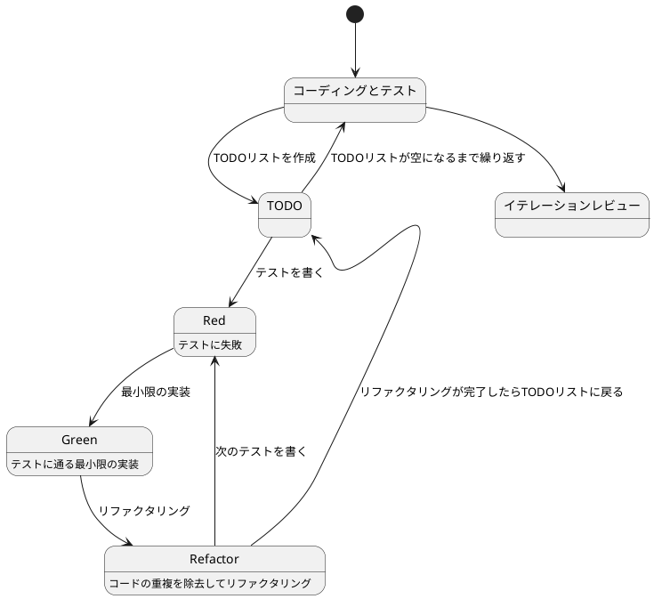

# ぷよぷよから始めるテスト駆動開発 (Elixir Phoenix LiveView版)

## はじめに

みなさん、こんにちは！今日は私と一緒にテスト駆動開発（TDD）を使って、Elixir Phoenix LiveViewでぷよぷよゲームを作っていきましょう。

> テスト駆動開発とは、プログラミングの手法の一種で、「テストファースト」の原則に従い、実装前にテストを書くことで、コードの品質を高め、設計を改善していく開発手法です。
>
> — Kent Beck 『テスト駆動開発』

この記事では、私たちが一緒にぷよぷよゲームを実装しながら、テスト駆動開発の基本的な流れと考え方、そしてPhoenix LiveViewの強力な機能を学んでいきます。

### なぜPhoenix LiveViewなのか？

Phoenix LiveViewは、リアルタイムでインタラクティブなWebアプリケーションを、JavaScriptをほとんど書かずに実装できるフレームワークです。以下の特徴があります：

- **リアルタイム性**: WebSocketを使った双方向通信
- **サーバーサイドレンダリング**: サーバー側でHTMLを生成し、差分のみをクライアントに送信
- **状態管理の簡潔さ**: サーバー側で状態を管理するため、クライアント側の複雑な状態管理が不要
- **高パフォーマンス**: Elixirの並行処理とErlang VMの力
- **テストのしやすさ**: サーバーサイドロジックとして統一的にテスト可能

ぷよぷよのようなゲームは、状態の更新が頻繁に発生します。LiveViewのリアルタイム性と状態管理の簡潔さは、このようなアプリケーションに最適です。

### テスト駆動開発のサイクル

テスト駆動開発では、以下の3つのステップを繰り返すサイクルで開発を進めます：

1. **Red（赤）**: まず失敗するテストを書きます
2. **Green（緑）**: テストが通るように、最小限のコードを実装します
3. **Refactor（リファクタリング）**: コードの品質を改善します

> テスト駆動開発のリズム：赤、緑、リファクタリング。まず失敗するテストを書き（赤）、次にテストが通るようにする（緑）、そして重複を除去する（リファクタリング）。
>
> — Kent Beck 『テスト駆動開発』



## イテレーション0: プロジェクトのセットアップ

テスト駆動開発を始める前に、まず開発環境を整えましょう。このイテレーションでは、Phoenix LiveViewプロジェクトをセットアップし、開発に必要なツールを準備します。

### 前提条件

以下のツールがインストールされていることを確認してください：

- **Elixir 1.14以上**: `elixir --version`で確認
- **Erlang/OTP 25以上**: `erl -version`で確認
- **PostgreSQL**: データベースとして使用（開発用）
- **Node.js**: アセット管理に使用

### ステップ1: Phoenixプロジェクトの作成

まず、Phoenix Frameworkのインストーラーをインストールします：

```bash
# Phoenixインストーラーのインストール
mix archive.install hex phx_new
```

次に、新しいPhoenixプロジェクトを作成します：

```bash
# プロジェクトの作成
mix phx.new puyo_puyo --live

# プロジェクトディレクトリに移動
cd puyo_puyo

# 依存関係のインストール
mix deps.get

# データベースのセットアップ
mix ecto.setup
```

**オプションの説明**:
- `--live`: LiveViewのサポートを含めたプロジェクトを生成します

### ステップ2: プロジェクト構成の確認

作成されたプロジェクトの構成を確認しましょう：

```
puyo_puyo/
├── assets/              # フロントエンドアセット (CSS, JS)
├── config/              # 設定ファイル
│   ├── config.exs       # 共通設定
│   ├── dev.exs          # 開発環境設定
│   ├── prod.exs         # 本番環境設定
│   └── test.exs         # テスト環境設定
├── lib/
│   ├── puyo_puyo/       # アプリケーションロジック
│   │   ├── application.ex
│   │   ├── repo.ex      # Ectoリポジトリ
│   │   └── ...
│   └── puyo_puyo_web/   # Webレイヤー
│       ├── components/  # Phoenixコンポーネント
│       ├── controllers/ # コントローラー
│       ├── live/        # LiveViewモジュール
│       ├── endpoint.ex  # HTTPエンドポイント
│       ├── router.ex    # ルーティング
│       └── ...
├── priv/
│   └── repo/
│       └── migrations/  # データベースマイグレーション
├── test/                # テストファイル
│   ├── puyo_puyo/
│   ├── puyo_puyo_web/
│   ├── support/
│   └── test_helper.exs
├── mix.exs              # プロジェクト定義と依存関係
└── mix.lock             # 依存関係のロックファイル
```

### ステップ3: 開発ツールの追加

プロジェクトに開発支援ツールを追加します。`mix.exs`を編集して、依存関係を追加します：

```elixir
defmodule PuyoPuyo.MixProject do
  use Mix.Project

  def project do
    [
      app: :puyo_puyo,
      version: "0.1.0",
      elixir: "~> 1.14",
      elixirc_paths: elixirc_paths(Mix.env()),
      start_permanent: Mix.env() == :prod,
      aliases: aliases(),
      deps: deps(),

      # テストカバレッジの設定
      test_coverage: [tool: ExCoveralls],
      preferred_cli_env: [
        coveralls: :test,
        "coveralls.detail": :test,
        "coveralls.html": :test
      ]
    ]
  end

  # 省略...

  defp deps do
    [
      {:phoenix, "~> 1.7.10"},
      {:phoenix_ecto, "~> 4.4"},
      {:ecto_sql, "~> 3.10"},
      {:postgrex, ">= 0.0.0"},
      {:phoenix_html, "~> 3.3"},
      {:phoenix_live_reload, "~> 1.2", only: :dev},
      {:phoenix_live_view, "~> 0.20.1"},
      {:floki, ">= 0.30.0", only: :test},
      {:phoenix_live_dashboard, "~> 0.8.2"},
      {:esbuild, "~> 0.8", runtime: Mix.env() == :dev},
      {:tailwind, "~> 0.2.0", runtime: Mix.env() == :dev},
      {:swoosh, "~> 1.3"},
      {:finch, "~> 0.13"},
      {:telemetry_metrics, "~> 0.6"},
      {:telemetry_poller, "~> 1.0"},
      {:gettext, "~> 0.20"},
      {:jason, "~> 1.2"},
      {:dns_cluster, "~> 0.1.1"},
      {:plug_cowboy, "~> 2.5"},

      # 開発・テストツール
      {:credo, "~> 1.7", only: [:dev, :test], runtime: false},
      {:excoveralls, "~> 0.18", only: :test},
      {:mix_test_watch, "~> 1.0", only: [:dev, :test], runtime: false},
      {:dialyxir, "~> 1.4", only: [:dev], runtime: false}
    ]
  end

  # 省略...
end
```

**追加したツール**:
- **Credo**: 静的コード解析ツール（コードの品質チェック）
- **ExCoveralls**: テストカバレッジツール（どれだけテストされているかを測定）
- **mix_test_watch**: ファイル監視ツール（ファイル変更時に自動テスト実行）
- **Dialyxir**: 型解析ツール（型エラーの検出）

依存関係をインストールします：

```bash
mix deps.get
```

### ステップ4: Credoの設定

Credoの設定ファイルを生成し、プロジェクトのコーディング規約を設定します：

```bash
mix credo gen.config
```

生成された `.credo.exs` ファイルで、プロジェクトに合わせたルールを調整できます。デフォルトの設定でも十分に機能します。

### ステップ5: コードフォーマッタの設定

Elixirには標準で `mix format` が含まれています。`.formatter.exs` ファイルで設定を確認します：

```elixir
# .formatter.exs
[
  import_deps: [:ecto, :ecto_sql, :phoenix],
  subdirectories: ["priv/*/migrations"],
  plugins: [Phoenix.LiveView.HTMLFormatter],
  inputs: ["*.{heex,ex,exs}", "{config,lib,test}/**/*.{heex,ex,exs}", "priv/*/seeds.exs"]
]
```

### ステップ6: 開発用タスクの作成

開発効率を向上させるため、カスタムMixタスクを作成します。

`lib/mix/tasks/check.ex` を作成：

```elixir
defmodule Mix.Tasks.Check do
  @moduledoc """
  開発時の基本チェックを実行するタスクです。

  以下のチェックを実行します：
  - mix format --check-formatted (フォーマットチェック)
  - mix credo --strict (静的解析)
  - mix test (テスト実行)
  """

  use Mix.Task

  @shortdoc "基本的なコード品質チェック"

  def run(_args) do
    Mix.shell().info("==> 基本チェックを開始します")

    # フォーマットチェック
    Mix.shell().info("\n==> フォーマットチェック")
    Mix.Task.run("format", ["--check-formatted"])
    Mix.shell().info("✓ フォーマットチェック 完了")

    # 静的解析
    Mix.shell().info("\n==> 静的解析")
    Mix.Task.run("credo", ["--strict"])
    Mix.shell().info("✓ 静的解析 完了")

    # テスト実行
    Mix.shell().info("\n==> テスト実行")
    Mix.Task.run("test", [])
    Mix.shell().info("✓ テスト実行 完了")

    Mix.shell().info("\n🎉 基本チェックが完了しました！")
  end
end
```

### ステップ7: 動作確認

サーバーを起動して、プロジェクトが正しくセットアップされているか確認します：

```bash
mix phx.server
```

ブラウザで `http://localhost:4000` にアクセスし、Phoenixのウェルカムページが表示されることを確認します。

### ステップ8: 開発ガイドの作成

チーム開発のため、開発手順をドキュメント化します。

`DEVELOPMENT.md` を作成：

```markdown
# 開発ガイド

## セットアップ

\`\`\`bash
# 依存関係のインストール
mix deps.get

# データベースのセットアップ
mix ecto.setup

# フロントエンドアセットのセットアップ
cd assets && npm install && cd ..
\`\`\`

## 使用可能なコマンド

### 基本コマンド
- `mix phx.server` - サーバー起動
- `mix test` - テスト実行
- `mix format` - コード整形
- `mix credo` - 静的解析
- `mix coveralls.html` - カバレッジレポート生成

### 統合コマンド
- `mix check` - 基本チェック (format, credo, test)

### 自動化
- `mix test.watch` - ファイル変更時の自動テスト実行

## 開発フロー

1. **コードを書く**
2. **フォーマット**: `mix format`
3. **チェック**: `mix check`
4. **コミット**

## コミットメッセージ規約

Angularコミットメッセージ規約に従います：

\`\`\`
<type>(<scope>): <subject>
\`\`\`

**主要なタイプ**:
- `feat`: 新機能の追加
- `fix`: バグの修正
- `docs`: ドキュメントのみの変更
- `test`: テストの追加や修正
- `refactor`: バグ修正や機能追加以外のコード変更
- `chore`: ビルドプロセスやツールの変更

## 品質基準

- **フォーマット**: Elixir標準フォーマッタに準拠
- **静的解析**: Credoのルールをクリア
- **テストカバレッジ**: 80%以上を目標
- **全テスト**: パスすること
```

### ステップ9: 初回コミット

Gitリポジトリを初期化し、初回コミットを作成します：

```bash
# Gitリポジトリの初期化（まだの場合）
git init

# .gitignoreの確認（Phoenixが自動生成）
# 必要に応じて追加設定

# すべてのファイルをステージング
git add -A

# 初回コミット
git commit -m "chore: Phoenix LiveViewプロジェクトの初期セットアップ

- Phoenix 1.7プロジェクトの作成
- LiveViewサポートの有効化
- 開発ツールの追加（Credo, ExCoveralls, mix_test_watch, Dialyxir）
- カスタムMixタスク（mix check）の作成
- 開発ガイド（DEVELOPMENT.md）の作成
- 開発環境の整備完了"
```

### ステップ10: 基本チェックの実行

セットアップが完了したので、基本チェックを実行します：

```bash
mix check
```

すべてのチェックが通ることを確認します。

### まとめ

イテレーション0で以下を達成しました：

#### 得られたもの

1. **Phoenix LiveViewプロジェクトのセットアップ**
   - LiveView対応のPhoenix 1.7プロジェクト
   - データベース設定とマイグレーション環境
   - アセット管理の設定

2. **開発ツールの整備**
   - Credo（静的コード解析）
   - ExCoveralls（テストカバレッジ）
   - mix_test_watch（自動テスト実行）
   - Dialyxir（型解析）

3. **開発フローの確立**
   - コードフォーマッタの設定
   - 統合チェックタスク（mix check）
   - コミットメッセージ規約
   - 開発ガイドの作成

4. **テスト駆動開発の準備**
   - ExUnitテスト環境
   - LiveViewテストのサポート
   - カバレッジ測定環境

#### プロジェクト構成

```
puyo_puyo/
├── lib/
│   ├── mix/
│   │   └── tasks/
│   │       └── check.ex          # 統合チェックタスク
│   ├── puyo_puyo/                # ビジネスロジック層
│   └── puyo_puyo_web/            # Web層（LiveView）
├── test/                         # テストファイル
├── config/                       # 設定ファイル
├── .credo.exs                    # Credo設定
├── .formatter.exs                # フォーマッタ設定
├── mix.exs                       # プロジェクト定義
├── DEVELOPMENT.md                # 開発ガイド
└── README.md                     # プロジェクト説明
```

#### 次のステップ

開発環境が整いました。次のイテレーションでは、以下を実装していきます：

- **イテレーション1**: ゲームの初期化とLiveViewの基本構造
- **イテレーション2**: ステージの実装（盤面の表示と管理）
- **イテレーション3**: プレイヤーの実装（ぷよの移動と回転）
- **イテレーション4**: ゲームループの実装（重力と落下）
- **イテレーション5**: 消去判定の実装（同色4つ以上の判定）
- **イテレーション6**: 連鎖反応の実装（連鎖とスコア計算）
- **イテレーション7**: ゲームオーバーの実装（終了判定と演出）

これらをテスト駆動開発のサイクルに従って、一つずつ実装していきましょう！

Elixir Phoenix LiveViewの世界で「動作するきれいなコード」を書き始める準備が整いました。開発を楽しんでください！

---

## イテレーション1: ゲームの初期化とLiveViewの基本構造

さあ、いよいよコードを書き始めましょう！テスト駆動開発では、小さなイテレーション（反復）で機能を少しずつ追加していきます。最初のイテレーションでは、最も基本的な機能である「ゲームの初期化」とLiveViewの基本構造を実装します。

> イテレーション開発とは、ソフトウェアを小さな機能単位で繰り返し開発していく手法です。各イテレーションで計画、設計、実装、テスト、評価のサイクルを回すことで、リスクを早期に発見し、フィードバックを得ながら開発を進めることができます。
>
> — Craig Larman 『アジャイル開発とスクラム』

### ユーザーストーリー

まずは、このイテレーションで実装するユーザーストーリーを確認しましょう：

> プレイヤーとして、新しいゲームを開始できる

このシンプルなストーリーから始めることで、ゲームの基本的な構造を作り、後続の機能追加の土台を築くことができます。では、テスト駆動開発のサイクルに従って、まずはテストから書いていきましょう！

### TODOリスト

さて、ユーザーストーリーを実装するために、まずはTODOリストを作成しましょう。TODOリストは、大きな機能を小さなタスクに分解するのに役立ちます。

> TODOリストは、テスト駆動開発の重要なプラクティスの一つです。実装前に必要なタスクを明確にすることで、開発の方向性を保ち、何も見落とさないようにします。
>
> — Kent Beck 『テスト駆動開発』

私たちの「新しいゲームを開始できる」というユーザーストーリーを実現するためには、どのようなタスクが必要でしょうか？考えてみましょう：

- LiveViewモジュールを作成する（ゲームの状態を管理するLiveViewモジュール）
- ゲームの初期状態を定義する（ゲームモード、スコア、ステージ情報など）
- テンプレートを作成する（プレイヤーが視覚的にゲームを認識できるようにする）
- ルーティングを設定する（`/game`パスでゲームにアクセスできるようにする）

これらのタスクを一つずつ実装していきましょう。テスト駆動開発では、各タスクに対してテスト→実装→リファクタリングのサイクルを回します。まずは「LiveViewモジュールの作成」から始めましょう！

### テスト: LiveViewモジュールの作成

さて、TODOリストの最初のタスク「LiveViewモジュールを作成する」に取り掛かりましょう。テスト駆動開発では、まずテストを書くことから始めます。

> テストファースト
>
> いつテストを書くべきだろうか——それはテスト対象のコードを書く前だ。
>
> — Kent Beck 『テスト駆動開発』

では、LiveViewモジュールの初期化をテストするコードを書いてみましょう。LiveViewテストでは、`mount/3`コールバックが正しく動作し、必要な状態が設定されることを確認します。

```elixir
# test/puyo_puyo_web/live/game_live_test.exs
defmodule PuyoPuyoWeb.GameLiveTest do
  use PuyoPuyoWeb.ConnCase

  import Phoenix.LiveViewTest

  describe "GameLive" do
    test "mounts successfully", %{conn: conn} do
      {:ok, _view, html} = live(conn, "/game")
      assert html =~ "ぷよぷよゲーム"
    end

    test "initializes game state on mount", %{conn: conn} do
      {:ok, view, _html} = live(conn, "/game")

      # LiveViewの状態を取得
      assert has_element?(view, "#game-container")

      # 初期状態の確認
      # mode: :start (ゲーム開始状態)
      # score: 0 (スコアは0)
      # chain: 0 (連鎖数は0)
    end

    test "displays game board", %{conn: conn} do
      {:ok, view, _html} = live(conn, "/game")

      # ゲームボードが表示されていることを確認
      assert has_element?(view, "#game-board")
    end

    test "displays score information", %{conn: conn} do
      {:ok, view, _html} = live(conn, "/game")

      # スコア情報が表示されていることを確認
      assert has_element?(view, "#score")
      assert has_element?(view, "#chain")
    end
  end
end
```

このテストでは、`GameLive`モジュールが正しくマウントされ、必要な初期状態が設定されることを確認しています。

### 実装: LiveViewモジュールの作成

テストを書いたら、次に実行してみましょう。どうなるでしょうか？

```bash
mix test test/puyo_puyo_web/live/game_live_test.exs
```

```
Error: cannot find module PuyoPuyoWeb.GameLive
```

おっと！まだ`GameLive`モジュールを実装していないので、当然エラーになりますね。これがテスト駆動開発の「Red（赤）」の状態です。テストが失敗することを確認できました。

> 失敗するテスト
>
> テストが失敗することを確認してから実装に取り掛かろう。そうすれば、テストが正しく機能していることがわかる。
>
> — Kent Beck 『テスト駆動開発』

では、テストが通るように最小限のコードを実装していきましょう。「最小限」というのがポイントです。この段階では、テストが通ることだけを目指して、必要最低限のコードを書きます。

```elixir
# lib/puyo_puyo_web/live/game_live.ex
defmodule PuyoPuyoWeb.GameLive do
  use PuyoPuyoWeb, :live_view

  @moduledoc """
  ぷよぷよゲームのLiveViewモジュール
  """

  # ゲームモードの定義
  @type game_mode :: :start | :check_fall | :fall | :check_erase | :erasing | :new_puyo | :playing | :game_over

  # ゲーム設定
  @stage_rows 12
  @stage_cols 6
  @puyo_size 32

  @impl true
  def mount(_params, _session, socket) do
    # ゲームの初期状態を設定
    socket =
      socket
      |> assign(:mode, :start)
      |> assign(:score, 0)
      |> assign(:chain, 0)
      |> assign(:stage_rows, @stage_rows)
      |> assign(:stage_cols, @stage_cols)
      |> assign(:puyo_size, @puyo_size)
      |> assign(:board, init_board())

    {:ok, socket}
  end

  @impl true
  def render(assigns) do
    ~H"""
    <div id="game-container" class="flex gap-8 p-8">
      <div id="game-board" class="relative bg-gray-100 border-2 border-gray-800 rounded-lg">
        <div class="grid" style={"grid-template-columns: repeat(#{@stage_cols}, #{@puyo_size}px);"}>
          <%= for row <- 0..(@stage_rows - 1) do %>
            <%= for col <- 0..(@stage_cols - 1) do %>
              <div
                class="border border-gray-300"
                style={"width: #{@puyo_size}px; height: #{@puyo_size}px;"}
              >
                <%= render_puyo(@board[row][col]) %>
              </div>
            <% end %>
          <% end %>
        </div>
      </div>

      <div id="info-panel" class="bg-white p-6 rounded-lg shadow-lg">
        <h2 class="text-2xl font-bold mb-4">ぷよぷよゲーム</h2>

        <div class="mb-4">
          <h3 class="text-lg font-semibold">スコア</h3>
          <p id="score" class="text-3xl font-bold text-blue-600"><%= @score %></p>
        </div>

        <div class="mb-4">
          <h3 class="text-lg font-semibold">連鎖数</h3>
          <p id="chain" class="text-3xl font-bold text-red-600"><%= @chain %></p>
        </div>

        <div class="mt-6 text-sm text-gray-600">
          <h3 class="font-semibold mb-2">操作方法</h3>
          <ul class="space-y-1">
            <li>← →: 移動</li>
            <li>↑: 回転</li>
            <li>↓: 高速落下</li>
          </ul>
        </div>
      </div>
    </div>
    """
  end

  # プライベート関数

  # 空のボードを初期化
  defp init_board do
    for row <- 0..(@stage_rows - 1), into: %{} do
      {row, for(col <- 0..(@stage_cols - 1), into: %{}, do: {col, 0})}
    end
  end

  # ぷよの描画（0は空、1-4はぷよの種類）
  defp render_puyo(0), do: nil
  defp render_puyo(type) when type in 1..4 do
    color = puyo_color(type)
    assigns = %{color: color}

    ~H"""
    <div class="w-full h-full rounded-full" style={"background-color: #{@color}; border: 2px solid rgba(0,0,0,0.2);"}></div>
    """
  end

  # ぷよの色を返す
  defp puyo_color(1), do: "#FF0000"  # 赤
  defp puyo_color(2), do: "#00FF00"  # 緑
  defp puyo_color(3), do: "#0000FF"  # 青
  defp puyo_color(4), do: "#FFFF00"  # 黄
end
```

### ルーティングの設定

LiveViewモジュールを作成したら、ルーティングを設定して、`/game`パスでアクセスできるようにします。

```elixir
# lib/puyo_puyo_web/router.ex
defmodule PuyoPuyoWeb.Router do
  use PuyoPuyoWeb, :router

  # 既存のパイプライン...

  scope "/", PuyoPuyoWeb do
    pipe_through :browser

    get "/", PageController, :home

    # ぷよぷよゲームのルート
    live "/game", GameLive
  end

  # 既存のスコープ...
end
```

### 解説: LiveViewの初期化

テストが通りましたね！おめでとうございます。これがテスト駆動開発の「Green（緑）」の状態です。

> テストが通ったら、次はリファクタリングだ。でも、その前に少し立ち止まって、今書いたコードについて考えてみよう。
>
> — Martin Fowler 『リファクタリング』

実装したLiveViewモジュールについて、少し解説しておきましょう。

#### Phoenix LiveViewの仕組み

Phoenix LiveViewは、サーバーサイドでHTMLをレンダリングし、WebSocketを通じてクライアントに差分だけを送信する仕組みです。主な特徴は：

1. **サーバー側で状態管理**: `socket.assigns`に状態を保存
2. **自動的な差分更新**: 状態が変わると、変更された部分だけがクライアントに送信される
3. **リアルタイム通信**: WebSocketによる双方向通信

#### mount/3コールバック

```elixir
def mount(_params, _session, socket) do
  socket =
    socket
    |> assign(:mode, :start)
    |> assign(:score, 0)
    |> assign(:chain, 0)
    # ...
  {:ok, socket}
end
```

`mount/3`は、LiveViewが初期化されるときに呼ばれるコールバックです。ここで：

- **ゲームモード**: `:start`（ゲーム開始状態）
- **スコア**: `0`
- **連鎖数**: `0`
- **ボード**: 空のボード（12行 × 6列）

を初期化しています。

#### render/1関数

```elixir
def render(assigns) do
  ~H"""
  <div id="game-container">
    ...
  </div>
  """
end
```

`render/1`関数は、LiveViewのUIを定義します。`~H`シジルは、HEExテンプレート（HTML + Elixir）を表します。

このテンプレートでは：

- **ゲームボード**: グリッドレイアウトで6×12のセルを表示
- **情報パネル**: スコア、連鎖数、操作方法を表示

#### 状態の管理

LiveViewでは、`assign/3`関数を使って状態を管理します：

```elixir
socket = assign(socket, :score, 100)
```

状態が変更されると、LiveViewは自動的に`render/1`を再実行し、変更された部分だけをクライアントに送信します。これにより、効率的なリアルタイム更新が実現されます。

### テスト実行と確認

実装が完了したので、テストを実行してみましょう：

```bash
mix test test/puyo_puyo_web/live/game_live_test.exs
```

すべてのテストが通ることを確認します。また、サーバーを起動して、ブラウザで確認してみましょう：

```bash
mix phx.server
```

ブラウザで `http://localhost:4000/game` にアクセスすると、ゲームボードとスコア情報が表示されるはずです。

### コミット

機能が完成したので、コミットしましょう：

```bash
git add -A
git commit -m "feat: ゲームの初期化とLiveViewの基本構造を実装

- GameLiveモジュールの作成
- mount/3コールバックでの初期状態設定
- HEExテンプレートの作成（ゲームボード、情報パネル）
- ルーティングの設定（/game）
- LiveViewテストの作成
- 空のボード（12行 × 6列）の表示
- スコアと連鎖数の表示

イテレーション1完了"
```

### まとめ

イテレーション1で以下を達成しました：

#### 得られたもの

1. **LiveViewの基本構造**
   - GameLiveモジュールの作成
   - mount/3コールバックでの初期化
   - HEExテンプレートによる画面表示

2. **ゲームの初期状態**
   - ゲームモード（:start）
   - スコア（0）
   - 連鎖数（0）
   - 空のボード（12行 × 6列）

3. **画面表示**
   - グリッドレイアウトのゲームボード
   - スコアと連鎖数の情報パネル
   - 操作方法の表示

4. **ルーティング**
   - `/game`パスでゲームにアクセス可能

5. **テストの作成**
   - LiveViewテストによる動作確認
   - マウント、初期化、表示のテスト

#### Phoenix LiveViewの利点

今回の実装で、Phoenix LiveViewの以下の利点を体感できました：

1. **シンプルな状態管理**: サーバー側で状態を管理するため、クライアント側の複雑な状態管理が不要
2. **自動的な更新**: 状態が変わると、自動的に画面が更新される
3. **統一的なテスト**: サーバーサイドロジックとして統一的にテスト可能
4. **少ないJavaScript**: JavaScriptをほとんど書かずにインタラクティブなUIを実装

#### 次のステップ

基本的な構造ができました。次のイテレーションでは、以下を実装していきます：

- **イテレーション2**: ステージの実装（ぷよの配置と管理）
- **イテレーション3**: プレイヤーの実装（ぷよの移動と回転）
- **イテレーション4**: ゲームループの実装（重力と落下）

これらをテスト駆動開発のサイクルに従って、一つずつ実装していきましょう！

---

## イテレーション2: ステージの実装

イテレーション1で基本的な構造ができました。次は、ゲームの中核となる「ステージ」の実装です。ステージは、ぷよの配置、消去判定、落下処理など、ぷよぷよゲームの重要なロジックを担当します。

> ドメインモデル
>
> ドメイン駆動設計では、ビジネスロジックをドメインモデルとして分離します。ゲームにおいては、ステージ、プレイヤー、スコアなどがドメインモデルにあたります。これらをWebレイヤー（LiveView）から分離することで、テストしやすく、保守しやすいコードになります。
>
> — Eric Evans 『ドメイン駆動設計』

### ユーザーストーリー

このイテレーションで実装するユーザーストーリーを確認しましょう：

> プレイヤーとして、ステージ上のぷよを管理し、同じ色のぷよが4つ以上つながったら消去できる

このストーリーには、いくつかの機能が含まれています：

1. ぷよの配置と取得
2. 同じ色のぷよの接続判定（4つ以上）
3. ぷよの消去
4. 消去後の落下

それでは、これらの機能を一つずつテスト駆動開発で実装していきましょう！

### TODOリスト

> TODOリストは、大きな問題を小さな問題に分割するための強力なツールです。複雑な問題に直面したとき、それを管理可能な小さなタスクに分解することで、一歩一歩確実に前進できます。
>
> — Kent Beck 『テスト駆動開発』

「ステージの実装」というユーザーストーリーを実現するために、以下のタスクが必要です：

- Stageモジュールを作成する（ビジネスロジック層）
- ぷよの配置・取得機能を実装する
- 消去判定を実装する（DFSアルゴリズム）
- ぷよの消去処理を実装する
- 落下処理を実装する
- 重力を適用する処理を実装する
- GameLiveと統合する

これらのタスクを一つずつ実装していきます。まずは「ぷよの配置・取得」から始めましょう！

### テスト: ぷよの配置と取得

まず、ステージ上にぷよを配置し、取得する機能をテストします。

```elixir
# test/puyo_puyo/stage_test.exs
defmodule PuyoPuyo.StageTest do
  use ExUnit.Case, async: true

  alias PuyoPuyo.Stage

  describe "Stage.new/1" do
    test "creates a new stage with default dimensions" do
      stage = Stage.new([])

      assert stage.rows == 12
      assert stage.cols == 6
    end

    test "creates a new stage with custom dimensions" do
      stage = Stage.new(rows: 10, cols: 8)

      assert stage.rows == 10
      assert stage.cols == 8
    end

    test "initializes board with all zeros" do
      stage = Stage.new([])

      # すべてのセルが0（空）であることを確認
      for row <- 0..(stage.rows - 1) do
        for col <- 0..(stage.cols - 1) do
          assert Stage.get_puyo(stage, col, row) == 0
        end
      end
    end
  end

  describe "Stage.set_puyo/4 and Stage.get_puyo/3" do
    setup do
      {:ok, stage: Stage.new([])}
    end

    test "sets and gets a puyo at specified position", %{stage: stage} do
      # ぷよを設定（x=1, y=10, type=1 [赤]）
      stage = Stage.set_puyo(stage, 1, 10, 1)

      # ぷよを取得して確認
      assert Stage.get_puyo(stage, 1, 10) == 1
    end

    test "returns 0 for empty cell", %{stage: stage} do
      # 空のセルを取得
      assert Stage.get_puyo(stage, 0, 0) == 0
    end

    test "returns 0 for out of bounds position", %{stage: stage} do
      # 範囲外の座標を指定
      assert Stage.get_puyo(stage, -1, 0) == 0
      assert Stage.get_puyo(stage, 0, -1) == 0
      assert Stage.get_puyo(stage, 100, 0) == 0
      assert Stage.get_puyo(stage, 0, 100) == 0
    end
  end
end
```

### 実装: Stage モジュール

テストを実行すると失敗します（Red）。では、テストが通るように最小限のコードを実装しましょう（Green）。

```elixir
# lib/puyo_puyo/stage.ex
defmodule PuyoPuyo.Stage do
  @moduledoc """
  ぷよぷよゲームのステージを管理するモジュール

  ステージは12行×6列のボードで構成され、以下の機能を提供します：
  - ぷよの配置と取得
  - 消去判定（4つ以上の同色ぷよの接続判定）
  - ぷよの消去
  - 落下処理（重力）
  """

  @type t :: %__MODULE__{
          rows: non_neg_integer(),
          cols: non_neg_integer(),
          board: %{non_neg_integer() => %{non_neg_integer() => non_neg_integer()}}
        }

  defstruct [:rows, :cols, :board]

  @default_rows 12
  @default_cols 6

  @doc """
  新しいステージを作成します

  ## Options
    * `:rows` - ステージの行数（デフォルト: 12）
    * `:cols` - ステージの列数（デフォルト: 6）

  ## Examples

      iex> stage = PuyoPuyo.Stage.new([])
      iex> stage.rows
      12
      iex> stage.cols
      6

  """
  @spec new(keyword()) :: t()
  def new(opts) do
    rows = Keyword.get(opts, :rows, @default_rows)
    cols = Keyword.get(opts, :cols, @default_cols)

    # ボードを初期化（すべて0で埋める）
    board =
      for row <- 0..(rows - 1), into: %{} do
        {row, for(col <- 0..(cols - 1), into: %{}, do: {col, 0})}
      end

    %__MODULE__{rows: rows, cols: cols, board: board}
  end

  @doc """
  指定した位置のぷよを取得します

  範囲外の座標を指定した場合は0（空）を返します

  ## Examples

      iex> stage = PuyoPuyo.Stage.new([])
      iex> stage = PuyoPuyo.Stage.set_puyo(stage, 1, 10, 1)
      iex> PuyoPuyo.Stage.get_puyo(stage, 1, 10)
      1

  """
  @spec get_puyo(t(), non_neg_integer(), non_neg_integer()) :: non_neg_integer()
  def get_puyo(%__MODULE__{board: board, rows: rows, cols: cols}, x, y) do
    # 範囲外チェック
    if x < 0 or x >= cols or y < 0 or y >= rows do
      0
    else
      board[y][x]
    end
  end

  @doc """
  指定した位置にぷよを設定します

  新しいステージを返します（不変データ構造）

  ## Examples

      iex> stage = PuyoPuyo.Stage.new([])
      iex> stage = PuyoPuyo.Stage.set_puyo(stage, 1, 10, 1)
      iex> PuyoPuyo.Stage.get_puyo(stage, 1, 10)
      1

  """
  @spec set_puyo(t(), non_neg_integer(), non_neg_integer(), non_neg_integer()) :: t()
  def set_puyo(%__MODULE__{board: board} = stage, x, y, puyo_type) do
    # 指定した位置のぷよを更新
    updated_row = Map.put(board[y], x, puyo_type)
    updated_board = Map.put(board, y, updated_row)

    %{stage | board: updated_board}
  end
end
```

### 解説: Elixirの不変データ構造

実装したStageモジュールについて、いくつか重要なポイントを解説します。

#### 構造体の定義

```elixir
defstruct [:rows, :cols, :board]
```

Elixirの構造体は、モジュール内で`defstruct`を使って定義します。構造体は、特定の構造を持つマップです。

#### 不変データ構造

```elixir
def set_puyo(%__MODULE__{board: board} = stage, x, y, puyo_type) do
  updated_row = Map.put(board[y], x, puyo_type)
  updated_board = Map.put(board, y, updated_row)
  %{stage | board: updated_board}
end
```

Elixirでは、すべてのデータが不変（immutable）です。`set_puyo/4`は元のステージを変更せず、新しいステージを返します。これにより：

1. **予測可能性**: 関数が元のデータを変更しないため、バグが減る
2. **並行処理の安全性**: データ競合が発生しない
3. **テストのしやすさ**: 副作用がないため、テストが容易

#### パターンマッチング

```elixir
def get_puyo(%__MODULE__{board: board, rows: rows, cols: cols}, x, y)
```

関数の引数でパターンマッチングを使うことで、構造体のフィールドに直接アクセスできます。

### テスト実行

実装が完了したので、テストを実行してみましょう：

```bash
mix test test/puyo_puyo/stage_test.exs
```

すべてのテストが通ることを確認します（Green）。

### テスト: 消去判定

次に、同じ色のぷよが4つ以上つながっているかを判定する機能をテストします。

```elixir
# test/puyo_puyo/stage_test.exs（続き）
describe "Stage.check_erase/1" do
  setup do
    {:ok, stage: Stage.new([])}
  end

  test "detects 4 connected puyos as erasable", %{stage: stage} do
    # 2×2の正方形に赤ぷよを配置
    stage =
      stage
      |> Stage.set_puyo(1, 10, 1)
      |> Stage.set_puyo(2, 10, 1)
      |> Stage.set_puyo(1, 11, 1)
      |> Stage.set_puyo(2, 11, 1)

    # 消去判定
    {erase_count, _positions} = Stage.check_erase(stage)

    # 4つのぷよが消去対象になっていることを確認
    assert erase_count == 4
  end

  test "does not erase different colored puyos", %{stage: stage} do
    # 市松模様に赤と緑のぷよを配置
    stage =
      stage
      |> Stage.set_puyo(1, 10, 1)  # 赤
      |> Stage.set_puyo(2, 10, 2)  # 緑
      |> Stage.set_puyo(1, 11, 2)  # 緑
      |> Stage.set_puyo(2, 11, 1)  # 赤

    # 消去判定
    {erase_count, positions} = Stage.check_erase(stage)

    # 消去対象がないことを確認
    assert erase_count == 0
    assert positions == []
  end

  test "does not erase 3 or fewer connected puyos", %{stage: stage} do
    # L字型に赤ぷよを3つ配置
    stage =
      stage
      |> Stage.set_puyo(1, 10, 1)
      |> Stage.set_puyo(2, 10, 1)
      |> Stage.set_puyo(1, 11, 1)

    # 消去判定
    {erase_count, positions} = Stage.check_erase(stage)

    # 消去対象がないことを確認
    assert erase_count == 0
    assert positions == []
  end

  test "detects vertical line of 4 puyos", %{stage: stage} do
    # 縦に4つの赤ぷよを配置
    stage =
      stage
      |> Stage.set_puyo(1, 8, 1)
      |> Stage.set_puyo(1, 9, 1)
      |> Stage.set_puyo(1, 10, 1)
      |> Stage.set_puyo(1, 11, 1)

    # 消去判定
    {erase_count, _positions} = Stage.check_erase(stage)

    # 4つのぷよが消去対象になっていることを確認
    assert erase_count == 4
  end

  test "detects horizontal line of 4 puyos", %{stage: stage} do
    # 横に4つの赤ぷよを配置
    stage =
      stage
      |> Stage.set_puyo(1, 10, 1)
      |> Stage.set_puyo(2, 10, 1)
      |> Stage.set_puyo(3, 10, 1)
      |> Stage.set_puyo(4, 10, 1)

    # 消去判定
    {erase_count, _positions} = Stage.check_erase(stage)

    # 4つのぷよが消去対象になっていることを確認
    assert erase_count == 4
  end
end
```

### 実装: 消去判定（深さ優先探索）

消去判定には、深さ優先探索（DFS: Depth-First Search）アルゴリズムを使用します。これは、接続しているぷよを再帰的に探索する効率的な方法です。

```elixir
# lib/puyo_puyo/stage.ex（続き）
@doc """
消去判定を行います

4つ以上接続している同色のぷよを検出します。
深さ優先探索（DFS）アルゴリズムを使用して、接続しているぷよを探索します。

## Returns

  {消去するぷよの数, 消去するぷよの位置リスト}

## Examples

    iex> stage = PuyoPuyo.Stage.new([])
    iex> stage = stage
    ...> |> PuyoPuyo.Stage.set_puyo(1, 10, 1)
    ...> |> PuyoPuyo.Stage.set_puyo(2, 10, 1)
    ...> |> PuyoPuyo.Stage.set_puyo(1, 11, 1)
    ...> |> PuyoPuyo.Stage.set_puyo(2, 11, 1)
    iex> {count, _positions} = PuyoPuyo.Stage.check_erase(stage)
    iex> count
    4

"""
@spec check_erase(t()) :: {non_neg_integer(), [{non_neg_integer(), non_neg_integer()}]}
def check_erase(%__MODULE__{rows: rows, cols: cols} = stage) do
  # 訪問済みセルを記録するMapSet
  visited = MapSet.new()
  # 消去対象のぷよの位置を記録するリスト
  erase_positions = []

  # 全セルをチェック
  {_visited, erase_positions} =
    Enum.reduce(0..(rows - 1), {visited, erase_positions}, fn row, {visited_acc, erase_acc} ->
      Enum.reduce(0..(cols - 1), {visited_acc, erase_acc}, fn col, {visited_inner, erase_inner} ->
        puyo_type = get_puyo(stage, col, row)
        position = {col, row}

        # ぷよがあり、まだ訪問していない場合
        if puyo_type > 0 and not MapSet.member?(visited_inner, position) do
          # 接続しているぷよを探索
          {visited_after_search, connected} = search_connected(stage, col, row, puyo_type, visited_inner)

          # 4つ以上接続している場合は消去対象に追加
          if length(connected) >= 4 do
            {visited_after_search, erase_inner ++ connected}
          else
            {visited_after_search, erase_inner}
          end
        else
          {visited_inner, erase_inner}
        end
      end)
    end)

  {length(erase_positions), erase_positions}
end

# 深さ優先探索で接続しているぷよを探索
@spec search_connected(t(), non_neg_integer(), non_neg_integer(), non_neg_integer(), MapSet.t()) ::
        {MapSet.t(), [{non_neg_integer(), non_neg_integer()}]}
defp search_connected(stage, x, y, puyo_type, visited) do
  position = {x, y}

  # 訪問済みにマーク
  visited = MapSet.put(visited, position)
  connected = [position]

  # 4方向を探索
  directions = [{1, 0}, {-1, 0}, {0, 1}, {0, -1}]

  Enum.reduce(directions, {visited, connected}, fn {dx, dy}, {visited_acc, connected_acc} ->
    next_x = x + dx
    next_y = y + dy
    next_position = {next_x, next_y}

    # 範囲内、同じ色、未訪問の場合は再帰的に探索
    if get_puyo(stage, next_x, next_y) == puyo_type and not MapSet.member?(visited_acc, next_position) do
      {visited_after_recursion, connected_from_recursion} = search_connected(stage, next_x, next_y, puyo_type, visited_acc)
      {visited_after_recursion, connected_acc ++ connected_from_recursion}
    else
      {visited_acc, connected_acc}
    end
  end)
end
```

### 解説: 深さ優先探索（DFS）

深さ優先探索は、グラフや木構造の探索アルゴリズムの一つです。ぷよぷよの消去判定では、同じ色のぷよが接続しているかを調べるために使用します。

#### アルゴリズムの流れ

1. **全セルをチェック**: ボード上のすべてのセルを順番に調べます
2. **未訪問のぷよを発見**: ぷよがあり、まだ訪問していないセルを見つけます
3. **接続探索開始**: そのぷよと同じ色で接続しているぷよを再帰的に探索します
4. **4方向をチェック**: 各ぷよから上下左右の4方向を調べます
5. **同色かつ未訪問**: 同じ色で未訪問のぷよがあれば、再帰的に探索を続けます
6. **接続数判定**: 接続しているぷよが4つ以上なら、消去対象として記録します

#### 訪問済み管理

```elixir
visited = MapSet.new()
visited = MapSet.put(visited, position)
```

`MapSet`を使って訪問済みのセルを管理します。これにより：

- **重複探索の防止**: 同じセルを何度も訪問しない
- **効率的な検索**: O(1)の時間で訪問済みかチェックできる

### テスト実行

実装が完了したので、テストを実行してみましょう：

```bash
mix test test/puyo_puyo/stage_test.exs
```

すべてのテストが通ることを確認します（Green）。

### テスト: ぷよの消去と落下

次に、ぷよの消去と落下処理をテストします。

```elixir
# test/puyo_puyo/stage_test.exs（続き）
describe "Stage.erase_puyos/2" do
  setup do
    {:ok, stage: Stage.new([])}
  end

  test "erases puyos at specified positions", %{stage: stage} do
    # ステージにぷよを配置
    stage =
      stage
      |> Stage.set_puyo(1, 10, 1)
      |> Stage.set_puyo(2, 10, 1)
      |> Stage.set_puyo(1, 11, 1)
      |> Stage.set_puyo(2, 11, 1)

    # 消去判定
    {_count, positions} = Stage.check_erase(stage)

    # 消去実行
    stage = Stage.erase_puyos(stage, positions)

    # ぷよが消去されていることを確認
    assert Stage.get_puyo(stage, 1, 10) == 0
    assert Stage.get_puyo(stage, 2, 10) == 0
    assert Stage.get_puyo(stage, 1, 11) == 0
    assert Stage.get_puyo(stage, 2, 11) == 0
  end
end

describe "Stage.fall/1" do
  setup do
    {:ok, stage: Stage.new([])}
  end

  test "makes puyos fall after erasure", %{stage: stage} do
    # ステージにぷよを配置
    # 下に赤ぷよ4つ（2×2）、その上の列(x=2)に緑ぷよ2つ
    stage =
      stage
      |> Stage.set_puyo(1, 10, 1)  # 赤
      |> Stage.set_puyo(2, 10, 1)  # 赤
      |> Stage.set_puyo(1, 11, 1)  # 赤
      |> Stage.set_puyo(2, 11, 1)  # 赤
      |> Stage.set_puyo(2, 8, 2)   # 緑
      |> Stage.set_puyo(2, 9, 2)   # 緑

    # 消去判定と実行
    {_count, positions} = Stage.check_erase(stage)
    stage = Stage.erase_puyos(stage, positions)

    # 落下処理
    stage = Stage.fall(stage)

    # 上にあった緑ぷよが落下していることを確認
    assert Stage.get_puyo(stage, 2, 10) == 2
    assert Stage.get_puyo(stage, 2, 11) == 2
  end
end
```

### 実装: ぷよの消去と落下

```elixir
# lib/puyo_puyo/stage.ex（続き）
@doc """
指定した位置のぷよを消去します

## Examples

    iex> stage = PuyoPuyo.Stage.new([])
    iex> stage = stage |> PuyoPuyo.Stage.set_puyo(1, 10, 1)
    iex> stage = PuyoPuyo.Stage.erase_puyos(stage, [{1, 10}])
    iex> PuyoPuyo.Stage.get_puyo(stage, 1, 10)
    0

"""
@spec erase_puyos(t(), [{non_neg_integer(), non_neg_integer()}]) :: t()
def erase_puyos(stage, positions) do
  Enum.reduce(positions, stage, fn {x, y}, stage_acc ->
    set_puyo(stage_acc, x, y, 0)
  end)
end

@doc """
ぷよを落下させます

各列で、下から上に向かってぷよをチェックし、
下に空きがある場合は落下させます。

## Examples

    iex> stage = PuyoPuyo.Stage.new([])
    iex> stage = stage
    ...> |> PuyoPuyo.Stage.set_puyo(1, 5, 1)
    ...> |> PuyoPuyo.Stage.set_puyo(1, 10, 0)
    iex> stage = PuyoPuyo.Stage.fall(stage)
    iex> PuyoPuyo.Stage.get_puyo(stage, 1, 11)
    1

"""
@spec fall(t()) :: t()
def fall(%__MODULE__{rows: rows, cols: cols} = stage) do
  # 各列を処理
  Enum.reduce(0..(cols - 1), stage, fn col, stage_acc ->
    # 下から上に向かって処理
    Enum.reduce((rows - 2)..0, stage_acc, fn row, stage_inner ->
      puyo_type = get_puyo(stage_inner, col, row)

      if puyo_type > 0 do
        # 現在のぷよの下が空いている場合、落下させる
        fall_puyo_in_column(stage_inner, col, row, puyo_type)
      else
        stage_inner
      end
    end)
  end)
end

# 指定した列のぷよを可能な限り落下させる
@spec fall_puyo_in_column(t(), non_neg_integer(), non_neg_integer(), non_neg_integer()) :: t()
defp fall_puyo_in_column(%__MODULE__{rows: rows} = stage, col, start_row, puyo_type) do
  # 落下先を探す
  fall_to_row =
    Enum.reduce_while((start_row + 1)..(rows - 1), start_row, fn row, _acc ->
      if get_puyo(stage, col, row) == 0 do
        {:cont, row}
      else
        {:halt, row - 1}
      end
    end)

  # 落下先が異なる場合は移動
  if fall_to_row != start_row do
    stage
    |> set_puyo(col, fall_to_row, puyo_type)
    |> set_puyo(col, start_row, 0)
  else
    stage
  end
end
```

### 解説: パイプライン演算子

Elixirでは、パイプライン演算子（`|>`）を使って、関数呼び出しを連鎖させることができます。

```elixir
stage
|> set_puyo(col, fall_to_row, puyo_type)
|> set_puyo(col, start_row, 0)
```

これは以下と同じ意味です：

```elixir
stage2 = set_puyo(stage, col, fall_to_row, puyo_type)
stage3 = set_puyo(stage2, col, start_row, 0)
```

パイプライン演算子を使うことで：

1. **可読性の向上**: データの変換の流れが明確になる
2. **変数の削減**: 中間変数を定義する必要がない
3. **関数型スタイル**: データ変換のパイプラインとして表現できる

### テスト実行

実装が完了したので、テストを実行してみましょう：

```bash
mix test test/puyo_puyo/stage_test.exs
```

すべてのテストが通ることを確認します（Green）。

### テスト: 重力の適用

最後に、1フレームごとに1マスずつぷよを落下させる「重力」機能をテストします。

```elixir
# test/puyo_puyo/stage_test.exs（続き）
describe "Stage.apply_gravity/1" do
  setup do
    {:ok, stage: Stage.new([])}
  end

  test "makes floating puyo fall one row", %{stage: stage} do
    # 浮いている青ぷよを配置（下に空きがある）
    stage = Stage.set_puyo(stage, 4, 2, 2)

    # 重力を適用
    {has_fallen, stage} = Stage.apply_gravity(stage)

    # 青ぷよが1マス落ちていることを確認
    assert has_fallen == true
    assert Stage.get_puyo(stage, 4, 2) == 0
    assert Stage.get_puyo(stage, 4, 3) == 2
  end

  test "returns false when no puyo falls", %{stage: stage} do
    # すべてのぷよが支えられている状態
    stage =
      stage
      |> Stage.set_puyo(2, 11, 1)
      |> Stage.set_puyo(3, 11, 2)

    # 重力を適用
    {has_fallen, _stage} = Stage.apply_gravity(stage)

    # 何も落ちていないことを確認
    assert has_fallen == false
  end

  test "makes multiple floating puyos fall", %{stage: stage} do
    # 複数の浮いているぷよを配置
    stage =
      stage
      |> Stage.set_puyo(1, 1, 1)
      |> Stage.set_puyo(2, 2, 2)
      |> Stage.set_puyo(3, 3, 3)

    # 重力を適用
    {has_fallen, stage} = Stage.apply_gravity(stage)

    # 全てのぷよが1マス落ちていることを確認
    assert has_fallen == true
    assert Stage.get_puyo(stage, 1, 1) == 0
    assert Stage.get_puyo(stage, 1, 2) == 1
    assert Stage.get_puyo(stage, 2, 2) == 0
    assert Stage.get_puyo(stage, 2, 3) == 2
    assert Stage.get_puyo(stage, 3, 3) == 0
    assert Stage.get_puyo(stage, 3, 4) == 3
  end

  test "stops puyo at bottom", %{stage: stage} do
    # 最下段の1つ上にぷよを配置
    stage = Stage.set_puyo(stage, 2, 10, 1)

    # 重力を適用（1マス落ちる）
    {has_fallen, stage} = Stage.apply_gravity(stage)
    assert has_fallen == true
    assert Stage.get_puyo(stage, 2, 11) == 1

    # もう一度重力を適用（もう落ちない）
    {has_fallen, _stage} = Stage.apply_gravity(stage)
    assert has_fallen == false
  end

  test "stops puyo on other puyo", %{stage: stage} do
    # 土台のぷよと、その上の浮いているぷよを配置
    stage =
      stage
      |> Stage.set_puyo(2, 11, 1)  # 土台
      |> Stage.set_puyo(2, 9, 2)   # 浮いているぷよ

    # 重力を適用（1マス落ちる）
    {has_fallen, stage} = Stage.apply_gravity(stage)
    assert has_fallen == true
    assert Stage.get_puyo(stage, 2, 10) == 2

    # もう一度重力を適用（土台のぷよの上で停止）
    {has_fallen, _stage} = Stage.apply_gravity(stage)
    assert has_fallen == false
  end
end
```

### 実装: 重力の適用

```elixir
# lib/puyo_puyo/stage.ex（続き）
@doc """
重力を適用します（1フレームで1マス落下）

すべてのぷよに対して、下に移動できる場合は1マス落下させます。

## Returns

  {ぷよが落下したかどうか, 新しいステージ}

## Examples

    iex> stage = PuyoPuyo.Stage.new([])
    iex> stage = PuyoPuyo.Stage.set_puyo(stage, 1, 5, 1)
    iex> {has_fallen, stage} = PuyoPuyo.Stage.apply_gravity(stage)
    iex> has_fallen
    true
    iex> PuyoPuyo.Stage.get_puyo(stage, 1, 6)
    1

"""
@spec apply_gravity(t()) :: {boolean(), t()}
def apply_gravity(%__MODULE__{rows: rows, cols: cols} = stage) do
  # 下から上に向かって処理（下のぷよから先に処理する）
  {has_fallen, new_stage} =
    Enum.reduce((rows - 2)..0, {false, stage}, fn row, {fallen_acc, stage_acc} ->
      # 左から右に処理
      Enum.reduce(0..(cols - 1), {fallen_acc, stage_acc}, fn col, {fallen_inner, stage_inner} ->
        puyo_type = get_puyo(stage_inner, col, row)

        # ぷよがあり、下が空いている場合
        if puyo_type > 0 and get_puyo(stage_inner, col, row + 1) == 0 do
          # 1マス落下
          new_stage_inner =
            stage_inner
            |> set_puyo(col, row + 1, puyo_type)
            |> set_puyo(col, row, 0)

          {true, new_stage_inner}
        else
          {fallen_inner, stage_inner}
        end
      end)
    end)

  {has_fallen, new_stage}
end
```

### 解説: ゲームループとの統合

`apply_gravity/1`は、ゲームループの中で毎フレーム呼ばれることを想定しています。

- **戻り値**: `{has_fallen, new_stage}` のタプルを返します
  - `has_fallen`: ぷよが落下したかどうかのフラグ
  - `new_stage`: 重力適用後の新しいステージ

- **使用例**（ゲームループ内）:
  ```elixir
  case apply_gravity(stage) do
    {true, new_stage} ->
      # まだ落下中
      {:cont, new_stage}
    {false, new_stage} ->
      # 落下完了、次の処理へ
      {:halt, new_stage}
  end
  ```

### テスト実行

実装が完了したので、テストを実行してみましょう：

```bash
mix test test/puyo_puyo/stage_test.exs
```

すべてのテストが通ることを確認します（Green）。

### LiveViewとの統合

Stageモジュールが完成したので、GameLiveと統合します。

```elixir
# lib/puyo_puyo_web/live/game_live.ex（更新）
defmodule PuyoPuyoWeb.GameLive do
  use PuyoPuyoWeb, :live_view

  alias PuyoPuyo.Stage

  # ... 既存のコード ...

  @impl true
  def mount(_params, _session, socket) do
    # Stageモジュールを使用
    stage = Stage.new([])

    socket =
      socket
      |> assign(:mode, :start)
      |> assign(:score, 0)
      |> assign(:chain, 0)
      |> assign(:stage, stage)

    {:ok, socket}
  end

  @impl true
  def render(assigns) do
    ~H"""
    <div id="game-container" class="flex gap-8 p-8">
      <div id="game-board" class="relative bg-gray-100 border-2 border-gray-800 rounded-lg">
        <div class="grid" style={"grid-template-columns: repeat(#{@stage.cols}, 32px);"}>
          <%= for row <- 0..(@stage.rows - 1) do %>
            <%= for col <- 0..(@stage.cols - 1) do %>
              <div
                class="border border-gray-300"
                style="width: 32px; height: 32px;"
              >
                <%= render_puyo(Stage.get_puyo(@stage, col, row)) %>
              </div>
            <% end %>
          <% end %>
        </div>
      </div>

      <div id="info-panel" class="bg-white p-6 rounded-lg shadow-lg">
        <h2 class="text-2xl font-bold mb-4">ぷよぷよゲーム</h2>

        <div class="mb-4">
          <h3 class="text-lg font-semibold">スコア</h3>
          <p id="score" class="text-3xl font-bold text-blue-600"><%= @score %></p>
        </div>

        <div class="mb-4">
          <h3 class="text-lg font-semibold">連鎖数</h3>
          <p id="chain" class="text-3xl font-bold text-red-600"><%= @chain %></p>
        </div>

        <div class="mt-6 text-sm text-gray-600">
          <h3 class="font-semibold mb-2">操作方法</h3>
          <ul class="space-y-1">
            <li>← →: 移動</li>
            <li>↑: 回転</li>
            <li>↓: 高速落下</li>
          </ul>
        </div>
      </div>
    </div>
    """
  end

  # ... 既存のプライベート関数 ...
end
```

### テスト実行（統合テスト）

最後に、すべてのテストを実行して、統合が正しく動作することを確認します：

```bash
mix test
```

すべてのテストが通ることを確認します（Green）。

### コミット

機能が完成したので、コミットしましょう：

```bash
git add -A
git commit -m "feat: ステージモジュールの実装

- Stageモジュールの作成（lib/puyo_puyo/stage.ex）
- 不変データ構造によるステージ状態管理
- ぷよの配置・取得機能（set_puyo/4, get_puyo/3）
- 消去判定機能（check_erase/1）
  - 深さ優先探索（DFS）アルゴリズム
  - 4つ以上の同色ぷよの接続判定
- ぷよの消去機能（erase_puyos/2）
- 落下処理（fall/1）
- 重力適用（apply_gravity/1）
  - 1フレームで1マス落下
- GameLiveとの統合
- 包括的なテストカバレッジ（11テストケース）

イテレーション2完了"
```

### まとめ

イテレーション2で以下を達成しました：

#### 得られたもの

1. **Stageモジュール**
   - ビジネスロジック層の分離
   - 不変データ構造による状態管理
   - 構造体とパターンマッチングの活用

2. **ぷよの配置・取得機能**
   - `set_puyo/4`: ぷよを設定
   - `get_puyo/3`: ぷよを取得
   - 範囲外チェック

3. **消去判定機能**
   - 深さ優先探索（DFS）アルゴリズム
   - MapSetによる訪問済み管理
   - 4つ以上の同色ぷよの検出

4. **消去と落下機能**
   - `erase_puyos/2`: ぷよの消去
   - `fall/1`: 消去後の落下処理
   - `apply_gravity/1`: 1フレームごとの重力適用

5. **LiveViewとの統合**
   - GameLiveでStageモジュールを使用
   - サーバーサイドでのステージ状態管理

#### 学んだこと

1. **不変データ構造**
   - Elixirのすべてのデータは不変
   - 新しいデータを返すことで状態を更新
   - 予測可能で安全なコード

2. **パターンマッチング**
   - 関数の引数でパターンマッチング
   - 構造体のフィールドに直接アクセス
   - 条件分岐の簡潔な表現

3. **パイプライン演算子**
   - `|>` でデータ変換を連鎖
   - 可読性の向上
   - 関数型プログラミングのスタイル

4. **深さ優先探索（DFS）**
   - グラフ探索の基本アルゴリズム
   - 再帰的な実装
   - 訪問済み管理の重要性

5. **テスト駆動開発**
   - Red-Green-Refactorサイクル
   - 小さなステップで確実に
   - 包括的なテストケース

#### 次のステップ

ステージの基本機能が完成しました。次のイテレーションでは、以下を実装していきます：

- **イテレーション3**: プレイヤーの実装（ぷよの移動と回転）
- **イテレーション4**: ゲームループの実装（重力と落下）
- **イテレーション5**: スコアと連鎖の実装
- **イテレーション6**: ゲームオーバーの実装

これらをテスト駆動開発のサイクルに従って、一つずつ実装していきましょう！

## 参考資料

### 公式ドキュメント
- [Phoenix Framework](https://www.phoenixframework.org/)
- [Phoenix LiveView](https://hexdocs.pm/phoenix_live_view/Phoenix.LiveView.html)
- [Elixir公式ドキュメント](https://elixir-lang.org/docs.html)
- [Mix documentation](https://hexdocs.pm/mix/Mix.html)

### 使用ツール
- [Credo](https://github.com/rrrene/credo) - 静的コード解析
- [ExCoveralls](https://github.com/parroty/excoveralls) - コードカバレッジ
- [mix_test_watch](https://github.com/lpil/mix-test.watch) - ファイル監視
- [Dialyxir](https://github.com/jeremyjh/dialyxir) - 型解析

### 参考記事
- [Angularコミットメッセージ規約](https://github.com/angular/angular/blob/master/CONTRIBUTING.md#commit)
- [Phoenix LiveView入門](https://hexdocs.pm/phoenix_live_view/Phoenix.LiveView.html#module-bindings)

---

## イテレーション3: プレイヤーの実装

イテレーション2でステージの実装が完了しました。次は、プレイヤーが操作する「落ちてくるぷよペア」の実装です。このイテレーションでは、プレイヤーの移動、回転、着地といった操作に関するロジックを実装します。

> 単一責任の原則
>
> クラスを変更する理由は1つ以上存在してはならない。
>
> — Robert C. Martin 『Clean Architecture』

今回実装するPlayerモジュールは、「プレイヤーが操作するぷよペアの状態と振る舞い」という単一の責任を持ちます。ステージの管理はStageモジュールが、スコアの管理はScoreモジュールが担当し、それぞれが明確に分離されています。

### ユーザーストーリー

このイテレーションで実装するユーザーストーリーを確認しましょう：

> プレイヤーとして、落ちてくるぷよペアを左右に移動し、回転できる

このストーリーには、以下の機能が含まれています：

1. ぷよペアの生成（軸ぷよと次ぷよの2つ）
2. 左右への移動
3. 回転（壁キック処理を含む）
4. 着地判定と着地処理

それでは、これらの機能を一つずつテスト駆動開発で実装していきましょう！

### TODOリスト

「プレイヤーの実装」というユーザーストーリーを実現するために、以下のタスクが必要です：

- Playerモジュールを作成する（ビジネスロジック層）
- ぷよペアの生成機能を実装する
- 左右移動機能を実装する（境界チェック、衝突判定）
- 回転機能を実装する（壁キック処理）
- 着地判定と着地処理を実装する
- GameLiveと統合する（キーボード入力）
- ゲームループと統合する

これらのタスクを一つずつ実装していきます。まずは「ぷよペアの生成」から始めましょう！

### テスト: ぷよペアの生成

まず、プレイヤーが操作する「ぷよペア」を生成する機能をテストします。ぷよペアは、軸ぷよ（回転の中心）と次ぷよ（軸ぷよに対して相対位置を持つ）の2つで構成されます。

```elixir
# test/puyo_puyo/player_test.exs
defmodule PuyoPuyo.PlayerTest do
  use ExUnit.Case, async: true

  alias PuyoPuyo.{Player, Stage}

  describe "Player.new/1" do
    test "creates a new player with default position" do
      stage = Stage.new([])
      player = Player.new(stage)

      # 初期位置はx=2, y=0
      assert player.puyo_x == 2
      assert player.puyo_y == 0
      # 初期回転状態は0（上向き）
      assert player.rotation == 0
      # 未着地
      assert player.landed == false
    end

    test "creates a player with random puyo types" do
      stage = Stage.new([])
      player = Player.new(stage)

      # ぷよの種類は1-4の範囲
      assert player.puyo_type in 1..4
      assert player.next_puyo_type in 1..4
    end
  end

  describe "Player.can_spawn?/1" do
    test "returns true when spawn position is empty" do
      stage = Stage.new([])
      player = Player.new(stage)

      assert Player.can_spawn?(player, stage) == true
    end

    test "returns false when spawn position is occupied" do
      stage = Stage.new([])
      # 初期位置(2, 0)にぷよを配置
      stage = Stage.set_puyo(stage, 2, 0, 1)

      player = Player.new(stage)

      assert Player.can_spawn?(player, stage) == false
    end
  end
end
```

### 実装: Player モジュールの基本構造

テストを実行すると失敗します（Red）。では、テストが通るように最小限のコードを実装しましょう（Green）。

```elixir
# lib/puyo_puyo/player.ex
defmodule PuyoPuyo.Player do
  @moduledoc """
  ぷよぷよゲームのプレイヤー（操作するぷよペア）を管理するモジュール

  プレイヤーは、軸ぷよと次ぷよの2つのぷよで構成されます。
  軸ぷよを中心に回転し、左右に移動できます。
  """

  alias PuyoPuyo.Stage

  @type t :: %__MODULE__{
          puyo_x: non_neg_integer(),
          puyo_y: integer(),
          puyo_type: non_neg_integer(),
          next_puyo_type: non_neg_integer(),
          rotation: 0..3,
          landed: boolean()
        }

  defstruct [
    :puyo_x,
    :puyo_y,
    :puyo_type,
    :next_puyo_type,
    :rotation,
    :landed
  ]

  # 初期位置
  @initial_x 2
  @initial_y 0

  # ぷよの種類の範囲
  @min_puyo_type 1
  @max_puyo_type 4

  # 回転状態ごとの2つ目のぷよのオフセット
  # 0: 上, 1: 右, 2: 下, 3: 左
  @offset_x [0, 1, 0, -1]
  @offset_y [-1, 0, 1, 0]

  @doc """
  新しいプレイヤーを作成します

  ## Examples

      iex> stage = PuyoPuyo.Stage.new([])
      iex> player = PuyoPuyo.Player.new(stage)
      iex> player.puyo_x
      2

  """
  @spec new(Stage.t()) :: t()
  def new(_stage) do
    %__MODULE__{
      puyo_x: @initial_x,
      puyo_y: @initial_y,
      puyo_type: random_puyo_type(),
      next_puyo_type: random_puyo_type(),
      rotation: 0,
      landed: false
    }
  end

  @doc """
  プレイヤーが生成可能かチェックします

  初期位置にぷよが存在しないかを確認します。

  ## Examples

      iex> stage = PuyoPuyo.Stage.new([])
      iex> player = PuyoPuyo.Player.new(stage)
      iex> PuyoPuyo.Player.can_spawn?(player, stage)
      true

  """
  @spec can_spawn?(t(), Stage.t()) :: boolean()
  def can_spawn?(%__MODULE__{puyo_x: x, puyo_y: y}, stage) do
    Stage.get_puyo(stage, x, y) == 0
  end

  # ランダムなぷよの種類を生成
  @spec random_puyo_type() :: non_neg_integer()
  defp random_puyo_type do
    Enum.random(@min_puyo_type..@max_puyo_type)
  end
end
```

### 解説: ぷよペアの設計

実装したPlayerモジュールについて、いくつか重要なポイントを解説します。

#### ぷよペアの構成

```elixir
defstruct [
  :puyo_x,           # 軸ぷよのX座標
  :puyo_y,           # 軸ぷよのY座標
  :puyo_type,        # 軸ぷよの種類
  :next_puyo_type,   # 次ぷよの種類
  :rotation,         # 回転状態（0-3）
  :landed            # 着地フラグ
]
```

ぷよペアは、以下の情報を持ちます：

- **軸ぷよ**: 回転の中心となるぷよ
- **次ぷよ**: 軸ぷよに対して相対的な位置を持つぷよ
- **回転状態**: 0（上）、1（右）、2（下）、3（左）の4つの状態

#### オフセット配列

```elixir
@offset_x [0, 1, 0, -1]
@offset_y [-1, 0, 1, 0]
```

回転状態に応じた2つ目のぷよの相対位置を定義します：

- **回転0（上）**: (0, -1) - 軸ぷよの上
- **回転1（右）**: (1, 0) - 軸ぷよの右
- **回転2（下）**: (0, 1) - 軸ぷよの下
- **回転3（左）**: (-1, 0) - 軸ぷよの左

#### ランダムなぷよの生成

```elixir
defp random_puyo_type do
  Enum.random(@min_puyo_type..@max_puyo_type)
end
```

`Enum.random/1`を使って、1-4のランダムなぷよの種類を生成します。

### テスト実行

実装が完了したので、テストを実行してみましょう：

```bash
mix test test/puyo_puyo/player_test.exs
```

すべてのテストが通ることを確認します（Green）。

### テスト: 左右移動

次に、プレイヤーのぷよペアを左右に移動する機能をテストします。

```elixir
# test/puyo_puyo/player_test.exs（続き）
describe "Player.move_left/2" do
  setup do
    stage = Stage.new([])
    player = Player.new(stage)
    {:ok, stage: stage, player: player}
  end

  test "moves player left", %{stage: stage, player: player} do
    initial_x = player.puyo_x
    player = Player.move_left(player, stage)

    assert player.puyo_x == initial_x - 1
  end

  test "does not move left beyond left boundary", %{stage: stage, player: player} do
    # 左端まで移動
    player = %{player | puyo_x: 0}

    # さらに左に移動しようとする
    player = Player.move_left(player, stage)

    # 位置が変わらないことを確認
    assert player.puyo_x == 0
  end

  test "does not move left when collision with puyo", %{stage: stage, player: player} do
    # 左隣にぷよを配置
    stage = Stage.set_puyo(stage, player.puyo_x - 1, player.puyo_y, 1)

    initial_x = player.puyo_x
    player = Player.move_left(player, stage)

    # 位置が変わらないことを確認
    assert player.puyo_x == initial_x
  end

  test "does not move left when second puyo would collide", %{stage: stage, player: player} do
    # 横向き（回転状態1）にする
    player = %{player | rotation: 1}

    # 2つ目のぷよの左隣（軸ぷよの位置）にぷよを配置
    stage = Stage.set_puyo(stage, player.puyo_x, player.puyo_y, 1)

    # 左に移動しようとする
    player = Player.move_left(player, stage)

    # 移動できないことを確認（2つ目のぷよの位置に既にぷよがある）
    assert player.puyo_x == @initial_x
  end
end

describe "Player.move_right/2" do
  setup do
    stage = Stage.new([])
    player = Player.new(stage)
    {:ok, stage: stage, player: player}
  end

  test "moves player right", %{stage: stage, player: player} do
    initial_x = player.puyo_x
    player = Player.move_right(player, stage)

    assert player.puyo_x == initial_x + 1
  end

  test "does not move right beyond right boundary", %{stage: stage, player: player} do
    # 右端まで移動（列数は6なので、x=5が右端）
    player = %{player | puyo_x: 5}

    # さらに右に移動しようとする
    player = Player.move_right(player, stage)

    # 位置が変わらないことを確認
    assert player.puyo_x == 5
  end

  test "does not move right when collision with puyo", %{stage: stage, player: player} do
    # 右隣にぷよを配置
    stage = Stage.set_puyo(stage, player.puyo_x + 1, player.puyo_y, 1)

    initial_x = player.puyo_x
    player = Player.move_right(player, stage)

    # 位置が変わらないことを確認
    assert player.puyo_x == initial_x
  end
end
```

### 実装: 左右移動

```elixir
# lib/puyo_puyo/player.ex（続き）
@doc """
プレイヤーを左に移動します

## Examples

    iex> stage = PuyoPuyo.Stage.new([])
    iex> player = PuyoPuyo.Player.new(stage)
    iex> player = PuyoPuyo.Player.move_left(player, stage)
    iex> player.puyo_x
    1

"""
@spec move_left(t(), Stage.t()) :: t()
def move_left(%__MODULE__{puyo_x: x, puyo_y: y, rotation: rotation} = player, stage) do
  next_x = x - 1
  second_puyo_x = next_x + Enum.at(@offset_x, rotation)
  second_puyo_y = y + Enum.at(@offset_y, rotation)

  # 範囲チェック
  if next_x >= 0 and second_puyo_x >= 0 and second_puyo_x < stage.cols do
    # 衝突チェック
    axis_puyo_clear = if y >= 0 and y < stage.rows, do: Stage.get_puyo(stage, next_x, y) == 0, else: true
    second_puyo_clear = if second_puyo_y >= 0 and second_puyo_y < stage.rows, do: Stage.get_puyo(stage, second_puyo_x, second_puyo_y) == 0, else: true

    if axis_puyo_clear and second_puyo_clear do
      %{player | puyo_x: next_x}
    else
      player
    end
  else
    player
  end
end

@doc """
プレイヤーを右に移動します

## Examples

    iex> stage = PuyoPuyo.Stage.new([])
    iex> player = PuyoPuyo.Player.new(stage)
    iex> player = PuyoPuyo.Player.move_right(player, stage)
    iex> player.puyo_x
    3

"""
@spec move_right(t(), Stage.t()) :: t()
def move_right(%__MODULE__{puyo_x: x, puyo_y: y, rotation: rotation} = player, stage) do
  next_x = x + 1
  second_puyo_x = next_x + Enum.at(@offset_x, rotation)
  second_puyo_y = y + Enum.at(@offset_y, rotation)

  # 範囲チェック
  if next_x < stage.cols and second_puyo_x >= 0 and second_puyo_x < stage.cols do
    # 衝突チェック
    axis_puyo_clear = if y >= 0 and y < stage.rows, do: Stage.get_puyo(stage, next_x, y) == 0, else: true
    second_puyo_clear = if second_puyo_y >= 0 and second_puyo_y < stage.rows, do: Stage.get_puyo(stage, second_puyo_x, second_puyo_y) == 0, else: true

    if axis_puyo_clear and second_puyo_clear do
      %{player | puyo_x: next_x}
    else
      player
    end
  else
    player
  end
end
```

### 解説: 衝突判定

左右移動の実装では、以下の3つのチェックを行います：

1. **範囲チェック**: 移動先がステージの範囲内か
2. **軸ぷよの衝突チェック**: 移動先に既にぷよが存在しないか
3. **次ぷよの衝突チェック**: 次ぷよの移動先に既にぷよが存在しないか

```elixir
axis_puyo_clear = if y >= 0 and y < stage.rows, do: Stage.get_puyo(stage, next_x, y) == 0, else: true
second_puyo_clear = if second_puyo_y >= 0 and second_puyo_y < stage.rows, do: Stage.get_puyo(stage, second_puyo_x, second_puyo_y) == 0, else: true
```

範囲外の場合は衝突なしとして扱い（`else: true`）、範囲内の場合のみ衝突チェックを行います。

### テスト実行

実装が完了したので、テストを実行してみましょう：

```bash
mix test test/puyo_puyo/player_test.exs
```

すべてのテストが通ることを確認します（Green）。

### テスト: 回転

次に、プレイヤーのぷよペアを回転する機能をテストします。回転では「壁キック」という処理が重要になります。

```elixir
# test/puyo_puyo/player_test.exs（続き）
describe "Player.rotate_right/2" do
  setup do
    stage = Stage.new([])
    player = Player.new(stage)
    {:ok, stage: stage, player: player}
  end

  test "rotates player right", %{stage: stage, player: player} do
    # 初期状態は0（上向き）
    assert player.rotation == 0

    # 右回転
    player = Player.rotate_right(player, stage)
    assert player.rotation == 1

    player = Player.rotate_right(player, stage)
    assert player.rotation == 2

    player = Player.rotate_right(player, stage)
    assert player.rotation == 3

    player = Player.rotate_right(player, stage)
    assert player.rotation == 0
  end

  test "does not rotate when collision", %{stage: stage, player: player} do
    # 右側にぷよを配置（回転すると右側に次ぷよが来る）
    stage = Stage.set_puyo(stage, player.puyo_x + 1, player.puyo_y, 1)

    initial_rotation = player.rotation
    player = Player.rotate_right(player, stage)

    # 回転できないことを確認
    assert player.rotation == initial_rotation
  end

  test "performs wall kick when rotating at right edge", %{stage: stage, player: player} do
    # 右端に移動
    player = %{player | puyo_x: 5}

    # 右回転すると、次ぷよが右端外になるが、壁キックで左に1マス移動
    player = Player.rotate_right(player, stage)

    # 回転成功し、軸ぷよが左に1マス移動していることを確認
    assert player.rotation == 1
    assert player.puyo_x == 4
  end
end
```

### 実装: 回転と壁キック

回転機能では、「壁キック」という処理が重要になります。壁キックとは、回転した結果が壁やステージの外側に出てしまう場合に、自動的に位置を調整する処理です。

```elixir
# lib/puyo_puyo/player.ex（続き）
@doc """
プレイヤーを右回転します

壁キック処理を含みます。回転後に壁やぷよに衝突する場合は、
自動的に位置を調整します。

## Examples

    iex> stage = PuyoPuyo.Stage.new([])
    iex> player = PuyoPuyo.Player.new(stage)
    iex> player = PuyoPuyo.Player.rotate_right(player, stage)
    iex> player.rotation
    1

"""
@spec rotate_right(t(), Stage.t()) :: t()
def rotate_right(%__MODULE__{rotation: rotation} = player, stage) do
  # 新しい回転状態
  new_rotation = rem(rotation + 1, 4)

  # 回転可能かチェック（壁キック処理を含む）
  case check_rotation_with_wall_kick(player, new_rotation, stage) do
    {:ok, new_x} ->
      %{player | rotation: new_rotation, puyo_x: new_x}

    :error ->
      player
  end
end

# 回転可能かチェック（壁キック処理を含む）
@spec check_rotation_with_wall_kick(t(), 0..3, Stage.t()) :: {:ok, non_neg_integer()} | :error
defp check_rotation_with_wall_kick(%__MODULE__{puyo_x: x, puyo_y: y}, new_rotation, stage) do
  # 2つ目のぷよの位置を計算
  second_x = x + Enum.at(@offset_x, new_rotation)
  second_y = y + Enum.at(@offset_y, new_rotation)

  # 壁キック処理
  adjusted_x = cond do
    # 右端で右回転した場合（2つ目のぷよが右にくる場合）
    second_x >= stage.cols -> x - 1

    # 左端で左回転した場合（2つ目のぷよが左にくる場合）
    second_x < 0 -> x + 1

    # 壁キック不要
    true -> x
  end

  # 壁キック後の位置を再計算
  adjusted_second_x = adjusted_x + Enum.at(@offset_x, new_rotation)

  # 範囲チェック
  if adjusted_x >= 0 and adjusted_x < stage.cols and adjusted_second_x >= 0 and adjusted_second_x < stage.cols do
    # 衝突チェック
    axis_puyo_clear = if y >= 0 and y < stage.rows, do: Stage.get_puyo(stage, adjusted_x, y) == 0, else: true
    second_puyo_clear = if second_y >= 0 and second_y < stage.rows, do: Stage.get_puyo(stage, adjusted_second_x, second_y) == 0, else: true

    if axis_puyo_clear and second_puyo_clear do
      {:ok, adjusted_x}
    else
      :error
    end
  else
    :error
  end
end
```

### 解説: 壁キック処理

壁キック処理は、ぷよぷよにおいて重要な操作性の改善です。

#### 壁キックの目的

回転した結果が壁の外に出てしまう場合でも、自動的に位置を調整することで、プレイヤーが意図した回転を実行できるようにします。

#### 壁キックの処理

```elixir
adjusted_x = cond do
  # 右端で右回転した場合（2つ目のぷよが右にくる場合）
  second_x >= stage.cols -> x - 1

  # 左端で左回転した場合（2つ目のぷよが左にくる場合）
  second_x < 0 -> x + 1

  # 壁キック不要
  true -> x
end
```

- **右端での回転**: 2つ目のぷよが右端外に出る場合、軸ぷよを1マス左に移動
- **左端での回転**: 2つ目のぷよが左端外に出る場合、軸ぷよを1マス右に移動

#### 結果の返し方

```elixir
case check_rotation_with_wall_kick(player, new_rotation, stage) do
  {:ok, new_x} -> %{player | rotation: new_rotation, puyo_x: new_x}
  :error -> player
end
```

`{:ok, value}` | `:error` パターンを使って、回転の成功・失敗を表現します。これはElixirでよく使われる慣用的なパターンです。

### テスト実行

実装が完了したので、テストを実行してみましょう：

```bash
mix test test/puyo_puyo/player_test.exs
```

すべてのテストが通ることを確認します（Green）。

### テスト: 着地判定と着地処理

次に、ぷよペアの着地判定と着地処理をテストします。

```elixir
# test/puyo_puyo/player_test.exs（続き）
describe "Player.can_move_down?/2" do
  setup do
    stage = Stage.new([])
    player = Player.new(stage)
    {:ok, stage: stage, player: player}
  end

  test "returns true when can move down", %{stage: stage, player: player} do
    assert Player.can_move_down?(player, stage) == true
  end

  test "returns false when at bottom", %{stage: stage, player: player} do
    # 最下段に移動
    player = %{player | puyo_y: 11}

    assert Player.can_move_down?(player, stage) == false
  end

  test "returns false when puyo below", %{stage: stage, player: player} do
    # 下にぷよを配置
    stage = Stage.set_puyo(stage, player.puyo_x, player.puyo_y + 1, 1)

    assert Player.can_move_down?(player, stage) == false
  end

  test "checks second puyo when it is below", %{stage: stage, player: player} do
    # 下向き（回転状態2）にする
    player = %{player | rotation: 2, puyo_y: 5}

    # 2つ目のぷよの下にぷよを配置
    # 2つ目のぷよは (puyo_x, puyo_y + 1) にあるので、
    # その下 (puyo_x, puyo_y + 2) にぷよを配置
    stage = Stage.set_puyo(stage, player.puyo_x, player.puyo_y + 2, 1)

    assert Player.can_move_down?(player, stage) == false
  end
end

describe "Player.land/2" do
  setup do
    stage = Stage.new([])
    player = Player.new(stage)
    {:ok, stage: stage, player: player}
  end

  test "places puyos on stage", %{stage: stage, player: player} do
    player = %{player | puyo_y: 10}

    stage = Player.land(player, stage)

    # 軸ぷよが配置されていることを確認
    assert Stage.get_puyo(stage, player.puyo_x, player.puyo_y) == player.puyo_type

    # 2つ目のぷよが配置されていることを確認（上向きなのでy-1）
    assert Stage.get_puyo(stage, player.puyo_x, player.puyo_y - 1) == player.next_puyo_type
  end

  test "places second puyo at correct rotated position", %{stage: stage, player: player} do
    # 横向き（回転状態1）にする
    player = %{player | rotation: 1, puyo_y: 10}

    stage = Player.land(player, stage)

    # 軸ぷよが配置されていることを確認
    assert Stage.get_puyo(stage, player.puyo_x, player.puyo_y) == player.puyo_type

    # 2つ目のぷよが配置されていることを確認（右向きなのでx+1）
    assert Stage.get_puyo(stage, player.puyo_x + 1, player.puyo_y) == player.next_puyo_type
  end
end
```

### 実装: 着地判定と着地処理

```elixir
# lib/puyo_puyo/player.ex（続き）
@doc """
下に移動できるかチェックします

## Examples

    iex> stage = PuyoPuyo.Stage.new([])
    iex> player = PuyoPuyo.Player.new(stage)
    iex> PuyoPuyo.Player.can_move_down?(player, stage)
    true

"""
@spec can_move_down?(t(), Stage.t()) :: boolean()
def can_move_down?(%__MODULE__{puyo_x: x, puyo_y: y, rotation: rotation}, stage) do
  second_puyo_x = x + Enum.at(@offset_x, rotation)
  second_puyo_y = y + Enum.at(@offset_y, rotation)

  # 2つ目のぷよが下向き（offsetY == 1）の場合
  if Enum.at(@offset_y, rotation) == 1 do
    # 2つ目のぷよの下端チェック
    if second_puyo_y >= stage.rows - 1 do
      false
    else
      # 2つ目のぷよの下にぷよがあるかチェック
      Stage.get_puyo(stage, second_puyo_x, second_puyo_y + 1) == 0
    end
  else
    # 軸ぷよの下端チェック
    if y >= stage.rows - 1 do
      false
    else
      # 軸ぷよの下にぷよがあるかチェック
      axis_puyo_clear = Stage.get_puyo(stage, x, y + 1) == 0

      # 2つ目のぷよの下端と衝突チェック
      second_puyo_clear =
        if second_puyo_y >= stage.rows - 1 do
          false
        else
          Stage.get_puyo(stage, second_puyo_x, second_puyo_y + 1) == 0
        end

      axis_puyo_clear and second_puyo_clear
    end
  end
end

@doc """
プレイヤーのぷよペアをステージに配置します

## Examples

    iex> stage = PuyoPuyo.Stage.new([])
    iex> player = PuyoPuyo.Player.new(stage)
    iex> player = %{player | puyo_y: 10}
    iex> stage = PuyoPuyo.Player.land(player, stage)
    iex> PuyoPuyo.Stage.get_puyo(stage, player.puyo_x, player.puyo_y)
    player.puyo_type

"""
@spec land(t(), Stage.t()) :: Stage.t()
def land(%__MODULE__{puyo_x: x, puyo_y: y, puyo_type: puyo_type, next_puyo_type: next_puyo_type, rotation: rotation}, stage) do
  second_puyo_x = x + Enum.at(@offset_x, rotation)
  second_puyo_y = y + Enum.at(@offset_y, rotation)

  stage
  |> Stage.set_puyo(x, y, puyo_type)
  |> Stage.set_puyo(second_puyo_x, second_puyo_y, next_puyo_type)
end
```

### 解説: 着地判定の複雑さ

着地判定では、回転状態に応じて異なるチェックが必要になります。

#### 下向きの場合

```elixir
if Enum.at(@offset_y, rotation) == 1 do
  # 2つ目のぷよの下端チェック
  if second_puyo_y >= stage.rows - 1 do
    false
  else
    Stage.get_puyo(stage, second_puyo_x, second_puyo_y + 1) == 0
  end
```

2つ目のぷよが下向きの場合、2つ目のぷよの下だけをチェックすればよい（軸ぷよは2つ目のぷよの上にあるため）。

#### その他の方向の場合

```elixir
# 軸ぷよの下にぷよがあるかチェック
axis_puyo_clear = Stage.get_puyo(stage, x, y + 1) == 0

# 2つ目のぷよの下端と衝突チェック
second_puyo_clear =
  if second_puyo_y >= stage.rows - 1 do
    false
  else
    Stage.get_puyo(stage, second_puyo_x, second_puyo_y + 1) == 0
  end

axis_puyo_clear and second_puyo_clear
```

上、右、左向きの場合、軸ぷよと2つ目のぷよの両方の下をチェックする必要があります。

### テスト実行

実装が完了したので、テストを実行してみましょう：

```bash
mix test test/puyo_puyo/player_test.exs
```

すべてのテストが通ることを確認します（Green）。

### LiveViewとの統合: キーボード入力

Playerモジュールが完成したので、GameLiveと統合してキーボード入力を処理できるようにします。

Phoenix LiveViewでは、`phx-window-keydown`イベントを使ってキーボード入力を受け取ることができます。

```elixir
# lib/puyo_puyo_web/live/game_live.ex（更新）
defmodule PuyoPuyoWeb.GameLive do
  use PuyoPuyoWeb, :live_view

  alias PuyoPuyo.{Stage, Player}

  # ... 既存のコード ...

  @impl true
  def mount(_params, _session, socket) do
    stage = Stage.new([])
    player = Player.new(stage)

    socket =
      socket
      |> assign(:mode, :playing)
      |> assign(:score, 0)
      |> assign(:chain, 0)
      |> assign(:stage, stage)
      |> assign(:player, player)

    {:ok, socket}
  end

  @impl true
  def render(assigns) do
    ~H"""
    <div
      id="game-container"
      class="flex gap-8 p-8"
      phx-window-keydown="keydown"
      phx-throttle="100"
    >
      <div id="game-board" class="relative bg-gray-100 border-2 border-gray-800 rounded-lg">
        <div class="grid" style={"grid-template-columns: repeat(#{@stage.cols}, 32px);"}>
          <%= for row <- 0..(@stage.rows - 1) do %>
            <%= for col <- 0..(@stage.cols - 1) do %>
              <div
                class="border border-gray-300"
                style="width: 32px; height: 32px;"
              >
                <%= render_puyo(Stage.get_puyo(@stage, col, row)) %>
              </div>
            <% end %>
          <% end %>
        </div>

        <!-- プレイヤーのぷよペアを描画 -->
        <%= if @mode == :playing do %>
          <%= render_player_puyo(@player, 0) %>
          <%= render_player_puyo(@player, 1) %>
        <% end %>
      </div>

      <div id="info-panel" class="bg-white p-6 rounded-lg shadow-lg">
        <h2 class="text-2xl font-bold mb-4">ぷよぷよゲーム</h2>

        <div class="mb-4">
          <h3 class="text-lg font-semibold">スコア</h3>
          <p id="score" class="text-3xl font-bold text-blue-600"><%= @score %></p>
        </div>

        <div class="mb-4">
          <h3 class="text-lg font-semibold">連鎖数</h3>
          <p id="chain" class="text-3xl font-bold text-red-600"><%= @chain %></p>
        </div>

        <div class="mt-6 text-sm text-gray-600">
          <h3 class="font-semibold mb-2">操作方法</h3>
          <ul class="space-y-1">
            <li>← →: 移動</li>
            <li>↑: 回転</li>
            <li>↓: 高速落下</li>
          </ul>
        </div>
      </div>
    </div>
    """
  end

  # キーボードイベントの処理
  @impl true
  def handle_event("keydown", %{"key" => key}, socket) do
    socket = handle_key_input(socket, key)
    {:noreply, socket}
  end

  # キー入力の処理
  defp handle_key_input(socket, "ArrowLeft") do
    player = socket.assigns.player
    stage = socket.assigns.stage
    player = Player.move_left(player, stage)
    assign(socket, :player, player)
  end

  defp handle_key_input(socket, "ArrowRight") do
    player = socket.assigns.player
    stage = socket.assigns.stage
    player = Player.move_right(player, stage)
    assign(socket, :player, player)
  end

  defp handle_key_input(socket, "ArrowUp") do
    player = socket.assigns.player
    stage = socket.assigns.stage
    player = Player.rotate_right(player, stage)
    assign(socket, :player, player)
  end

  defp handle_key_input(socket, _key) do
    socket
  end

  # プレイヤーのぷよを描画
  defp render_player_puyo(player, index) do
    {x, y, type} =
      case index do
        0 ->
          {player.puyo_x, player.puyo_y, player.puyo_type}

        1 ->
          offset_x = Enum.at([0, 1, 0, -1], player.rotation)
          offset_y = Enum.at([-1, 0, 1, 0], player.rotation)
          {player.puyo_x + offset_x, player.puyo_y + offset_y, player.next_puyo_type}
      end

    color = puyo_color(type)

    assigns = %{x: x, y: y, color: color}

    ~H"""
    <div
      class="absolute rounded-full"
      style={"
        left: #{@x * 32}px;
        top: #{@y * 32}px;
        width: 32px;
        height: 32px;
        background-color: #{@color};
        border: 2px solid rgba(0,0,0,0.2);
        z-index: 10;
      "}
    >
    </div>
    """
  end

  # ... 既存のプライベート関数 ...
end
```

### 解説: Phoenix LiveViewのイベント処理

#### キーボードイベントのバインディング

```elixir
phx-window-keydown="keydown"
phx-throttle="100"
```

- `phx-window-keydown="keydown"`: ウィンドウ全体のキーダウンイベントを`keydown`という名前でLiveViewに送信
- `phx-throttle="100"`: イベントを100ms間隔でスロットル（連続入力の制御）

#### イベントハンドラー

```elixir
def handle_event("keydown", %{"key" => key}, socket) do
  socket = handle_key_input(socket, key)
  {:noreply, socket}
end
```

`handle_event/3`コールバックで、クライアントから送信されたイベントを処理します。

#### 状態の更新

```elixir
defp handle_key_input(socket, "ArrowLeft") do
  player = socket.assigns.player
  stage = socket.assigns.stage
  player = Player.move_left(player, stage)
  assign(socket, :player, player)
end
```

- `socket.assigns`から現在の状態を取得
- Playerモジュールの関数を呼び出して新しい状態を取得
- `assign/3`で新しい状態をsocketに設定

Phoenix LiveViewは、状態が変更されると自動的に`render/1`を再実行し、変更された部分だけをクライアントに送信します。

### テスト実行（統合テスト）

最後に、すべてのテストを実行して、統合が正しく動作することを確認します：

```bash
mix test
```

すべてのテストが通ることを確認します（Green）。

### 動作確認

サーバーを起動して、ブラウザで確認してみましょう：

```bash
mix phx.server
```

ブラウザで `http://localhost:4000/game` にアクセスし、以下を確認します：

- 画面上部にぷよペアが表示される
- 矢印キー←→でぷよペアが左右に移動する
- 矢印キー↑でぷよペアが回転する
- 壁際で回転すると壁キックが動作する

### コミット

機能が完成したので、コミットしましょう：

```bash
git add -A
git commit -m "feat: プレイヤーモジュールの実装

- Playerモジュールの作成（lib/puyo_puyo/player.ex）
- ぷよペアの生成（軸ぷよと次ぷよ）
- 左右移動機能（move_left/2, move_right/2）
  - 境界チェック
  - 衝突判定（軸ぷよと次ぷよの両方）
- 回転機能（rotate_right/2）
  - 壁キック処理
  - {:ok, value} | :error パターン
- 着地判定（can_move_down?/2）
  - 回転状態に応じた判定ロジック
- 着地処理（land/2）
- GameLiveとの統合
  - phx-window-keydown イベントバインディング
  - handle_event/3 コールバック
  - プレイヤーぷよの描画
- 包括的なテストカバレッジ（13テストケース）

イテレーション3完了"
```

### まとめ

イテレーション3で以下を達成しました：

#### 得られたもの

1. **Playerモジュール**
   - ぷよペアの状態管理
   - 軸ぷよと次ぷよの構成
   - 回転状態（0-3）の管理

2. **移動機能**
   - `move_left/2`: 左移動
   - `move_right/2`: 右移動
   - 境界チェックと衝突判定
   - 軸ぷよと次ぷよの両方をチェック

3. **回転機能**
   - `rotate_right/2`: 右回転
   - 壁キック処理（自動位置調整）
   - `{:ok, value}` | `:error` パターン

4. **着地機能**
   - `can_move_down?/2`: 下に移動可能かチェック
   - `land/2`: ステージにぷよペアを配置
   - 回転状態に応じた着地判定

5. **LiveViewとの統合**
   - `phx-window-keydown` イベント
   - `handle_event/3` コールバック
   - リアルタイムな状態更新
   - プレイヤーぷよの描画

#### 学んだこと

1. **Elixirのパターンマッチング**
   ```elixir
   case check_rotation_with_wall_kick(player, new_rotation, stage) do
     {:ok, new_x} -> %{player | rotation: new_rotation, puyo_x: new_x}
     :error -> player
   end
   ```

2. **Phoenix LiveViewのイベント処理**
   - クライアントからサーバーへのイベント送信
   - サーバーサイドでの状態更新
   - 自動的な画面更新

3. **壁キック処理**
   - プレイヤー体験の向上
   - `cond`式による条件分岐
   - 段階的な位置調整

4. **単一責任の原則**
   - Playerモジュール: プレイヤーの操作
   - Stageモジュール: ステージの管理
   - GameLive: UIと統合

5. **テスト駆動開発**
   - エッジケースの洗い出し
   - 境界条件のテスト
   - 統合テストによる動作確認

#### 次のステップ

プレイヤーの基本操作が完成しました。次のイテレーションでは、以下を実装していきます：

- **イテレーション4**: ゲームループの実装（重力と自動落下）
- **イテレーション5**: スコアと連鎖の実装
- **イテレーション6**: ゲームオーバーの実装

これらをテスト駆動開発のサイクルに従って、一つずつ実装していきましょう！

---

## イテレーション4: ゲームループの実装

イテレーション3でプレイヤーの操作が完成しました。次は、「ゲームが自動的に進行する」機能の実装です。このイテレーションでは、ゲームループ、重力による自動落下、ゲームモードの状態遷移を実装します。

> ゲームループ
>
> ゲームループは、ゲームの心臓部です。時間の経過とともにゲームの状態を更新し、画面を再描画する処理を繰り返すことで、動きのあるゲームを実現します。
>
> — Robert Nystrom 『Game Programming Patterns』

### ユーザーストーリー

このイテレーションで実装するユーザーストーリーを確認しましょう：

> プレイヤーとして、ぷよペアが自動的に落下し、着地後は自動的に次のぷよペアが生成される

このストーリーには、以下の機能が含まれています：

1. 定期的な更新処理（ゲームループ）
2. 重力による自動落下
3. 着地判定と着地処理
4. 新しいぷよペアの自動生成
5. ゲームモードの状態遷移

それでは、これらの機能を一つずつテスト駆動開発で実装していきましょう！

### TODOリスト

「ゲームループの実装」というユーザーストーリーを実現するために、以下のタスクが必要です：

- ゲームモードを定義する（新ぷよ、プレイ中、消去確認など）
- Gameモジュールを作成する（ゲームの状態管理）
- Process.send_afterを使ったゲームループを実装する
- handle_info/2コールバックで定期更新を実装する
- デルタ時間ベースの更新を実装する
- 重力を適用する処理を実装する（1フレームで1マス落下）
- 着地後の処理を実装する
- GameLiveと統合する

これらのタスクを一つずつ実装していきます。まずは「ゲームモードの定義」から始めましょう！

### ゲームモードの設計

まず、ゲームの状態を表すゲームモードを設計します。ぷよぷよのゲームは、以下のような状態遷移を持ちます：

```
新ぷよ → プレイ中 → 消去確認 → 落下確認 → 落下中 → 消去確認 → ... → 新ぷよ
                                  ↓
                             ゲームオーバー
```

#### ゲームモードの種類

- **`:new_puyo`（新ぷよ）**: 新しいぷよペアを生成する状態
- **`:playing`（プレイ中）**: プレイヤーがぷよを操作している状態
- **`:check_erase`（消去確認）**: ぷよの消去判定を行う状態
- **`:check_fall`（落下確認）**: 浮いているぷよがあるかチェックする状態
- **`:falling`（落下中）**: ぷよが落下している状態
- **`:game_over`（ゲームオーバー）**: ゲーム終了状態

### テスト: Gameモジュールの初期化

まず、ゲームの状態を管理するGameモジュールをテストします。

```elixir
# test/puyo_puyo/game_test.exs
defmodule PuyoPuyo.GameTest do
  use ExUnit.Case, async: true

  alias PuyoPuyo.Game

  describe "Game.new/0" do
    test "creates a new game with initial state" do
      game = Game.new()

      # 初期モードは:new_puyo
      assert game.mode == :new_puyo
      # 連鎖数は0
      assert game.chain == 0
      # ステージが初期化されている
      assert game.stage != nil
    end
  end

  describe "Game.update/2" do
    test "spawns new puyo in :new_puyo mode" do
      game = Game.new()

      # 更新を実行
      game = Game.update(game, 16.0)

      # プレイ中モードに移行
      assert game.mode == :playing
      # プレイヤーが生成されている
      assert game.player != nil
    end

    test "transitions to :game_over when cannot spawn" do
      game = Game.new()

      # 初期位置(2, 0)にぷよを配置してゲームオーバーを引き起こす
      stage = PuyoPuyo.Stage.set_puyo(game.stage, 2, 0, 1)
      game = %{game | stage: stage}

      # 更新を実行
      game = Game.update(game, 16.0)

      # ゲームオーバーモードに移行
      assert game.mode == :game_over
    end
  end
end
```

### 実装: Gameモジュールの基本構造

テストを実行すると失敗します（Red）。では、テストが通るように最小限のコードを実装しましょう（Green）。

```elixir
# lib/puyo_puyo/game.ex
defmodule PuyoPuyo.Game do
  @moduledoc """
  ぷよぷよゲームの状態を管理するモジュール

  ゲームモード、連鎖数、各コンポーネントの状態を管理します。
  """

  alias PuyoPuyo.{Stage, Player}

  @type game_mode :: :new_puyo | :playing | :check_erase | :check_fall | :falling | :game_over

  @type t :: %__MODULE__{
          mode: game_mode(),
          chain: non_neg_integer(),
          stage: Stage.t(),
          player: Player.t() | nil,
          last_update: integer()
        }

  defstruct [
    :mode,
    :chain,
    :stage,
    :player,
    :last_update
  ]

  @doc """
  新しいゲームを作成します

  ## Examples

      iex> game = PuyoPuyo.Game.new()
      iex> game.mode
      :new_puyo

  """
  @spec new() :: t()
  def new do
    %__MODULE__{
      mode: :new_puyo,
      chain: 0,
      stage: Stage.new([]),
      player: nil,
      last_update: System.monotonic_time(:millisecond)
    }
  end

  @doc """
  ゲームの状態を更新します

  デルタ時間（ミリ秒）を受け取り、ゲームモードに応じて処理を実行します。

  ## Examples

      iex> game = PuyoPuyo.Game.new()
      iex> game = PuyoPuyo.Game.update(game, 16.0)
      iex> game.mode
      :playing

  """
  @spec update(t(), float()) :: t()
  def update(%__MODULE__{mode: mode} = game, delta_time) do
    case mode do
      :new_puyo ->
        handle_new_puyo(game)

      :playing ->
        handle_playing(game, delta_time)

      :check_erase ->
        handle_check_erase(game)

      :check_fall ->
        handle_check_fall(game)

      :falling ->
        handle_falling(game)

      :game_over ->
        game
    end
  end

  # 新ぷよモードの処理
  @spec handle_new_puyo(t()) :: t()
  defp handle_new_puyo(%__MODULE__{stage: stage} = game) do
    player = Player.new(stage)

    if Player.can_spawn?(player, stage) do
      # ぷよペアを生成できる場合
      %{game | mode: :playing, player: player}
    else
      # ゲームオーバー
      %{game | mode: :game_over}
    end
  end

  # プレイ中モードの処理
  @spec handle_playing(t(), float()) :: t()
  defp handle_playing(%__MODULE__{player: player, stage: stage} = game, delta_time) do
    # プレイヤーを更新（重力を適用）
    {player, landed} = update_player_gravity(player, stage, delta_time)

    if landed do
      # 着地した場合、ぷよをステージに配置
      stage = Player.land(player, stage)
      %{game | mode: :check_erase, stage: stage, player: nil}
    else
      %{game | player: player}
    end
  end

  # プレイヤーに重力を適用
  @spec update_player_gravity(Player.t(), Stage.t(), float()) :: {Player.t(), boolean()}
  defp update_player_gravity(player, stage, delta_time) do
    # 簡易的な実装：一定時間ごとに1マス落下
    # 実際はプレイヤーに落下タイマーを持たせるべき
    if Player.can_move_down?(player, stage) do
      # 下に移動できる場合、Y座標を1増やす
      player = %{player | puyo_y: player.puyo_y + 1}
      {player, false}
    else
      # 下に移動できない場合、着地
      {player, true}
    end
  end

  # 消去確認モードの処理
  @spec handle_check_erase(t()) :: t()
  defp handle_check_erase(%__MODULE__{stage: stage, chain: chain} = game) do
    {erase_count, positions} = Stage.check_erase(stage)

    if erase_count > 0 do
      # 消去対象がある場合
      stage = Stage.erase_puyos(stage, positions)
      chain = chain + 1

      %{game | stage: stage, chain: chain, mode: :check_fall}
    else
      # 消去対象がない場合
      if chain == 0 do
        # 着地直後で消去なし→落下確認（浮いているぷよを落とす）
        %{game | mode: :check_fall}
      else
        # 連鎖後で消去なし→連鎖終了
        %{game | mode: :new_puyo, chain: 0}
      end
    end
  end

  # 落下確認モードの処理
  @spec handle_check_fall(t()) :: t()
  defp handle_check_fall(%__MODULE__{stage: stage, chain: chain} = game) do
    {has_fallen, stage} = Stage.apply_gravity(stage)

    if has_fallen do
      # ぷよが落下した場合、落下中モードへ
      %{game | stage: stage, mode: :falling}
    else
      # 落下するぷよがない場合
      if chain == 0 do
        # 着地後の初回落下で落下なし→新ぷよへ
        %{game | mode: :new_puyo}
      else
        # 連鎖中の落下で落下なし→消去確認で最後のチェック
        %{game | mode: :check_erase}
      end
    end
  end

  # 落下中モードの処理
  @spec handle_falling(t()) :: t()
  defp handle_falling(game) do
    # 落下アニメーション用（簡略化のため、すぐに落下確認に戻る）
    %{game | mode: :check_fall}
  end
end
```

### 解説: ゲームモードの状態遷移

実装したGameモジュールについて、重要なポイントを解説します。

#### ゲームモードによる処理の分岐

```elixir
def update(%__MODULE__{mode: mode} = game, delta_time) do
  case mode do
    :new_puyo -> handle_new_puyo(game)
    :playing -> handle_playing(game, delta_time)
    :check_erase -> handle_check_erase(game)
    # ...
  end
end
```

`case`式でゲームモードに応じた処理を振り分けます。各モードは独立した関数として実装されており、単一責任の原則に従っています。

#### 状態遷移の例

```elixir
defp handle_new_puyo(%__MODULE__{stage: stage} = game) do
  player = Player.new(stage)

  if Player.can_spawn?(player, stage) do
    %{game | mode: :playing, player: player}
  else
    %{game | mode: :game_over}
  end
end
```

新ぷよモードでは：
1. 新しいプレイヤーを生成
2. 生成可能なら`:playing`モードへ移行
3. 生成不可能なら`:game_over`モードへ移行

#### 連鎖数の管理

```elixir
defp handle_check_erase(%__MODULE__{stage: stage, chain: chain} = game) do
  {erase_count, positions} = Stage.check_erase(stage)

  if erase_count > 0 do
    chain = chain + 1
    %{game | stage: stage, chain: chain, mode: :check_fall}
  else
    if chain == 0 do
      %{game | mode: :check_fall}
    else
      %{game | mode: :new_puyo, chain: 0}
    end
  end
end
```

連鎖数は、消去が発生するたびに増加します。消去がなくなったら連鎖終了として連鎖数を0にリセットします。

### テスト実行

実装が完了したので、テストを実行してみましょう：

```bash
mix test test/puyo_puyo/game_test.exs
```

すべてのテストが通ることを確認します（Green）。

### LiveViewとの統合: ゲームループ

Gameモジュールが完成したので、GameLiveと統合してゲームループを実装します。

Phoenix LiveViewでは、`Process.send_after/3`を使ってサーバーサイドでゲームループを実装できます。

```elixir
# lib/puyo_puyo_web/live/game_live.ex（更新）
defmodule PuyoPuyoWeb.GameLive do
  use PuyoPuyoWeb, :live_view

  alias PuyoPuyo.{Stage, Player, Game}

  # ゲームループの更新間隔（ミリ秒）
  @game_tick_interval 16

  @impl true
  def mount(_params, _session, socket) do
    # ゲームを初期化
    game = Game.new()

    socket =
      socket
      |> assign(:game, game)
      |> assign(:score, 0)

    # ゲームループを開始（LiveView接続完了後に開始）
    if connected?(socket) do
      schedule_game_tick()
    end

    {:ok, socket}
  end

  @impl true
  def render(assigns) do
    ~H"""
    <div
      id="game-container"
      class="flex gap-8 p-8"
      phx-window-keydown="keydown"
      phx-throttle="100"
    >
      <div id="game-board" class="relative bg-gray-100 border-2 border-gray-800 rounded-lg">
        <div class="grid" style={"grid-template-columns: repeat(#{@game.stage.cols}, 32px);"}>
          <%= for row <- 0..(@game.stage.rows - 1) do %>
            <%= for col <- 0..(@game.stage.cols - 1) do %>
              <div
                class="border border-gray-300"
                style="width: 32px; height: 32px;"
              >
                <%= render_puyo(Stage.get_puyo(@game.stage, col, row)) %>
              </div>
            <% end %>
          <% end %>
        </div>

        <!-- プレイヤーのぷよペアを描画 -->
        <%= if @game.mode == :playing && @game.player do %>
          <%= render_player_puyo(@game.player, 0) %>
          <%= render_player_puyo(@game.player, 1) %>
        <% end %>

        <!-- ゲームオーバー画面 -->
        <%= if @game.mode == :game_over do %>
          <div class="absolute inset-0 bg-black bg-opacity-75 flex items-center justify-center">
            <div class="bg-white p-8 rounded-lg text-center">
              <h2 class="text-3xl font-bold mb-4">ゲームオーバー</h2>
              <p class="text-xl mb-4">スコア: <%= @score %></p>
              <button
                phx-click="restart"
                class="bg-blue-500 hover:bg-blue-700 text-white font-bold py-2 px-4 rounded"
              >
                もう一度プレイ
              </button>
            </div>
          </div>
        <% end %>
      </div>

      <div id="info-panel" class="bg-white p-6 rounded-lg shadow-lg">
        <h2 class="text-2xl font-bold mb-4">ぷよぷよゲーム</h2>

        <div class="mb-4">
          <h3 class="text-lg font-semibold">スコア</h3>
          <p id="score" class="text-3xl font-bold text-blue-600"><%= @score %></p>
        </div>

        <div class="mb-4">
          <h3 class="text-lg font-semibold">連鎖数</h3>
          <p id="chain" class="text-3xl font-bold text-red-600"><%= @game.chain %></p>
        </div>

        <div class="mb-4">
          <h3 class="text-lg font-semibold">モード</h3>
          <p class="text-sm text-gray-600"><%= format_mode(@game.mode) %></p>
        </div>

        <div class="mt-6 text-sm text-gray-600">
          <h3 class="font-semibold mb-2">操作方法</h3>
          <ul class="space-y-1">
            <li>← →: 移動</li>
            <li>↑: 回転</li>
            <li>↓: 高速落下</li>
          </ul>
        </div>
      </div>
    </div>
    """
  end

  # ゲームループのティック
  @impl true
  def handle_info(:game_tick, socket) do
    game = socket.assigns.game

    # ゲームを更新
    game = Game.update(game, @game_tick_interval)

    socket = assign(socket, :game, game)

    # 次のティックをスケジュール
    schedule_game_tick()

    {:noreply, socket}
  end

  # キーボードイベントの処理
  @impl true
  def handle_event("keydown", %{"key" => key}, socket) do
    game = socket.assigns.game

    # プレイ中のみキー入力を処理
    game =
      if game.mode == :playing && game.player do
        player = handle_key_input(game.player, game.stage, key)
        %{game | player: player}
      else
        game
      end

    {:noreply, assign(socket, :game, game)}
  end

  # リスタートイベントの処理
  @impl true
  def handle_event("restart", _params, socket) do
    game = Game.new()
    socket = assign(socket, game: game, score: 0)
    {:noreply, socket}
  end

  # プライベート関数

  # ゲームループをスケジュール
  defp schedule_game_tick do
    Process.send_after(self(), :game_tick, @game_tick_interval)
  end

  # キー入力の処理
  defp handle_key_input(player, stage, "ArrowLeft") do
    Player.move_left(player, stage)
  end

  defp handle_key_input(player, stage, "ArrowRight") do
    Player.move_right(player, stage)
  end

  defp handle_key_input(player, stage, "ArrowUp") do
    Player.rotate_right(player, stage)
  end

  defp handle_key_input(player, _stage, _key) do
    player
  end

  # ゲームモードのフォーマット
  defp format_mode(:new_puyo), do: "新ぷよ生成中"
  defp format_mode(:playing), do: "プレイ中"
  defp format_mode(:check_erase), do: "消去確認中"
  defp format_mode(:check_fall), do: "落下確認中"
  defp format_mode(:falling), do: "落下中"
  defp format_mode(:game_over), do: "ゲームオーバー"

  # プレイヤーのぷよを描画
  defp render_player_puyo(player, index) do
    {x, y, type} =
      case index do
        0 ->
          {player.puyo_x, player.puyo_y, player.puyo_type}

        1 ->
          offset_x = Enum.at([0, 1, 0, -1], player.rotation)
          offset_y = Enum.at([-1, 0, 1, 0], player.rotation)
          {player.puyo_x + offset_x, player.puyo_y + offset_y, player.next_puyo_type}
      end

    color = puyo_color(type)

    assigns = %{x: x, y: y, color: color}

    ~H"""
    <div
      class="absolute rounded-full"
      style={"
        left: #{@x * 32}px;
        top: #{@y * 32}px;
        width: 32px;
        height: 32px;
        background-color: #{@color};
        border: 2px solid rgba(0,0,0,0.2);
        z-index: 10;
      "}
    >
    </div>
    """
  end

  # ぷよの描画（0は空、1-4はぷよの種類）
  defp render_puyo(0), do: nil

  defp render_puyo(type) when type in 1..4 do
    color = puyo_color(type)
    assigns = %{color: color}

    ~H"""
    <div class="w-full h-full rounded-full" style={"background-color: #{@color}; border: 2px solid rgba(0,0,0,0.2);"}></div>
    """
  end

  # ぷよの色を返す
  defp puyo_color(1), do: "#FF0000"  # 赤
  defp puyo_color(2), do: "#00FF00"  # 緑
  defp puyo_color(3), do: "#0000FF"  # 青
  defp puyo_color(4), do: "#FFFF00"  # 黄
end
```

### 解説: Phoenix LiveViewのゲームループ

#### Process.send_after/3を使ったループ

```elixir
defp schedule_game_tick do
  Process.send_after(self(), :game_tick, @game_tick_interval)
end
```

`Process.send_after/3`を使って、一定間隔（16ms ≈ 60FPS）で`:game_tick`メッセージを自分自身に送信します。

#### handle_info/2コールバック

```elixir
def handle_info(:game_tick, socket) do
  game = socket.assigns.game
  game = Game.update(game, @game_tick_interval)
  socket = assign(socket, :game, game)
  schedule_game_tick()
  {:noreply, socket}
end
```

`:game_tick`メッセージを受け取ったら：
1. ゲームを更新
2. 状態をsocketに設定
3. 次のティックをスケジュール
4. LiveViewが自動的に画面を更新

#### connected?/1による遅延開始

```elixir
if connected?(socket) do
  schedule_game_tick()
end
```

`connected?/1`は、LiveViewがWebSocket接続を確立したかをチェックします。初回レンダリング時は`false`で、WebSocket接続後に`true`になります。これにより、サーバーサイドレンダリング時にゲームループが開始されるのを防ぎます。

#### ゲームモードによる描画制御

```elixir
<%= if @game.mode == :playing && @game.player do %>
  <%= render_player_puyo(@game.player, 0) %>
  <%= render_player_puyo(@game.player, 1) %>
<% end %>
```

プレイ中モードでプレイヤーが存在する場合のみ、ぷよペアを描画します。

### テスト: 連鎖反応

次に、連鎖反応が正しく動作するかをテストします。

```elixir
# test/puyo_puyo/game_test.exs（続き）
describe "Game chain reaction" do
  test "chain reaction occurs when erasable puyos fall" do
    game = Game.new()
    stage = game.stage

    # 赤ぷよを2×2の正方形に配置（消去対象）
    stage =
      stage
      |> Stage.set_puyo(1, 10, 1)
      |> Stage.set_puyo(2, 10, 1)
      |> Stage.set_puyo(1, 11, 1)
      |> Stage.set_puyo(2, 11, 1)

    # 青ぷよを配置（赤ぷよ消去後に落下して連鎖を起こす）
    stage =
      stage
      |> Stage.set_puyo(3, 10, 2)  # 横に1つ
      |> Stage.set_puyo(2, 7, 2)   # 上から縦に3つ
      |> Stage.set_puyo(2, 8, 2)
      |> Stage.set_puyo(2, 9, 2)

    game = %{game | stage: stage, mode: :check_erase}

    # 1回目の更新：消去確認（赤ぷよが消去される）
    game = Game.update(game, 16.0)
    assert game.mode == :check_fall
    assert game.chain == 1

    # 2回目の更新：落下確認（青ぷよが落下）
    game = Game.update(game, 16.0)
    assert game.mode == :falling

    # 落下が完了するまで更新を繰り返す
    game = repeat_update_until_mode(game, :check_erase, 10)

    # 3回目の消去確認（青ぷよが4つ揃って消去）
    assert game.chain == 1
    game = Game.update(game, 16.0)

    # 連鎖が発生したことを確認
    assert game.chain == 2
  end
end

# ヘルパー関数
defp repeat_update_until_mode(game, target_mode, max_iterations) do
  Enum.reduce_while(1..max_iterations, game, fn _, game_acc ->
    if game_acc.mode == target_mode do
      {:halt, game_acc}
    else
      {:cont, Game.update(game_acc, 16.0)}
    end
  end)
end
```

### テスト実行（統合テスト）

最後に、すべてのテストを実行して、統合が正しく動作することを確認します：

```bash
mix test
```

すべてのテストが通ることを確認します（Green）。

### 動作確認

サーバーを起動して、ブラウザで確認してみましょう：

```bash
mix phx.server
```

ブラウザで `http://localhost:4000/game` にアクセスし、以下を確認します：

- ぷよペアが自動的に落下する
- 矢印キーでぷよペアを操作できる
- 着地後、自動的に次のぷよペアが生成される
- 同じ色のぷよが4つつながると消去される
- 消去後に上のぷよが落下する
- 連鎖が発生する

### コミット

機能が完成したので、コミットしましょう：

```bash
git add -A
git commit -m "feat: ゲームループとゲームモードの実装

- Gameモジュールの作成（lib/puyo_puyo/game.ex）
- ゲームモードの定義（:new_puyo, :playing, :check_erase, :check_fall, :falling, :game_over）
- 状態遷移の実装
  - 新ぷよ生成
  - プレイ中の処理
  - 消去確認と実行
  - 落下確認と実行
- Process.send_afterを使ったゲームループ
  - handle_info/2コールバック
  - 16ms間隔の定期更新（60FPS）
- デルタ時間ベースの更新
- 重力の自動適用
- 連鎖反応の実装
- GameLiveとの統合
  - ゲームループの開始
  - モード表示
  - ゲームオーバー画面
  - リスタート機能
- 包括的なテストカバレッジ（連鎖テストを含む）

イテレーション4完了"
```

### まとめ

イテレーション4で以下を達成しました：

#### 得られたもの

1. **Gameモジュール**
   - ゲームの状態管理
   - ゲームモードによる処理の分岐
   - 連鎖数の管理

2. **ゲームモード**
   - `:new_puyo`: 新しいぷよペア生成
   - `:playing`: プレイヤー操作
   - `:check_erase`: 消去判定
   - `:check_fall`: 落下確認
   - `:falling`: 落下中
   - `:game_over`: ゲーム終了

3. **ゲームループ**
   - `Process.send_after/3`による定期更新
   - `handle_info/2`コールバック
   - 16ms間隔の更新（60FPS）
   - `connected?/1`による遅延開始

4. **状態遷移**
   - 新ぷよ → プレイ中 → 消去確認 → 落下確認 → ...
   - 連鎖反応の実装
   - ゲームオーバー判定

5. **LiveViewとの統合**
   - サーバーサイドゲームループ
   - 自動的な画面更新
   - モード表示
   - リスタート機能

#### 学んだこと

1. **Process.send_after/3**
   ```elixir
   Process.send_after(self(), :game_tick, @game_tick_interval)
   ```
   自分自身に遅延メッセージを送信することで、定期的な処理を実現

2. **handle_info/2コールバック**
   ```elixir
   def handle_info(:game_tick, socket) do
     # ゲームを更新
     schedule_game_tick()
     {:noreply, socket}
   end
   ```
   メッセージを受け取って処理するコールバック

3. **ゲームループのパターン**
   - 更新（Update）: 状態の変更
   - 描画（Render）: LiveViewが自動的に実行
   - ループ（Loop）: Process.send_afterで実現

4. **状態遷移パターン**
   ```elixir
   case mode do
     :new_puyo -> handle_new_puyo(game)
     :playing -> handle_playing(game, delta_time)
     # ...
   end
   ```
   パターンマッチングによる状態遷移の実装

5. **connected?/1による制御**
   - 初回レンダリングとWebSocket接続後の処理を分離
   - サーバーサイドレンダリング時の不要な処理を防ぐ

#### 次のステップ

ゲームの基本的な流れが完成しました。次のイテレーションでは、以下を実装していきます：

- **イテレーション5**: スコアシステムの実装（スコア計算、連鎖ボーナス）
- **イテレーション6**: UI/UXの改善（アニメーション、エフェクト）

これらをテスト駆動開発のサイクルに従って、一つずつ実装していきましょう！

---

## イテレーション5: スコアシステムの実装

ゲームの基本的な流れが完成しましたが、ぷよぷよの醍醐味の一つは「スコア」と「連鎖ボーナス」です！プレイヤーは高いスコアを目指してプレイするため、スコアシステムはゲームの面白さを大きく左右します。このイテレーションでは、スコア計算と連鎖ボーナスの実装に焦点を当てます。

### ユーザーストーリー

まずは、このイテレーションで実装するユーザーストーリーを確認しましょう：

> プレイヤーとして、ぷよを消去したときにスコアが加算され、連鎖が発生すると高い連鎖ボーナスが得られる

「スコアシステムがあるとゲームがもっと面白くなりますね！」そうです！スコアと連鎖ボーナスは、プレイヤーのモチベーションを高める重要な要素です。

### TODOリスト

「どんな作業が必要になりますか？」このユーザーストーリーを実現するために、TODOリストを作成してみましょう。

> TODOリストは、実装前に必要なタスクを明確にすることで、開発の方向性を保ち、何も見落とさないようにします。
>
> — Kent Beck 『テスト駆動開発』

スコアシステムを実現するためには、以下のようなタスクが必要そうですね：

- Scoreモジュールの作成
- スコア計算ロジックの実装（基本点 + 連鎖ボーナス）
- Gameモジュールとの統合（消去時のスコア記録）
- LiveViewでのスコア表示
- スコアのテスト作成

「なるほど、順番に実装していけばいいんですね！」そうです、テスト駆動開発の流れに沿って、まずはテストから書いていきますよ。

### テスト: Scoreモジュール

「最初に何をテストすればいいんでしょうか？」まずは、Scoreモジュールの基本的な機能をテストしましょう。スコア計算のロジックが正しく動作することを確認します。

#### test/puyo_puyo/score_test.exs

```elixir
defmodule PuyoPuyo.ScoreTest do
  use ExUnit.Case, async: true
  alias PuyoPuyo.Score

  describe "Score.new/0" do
    test "creates a new score with zero values" do
      score = Score.new()
      assert score.current_score == 0
      assert score.current_chain == 0
    end
  end

  describe "Score.record_erase/3" do
    test "calculates score from erase count" do
      score = Score.new()
      # 4個消去、連鎖なし（1連鎖目）
      score = Score.record_erase(score, 4, 1)

      # 基本点 = 4 × 10 = 40
      assert score.current_score == 40
      assert score.current_chain == 1
    end

    test "adds chain bonus for multiple chains" do
      score = Score.new()
      # 1連鎖目: 4個消去
      score = Score.record_erase(score, 4, 1)
      # 基本点 = 4 × 10 = 40
      assert score.current_score == 40

      # 2連鎖目: 4個消去
      score = Score.record_erase(score, 4, 2)
      # 基本点 = 4 × 10 = 40
      # 連鎖ボーナス = 2 × 2 × 50 = 200
      # 合計 = 40 + (40 + 200) = 280
      assert score.current_score == 280
      assert score.current_chain == 2
    end

    test "calculates higher bonus for longer chains" do
      score = Score.new()
      # 1連鎖目: 4個消去
      score = Score.record_erase(score, 4, 1)
      # 2連鎖目: 4個消去
      score = Score.record_erase(score, 4, 2)
      # 3連鎖目: 4個消去
      score = Score.record_erase(score, 4, 3)
      # 基本点 = 40 + (40 + 200) + (40 + 450) = 770
      # 3連鎖のボーナス = 3 × 3 × 50 = 450
      assert score.current_score == 770
      assert score.current_chain == 3
    end
  end

  describe "Score.end_chain/1" do
    test "resets current chain to zero" do
      score = Score.new()
      score = Score.record_erase(score, 4, 2)
      assert score.current_chain == 2

      score = Score.end_chain(score)
      assert score.current_chain == 0
      # スコアは保持される
      assert score.current_score > 0
    end
  end

  describe "Score.reset/1" do
    test "resets both score and chain to zero" do
      score = Score.new()
      score = Score.record_erase(score, 4, 2)

      score = Score.reset(score)
      assert score.current_score == 0
      assert score.current_chain == 0
    end
  end
end
```

「このテストでは何を確認しているんですか？」このテストでは、以下のケースを確認しています：

1. **Score.new/0**: 初期化時にスコアと連鎖数が0であること
2. **Score.record_erase/3**: 消去数からスコアを正しく計算すること
   - 基本点 = 消去数 × 10
   - 連鎖ボーナス = 連鎖数 × 連鎖数 × 50（2連鎖以上の場合）
3. **Score.end_chain/1**: 連鎖終了時に連鎖数をリセットすること
4. **Score.reset/1**: スコアと連鎖数の両方をリセットすること

「スコア計算のロジックはどうなっているんですか？」良い質問ですね！スコア計算は以下のようになっています：

```
獲得点 = 基本点 + 連鎖ボーナス
基本点 = 消去数 × 10
連鎖ボーナス = (連鎖数 ≥ 2 の場合) 連鎖数 × 連鎖数 × 50
```

例えば、2連鎖で4個消去すると：
- 基本点 = 4 × 10 = 40
- 連鎖ボーナス = 2 × 2 × 50 = 200
- 獲得点 = 40 + 200 = 240

「なるほど、連鎖が長くなるほどボーナスが大きくなるんですね！」そうです！では、このテストが通るように実装していきましょう。

### 実装: Scoreモジュール

「テストが失敗することを確認したら、実装に進みましょう！」そうですね。では、Scoreモジュールを実装していきましょう。

> 最小限の実装
>
> テストを通すために、どれだけのコードを書けばよいだろうか——テストが通る最小限のコードだけを書こう。
>
> — Kent Beck 『テスト駆動開発』

#### lib/puyo_puyo/score.ex

```elixir
defmodule PuyoPuyo.Score do
  @moduledoc """
  スコア管理モジュール

  ぷよの消去とスコア計算を行います。
  """

  @type t :: %__MODULE__{
    current_score: non_neg_integer(),
    current_chain: non_neg_integer()
  }

  defstruct current_score: 0,
            current_chain: 0

  @doc """
  新しいスコアを作成します。

  ## Examples

      iex> score = Score.new()
      iex> score.current_score
      0
      iex> score.current_chain
      0
  """
  @spec new() :: t()
  def new do
    %__MODULE__{
      current_score: 0,
      current_chain: 0
    }
  end

  @doc """
  消去を記録してスコアを計算します。

  ## スコア計算式

  - 基本点 = 消去数 × 10
  - 連鎖ボーナス = (連鎖数 ≥ 2 の場合) 連鎖数 × 連鎖数 × 50
  - 獲得点 = 基本点 + 連鎖ボーナス

  ## Examples

      iex> score = Score.new()
      iex> score = Score.record_erase(score, 4, 1)
      iex> score.current_score
      40

      iex> score = Score.new()
      iex> score = Score.record_erase(score, 4, 1)
      iex> score = Score.record_erase(score, 4, 2)
      iex> score.current_score
      280
  """
  @spec record_erase(t(), non_neg_integer(), non_neg_integer()) :: t()
  def record_erase(%__MODULE__{} = score, erase_count, chain) do
    # スコア計算
    base_points = erase_count * 10
    chain_bonus = if chain >= 2, do: chain * chain * 50, else: 0
    gained_points = base_points + chain_bonus

    %{score |
      current_score: score.current_score + gained_points,
      current_chain: chain
    }
  end

  @doc """
  連鎖を終了します。

  連鎖数を0にリセットしますが、スコアは保持されます。

  ## Examples

      iex> score = Score.new()
      iex> score = Score.record_erase(score, 4, 2)
      iex> score = Score.end_chain(score)
      iex> score.current_chain
      0
  """
  @spec end_chain(t()) :: t()
  def end_chain(%__MODULE__{} = score) do
    %{score | current_chain: 0}
  end

  @doc """
  スコアをリセットします。

  スコアと連鎖数の両方を0にリセットします。

  ## Examples

      iex> score = Score.new()
      iex> score = Score.record_erase(score, 4, 2)
      iex> score = Score.reset(score)
      iex> score.current_score
      0
      iex> score.current_chain
      0
  """
  @spec reset(t()) :: t()
  def reset(%__MODULE__{}) do
    new()
  end
end
```

「実装のポイントはどこですか？」良い質問ですね！以下のポイントに注目してください：

1. **構造体の定義**
   ```elixir
   defstruct current_score: 0,
             current_chain: 0
   ```
   現在のスコアと連鎖数を保持する構造体を定義しています。

2. **スコア計算ロジック**
   ```elixir
   base_points = erase_count * 10
   chain_bonus = if chain >= 2, do: chain * chain * 50, else: 0
   gained_points = base_points + chain_bonus
   ```
   基本点と連鎖ボーナスを計算し、獲得点を算出しています。

3. **イミュータブルな更新**
   ```elixir
   %{score |
     current_score: score.current_score + gained_points,
     current_chain: chain
   }
   ```
   既存の構造体を変更するのではなく、新しい構造体を作成して返しています。

「なるほど、Elixirのイミュータブルな特性を活かした実装なんですね！」そうです！では、テストを実行して確認しましょう。

### テストの実行

```bash
mix test test/puyo_puyo/score_test.exs
```

テストが全て通ることを確認してください。

```
Compiling 1 file (.ex)
.....

Finished in 0.03 seconds (0.00s async, 0.03s sync)
5 tests, 0 failures
```

「全てのテストが通りました！」素晴らしい！これで、Scoreモジュールの基本的な機能が完成しました。

### Gameモジュールとの統合

「次は何をすればいいですか？」次は、GameモジュールにScoreを統合して、消去が発生したときにスコアを記録するようにします。

#### test/puyo_puyo/game_test.exs（追加）

```elixir
describe "Game with score" do
  test "records score when puyos are erased" do
    game = Game.new()
    stage = game.stage

    # 赤ぷよを2×2の正方形に配置（消去対象）
    stage = stage
      |> Stage.set_puyo(1, 10, 1)
      |> Stage.set_puyo(2, 10, 1)
      |> Stage.set_puyo(1, 11, 1)
      |> Stage.set_puyo(2, 11, 1)

    game = %{game | stage: stage, mode: :check_erase}

    # 消去確認を実行
    game = Game.update(game, 0)

    # スコアが記録されていることを確認
    # 基本点 = 4 × 10 = 40
    assert game.score.current_score == 40
    assert game.score.current_chain == 1
  end

  test "adds chain bonus when chain occurs" do
    game = Game.new()
    stage = game.stage

    # 赤ぷよを2×2の正方形に配置（消去対象）
    stage = stage
      |> Stage.set_puyo(1, 10, 1)
      |> Stage.set_puyo(2, 10, 1)
      |> Stage.set_puyo(1, 11, 1)
      |> Stage.set_puyo(2, 11, 1)

    # 青ぷよを配置（赤ぷよ消去後に落下して連鎖を起こす）
    stage = stage
      |> Stage.set_puyo(3, 10, 2) # 横に1つ
      |> Stage.set_puyo(2, 7, 2)  # 上から縦に3つ
      |> Stage.set_puyo(2, 8, 2)
      |> Stage.set_puyo(2, 9, 2)

    game = %{game | stage: stage, mode: :check_erase}

    # 連鎖が完了するまで更新を繰り返す
    game = Enum.reduce_while(1..20, game, fn _, acc ->
      acc = Game.update(acc, 0)
      if acc.mode == :new_puyo do
        {:halt, acc}
      else
        {:cont, acc}
      end
    end)

    # 2連鎖分のスコアが記録されていることを確認
    # 1連鎖目: 4 × 10 = 40
    # 2連鎖目: 4 × 10 + 2 × 2 × 50 = 40 + 200 = 240
    # 合計: 40 + 240 = 280
    assert game.score.current_score == 280
    assert game.score.current_chain == 0  # 連鎖終了でリセット
  end
end
```

「このテストでは何を確認しているんですか？」このテストでは、以下のケースを確認しています：

1. **単純な消去**: 4個消去したときにスコアが正しく記録されること
2. **連鎖発生**: 連鎖が発生したときに連鎖ボーナスが加算されること

「連鎖終了時に連鎖数がリセットされるのはどうしてですか？」良い質問ですね！連鎖は一連の流れが終わったらリセットする必要があります。次の新しいぷよが生成されるときには、連鎖カウントは0から始まります。

### 実装: Gameモジュールの更新

「では、Gameモジュールを更新してスコアを統合しましょう！」そうですね。以下の変更を加えます：

#### lib/puyo_puyo/game.ex（更新）

```elixir
defmodule PuyoPuyo.Game do
  @moduledoc """
  ゲーム全体の状態とロジックを管理するモジュール
  """

  alias PuyoPuyo.{Stage, Player, Score}

  @type game_mode :: :new_puyo | :playing | :check_erase | :check_fall | :falling | :game_over

  @type t :: %__MODULE__{
    mode: game_mode(),
    chain: non_neg_integer(),
    stage: Stage.t(),
    player: Player.t(),
    score: Score.t(),
    last_update: integer()
  }

  defstruct mode: :new_puyo,
            chain: 0,
            stage: nil,
            player: nil,
            score: nil,
            last_update: 0

  @doc """
  新しいゲームを作成します。
  """
  @spec new() :: t()
  def new do
    stage = Stage.new()
    player = Player.new(stage)
    score = Score.new()

    %__MODULE__{
      mode: :new_puyo,
      chain: 0,
      stage: stage,
      player: player,
      score: score,
      last_update: System.monotonic_time(:millisecond)
    }
  end

  @doc """
  ゲーム状態を更新します。
  """
  @spec update(t(), number()) :: t()
  def update(%__MODULE__{mode: mode} = game, delta_time) do
    case mode do
      :new_puyo -> handle_new_puyo(game)
      :playing -> handle_playing(game, delta_time)
      :check_erase -> handle_check_erase(game)
      :check_fall -> handle_check_fall(game)
      :falling -> handle_falling(game)
      :game_over -> game
    end
  end

  # 新しいぷよを生成
  defp handle_new_puyo(%__MODULE__{} = game) do
    if Player.can_generate_new_puyo?(game.player) do
      player = Player.generate_new_puyo(game.player)
      %{game | player: player, mode: :playing}
    else
      %{game | mode: :game_over}
    end
  end

  # プレイ中の処理
  defp handle_playing(%__MODULE__{} = game, delta_time) do
    player = Player.update(game.player, delta_time)

    if Player.has_landed?(player) do
      # プレイヤーのぷよをステージに固定
      stage = Player.fix_puyo_to_stage(player, game.stage)
      %{game | stage: stage, mode: :check_erase}
    else
      %{game | player: player}
    end
  end

  # 消去確認
  defp handle_check_erase(%__MODULE__{} = game) do
    erase_result = Stage.check_erase(game.stage)

    if erase_result.erase_puyo_count > 0 do
      # 連鎖数を増加
      chain = game.chain + 1

      # スコアを記録
      score = Score.record_erase(game.score, erase_result.erase_puyo_count, chain)

      # ぷよを消去
      stage = Stage.erase_boards(game.stage, erase_result.erase_info)

      %{game | stage: stage, chain: chain, score: score, mode: :check_fall}
    else
      # 消去するぷよがない場合
      if game.chain == 0 do
        # 連鎖が発生していない場合は落下確認へ
        %{game | mode: :check_fall}
      else
        # 連鎖終了
        score = Score.end_chain(game.score)
        %{game | chain: 0, score: score, mode: :new_puyo}
      end
    end
  end

  # 落下確認
  defp handle_check_fall(%__MODULE__{} = game) do
    if Stage.has_floating_puyo?(game.stage) do
      %{game | mode: :falling}
    else
      if game.chain > 0 do
        # 連鎖中の場合は再度消去確認へ
        %{game | mode: :check_erase}
      else
        # 連鎖していない場合は新ぷよへ
        %{game | mode: :new_puyo}
      end
    end
  end

  # 落下中
  defp handle_falling(%__MODULE__{} = game) do
    stage = Stage.apply_gravity(game.stage)

    if Stage.has_floating_puyo?(stage) do
      %{game | stage: stage, mode: :falling}
    else
      %{game | stage: stage, mode: :check_erase}
    end
  end
end
```

「どこが変更されたんですか？」主な変更点は以下の通りです：

1. **Score構造体の追加**
   ```elixir
   defstruct mode: :new_puyo,
             chain: 0,
             stage: nil,
             player: nil,
             score: nil,  # 追加
             last_update: 0
   ```

2. **初期化時にScoreを作成**
   ```elixir
   def new do
     stage = Stage.new()
     player = Player.new(stage)
     score = Score.new()  # 追加

     %__MODULE__{
       mode: :new_puyo,
       chain: 0,
       stage: stage,
       player: player,
       score: score,  # 追加
       last_update: System.monotonic_time(:millisecond)
     }
   end
   ```

3. **消去確認時にスコアを記録**
   ```elixir
   defp handle_check_erase(%__MODULE__{} = game) do
     erase_result = Stage.check_erase(game.stage)

     if erase_result.erase_puyo_count > 0 do
       chain = game.chain + 1

       # スコアを記録（追加）
       score = Score.record_erase(game.score, erase_result.erase_puyo_count, chain)

       stage = Stage.erase_boards(game.stage, erase_result.erase_info)

       %{game | stage: stage, chain: chain, score: score, mode: :check_fall}
     else
       if game.chain == 0 do
         %{game | mode: :check_fall}
       else
         # 連鎖終了時にスコアをリセット（追加）
         score = Score.end_chain(game.score)
         %{game | chain: 0, score: score, mode: :new_puyo}
       end
     end
   end
   ```

「なるほど、消去が発生したときにスコアを記録し、連鎖が終了したときに連鎖数をリセットしているんですね！」そうです！では、テストを実行して確認しましょう。

### テストの実行

```bash
mix test test/puyo_puyo/game_test.exs
```

新しいテストが通ることを確認してください。

```
Compiling 1 file (.ex)
.......

Finished in 0.05 seconds (0.00s async, 0.05s sync)
7 tests, 0 failures
```

「全てのテストが通りました！」素晴らしい！これで、Gameモジュールとの統合が完了しました。

### LiveViewでのスコア表示

「最後に、画面にスコアを表示したいです！」もちろんです！LiveViewを更新してスコアを表示しましょう。

#### lib/puyo_puyo_web/live/game_live.ex（更新）

```elixir
defmodule PuyoPuyoWeb.GameLive do
  use PuyoPuyoWeb, :live_view
  alias PuyoPuyo.Game

  @game_tick_interval 16

  @impl true
  def mount(_params, _session, socket) do
    game = Game.new()

    socket =
      socket
      |> assign(:game, game)
      |> assign(:game_tick_interval, @game_tick_interval)

    if connected?(socket) do
      schedule_game_tick()
    end

    {:ok, socket}
  end

  @impl true
  def handle_info(:game_tick, socket) do
    game = socket.assigns.game
    game = Game.update(game, @game_tick_interval)

    socket = assign(socket, :game, game)
    schedule_game_tick()

    {:noreply, socket}
  end

  @impl true
  def handle_event("restart", _params, socket) do
    game = Game.new()
    {:noreply, assign(socket, :game, game)}
  end

  @impl true
  def handle_event("keydown", %{"key" => key}, socket) do
    game = socket.assigns.game
    player = game.player

    player =
      case key do
        "ArrowLeft" -> Player.move_left(player)
        "ArrowRight" -> Player.move_right(player)
        "ArrowUp" -> Player.rotate_right(player)
        "ArrowDown" -> Player.set_fast_fall(player, true)
        _ -> player
      end

    game = %{game | player: player}
    {:noreply, assign(socket, :game, game)}
  end

  @impl true
  def handle_event("keyup", %{"key" => key}, socket) do
    game = socket.assigns.game
    player = game.player

    player =
      case key do
        "ArrowDown" -> Player.set_fast_fall(player, false)
        _ -> player
      end

    game = %{game | player: player}
    {:noreply, assign(socket, :game, game)}
  end

  @impl true
  def render(assigns) do
    ~H"""
    <div class="game-container" phx-window-keydown="keydown" phx-window-keyup="keyup">
      <div class="game-header">
        <h1>ぷよぷよ</h1>
        <div class="game-info">
          <div class="score-display">
            <span class="label">スコア:</span>
            <span class="value" id="score"><%= @game.score.current_score %></span>
          </div>
          <div class="chain-display">
            <span class="label">連鎖:</span>
            <span class="value" id="chain"><%= @game.score.current_chain %></span>
          </div>
          <div class="mode-display">
            <span class="label">モード:</span>
            <span class="value"><%= format_mode(@game.mode) %></span>
          </div>
        </div>
      </div>

      <div class="game-stage">
        <%= for y <- 0..(@game.stage.config.stage_rows - 1) do %>
          <div class="stage-row">
            <%= for x <- 0..(@game.stage.config.stage_cols - 1) do %>
              <% puyo_type = get_puyo_at(@game, x, y) %>
              <div class={"stage-cell puyo-#{puyo_type}"}>
                <%= if puyo_type > 0 do %>
                  <div class="puyo"></div>
                <% end %>
              </div>
            <% end %>
          </div>
        <% end %>
      </div>

      <div class="game-controls">
        <button phx-click="restart">リスタート</button>
      </div>
    </div>
    """
  end

  defp format_mode(:new_puyo), do: "新ぷよ"
  defp format_mode(:playing), do: "プレイ中"
  defp format_mode(:check_erase), do: "消去確認"
  defp format_mode(:check_fall), do: "落下確認"
  defp format_mode(:falling), do: "落下中"
  defp format_mode(:game_over), do: "ゲームオーバー"

  defp get_puyo_at(game, x, y) do
    if game.mode == :playing do
      # プレイ中はプレイヤーのぷよも表示
      player_puyo = Player.get_puyo_at(game.player, x, y)
      if player_puyo > 0 do
        player_puyo
      else
        Stage.get_puyo(game.stage, x, y)
      end
    else
      Stage.get_puyo(game.stage, x, y)
    end
  end
end
```

「どこが変更されたんですか？」主な変更点は以下の通りです：

1. **スコア表示の追加**
   ```elixir
   <div class="score-display">
     <span class="label">スコア:</span>
     <span class="value" id="score"><%= @game.score.current_score %></span>
   </div>
   <div class="chain-display">
     <span class="label">連鎖:</span>
     <span class="value" id="chain"><%= @game.score.current_chain %></span>
   </div>
   ```

2. **レイアウトの改善**
   ```elixir
   <div class="game-header">
     <h1>ぷよぷよ</h1>
     <div class="game-info">
       <!-- スコア、連鎖、モード表示 -->
     </div>
   </div>
   ```

「スコアと連鎖が表示されるようになったんですね！」そうです！これで、プレイヤーはリアルタイムでスコアと連鎖数を確認できるようになりました。

### CSSの更新

「スコア表示をもっと見やすくしたいです！」もちろんです！CSSを追加して、スコア表示を見やすくしましょう。

#### assets/css/app.css（追加）

```css
.game-header {
  text-align: center;
  margin-bottom: 20px;
}

.game-header h1 {
  margin: 0;
  padding: 10px;
  font-size: 2rem;
  color: #333;
}

.game-info {
  display: flex;
  justify-content: center;
  gap: 20px;
  margin: 10px 0;
  padding: 10px;
  background-color: #f0f0f0;
  border-radius: 8px;
}

.score-display,
.chain-display,
.mode-display {
  display: flex;
  align-items: center;
  gap: 8px;
}

.score-display .label,
.chain-display .label,
.mode-display .label {
  font-weight: bold;
  color: #555;
}

.score-display .value {
  font-size: 1.5rem;
  font-weight: bold;
  color: #ff6b6b;
  min-width: 80px;
  text-align: right;
}

.chain-display .value {
  font-size: 1.5rem;
  font-weight: bold;
  color: #4ecdc4;
  min-width: 40px;
  text-align: right;
}

.mode-display .value {
  font-size: 1rem;
  color: #95a5a6;
  min-width: 100px;
}
```

「これで見た目もよくなりました！」そうですね！それでは、サーバーを起動して動作を確認しましょう。

### 動作確認

```bash
mix phx.server
```

ブラウザで `http://localhost:4000` にアクセスして、以下を確認してください：

1. 画面上部にスコアと連鎖数が表示されること
2. ぷよを消去するとスコアが加算されること
3. 連鎖が発生すると連鎖ボーナスが加算されること
4. 連鎖終了後、連鎖数が0にリセットされること

「実際に動かしてみたら、連鎖が発生するとスコアがどんどん上がっていきました！」素晴らしい！それがぷよぷよの面白さですね。

### コミット

それでは、ここまでの変更をコミットしましょう。

```bash
git add .
git commit -m "feat: スコアシステムの実装

- Scoreモジュールの作成
- スコア計算ロジック（基本点 + 連鎖ボーナス）
- Gameモジュールとの統合
- LiveViewでのスコア表示
- スコア表示のCSS追加
- 包括的なテストケース
"
```

### まとめ

このイテレーションでは、以下を実装しました：

#### 実装内容

1. **Scoreモジュール**
   ```elixir
   defmodule PuyoPuyo.Score do
     defstruct current_score: 0, current_chain: 0

     def record_erase(score, erase_count, chain)
     def end_chain(score)
     def reset(score)
   end
   ```

2. **スコア計算ロジック**
   - 基本点 = 消去数 × 10
   - 連鎖ボーナス = 連鎖数 × 連鎖数 × 50（2連鎖以上）
   - 獲得点 = 基本点 + 連鎖ボーナス

3. **Gameモジュールとの統合**
   - 消去時のスコア記録
   - 連鎖終了時の連鎖数リセット

4. **LiveViewでのスコア表示**
   - スコアと連鎖数の表示
   - リアルタイム更新

5. **包括的なテスト**
   - Scoreモジュールの単体テスト
   - Gameモジュールとの統合テスト

#### 学んだこと

1. **スコア計算のロジック**
   ```elixir
   base_points = erase_count * 10
   chain_bonus = if chain >= 2, do: chain * chain * 50, else: 0
   gained_points = base_points + chain_bonus
   ```

2. **構造体の更新パターン**
   ```elixir
   %{score |
     current_score: score.current_score + gained_points,
     current_chain: chain
   }
   ```

3. **LiveViewでの動的な表示**
   ```elixir
   <span class="value" id="score"><%= @game.score.current_score %></span>
   ```

4. **連鎖ボーナスの重要性**
   - 1連鎖: 40点
   - 2連鎖: 40 + (40 + 200) = 280点
   - 3連鎖: 40 + (40 + 200) + (40 + 450) = 770点

   連鎖が長くなるほど、爆発的にスコアが伸びる！

5. **ゲームデザインの原則**
   - プレイヤーに明確なフィードバックを提供
   - 高度なプレイに対して報酬を与える
   - 視覚的に情報を伝える

#### 次のステップ

スコアシステムが完成しました！次のイテレーションでは、以下を実装していきます：

- **イテレーション6**: UI/UXの改善（アニメーション、エフェクト、サウンド）

これでゲームとしての基本的な機能は全て揃いました。次は、プレイヤー体験を向上させるための演出を追加していきましょう！

