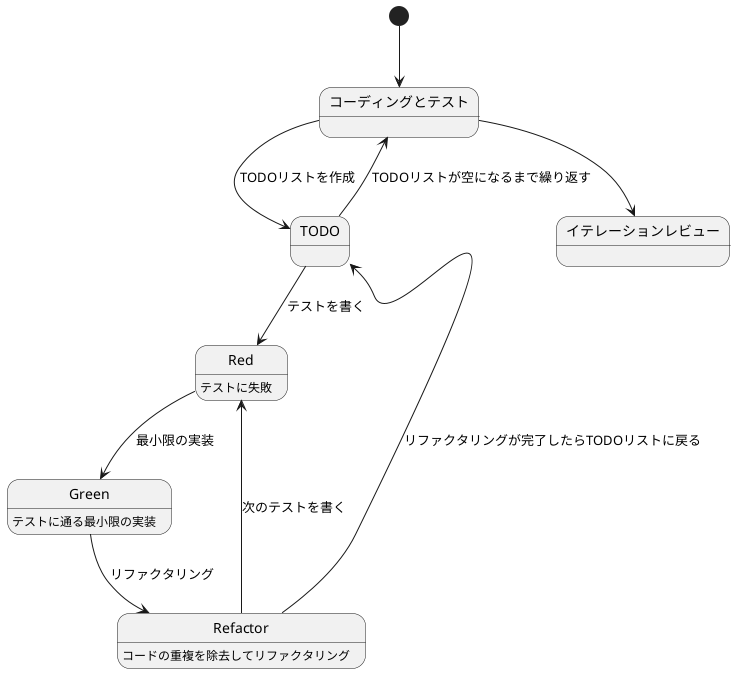
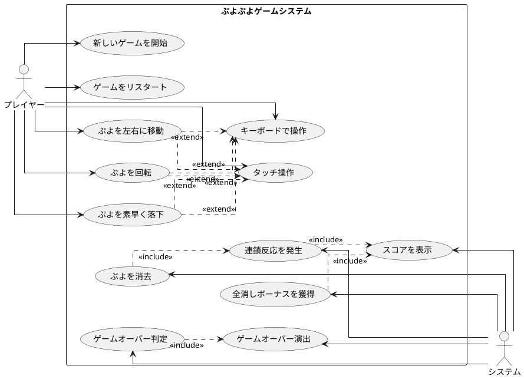

# ぷよぷよから始めるテスト駆動開発 (Elixir版)

## はじめに

みなさん、こんにちは！今日は私と一緒にテスト駆動開発（TDD）を使って、Elixirでぷよぷよゲームを作っていきましょう。「Elixirでゲーム開発？」と思われるかもしれませんが、Elixirの強力な並行処理とPhoenix LiveViewのリアルタイム通信機能を活用すれば、マルチプレイヤー対応のゲームも簡単に作れるんです！

> テスト駆動開発とは、プログラミングの手法の一種で、「テストファースト」の原則に従い、実装前にテストを書くことで、コードの品質を高め、設計を改善していく開発手法です。
>
> — Kent Beck 『テスト駆動開発』

この記事では、私たちが一緒にぷよぷよゲームを実装しながら、テスト駆動開発の基本的な流れと考え方を学んでいきます。まるでモブプログラミングのセッションのように、あなたと私が一緒に考え、コードを書き、改善していく過程を体験しましょう。

### Elixirでゲーム開発を選んだ理由

「なぜElixirなの？」と思われるかもしれませんね。いくつか理由があります：

1. **関数型プログラミング**: イミュータブルなデータ構造により、ゲームの状態管理が明確になります
2. **並行処理**: 将来的にマルチプレイヤー機能を追加しやすい設計になります
3. **Phoenix LiveView**: リアルタイムなゲーム体験を提供できます
4. **パターンマッチング**: ゲームの状態遷移が直感的に書けます
5. **強力なツール**: Mix、ExUnit、Credoなど、開発環境が充実しています

### テスト駆動開発のサイクル

さて、テスト駆動開発では、どのように進めていけばいいのでしょうか？「テストを書いてから実装する」というのは分かりましたが、具体的にはどんな手順で進めるのでしょうか？

私がいつも実践しているのは、以下の3つのステップを繰り返すサイクルです。皆さんも一緒にやってみましょう：

1. **Red（赤）**: まず失敗するテストを書きます。「え？わざと失敗するテストを？」と思われるかもしれませんが、これには重要な意味があるんです。これから実装する機能が何をすべきかを明確にするためなんですよ。
2. **Green（緑）**: 次に、テストが通るように、最小限のコードを実装します。この段階では、きれいなコードよりも「とにかく動くこと」を優先します。「最小限」というのがポイントです。必要以上のことはしないようにしましょう。
3. **Refactor（リファクタリング）**: 最後に、コードの品質を改善します。テストが通ることを確認しながら、重複を取り除いたり、わかりやすい名前をつけたりします。「動くけど汚いコード」から「動いてきれいなコード」へと進化させるんです。

> テスト駆動開発のリズム：赤、緑、リファクタリング。まず失敗するテストを書き（赤）、次にテストが通るようにする（緑）、そして重複を除去する（リファクタリング）。
>
> — Kent Beck 『テスト駆動開発』

このサイクルを「Red-Green-Refactor」サイクルと呼びます。「赤・緑・リファクタリング」のリズムを刻むように、このサイクルを繰り返していくんです。これによって、少しずつ機能を追加し、コードの品質を高めていきましょう。



### 開発環境

さて、実際にコードを書く前に、私たちが使用する開発環境について少しお話ししておきましょう。

今回のプロジェクトでは、以下のツールを使用していきます：

- **言語**: Elixir 1.16+ — 関数型プログラミング言語で、Erlang VMの上で動作します
- **ビルドツール**: Mix — Elixirの標準ビルドツールで、プロジェクト管理からテスト実行まで統合的に管理できます
- **テストフレームワーク**: ExUnit — Elixir標準のテストフレームワークです
- **静的解析**: Credo — Elixir専用の静的コード解析ツールです
- **コードカバレッジ**: ExCoveralls — テストカバレッジを測定します
- **フロントエンド**: Phoenix LiveView — リアルタイムなWebアプリケーションを構築します
- **バージョン管理**: Git — コードの変更履歴を追跡します

これらのツールを使って、テスト駆動開発の流れに沿ってぷよぷよゲームを実装していきましょう。

---

## 要件

### ユーザーストーリー

さて、実際にコードを書き始める前に、少し立ち止まって考えてみましょう。「何を作るのか？」という基本的な問いかけです。私たちが作るぷよぷよゲームは、どのような機能を持つべきでしょうか？

アジャイル開発では、この「何を作るのか？」という問いに対して、「ユーザーストーリー」という形で答えを出します。

> ユーザーストーリーとは、ソフトウェアの機能を「誰が」「何を」「なぜ」したいのかという形式で表現したものです。これにより、開発チームは常にユーザーの視点を忘れずに開発を進めることができます。
>
> — Mike Cohn 『User Stories Applied』

では、私たちのぷよぷよゲームでは、どんなユーザーストーリーが考えられるでしょうか？

- プレイヤーとして、新しいゲームを開始できる
- プレイヤーとして、落ちてくるぷよを左右に移動できる
- プレイヤーとして、落ちてくるぷよを回転できる
- プレイヤーとして、ぷよを素早く落下させることができる
- プレイヤーとして、同じ色のぷよを4つ以上つなげると消去できる
- プレイヤーとして、連鎖反応を起こしてより高いスコアを獲得できる
- プレイヤーとして、全消し（ぜんけし）ボーナスを獲得できる
- プレイヤーとして、ゲームオーバーになるとゲーム終了の演出を見ることができる
- プレイヤーとして、現在のスコアを確認できる
- プレイヤーとして、キーボードでぷよを操作できる
- プレイヤーとして、タッチ操作でぷよを操作できる

### ユースケース図

ユーザーストーリーを整理したところで、「これらの機能がどのように関連しているのか、全体像が見えるといいな」と思いませんか？そんなときに役立つのが「ユースケース図」です。



---

## イテレーション0: プロジェクトセットアップと開発環境構築

### イテレーション0の目標

実際にコードを書き始める前に、「動作するきれいなコード」を継続的に書き続けられる環境を整えます。これが**イテレーション0**です。

> ソフトウェア開発において、適切な開発環境の構築は成功の半分です。良いツールは良い仕事の第一歩となります。
>
> — Andrew Hunt & David Thomas 『達人プログラマー』

このイテレーションで実現すること：

1. **プロジェクトの作成**: Mixを使用したプロジェクトの初期化
2. **開発ツールの導入**: Credo（静的解析）、ExCoveralls（カバレッジ）、mix_test_watch（自動テスト）
3. **開発ガイドの作成**: チーム開発のためのドキュメント整備
4. **品質基準の設定**: コード品質を保つためのルール策定

### ステップ1: プロジェクト作成

まずは、新しいElixirプロジェクトを作成しましょう。

```bash
# プロジェクトを作成
mix new puyo_puyo --module PuyoPuyo
cd puyo_puyo
```

これで、以下のような構造のプロジェクトが生成されます：

```
puyo_puyo/
├── lib/
│   └── puyo_puyo.ex         # メインモジュール
├── test/
│   ├── puyo_puyo_test.exs   # テストファイル
│   └── test_helper.exs       # テスト設定
├── mix.exs                   # プロジェクト設定
└── README.md                 # プロジェクト説明
```

### ステップ2: Git初期化

バージョン管理を開始します。これは「ソフトウェア開発の三種の神器」の一つです。

```bash
# Gitリポジトリを初期化
git init

# .gitignoreを作成
cat > .gitignore << 'EOF'
# The directory Mix will write compiled artifacts to.
/_build/

# If you run "mix test --cover", coverage assets end up here.
/cover/

# The directory Mix downloads your dependencies sources to.
/deps/

# Where third-party dependencies like ExDoc output generated docs.
/doc/

# Ignore .fetch files in case you like to edit your project deps locally.
/.fetch

# If the VM crashes, it generates a dump, let's ignore it too.
erl_crash.dump

# Also ignore archive artifacts (built via "mix archive.build").
*.ez

# Ignore package tarball (built via "mix hex.build").
puyo_puyo-*.tar

# Temporary files, for example, from tests.
/tmp/
EOF

# 初回コミット
git add -A
git commit -m "chore: プロジェクトの初期セットアップ"
```

### ステップ3: 依存関係の設定

開発に必要なツールを `mix.exs` に追加します。

```elixir
defmodule PuyoPuyo.MixProject do
  use Mix.Project

  def project do
    [
      app: :puyo_puyo,
      version: "0.1.0",
      elixir: "~> 1.16",
      start_permanent: Mix.env() == :prod,
      deps: deps(),

      # テストカバレッジの設定
      test_coverage: [tool: ExCoveralls],
      preferred_cli_env: [
        coveralls: :test,
        "coveralls.detail": :test,
        "coveralls.html": :test
      ],

      # ドキュメント設定
      name: "PuyoPuyo",
      source_url: "https://github.com/yourusername/puyo_puyo",
      docs: [
        main: "PuyoPuyo",
        extras: ["README.md"]
      ]
    ]
  end

  def application do
    [
      extra_applications: [:logger]
    ]
  end

  defp deps do
    [
      # 静的コード解析
      {:credo, "~> 1.7", only: [:dev, :test], runtime: false},
      # コードカバレッジ
      {:excoveralls, "~> 0.18", only: :test},
      # ファイル監視（自動テスト実行）
      {:mix_test_watch, "~> 1.0", only: [:dev, :test], runtime: false},
      # ドキュメント生成
      {:ex_doc, "~> 0.31", only: :dev, runtime: false}
    ]
  end
end
```

### ステップ4: 依存関係のインストール

```bash
# 依存関係を取得
mix deps.get

# コミット
git add mix.exs mix.lock
git commit -m "chore: 開発ツールの依存関係を追加"
```

### ステップ5: 静的解析ツール（Credo）の設定

Credoは、Elixirのベストプラクティスに従ったコードを書くための静的解析ツールです。

```bash
# Credo設定ファイルを生成
mix credo gen.config
```

生成された `.credo.exs` をカスタマイズします。特に、サイクロマティック複雑度を7に設定します。

`.credo.exs` を編集：

```elixir
%{
  configs: [
    %{
      name: "default",
      files: %{
        included: [
          "lib/",
          "src/",
          "test/",
          "web/",
          "apps/*/lib/",
          "apps/*/src/",
          "apps/*/test/",
          "apps/*/web/"
        ],
        excluded: [~r"/_build/", ~r"/deps/", ~r"/node_modules/"]
      },
      plugins: [],
      requires: [],
      strict: true,
      parse_timeout: 5000,
      color: true,
      checks: %{
        enabled: [
          # サイクロマティック複雑度を7に設定
          {Credo.Check.Refactor.CyclomaticComplexity, [max_complexity: 7]},

          # その他の推奨設定
          {Credo.Check.Refactor.Nesting, [max_nesting: 3]},
          {Credo.Check.Design.AliasUsage, []},
          {Credo.Check.Readability.ModuleDoc, []},
          {Credo.Check.Readability.FunctionNames, []},
          {Credo.Check.Readability.VariableNames, []},
          {Credo.Check.Warning.UnusedEnumOperation, []},
          {Credo.Check.Warning.UnusedKeywordOperation, []},
          {Credo.Check.Warning.UnusedListOperation, []},
          {Credo.Check.Warning.UnusedTupleOperation, []}
        ],
        disabled: []
      }
    }
  ]
}
```

#### サイクロマティック複雑度とは

**サイクロマティック複雑度（Cyclomatic Complexity）**は、コードの複雑さを測る指標です：

- **計算方法**: 条件分岐（`if`、`case`、`cond`）とループの数に基づいて計算
- **複雑度7の意味**: 関数内に最大7つの独立した実行パスが許容される
- **推奨値**:
  - 1-7: 低い複雑度（理解しやすい）
  - 8-10: 中程度の複雑度（まだ管理可能）
  - 11以上: 高い複雑度（リファクタリング推奨）

複雑度が高い関数は、テストが難しく、バグが混入しやすくなります。TDDでは、複雑度を低く保つことで、テストしやすく保守しやすいコードを書くことができます。

```bash
# Credoを実行してみる
mix credo --strict

# サイクロマティック複雑度の詳細を確認
mix credo --format=flycheck
```

初期状態では、いくつかの警告が表示されるかもしれません。それらを修正していきましょう。

### ステップ6: モジュールドキュメントの追加

Credoが指摘する `@moduledoc` を追加します。

`lib/puyo_puyo.ex` を編集：

```elixir
defmodule PuyoPuyo do
  @moduledoc """
  ぷよぷよゲームのメインモジュールです。

  このモジュールは、テスト駆動開発の実践例として、
  ぷよぷよゲームのコアロジックを実装しています。

  ## 特徴

  - イミュータブルなゲーム状態管理
  - パターンマッチングによる状態遷移
  - ExUnitを使用したテスト駆動開発
  """

  @doc """
  Hello world.

  ## Examples

      iex> PuyoPuyo.hello()
      :world

  """
  def hello do
    :world
  end
end
```

### ステップ7: コードフォーマッタの設定

`.formatter.exs` を編集して、プロジェクトのフォーマット設定を調整：

```elixir
# .formatter.exs
[
  inputs: ["{mix,.formatter}.exs", "{config,lib,test}/**/*.{ex,exs}"],
  line_length: 100,
  import_deps: []
]
```

```bash
# コードを自動整形
mix format

# フォーマット状態をチェック
mix format --check-formatted

# コミット
git add -A
git commit -m "chore: 静的解析ツールの設定とモジュールドキュメント追加"
```

### ステップ8: カスタムMixタスクの作成

開発効率を向上させるため、よく使用するコマンドを統合したカスタムタスクを作成します。

```bash
mkdir -p lib/mix/tasks
```

`lib/mix/tasks/check.ex` を作成：

```elixir
defmodule Mix.Tasks.Check do
  @moduledoc """
  開発時の基本チェックを実行するタスクです。

  以下のチェックを実行します：
  - mix format --check-formatted (フォーマットチェック)
  - mix credo (静的解析)
  - mix test (テスト実行)
  """

  use Mix.Task

  @shortdoc "基本的なコード品質チェック"

  def run(_args) do
    Mix.shell().info("==> 基本チェックを開始します")

    # フォーマットチェック
    Mix.shell().info("\n==> フォーマットチェック")
    Mix.Task.run("format", ["--check-formatted"])
    Mix.shell().info("✓ フォーマットチェック 完了")

    # 静的解析
    Mix.shell().info("\n==> 静的解析")
    Mix.Task.run("credo", ["--strict"])
    Mix.shell().info("✓ 静的解析 完了")

    # テスト実行
    Mix.shell().info("\n==> テスト実行")
    Mix.Task.run("test", [])
    Mix.shell().info("✓ テスト実行 完了")

    Mix.shell().info("\n🎉 基本チェックが完了しました！")
  end
end
```

`lib/mix/tasks/dev.ex` を作成：

```elixir
defmodule Mix.Tasks.Dev do
  @moduledoc """
  開発時によく使用するタスクのためのショートカットです。
  """

  use Mix.Task

  @shortdoc "開発用ショートカットコマンド"

  def run(["test"]) do
    Mix.Task.run("test", [])
  end

  def run(["format"]) do
    Mix.Task.run("format", [])
    Mix.shell().info("✓ コードをフォーマットしました")
  end

  def run(["coverage"]) do
    Mix.Task.run("coveralls.html", [])
    Mix.shell().info("✓ カバレッジレポートを生成しました (cover/excoveralls.html)")
  end

  def run(["watch"]) do
    Mix.Task.run("test.watch", [])
  end

  def run(_) do
    Mix.shell().info("""
    使用可能なコマンド:

      mix dev test          # テストを実行
      mix dev format        # コードをフォーマット
      mix dev coverage      # カバレッジレポートを生成
      mix dev watch         # ファイル監視モード
    """)
  end
end
```

```bash
# 動作確認
mix check

# コミット
git add -A
git commit -m "chore: カスタムMixタスクを追加"
```

### ステップ9: 開発ガイドの作成

チーム開発のため、開発手順をドキュメント化します。

`DEVELOPMENT.md` を作成：

```markdown
# 開発ガイド

## 開発環境のセットアップ

### 必要な環境

- Elixir 1.16 以上
- Erlang/OTP 26 以上
- Git

### 初期セットアップ

\`\`\`bash
# 依存関係のインストール
mix deps.get

# 開発ツールの動作確認
mix check
\`\`\`

## 使用可能なツール

### 基本コマンド

- `mix test` - テスト実行
- `mix format` - コード整形
- `mix credo` - 静的解析
- `mix coveralls` - カバレッジ測定
- `mix coveralls.html` - HTMLカバレッジレポート生成

### 統合コマンド

- `mix check` - 基本チェック (format, credo, test)

### 開発用コマンド

- `mix dev` - 利用可能なコマンド一覧
- `mix dev test` - テスト実行
- `mix dev format` - フォーマット実行
- `mix dev coverage` - カバレッジレポート生成
- `mix dev watch` - ファイル監視モード

### 自動化

- `mix test.watch` - ファイル変更時の自動テスト実行

## 開発フロー

### Red-Green-Refactorサイクル

1. **Red（赤）**: 失敗するテストを書く
2. **Green（緑）**: テストが通る最小限の実装
3. **Refactor（リファクタリング）**: コードの品質を改善

### 推奨ワークフロー

1. **新機能・バグ修正の開始**
   \`\`\`bash
   # ファイル監視モードで開発
   mix dev watch
   \`\`\`

2. **コードを書く**
   - テストを書く（Red）
   - 実装する（Green）
   - リファクタリングする（Refactor）

3. **コミット前のチェック**
   \`\`\`bash
   # 自動フォーマット
   mix format

   # 品質チェック
   mix check
   \`\`\`

4. **コミット**
   \`\`\`bash
   git add -A
   git commit -m "feat: 新機能を追加"
   \`\`\`

## コミットメッセージ規約

Angularコミットメッセージ規約に従います：

- `feat`: 新機能
- `fix`: バグ修正
- `docs`: ドキュメントのみの変更
- `style`: コードの動作に影響しない変更
- `refactor`: バグ修正や機能追加以外のコード変更
- `test`: テストの追加や修正
- `chore`: ビルドプロセスやツールの変更

例：
\`\`\`bash
git commit -m "feat: ぷよの移動機能を実装"
git commit -m "test: ぷよの回転テストを追加"
git commit -m "refactor: ゲーム状態管理をモジュール分割"
\`\`\`

## 品質基準

- **フォーマット**: Elixir標準フォーマッタに準拠（100%）
- **静的解析**: Credoのルールをクリア
- **サイクロマティック複雑度**: 関数あたり7以下
- **ネストの深さ**: 最大3レベル
- **テストカバレッジ**: 80%以上を目標
- **全テスト**: パス必須

### コード複雑度について

**サイクロマティック複雑度7以下**を維持することで：
- テストが書きやすくなる
- バグが発見しやすくなる
- コードの理解が容易になる
- 保守性が向上する

複雑度が7を超える場合は、関数を分割することを検討してください。

## トラブルシューティング

### フォーマットエラー

\`\`\`bash
# 問題
mix format --check-formatted
# The following files are not formatted: ...

# 解決
mix format
\`\`\`

### Credo警告

\`\`\`bash
# 警告を確認
mix credo --strict

# 詳細を確認
mix credo explain path/to/file.ex:line_number
\`\`\`

### 依存関係の問題

\`\`\`bash
# キャッシュをクリア
mix deps.clean --all
mix deps.get
\`\`\`
```

```bash
# コミット
git add DEVELOPMENT.md
git commit -m "docs: 開発ガイドを追加"
```

### ステップ10: README更新

`README.md` を更新してプロジェクトの概要を記載：

```markdown
# PuyoPuyo

Elixirとテスト駆動開発で実装するぷよぷよゲーム

## 概要

このプロジェクトは、テスト駆動開発（TDD）の実践例として、
Elixirでぷよぷよゲームを実装する過程を示しています。

## 特徴

- **テスト駆動開発**: Red-Green-Refactorサイクルに従った開発
- **関数型プログラミング**: イミュータブルなデータ構造
- **パターンマッチング**: Elixirの強力な機能を活用
- **品質管理**: Credo、ExCoveralls、mix_test_watchによる自動化

## 開発環境

- Elixir 1.16+
- Erlang/OTP 26+

## セットアップ

\`\`\`bash
# 依存関係のインストール
mix deps.get

# テスト実行
mix test

# 品質チェック
mix check
\`\`\`

## 開発

詳細な開発手順については [DEVELOPMENT.md](DEVELOPMENT.md) を参照してください。

## ライセンス

MIT License
```

```bash
# コミット
git add README.md
git commit -m "docs: README を更新"
```

### ステップ11: 動作確認

すべてのツールが正しく動作するか確認します。

```bash
# フォーマットチェック
mix format --check-formatted

# 静的解析
mix credo --strict

# テスト実行
mix test

# カバレッジ測定
mix coveralls

# HTMLカバレッジレポート生成
mix coveralls.html

# 統合チェック
mix check
```

### イテレーション0の完了

おめでとうございます！これで開発環境の構築が完了しました。

#### 達成したこと

✅ プロジェクトの作成とGit初期化
✅ 開発ツールの導入（Credo、ExCoveralls、mix_test_watch）
✅ カスタムMixタスクの作成
✅ 開発ガイドのドキュメント化
✅ 品質基準の設定

#### プロジェクト構成

```
puyo_puyo/
├── lib/
│   ├── puyo_puyo.ex              # メインモジュール
│   └── mix/
│       └── tasks/
│           ├── check.ex          # 基本チェックタスク
│           └── dev.ex            # 開発用タスク
├── test/
│   ├── puyo_puyo_test.exs        # テストファイル
│   └── test_helper.exs
├── .credo.exs                    # Credo設定
├── .formatter.exs                # フォーマッタ設定
├── .gitignore                    # Git除外設定
├── mix.exs                       # プロジェクト設定
├── DEVELOPMENT.md                # 開発ガイド
└── README.md                     # プロジェクト説明
```

#### コミット履歴

```bash
git log --oneline
```

```
* docs: README を更新
* docs: 開発ガイドを追加
* chore: カスタムMixタスクを追加
* chore: 静的解析ツールの設定とモジュールドキュメント追加
* chore: 開発ツールの依存関係を追加
* chore: プロジェクトの初期セットアップ
```

### 次のステップ

イテレーション0で開発環境が整いました。次のイテレーションから、実際のゲームロジックの実装を始めます：

- **イテレーション1**: ゲームの初期化とゲーム状態の管理
- **イテレーション2**: ステージ（フィールド）の実装
- **イテレーション3**: ぷよの生成と表示
- **イテレーション4**: ぷよの移動と回転
- **イテレーション5**: ぷよの自由落下
- **イテレーション6**: ぷよの消去判定
- **イテレーション7**: 連鎖反応の実装
- **イテレーション8**: スコア計算
- **イテレーション9**: ゲームオーバー判定
- **イテレーション10**: Phoenix LiveViewによるUI実装

それでは、Red-Green-Refactorのリズムで、「動作するきれいなコード」を書いていきましょう！

---

## 参考資料

### 公式ドキュメント
- [Elixir公式ドキュメント](https://elixir-lang.org/docs.html)
- [Mix documentation](https://hexdocs.pm/mix/Mix.html)
- [ExUnit documentation](https://hexdocs.pm/ex_unit/ExUnit.html)

### 使用ツール
- [Credo](https://github.com/rrrene/credo) - 静的コード解析
- [ExCoveralls](https://github.com/parroty/excoveralls) - コードカバレッジ
- [mix_test_watch](https://github.com/lpil/mix-test.watch) - ファイル監視

### 書籍
- Kent Beck 『テスト駆動開発』
- Andrew Hunt & David Thomas 『達人プログラマー』
- Mike Cohn 『User Stories Applied』

Elixirの世界で「動作するきれいなコード」を継続的に書き続ける環境が整いました。開発を楽しんでください！

---

## イテレーション1: ゲームの初期化とゲーム状態の管理

さあ、いよいよコードを書き始めましょう！テスト駆動開発では、小さなイテレーション（反復）で機能を少しずつ追加していきます。最初のイテレーションでは、最も基本的な機能である「ゲームの初期化とゲーム状態の管理」を実装します。

> イテレーション開発とは、ソフトウェアを小さな機能単位で繰り返し開発していく手法です。各イテレーションで計画、設計、実装、テスト、評価のサイクルを回すことで、リスクを早期に発見し、フィードバックを得ながら開発を進めることができます。
>
> — Craig Larman 『アジャイル開発とスクラム』

### ユーザーストーリー

まずは、このイテレーションで実装するユーザーストーリーを確認しましょう：

> プレイヤーとして、新しいゲームを開始できる

このシンプルなストーリーから始めることで、ゲームの基本的な構造を作り、後続の機能追加の土台を築くことができます。では、テスト駆動開発のサイクルに従って、まずはテストから書いていきましょう！

### TODOリスト

さて、ユーザーストーリーを実装するために、まずはTODOリストを作成しましょう。TODOリストは、大きな機能を小さなタスクに分解するのに役立ちます。

> TODOリストは、テスト駆動開発の重要なプラクティスの一つです。実装前に必要なタスクを明確にすることで、開発の方向性を保ち、何も見落とさないようにします。
>
> — Kent Beck 『テスト駆動開発』

私たちの「新しいゲームを開始できる」というユーザーストーリーを実現するためには、どのようなタスクが必要でしょうか？考えてみましょう：

- [x] ゲーム状態を表現する構造体を定義する
- [x] ゲームの初期化処理を実装する
- [ ] ゲームモードの状態遷移を実装する
- [ ] ゲーム設定情報を管理するモジュールを作成する

これらのタスクを一つずつ実装していきましょう。テスト駆動開発では、各タスクに対してテスト→実装→リファクタリングのサイクルを回します。まずは「ゲーム状態の定義」から始めましょう！

### テスト: ゲームモジュールの作成

さて、TODOリストの最初のタスク「ゲーム状態を表現する構造体を定義する」に取り掛かりましょう。テスト駆動開発では、まずテストを書くことから始めます。

> テストファースト
>
> いつテストを書くべきだろうか——それはテスト対象のコードを書く前だ。
>
> — Kent Beck 『テスト駆動開発』

では、ゲームモジュールの基本的な動作をテストするコードを書いてみましょう。

`test/puyo_puyo/game_test.exs` を作成：

```elixir
defmodule PuyoPuyo.GameTest do
  use ExUnit.Case
  alias PuyoPuyo.Game

  describe "new/0" do
    test "新しいゲーム構造体を作成する" do
      game = Game.new()

      assert %Game{} = game
      assert game.mode == :start
      assert game.frame == 0
      assert game.chain_count == 0
    end
  end

  describe "initialize/1" do
    test "ゲームを初期化すると、必要なコンポーネントが作成される" do
      game = Game.new()
      initialized_game = Game.initialize(game)

      assert initialized_game.config != nil
      assert initialized_game.stage != nil
      assert initialized_game.score != nil
      assert initialized_game.mode == :new_puyo
    end

    test "初期化済みのゲーム状態はイミュータブルである" do
      game = Game.new()
      initialized_game = Game.initialize(game)

      # 元のゲーム状態は変更されない
      assert game.mode == :start
      assert initialized_game.mode == :new_puyo
    end
  end
end
```

このテストでは、`Game`モジュールの基本的な動作を確認しています：

1. `new/0`関数で新しいゲーム構造体を作成できる
2. `initialize/1`関数でゲームを初期化できる
3. 初期化後、必要なコンポーネントが設定される
4. イミュータブルなデータ構造になっている（元のデータは変更されない）

### テスト実行（Red）

テストを実行してみましょう：

```bash
mix test test/puyo_puyo/game_test.exs
```

当然エラーになります：

```
** (CompileError) test/puyo_puyo/game_test.exs:2: module PuyoPuyo.Game is not loaded
```

これがテスト駆動開発の「Red（赤）」の状態です。では、テストが通るように実装していきましょう！

### 実装: ゲーム構造体の定義

まず、`lib/puyo_puyo/game.ex` を作成してゲーム構造体を定義します：

```elixir
defmodule PuyoPuyo.Game do
  @moduledoc """
  ぷよぷよゲームのメインモジュールです。

  ゲーム全体の状態を管理し、ゲームループの制御を行います。
  """

  @type game_mode ::
          :start
          | :check_fall
          | :fall
          | :check_erase
          | :erasing
          | :new_puyo
          | :playing
          | :game_over

  @type t :: %__MODULE__{
          mode: game_mode(),
          frame: non_neg_integer(),
          chain_count: non_neg_integer(),
          config: map() | nil,
          stage: map() | nil,
          score: map() | nil
        }

  defstruct mode: :start,
            frame: 0,
            chain_count: 0,
            config: nil,
            stage: nil,
            score: nil

  @doc """
  新しいゲーム構造体を作成します。

  ## Examples

      iex> game = PuyoPuyo.Game.new()
      iex> game.mode
      :start

  """
  @spec new() :: t()
  def new do
    %__MODULE__{}
  end

  @doc """
  ゲームを初期化します。

  必要なコンポーネント（設定、ステージ、スコア）を作成し、
  ゲームモードを `:new_puyo` に設定します。

  ## Parameters

    - game: 初期化するゲーム構造体

  ## Returns

    初期化されたゲーム構造体

  ## Examples

      iex> game = PuyoPuyo.Game.new()
      iex> initialized = PuyoPuyo.Game.initialize(game)
      iex> initialized.mode
      :new_puyo

  """
  @spec initialize(t()) :: t()
  def initialize(%__MODULE__{} = game) do
    # 各コンポーネントの初期化（現時点では仮実装）
    config = %{rows: 12, cols: 6, puyo_size: 32}
    stage = %{grid: [], rows: 12, cols: 6}
    score = %{current: 0, chain: 0}

    # 新しいゲーム状態を返す（イミュータブル）
    %{game | config: config, stage: stage, score: score, mode: :new_puyo}
  end
end
```

### テスト実行（Green）

もう一度テストを実行してみましょう：

```bash
mix test test/puyo_puyo/game_test.exs
```

結果：

```
...

Finished in 0.05 seconds
3 tests, 0 failures
```

おめでとうございます！テストが通りました。これがテスト駆動開発の「Green（緑）」の状態です。

### 解説: Elixirのイミュータブルなデータ構造

テストが通りましたね！実装したコードについて、少し解説しておきましょう。

#### 構造体（Struct）の定義

Elixirでは、`defstruct`を使って構造体を定義します：

```elixir
defstruct mode: :start,
          frame: 0,
          chain_count: 0,
          config: nil,
          stage: nil,
          score: nil
```

これは、オブジェクト指向言語のクラスに似ていますが、重要な違いがあります：

- **イミュータブル**: 一度作成したデータは変更できません
- **データと振る舞いの分離**: データ（構造体）と振る舞い（関数）が明確に分離されています

#### 型指定（Type Specification）

Elixirでは、`@type`と`@spec`を使って型を指定できます：

```elixir
@type game_mode :: :start | :check_fall | :fall | ...
@type t :: %__MODULE__{...}

@spec new() :: t()
@spec initialize(t()) :: t()
```

これにより：
- コードの意図が明確になる
- Dialyzer（静的解析ツール）で型エラーを検出できる
- ドキュメント生成時に型情報が含まれる

#### イミュータブルな更新

`initialize/1`関数を見てみましょう：

```elixir
def initialize(%__MODULE__{} = game) do
  config = %{...}
  stage = %{...}
  score = %{...}

  # 新しいゲーム状態を返す
  %{game | config: config, stage: stage, score: score, mode: :new_puyo}
end
```

`%{game | ...}`という構文は、**既存のデータをコピーして一部を更新した新しいデータを作成**します。元の`game`は変更されません。

これがElixirの強力な特性です：

```elixir
game1 = Game.new()              # mode: :start
game2 = Game.initialize(game1)  # mode: :new_puyo
# game1.mode はまだ :start のまま！
```

#### パターンマッチングによる型チェック

関数定義で`%__MODULE__{} = game`というパターンを使っています：

```elixir
def initialize(%__MODULE__{} = game) do
```

これは：
- 引数が`Game`構造体であることを保証
- 間違った型が渡されるとランタイムエラーになる
- 自己文書化されたコード

### コミット

では、ここまでの実装をコミットしましょう：

```bash
# テストを実行して確認
mix test

# フォーマットと品質チェック
mix format
mix check

# コミット
git add lib/puyo_puyo/game.ex test/puyo_puyo/game_test.exs
git commit -m "feat: ゲーム構造体と初期化機能を実装

- Game構造体の定義（イミュータブルなゲーム状態）
- new/0関数で新しいゲームを作成
- initialize/1関数でゲームを初期化
- 型指定とドキュメントを追加
- ExUnitによるテスト実装

イテレーション1の基盤が完成"
```

### Refactor: 型安全性の向上

さて、テストが通りましたが、コードをもう少し改善できそうです。現在、`config`、`stage`、`score`は単なる`map()`として扱っていますが、これらも専用の構造体にした方が型安全性が高まります。

しかし、テスト駆動開発の原則に従い、**まずは動くコードを書いてから改善する**というアプローチを取ります。この改善は次のイテレーションで行いましょう。

> リファクタリングのタイミング
>
> リファクタリングは、新しい機能を追加する前か、バグを修正した後に行うのが良い。テストが通っている状態でリファクタリングすれば、安全に改善できる。
>
> — Martin Fowler 『リファクタリング』

### イテレーション1の振り返り

このイテレーションで達成したこと：

✅ ゲーム構造体の定義
✅ 基本的な初期化処理
✅ イミュータブルなデータ構造の採用
✅ 型指定による安全性の向上
✅ テスト駆動開発のサイクル実践

#### 学んだこと

1. **Elixirの構造体**: `defstruct`でイミュータブルなデータ構造を定義
2. **型指定**: `@type`と`@spec`で型安全性を向上
3. **パターンマッチング**: 関数引数で型をチェック
4. **イミュータブルな更新**: `%{struct | field: value}`構文
5. **ExUnit**: Elixirの標準テストフレームワーク

#### 次のステップ

次のイテレーションでは、以下を実装します：

- ステージ（フィールド）の実装
- ゲーム設定情報の専用モジュール化
- スコア管理の専用モジュール化

それでは、Red-Green-Refactorのリズムで、「動作するきれいなコード」を書いていきましょう！
