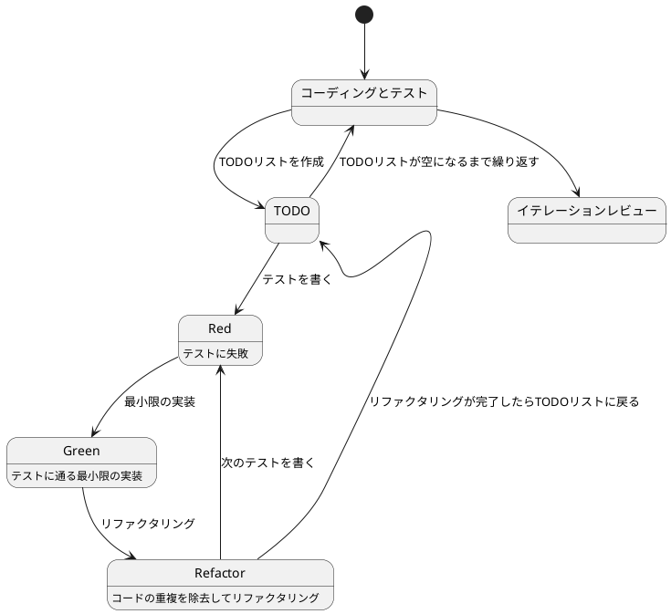

# ぷよぷよから始めるテスト駆動開発 (Elixir Phoenix LiveView版)

## はじめに

みなさん、こんにちは！今日は私と一緒にテスト駆動開発（TDD）を使って、Elixir Phoenix LiveViewでぷよぷよゲームを作っていきましょう。

> テスト駆動開発とは、プログラミングの手法の一種で、「テストファースト」の原則に従い、実装前にテストを書くことで、コードの品質を高め、設計を改善していく開発手法です。
>
> — Kent Beck 『テスト駆動開発』

この記事では、私たちが一緒にぷよぷよゲームを実装しながら、テスト駆動開発の基本的な流れと考え方、そしてPhoenix LiveViewの強力な機能を学んでいきます。

### なぜPhoenix LiveViewなのか？

Phoenix LiveViewは、リアルタイムでインタラクティブなWebアプリケーションを、JavaScriptをほとんど書かずに実装できるフレームワークです。以下の特徴があります：

- **リアルタイム性**: WebSocketを使った双方向通信
- **サーバーサイドレンダリング**: サーバー側でHTMLを生成し、差分のみをクライアントに送信
- **状態管理の簡潔さ**: サーバー側で状態を管理するため、クライアント側の複雑な状態管理が不要
- **高パフォーマンス**: Elixirの並行処理とErlang VMの力
- **テストのしやすさ**: サーバーサイドロジックとして統一的にテスト可能

ぷよぷよのようなゲームは、状態の更新が頻繁に発生します。LiveViewのリアルタイム性と状態管理の簡潔さは、このようなアプリケーションに最適です。

### テスト駆動開発のサイクル

テスト駆動開発では、以下の3つのステップを繰り返すサイクルで開発を進めます：

1. **Red（赤）**: まず失敗するテストを書きます
2. **Green（緑）**: テストが通るように、最小限のコードを実装します
3. **Refactor（リファクタリング）**: コードの品質を改善します

> テスト駆動開発のリズム：赤、緑、リファクタリング。まず失敗するテストを書き（赤）、次にテストが通るようにする（緑）、そして重複を除去する（リファクタリング）。
>
> — Kent Beck 『テスト駆動開発』



## イテレーション0: プロジェクトのセットアップ

テスト駆動開発を始める前に、まず開発環境を整えましょう。このイテレーションでは、Phoenix LiveViewプロジェクトをセットアップし、開発に必要なツールを準備します。

### 前提条件

以下のツールがインストールされていることを確認してください：

- **Elixir 1.14以上**: `elixir --version`で確認
- **Erlang/OTP 25以上**: `erl -version`で確認
- **PostgreSQL**: データベースとして使用（開発用）
- **Node.js**: アセット管理に使用

### ステップ1: Phoenixプロジェクトの作成

まず、Phoenix Frameworkのインストーラーをインストールします：

```bash
# Phoenixインストーラーのインストール
mix archive.install hex phx_new
```

次に、新しいPhoenixプロジェクトを作成します：

```bash
# プロジェクトの作成
mix phx.new puyo_puyo --live

# プロジェクトディレクトリに移動
cd puyo_puyo

# 依存関係のインストール
mix deps.get

# データベースのセットアップ
mix ecto.setup
```

**オプションの説明**:
- `--live`: LiveViewのサポートを含めたプロジェクトを生成します

### ステップ2: プロジェクト構成の確認

作成されたプロジェクトの構成を確認しましょう：

```
puyo_puyo/
├── assets/              # フロントエンドアセット (CSS, JS)
├── config/              # 設定ファイル
│   ├── config.exs       # 共通設定
│   ├── dev.exs          # 開発環境設定
│   ├── prod.exs         # 本番環境設定
│   └── test.exs         # テスト環境設定
├── lib/
│   ├── puyo_puyo/       # アプリケーションロジック
│   │   ├── application.ex
│   │   ├── repo.ex      # Ectoリポジトリ
│   │   └── ...
│   └── puyo_puyo_web/   # Webレイヤー
│       ├── components/  # Phoenixコンポーネント
│       ├── controllers/ # コントローラー
│       ├── live/        # LiveViewモジュール
│       ├── endpoint.ex  # HTTPエンドポイント
│       ├── router.ex    # ルーティング
│       └── ...
├── priv/
│   └── repo/
│       └── migrations/  # データベースマイグレーション
├── test/                # テストファイル
│   ├── puyo_puyo/
│   ├── puyo_puyo_web/
│   ├── support/
│   └── test_helper.exs
├── mix.exs              # プロジェクト定義と依存関係
└── mix.lock             # 依存関係のロックファイル
```

### ステップ3: 開発ツールの追加

プロジェクトに開発支援ツールを追加します。`mix.exs`を編集して、依存関係を追加します：

```elixir
defmodule PuyoPuyo.MixProject do
  use Mix.Project

  def project do
    [
      app: :puyo_puyo,
      version: "0.1.0",
      elixir: "~> 1.14",
      elixirc_paths: elixirc_paths(Mix.env()),
      start_permanent: Mix.env() == :prod,
      aliases: aliases(),
      deps: deps(),

      # テストカバレッジの設定
      test_coverage: [tool: ExCoveralls],
      preferred_cli_env: [
        coveralls: :test,
        "coveralls.detail": :test,
        "coveralls.html": :test
      ]
    ]
  end

  # 省略...

  defp deps do
    [
      {:phoenix, "~> 1.7.10"},
      {:phoenix_ecto, "~> 4.4"},
      {:ecto_sql, "~> 3.10"},
      {:postgrex, ">= 0.0.0"},
      {:phoenix_html, "~> 3.3"},
      {:phoenix_live_reload, "~> 1.2", only: :dev},
      {:phoenix_live_view, "~> 0.20.1"},
      {:floki, ">= 0.30.0", only: :test},
      {:phoenix_live_dashboard, "~> 0.8.2"},
      {:esbuild, "~> 0.8", runtime: Mix.env() == :dev},
      {:tailwind, "~> 0.2.0", runtime: Mix.env() == :dev},
      {:swoosh, "~> 1.3"},
      {:finch, "~> 0.13"},
      {:telemetry_metrics, "~> 0.6"},
      {:telemetry_poller, "~> 1.0"},
      {:gettext, "~> 0.20"},
      {:jason, "~> 1.2"},
      {:dns_cluster, "~> 0.1.1"},
      {:plug_cowboy, "~> 2.5"},

      # 開発・テストツール
      {:credo, "~> 1.7", only: [:dev, :test], runtime: false},
      {:excoveralls, "~> 0.18", only: :test},
      {:mix_test_watch, "~> 1.0", only: [:dev, :test], runtime: false},
      {:dialyxir, "~> 1.4", only: [:dev], runtime: false}
    ]
  end

  # 省略...
end
```

**追加したツール**:
- **Credo**: 静的コード解析ツール（コードの品質チェック）
- **ExCoveralls**: テストカバレッジツール（どれだけテストされているかを測定）
- **mix_test_watch**: ファイル監視ツール（ファイル変更時に自動テスト実行）
- **Dialyxir**: 型解析ツール（型エラーの検出）

依存関係をインストールします：

```bash
mix deps.get
```

### ステップ4: Credoの設定

Credoの設定ファイルを生成し、プロジェクトのコーディング規約を設定します：

```bash
mix credo gen.config
```

生成された `.credo.exs` ファイルで、プロジェクトに合わせたルールを調整できます。デフォルトの設定でも十分に機能します。

### ステップ5: コードフォーマッタの設定

Elixirには標準で `mix format` が含まれています。`.formatter.exs` ファイルで設定を確認します：

```elixir
# .formatter.exs
[
  import_deps: [:ecto, :ecto_sql, :phoenix],
  subdirectories: ["priv/*/migrations"],
  plugins: [Phoenix.LiveView.HTMLFormatter],
  inputs: ["*.{heex,ex,exs}", "{config,lib,test}/**/*.{heex,ex,exs}", "priv/*/seeds.exs"]
]
```

### ステップ6: 開発用タスクの作成

開発効率を向上させるため、カスタムMixタスクを作成します。

`lib/mix/tasks/check.ex` を作成：

```elixir
defmodule Mix.Tasks.Check do
  @moduledoc """
  開発時の基本チェックを実行するタスクです。

  以下のチェックを実行します：
  - mix format --check-formatted (フォーマットチェック)
  - mix credo --strict (静的解析)
  - mix test (テスト実行)
  """

  use Mix.Task

  @shortdoc "基本的なコード品質チェック"

  def run(_args) do
    Mix.shell().info("==> 基本チェックを開始します")

    # フォーマットチェック
    Mix.shell().info("\n==> フォーマットチェック")
    Mix.Task.run("format", ["--check-formatted"])
    Mix.shell().info("✓ フォーマットチェック 完了")

    # 静的解析
    Mix.shell().info("\n==> 静的解析")
    Mix.Task.run("credo", ["--strict"])
    Mix.shell().info("✓ 静的解析 完了")

    # テスト実行
    Mix.shell().info("\n==> テスト実行")
    Mix.Task.run("test", [])
    Mix.shell().info("✓ テスト実行 完了")

    Mix.shell().info("\n🎉 基本チェックが完了しました！")
  end
end
```

### ステップ7: 動作確認

サーバーを起動して、プロジェクトが正しくセットアップされているか確認します：

```bash
mix phx.server
```

ブラウザで `http://localhost:4000` にアクセスし、Phoenixのウェルカムページが表示されることを確認します。

### ステップ8: 開発ガイドの作成

チーム開発のため、開発手順をドキュメント化します。

`DEVELOPMENT.md` を作成：

```markdown
# 開発ガイド

## セットアップ

\`\`\`bash
# 依存関係のインストール
mix deps.get

# データベースのセットアップ
mix ecto.setup

# フロントエンドアセットのセットアップ
cd assets && npm install && cd ..
\`\`\`

## 使用可能なコマンド

### 基本コマンド
- `mix phx.server` - サーバー起動
- `mix test` - テスト実行
- `mix format` - コード整形
- `mix credo` - 静的解析
- `mix coveralls.html` - カバレッジレポート生成

### 統合コマンド
- `mix check` - 基本チェック (format, credo, test)

### 自動化
- `mix test.watch` - ファイル変更時の自動テスト実行

## 開発フロー

1. **コードを書く**
2. **フォーマット**: `mix format`
3. **チェック**: `mix check`
4. **コミット**

## コミットメッセージ規約

Angularコミットメッセージ規約に従います：

\`\`\`
<type>(<scope>): <subject>
\`\`\`

**主要なタイプ**:
- `feat`: 新機能の追加
- `fix`: バグの修正
- `docs`: ドキュメントのみの変更
- `test`: テストの追加や修正
- `refactor`: バグ修正や機能追加以外のコード変更
- `chore`: ビルドプロセスやツールの変更

## 品質基準

- **フォーマット**: Elixir標準フォーマッタに準拠
- **静的解析**: Credoのルールをクリア
- **テストカバレッジ**: 80%以上を目標
- **全テスト**: パスすること
```

### ステップ9: 初回コミット

Gitリポジトリを初期化し、初回コミットを作成します：

```bash
# Gitリポジトリの初期化（まだの場合）
git init

# .gitignoreの確認（Phoenixが自動生成）
# 必要に応じて追加設定

# すべてのファイルをステージング
git add -A

# 初回コミット
git commit -m "chore: Phoenix LiveViewプロジェクトの初期セットアップ

- Phoenix 1.7プロジェクトの作成
- LiveViewサポートの有効化
- 開発ツールの追加（Credo, ExCoveralls, mix_test_watch, Dialyxir）
- カスタムMixタスク（mix check）の作成
- 開発ガイド（DEVELOPMENT.md）の作成
- 開発環境の整備完了"
```

### ステップ10: 基本チェックの実行

セットアップが完了したので、基本チェックを実行します：

```bash
mix check
```

すべてのチェックが通ることを確認します。

## まとめ

イテレーション0で以下を達成しました：

### 得られたもの

1. **Phoenix LiveViewプロジェクトのセットアップ**
   - LiveView対応のPhoenix 1.7プロジェクト
   - データベース設定とマイグレーション環境
   - アセット管理の設定

2. **開発ツールの整備**
   - Credo（静的コード解析）
   - ExCoveralls（テストカバレッジ）
   - mix_test_watch（自動テスト実行）
   - Dialyxir（型解析）

3. **開発フローの確立**
   - コードフォーマッタの設定
   - 統合チェックタスク（mix check）
   - コミットメッセージ規約
   - 開発ガイドの作成

4. **テスト駆動開発の準備**
   - ExUnitテスト環境
   - LiveViewテストのサポート
   - カバレッジ測定環境

### プロジェクト構成

```
puyo_puyo/
├── lib/
│   ├── mix/
│   │   └── tasks/
│   │       └── check.ex          # 統合チェックタスク
│   ├── puyo_puyo/                # ビジネスロジック層
│   └── puyo_puyo_web/            # Web層（LiveView）
├── test/                         # テストファイル
├── config/                       # 設定ファイル
├── .credo.exs                    # Credo設定
├── .formatter.exs                # フォーマッタ設定
├── mix.exs                       # プロジェクト定義
├── DEVELOPMENT.md                # 開発ガイド
└── README.md                     # プロジェクト説明
```

### 次のステップ

開発環境が整いました。次のイテレーションでは、以下を実装していきます：

- **イテレーション1**: ゲームの初期化とLiveViewの基本構造
- **イテレーション2**: ステージの実装（盤面の表示と管理）
- **イテレーション3**: プレイヤーの実装（ぷよの移動と回転）
- **イテレーション4**: ゲームループの実装（重力と落下）
- **イテレーション5**: 消去判定の実装（同色4つ以上の判定）
- **イテレーション6**: 連鎖反応の実装（連鎖とスコア計算）
- **イテレーション7**: ゲームオーバーの実装（終了判定と演出）

これらをテスト駆動開発のサイクルに従って、一つずつ実装していきましょう！

## 参考資料

### 公式ドキュメント
- [Phoenix Framework](https://www.phoenixframework.org/)
- [Phoenix LiveView](https://hexdocs.pm/phoenix_live_view/Phoenix.LiveView.html)
- [Elixir公式ドキュメント](https://elixir-lang.org/docs.html)
- [Mix documentation](https://hexdocs.pm/mix/Mix.html)

### 使用ツール
- [Credo](https://github.com/rrrene/credo) - 静的コード解析
- [ExCoveralls](https://github.com/parroty/excoveralls) - コードカバレッジ
- [mix_test_watch](https://github.com/lpil/mix-test.watch) - ファイル監視
- [Dialyxir](https://github.com/jeremyjh/dialyxir) - 型解析

### 参考記事
- [Angularコミットメッセージ規約](https://github.com/angular/angular/blob/master/CONTRIBUTING.md#commit)
- [Phoenix LiveView入門](https://hexdocs.pm/phoenix_live_view/Phoenix.LiveView.html#module-bindings)

Elixir Phoenix LiveViewの世界で「動作するきれいなコード」を書き始める準備が整いました。開発を楽しんでください！

---

## イテレーション1: ゲームの初期化とLiveViewの基本構造

さあ、いよいよコードを書き始めましょう！テスト駆動開発では、小さなイテレーション（反復）で機能を少しずつ追加していきます。最初のイテレーションでは、最も基本的な機能である「ゲームの初期化」とLiveViewの基本構造を実装します。

> イテレーション開発とは、ソフトウェアを小さな機能単位で繰り返し開発していく手法です。各イテレーションで計画、設計、実装、テスト、評価のサイクルを回すことで、リスクを早期に発見し、フィードバックを得ながら開発を進めることができます。
>
> — Craig Larman 『アジャイル開発とスクラム』

### ユーザーストーリー

まずは、このイテレーションで実装するユーザーストーリーを確認しましょう：

> プレイヤーとして、新しいゲームを開始できる

このシンプルなストーリーから始めることで、ゲームの基本的な構造を作り、後続の機能追加の土台を築くことができます。では、テスト駆動開発のサイクルに従って、まずはテストから書いていきましょう！

### TODOリスト

さて、ユーザーストーリーを実装するために、まずはTODOリストを作成しましょう。TODOリストは、大きな機能を小さなタスクに分解するのに役立ちます。

> TODOリストは、テスト駆動開発の重要なプラクティスの一つです。実装前に必要なタスクを明確にすることで、開発の方向性を保ち、何も見落とさないようにします。
>
> — Kent Beck 『テスト駆動開発』

私たちの「新しいゲームを開始できる」というユーザーストーリーを実現するためには、どのようなタスクが必要でしょうか？考えてみましょう：

- LiveViewモジュールを作成する（ゲームの状態を管理するLiveViewモジュール）
- ゲームの初期状態を定義する（ゲームモード、スコア、ステージ情報など）
- テンプレートを作成する（プレイヤーが視覚的にゲームを認識できるようにする）
- ルーティングを設定する（`/game`パスでゲームにアクセスできるようにする）

これらのタスクを一つずつ実装していきましょう。テスト駆動開発では、各タスクに対してテスト→実装→リファクタリングのサイクルを回します。まずは「LiveViewモジュールの作成」から始めましょう！

### テスト: LiveViewモジュールの作成

さて、TODOリストの最初のタスク「LiveViewモジュールを作成する」に取り掛かりましょう。テスト駆動開発では、まずテストを書くことから始めます。

> テストファースト
>
> いつテストを書くべきだろうか——それはテスト対象のコードを書く前だ。
>
> — Kent Beck 『テスト駆動開発』

では、LiveViewモジュールの初期化をテストするコードを書いてみましょう。LiveViewテストでは、`mount/3`コールバックが正しく動作し、必要な状態が設定されることを確認します。

```elixir
# test/puyo_puyo_web/live/game_live_test.exs
defmodule PuyoPuyoWeb.GameLiveTest do
  use PuyoPuyoWeb.ConnCase

  import Phoenix.LiveViewTest

  describe "GameLive" do
    test "mounts successfully", %{conn: conn} do
      {:ok, _view, html} = live(conn, "/game")
      assert html =~ "ぷよぷよゲーム"
    end

    test "initializes game state on mount", %{conn: conn} do
      {:ok, view, _html} = live(conn, "/game")

      # LiveViewの状態を取得
      assert has_element?(view, "#game-container")

      # 初期状態の確認
      # mode: :start (ゲーム開始状態)
      # score: 0 (スコアは0)
      # chain: 0 (連鎖数は0)
    end

    test "displays game board", %{conn: conn} do
      {:ok, view, _html} = live(conn, "/game")

      # ゲームボードが表示されていることを確認
      assert has_element?(view, "#game-board")
    end

    test "displays score information", %{conn: conn} do
      {:ok, view, _html} = live(conn, "/game")

      # スコア情報が表示されていることを確認
      assert has_element?(view, "#score")
      assert has_element?(view, "#chain")
    end
  end
end
```

このテストでは、`GameLive`モジュールが正しくマウントされ、必要な初期状態が設定されることを確認しています。

### 実装: LiveViewモジュールの作成

テストを書いたら、次に実行してみましょう。どうなるでしょうか？

```bash
mix test test/puyo_puyo_web/live/game_live_test.exs
```

```
Error: cannot find module PuyoPuyoWeb.GameLive
```

おっと！まだ`GameLive`モジュールを実装していないので、当然エラーになりますね。これがテスト駆動開発の「Red（赤）」の状態です。テストが失敗することを確認できました。

> 失敗するテスト
>
> テストが失敗することを確認してから実装に取り掛かろう。そうすれば、テストが正しく機能していることがわかる。
>
> — Kent Beck 『テスト駆動開発』

では、テストが通るように最小限のコードを実装していきましょう。「最小限」というのがポイントです。この段階では、テストが通ることだけを目指して、必要最低限のコードを書きます。

```elixir
# lib/puyo_puyo_web/live/game_live.ex
defmodule PuyoPuyoWeb.GameLive do
  use PuyoPuyoWeb, :live_view

  @moduledoc """
  ぷよぷよゲームのLiveViewモジュール
  """

  # ゲームモードの定義
  @type game_mode :: :start | :check_fall | :fall | :check_erase | :erasing | :new_puyo | :playing | :game_over

  # ゲーム設定
  @stage_rows 12
  @stage_cols 6
  @puyo_size 32

  @impl true
  def mount(_params, _session, socket) do
    # ゲームの初期状態を設定
    socket =
      socket
      |> assign(:mode, :start)
      |> assign(:score, 0)
      |> assign(:chain, 0)
      |> assign(:stage_rows, @stage_rows)
      |> assign(:stage_cols, @stage_cols)
      |> assign(:puyo_size, @puyo_size)
      |> assign(:board, init_board())

    {:ok, socket}
  end

  @impl true
  def render(assigns) do
    ~H"""
    <div id="game-container" class="flex gap-8 p-8">
      <div id="game-board" class="relative bg-gray-100 border-2 border-gray-800 rounded-lg">
        <div class="grid" style={"grid-template-columns: repeat(#{@stage_cols}, #{@puyo_size}px);"}>
          <%= for row <- 0..(@stage_rows - 1) do %>
            <%= for col <- 0..(@stage_cols - 1) do %>
              <div
                class="border border-gray-300"
                style={"width: #{@puyo_size}px; height: #{@puyo_size}px;"}
              >
                <%= render_puyo(@board[row][col]) %>
              </div>
            <% end %>
          <% end %>
        </div>
      </div>

      <div id="info-panel" class="bg-white p-6 rounded-lg shadow-lg">
        <h2 class="text-2xl font-bold mb-4">ぷよぷよゲーム</h2>

        <div class="mb-4">
          <h3 class="text-lg font-semibold">スコア</h3>
          <p id="score" class="text-3xl font-bold text-blue-600"><%= @score %></p>
        </div>

        <div class="mb-4">
          <h3 class="text-lg font-semibold">連鎖数</h3>
          <p id="chain" class="text-3xl font-bold text-red-600"><%= @chain %></p>
        </div>

        <div class="mt-6 text-sm text-gray-600">
          <h3 class="font-semibold mb-2">操作方法</h3>
          <ul class="space-y-1">
            <li>← →: 移動</li>
            <li>↑: 回転</li>
            <li>↓: 高速落下</li>
          </ul>
        </div>
      </div>
    </div>
    """
  end

  # プライベート関数

  # 空のボードを初期化
  defp init_board do
    for row <- 0..(@stage_rows - 1), into: %{} do
      {row, for(col <- 0..(@stage_cols - 1), into: %{}, do: {col, 0})}
    end
  end

  # ぷよの描画（0は空、1-4はぷよの種類）
  defp render_puyo(0), do: nil
  defp render_puyo(type) when type in 1..4 do
    color = puyo_color(type)
    assigns = %{color: color}

    ~H"""
    <div class="w-full h-full rounded-full" style={"background-color: #{@color}; border: 2px solid rgba(0,0,0,0.2);"}></div>
    """
  end

  # ぷよの色を返す
  defp puyo_color(1), do: "#FF0000"  # 赤
  defp puyo_color(2), do: "#00FF00"  # 緑
  defp puyo_color(3), do: "#0000FF"  # 青
  defp puyo_color(4), do: "#FFFF00"  # 黄
end
```

### ルーティングの設定

LiveViewモジュールを作成したら、ルーティングを設定して、`/game`パスでアクセスできるようにします。

```elixir
# lib/puyo_puyo_web/router.ex
defmodule PuyoPuyoWeb.Router do
  use PuyoPuyoWeb, :router

  # 既存のパイプライン...

  scope "/", PuyoPuyoWeb do
    pipe_through :browser

    get "/", PageController, :home

    # ぷよぷよゲームのルート
    live "/game", GameLive
  end

  # 既存のスコープ...
end
```

### 解説: LiveViewの初期化

テストが通りましたね！おめでとうございます。これがテスト駆動開発の「Green（緑）」の状態です。

> テストが通ったら、次はリファクタリングだ。でも、その前に少し立ち止まって、今書いたコードについて考えてみよう。
>
> — Martin Fowler 『リファクタリング』

実装したLiveViewモジュールについて、少し解説しておきましょう。

#### Phoenix LiveViewの仕組み

Phoenix LiveViewは、サーバーサイドでHTMLをレンダリングし、WebSocketを通じてクライアントに差分だけを送信する仕組みです。主な特徴は：

1. **サーバー側で状態管理**: `socket.assigns`に状態を保存
2. **自動的な差分更新**: 状態が変わると、変更された部分だけがクライアントに送信される
3. **リアルタイム通信**: WebSocketによる双方向通信

#### mount/3コールバック

```elixir
def mount(_params, _session, socket) do
  socket =
    socket
    |> assign(:mode, :start)
    |> assign(:score, 0)
    |> assign(:chain, 0)
    # ...
  {:ok, socket}
end
```

`mount/3`は、LiveViewが初期化されるときに呼ばれるコールバックです。ここで：

- **ゲームモード**: `:start`（ゲーム開始状態）
- **スコア**: `0`
- **連鎖数**: `0`
- **ボード**: 空のボード（12行 × 6列）

を初期化しています。

#### render/1関数

```elixir
def render(assigns) do
  ~H"""
  <div id="game-container">
    ...
  </div>
  """
end
```

`render/1`関数は、LiveViewのUIを定義します。`~H`シジルは、HEExテンプレート（HTML + Elixir）を表します。

このテンプレートでは：

- **ゲームボード**: グリッドレイアウトで6×12のセルを表示
- **情報パネル**: スコア、連鎖数、操作方法を表示

#### 状態の管理

LiveViewでは、`assign/3`関数を使って状態を管理します：

```elixir
socket = assign(socket, :score, 100)
```

状態が変更されると、LiveViewは自動的に`render/1`を再実行し、変更された部分だけをクライアントに送信します。これにより、効率的なリアルタイム更新が実現されます。

### テスト実行と確認

実装が完了したので、テストを実行してみましょう：

```bash
mix test test/puyo_puyo_web/live/game_live_test.exs
```

すべてのテストが通ることを確認します。また、サーバーを起動して、ブラウザで確認してみましょう：

```bash
mix phx.server
```

ブラウザで `http://localhost:4000/game` にアクセスすると、ゲームボードとスコア情報が表示されるはずです。

### コミット

機能が完成したので、コミットしましょう：

```bash
git add -A
git commit -m "feat: ゲームの初期化とLiveViewの基本構造を実装

- GameLiveモジュールの作成
- mount/3コールバックでの初期状態設定
- HEExテンプレートの作成（ゲームボード、情報パネル）
- ルーティングの設定（/game）
- LiveViewテストの作成
- 空のボード（12行 × 6列）の表示
- スコアと連鎖数の表示

イテレーション1完了"
```

## まとめ

イテレーション1で以下を達成しました：

### 得られたもの

1. **LiveViewの基本構造**
   - GameLiveモジュールの作成
   - mount/3コールバックでの初期化
   - HEExテンプレートによる画面表示

2. **ゲームの初期状態**
   - ゲームモード（:start）
   - スコア（0）
   - 連鎖数（0）
   - 空のボード（12行 × 6列）

3. **画面表示**
   - グリッドレイアウトのゲームボード
   - スコアと連鎖数の情報パネル
   - 操作方法の表示

4. **ルーティング**
   - `/game`パスでゲームにアクセス可能

5. **テストの作成**
   - LiveViewテストによる動作確認
   - マウント、初期化、表示のテスト

### Phoenix LiveViewの利点

今回の実装で、Phoenix LiveViewの以下の利点を体感できました：

1. **シンプルな状態管理**: サーバー側で状態を管理するため、クライアント側の複雑な状態管理が不要
2. **自動的な更新**: 状態が変わると、自動的に画面が更新される
3. **統一的なテスト**: サーバーサイドロジックとして統一的にテスト可能
4. **少ないJavaScript**: JavaScriptをほとんど書かずにインタラクティブなUIを実装

### 次のステップ

基本的な構造ができました。次のイテレーションでは、以下を実装していきます：

- **イテレーション2**: ステージの実装（ぷよの配置と管理）
- **イテレーション3**: プレイヤーの実装（ぷよの移動と回転）
- **イテレーション4**: ゲームループの実装（重力と落下）

これらをテスト駆動開発のサイクルに従って、一つずつ実装していきましょう！
