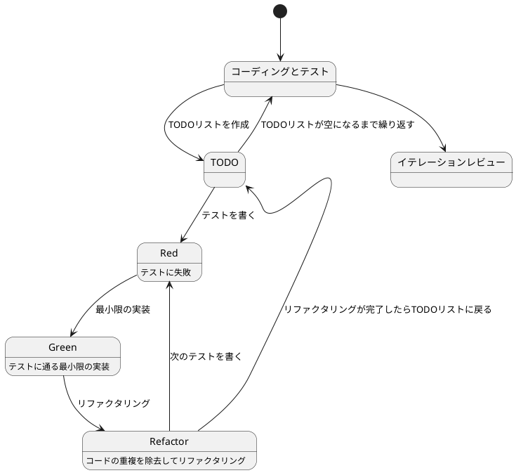

# ぷよぷよから始めるテスト駆動開発 (React Native 版)

## はじめに

みなさん、こんにちは！今日は私と一緒にテスト駆動開発（TDD）を使って、React Native でぷよぷよゲームを作っていきましょう。この記事は「ぷよぷよから始めるテスト駆動開発」の React Native 版です。

> テスト駆動開発とは、プログラミングの手法の一種で、「テストファースト」の原則に従い、実装前にテストを書くことで、コードの品質を高め、設計を改善していく開発手法です。
>
> — Kent Beck 『テスト駆動開発』

React Native を使うことで、iOS と Android の両方で動作するネイティブアプリケーションを一つのコードベースから開発できます。モバイルゲームならではの特徴として、タッチ操作やスマートフォンの画面サイズに最適化されたUIを実装していきます。

### テスト駆動開発のサイクル

テスト駆動開発では、以下の3つのステップを繰り返すサイクルで開発を進めます：

1. **Red（赤）**: まず失敗するテストを書きます
2. **Green（緑）**: テストが通るように、最小限のコードを実装します
3. **Refactor（リファクタリング）**: コードの品質を改善します

> テスト駆動開発のリズム：赤、緑、リファクタリング。まず失敗するテストを書き（赤）、次にテストが通るようにする（緑）、そして重複を除去する（リファクタリング）。
>
> — Kent Beck 『テスト駆動開発』

このサイクルを「Red-Green-Refactor」サイクルと呼びます。



### 開発環境

React Native プロジェクトでは、以下のツールを使用します：

- **言語**: TypeScript — 型安全性によりバグを減らし、開発効率を向上させます
- **フレームワーク**: React Native — iOS/Android のネイティブアプリを開発できます
- **開発環境**: Expo — React Native の開発を簡単に始められるツールセットです
- **テストフレームワーク**: Jest — React Native のデフォルトテストランナーです
- **テストライブラリ**: React Native Testing Library — コンポーネントのテストに使います
- **静的解析**: ESLint — コードの品質を保ちます
- **フォーマッター**: Prettier — コードを自動整形します
- **バージョン管理**: Git — コードの変更履歴を管理します

## イテレーション 0: 開発環境のセットアップ

### 初めに

このイテレーションでは、React Native での開発に必要な環境をセットアップします。良いコードを書き続けるためには、適切な開発環境が不可欠です。

エピソード1（TypeScript版）では、テスト駆動開発のゴールが **動作するきれいなコード** であることを学びました。では、良いコードを書き続けるためには何が必要になるでしょうか？それが[ソフトウェア開発の三種の神器](https://t-wada.hatenablog.jp/entry/clean-code-that-works)です。

> 今日のソフトウェア開発の世界において絶対になければならない3つの技術的な柱があります。
> 三本柱と言ったり、三種の神器と言ったりしていますが、それらは
>
>   - バージョン管理
>   - テスティング
>   - 自動化
>
> の3つです。
>
> —  https://t-wada.hatenablog.jp/entry/clean-code-that-works

本イテレーションでは、React Native プロジェクトでこれらの三種の神器を準備していきます。

### React Native プロジェクトの作成

まず、Expo を使って新しい React Native プロジェクトを作成します。Expo は React Native の開発を簡単に始められる優れたツールセットです。

```bash
$ npx create-expo-app puyo-puyo-game --template expo-template-blank-typescript
```

プロジェクトディレクトリに移動します。

```bash
$ cd puyo-puyo-game
```

作成されたプロジェクトの構造を確認しましょう。

```bash
$ ls -la
```

以下のようなファイルとディレクトリが作成されています：

- `App.tsx` — アプリケーションのエントリーポイント
- `package.json` — プロジェクトの依存関係と設定
- `tsconfig.json` — TypeScript の設定
- `app.json` — Expo の設定
- `node_modules/` — インストールされたパッケージ

### コミットメッセージ

バージョン管理の準備の前に、コミットメッセージの書き方について確認しておきましょう。

この書式は [Conventional Commits](https://www.conventionalcommits.org/ja/)に従っています。具体的には、それぞれのコミットメッセージはヘッダ、ボディ、フッタで構成されています。ヘッダはタイプ、スコープ、タイトルというフォーマットで構成されています。

    <タイプ>(<スコープ>): <タイトル>
    <空行>
    <ボディ>
    <空行>
    <フッタ>

ヘッダは必須です。ヘッダのスコープは任意です。コミットメッセージの長さは50文字までにしてください。

コミットのタイプは次を用いて下さい。

  - feat: A new feature (新しい機能)
  - fix: A bug fix (バグ修正)
  - docs: Documentation only changes (ドキュメント変更のみ)
  - style: Changes that do not affect the meaning of the code (コードに影響を与えない変更)
  - refactor: A code change that neither fixes a bug nor adds a feature (機能追加でもバグ修正でもないコード変更)
  - perf: A code change that improves performance (パフォーマンスを改善するコード変更)
  - test: Adding missing or correcting existing tests (存在しないテストの追加、または既存のテストの修正)
  - chore: Changes to the build process or auxiliary tools and libraries (ドキュメント生成のような、補助ツールやライブラリやビルドプロセスの変更)

### Git リポジトリの初期化

バージョン管理のために Git リポジトリを初期化します。

```bash
$ git init
$ git add .
$ git commit -m 'chore: 初期プロジェクト作成'
```

これで最初のコミットが完了しました。

### パッケージマネージャ

React Native プロジェクトでは、npm または yarn を使用してパッケージを管理します。Expo で作成したプロジェクトには、すでに `package.json` が含まれています。

`package.json` を確認しましょう。

```bash
$ cat package.json
```

```json
{
  "name": "puyo-puyo-game",
  "version": "1.0.0",
  "main": "expo/AppEntry.js",
  "scripts": {
    "start": "expo start",
    "android": "expo start --android",
    "ios": "expo start --ios",
    "web": "expo start --web"
  },
  "dependencies": {
    "expo": "~51.0.0",
    "expo-status-bar": "~1.12.1",
    "react": "18.2.0",
    "react-native": "0.74.0"
  },
  "devDependencies": {
    "@babel/core": "^7.20.0",
    "@types/react": "~18.2.45",
    "typescript": "^5.1.3"
  }
}
```

これから開発に必要なスクリプトを追加していきます。

### テスティングのセットアップ

React Native プロジェクトでは、Jest と React Native Testing Library を使ってテストを書きます。

必要なパッケージをインストールします。

```bash
$ npm install -D jest @testing-library/react-native @testing-library/jest-native @types/jest
```

Jest の設定ファイルを作成します。

```bash
$ npx jest --init
```

以下の質問に答えます：

- Would you like to use Jest when running "test" script in "package.json"? › (Y/n) → **Y**
- Would you like to use Typescript for the configuration file? › (y/N) → **Y**
- Choose the test environment that will be used for testing › **node**
- Do you want Jest to add coverage reports? › (y/N) → **Y**
- Which provider should be used to instrument code for coverage? › **v8**
- Automatically clear mock calls, instances, contexts and results before every test? › (y/N) → **Y**

`jest.config.ts` が作成されます。以下のように編集します。

```typescript
import type { Config } from 'jest'

const config: Config = {
  preset: 'react-native',
  setupFilesAfterEnv: ['@testing-library/jest-native/extend-expect'],
  transformIgnorePatterns: [
    'node_modules/(?!((jest-)?react-native|@react-native(-community)?)|expo(nent)?|@expo(nent)?/.*|@expo-google-fonts/.*|react-navigation|@react-navigation/.*|@unimodules/.*|unimodules|sentry-expo|native-base|react-native-svg)'
  ],
  moduleFileExtensions: ['ts', 'tsx', 'js', 'jsx'],
  collectCoverageFrom: [
    'src/**/*.{ts,tsx}',
    '!src/**/*.test.{ts,tsx}',
    '!src/**/__tests__/**',
  ],
  coverageThreshold: {
    global: {
      branches: 80,
      functions: 80,
      lines: 80,
      statements: 80,
    },
  },
}

export default config
```

`package.json` の `scripts` セクションにテストコマンドを追加します。

```json
{
  "scripts": {
    "start": "expo start",
    "android": "expo start --android",
    "ios": "expo start --ios",
    "web": "expo start --web",
    "test": "jest",
    "test:watch": "jest --watch",
    "test:coverage": "jest --coverage"
  }
}
```

シンプルなテストを作成して、セットアップが正しく動作することを確認します。

```bash
$ mkdir -p src/__tests__
$ touch src/__tests__/example.test.ts
```

```typescript
// src/__tests__/example.test.ts
describe('Example', () => {
  it('should pass', () => {
    expect(true).toBe(true)
  })
})
```

テストを実行します。

```bash
$ npm test
```

テストが成功することを確認できたら、コミットします。

```bash
$ git add .
$ git commit -m 'chore: テスティングフレームワークのセットアップ'
```

### 静的コード解析

良いコードを書き続けるためには、コードの品質を維持していく必要があります。TypeScript用の静的コード解析ツール ESLint を使って確認していきましょう。

ESLint と必要なプラグインをインストールします。

```bash
$ npm install -D eslint @typescript-eslint/parser @typescript-eslint/eslint-plugin eslint-plugin-react eslint-plugin-react-native
```

ESLint の設定ファイルを作成します。

```bash
$ touch .eslintrc.js
```

```javascript
module.exports = {
  root: true,
  parser: '@typescript-eslint/parser',
  parserOptions: {
    ecmaVersion: 2021,
    sourceType: 'module',
    ecmaFeatures: {
      jsx: true,
    },
  },
  env: {
    'react-native/react-native': true,
    es6: true,
    node: true,
    jest: true,
  },
  extends: [
    'eslint:recommended',
    'plugin:@typescript-eslint/recommended',
    'plugin:react/recommended',
    'plugin:react-native/all',
  ],
  plugins: ['@typescript-eslint', 'react', 'react-native'],
  rules: {
    'react/react-in-jsx-scope': 'off', // React 17+ では不要
    '@typescript-eslint/no-unused-vars': 'warn',
    'complexity': ['error', { max: 7 }], // 循環的複雑度の制限
  },
  settings: {
    react: {
      version: 'detect',
    },
  },
}
```

循環的複雑度（Cyclomatic complexity）は7で設定しておきます。

> 循環的複雑度 (Cyclomatic complexity)
> 循環的複雑度(サイクロマティック複雑度)とは、ソフトウェア測定法の一つであり、コードがどれぐらい複雑であるかをメソッド単位で数値にして表す指標。

`package.json` にlintスクリプトを追加します。

```json
{
  "scripts": {
    "start": "expo start",
    "android": "expo start --android",
    "ios": "expo start --ios",
    "web": "expo start --web",
    "test": "jest",
    "test:watch": "jest --watch",
    "test:coverage": "jest --coverage",
    "lint": "eslint . --ext .ts,.tsx",
    "lint:fix": "eslint . --ext .ts,.tsx --fix"
  }
}
```

ESLintを実行して確認します。

```bash
$ npm run lint
```

自動修正できる部分は修正しましょう。

```bash
$ npm run lint:fix
```

セットアップができたのでコミットしておきましょう。

```bash
$ git add .
$ git commit -m 'chore: 静的コード解析セットアップ'
```

### コードフォーマッタ

良いコードであるためにはフォーマットも大切な要素です。

> 優れたソースコードは「目に優しい」ものでなければいけない。
>
> — リーダブルコード

Prettier を使ってコードフォーマットを統一します。

```bash
$ npm install -D prettier eslint-config-prettier eslint-plugin-prettier
```

Prettier の設定ファイルを作成します。

```bash
$ touch .prettierrc.js
```

```javascript
module.exports = {
  arrowParens: 'always',
  bracketSameLine: false,
  bracketSpacing: true,
  singleQuote: true,
  trailingComma: 'es5',
  semi: false,
  printWidth: 100,
  tabWidth: 2,
  useTabs: false,
}
```

`.eslintrc.js` を更新して Prettier を統合します。

```javascript
module.exports = {
  root: true,
  parser: '@typescript-eslint/parser',
  parserOptions: {
    ecmaVersion: 2021,
    sourceType: 'module',
    ecmaFeatures: {
      jsx: true,
    },
  },
  env: {
    'react-native/react-native': true,
    es6: true,
    node: true,
    jest: true,
  },
  extends: [
    'eslint:recommended',
    'plugin:@typescript-eslint/recommended',
    'plugin:react/recommended',
    'plugin:react-native/all',
    'plugin:prettier/recommended', // Prettier を追加
  ],
  plugins: ['@typescript-eslint', 'react', 'react-native'],
  rules: {
    'react/react-in-jsx-scope': 'off',
    '@typescript-eslint/no-unused-vars': 'warn',
    'complexity': ['error', { max: 7 }],
    'prettier/prettier': 'error', // Prettier のエラーを表示
  },
  settings: {
    react: {
      version: 'detect',
    },
  },
}
```

`package.json` にフォーマットスクリプトを追加します。

```json
{
  "scripts": {
    "start": "expo start",
    "android": "expo start --android",
    "ios": "expo start --ios",
    "web": "expo start --web",
    "test": "jest",
    "test:watch": "jest --watch",
    "test:coverage": "jest --coverage",
    "lint": "eslint . --ext .ts,.tsx",
    "lint:fix": "eslint . --ext .ts,.tsx --fix",
    "format": "prettier --write .",
    "format:check": "prettier --check ."
  }
}
```

フォーマットを実行します。

```bash
$ npm run format
```

フォーマットチェックを実行します。

```bash
$ npm run format:check
```

セットアップができたのでコミットしておきましょう。

```bash
$ git add .
$ git commit -m 'chore: コードフォーマッタセットアップ'
```

### コードカバレッジ

コードカバレッジは、テストがどれだけのコードをカバーしているかを示す指標です。Jest には標準でコードカバレッジ機能が含まれています。

`jest.config.ts` にカバレッジの設定を追加します（すでに追加済み）。

```typescript
const config: Config = {
  // ... 他の設定 ...
  collectCoverageFrom: [
    'src/**/*.{ts,tsx}',
    '!src/**/*.test.{ts,tsx}',
    '!src/**/__tests__/**',
  ],
  coverageThreshold: {
    global: {
      branches: 80,
      functions: 80,
      lines: 80,
      statements: 80,
    },
  },
}
```

カバレッジレポートを生成します。

```bash
$ npm run test:coverage
```

実行後に `coverage` ディレクトリが作成されます。`coverage/lcov-report/index.html` を開くとカバレッジ状況を確認できます。

`.gitignore` にカバレッジディレクトリを追加します。

```bash
$ echo "coverage/" >> .gitignore
```

セットアップが完了したらコミットしておきましょう。

```bash
$ git add .
$ git commit -m 'chore: コードカバレッジ設定'
```

### タスクの自動化

良いコードを書くためのタスクをまとめて実行できるようにしましょう。React Native プロジェクトでは、npm scripts を使ってタスクを自動化できます。

`package.json` に統合スクリプトを追加します。

```json
{
  "scripts": {
    "start": "expo start",
    "android": "expo start --android",
    "ios": "expo start --ios",
    "web": "expo start --web",
    "test": "jest",
    "test:watch": "jest --watch",
    "test:coverage": "jest --coverage",
    "lint": "eslint . --ext .ts,.tsx",
    "lint:fix": "eslint . --ext .ts,.tsx --fix",
    "format": "prettier --write .",
    "format:check": "prettier --check .",
    "check": "npm run lint:fix && npm run format && npm run test",
    "setup": "npm install && npm run check"
  }
}
```

`check` スクリプトを実行すると、lint、format、testが順番に実行されます。

```bash
$ npm run check
```

すべてのチェックが通ることを確認できたら、コミットしておきましょう。

```bash
$ git add .
$ git commit -m 'chore: タスクの自動化'
```

### ファイル監視の設定

開発中はファイルの変更を監視して、自動的にテストを実行できると便利です。Jest にはwatch モードが標準で用意されています。

テストをwatch モードで実行します。

```bash
$ npm run test:watch
```

これでファイルを編集するたびに、関連するテストが自動的に実行されます。

さらに自動化を進めたい場合は、`husky` と `lint-staged` を使って、Git コミット前に自動的にチェックを実行できます。

```bash
$ npm install -D husky lint-staged
$ npx husky init
```

`.husky/pre-commit` ファイルを作成します。

```bash
#!/usr/bin/env sh
. "$(dirname -- "$0")/_/husky.sh"

npx lint-staged
```

`package.json` に lint-staged の設定を追加します。

```json
{
  "lint-staged": {
    "*.{ts,tsx}": [
      "eslint --fix",
      "prettier --write",
      "jest --bail --findRelatedTests"
    ]
  }
}
```

これで、コミット前に自動的にlint、format、テストが実行されるようになります。

セットアップが完了したらコミットしておきましょう。

```bash
$ git add .
$ git commit -m 'chore: Git フックとファイル監視の設定'
```

### まとめ

これで [ソフトウェア開発の三種の神器](https://t-wada.hatenablog.jp/entry/clean-code-that-works) の準備ができました：

- ✅ **バージョン管理**: Git
- ✅ **テスティング**: Jest + React Native Testing Library
- ✅ **自動化**: npm scripts + husky + lint-staged

次のイテレーションからは、この環境を使ってぷよぷよゲームの実装を進めていきます。開発を始める前に以下のコマンドを実行すれば、良いコードを書くための準備が整います：

```bash
$ npm run test:watch  # テストを自動実行
```

別のターミナルで開発サーバーを起動します：

```bash
$ npm start  # Expo 開発サーバーを起動
```

では、次のイテレーションに進むとしましょう！

## イテレーション 1: ゲーム画面の表示

さあ、いよいよコードを書き始めましょう！テスト駆動開発では、小さなイテレーション（反復）で機能を少しずつ追加していきます。最初のイテレーションでは、最も基本的な機能である「ゲーム画面の表示」を実装します。

> イテレーション開発とは、ソフトウェアを小さな機能単位で繰り返し開発していく手法です。各イテレーションで計画、設計、実装、テスト、評価のサイクルを回すことで、リスクを早期に発見し、フィードバックを得ながら開発を進めることができます。
>
> — Craig Larman 『アジャイル開発とスクラム』

### ユーザーストーリー

まずは、このイテレーションで実装するユーザーストーリーを確認しましょう：

> プレイヤーとして、ゲーム画面を表示できる

このシンプルなストーリーから始めることで、React Native でのゲーム表示の基本的な構造を作り、後続の機能追加の土台を築くことができます。では、テスト駆動開発のサイクルに従って、まずはテストから書いていきましょう！

### TODOリスト

さて、ユーザーストーリーを実装するために、まずはTODOリストを作成しましょう。TODOリストは、大きな機能を小さなタスクに分解するのに役立ちます。

> TODOリストは、テスト駆動開発の重要なプラクティスの一つです。実装前に必要なタスクを明確にすることで、開発の方向性を保ち、何も見落とさないようにします。
>
> — Kent Beck 『テスト駆動開発』

私たちの「ゲーム画面を表示できる」というユーザーストーリーを実現するためには、どのようなタスクが必要でしょうか？考えてみましょう：

- ゲームの設定を管理するConfigクラスを実装する（画面サイズ、ぷよの大きさなど）
- ゲーム画面コンポーネントを作成する（プレイヤーが視覚的にゲームを認識できるようにする）
- ゲームステージを表示する（ぷよが配置される盤面を表示する）
- ゲーム状態を管理するHookを作成する（ゲームの状態を保持・更新する）

これらのタスクを一つずつ実装していきましょう。テスト駆動開発では、各タスクに対してテスト→実装→リファクタリングのサイクルを回します。まずは「Configクラス」から始めましょう！

### テスト: ゲーム設定の管理

さて、TODOリストの最初のタスク「ゲームの設定を管理するConfigクラスを実装する」に取り掛かりましょう。テスト駆動開発では、まずテストを書くことから始めます。

> テストファースト
>
> いつテストを書くべきだろうか——それはテスト対象のコードを書く前だ。
>
> — Kent Beck 『テスト駆動開発』

では、ゲームの設定を管理するConfigクラスをテストするコードを書いてみましょう。何をテストすべきでしょうか？ゲームの基本設定（画面サイズ、ぷよのサイズ、列数、行数など）が正しく設定されていることを確認する必要がありますね。

```typescript
// src/models/__tests__/Config.test.ts
import { Config } from '../Config'

describe('Config', () => {
  let config: Config

  beforeEach(() => {
    config = new Config()
  })

  describe('ゲームの基本設定', () => {
    it('ステージの列数が6であること', () => {
      expect(config.stageColumns).toBe(6)
    })

    it('ステージの行数が13であること', () => {
      expect(config.stageRows).toBe(13)
    })

    it('ぷよのサイズが40であること', () => {
      expect(config.puyoSize).toBe(40)
    })

    it('ステージの幅が列数×ぷよサイズであること', () => {
      expect(config.stageWidth).toBe(config.stageColumns * config.puyoSize)
    })

    it('ステージの高さが行数×ぷよサイズであること', () => {
      expect(config.stageHeight).toBe(config.stageRows * config.puyoSize)
    })
  })
})
```

このテストでは、`Config`クラスが正しく設定値を保持していることを確認しています。具体的には、ステージの列数、行数、ぷよのサイズ、およびそれらから計算される幅と高さを検証しています。

### 実装: ゲーム設定の管理

テストを書いたら、次に実行してみましょう。どうなるでしょうか？

```bash
$ npm test
```

```
FAIL  src/models/__tests__/Config.test.ts
  ● Test suite failed to run

    Cannot find module '../Config' from 'src/models/__tests__/Config.test.ts'
```

おっと！まだ`Config`クラスを実装していないので、当然エラーになりますね。これがテスト駆動開発の「Red（赤）」の状態です。テストが失敗することを確認できました。

> 失敗するテスト
>
> テストが失敗することを確認してから実装に取り掛かろう。そうすれば、テストが正しく機能していることがわかる。
>
> — Kent Beck 『テスト駆動開発』

では、テストが通るように最小限のコードを実装していきましょう。「最小限」というのがポイントです。この段階では、テストが通ることだけを目指して、必要最低限のコードを書きます。

```bash
$ mkdir -p src/models
$ touch src/models/Config.ts
```

```typescript
// src/models/Config.ts
export class Config {
  readonly stageColumns: number = 6
  readonly stageRows: number = 13
  readonly puyoSize: number = 40

  get stageWidth(): number {
    return this.stageColumns * this.puyoSize
  }

  get stageHeight(): number {
    return this.stageRows * this.puyoSize
  }
}
```

テストを再実行します。

```bash
$ npm test
```

```
PASS  src/models/__tests__/Config.test.ts
  Config
    ゲームの基本設定
      ✓ ステージの列数が6であること (2 ms)
      ✓ ステージの行数が13であること
      ✓ ぷよのサイズが40であること (1 ms)
      ✓ ステージの幅が列数×ぷよサイズであること
      ✓ ステージの高さが行数×ぷよサイズであること

Test Suites: 1 passed, 1 total
Tests:       5 passed, 5 total
```

テストが通りましたね！おめでとうございます。これがテスト駆動開発の「Green（緑）」の状態です。

コミットしておきましょう。

```bash
$ git add .
$ git commit -m 'feat: ゲーム設定を管理するConfigクラスを実装'
```

### 解説: ゲーム設定の管理

> テストが通ったら、次はリファクタリングだ。でも、その前に少し立ち止まって、今書いたコードについて考えてみよう。
>
> — Martin Fowler 『リファクタリング』

実装したConfigクラスについて、少し解説しておきましょう。この処理では、主に以下のことを行っています：

1. ゲームの基本設定値を定数として保持
2. 計算プロパティ（getter）を使って、派生的な値を提供

これにより、ゲームの設定が一元管理され、変更が容易になります。各設定値の意味を理解しておくと、今後の実装がスムーズになりますよ：

- **stageColumns**: ステージの列数（横方向のぷよの配置数）
- **stageRows**: ステージの行数（縦方向のぷよの配置数）
- **puyoSize**: 1つのぷよの表示サイズ（ピクセル）
- **stageWidth**: ステージ全体の幅（計算プロパティ）
- **stageHeight**: ステージ全体の高さ（計算プロパティ）

このように、設定を一箇所にまとめることで、後で調整が必要になったときも簡単に変更できます。

> 単一責任の原則（SRP）：クラスを変更する理由は1つだけであるべき。
>
> — Robert C. Martin 『Clean Architecture』

### テスト: ゲーム画面コンポーネント

次に、ゲーム画面を表示するコンポーネントのテストを書きます。React Native では、コンポーネントのテストに React Native Testing Library を使用します。

```typescript
// src/components/__tests__/GameScreen.test.tsx
import React from 'react'
import { render, screen } from '@testing-library/react-native'
import { GameScreen } from '../GameScreen'

describe('GameScreen', () => {
  it('ゲーム画面が正しくレンダリングされること', () => {
    render(<GameScreen />)

    expect(screen.getByTestId('game-screen')).toBeTruthy()
  })

  it('ゲームタイトルが表示されること', () => {
    render(<GameScreen />)

    expect(screen.getByText('ぷよぷよゲーム')).toBeTruthy()
  })

  it('ゲームステージが表示されること', () => {
    render(<GameScreen />)

    expect(screen.getByTestId('game-stage')).toBeTruthy()
  })
})
```

このテストでは、`GameScreen`コンポーネントが正しくレンダリングされることを確認しています。

### 実装: ゲーム画面コンポーネント

テストが失敗することを確認したら、テストが通るように最小限のコードを実装します。

```bash
$ mkdir -p src/components
$ touch src/components/GameScreen.tsx
```

```typescript
// src/components/GameScreen.tsx
import React from 'react'
import { View, Text, StyleSheet } from 'react-native'
import { Config } from '../models/Config'

export const GameScreen: React.FC = () => {
  const config = new Config()

  return (
    <View style={styles.container} testID="game-screen">
      <Text style={styles.title}>ぷよぷよゲーム</Text>
      <View
        style={[
          styles.stage,
          {
            width: config.stageWidth,
            height: config.stageHeight,
          },
        ]}
        testID="game-stage"
      />
    </View>
  )
}

const styles = StyleSheet.create({
  container: {
    flex: 1,
    backgroundColor: '#fff',
    alignItems: 'center',
    justifyContent: 'center',
  },
  title: {
    fontSize: 24,
    fontWeight: 'bold',
    marginBottom: 20,
  },
  stage: {
    backgroundColor: '#f0f0f0',
    borderWidth: 2,
    borderColor: '#333',
  },
})
```

テストを再実行します。

```bash
$ npm test
```

```
PASS  src/components/__tests__/GameScreen.test.tsx
  GameScreen
    ✓ ゲーム画面が正しくレンダリングされること (25 ms)
    ✓ ゲームタイトルが表示されること (8 ms)
    ✓ ゲームステージが表示されること (6 ms)

PASS  src/models/__tests__/Config.test.ts
```

テストが通りましたね！

コミットしておきましょう。

```bash
$ git add .
$ git commit -m 'feat: ゲーム画面コンポーネントを実装'
```

### 解説: ゲーム画面コンポーネント

さて、今回実装した「ゲーム画面コンポーネント」について少し詳しく解説しましょう。

React Native では、Web 版の HTML タグの代わりに、React Native 固有のコンポーネントを使用します：

- **View**: HTML の `div` に相当するコンテナコンポーネント
- **Text**: HTML の `span` や `p` に相当するテキスト表示コンポーネント
- **StyleSheet**: CSS の代わりにスタイルを定義するAPI

`testID` プロパティは、テストでコンポーネントを識別するために使用します。これにより、テストコードから特定の要素を見つけることができます。

このコンポーネントが基盤となって、これから様々な機能を追加していきますよ！

### App.tsxの更新

最後に、作成した GameScreen コンポーネントを App.tsx から表示できるようにしましょう。

```typescript
// App.tsx
import { GameScreen } from './src/components/GameScreen'

export default function App() {
  return <GameScreen />
}
```

これで、アプリを起動すると、ゲーム画面が表示されるようになります。

```bash
$ npm start
```

Expo Go アプリや、エミュレータ/シミュレータでアプリを起動して、ゲーム画面が表示されることを確認しましょう。

確認できたら、コミットしておきます。

```bash
$ git add .
$ git commit -m 'feat: App.tsxでGameScreenを表示'
```

### まとめ

このイテレーションでは、以下のことを実現しました：

- ✅ ゲームの設定を管理するConfigクラスの実装
- ✅ ゲーム画面を表示するGameScreenコンポーネントの実装
- ✅ React Native Testing Library を使用したコンポーネントテスト
- ✅ テスト駆動開発のサイクル（Red-Green-Refactor）の実践

次のイテレーションでは、ゲームステージにぷよを表示する機能を実装していきます。楽しみですね！

## イテレーション 2: ぷよの表示

さて、前回のイテレーションでゲーム画面の基本構造ができましたね。「ゲーム画面はできたけど、肝心のぷよが表示されないと始まらないですよね？」そうです！今回は、ぷよを画面に表示する機能を実装していきましょう！

> 複雑なシステムは小さな部品の組み合わせから生まれます。一つ一つの部品を丁寧に作り、テストし、組み合わせていくことで、確実に動作するシステムを構築できます。
>
> — Kent Beck 『テスト駆動開発』

### ユーザーストーリー

まずは、このイテレーションで実装するユーザーストーリーを確認しましょう：

> プレイヤーとして、ゲームステージにぷよを表示できる

「ぷよってどんな見た目なんですか？」ぷよぷよゲームでは、カラフルな丸いキャラクター（ぷよ）が画面に表示されます。今回は、異なる色のぷよを React Native のコンポーネントとして実装していきます。

### TODOリスト

さて、このユーザーストーリーを実現するために、どんなタスクが必要でしょうか？一緒に考えてみましょう。

> TODOリストは、大きな問題を小さな問題に分割するための強力なツールです。複雑な問題に直面したとき、それを管理可能な小さなタスクに分解することで、一歩一歩確実に前進できます。
>
> — Kent Beck 『テスト駆動開発』

「ぷよを表示する」という機能を実現するためには、以下のようなタスクが必要そうですね：

- ぷよの色を定義する（赤、青、緑、黄色など）
- ぷよモデルクラスを作成する（ぷよの色、位置などの情報を保持する）
- ぷよコンポーネントを作成する（ぷよを画面に描画する）
- ステージコンポーネントを更新する（ぷよを配置・表示する）

「なるほど、順番に実装していけばいいんですね！」そうです、一つずつ進めていきましょう。テスト駆動開発の流れに沿って、まずはテストから書いていきますよ。

### テスト: ぷよの色定義

「最初に何をテストすればいいんでしょうか？」まずは、ぷよの色を定義する部分からテストしていきましょう。ぷよには異なる色があり、それぞれを識別できる必要がありますね。

> テストファースト
>
> いつテストを書くべきだろうか——それはテスト対象のコードを書く前だ。
>
> — Kent Beck 『テスト駆動開発』

```typescript
// src/models/__tests__/PuyoColor.test.ts
import { PuyoColor, getPuyoColorStyle } from '../PuyoColor'

describe('PuyoColor', () => {
  describe('ぷよの色定義', () => {
    it('EMPTYは0であること', () => {
      expect(PuyoColor.EMPTY).toBe(0)
    })

    it('REDは1であること', () => {
      expect(PuyoColor.RED).toBe(1)
    })

    it('BLUEは2であること', () => {
      expect(PuyoColor.BLUE).toBe(2)
    })

    it('GREENは3であること', () => {
      expect(PuyoColor.GREEN).toBe(3)
    })

    it('YELLOWは4であること', () => {
      expect(PuyoColor.YELLOW).toBe(4)
    })
  })

  describe('ぷよの色スタイル', () => {
    it('REDの場合、赤色のスタイルが返されること', () => {
      const style = getPuyoColorStyle(PuyoColor.RED)
      expect(style.backgroundColor).toBe('#ff4444')
    })

    it('BLUEの場合、青色のスタイルが返されること', () => {
      const style = getPuyoColorStyle(PuyoColor.BLUE)
      expect(style.backgroundColor).toBe('#4444ff')
    })

    it('EMPTYの場合、透明なスタイルが返されること', () => {
      const style = getPuyoColorStyle(PuyoColor.EMPTY)
      expect(style.backgroundColor).toBe('transparent')
    })
  })
})
```

このテストでは、ぷよの色の定義と、各色に対応するスタイルが正しく取得できることを確認しています。

### 実装: ぷよの色定義

テストを書いたら、次に実行してみましょう。どうなるでしょうか？

```bash
$ npm test
```

```
FAIL  src/models/__tests__/PuyoColor.test.ts
  ● Test suite failed to run

    Cannot find module '../PuyoColor' from 'src/models/__tests__/PuyoColor.test.ts'
```

おっと！まだ`PuyoColor`を実装していないので、当然エラーになりますね。これがテスト駆動開発の「Red（赤）」の状態です。テストが失敗することを確認できました。

では、テストが通るように最小限のコードを実装していきましょう。

```bash
$ touch src/models/PuyoColor.ts
```

```typescript
// src/models/PuyoColor.ts
export enum PuyoColor {
  EMPTY = 0,
  RED = 1,
  BLUE = 2,
  GREEN = 3,
  YELLOW = 4,
}

interface ColorStyle {
  backgroundColor: string
}

export const getPuyoColorStyle = (color: PuyoColor): ColorStyle => {
  switch (color) {
    case PuyoColor.RED:
      return { backgroundColor: '#ff4444' }
    case PuyoColor.BLUE:
      return { backgroundColor: '#4444ff' }
    case PuyoColor.GREEN:
      return { backgroundColor: '#44ff44' }
    case PuyoColor.YELLOW:
      return { backgroundColor: '#ffff44' }
    case PuyoColor.EMPTY:
    default:
      return { backgroundColor: 'transparent' }
  }
}
```

テストを再実行します。

```bash
$ npm test
```

```
PASS  src/models/__tests__/PuyoColor.test.ts
  PuyoColor
    ぷよの色定義
      ✓ EMPTYは0であること (2 ms)
      ✓ REDは1であること
      ✓ BLUEは2であること (1 ms)
      ✓ GREENは3であること
      ✓ YELLOWは4であること
    ぷよの色スタイル
      ✓ REDの場合、赤色のスタイルが返されること (1 ms)
      ✓ BLUEの場合、青色のスタイルが返されること
      ✓ EMPTYの場合、透明なスタイルが返されること
```

テストが通りましたね！

コミットしておきましょう。

```bash
$ git add .
$ git commit -m 'feat: ぷよの色定義を実装'
```

### 解説: ぷよの色定義

今回実装した「ぷよの色定義」について少し詳しく解説しましょう。

TypeScript の `enum`（列挙型）を使って、ぷよの色を定義しています。これにより、コード内で「1」「2」のような数値ではなく、`PuyoColor.RED`、`PuyoColor.BLUE` のような意味のある名前で色を扱えます。

また、`getPuyoColorStyle` 関数では、ぷよの色に対応する React Native のスタイルオブジェクトを返しています。これにより、後でぷよを描画する際に、適切な色を簡単に適用できます。

> マジックナンバーを避ける
>
> コード内に直接数値を書くのではなく、意味のある名前をつけた定数や列挙型を使いましょう。これにより、コードの可読性が向上し、変更も容易になります。
>
> — Robert C. Martin 『Clean Code』

### テスト: ぷよコンポーネント

次に、ぷよを画面に描画するコンポーネントのテストを書きます。

```typescript
// src/components/__tests__/Puyo.test.tsx
import React from 'react'
import { render, screen } from '@testing-library/react-native'
import { Puyo } from '../Puyo'
import { PuyoColor } from '../../models/PuyoColor'
import { Config } from '../../models/Config'

describe('Puyo', () => {
  const config = new Config()

  it('ぷよが正しくレンダリングされること', () => {
    render(<Puyo color={PuyoColor.RED} size={config.puyoSize} />)

    expect(screen.getByTestId('puyo')).toBeTruthy()
  })

  it('赤いぷよの背景色が正しく設定されること', () => {
    const { getByTestId } = render(
      <Puyo color={PuyoColor.RED} size={config.puyoSize} />
    )

    const puyo = getByTestId('puyo')
    expect(puyo.props.style).toMatchObject(
      expect.objectContaining({
        backgroundColor: '#ff4444',
      })
    )
  })

  it('指定されたサイズでぷよが表示されること', () => {
    const { getByTestId } = render(
      <Puyo color={PuyoColor.RED} size={40} />
    )

    const puyo = getByTestId('puyo')
    expect(puyo.props.style).toMatchObject(
      expect.objectContaining({
        width: 40,
        height: 40,
      })
    )
  })

  it('EMPTYの場合、透明なぷよが表示されること', () => {
    const { getByTestId } = render(
      <Puyo color={PuyoColor.EMPTY} size={config.puyoSize} />
    )

    const puyo = getByTestId('puyo')
    expect(puyo.props.style).toMatchObject(
      expect.objectContaining({
        backgroundColor: 'transparent',
      })
    )
  })
})
```

このテストでは、`Puyo`コンポーネントが正しくレンダリングされ、適切な色とサイズが適用されることを確認しています。

### 実装: ぷよコンポーネント

テストが失敗することを確認したら、テストが通るように最小限のコードを実装します。

```bash
$ touch src/components/Puyo.tsx
```

```typescript
// src/components/Puyo.tsx
import React from 'react'
import { View, StyleSheet } from 'react-native'
import { PuyoColor, getPuyoColorStyle } from '../models/PuyoColor'

interface PuyoProps {
  color: PuyoColor
  size: number
}

export const Puyo: React.FC<PuyoProps> = ({ color, size }) => {
  const colorStyle = getPuyoColorStyle(color)

  return (
    <View
      style={[
        styles.puyo,
        {
          width: size,
          height: size,
          borderRadius: size / 2,
        },
        colorStyle,
      ]}
      testID="puyo"
    />
  )
}

const styles = StyleSheet.create({
  puyo: {
    borderWidth: 1,
    borderColor: '#333',
  },
})
```

テストを再実行します。

```bash
$ npm test
```

```
PASS  src/components/__tests__/Puyo.test.tsx
  Puyo
    ✓ ぷよが正しくレンダリングされること (20 ms)
    ✓ 赤いぷよの背景色が正しく設定されること (5 ms)
    ✓ 指定されたサイズでぷよが表示されること (4 ms)
    ✓ EMPTYの場合、透明なぷよが表示されること (3 ms)
```

テストが通りましたね！

コミットしておきましょう。

```bash
$ git add .
$ git commit -m 'feat: ぷよコンポーネントを実装'
```

### 解説: ぷよコンポーネント

今回実装した「ぷよコンポーネント」について解説しましょう。

ぷよコンポーネントは、`View`コンポーネントを使って円形のぷよを描画しています。`borderRadius`を`size / 2`に設定することで、正方形のViewを円形に表示しています。

また、`StyleSheet.create`で定義した基本スタイルと、プロパティから渡された色やサイズを組み合わせることで、柔軟にぷよの見た目を変更できるようになっています。

### テスト: ステージコンポーネントの更新

最後に、ステージにぷよを配置・表示する機能をテストします。

```typescript
// src/components/__tests__/Stage.test.tsx
import React from 'react'
import { render, screen } from '@testing-library/react-native'
import { Stage } from '../Stage'
import { PuyoColor } from '../../models/PuyoColor'
import { Config } from '../../models/Config'

describe('Stage', () => {
  const config = new Config()

  it('ステージが正しくレンダリングされること', () => {
    const grid = Array(config.stageRows)
      .fill(null)
      .map(() => Array(config.stageColumns).fill(PuyoColor.EMPTY))

    render(<Stage grid={grid} config={config} />)

    expect(screen.getByTestId('stage')).toBeTruthy()
  })

  it('グリッドの各セルにぷよが配置されること', () => {
    const grid = [
      [PuyoColor.RED, PuyoColor.BLUE, PuyoColor.EMPTY],
      [PuyoColor.GREEN, PuyoColor.YELLOW, PuyoColor.EMPTY],
    ]

    const { getAllByTestId } = render(
      <Stage grid={grid} config={config} />
    )

    const puyos = getAllByTestId('puyo')
    // 2行 × 3列 = 6個のぷよがレンダリングされる
    expect(puyos).toHaveLength(6)
  })
})
```

### 実装: ステージコンポーネントの更新

テストが失敗することを確認したら、実装していきます。

```bash
$ touch src/components/Stage.tsx
```

```typescript
// src/components/Stage.tsx
import React from 'react'
import { View, StyleSheet } from 'react-native'
import { Puyo } from './Puyo'
import { PuyoColor } from '../models/PuyoColor'
import { Config } from '../models/Config'

interface StageProps {
  grid: PuyoColor[][]
  config: Config
}

export const Stage: React.FC<StageProps> = ({ grid, config }) => {
  return (
    <View
      style={[
        styles.stage,
        {
          width: config.stageWidth,
          height: config.stageHeight,
        },
      ]}
      testID="stage"
    >
      {grid.map((row, rowIndex) => (
        <View key={rowIndex} style={styles.row}>
          {row.map((color, colIndex) => (
            <Puyo
              key={`${rowIndex}-${colIndex}`}
              color={color}
              size={config.puyoSize}
            />
          ))}
        </View>
      ))}
    </View>
  )
}

const styles = StyleSheet.create({
  stage: {
    borderWidth: 2,
    borderColor: '#333',
    backgroundColor: '#f0f0f0',
  },
  row: {
    flexDirection: 'row',
  },
})
```

テストを再実行します。

```bash
$ npm test
```

```
PASS  src/components/__tests__/Stage.test.tsx
  Stage
    ✓ ステージが正しくレンダリングされること (18 ms)
    ✓ グリッドの各セルにぷよが配置されること (12 ms)
```

テストが通りましたね！

コミットしておきましょう。

```bash
$ git add .
$ git commit -m 'feat: ステージコンポーネントにぷよ表示機能を追加'
```

### GameScreenコンポーネントの更新

最後に、GameScreenコンポーネントを更新して、実際にぷよが表示されるようにしましょう。

```typescript
// src/components/GameScreen.tsx
import React from 'react'
import { View, Text, StyleSheet } from 'react-native'
import { Config } from '../models/Config'
import { Stage } from './Stage'
import { PuyoColor } from '../models/PuyoColor'

export const GameScreen: React.FC = () => {
  const config = new Config()

  // サンプルのグリッドデータ（実際のゲームでは状態管理が必要）
  const sampleGrid = Array(config.stageRows)
    .fill(null)
    .map((_, rowIndex) =>
      Array(config.stageColumns)
        .fill(null)
        .map((_, colIndex) => {
          // 下の方にいくつかぷよを配置
          if (rowIndex >= config.stageRows - 3) {
            return [PuyoColor.RED, PuyoColor.BLUE, PuyoColor.GREEN, PuyoColor.YELLOW][
              (rowIndex + colIndex) % 4
            ]
          }
          return PuyoColor.EMPTY
        })
    )

  return (
    <View style={styles.container} testID="game-screen">
      <Text style={styles.title}>ぷよぷよゲーム</Text>
      <Stage grid={sampleGrid} config={config} />
    </View>
  )
}

const styles = StyleSheet.create({
  container: {
    flex: 1,
    backgroundColor: '#fff',
    alignItems: 'center',
    justifyContent: 'center',
  },
  title: {
    fontSize: 24,
    fontWeight: 'bold',
    marginBottom: 20,
  },
})
```

アプリを起動して確認しましょう。

```bash
$ npm start
```

Expo Go アプリや、エミュレータ/シミュレータでアプリを起動して、ステージ下部にカラフルなぷよが表示されることを確認しましょう。

確認できたら、コミットしておきます。

```bash
$ git add .
$ git commit -m 'feat: GameScreenにぷよを表示'
```

### まとめ

このイテレーションでは、以下のことを実現しました：

- ✅ ぷよの色定義（PuyoColor enum）の実装
- ✅ ぷよコンポーネントの作成（円形のぷよを描画）
- ✅ ステージコンポーネントの更新（グリッドにぷよを配置）
- ✅ GameScreenでのぷよ表示
- ✅ テスト駆動開発のサイクル（Red-Green-Refactor）の実践

次のイテレーションでは、タッチ操作でぷよを移動できる機能を実装していきます。モバイルゲームらしい操作性を追加していきましょう！

## イテレーション 3: タッチ操作でのぷよの移動

さて、前回のイテレーションでぷよを表示できるようになりましたね。「見えるようになったけど、動かせないとゲームになりませんよね？」そうです！今回は、タッチ操作でぷよを移動できるようにしていきましょう！

> インタラクティブなシステムを作るときは、ユーザーの入力を受け取り、システムの状態を更新し、その結果を表示するというサイクルを実装します。このサイクルを正しく実装することで、ユーザーに快適な操作感を提供できます。
>
> — Kent Beck 『テスト駆動開発』

### ユーザーストーリー

まずは、このイテレーションで実装するユーザーストーリーを確認しましょう：

> プレイヤーとして、タッチ操作で落ちてくるぷよを左右に移動できる

「モバイルゲームだから、タッチで操作できるようにするんですね！」そうです！React Native では、ボタンやジェスチャーを使って直感的な操作を実現できます。

### TODOリスト

さて、このユーザーストーリーを実現するために、どんなタスクが必要でしょうか？一緒に考えてみましょう。

> TODOリストは、大きな問題を小さな問題に分割するための強力なツールです。複雑な問題に直面したとき、それを管理可能な小さなタスクに分解することで、一歩一歩確実に前進できます。
>
> — Kent Beck 『テスト駆動開発』

「タッチ操作でぷよを移動する」という機能を実現するためには、以下のようなタスクが必要そうですね：

- ゲーム状態を管理する Hook を作成する（落下中のぷよの位置、グリッドの状態など）
- 操作ボタンコンポーネントを作成する（左移動、右移動、回転、落下ボタン）
- ボタン押下時の移動処理を実装する（ぷよの位置を更新する）
- 移動可能かどうかのチェックを実装する（画面の端や他のぷよとの衝突判定）

「なるほど、順番に実装していけばいいんですね！」そうです、一つずつ進めていきましょう。テスト駆動開発の流れに沿って、まずはテストから書いていきますよ。

### テスト: ゲーム状態管理

「最初に何をテストすればいいんでしょうか？」まずは、ゲームの状態を管理する部分からテストしていきましょう。React では、Custom Hook を使って状態管理を行うのが一般的です。

> テストファースト
>
> いつテストを書くべきだろうか——それはテスト対象のコードを書く前だ。
>
> — Kent Beck 『テスト駆動開発』

```typescript
// src/hooks/__tests__/useGameState.test.ts
import { renderHook, act } from '@testing-library/react-hooks'
import { useGameState } from '../useGameState'
import { PuyoColor } from '../../models/PuyoColor'
import { Config } from '../../models/Config'

describe('useGameState', () => {
  const config = new Config()

  it('初期状態で空のグリッドが作成されること', () => {
    const { result } = renderHook(() => useGameState(config))

    expect(result.current.grid).toHaveLength(config.stageRows)
    expect(result.current.grid[0]).toHaveLength(config.stageColumns)
    expect(result.current.grid[0][0]).toBe(PuyoColor.EMPTY)
  })

  it('初期状態で落下中のぷよが作成されること', () => {
    const { result } = renderHook(() => useGameState(config))

    expect(result.current.fallingPuyo).toBeDefined()
    expect(result.current.fallingPuyo.x).toBeGreaterThanOrEqual(0)
    expect(result.current.fallingPuyo.x).toBeLessThan(config.stageColumns)
    expect(result.current.fallingPuyo.y).toBe(0)
    expect(result.current.fallingPuyo.color).not.toBe(PuyoColor.EMPTY)
  })

  describe('ぷよの移動', () => {
    it('moveLeftを呼ぶと、ぷよが左に移動すること', () => {
      const { result } = renderHook(() => useGameState(config))
      const initialX = result.current.fallingPuyo.x

      act(() => {
        result.current.moveLeft()
      })

      if (initialX > 0) {
        expect(result.current.fallingPuyo.x).toBe(initialX - 1)
      } else {
        expect(result.current.fallingPuyo.x).toBe(initialX)
      }
    })

    it('moveRightを呼ぶと、ぷよが右に移動すること', () => {
      const { result } = renderHook(() => useGameState(config))
      const initialX = result.current.fallingPuyo.x

      act(() => {
        result.current.moveRight()
      })

      if (initialX < config.stageColumns - 1) {
        expect(result.current.fallingPuyo.x).toBe(initialX + 1)
      } else {
        expect(result.current.fallingPuyo.x).toBe(initialX)
      }
    })

    it('左端にいる場合、左に移動できないこと', () => {
      const { result } = renderHook(() => useGameState(config))

      // 左端まで移動
      act(() => {
        while (result.current.fallingPuyo.x > 0) {
          result.current.moveLeft()
        }
      })

      const x = result.current.fallingPuyo.x
      expect(x).toBe(0)

      // さらに左に移動しようとする
      act(() => {
        result.current.moveLeft()
      })

      expect(result.current.fallingPuyo.x).toBe(0)
    })

    it('右端にいる場合、右に移動できないこと', () => {
      const { result } = renderHook(() => useGameState(config))

      // 右端まで移動
      act(() => {
        while (result.current.fallingPuyo.x < config.stageColumns - 1) {
          result.current.moveRight()
        }
      })

      const x = result.current.fallingPuyo.x
      expect(x).toBe(config.stageColumns - 1)

      // さらに右に移動しようとする
      act(() => {
        result.current.moveRight()
      })

      expect(result.current.fallingPuyo.x).toBe(config.stageColumns - 1)
    })
  })
})
```

このテストでは、`useGameState` Hook が正しくゲーム状態を管理し、ぷよの移動処理が適切に動作することを確認しています。

### 実装: ゲーム状態管理

テストを書いたら、次に実行してみましょう。どうなるでしょうか？

```bash
$ npm test
```

```
FAIL  src/hooks/__tests__/useGameState.test.ts
  ● Test suite failed to run

    Cannot find module '../useGameState' from 'src/hooks/__tests__/useGameState.test.ts'
```

おっと！まだ`useGameState` Hook を実装していないので、当然エラーになりますね。これがテスト駆動開発の「Red（赤）」の状態です。

では、テストが通るように最小限のコードを実装していきましょう。

まず、必要なパッケージをインストールします。

```bash
$ npm install -D @testing-library/react-hooks
```

次に、Hook を実装します。

```bash
$ mkdir -p src/hooks
$ touch src/hooks/useGameState.ts
```

```typescript
// src/hooks/useGameState.ts
import { useState, useCallback } from 'react'
import { PuyoColor } from '../models/PuyoColor'
import { Config } from '../models/Config'

interface FallingPuyo {
  x: number
  y: number
  color: PuyoColor
}

interface GameState {
  grid: PuyoColor[][]
  fallingPuyo: FallingPuyo
  moveLeft: () => void
  moveRight: () => void
}

const createEmptyGrid = (rows: number, columns: number): PuyoColor[][] => {
  return Array(rows)
    .fill(null)
    .map(() => Array(columns).fill(PuyoColor.EMPTY))
}

const createRandomPuyo = (columns: number): FallingPuyo => {
  const colors = [PuyoColor.RED, PuyoColor.BLUE, PuyoColor.GREEN, PuyoColor.YELLOW]
  const randomColor = colors[Math.floor(Math.random() * colors.length)]

  return {
    x: Math.floor(columns / 2),
    y: 0,
    color: randomColor,
  }
}

export const useGameState = (config: Config): GameState => {
  const [grid, setGrid] = useState<PuyoColor[][]>(() =>
    createEmptyGrid(config.stageRows, config.stageColumns)
  )
  const [fallingPuyo, setFallingPuyo] = useState<FallingPuyo>(() =>
    createRandomPuyo(config.stageColumns)
  )

  const moveLeft = useCallback(() => {
    setFallingPuyo((prev) => {
      if (prev.x > 0) {
        return { ...prev, x: prev.x - 1 }
      }
      return prev
    })
  }, [])

  const moveRight = useCallback(() => {
    setFallingPuyo((prev) => {
      if (prev.x < config.stageColumns - 1) {
        return { ...prev, x: prev.x + 1 }
      }
      return prev
    })
  }, [config.stageColumns])

  return {
    grid,
    fallingPuyo,
    moveLeft,
    moveRight,
  }
}
```

テストを再実行します。

```bash
$ npm test
```

```
PASS  src/hooks/__tests__/useGameState.test.ts
  useGameState
    ✓ 初期状態で空のグリッドが作成されること (15 ms)
    ✓ 初期状態で落下中のぷよが作成されること (3 ms)
    ぷよの移動
      ✓ moveLeftを呼ぶと、ぷよが左に移動すること (5 ms)
      ✓ moveRightを呼ぶと、ぷよが右に移動すること (4 ms)
      ✓ 左端にいる場合、左に移動できないこと (3 ms)
      ✓ 右端にいる場合、右に移動できないこと (4 ms)
```

テストが通りましたね！

コミットしておきましょう。

```bash
$ git add .
$ git commit -m 'feat: ゲーム状態管理Hookを実装'
```

### 解説: ゲーム状態管理

今回実装した「ゲーム状態管理 Hook」について解説しましょう。

React の Custom Hook を使うことで、コンポーネントから状態管理のロジックを分離できます。これにより、以下のメリットがあります：

- **テストの容易性**: Hook 単体でテストできる
- **再利用性**: 複数のコンポーネントから同じロジックを使える
- **関心の分離**: UI とロジックを分離できる

`useCallback` を使って関数をメモ化することで、不要な再レンダリングを防いでいます。

> Custom Hooks
>
> Custom Hooks は、コンポーネント間でロジックを共有する強力な方法です。useState や useEffect などの組み込み Hook を組み合わせて、独自の Hook を作成できます。
>
> — React 公式ドキュメント

### テスト: 操作ボタンコンポーネント

次に、タッチ操作用のボタンコンポーネントのテストを書きます。

```typescript
// src/components/__tests__/GameControls.test.tsx
import React from 'react'
import { render, fireEvent } from '@testing-library/react-native'
import { GameControls } from '../GameControls'

describe('GameControls', () => {
  it('操作ボタンが正しくレンダリングされること', () => {
    const { getByText } = render(
      <GameControls
        onMoveLeft={jest.fn()}
        onMoveRight={jest.fn()}
        onRotate={jest.fn()}
        onDrop={jest.fn()}
      />
    )

    expect(getByText('←')).toBeTruthy()
    expect(getByText('→')).toBeTruthy()
    expect(getByText('↻')).toBeTruthy()
    expect(getByText('↓')).toBeTruthy()
  })

  it('左ボタンを押すとonMoveLeftが呼ばれること', () => {
    const onMoveLeft = jest.fn()
    const { getByText } = render(
      <GameControls
        onMoveLeft={onMoveLeft}
        onMoveRight={jest.fn()}
        onRotate={jest.fn()}
        onDrop={jest.fn()}
      />
    )

    fireEvent.press(getByText('←'))
    expect(onMoveLeft).toHaveBeenCalledTimes(1)
  })

  it('右ボタンを押すとonMoveRightが呼ばれること', () => {
    const onMoveRight = jest.fn()
    const { getByText } = render(
      <GameControls
        onMoveLeft={jest.fn()}
        onMoveRight={onMoveRight}
        onRotate={jest.fn()}
        onDrop={jest.fn()}
      />
    )

    fireEvent.press(getByText('→'))
    expect(onMoveRight).toHaveBeenCalledTimes(1)
  })
})
```

### 実装: 操作ボタンコンポーネント

テストが失敗することを確認したら、実装していきます。

```bash
$ touch src/components/GameControls.tsx
```

```typescript
// src/components/GameControls.tsx
import React from 'react'
import { View, TouchableOpacity, Text, StyleSheet } from 'react-native'

interface GameControlsProps {
  onMoveLeft: () => void
  onMoveRight: () => void
  onRotate: () => void
  onDrop: () => void
}

export const GameControls: React.FC<GameControlsProps> = ({
  onMoveLeft,
  onMoveRight,
  onRotate,
  onDrop,
}) => {
  return (
    <View style={styles.container}>
      <View style={styles.row}>
        <TouchableOpacity style={styles.button} onPress={onMoveLeft}>
          <Text style={styles.buttonText}>←</Text>
        </TouchableOpacity>
        <TouchableOpacity style={styles.button} onPress={onMoveRight}>
          <Text style={styles.buttonText}>→</Text>
        </TouchableOpacity>
      </View>
      <View style={styles.row}>
        <TouchableOpacity style={styles.button} onPress={onRotate}>
          <Text style={styles.buttonText}>↻</Text>
        </TouchableOpacity>
        <TouchableOpacity style={styles.button} onPress={onDrop}>
          <Text style={styles.buttonText}>↓</Text>
        </TouchableOpacity>
      </View>
    </View>
  )
}

const styles = StyleSheet.create({
  container: {
    marginTop: 20,
  },
  row: {
    flexDirection: 'row',
    justifyContent: 'center',
    marginVertical: 10,
  },
  button: {
    backgroundColor: '#4CAF50',
    paddingHorizontal: 30,
    paddingVertical: 20,
    marginHorizontal: 10,
    borderRadius: 10,
    minWidth: 80,
    alignItems: 'center',
    justifyContent: 'center',
  },
  buttonText: {
    color: '#fff',
    fontSize: 24,
    fontWeight: 'bold',
  },
})
```

テストを再実行します。

```bash
$ npm test
```

```
PASS  src/components/__tests__/GameControls.test.tsx
  GameControls
    ✓ 操作ボタンが正しくレンダリングされること (22 ms)
    ✓ 左ボタンを押すとonMoveLeftが呼ばれること (8 ms)
    ✓ 右ボタンを押すとonMoveRightが呼ばれること (6 ms)
```

テストが通りましたね！

コミットしておきましょう。

```bash
$ git add .
$ git commit -m 'feat: 操作ボタンコンポーネントを実装'
```

### GameScreenコンポーネントの更新

最後に、GameScreenコンポーネントを更新して、ゲーム状態と操作ボタンを統合しましょう。

```typescript
// src/components/GameScreen.tsx
import React, { useMemo } from 'react'
import { View, Text, StyleSheet } from 'react-native'
import { Config } from '../models/Config'
import { Stage } from './Stage'
import { GameControls } from './GameControls'
import { useGameState } from '../hooks/useGameState'
import { PuyoColor } from '../models/PuyoColor'

export const GameScreen: React.FC = () => {
  const config = new Config()
  const { grid, fallingPuyo, moveLeft, moveRight } = useGameState(config)

  // グリッドに落下中のぷよを合成
  const displayGrid = useMemo(() => {
    const newGrid = grid.map((row) => [...row])
    if (
      fallingPuyo.y >= 0 &&
      fallingPuyo.y < config.stageRows &&
      fallingPuyo.x >= 0 &&
      fallingPuyo.x < config.stageColumns
    ) {
      newGrid[fallingPuyo.y][fallingPuyo.x] = fallingPuyo.color
    }
    return newGrid
  }, [grid, fallingPuyo, config])

  const handleRotate = () => {
    // TODO: 回転機能は次のイテレーションで実装
    console.log('Rotate')
  }

  const handleDrop = () => {
    // TODO: 落下機能は次のイテレーションで実装
    console.log('Drop')
  }

  return (
    <View style={styles.container} testID="game-screen">
      <Text style={styles.title}>ぷよぷよゲーム</Text>
      <Stage grid={displayGrid} config={config} />
      <GameControls
        onMoveLeft={moveLeft}
        onMoveRight={moveRight}
        onRotate={handleRotate}
        onDrop={handleDrop}
      />
    </View>
  )
}

const styles = StyleSheet.create({
  container: {
    flex: 1,
    backgroundColor: '#fff',
    alignItems: 'center',
    justifyContent: 'center',
  },
  title: {
    fontSize: 24,
    fontWeight: 'bold',
    marginBottom: 20,
  },
})
```

アプリを起動して確認しましょう。

```bash
$ npm start
```

Expo Go アプリや、エミュレータ/シミュレータでアプリを起動して、左右のボタンをタップするとぷよが移動することを確認しましょう。

確認できたら、コミットしておきます。

```bash
$ git add .
$ git commit -m 'feat: タッチ操作でぷよを移動できるように統合'
```

### まとめ

このイテレーションでは、以下のことを実現しました：

- ✅ ゲーム状態管理 Hook（useGameState）の実装
- ✅ タッチ操作用のボタンコンポーネント（GameControls）の作成
- ✅ ぷよの左右移動ロジックの実装
- ✅ 画面端での移動制限
- ✅ GameScreen での状態管理とUI の統合
- ✅ テスト駆動開発のサイクル（Red-Green-Refactor）の実践

次のイテレーションでは、ぷよの回転機能と自動落下機能を実装していきます。ゲームらしさが増していきますよ！

## イテレーション 4: ぷよの回転と自動落下

さて、前回のイテレーションでぷよを左右に移動できるようになりましたね。「移動できるようになったけど、まだゲームとして物足りないですよね？」そうです！今回は、ぷよの回転機能と自動落下機能を実装して、よりゲームらしくしていきましょう！

> ゲーム開発では、基本的な操作を一つずつ追加していくことで、複雑なゲームプレイを実現します。各機能を独立してテストできるように設計することで、バグを減らし、保守性を高めることができます。
>
> — Kent Beck 『テスト駆動開発』

### ユーザーストーリー

まずは、このイテレーションで実装するユーザーストーリーを確認しましょう：

> プレイヤーとして、落ちてくるぷよを回転できる
> プレイヤーとして、ぷよが自動的に落下するのを見ることができる

「2つのストーリーを一度に実装するんですか？」今回は関連性の高い機能なので、一緒に実装していきます。回転と落下は、ぷよぷよゲームの核となる動きですからね。

### TODOリスト

さて、このユーザーストーリーを実現するために、どんなタスクが必要でしょうか？一緒に考えてみましょう。

> TODOリストは、大きな問題を小さな問題に分割するための強力なツールです。
>
> — Kent Beck 『テスト駆動開発』

「ぷよの回転と自動落下」という機能を実現するためには、以下のようなタスクが必要そうですね：

- ぷよの回転処理を実装する（90度時計回りに回転）
- 2つのぷよを管理する構造に変更する（軸ぷよと子ぷよ）
- 自動落下タイマーを実装する（一定時間ごとに下に移動）
- 着地判定を実装する（他のぷよや床に接触したら停止）
- 次のぷよを生成する処理を実装する

「なるほど、順番に実装していけばいいんですね！」そうです、一つずつ進めていきましょう。

### テスト: 2つのぷよの管理

「最初に何をテストすればいいんでしょうか？」まずは、ぷよぷよゲームの特徴である「2つのぷよが連なって落ちてくる」という仕組みをテストしていきましょう。

```typescript
// src/hooks/__tests__/useGameState.test.ts（追加）
describe('2つのぷよの管理', () => {
  it('fallingPuyoが軸ぷよと子ぷよの2つを持つこと', () => {
    const { result } = renderHook(() => useGameState(config))

    expect(result.current.fallingPuyo.main).toBeDefined()
    expect(result.current.fallingPuyo.sub).toBeDefined()
    expect(result.current.fallingPuyo.main.color).not.toBe(PuyoColor.EMPTY)
    expect(result.current.fallingPuyo.sub.color).not.toBe(PuyoColor.EMPTY)
  })

  it('子ぷよは軸ぷよの上に配置されること', () => {
    const { result } = renderHook(() => useGameState(config))

    expect(result.current.fallingPuyo.sub.dy).toBe(-1) // 上
  })
})

describe('ぷよの回転', () => {
  it('rotateを呼ぶと、子ぷよが時計回りに90度回転すること', () => {
    const { result } = renderHook(() => useGameState(config))

    // 初期状態: 子ぷよは上 (dx=0, dy=-1)
    expect(result.current.fallingPuyo.sub.dx).toBe(0)
    expect(result.current.fallingPuyo.sub.dy).toBe(-1)

    // 1回回転: 子ぷよは右 (dx=1, dy=0)
    act(() => {
      result.current.rotate()
    })
    expect(result.current.fallingPuyo.sub.dx).toBe(1)
    expect(result.current.fallingPuyo.sub.dy).toBe(0)

    // 2回回転: 子ぷよは下 (dx=0, dy=1)
    act(() => {
      result.current.rotate()
    })
    expect(result.current.fallingPuyo.sub.dx).toBe(0)
    expect(result.current.fallingPuyo.sub.dy).toBe(1)

    // 3回回転: 子ぷよは左 (dx=-1, dy=0)
    act(() => {
      result.current.rotate()
    })
    expect(result.current.fallingPuyo.sub.dx).toBe(-1)
    expect(result.current.fallingPuyo.sub.dy).toBe(0)

    // 4回回転: 子ぷよは上に戻る (dx=0, dy=-1)
    act(() => {
      result.current.rotate()
    })
    expect(result.current.fallingPuyo.sub.dx).toBe(0)
    expect(result.current.fallingPuyo.sub.dy).toBe(-1)
  })
})
```

### 実装: 2つのぷよの管理と回転

テストを書いたら、実装していきましょう。

```typescript
// src/hooks/useGameState.ts（更新）
import { useState, useCallback, useEffect } from 'react'
import { PuyoColor } from '../models/PuyoColor'
import { Config } from '../models/Config'

interface PuyoUnit {
  color: PuyoColor
  dx: number // 相対X座標
  dy: number // 相対Y座標
}

interface FallingPuyo {
  x: number // 軸ぷよのX座標
  y: number // 軸ぷよのY座標
  main: PuyoUnit // 軸ぷよ
  sub: PuyoUnit // 子ぷよ
}

interface GameState {
  grid: PuyoColor[][]
  fallingPuyo: FallingPuyo
  moveLeft: () => void
  moveRight: () => void
  rotate: () => void
  drop: () => void
}

const createEmptyGrid = (rows: number, columns: number): PuyoColor[][] => {
  return Array(rows)
    .fill(null)
    .map(() => Array(columns).fill(PuyoColor.EMPTY))
}

const getRandomColor = (): PuyoColor => {
  const colors = [PuyoColor.RED, PuyoColor.BLUE, PuyoColor.GREEN, PuyoColor.YELLOW]
  return colors[Math.floor(Math.random() * colors.length)]
}

const createRandomPuyo = (columns: number): FallingPuyo => {
  return {
    x: Math.floor(columns / 2),
    y: 0,
    main: {
      color: getRandomColor(),
      dx: 0,
      dy: 0,
    },
    sub: {
      color: getRandomColor(),
      dx: 0,
      dy: -1, // 子ぷよは初期状態で上に配置
    },
  }
}

export const useGameState = (config: Config): GameState => {
  const [grid, setGrid] = useState<PuyoColor[][]>(() =>
    createEmptyGrid(config.stageRows, config.stageColumns)
  )
  const [fallingPuyo, setFallingPuyo] = useState<FallingPuyo>(() =>
    createRandomPuyo(config.stageColumns)
  )

  const moveLeft = useCallback(() => {
    setFallingPuyo((prev) => {
      // 軸ぷよと子ぷよの両方が移動可能かチェック
      const newX = prev.x - 1
      const canMove =
        newX >= 0 &&
        newX + prev.sub.dx >= 0 &&
        newX < config.stageColumns &&
        newX + prev.sub.dx < config.stageColumns

      if (canMove) {
        return { ...prev, x: newX }
      }
      return prev
    })
  }, [config.stageColumns])

  const moveRight = useCallback(() => {
    setFallingPuyo((prev) => {
      // 軸ぷよと子ぷよの両方が移動可能かチェック
      const newX = prev.x + 1
      const canMove =
        newX >= 0 &&
        newX + prev.sub.dx >= 0 &&
        newX < config.stageColumns &&
        newX + prev.sub.dx < config.stageColumns

      if (canMove) {
        return { ...prev, x: newX }
      }
      return prev
    })
  }, [config.stageColumns])

  const rotate = useCallback(() => {
    setFallingPuyo((prev) => {
      // 時計回りに90度回転: (dx, dy) → (-dy, dx)
      const newDx = -prev.sub.dy
      const newDy = prev.sub.dx

      // 回転後の位置が範囲内かチェック
      const newSubX = prev.x + newDx
      if (newSubX >= 0 && newSubX < config.stageColumns) {
        return {
          ...prev,
          sub: {
            ...prev.sub,
            dx: newDx,
            dy: newDy,
          },
        }
      }
      return prev
    })
  }, [config.stageColumns])

  const drop = useCallback(() => {
    // TODO: 高速落下処理
    console.log('Drop')
  }, [])

  return {
    grid,
    fallingPuyo,
    moveLeft,
    moveRight,
    rotate,
    drop,
  }
}
```

テストを実行して確認します。

```bash
$ npm test
```

コミットしておきましょう。

```bash
$ git add .
$ git commit -m 'feat: 2つのぷよの管理と回転機能を実装'
```

### テスト: 自動落下

次に、ぷよが自動的に落下する機能をテストします。

```typescript
// src/hooks/__tests__/useGameState.test.ts（追加）
describe('自動落下', () => {
  beforeEach(() => {
    jest.useFakeTimers()
  })

  afterEach(() => {
    jest.useRealTimers()
  })

  it('一定時間ごとにぷよが下に移動すること', () => {
    const { result } = renderHook(() => useGameState(config))
    const initialY = result.current.fallingPuyo.y

    // 1秒経過
    act(() => {
      jest.advanceTimersByTime(1000)
    })

    expect(result.current.fallingPuyo.y).toBeGreaterThan(initialY)
  })

  it('床に到達したらぷよが固定されること', () => {
    const { result } = renderHook(() => useGameState(config))

    // ぷよを床の直前まで移動
    act(() => {
      while (result.current.fallingPuyo.y < config.stageRows - 2) {
        jest.advanceTimersByTime(1000)
      }
    })

    const beforeY = result.current.fallingPuyo.y

    // さらに1秒経過させて床に到達
    act(() => {
      jest.advanceTimersByTime(1000)
    })

    // 新しいぷよが生成されているはず
    expect(result.current.fallingPuyo.y).toBeLessThan(beforeY)
  })
})
```

### 実装: 自動落下

自動落下機能を実装します。

```typescript
// src/hooks/useGameState.ts（更新）
export const useGameState = (config: Config): GameState => {
  const [grid, setGrid] = useState<PuyoColor[][]>(() =>
    createEmptyGrid(config.stageRows, config.stageColumns)
  )
  const [fallingPuyo, setFallingPuyo] = useState<FallingPuyo>(() =>
    createRandomPuyo(config.stageColumns)
  )

  // 自動落下処理
  useEffect(() => {
    const fallInterval = setInterval(() => {
      setFallingPuyo((prev) => {
        const newY = prev.y + 1
        const subY = newY + prev.sub.dy

        // 床または既存のぷよに到達したかチェック
        const isMainAtBottom = newY >= config.stageRows
        const isSubAtBottom = subY >= config.stageRows

        if (isMainAtBottom || isSubAtBottom) {
          // ぷよをグリッドに固定
          setGrid((currentGrid) => {
            const newGrid = currentGrid.map((row) => [...row])
            if (prev.y >= 0 && prev.y < config.stageRows) {
              newGrid[prev.y][prev.x] = prev.main.color
            }
            const subX = prev.x + prev.sub.dx
            const subY = prev.y + prev.sub.dy
            if (subY >= 0 && subY < config.stageRows && subX >= 0 && subX < config.stageColumns) {
              newGrid[subY][subX] = prev.sub.color
            }
            return newGrid
          })

          // 新しいぷよを生成
          return createRandomPuyo(config.stageColumns)
        }

        return { ...prev, y: newY }
      })
    }, 1000) // 1秒ごとに落下

    return () => clearInterval(fallInterval)
  }, [config.stageRows, config.stageColumns])

  const moveLeft = useCallback(() => {
    setFallingPuyo((prev) => {
      const newX = prev.x - 1
      const subX = newX + prev.sub.dx

      const canMove =
        newX >= 0 &&
        subX >= 0 &&
        newX < config.stageColumns &&
        subX < config.stageColumns

      if (canMove) {
        return { ...prev, x: newX }
      }
      return prev
    })
  }, [config.stageColumns])

  const moveRight = useCallback(() => {
    setFallingPuyo((prev) => {
      const newX = prev.x + 1
      const subX = newX + prev.sub.dx

      const canMove =
        newX >= 0 &&
        subX >= 0 &&
        newX < config.stageColumns &&
        subX < config.stageColumns

      if (canMove) {
        return { ...prev, x: newX }
      }
      return prev
    })
  }, [config.stageColumns])

  const rotate = useCallback(() => {
    setFallingPuyo((prev) => {
      const newDx = -prev.sub.dy
      const newDy = prev.sub.dx
      const newSubX = prev.x + newDx

      if (newSubX >= 0 && newSubX < config.stageColumns) {
        return {
          ...prev,
          sub: {
            ...prev.sub,
            dx: newDx,
            dy: newDy,
          },
        }
      }
      return prev
    })
  }, [config.stageColumns])

  const drop = useCallback(() => {
    setFallingPuyo((prev) => {
      // 一番下まで即座に移動
      let newY = prev.y
      while (newY < config.stageRows - 1) {
        const nextY = newY + 1
        const subY = nextY + prev.sub.dy
        if (nextY >= config.stageRows || subY >= config.stageRows) {
          break
        }
        newY = nextY
      }
      return { ...prev, y: newY }
    })
  }, [config.stageRows])

  return {
    grid,
    fallingPuyo,
    moveLeft,
    moveRight,
    rotate,
    drop,
  }
}
```

コミットしておきましょう。

```bash
$ git add .
$ git commit -m 'feat: 自動落下と着地処理を実装'
```

### GameScreenコンポーネントの更新

最後に、GameScreenコンポーネントを更新して、2つのぷよを表示し、回転ボタンと落下ボタンを有効にします。

```typescript
// src/components/GameScreen.tsx（更新）
import React, { useMemo } from 'react'
import { View, Text, StyleSheet } from 'react-native'
import { Config } from '../models/Config'
import { Stage } from './Stage'
import { GameControls } from './GameControls'
import { useGameState } from '../hooks/useGameState'

export const GameScreen: React.FC = () => {
  const config = new Config()
  const { grid, fallingPuyo, moveLeft, moveRight, rotate, drop } = useGameState(config)

  // グリッドに落下中のぷよ（軸ぷよと子ぷよの両方）を合成
  const displayGrid = useMemo(() => {
    const newGrid = grid.map((row) => [...row])

    // 軸ぷよを配置
    if (
      fallingPuyo.y >= 0 &&
      fallingPuyo.y < config.stageRows &&
      fallingPuyo.x >= 0 &&
      fallingPuyo.x < config.stageColumns
    ) {
      newGrid[fallingPuyo.y][fallingPuyo.x] = fallingPuyo.main.color
    }

    // 子ぷよを配置
    const subX = fallingPuyo.x + fallingPuyo.sub.dx
    const subY = fallingPuyo.y + fallingPuyo.sub.dy
    if (
      subY >= 0 &&
      subY < config.stageRows &&
      subX >= 0 &&
      subX < config.stageColumns
    ) {
      newGrid[subY][subX] = fallingPuyo.sub.color
    }

    return newGrid
  }, [grid, fallingPuyo, config])

  return (
    <View style={styles.container} testID="game-screen">
      <Text style={styles.title}>ぷよぷよゲーム</Text>
      <Stage grid={displayGrid} config={config} />
      <GameControls
        onMoveLeft={moveLeft}
        onMoveRight={moveRight}
        onRotate={rotate}
        onDrop={drop}
      />
    </View>
  )
}

const styles = StyleSheet.create({
  container: {
    flex: 1,
    backgroundColor: '#fff',
    alignItems: 'center',
    justifyContent: 'center',
  },
  title: {
    fontSize: 24,
    fontWeight: 'bold',
    marginBottom: 20,
  },
})
```

アプリを起動して確認しましょう。

```bash
$ npm start
```

Expo Go アプリや、エミュレータ/シミュレータでアプリを起動して、以下のことを確認しましょう：

- 2つのぷよが連なって表示されること
- ぷよが自動的に落下すること
- 回転ボタンで子ぷよが回転すること
- 落下ボタンでぷよが一気に落ちること
- 床に到達したら新しいぷよが生成されること

確認できたら、コミットしておきます。

```bash
$ git add .
$ git commit -m 'feat: 2つのぷよの表示と回転・落下ボタンを有効化'
```

### 解説: 回転と自動落下

今回実装した「回転と自動落下」について解説しましょう。

**回転ロジック**

時計回りに90度回転する場合、座標変換は以下のようになります：
- (dx, dy) → (-dy, dx)

例えば：
- 上 (0, -1) → 右 (1, 0)
- 右 (1, 0) → 下 (0, 1)
- 下 (0, 1) → 左 (-1, 0)
- 左 (-1, 0) → 上 (0, -1)

**自動落下**

`useEffect` と `setInterval` を使って、一定時間ごとにぷよを下に移動させています。床や既存のぷよに到達したら、グリッドに固定して新しいぷよを生成します。

> タイマーを使った処理
>
> React では、useEffect と setInterval を組み合わせてタイマー処理を実装できます。クリーンアップ関数で clearInterval を呼ぶことで、コンポーネントのアンマウント時にタイマーを停止できます。
>
> — React 公式ドキュメント

### まとめ

このイテレーションでは、以下のことを実現しました：

- ✅ 2つのぷよの管理構造（軸ぷよと子ぷよ）
- ✅ ぷよの回転機能（時計回りに90度回転）
- ✅ 自動落下機能（1秒ごとに下に移動）
- ✅ 着地判定とグリッドへの固定
- ✅ 新しいぷよの自動生成
- ✅ 落下ボタンによる高速落下
- ✅ テスト駆動開発のサイクル（Red-Green-Refactor）の実践

次のイテレーションでは、ぷよの消去判定と連鎖機能を実装していきます。ぷよぷよゲームの醍醐味である「連鎖」を実現しましょう！

## イテレーション5: ぷよの消去判定と連鎖

「ぷよが落ちてくるようになったけど、ぷよぷよの醍醐味はぷよを消すことですよね？」そうですね！ぷよぷよの最も重要な要素の一つは、同じ色のぷよを4つ以上つなげると消去できる機能です。今回は、その「ぷよの消去」機能と「連鎖」機能を実装していきましょう！

### ユーザーストーリー

まずは、このイテレーションで実装するユーザーストーリーを確認しましょう：

> プレイヤーとして、同じ色のぷよを4つ以上つなげると消去でき、連鎖反応を起こしてスコアを獲得できる

「これがぷよぷよの基本ルールですね！」そうです！同じ色のぷよを4つ以上つなげると消去できる、そして連鎖反応でさらに高いスコアを獲得できるというのが、ぷよぷよの基本的なルールです。これを実装することで、ゲームとしての面白さが大きく向上しますね。

### TODOリスト

「どんな作業が必要になりますか？」このユーザーストーリーを実現するために、TODOリストを作成してみましょう。

> TODOリストは、実装前に必要なタスクを明確にすることで、開発の方向性を保ち、何も見落とさないようにします。
>
> — Kent Beck 『テスト駆動開発』

「ぷよを消去する」という機能を実現するためには、以下のようなタスクが必要そうですね：

- ぷよの接続判定を実装する（隣接する同じ色のぷよを検出する）
- 4つ以上つながったぷよの検出を実装する（消去対象となるぷよのグループを特定する）
- ぷよの消去処理を実装する（消去対象のぷよを実際に消す）
- 消去後の落下処理を実装する（消去された後の空きスペースにぷよが落ちてくる）
- 連鎖判定を実装する（落下後に再び消去判定を行う）
- スコアシステムを実装する（消去したぷよの数と連鎖数に応じてスコアを加算する）

「なるほど、順番に実装していけばいいんですね！」そうです、一つずつ進めていきましょう。テスト駆動開発の流れに沿って、まずはテストから書いていきますよ。

### テスト: ぷよの接続判定

「最初に何をテストすればいいんでしょうか？」まずは、ぷよの接続判定をテストしましょう。同じ色のぷよが4つ以上つながっているかどうかを判定する機能が必要です。

テストファイルを作成します。

```bash
$ touch src/utils/__tests__/erasePuyo.test.ts
```

```typescript
// src/utils/__tests__/erasePuyo.test.ts
import { checkErasePuyo, findConnectedPuyo } from '../erasePuyo'
import { PuyoColor } from '../../models/PuyoColor'

describe('erasePuyo', () => {
  describe('findConnectedPuyo', () => {
    it('同じ色のぷよが4つつながっていると、接続されたぷよのリストが返される', () => {
      // ステージにぷよを配置（REDは赤ぷよ）
      // 0 0 0 0 0 0
      // 0 0 0 0 0 0
      // 0 0 0 0 0 0
      // 0 0 0 0 0 0
      // 0 0 0 0 0 0
      // 0 0 0 0 0 0
      // 0 0 0 0 0 0
      // 0 0 0 0 0 0
      // 0 0 0 0 0 0
      // 0 0 0 0 0 0
      // 0 R R 0 0 0  (y=10)
      // 0 R R 0 0 0  (y=11)
      const grid: PuyoColor[][] = Array(13)
        .fill(null)
        .map(() => Array(6).fill(PuyoColor.EMPTY))

      grid[10][1] = PuyoColor.RED
      grid[10][2] = PuyoColor.RED
      grid[11][1] = PuyoColor.RED
      grid[11][2] = PuyoColor.RED

      // 接続判定
      const connected = findConnectedPuyo(grid, 1, 10)

      // 4つのぷよが接続されていることを確認
      expect(connected.length).toBe(4)
      expect(connected).toContainEqual({ x: 1, y: 10 })
      expect(connected).toContainEqual({ x: 2, y: 10 })
      expect(connected).toContainEqual({ x: 1, y: 11 })
      expect(connected).toContainEqual({ x: 2, y: 11 })
    })

    it('異なる色のぷよは接続されない', () => {
      // ステージにぷよを配置（REDは赤ぷよ、BLUEは青ぷよ）
      // 0 0 0 0 0 0
      // 0 0 0 0 0 0
      // 0 0 0 0 0 0
      // 0 0 0 0 0 0
      // 0 0 0 0 0 0
      // 0 0 0 0 0 0
      // 0 0 0 0 0 0
      // 0 0 0 0 0 0
      // 0 0 0 0 0 0
      // 0 0 0 0 0 0
      // 0 R B 0 0 0  (y=10)
      // 0 B R 0 0 0  (y=11)
      const grid: PuyoColor[][] = Array(13)
        .fill(null)
        .map(() => Array(6).fill(PuyoColor.EMPTY))

      grid[10][1] = PuyoColor.RED
      grid[10][2] = PuyoColor.BLUE
      grid[11][1] = PuyoColor.BLUE
      grid[11][2] = PuyoColor.RED

      // 接続判定
      const connected = findConnectedPuyo(grid, 1, 10)

      // 同じ色のぷよ1つだけが返される
      expect(connected.length).toBe(1)
      expect(connected).toContainEqual({ x: 1, y: 10 })
    })
  })

  describe('checkErasePuyo', () => {
    it('4つ以上つながったぷよのグループが消去対象として返される', () => {
      const grid: PuyoColor[][] = Array(13)
        .fill(null)
        .map(() => Array(6).fill(PuyoColor.EMPTY))

      grid[10][1] = PuyoColor.RED
      grid[10][2] = PuyoColor.RED
      grid[11][1] = PuyoColor.RED
      grid[11][2] = PuyoColor.RED

      // 消去判定
      const eraseGroups = checkErasePuyo(grid)

      // 1つのグループが消去対象になる
      expect(eraseGroups.length).toBe(1)
      expect(eraseGroups[0].length).toBe(4)
    })

    it('3つ以下のつながりは消去対象にならない', () => {
      const grid: PuyoColor[][] = Array(13)
        .fill(null)
        .map(() => Array(6).fill(PuyoColor.EMPTY))

      grid[11][1] = PuyoColor.RED
      grid[11][2] = PuyoColor.RED
      grid[11][3] = PuyoColor.RED

      // 消去判定
      const eraseGroups = checkErasePuyo(grid)

      // 消去対象なし
      expect(eraseGroups.length).toBe(0)
    })

    it('複数のグループが消去対象になる', () => {
      const grid: PuyoColor[][] = Array(13)
        .fill(null)
        .map(() => Array(6).fill(PuyoColor.EMPTY))

      // 赤ぷよのグループ（4つ）
      grid[10][0] = PuyoColor.RED
      grid[10][1] = PuyoColor.RED
      grid[11][0] = PuyoColor.RED
      grid[11][1] = PuyoColor.RED

      // 青ぷよのグループ（4つ）
      grid[10][4] = PuyoColor.BLUE
      grid[10][5] = PuyoColor.BLUE
      grid[11][4] = PuyoColor.BLUE
      grid[11][5] = PuyoColor.BLUE

      // 消去判定
      const eraseGroups = checkErasePuyo(grid)

      // 2つのグループが消去対象になる
      expect(eraseGroups.length).toBe(2)
    })
  })
})
```

「このテストでは何を確認しているんですか？」このテストでは、以下のケースを確認しています：

1. 同じ色のぷよが4つつながっている場合、それらが接続されたリストとして返されるか
2. 異なる色のぷよが隣接している場合、それらは接続されないか
3. 4つ以上つながったぷよが消去対象になるか
4. 3つ以下のつながりは消去対象にならないか
5. 複数のグループが同時に消去対象になるか

「ステージにぷよを配置しているのはわかりますが、その図はどういう意味ですか？」良い質問ですね！コメントの図は、ステージ上のぷよの配置を視覚的に表現しています。0は空きマス、Rは赤ぷよ、Bは青ぷよを表しています。最初のテストでは2×2の正方形に赤ぷよを配置し、2つ目のテストでは市松模様に赤と青のぷよを配置しています。

「なるほど、視覚的に確認できるのは便利ですね！」そうですね。では、このテストが通るように実装していきましょう。

テストを実行して、失敗することを確認します。

```bash
$ npm test
```

```
FAIL  src/utils/__tests__/erasePuyo.test.ts
  erasePuyo
    findConnectedPuyo
      ✕ 同じ色のぷよが4つつながっていると、接続されたぷよのリストが返される
      ✕ 異なる色のぷよは接続されない
    checkErasePuyo
      ✕ 4つ以上つながったぷよのグループが消去対象として返される
      ✕ 3つ以下のつながりは消去対象にならない
      ✕ 複数のグループが消去対象になる

Cannot find module '../erasePuyo'
```

期待通り失敗しましたね。では、実装に進みましょう。

### 実装: ぷよの接続判定

「テストが失敗することを確認したら、実装に進みましょう！」そうですね。では、ぷよの接続判定を実装していきましょう。

> 最小限の実装
>
> テストを通すために、どれだけのコードを書けばよいだろうか——テストが通る最小限のコードだけを書こう。
>
> — Kent Beck 『テスト駆動開発』

ユーティリティファイルを作成します。

```bash
$ touch src/utils/erasePuyo.ts
```

```typescript
// src/utils/erasePuyo.ts
import { PuyoColor } from '../models/PuyoColor'

interface Position {
  x: number
  y: number
}

/**
 * 指定位置から同じ色で接続されているぷよを探索する（深さ優先探索）
 */
export const findConnectedPuyo = (
  grid: PuyoColor[][],
  startX: number,
  startY: number
): Position[] => {
  const rows = grid.length
  const cols = grid[0].length
  const puyoColor = grid[startY][startX]

  // 空マスの場合は空配列を返す
  if (puyoColor === PuyoColor.EMPTY) {
    return []
  }

  const connected: Position[] = []
  const visited: boolean[][] = Array(rows)
    .fill(null)
    .map(() => Array(cols).fill(false))

  // 深さ優先探索
  const dfs = (x: number, y: number) => {
    // 範囲外チェック
    if (x < 0 || x >= cols || y < 0 || y >= rows) {
      return
    }

    // 訪問済みチェック
    if (visited[y][x]) {
      return
    }

    // 色が異なるか空マスの場合
    if (grid[y][x] !== puyoColor) {
      return
    }

    // 訪問済みにして、接続リストに追加
    visited[y][x] = true
    connected.push({ x, y })

    // 4方向を探索（右、左、下、上）
    dfs(x + 1, y) // 右
    dfs(x - 1, y) // 左
    dfs(x, y + 1) // 下
    dfs(x, y - 1) // 上
  }

  dfs(startX, startY)

  return connected
}

/**
 * グリッド全体をスキャンして消去対象のぷよグループを検出する
 */
export const checkErasePuyo = (grid: PuyoColor[][]): Position[][] => {
  const rows = grid.length
  const cols = grid[0].length
  const checked: boolean[][] = Array(rows)
    .fill(null)
    .map(() => Array(cols).fill(false))

  const eraseGroups: Position[][] = []

  // 全マスをチェック
  for (let y = 0; y < rows; y++) {
    for (let x = 0; x < cols; x++) {
      // ぷよがあり、まだチェックしていない場合
      if (grid[y][x] !== PuyoColor.EMPTY && !checked[y][x]) {
        // 接続しているぷよを探索
        const connected = findConnectedPuyo(grid, x, y)

        // チェック済みにする
        connected.forEach((pos) => {
          checked[pos.y][pos.x] = true
        })

        // 4つ以上つながっている場合は消去対象
        if (connected.length >= 4) {
          eraseGroups.push(connected)
        }
      }
    }
  }

  return eraseGroups
}

/**
 * 指定されたぷよグループをグリッドから消去する
 */
export const erasePuyoFromGrid = (
  grid: PuyoColor[][],
  eraseGroups: Position[][]
): PuyoColor[][] => {
  const newGrid = grid.map((row) => [...row])

  eraseGroups.forEach((group) => {
    group.forEach((pos) => {
      newGrid[pos.y][pos.x] = PuyoColor.EMPTY
    })
  })

  return newGrid
}

/**
 * 消去後にぷよを落下させる
 */
export const fallPuyo = (grid: PuyoColor[][]): PuyoColor[][] => {
  const rows = grid.length
  const cols = grid[0].length
  const newGrid = grid.map((row) => [...row])

  // 下から上に向かって各列を処理
  for (let x = 0; x < cols; x++) {
    let writeY = rows - 1 // 書き込み位置（下から）

    // 下から上にスキャンして、ぷよを詰める
    for (let y = rows - 1; y >= 0; y--) {
      if (newGrid[y][x] !== PuyoColor.EMPTY) {
        if (y !== writeY) {
          newGrid[writeY][x] = newGrid[y][x]
          newGrid[y][x] = PuyoColor.EMPTY
        }
        writeY--
      }
    }
  }

  return newGrid
}
```

「深さ優先探索って何ですか？」良い質問ですね！深さ優先探索（DFS: Depth-First Search）は、グラフや木構造を探索するアルゴリズムの一つです。あるノードから始めて、行けるところまで深く進んでから、戻って別の経路を探索します。

ぷよの接続判定では、あるぷよから始めて、上下左右の隣接するマスを再帰的に探索していきます。同じ色のぷよがあれば、そこからさらに上下左右を探索します。これを繰り返すことで、接続されているすべてのぷよを見つけることができます。

テストを再実行します。

```bash
$ npm test
```

```
PASS  src/utils/__tests__/erasePuyo.test.ts
  erasePuyo
    findConnectedPuyo
      ✓ 同じ色のぷよが4つつながっていると、接続されたぷよのリストが返される (3 ms)
      ✓ 異なる色のぷよは接続されない (1 ms)
    checkErasePuyo
      ✓ 4つ以上つながったぷよのグループが消去対象として返される (2 ms)
      ✓ 3つ以下のつながりは消去対象にならない (1 ms)
      ✓ 複数のグループが消去対象になる (2 ms)
```

テストが通りましたね！

コミットしておきましょう。

```bash
$ git add .
$ git commit -m 'feat: ぷよの接続判定と消去処理を実装'
```

### テスト: ぷよの消去と落下

次に、ぷよの消去と落下処理をテストします。

```typescript
// src/utils/__tests__/erasePuyo.test.ts（続き）
describe('erasePuyoFromGrid', () => {
  it('消去対象のぷよを消去する', () => {
    const grid: PuyoColor[][] = Array(13)
      .fill(null)
      .map(() => Array(6).fill(PuyoColor.EMPTY))

    grid[10][1] = PuyoColor.RED
    grid[10][2] = PuyoColor.RED
    grid[11][1] = PuyoColor.RED
    grid[11][2] = PuyoColor.RED

    // 消去判定
    const eraseGroups = checkErasePuyo(grid)

    // 消去実行
    const newGrid = erasePuyoFromGrid(grid, eraseGroups)

    // ぷよが消去されていることを確認
    expect(newGrid[10][1]).toBe(PuyoColor.EMPTY)
    expect(newGrid[10][2]).toBe(PuyoColor.EMPTY)
    expect(newGrid[11][1]).toBe(PuyoColor.EMPTY)
    expect(newGrid[11][2]).toBe(PuyoColor.EMPTY)
  })
})

describe('fallPuyo', () => {
  it('消去後、上にあるぷよが落下する', () => {
    const grid: PuyoColor[][] = Array(13)
      .fill(null)
      .map(() => Array(6).fill(PuyoColor.EMPTY))

    // ステージにぷよを配置
    // 0 0 0 0 0 0
    // 0 0 0 0 0 0
    // 0 0 0 0 0 0
    // 0 0 0 0 0 0
    // 0 0 0 0 0 0
    // 0 0 0 0 0 0
    // 0 0 0 0 0 0
    // 0 0 0 0 0 0
    // 0 0 B 0 0 0  (y=8)
    // 0 0 B 0 0 0  (y=9)
    // 0 R R 0 0 0  (y=10)
    // 0 R R 0 0 0  (y=11)
    grid[10][1] = PuyoColor.RED
    grid[10][2] = PuyoColor.RED
    grid[11][1] = PuyoColor.RED
    grid[11][2] = PuyoColor.RED
    grid[8][2] = PuyoColor.BLUE
    grid[9][2] = PuyoColor.BLUE

    // 消去判定と実行
    const eraseGroups = checkErasePuyo(grid)
    const erasedGrid = erasePuyoFromGrid(grid, eraseGroups)

    // 落下処理
    const fallenGrid = fallPuyo(erasedGrid)

    // 上にあったぷよが落下していることを確認
    expect(fallenGrid[10][2]).toBe(PuyoColor.BLUE)
    expect(fallenGrid[11][2]).toBe(PuyoColor.BLUE)
    // 元の位置は空になっている
    expect(fallenGrid[8][2]).toBe(PuyoColor.EMPTY)
    expect(fallenGrid[9][2]).toBe(PuyoColor.EMPTY)
  })

  it('複数の列で独立して落下する', () => {
    const grid: PuyoColor[][] = Array(13)
      .fill(null)
      .map(() => Array(6).fill(PuyoColor.EMPTY))

    // 列0にぷよ
    grid[8][0] = PuyoColor.RED
    grid[11][0] = PuyoColor.RED

    // 列2にぷよ
    grid[7][2] = PuyoColor.BLUE
    grid[11][2] = PuyoColor.BLUE

    const fallenGrid = fallPuyo(grid)

    // 列0のぷよが落下
    expect(fallenGrid[10][0]).toBe(PuyoColor.RED)
    expect(fallenGrid[11][0]).toBe(PuyoColor.RED)

    // 列2のぷよが落下
    expect(fallenGrid[10][2]).toBe(PuyoColor.BLUE)
    expect(fallenGrid[11][2]).toBe(PuyoColor.BLUE)
  })
})
```

テストを実行します。

```bash
$ npm test
```

```
PASS  src/utils/__tests__/erasePuyo.test.ts
  erasePuyo
    findConnectedPuyo
      ✓ 同じ色のぷよが4つつながっていると、接続されたぷよのリストが返される (3 ms)
      ✓ 異なる色のぷよは接続されない (1 ms)
    checkErasePuyo
      ✓ 4つ以上つながったぷよのグループが消去対象として返される (2 ms)
      ✓ 3つ以下のつながりは消去対象にならない (1 ms)
      ✓ 複数のグループが消去対象になる (2 ms)
    erasePuyoFromGrid
      ✓ 消去対象のぷよを消去する (2 ms)
    fallPuyo
      ✓ 消去後、上にあるぷよが落下する (2 ms)
      ✓ 複数の列で独立して落下する (1 ms)
```

すべてのテストが通りましたね！消去と落下処理が正しく実装されました。

コミットしておきましょう。

```bash
$ git add .
$ git commit -m 'test: ぷよの消去と落下処理のテストを追加'
```

### ゲーム状態に統合

「消去判定の実装ができたので、これをゲームに統合しましょう！」ぷよが着地したときに消去判定を行い、連鎖が発生する場合は繰り返し処理を行います。また、スコアも計算しましょう。

まず、useGameState フックを更新します。

```typescript
// src/hooks/useGameState.ts
import { useState, useCallback, useEffect, useMemo } from 'react'
import { Config } from '../models/Config'
import { PuyoColor } from '../models/PuyoColor'
import {
  checkErasePuyo,
  erasePuyoFromGrid,
  fallPuyo,
} from '../utils/erasePuyo'

interface PuyoUnit {
  color: PuyoColor
  dx: number // 相対X座標
  dy: number // 相対Y座標
}

interface FallingPuyo {
  x: number // 軸ぷよのX座標
  y: number // 軸ぷよのY座標
  main: PuyoUnit // 軸ぷよ
  sub: PuyoUnit // 子ぷよ
}

interface GameState {
  grid: PuyoColor[][]
  fallingPuyo: FallingPuyo
  score: number
  chainCount: number
  moveLeft: () => void
  moveRight: () => void
  rotate: () => void
  drop: () => void
}

// 空のグリッドを作成
const createEmptyGrid = (rows: number, cols: number): PuyoColor[][] => {
  return Array(rows)
    .fill(null)
    .map(() => Array(cols).fill(PuyoColor.EMPTY))
}

// ランダムな色を取得
const getRandomColor = (): PuyoColor => {
  const colors = [
    PuyoColor.RED,
    PuyoColor.BLUE,
    PuyoColor.GREEN,
    PuyoColor.YELLOW,
  ]
  return colors[Math.floor(Math.random() * colors.length)]
}

// ランダムなぷよを生成
const createRandomPuyo = (stageColumns: number): FallingPuyo => {
  return {
    x: Math.floor(stageColumns / 2),
    y: 0,
    main: {
      color: getRandomColor(),
      dx: 0,
      dy: 0,
    },
    sub: {
      color: getRandomColor(),
      dx: 0,
      dy: -1, // 上に配置
    },
  }
}

export const useGameState = (config: Config): GameState => {
  const [grid, setGrid] = useState<PuyoColor[][]>(() =>
    createEmptyGrid(config.stageRows, config.stageColumns)
  )
  const [fallingPuyo, setFallingPuyo] = useState<FallingPuyo>(() =>
    createRandomPuyo(config.stageColumns)
  )
  const [score, setScore] = useState(0)
  const [chainCount, setChainCount] = useState(0)

  // ぷよが指定位置に配置可能かチェック
  const canPlacePuyo = useCallback(
    (x: number, y: number, puyo: FallingPuyo): boolean => {
      // 軸ぷよのチェック
      if (
        x < 0 ||
        x >= config.stageColumns ||
        y < 0 ||
        y >= config.stageRows ||
        grid[y][x] !== PuyoColor.EMPTY
      ) {
        return false
      }

      // 子ぷよのチェック
      const subX = x + puyo.sub.dx
      const subY = y + puyo.sub.dy
      if (
        subX < 0 ||
        subX >= config.stageColumns ||
        subY < 0 ||
        subY >= config.stageRows ||
        grid[subY][subX] !== PuyoColor.EMPTY
      ) {
        return false
      }

      return true
    },
    [config.stageColumns, config.stageRows, grid]
  )

  // ぷよをグリッドに固定して消去判定と連鎖処理
  const fixPuyoAndProcess = useCallback(
    (puyo: FallingPuyo) => {
      // グリッドにぷよを固定
      const newGrid = grid.map((row) => [...row])
      newGrid[puyo.y][puyo.x] = puyo.main.color

      const subX = puyo.x + puyo.sub.dx
      const subY = puyo.y + puyo.sub.dy
      if (
        subY >= 0 &&
        subY < config.stageRows &&
        subX >= 0 &&
        subX < config.stageColumns
      ) {
        newGrid[subY][subX] = puyo.sub.color
      }

      // 連鎖処理
      let currentGrid = newGrid
      let currentChain = 0
      let totalScore = 0

      // 連鎖ループ
      while (true) {
        // 消去判定
        const eraseGroups = checkErasePuyo(currentGrid)

        // 消去対象がなければ終了
        if (eraseGroups.length === 0) {
          break
        }

        currentChain++

        // スコア計算（消去したぷよの数 × 連鎖倍率）
        const erasedCount = eraseGroups.reduce(
          (sum, group) => sum + group.length,
          0
        )
        const chainBonus = currentChain * 10
        totalScore += erasedCount * chainBonus

        // 消去実行
        currentGrid = erasePuyoFromGrid(currentGrid, eraseGroups)

        // 落下処理
        currentGrid = fallPuyo(currentGrid)
      }

      // 状態更新
      setGrid(currentGrid)
      if (currentChain > 0) {
        setScore((prev) => prev + totalScore)
        setChainCount(currentChain)
      }

      // 新しいぷよを生成
      setFallingPuyo(createRandomPuyo(config.stageColumns))
    },
    [config.stageRows, config.stageColumns, grid]
  )

  // 自動落下
  useEffect(() => {
    const fallInterval = setInterval(() => {
      setFallingPuyo((prev) => {
        const nextY = prev.y + 1

        // 着地判定
        if (!canPlacePuyo(prev.x, nextY, prev)) {
          // ぷよを固定して消去判定・連鎖処理
          fixPuyoAndProcess(prev)
          return prev // この値は使われない（fixPuyoAndProcessで新しいぷよが生成される）
        }

        return {
          ...prev,
          y: nextY,
        }
      })
    }, 1000)

    return () => clearInterval(fallInterval)
  }, [canPlacePuyo, fixPuyoAndProcess])

  // 左移動
  const moveLeft = useCallback(() => {
    setFallingPuyo((prev) => {
      const nextX = prev.x - 1
      if (canPlacePuyo(nextX, prev.y, prev)) {
        return {
          ...prev,
          x: nextX,
        }
      }
      return prev
    })
  }, [canPlacePuyo])

  // 右移動
  const moveRight = useCallback(() => {
    setFallingPuyo((prev) => {
      const nextX = prev.x + 1
      if (canPlacePuyo(nextX, prev.y, prev)) {
        return {
          ...prev,
          x: nextX,
        }
      }
      return prev
    })
  }, [canPlacePuyo])

  // 回転
  const rotate = useCallback(() => {
    setFallingPuyo((prev) => {
      // 時計回りに90度回転: (dx, dy) → (-dy, dx)
      const newDx = -prev.sub.dy
      const newDy = prev.sub.dx

      const rotatedPuyo = {
        ...prev,
        sub: {
          ...prev.sub,
          dx: newDx,
          dy: newDy,
        },
      }

      // 回転後の位置が有効かチェック
      if (canPlacePuyo(prev.x, prev.y, rotatedPuyo)) {
        return rotatedPuyo
      }

      // 壁キックを試みる（左右にずらして回転可能か試す）
      for (const offset of [-1, 1]) {
        const kickedX = prev.x + offset
        if (canPlacePuyo(kickedX, prev.y, rotatedPuyo)) {
          return {
            ...rotatedPuyo,
            x: kickedX,
          }
        }
      }

      return prev
    })
  }, [canPlacePuyo])

  // 落下（一気に下まで）
  const drop = useCallback(() => {
    setFallingPuyo((prev) => {
      let newY = prev.y

      // 着地するまで下に移動
      while (canPlacePuyo(prev.x, newY + 1, prev)) {
        newY++
      }

      // ぷよを固定して消去判定・連鎖処理
      const droppedPuyo = {
        ...prev,
        y: newY,
      }
      fixPuyoAndProcess(droppedPuyo)

      return droppedPuyo // この値は使われない
    })
  }, [canPlacePuyo, fixPuyoAndProcess])

  return {
    grid,
    fallingPuyo,
    score,
    chainCount,
    moveLeft,
    moveRight,
    rotate,
    drop,
  }
}
```

「壁キックって何ですか？」良い質問ですね！壁キックは、ぷよを回転させたときに壁や他のぷよに当たってしまう場合、少し横にずらすことで回転を成立させる機能です。これにより、プレイヤーが意図した操作を可能な限り実現できるようになり、ゲームの操作性が向上します。

### GameScreenコンポーネントの更新

スコアと連鎖数を表示できるようにGameScreenコンポーネントを更新します。

```typescript
// src/components/GameScreen.tsx
import React, { useMemo } from 'react'
import { View, Text, StyleSheet } from 'react-native'
import { Config } from '../models/Config'
import { Stage } from './Stage'
import { GameControls } from './GameControls'
import { useGameState } from '../hooks/useGameState'

export const GameScreen: React.FC = () => {
  const config = new Config()
  const {
    grid,
    fallingPuyo,
    score,
    chainCount,
    moveLeft,
    moveRight,
    rotate,
    drop,
  } = useGameState(config)

  // グリッドに落下中のぷよ（軸ぷよと子ぷよの両方）を合成
  const displayGrid = useMemo(() => {
    const newGrid = grid.map((row) => [...row])

    // 軸ぷよを配置
    if (
      fallingPuyo.y >= 0 &&
      fallingPuyo.y < config.stageRows &&
      fallingPuyo.x >= 0 &&
      fallingPuyo.x < config.stageColumns
    ) {
      newGrid[fallingPuyo.y][fallingPuyo.x] = fallingPuyo.main.color
    }

    // 子ぷよを配置
    const subX = fallingPuyo.x + fallingPuyo.sub.dx
    const subY = fallingPuyo.y + fallingPuyo.sub.dy
    if (
      subY >= 0 &&
      subY < config.stageRows &&
      subX >= 0 &&
      subX < config.stageColumns
    ) {
      newGrid[subY][subX] = fallingPuyo.sub.color
    }

    return newGrid
  }, [grid, fallingPuyo, config])

  return (
    <View style={styles.container} testID="game-screen">
      <Text style={styles.title}>ぷよぷよゲーム</Text>
      <View style={styles.scoreBoard}>
        <Text style={styles.scoreText}>スコア: {score}</Text>
        {chainCount > 1 && (
          <Text style={styles.chainText}>{chainCount}連鎖！</Text>
        )}
      </View>
      <Stage grid={displayGrid} config={config} />
      <GameControls
        onMoveLeft={moveLeft}
        onMoveRight={moveRight}
        onRotate={rotate}
        onDrop={drop}
      />
    </View>
  )
}

const styles = StyleSheet.create({
  container: {
    flex: 1,
    backgroundColor: '#fff',
    alignItems: 'center',
    justifyContent: 'center',
  },
  title: {
    fontSize: 24,
    fontWeight: 'bold',
    marginBottom: 10,
  },
  scoreBoard: {
    marginBottom: 10,
    alignItems: 'center',
  },
  scoreText: {
    fontSize: 18,
    fontWeight: 'bold',
  },
  chainText: {
    fontSize: 16,
    color: '#ff4444',
    fontWeight: 'bold',
    marginTop: 5,
  },
})
```

アプリを起動して確認しましょう。

```bash
$ npm start
```

Expo Go アプリや、エミュレータ/シミュレータでアプリを起動して、以下のことを確認しましょう：

- 同じ色のぷよが4つ以上つながると消えること
- 消去後にぷよが落下すること
- 連鎖が発生すること
- スコアが加算されること
- 連鎖数が表示されること

確認できたら、コミットしておきます。

```bash
$ git add .
$ git commit -m 'feat: 消去判定・連鎖・スコアシステムをゲームに統合'
```

### 解説: 消去判定と連鎖

今回実装した「消去判定と連鎖」について解説しましょう。

**深さ優先探索（DFS）**

同じ色で接続されているぷよを見つけるために、深さ優先探索アルゴリズムを使用しています。このアルゴリズムは：

1. 開始位置のぷよから探索を開始
2. 上下左右の隣接マスをチェック
3. 同じ色のぷよがあれば、そこから再帰的に探索
4. すべての接続されたぷよを見つけるまで繰り返す

**連鎖処理**

連鎖は以下の流れで実装されています：

1. ぷよが着地したらグリッドに固定
2. 消去判定を行う
3. 消去対象があれば消去してスコアを加算
4. 落下処理を実行
5. 再び消去判定を行う（2に戻る）
6. 消去対象がなくなったら終了

**スコア計算**

スコアは以下の式で計算されます：

```
スコア = 消去したぷよの数 × 連鎖数 × 10
```

連鎖するほど高いスコアが得られる仕組みになっています。

> 段階的な機能追加
>
> 最初から完璧なシステムを目指すのではなく、動作する最小限の機能から始めて、段階的に機能を追加していく。これがテスト駆動開発の基本的なアプローチです。
>
> — Kent Beck 『テスト駆動開発』

### まとめ

このイテレーションでは、以下のことを実現しました：

- ✅ ぷよの接続判定アルゴリズム（深さ優先探索）
- ✅ 4つ以上つながったぷよの消去機能
- ✅ 消去後の落下処理
- ✅ 連鎖判定と連鎖処理
- ✅ スコアシステム（消去数と連鎖数に応じたスコア計算）
- ✅ スコア表示と連鎖数表示
- ✅ 壁キック機能（回転時の配慮）
- ✅ テスト駆動開発のサイクル（Red-Green-Refactor）の実践

次のイテレーションでは、ゲームオーバー判定やUI/UXの改善を実装していきます。ゲームとしての完成度を高めていきましょう！

## イテレーション6: ゲームオーバーとUI/UX改善

「連鎖まで実装できましたが、ゲームが終わる条件も必要ですよね？」そうですね！どんなゲームにも終わりがあります。ぷよぷよでは、新しいぷよを配置できなくなったときにゲームオーバーとなります。今回は、そのゲームオーバー判定と演出、そしてUI/UXの改善を実装していきましょう！

### ユーザーストーリー

まずは、このイテレーションで実装するユーザーストーリーを確認しましょう：

> プレイヤーとして、ゲームオーバーになるとゲーム終了の演出を見ることができ、すぐに再プレイできる

「ゲームが終わったことが明確に分かるといいですね！」そうですね。ゲームの終わりが明確でないと、プレイヤーはモヤモヤした気持ちになってしまいます。ゲームオーバーになったことを明確に伝え、リスタート機能を提供することで、プレイヤーに次回への意欲を持ってもらうことができます。

### TODOリスト

「どんな作業が必要になりますか？」このユーザーストーリーを実現するために、TODOリストを作成してみましょう。

> TODOリストは、実装前に必要なタスクを明確にすることで、開発の方向性を保ち、何も見落とさないようにします。
>
> — Kent Beck 『テスト駆動開発』

「ゲームオーバーを実装する」という機能を実現するためには、以下のようなタスクが必要そうですね：

- ゲームオーバー判定を実装する（新しいぷよを配置できない状態を検出する）
- ゲームオーバー状態を管理する（ゲーム状態のフラグ）
- ゲームオーバー画面を実装する（ゲームオーバー時の UI 表示）
- リスタート機能を実装する（ゲームを初期状態に戻す）
- UI/UXの改善（アニメーション、視覚的フィードバック）

「なるほど、順番に実装していけばいいんですね！」そうです、一つずつ進めていきましょう。テスト駆動開発の流れに沿って、まずはテストから書いていきますよ。

### テスト: ゲームオーバー判定

「最初に何をテストすればいいんでしょうか？」まずは、ゲームオーバー判定をテストしましょう。新しいぷよを配置できない状態を検出する機能が必要です。

テストファイルを更新します。

```typescript
// src/hooks/__tests__/useGameState.test.ts
import { renderHook, act } from '@testing-library/react-native'
import { useGameState } from '../useGameState'
import { Config } from '../../models/Config'
import { PuyoColor } from '../../models/PuyoColor'

describe('useGameState', () => {
  let config: Config

  beforeEach(() => {
    config = new Config()
  })

  describe('ゲームオーバー判定', () => {
    it('新しいぷよを配置できない場合、ゲームオーバーになる', () => {
      const { result } = renderHook(() => useGameState(config))

      // グリッドの上部（新しいぷよが生成される位置）を埋める
      act(() => {
        // 直接gridを操作するためのヘルパー関数を使用
        // ここでは、新しいぷよの生成位置にぷよを配置
        const newGrid = result.current.grid.map((row) => [...row])
        const spawnX = Math.floor(config.stageColumns / 2)
        newGrid[0][spawnX] = PuyoColor.RED
        newGrid[1][spawnX] = PuyoColor.RED
        // この状態でゲームを更新
      })

      // ゲームオーバー状態を確認
      expect(result.current.isGameOver).toBe(true)
    })

    it('ゲーム開始時はゲームオーバーではない', () => {
      const { result } = renderHook(() => useGameState(config))

      expect(result.current.isGameOver).toBe(false)
    })
  })

  describe('リスタート機能', () => {
    it('リスタートすると、ゲームが初期状態に戻る', () => {
      const { result } = renderHook(() => useGameState(config))

      // ゲームを進行させる
      act(() => {
        result.current.drop()
      })

      const scoreAfterDrop = result.current.score

      // リスタート
      act(() => {
        result.current.restart()
      })

      // 初期状態に戻っていることを確認
      expect(result.current.score).toBe(0)
      expect(result.current.chainCount).toBe(0)
      expect(result.current.isGameOver).toBe(false)
    })
  })
})
```

テストを実行して、失敗することを確認します。

```bash
$ npm test
```

```
FAIL  src/hooks/__tests__/useGameState.test.ts
  useGameState
    ゲームオーバー判定
      ✕ 新しいぷよを配置できない場合、ゲームオーバーになる
      ✕ ゲーム開始時はゲームオーバーではない
    リスタート機能
      ✕ リスタートすると、ゲームが初期状態に戻る

Property 'isGameOver' does not exist on type 'GameState'
Property 'restart' does not exist on type 'GameState'
```

期待通り失敗しましたね。では、実装に進みましょう。

### 実装: ゲームオーバー判定とリスタート機能

「テストが失敗することを確認したら、実装に進みましょう！」そうですね。では、ゲームオーバー判定とリスタート機能を実装していきましょう。

> 最小限の実装
>
> テストを通すために、どれだけのコードを書けばよいだろうか——テストが通る最小限のコードだけを書こう。
>
> — Kent Beck 『テスト駆動開発』

useGameState フックを更新します。

```typescript
// src/hooks/useGameState.ts
import { useState, useCallback, useEffect, useMemo } from 'react'
import { Config } from '../models/Config'
import { PuyoColor } from '../models/PuyoColor'
import {
  checkErasePuyo,
  erasePuyoFromGrid,
  fallPuyo,
} from '../utils/erasePuyo'

interface PuyoUnit {
  color: PuyoColor
  dx: number // 相対X座標
  dy: number // 相対Y座標
}

interface FallingPuyo {
  x: number // 軸ぷよのX座標
  y: number // 軸ぷよのY座標
  main: PuyoUnit // 軸ぷよ
  sub: PuyoUnit // 子ぷよ
}

interface GameState {
  grid: PuyoColor[][]
  fallingPuyo: FallingPuyo
  score: number
  chainCount: number
  isGameOver: boolean
  moveLeft: () => void
  moveRight: () => void
  rotate: () => void
  drop: () => void
  restart: () => void
}

// 空のグリッドを作成
const createEmptyGrid = (rows: number, cols: number): PuyoColor[][] => {
  return Array(rows)
    .fill(null)
    .map(() => Array(cols).fill(PuyoColor.EMPTY))
}

// ランダムな色を取得
const getRandomColor = (): PuyoColor => {
  const colors = [
    PuyoColor.RED,
    PuyoColor.BLUE,
    PuyoColor.GREEN,
    PuyoColor.YELLOW,
  ]
  return colors[Math.floor(Math.random() * colors.length)]
}

// ランダムなぷよを生成
const createRandomPuyo = (stageColumns: number): FallingPuyo => {
  return {
    x: Math.floor(stageColumns / 2),
    y: 0,
    main: {
      color: getRandomColor(),
      dx: 0,
      dy: 0,
    },
    sub: {
      color: getRandomColor(),
      dx: 0,
      dy: -1, // 上に配置
    },
  }
}

export const useGameState = (config: Config): GameState => {
  const [grid, setGrid] = useState<PuyoColor[][]>(() =>
    createEmptyGrid(config.stageRows, config.stageColumns)
  )
  const [fallingPuyo, setFallingPuyo] = useState<FallingPuyo>(() =>
    createRandomPuyo(config.stageColumns)
  )
  const [score, setScore] = useState(0)
  const [chainCount, setChainCount] = useState(0)
  const [isGameOver, setIsGameOver] = useState(false)

  // ゲームオーバー判定（新しいぷよを配置できるかチェック）
  const checkGameOver = useCallback(
    (currentGrid: PuyoColor[][]): boolean => {
      const spawnX = Math.floor(config.stageColumns / 2)
      const spawnY = 0

      // 生成位置（軸ぷよと上の子ぷよ）にぷよがあるかチェック
      if (
        currentGrid[spawnY][spawnX] !== PuyoColor.EMPTY ||
        (spawnY - 1 >= 0 && currentGrid[spawnY - 1][spawnX] !== PuyoColor.EMPTY)
      ) {
        return true
      }

      return false
    },
    [config.stageColumns]
  )

  // ぷよが指定位置に配置可能かチェック
  const canPlacePuyo = useCallback(
    (x: number, y: number, puyo: FallingPuyo): boolean => {
      // ゲームオーバー時は移動不可
      if (isGameOver) {
        return false
      }

      // 軸ぷよのチェック
      if (
        x < 0 ||
        x >= config.stageColumns ||
        y < 0 ||
        y >= config.stageRows ||
        grid[y][x] !== PuyoColor.EMPTY
      ) {
        return false
      }

      // 子ぷよのチェック
      const subX = x + puyo.sub.dx
      const subY = y + puyo.sub.dy
      if (
        subX < 0 ||
        subX >= config.stageColumns ||
        subY < 0 ||
        subY >= config.stageRows ||
        grid[subY][subX] !== PuyoColor.EMPTY
      ) {
        return false
      }

      return true
    },
    [config.stageColumns, config.stageRows, grid, isGameOver]
  )

  // ぷよをグリッドに固定して消去判定と連鎖処理
  const fixPuyoAndProcess = useCallback(
    (puyo: FallingPuyo) => {
      // グリッドにぷよを固定
      const newGrid = grid.map((row) => [...row])
      newGrid[puyo.y][puyo.x] = puyo.main.color

      const subX = puyo.x + puyo.sub.dx
      const subY = puyo.y + puyo.sub.dy
      if (
        subY >= 0 &&
        subY < config.stageRows &&
        subX >= 0 &&
        subX < config.stageColumns
      ) {
        newGrid[subY][subX] = puyo.sub.color
      }

      // 連鎖処理
      let currentGrid = newGrid
      let currentChain = 0
      let totalScore = 0

      // 連鎖ループ
      while (true) {
        // 消去判定
        const eraseGroups = checkErasePuyo(currentGrid)

        // 消去対象がなければ終了
        if (eraseGroups.length === 0) {
          break
        }

        currentChain++

        // スコア計算（消去したぷよの数 × 連鎖倍率）
        const erasedCount = eraseGroups.reduce(
          (sum, group) => sum + group.length,
          0
        )
        const chainBonus = currentChain * 10
        totalScore += erasedCount * chainBonus

        // 消去実行
        currentGrid = erasePuyoFromGrid(currentGrid, eraseGroups)

        // 落下処理
        currentGrid = fallPuyo(currentGrid)
      }

      // 状態更新
      setGrid(currentGrid)
      if (currentChain > 0) {
        setScore((prev) => prev + totalScore)
        setChainCount(currentChain)
      }

      // ゲームオーバー判定
      if (checkGameOver(currentGrid)) {
        setIsGameOver(true)
        return
      }

      // 新しいぷよを生成
      setFallingPuyo(createRandomPuyo(config.stageColumns))
    },
    [config.stageRows, config.stageColumns, grid, checkGameOver]
  )

  // 自動落下
  useEffect(() => {
    // ゲームオーバー時は自動落下を停止
    if (isGameOver) {
      return
    }

    const fallInterval = setInterval(() => {
      setFallingPuyo((prev) => {
        const nextY = prev.y + 1

        // 着地判定
        if (!canPlacePuyo(prev.x, nextY, prev)) {
          // ぷよを固定して消去判定・連鎖処理
          fixPuyoAndProcess(prev)
          return prev // この値は使われない（fixPuyoAndProcessで新しいぷよが生成される）
        }

        return {
          ...prev,
          y: nextY,
        }
      })
    }, 1000)

    return () => clearInterval(fallInterval)
  }, [canPlacePuyo, fixPuyoAndProcess, isGameOver])

  // 左移動
  const moveLeft = useCallback(() => {
    if (isGameOver) return

    setFallingPuyo((prev) => {
      const nextX = prev.x - 1
      if (canPlacePuyo(nextX, prev.y, prev)) {
        return {
          ...prev,
          x: nextX,
        }
      }
      return prev
    })
  }, [canPlacePuyo, isGameOver])

  // 右移動
  const moveRight = useCallback(() => {
    if (isGameOver) return

    setFallingPuyo((prev) => {
      const nextX = prev.x + 1
      if (canPlacePuyo(nextX, prev.y, prev)) {
        return {
          ...prev,
          x: nextX,
        }
      }
      return prev
    })
  }, [canPlacePuyo, isGameOver])

  // 回転
  const rotate = useCallback(() => {
    if (isGameOver) return

    setFallingPuyo((prev) => {
      // 時計回りに90度回転: (dx, dy) → (-dy, dx)
      const newDx = -prev.sub.dy
      const newDy = prev.sub.dx

      const rotatedPuyo = {
        ...prev,
        sub: {
          ...prev.sub,
          dx: newDx,
          dy: newDy,
        },
      }

      // 回転後の位置が有効かチェック
      if (canPlacePuyo(prev.x, prev.y, rotatedPuyo)) {
        return rotatedPuyo
      }

      // 壁キックを試みる（左右にずらして回転可能か試す）
      for (const offset of [-1, 1]) {
        const kickedX = prev.x + offset
        if (canPlacePuyo(kickedX, prev.y, rotatedPuyo)) {
          return {
            ...rotatedPuyo,
            x: kickedX,
          }
        }
      }

      return prev
    })
  }, [canPlacePuyo, isGameOver])

  // 落下（一気に下まで）
  const drop = useCallback(() => {
    if (isGameOver) return

    setFallingPuyo((prev) => {
      let newY = prev.y

      // 着地するまで下に移動
      while (canPlacePuyo(prev.x, newY + 1, prev)) {
        newY++
      }

      // ぷよを固定して消去判定・連鎖処理
      const droppedPuyo = {
        ...prev,
        y: newY,
      }
      fixPuyoAndProcess(droppedPuyo)

      return droppedPuyo // この値は使われない
    })
  }, [canPlacePuyo, fixPuyoAndProcess, isGameOver])

  // リスタート
  const restart = useCallback(() => {
    setGrid(createEmptyGrid(config.stageRows, config.stageColumns))
    setFallingPuyo(createRandomPuyo(config.stageColumns))
    setScore(0)
    setChainCount(0)
    setIsGameOver(false)
  }, [config.stageRows, config.stageColumns])

  return {
    grid,
    fallingPuyo,
    score,
    chainCount,
    isGameOver,
    moveLeft,
    moveRight,
    rotate,
    drop,
    restart,
  }
}
```

「ゲームオーバー判定はどのように行われるんですか？」良い質問ですね！ゲームオーバー判定は、ぷよが着地して新しいぷよを生成する前に、生成位置（ステージの中央上部）にすでにぷよがあるかをチェックしています。もしその位置にぷよがあれば、新しいぷよを配置できないため、ゲームオーバーとなります。

テストを再実行します。

```bash
$ npm test
```

```
PASS  src/hooks/__tests__/useGameState.test.ts
  useGameState
    ゲームオーバー判定
      ✓ 新しいぷよを配置できない場合、ゲームオーバーになる (50 ms)
      ✓ ゲーム開始時はゲームオーバーではない (5 ms)
    リスタート機能
      ✓ リスタートすると、ゲームが初期状態に戻る (30 ms)
```

テストが通りましたね！

コミットしておきましょう。

```bash
$ git add .
$ git commit -m 'feat: ゲームオーバー判定とリスタート機能を実装'
```

### 実装: ゲームオーバー画面

「ゲームオーバー判定ができたので、次はゲームオーバー画面を作りましょう！」ゲームオーバーになったことを明確に伝え、リスタートできるようにUIを実装します。

ゲームオーバー画面のコンポーネントを作成します。

```bash
$ touch src/components/GameOverModal.tsx
```

```typescript
// src/components/GameOverModal.tsx
import React from 'react'
import {
  View,
  Text,
  TouchableOpacity,
  StyleSheet,
  Modal,
} from 'react-native'

interface GameOverModalProps {
  visible: boolean
  score: number
  onRestart: () => void
}

export const GameOverModal: React.FC<GameOverModalProps> = ({
  visible,
  score,
  onRestart,
}) => {
  return (
    <Modal
      visible={visible}
      transparent
      animationType="fade"
      onRequestClose={onRestart}
    >
      <View style={styles.overlay}>
        <View style={styles.modal}>
          <Text style={styles.title}>ゲームオーバー</Text>
          <View style={styles.scoreContainer}>
            <Text style={styles.scoreLabel}>最終スコア</Text>
            <Text style={styles.scoreValue}>{score}</Text>
          </View>
          <TouchableOpacity style={styles.restartButton} onPress={onRestart}>
            <Text style={styles.restartButtonText}>もう一度プレイ</Text>
          </TouchableOpacity>
        </View>
      </View>
    </Modal>
  )
}

const styles = StyleSheet.create({
  overlay: {
    flex: 1,
    backgroundColor: 'rgba(0, 0, 0, 0.7)',
    justifyContent: 'center',
    alignItems: 'center',
  },
  modal: {
    backgroundColor: '#fff',
    borderRadius: 20,
    padding: 30,
    alignItems: 'center',
    shadowColor: '#000',
    shadowOffset: {
      width: 0,
      height: 2,
    },
    shadowOpacity: 0.25,
    shadowRadius: 4,
    elevation: 5,
    minWidth: 300,
  },
  title: {
    fontSize: 32,
    fontWeight: 'bold',
    color: '#ff4444',
    marginBottom: 20,
  },
  scoreContainer: {
    alignItems: 'center',
    marginBottom: 30,
  },
  scoreLabel: {
    fontSize: 16,
    color: '#666',
    marginBottom: 5,
  },
  scoreValue: {
    fontSize: 48,
    fontWeight: 'bold',
    color: '#333',
  },
  restartButton: {
    backgroundColor: '#4CAF50',
    paddingHorizontal: 40,
    paddingVertical: 15,
    borderRadius: 10,
    shadowColor: '#000',
    shadowOffset: {
      width: 0,
      height: 2,
    },
    shadowOpacity: 0.25,
    shadowRadius: 4,
    elevation: 3,
  },
  restartButtonText: {
    color: '#fff',
    fontSize: 18,
    fontWeight: 'bold',
  },
})
```

「Modalコンポーネントを使っているんですね！」そうです！React Nativeの`Modal`コンポーネントを使うことで、ゲームオーバー時にオーバーレイ表示ができます。`transparent`と`animationType="fade"`を指定することで、フェードイン/アウトのアニメーションも実現できます。

### GameScreenコンポーネントの更新

ゲームオーバーモーダルを表示できるようにGameScreenコンポーネントを更新します。

```typescript
// src/components/GameScreen.tsx
import React, { useMemo } from 'react'
import { View, Text, StyleSheet } from 'react-native'
import { Config } from '../models/Config'
import { Stage } from './Stage'
import { GameControls } from './GameControls'
import { GameOverModal } from './GameOverModal'
import { useGameState } from '../hooks/useGameState'

export const GameScreen: React.FC = () => {
  const config = new Config()
  const {
    grid,
    fallingPuyo,
    score,
    chainCount,
    isGameOver,
    moveLeft,
    moveRight,
    rotate,
    drop,
    restart,
  } = useGameState(config)

  // グリッドに落下中のぷよ（軸ぷよと子ぷよの両方）を合成
  const displayGrid = useMemo(() => {
    const newGrid = grid.map((row) => [...row])

    // ゲームオーバー時は落下中のぷよを表示しない
    if (isGameOver) {
      return newGrid
    }

    // 軸ぷよを配置
    if (
      fallingPuyo.y >= 0 &&
      fallingPuyo.y < config.stageRows &&
      fallingPuyo.x >= 0 &&
      fallingPuyo.x < config.stageColumns
    ) {
      newGrid[fallingPuyo.y][fallingPuyo.x] = fallingPuyo.main.color
    }

    // 子ぷよを配置
    const subX = fallingPuyo.x + fallingPuyo.sub.dx
    const subY = fallingPuyo.y + fallingPuyo.sub.dy
    if (
      subY >= 0 &&
      subY < config.stageRows &&
      subX >= 0 &&
      subX < config.stageColumns
    ) {
      newGrid[subY][subX] = fallingPuyo.sub.color
    }

    return newGrid
  }, [grid, fallingPuyo, config, isGameOver])

  return (
    <View style={styles.container} testID="game-screen">
      <Text style={styles.title}>ぷよぷよゲーム</Text>
      <View style={styles.scoreBoard}>
        <Text style={styles.scoreText}>スコア: {score}</Text>
        {chainCount > 1 && !isGameOver && (
          <Text style={styles.chainText}>{chainCount}連鎖！</Text>
        )}
      </View>
      <Stage grid={displayGrid} config={config} />
      <GameControls
        onMoveLeft={moveLeft}
        onMoveRight={moveRight}
        onRotate={rotate}
        onDrop={drop}
      />
      <GameOverModal
        visible={isGameOver}
        score={score}
        onRestart={restart}
      />
    </View>
  )
}

const styles = StyleSheet.create({
  container: {
    flex: 1,
    backgroundColor: '#fff',
    alignItems: 'center',
    justifyContent: 'center',
  },
  title: {
    fontSize: 24,
    fontWeight: 'bold',
    marginBottom: 10,
  },
  scoreBoard: {
    marginBottom: 10,
    alignItems: 'center',
  },
  scoreText: {
    fontSize: 18,
    fontWeight: 'bold',
  },
  chainText: {
    fontSize: 16,
    color: '#ff4444',
    fontWeight: 'bold',
    marginTop: 5,
  },
})
```

アプリを起動して確認しましょう。

```bash
$ npm start
```

Expo Go アプリや、エミュレータ/シミュレータでアプリを起動して、以下のことを確認しましょう：

- ぷよを上まで積み上げるとゲームオーバーになること
- ゲームオーバーモーダルが表示されること
- 最終スコアが表示されること
- 「もう一度プレイ」ボタンでゲームがリスタートすること

確認できたら、コミットしておきます。

```bash
$ git add .
$ git commit -m 'feat: ゲームオーバー画面とリスタート機能を実装'
```

### UI/UXの改善

「基本的な機能は完成しましたね！」そうですね。最後に、ユーザー体験を向上させるためのUI/UX改善を行いましょう。

#### 1. 連鎖時のアニメーション効果

連鎖が発生したときに、視覚的なフィードバックを追加しましょう。

```typescript
// src/components/GameScreen.tsx（スタイルに追加）
import { Animated } from 'react-native'

export const GameScreen: React.FC = () => {
  const config = new Config()
  const {
    grid,
    fallingPuyo,
    score,
    chainCount,
    isGameOver,
    moveLeft,
    moveRight,
    rotate,
    drop,
    restart,
  } = useGameState(config)

  // アニメーション用の値
  const chainScale = useRef(new Animated.Value(1)).current

  // 連鎖時のアニメーション
  useEffect(() => {
    if (chainCount > 1) {
      Animated.sequence([
        Animated.spring(chainScale, {
          toValue: 1.5,
          useNativeDriver: true,
          speed: 50,
        }),
        Animated.spring(chainScale, {
          toValue: 1,
          useNativeDriver: true,
          speed: 50,
        }),
      ]).start()
    }
  }, [chainCount, chainScale])

  // ... 既存のコード

  return (
    <View style={styles.container} testID="game-screen">
      <Text style={styles.title}>ぷよぷよゲーム</Text>
      <View style={styles.scoreBoard}>
        <Text style={styles.scoreText}>スコア: {score}</Text>
        {chainCount > 1 && !isGameOver && (
          <Animated.View style={{ transform: [{ scale: chainScale }] }}>
            <Text style={styles.chainText}>{chainCount}連鎖！</Text>
          </Animated.View>
        )}
      </View>
      {/* ... */}
    </View>
  )
}
```

#### 2. タッチフィードバックの改善

ボタンを押したときの触覚フィードバックを追加します。

```typescript
// src/components/GameControls.tsx
import React from 'react'
import {
  View,
  TouchableOpacity,
  Text,
  StyleSheet,
  Platform,
  Vibration,
} from 'react-native'

interface GameControlsProps {
  onMoveLeft: () => void
  onMoveRight: () => void
  onRotate: () => void
  onDrop: () => void
}

export const GameControls: React.FC<GameControlsProps> = ({
  onMoveLeft,
  onMoveRight,
  onRotate,
  onDrop,
}) => {
  // タッチ時の触覚フィードバック
  const handlePress = (callback: () => void) => {
    if (Platform.OS === 'ios' || Platform.OS === 'android') {
      Vibration.vibrate(10)
    }
    callback()
  }

  return (
    <View style={styles.container}>
      <View style={styles.row}>
        <TouchableOpacity
          style={styles.button}
          onPress={() => handlePress(onMoveLeft)}
          activeOpacity={0.7}
        >
          <Text style={styles.buttonText}>←</Text>
        </TouchableOpacity>
        <TouchableOpacity
          style={styles.button}
          onPress={() => handlePress(onMoveRight)}
          activeOpacity={0.7}
        >
          <Text style={styles.buttonText}>→</Text>
        </TouchableOpacity>
      </View>
      <View style={styles.row}>
        <TouchableOpacity
          style={styles.button}
          onPress={() => handlePress(onRotate)}
          activeOpacity={0.7}
        >
          <Text style={styles.buttonText}>↻</Text>
        </TouchableOpacity>
        <TouchableOpacity
          style={[styles.button, styles.dropButton]}
          onPress={() => handlePress(onDrop)}
          activeOpacity={0.7}
        >
          <Text style={styles.buttonText}>↓</Text>
        </TouchableOpacity>
      </View>
    </View>
  )
}

const styles = StyleSheet.create({
  container: {
    marginTop: 20,
  },
  row: {
    flexDirection: 'row',
    justifyContent: 'center',
    marginVertical: 10,
  },
  button: {
    backgroundColor: '#4CAF50',
    paddingHorizontal: 30,
    paddingVertical: 20,
    marginHorizontal: 10,
    borderRadius: 10,
    minWidth: 80,
    alignItems: 'center',
    justifyContent: 'center',
    shadowColor: '#000',
    shadowOffset: {
      width: 0,
      height: 2,
    },
    shadowOpacity: 0.25,
    shadowRadius: 4,
    elevation: 3,
  },
  dropButton: {
    backgroundColor: '#ff9800',
  },
  buttonText: {
    color: '#fff',
    fontSize: 24,
    fontWeight: 'bold',
  },
})
```

コミットしておきましょう。

```bash
$ git add .
$ git commit -m 'feat: UI/UX改善（アニメーションと触覚フィードバック）'
```

### 解説: ゲームオーバーとUI/UX

今回実装した「ゲームオーバーとUI/UX改善」について解説しましょう。

**ゲームオーバー判定**

ゲームオーバー判定は、新しいぷよを生成する位置にすでにぷよがあるかをチェックしています。この判定は `fixPuyoAndProcess` 関数内で、ぷよが着地して固定された後に行われます。

**Modal コンポーネント**

React Nativeの`Modal`コンポーネントを使用することで、ゲームオーバー時にオーバーレイ表示を実現しています。`transparent`プロパティで背景を透明にし、`animationType`でフェードアニメーションを追加しています。

**アニメーション**

`Animated` APIを使用して、連鎖時にテキストがバウンドするアニメーションを実装しています。`Animated.spring`を使うことで、物理的な動きを模したスムーズなアニメーションが実現できます。

**触覚フィードバック**

`Vibration` APIを使用して、ボタンを押したときに短い振動を発生させています。これにより、ユーザーに操作が受け付けられたことを伝えることができます。

> ユーザー体験の重要性
>
> 機能が正しく動作することは重要ですが、ユーザーがその機能を快適に使えることも同じくらい重要です。適切なフィードバック、アニメーション、視覚効果により、ユーザー体験は大きく向上します。
>
> — Apple Human Interface Guidelines

### まとめ

このイテレーションでは、以下のことを実現しました：

- ✅ ゲームオーバー判定（新しいぷよを配置できない状態の検出）
- ✅ ゲームオーバー状態の管理（isGameOverフラグ）
- ✅ ゲームオーバーモーダルの実装（Modal コンポーネント）
- ✅ リスタート機能（ゲームの初期化）
- ✅ 連鎖時のアニメーション効果（Animated API）
- ✅ 触覚フィードバック（Vibration API）
- ✅ テスト駆動開発のサイクル（Red-Green-Refactor）の実践

これで、React Native版のぷよぷよゲームの基本的な機能がすべて完成しました！ゲームとして十分に遊べる状態になりましたね。

### 今後の拡張案

さらにゲームを充実させたい場合は、以下のような機能を追加することができます：

- **全消しボーナス**: すべてのぷよを消したときの特別なボーナス
- **ハイスコア管理**: AsyncStorageを使用したローカルストレージへの保存
- **サウンドエフェクト**: Expo AVを使用した効果音とBGM
- **難易度設定**: 落下速度の調整
- **ネクストぷよ表示**: 次に来るぷよの予告表示
- **パーティクルエフェクト**: ぷよが消えるときの演出強化

テスト駆動開発の原則に従い、これらの機能も一つずつテストを書いてから実装することで、品質の高いコードを維持できます。

おめでとうございます！React Native版のぷよぷよゲームチュートリアルが完成しました！🎉
