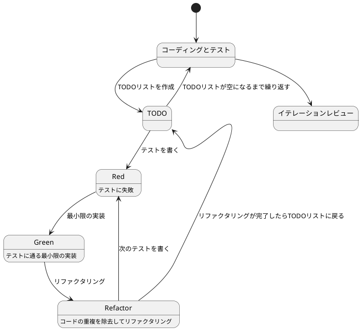
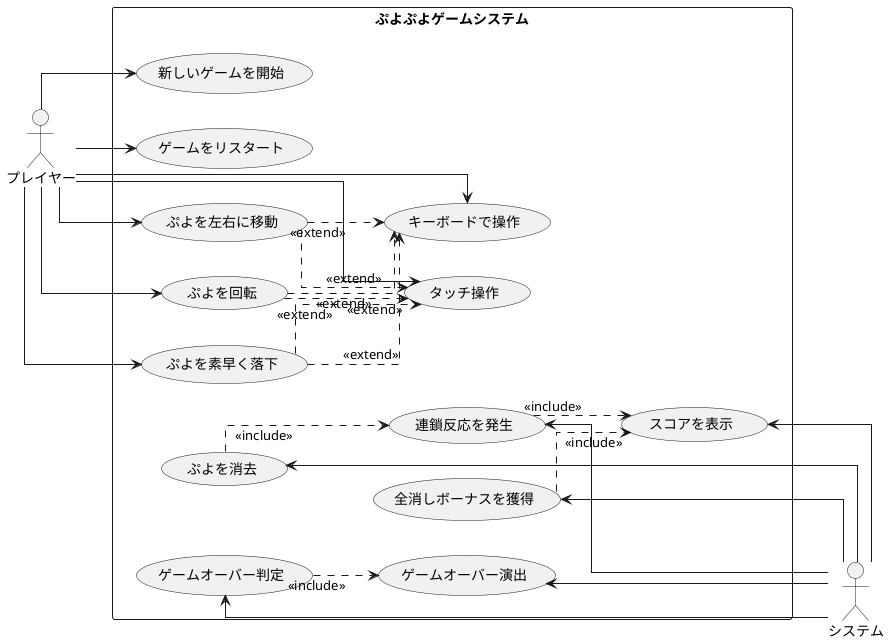

# ぷよぷよから始めるテスト駆動開発入門

## はじめに

みなさん、こんにちは！今日は私と一緒にテスト駆動開発（TDD）を使って、ぷよぷよゲームを作っていきましょう。さて、プログラミングの旅に出る前に、皆さんは「テスト駆動開発」について聞いたことがありますか？もしかしたら「テストって、コードを書いた後にするものじゃないの？」と思われるかもしれませんね。

> テスト駆動開発とは、プログラミングの手法の一種で、「テストファースト」の原則に従い、実装前にテストを書くことで、コードの品質を高め、設計を改善していく開発手法です。
> 
> — Kent Beck 『テスト駆動開発』

この記事では、私たちが一緒にぷよぷよゲームを実装しながら、テスト駆動開発の基本的な流れと考え方を学んでいきます。まるでモブプログラミングのセッションのように、あなたと私が一緒に考え、コードを書き、改善していく過程を体験しましょう。「でも、ぷよぷよって結構複雑なゲームじゃないの？」と思われるかもしれませんが、心配いりません。各章では、ユーザーストーリーに基づいた機能を、テスト、実装、解説の順に少しずつ進めていきますよ。一歩一歩、着実に進んでいきましょう！

### テスト駆動開発のサイクル

さて、テスト駆動開発では、どのように進めていけばいいのでしょうか？「テストを書いてから実装する」というのは分かりましたが、具体的にはどんな手順で進めるのでしょうか？

私がいつも実践しているのは、以下の3つのステップを繰り返すサイクルです。皆さんも一緒にやってみましょう：

1. **Red（赤）**: まず失敗するテストを書きます。「え？わざと失敗するテストを？」と思われるかもしれませんが、これには重要な意味があるんです。これから実装する機能が何をすべきかを明確にするためなんですよ。
2. **Green（緑）**: 次に、テストが通るように、最小限のコードを実装します。この段階では、きれいなコードよりも「とにかく動くこと」を優先します。「最小限」というのがポイントです。必要以上のことはしないようにしましょう。
3. **Refactor（リファクタリング）**: 最後に、コードの品質を改善します。テストが通ることを確認しながら、重複を取り除いたり、わかりやすい名前をつけたりします。「動くけど汚いコード」から「動いてきれいなコード」へと進化させるんです。

> テスト駆動開発のリズム：赤、緑、リファクタリング。まず失敗するテストを書き（赤）、次にテストが通るようにする（緑）、そして重複を除去する（リファクタリング）。
> 
> — Kent Beck 『テスト駆動開発』

このサイクルを「Red-Green-Refactor」サイクルと呼びます。「赤・緑・リファクタリング」のリズムを刻むように、このサイクルを繰り返していくんです。これによって、少しずつ機能を追加し、コードの品質を高めていきましょう。皆さんも一緒にこのリズムを体感してみてください！



### 開発環境

さて、実際にコードを書く前に、私たちが使用する開発環境について少しお話ししておきましょう。皆さんは「道具選びは仕事の半分」という言葉を聞いたことがありますか？プログラミングでも同じことが言えるんです。

> 良いツールは良い仕事の第一歩です。適切な道具を選ぶことで、開発の効率と品質が大きく向上します。
> 
> — Andrew Hunt & David Thomas 『達人プログラマー』

「どんなツールを使えばいいの？」と思われるかもしれませんね。今回のプロジェクトでは、以下のツールを使用していきます：

- **言語**: TypeScript — 「JavaScriptだけじゃダメなの？」と思われるかもしれませんが、TypeScriptは型を追加することで、大規模な開発でもバグを減らしやすくなるんです。
- **ビルドツール**: Vite — 開発中のコード変更をリアルタイムで反映してくれる高速な開発サーバーです。「待ち時間が少ないと開発が楽しくなりますよね！」
- **テストフレームワーク**: Vitest — Viteと統合された高速なテストランナーです。テスト駆動開発には欠かせないツールですね。
- **タスクランナー**: Gulp — 「同じ作業の繰り返しって退屈じゃないですか？」そんな反復的なタスクを自動化してくれます。
- **バージョン管理**: Git — コードの変更履歴を追跡し、「あれ？昨日までちゃんと動いてたのに...」というときに過去の状態に戻れる魔法のツールです。

これらのツールを使って、テスト駆動開発の流れに沿ってぷよぷよゲームを実装していきましょう。「環境構築って難しそう...」と心配される方もいるかもしれませんが、今回は環境のセットアップについては、すでに完了していると仮定して進めていきますね。実際のプロジェクトでは、この環境構築も重要な一歩ですよ！

## 要件

### ユーザーストーリー

さて、実際にコードを書き始める前に、少し立ち止まって考えてみましょう。「何を作るのか？」という基本的な問いかけです。私たちが作るぷよぷよゲームは、どのような機能を持つべきでしょうか？

アジャイル開発では、この「何を作るのか？」という問いに対して、「ユーザーストーリー」という形で答えを出します。皆さんは「ユーザーストーリー」という言葉を聞いたことがありますか？

> ユーザーストーリーとは、ソフトウェアの機能を「誰が」「何を」「なぜ」したいのかという形式で表現したものです。これにより、開発チームは常にユーザーの視点を忘れずに開発を進めることができます。
> 
> — Mike Cohn 『User Stories Applied』

つまり、「プレイヤーとして、〇〇ができる（〇〇したいから）」という形式で機能を表現するんです。これによって、「誰のため」の「どんな機能」を「なぜ」作るのかが明確になります。素晴らしいですよね！

では、私たちのぷよぷよゲームでは、どんなユーザーストーリーが考えられるでしょうか？一緒に考えてみましょう：

- プレイヤーとして、新しいゲームを開始できる（ゲームの基本機能として必要ですよね！）
- プレイヤーとして、落ちてくるぷよを左右に移動できる（ぷよを適切な位置に配置したいですよね）
- プレイヤーとして、落ちてくるぷよを回転できる（戦略的にぷよを配置するために必要です）
- プレイヤーとして、ぷよを素早く落下させることができる（「早く次のぷよを落としたい！」というときのために）
- プレイヤーとして、同じ色のぷよを4つ以上つなげると消去できる（これがぷよぷよの醍醐味ですよね！）
- プレイヤーとして、連鎖反応を起こしてより高いスコアを獲得できる（「れ〜んさ〜ん！」と叫びたくなりますよね）
- プレイヤーとして、全消し（ぜんけし）ボーナスを獲得できる（「やった！全部消えた！」という達成感を味わいたいですよね）
- プレイヤーとして、ゲームオーバーになるとゲーム終了の演出を見ることができる（終わりが明確でないとモヤモヤしますよね）
- プレイヤーとして、現在のスコアを確認できる（「今どれくらい点数取れてるかな？」と気になりますよね）
- プレイヤーとして、キーボードでぷよを操作できる（PCでプレイするなら必須ですよね）
- プレイヤーとして、タッチ操作でぷよを操作できる（スマホでもプレイしたいですよね）

「うわ、結構たくさんあるな...」と思われるかもしれませんが、心配いりません！これらのユーザーストーリーを一つずつ実装していくことで、徐々にゲームを完成させていきましょう。テスト駆動開発の素晴らしいところは、各ストーリーを小さなタスクに分解し、テスト→実装→リファクタリングのサイクルで少しずつ進められることなんです。一歩一歩、着実に進んでいきましょう！

### ユースケース図

ユーザーストーリーを整理したところで、「これらの機能がどのように関連しているのか、全体像が見えるといいな」と思いませんか？そんなときに役立つのが「ユースケース図」です。

「ユースケース図って何？」と思われるかもしれませんね。ユースケース図は、システムと外部アクター（ここではプレイヤーとシステム自体）の相互作用を視覚的に表現するための図です。「絵に描いて整理すると分かりやすい」というやつですね。

> ユースケース図は、システムが外部に提供する機能と、それを利用するアクターとの関係を表現します。これにより、システムの境界と責任範囲が明確になります。
> 
> — Martin Fowler 『UMLモデリングのエッセンス』

「百聞は一見にしかず」というように、実際に見てみるのが一番分かりやすいですよね。では、私たちのぷよぷよゲームのユースケース図を見てみましょう：



この図を見ると、プレイヤーとシステムの役割分担がよくわかりますね。プレイヤーはゲームの開始や操作を担当し、システムはぷよの消去判定やスコア計算などの内部処理を担当しています。また、キーボード操作とタッチ操作は「拡張（extend）」関係にあり、ぷよの移動や回転などの基本操作を異なる入力方法で実現していることがわかります。

このようにユースケース図を作成することで、システムの全体像を把握し、実装すべき機能の関連性を明確にすることができます。それでは、実際のコード実装に進んでいきましょう！

## イテレーション0: 環境の構築

### ソフトウェア開発の三種の神器

良いコードを書き続けるためには何が必要になるでしょうか？それは[ソフトウェア開発の三種の神器](https://t-wada.hatenablog.jp/entry/clean-code-that-works)と呼ばれるものです。

> 今日のソフトウェア開発の世界において絶対になければならない3つの技術的な柱があります。
> 三本柱と言ったり、三種の神器と言ったりしていますが、それらは
>
>   - バージョン管理
>   - テスティング
>   - 自動化
>
> の3つです。
>
> —  https://t-wada.hatenablog.jp/entry/clean-code-that-works

本章では開発環境のセットアップとして、これら三種の神器を準備していきます。環境構築は退屈に感じるかもしれませんが、これらのツールがあることで、安心してコードを書くことができるようになります。一緒に進めていきましょう！

### バージョン管理: Gitとコミットメッセージ

バージョン管理システムとして Git を使います。Git については既に使用していると仮定しますが、コミットメッセージについて1つだけ重要なルールを確認しておきましょう。

#### コミットメッセージの書き方

私たちのプロジェクトでは、[Conventional Commits](https://www.conventionalcommits.org/ja/)の書式に従ってコミットメッセージを書きます。具体的には、それぞれのコミットメッセージはヘッダ、ボディ、フッタで構成されます。

```
<タイプ>(<スコープ>): <タイトル>
<空行>
<ボディ>
<空行>
<フッタ>
```

ヘッダは必須で、スコープは任意です。コミットメッセージのタイトルは50文字までにしましょう（GitHub上で読みやすくなります）。

コミットのタイプは次を用います：

- **feat**: 新しい機能
- **fix**: バグ修正
- **docs**: ドキュメント変更のみ
- **style**: コードに影響を与えない変更（空白、フォーマットなど）
- **refactor**: 機能追加でもバグ修正でもないコード変更
- **perf**: パフォーマンスを改善するコード変更
- **test**: テストの追加や修正
- **chore**: ビルドプロセスや補助ツールの変更

例えば：

```bash
git commit -m 'feat: ゲーム初期化機能を追加'
git commit -m 'refactor: メソッドの抽出'
git commit -m 'test: ぷよ消去のテストケースを追加'
```

### テスティング: パッケージマネージャとテスト環境

良いコードを書くためには、コードが正しく動作することを確認するテストが欠かせません。そのためのツールをセットアップしていきましょう。

#### パッケージマネージャ: npm

外部ライブラリやツールを管理するために **npm**（Node Package Manager）を使います。

> npmとは、Node.jsで記述されたサードパーティ製のライブラリを管理するためのツールで、npmで扱うライブラリをパッケージと呼びます。
>
> —  Node.js公式ドキュメント

まず、`package.json` を作成してプロジェクトの依存関係を管理できるようにします：

```bash
npm init -y
```

これで `package.json` が作成されます。このファイルの `"scripts"` セクションを以下のように設定します：

```json
{
  "name": "puyo-puyo-game",
  "private": true,
  "version": "0.0.0",
  "type": "module",
  "scripts": {
    "dev": "vite",
    "build": "tsc && vite build",
    "preview": "vite preview",
    "test": "vitest run",
    "test:watch": "vitest",
    "test:coverage": "vitest run --coverage",
    "lint": "eslint . --ext .ts,.tsx",
    "lint:fix": "eslint . --ext .ts,.tsx --fix",
    "format": "prettier --write .",
    "format:check": "prettier --check .",
    "gulp": "gulp",
    "watch": "gulp watch",
    "guard": "gulp guard",
    "check": "gulp checkAndFix",
    "commit": "git add . && git commit",
    "setup": "npm install && npm run check"
  }
}
```

設定を追加したら、必要なパッケージをインストールします：

```bash
npm install
```

これで、テストフレームワークやその他の開発ツールがインストールされます。

### 自動化: コード品質の自動管理

良いコードを書き続けるためには、コードの品質を自動的にチェックし、維持していく仕組みが必要です。ここでは、静的コード解析、コードフォーマット、コードカバレッジ、そしてタスクランナーを設定します。

#### 静的コード解析: ESLint

静的コード解析ツールとして **ESLint** を使います。ESLintは、コードを実行せずに潜在的な問題を検出するツールです。

```bash
npm run lint
```

このコマンドを実行すると、コードスタイルやベストプラクティスに違反している箇所が指摘されます。自動修正可能な問題は `--fix` オプションで修正できます：

```bash
npm run lint:fix
```

プロジェクトでは、循環的複雑度を7以下に保つ設定も追加しています。これにより、メソッドが複雑になりすぎることを防ぎます。

> 循環的複雑度(サイクロマティック複雑度)とは、ソフトウェア測定法の一つであり、コードがどれぐらい複雑であるかをメソッド単位で数値にして表す指標。

#### コードフォーマッタ: Prettier

コードのフォーマットを統一するために **Prettier** を使います。

> 優れたソースコードは「目に優しい」ものでなければいけない。
>
> —  リーダブルコード

フォーマットのチェックと自動修正は以下のコマンドで実行できます：

```bash
npm run format:check  # チェックのみ
npm run format        # 自動修正
```

#### コードカバレッジ: Vitest Coverage

テストがコードのどれだけをカバーしているかを確認するために、**Vitest** のカバレッジ機能を使います。

> コード網羅率（コードもうらりつ、英: Code coverage）は、ソフトウェアテストで用いられる尺度の1つである。プログラムのソースコードがテストされた割合を意味する。

必要なパッケージをインストールします：

```bash
npm install --save-dev vitest @vitest/coverage-v8
```

カバレッジレポートを生成するには：

```bash
npm run test:coverage
```

実行後、`coverage` フォルダ内の `index.html` を開くと、視覚的にカバレッジ状況を確認できます。

#### タスクランナー: Gulp

複数のコマンドを覚えるのは大変です。タスクランナーの **Gulp** を使って、よく使うコマンドをタスクとして登録し、簡単に実行できるようにします。

> GulpはJavaScript/TypeScriptにおけるタスクランナーです。gulpコマンドと起点となるgulpfile.jsというタスクを記述するファイルを用意することで、タスクの実行や登録されたタスクの一覧表示を行えます。

`gulpfile.js` を作成し、以下のように設定します：

```javascript
import { watch, series } from 'gulp'
import shell from 'gulp-shell'

// テストタスク
export const test = shell.task(['npm run test'])

// テストカバレッジタスク
export const coverage = shell.task(['npm run test:coverage'])

// 静的コード解析タスク
export const lint = shell.task(['npm run lint'])

// 自動修正付き静的コード解析タスク
export const lintFix = shell.task(['npm run lint:fix'])

// フォーマットタスク
export const format = shell.task(['npm run format'])

// フォーマットチェックタスク
export const formatCheck = shell.task(['npm run format:check'])

// ビルドタスク
export const build = shell.task(['npm run build'])

// 開発サーバータスク
export const dev = shell.task(['npm run dev'])

// 全体チェックタスク（自動修正付き）
export const checkAndFix = series(lintFix, format, test)

// ファイル監視タスク（自動テスト実行）
export function guard() {
  console.log('🔍 Guard is watching for file changes...')
  console.log('Files will be automatically linted, formatted, and tested on change.')
  watch('src/**/*.ts', series(lintFix, format, test))
  watch('**/*.test.ts', series(test))
}

// ファイル監視タスク
export function watchFiles() {
  watch('src/**/*.ts', series(formatCheck, lint, test))
  watch('**/*.test.ts', series(test))
}

// デフォルトタスク
export default series(checkAndFix, guard)

// ウォッチタスクのエイリアス
export { watchFiles as watch }
```

登録されたタスクを確認するには：

```bash
npx gulp --tasks
```

特定のタスクを実行するには：

```bash
npx gulp test      # テスト実行
npx gulp lint      # 静的解析
npx gulp format    # フォーマット
npx gulp check     # 全体チェック（自動修正付き）
```

#### タスクの自動実行: Guard

ファイルを編集するたびに手動でコマンドを実行するのは面倒です。**Guard** 機能を使って、ファイルの変更を検知して自動的にテストやフォーマットを実行できるようにします。

```bash
npm run guard
```

このコマンドを実行すると、ファイルを保存するたびに自動的に以下が実行されます：

1. ESLintによる静的解析（自動修正付き）
2. Prettierによるフォーマット
3. テストの実行

これにより、常にコードの品質を保ちながら開発を進めることができます。開発を始める際は、まず `npm run guard` を実行して、後はコードを書くことに集中しましょう！

### 環境構築の完了

お疲れさまでした！これで開発環境のセットアップが完了しました。以下のツールが使えるようになりました：

- **バージョン管理**: Git（Conventional Commits形式）
- **テスティング**: Vitest（カバレッジレポート付き）
- **静的コード解析**: ESLint（循環的複雑度チェック付き）
- **コードフォーマット**: Prettier
- **タスクランナー**: Gulp
- **自動化**: Guard（ファイル監視と自動実行）

これらのツールにより、[ソフトウェア開発の三種の神器](https://t-wada.hatenablog.jp/entry/clean-code-that-works)が揃いました。これから安心してテスト駆動開発に取り組むことができます！

では、実際のゲーム開発に進みましょう！

## イテレーション1: ゲーム開始の実装

さあ、いよいよコードを書き始めましょう！テスト駆動開発では、小さなイテレーション（反復）で機能を少しずつ追加していきます。最初のイテレーションでは、最も基本的な機能である「ゲームの開始」を実装します。

> イテレーション開発とは、ソフトウェアを小さな機能単位で繰り返し開発していく手法です。各イテレーションで計画、設計、実装、テスト、評価のサイクルを回すことで、リスクを早期に発見し、フィードバックを得ながら開発を進めることができます。
> 
> — Craig Larman 『アジャイル開発とスクラム』

### ユーザーストーリー

まずは、このイテレーションで実装するユーザーストーリーを確認しましょう：

> プレイヤーとして、新しいゲームを開始できる

このシンプルなストーリーから始めることで、ゲームの基本的な構造を作り、後続の機能追加の土台を築くことができます。では、テスト駆動開発のサイクルに従って、まずはテストから書いていきましょう！

### TODOリスト

さて、ユーザーストーリーを実装するために、まずはTODOリストを作成しましょう。TODOリストは、大きな機能を小さなタスクに分解するのに役立ちます。

> TODOリストは、テスト駆動開発の重要なプラクティスの一つです。実装前に必要なタスクを明確にすることで、開発の方向性を保ち、何も見落とさないようにします。
> 
> — Kent Beck 『テスト駆動開発』

私たちの「新しいゲームを開始できる」というユーザーストーリーを実現するためには、どのようなタスクが必要でしょうか？考えてみましょう：

- ゲームの初期化処理を実装する（ゲームの状態や必要なコンポーネントを設定する）
- ゲーム画面を表示する（プレイヤーが視覚的にゲームを認識できるようにする）
- 新しいぷよを生成する（ゲーム開始時に最初のぷよを作成する）
- ゲームループを開始する（ゲームの継続的な更新と描画を行う）

これらのタスクを一つずつ実装していきましょう。テスト駆動開発では、各タスクに対してテスト→実装→リファクタリングのサイクルを回します。まずは「ゲームの初期化処理」から始めましょう！

### テスト: ゲームの初期化

さて、TODOリストの最初のタスク「ゲームの初期化処理を実装する」に取り掛かりましょう。テスト駆動開発では、まずテストを書くことから始めます。

> テストファースト
> 
> いつテストを書くべきだろうか——それはテスト対象のコードを書く前だ。
> 
> — Kent Beck 『テスト駆動開発』

では、ゲームの初期化処理をテストするコードを書いてみましょう。何をテストすべきでしょうか？ゲームが初期化されたとき、必要なコンポーネントが正しく作成され、ゲームの状態が適切に設定されていることを確認する必要がありますね。

```typescript
// src/tests/game.test.ts
import { describe, it, expect, beforeEach } from 'vitest';
import { Game } from '../game';
import { Config } from '../config';
import { Stage } from '../stage';
import { PuyoImage } from '../puyoimage';
import { Player } from '../player';
import { Score } from '../score';

describe('ゲーム', () => {
    let game: Game;

    beforeEach(() => {
        // DOMの準備
        document.body.innerHTML = `
            <div id="stage"></div>
            <div id="score"></div>
            <div id="next"></div>
            <div id="next2"></div>
        `;
        game = new Game();
    });

    describe('ゲームの初期化', () => {
        it('ゲームを初期化すると、必要なコンポーネントが作成される', () => {
            game.initialize();

            expect(game['config']).toBeInstanceOf(Config);
            expect(game['puyoImage']).toBeInstanceOf(PuyoImage);
            expect(game['stage']).toBeInstanceOf(Stage);
            expect(game['player']).toBeInstanceOf(Player);
            expect(game['score']).toBeInstanceOf(Score);
        });

        it('ゲームを初期化すると、ゲームモードがstartになる', () => {
            game.initialize();

            expect(game['mode']).toEqual('start');
        });
    });
});
```

このテストでは、`Game`クラスの`initialize`メソッドが正しく動作することを確認しています。具体的には、必要なコンポーネント（Config, PuyoImage, Stage, Player, Score）が作成され、ゲームモードが'start'に設定されることを検証しています。

### 実装: ゲームの初期化

テストを書いたら、次に実行してみましょう。どうなるでしょうか？

```
Error: Cannot find module '../game'
```

おっと！まだ`Game`クラスを実装していないので、当然エラーになりますね。これがテスト駆動開発の「Red（赤）」の状態です。テストが失敗することを確認できました。

> 失敗するテスト
> 
> テストが失敗することを確認してから実装に取り掛かろう。そうすれば、テストが正しく機能していることがわかる。
> 
> — Kent Beck 『テスト駆動開発』

では、テストが通るように最小限のコードを実装していきましょう。「最小限」というのがポイントです。この段階では、テストが通ることだけを目指して、必要最低限のコードを書きます。

```typescript
// src/game.ts
import { Config } from './config';
import { PuyoImage } from './puyoimage';
import { Stage } from './stage';
import { Player } from './player';
import { Score } from './score';

export type GameMode = 'start' | 'checkFall' | 'fall' | 'checkErase' | 'erasing' | 'newPuyo' | 'playing' | 'gameOver';

export class Game {
    private mode: GameMode = 'start';
    private frame: number = 0;
    private combinationCount: number = 0;
    private config: Config;
    private puyoImage: PuyoImage;
    private stage: Stage;
    private player: Player;
    private score: Score;

    constructor() {
        // コンストラクタでは何もしない
    }

    initialize(): void {
        // 各コンポーネントの初期化
        this.config = new Config();
        this.puyoImage = new PuyoImage(this.config);
        this.stage = new Stage(this.config, this.puyoImage);
        this.player = new Player(this.config, this.stage, this.puyoImage);
        this.score = new Score();

        // ゲームモードを設定
        this.mode = 'start';
    }
}
```

### 解説: ゲームの初期化

テストが通りましたね！おめでとうございます。これがテスト駆動開発の「Green（緑）」の状態です。

> テストが通ったら、次はリファクタリングだ。でも、その前に少し立ち止まって、今書いたコードについて考えてみよう。
> 
> — Martin Fowler 『リファクタリング』

実装したゲームの初期化処理について、少し解説しておきましょう。この処理では、主に以下のことを行っています：

1. 各コンポーネント（Config, PuyoImage, Stage, Player, Score）のインスタンスを作成
2. ゲームモードを'start'に設定

これにより、ゲームを開始するための準備が整います。各コンポーネントの役割を理解しておくと、今後の実装がスムーズになりますよ：

- **Config**: ゲームの設定値を管理します（画面サイズ、ぷよの大きさなど）
- **PuyoImage**: ぷよの画像を管理します（各色のぷよの画像を読み込み、描画する）
- **Stage**: ゲームのステージ（盤面）を管理します（ぷよの配置状態、消去判定など）
- **Player**: プレイヤーの入力と操作を管理します（キーボード入力の処理、ぷよの移動など）
- **Score**: スコアの計算と表示を管理します（連鎖数に応じたスコア計算など）

このように、責任を明確に分けることで、コードの保守性が高まります。これはオブジェクト指向設計の基本原則の一つ、「単一責任の原則」に従っています。

> 単一責任の原則（SRP）：クラスを変更する理由は1つだけであるべき。
> 
> — Robert C. Martin 『Clean Architecture』

### テスト: ゲームループの開始

次に、ゲームループを開始するテストを書きます。

```typescript
// src/tests/game.test.ts（続き）
describe('ゲームループ', () => {
    it('ゲームループを開始すると、requestAnimationFrameが呼ばれる', () => {
        // requestAnimationFrameのモック
        const originalRequestAnimationFrame = window.requestAnimationFrame;
        const mockRequestAnimationFrame = vi.fn();
        window.requestAnimationFrame = mockRequestAnimationFrame;

        try {
            game.loop();

            expect(mockRequestAnimationFrame).toHaveBeenCalledTimes(1);
            expect(mockRequestAnimationFrame).toHaveBeenCalledWith(expect.any(Function));
        } finally {
            // モックを元に戻す
            window.requestAnimationFrame = originalRequestAnimationFrame;
        }
    });
});
```

このテストでは、`Game`クラスの`loop`メソッドが`requestAnimationFrame`を呼び出すことを確認しています。

### 実装: ゲームループの開始

テストが失敗することを確認したら、テストが通るように最小限のコードを実装します。

```typescript
// src/game.ts（続き）
loop(): void {
    // ゲームループの処理
    requestAnimationFrame(this.loop.bind(this));
}
```

### 解説: ゲームループの開始

さて、今回実装した「ゲームループ」について少し詳しく解説しましょう。「ゲームループって何？」と思われるかもしれませんね。

ゲームループは、その名の通り、ゲームの状態を更新し、画面を描画するための繰り返し処理なんです。心臓がずっと鼓動を続けるように、このループが継続的に実行されることで、ゲームが生き生きと動き続けるんですよ。

ここで使っている`requestAnimationFrame`というメソッド、これがとても賢いんです！「どう賢いの？」というと、ブラウザの描画タイミングに合わせて処理を実行してくれるんです。これによって、スムーズなアニメーションが可能になるんですよ。

コードを見てみると、`loop`メソッド内で`requestAnimationFrame`を呼び出し、自分自身（`this.loop`）をコールバックとして渡していますね。「これってどういうこと？」というと、「次の描画タイミングでも、また私を呼んでね」とブラウザにお願いしているようなものなんです。これによって、ループ処理が実現されるんですよ。

また、`bind(this)`という少し難しそうな記述がありますね。これは「コールバック内でも`this`が正しく機能するように」という指示なんです。JavaScriptの`this`は少し扱いが難しいんですが、この`bind(this)`によって、コールバック内でも正しく`this`が機能するようになるんです。

このゲームループが基盤となって、これから様々な機能を追加していきますよ！

## イテレーション2: ぷよの移動の実装

さて、前回のイテレーションでゲームの基本的な構造ができましたね。「ゲームが始まったけど、ぷよが動かないと面白くないよね？」と思いませんか？そこで次は、ぷよを左右に移動できるようにしていきましょう！

### ユーザーストーリー

まずは、このイテレーションで実装するユーザーストーリーを確認しましょう：

> プレイヤーとして、落ちてくるぷよを左右に移動できる

「ぷよぷよって、落ちてくるぷよを左右に動かして、うまく積み上げるゲームですよね？」そうです！今回はその基本操作である「左右の移動」を実装していきます。

### TODOリスト

さて、このユーザーストーリーを実現するために、どんなタスクが必要でしょうか？一緒に考えてみましょう。

> TODOリストは、大きな問題を小さな問題に分割するための強力なツールです。複雑な問題に直面したとき、それを管理可能な小さなタスクに分解することで、一歩一歩確実に前進できます。
> 
> — Kent Beck 『テスト駆動開発』

「ぷよを左右に移動する」という機能を実現するためには、以下のようなタスクが必要そうですね：

- プレイヤーの入力を検出する（キーボードの左右キーが押されたことを検知する）
- ぷよを左右に移動する処理を実装する（実際にぷよの位置を変更する）
- 移動可能かどうかのチェックを実装する（画面の端や他のぷよにぶつかる場合は移動できないようにする）
- 移動後の表示を更新する（画面上でぷよの位置が変わったことを表示する）

「なるほど、順番に実装していけばいいんですね！」そうです、一つずつ進めていきましょう。テスト駆動開発の流れに沿って、まずはテストから書いていきますよ。

### テスト: プレイヤーの入力検出

「最初に何をテストすればいいんでしょうか？」まずは、プレイヤーの入力を検出する部分からテストしていきましょう。キーボードの左右キーが押されたときに、それを正しく検知できるかどうかをテストします。

> テストファースト
> 
> いつテストを書くべきだろうか——それはテスト対象のコードを書く前だ。
> 
> — Kent Beck 『テスト駆動開発』

```typescript
// src/tests/player.test.ts
import { describe, it, expect, beforeEach } from 'vitest';
import { Player } from '../player';
import { Config } from '../config';
import { Stage } from '../stage';
import { PuyoImage } from '../puyoimage';

describe('プレイヤー', () => {
    let config: Config;
    let puyoImage: PuyoImage;
    let stage: Stage;
    let player: Player;

    beforeEach(() => {
        // DOMの準備
        document.body.innerHTML = `
            <div id="stage"></div>
        `;
        config = new Config();
        puyoImage = new PuyoImage(config);
        stage = new Stage(config, puyoImage);
        player = new Player(config, stage, puyoImage);
    });

    describe('キー入力', () => {
        it('左キーが押されると、左向きの移動フラグが立つ', () => {
            // キーダウンイベントをシミュレート（左キー）
            const event = new KeyboardEvent('keydown', { key: 'ArrowLeft' });
            document.dispatchEvent(event);

            expect(player['inputKeyLeft']).toBe(true);
        });

        it('右キーが押されると、右向きの移動フラグが立つ', () => {
            // キーダウンイベントをシミュレート（右キー）
            const event = new KeyboardEvent('keydown', { key: 'ArrowRight' });
            document.dispatchEvent(event);

            expect(player['inputKeyRight']).toBe(true);
        });

        it('キーが離されると、対応する移動フラグが下がる', () => {
            // まず左キーを押す
            document.dispatchEvent(new KeyboardEvent('keydown', { key: 'ArrowLeft' }));
            expect(player['inputKeyLeft']).toBe(true);

            // 次に左キーを離す
            document.dispatchEvent(new KeyboardEvent('keyup', { key: 'ArrowLeft' }));
            expect(player['inputKeyLeft']).toBe(false);
        });
    });
});
```

「このテストは何をしているんですか？」このテストでは、キーボードの左右キーが押されたときと離されたときに、`Player`クラスの中の対応するフラグが正しく設定されるかどうかを確認しています。例えば、左キーが押されたら`inputKeyLeft`というフラグが`true`になり、離されたら`false`になることを期待していますね。

「テストを実行するとどうなるんでしょう？」まだ実装していないので、当然テストは失敗するはずです。これがテスト駆動開発の「Red（赤）」の状態です。では、テストが通るように実装していきましょう！

### 実装: プレイヤーの入力検出

「失敗するテストができたので、次は実装ですね！」そうです！テストが通るように、最小限のコードを実装していきましょう。

> 最小限の実装
> 
> テストを通すために、どれだけのコードを書けばよいだろうか——テストが通る最小限のコードだけを書こう。
> 
> — Kent Beck 『テスト駆動開発』

```typescript
// src/player.ts
import { Config } from './config';
import { Stage } from './stage';
import { PuyoImage } from './puyoimage';

export class Player {
    private inputKeyLeft: boolean = false;
    private inputKeyRight: boolean = false;
    private inputKeyUp: boolean = false;
    private inputKeyDown: boolean = false;

    constructor(
        private config: Config,
        private stage: Stage,
        private puyoImage: PuyoImage
    ) {
        // キーボードイベントの登録
        document.addEventListener('keydown', this.onKeyDown.bind(this));
        document.addEventListener('keyup', this.onKeyUp.bind(this));
    }

    private onKeyDown(e: KeyboardEvent): void {
        switch (e.key) {
            case 'ArrowLeft':
                this.inputKeyLeft = true;
                break;
            case 'ArrowRight':
                this.inputKeyRight = true;
                break;
            case 'ArrowUp':
                this.inputKeyUp = true;
                break;
            case 'ArrowDown':
                this.inputKeyDown = true;
                break;
        }
    }

    private onKeyUp(e: KeyboardEvent): void {
        switch (e.key) {
            case 'ArrowLeft':
                this.inputKeyLeft = false;
                break;
            case 'ArrowRight':
                this.inputKeyRight = false;
                break;
            case 'ArrowUp':
                this.inputKeyUp = false;
                break;
            case 'ArrowDown':
                this.inputKeyDown = false;
                break;
        }
    }
}
```

「なるほど！キーが押されたり離されたりしたときのイベントを検知して、フラグを設定しているんですね。」そうです！ここでは、`document.addEventListener`を使って、キーボードのイベントをリッスンしています。キーが押されたら`onKeyDown`メソッドが呼ばれ、離されたら`onKeyUp`メソッドが呼ばれます。

「`bind(this)`って何ですか？」良い質問ですね！JavaScriptでは、イベントハンドラの中の`this`は、イベントが発生した要素（ここでは`document`）を指してしまいます。でも、私たちは`Player`クラスのメソッドの中で`this`が`Player`インスタンスを指すようにしたいんです。そこで`bind(this)`を使って、`this`の参照先を固定しているんですよ。

> JavaScriptの`this`は、関数がどのように呼び出されるかによって変わります。`bind()`メソッドを使うと、関数内の`this`の値を特定のオブジェクトに固定できます。
> 
> — Mozilla Developer Network 『Function.prototype.bind()』

「テストは通りましたか？」はい、これでテストは通るはずです！これがテスト駆動開発の「Green（緑）」の状態です。次は、ぷよを実際に移動させる機能をテストしていきましょう。

### テスト: ぷよの移動

「次は何をテストしますか？」次は、ぷよを左右に移動する機能をテストしましょう。ぷよが左右に移動できるか、そして画面の端に到達したときに移動が制限されるかをテストします。

```typescript
// src/tests/player.test.ts（続き）
describe('ぷよの移動', () => {
    beforeEach(() => {
        // 新しいぷよを作成
        player.createNewPuyo();
    });

    it('左に移動できる場合、左に移動する', () => {
        // 初期位置を記録
        const initialX = player['puyoX'];

        // 左に移動
        player.moveLeft();

        // 位置が1つ左に移動していることを確認
        expect(player['puyoX']).toBe(initialX - 1);
    });

    it('右に移動できる場合、右に移動する', () => {
        // 初期位置を記録
        const initialX = player['puyoX'];

        // 右に移動
        player.moveRight();

        // 位置が1つ右に移動していることを確認
        expect(player['puyoX']).toBe(initialX + 1);
    });

    it('左端にいる場合、左に移動できない', () => {
        // 左端に移動
        player['puyoX'] = 0;

        // 左に移動を試みる
        player.moveLeft();

        // 位置が変わっていないことを確認
        expect(player['puyoX']).toBe(0);
    });

    it('右端にいる場合、右に移動できない', () => {
        // 右端に移動（ステージの幅 - 1）
        player['puyoX'] = config.stageCols - 1;

        // 右に移動を試みる
        player.moveRight();

        // 位置が変わっていないことを確認
        expect(player['puyoX']).toBe(config.stageCols - 1);
    });
});
```

「このテストでは何を確認しているんですか？」このテストでは、以下の4つのケースを確認しています：

1. 通常の状態で左に移動できるか
2. 通常の状態で右に移動できるか
3. 左端にいるときに左に移動しようとしても位置が変わらないか
4. 右端にいるときに右に移動しようとしても位置が変わらないか

「なるほど、画面の端を超えて移動できないようにするんですね！」そうです！ゲームの画面外にぷよが出てしまうと困りますからね。では、このテストが通るように実装していきましょう。

### 実装: ぷよの移動

「テストが失敗することを確認したら、実装に進みましょう！」そうですね。では、ぷよを移動させる機能を実装していきましょう。

```typescript
// src/player.ts（続き）
private puyoX: number = 2; // ぷよのX座標（中央に配置）
private puyoY: number = 0; // ぷよのY座標（一番上）
private puyoType: number = 0; // 現在のぷよの種類
private nextPuyoType: number = 0; // 次のぷよの種類
private rotation: number = 0; // 現在の回転状態

createNewPuyo(): void {
    // 新しいぷよを作成（ここでは簡略化）
    this.puyoX = 2;
    this.puyoY = 0;
    this.puyoType = Math.floor(Math.random() * 4) + 1; // 1～4のランダムな値
    this.nextPuyoType = Math.floor(Math.random() * 4) + 1;
    this.rotation = 0;
}

moveLeft(): void {
    // 左端でなければ左に移動
    if (this.puyoX > 0) {
        this.puyoX--;
    }
}

moveRight(): void {
    // 右端でなければ右に移動
    if (this.puyoX < this.config.stageCols - 1) {
        this.puyoX++;
    }
}
```

「ぷよの位置や種類を管理するプロパティがたくさんありますね！」そうですね。ぷよの状態を管理するために、いくつかのプロパティを定義しています：

- `puyoX`と`puyoY`：ぷよの位置（X座標とY座標）
- `puyoType`と`nextPuyoType`：現在のぷよと次のぷよの種類
- `rotation`：ぷよの回転状態

「移動の処理はシンプルですね！」そうですね。`moveLeft`メソッドでは左端（X座標が0）でなければX座標を1減らし、`moveRight`メソッドでは右端（X座標がステージの幅-1）でなければX座標を1増やしています。これで、ぷよが画面の端を超えて移動することはなくなりました。

> 境界条件のテスト
> 
> プログラムの動作が変わる境界条件をテストすることは非常に重要です。例えば、配列の最初の要素、最後の要素、空の配列などです。
> 
> — Martin Fowler 『リファクタリング』

「これでテストは通りましたか？」はい、これでテストは通るはずです！これでぷよを左右に移動させる基本的な機能が実装できました。プレイヤーがキーボードの左右キーを押すと、ぷよが対応する方向に移動し、画面の端に到達すると移動が制限されます。

「でも、まだ実際にキー入力に応じて移動する処理が実装されていませんよね？」鋭い指摘ですね！確かに、キーが押されたことを検知するフラグと、ぷよを移動させるメソッドはできましたが、それらを連携させる部分はまだ実装していません。これは次のイテレーションで、ゲームループの中で処理していきますね。

「なるほど、少しずつ機能を追加していくんですね！」そうです！テスト駆動開発では、小さな機能を一つずつ確実に実装していくことで、複雑なシステムを構築していきます。今回は「ぷよを左右に移動させる」という基本機能を実装しました。次のイテレーションでは、「ぷよを回転させる」機能を実装していきましょう！

## イテレーション3: ぷよの回転の実装

「左右に移動できるようになったけど、ぷよぷよって回転もできますよね？」そうですね！ぷよぷよの醍醐味の一つは、ぷよを回転させて思い通りの場所に配置することです。今回は、ぷよを回転させる機能を実装していきましょう！

### ユーザーストーリー

まずは、このイテレーションで実装するユーザーストーリーを確認しましょう：

> プレイヤーとして、落ちてくるぷよを回転できる

「回転って具体的にどういう動きですか？」良い質問ですね！ぷよぷよでは、2つのぷよが連なった状態で落ちてきます。回転とは、この2つのぷよの相対的な位置関係を変えることです。例えば、縦に並んでいるぷよを横に並ぶように変えたりできるんですよ。

### TODOリスト

「どんな作業が必要になりますか？」このユーザーストーリーを実現するために、TODOリストを作成してみましょう。

> TODOリストは、実装前に必要なタスクを明確にすることで、開発の方向性を保ち、何も見落とさないようにします。
> 
> — Kent Beck 『テスト駆動開発』

「ぷよを回転させる」という機能を実現するためには、以下のようなタスクが必要そうですね：

- ぷよの回転処理を実装する（時計回り・反時計回りの回転）
- 回転可能かどうかのチェックを実装する（他のぷよや壁にぶつかる場合は回転できないようにする）
- 壁キック処理を実装する（壁際での回転を可能にする特殊処理）
- 回転後の表示を更新する（画面上でぷよの位置が変わったことを表示する）

「壁キックって何ですか？」壁キックとは、ぷよが壁際にあるときに回転すると壁にめり込んでしまうので、自動的に少し位置をずらして回転を可能にする処理のことです。プレイヤーの操作性を向上させるための工夫なんですよ。

### テスト: ぷよの回転

「まずは何からテストしますか？」テスト駆動開発の流れに沿って、まずは基本的な回転機能のテストから書いていきましょう。

```typescript
// src/tests/player.test.ts（続き）
describe('ぷよの回転', () => {
    beforeEach(() => {
        // 新しいぷよを作成
        player.createNewPuyo();
    });

    it('時計回りに回転すると、回転状態が1増える', () => {
        // 初期回転状態を記録
        const initialRotation = player['rotation'];

        // 時計回りに回転
        player.rotateRight();

        // 回転状態が1増えていることを確認
        expect(player['rotation']).toBe((initialRotation + 1) % 4);
    });

    it('反時計回りに回転すると、回転状態が1減る', () => {
        // 初期回転状態を記録
        const initialRotation = player['rotation'];

        // 反時計回りに回転
        player.rotateLeft();

        // 回転状態が1減っていることを確認（負の値にならないように調整）
        expect(player['rotation']).toBe((initialRotation + 3) % 4);
    });

    it('回転状態が4になると0に戻る', () => {
        // 回転状態を3に設定
        player['rotation'] = 3;

        // 時計回りに回転
        player.rotateRight();

        // 回転状態が0になっていることを確認
        expect(player['rotation']).toBe(0);
    });
});
```

「このテストは何を確認しているんですか？」このテストでは、以下の3つのケースを確認しています：

1. 時計回りに回転すると、回転状態が1増えるか
2. 反時計回りに回転すると、回転状態が1減るか（ただし、負の値にならないように調整）
3. 回転状態が最大値（3）から時計回りに回転すると、0に戻るか（循環するか）

「回転状態って何ですか？」回転状態は、ぷよの向きを表す値です。0から3までの値を取り、それぞれ以下の状態を表します：
- 0: 2つ目のぷよが上にある状態
- 1: 2つ目のぷよが右にある状態
- 2: 2つ目のぷよが下にある状態
- 3: 2つ目のぷよが左にある状態

「なるほど、4方向の回転を表現するんですね！」そうです！では、このテストが通るように実装していきましょう。

### 実装: ぷよの回転

「テストが失敗することを確認したら、実装に進みましょう！」そうですね。では、ぷよを回転させる機能を実装していきましょう。

> 最小限の実装
> 
> テストを通すために、どれだけのコードを書けばよいだろうか——テストが通る最小限のコードだけを書こう。
> 
> — Kent Beck 『テスト駆動開発』

```typescript
// src/player.ts（続き）
rotateRight(): void {
    // 時計回りに回転（0→1→2→3→0）
    this.rotation = (this.rotation + 1) % 4;
}

rotateLeft(): void {
    // 反時計回りに回転（0→3→2→1→0）
    this.rotation = (this.rotation + 3) % 4;
}
```

「シンプルですね！」そうですね。回転処理自体はとてもシンプルです。`rotateRight`メソッドでは回転状態を1増やし、`rotateLeft`メソッドでは回転状態を1減らしています（ただし、負の値にならないように3を足して4で割った余りを取っています）。

「なぜ反時計回りの場合は単純に1減らすのではなく、3を足して4で割るんですか？」鋭い質問ですね！JavaScriptでは、負の数の剰余演算（%演算子）の結果が他の言語と異なる場合があります。例えば、-1 % 4は-1になることがあります。しかし、私たちは常に0から3の範囲の値が欲しいので、3を足して（これは1を引くのと同じ効果があります）から4で割ることで、確実に正の値の範囲内に収めているんです。

> 剰余演算子（%）は、左オペランドを右オペランドで割った後の余りを返します。常に左オペランドの符号を取ります。
> 
> — Mozilla Developer Network 『剰余演算子』

「テストは通りましたか？」はい、これでテストは通るはずです！これで基本的な回転機能が実装できました。しかし、まだ壁際での回転（壁キック）処理が実装されていませんね。次はそれをテストしていきましょう。

### テスト: 壁キック処理

「壁キック処理のテストはどうやって書くんですか？」壁キック処理は、ぷよが壁際にあるときに回転すると自動的に位置を調整する機能です。これをテストするには、ぷよを壁際に配置し、回転させたときに適切に位置が調整されるかを確認します。

```typescript
// src/tests/player.test.ts（続き）
describe('壁キック処理', () => {
    beforeEach(() => {
        // 新しいぷよを作成
        player.createNewPuyo();
    });

    it('右端で右回転すると、左に移動して回転する（壁キック）', () => {
        // 右端に移動
        player['puyoX'] = config.stageCols - 1;
        player['rotation'] = 0; // 上向き

        // 右回転（2つ目のぷよが右にくる）
        player.rotateRight();

        // 壁キックにより左に移動していることを確認
        expect(player['puyoX']).toBe(config.stageCols - 2);
        expect(player['rotation']).toBe(1);
    });

    it('左端で左回転すると、右に移動して回転する（壁キック）', () => {
        // 左端に移動
        player['puyoX'] = 0;
        player['rotation'] = 0; // 上向き

        // 左回転（2つ目のぷよが左にくる）
        player.rotateLeft();

        // 壁キックにより右に移動していることを確認
        expect(player['puyoX']).toBe(1);
        expect(player['rotation']).toBe(3);
    });
});
```

「このテストでは何を確認しているんですか？」このテストでは、以下の2つのケースを確認しています：

1. 右端にいるときに時計回りに回転すると、左に1マス移動して回転するか
2. 左端にいるときに反時計回りに回転すると、右に1マス移動して回転するか

「なるほど、壁にめり込まないように自動的に位置を調整するんですね！」そうです！これがいわゆる「壁キック」と呼ばれる処理です。プレイヤーの操作性を向上させるための工夫なんですよ。では、このテストが通るように実装していきましょう。

### 実装: 壁キック処理

「テストが失敗することを確認したら、実装に進みましょう！」そうですね。では、壁キック処理を実装していきましょう。

```typescript
// src/player.ts（続き）
rotateRight(): void {
    // 回転前の状態を保存
    const oldRotation = this.rotation;

    // 時計回りに回転
    this.rotation = (this.rotation + 1) % 4;

    // 右端で右回転した場合（2つ目のぷよが右にくる場合）
    if (this.rotation === 1 && this.puyoX === this.config.stageCols - 1) {
        // 左に移動（壁キック）
        this.puyoX--;
    }

    // 左端で左回転した場合（2つ目のぷよが左にくる場合）
    if (this.rotation === 3 && this.puyoX === 0) {
        // 右に移動（壁キック）
        this.puyoX++;
    }
}

rotateLeft(): void {
    // 回転前の状態を保存
    const oldRotation = this.rotation;

    // 反時計回りに回転
    this.rotation = (this.rotation + 3) % 4;

    // 右端で右回転した場合（2つ目のぷよが右にくる場合）
    if (this.rotation === 1 && this.puyoX === this.config.stageCols - 1) {
        // 左に移動（壁キック）
        this.puyoX--;
    }

    // 左端で左回転した場合（2つ目のぷよが左にくる場合）
    if (this.rotation === 3 && this.puyoX === 0) {
        // 右に移動（壁キック）
        this.puyoX++;
    }
}
```

「なるほど、回転後に壁にめり込む場合は位置を調整するんですね！」そうです！この実装では、以下のことを行っています：

1. まず通常の回転処理を行う
2. 回転後、ぷよが壁にめり込む状況になっていないかチェックする
3. めり込む場合は、ぷよの位置を調整する（壁キック）

> 境界条件のテスト
> 
> プログラムの動作が変わる境界条件をテストすることは非常に重要です。壁際での回転のような特殊なケースは、バグが発生しやすい場所です。
> 
> — Martin Fowler 『リファクタリング』

「でも、`rotateRight`と`rotateLeft`で同じ壁キック処理が重複していますね？」鋭い指摘です！確かに重複していますね。これはリファクタリングの良い候補です。共通の壁キック処理を抽出して、コードの重複を減らすことができるでしょう。しかし、今回はテストが通ることを優先して、リファクタリングは次のステップで行うことにしましょう。

「テストは通りましたか？」はい、これでテストは通るはずです！これでぷよを回転させる機能と、壁際での特殊処理（壁キック）が実装できました。プレイヤーがキーボードの上キーを押すと、ぷよが回転し、壁際でも適切に位置が調整されるようになりました。

「でも、まだ実際にキー入力に応じて回転する処理が実装されていませんよね？」その通りです！キーが押されたことを検知するフラグと、ぷよを回転させるメソッドはできましたが、それらを連携させる部分はまだ実装していません。これは次のイテレーションで、ゲームループの中で処理していきますね。

「なるほど、少しずつ機能を追加していくんですね！」そうです！テスト駆動開発では、小さな機能を一つずつ確実に実装していくことで、複雑なシステムを構築していきます。今回は「ぷよを回転させる」という基本機能を実装しました。次のイテレーションでは、「ぷよを素早く落下させる」機能を実装していきましょう！

## イテレーション4: ぷよの高速落下の実装

「回転ができるようになったけど、ぷよぷよってもっと早く落とせたよね？」そうですね！ぷよぷよでは、プレイヤーが下キーを押すことで、ぷよを素早く落下させることができます。今回は、その「高速落下」機能を実装していきましょう！

### ユーザーストーリー

まずは、このイテレーションで実装するユーザーストーリーを確認しましょう：

> プレイヤーとして、ぷよを素早く落下させることができる

「早く次のぷよを落としたい！」というときに、下キーを押して素早く落下させる機能は、ゲームのテンポを良くするために重要ですね。

### TODOリスト

「どんな作業が必要になりますか？」このユーザーストーリーを実現するために、TODOリストを作成してみましょう。

> TODOリストは、大きな問題を小さな問題に分割するための強力なツールです。複雑な問題に直面したとき、それを管理可能な小さなタスクに分解することで、一歩一歩確実に前進できます。
> 
> — Kent Beck 『テスト駆動開発』

「ぷよを素早く落下させる」という機能を実現するためには、以下のようなタスクが必要そうですね：

- 下キー入力の検出を実装する（キーボードの下キーが押されたことを検知する）
- 高速落下処理を実装する（下キーが押されているときは落下速度を上げる）
- 落下可能かどうかのチェックを実装する（下に障害物がある場合は落下できないようにする）
- 着地判定を実装する（ぷよが着地したことを検知する）

「なるほど、順番に実装していけばいいんですね！」そうです、一つずつ進めていきましょう。テスト駆動開発の流れに沿って、まずはテストから書いていきますよ。

### テスト: 高速落下

「最初に何をテストすればいいんでしょうか？」まずは、下キーが押されたときに落下速度が上がることと、ぷよが下に移動できるかどうかをテストしましょう。

```typescript
// src/tests/player.test.ts（続き）
describe('高速落下', () => {
    beforeEach(() => {
        // 新しいぷよを作成
        player.createNewPuyo();
    });

    it('下キーが押されていると、落下速度が上がる', () => {
        // 下キーを押す
        document.dispatchEvent(new KeyboardEvent('keydown', { key: 'ArrowDown' }));

        // 通常の落下処理
        const normalDropSpeed = 1;
        const fastDropSpeed = player.getDropSpeed();

        // 高速落下の速度が通常より速いことを確認
        expect(fastDropSpeed).toBeGreaterThan(normalDropSpeed);
    });

    it('下に移動できる場合、下に移動する', () => {
        // 初期位置を記録
        const initialY = player['puyoY'];

        // 下に移動
        player.moveDown();

        // 位置が1つ下に移動していることを確認
        expect(player['puyoY']).toBe(initialY + 1);
    });

    it('下に障害物がある場合、下に移動できない', () => {
        // ステージの一番下に移動
        player['puyoY'] = config.stageRows - 1;

        // 下に移動を試みる
        const canMove = player.moveDown();

        // 移動できないことを確認
        expect(canMove).toBe(false);
        expect(player['puyoY']).toBe(config.stageRows - 1);
    });
});
```

「このテストでは何を確認しているんですか？」このテストでは、以下の3つのケースを確認しています：

1. 下キーが押されていると、落下速度が通常より速くなるか
2. 通常の状態で下に移動できるか
3. ステージの一番下にいるときに下に移動しようとしても移動できないか

「なるほど、ゲームの端を超えて移動できないようにするんですね！」そうです！ゲームの画面外にぷよが出てしまうと困りますからね。では、このテストが通るように実装していきましょう。

### 実装: 高速落下

「テストが失敗することを確認したら、実装に進みましょう！」そうですね。では、高速落下の機能を実装していきましょう。

> 最小限の実装
> 
> テストを通すために、どれだけのコードを書けばよいだろうか——テストが通る最小限のコードだけを書こう。
> 
> — Kent Beck 『テスト駆動開発』

```typescript
// src/player.ts（続き）
getDropSpeed(): number {
    // 下キーが押されていれば高速落下
    return this.inputKeyDown ? 10 : 1;
}

moveDown(): boolean {
    // 下に移動できるかチェック
    if (this.puyoY < this.config.stageRows - 1) {
        this.puyoY++;
        return true;
    }
    return false;
}
```

「シンプルですね！」そうですね。高速落下の処理自体はとてもシンプルです。`getDropSpeed`メソッドでは、下キーが押されているかどうかを確認し、押されていれば通常の10倍の速度で落下するようにしています。また、`moveDown`メソッドでは、ぷよがステージの下端に到達していなければ下に移動できるようにしています。

「なぜ`moveDown`メソッドは`boolean`を返すんですか？」良い質問ですね！`moveDown`メソッドは、ぷよが実際に下に移動できたかどうかを返します。これは、ぷよが着地したかどうかを判定するために使われます。ぷよが下に移動できなかった場合（`false`が返された場合）、それはぷよが着地したことを意味します。

> 境界条件のテスト
> 
> プログラムの動作が変わる境界条件をテストすることは非常に重要です。例えば、配列の最初の要素、最後の要素、空の配列などです。
> 
> — Martin Fowler 『リファクタリング』

「これでテストは通りましたか？」はい、これでテストは通るはずです！これでぷよを素早く落下させる基本的な機能が実装できました。プレイヤーがキーボードの下キーを押すと、ぷよが素早く落下し、ステージの下端や他のぷよに衝突すると停止するようになりました。

「でも、まだ実際にキー入力に応じて落下速度が変わる処理が実装されていませんよね？」鋭い指摘ですね！確かに、キーが押されたことを検知するフラグと、落下速度を変更するメソッドはできましたが、それらを連携させる部分はまだ実装していません。これは次のイテレーションで、ゲームループの中で処理していきますね。

「なるほど、少しずつ機能を追加していくんですね！」そうです！テスト駆動開発では、小さな機能を一つずつ確実に実装していくことで、複雑なシステムを構築していきます。今回は「ぷよを素早く落下させる」という基本機能を実装しました。次のイテレーションでは、「ぷよを消去する」機能を実装していきましょう！

## イテレーション5: ぷよの消去の実装

「ぷよが落ちてくるようになったけど、ぷよぷよの醍醐味はぷよを消すことですよね？」そうですね！ぷよぷよの最も重要な要素の一つは、同じ色のぷよを4つ以上つなげると消去できる機能です。今回は、その「ぷよの消去」機能を実装していきましょう！

### ユーザーストーリー

まずは、このイテレーションで実装するユーザーストーリーを確認しましょう：

> プレイヤーとして、同じ色のぷよを4つ以上つなげると消去できる

「これがぷよぷよの基本ルールですね！」そうです！同じ色のぷよを4つ以上つなげると消去できるというのが、ぷよぷよの基本的なルールです。これを実装することで、ゲームとしての面白さが大きく向上しますね。

### TODOリスト

「どんな作業が必要になりますか？」このユーザーストーリーを実現するために、TODOリストを作成してみましょう。

> TODOリストは、実装前に必要なタスクを明確にすることで、開発の方向性を保ち、何も見落とさないようにします。
> 
> — Kent Beck 『テスト駆動開発』

「ぷよを消去する」という機能を実現するためには、以下のようなタスクが必要そうですね：

- ぷよの接続判定を実装する（隣接する同じ色のぷよを検出する）
- 4つ以上つながったぷよの検出を実装する（消去対象となるぷよのグループを特定する）
- ぷよの消去処理を実装する（消去対象のぷよを実際に消す）
- 消去後の落下処理を実装する（消去された後の空きスペースにぷよが落ちてくる）

「なるほど、順番に実装していけばいいんですね！」そうです、一つずつ進めていきましょう。テスト駆動開発の流れに沿って、まずはテストから書いていきますよ。

### テスト: ぷよの接続判定

「最初に何をテストすればいいんでしょうか？」まずは、ぷよの接続判定をテストしましょう。同じ色のぷよが4つ以上つながっているかどうかを判定する機能が必要です。

```typescript
// src/tests/stage.test.ts
import { describe, it, expect, beforeEach } from 'vitest';
import { Stage } from '../stage';
import { Config } from '../config';
import { PuyoImage } from '../puyoimage';

describe('ステージ', () => {
    let config: Config;
    let puyoImage: PuyoImage;
    let stage: Stage;

    beforeEach(() => {
        // DOMの準備
        document.body.innerHTML = `
            <div id="stage"></div>
        `;
        config = new Config();
        puyoImage = new PuyoImage(config);
        stage = new Stage(config, puyoImage);
    });

    describe('ぷよの接続判定', () => {
        it('同じ色のぷよが4つつながっていると、消去対象になる', () => {
            // ステージにぷよを配置（1は赤ぷよ）
            // 0 0 0 0 0 0
            // 0 0 0 0 0 0
            // 0 0 0 0 0 0
            // 0 0 0 0 0 0
            // 0 0 0 0 0 0
            // 0 0 0 0 0 0
            // 0 0 0 0 0 0
            // 0 0 0 0 0 0
            // 0 0 0 0 0 0
            // 0 0 0 0 0 0
            // 0 1 1 0 0 0
            // 0 1 1 0 0 0
            stage.setPuyo(1, 10, 1);
            stage.setPuyo(2, 10, 1);
            stage.setPuyo(1, 11, 1);
            stage.setPuyo(2, 11, 1);

            // 消去判定
            const eraseInfo = stage.checkErase();

            // 4つのぷよが消去対象になっていることを確認
            expect(eraseInfo.erasePuyoCount).toBe(4);
            expect(eraseInfo.eraseInfo.length).toBeGreaterThan(0);
        });

        it('異なる色のぷよは消去対象にならない', () => {
            // ステージにぷよを配置（1は赤ぷよ、2は青ぷよ）
            // 0 0 0 0 0 0
            // 0 0 0 0 0 0
            // 0 0 0 0 0 0
            // 0 0 0 0 0 0
            // 0 0 0 0 0 0
            // 0 0 0 0 0 0
            // 0 0 0 0 0 0
            // 0 0 0 0 0 0
            // 0 0 0 0 0 0
            // 0 0 0 0 0 0
            // 0 1 2 0 0 0
            // 0 2 1 0 0 0
            stage.setPuyo(1, 10, 1);
            stage.setPuyo(2, 10, 2);
            stage.setPuyo(1, 11, 2);
            stage.setPuyo(2, 11, 1);

            // 消去判定
            const eraseInfo = stage.checkErase();

            // 消去対象がないことを確認
            expect(eraseInfo.erasePuyoCount).toBe(0);
            expect(eraseInfo.eraseInfo.length).toBe(0);
        });
    });
});
```

「このテストでは何を確認しているんですか？」このテストでは、以下の2つのケースを確認しています：

1. 同じ色のぷよが4つつながっている場合、それらが消去対象になるか
2. 異なる色のぷよが隣接している場合、それらは消去対象にならないか

「ステージにぷよを配置しているのはわかりますが、その図はどういう意味ですか？」良い質問ですね！コメントの図は、ステージ上のぷよの配置を視覚的に表現しています。0は空きマス、1は赤ぷよ、2は青ぷよを表しています。最初のテストでは2×2の正方形に赤ぷよを配置し、2つ目のテストでは市松模様に赤と青のぷよを配置しています。

「なるほど、視覚的に確認できるのは便利ですね！」そうですね。では、このテストが通るように実装していきましょう。

### 実装: ぷよの接続判定

「テストが失敗することを確認したら、実装に進みましょう！」そうですね。では、ぷよの接続判定を実装していきましょう。

> 最小限の実装
> 
> テストを通すために、どれだけのコードを書けばよいだろうか——テストが通る最小限のコードだけを書こう。
> 
> — Kent Beck 『テスト駆動開発』

```typescript
// src/stage.ts
import { Config } from './config';
import { PuyoImage } from './puyoimage';

export interface EraseInfo {
    erasePuyoCount: number;
    eraseInfo: {
        x: number;
        y: number;
        type: number;
    }[];
}

export class Stage {
    private board: number[][] = [];
    private stageElement: HTMLElement;

    constructor(
        private config: Config,
        private puyoImage: PuyoImage
    ) {
        // ステージ要素の取得
        this.stageElement = document.getElementById('stage')!;

        // ステージの初期化
        this.initialize();
    }

    initialize(): void {
        // ボードの初期化
        this.board = [];
        for (let y = 0; y < this.config.stageRows; y++) {
            this.board[y] = [];
            for (let x = 0; x < this.config.stageCols; x++) {
                this.board[y][x] = 0;
            }
        }
    }

    setPuyo(x: number, y: number, type: number): void {
        // ぷよをボードに設定
        this.board[y][x] = type;
    }

    getPuyo(x: number, y: number): number {
        // ボード外の場合は0（空）を返す
        if (x < 0 || x >= this.config.stageCols || y < 0 || y >= this.config.stageRows) {
            return 0;
        }
        return this.board[y][x];
    }

    checkErase(): EraseInfo {
        // 消去情報
        const eraseInfo: EraseInfo = {
            erasePuyoCount: 0,
            eraseInfo: []
        };

        // 一時的なチェック用ボード
        const checked: boolean[][] = [];
        for (let y = 0; y < this.config.stageRows; y++) {
            checked[y] = [];
            for (let x = 0; x < this.config.stageCols; x++) {
                checked[y][x] = false;
            }
        }

        // 全マスをチェック
        for (let y = 0; y < this.config.stageRows; y++) {
            for (let x = 0; x < this.config.stageCols; x++) {
                // ぷよがあり、まだチェックしていない場合
                if (this.board[y][x] !== 0 && !checked[y][x]) {
                    // 接続しているぷよを探索
                    const puyoType = this.board[y][x];
                    const connected: {x: number, y: number}[] = [];
                    this.searchConnectedPuyo(x, y, puyoType, checked, connected);

                    // 4つ以上つながっている場合は消去対象
                    if (connected.length >= 4) {
                        for (const puyo of connected) {
                            eraseInfo.eraseInfo.push({
                                x: puyo.x,
                                y: puyo.y,
                                type: puyoType
                            });
                        }
                        eraseInfo.erasePuyoCount += connected.length;
                    }
                }
            }
        }

        return eraseInfo;
    }

    private searchConnectedPuyo(
        startX: number,
        startY: number,
        puyoType: number,
        checked: boolean[][],
        connected: {x: number, y: number}[]
    ): void {
        // 探索済みにする
        checked[startY][startX] = true;
        connected.push({x: startX, y: startY});

        // 4方向を探索
        const directions = [
            {dx: 1, dy: 0},  // 右
            {dx: -1, dy: 0}, // 左
            {dx: 0, dy: 1},  // 下
            {dx: 0, dy: -1}  // 上
        ];

        for (const direction of directions) {
            const nextX = startX + direction.dx;
            const nextY = startY + direction.dy;

            // ボード内かつ同じ色のぷよがあり、まだチェックしていない場合
            if (
                nextX >= 0 && nextX < this.config.stageCols &&
                nextY >= 0 && nextY < this.config.stageRows &&
                this.board[nextY][nextX] === puyoType &&
                !checked[nextY][nextX]
            ) {
                // 再帰的に探索
                this.searchConnectedPuyo(nextX, nextY, puyoType, checked, connected);
            }
        }
    }
}
```

### 解説: ぷよの接続判定

ぷよの接続判定では、以下のことを行っています。

1. ボード上の全マスを順番にチェック
2. まだチェックしていないぷよがある場合、そのぷよと同じ色で接続しているぷよを探索
3. 接続しているぷよが4つ以上ある場合、それらを消去対象として記録

接続しているぷよの探索には深さ優先探索（DFS）アルゴリズムを使用しています。このアルゴリズムでは、あるぷよから始めて、上下左右に隣接する同じ色のぷよを再帰的に探索していきます。探索済みのぷよは`checked`配列でマークし、重複してカウントしないようにしています。

### テスト: ぷよの消去と落下

次に、ぷよの消去と落下処理をテストします。

```typescript
// src/tests/stage.test.ts（続き）
describe('ぷよの消去と落下', () => {
    it('消去対象のぷよを消去する', () => {
        // ステージにぷよを配置
        stage.setPuyo(1, 10, 1);
        stage.setPuyo(2, 10, 1);
        stage.setPuyo(1, 11, 1);
        stage.setPuyo(2, 11, 1);

        // 消去判定
        const eraseInfo = stage.checkErase();

        // 消去実行
        stage.eraseBoards(eraseInfo.eraseInfo);

        // ぷよが消去されていることを確認
        expect(stage.getPuyo(1, 10)).toBe(0);
        expect(stage.getPuyo(2, 10)).toBe(0);
        expect(stage.getPuyo(1, 11)).toBe(0);
        expect(stage.getPuyo(2, 11)).toBe(0);
    });

    it('消去後、上にあるぷよが落下する', () => {
        // ステージにぷよを配置
        // 0 0 0 0 0 0
        // 0 0 0 0 0 0
        // 0 0 0 0 0 0
        // 0 0 0 0 0 0
        // 0 0 0 0 0 0
        // 0 0 0 0 0 0
        // 0 0 0 0 0 0
        // 0 0 0 0 0 0
        // 0 0 2 0 0 0
        // 0 0 2 0 0 0
        // 0 1 1 0 0 0
        // 0 1 1 0 0 0
        stage.setPuyo(1, 10, 1);
        stage.setPuyo(2, 10, 1);
        stage.setPuyo(1, 11, 1);
        stage.setPuyo(2, 11, 1);
        stage.setPuyo(2, 8, 2);
        stage.setPuyo(2, 9, 2);

        // 消去判定と実行
        const eraseInfo = stage.checkErase();
        stage.eraseBoards(eraseInfo.eraseInfo);

        // 落下処理
        stage.fall();

        // 上にあったぷよが落下していることを確認
        expect(stage.getPuyo(2, 10)).toBe(2);
        expect(stage.getPuyo(2, 11)).toBe(2);
    });
});
```

このテストでは、消去対象のぷよが正しく消去されることと、消去後に上にあるぷよが落下することをテストしています。

### 実装: ぷよの消去と落下

テストが失敗することを確認したら、テストが通るように最小限のコードを実装します。

```typescript
// src/stage.ts（続き）
eraseBoards(eraseInfo: {x: number, y: number, type: number}[]): void {
    // 消去対象のぷよを消去
    for (const info of eraseInfo) {
        this.board[info.y][info.x] = 0;
    }
}

fall(): void {
    // 下から上に向かって処理
    for (let y = this.config.stageRows - 2; y >= 0; y--) {
        for (let x = 0; x < this.config.stageCols; x++) {
            if (this.board[y][x] !== 0) {
                // 現在のぷよの下が空いている場合、落下させる
                let fallY = y;
                while (fallY + 1 < this.config.stageRows && this.board[fallY + 1][x] === 0) {
                    this.board[fallY + 1][x] = this.board[fallY][x];
                    this.board[fallY][x] = 0;
                    fallY++;
                }
            }
        }
    }
}
```

### 解説: ぷよの消去と落下

ぷよの消去と落下処理では、以下のことを行っています。

1. 消去対象のぷよをボード上から消去する`eraseBoards`メソッドを実装
2. 消去後に上にあるぷよを落下させる`fall`メソッドを実装

落下処理では、下から上に向かって各列を処理し、ぷよがある場合はその下が空いていれば落下させます。これを繰り返すことで、すべてのぷよが適切な位置に落下します。

## イテレーション6: 連鎖反応の実装

「ぷよを消せるようになったけど、ぷよぷよの醍醐味は連鎖じゃないですか？」そうですね！ぷよぷよの最も魅力的な要素の一つは、連鎖反応です。ぷよが消えて落下した結果、新たな消去パターンが生まれ、連続して消去が発生する「連鎖」を実装していきましょう！

### ユーザーストーリー

まずは、このイテレーションで実装するユーザーストーリーを確認しましょう：

> プレイヤーとして、連鎖反応を起こしてより高いスコアを獲得できる

「れ〜んさ〜ん！」と叫びたくなるような連鎖反応を実装して、プレイヤーがより高いスコアを目指せるようにしましょう。

### TODOリスト

「どんな作業が必要になりますか？」このユーザーストーリーを実現するために、TODOリストを作成してみましょう。

> TODOリストは、大きな問題を小さな問題に分割するための強力なツールです。複雑な問題に直面したとき、それを管理可能な小さなタスクに分解することで、一歩一歩確実に前進できます。
> 
> — Kent Beck 『テスト駆動開発』

「連鎖反応を実装する」という機能を実現するためには、以下のようなタスクが必要そうですね：

- 連鎖判定を実装する（ぷよが消えた後に新たな消去パターンがあるかを判定する）
- 連鎖カウントを実装する（何連鎖目かをカウントする）
- 連鎖ボーナスの計算を実装する（連鎖数に応じたボーナス点を計算する）
- スコア表示を実装する（プレイヤーに現在のスコアを表示する）

「なるほど、順番に実装していけばいいんですね！」そうです、一つずつ進めていきましょう。テスト駆動開発の流れに沿って、まずはテストから書いていきますよ。

### テスト: 連鎖判定

「最初に何をテストすればいいんでしょうか？」まずは、連鎖判定をテストしましょう。ぷよが消えて落下した後に、新たな消去パターンが発生するかどうかを判定する機能が必要です。

```typescript
// src/tests/game.test.ts（続き）
describe('連鎖反応', () => {
    beforeEach(() => {
        game.initialize();
    });

    it('ぷよの消去と落下後、新たな消去パターンがあれば連鎖が発生する', () => {
        // ゲームのステージにぷよを配置
        // 0 0 0 0 0 0
        // 0 0 0 0 0 0
        // 0 0 0 0 0 0
        // 0 0 0 0 0 0
        // 0 0 0 0 0 0
        // 0 0 0 0 0 0
        // 0 0 0 0 0 0
        // 0 0 2 0 0 0
        // 0 0 2 0 0 0
        // 0 0 2 0 0 0
        // 0 1 1 2 0 0
        // 0 1 1 0 0 0
        const stage = game['stage'];
        stage.setPuyo(1, 10, 1);
        stage.setPuyo(2, 10, 1);
        stage.setPuyo(1, 11, 1);
        stage.setPuyo(2, 11, 1);
        stage.setPuyo(3, 10, 2);
        stage.setPuyo(2, 7, 2);
        stage.setPuyo(2, 8, 2);
        stage.setPuyo(2, 9, 2);

        // 消去判定
        const eraseInfo = stage.checkErase();

        // 消去実行
        stage.eraseBoards(eraseInfo.eraseInfo);

        // 落下処理
        stage.fall();

        // 連鎖判定
        const chainEraseInfo = stage.checkErase();

        // 連鎖が発生していることを確認
        expect(chainEraseInfo.erasePuyoCount).toBeGreaterThan(0);
    });
});
```

「このテストでは何を確認しているんですか？」このテストでは、以下のシナリオを確認しています：

1. まず、特定のパターンでぷよを配置します（赤ぷよの2×2の正方形と、その上に青ぷよが縦に3つ並んでいる状態）
2. 最初の消去判定で赤ぷよの正方形が消えます
3. 消去後に落下処理を行うと、上にあった青ぷよが落下します
4. 落下した結果、新たに青ぷよが4つつながり、連鎖が発生することを確認します

「なるほど、連鎖の仕組みがテストで表現されているんですね！」そうです！このテストは、ぷよぷよの連鎖の基本的な仕組みを表現しています。では、このテストが通るように実装していきましょう。

### 実装: 連鎖判定

「テストが失敗することを確認したら、実装に進みましょう！」そうですね。では、連鎖判定を実装していきましょう。

> 最小限の実装
> 
> テストを通すために、どれだけのコードを書けばよいだろうか——テストが通る最小限のコードだけを書こう。
> 
> — Kent Beck 『テスト駆動開発』

```typescript
// src/game.ts（続き）
loop(): void {
    // フレームカウントを更新
    this.frame++;

    // ゲームの状態に応じた処理
    switch (this.mode) {
        case 'start':
            // ゲーム開始時の処理
            this.mode = 'checkFall';
            break;

        case 'checkFall':
            // 落下判定
            if (this.stage.checkFall()) {
                this.mode = 'fall';
            } else {
                this.mode = 'checkErase';
            }
            break;

        case 'fall':
            // 落下処理
            if (!this.stage.fall()) {
                this.mode = 'checkErase';
            }
            break;

        case 'checkErase':
            // 消去判定
            const eraseInfo = this.stage.checkErase();
            if (eraseInfo.erasePuyoCount > 0) {
                this.mode = 'erasing';
                this.combinationCount++;
                // スコア計算
                this.score.addScore(eraseInfo.erasePuyoCount, this.combinationCount);
            } else {
                if (this.combinationCount > 0) {
                    // 連鎖が終了
                    this.combinationCount = 0;
                }
                this.mode = 'newPuyo';
            }
            break;

        case 'erasing':
            // 消去処理
            if (this.frame % 10 === 0) {
                const eraseInfo = this.stage.checkErase();
                this.stage.eraseBoards(eraseInfo.eraseInfo);
                this.mode = 'checkFall';
            }
            break;

        case 'newPuyo':
            // 新しいぷよの生成
            this.player.createNewPuyo();
            this.mode = 'playing';
            break;

        case 'playing':
            // プレイヤーの操作
            this.player.control();
            break;

        case 'gameOver':
            // ゲームオーバー処理
            break;
    }

    // 画面の更新
    this.stage.draw();
    this.player.draw();
    this.score.draw();

    // 次のフレームの処理を予約
    requestAnimationFrame(this.loop.bind(this));
}
```

### 解説: 連鎖判定

連鎖判定では、以下のことを行っています。

1. ゲームループ内で状態遷移を管理
2. 落下判定（`checkFall`）→落下処理（`fall`）→消去判定（`checkErase`）→消去処理（`erasing`）の流れを実装
3. 消去処理後に再度落下判定を行い、新たな消去パターンがあれば連鎖としてカウント

ゲームの状態は`mode`プロパティで管理され、各状態に応じた処理が実行されます。連鎖数は`combinationCount`プロパティでカウントされ、消去が発生するたびに増加します。連鎖が終了すると（消去判定で消去対象がない場合）、連鎖数はリセットされます。

### テスト: スコア計算

次に、連鎖ボーナスを含むスコア計算をテストします。

```typescript
// src/tests/score.test.ts
import { describe, it, expect, beforeEach } from 'vitest';
import { Score } from '../score';

describe('スコア', () => {
    let score: Score;

    beforeEach(() => {
        // DOMの準備
        document.body.innerHTML = `
            <div id="score">0</div>
        `;
        score = new Score();
    });

    describe('スコア計算', () => {
        it('ぷよを消去するとスコアが加算される', () => {
            // 4つのぷよを消去
            score.addScore(4, 1);

            // スコアが加算されていることを確認
            expect(score.getScore()).toBeGreaterThan(0);
        });

        it('連鎖数が増えるとボーナスが加算される', () => {
            // 1連鎖目のスコア
            score.addScore(4, 1);
            const score1 = score.getScore();

            // スコアをリセット
            score.reset();

            // 2連鎖目のスコア
            score.addScore(4, 2);
            const score2 = score.getScore();

            // 2連鎖目のスコアが1連鎖目より大きいことを確認
            expect(score2).toBeGreaterThan(score1);
        });
    });
});
```

このテストでは、ぷよの消去によるスコア加算と、連鎖数に応じたボーナス加算をテストしています。

### 実装: スコア計算

テストが失敗することを確認したら、テストが通るように最小限のコードを実装します。

```typescript
// src/score.ts
export class Score {
    private score: number = 0;
    private scoreElement: HTMLElement;

    constructor() {
        // スコア表示要素の取得
        this.scoreElement = document.getElementById('score')!;
    }

    addScore(erasePuyoCount: number, combinationCount: number): void {
        // 基本点（消去したぷよの数 × 10）
        let baseScore = erasePuyoCount * 10;

        // 連鎖ボーナス（連鎖数が増えるほど大きくなる）
        const chainBonus = this.getChainBonus(combinationCount);

        // 最終スコア
        const additionalScore = baseScore * chainBonus;
        this.score += additionalScore;

        // スコア表示の更新
        this.draw();
    }

    getScore(): number {
        return this.score;
    }

    reset(): void {
        this.score = 0;
        this.draw();
    }

    draw(): void {
        // スコアを表示
        this.scoreElement.textContent = this.score.toString();
    }

    private getChainBonus(combinationCount: number): number {
        // 連鎖ボーナステーブル
        const bonusTable = [
            1,    // 1連鎖
            8,    // 2連鎖
            16,   // 3連鎖
            32,   // 4連鎖
            64,   // 5連鎖
            96,   // 6連鎖
            128,  // 7連鎖
            160,  // 8連鎖
            192,  // 9連鎖
            224,  // 10連鎖
            256,  // 11連鎖以上
        ];

        return bonusTable[Math.min(combinationCount - 1, bonusTable.length - 1)];
    }
}
```

### 解説: スコア計算

スコア計算では、以下のことを行っています。

1. 基本点の計算（消去したぷよの数 × 10）
2. 連鎖ボーナスの計算（連鎖数に応じたボーナス倍率）
3. 最終スコアの計算と加算
4. スコア表示の更新

連鎖ボーナスは連鎖数に応じて大きくなり、連鎖が続くほど高いスコアを獲得できます。これにより、プレイヤーは単にぷよを消すだけでなく、連鎖を狙った配置を考えるようになります。

## イテレーション7: 全消しボーナスの実装

「連鎖ができるようになったけど、ぷよぷよには全消しボーナスもありますよね？」そうですね！ぷよぷよには、盤面上のぷよをすべて消すと得られる「全消し（ぜんけし）ボーナス」という特別な報酬があります。今回は、その全消しボーナスを実装していきましょう！

### ユーザーストーリー

まずは、このイテレーションで実装するユーザーストーリーを確認しましょう：

> プレイヤーとして、全消し（ぜんけし）ボーナスを獲得できる

「やった！全部消えた！」という達成感と共に、特別なボーナスポイントを獲得できる機能を実装します。これにより、プレイヤーは全消しを狙った戦略を考えるようになりますね。

### TODOリスト

「どんな作業が必要になりますか？」このユーザーストーリーを実現するために、TODOリストを作成してみましょう。

> TODOリストは、実装前に必要なタスクを明確にすることで、開発の方向性を保ち、何も見落とさないようにします。
> 
> — Kent Beck 『テスト駆動開発』

「全消しボーナスを実装する」という機能を実現するためには、以下のようなタスクが必要そうですね：

- 全消し判定を実装する（盤面上のぷよがすべて消えたかどうかを判定する）
- 全消しボーナスの計算を実装する（全消し時に加算するボーナス点を計算する）
- 全消し演出を実装する（全消し時に特別な演出を表示する）

「なるほど、順番に実装していけばいいんですね！」そうです、一つずつ進めていきましょう。テスト駆動開発の流れに沿って、まずはテストから書いていきますよ。

### テスト: 全消し判定

「最初に何をテストすればいいんでしょうか？」まずは、全消し判定をテストしましょう。盤面上のぷよがすべて消えたかどうかを判定する機能が必要です。

```typescript
// src/tests/stage.test.ts（続き）
describe('全消し判定', () => {
    it('盤面上のぷよがすべて消えると全消しになる', () => {
        // ステージにぷよを配置
        stage.setPuyo(1, 10, 1);
        stage.setPuyo(2, 10, 1);
        stage.setPuyo(1, 11, 1);
        stage.setPuyo(2, 11, 1);

        // 消去判定と実行
        const eraseInfo = stage.checkErase();
        stage.eraseBoards(eraseInfo.eraseInfo);

        // 全消し判定
        const isZenkeshi = stage.checkZenkeshi();

        // 全消しになっていることを確認
        expect(isZenkeshi).toBe(true);
    });

    it('盤面上にぷよが残っていると全消しにならない', () => {
        // ステージにぷよを配置
        stage.setPuyo(1, 10, 1);
        stage.setPuyo(2, 10, 1);
        stage.setPuyo(1, 11, 1);
        stage.setPuyo(2, 11, 1);
        stage.setPuyo(3, 11, 2); // 消えないぷよ

        // 消去判定と実行
        const eraseInfo = stage.checkErase();
        stage.eraseBoards(eraseInfo.eraseInfo);

        // 全消し判定
        const isZenkeshi = stage.checkZenkeshi();

        // 全消しになっていないことを確認
        expect(isZenkeshi).toBe(false);
    });
});
```

「このテストでは何を確認しているんですか？」このテストでは、以下の2つのケースを確認しています：

1. 盤面上のぷよがすべて消えた場合、全消しと判定されるか
2. 盤面上にぷよが残っている場合、全消しと判定されないか

「最初のテストでは、2×2の正方形に赤ぷよを配置して、それらが消えた後に全消しになるんですね？」そうです！最初のテストでは、2×2の正方形に赤ぷよを配置し、それらが消去された後に盤面が空になるので、全消しと判定されるはずです。

「2つ目のテストでは、消えないぷよが残るようにしているんですね？」その通りです！2つ目のテストでは、2×2の正方形に赤ぷよを配置した上で、別の場所に青ぷよを1つ配置しています。赤ぷよは消えますが、青ぷよは消えないので、全消しにはならないはずです。

「なるほど、全消し判定の条件がよく分かりますね！」では、このテストが通るように実装していきましょう。

### 実装: 全消し判定

「テストが失敗することを確認したら、実装に進みましょう！」そうですね。では、全消し判定を実装していきましょう。

> 最小限の実装
> 
> テストを通すために、どれだけのコードを書けばよいだろうか——テストが通る最小限のコードだけを書こう。
> 
> — Kent Beck 『テスト駆動開発』

```typescript
// src/stage.ts（続き）
checkZenkeshi(): boolean {
    // 盤面上にぷよがあるかチェック
    for (let y = 0; y < this.config.stageRows; y++) {
        for (let x = 0; x < this.config.stageCols; x++) {
            if (this.board[y][x] !== 0) {
                return false;
            }
        }
    }
    return true;
}
```

「シンプルですね！」そうですね。全消し判定の実装自体はとてもシンプルです。盤面上のすべてのマスを順番にチェックし、ぷよがある（値が0でない）マスが見つかった時点で`false`を返します。すべてのマスをチェックして、ぷよが見つからなければ`true`を返します。

「二重ループを使って、すべてのマスをチェックしているんですね！」その通りです！外側のループで行（y座標）を、内側のループで列（x座標）を順番にチェックしています。これにより、盤面上のすべてのマスを効率的にチェックできます。

### 解説: 全消し判定

全消し判定では、以下のことを行っています：

1. 盤面上のすべてのマスをチェック
2. ぷよがある（値が0でない）マスがあれば全消しではない
3. すべてのマスが空（値が0）であれば全消し

「全消し判定はいつ行われるんですか？」良い質問ですね！全消し判定は、ぷよの消去処理後に行われます。ぷよが消えた後、盤面上にぷよが残っていないかをチェックするんです。

「テストは通りましたか？」はい、これでテストは通るはずです！次は、全消しボーナスの計算を実装していきましょう。

### テスト: 全消しボーナス

「全消しボーナスはどのようにテストすればいいですか？」全消しボーナスは、全消し時に特別なボーナス点が加算されることをテストする必要があります。

```typescript
// src/tests/score.test.ts（続き）
describe('全消しボーナス', () => {
    it('全消しするとボーナスが加算される', () => {
        // 通常のスコア加算
        score.addScore(4, 1);
        const normalScore = score.getScore();

        // 全消しボーナス加算
        score.addZenkeshiBonus();

        // 全消しボーナスが加算されていることを確認
        expect(score.getScore()).toBeGreaterThan(normalScore);
    });
});
```

「このテストでは何を確認しているんですか？」このテストでは、全消しボーナスが加算されると、スコアが増加することを確認しています。具体的には：

1. まず通常のスコア加算を行い、現在のスコアを記録します
2. 次に全消しボーナスを加算します
3. 最後に、スコアが増加していることを確認します

このテストでは、全消しボーナスが正しく加算されることをテストしています。

### 実装: 全消しボーナス

テストが失敗することを確認したら、テストが通るように最小限のコードを実装します。

```typescript
// src/score.ts（続き）
addZenkeshiBonus(): void {
    // 全消しボーナス（固定値）
    const zenkeshiBonus = 3600;
    this.score += zenkeshiBonus;

    // スコア表示の更新
    this.draw();
}
```

### 解説: 全消しボーナス

全消しボーナスでは、以下のことを行っています。

1. 全消しボーナスの計算（固定値3600点）
2. スコアへの加算
3. スコア表示の更新

全消しボーナスは、盤面上のぷよをすべて消去した場合に加算される特別なボーナスです。これにより、プレイヤーは全消しを狙った戦略を考えるようになります。

## イテレーション8: ゲームオーバーの実装

「全消しボーナスまで実装できましたが、ゲームが終わる条件も必要ですよね？」そうですね！どんなゲームにも終わりがあります。ぷよぷよでは、新しいぷよを配置できなくなったときにゲームオーバーとなります。今回は、そのゲームオーバー判定と演出を実装していきましょう！

### ユーザーストーリー

まずは、このイテレーションで実装するユーザーストーリーを確認しましょう：

> プレイヤーとして、ゲームオーバーになるとゲーム終了の演出を見ることができる

「ゲームが終わったことが明確に分かるといいですね！」そうですね。ゲームの終わりが明確でないと、プレイヤーはモヤモヤした気持ちになってしまいます。ゲームオーバーになったことを明確に伝え、適切な演出を行うことで、プレイヤーに達成感や次回への意欲を持ってもらうことができます。

### TODOリスト

「どんな作業が必要になりますか？」このユーザーストーリーを実現するために、TODOリストを作成してみましょう。

> TODOリストは、実装前に必要なタスクを明確にすることで、開発の方向性を保ち、何も見落とさないようにします。
> 
> — Kent Beck 『テスト駆動開発』

「ゲームオーバーを実装する」という機能を実現するためには、以下のようなタスクが必要そうですね：

- ゲームオーバー判定を実装する（新しいぷよを配置できない状態を検出する）
- ゲームオーバー演出を実装する（ゲームオーバー時に特別な表示や効果を追加する）
- リスタート機能を実装する（ゲームオーバー後に新しいゲームを始められるようにする）

「なるほど、順番に実装していけばいいんですね！」そうです、一つずつ進めていきましょう。テスト駆動開発の流れに沿って、まずはテストから書いていきますよ。

### テスト: ゲームオーバー判定

「最初に何をテストすればいいんでしょうか？」まずは、ゲームオーバー判定をテストしましょう。新しいぷよを配置できない状態を検出する機能が必要です。

```typescript
// src/tests/game.test.ts（続き）
describe('ゲームオーバー', () => {
    beforeEach(() => {
        game.initialize();
    });

    it('新しいぷよを配置できない場合、ゲームオーバーになる', () => {
        // ステージの上部にぷよを配置
        const stage = game['stage'];
        stage.setPuyo(2, 0, 1);
        stage.setPuyo(2, 1, 1);

        // 新しいぷよの生成（通常は中央上部に配置される）
        game['player'].createNewPuyo();

        // ゲームオーバー判定
        const isGameOver = game['player'].checkGameOver();

        // ゲームオーバーになっていることを確認
        expect(isGameOver).toBe(true);
    });
});
```

「このテストでは何を確認しているんですか？」このテストでは、新しいぷよを配置できない状態がゲームオーバーと判定されるかを確認しています。具体的には：

1. ステージの上部（新しいぷよが配置される位置）にぷよを配置します
2. 新しいぷよを生成します
3. ゲームオーバー判定を行い、ゲームオーバーになっていることを確認します

「なるほど、新しいぷよの配置位置にすでにぷよがあると、ゲームオーバーになるんですね！」そうです！ぷよぷよでは、新しいぷよを配置する位置（通常はステージの中央上部）にすでにぷよがある場合、これ以上ゲームを続行できないため、ゲームオーバーとなります。では、このテストが通るように実装していきましょう。

### 実装: ゲームオーバー判定

「テストが失敗することを確認したら、実装に進みましょう！」そうですね。では、ゲームオーバー判定を実装していきましょう。

> 最小限の実装
> 
> テストを通すために、どれだけのコードを書けばよいだろうか——テストが通る最小限のコードだけを書こう。
> 
> — Kent Beck 『テスト駆動開発』

```typescript
// src/player.ts（続き）
checkGameOver(): boolean {
    // 新しいぷよの配置位置（中央上部）
    const x = Math.floor(this.config.stageCols / 2) - 1;
    const y = 0;

    // 配置位置にすでにぷよがある場合はゲームオーバー
    return this.stage.getPuyo(x, y) !== 0 || this.stage.getPuyo(x + 1, y) !== 0;
}
```

「シンプルですね！」そうですね。ゲームオーバー判定の実装自体はとてもシンプルです。新しいぷよの配置位置（中央上部）を計算し、その位置にすでにぷよがあるかどうかをチェックしています。

「`x + 1`もチェックしているのはなぜですか？」良い質問ですね！ぷよぷよでは、新しいぷよは2つ連なった状態で登場します。通常、1つは中央（x）に、もう1つはその右隣（x + 1）に配置されます。そのため、どちらかの位置にすでにぷよがある場合は、新しいぷよを配置できないと判断します。

### 解説: ゲームオーバー判定

ゲームオーバー判定では、以下のことを行っています：

1. 新しいぷよの配置位置（中央上部）を確認
2. その位置にすでにぷよがある場合、ゲームオーバーと判定

「ゲームオーバー判定はいつ行われるんですか？」良い質問ですね！ゲームオーバー判定は、新しいぷよを生成するタイミングで行われます。新しいぷよを生成しようとしたときに、配置位置にすでにぷよがあれば、ゲームオーバーとなります。

「テストは通りましたか？」はい、これでテストは通るはずです！次は、ゲームオーバー演出を実装していきましょう。

### テスト: ゲームオーバー演出

「ゲームオーバー演出はどのようにテストすればいいですか？」ゲームオーバー演出は、ゲームの状態（モード）が変わることをテストするといいでしょう。

```typescript
// src/tests/game.test.ts（続き）
it('ゲームオーバーになると、ゲームモードがgameOverに変わる', () => {
    // ステージの上部にぷよを配置
    const stage = game['stage'];
    stage.setPuyo(2, 0, 1);
    stage.setPuyo(2, 1, 1);

    // ゲームモードを設定
    game['mode'] = 'newPuyo';

    // ゲームループを実行
    game.loop();

    // ゲームモードがgameOverになっていることを確認
    expect(game['mode']).toBe('gameOver');
});
```

「このテストでは何を確認しているんですか？」このテストでは、ゲームオーバー条件が満たされた場合に、ゲームの状態（モード）が`gameOver`に変わることを確認しています。具体的には：

1. ステージの上部にぷよを配置して、ゲームオーバー条件を作ります
2. ゲームモードを`newPuyo`（新しいぷよを生成するモード）に設定します
3. ゲームループを実行します
4. ゲームモードが`gameOver`に変わっていることを確認します

「なるほど、ゲームの状態遷移をテストしているんですね！」そうです！ゲームオーバーになると、ゲームの状態が変わり、それに応じた演出が行われるようになります。では、このテストが通るように実装していきましょう。

### 実装: ゲームオーバー演出

「テストが失敗することを確認したら、実装に進みましょう！」そうですね。では、ゲームオーバー演出を実装していきましょう。

```typescript
// src/game.ts（続き）
loop(): void {
    // フレームカウントを更新
    this.frame++;

    // ゲームの状態に応じた処理
    switch (this.mode) {
        // 省略...

        case 'newPuyo':
            // 新しいぷよの生成
            this.player.createNewPuyo();

            // ゲームオーバー判定
            if (this.player.checkGameOver()) {
                this.mode = 'gameOver';
            } else {
                this.mode = 'playing';
            }
            break;

        case 'playing':
            // プレイヤーの操作
            this.player.control();
            break;

        case 'gameOver':
            // ゲームオーバー演出
            this.drawGameOver();
            break;
    }

    // 画面の更新
    this.stage.draw();
    this.player.draw();
    this.score.draw();

    // 次のフレームの処理を予約
    requestAnimationFrame(this.loop.bind(this));
}

private drawGameOver(): void {
    // ゲームオーバー表示
    const stageElement = document.getElementById('stage')!;
    const gameOverElement = document.createElement('div');
    gameOverElement.id = 'gameOver';
    gameOverElement.textContent = 'GAME OVER';
    gameOverElement.style.position = 'absolute';
    gameOverElement.style.top = '50%';
    gameOverElement.style.left = '50%';
    gameOverElement.style.transform = 'translate(-50%, -50%)';
    gameOverElement.style.color = 'red';
    gameOverElement.style.fontSize = '36px';
    gameOverElement.style.fontWeight = 'bold';

    // すでにゲームオーバー表示がある場合は追加しない
    if (!document.getElementById('gameOver')) {
        stageElement.appendChild(gameOverElement);
    }
}
```

### 解説: ゲームオーバー演出

ゲームオーバー演出では、以下のことを行っています。

1. ゲームループ内でゲームオーバー判定を行い、条件が満たされた場合はゲームモードを`gameOver`に変更
2. `gameOver`モードでは、ゲームオーバー表示を画面に追加

ゲームオーバー表示は、ステージの中央に「GAME OVER」というテキストを表示します。これにより、プレイヤーはゲームが終了したことを視覚的に認識できます。

## ふりかえり

ぷよぷよゲームの実装を完了することができたので、これまでのふりかえりをしておきましょう。

### Keep（続けること）

まず **TODOリスト** を作成して **テストファースト** で１つずつ小さなステップで開発を進めていきました。テスト駆動開発の「Red-Green-Refactor」サイクルに従うことで、コードの品質を保ちながら、段階的に機能を追加していくことができました。

各章では、ユーザーストーリーに基づいた機能を、テスト、実装、解説の順に進めていきました。この流れは非常に効果的で、実装の方針が明確になり、必要最小限のコードで機能を実現することができました。

特に以下の点は今後も続けていきたいプラクティスです：

1. ユーザーストーリーからTODOリストへの分解
2. テストファーストの原則に従った実装
3. 小さなステップでの開発
4. リファクタリングによるコードの継続的な改善

### Problem（課題）

開発を進める中で、いくつかの課題も見えてきました。

まず、テストの粒度をどの程度にするかという判断が難しい場面がありました。細かすぎるテストは冗長になり、大きすぎるテストは問題の特定が難しくなります。

また、リファクタリングのタイミングも課題でした。機能追加とリファクタリングのバランスをどう取るか、特に初期段階でのリファクタリングの重要性と、後回しにすることのリスクを実感しました。

ゲームロジックの複雑さが増すにつれて、テストの維持も難しくなりました。特に、ゲームの状態遷移や非同期処理のテストは工夫が必要でした。

### Try（挑戦）

今後は以下のことに挑戦していきたいと思います：

1. より効率的なテスト戦略の模索 - ユニットテストとインテグレーションテストのバランスを考慮する
2. 自動化テストのカバレッジを高める工夫
3. より複雑なゲーム機能（マルチプレイヤー、ネットワーク対戦など）への挑戦
4. パフォーマンス最適化とそのテスト手法の習得

これらの知識と経験は、他のプロジェクトにも応用できるものです。テスト駆動開発は、コードの品質を高め、保守性を向上させるための強力な手法です。ぜひ、自分のプロジェクトにも取り入れてみてください。

## 参考資料

- [テスト駆動開発入門](https://www.amazon.co.jp/dp/4798124583)
- [実践テスト駆動開発](https://www.amazon.co.jp/dp/4798124583)
- [ぷよぷよプログラミング](https://puyo.sega.jp/program/)
- [TypeScriptハンドブック](https://www.typescriptlang.org/docs/)
- [Vitest公式ドキュメント](https://vitest.dev/)
