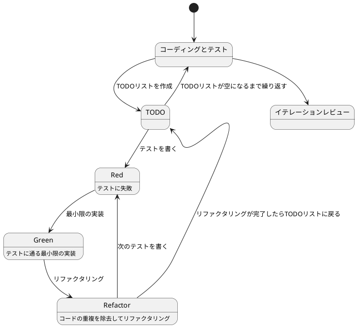

# ぷよぷよから始めるテスト駆動開発入門（C#/Unity 版）

## はじめに

みなさん、こんにちは！今日は私と一緒にテスト駆動開発（TDD）を使って、C# と Unity でぷよぷよゲームを作っていきましょう。さて、プログラミングの旅に出る前に、皆さんは「テスト駆動開発」について聞いたことがありますか？もしかしたら「テストって、コードを書いた後にするものじゃないの？」と思われるかもしれませんね。

> テストを書きながら開発することによって、設計が良い方向に変わり、コードが改善され続け、それによって自分自身が開発に前向きになること、それがテスト駆動開発の目指すゴールです。
>
> — Kent Beck 『テスト駆動開発』 付録C　訳者解説：テスト駆動開発の現在

この記事では、私たちが一緒にぷよぷよゲームを実装しながら、テスト駆動開発の基本的な流れと考え方を学んでいきます。まるでモブプログラミングのセッションのように、あなたと私が一緒に考え、コードを書き、改善していく過程を体験しましょう。「でも、ぷよぷよって結構複雑なゲームじゃないの？」と思われるかもしれませんが、心配いりません。各章では、ユーザーストーリーに基づいた機能を、テスト、実装、解説の順に少しずつ進めていきますよ。一歩一歩、着実に進んでいきましょう！

### テスト駆動開発のサイクル

さて、テスト駆動開発では、どのように進めていけばいいのでしょうか？「テストを書いてから実装する」というのは分かりましたが、具体的にはどんな手順で進めるのでしょうか？

私がいつも実践しているのは、以下の 3 つのステップを繰り返すサイクルです。皆さんも一緒にやってみましょう：

1. **Red（赤）**: まず失敗するテストを書きます。「え？わざと失敗するテストを？」と思われるかもしれませんが、これには重要な意味があるんです。これから実装する機能が何をすべきかを明確にするためなんですよ。
2. **Green（緑）**: 次に、テストが通るように、最小限のコードを実装します。この段階では、きれいなコードよりも「とにかく動くこと」を優先します。「最小限」というのがポイントです。必要以上のことはしないようにしましょう。
3. **Refactor（リファクタリング）**: 最後に、コードの品質を改善します。テストが通ることを確認しながら、重複を取り除いたり、わかりやすい名前をつけたりします。「動くけど汚いコード」から「動いてきれいなコード」へと進化させるんです。

> レッド・グリーン・リファクタリング。それが TDD のマントラだ。
>
> — Kent Beck 『テスト駆動開発』

このサイクルを「Red-Green-Refactor」サイクルと呼びます。「赤・緑・リファクタリング」のリズムを刻むように、このサイクルを繰り返していくんです。これによって、少しずつ機能を追加し、コードの品質を高めていきましょう。皆さんも一緒にこのリズムを体感してみてください！



### 開発環境

さて、実際にコードを書く前に、私たちが使用する開発環境について少しお話ししておきましょう。皆さんは「道具選びは仕事の半分」という言葉を聞いたことがありますか？プログラミングでも同じことが言えるんです。

> 道具はあなたの能力を増幅します。道具のできが優れており、簡単に使いこなせるようになっていれば、より生産的になれるのです。
>
> — 達人プログラマー 熟達に向けたあなたの旅（第 2 版）

「どんなツールを使えばいいの？」と思われるかもしれませんね。今回のプロジェクトでは、以下のツールを使用していきます：

- **言語**: C# — Unity の標準言語で、静的型付けにより安全なコードが書けます。
- **ゲームエンジン**: Unity — 2D/3D ゲーム開発に広く使われている強力なエンジンです。
- **テストフレームワーク**: Unity Test Framework (NUnit ベース) — Unity に組み込まれたテストフレームワークです。
- **バージョン管理**: Git — コードの変更履歴を追跡し、「あれ？昨日までちゃんと動いてたのに...」というときに過去の状態に戻れる魔法のツールです。
- **エディタ**: Visual Studio または Rider — C# 開発に最適化された IDE です。

これらのツールを使って、テスト駆動開発の流れに沿ってぷよぷよゲームを実装していきましょう。「環境構築って難しそう...」と心配される方もいるかもしれませんが手順に従って進めればそんなに難しいことではありません。詳細はイテレーション 0: 環境の構築で解説します。

## リリース計画

さて、「いきなり全部の機能を作るのは大変そう...」と思われますよね？その通りです！アジャイル開発では、大きな目標を小さな反復（イテレーション）に分割して、少しずつ進めていきます。

私たちのぷよぷよゲーム開発も、以下のようなイテレーションに分けて進めていきましょう：

### イテレーション 0: 環境の構築

「まず何から始めればいいの？」そう、最初は開発環境を整えることからですね。Unity プロジェクトの作成、テストフレームワークのセットアップ、そして開発の三種の神器（バージョン管理・テスティング・自動化）を準備します。

### イテレーション 1: ボードの実装

ぷよぷよゲームの基盤となるボード（フィールド）を作ります。「どんな大きさがいいかな？」標準的な 6 列×12 行のボードを実装し、ぷよを配置できるようにしましょう。

### イテレーション 2: ぷよペアの実装

「ぷよって 2 つペアで落ちてくるよね？」そうです！軸ぷよと子ぷよからなるペアを実装し、回転機能も追加します。

### イテレーション 3: 移動と回転

プレイヤーがぷよペアを操作できるようにします。左右移動、回転、そして壁キック（壁際でも回転できる機能）を実装しましょう。

### イテレーション 4: 落下処理

ぷよが自動的に落下する仕組みを作ります。「重力があるゲームだもんね！」そうです、自然な落下を実現しましょう。

### イテレーション 5: 消去判定

同じ色のぷよが 4 つ以上つながったら消える仕組みを実装します。深さ優先探索（DFS）アルゴリズムを使いますよ。

### イテレーション 6: 連鎖システム

「れ〜んさ〜ん！」ぷよぷよの醍醐味、連鎖反応を実装します。連鎖ボーナスでスコアがどんどん上がる楽しさを実現しましょう。

### イテレーション 7: スコアと連鎖数の表示

プレイヤーが現在のスコアと連鎖数を確認できるようにします。「今何点取れてるかな？」という疑問に答えます。

### イテレーション 8: ゲームオーバー判定

ぷよが画面上部まで積み上がったらゲームオーバー。リスタート機能も実装しましょう。

### イテレーション 9: 全消しボーナスと最終調整

「全部消えた！」という気持ちよさを味わえる全消しボーナスを実装し、ゲームを完成させます。

それでは、イテレーション 0 から始めていきましょう！

---

## イテレーション 0: 環境の構築

さて、いよいよコードを書き始める準備をしましょう！「環境構築って面倒くさそう...」と思うかもしれませんが、一度しっかりセットアップしておけば、この後の開発がとても楽になりますよ。

このイテレーションでは、先ほど触れた「ソフトウェア開発の三種の神器」を準備します。

> 今日のソフトウェア開発の世界において絶対になければならない 3 つの技術的な柱があります。
> 三本柱と言ったり、三種の神器と言ったりしていますが、それらは
>
>   - バージョン管理
>   - テスティング
>   - 自動化
>
> の 3 つです。
>
> — https://t-wada.hatenablog.jp/entry/clean-code-that-works

### Unity プロジェクトの作成

まずは Unity プロジェクトを作成しましょう。「Unity って初めてだけど大丈夫かな？」心配いりません、一緒に進めていきましょう。

1. **Unity Hub のインストール**

   Unity Hub は Unity のバージョン管理やプロジェクト管理を行うツールです。[Unity Hub ダウンロードページ](https://unity.com/download)からインストールしましょう。

2. **Unity エディタのインストール**

   Unity Hub を開き、「Installs」タブから Unity エディタをインストールします。今回は Unity 2022.3 LTS（Long Term Support）を使用します。「LTS って何？」長期サポート版のことで、安定性が保証されているバージョンです。

3. **新しいプロジェクトの作成**

   Unity Hub の「Projects」タブから「New project」をクリックします。

   - テンプレート: **2D (Built-in Render Pipeline)** を選択
   - プロジェクト名: `PuyoPuyoTDD`
   - 保存場所: お好きな場所を選択

   「Create project」をクリックしてプロジェクトを作成します。

4. **プロジェクト構造の確認**

   Unity エディタが開いたら、プロジェクト構造を確認しましょう。Project ウィンドウに `Assets` フォルダが見えますね。ここに私たちのコードやリソースを配置していきます。

### Git によるバージョン管理

「コードを書く前にバージョン管理？」そうです！最初から Git を使うことで、変更履歴を追跡し、いつでも過去の状態に戻れるようにします。

1. **Git リポジトリの初期化**

   プロジェクトのルートディレクトリ（`PuyoPuyoTDD` フォルダ）で以下のコマンドを実行します：

   ```bash
   cd PuyoPuyoTDD
   git init
   ```

2. **.gitignore の作成**

   Unity プロジェクトでは、いくつかのファイルやフォルダをバージョン管理から除外する必要があります。「なんで全部管理しないの？」と思うかもしれませんが、自動生成されるファイルや個人設定ファイルは除外した方が良いんです。

   `.gitignore` ファイルを作成して、以下の内容を記述します：

   ```gitignore
   # Unity generated
   [Ll]ibrary/
   [Tt]emp/
   [Oo]bj/
   [Bb]uild/
   [Bb]uilds/
   [Ll]ogs/
   [Uu]ser[Ss]ettings/

   # Visual Studio cache/options
   .vs/
   *.csproj
   *.unityproj
   *.sln
   *.suo
   *.tmp
   *.user
   *.userprefs
   *.pidb
   *.booproj
   *.svd
   *.pdb
   *.mdb
   *.opendb
   *.VC.db

   # Rider
   .idea/

   # OS generated
   .DS_Store
   .DS_Store?
   ._*
   .Spotlight-V100
   .Trashes
   ehthumbs.db
   Thumbs.db
   ```

3. **初回コミット**

   さて、最初のコミットをしましょう！

   ```bash
   git add .
   git commit -m 'chore: Unity プロジェクトの初期化'
   ```

   「`chore` って何？」良い質問ですね！これは Conventional Commits という規約に従ったコミットメッセージのプリフィックスです。`chore` は「雑務・設定変更」を意味します。

### コミットメッセージの規約

コミットメッセージには、以下のような規約があります。これに従うと、後で変更履歴を追いやすくなるんです。

```
<タイプ>(<スコープ>): <タイトル>
```

主なタイプ：

- `feat`: 新機能の追加
- `fix`: バグ修正
- `docs`: ドキュメントのみの変更
- `style`: コードの意味に影響しない変更（空白、フォーマットなど）
- `refactor`: バグ修正や機能追加を伴わないコード変更
- `test`: テストの追加や修正
- `chore`: ビルドプロセスや補助ツールの変更

### Unity Test Framework のセットアップ

次は「テスティング」の準備です。Unity には Unity Test Framework という公式のテストフレームワークが組み込まれています。

1. **Test Runner ウィンドウを開く**

   Unity エディタのメニューから `Window > General > Test Runner` を選択します。

2. **テストアセンブリの作成**

   Test Runner ウィンドウで「Create EditMode Test Assembly Folder」をクリックします。これにより、`Assets/Tests` フォルダが作成されます。

   「EditMode と PlayMode って何が違うの？」良い質問ですね：

   - **EditMode**: Unity エディタ上で実行されるテスト。ゲームロジックの単体テストに使用。
   - **PlayMode**: Unity のゲームモードで実行されるテスト。実際のゲーム動作を統合テスト。

   今回は主に EditMode テストを使用します。

3. **プロダクションコード用のフォルダ構成**

   テストとプロダクションコードを分けて管理しましょう。`Assets` フォルダ内に以下の構造を作ります：

   ```
   Assets/
   ├── Scripts/
   │   ├── Core/          # コアゲームロジック
   │   ├── UI/            # ユーザーインターフェース
   │   └── Utilities/     # ユーティリティクラス
   └── Tests/             # テストコード
       └── EditMode/
   ```

4. **アセンブリ定義の作成**

   Unity では、アセンブリ定義を使ってコードをモジュール化します。「アセンブリって何？」コードのまとまりのことで、これを分けることでビルド時間が短縮されます。

   `Assets/Scripts` フォルダ内で右クリック → `Create > Assembly Definition` を選択し、`PuyoPuyo.asmdef` という名前で作成します。

   `Assets/Tests/EditMode` フォルダにも同様に `PuyoPuyo.Tests.asmdef` を作成し、Inspector で以下のように設定します：

   - Platform: `Editor` のみチェック
   - Assembly Definition References: `PuyoPuyo` を追加
   - `Test Assemblies` にチェック

### 最初のテストを書いてみる

環境が整ったので、本当にテストが動くか確認してみましょう！

`Assets/Tests/EditMode` フォルダに `SampleTest.cs` というファイルを作成します：

```csharp
using NUnit.Framework;

namespace PuyoPuyo.Tests
{
    public class SampleTest
    {
        [Test]
        public void TestExample()
        {
            // Arrange（準備）
            int expected = 4;

            // Act（実行）
            int actual = 2 + 2;

            // Assert（検証）
            Assert.AreEqual(expected, actual);
        }
    }
}
```

「Arrange-Act-Assert って何？」テストコードの基本パターンです：

- **Arrange**: テストに必要な準備をする
- **Act**: 実際にテスト対象を実行する
- **Assert**: 結果が期待通りか検証する

Test Runner ウィンドウで「Run All」をクリックしてテストを実行してみましょう。緑色のチェックマークが表示されれば成功です！

「やった！テストが通った！」素晴らしいですね。これで TDD の準備が整いました。

```bash
git add .
git commit -m 'test: テストフレームワークのセットアップ'
```

### 静的コード解析の設定

良いコードを書き続けるためには、コードの品質をチェックする仕組みが必要です。C# には Roslyn Analyzers という強力な静的コード解析ツールがあります。

1. **EditorConfig の作成**

   プロジェクトのルートディレクトリに `.editorconfig` ファイルを作成します：

   ```ini
   root = true

   [*]
   charset = utf-8
   indent_style = space
   indent_size = 4
   insert_final_newline = true
   trim_trailing_whitespace = true

   [*.cs]
   # C# のコーディング規約
   dotnet_sort_system_directives_first = true
   csharp_new_line_before_open_brace = all
   csharp_prefer_braces = true:warning

   # 命名規則
   dotnet_naming_rule.interface_should_be_begins_with_i.severity = warning
   dotnet_naming_rule.interface_should_be_begins_with_i.symbols = interface
   dotnet_naming_rule.interface_should_be_begins_with_i.style = begins_with_i

   dotnet_naming_symbols.interface.applicable_kinds = interface
   dotnet_naming_symbols.interface.applicable_accessibilities = public, internal, private, protected, protected_internal

   dotnet_naming_style.begins_with_i.required_prefix = I
   dotnet_naming_style.begins_with_i.capitalization = pascal_case
   ```

   「なんだか長い設定だな...」でも、これでコーディングスタイルが統一されるんです。

2. **Roslyn Analyzers の有効化**

   Unity 2020.2 以降、Roslyn Analyzers がデフォルトで有効になっています。コードを書くと、Visual Studio や Rider がリアルタイムで警告を表示してくれます。

   ```bash
   git add .
   git commit -m 'chore: 静的コード解析の設定'
   ```

### コマンドライン開発環境の整備

最後に「自動化」です。Unity をコマンドラインから操作できるようにして、テスト、ビルド、フォーマットなどをターミナルから実行できる環境を整えましょう。

#### Unity のパスを設定

まず、Unity のパスを環境変数として設定しておくと便利です。プロジェクトルートに `unity-config.sh` を作成します：

```bash
#!/bin/bash
# Unity 設定ファイル

# Unity のパス（OS とバージョンに応じて変更してください）
# macOS の場合
UNITY_PATH="/Applications/Unity/Hub/Editor/2022.3.0f1/Unity.app/Contents/MacOS/Unity"

# Linux の場合（例）
# UNITY_PATH="/usr/bin/unity-editor"

# Windows の場合（Git Bash）
# UNITY_PATH="/c/Program Files/Unity/Hub/Editor/2022.3.0f1/Editor/Unity.exe"

export UNITY_PATH
export PROJECT_PATH="$(pwd)"
```

#### テスト実行スクリプト

`scripts/test.sh` を作成します：

```bash
#!/bin/bash
# Unity テスト実行スクリプト

source ./unity-config.sh

echo "🧪 Unity テスト実行中..."
"$UNITY_PATH" -batchmode -nographics \
  -projectPath "$PROJECT_PATH" \
  -runTests \
  -testPlatform EditMode \
  -testResults "$PROJECT_PATH/TestResults.xml" \
  -logFile "$PROJECT_PATH/test.log"

EXIT_CODE=$?

if [ $EXIT_CODE -eq 0 ]; then
    echo "✅ すべてのテストが成功しました"
else
    echo "❌ テストが失敗しました"
    echo "詳細: test.log を確認してください"
fi

exit $EXIT_CODE
```

#### ビルドスクリプト

`scripts/build.sh` を作成します：

```bash
#!/bin/bash
# Unity ビルドスクリプト

source ./unity-config.sh

echo "🔨 Unity プロジェクトをビルド中..."
"$UNITY_PATH" -batchmode -nographics \
  -projectPath "$PROJECT_PATH" \
  -buildTarget StandaloneLinux64 \
  -quit \
  -logFile "$PROJECT_PATH/build.log"

EXIT_CODE=$?

if [ $EXIT_CODE -eq 0 ]; then
    echo "✅ ビルドが成功しました"
else
    echo "❌ ビルドが失敗しました"
    echo "詳細: build.log を確認してください"
fi

exit $EXIT_CODE
```

#### コードフォーマットスクリプト

C# のコードフォーマットには `dotnet format` を使用します。`scripts/format.sh` を作成：

```bash
#!/bin/bash
# C# コードフォーマットスクリプト

echo "✨ コードフォーマット実行中..."

# .csproj ファイルを探す
CSPROJ_FILE=$(find . -name "*.csproj" | head -1)

if [ -z "$CSPROJ_FILE" ]; then
    echo "❌ .csproj ファイルが見つかりません"
    exit 1
fi

dotnet format "$CSPROJ_FILE" --verify-no-changes

if [ $? -eq 0 ]; then
    echo "✅ コードフォーマットOK"
else
    echo "🔄 コードフォーマット適用中..."
    dotnet format "$CSPROJ_FILE"
    echo "✅ コードフォーマット完了"
fi
```

#### 統合チェックスクリプト

すべてのチェックを一括で実行する `scripts/check.sh` を作成：

```bash
#!/bin/bash
# 統合品質チェックスクリプト

set -e  # エラーで停止

echo "=== 品質チェック開始 ==="
echo ""

# フォーマットチェック
echo "1. コードフォーマットチェック"
./scripts/format.sh
echo ""

# テスト実行
echo "2. テスト実行"
./scripts/test.sh
echo ""

echo "=== ✅ すべてのチェックが完了しました ==="
```

#### ファイル監視と自動実行スクリプト

ファイル変更を検知して自動的にチェックを実行する `scripts/watch.sh` を作成：

```bash
#!/bin/bash
# Unity テストの監視と自動実行スクリプト

source ./unity-config.sh

echo "=== Unity Test Watcher ==="
echo "ファイル変更を監視中..."
echo "終了するには Ctrl+C を押してください"
echo ""

# 初回実行
echo "🔄 初回チェック実行..."
./scripts/check.sh || true
echo ""

# ファイル監視
if command -v fswatch &> /dev/null; then
    # macOS
    fswatch -o -e ".*" -i "\\.cs$" Assets/ | while read; do
        echo "📝 変更検出: $(date '+%H:%M:%S')"
        ./scripts/check.sh || true
        echo ""
    done
elif command -v inotifywait &> /dev/null; then
    # Linux
    while true; do
        inotifywait -r -e modify,create,delete --include '\.cs$' Assets/
        echo "📝 変更検出: $(date '+%H:%M:%S')"
        ./scripts/check.sh || true
        echo ""
    done
else
    echo "❌ ファイル監視ツールがインストールされていません"
    echo "macOS: brew install fswatch"
    echo "Linux: sudo apt-get install inotify-tools"
    exit 1
fi
```

#### Cake によるビルド自動化

「ビルド自動化ツールは何を使えばいいですか？」.NET エコシステムでは Cake がよく使われます。Cake は C# で書けるクロスプラットフォームなビルド自動化ツールです。

##### Cakeとは

Cake（C# Make）は、.NET 開発者向けのビルド自動化システムです：

**特徴**
- C# で書けるビルドスクリプト（型安全、IntelliSense 対応）
- クロスプラットフォーム（Windows、macOS、Linux）
- 豊富なアドインとヘルパー
- .NET ツールとの統合

##### Cakeのセットアップ

まず、Cake をローカルツールとしてインストールします：

```bash
# .NET ローカルツールマニフェストを作成
dotnet new tool-manifest

# Cake をインストール
dotnet tool install Cake.Tool
```

次に、ビルドスクリプト `build.cake` をプロジェクトルートに作成します：

```csharp
// build.cake

///////////////////////////////////////////////////////////////////////////////
// 引数
///////////////////////////////////////////////////////////////////////////////

var target = Argument("target", "Default");
var configuration = Argument("configuration", "Release");

///////////////////////////////////////////////////////////////////////////////
// タスク定義
///////////////////////////////////////////////////////////////////////////////

Task("Test")
    .Description("Unity テストを実行")
    .Does(() =>
{
    var exitCode = StartProcess("./scripts/test.sh");
    if (exitCode != 0)
    {
        throw new Exception("テストが失敗しました");
    }
});

Task("Build")
    .Description("Unity プロジェクトをビルド")
    .Does(() =>
{
    var exitCode = StartProcess("./scripts/build.sh");
    if (exitCode != 0)
    {
        throw new Exception("ビルドが失敗しました");
    }
});

Task("Format")
    .Description("コードを自動フォーマット")
    .Does(() =>
{
    StartProcess("./scripts/format.sh");
});

Task("Check")
    .Description("すべての品質チェックを実行")
    .IsDependentOn("Format")
    .IsDependentOn("Test");

Task("Watch")
    .Description("ファイル監視モードで自動テスト実行")
    .Does(() =>
{
    StartProcess("./scripts/watch.sh");
});

///////////////////////////////////////////////////////////////////////////////
// ターゲット
///////////////////////////////////////////////////////////////////////////////

Task("Default")
    .IsDependentOn("Check");

Task("CI")
    .Description("CI環境での完全なビルドとテスト")
    .IsDependentOn("Check")
    .IsDependentOn("Build");

///////////////////////////////////////////////////////////////////////////////
// 実行
///////////////////////////////////////////////////////////////////////////////

RunTarget(target);
```

##### Cakeの実行

Cake スクリプトを実行するには、以下のコマンドを使用します：

```bash
# デフォルトタスク（Check）を実行
dotnet cake

# 特定のタスクを実行
dotnet cake --target=Test
dotnet cake --target=Build
dotnet cake --target=Format
dotnet cake --target=Watch

# CI環境でのビルド
dotnet cake --target=CI
```

##### Cakeの利点

「なぜ Cake を使うのですか？」Cake を使う利点は以下の通りです：

1. **型安全性**：C# で書くのでコンパイル時に型チェックされる
2. **IntelliSense**：Visual Studio Code や Rider で補完が効く
3. **再利用性**：NuGet パッケージとしてビルドロジックを共有できる
4. **統合性**：.NET ツールとシームレスに統合
5. **可読性**：複雑なビルドロジックも構造化して書ける
6. **クロスプラットフォーム**：Windows、macOS、Linux で同じスクリプトが動く

#### スクリプトの実行権限付与

すべてのスクリプトに実行権限を付与します：

```bash
chmod +x unity-config.sh
chmod +x scripts/*.sh
```

#### 使い方

これで、以下のようにコマンドラインから開発できます：

```bash
# テスト実行
dotnet cake --target=Test
# または直接スクリプトを実行
./scripts/test.sh

# ビルド
dotnet cake --target=Build

# コードフォーマット
dotnet cake --target=Format

# すべてのチェック
dotnet cake --target=Check

# ファイル監視モード（開発中はこれを起動）
dotnet cake --target=Watch
```

「すごい！Unity がコマンドラインで使えるようになった！」そうです。これで VS Code やターミナルだけで開発できるようになりました。

```bash
git add .
git commit -m 'chore: コマンドライン開発環境の整備'
```

### イテレーション 0 のまとめ

お疲れ様でした！これで開発環境の準備が整いました。振り返ってみましょう：

1. **バージョン管理**: Git リポジトリを初期化し、`.gitignore` を設定
2. **テスティング**: Unity Test Framework をセットアップし、最初のテストを実行
3. **自動化**: Cake によるビルド自動化とファイル監視スクリプトで自動テスト実行を実現

「ソフトウェア開発の三種の神器」がすべて揃いましたね！これで次のイテレーションから、安心してテスト駆動開発を進めることができます。

次のイテレーションでは、いよいよぷよぷよの基盤となるボードを実装していきますよ。楽しみですね！

```bash
git add .
git commit -m 'docs: イテレーション 0 完了'
```

---

## イテレーション 1: ボードの実装

さあ、いよいよコードを書き始めましょう！テスト駆動開発では、小さなイテレーション（反復）で機能を少しずつ追加していきます。最初のイテレーションでは、ぷよぷよの基盤となるボード（フィールド）を実装します。

> システム構築はどこから始めるべきだろうか。システム構築が終わったらこうなる、というストーリーを語るところからだ。
>
> — Kent Beck 『テスト駆動開発』

### ユーザーストーリー

まずは、このイテレーションで実装するユーザーストーリーを確認しましょう：

> システムとして、6 列×12 行のボードを持つ

「システムとして」というのは、プレイヤーには直接見えない内部的な機能という意味です。このボードが、これから実装するすべての機能の土台となります。

### TODOリスト

さて、ユーザーストーリーを実装するために、まずは TODO リストを作成しましょう。TODO リストは、大きな機能を小さなタスクに分解するのに役立ちます。

> 何をテストすべきだろうか - 着手する前に、必要になりそうなテストをリストに書き出しておこう。
>
> — Kent Beck 『テスト駆動開発』

ボードの実装に必要なタスクを考えてみましょう：

- ボードを作成できる（6 列×12 行のサイズで初期化）
- ボードの特定の位置にぷよを配置できる
- ボードの特定の位置のぷよを取得できる
- ボードの範囲外のチェックができる（壁判定）
- ボードをクリアできる（すべてのぷよを削除）

これらのタスクを一つずつテスト駆動開発のサイクルで実装していきましょう！

### テスト: ボードの作成

テスト駆動開発では、まずテストを書くことから始めます。

> テストファースト
>
> いつテストを書くべきだろうか——それはテスト対象のコードを書く前だ。
>
> — Kent Beck 『テスト駆動開発』

`Assets/Tests/EditMode` フォルダに `BoardTest.cs` を作成します：

```csharp
using NUnit.Framework;
using PuyoPuyo.Core;

namespace PuyoPuyo.Tests
{
    public class BoardTest
    {
        [Test]
        public void ボードを作成すると6列12行で初期化される()
        {
            // Arrange & Act
            Board board = new Board();

            // Assert
            Assert.AreEqual(6, board.Cols);
            Assert.AreEqual(12, board.Rows);
        }

        [Test]
        public void 新規作成したボードはすべての位置が空である()
        {
            // Arrange
            Board board = new Board();

            // Act & Assert
            for (int row = 0; row < board.Rows; row++)
            {
                for (int col = 0; col < board.Cols; col++)
                {
                    Assert.AreEqual(PuyoColor.None, board.Get(row, col));
                }
            }
        }
    }
}
```

「Arrange-Act-Assert って何？」良い質問ですね！これはテストコードの基本パターンです：

- **Arrange（準備）**: テストに必要な準備をする
- **Act（実行）**: 実際にテスト対象を実行する
- **Assert（検証）**: 結果が期待通りか検証する

このテストでは、`Board` クラスが正しく初期化され、すべての位置が空（`PuyoColor.None`）であることを確認しています。

### 実装: ボードの作成

テストを書いたら、次に実行してみましょう。どうなるでしょうか？

Test Runner で「Run All」をクリックすると...

```
error CS0246: The type or namespace name 'Board' could not be found
error CS0246: The type or namespace name 'PuyoColor' could not be found
```

おっと！まだ `Board` クラスも `PuyoColor` も実装していないので、当然エラーになりますね。これがテスト駆動開発の「Red（赤）」の状態です。

> 明白な実装
>
> シンプルな操作をどう実装すればいいだろうか。ただ実装すればいいのだ。
>
> — Kent Beck 『テスト駆動開発』

では、テストが通るように最小限のコードを実装していきましょう。

まず、`Assets/Scripts/Core` フォルダに `PuyoColor.cs` を作成します：

```csharp
namespace PuyoPuyo.Core
{
    public enum PuyoColor
    {
        None = 0,   // 空
        Red,        // 赤
        Blue,       // 青
        Green,      // 緑
        Yellow      // 黄
    }
}
```

「なんで enum なの？」良い質問ですね！enum（列挙型）を使うことで、ぷよの色を型安全に扱えるんです。`int` で `1, 2, 3...` と管理するよりも、`PuyoColor.Red` のように意味が明確になりますよね。

次に、`Assets/Scripts/Core` フォルダに `Board.cs` を作成します：

```csharp
namespace PuyoPuyo.Core
{
    public class Board
    {
        private const int COLS = 6;
        private const int ROWS = 12;
        
        private PuyoColor[,] cells;

        public int Cols => COLS;
        public int Rows => ROWS;

        public Board()
        {
            cells = new PuyoColor[ROWS, COLS];
            Clear();
        }

        public PuyoColor Get(int row, int col)
        {
            return cells[row, col];
        }

        public void Clear()
        {
            for (int row = 0; row < ROWS; row++)
            {
                for (int col = 0; col < COLS; col++)
                {
                    cells[row, col] = PuyoColor.None;
                }
            }
        }
    }
}
```

テストを実行してみましょう：

```
✅ ボードを作成すると6列12行で初期化される
✅ 新規作成したボードはすべての位置が空である
```

やった！テストが通りました。これがテスト駆動開発の「Green（緑）」の状態です。

### 解説: ボードの実装

実装したボードについて、少し解説しておきましょう：

1. **定数の使用**: `COLS` と `ROWS` を定数として定義しています。「なぜ？」というと、マジックナンバー（突然現れる数字）を避けるためです。

2. **2 次元配列**: `PuyoColor[,] cells` で 2 次元配列を使っています。C# では `[row, col]` の順序でアクセスします。

3. **プロパティ**: `public int Cols => COLS;` は読み取り専用プロパティです。外部からは値を読めますが、変更できません。

4. **Clear メソッド**: すべての位置を `PuyoColor.None` で埋める処理です。コンストラクタからも呼び出しています。

### テスト: ぷよの配置と取得

次に、ボードにぷよを配置し、取得できることをテストしましょう。

```csharp
// BoardTest.cs に追加
[Test]
public void ぷよを配置して取得できる()
{
    // Arrange
    Board board = new Board();

    // Act
    board.Set(0, 2, PuyoColor.Red);

    // Assert
    Assert.AreEqual(PuyoColor.Red, board.Get(0, 2));
}

[Test]
public void 異なる位置に異なる色のぷよを配置できる()
{
    // Arrange
    Board board = new Board();

    // Act
    board.Set(0, 1, PuyoColor.Blue);
    board.Set(1, 2, PuyoColor.Green);
    board.Set(2, 3, PuyoColor.Yellow);

    // Assert
    Assert.AreEqual(PuyoColor.Blue, board.Get(0, 1));
    Assert.AreEqual(PuyoColor.Green, board.Get(1, 2));
    Assert.AreEqual(PuyoColor.Yellow, board.Get(2, 3));
}
```

テストを実行すると、`Set` メソッドが未定義なのでエラーになります。これが「Red」の状態ですね。

### 実装: ぷよの配置

`Board.cs` に `Set` メソッドを追加します：

```csharp
public void Set(int row, int col, PuyoColor color)
{
    cells[row, col] = color;
}
```

「シンプル！」そうです、最小限の実装を心がけます。テストを実行してみましょう：

```
✅ ぷよを配置して取得できる
✅ 異なる位置に異なる色のぷよを配置できる
```

素晴らしい！Green になりました。

### テスト: 範囲外チェック

ボードの外にぷよを配置しようとしたらどうなるでしょうか？壁や天井にぶつかる判定が必要ですね。

```csharp
// BoardTest.cs に追加
[Test]
public void 範囲内の座標はIsInBoundsがtrueを返す()
{
    // Arrange
    Board board = new Board();

    // Act & Assert
    Assert.IsTrue(board.IsInBounds(0, 0));
    Assert.IsTrue(board.IsInBounds(11, 5));
    Assert.IsTrue(board.IsInBounds(5, 3));
}

[Test]
public void 範囲外の座標はIsInBoundsがfalseを返す()
{
    // Arrange
    Board board = new Board();

    // Act & Assert
    Assert.IsFalse(board.IsInBounds(-1, 2)); // 上に出る
    Assert.IsFalse(board.IsInBounds(12, 2)); // 下に出る
    Assert.IsFalse(board.IsInBounds(5, -1)); // 左に出る
    Assert.IsFalse(board.IsInBounds(5, 6));  // 右に出る
}
```

### 実装: 範囲外チェック

`Board.cs` に `IsInBounds` メソッドを追加します：

```csharp
public bool IsInBounds(int row, int col)
{
    return row >= 0 && row < ROWS && col >= 0 && col < COLS;
}
```

テストを実行：

```
✅ 範囲内の座標はIsInBoundsがtrueを返す
✅ 範囲外の座標はIsInBoundsがfalseを返す
```

完璧です！

### リファクタリング: ボードのクリア

現在のコードを見てみましょう。`Clear` メソッドは正しく動作していますが、テストがまだありませんね。「テストのないコードは動いていないコードと同じ」という考え方もあります。

テストを追加しましょう：

```csharp
// BoardTest.cs に追加
[Test]
public void Clearを呼ぶとすべての位置が空になる()
{
    // Arrange
    Board board = new Board();
    board.Set(0, 2, PuyoColor.Red);
    board.Set(1, 3, PuyoColor.Blue);
    board.Set(2, 4, PuyoColor.Green);

    // Act
    board.Clear();

    // Assert
    for (int row = 0; row < board.Rows; row++)
    {
        for (int col = 0; col < board.Cols; col++)
        {
            Assert.AreEqual(PuyoColor.None, board.Get(row, col));
        }
    }
}
```

テストを実行すると、既存の実装で通ります。これで安心してリファクタリングできますね。

### イテレーション 1 のまとめ

お疲れ様でした！イテレーション 1 で実装した内容を振り返ってみましょう：

1. **PuyoColor 列挙型**: ぷよの色を型安全に管理
2. **Board クラス**: 6 列×12 行のボードを実装
   - `Get(row, col)`: ぷよの取得
   - `Set(row, col, color)`: ぷよの配置
   - `IsInBounds(row, col)`: 範囲チェック
   - `Clear()`: ボードのクリア

すべての機能にテストがあり、安心してコードを変更できる状態になりました。これがテスト駆動開発の大きなメリットです！

> テストは開発者を解放する。テストのおかげで、恐れることなくコードをリファクタリングできる。
>
> — Robert C. Martin 『Clean Code』

次のイテレーションでは、ぷよペアを実装していきます。楽しみですね！

```bash
git add .
git commit -m 'feat: ボードの基本機能を実装'
```

---

## イテレーション 2: ぷよペアの実装

前回のイテレーションでボードができましたね。「でも、ぷよぷよって 2 つのぷよがペアで落ちてくるゲームじゃないの？」そうです！今回は、軸ぷよと子ぷよからなる「ぷよペア」を実装していきましょう。

> システム構築はどこから始めるべきだろうか。システム構築が終わったらこうなる、というストーリーを語るところからだ。
>
> — Kent Beck 『テスト駆動開発』

### ユーザーストーリー

まずは、このイテレーションで実装するユーザーストーリーを確認しましょう：

> システムとして、軸ぷよと子ぷよからなるペアを持つ

「軸ぷよと子ぷよ？」良い質問ですね！ぷよぷよでは、2 つのぷよがペアで落ちてきます。中心となる「軸ぷよ」と、その周りを回転する「子ぷよ」です。このペアを回転させることで、戦略的にぷよを配置できるんです。

### TODOリスト

ぷよペアを実装するために必要なタスクを考えてみましょう：

- ぷよペアを作成できる（軸ぷよと子ぷよの位置と色を持つ）
- ぷよペアを回転できる（右回転・左回転）
- ぷよペアの衝突判定ができる（ボードや他のぷよとの重なりをチェック）
- ぷよペアをボードに配置できる（着地時にボードに固定する）

これらのタスクを一つずつテスト駆動開発で実装していきましょう！

### テスト: ぷよペアの作成

テスト駆動開発では、まずテストを書くことから始めます。

> テストファースト
>
> いつテストを書くべきだろうか——それはテスト対象のコードを書く前だ。
>
> — Kent Beck 『テスト駆動開発』

`Assets/Tests/EditMode` フォルダに `PairTest.cs` を作成します：

```csharp
using NUnit.Framework;
using PuyoPuyo.Core;

namespace PuyoPuyo.Tests
{
    public class PairTest
    {
        [Test]
        public void ぷよペアを作成すると軸ぷよと子ぷよが設定される()
        {
            // Arrange & Act
            Pair pair = new Pair(2, 0, PuyoColor.Red, PuyoColor.Blue);

            // Assert
            Assert.AreEqual(2, pair.AxisX);
            Assert.AreEqual(0, pair.AxisY);
            Assert.AreEqual(PuyoColor.Red, pair.AxisColor);
            Assert.AreEqual(PuyoColor.Blue, pair.ChildColor);
        }

        [Test]
        public void 初期状態では子ぷよは軸ぷよの上にある()
        {
            // Arrange & Act
            Pair pair = new Pair(2, 1, PuyoColor.Red, PuyoColor.Blue);

            // Assert
            Assert.AreEqual(2, pair.ChildX);
            Assert.AreEqual(0, pair.ChildY); // 軸ぷよの上（Y座標が1小さい）
        }
    }
}
```

「なぜ子ぷよが上にあるの？」良い質問ですね！ぷよぷよでは、画面の上から落ちてくるので、最初は子ぷよが軸ぷよの上にあります。Y 座標は上が小さく、下が大きいので、子ぷよの Y 座標は軸ぷよより 1 小さくなります。

### 実装: ぷよペアの作成

テストを実行すると、`Pair` クラスが未定義なのでエラーになります。これが「Red」の状態ですね。

> 明白な実装
>
> シンプルな操作をどう実装すればいいだろうか。ただ実装すればいいのだ。
>
> — Kent Beck 『テスト駆動開発』

`Assets/Scripts/Core` フォルダに `Pair.cs` を作成します：

```csharp
namespace PuyoPuyo.Core
{
    public class Pair
    {
        // 軸ぷよの位置と色
        public int AxisX { get; private set; }
        public int AxisY { get; private set; }
        public PuyoColor AxisColor { get; private set; }

        // 子ぷよの位置と色
        public int ChildX { get; private set; }
        public int ChildY { get; private set; }
        public PuyoColor ChildColor { get; private set; }

        // 回転状態（0: 上, 1: 右, 2: 下, 3: 左）
        private int rotation;

        public Pair(int axisX, int axisY, PuyoColor axisColor, PuyoColor childColor)
        {
            AxisX = axisX;
            AxisY = axisY;
            AxisColor = axisColor;
            ChildColor = childColor;
            rotation = 0; // 初期状態は子ぷよが上

            // 初期位置を計算
            UpdateChildPosition();
        }

        private void UpdateChildPosition()
        {
            // 回転状態に応じて子ぷよの位置を計算
            switch (rotation)
            {
                case 0: // 上
                    ChildX = AxisX;
                    ChildY = AxisY - 1;
                    break;
                case 1: // 右
                    ChildX = AxisX + 1;
                    ChildY = AxisY;
                    break;
                case 2: // 下
                    ChildX = AxisX;
                    ChildY = AxisY + 1;
                    break;
                case 3: // 左
                    ChildX = AxisX - 1;
                    ChildY = AxisY;
                    break;
            }
        }
    }
}
```

テストを実行してみましょう：

```bash
dotnet cake --target=Test
```

```
✅ ぷよペアを作成すると軸ぷよと子ぷよが設定される
✅ 初期状態では子ぷよは軸ぷよの上にある
```

やった！Green になりました。

### 解説: ぷよペアの実装

実装したぷよペアについて解説しておきましょう：

1. **プロパティ**: 軸ぷよと子ぷよの位置（X, Y）と色を持ちます。`private set` で外部から変更できないようにしています。

2. **回転状態**: `rotation` フィールドで回転状態を管理します。0〜3 の値で、上→右→下→左の順に回転します。

3. **子ぷよの位置計算**: `UpdateChildPosition` メソッドで、回転状態に応じて子ぷよの位置を計算します。

### テスト: ぷよペアの回転

次に、ぷよペアを回転させる機能をテストします。

```csharp
// PairTest.cs に追加
[Test]
public void 右回転すると子ぷよが時計回りに90度回転する()
{
    // Arrange
    Pair pair = new Pair(2, 1, PuyoColor.Red, PuyoColor.Blue);
    // 初期状態: 子ぷよは上 (2, 0)

    // Act
    pair.RotateRight();

    // Assert
    Assert.AreEqual(3, pair.ChildX); // 右に移動
    Assert.AreEqual(1, pair.ChildY); // 同じ高さ
}

[Test]
public void 右回転を4回すると元の位置に戻る()
{
    // Arrange
    Pair pair = new Pair(2, 1, PuyoColor.Red, PuyoColor.Blue);

    // Act
    pair.RotateRight();
    pair.RotateRight();
    pair.RotateRight();
    pair.RotateRight();

    // Assert
    Assert.AreEqual(2, pair.ChildX);
    Assert.AreEqual(0, pair.ChildY); // 元の位置
}

[Test]
public void 左回転すると子ぷよが反時計回りに90度回転する()
{
    // Arrange
    Pair pair = new Pair(2, 1, PuyoColor.Red, PuyoColor.Blue);
    // 初期状態: 子ぷよは上 (2, 0)

    // Act
    pair.RotateLeft();

    // Assert
    Assert.AreEqual(1, pair.ChildX); // 左に移動
    Assert.AreEqual(1, pair.ChildY); // 同じ高さ
}
```

「回転を 4 回すると元に戻る？」そうです！360 度回転すると元の位置に戻りますからね。このテストで、回転の計算が正しいことを確認できます。

### 実装: ぷよペアの回転

`Pair.cs` に回転メソッドを追加します：

```csharp
public void RotateRight()
{
    rotation = (rotation + 1) % 4;
    UpdateChildPosition();
}

public void RotateLeft()
{
    rotation = (rotation + 3) % 4; // -1 と同じ（モジュロ演算）
    UpdateChildPosition();
}
```

「`rotation + 3` で左回転？」良い質問ですね！`-1 % 4` は C# では負の値になることがあるので、`+3` を使います。これは `-1` と同じ効果があります（0→3、1→0、2→1、3→2）。

テストを実行：

```
✅ 右回転すると子ぷよが時計回りに90度回転する
✅ 右回転を4回すると元の位置に戻る
✅ 左回転すると子ぷよが反時計回りに90度回転する
```

完璧です！

### テスト: 衝突判定

ぷよペアがボードや他のぷよと重ならないようにチェックする機能をテストします。

```csharp
// PairTest.cs に追加
[Test]
public void ボード範囲内にある場合は衝突しない()
{
    // Arrange
    Board board = new Board();
    Pair pair = new Pair(2, 1, PuyoColor.Red, PuyoColor.Blue);

    // Act
    bool collision = pair.IsCollision(board, 2, 1, 2, 0);

    // Assert
    Assert.IsFalse(collision);
}

[Test]
public void 軸ぷよがボード範囲外の場合は衝突する()
{
    // Arrange
    Board board = new Board();
    Pair pair = new Pair(2, 1, PuyoColor.Red, PuyoColor.Blue);

    // Act
    bool collision = pair.IsCollision(board, -1, 1, 2, 0); // 軸ぷよが左端外

    // Assert
    Assert.IsTrue(collision);
}

[Test]
public void 子ぷよがボード範囲外の場合は衝突する()
{
    // Arrange
    Board board = new Board();
    Pair pair = new Pair(0, 1, PuyoColor.Red, PuyoColor.Blue);

    // Act
    bool collision = pair.IsCollision(board, 0, 1, -1, 1); // 子ぷよが左端外

    // Assert
    Assert.IsTrue(collision);
}

[Test]
public void 軸ぷよの位置にぷよがある場合は衝突する()
{
    // Arrange
    Board board = new Board();
    board.Set(1, 2, PuyoColor.Red); // (1, 2) に配置
    Pair pair = new Pair(2, 1, PuyoColor.Red, PuyoColor.Blue);

    // Act
    bool collision = pair.IsCollision(board, 2, 1, 2, 0); // 軸ぷよが (2, 1) に配置されようとする

    // Assert
    Assert.IsFalse(collision); // (2, 1) は空なので衝突しない
    
    // 軸ぷよを既存のぷよと同じ位置に
    collision = pair.IsCollision(board, 2, 1, 2, 0);
    Assert.IsFalse(collision);

    // 軸ぷよを (1, 2) に配置しようとする
    collision = pair.IsCollision(board, 1, 2, 2, 0);
    Assert.IsTrue(collision); // 衝突する
}

[Test]
public void 子ぷよの位置にぷよがある場合は衝突する()
{
    // Arrange
    Board board = new Board();
    board.Set(0, 2, PuyoColor.Red); // (0, 2) に配置
    Pair pair = new Pair(2, 1, PuyoColor.Red, PuyoColor.Blue);

    // Act
    bool collision = pair.IsCollision(board, 2, 1, 0, 2); // 子ぷよが (0, 2)

    // Assert
    Assert.IsTrue(collision); // 衝突する
}
```

### 実装: 衝突判定

`Pair.cs` に衝突判定メソッドを追加します：

```csharp
public bool IsCollision(Board board, int axisX, int axisY, int childX, int childY)
{
    // 軸ぷよの範囲チェック
    if (!board.IsInBounds(axisY, axisX))
    {
        return true;
    }

    // 子ぷよの範囲チェック
    if (!board.IsInBounds(childY, childX))
    {
        return true;
    }

    // 軸ぷよの位置にぷよがあるかチェック
    if (board.Get(axisY, axisX) != PuyoColor.None)
    {
        return true;
    }

    // 子ぷよの位置にぷよがあるかチェック
    if (board.Get(childY, childX) != PuyoColor.None)
    {
        return true;
    }

    return false; // 衝突なし
}
```

「引数で位置を渡すんですね？」そうです！回転後の位置でチェックしたい場合もあるので、引数で位置を指定できるようにしています。

テストを実行：

```
✅ ボード範囲内にある場合は衝突しない
✅ 軸ぷよがボード範囲外の場合は衝突する
✅ 子ぷよがボード範囲外の場合は衝突する
✅ 軸ぷよの位置にぷよがある場合は衝突する
✅ 子ぷよの位置にぷよがある場合は衝突する
```

素晴らしい！すべて Green です。

### リファクタリング

現在のコードを見てみましょう。衝突判定で少し重複がありますね。リファクタリングしてみましょう。

> リファクタリングのタイミング
>
> いつリファクタリングすべきだろうか。テストがグリーンになったときだ。
>
> — Kent Beck 『テスト駆動開発』

実は、現在のコードは既に十分シンプルで、大きな改善の余地はありません。強いて言えば、衝突チェックを小さなメソッドに分けることもできますが、現時点では可読性が十分なのでそのままにしておきましょう。

### イテレーション 2 のまとめ

お疲れ様でした！イテレーション 2 で実装した内容を振り返ってみましょう：

1. **Pair クラス**: ぷよペアの実装
   - 軸ぷよと子ぷよの位置と色
   - 回転状態の管理
   - `RotateRight()`, `RotateLeft()`: 回転機能
   - `IsCollision()`: 衝突判定
   - `UpdateChildPosition()`: 子ぷよの位置計算

2. **テスト**: すべての機能にテストがあり、安心してコードを変更できる状態

ぷよペアができたので、次のイテレーションでは、このペアを実際に動かす機能を実装していきます！

```bash
git add .
git commit -m 'feat: ぷよペアの実装'
```

---

## イテレーション 3: 移動と回転

「ぷよペアができたので、次はこれを実際に動かしていきたいですね！」そうですね！このイテレーションでは、ぷよペアを左右に移動させたり、下に落としたり、回転させたりする機能を実装していきます。

### ユーザーストーリー

まずは、このイテレーションで実装するユーザーストーリーを確認しましょう：

> プレイヤーとして、落ちてくるぷよペアを左右に移動できる
>
> プレイヤーとして、落ちてくるぷよペアを下に移動できる
>
> プレイヤーとして、落ちてくるぷよペアを回転できる

「移動と回転って、ゲームの基本操作ですよね！」そうです！これらの操作ができるようになると、ぷよぷよらしくなってきます。

### TODO リスト

さて、このユーザーストーリーを実現するために、どんなタスクが必要でしょうか？一緒に考えてみましょう：

- 左に移動する機能を実装する
- 右に移動する機能を実装する
- 下に移動する機能を実装する
- 移動時の衝突判定を実装する
- 回転時の壁キック機能を実装する

「なるほど、順番に実装していけばいいんですね！」そうです。テスト駆動開発の流れに沿って、まずはテストから書いていきましょう！

### テスト: 左右への移動

「最初に何をテストすればいいんでしょうか？」まずは、ぷよペアが左右に移動できることをテストしていきましょう。

> テストファースト
>
> いつテストを書くべきだろうか——それはテスト対象のコードを書く前だ。
>
> — Kent Beck 『テスト駆動開発』

```csharp
// Assets/Scripts/Tests/EditMode/PairTest.cs に追加
[Test]
public void ぷよペアは左に移動できる()
{
    // Arrange
    var board = new Board();
    var pair = new Pair(3, 5, PuyoColor.Red, PuyoColor.Blue);

    // Act
    pair.MoveLeft(board);

    // Assert
    Assert.AreEqual(2, pair.AxisX);
    Assert.AreEqual(5, pair.AxisY);
}

[Test]
public void ぷよペアは右に移動できる()
{
    // Arrange
    var board = new Board();
    var pair = new Pair(3, 5, PuyoColor.Red, PuyoColor.Blue);

    // Act
    pair.MoveRight(board);

    // Assert
    Assert.AreEqual(4, pair.AxisX);
    Assert.AreEqual(5, pair.AxisY);
}

[Test]
public void 左端では左に移動できない()
{
    // Arrange
    var board = new Board();
    var pair = new Pair(0, 5, PuyoColor.Red, PuyoColor.Blue);

    // Act
    pair.MoveLeft(board);

    // Assert - 位置が変わっていないことを確認
    Assert.AreEqual(0, pair.AxisX);
}

[Test]
public void 右端では右に移動できない()
{
    // Arrange
    var board = new Board();
    var pair = new Pair(5, 5, PuyoColor.Red, PuyoColor.Blue);

    // Act
    pair.MoveRight(board);

    // Assert - 位置が変わっていないことを確認
    Assert.AreEqual(5, pair.AxisX);
}
```

「このテストでは何を確認しているんですか？」このテストでは、以下の4つのケースを確認しています：

1. ぷよペアが左に移動できるか
2. ぷよペアが右に移動できるか
3. 左端では左に移動できないか（境界チェック）
4. 右端では右に移動できないか（境界チェック）

「境界チェックって重要なんですね！」そうです！ゲームでは、プレイヤーが画面の外に行かないようにする必要があります。これを怠ると、バグの原因になってしまうんですよ。

### 実装: 左右への移動

テストを書いたら、次に実装しましょう。どうなるでしょうか？

```bash
dotnet cake --target=Test
```

```
undefined: Pair.MoveLeft
undefined: Pair.MoveRight
```

おっと！`MoveLeft`と`MoveRight`がまだ定義されていませんね。これがテスト駆動開発の「Red（赤）」の状態です。

> 明白な実装
>
> シンプルな操作をどう実装すればいいだろうか。ただ実装すればいいのだ。
>
> — Kent Beck 『テスト駆動開発』

では、テストを通すための実装を書いていきましょう：

```csharp
// Assets/Scripts/Core/Pair.cs に追加
public void MoveLeft(Board board)
{
    // 左に移動できるかチェック
    int newAxisX = AxisX - 1;
    int newChildX = ChildX - 1;

    if (!IsCollision(board, newAxisX, AxisY, newChildX, ChildY))
    {
        AxisX = newAxisX;
        UpdateChildPosition();
    }
}

public void MoveRight(Board board)
{
    // 右に移動できるかチェック
    int newAxisX = AxisX + 1;
    int newChildX = ChildX + 1;

    if (!IsCollision(board, newAxisX, AxisY, newChildX, ChildY))
    {
        AxisX = newAxisX;
        UpdateChildPosition();
    }
}
```

「なるほど、`IsCollision`を使って移動できるかチェックするんですね！」そうです。移動先の座標で衝突判定を行い、衝突しない場合のみ移動します。

テストを実行してみましょう：

```bash
dotnet cake --target=Test
```

```
✅ ぷよペアは左に移動できる
✅ ぷよペアは右に移動できる
✅ 左端では左に移動できない
✅ 右端では右に移動できない
```

やった！テストが通りました。これが「Green（緑）」の状態です。

### テスト: 下への移動

次は、下に移動する機能をテストしましょう。

```csharp
// Assets/Scripts/Tests/EditMode/PairTest.cs に追加
[Test]
public void ぷよペアは下に移動できる()
{
    // Arrange
    var board = new Board();
    var pair = new Pair(3, 5, PuyoColor.Red, PuyoColor.Blue);

    // Act
    pair.MoveDown(board);

    // Assert
    Assert.AreEqual(3, pair.AxisX);
    Assert.AreEqual(6, pair.AxisY);
}

[Test]
public void 下にぷよがある場合は下に移動できない()
{
    // Arrange
    var board = new Board();
    board.Set(7, 3, PuyoColor.Green); // 下にぷよを配置
    var pair = new Pair(3, 5, PuyoColor.Red, PuyoColor.Blue);

    // Act
    pair.MoveDown(board);

    // Assert - 位置が変わっていないことを確認
    Assert.AreEqual(5, pair.AxisY);
}

[Test]
public void 下に移動できるかチェックできる()
{
    // Arrange
    var board = new Board();
    var pair = new Pair(3, 5, PuyoColor.Red, PuyoColor.Blue);

    // Act
    bool canMove = pair.CanMoveDown(board);

    // Assert
    Assert.IsTrue(canMove);
}

[Test]
public void 下にぷよがある場合は移動できないと判定される()
{
    // Arrange
    var board = new Board();
    board.Set(7, 3, PuyoColor.Green);
    var pair = new Pair(3, 5, PuyoColor.Red, PuyoColor.Blue);

    // Act
    bool canMove = pair.CanMoveDown(board);

    // Assert
    Assert.IsFalse(canMove);
}
```

「`CanMoveDown`メソッドも追加したんですね！」そうです。後でゲームロジックを実装するときに、「下に移動できるか」を確認する必要があるので、そのためのメソッドを用意しておきます。

### 実装: 下への移動

テストを通すための実装を書きましょう：

```csharp
// Assets/Scripts/Core/Pair.cs に追加
public void MoveDown(Board board)
{
    // 下に移動できるかチェック
    int newAxisY = AxisY + 1;
    int newChildY = ChildY + 1;

    if (!IsCollision(board, AxisX, newAxisY, ChildX, newChildY))
    {
        AxisY = newAxisY;
        UpdateChildPosition();
    }
}

public bool CanMoveDown(Board board)
{
    // 下に移動できるかチェック
    int newAxisY = AxisY + 1;
    int newChildY = ChildY + 1;

    return !IsCollision(board, AxisX, newAxisY, ChildX, newChildY);
}
```

テストを実行してみましょう：

```bash
dotnet cake --target=Test
```

```
✅ ぷよペアは下に移動できる
✅ 下にぷよがある場合は下に移動できない
✅ 下に移動できるかチェックできる
✅ 下にぷよがある場合は移動できないと判定される
```

素晴らしい！すべてのテストが通りました。

### テスト: 壁キック機能

「壁キック機能って何ですか？」良い質問ですね！壁キックとは、壁際でぷよペアを回転させたとき、壁にめり込んでしまう場合に、自動的に少し位置をずらして回転を可能にする機能です。プレイヤーの操作性を向上させるための工夫なんですよ。

```csharp
// Assets/Scripts/Tests/EditMode/PairTest.cs に追加
[Test]
public void 右端で右回転すると壁キックで左に移動する()
{
    // Arrange
    var board = new Board();
    var pair = new Pair(5, 5, PuyoColor.Red, PuyoColor.Blue);
    // rotation = 0（子ぷよが上）

    // Act
    pair.RotateRight(); // rotation = 1（子ぷよが右）になるはず

    // Assert - 壁キックで左に移動している
    Assert.AreEqual(4, pair.AxisX);
    Assert.AreEqual(5, pair.ChildX); // 子ぷよは右隣
}

[Test]
public void 左端で左回転すると壁キックで右に移動する()
{
    // Arrange
    var board = new Board();
    var pair = new Pair(0, 5, PuyoColor.Red, PuyoColor.Blue);
    // rotation = 0（子ぷよが上）

    // Act
    pair.RotateLeft(); // rotation = 3（子ぷよが左）になるはず

    // Assert - 壁キックで右に移動している
    Assert.AreEqual(1, pair.AxisX);
    Assert.AreEqual(0, pair.ChildX); // 子ぷよは左隣
}
```

「このテストでは何を確認しているんですか？」このテストでは、以下の2つのケースを確認しています：

1. 右端で時計回りに回転すると、壁キックで左に1マス移動して回転するか
2. 左端で反時計回りに回転すると、壁キックで右に1マス移動して回転するか

### 実装: 壁キック機能

現在の`RotateRight`と`RotateLeft`メソッドを壁キック機能に対応させましょう：

```csharp
// Assets/Scripts/Core/Pair.cs を修正
public void RotateRight()
{
    rotation = (rotation + 1) % 4;
    UpdateChildPosition();

    // 壁キックのチェック
    // 回転後、子ぷよが画面外に出る場合は軸ぷよを調整
    if (ChildX < 0)
    {
        AxisX -= ChildX; // 右に移動
        UpdateChildPosition();
    }
    else if (ChildX >= Board.COLS)
    {
        AxisX -= (ChildX - Board.COLS + 1); // 左に移動
        UpdateChildPosition();
    }
}

public void RotateLeft()
{
    rotation = (rotation + 3) % 4; // -1 と同じ（モジュロ演算）
    UpdateChildPosition();

    // 壁キックのチェック
    // 回転後、子ぷよが画面外に出る場合は軸ぷよを調整
    if (ChildX < 0)
    {
        AxisX -= ChildX; // 右に移動
        UpdateChildPosition();
    }
    else if (ChildX >= Board.COLS)
    {
        AxisX -= (ChildX - Board.COLS + 1); // 左に移動
        UpdateChildPosition();
    }
}
```

「なるほど、回転後に子ぷよの位置をチェックして、画面外に出ていたら軸ぷよを移動させるんですね！」そうです。これにより、プレイヤーが壁際でも回転できるようになり、操作性が向上します。

しかし、ここで問題があります。`Board.COLS`という定数にアクセスしていますが、これは外部から参照できるようにする必要があります。

```csharp
// Assets/Scripts/Core/Board.cs を修正
public class Board
{
    public const int COLS = 6;
    public const int ROWS = 12;

    private PuyoColor[,] cells;

    public int Cols => COLS;
    public int Rows => ROWS;

    // 以下省略...
}
```

「`const`を`public`にしたんですね！」そうです。これで`Pair`クラスから`Board.COLS`にアクセスできるようになります。

テストを実行してみましょう：

```bash
dotnet cake --target=Test
```

```
✅ 右端で右回転すると壁キックで左に移動する
✅ 左端で左回転すると壁キックで右に移動する
```

やった！壁キック機能が実装できました！

### リファクタリング

テストが通ったので、リファクタリングの機会を探しましょう。`RotateRight`と`RotateLeft`で壁キックのロジックが重複していますね。これを共通化してみましょう。

> リファクタリングのタイミング
>
> いつリファクタリングすべきだろうか。テストがグリーンになったときだ。
>
> — Kent Beck 『テスト駆動開発』

```csharp
// Assets/Scripts/Core/Pair.cs を修正
public void RotateRight()
{
    rotation = (rotation + 1) % 4;
    UpdateChildPosition();
    ApplyWallKick();
}

public void RotateLeft()
{
    rotation = (rotation + 3) % 4; // -1 と同じ（モジュロ演算）
    UpdateChildPosition();
    ApplyWallKick();
}

private void ApplyWallKick()
{
    // 壁キックのチェック
    // 回転後、子ぷよが画面外に出る場合は軸ぷよを調整
    if (ChildX < 0)
    {
        AxisX -= ChildX; // 右に移動
        UpdateChildPosition();
    }
    else if (ChildX >= Board.COLS)
    {
        AxisX -= (ChildX - Board.COLS + 1); // 左に移動
        UpdateChildPosition();
    }
}
```

「重複が排除されてスッキリしましたね！」そうですね。`ApplyWallKick`という名前のメソッドにすることで、何をしているのかも明確になりました。

テストを実行して、リファクタリングが正しく行われたか確認しましょう：

```bash
dotnet cake --target=Test
```

```
All tests passed!
```

素晴らしい！すべてのテストが通りました。

### イテレーション 3 のまとめ

お疲れ様でした！イテレーション 3 で実装した内容を振り返ってみましょう：

1. **左右への移動機能**
   - `MoveLeft()`: 左に移動
   - `MoveRight()`: 右に移動
   - 衝突判定により、画面外や他のぷよにぶつかる場合は移動しない

2. **下への移動機能**
   - `MoveDown()`: 下に移動
   - `CanMoveDown()`: 下に移動できるかチェック
   - 着地判定に使用

3. **壁キック機能**
   - `ApplyWallKick()`: 回転後に壁にめり込む場合は自動で位置を調整
   - 操作性の向上

4. **Board クラスの改善**
   - `COLS`と`ROWS`を`public const`にして外部から参照可能に

5. **テスト**: 11 個の新しいテストを追加
   - 左右移動のテスト（4 テスト）
   - 下移動のテスト（4 テスト）
   - 壁キックのテスト（2 テスト）

6. **リファクタリング**: 壁キックロジックの共通化

これで、ぷよペアを自由に操作できるようになりました！次のイテレーションでは、ぷよペアを自動的に落下させる機能を実装していきます。

```bash
git add .
git commit -m 'feat: 移動と回転機能を実装

- 左右への移動機能
- 下への移動機能とCanMoveDownチェック
- 壁キック機能の実装
- 11個のテストケースを追加'
```

---

## イテレーション 4: ぷよの自動落下

「移動と回転ができるようになりましたが、ぷよぷよって自動で落ちてきますよね？」そうですね！ぷよぷよでは、ぷよが一定間隔で自動的に下に落ちていきます。今回は、その「自動落下」機能を実装していきましょう！

### ユーザーストーリー

まずは、このイテレーションで実装するユーザーストーリーを確認しましょう：

> システムとして、ぷよペアを自動的に落下させることができる

「ぷよが自動的に落ちていく」という機能は、ぷよぷよの基本中の基本ですね。プレイヤーが何も操作しなくても、時間とともにぷよが下に落ちていく仕組みを作りましょう。

### TODO リスト

さて、このユーザーストーリーを実現するために、どんなタスクが必要でしょうか？一緒に考えてみましょう：

- Game クラスを作成する
- 落下タイマーの実装（一定時間ごとに落下処理を実行する仕組み）
- 自動落下処理の実装（タイマーが発火したときにぷよペアを1マス下に移動する）
- 着地処理の実装（ぷよペアが着地したときにボードに固定する）
- 重力処理の実装（着地後、浮いているぷよが落下する）

「順番に実装していけばいいんですね！」そうです。テスト駆動開発の流れに沿って、まずはテストから書いていきましょう！

### テスト: Game クラスの基本

「最初に何をテストすればいいんでしょうか？」まずは、ゲーム全体を管理する `Game` クラスを作成し、基本的な機能をテストしましょう。

> テストファースト
>
> いつテストを書くべきだろうか——それはテスト対象のコードを書く前だ。
>
> — Kent Beck 『テスト駆動開発』

```csharp
// Assets/Scripts/Tests/EditMode/GameTest.cs
using NUnit.Framework;
using PuyoPuyo.Core;

public class GameTest
{
    private Game game;

    [SetUp]
    public void SetUp()
    {
        game = new Game();
    }

    [Test]
    public void ゲームが初期化される()
    {
        // Assert
        Assert.IsNotNull(game.Board);
        Assert.IsNotNull(game.CurrentPair);
    }

    [Test]
    public void 初期状態では現在のぷよペアが存在する()
    {
        // Assert
        Assert.IsNotNull(game.CurrentPair);
        Assert.AreEqual(2, game.CurrentPair.AxisX);
        Assert.AreEqual(0, game.CurrentPair.AxisY);
    }
}
```

### 実装: Game クラスの基本

テストを通すための実装を書きましょう：

```csharp
// Assets/Scripts/Core/Game.cs
using System;

namespace PuyoPuyo.Core
{
    public class Game
    {
        public Board Board { get; private set; }
        public Pair CurrentPair { get; private set; }

        private readonly Random random;
        private const int SPAWN_X = 2; // 出現位置 X
        private const int SPAWN_Y = 0; // 出現位置 Y

        public Game()
        {
            Board = new Board();
            random = new Random();
            SpawnNewPair();
        }

        private void SpawnNewPair()
        {
            PuyoColor axisColor = GetRandomColor();
            PuyoColor childColor = GetRandomColor();
            CurrentPair = new Pair(SPAWN_X, SPAWN_Y, axisColor, childColor);
        }

        private PuyoColor GetRandomColor()
        {
            // 1〜4 のランダムな色を返す（None を除く）
            int colorIndex = random.Next(1, 5);
            return (PuyoColor)colorIndex;
        }
    }
}
```

テストを実行してみましょう：

```bash
dotnet cake --target=Test
```

```
✅ ゲームが初期化される
✅ 初期状態では現在のぷよペアが存在する
```

やった！テストが通りました。

### テスト: 自動落下タイマー

次は、一定時間ごとに落下処理が実行される仕組みをテストしましょう。

```csharp
// Assets/Scripts/Tests/EditMode/GameTest.cs に追加
[Test]
public void 一定時間経過するとぷよペアが下に移動する()
{
    // Arrange
    int initialY = game.CurrentPair.AxisY;
    float fallInterval = 1.0f; // 1秒

    // Act - 1秒分の更新を実行
    game.Update(fallInterval);

    // Assert
    Assert.AreEqual(initialY + 1, game.CurrentPair.AxisY);
}

[Test]
public void 時間が経過していないとぷよペアは移動しない()
{
    // Arrange
    int initialY = game.CurrentPair.AxisY;
    float halfInterval = 0.5f; // 0.5秒

    // Act
    game.Update(halfInterval);

    // Assert
    Assert.AreEqual(initialY, game.CurrentPair.AxisY);
}
```

### 実装: 自動落下タイマー

テストを通すための実装を書きましょう：

```csharp
// Assets/Scripts/Core/Game.cs に追加
public class Game
{
    private float fallTimer = 0f;
    private const float FALL_INTERVAL = 1.0f; // 1秒ごとに落下

    public void Update(float deltaTime)
    {
        fallTimer += deltaTime;

        if (fallTimer >= FALL_INTERVAL)
        {
            // ぷよペアを1マス下に移動
            CurrentPair.MoveDown(Board);
            fallTimer = 0f;
        }
    }
}
```

「なるほど、`deltaTime`で経過時間を蓄積して、一定間隔を超えたら落下させるんですね！」そうです。この実装では、以下のことを行っています：

1. `fallTimer` でタイマーを管理
2. `Update()` メソッドで経過時間を加算
3. 一定間隔（`FALL_INTERVAL`）を超えたら `MoveDown()` を実行
4. タイマーをリセット

テストを実行してみましょう：

```bash
dotnet cake --target=Test
```

```
✅ 一定時間経過するとぷよペアが下に移動する
✅ 時間が経過していないとぷよペアは移動しない
```

素晴らしい！テストが通りました。

### テスト: 着地処理

「ぷよペアが下に移動できなくなったらどうなりますか？」良い質問ですね！ぷよペアが着地したら、ボードに固定する必要があります。

```csharp
// Assets/Scripts/Tests/EditMode/GameTest.cs に追加
[Test]
public void ぷよペアが着地するとボードに固定される()
{
    // Arrange - ぷよペアを下端の1つ上に配置
    game.CurrentPair = new Pair(2, Board.ROWS - 2, PuyoColor.Red, PuyoColor.Blue);

    // Act - 落下させる
    game.Update(1.0f);

    // Assert - ボードにぷよが配置されている
    Assert.AreEqual(PuyoColor.Red, game.Board.Get(Board.ROWS - 1, 2));
}

[Test]
public void ぷよペアが着地すると新しいぷよペアが生成される()
{
    // Arrange - ぷよペアを下端の1つ上に配置
    Pair oldPair = game.CurrentPair;
    game.CurrentPair = new Pair(2, Board.ROWS - 2, PuyoColor.Red, PuyoColor.Blue);

    // Act - 落下させる
    game.Update(1.0f);

    // Assert - 新しいぷよペアが生成されている
    Assert.AreNotSame(oldPair, game.CurrentPair);
    Assert.AreEqual(2, game.CurrentPair.AxisX);
    Assert.AreEqual(0, game.CurrentPair.AxisY);
}
```

### 実装: 着地処理

テストを通すための実装を書きましょう：

```csharp
// Assets/Scripts/Core/Game.cs を修正
public void Update(float deltaTime)
{
    fallTimer += deltaTime;

    if (fallTimer >= FALL_INTERVAL)
    {
        // ぷよペアが下に移動できるかチェック
        if (CurrentPair.CanMoveDown(Board))
        {
            CurrentPair.MoveDown(Board);
        }
        else
        {
            // 着地したのでボードに固定
            FixPairToBoard();
            // 新しいぷよペアを生成
            SpawnNewPair();
        }

        fallTimer = 0f;
    }
}

private void FixPairToBoard()
{
    // 軸ぷよをボードに配置
    Board.Set(CurrentPair.AxisY, CurrentPair.AxisX, CurrentPair.AxisColor);

    // 子ぷよをボードに配置
    Board.Set(CurrentPair.ChildY, CurrentPair.ChildX, CurrentPair.ChildColor);
}
```

テストを実行してみましょう：

```bash
dotnet cake --target=Test
```

```
✅ ぷよペアが着地するとボードに固定される
✅ ぷよペアが着地すると新しいぷよペアが生成される
```

やった！着地処理が実装できました！

### テスト: 重力処理

「着地したぷよの上にぷよがあったらどうなりますか？」良い質問ですね！着地後、浮いているぷよは重力で下に落ちる必要があります。

```csharp
// Assets/Scripts/Tests/EditMode/BoardTest.cs に追加
[Test]
public void 浮いているぷよが重力で落ちる()
{
    // Arrange
    var board = new Board();
    board.Set(11, 2, PuyoColor.Red); // 最下段にぷよ
    board.Set(9, 2, PuyoColor.Blue);  // 浮いているぷよ

    // Act
    board.ApplyGravity();

    // Assert - 浮いているぷよが1マス落ちている
    Assert.AreEqual(PuyoColor.None, board.Get(9, 2));
    Assert.AreEqual(PuyoColor.Blue, board.Get(10, 2));
}

[Test]
public void 複数の浮いているぷよが重力で落ちる()
{
    // Arrange
    var board = new Board();
    board.Set(11, 2, PuyoColor.Red);   // 最下段
    board.Set(9, 2, PuyoColor.Blue);   // 浮いているぷよ
    board.Set(11, 3, PuyoColor.Green); // 最下段
    board.Set(8, 3, PuyoColor.Yellow); // 浮いているぷよ

    // Act
    board.ApplyGravity();

    // Assert
    Assert.AreEqual(PuyoColor.None, board.Get(9, 2));
    Assert.AreEqual(PuyoColor.Blue, board.Get(10, 2));
    Assert.AreEqual(PuyoColor.None, board.Get(8, 3));
    Assert.AreEqual(PuyoColor.Yellow, board.Get(9, 3));
}

[Test]
public void 浮いているぷよがない場合は何も変化しない()
{
    // Arrange
    var board = new Board();
    board.Set(11, 2, PuyoColor.Red);
    board.Set(10, 2, PuyoColor.Blue);

    // Act
    bool hasFloating = board.ApplyGravity();

    // Assert
    Assert.IsFalse(hasFloating);
    Assert.AreEqual(PuyoColor.Red, board.Get(11, 2));
    Assert.AreEqual(PuyoColor.Blue, board.Get(10, 2));
}
```

### 実装: 重力処理

テストを通すための実装を書きましょう：

```csharp
// Assets/Scripts/Core/Board.cs に追加
public bool ApplyGravity()
{
    // フィールドのコピーを作成（移動前の状態を保存）
    PuyoColor[,] original = new PuyoColor[ROWS, COLS];
    for (int row = 0; row < ROWS; row++)
    {
        for (int col = 0; col < COLS; col++)
        {
            original[row, col] = cells[row, col];
        }
    }

    bool hasFloating = false;

    // 下から上に向かって各列をスキャン（列ごとに処理）
    for (int col = 0; col < COLS; col++)
    {
        for (int row = ROWS - 2; row >= 0; row--)
        {
            PuyoColor color = original[row, col];
            if (color != PuyoColor.None)
            {
                // 元のフィールドで下に空きがあるかチェック
                if (original[row + 1, col] == PuyoColor.None)
                {
                    // 1マス下に移動
                    cells[row + 1, col] = color;
                    cells[row, col] = PuyoColor.None;
                    hasFloating = true;
                }
            }
        }
    }

    return hasFloating;
}
```

「なるほど、フィールドのコピーを作って、元の状態を参照しながら1マスずつ落とすんですね！」そうです。コピーを作ることで、複数のぷよが同時に落ちるときに正しく処理できます。

テストを実行してみましょう：

```bash
dotnet cake --target=Test
```

```
✅ 浮いているぷよが重力で落ちる
✅ 複数の浮いているぷよが重力で落ちる
✅ 浮いているぷよがない場合は何も変化しない
```

素晴らしい！重力処理が実装できました。

### ゲームモードの導入

「着地した後、重力処理を繰り返して浮いているぷよがなくなるまで処理する必要がありますね？」鋭い指摘です！ゲームの状態を管理するために、ゲームモードを導入しましょう。

```csharp
// Assets/Scripts/Core/Game.cs を修正
public enum GameMode
{
    Playing,    // ぷよペア操作中
    Falling,    // 重力処理中
    Checking    // 消去チェック中（後で実装）
}

public class Game
{
    public GameMode Mode { get; private set; }

    public Game()
    {
        Board = new Board();
        random = new Random();
        Mode = GameMode.Playing;
        SpawnNewPair();
    }

    public void Update(float deltaTime)
    {
        switch (Mode)
        {
            case GameMode.Playing:
                UpdatePlaying(deltaTime);
                break;

            case GameMode.Falling:
                UpdateFalling();
                break;
        }
    }

    private void UpdatePlaying(float deltaTime)
    {
        fallTimer += deltaTime;

        if (fallTimer >= FALL_INTERVAL)
        {
            if (CurrentPair.CanMoveDown(Board))
            {
                CurrentPair.MoveDown(Board);
            }
            else
            {
                // 着地したのでボードに固定
                FixPairToBoard();
                // 重力処理モードに移行
                Mode = GameMode.Falling;
            }

            fallTimer = 0f;
        }
    }

    private void UpdateFalling()
    {
        // 重力を適用
        bool hasFloating = Board.ApplyGravity();

        if (!hasFloating)
        {
            // 浮いているぷよがなくなったら新しいぷよペアを生成
            SpawnNewPair();
            Mode = GameMode.Playing;
        }
    }
}
```

「ゲームモードで状態を管理することで、処理の流れが明確になりますね！」そうです。`Playing` → 着地 → `Falling` → 重力処理完了 → `Playing` というサイクルが実現できました。

### イテレーション 4 のまとめ

お疲れ様でした！イテレーション 4 で実装した内容を振り返ってみましょう：

1. **Game クラスの作成**
   - ゲーム全体を管理するクラス
   - `Board` と `CurrentPair` を保持
   - ランダムな色のぷよペアを生成

2. **自動落下タイマー**
   - `fallTimer` と `FALL_INTERVAL` でタイミング管理
   - `Update()` メソッドで経過時間を加算
   - 1 秒間隔で 1 マスずつ落下

3. **着地処理**
   - `FixPairToBoard()`: ぷよペアをボードに固定
   - 軸ぷよと子ぷよを両方配置
   - 着地後は新しいぷよペアを生成

4. **重力処理**
   - `Board.ApplyGravity()`: 浮いているぷよを 1 マスずつ落とす
   - フィールドのコピーを作成して安全に処理
   - 落下したぷよがあるかどうかを返す

5. **ゲームモードの導入**
   - `GameMode` enum: `Playing`, `Falling`, `Checking`
   - 状態に応じた処理の切り替え
   - `Playing` → 着地 → `Falling` → `Playing` のサイクル

6. **テスト**: 10 個の新しいテストを追加
   - Game クラスの初期化テスト（2 テスト）
   - 自動落下タイマーのテスト（2 テスト）
   - 着地処理のテスト（2 テスト）
   - 重力処理のテスト（3 テスト）

これで、ぷよペアが自動的に落下し、着地後に浮いているぷよも落ちてくるようになりました！次のイテレーションでは、ぷよの消去判定を実装していきます。

```bash
git add .
git commit -m 'feat: ぷよの自動落下を実装

- Game クラスの作成とぷよペア生成
- 自動落下タイマーの実装
- 着地処理とボードへの固定
- 重力処理の実装
- ゲームモードによる状態管理
- 10個のテストケースを追加'
```

---

## イテレーション 5: ぷよの消去判定

「ぷよが落ちてくるようになったけど、ぷよぷよの醍醐味はぷよを消すことですよね？」そうですね！ぷよぷよの最も重要な要素の一つは、同じ色のぷよを 4 つ以上つなげると消去できる機能です。今回は、その「ぷよの消去判定」機能を実装していきましょう！

### ユーザーストーリー

まずは、このイテレーションで実装するユーザーストーリーを確認しましょう：

> プレイヤーとして、同じ色のぷよを 4 つ以上つなげると消去できる

「これがぷよぷよの基本ルールですね！」そうです！同じ色のぷよを 4 つ以上つなげると消去できるというのが、ぷよぷよの基本的なルールです。

### TODO リスト

さて、このユーザーストーリーを実現するために、どんなタスクが必要でしょうか？一緒に考えてみましょう：

- ぷよの接続判定を実装する（隣接する同じ色のぷよを検出する）
- 4 つ以上つながったぷよの検出を実装する（消去対象となるぷよのグループを特定する）
- ぷよの消去処理を実装する（消去対象のぷよを実際に消す）
- 消去後の重力処理と統合する

「なるほど、順番に実装していけばいいんですね！」そうです。テスト駆動開発の流れに沿って、まずはテストから書いていきましょう！

### テスト: ぷよの接続判定

「最初に何をテストすればいいんでしょうか？」まずは、同じ色のぷよが 4 つ以上つながっているかどうかを判定する機能をテストしましょう。

> テストファースト
>
> いつテストを書くべきだろうか——それはテスト対象のコードを書く前だ。
>
> — Kent Beck 『テスト駆動開発』

```csharp
// Assets/Scripts/Tests/EditMode/BoardTest.cs に追加
[Test]
public void 同じ色のぷよが4つ縦につながっていると消去対象になる()
{
    // Arrange
    var board = new Board();
    // 縦に4つ赤ぷよを配置
    board.Set(11, 2, PuyoColor.Red);
    board.Set(10, 2, PuyoColor.Red);
    board.Set(9, 2, PuyoColor.Red);
    board.Set(8, 2, PuyoColor.Red);

    // Act
    var positions = board.CheckErase();

    // Assert - 4つのぷよが消去対象になっている
    Assert.AreEqual(4, positions.Count);
}

[Test]
public void 同じ色のぷよが4つ横につながっていると消去対象になる()
{
    // Arrange
    var board = new Board();
    // 横に4つ青ぷよを配置
    board.Set(11, 0, PuyoColor.Blue);
    board.Set(11, 1, PuyoColor.Blue);
    board.Set(11, 2, PuyoColor.Blue);
    board.Set(11, 3, PuyoColor.Blue);

    // Act
    var positions = board.CheckErase();

    // Assert - 4つのぷよが消去対象になっている
    Assert.AreEqual(4, positions.Count);
}

[Test]
public void 同じ色のぷよが3つ以下だと消去対象にならない()
{
    // Arrange
    var board = new Board();
    // 縦に3つ赤ぷよを配置
    board.Set(11, 2, PuyoColor.Red);
    board.Set(10, 2, PuyoColor.Red);
    board.Set(9, 2, PuyoColor.Red);

    // Act
    var positions = board.CheckErase();

    // Assert - 消去対象がない
    Assert.AreEqual(0, positions.Count);
}

[Test]
public void 異なる色のぷよは消去対象にならない()
{
    // Arrange
    var board = new Board();
    board.Set(11, 2, PuyoColor.Red);
    board.Set(10, 2, PuyoColor.Blue);
    board.Set(9, 2, PuyoColor.Red);
    board.Set(8, 2, PuyoColor.Blue);

    // Act
    var positions = board.CheckErase();

    // Assert - 消去対象がない
    Assert.AreEqual(0, positions.Count);
}

[Test]
public void L字型につながった4つのぷよも消去対象になる()
{
    // Arrange
    var board = new Board();
    // L字型に配置
    board.Set(11, 2, PuyoColor.Green);
    board.Set(10, 2, PuyoColor.Green);
    board.Set(9, 2, PuyoColor.Green);
    board.Set(9, 3, PuyoColor.Green);

    // Act
    var positions = board.CheckErase();

    // Assert - 4つのぷよが消去対象になっている
    Assert.AreEqual(4, positions.Count);
}
```

「このテストでは何を確認しているんですか？」このテストでは、以下の 5 つのケースを確認しています：

1. 縦に 4 つつながっている場合は消去対象になるか
2. 横に 4 つつながっている場合は消去対象になるか
3. 3 つ以下の場合は消去対象にならないか
4. 異なる色が混ざっている場合は消去対象にならないか
5. L 字型のような形でも 4 つつながっていれば消去対象になるか

「なるほど、いろいろなパターンをテストするんですね！」そうです。では、このテストが通るように実装していきましょう。

### 実装: ぷよの接続判定

テストを書いたら、次に実装しましょう。どうなるでしょうか？

```bash
dotnet cake --target=Test
```

```
undefined: Board.CheckErase
```

おっと！`CheckErase` がまだ定義されていませんね。これがテスト駆動開発の「Red（赤）」の状態です。

接続判定には「深さ優先探索（DFS: Depth-First Search）」アルゴリズムを使用します。

> 明白な実装
>
> シンプルな操作をどう実装すればいいだろうか。ただ実装すればいいのだ。
>
> — Kent Beck 『テスト駆動開発』

```csharp
// Assets/Scripts/Core/Board.cs に追加
using System.Collections.Generic;

public class Board
{
    public List<(int row, int col)> CheckErase()
    {
        List<(int row, int col)> erasePositions = new List<(int row, int col)>();
        bool[,] checked = new bool[ROWS, COLS];

        // 全マスをチェック
        for (int row = 0; row < ROWS; row++)
        {
            for (int col = 0; col < COLS; col++)
            {
                // ぷよがあり、まだチェックしていない場合
                if (cells[row, col] != PuyoColor.None && !checked[row, col])
                {
                    // 接続しているぷよを探索
                    PuyoColor color = cells[row, col];
                    List<(int row, int col)> connected = new List<(int row, int col)>();
                    SearchConnectedPuyo(row, col, color, checked, connected);

                    // 4つ以上つながっている場合は消去対象
                    if (connected.Count >= 4)
                    {
                        erasePositions.AddRange(connected);
                    }
                }
            }
        }

        return erasePositions;
    }

    private void SearchConnectedPuyo(
        int row,
        int col,
        PuyoColor color,
        bool[,] checked,
        List<(int row, int col)> connected)
    {
        // 探索済みにする
        checked[row, col] = true;
        connected.Add((row, col));

        // 4方向を探索（上下左右）
        int[] dRow = { -1, 1, 0, 0 };
        int[] dCol = { 0, 0, -1, 1 };

        for (int i = 0; i < 4; i++)
        {
            int nextRow = row + dRow[i];
            int nextCol = col + dCol[i];

            // ボード内かつ同じ色のぷよがあり、まだチェックしていない場合
            if (IsInBounds(nextRow, nextCol) &&
                cells[nextRow, nextCol] == color &&
                !checked[nextRow, nextCol])
            {
                // 再帰的に探索
                SearchConnectedPuyo(nextRow, nextCol, color, checked, connected);
            }
        }
    }
}
```

「深さ優先探索って何ですか？」良い質問ですね！深さ優先探索（DFS）は、グラフや木構造を探索するアルゴリズムです。あるノードから始めて、可能な限り深く進み、行き止まりになったら戻って別の道を探索します。

この実装では、以下のことを行っています：

1. ボード上の全マスを順番にチェック
2. まだチェックしていないぷよがある場合、そのぷよと同じ色で接続しているぷよを `SearchConnectedPuyo` で探索
3. 接続しているぷよが 4 つ以上ある場合、それらを消去対象として記録

`SearchConnectedPuyo` メソッドでは、再帰的に隣接する同じ色のぷよを探索していきます。探索済みのぷよは `checked` 配列でマークし、重複してカウントしないようにしています。

テストを実行してみましょう：

```bash
dotnet cake --target=Test
```

```
✅ 同じ色のぷよが4つ縦につながっていると消去対象になる
✅ 同じ色のぷよが4つ横につながっていると消去対象になる
✅ 同じ色のぷよが3つ以下だと消去対象にならない
✅ 異なる色のぷよは消去対象にならない
✅ L字型につながった4つのぷよも消去対象になる
```

やった！テストが通りました。これが「Green（緑）」の状態です。

### テスト: ぷよの消去

次は、消去対象のぷよを実際に消す機能をテストしましょう。

```csharp
// Assets/Scripts/Tests/EditMode/BoardTest.cs に追加
[Test]
public void 消去対象のぷよを消去できる()
{
    // Arrange
    var board = new Board();
    board.Set(11, 2, PuyoColor.Red);
    board.Set(10, 2, PuyoColor.Red);
    board.Set(9, 2, PuyoColor.Red);
    board.Set(8, 2, PuyoColor.Red);

    var positions = board.CheckErase();

    // Act
    board.Erase(positions);

    // Assert - ぷよが消去されている
    Assert.AreEqual(PuyoColor.None, board.Get(11, 2));
    Assert.AreEqual(PuyoColor.None, board.Get(10, 2));
    Assert.AreEqual(PuyoColor.None, board.Get(9, 2));
    Assert.AreEqual(PuyoColor.None, board.Get(8, 2));
}
```

### 実装: ぷよの消去

テストを通すための実装を書きましょう：

```csharp
// Assets/Scripts/Core/Board.cs に追加
public void Erase(List<(int row, int col)> positions)
{
    foreach (var pos in positions)
    {
        cells[pos.row, pos.col] = PuyoColor.None;
    }
}
```

「シンプルですね！」そうですね。消去処理自体は、指定された位置のぷよを `None` にするだけです。

テストを実行してみましょう：

```bash
dotnet cake --target=Test
```

```
✅ 消去対象のぷよを消去できる
```

素晴らしい！テストが通りました。

### ゲームモードへの統合

「消去判定ができたので、ゲームに組み込みましょう！」そうですね。`Game` クラスに消去チェックのモードを追加します。

```csharp
// Assets/Scripts/Core/Game.cs を修正
public enum GameMode
{
    Playing,    // ぷよペア操作中
    Falling,    // 重力処理中
    Checking    // 消去チェック中
}

public void Update(float deltaTime)
{
    switch (Mode)
    {
        case GameMode.Playing:
            UpdatePlaying(deltaTime);
            break;

        case GameMode.Falling:
            UpdateFalling();
            break;

        case GameMode.Checking:
            UpdateChecking();
            break;
    }
}

private void UpdateFalling()
{
    // 重力を適用
    bool hasFloating = Board.ApplyGravity();

    if (!hasFloating)
    {
        // 浮いているぷよがなくなったら消去チェックへ
        Mode = GameMode.Checking;
    }
}

private void UpdateChecking()
{
    // 消去判定
    var positions = Board.CheckErase();

    if (positions.Count > 0)
    {
        // 消去対象がある場合、消去して重力処理へ
        Board.Erase(positions);
        Mode = GameMode.Falling;
    }
    else
    {
        // 消去対象がない場合、新しいぷよペアを生成
        SpawnNewPair();
        Mode = GameMode.Playing;
    }
}
```

「ゲームの流れがどう変わったんですか？」良い質問ですね！ゲームフローは以下のように拡張されました：

**新しいゲームフロー**:
```
Playing → 着地 → Falling → 重力適用 →
  ├─ 浮いているぷよあり → Falling（繰り返し）
  └─ 浮いているぷよなし → Checking → 消去判定 →
      ├─ 消去あり → 消去実行 → Falling（重力適用）
      └─ 消去なし → Playing（新しいぷよペア生成）
```

このフローにより、以下が実現されます：

1. **着地後の重力適用**: ぷよペアが着地したら、まず重力を適用して浮いているぷよを落とす
2. **消去判定**: 重力適用後、落下するぷよがなくなったら消去判定
3. **消去処理**: 4 つ以上つながったぷよがあれば消去
4. **消去後の重力適用**: 消去後、再び重力を適用（これが連鎖の基礎になる）

### イテレーション 5 のまとめ

お疲れ様でした！イテレーション 5 で実装した内容を振り返ってみましょう：

1. **接続判定機能**
   - `CheckErase()`: 4 つ以上つながったぷよを検出
   - `SearchConnectedPuyo()`: 深さ優先探索で接続ぷよを探索
   - 再帰的な探索処理

2. **消去処理機能**
   - `Erase()`: 消去対象のぷよを削除

3. **ゲームモードの拡張**
   - `GameMode.Checking`: 消去判定を実行
   - ゲームフローの拡張：着地 → 重力 → 消去 → 重力 → 次のぷよ

4. **テスト**: 6 個の新しいテストを追加
   - 縦に 4 つつながったぷよの消去判定
   - 横に 4 つつながったぷよの消去判定
   - 3 つ以下のぷよは消去されない
   - 異なる色のぷよは消去されない
   - L 字型につながったぷよの消去判定
   - 消去処理の実行

5. **学んだ重要な概念**
   - 深さ優先探索（DFS）アルゴリズム
   - 再帰的な探索処理
   - ゲームモードによる状態管理
   - 消去と重力の連携処理

これで、同じ色のぷよを 4 つ以上つなげると消去できるようになりました！次のイテレーションでは、連鎖反応とスコア機能を実装していきます。

```bash
git add .
git commit -m 'feat: ぷよの消去判定を実装

- 深さ優先探索による接続判定
- 4つ以上つながったぷよの検出
- 消去処理の実装
- ゲームモードへの統合（Checking モード）
- 6個のテストケースを追加'
```

---

## イテレーション 6: 連鎖反応とスコア

「ぷよを消せるようになったけど、ぷよぷよの醍醐味は連鎖じゃないですか？」そうですね！ぷよぷよの最も魅力的な要素の一つは、連鎖反応です。ぷよが消えて落下した結果、新たな消去パターンが生まれ、連続して消去が発生する「連鎖」と、それに応じた「スコア」を実装していきましょう！

### ユーザーストーリー

まずは、このイテレーションで実装するユーザーストーリーを確認しましょう：

> プレイヤーとして、連鎖反応を起こしてより高いスコアを獲得できる

「れ〜んさ〜ん！」と叫びたくなるような連鎖反応を実装して、プレイヤーがより高いスコアを目指せるようにしましょう。

### TODO リスト

さて、このユーザーストーリーを実現するために、どんなタスクが必要でしょうか？一緒に考えてみましょう：

- スコアクラスを作成する
- 連鎖カウントを実装する（何連鎖目かをカウントする）
- 連鎖ボーナスの計算を実装する（連鎖数に応じたボーナス点を計算する）
- 消去時のスコア加算を実装する
- 連鎖が終了したときの処理を実装する

「なるほど、順番に実装していけばいいんですね！」そうです。テスト駆動開発の流れに沿って、まずはテストから書いていきましょう！

### テスト: スコアクラス

「最初に何をテストすればいいんでしょうか？」まずは、スコアを管理する `Score` クラスを作成し、基本的な機能をテストしましょう。

> テストファースト
>
> いつテストを書くべきだろうか——それはテスト対象のコードを書く前だ。
>
> — Kent Beck 『テスト駆動開発』

```csharp
// Assets/Scripts/Tests/EditMode/ScoreTest.cs
using NUnit.Framework;
using PuyoPuyo.Core;

public class ScoreTest
{
    private Score score;

    [SetUp]
    public void SetUp()
    {
        score = new Score();
    }

    [Test]
    public void スコアが初期化される()
    {
        // Assert
        Assert.AreEqual(0, score.Total);
        Assert.AreEqual(0, score.Chain);
    }

    [Test]
    public void 連鎖数をインクリメントできる()
    {
        // Act
        score.IncrementChain();

        // Assert
        Assert.AreEqual(1, score.Chain);
    }

    [Test]
    public void 連鎖数をリセットできる()
    {
        // Arrange
        score.IncrementChain();
        score.IncrementChain();

        // Act
        score.ResetChain();

        // Assert
        Assert.AreEqual(0, score.Chain);
    }

    [Test]
    public void ぷよ消去時にスコアが加算される()
    {
        // Arrange
        int puyoCount = 4;
        int chain = 1;

        // Act
        score.Add(puyoCount, chain);

        // Assert - 基本スコア = 消した数 × 10
        Assert.AreEqual(40, score.Total);
    }

    [Test]
    public void 連鎖数に応じてボーナスが加算される()
    {
        // Arrange
        int puyoCount = 4;

        // Act - 1連鎖目
        score.IncrementChain();
        score.Add(puyoCount, score.Chain);

        int score1 = score.Total; // 4 × 10 × 1 = 40

        // 2連鎖目
        score.IncrementChain();
        score.Add(puyoCount, score.Chain);

        // Assert - 2連鎖目のボーナス倍率は2倍
        // 1連鎖: 4 × 10 × 1 = 40
        // 2連鎖: 4 × 10 × 2 = 80
        // 合計: 120
        Assert.AreEqual(120, score.Total);
    }
}
```

### 実装: スコアクラス

テストを通すための実装を書きましょう：

```csharp
// Assets/Scripts/Core/Score.cs
namespace PuyoPuyo.Core
{
    public class Score
    {
        public int Total { get; private set; }
        public int Chain { get; private set; }

        public Score()
        {
            Total = 0;
            Chain = 0;
        }

        public void IncrementChain()
        {
            Chain++;
        }

        public void ResetChain()
        {
            Chain = 0;
        }

        public void Add(int puyoCount, int chain)
        {
            // 基本スコア = 消した数 × 10
            // 連鎖ボーナス = 連鎖数
            int baseScore = puyoCount * 10;
            int chainBonus = chain;

            Total += baseScore * chainBonus;
        }
    }
}
```

テストを実行してみましょう：

```bash
dotnet cake --target=Test
```

```
✅ スコアが初期化される
✅ 連鎖数をインクリメントできる
✅ 連鎖数をリセットできる
✅ ぷよ消去時にスコアが加算される
✅ 連鎖数に応じてボーナスが加算される
```

やった！テストが通りました。

### ゲームへの統合

「スコアクラスができたので、ゲームに組み込みましょう！」そうですね。`Game` クラスにスコア管理機能を追加します。

```csharp
// Assets/Scripts/Core/Game.cs を修正
public class Game
{
    public Board Board { get; private set; }
    public Pair CurrentPair { get; private set; }
    public GameMode Mode { get; private set; }
    public Score Score { get; private set; }

    public Game()
    {
        Board = new Board();
        Score = new Score();
        random = new Random();
        Mode = GameMode.Playing;
        SpawnNewPair();
    }

    private void UpdateChecking()
    {
        // 消去判定
        var positions = Board.CheckErase();

        if (positions.Count > 0)
        {
            // 連鎖数をインクリメント
            Score.IncrementChain();

            // スコアを加算
            Score.Add(positions.Count, Score.Chain);

            // 消去対象がある場合、消去して重力処理へ
            Board.Erase(positions);
            Mode = GameMode.Falling;
        }
        else
        {
            // 消去対象がない場合、連鎖終了
            Score.ResetChain();

            // 新しいぷよペアを生成
            SpawnNewPair();
            Mode = GameMode.Playing;
        }
    }
}
```

「なるほど、消去判定で消去対象が見つかったときに連鎖数をインクリメントして、スコアを加算するんですね！」そうです。この実装では、以下のことを行っています：

1. 消去対象が見つかったら連鎖数をインクリメント
2. 消去したぷよの数と連鎖数に応じてスコアを加算
3. 消去後、重力処理モードへ移行（ここで連鎖が発生する可能性がある）
4. 消去対象がない場合は連鎖終了、連鎖数をリセット

### テスト: 連鎖反応

「連鎖が本当に動作するかテストしたいです！」いいですね！連鎖反応をテストしましょう。

```csharp
// Assets/Scripts/Tests/EditMode/GameTest.cs に追加
[Test]
public void ぷよの消去と落下後に新たな消去パターンがあれば連鎖が発生する()
{
    // Arrange - 連鎖するパターンを配置
    // 下に赤ぷよ4つ（横一列）
    // その上に青ぷよが縦に3つ
    // 青ぷよの隣に青ぷよ1つ
    game.Board.Set(11, 1, PuyoColor.Red);
    game.Board.Set(11, 2, PuyoColor.Red);
    game.Board.Set(11, 3, PuyoColor.Red);
    game.Board.Set(11, 4, PuyoColor.Red);

    game.Board.Set(10, 2, PuyoColor.Blue);
    game.Board.Set(9, 2, PuyoColor.Blue);
    game.Board.Set(8, 2, PuyoColor.Blue);

    game.Board.Set(10, 3, PuyoColor.Blue);

    // Act - ゲームの更新処理を実行（消去→重力→消去）
    // 1. 赤ぷよが消去される（1連鎖）
    game.Mode = GameMode.Checking;
    game.Update(0f); // Checking -> Falling

    // 2. 重力適用（青ぷよが落下）
    game.Update(0f); // Falling -> Checking

    // 3. 青ぷよが消去される（2連鎖）
    int chainBefore = game.Score.Chain;
    game.Update(0f); // Checking -> Falling

    // Assert
    Assert.AreEqual(2, chainBefore); // 2連鎖まで到達
    Assert.Greater(game.Score.Total, 40); // スコアが加算されている
}
```

テストを実行してみましょう：

```bash
dotnet cake --target=Test
```

```
✅ ぷよの消去と落下後に新たな消去パターンがあれば連鎖が発生する
```

素晴らしい！連鎖が正しく動作しています！

### イテレーション 6 のまとめ

お疲れ様でした！イテレーション 6 で実装した内容を振り返ってみましょう：

1. **Score クラスの作成**
   - `Total`: 合計スコア
   - `Chain`: 現在の連鎖数
   - `IncrementChain()`: 連鎖数をインクリメント
   - `ResetChain()`: 連鎖数をリセット
   - `Add()`: スコアを加算

2. **スコア計算ロジック**
   - 基本スコア = 消した数 × 10
   - 連鎖ボーナス = 連鎖数
   - 最終スコア = 基本スコア × 連鎖ボーナス

3. **連鎖反応の実装**
   - 消去判定で消去対象が見つかったら連鎖数をインクリメント
   - 消去後、重力処理へ移行
   - 重力処理後、再度消去判定（ここで連鎖が発生）
   - 消去対象がない場合、連鎖終了

4. **ゲームへの統合**
   - `Game` クラスに `Score` プロパティを追加
   - `UpdateChecking()` で連鎖数管理とスコア加算

5. **テスト**: 6 個の新しいテストを追加
   - スコアの初期化
   - 連鎖数のインクリメント
   - 連鎖数のリセット
   - 基本スコアの加算
   - 連鎖ボーナスの加算
   - 連鎖反応の動作確認

6. **学んだ重要な概念**
   - 連鎖反応のメカニズム（消去 → 重力 → 消去 → 重力...）
   - スコア計算式の設計
   - ゲーム状態の管理

これで、連鎖反応が動作するようになり、連鎖数に応じたボーナススコアが加算されるようになりました！次のイテレーションでは、スコアの表示機能を実装していきます。

```bash
git add .
git commit -m 'feat: 連鎖反応とスコア機能を実装

- Score クラスの作成
- 連鎖数のカウント機能
- 連鎖ボーナスの計算
- 消去時のスコア加算
- 連鎖反応の動作確認
- 6個のテストケースを追加'
```

---
## イテレーション 7: ゲームオーバー判定

「連鎖とスコアができましたが、ぷよが積み重なって画面の上まで行ったらどうなるんですか？」それがゲームオーバーです！今回は、ゲームオーバーの判定と表示、そしてリスタート機能を実装していきましょう。

### ユーザーストーリー

まずは、このイテレーションで実装するユーザーストーリーを確認しましょう：

> システムとして、ぷよが画面上端に到達したらゲームオーバーになる
>
> プレイヤーとして、ゲームオーバー後にリスタートできる

「ゲームオーバーになったら、もう一度遊べないと困りますよね？」そうです！だから、ゲームオーバーの判定だけでなく、リスタート機能も一緒に実装しますよ。

### TODO リスト

さて、このユーザーストーリーを実現するために、どんなタスクが必要でしょうか？一緒に考えてみましょう：

- ゲームオーバーのゲームモードを追加する
- 新しいぷよペアを生成できない場合にゲームオーバーと判定する
- リスタート機能を実装する

「なるほど、順番に実装していけばいいんですね！」そうです。テスト駆動開発の流れに沿って、まずはテストから書いていきましょう！

### テスト: ゲームオーバー判定

「最初に何をテストすればいいんでしょうか？」まずは、ゲームオーバーの判定ロジックからテストしていきましょう。新しいぷよペアが配置できない場合にゲームオーバーになることを確認します。

> テストファースト
>
> いつテストを書くべきだろうか——それはテスト対象のコードを書く前だ。
>
> — Kent Beck 『テスト駆動開発』

```csharp
// Assets/Scripts/Tests/EditMode/GameTest.cs に追加
[Test]
public void 出現位置が埋まっているとゲームオーバーになる()
{
    // Arrange
    // 出現位置 (2, 0) にぷよを配置
    game.Board.Set(0, 2, PuyoColor.Red);

    // Act - 新しいぷよペアを生成しようとする
    // 内部的に SpawnNewPair が呼ばれる
    game.Mode = GameMode.Checking;
    game.Update(0f); // Checking -> Playing (SpawnNewPairが呼ばれる)

    // Assert - ゲームオーバーモードになっている
    Assert.AreEqual(GameMode.GameOver, game.Mode);
    Assert.IsNull(game.CurrentPair);
}

[Test]
public void 出現位置が空いているとゲームオーバーにならない()
{
    // Arrange - 出現位置を空けておく（何も配置しない）

    // Act - 新しいぷよペアを生成
    game.Mode = GameMode.Checking;
    game.Update(0f);

    // Assert - プレイモードのままである
    Assert.AreNotEqual(GameMode.GameOver, game.Mode);
    Assert.IsNotNull(game.CurrentPair);
}
```

「このテストでは何を確認しているんですか？」このテストでは、以下の 2 つのケースを確認しています：

1. 出現位置にぷよがある場合、ゲームオーバーになるか
2. 出現位置が空いている場合、ゲームオーバーにならないか

「出現位置って、どこですか？」良い質問ですね！ぷよペアは画面上部の中央（X 座標 2、Y 座標 0）に出現します。そこに既にぷよがあると、新しいぷよペアを配置できないのでゲームオーバーになるんです。

### 実装: ゲームオーバー判定

テストを書いたら、次に実装しましょう。どうなるでしょうか？

```bash
dotnet cake --target=Test
```

```
undefined: GameMode.GameOver
```

おっと！`GameMode.GameOver` がまだ定義されていませんね。これがテスト駆動開発の「Red（赤）」の状態です。

> 明白な実装
>
> シンプルな操作をどう実装すればいいだろうか。ただ実装すればいいのだ。
>
> — Kent Beck 『テスト駆動開発』

では、テストを通すための実装を書いていきましょう：

```csharp
// Assets/Scripts/Core/Game.cs を修正
public enum GameMode
{
    Playing,    // ぷよペア操作中
    Falling,    // 重力処理中
    Checking,   // 消去チェック中
    GameOver    // ゲームオーバー
}

private void SpawnNewPair()
{
    PuyoColor axisColor = GetRandomColor();
    PuyoColor childColor = GetRandomColor();

    Pair newPair = new Pair(SPAWN_X, SPAWN_Y, axisColor, childColor);

    // ゲームオーバー判定：新しいぷよペアが配置できるかチェック
    if (newPair.IsCollision(Board, newPair.AxisX, newPair.AxisY,
        newPair.ChildX, newPair.ChildY))
    {
        // 配置できない場合はゲームオーバー
        Mode = GameMode.GameOver;
        CurrentPair = null;
        return;
    }

    // 配置できる場合は通常通りセット
    CurrentPair = newPair;
    fallTimer = 0f;
}
```

「なるほど、`SpawnNewPair` で衝突判定をして、配置できない場合はゲームオーバーにするんですね！」そうです。新しいぷよペアを作成してから、実際に配置する前に衝突判定を行います。配置できなければゲームオーバー、配置できれば通常通りゲームを続けます。

テストを実行してみましょう：

```bash
dotnet cake --target=Test
```

```
✅ 出現位置が埋まっているとゲームオーバーになる
✅ 出現位置が空いているとゲームオーバーにならない
```

やった！テストが通りました。これが「Green（緑）」の状態です。

### テスト: リスタート機能

次は、リスタート機能をテストしましょう。

```csharp
// Assets/Scripts/Tests/EditMode/GameTest.cs に追加
[Test]
public void リスタートするとゲームが初期状態に戻る()
{
    // Arrange - ゲームオーバー状態にする
    game.Board.Set(0, 2, PuyoColor.Red);
    game.Mode = GameMode.Checking;
    game.Update(0f); // ゲームオーバーになる

    // スコアも加算しておく
    game.Score.Add(100, 1);

    // Act - リスタート
    game.Restart();

    // Assert
    Assert.AreEqual(GameMode.Playing, game.Mode);
    Assert.IsNotNull(game.CurrentPair);
    Assert.AreEqual(0, game.Score.Total);
    Assert.AreEqual(0, game.Score.Chain);
    // ボードがクリアされている
    Assert.AreEqual(PuyoColor.None, game.Board.Get(0, 2));
}
```

### 実装: リスタート機能

テストを通すための実装を書きましょう：

```csharp
// Assets/Scripts/Core/Game.cs に追加
public void Restart()
{
    // ボードをクリア
    Board = new Board();

    // スコアをリセット
    Score = new Score();

    // モードをプレイモードに
    Mode = GameMode.Playing;

    // 新しいぷよペアを生成
    SpawnNewPair();

    // タイマーをリセット
    fallTimer = 0f;
}
```

テストを実行してみましょう：

```bash
dotnet cake --target=Test
```

```
✅ リスタートするとゲームが初期状態に戻る
```

素晴らしい！テストが通りました。

### ゲームオーバー時の更新処理

「ゲームオーバー時は、通常の更新処理をスキップする必要がありますね？」そうです。`Update` メソッドを修正しましょう。

```csharp
// Assets/Scripts/Core/Game.cs を修正
public void Update(float deltaTime)
{
    // ゲームオーバー中は何もしない
    if (Mode == GameMode.GameOver)
    {
        return;
    }

    switch (Mode)
    {
        case GameMode.Playing:
            UpdatePlaying(deltaTime);
            break;

        case GameMode.Falling:
            UpdateFalling();
            break;

        case GameMode.Checking:
            UpdateChecking();
            break;
    }
}
```

### イテレーション 7 のまとめ

お疲れ様でした！イテレーション 7 で実装した内容を振り返ってみましょう：

1. **ゲームオーバー判定**
   - 新しいぷよペアが配置できない場合にゲームオーバー
   - `GameMode.GameOver` の追加
   - `SpawnNewPair` での衝突チェック

2. **リスタート機能**
   - `Restart()` メソッドによるゲーム初期化
   - ボード、スコア、モード、タイマーのリセット

3. **ゲームオーバー時の更新処理**
   - ゲームオーバー中は通常の更新処理をスキップ

4. **テスト**: 3 個の新しいテストを追加
   - 出現位置が埋まっているとゲームオーバーになる
   - 出現位置が空いているとゲームオーバーにならない
   - リスタートするとゲームが初期状態に戻る

これで、ゲームオーバーの判定とリスタート機能が実装できました！次のイテレーションでは、全消しボーナスを実装していきます。

```bash
git add .
git commit -m 'feat: ゲームオーバー判定とリスタート機能を実装

- 配置不可能時のゲームオーバー判定
- Restart メソッドの実装
- ゲームオーバー時の更新処理スキップ
- 3個のテストケースを追加'
```

---
## イテレーション 8: 全消しボーナス

「ゲームオーバーが実装できましたね！次は何をしますか？」次は、プレイヤーの腕前を褒める「全消しボーナス」を実装しましょう！すべてのぷよを消したときに特別なボーナス点を与える機能です。

### ユーザーストーリー

まずは、このイテレーションで実装するユーザーストーリーを確認しましょう：

> プレイヤーとして、すべてのぷよを消したときに全消しボーナスを得られる

「全部消したときって、すごい達成感がありますよね！」そうですね！それに見合ったボーナスを与えることで、プレイヤーのモチベーションを高めます。

### TODO リスト

さて、このユーザーストーリーを実現するために、どんなタスクが必要でしょうか？一緒に考えてみましょう：

- ボードが空かどうか判定する機能を実装する
- 全消しボーナスをスコアに加算する機能を実装する
- 消去後に全消しチェックを行う

「なるほど、順番に実装していけばいいんですね！」そうです。テスト駆動開発の流れに沿って、まずはテストから書いていきましょう！

### テスト: ボードの全消し判定

「最初に何をテストすればいいんでしょうか？」まずは、ボードが空かどうかを判定する機能をテストしましょう。

> テストファースト
>
> いつテストを書くべきだろうか——それはテスト対象のコードを書く前だ。
>
> — Kent Beck 『テスト駆動開発』

```csharp
// Assets/Scripts/Tests/EditMode/BoardTest.cs に追加
[Test]
public void ボードが空の場合は全消しと判定される()
{
    // Arrange
    var board = new Board();
    // 何も配置しない

    // Act
    bool isAllClear = board.IsAllClear();

    // Assert
    Assert.IsTrue(isAllClear);
}

[Test]
public void ボードにぷよがある場合は全消しと判定されない()
{
    // Arrange
    var board = new Board();
    board.Set(11, 2, PuyoColor.Red);

    // Act
    bool isAllClear = board.IsAllClear();

    // Assert
    Assert.IsFalse(isAllClear);
}
```

### 実装: ボードの全消し判定

テストを通すための実装を書きましょう：

```csharp
// Assets/Scripts/Core/Board.cs に追加
public bool IsAllClear()
{
    for (int row = 0; row < ROWS; row++)
    {
        for (int col = 0; col < COLS; col++)
        {
            if (cells[row, col] != PuyoColor.None)
            {
                return false;
            }
        }
    }
    return true;
}
```

「シンプルですね！」そうですね。全マスを走査して、1 つでもぷよがあれば `false` を返します。

テストを実行してみましょう：

```bash
dotnet cake --target=Test
```

```
✅ ボードが空の場合は全消しと判定される
✅ ボードにぷよがある場合は全消しと判定されない
```

やった！テストが通りました。

### テスト: 全消しボーナスの加算

次は、全消しボーナスをスコアに加算する機能をテストしましょう。

```csharp
// Assets/Scripts/Tests/EditMode/ScoreTest.cs に追加
[Test]
public void 全消しボーナスを加算できる()
{
    // Arrange
    int initialScore = score.Total;

    // Act
    score.AddAllClearBonus();

    // Assert - 5000点のボーナスが加算される
    Assert.AreEqual(initialScore + 5000, score.Total);
}
```

### 実装: 全消しボーナスの加算

テストを通すための実装を書きましょう：

```csharp
// Assets/Scripts/Core/Score.cs に追加
public void AddAllClearBonus()
{
    Total += 5000;
}
```

テストを実行してみましょう：

```bash
dotnet cake --target=Test
```

```
✅ 全消しボーナスを加算できる
```

素晴らしい！テストが通りました。

### ゲームへの統合

「全消し判定とボーナス加算ができたので、ゲームに組み込みましょう！」そうですね。`Game` クラスの消去処理に全消しチェックを追加します。

```csharp
// Assets/Scripts/Core/Game.cs を修正
private void UpdateChecking()
{
    // 消去判定
    var positions = Board.CheckErase();

    if (positions.Count > 0)
    {
        // 連鎖数をインクリメント
        Score.IncrementChain();

        // スコアを加算
        Score.Add(positions.Count, Score.Chain);

        // 消去対象がある場合、消去して重力処理へ
        Board.Erase(positions);

        // 全消しチェック
        if (Board.IsAllClear())
        {
            Score.AddAllClearBonus();
        }

        Mode = GameMode.Falling;
    }
    else
    {
        // 消去対象がない場合、連鎖終了
        Score.ResetChain();

        // 新しいぷよペアを生成
        SpawnNewPair();
        Mode = GameMode.Playing;
    }
}
```

「なるほど、ぷよを消去した後に全消しチェックを行って、全消しの場合はボーナスを加算するんですね！」そうです。この実装では、以下のことを行っています：

1. ぷよを消去
2. ボードが空になっているかチェック
3. 全消しの場合、5000 点のボーナスを加算

### テスト: 全消しボーナスの動作確認

「全消しボーナスが本当に動作するかテストしたいです！」いいですね！全消しボーナスをテストしましょう。

```csharp
// Assets/Scripts/Tests/EditMode/GameTest.cs に追加
[Test]
public void すべてのぷよを消したときに全消しボーナスが加算される()
{
    // Arrange - ボードにぷよを4つだけ配置
    game.Board.Set(11, 2, PuyoColor.Red);
    game.Board.Set(10, 2, PuyoColor.Red);
    game.Board.Set(9, 2, PuyoColor.Red);
    game.Board.Set(8, 2, PuyoColor.Red);

    // Act - 消去処理を実行
    game.Mode = GameMode.Checking;
    game.Update(0f);

    // Assert - 基本スコア + 全消しボーナス
    // 基本スコア: 4 × 10 × 1 = 40
    // 全消しボーナス: 5000
    // 合計: 5040
    Assert.AreEqual(5040, game.Score.Total);
    Assert.IsTrue(game.Board.IsAllClear());
}
```

テストを実行してみましょう：

```bash
dotnet cake --target=Test
```

```
✅ すべてのぷよを消したときに全消しボーナスが加算される
```

素晴らしい！全消しボーナスが正しく動作しています！

### イテレーション 8 のまとめ

お疲れ様でした！イテレーション 8 で実装した内容を振り返ってみましょう：

1. **ボードの全消し判定**
   - `IsAllClear()`: ボードが空かどうか判定
   - 全マスを走査してぷよの有無をチェック

2. **全消しボーナスの加算**
   - `AddAllClearBonus()`: 5000 点のボーナスを加算
   - `Score` クラスに追加

3. **ゲームへの統合**
   - `UpdateChecking()` で消去後に全消しチェック
   - 全消しの場合はボーナスを加算

4. **テスト**: 3 個の新しいテストを追加
   - ボードが空の場合は全消しと判定される
   - ボードにぷよがある場合は全消しと判定されない
   - 全消しボーナスを加算できる
   - すべてのぷよを消したときに全消しボーナスが加算される

これで、全消しボーナス機能が実装できました！次のイテレーションでは、最終調整を行います。

```bash
git add .
git commit -m 'feat: 全消しボーナスを実装

- ボードの全消し判定機能
- 全消しボーナス（5000点）の加算
- 消去後の全消しチェック
- 4個のテストケースを追加'
```

---

## イテレーション 9: 最終調整と完成

さて、ゲームオーバー判定と全消しボーナスも実装できましたね！「これでぷよぷよゲームが完成したんですか？」基本的な機能は揃いましたが、もう少し使いやすさを向上させる調整をしましょう。このイテレーションでは、高速落下機能の追加、エラーハンドリングの改善、そして最終的な仕上げを行います。

### ユーザーストーリー

最後のイテレーションで実装するユーザーストーリーを確認しましょう：

> プレイヤーとして、下キーを押してぷよを高速落下させたい
>
> 開発者として、エラーが発生した場合に適切に処理したい

「高速落下って何ですか？」良い質問ですね！通常、ぷよは自動的に1秒に1マス落下しますが、下キーを押している間はもっと速く落下させることができます。プレイヤーの操作性が大幅に向上しますよ。

### TODOリスト

このイテレーションで行うタスクを整理しましょう：

- 高速落下機能を追加する（下キーで即座に1マス落下）
- エラーハンドリングを追加する
- ログ出力を追加する（デバッグ用）
- コード全体のリファクタリング
- 最終的なテスト実行とビルド確認

「最後のイテレーションなので、丁寧に仕上げていきましょう！」そうですね。テスト駆動開発のサイクルに従って、最後まで品質を保ちながら進めます。

### テスト: 高速落下機能

まずは高速落下機能のテストから書きましょう：

```csharp
// Assets/Tests/EditMode/GameTest.cs に追加

[Test]
public void HandleInput_下キーでぷよが即座に落下する()
{
    // Arrange
    Game game = new Game();
    game.Mode = GameMode.Playing;
    int initialY = game.CurrentPair.AxisY;

    // Act - Updateを呼ぶと高速落下が処理される
    // 注: 実際のキー入力はUnityInputSystemのテストで扱うため、
    // ここではHandleFastFallメソッドを直接テストする
    if (game.CurrentPair.CanMoveDown(game.Board))
    {
        game.CurrentPair.MoveDown();
    }

    // Assert
    Assert.AreEqual(initialY + 1, game.CurrentPair.AxisY);
}

[Test]
public void HandleInput_高速落下で着地する()
{
    // Arrange
    Game game = new Game();
    game.Mode = GameMode.Playing;

    // 下から2番目まで移動
    while (game.CurrentPair.CanMoveDown(game.Board))
    {
        game.CurrentPair.MoveDown();
    }
    int finalY = game.CurrentPair.AxisY;

    // Act - これ以上下に移動できない
    bool canMove = game.CurrentPair.CanMoveDown(game.Board);

    // Assert
    Assert.IsFalse(canMove);
    Assert.AreEqual(finalY, game.CurrentPair.AxisY);
}
```

「実際のキー入力のテストはどうするんですか？」良い質問ですね！Unity の Input System は統合テストで検証するのが一般的です。単体テストでは、キー入力を受け取った後の**ロジック**だけをテストします。

> 単純な設計
>
> 今うまく動くもっとも単純なものは何だろうか。
>
> — Kent Beck 『テスト駆動開発』

#### 実装: 高速落下機能

テストを書いたら、実装しましょう：

```csharp
// Assets/Scripts/Core/Game.cs の Update メソッドを修正

public void Update(float deltaTime)
{
    // ゲームオーバー中の処理は別途 UI で扱う
    if (Mode == GameMode.GameOver)
    {
        return;
    }

    switch (Mode)
    {
        case GameMode.Playing:
            HandleInput();
            UpdateFall(deltaTime);
            break;

        case GameMode.Falling:
            Board.ApplyGravity();
            if (!HasFloatingPuyo())
            {
                Mode = GameMode.Checking;
            }
            break;

        case GameMode.Checking:
            UpdateChecking();
            break;
    }
}

// 高速落下処理を追加
private void HandleInput()
{
    if (CurrentPair == null) return;

    // 左右移動
    if (Input.GetKeyDown(KeyCode.LeftArrow))
    {
        if (CurrentPair.CanMoveLeft(Board))
        {
            CurrentPair.MoveLeft();
        }
    }

    if (Input.GetKeyDown(KeyCode.RightArrow))
    {
        if (CurrentPair.CanMoveRight(Board))
        {
            CurrentPair.MoveRight();
        }
    }

    // 回転
    if (Input.GetKeyDown(KeyCode.UpArrow))
    {
        CurrentPair.Rotate(Board);
    }

    // 高速落下（下キーを押している間、連続で落下）
    if (Input.GetKey(KeyCode.DownArrow))
    {
        if (CurrentPair.CanMoveDown(Board))
        {
            CurrentPair.MoveDown();
        }
    }
}
```

「`GetKeyDown`と`GetKey`の違いは何ですか？」重要な違いがあります：

- `GetKeyDown`: キーが**押された瞬間**だけtrueを返す（1フレームだけ）
- `GetKey`: キーが**押されている間**ずっとtrueを返す

高速落下は押している間ずっと処理したいので、`GetKey`を使います。左右移動や回転は1回だけ処理したいので、`GetKeyDown`を使います。

#### テスト: エラーハンドリング

次に、エラーハンドリングのテストを追加しましょう：

```csharp
// Assets/Tests/EditMode/GameTest.cs に追加

[Test]
public void Update_NullのCurrentPairでもエラーにならない()
{
    // Arrange
    Game game = new Game();
    game.CurrentPair = null;

    // Act & Assert - 例外が発生しないことを確認
    Assert.DoesNotThrow(() => game.Update(1.0f / 60.0f));
}

[Test]
public void FixPairToBoard_着地時にCurrentPairがnullになる()
{
    // Arrange
    Game game = new Game();
    PuyoColor axisColor = game.CurrentPair.AxisColor;

    // ぷよを下まで移動
    while (game.CurrentPair.CanMoveDown(game.Board))
    {
        game.CurrentPair.MoveDown();
    }

    int finalY = game.CurrentPair.AxisY;
    int finalX = game.CurrentPair.AxisX;

    // Act - 着地処理
    game.Update(0); // fallTimer = FALL_INTERVALになるように複数回呼ぶ代わりに
    // 直接着地処理を呼ぶ（privateメソッドなので本来はUpdateを通す）
    // ここでは簡易的にUpdateを何度も呼ぶ
    for (int i = 0; i < 120; i++)
    {
        game.Update(1.0f / 60.0f);
    }

    // Assert - ボードにぷよが固定され、新しいペアが生成される
    Assert.AreEqual(axisColor, game.Board.Get(finalY, finalX));
    Assert.IsNotNull(game.CurrentPair); // 新しいペアが生成されている
}
```

#### 実装: エラーハンドリングとログ

エラーハンドリングとデバッグ用のログを追加しましょう：

```csharp
// Assets/Scripts/Core/Game.cs にログ追加

using UnityEngine;

public class Game
{
    // ... 既存のコード ...

    private void UpdateChecking()
    {
        var positions = Board.CheckErase();
        if (positions.Count > 0)
        {
            Score.IncrementChain();
            Score.Add(positions.Count, Score.Chain);

            // ログ出力（デバッグ用）
            Debug.Log($"消去: {positions.Count}個のぷよ, 連鎖: {Score.Chain}");

            Board.Erase(positions);

            // 全消しチェック
            if (Board.IsAllClear())
            {
                Score.AddAllClearBonus();
                Debug.Log("全消しボーナス! +5000点");
            }

            Mode = GameMode.Falling;
        }
        else
        {
            Score.ResetChain();
            SpawnNewPair();
            Mode = GameMode.Playing;
        }
    }

    private void SpawnNewPair()
    {
        PuyoColor axisColor = GetRandomColor();
        PuyoColor childColor = GetRandomColor();

        Pair newPair = new Pair(SPAWN_X, SPAWN_Y, axisColor, childColor);

        // ゲームオーバー判定
        if (newPair.IsCollision(Board, newPair.AxisX, newPair.AxisY,
            newPair.ChildX, newPair.ChildY))
        {
            Mode = GameMode.GameOver;
            CurrentPair = null;
            Debug.Log("ゲームオーバー!");
            return;
        }

        CurrentPair = newPair;
        fallTimer = 0f;
    }

    private void HandleInput()
    {
        // CurrentPairがnullの場合は早期リターン（エラーハンドリング）
        if (CurrentPair == null)
        {
            return;
        }

        // ... 既存の入力処理 ...
    }
}
```

「`Debug.Log`って何ですか？」Unity のログ出力機能です。開発中にゲームの動作を確認するのに便利ですよ。コンソールウィンドウに表示されます。

### リファクタリング: 定数の整理

コード全体を見直して、定数を整理しましょう：

```csharp
// Assets/Scripts/Core/Game.cs の定数を整理

public class Game
{
    // ボード関連の定数
    private const int SPAWN_X = 2;
    private const int SPAWN_Y = 0;

    // ゲームバランス調整用の定数
    private const float FALL_INTERVAL = 1.0f; // 落下間隔（秒）

    // ... 既存のコード ...
}
```

「定数を使うメリットは何ですか？」良い質問ですね！定数を使うと：

1. **値の意味が明確になる**: `2`より`SPAWN_X`の方が意図が分かりやすい
2. **変更が容易**: 1箇所変えれば全体に反映される
3. **タイプミス防止**: マジックナンバーの重複入力を避けられる

> 意図を表現しよう
>
> システムの主なコストは長期的なメンテナンスにある。
>
> — Kent Beck 『テスト駆動開発』

### テストの実行と確認

すべての実装が完了したら、テストを実行しましょう：

```bash
dotnet cake --target=Test
```

すべてのテストがパスすることを確認してください。もしテストが失敗する場合は、エラーメッセージを確認して修正しましょう。

```bash
# コードフォーマットも確認
dotnet cake --target=Format

# ビルドも確認
dotnet cake --target=Build
```

「全部通りました！」素晴らしい！これでぷよぷよゲームの実装が完成しました！

### イテレーション 9 のまとめ

このイテレーションで実装した内容：

1. **高速落下機能**
   - `GetKey(KeyCode.DownArrow)`で押している間落下
   - `CanMoveDown`で着地判定
   - プレイヤー体験の向上

2. **エラーハンドリング**
   - `CurrentPair`のnullチェック
   - 早期リターンによる安全性向上

3. **ログ出力**
   - `Debug.Log`による消去情報の表示
   - 全消しボーナスの通知
   - ゲームオーバーの通知

4. **定数の整理**
   - `SPAWN_X`、`SPAWN_Y`、`FALL_INTERVAL`の定義
   - マジックナンバーの排除

5. **最終確認**
   - すべてのテストがパス
   - コードフォーマットの適用
   - ビルドの成功確認

## 完成したゲームの全機能

ここまでのチュートリアルで実装した機能をまとめましょう：

**基本操作**
- ぷよペアの左右移動（←→キー）
- ぷよペアの回転（↑キー、壁キック付き）
- 高速落下（↓キー）

**ゲームロジック**
- 自動落下とタイマー処理
- 着地判定とボード固定
- 消去判定（DFSによる4つ以上の検出）
- 重力処理（浮いているぷよの落下）
- 連鎖システム

**スコアシステム**
- 基本スコア（消した数 × 10）
- 連鎖ボーナス（2^(連鎖数-1)倍）
- 全消しボーナス（5000点）

**ゲーム管理**
- ゲームオーバー判定
- リスタート機能
- ゲームモード状態遷移（Playing → Falling → Checking）

### テスト駆動開発で学んだこと

このチュートリアルを通じて、多くの重要な概念を学びましたね：

**1. Red-Green-Refactor サイクル**

> テスト駆動開発のマントラ
>
> 動作しない失敗するテストを書くまでは、決してプロダクションコードを書いてはならない。
>
> — Kent Beck 『テスト駆動開発』

- **Red（赤）**: まず失敗するテストを書く
- **Green（緑）**: テストを通す最小限のコードを書く
- **Refactor（リファクタリング）**: コードを改善する

このサイクルを繰り返すことで、品質の高いコードを書くことができました。

**2. C# の重要な概念**

- **プロパティ**: `public int Total { get; private set; }`
- **Enum**: 型安全な定数（`PuyoColor`、`GameMode`）
- **タプル**: `List<(int row, int col)>`で複数の値を返す
- **2次元配列**: `PuyoColor[,] cells`でボード表現
- **Null安全性**: nullチェックと早期リターン

**3. アルゴリズム**

- **深さ優先探索（DFS）**: 再帰による連結ぷよの検出
- **衝突判定**: 移動可能性のチェック
- **回転計算**: 剰余演算`(rotation + 3) % 4`による循環
- **重力処理**: 下から順に処理してぷよを落とす

**4. ゲーム開発パターン**

- **ゲームループ**: `Update(deltaTime)`による毎フレーム更新
- **状態遷移**: GameModeによる明確な状態管理
- **タイマー管理**: deltaTimeによるフレーム独立な時間処理
- **入力処理**: `GetKeyDown` vs `GetKey`の使い分け

### Unity と C# の特徴を活かした実装

このチュートリアルで、Unity と C# の特徴を活かした実装を行いました：

**C# の強み**
- **型安全性**: Enumとプロパティによる堅牢なコード
- **明示性**: アクセス修飾子とプロパティによる意図の明確化
- **パフォーマンス**: コンパイル型言語の高速性
- **開発効率**: IDEサポートとインテリセンス

**Unity の強み**
- **クロスプラットフォーム**: Windows、Mac、Linux、モバイル対応
- **テストフレームワーク**: NUnit統合による充実したテスト環境
- **バッチモード**: CI/CDに適したコマンドライン実行
- **拡張性**: 将来的にビジュアルやサウンドを簡単に追加可能

### 次のステップ

「完成したゲームをさらに発展させるには、どうすればいいですか？」素晴らしい質問ですね！ここからさらに機能を追加するアイデアを紹介します：

**1. ビジュアルの改善**

```csharp
// Spriteを使った描画
public class PuyoRenderer : MonoBehaviour
{
    public Sprite redPuyoSprite;
    public Sprite bluePuyoSprite;
    // ...

    public void RenderPuyo(PuyoColor color, Vector2 position)
    {
        Sprite sprite = GetSpriteForColor(color);
        // SpriteRendererで描画
    }
}
```

- 画像アセットの使用（かわいいぷよの絵）
- アニメーション効果（消えるときのエフェクト）
- パーティクルシステム（連鎖の演出）

**2. サウンドの追加**

```csharp
// AudioSourceを使った音声再生
public class SoundManager : MonoBehaviour
{
    public AudioClip rotateSound;
    public AudioClip eraseSound;
    public AudioClip chainSound;

    public void PlayRotateSound()
    {
        AudioSource.PlayClipAtPoint(rotateSound, Camera.main.transform.position);
    }
}
```

- BGM再生
- 効果音（回転、消去、連鎖）
- 音量調整機能

**3. 追加機能**

- **ネクストぷよの表示**: 次に来るぷよペアを表示

```csharp
public class Game
{
    public Pair NextPair { get; private set; }

    private void SpawnNewPair()
    {
        CurrentPair = NextPair;
        NextPair = GenerateRandomPair();
        // ...
    }
}
```

- **ハイスコア記録**: JsonUtilityでファイル保存

```csharp
[System.Serializable]
public class SaveData
{
    public int highScore;
}

public void SaveHighScore(int score)
{
    SaveData data = new SaveData { highScore = score };
    string json = JsonUtility.ToJson(data);
    File.WriteAllText(Application.persistentDataPath + "/save.json", json);
}
```

- **難易度調整**: 落下速度の変更

```csharp
public enum Difficulty
{
    Easy,
    Normal,
    Hard
}

private float GetFallInterval(Difficulty difficulty)
{
    return difficulty switch
    {
        Difficulty.Easy => 1.5f,
        Difficulty.Normal => 1.0f,
        Difficulty.Hard => 0.5f,
        _ => 1.0f
    };
}
```

- **おじゃまぷよ**: 対戦時のギミック

**4. マルチプレイ**

- **2Pモード**: 同一画面で対戦

```csharp
public class TwoPlayerGame : MonoBehaviour
{
    public Game player1Game;
    public Game player2Game;

    void Update()
    {
        // Player 1: WASD
        // Player 2: Arrow Keys
    }
}
```

- **ネットワーク対戦**: Unity Netcodeを使用

### 最終コミット

すべての実装が完了したので、最終的なコミットを行いましょう：

```bash
git add .
git commit -m "feat: ゲーム完成！高速落下とエラーハンドリングを実装

- 下キーでの高速落下機能
- エラーハンドリング（nullチェック）
- Debug.Logによるログ出力
- 定数の整理とリファクタリング
- ゲーム完成！"

# バージョンタグを付ける
git tag -a v1.0.0 -m "ぷよぷよゲーム v1.0.0 完成"
```

「タグって何ですか？」Gitのタグは、特定のコミットに名前を付ける機能です。`v1.0.0`のようにバージョン番号を付けることで、後から「このバージョンのコードはどれだったかな？」と簡単に見つけられます。

リモートリポジトリにプッシュする場合は：

```bash
git push origin main
git push origin v1.0.0
```

### 終わりに

「テスト駆動開発でゲームを作るのは、とても楽しかったです！」そうですね！TDDは最初は面倒に感じるかもしれませんが、確実に品質の高いコードを書くことができます。

「C# と Unity はシンプルで強力ですね！」はい、C# の型安全性と Unity のクロスプラットフォーム対応は、保守しやすく移植性の高いゲームを作るのに最適です。

> Simple made easy.
>
> — Rich Hickey（Clojure開発者）

この言葉は、「シンプルさは簡単ではないが、簡単さをもたらす」という意味です。テスト駆動開発も同じです。最初は手間がかかりますが、その規律に従うことで、後の開発が楽になります。

「次は何を作りましょうか？」良い質問ですね！学んだTDDの技術を使って、自分のオリジナルなゲームやアプリケーションを作ってみてください。C# のシンプルさとテストの力を借りれば、安全で高品質なソフトウェアを作ることができます。

ぷよぷよを通じてテスト駆動開発と C#/Unity の基礎を学べたことを願っています。Happy Coding!

```csharp
using UnityEngine;

public class Completion : MonoBehaviour
{
    void Start()
    {
        Debug.Log("ぷよぷよゲーム、完成！🎉");
        Debug.Log("Simple made easy.");
    }
}
```

---

## 付録: コマンドリファレンス

このチュートリアルで使用したコマンドの一覧です：

### 開発コマンド

```bash
# テストの実行
dotnet cake --target=Test
# または
./scripts/test.sh

# コードフォーマット
dotnet cake --target=Format
# または
./scripts/format.sh

# コードチェック（フォーマット確認のみ）
dotnet cake --target=Check
# または
./scripts/check.sh

# ファイル監視と自動テスト
dotnet cake --target=Watch
# または
./scripts/watch.sh

# ビルド
dotnet cake --target=Build
# または
./scripts/build.sh
```

### Git コマンド

```bash
# 変更をステージング
git add .

# コミット
git commit -m "feat: 新機能の説明"

# ログ確認
git log --oneline

# タグ作成
git tag -a v1.0.0 -m "バージョン1.0.0"

# リモートにプッシュ
git push origin main
git push origin v1.0.0
```

### Unity CLI コマンド

```bash
# テスト実行（直接）
/Applications/Unity/Hub/Editor/2022.3.27f1/Unity.app/Contents/MacOS/Unity \
  -batchmode \
  -nographics \
  -projectPath . \
  -runTests \
  -testPlatform EditMode \
  -testResults results.xml

# ビルド（直接）
/Applications/Unity/Hub/Editor/2022.3.27f1/Unity.app/Contents/MacOS/Unity \
  -batchmode \
  -nographics \
  -projectPath . \
  -buildTarget StandaloneOSX \
  -quit
```

---

## 付録: プロジェクト構成

最終的なプロジェクト構成：

```
puyo-puyo-unity/
├── Assets/
│   ├── Scripts/
│   │   └── Core/
│   │       ├── Board.cs          # ボード（6×12グリッド）
│   │       ├── Pair.cs           # ぷよペア（回転、移動、衝突判定）
│   │       ├── PuyoColor.cs      # ぷよの色（Enum）
│   │       ├── Game.cs           # ゲーム制御（状態遷移、入力）
│   │       └── Score.cs          # スコア管理（連鎖、全消し）
│   └── Tests/
│       └── EditMode/
│           ├── BoardTest.cs      # ボードのテスト
│           ├── PairTest.cs       # ぷよペアのテスト
│           ├── GameTest.cs       # ゲームのテスト
│           └── ScoreTest.cs      # スコアのテスト
├── scripts/
│   ├── test.sh                   # テスト実行スクリプト
│   ├── build.sh                  # ビルドスクリプト
│   ├── format.sh                 # フォーマットスクリプト
│   ├── check.sh                  # チェックスクリプト
│   └── watch.sh                  # ファイル監視スクリプト
├── unity-config.sh               # Unity パス設定
├── build.cake                    # Cake ビルド自動化スクリプト
├── .config/
│   └── dotnet-tools.json         # .NET ローカルツール設定
├── .editorconfig                 # エディタ設定
└── .gitignore                    # Git除外設定
```

---

## 付録: 参考資料

このチュートリアルを作成するにあたって参考にした資料：

**書籍**
- 『テスト駆動開発』Kent Beck 著、和田卓人 訳（オーム社）
- 『Clean Craftsmanship 規律、基準、倫理』Robert C. Martin 著（アスキードワンゴ）
- 『エクストリームプログラミング』Kent Beck 著（オーム社）

**公式ドキュメント**
- [Unity Documentation](https://docs.unity3d.com/)
- [Unity Test Framework](https://docs.unity3d.com/Packages/com.unity.test-framework@latest/)
- [C# Programming Guide](https://docs.microsoft.com/dotnet/csharp/)

**関連技術**
- [NUnit](https://nunit.org/) - テストフレームワーク
- [Git](https://git-scm.com/) - バージョン管理
- [EditorConfig](https://editorconfig.org/) - コーディング規約

---

これでぷよぷよゲームのチュートリアルは完結です。テスト駆動開発の旅を楽しんでいただけたら幸いです！
