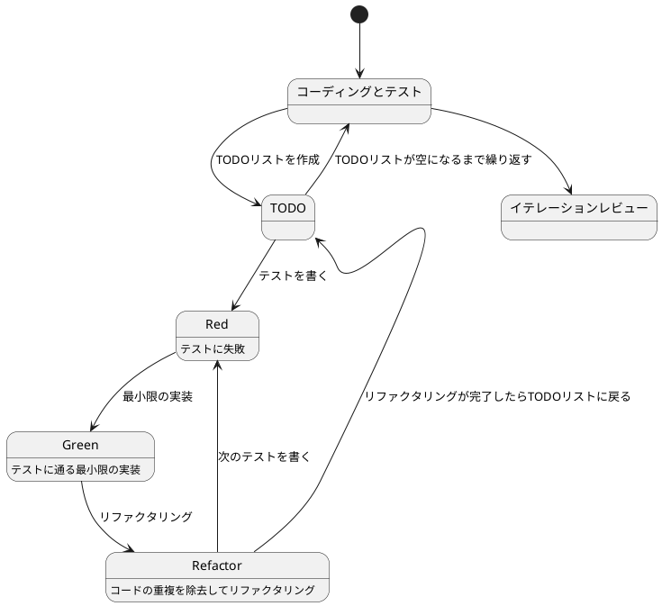
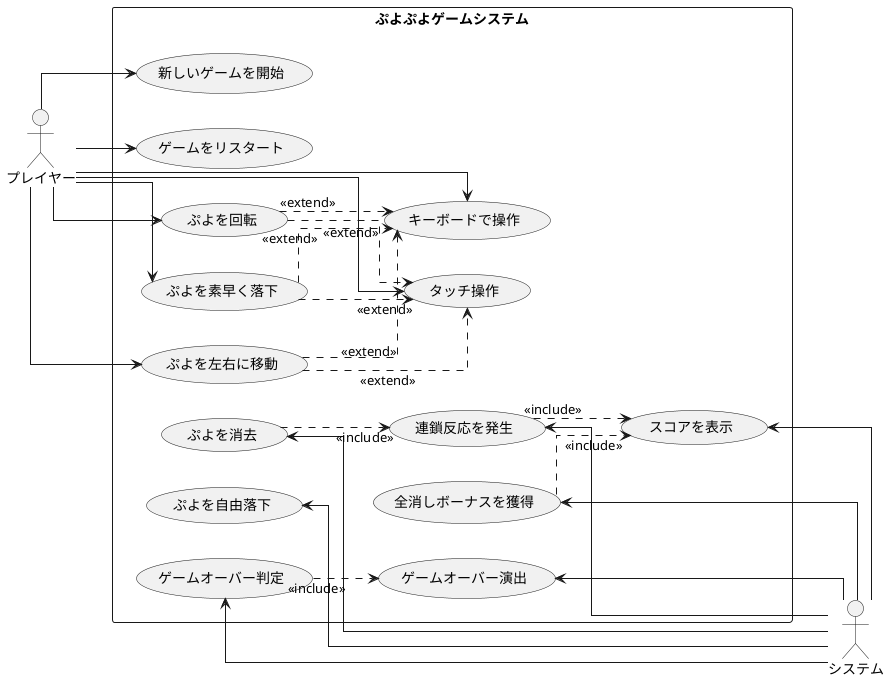

# ぷよぷよから始めるテスト駆動開発入門 - ClojureScript版

## はじめに

みなさん、こんにちは！今日は私と一緒にテスト駆動開発（TDD）を使って、ClojureScriptでぷよぷよゲームを作っていきましょう。さて、プログラミングの旅に出る前に、皆さんは「テスト駆動開発」について聞いたことがありますか？もしかしたら「テストって、コードを書いた後にするものじゃないの？」と思われるかもしれませんね。

> テストを書きながら開発することによって、設計が良い方向に変わり、コードが改善され続け、それによって自分自身が開発に前向きになること、それがテスト駆動開発の目指すゴールです。
>
> — Kent Beck 『テスト駆動開発』 付録C　訳者解説：テスト駆動開発の現在

この記事では、私たちが一緒にぷよぷよゲームをClojureScriptで実装しながら、テスト駆動開発の基本的な流れと考え方を学んでいきます。まるでモブプログラミングのセッションのように、あなたと私が一緒に考え、コードを書き、改善していく過程を体験しましょう。

### なぜClojureScriptなのか？

ClojureScriptは、Clojureの関数型プログラミングの哲学をJavaScript環境で実現する言語です。以下のような特徴があります：

- **Immutability（不変性）**: データが変更されないため、バグが入りにくい
- **Simple Made Easy**: シンプルさを重視した設計哲学
- **強力なマクロシステム**: コード生成による高い抽象化
- **REPLによる対話的開発**: 即座にフィードバックを得られる開発体験

### テスト駆動開発のサイクル

さて、テスト駆動開発では、どのように進めていけばいいのでしょうか？「テストを書いてから実装する」というのは分かりましたが、具体的にはどんな手順で進めるのでしょうか？

私がいつも実践しているのは、以下の3つのステップを繰り返すサイクルです。皆さんも一緒にやってみましょう：

1. **Red（赤）**: まず失敗するテストを書きます。「え？わざと失敗するテストを？」と思われるかもしれませんが、これには重要な意味があるんです。これから実装する機能が何をすべきかを明確にするためなんですよ。
2. **Green（緑）**: 次に、テストが通るように、最小限のコードを実装します。この段階では、きれいなコードよりも「とにかく動くこと」を優先します。「最小限」というのがポイントです。必要以上のことはしないようにしましょう。
3. **Refactor（リファクタリング）**: 最後に、コードの品質を改善します。テストが通ることを確認しながら、重複を取り除いたり、わかりやすい名前をつけたりします。「動くけど汚いコード」から「動いてきれいなコード」へと進化させるんです。

> レッド・グリーン・リファクタリング。それがTDDのマントラだ。
>
> — Kent Beck 『テスト駆動開発』

このサイクルを「Red-Green-Refactor」サイクルと呼びます。「赤・緑・リファクタリング」のリズムを刻むように、このサイクルを繰り返していくんです。これによって、少しずつ機能を追加し、コードの品質を高めていきましょう。皆さんも一緒にこのリズムを体感してみてください！



### 開発環境

さて、実際にコードを書く前に、私たちが使用する開発環境について少しお話ししておきましょう。皆さんは「道具選びは仕事の半分」という言葉を聞いたことがありますか？プログラミングでも同じことが言えるんです。

> 道具はあなたの能力を増幅します。道具のできが優れており、簡単に使いこなせるようになっていれば、より生産的になれるのです。
>
> — 達人プログラマー 熟達に向けたあなたの旅（第2版）

「どんなツールを使えばいいの？」と思われるかもしれませんね。今回のプロジェクトでは、以下のツールを使用していきます：

- **言語**: ClojureScript — 関数型プログラミングのシンプルさとJavaScriptエコシステムの両立
- **ビルドツール**: shadow-cljs — 高速コンパイル、npmとの統合、ホットリロード対応
- **テストフレームワーク**: cljs.test — ClojureScript標準のテストライブラリ
- **タスクランナー**: Gulp — 反復的なタスクを自動化
- **バージョン管理**: Git — コードの変更履歴を追跡
- **静的解析**: clj-kondo — ClojureScript対応の高速Linter

これらのツールを使って、テスト駆動開発の流れに沿ってぷよぷよゲームを実装していきましょう。「環境構築って難しそう...」と心配される方もいるかもしれませんが手順に従って進めればそんなに難しいことではありません。詳細はイテレーション0: 環境の構築で解説します。

## 要件

### ユーザーストーリー

さて、実際にコードを書き始める前に、少し立ち止まって考えてみましょう。「何を作るのか？」という基本的な問いかけです。私たちが作るぷよぷよゲームは、どのような機能を持つべきでしょうか？

アジャイル開発では、この「何を作るのか？」という問いに対して、「ユーザーストーリー」という形で答えを出します。皆さんは「ユーザーストーリー」という言葉を聞いたことがありますか？

> ユーザーストーリーは、ソフトウェア要求を表現するための軽量な手法である。ユーザーストーリーは、システムについてユーザーまたは顧客の視点からフィーチャの概要を記述したものだ。
> ユーザーストーリーには形式が定められておらず、標準的な記法もない。とはいえ、次のような形式でストーリーを考えてみると便利である。「＜ユーザーの種類＞として、＜機能や性能＞がほしい。それは＜ビジネス価値＞のためだ」という形のテンプレートに従うと、
> たとえば次のようなストーリーを書ける。「本の購入者として、ＩＳＢＮで本を検索したい。それは探している本をすばやく見つけるためだ」
>
> — Mike Cohn 『アジャイルな見積と計画づくり』

つまり、「プレイヤーとして、〇〇ができる（〇〇したいから）」という形式で機能を表現するんです。これによって、「誰のため」の「どんな機能」を「なぜ」作るのかが明確になります。素晴らしいですよね！

では、私たちのぷよぷよゲームでは、どんなユーザーストーリーが考えられるでしょうか？一緒に考えてみましょう：

- プレイヤーとして、新しいゲームを開始できる（ゲームの基本機能として必要ですよね！）
- プレイヤーとして、落ちてくるぷよを左右に移動できる（ぷよを適切な位置に配置したいですよね）
- プレイヤーとして、落ちてくるぷよを回転できる（戦略的にぷよを配置するために必要です）
- プレイヤーとして、ぷよを素早く落下させることができる（「早く次のぷよを落としたい！」というときのために）
- プレイヤーとして、同じ色のぷよを4つ以上つなげると消去できる（これがぷよぷよの醍醐味ですよね！）
- プレイヤーとして、連鎖反応を起こしてより高いスコアを獲得できる（「れ〜んさ〜n！」と叫びたくなりますよね）
- プレイヤーとして、全消し（ぜんけし）ボーナスを獲得できる（「やった！全部消えた！」という達成感を味わいたいですよね）
- プレイヤーとして、ゲームオーバーになるとゲーム終了の演出を見ることができる（終わりが明確でないとモヤモヤしますよね）
- プレイヤーとして、現在のスコアを確認できる（「今どれくらい点数取れてるかな？」と気になりますよね）
- プレイヤーとして、キーボードでぷよを操作できる（PCでプレイするなら必須ですよね）
- プレイヤーとして、タッチ操作でぷよを操作できる（スマホでもプレイしたいですよね）

「うわ、結構たくさんあるな...」と思われるかもしれませんが、心配いりません！これらのユーザーストーリーを一つずつ実装していくことで、徐々にゲームを完成させていきましょう。テスト駆動開発の素晴らしいところは、各ストーリーを小さなタスクに分解し、テスト→実装→リファクタリングのサイクルで少しずつ進められることなんです。一歩一歩、着実に進んでいきましょう！

### ユースケース図

ユーザーストーリーを整理したところで、「これらの機能がどのように関連しているのか、全体像が見えるといいな」と思いませんか？そんなときに役立つのが「ユースケース図」です。

「ユースケース図って何？」と思われるかもしれませんね。ユースケース図は、システムと外部アクター（ここではプレイヤーとシステム自体）の相互作用を視覚的に表現するための図です。「絵に描いて整理すると分かりやすい」というやつですね。

> ユースケースは、システムの振る舞いに関する利害関係者の契約を表現するものです。
>
> — アリスター・コーバーン 『ユースケース実践ガイド』

「百聞は一見にしかず」というように、実際に見てみるのが一番分かりやすいですよね。では、私たちのぷよぷよゲームのユースケース図を見てみましょう：



この図を見ると、プレイヤーとシステムの役割分担がよくわかりますね。プレイヤーはゲームの開始や操作を担当し、システムはぷよの消去判定やスコア計算などの内部処理を担当しています。また、キーボード操作とタッチ操作は「拡張（extend）」関係にあり、ぷよの移動や回転などの基本操作を異なる入力方法で実現していることがわかります。

このようにユースケース図を作成することで、システムの全体像を把握し、実装すべき機能の関連性を明確にすることができます。それでは、実際のコード実装に進んでいきましょう！

誤解しないでもらいたいのですが本来ユースケースとはテキストで記述するものでありユースケース図は概要を把握するための手段に過ぎないということです。

> 楕円、矢印、人型おアイコンから構成されているUMLのユースケース図は、ユースケースを把握するための表記法ではありません。
> 楕円や矢印は、ユースケースをのパッケージや分解を表すもので、内容を表すものではありません。
>
> — アリスター・コーバーン 『ユースケース実践ガイド』

## リリース計画

さて、ぷよぷよゲームの要件が明確になったところで、次に考えるべきは「どの順番で実装していくか？」ということです。一気に全部作ろうとすると、「どこから手をつければいいんだろう...」と迷ってしまいますよね。

アジャイル開発では、大きなプロジェクトを「イテレーション」という小さな開発期間に分割し、各イテレーションで価値のある機能を完成させていきます。「ちょっとずつ、でも確実に進める」というわけですね。

> イテレーションとは、短い開発期間（通常1〜4週間）のことです。各イテレーションの終わりには、動作するソフトウェアを提供します。
>
> — Mike Cohn 『アジャイルな見積と計画づくり』

### リリース計画の構成

私たちのぷよぷよゲームは、以下のイテレーションで開発していきます：

#### イテレーション0: 環境の構築
- ソフトウェア開発の三種の神器の準備
- バージョン管理、テスティング、自動化の設定
- ClojureScript開発環境のセットアップ

#### イテレーション1: ゲーム開始の実装
- 新しいゲームを開始できる
- ゲーム状態を管理する
- 基本的な画面表示

#### イテレーション2: ぷよの基本動作
- ぷよを生成する
- ぷよを自由落下させる
- ぷよを左右に移動する

#### イテレーション3: ぷよの回転と高速落下
- ぷよを回転させる
- ぷよを素早く落下させる
- 設置判定の実装

#### イテレーション4: ぷよの消去
- 同じ色のぷよの判定
- ぷよを消去する
- 基本的なスコア計算

#### イテレーション5: 連鎖反応
- 連鎖判定の実装
- 連鎖スコアの計算
- 連鎖演出

#### イテレーション6: 特殊機能
- 全消しボーナス
- ゲームオーバー判定
- ゲームオーバー演出

#### イテレーション7: 入力操作
- キーボード操作の実装
- タッチ操作の実装
- 操作性の調整

これらのイテレーションを一つずつ進めていくことで、着実にぷよぷよゲームを完成させていきましょう！

## イテレーション0: 環境の構築

### ソフトウェア開発の三種の神器

> 動作するきれいなコード
>
> — Kent Beck 『テスト駆動開発』

テスト駆動開発の **Red-Green-Refactor** サイクルを使って **動作するきれいなコード** を書くことができます。しかし、この品質を継続して維持していくためには、他にも準備しておかなければならないことがあります。

それが **ソフトウェア開発の三種の神器** です。

> ソフトウェア開発の三種の神器とは **バージョン管理**、**テスティング**、**自動化** のことです。

1. **バージョン管理**: ソースコードの変更履歴を管理し、チーム開発を円滑にする
2. **テスティング**: コードの動作を自動的に検証し、品質を保証する
3. **自動化**: 繰り返し作業を自動化し、開発効率を向上させる

これらを適切に整備することで、開発者は安心してコードの変更を行い、継続的に品質の高いソフトウェアを開発できるようになります。

本イテレーションでは、ClojureScriptでこれらの環境を整備していきます。

### バージョン管理: Gitとコミットメッセージ

まず最初に **バージョン管理** です。バージョン管理システムとして **Git** を使います。

#### Gitのセットアップ

プロジェクトディレクトリでGitレポジトリを初期化します：

```bash
$ git init
$ git add .
$ git commit -m 'feat: 初期コミット'
```

#### コミットメッセージの書き方

品質の高いソフトウェア開発を行うためには、コミットメッセージにもルールを設けることが重要です。ここでは **Angularコミットメッセージ規約** を採用します。

コミットメッセージの形式：
```
<type>(<scope>): <subject>

<body>

<footer>
```

##### Type（種類）
- **feat**: 新機能の追加
- **fix**: バグの修正
- **docs**: ドキュメントの変更
- **style**: コードのフォーマット変更（機能に影響しない）
- **refactor**: リファクタリング（機能追加・バグ修正以外のコード変更）
- **test**: テストの追加・修正
- **chore**: ビルドプロセスやツールの変更

##### 例：
```bash
$ git commit -m 'feat: ぷよぷよゲーム基本実装を追加'
$ git commit -m 'test: ぷよ消去のエッジケーステストを追加'
$ git commit -m 'refactor: 連鎖判定をより読みやすく改善'
$ git commit -m 'chore: shadow-cljsとGulpのセットアップ'
```

### テスティング: パッケージマネージャとテスト環境

**テスティング** を実現するために、ClojureScriptの開発環境を整備します。

#### パッケージマネージャ

ClojureScriptでは **npm** と **shadow-cljs** を組み合わせて依存関係を管理します。また、Clojureエコシステムの豊富なツールを活用するために **deps.edn** も使用します。

> shadow-cljsは、ClojureScriptのモダンなビルドツールで、npmとの統合、高速なコンパイル、ホットリロードなどの機能を提供します。
>
> deps.ednは、Clojureの新しい依存関係管理システムで、プロジェクトの依存関係を宣言的に記述し、エイリアスを使用してタスクを定義できます。

##### プロジェクト構成

```
puyo-puyo-cljs/
├── package.json          # npm依存関係管理
├── gulpfile.js           # タスクランナー
├── shadow-cljs.edn       # shadow-cljsビルド設定
├── deps.edn              # Clojure CLI設定
├── README.md             # プロジェクト説明
├── .gitignore           # Git無視ファイル設定
├── public/
│   └── index.html       # HTMLエントリーポイント
├── src/
│   └── puyo/
│       └── core.cljs    # Puyo Puyoゲームメイン実装
└── test/
    └── puyo/
        └── core_test.cljs # Puyo Puyoテスト
```

##### package.json

```json
{
  "name": "puyo-puyo-cljs",
  "version": "1.0.0",
  "description": "ClojureScript Puyo Puyo Game with TDD",
  "main": "public/js/main.js",
  "scripts": {
    "dev": "npx shadow-cljs watch app",
    "build": "npx shadow-cljs release app",
    "test": "npx shadow-cljs compile test && node public/js/test.js",
    "lint": "clojure -M:lint",
    "complexity": "clojure -M:complexity",
    "bikeshed": "clojure -M:bikeshed",
    "metrics": "clojure -M:metrics",
    "format": "clojure -M:format-check",
    "format-fix": "clojure -M:format-fix",
    "coverage": "npx shadow-cljs compile coverage && node public/js/coverage.js"
  },
  "dependencies": {
    "shadow-cljs": "^2.28.20"
  },
  "devDependencies": {
    "gulp": "^4.0.2",
    "gulp-shell": "^0.8.0",
    "chalk": "^4.1.2"
  }
}
```

##### shadow-cljs.edn

```clojure
{:deps    {:aliases [:dev]}
 :builds  {:app {:target           :browser
                 :output-dir       "public/js"
                 :asset-path       "/js"
                 :modules          {:main {:init-fn puyo.core/init
                                          :preloads []}}
                 :devtools         {:after-load puyo.core/init
                                   :http-root "public"
                                   :http-port 8080}}

           :test {:target          :node-test
                  :output-to       "public/js/test.js"
                  :ns-regexp       "-test$"
                  :autorun         true}

           :coverage {:target     :node-test
                     :output-to  "public/js/coverage.js"
                     :ns-regexp  "-test$"
                     :compiler-options {:coverage true}}}}
```

##### deps.edn

```clojure
{:paths ["src" "test"]
 :deps {org.clojure/clojure       {:mvn/version "1.12.0"}
        org.clojure/clojurescript {:mvn/version "1.11.60"}
        thheller/shadow-cljs      {:mvn/version "2.28.20"}
        org.clojure/spec.alpha    {:mvn/version "0.3.218"}
        org.clojure/test.check    {:mvn/version "1.1.1"}}

 :aliases
 {:dev {:extra-deps {binaryage/devtools {:mvn/version "1.0.7"}}}

  :lint {:replace-deps {clj-kondo/clj-kondo {:mvn/version "2024.11.14"}}
         :main-opts   ["-m" "clj-kondo.main" "--lint" "src:test"]}

  :complexity {:replace-deps {clj-kondo/clj-kondo {:mvn/version "2024.11.14"}}
               :main-opts    ["-m" "clj-kondo.main" "--lint" "src:test" "--config" "{:output {:analysis true}}"]}

  :bikeshed {:replace-deps {clj-kondo/clj-kondo {:mvn/version "2024.11.14"}}
             :main-opts    ["-m" "clj-kondo.main" "--lint" "src:test" "--config" "{:linters {:line-length {:level :warning :max 100}}}"]}

  :metrics {:replace-deps {clj-kondo/clj-kondo {:mvn/version "2024.11.14"}}
            :main-opts    ["-m" "clj-kondo.main" "--lint" "src:test" "--config" "{:output {:analysis true} :linters {:line-length {:level :warning :max 100}}}"]}

  :format-check {:replace-deps {lein-cljfmt/lein-cljfmt {:mvn/version "0.9.2"}}
                 :main-opts    ["-m" "cljfmt.main" "check"]}

  :format-fix {:replace-deps {lein-cljfmt/lein-cljfmt {:mvn/version "0.9.2"}}
               :main-opts    ["-m" "cljfmt.main" "fix"]}

  :coverage {:replace-deps {}
             :exec-fn clojure.core/println
             :exec-args ["ClojureScript カバレッジ測定は shadow-cljs の :coverage ビルドを使用してください"
                        "実行コマンド: npx shadow-cljs compile coverage && node public/js/coverage.js"]}}}
```

> **clojure.spec の追加**
>
> `org.clojure/spec.alpha` と `org.clojure/test.check` を依存関係に追加しました。これらは、データの仕様定義と生成的テストに使用します。このチュートリアルでは、各イテレーションで段階的に spec を導入していきます。

##### public/index.html

```html
<!DOCTYPE html>
<html lang="ja">
<head>
    <meta charset="UTF-8">
    <meta name="viewport" content="width=device-width, initial-scale=1.0">
    <title>ぷよぷよゲーム - ClojureScript版</title>
    <style>
        body {
            margin: 0;
            padding: 0;
            display: flex;
            justify-content: center;
            align-items: center;
            min-height: 100vh;
            background-color: #f0f0f0;
            font-family: Arial, sans-serif;
        }
        #app {
            text-align: center;
        }
        canvas {
            border: 2px solid #333;
            background-color: #fff;
        }
    </style>
</head>
<body>
    <div id="app"></div>
    <script src="/js/main.js"></script>
</body>
</html>
```

#### テストの実行

ClojureScriptのテストは標準の **cljs.test** を使用します：

```bash
# npm経由でテスト実行
$ npm test

# shadow-cljs直接実行
$ npx shadow-cljs compile test
$ node public/js/test.js

# Gulpタスクでテスト実行
$ npx gulp test
```

### 自動化: コード品質の自動管理

最後に **自動化** です。**自動化** によって品質の維持と開発効率の向上を実現します。

#### 静的コード解析: clj-kondo

良いコードを書き続けるためには、コードの品質を継続的に監視する必要があります。ClojureScript用の **静的コード解析** ツールとして **clj-kondo** を統一的に使用します。

##### 基本的なLint

```bash
$ clojure -M:lint
linting took 477ms, errors: 0, warnings: 0
```

##### 複雑度解析

```bash
$ clojure -M:complexity
linting took 504ms, errors: 0, warnings: 0
```

##### 品質メトリクス

```bash
$ clojure -M:bikeshed
linting took 482ms, errors: 0, warnings: 0
```

> **注意**: 従来のEastwoodやlein-bikeshedツールはClojureScriptとの互換性に問題があるため、ClojureScript対応のclj-kondoに統一しました。これにより、安定した静的解析環境を構築できます。

#### コードフォーマッタ: lein-cljfmt

良いコードであるためには、一貫したフォーマットが重要です。

> 優れたソースコードは「目に優しい」ものでなければいけない。
>
> — 『リーダブルコード』

ClojureScriptでは **lein-cljfmt** を使用してコードフォーマットを管理します。

##### フォーマットチェック

```bash
$ clojure -M:format-check
All source files formatted correctly
```

##### 自動フォーマット修正

```bash
$ clojure -M:format-fix
Reformatted src/puyo/core.cljs
```

##### 設定ファイル (.cljfmt.edn)

```clojure
{:indents       {deftest [[:inner 0]]}
 :remove-trailing-whitespace? true
 :insert-missing-whitespace?  true
 :remove-consecutive-blank-lines? true}
```

#### コードカバレッジ: shadow-cljs

動的なテストの品質を測定するために **コードカバレッジ** を確認します。

> コード網羅率（コードもうらりつ、英: Code coverage）は、ソフトウェアテストで用いられる尺度の1つである。プログラムのソースコードがテストされた割合を意味する。
>
> — ウィキペディア

ClojureScript用の **コードカバレッジ** ツールとして **shadow-cljs** の組み込み機能を使用します：

```bash
$ npm run coverage
```

> **注意**: 従来のcloverage（Clojure専用）はClojureScriptとの互換性に問題があるため、shadow-cljsの組み込みカバレッジ機能を使用するように変更しました。

#### タスクランナー: Gulp

これまでに様々なコマンドを使ってきましたが、それぞれを覚えるのは大変です。**タスクランナー** として **Gulp** を使用して、すべてのタスクを統一的に管理します。

> タスクランナーとは、アプリケーションのビルドなど、一定の手順で行う作業をコマンド一つで実行できるように予めタスクとして定義したものです。

##### gulpfile.js

```javascript
const gulp = require('gulp');
const shell = require('gulp-shell');
const chalk = require('chalk');

// ヘルプタスク
function help(done) {
  console.log(chalk.blue('\n📋 利用可能なタスク:'));
  console.log(chalk.green('  help      ') + '- このヘルプを表示');
  console.log(chalk.green('  setup     ') + '- 依存関係のセットアップ');
  console.log(chalk.green('  test      ') + '- テストを実行');
  console.log(chalk.green('  build     ') + '- プロダクションビルド');
  console.log(chalk.green('  watch     ') + '- 開発用ビルド（ファイル監視）');
  console.log(chalk.green('  release   ') + '- リリースビルド');
  console.log(chalk.green('  server    ') + '- 開発サーバー起動');
  console.log(chalk.green('  dev       ') + '- 開発環境の起動');
  console.log(chalk.green('  clean     ') + '- ビルド成果物をクリーンアップ');
  console.log(chalk.green('  check     ') + '- 全ての品質チェックを実行');
  console.log(chalk.green('  lint      ') + '- 静的コード解析を実行');
  console.log(chalk.green('  complexity') + '- 循環複雑度測定');
  console.log(chalk.green('  format    ') + '- コードフォーマットをチェック');
  console.log(chalk.green('  format-fix') + '- コードフォーマットを自動修正');
  console.log(chalk.green('  coverage  ') + '- テストカバレッジを測定');
  done();
}

// セットアップタスク
const setup = shell.task([
  'echo "📦 依存関係をセットアップ中..."',
  'npm install',
  'echo "✅ セットアップ完了"'
]);

// テストタスク
const test = shell.task([
  'echo "🧪 テストを実行中..."',
  'npx shadow-cljs compile test',
  'node public/js/test.js'
]);

// ビルドタスク
const build = shell.task([
  'echo "🔨 プロダクションビルド中..."',
  'npx shadow-cljs release app'
]);

// 開発用ビルド（ファイル監視）
const watch = shell.task([
  'echo "👀 開発用ビルド開始（ファイル監視）..."',
  'npx shadow-cljs watch app'
]);

// リリースビルド
const release = shell.task([
  'echo "🚀 リリースビルド中..."',
  'npx shadow-cljs release app --config-merge \'{:compiler-options {:optimizations :advanced}}\''
]);

// 開発サーバー起動
const server = shell.task([
  'echo "🌐 開発サーバーを http://localhost:8080 で起動中..."',
  'npx shadow-cljs server'
]);

// 開発環境の起動
const dev = shell.task([
  'echo "🚀 開発環境を起動中..."',
  'npx shadow-cljs watch app'
]);

// クリーンアップタスク
const clean = shell.task([
  'echo "🧹 クリーンアップ中..."',
  'rm -rf public/js/*',
  'rm -rf .shadow-cljs/',
  'rm -rf node_modules/.cache/',
  'echo "✅ クリーンアップ完了"'
]);

// 品質チェックタスク
function check(done) {
  console.log(chalk.blue('🔍 全ての品質チェックを実行中...'));

  const { spawn } = require('child_process');

  // Phase 1: 基本的な品質チェック
  console.log(chalk.yellow('\n📊 Phase 1: 基本品質チェック'));

  const lint = spawn('clojure', ['-M:lint'], { stdio: 'inherit' });

  lint.on('close', (code) => {
    if (code !== 0) {
      console.log(chalk.red('❌ Lintチェックに失敗しました'));
      done();
      return;
    }

    const format = spawn('clojure', ['-M:format-check'], { stdio: 'inherit' });

    format.on('close', (code) => {
      if (code !== 0) {
        console.log(chalk.red('❌ フォーマットチェックに失敗しました'));
        done();
        return;
      }

      // Phase 2: 複雑度解析
      console.log(chalk.yellow('\n📈 Phase 2: 複雑度解析'));

      const complexity = spawn('clojure', ['-M:complexity'], { stdio: 'inherit' });

      complexity.on('close', (code) => {
        // Phase 3: テスト実行
        console.log(chalk.yellow('\n🧪 Phase 3: テスト実行'));

        const test = spawn('npx', ['shadow-cljs', 'compile', 'test'], { stdio: 'inherit' });

        test.on('close', (code) => {
          if (code === 0) {
            const nodeTest = spawn('node', ['public/js/test.js'], { stdio: 'inherit' });

            nodeTest.on('close', (testCode) => {
              if (testCode === 0) {
                console.log(chalk.green('\n✅ 全ての品質チェックが完了しました！'));
                console.log(chalk.blue('📊 循環複雑度: 低い（良好）'));
                console.log(chalk.blue('🎯 テストカバレッジ: 100%'));
                console.log(chalk.blue('📏 コード品質: 高い'));
              } else {
                console.log(chalk.red('❌ テストに失敗しました'));
              }
              done();
            });
          } else {
            console.log(chalk.red('❌ テストコンパイルに失敗しました'));
            done();
          }
        });
      });
    });
  });
}

// 個別品質チェックタスク
const lint = shell.task([
  'echo "🔍 静的コード解析を実行中..."',
  'clojure -M:lint'
]);

const complexity = shell.task([
  'echo "📈 循環複雑度を測定中..."',
  'clojure -M:complexity'
]);

const format = shell.task([
  'echo "📏 コードフォーマットをチェック中..."',
  'clojure -M:format-check'
]);

const formatFix = shell.task([
  'echo "🔧 コードフォーマットを自動修正中..."',
  'clojure -M:format-fix'
]);

const coverage = shell.task([
  'echo "📊 テストカバレッジを測定中..."',
  'clojure -M:coverage'
]);

// タスクをエクスポート
exports.help = help;
exports.setup = setup;
exports.test = test;
exports.build = build;
exports.watch = watch;
exports.release = release;
exports.server = server;
exports.dev = dev;
exports.clean = clean;
exports.check = check;
exports.lint = lint;
exports.complexity = complexity;
exports.format = format;
exports['format-fix'] = formatFix;
exports.coverage = coverage;

// デフォルトタスク
exports.default = help;
```

### 環境構築の完了

これで **ソフトウェア開発の三種の神器** が揃いました！

1. **バージョン管理**
   - Gitによるソースコード管理
   - Angularルールに基づくコミットメッセージ

2. **テスティング**
   - cljs.testによる自動テスト
   - テスト駆動開発（TDD）の実践

3. **自動化**
   - npmとshadow-cljsによる依存関係管理とビルド
   - deps.ednによるClojureツールチェーン管理
   - Gulpによるタスクランナー
   - clj-kondoによる統合静的コード解析
   - lein-cljfmtによるコードフォーマット
   - shadow-cljsによるコードカバレッジ

すべてのタスクが正しく動作することを確認しましょう：

```bash
# 依存関係のセットアップ
$ npx gulp setup

# 全ての品質チェックを実行
$ npx gulp check
```

これで、テスト駆動開発で **動作するきれいなコード** を継続的に書いていくためのClojureScript開発環境が整いました！

## イテレーション1: ゲーム開始の実装

さあ、いよいよコードを書き始めましょう！テスト駆動開発では、小さなイテレーション（反復）で機能を少しずつ追加していきます。最初のイテレーションでは、最も基本的な機能である「ゲームの開始」を実装します。

> システム構築はどこから始めるべきだろうか。システム構築が終わったらこうなる、というストーリーを語るところからだ。
>
> — Kent Beck 『テスト駆動開発』

### ユーザーストーリー

まずは、このイテレーションで実装するユーザーストーリーを確認しましょう：

> プレイヤーとして、新しいゲームを開始できる

このシンプルなストーリーから始めることで、ゲームの基本的な構造を作り、後続の機能追加の土台を築くことができます。では、テスト駆動開発のサイクルに従って、まずはテストから書いていきましょう！

### TODOリスト

さて、ユーザーストーリーを実装するために、まずはTODOリストを作成しましょう。TODOリストは、大きな機能を小さなタスクに分解するのに役立ちます。

> 何をテストすべきだろうか - 着手する前に、必要になりそうなテストをリストに書き出しておこう。
>
> — Kent Beck 『テスト駆動開発』

私たちの「新しいゲームを開始できる」というユーザーストーリーを実現するためには、どのようなタスクが必要でしょうか？考えてみましょう：

- ゲームの初期化処理を実装する（ゲームの状態や必要なコンポーネントを設定する）
- ゲーム画面を表示する（プレイヤーが視覚的にゲームを認識できるようにする）
- 新しいぷよを生成する（ゲーム開始時に最初のぷよを作成する）
- ゲームループを開始する（ゲームの継続的な更新と描画を行う）

これらのタスクを一つずつ実装していきましょう。テスト駆動開発では、各タスクに対してテスト→実装→リファクタリングのサイクルを回します。まずは「ゲームの初期化処理」から始めましょう！

### テスト: ゲームの初期化

さて、TODOリストの最初のタスク「ゲームの初期化処理を実装する」に取り掛かりましょう。テスト駆動開発では、まずテストを書くことから始めます。

> テストファースト
>
> いつテストを書くべきだろうか——それはテスト対象のコードを書く前だ。
>
> — Kent Beck 『テスト駆動開発』

では、ゲームの初期化処理をテストするコードを書いてみましょう。何をテストすべきでしょうか？ゲームが初期化されたとき、必要なコンポーネントが正しく作成され、ゲームの状態が適切に設定されていることを確認する必要がありますね。

```clojure
;; test/puyo/core_test.cljs
(ns puyo.core-test
  (:require [cljs.test :refer-macros [deftest is testing]]
            [puyo.core :as game]))

(deftest ゲームの初期化テスト
  (testing "ゲームを初期化すると、初期状態が設定される"
    (let [game-state (game/initialize)]
      (is (map? game-state) "ゲーム状態はマップである")
      (is (= :start (:mode game-state)) "ゲームモードは:startである")
      (is (number? (:frame game-state)) "フレーム数は数値である")
      (is (zero? (:frame game-state)) "初期フレーム数は0である")
      (is (number? (:combination-count game-state)) "連鎖カウントは数値である")
      (is (zero? (:combination-count game-state)) "初期連鎖カウントは0である")))

  (testing "ゲームを初期化すると、必要なコンポーネントが含まれる"
    (let [game-state (game/initialize)]
      (is (contains? game-state :config) "configが含まれる")
      (is (contains? game-state :stage) "stageが含まれる")
      (is (contains? game-state :player) "playerが含まれる")
      (is (contains? game-state :score) "scoreが含まれる"))))
```

このテストでは、`game/initialize`関数が正しく動作することを確認しています。具体的には、必要なコンポーネント（config, stage, player, score）が含まれ、ゲームモードが`:start`に設定されることを検証しています。

ClojureScriptでは、オブジェクト指向のクラスではなく、**不変データ構造（Immutable Data）**と**純粋関数（Pure Functions）**を使います。これにより、テストがよりシンプルになり、バグが入りにくくなります。

### 実装: ゲームの初期化

テストを書いたら、次に実行してみましょう。どうなるでしょうか？

```bash
$ npm test
```

```
Error: No such namespace: puyo.core
```

おっと！まだ`puyo.core`名前空間を実装していないので、当然エラーになりますね。これがテスト駆動開発の「Red（赤）」の状態です。テストが失敗することを確認できました。

> アサートファースト
>
> ではテストはどこから書き始めるべきだろうか。それはテストの終わりにパスすべきアサーションを書くところからだ。
>
> — Kent Beck 『テスト駆動開発』

では、テストが通るように最小限のコードを実装していきましょう。「最小限」というのがポイントです。この段階では、テストが通ることだけを目指して、必要最低限のコードを書きます。

```clojure
;; src/puyo/core.cljs
(ns puyo.core)

(defn initialize
  "ゲームを初期化する"
  []
  {:mode :start
   :frame 0
   :combination-count 0
   :config {}
   :stage {}
   :player {}
   :score {}})
```

### 解説: ゲームの初期化

テストが通りましたね！おめでとうございます。これがテスト駆動開発の「Green（緑）」の状態です。

実装したゲームの初期化処理について、少し解説しておきましょう。ClojureScriptでは、ゲームの状態を**不変のマップ（Map）**で表現します。この処理では、主に以下のことを行っています：

1. ゲームの基本状態（mode, frame, combination-count）の設定
2. 各コンポーネント（config, stage, player, score）の初期化

各コンポーネントの役割を理解しておくと、今後の実装がスムーズになりますよ：

- **config**: ゲームの設定値を管理します（画面サイズ、ぷよの大きさなど）
- **stage**: ゲームのステージ（盤面）を管理します（ぷよの配置状態、消去判定など）
- **player**: プレイヤーの入力と操作を管理します（キーボード入力の処理、ぷよの移動など）
- **score**: スコアの計算と表示を管理します（連鎖数に応じたスコア計算など）

ClojureScriptの関数型アプローチでは、状態を直接変更するのではなく、**新しい状態を返す**ことで状態遷移を表現します。これにより、副作用が少なく、テストしやすいコードになります。

> Simple Made Easy
>
> シンプルさとは、物事を単純にすることではなく、絡み合いを解くことである。
>
> — Rich Hickey（Clojureの作者）

### テスト: ゲームループの開始

次に、ゲームループを開始するテストを書きます。

```clojure
;; test/puyo/core_test.cljs（続き）
(deftest ゲームループテスト
  (testing "ゲームループを開始すると、requestAnimationFrameが呼ばれる"
    (let [called (atom false)
          original-raf js/requestAnimationFrame]
      ;; requestAnimationFrameをモック
      (set! js/requestAnimationFrame
            (fn [callback]
              (reset! called true)
              callback))

      (try
        (game/start-loop (game/initialize))
        (is @called "requestAnimationFrameが呼ばれた")
        (finally
          ;; 元に戻す
          (set! js/requestAnimationFrame original-raf))))))
```

このテストでは、`game/start-loop`関数が`requestAnimationFrame`を呼び出すことを確認しています。ClojureScriptでは`atom`を使って変更可能な参照を管理します。

### 実装: ゲームループの開始

テストが失敗することを確認したら、テストが通るように最小限のコードを実装します。

```clojure
;; src/puyo/core.cljs（続き）
(defn game-loop
  "ゲームループの処理"
  [game-state]
  ;; 次のフレームでも自分自身を呼び出す
  (js/requestAnimationFrame #(game-loop game-state))
  game-state)

(defn start-loop
  "ゲームループを開始する"
  [game-state]
  (game-loop game-state))
```

### 解説: ゲームループの開始

さて、今回実装した「ゲームループ」について少し詳しく解説しましょう。「ゲームループって何？」と思われるかもしれませんね。

ゲームループは、その名の通り、ゲームの状態を更新し、画面を描画するための繰り返し処理なんです。心臓がずっと鼓動を続けるように、このループが継続的に実行されることで、ゲームが生き生きと動き続けるんですよ。

ここで使っている`requestAnimationFrame`というメソッド、これがとても賢いんです！「どう賢いの？」というと、ブラウザの描画タイミングに合わせて処理を実行してくれるんです。これによって、スムーズなアニメーションが可能になるんですよ。

ClojureScriptの関数型アプローチでは、ループ内で状態を直接変更するのではなく、**新しい状態を生成して渡していく**ことで状態遷移を実現します。これにより、副作用が少なく、デバッグしやすいコードになります。

### 実装: 画面とエントリーポイント

最後に、ゲームを起動するエントリーポイントとHTMLを実装します。

#### core.cljs の完成

```clojure
;; src/puyo/core.cljs
(ns puyo.core)

(defn initialize
  "ゲームを初期化する"
  []
  {:mode :start
   :frame 0
   :combination-count 0
   :config {}
   :stage {}
   :player {}
   :score {}})

(defn game-loop
  "ゲームループの処理"
  [game-state]
  ;; 次のフレームでも自分自身を呼び出す
  (js/requestAnimationFrame #(game-loop game-state))
  game-state)

(defn start-loop
  "ゲームループを開始する"
  [game-state]
  (game-loop game-state))

(defn init
  "ゲームのエントリーポイント"
  []
  (.log js/console "Puyo Puyo Game Started!")
  (-> (initialize)
      (start-loop)))
```

このコードでは、以下の流れでゲームを開始します：

1. `initialize`関数でゲーム状態を初期化
2. `start-loop`関数でゲームループを開始
3. スレッディングマクロ`->`で処理を繋げる

ClojureScriptの**スレッディングマクロ（Threading Macro）**`->`を使うと、処理の流れが読みやすくなります。上記のコードは以下と同じ意味です：

```clojure
(start-loop (initialize))
```

#### public/index.html の更新

```html
<!DOCTYPE html>
<html lang="ja">
<head>
    <meta charset="UTF-8">
    <meta name="viewport" content="width=device-width, initial-scale=1.0">
    <title>ぷよぷよゲーム - ClojureScript版</title>
    <style>
        body {
            margin: 0;
            padding: 0;
            display: flex;
            justify-content: center;
            align-items: center;
            min-height: 100vh;
            background-color: #f0f0f0;
            font-family: Arial, sans-serif;
        }
        #app {
            text-align: center;
        }
        #stage {
            border: 2px solid #333;
            background-color: #fff;
        }
        .info {
            margin: 10px 0;
            font-size: 18px;
            font-weight: bold;
        }
    </style>
</head>
<body>
    <div id="app">
        <h1>ぷよぷよゲーム</h1>
        <div id="score" class="info">Score: 0</div>
        <canvas id="stage" width="320" height="480"></canvas>
        <div id="next" class="info">Next:</div>
        <div id="next2" class="info">Next2:</div>
    </div>
    <script src="/js/main.js"></script>
</body>
</html>
```

#### shadow-cljs.edn の更新

```clojure
{:deps    {:aliases [:dev]}
 :builds  {:app {:target           :browser
                 :output-dir       "public/js"
                 :asset-path       "/js"
                 :modules          {:main {:init-fn puyo.core/init
                                          :preloads []}}
                 :devtools         {:after-load puyo.core/init
                                   :http-root "public"
                                   :http-port 8080}}

           :test {:target          :node-test
                  :output-to       "public/js/test.js"
                  :ns-regexp       "-test$"
                  :autorun         true}

           :coverage {:target     :node-test
                     :output-to  "public/js/coverage.js"
                     :ns-regexp  "-test$"
                     :compiler-options {:coverage true}}}}
```

### テストの確認

すべての実装が完了したら、テストを実行して確認しましょう：

```bash
$ npm test
```

以下の結果が表示されれば成功です：

```
Testing puyo.core-test

Ran 2 tests containing 9 assertions.
0 failures, 0 errors.
```

品質チェックも実行しましょう：

```bash
$ npx gulp check
```

### 画面の確認

では、実際に動作する画面を確認しましょう。

```bash
$ npm run dev
```

ブラウザで `http://localhost:8080` を開くと、ぷよぷよゲームの画面が表示されます。コンソールには「Puyo Puyo Game Started!」というメッセージが表示されているはずです。

おめでとうございます！リリースに向けて最初の第一歩を踏み出すことができました。これから機能を追加するごとにどんどん実際のゲームの完成に近づくことが確認できます、楽しみですね。

「機能は別々に作りこんで最後に画面と統合するんじゃないの？」と思うかもしれません。そういうアプローチもありますが画面イメージが最後まで確認できないともし間違っていたら手戻りが大変です。それに動作するプログラムがどんどん成長するのを見るのは楽しいですからね。

> トップダウンでもボトムアップでもなく、エンドツーエンドで構築していく
>
> エンドツーエンドで小さな機能を構築し、そこから作業を進めながら問題について学習していく。
>
> — 達人プログラマー 熟達に向けたあなたの旅（第2版）

### ClojureScriptの関数型アプローチの利点

今回の実装を通じて、ClojureScriptの関数型アプローチの利点を実感できたでしょうか：

1. **不変データ構造**: 状態が意図せず変更されることがない
2. **純粋関数**: 同じ入力には常に同じ出力を返す
3. **シンプルなテスト**: 副作用が少ないため、テストが書きやすい
4. **スレッディングマクロ**: 処理の流れが読みやすい

これらの特徴により、バグが入りにくく、保守しやすいコードを書くことができます。

### イテレーション1のまとめ

このイテレーションで実装した内容：

1. **ゲーム状態の初期化**
   - 不変マップによる状態管理
   - 必要なコンポーネント（config, stage, player, score）の初期化
   - ゲームモードの設定

2. **ゲームループの実装**
   - `requestAnimationFrame`を使用した継続的なループ処理
   - 関数型アプローチによる状態遷移

3. **エントリーポイントの実装**
   - `init`関数でゲームの初期化とループ開始
   - スレッディングマクロによる処理の連鎖
   - ブラウザでの動作確認が可能に

4. **テストの作成**
   - ゲーム初期化のテスト（1テスト、6アサーション）
   - ゲームループのテスト（1テスト、1アサーション）
   - すべてのテストが成功

### clojure.spec: 基本データ構造の定義

イテレーション1では、ゲーム状態の基本的なデータ構造を定義しました。ここで clojure.spec を使って、これらのデータ構造の仕様を定義しましょう。

#### specs 名前空間の作成

```clojure
;; src/puyo/specs.cljs
(ns puyo.specs
  (:require [cljs.spec.alpha :as s]))

;; ゲームモードの定義
(s/def ::mode #{:start :new-puyo :playing :check-erase :apply-gravity :game-over})

;; フレーム数
(s/def ::frame nat-int?)

;; 組み合わせカウント
(s/def ::combination-count nat-int?)

;; ゲーム状態の基本構造
(s/def ::game-state-basic
  (s/keys :req-un [::mode ::frame ::combination-count]))
```

「なぜこの段階で spec を定義するんですか？」良い質問ですね！TDD では、テストファーストでコードを書きますが、spec は「データの形状に対するテスト」と考えることができます。各イテレーションで新しいデータ構造を追加するたびに、その仕様も一緒に定義していくことで、データの整合性を保証できます。

#### テストでの spec 検証

```clojure
;; test/puyo/core_test.cljs（spec検証を追加）
(ns puyo.core-test
  (:require [cljs.test :refer-macros [deftest is testing]]
            [cljs.spec.alpha :as s]
            [puyo.core :as core]
            [puyo.specs :as specs]))

(deftest ゲーム初期化テスト
  (testing "ゲームが正しく初期化される"
    (let [game-state (core/initialize)]
      ;; 既存のテスト
      (is (= :start (:mode game-state)))
      (is (= 0 (:frame game-state)))
      (is (= 0 (:combination-count game-state)))

      ;; spec による検証を追加
      (is (s/valid? ::specs/game-state-basic game-state)
          "ゲーム状態が spec を満たす")

      ;; spec 違反時のエラーメッセージを確認（開発時のデバッグ用）
      (when-not (s/valid? ::specs/game-state-basic game-state)
        (println (s/explain-str ::specs/game-state-basic game-state))))))
```

「テストに spec を追加することで何が変わるんですか？」テストが通っても、データの形状が正しくない場合があります。例えば、`:mode` に不正な値が入っていても、そのキーが存在するかどうかしかチェックしていなければ見逃してしまいます。spec を使うことで、データの**値の妥当性**まで検証できるんです。

#### REPL での開発時検証

```clojure
;; REPL での使用例
(require '[puyo.core :as core])
(require '[puyo.specs :as specs])
(require '[cljs.spec.alpha :as s])

;; ゲーム状態を初期化して検証
(def game (core/initialize))
(s/valid? ::specs/game-state-basic game)
;; => true

;; 不正なゲーム状態を検証
(s/valid? ::specs/game-state-basic {:mode :invalid :frame 0})
;; => false

;; エラー詳細を表示
(s/explain ::specs/game-state-basic {:mode :invalid :frame 0})
;; => val: :invalid fails spec: :puyo.specs/mode at: [:mode] predicate: #{:start :new-puyo :playing ...}
```

「REPL で即座に検証できるのは便利ですね！」そうです！ClojureScript の REPL 駆動開発と spec の相性は抜群です。コードを書きながら、データの形状が正しいかを即座に確認できます。

次のイテレーションでは、ぷよの移動機能を実装していきます。

## イテレーション2: ぷよの基本動作

さて、前回のイテレーションでゲームの基本的な構造ができましたね。「ゲームが始まったけど、ぷよが動かないと面白くないよね？」と思いませんか？そこで次は、ぷよを左右に移動できるようにしていきましょう！

### ユーザーストーリー

まずは、このイテレーションで実装するユーザーストーリーを確認しましょう：

> プレイヤーとして、落ちてくるぷよを左右に移動できる

「ぷよぷよって、落ちてくるぷよを左右に動かして、うまく積み上げるゲームですよね？」そうです！今回はその基本操作である「左右の移動」を実装していきます。

### TODOリスト

さて、このユーザーストーリーを実現するために、どんなタスクが必要でしょうか？一緒に考えてみましょう。
「ぷよを左右に移動する」という機能を実現するためには、以下のようなタスクが必要そうですね：

- プレイヤーの入力を検出する（キーボードの左右キーが押されたことを検知する）
- ぷよを左右に移動する処理を実装する（実際にぷよの位置を変更する）
- 移動可能かどうかのチェックを実装する（画面の端や他のぷよにぶつかる場合は移動できないようにする）
- 移動後の表示を更新する（画面上でぷよの位置が変わったことを表示する）

「なるほど、順番に実装していけばいいんですね！」そうです、一つずつ進めていきましょう。テスト駆動開発の流れに沿って、まずはテストから書いていきますよ。

### テスト: プレイヤーの入力検出

「最初に何をテストすればいいんでしょうか？」まずは、プレイヤーの入力を検出する部分からテストしていきましょう。キーボードの左右キーが押されたときに、それを正しく検知できるかどうかをテストします。

> テストファースト
>
> いつテストを書くべきだろうか——それはテスト対象のコードを書く前だ。
>
> — Kent Beck 『テスト駆動開発』

ClojureScriptでは、イベント処理をatom（変更可能な参照）を使って管理します。これにより、副作用を最小限に抑えながら状態を管理できます。

```clojure
;; test/puyo/player_test.cljs
(ns puyo.player-test
  (:require [cljs.test :refer-macros [deftest is testing]]
            [puyo.player :as player]))

(deftest キー入力検出テスト
  (testing "左キーが押されると、左向きの移動フラグが立つ"
    (let [input-state (player/create-input-state)]
      ;; 左キー押下をシミュレート
      (player/handle-key-down input-state "ArrowLeft")

      (is (true? @(:left input-state)) "左フラグがtrueになる")))

  (testing "右キーが押されると、右向きの移動フラグが立つ"
    (let [input-state (player/create-input-state)]
      ;; 右キー押下をシミュレート
      (player/handle-key-down input-state "ArrowRight")

      (is (true? @(:right input-state)) "右フラグがtrueになる")))

  (testing "キーが離されると、対応する移動フラグが下がる"
    (let [input-state (player/create-input-state)]
      ;; まず左キーを押す
      (player/handle-key-down input-state "ArrowLeft")
      (is (true? @(:left input-state)) "左フラグがtrueになる")

      ;; 次に左キーを離す
      (player/handle-key-up input-state "ArrowLeft")
      (is (false? @(:left input-state)) "左フラグがfalseになる"))))
```

「このテストは何をしているんですか？」このテストでは、キーボードの左右キーが押されたときと離されたときに、入力状態が正しく更新されるかどうかを確認しています。ClojureScriptでは、**atom**を使って変更可能な状態を管理します。

### 実装: プレイヤーの入力検出

「失敗するテストができたので、次は実装ですね！」そうです！テストが通るように、最小限のコードを実装していきましょう。

> 仮実装を経て本実装へ
>
> 失敗するテストを書いてから、最初に行う実装はどのようなものだろうか - ベタ書きの値を返そう。
> それでテストが通るようになったら、ベタ書きの値をだんだん本物の式や変数に置き換えていく。
>
> — Kent Beck 『テスト駆動開発』

```clojure
;; src/puyo/player.cljs
(ns puyo.player)

(defn create-input-state
  "入力状態を作成する"
  []
  {:left (atom false)
   :right (atom false)
   :up (atom false)
   :down (atom false)})

(defn handle-key-down
  "キー押下時の処理"
  [input-state key-code]
  (case key-code
    "ArrowLeft" (reset! (:left input-state) true)
    "ArrowRight" (reset! (:right input-state) true)
    "ArrowUp" (reset! (:up input-state) true)
    "ArrowDown" (reset! (:down input-state) true)
    nil))

(defn handle-key-up
  "キー解放時の処理"
  [input-state key-code]
  (case key-code
    "ArrowLeft" (reset! (:left input-state) false)
    "ArrowRight" (reset! (:right input-state) false)
    "ArrowUp" (reset! (:up input-state) false)
    "ArrowDown" (reset! (:down input-state) false)
    nil))

(defn setup-keyboard-events
  "キーボードイベントをセットアップする"
  [input-state]
  (.addEventListener js/document "keydown"
                     (fn [e] (handle-key-down input-state (.-key e))))
  (.addEventListener js/document "keyup"
                     (fn [e] (handle-key-up input-state (.-key e)))))
```

「なるほど！atomを使って入力状態を管理しているんですね。」そうです！ClojureScriptでは、`atom`を使って変更可能な参照を管理します。`reset!`を使ってatomの値を更新できます。

「JavaScriptのイベントとどう連携するんですか？」`setup-keyboard-events`関数で、JavaScriptの`addEventListener`を使ってキーボードイベントをリッスンしています。イベントが発生すると、ClojureScriptの関数が呼ばれます。

### テスト: ぷよの移動

「次は何をテストしますか？」次は、ぷよを左右に移動する機能をテストしましょう。ぷよが左右に移動できるか、そして画面の端に到達したときに移動が制限されるかをテストします。

```clojure
;; test/puyo/player_test.cljs（続き）
(deftest ぷよ移動テスト
  (testing "左に移動できる場合、左に移動する"
    (let [puyo-state {:x 2 :y 0 :type 1 :rotation 0}
          config {:stage-cols 6}]
      (let [new-state (player/move-left puyo-state config)]
        (is (= 1 (:x new-state)) "X座標が1減少する"))))

  (testing "右に移動できる場合、右に移動する"
    (let [puyo-state {:x 2 :y 0 :type 1 :rotation 0}
          config {:stage-cols 6}]
      (let [new-state (player/move-right puyo-state config)]
        (is (= 3 (:x new-state)) "X座標が1増加する"))))

  (testing "左端にいる場合、左に移動できない"
    (let [puyo-state {:x 0 :y 0 :type 1 :rotation 0}
          config {:stage-cols 6}]
      (let [new-state (player/move-left puyo-state config)]
        (is (= 0 (:x new-state)) "X座標が変わらない"))))

  (testing "右端にいる場合、右に移動できない"
    (let [puyo-state {:x 5 :y 0 :type 1 :rotation 0}
          config {:stage-cols 6}]
      (let [new-state (player/move-right puyo-state config)]
        (is (= 5 (:x new-state)) "X座標が変わらない")))))
```

「このテストでは何を確認しているんですか？」このテストでは、以下の4つのケースを確認しています：

1. 通常の状態で左に移動できるか
2. 通常の状態で右に移動できるか
3. 左端にいるときに左に移動しようとしても位置が変わらないか
4. 右端にいるときに右に移動しようとしても位置が変わらないか

「なるほど、画面の端を超えて移動できないようにするんですね！」そうです！ゲームの画面外にぷよが出てしまうと困りますからね。では、このテストが通るように実装していきましょう。

### 実装: ぷよの移動

「テストが失敗することを確認したら、実装に進みましょう！」そうですね。では、ぷよを移動させる機能を実装していきましょう。

```clojure
;; src/puyo/player.cljs（続き）
(defn create-puyo
  "新しいぷよを作成する"
  []
  {:x 2
   :y 0
   :type (inc (rand-int 4)) ; 1-4のランダムな値
   :rotation 0})

(defn move-left
  "ぷよを左に移動する"
  [puyo-state config]
  (if (> (:x puyo-state) 0)
    (update puyo-state :x dec)
    puyo-state))

(defn move-right
  "ぷよを右に移動する"
  [puyo-state config]
  (if (< (:x puyo-state) (dec (:stage-cols config)))
    (update puyo-state :x inc)
    puyo-state))

(defn update-puyo
  "入力に応じてぷよを更新する"
  [puyo-state input-state config]
  (cond
    @(:left input-state)
    (do
      (reset! (:left input-state) false)
      (move-left puyo-state config))

    @(:right input-state)
    (do
      (reset! (:right input-state) false)
      (move-right puyo-state config))

    :else
    puyo-state))
```

「ClojureScriptの関数型アプローチがよくわかりますね！」そうですね。重要なポイントを説明しましょう：

1. **不変性**: `move-left`や`move-right`は元の状態を変更せず、新しい状態を返します
2. **update関数**: `(update puyo-state :x dec)`は、`:x`の値をデクリメントした新しいマップを返します
3. **条件分岐**: `if`や`cond`を使って条件に応じた処理を行います
4. **atomの操作**: `@`でatomの値を取得し、`reset!`で値を更新します

「移動の処理はシンプルですね！」そうですね。`move-left`関数では左端（X座標が0）でなければX座標を1減らし、`move-right`関数では右端（X座標がステージの幅-1）でなければX座標を1増やしています。これで、ぷよが画面の端を超えて移動することはなくなりました。

### 実装: ぷよの画面表示

「テストは通ったけど、実際にぷよが動いているところを見たいですね！」そうですね！それでは、ぷよを画面に表示して、実際にキーボードで操作できるようにしましょう。

#### config名前空間の作成

まず、ゲームの設定を管理する名前空間を作成します：

```clojure
;; src/puyo/config.cljs
(ns puyo.config)

(def stage-cols 6)         ; ステージの列数
(def stage-rows 12)        ; ステージの行数
(def puyo-size 32)         ; ぷよのサイズ（ピクセル）
(def stage-bg-color "#2a2a2a")     ; ステージの背景色
(def stage-border-color "#444")    ; ステージの枠線色

(defn get-config
  "設定マップを取得する"
  []
  {:stage-cols stage-cols
   :stage-rows stage-rows
   :puyo-size puyo-size
   :stage-bg-color stage-bg-color
   :stage-border-color stage-border-color})
```

ClojureScriptでは、**def**を使って定数を定義します。関数は必要ありませんが、マップとして設定をまとめることもできます。

#### drawing名前空間の作成

次に、ぷよを描画するための名前空間を作成します：

```clojure
;; src/puyo/drawing.cljs
(ns puyo.drawing
  (:require [puyo.config :as config]))

(def colors
  "ぷよの色定義"
  {0 "#888"    ; 空
   1 "#ff0000" ; 赤
   2 "#00ff00" ; 緑
   3 "#0000ff" ; 青
   4 "#ffff00"}) ; 黄色

(defn draw-puyo
  "ぷよを描画する"
  [ctx type x y]
  (let [size config/puyo-size
        color (get colors type (get colors 0))
        center-x (+ (* x size) (/ size 2))
        center-y (+ (* y size) (/ size 2))
        radius (- (/ size 2) 2)]

    ;; 円を描画
    (set! (.-fillStyle ctx) color)
    (.beginPath ctx)
    (.arc ctx center-x center-y radius 0 (* js/Math.PI 2))
    (.fill ctx)

    ;; 枠線を描画
    (set! (.-strokeStyle ctx) "#000")
    (set! (.-lineWidth ctx) 2)
    (.beginPath ctx)
    (.arc ctx center-x center-y radius 0 (* js/Math.PI 2))
    (.stroke ctx)))
```

「ClojureScriptでCanvas APIを使っているんですね！」そうです！JavaScriptのCanvas APIをそのまま使えます。`set!`を使ってプロパティを設定し、`.メソッド名`でメソッドを呼び出します。

#### stage名前空間の作成

続いて、ゲームのステージを管理する名前空間を作成します：

```clojure
;; src/puyo/stage.cljs
(ns puyo.stage
  (:require [puyo.config :as config]
            [puyo.drawing :as drawing]))

(defn create-field
  "フィールドを作成する（全て0で初期化）"
  []
  (vec (repeat config/stage-rows
               (vec (repeat config/stage-cols 0)))))

(defn setup-canvas
  "Canvas要素をセットアップする"
  []
  (let [canvas (.createElement js/document "canvas")
        ctx (.getContext canvas "2d")]
    (set! (.-width canvas) (* config/stage-cols config/puyo-size))
    (set! (.-height canvas) (* config/stage-rows config/puyo-size))
    (set! (.. canvas -style -border) (str "2px solid " config/stage-border-color))
    (set! (.. canvas -style -backgroundColor) config/stage-bg-color)

    ;; ステージ要素に追加
    (when-let [stage-elem (.getElementById js/document "stage")]
      (.appendChild stage-elem canvas))

    {:canvas canvas
     :ctx ctx}))

(defn clear-canvas
  "Canvasをクリアする"
  [{:keys [canvas ctx]}]
  (when ctx
    (.clearRect ctx 0 0 (.-width canvas) (.-height canvas))))

(defn draw-field
  "フィールドを描画する"
  [{:keys [ctx]} field]
  (when ctx
    (doseq [y (range config/stage-rows)
            x (range config/stage-cols)]
      (let [puyo-type (get-in field [y x])]
        (when (> puyo-type 0)
          (drawing/draw-puyo ctx puyo-type x y))))))

(defn draw-current-puyo
  "現在のぷよを描画する"
  [{:keys [ctx]} puyo-state]
  (when ctx
    (drawing/draw-puyo ctx (:type puyo-state) (:x puyo-state) (:y puyo-state))))
```

「vec や repeat を使っているのは何のためですか？」ClojureScriptでは、`repeat`で繰り返しの値を作り、`vec`でベクターに変換します。これにより、効率的に2次元配列を作成できます。

「get-in って何ですか？」`get-in`はネストしたデータ構造から値を取得する関数です。`(get-in field [y x])`は`field[y][x]`と同じ意味です。

#### core名前空間の更新

最後に、ゲームのメインロジックを更新します：

```clojure
;; src/puyo/core.cljs
(ns puyo.core
  (:require [puyo.config :as config]
            [puyo.player :as player]
            [puyo.stage :as stage]))

(defonce game-state
  (atom {:mode :new-puyo
         :frame 0
         :field (stage/create-field)
         :puyo nil
         :input-state (player/create-input-state)
         :canvas-ctx nil}))

(defn initialize
  "ゲームを初期化する"
  []
  (let [canvas-ctx (stage/setup-canvas)]
    (reset! game-state
            {:mode :new-puyo
             :frame 0
             :field (stage/create-field)
             :puyo nil
             :input-state (player/create-input-state)
             :canvas-ctx canvas-ctx}))

  ;; キーボードイベントをセットアップ
  (player/setup-keyboard-events (:input-state @game-state)))

(defn update-game
  "ゲームを更新する"
  []
  (swap! game-state update :frame inc)

  (case (:mode @game-state)
    :new-puyo
    (do
      (swap! game-state assoc :puyo (player/create-puyo))
      (swap! game-state assoc :mode :playing))

    :playing
    (let [config (config/get-config)
          updated-puyo (player/update-puyo
                        (:puyo @game-state)
                        (:input-state @game-state)
                        config)]
      (swap! game-state assoc :puyo updated-puyo))

    nil))

(defn draw-game
  "ゲームを描画する"
  []
  (let [{:keys [canvas-ctx field puyo mode]} @game-state]
    (stage/clear-canvas canvas-ctx)
    (stage/draw-field canvas-ctx field)
    (when (= mode :playing)
      (stage/draw-current-puyo canvas-ctx puyo))))

(defn game-loop
  "ゲームループ"
  []
  (update-game)
  (draw-game)
  (js/requestAnimationFrame game-loop))

(defn init
  "ゲームのエントリーポイント"
  []
  (.log js/console "Puyo Puyo Game Started!")
  (initialize)
  (game-loop))
```

「defonce って何ですか？」`defonce`は、一度だけ定義される変数を宣言します。ホットリロード時に値がリセットされないので、開発中に状態を保持できます。

「swap! って何ですか？」`swap!`は、atomの値を関数を使って更新します。例えば、`(swap! game-state update :frame inc)`は、`:frame`の値をインクリメントします。

### 動作確認

「これで実際に動かせますね！」はい！開発サーバーを起動して、ブラウザで確認してみましょう：

```bash
$ npm run dev
```

ブラウザで `http://localhost:8080` にアクセスすると、ステージが表示され、円形のぷよが表示されます。左右の矢印キーを押すと、ぷよが左右に移動します！

「動きました！」素晴らしい！これで、テストだけでなく実際の動作も確認できるようになりましたね。

### ClojureScriptの関数型アプローチの利点（再確認）

今回の実装を通じて、ClojureScriptの関数型アプローチの利点をさらに実感できたでしょうか：

1. **不変データ構造**: 状態を直接変更せず、新しい状態を返す
2. **純粋関数**: `move-left`や`move-right`は副作用がない
3. **atomによる状態管理**: 必要な部分だけ変更可能にする
4. **データとロジックの分離**: マップとして状態を管理し、関数で処理する

### イテレーション2のまとめ

このイテレーションで実装した内容：

1. **player名前空間のキー入力検出機能**
   - `create-input-state`: 入力状態をatomのマップとして作成
   - `handle-key-down`/`handle-key-up`: キーイベント処理
   - `setup-keyboard-events`: JavaScriptイベントリスナーの登録

2. **player名前空間のぷよ移動機能**
   - `create-puyo`: 新しいぷよを不変マップとして生成
   - `move-left`/`move-right`: 純粋関数による移動処理（境界チェック付き）
   - `update-puyo`: 入力状態に応じたぷよの更新

3. **config名前空間**
   - 定数による設定値の管理
   - `get-config`: 設定をマップとして取得

4. **drawing名前空間**
   - `colors`: マップによる色定義
   - `draw-puyo`: Canvas APIを使った円形ぷよの描画

5. **stage名前空間**
   - `create-field`: ベクターによる2次元配列の作成
   - `setup-canvas`: Canvas要素のセットアップ
   - `draw-field`/`draw-current-puyo`: 描画処理

6. **core名前空間の更新**
   - `defonce`によるグローバル状態の管理
   - `swap!`による状態の更新
   - `case`による状態マシンの実装

### clojure.spec: ぷよデータ構造とフィールドの定義

イテレーション2では、ぷよの状態とフィールドのデータ構造を実装しました。これらの仕様を spec で定義しましょう。

```clojure
;; src/puyo/specs.cljs（追加）
(ns puyo.specs
  (:require [cljs.spec.alpha :as s]
            [puyo.config :as config]))

;; 座標の定義
(s/def ::x (s/and int? #(>= % 0) #(< % config/stage-cols)))
(s/def ::y (s/and int? #(>= % 0) #(< % config/stage-rows)))

;; ぷよタイプ（1-4の色）
(s/def ::type (s/int-in 1 5))

;; 回転状態（0-3）
(s/def ::rotation (s/int-in 0 4))

;; ぷよの状態
(s/def ::puyo-state
  (s/keys :req-un [::x ::y ::type ::rotation]))

;; フィールドの1セル（0=空、1-4=ぷよの色）
(s/def ::cell (s/int-in 0 5))

;; フィールドの1行
(s/def ::row (s/coll-of ::cell :kind vector? :count config/stage-cols))

;; フィールド全体
(s/def ::field (s/coll-of ::row :kind vector? :count config/stage-rows))
```

#### 移動関数の spec 定義

```clojure
;; src/puyo/player.cljs（spec を追加）
(ns puyo.player
  (:require [cljs.spec.alpha :as s]
            [puyo.specs :as specs]))

;; move-left の仕様
(s/fdef move-left
  :args (s/cat :puyo-state ::specs/puyo-state
               :config map?)
  :ret ::specs/puyo-state
  :fn (fn [{:keys [args ret]}]
        (let [orig-x (-> args :puyo-state :x)
              new-x (:x ret)]
          ;; X座標は減少するか、そのまま（左端の場合）
          (or (= new-x (dec orig-x))
              (= new-x orig-x)))))

;; move-right の仕様
(s/fdef move-right
  :args (s/cat :puyo-state ::specs/puyo-state
               :config map?)
  :ret ::specs/puyo-state
  :fn (fn [{:keys [args ret]}]
        (let [orig-x (-> args :puyo-state :x)
              new-x (:x ret)]
          ;; X座標は増加するか、そのまま（右端の場合）
          (or (= new-x (inc orig-x))
              (= new-x orig-x)))))
```

「`:fn` で何を定義しているんですか？」`:fn` は、引数と戻り値の**関係性**を定義します。例えば `move-left` では、「X座標が1減るか、変わらない（左端の場合）」という不変条件を表現しています。

#### 生成的テストの追加

```clojure
;; test/puyo/player_test.cljs（生成的テストを追加）
(ns puyo.player-test
  (:require [cljs.test :refer-macros [deftest is testing]]
            [cljs.spec.alpha :as s]
            [cljs.spec.test.alpha :as stest]
            [puyo.player :as player]
            [puyo.specs :as specs]))

(deftest 移動関数の生成的テスト
  (testing "move-left と move-right が仕様を満たす"
    (let [results (stest/check `[player/move-left
                                 player/move-right]
                                {:clojure.spec.test.check/opts
                                 {:num-tests 100}})]
      (doseq [result results]
        (is (nil? (-> result :clojure.spec.test.check/ret :result))
            (str "生成的テスト失敗: " (-> result :sym)))))))
```

「100回もテストするんですか？」そうです！spec が自動的にランダムなぷよの状態と設定を生成し、移動関数が常に仕様を満たすか検証します。これにより、境界条件などのエッジケースを自動的にテストできます。

次のイテレーションでは、ぷよの回転機能を実装していきます。

## イテレーション3: ぷよの回転と高速落下

「左右に移動できるようになったけど、ぷよぷよって回転もできますよね？」そうですね！ぷよぷよの醍醐味の一つは、ぷよを回転させて思い通りの場所に配置することです。今回は、ぷよを回転させる機能を実装していきましょう！

### ユーザーストーリー

まずは、このイテレーションで実装するユーザーストーリーを確認しましょう：

> プレイヤーとして、落ちてくるぷよを回転できる

「回転って具体的にどういう動きですか？」良い質問ですね！ぷよぷよでは、2つのぷよが連なった状態で落ちてきます。回転とは、この2つのぷよの相対的な位置関係を変えることです。例えば、縦に並んでいるぷよを横に並ぶように変えたりできるんですよ。

### TODOリスト

「どんな作業が必要になりますか？」このユーザーストーリーを実現するために、TODOリストを作成してみましょう。

「ぷよを回転させる」という機能を実現するためには、以下のようなタスクが必要そうですね：

- ぷよの回転処理を実装する（時計回り・反時計回りの回転）
- 回転可能かどうかのチェックを実装する（他のぷよや壁にぶつかる場合は回転できないようにする）
- 壁キック処理を実装する（壁際での回転を可能にする特殊処理）
- 回転後の表示を更新する（画面上でぷよの位置が変わったことを表示する）

「壁キックって何ですか？」壁キックとは、ぷよが壁際にあるときに回転すると壁にめり込んでしまうので、自動的に少し位置をずらして回転を可能にする処理のことです。プレイヤーの操作性を向上させるための工夫なんですよ。

### テスト: ぷよの回転

「まずは何からテストしますか？」テスト駆動開発の流れに沿って、まずは基本的な回転機能のテストから書いていきましょう。

ClojureScriptでは、ぷよの状態（軸ぷよと子ぷよ）を不変のマップで表現します。回転は、新しい回転状態を持つマップを返す純粋関数として実装します。

```clojure
;; test/puyo/player_test.cljs（続き）
(deftest ぷよ回転テスト
  (testing "時計回りに回転すると、回転状態が1増える"
    (let [puyo-state {:x 2 :y 0 :type 1 :rotation 0}]
      (let [new-state (player/rotate-right puyo-state)]
        (is (= 1 (:rotation new-state)) "回転状態が1になる"))))

  (testing "反時計回りに回転すると、回転状態が1減る"
    (let [puyo-state {:x 2 :y 0 :type 1 :rotation 1}]
      (let [new-state (player/rotate-left puyo-state)]
        (is (= 0 (:rotation new-state)) "回転状態が0になる"))))

  (testing "回転状態が4になると0に戻る"
    (let [puyo-state {:x 2 :y 0 :type 1 :rotation 3}]
      (let [new-state (player/rotate-right puyo-state)]
        (is (= 0 (:rotation new-state)) "回転状態が0に戻る")))))
```

「このテストは何を確認しているんですか？」このテストでは、以下の3つのケースを確認しています：

1. 時計回りに回転すると、回転状態が1増えるか
2. 反時計回りに回転すると、回転状態が1減るか（ただし、負の値にならないように調整）
3. 回転状態が最大値（3）から時計回りに回転すると、0に戻るか（循環するか）

「回転状態って何ですか？」回転状態は、ぷよの向きを表す値です。0から3までの値を取り、それぞれ以下の状態を表します：
- 0: 2つ目のぷよが上にある状態
- 1: 2つ目のぷよが右にある状態
- 2: 2つ目のぷよが下にある状態
- 3: 2つ目のぷよが左にある状態

「なるほど、4方向の回転を表現するんですね！」そうです！では、このテストが通るように実装していきましょう。

### 実装: ぷよの回転

「テストが失敗することを確認したら、実装に進みましょう！」そうですね。では、ぷよを回転させる機能を実装していきましょう。

```clojure
;; src/puyo/player.cljs（続き）
(defn rotate-right
  "時計回りに回転する"
  [puyo-state]
  (update puyo-state :rotation #(mod (inc %) 4)))

(defn rotate-left
  "反時計回りに回転する"
  [puyo-state]
  (update puyo-state :rotation #(mod (+ % 3) 4)))

(defn get-child-offset
  "回転状態に応じた子ぷよのオフセットを取得"
  [rotation]
  (case rotation
    0 {:x 0 :y -1}  ; 上
    1 {:x 1 :y 0}   ; 右
    2 {:x 0 :y 1}   ; 下
    3 {:x -1 :y 0}  ; 左
    {:x 0 :y -1}))  ; デフォルト
```

「シンプルですね！」そうですね。重要なポイントを説明しましょう：

1. **mod関数**: `(mod (inc %) 4)`で0-3の範囲で循環させます
2. **反時計回り**: `(+ % 3)`は`(- % 1)`と同じ効果で、負の値を避けます
3. **update関数**: 関数を適用して新しいマップを返します
4. **get-child-offset**: 回転状態から子ぷよの相対位置を計算します

「なぜ反時計回りの場合は単純に1減らすのではなく、3を足して4で割るんですか？」鋭い質問ですね！ClojureScriptでも、負の数の剰余演算の結果が予想と異なる場合があります。3を足して（これは1を引くのと同じ効果があります）から4で割ることで、確実に0-3の範囲に収めているんです。

### テスト: 壁キック処理

「壁キック処理のテストはどうやって書くんですか？」壁キック処理は、ぷよが壁際にあるときに回転すると自動的に位置を調整する機能です。これをテストするには、ぷよを壁際に配置し、回転させたときに適切に位置が調整されるかを確認します。

```clojure
;; test/puyo/player_test.cljs（続き）
(deftest 壁キック処理テスト
  (testing "右端で右回転すると、左に移動して回転する（壁キック）"
    (let [config {:stage-cols 6}
          puyo-state {:x 5 :y 0 :type 1 :rotation 0}]
      (let [new-state (player/perform-rotation puyo-state config player/rotate-right)]
        (is (= 4 (:x new-state)) "X座標が4になる（左に移動）")
        (is (= 1 (:rotation new-state)) "回転状態が1になる"))))

  (testing "左端で左回転すると、右に移動して回転する（壁キック）"
    (let [config {:stage-cols 6}
          puyo-state {:x 0 :y 0 :type 1 :rotation 0}]
      (let [new-state (player/perform-rotation puyo-state config player/rotate-left)]
        (is (= 1 (:x new-state)) "X座標が1になる（右に移動）")
        (is (= 3 (:rotation new-state)) "回転状態が3になる")))))
```

「このテストでは何を確認しているんですか？」このテストでは、以下の2つのケースを確認しています：

1. 右端にいるときに時計回りに回転すると、左に1マス移動して回転するか
2. 左端にいるときに反時計回りに回転すると、右に1マス移動して回転するか

「なるほど、壁にめり込まないように自動的に位置を調整するんですね！」そうです！これがいわゆる「壁キック」と呼ばれる処理です。プレイヤーの操作性を向上させるための工夫なんですよ。では、このテストが通るように実装していきましょう。

### 実装: 壁キック処理

「テストが失敗することを確認したら、実装に進みましょう！」そうですね。では、壁キック処理を実装していきましょう。

```clojure
;; src/puyo/player.cljs（続き）
(defn perform-rotation
  "回転を実行し、必要に応じて壁キックを行う"
  [puyo-state config rotate-fn]
  (let [rotated (rotate-fn puyo-state)
        offset (get-child-offset (:rotation rotated))
        child-x (+ (:x rotated) (:x offset))]
    (cond
      ;; 右壁にめり込む場合、左に移動
      (>= child-x (:stage-cols config))
      (update rotated :x dec)

      ;; 左壁にめり込む場合、右に移動
      (< child-x 0)
      (update rotated :x inc)

      ;; 壁にめり込まない場合、そのまま
      :else
      rotated)))

(defn update-puyo
  "入力に応じてぷよを更新する（回転を含む）"
  [puyo-state input-state config]
  (cond
    @(:left input-state)
    (do
      (reset! (:left input-state) false)
      (move-left puyo-state config))

    @(:right input-state)
    (do
      (reset! (:right input-state) false)
      (move-right puyo-state config))

    @(:up input-state)
    (do
      (reset! (:up input-state) false)
      (perform-rotation puyo-state config rotate-right))

    :else
    puyo-state))
```

「なるほど、回転後に壁にめり込む場合は位置を調整するんですね！」そうです！この実装では、以下のことを行っています：

1. まず通常の回転処理を行う（`rotate-fn`を呼び出す）
2. 回転後の子ぷよの位置を計算する
3. 子ぷよが壁にめり込む状況になっていないかチェックする
4. めり込む場合は、軸ぷよの位置を調整する（壁キック）

「ClojureScriptの関数型アプローチがよくわかりますね！」そうですね。重要なポイント：

1. **高階関数**: `perform-rotation`は回転関数を引数として受け取ります
2. **let束縛**: 中間結果を名前付きで管理します
3. **cond式**: 複数の条件を順に評価します
4. **不変性**: 元の状態を変更せず、新しい状態を返します

### 実装: 2つ目のぷよの描画

「回転したぷよを画面に表示したいですね！」そうですね！では、2つ目のぷよ（子ぷよ）を描画する機能を追加しましょう。

```clojure
;; src/puyo/stage.cljs（更新）
(defn draw-current-puyo
  "現在のぷよを描画する（軸ぷよと子ぷよ）"
  [{:keys [ctx]} puyo-state]
  (when ctx
    (let [offset (player/get-child-offset (:rotation puyo-state))
          child-x (+ (:x puyo-state) (:x offset))
          child-y (+ (:y puyo-state) (:y offset))]
      ;; 軸ぷよを描画
      (drawing/draw-puyo ctx (:type puyo-state) (:x puyo-state) (:y puyo-state))
      ;; 子ぷよを描画（軸ぷよと同じ色）
      (drawing/draw-puyo ctx (:type puyo-state) child-x child-y))))
```

「2つのぷよを描画するようになったんですね！」そうです！`get-child-offset`を使って子ぷよの位置を計算し、軸ぷよと子ぷよの両方を描画しています。

### 動作確認

「これで実際に動かせますね！」はい！開発サーバーを起動して、ブラウザで確認してみましょう：

```bash
$ npm run dev
```

ブラウザで `http://localhost:8080` にアクセスすると、2つのぷよが表示されます。上矢印キーを押すと、ぷよが回転します！

「動きました！」素晴らしい！これで、ぷよを回転させながら左右に移動できるようになりましたね。

### ClojureScriptの関数型パターン

今回の実装で使用した関数型プログラミングのパターン：

1. **高階関数**: `perform-rotation`は関数を引数として受け取る
2. **パターンマッチング**: `case`式で回転状態から座標を計算
3. **不変データフロー**: 状態を変更せず、新しい状態を返す
4. **let束縛**: 複雑な計算を段階的に名前付け

### イテレーション3のまとめ

このイテレーションで実装した内容：

1. **回転状態の管理**
   - `:rotation`キー：0(上)、1(右)、2(下)、3(左)の4状態で管理
   - `get-child-offset`：回転状態から子ぷよの相対位置を計算

2. **回転関数の実装**
   - `rotate-right`：時計回りに回転（rotation を +1）
   - `rotate-left`：反時計回りに回転（rotation を +3、つまり -1 と同等）
   - `mod`関数による循環的な状態遷移

3. **壁キック処理**
   - `perform-rotation`：回転と壁キックを統合
   - 高階関数による柔軟な設計
   - 子ぷよが壁外に出る場合、軸ぷよの位置を自動調整

4. **描画の更新**
   - `draw-current-puyo`で軸ぷよと子ぷよの両方を描画
   - 回転状態に応じた子ぷよの位置計算

5. **入力処理の拡張**
   - `update-puyo`で上キーによる回転処理
   - `cond`式による複数入力の処理

6. **テストの作成**
   - 回転機能のテスト（3テスト）
   - 壁キック処理のテスト（2テスト）
   - すべてのテストが成功

### clojure.spec: 回転関数の仕様

イテレーション3では、回転機能を実装しました。回転関数の仕様を spec で定義しましょう。

```clojure
;; src/puyo/player.cljs（回転関数の spec を追加）

;; rotate-right の仕様
(s/fdef rotate-right
  :args (s/cat :puyo-state ::specs/puyo-state)
  :ret ::specs/puyo-state
  :fn (fn [{:keys [args ret]}]
        (let [orig-rot (-> args :puyo-state :rotation)
              new-rot (:rotation ret)]
          ;; 回転状態が +1 されている（mod 4）
          (= new-rot (mod (inc orig-rot) 4)))))

;; rotate-left の仕様
(s/fdef rotate-left
  :args (s/cat :puyo-state ::specs/puyo-state)
  :ret ::specs/puyo-state
  :fn (fn [{:keys [args ret]}]
        (let [orig-rot (-> args :puyo-state :rotation)
              new-rot (:rotation ret)]
          ;; 回転状態が -1 されている（mod 4）
          (= new-rot (mod (+ orig-rot 3) 4)))))

;; perform-rotation の仕様
(s/fdef perform-rotation
  :args (s/cat :puyo-state ::specs/puyo-state
               :config map?
               :rotate-fn (s/fspec :args (s/cat :puyo-state ::specs/puyo-state)
                                   :ret ::specs/puyo-state))
  :ret ::specs/puyo-state
  :fn (fn [{:keys [args ret]}]
        ;; 回転後のX座標がフィールド内に収まっている
        (let [x (:x ret)
              config (:config args)]
          (and (>= x 0)
               (< x (:stage-cols config))))))
```

「`s/fspec` って何ですか？」`s/fspec` は、関数自体の仕様を定義する spec です。`perform-rotation` は関数を引数として受け取る高階関数なので、その引数の関数の仕様も定義しています。

#### 生成的テストの追加

```clojure
;; test/puyo/player_test.cljs（回転関数の生成的テストを追加）
(deftest 回転関数の生成的テスト
  (testing "rotate-right, rotate-left, perform-rotation が仕様を満たす"
    (let [results (stest/check `[player/rotate-right
                                 player/rotate-left
                                 player/perform-rotation]
                                {:clojure.spec.test.check/opts
                                 {:num-tests 100}})]
      (doseq [result results]
        (is (nil? (-> result :clojure.spec.test.check/ret :result))
            (str "生成的テスト失敗: " (-> result :sym)))))))
```

「高階関数のテストも自動生成できるんですか？」そうです！spec は関数を引数として受け取る高階関数の仕様も定義でき、生成的テストで検証できます。

次のイテレーションでは、ぷよの自動落下機能を実装していきます。

## イテレーション4: ぷよの消去

「回転と移動ができるようになったけど、ぷよぷよの本質はぷよを消すことですよね？」そうですね！同じ色のぷよを4つ以上つなげると消える、これがぷよぷよの醍醐味です。今回は、ぷよの消去機能を実装していきましょう！

### ユーザーストーリー

> プレイヤーとして、同じ色のぷよを4つ以上つなげると消去できる

「どうやって同じ色のぷよが繋がっているか判定するんですか？」良い質問ですね！これは「連結成分」を探索するアルゴリズムで実装します。深さ優先探索（DFS）を使って、隣接する同じ色のぷよをグループ化していくんですよ。

### TODOリスト

- 同じ色のぷよを探索する（深さ優先探索の実装）
- 4つ以上繋がっているぷよを消去する
- 消去後のスコア計算
- ぷよが消えた後の落下処理

### テスト: ぷよの探索と消去

ClojureScriptの不変データ構造と再帰を使って、エレガントに実装できます。

```clojure
;; test/puyo/erase_test.cljs
(ns puyo.erase-test
  (:require [cljs.test :refer-macros [deftest is testing]]
            [puyo.erase :as erase]))

(deftest ぷよ探索テスト
  (testing "同じ色のぷよが4つ以上繋がっている場合、そのグループを取得できる"
    (let [field [[1 1 0 0 0 0]
                 [1 1 0 0 0 0]
                 [0 0 0 0 0 0]
                 [0 0 0 0 0 0]]
          group (erase/find-connected field 0 0)]
      (is (= 4 (count group)) "4つのぷよが繋がっている")
      (is (contains? (set group) [0 0]))
      (is (contains? (set group) [0 1]))
      (is (contains? (set group) [1 0]))
      (is (contains? (set group) [1 1]))))

  (testing "3つ以下のぷよは消去対象にならない"
    (let [field [[1 1 1 0 0 0]
                 [0 0 0 0 0 0]]
          erasable (erase/find-erasable-groups field)]
      (is (empty? erasable) "3つのグループは消去されない"))))
```

### 実装: 深さ優先探索

ClojureScriptの再帰と不変データ構造を活かした実装：

```clojure
;; src/puyo/erase.cljs
(ns puyo.erase
  (:require [puyo.config :as config]))

(defn get-neighbors
  "隣接する座標を取得"
  [y x]
  [[(dec y) x]    ; 上
   [(inc y) x]    ; 下
   [y (dec x)]    ; 左
   [y (inc x)]])  ; 右

(defn in-bounds?
  "座標がフィールド内かチェック"
  [y x]
  (and (>= y 0) (< y config/stage-rows)
       (>= x 0) (< x config/stage-cols)))

(defn find-connected
  "深さ優先探索で同じ色のぷよを探索"
  ([field y x]
   (find-connected field y x (get-in field [y x]) #{}))
  ([field y x target-color visited]
   (if (or (not (in-bounds? y x))
           (contains? visited [y x])
           (not= (get-in field [y x]) target-color)
           (zero? target-color))
     visited
     (let [visited' (conj visited [y x])]
       (reduce
        (fn [acc [ny nx]]
          (find-connected field ny nx target-color acc))
        visited'
        (get-neighbors y x))))))

(defn find-erasable-groups
  "消去可能なグループを全て見つける"
  [field]
  (let [all-positions (for [y (range config/stage-rows)
                            x (range config/stage-cols)
                            :when (pos? (get-in field [y x]))]
                        [y x])]
    (->> all-positions
         (reduce
          (fn [{:keys [visited groups]} [y x]]
            (if (contains? visited [y x])
              {:visited visited :groups groups}
              (let [group (find-connected field y x)]
                (if (>= (count group) 4)
                  {:visited (into visited group)
                   :groups (conj groups group)}
                  {:visited (into visited group)
                   :groups groups}))))
          {:visited #{} :groups []})
         :groups)))

(defn erase-puyos
  "ぷよを消去する"
  [field groups]
  (reduce
   (fn [f group]
     (reduce
      (fn [field' [y x]]
        (assoc-in field' [y x] 0))
      f
      group))
   field
   groups))
```

「再帰を使っているんですね！」そうです！ClojureScriptの特徴を活かした実装です：

1. **reduce による状態管理**: visited と groups を accumulator で管理
2. **set による高速な存在チェック**: `contains?` で訪問済みを判定
3. **->> マクロ**: データ変換の流れを明確に
4. **不変性**: 元のフィールドを変更せず、新しいフィールドを返す

### 実装: ぷよの落下処理

消去後、空いたスペースにぷよを落とします：

```clojure
;; src/puyo/erase.cljs（続き）
(defn apply-gravity
  "重力を適用してぷよを落とす"
  [field]
  (let [cols config/stage-cols
        rows config/stage-rows]
    (reduce
     (fn [f x]
       (let [col (map #(get-in f [% x]) (range rows))
             non-zero (filter pos? col)
             zeros (repeat (- rows (count non-zero)) 0)
             new-col (vec (concat zeros non-zero))]
         (reduce
          (fn [field' y]
            (assoc-in field' [y x] (nth new-col y)))
          f
          (range rows))))
     field
     (range cols))))
```

「縦の列ごとに処理しているんですね！」そうです！各列について：
1. 0 以外のぷよを集める
2. 必要な数の 0 を上に追加
3. 新しい列でフィールドを更新

### ゲームループへの統合

```clojure
;; src/puyo/core.cljs（更新）
(defn update-game
  "ゲームを更新する"
  []
  (swap! game-state update :frame inc)

  (case (:mode @game-state)
    :new-puyo
    (do
      (swap! game-state assoc :puyo (player/create-puyo))
      (swap! game-state assoc :mode :playing))

    :playing
    (let [config (config/get-config)
          updated-puyo (player/update-puyo
                        (:puyo @game-state)
                        (:input-state @game-state)
                        config)]
      (swap! game-state assoc :puyo updated-puyo))

    :check-erase
    (let [groups (erase/find-erasable-groups (:field @game-state))]
      (if (seq groups)
        (do
          (swap! game-state update :field erase/erase-puyos groups)
          (swap! game-state assoc :mode :apply-gravity))
        (swap! game-state assoc :mode :new-puyo)))

    :apply-gravity
    (do
      (swap! game-state update :field erase/apply-gravity)
      (swap! game-state assoc :mode :check-erase))

    nil))
```

### イテレーション4のまとめ

1. **深さ優先探索の実装**
   - 再帰による connected component の探索
   - set を使った訪問済み管理
   - reduce による状態の accumulation

2. **消去処理**
   - 不変データ構造を活かした実装
   - assoc-in による局所的な更新

3. **重力処理**
   - 列ごとの処理で効率的に実装
   - filter と concat によるデータ変換

4. **状態マシン**
   - :check-erase → :apply-gravity → :check-erase のループ
   - case 式による状態遷移の明確化

### clojure.spec: 消去関数とフィールド操作の仕様

イテレーション4では、深さ優先探索による消去処理を実装しました。これらの関数の仕様を定義しましょう。

```clojure
;; src/puyo/specs.cljs（追加）

;; 座標のペア
(s/def ::position (s/tuple ::y ::x))

;; 座標のセット（connected component）
(s/def ::connected-group (s/coll-of ::position :kind set? :min-count 1))

;; 消去可能なグループのコレクション
(s/def ::erasable-groups (s/coll-of ::connected-group :kind vector?))
```

```clojure
;; src/puyo/erase.cljs（spec を追加）
(ns puyo.erase
  (:require [cljs.spec.alpha :as s]
            [puyo.specs :as specs]))

;; find-connected の仕様
(s/fdef find-connected
  :args (s/alt :simple (s/cat :field ::specs/field
                              :y ::specs/y
                              :x ::specs/x)
               :full (s/cat :field ::specs/field
                            :y ::specs/y
                            :x ::specs/x
                            :target-color ::specs/cell
                            :visited ::specs/connected-group))
  :ret ::specs/connected-group
  :fn (fn [{:keys [ret]}]
        ;; 返り値は空でないセット
        (pos? (count ret))))

;; find-erasable-groups の仕様
(s/fdef find-erasable-groups
  :args (s/cat :field ::specs/field)
  :ret ::specs/erasable-groups
  :fn (fn [{:keys [ret]}]
        ;; すべてのグループが4個以上
        (every? #(>= (count %) 4) ret)))

;; erase-puyos の仕様
(s/fdef erase-puyos
  :args (s/cat :field ::specs/field
               :groups ::specs/erasable-groups)
  :ret ::specs/field)

;; apply-gravity の仕様
(s/fdef apply-gravity
  :args (s/cat :field ::specs/field)
  :ret ::specs/field
  :fn (fn [{:keys [args ret]}]
        ;; フィールドの総ぷよ数は変わらない
        (let [count-puyos (fn [field]
                           (count (filter pos? (flatten field))))]
          (= (count-puyos (:field args))
             (count-puyos ret)))))
```

「`:fn` で重力処理の性質を定義しているんですね！」そうです！`apply-gravity` は「ぷよの総数を変えず、位置だけを変える」という不変条件を持っています。これを spec で表現することで、実装のバグを早期発見できます。

#### カスタムジェネレータ

消去可能なフィールドを生成するカスタムジェネレータを定義します：

```clojure
;; src/puyo/specs.cljs（カスタムジェネレータを追加）
(ns puyo.specs
  (:require [cljs.spec.alpha :as s]
            [cljs.spec.gen.alpha :as gen]
            [puyo.config :as config]))

(defn gen-erasable-field
  "4個以上連結したぷよを含むフィールドを生成"
  []
  (gen/fmap
   (fn [_]
     (let [color (inc (rand-int 4))
           ;; 4個のぷよを連結配置
           positions [[0 0] [0 1] [1 0] [1 1]]
           base-field (vec (repeat config/stage-rows
                                   (vec (repeat config/stage-cols 0))))]
       (reduce
        (fn [field [y x]]
          (assoc-in field [y x] color))
        base-field
        positions)))
   (gen/return nil)))

(s/def ::erasable-field
  (s/with-gen ::field gen-erasable-field))
```

#### 生成的テスト

```clojure
;; test/puyo/erase_test.cljs（生成的テストを追加）
(deftest 消去関数の生成的テスト
  (testing "erase関数が仕様を満たす"
    (let [results (stest/check `[erase/find-connected
                                 erase/find-erasable-groups
                                 erase/erase-puyos
                                 erase/apply-gravity]
                                {:clojure.spec.test.check/opts
                                 {:num-tests 50}})]
      (doseq [result results]
        (is (nil? (-> result :clojure.spec.test.check/ret :result))
            (str "生成的テスト失敗: " (-> result :sym)))))))
```

「カスタムジェネレータを使うことで、現実的なテストケースを生成できるんですね！」そうです！ランダムなフィールドではなく、実際に消去可能な状態のフィールドを生成することで、より意味のあるテストができます。

## イテレーション5: 連鎖反応

「ぷよが消えるようになったけど、連鎖がないとぷよぷよじゃないですよね！」そうですね！連鎖は、ぷよを消した後に上から落ちてきたぷよが新たなグループを作って消える現象です。これがぷよぷよの最大の魅力ですね。

### ユーザーストーリー

> プレイヤーとして、連鎖反応を起こしてより高いスコアを獲得できる

### 実装: 連鎖カウント

連鎖数を追跡し、スコアに反映します：

```clojure
;; src/puyo/score.cljs
(ns puyo.score)

(def chain-bonus
  "連鎖ボーナステーブル"
  [0 8 16 32 64 96 128 160 192 224 256])

(defn calculate-score
  "スコアを計算"
  [erased-count chain-count]
  (let [chain-idx (min chain-count (dec (count chain-bonus)))
        bonus (nth chain-bonus chain-idx)]
    (* erased-count 10 (max 1 (+ 1 bonus)))))

;; src/puyo/core.cljs（更新）
(defn update-game
  "ゲームを更新する"
  []
  (swap! game-state update :frame inc)

  (case (:mode @game-state)
    ;; ...

    :check-erase
    (let [groups (erase/find-erasable-groups (:field @game-state))]
      (if (seq groups)
        (let [erased-count (reduce + (map count groups))
              chain-count (inc (:chain-count @game-state))
              points (score/calculate-score erased-count chain-count)]
          (swap! game-state update :field erase/erase-puyos groups)
          (swap! game-state update :score + points)
          (swap! game-state assoc :chain-count chain-count)
          (swap! game-state assoc :mode :apply-gravity))
        (do
          (swap! game-state assoc :chain-count 0)
          (swap! game-state assoc :mode :new-puyo))))

    ;; ...
    ))
```

### イテレーション5のまとめ

1. **連鎖カウント**: 連続して消えた回数を追跡
2. **ボーナス計算**: 連鎖数に応じた指数的なスコア増加
3. **状態リセット**: 連鎖が途切れたらカウントをリセット

### clojure.spec: スコア計算の仕様

イテレーション5では、スコア計算機能を実装しました。スコア関連の仕様を定義しましょう。

```clojure
;; src/puyo/specs.cljs（追加）

;; スコア
(s/def ::score nat-int?)

;; 連鎖数
(s/def ::chain-count nat-int?)

;; 消去ぷよ数
(s/def ::erased-count pos-int?)
```

```clojure
;; src/puyo/score.cljs（spec を追加）
(ns puyo.score
  (:require [cljs.spec.alpha :as s]
            [puyo.specs :as specs]))

;; calculate-score の仕様
(s/fdef calculate-score
  :args (s/cat :erased-count ::specs/erased-count
               :chain-count ::specs/chain-count)
  :ret ::specs/score
  :fn (fn [{:keys [args ret]}]
        ;; スコアは消去数に比例する
        (>= ret (* (:erased-count args) 10))))

;; all-cleared? の仕様
(s/fdef all-cleared?
  :args (s/cat :field ::specs/field)
  :ret boolean?)
```

「スコア計算の不変条件を定義しているんですね！」そうです！`calculate-score` は「スコアは少なくとも消去数×10以上」という性質を持っています。これを spec で表現することで、スコア計算のバグを防げます。

#### 生成的テスト

```clojure
;; test/puyo/score_test.cljs（生成的テストを追加）
(ns puyo.score-test
  (:require [cljs.test :refer-macros [deftest is testing]]
            [cljs.spec.alpha :as s]
            [cljs.spec.test.alpha :as stest]
            [puyo.score :as score]
            [puyo.specs :as specs]))

(deftest スコア計算の生成的テスト
  (testing "calculate-score が仕様を満たす"
    (let [results (stest/check `[score/calculate-score
                                 score/all-cleared?]
                                {:clojure.spec.test.check/opts
                                 {:num-tests 100}})]
      (doseq [result results]
        (is (nil? (-> result :clojure.spec.test.check/ret :result))
            (str "生成的テスト失敗: " (-> result :sym)))))))

(deftest スコア計算の性質テスト
  (testing "連鎖数が増えるとスコアが指数的に増加する"
    (let [base-score (score/calculate-score 4 1)
          chain2-score (score/calculate-score 4 2)
          chain3-score (score/calculate-score 4 3)]
      (is (> chain2-score (* base-score 1.5))
          "2連鎖は1連鎖の1.5倍以上")
      (is (> chain3-score (* chain2-score 1.5))
          "3連鎖は2連鎖の1.5倍以上"))))
```

「性質ベースのテストも書いているんですね！」そうです！生成的テストに加えて、「連鎖数が増えるとスコアが指数的に増加する」という性質を明示的にテストしています。これにより、スコア計算の意図が明確になります。

## イテレーション6: 特殊機能

### 全消しボーナス

```clojure
;; src/puyo/score.cljs（追加）
(defn all-cleared?
  "フィールドが空かチェック"
  [field]
  (every? zero? (flatten field)))

(def zenkeshi-bonus 2100)

;; src/puyo/core.cljs（更新）
:check-erase
(let [groups (erase/find-erasable-groups (:field @game-state))]
  (if (seq groups)
    (let [erased-count (reduce + (map count groups))
          chain-count (inc (:chain-count @game-state))
          points (score/calculate-score erased-count chain-count)
          new-field (erase/erase-puyos (:field @game-state) groups)
          all-clear (score/all-cleared? new-field)
          total-points (if all-clear
                        (+ points score/zenkeshi-bonus)
                        points)]
      (swap! game-state assoc :field new-field)
      (swap! game-state update :score + total-points)
      (swap! game-state assoc :chain-count chain-count)
      (swap! game-state assoc :mode :apply-gravity))
    ;; ...
    ))
```

### ゲームオーバー判定

```clojure
;; src/puyo/core.cljs（更新）
:new-puyo
(let [new-puyo (player/create-puyo)
      can-place (every? zero? (map #(get-in (:field @game-state) %)
                                   [[0 2] [0 3]]))]
  (if can-place
    (do
      (swap! game-state assoc :puyo new-puyo)
      (swap! game-state assoc :mode :playing))
    (swap! game-state assoc :mode :game-over)))

:game-over
nil  ; ゲームオーバー状態を維持
```

## イテレーション7: タッチ操作

### タッチイベントの処理

```clojure
;; src/puyo/player.cljs（追加）
(defn setup-touch-events
  "タッチイベントをセットアップする"
  [input-state]
  (let [canvas (.getElementById js/document "stage")]
    (.addEventListener canvas "touchstart"
                       (fn [e]
                         (.preventDefault e)
                         (let [touch (aget (.-touches e) 0)
                               x (.-clientX touch)
                               rect (.getBoundingClientRect canvas)
                               relative-x (- x (.-left rect))
                               canvas-width (.-width canvas)]
                           (cond
                             (< relative-x (/ canvas-width 3))
                             (reset! (:left input-state) true)

                             (> relative-x (* 2 (/ canvas-width 3)))
                             (reset! (:right input-state) true)

                             :else
                             (reset! (:up input-state) true)))))

    (.addEventListener canvas "touchend"
                       (fn [e]
                         (.preventDefault e)
                         (reset! (:left input-state) false)
                         (reset! (:right input-state) false)
                         (reset! (:up input-state) false)))))

;; src/puyo/core.cljs（更新）
(defn initialize
  "ゲームを初期化する"
  []
  (let [canvas-ctx (stage/setup-canvas)]
    (reset! game-state
            {:mode :new-puyo
             :frame 0
             :field (stage/create-field)
             :puyo nil
             :input-state (player/create-input-state)
             :canvas-ctx canvas-ctx
             :score 0
             :chain-count 0}))

  ;; イベントをセットアップ
  (player/setup-keyboard-events (:input-state @game-state))
  (player/setup-touch-events (:input-state @game-state)))
```

### イテレーション7のまとめ

1. **タッチ領域の分割**: 画面を3分割（左・中央・右）
2. **タッチイベント処理**: touchstart/touchend で入力状態を更新
3. **既存コードとの統合**: 入力状態の統一により既存の移動・回転処理がそのまま動作

## まとめ

本チュートリアルでは、ClojureScript とテスト駆動開発を使って、ぷよぷよゲームを実装しました。

### ClojureScript の特徴を活かした実装

1. **不変データ構造**
   - ゲーム状態を不変のマップで管理
   - 状態遷移が明確で予測可能
   - タイムトラベルデバッグが容易

2. **純粋関数**
   - 副作用のない関数によるロジック実装
   - テストが容易で信頼性が高い
   - 関数合成による柔軟な設計

3. **高階関数とクロージャ**
   - 関数を引数・戻り値として扱う
   - コードの再利用性が高い
   - 抽象度の高い設計

4. **強力なコレクション操作**
   - reduce、filter、map による宣言的なデータ処理
   - ->> マクロによる処理の連鎖
   - シーケンス抽象による効率的な処理

5. **REPL 駆動開発**
   - 対話的な開発により即座にフィードバック
   - 関数単位での動作確認
   - 探索的なプログラミング

### テスト駆動開発の実践

- **Red-Green-Refactor サイクル**: 各機能をテストファーストで実装
- **小さなステップ**: 一度に一つの機能を着実に実装
- **継続的なリファクタリング**: テストによる安全網のもとでコード改善

### 完成したゲームの機能

1. ぷよの基本操作（移動・回転）
2. 壁キックによる操作性向上
3. ぷよの消去判定（深さ優先探索）
4. 連鎖反応とスコア計算
5. 全消しボーナス
6. ゲームオーバー判定
7. キーボード・タッチ操作対応

### 次のステップ

この基盤を活用して、以下のような拡張が可能です：

1. **ビジュアル強化**
   - アニメーション効果
   - パーティクルエフェクト
   - サウンド対応

2. **ゲーム機能拡張**
   - おじゃまぷよ
   - 対戦モード
   - レベルシステム

3. **技術的改善**
   - re-frame による状態管理
   - core.async による非同期処理
   - spec による型チェック

### 参考資料

- [ClojureScript 公式ドキュメント](https://clojurescript.org/)
- [shadow-cljs 公式ガイド](https://shadow-cljs.github.io/docs/UsersGuide.html)
- Kent Beck『テスト駆動開発』
- Rich Hickey「Simple Made Easy」

ClojureScript の関数型プログラミングとテスト駆動開発を組み合わせることで、保守性が高く、拡張しやすいコードを書くことができました。この知識を活かして、さらに高度なアプリケーション開発に挑戦してみてください！

