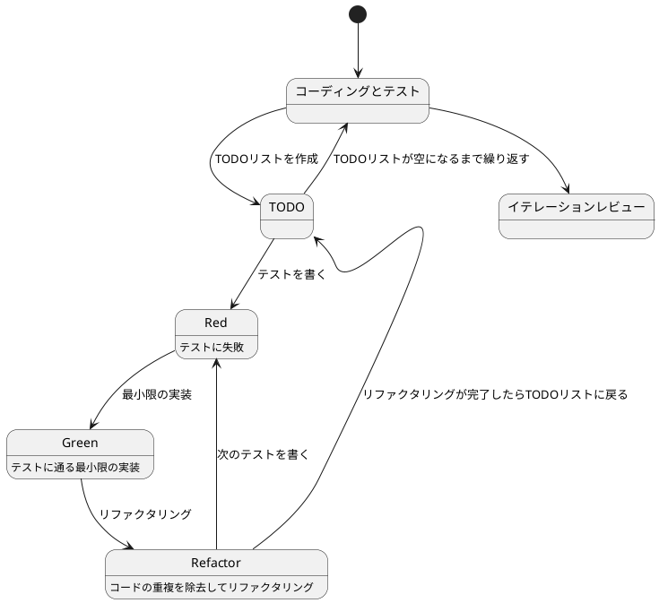
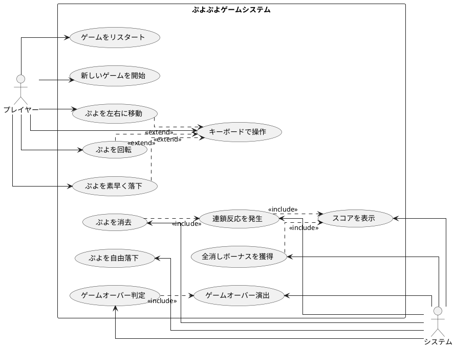

# ぷよぷよから始めるテスト駆動開発入門 F# Elmish.WPF版

> **注記**: このドキュメントのイテレーション2以降は、Bolero版から自動変換されたものです。
> View部分のコード例は、Bolero (Bolero.Html) の記法のままになっている箇所があります。
> 実際のWPF実装では、以下のような対応関係になります:
>
> - **Bolero**: `div []` / `button []` → **WPF**: XAML `<StackPanel>` / `<Button>`
> - **Bolero**: `on.click` → **WPF**: `Command="{Binding ...}"`
> - **Bolero**: `on.keydown` → **WPF**: `<Window.InputBindings><KeyBinding .../></Window.InputBindings>`
> - **Bolero**: `attr.classes` → **WPF**: `Style="{StaticResource ...}"`
>
> ドメインロジック部分 (GameLogic, PuyoPair, Board など) とElmish層 (Model, Update) のコードは、
> Bolero版とWPF版で共通です。

## はじめに

みなさん、こんにちは!今日は私と一緒にテスト駆動開発(TDD)を使って、F#とElmish.WPFでぷよぷよゲームを作っていきましょう。さて、プログラミングの旅に出る前に、皆さんは「テスト駆動開発」について聞いたことがありますか?もしかしたら「テストって、コードを書いた後にするものじゃないの?」と思われるかもしれませんね。

> テストを書きながら開発することによって、設計が良い方向に変わり、コードが改善され続け、それによって自分自身が開発に前向きになること、それがテスト駆動開発の目指すゴールです。
>
> — Kent Beck 『テスト駆動開発』 付録C　訳者解説:テスト駆動開発の現在

この記事では、私たちが一緒にぷよぷよゲームを実装しながら、テスト駆動開発の基本的な流れと考え方を学んでいきます。まるでモブプログラミングのセッションのように、あなたと私が一緒に考え、コードを書き、改善していく過程を体験しましょう。「でも、ぷよぷよって結構複雑なゲームじゃないの?」と思われるかもしれませんが、心配いりません。各章では、ユーザーストーリーに基づいた機能を、テスト、実装、解説の順に少しずつ進めていきますよ。一歩一歩、着実に進んでいきましょう!

### テスト駆動開発のサイクル

さて、テスト駆動開発では、どのように進めていけばいいのでしょうか?「テストを書いてから実装する」というのは分かりましたが、具体的にはどんな手順で進めるのでしょうか?

私がいつも実践しているのは、以下の3つのステップを繰り返すサイクルです。皆さんも一緒にやってみましょう:

1. **Red(赤)**: まず失敗するテストを書きます。「え?わざと失敗するテストを?」と思われるかもしれませんが、これには重要な意味があるんです。これから実装する機能が何をすべきかを明確にするためなんですよ。
2. **Green(緑)**: 次に、テストが通るように、最小限のコードを実装します。この段階では、きれいなコードよりも「とにかく動くこと」を優先します。「最小限」というのがポイントです。必要以上のことはしないようにしましょう。
3. **Refactor(リファクタリング)**: 最後に、コードの品質を改善します。テストが通ることを確認しながら、重複を取り除いたり、わかりやすい名前をつけたりします。「動くけど汚いコード」から「動いてきれいなコード」へと進化させるんです。

> レッド・グリーン・リファクタリング。それがTDDのマントラだ。
>
> — Kent Beck 『テスト駆動開発』

このサイクルを「Red-Green-Refactor」サイクルと呼びます。「赤・緑・リファクタリング」のリズムを刻むように、このサイクルを繰り返していくんです。これによって、少しずつ機能を追加し、コードの品質を高めていきましょう。皆さんも一緒にこのリズムを体感してみてください!



### 開発環境

さて、実際にコードを書く前に、私たちが使用する開発環境について少しお話ししておきましょう。皆さんは「道具選びは仕事の半分」という言葉を聞いたことがありますか?プログラミングでも同じことが言えるんです。

> 道具はあなたの能力を増幅します。道具のできが優れており、簡単に使いこなせるようになっていれば、より生産的になれるのです。
>
> — 達人プログラマー 熟達に向けたあなたの旅(第2版)

「どんなツールを使えばいいの?」と思われるかもしれませんね。今回のプロジェクトでは、以下のツールを使用していきます:

- **言語**: F# — 関数型プログラミングの力で、型安全で表現力豊かなコードを書きましょう。
- **UIフレームワーク**: Elmish.WPF — WPFベースのF#フレームワークで、Elmishアーキテクチャによる予測可能な状態管理を実現します。
- **テストフレームワーク**: xUnit — .NET標準のテストフレームワークです。
- **アサーションライブラリ**: FsUnit — F#らしいテストコードを書くためのライブラリです。
- **バージョン管理**: Git — コードの変更履歴を追跡し、「あれ?昨日までちゃんと動いてたのに...」というときに過去の状態に戻れる魔法のツールです。

これらのツールを使って、テスト駆動開発の流れに沿ってぷよぷよゲームを実装していきましょう。「環境構築って難しそう...」と心配される方もいるかもしれませんが手順に従って進めればそんなに難しいことではありません。詳細はイテレーション0: 環境の構築で解説します。

## 要件

### ユーザーストーリー

さて、実際にコードを書き始める前に、少し立ち止まって考えてみましょう。「何を作るのか？」という基本的な問いかけです。私たちが作るぷよぷよゲームは、どのような機能を持つべきでしょうか？

アジャイル開発では、この「何を作るのか？」という問いに対して、「ユーザーストーリー」という形で答えを出します。皆さんは「ユーザーストーリー」という言葉を聞いたことがありますか？

> ユーザーストーリーは、ソフトウェア要求を表現するための軽量な手法である。ユーザーストーリーは、システムについてユーザーまたは顧客の視点からフィーチャの概要を記述したものだ。
> ユーザーストーリーには形式が定められておらず、標準的な記法もない。とはいえ、次のような形式でストーリーを考えてみると便利である。「＜ユーザーの種類＞として、＜機能や性能＞がほしい。それは＜ビジネス価値＞のためだ」という形のテンプレートに従うと、
> たとえば次のようなストーリーを書ける。「本の購入者として、ＩＳＢＮで本を検索したい。それは探している本をすばやく見つけるためだ」
>
> — Mike Cohn 『アジャイルな見積と計画づくり』

つまり、「プレイヤーとして、〇〇ができる（〇〇したいから）」という形式で機能を表現するんです。これによって、「誰のため」の「どんな機能」を「なぜ」作るのかが明確になります。素晴らしいですよね！

では、私たちのぷよぷよゲームでは、どんなユーザーストーリーが考えられるでしょうか？一緒に考えてみましょう：

- プレイヤーとして、新しいゲームを開始できる（ゲームの基本機能として必要ですよね！）
- プレイヤーとして、落ちてくるぷよを左右に移動できる（ぷよを適切な位置に配置したいですよね）
- プレイヤーとして、落ちてくるぷよを回転できる（戦略的にぷよを配置するために必要です）
- プレイヤーとして、ぷよを素早く落下させることができる（「早く次のぷよを落としたい！」というときのために）
- プレイヤーとして、同じ色のぷよを4つ以上つなげると消去できる（これがぷよぷよの醍醐味ですよね！）
- プレイヤーとして、連鎖反応を起こしてより高いスコアを獲得できる（「れ〜んさ〜ん！」と叫びたくなりますよね）
- プレイヤーとして、全消し（ぜんけし）ボーナスを獲得できる（「やった！全部消えた！」という達成感を味わいたいですよね）
- プレイヤーとして、ゲームオーバーになるとゲーム終了の演出を見ることができる（終わりが明確でないとモヤモヤしますよね）
- プレイヤーとして、現在のスコアを確認できる（「今どれくらい点数取れてるかな？」と気になりますよね）
- プレイヤーとして、キーボードでぷよを操作できる（PCでプレイするなら必須ですよね）

「うわ、結構たくさんあるな...」と思われるかもしれませんが、心配いりません！これらのユーザーストーリーを一つずつ実装していくことで、徐々にゲームを完成させていきましょう。テスト駆動開発の素晴らしいところは、各ストーリーを小さなタスクに分解し、テスト→実装→リファクタリングのサイクルで少しずつ進められることなんです。一歩一歩、着実に進んでいきましょう！

### ユースケース図

ユーザーストーリーを整理したところで、「これらの機能がどのように関連しているのか、全体像が見えるといいな」と思いませんか？そんなときに役立つのが「ユースケース図」です。
「ユースケース図って何？」と思われるかもしれませんね。ユースケース図は、システムと外部アクター（ここではプレイヤーとシステム自体）の相互作用を視覚的に表現するための図です。「絵に描いて整理すると分かりやすい」というやつですね。

> ユースケースは、システムの振る舞いに関する利害関係者の契約を表現するものです。
>
> — アリスター・コーバーン 『ユースケース実践ガイド』

「百聞は一見にしかず」というように、実際に見てみるのが一番分かりやすいですよね。では、私たちのぷよぷよゲームのユースケース図を見てみましょう：



この図を見ると、プレイヤーとシステムの役割分担がよくわかりますね。プレイヤーはゲームの開始や操作を担当し、システムはぷよの消去判定やスコア計算などの内部処理を担当しています。

このようにユースケース図を作成することで、システムの全体像を把握し、実装すべき機能の関連性を明確にすることができます。それでは、実際のコード実装に進んでいきましょう！

誤解しないでもらいたいのですが本来ユースケースとはテキストで記述するものでありユースケース図は概要を把握するための手段に過ぎないということです。

> 楕円、矢印、人型おアイコンから構成されているUMLのユースケース図は、ユースケースを把握するための表記法ではありません。
> 楕円や矢印は、ユースケースをのパッケージや分解を表すもので、内容を表すものではありません。
>
> — アリスター・コーバーン 『ユースケース実践ガイド』

## リリース計画

要件もわかった、プログラミング開始だ！ちょっと待ってください、何事も計画を立てる事は大事なことです。ユースケース図を見てください、結構いろんなことがありますよね。何から取り組みますか？
「スコアの表示」ですか？「ゲームオーバー判定」ですか？でもまずは「新しいゲームを開始」しないとつながりとして難しいですよね。もちろん実際にプログラミングしながら順番を考えてもいいですけど間違った順番で進めると直すのが大変ですよね。
それにこれからどんなものを作るのかは事前にある程度イメージを固めておきたいものです（いきなり「ゲームオーバー」になるゲームはやりたくないですよね）。

> 計画づくりとは「なにをいつまでに作ればいいのか？」という質問に答える作業だと私は考えている
>
> — Mike Cohn 『アジャイルな見積と計画づくり』

今回の目的はぷよぷよゲームを遊べるための最小限の機能の実装です。目的を実現するためにやるべきことをイテレーションという単位でまとめましょう。「全部やること洗い出すの？そんな先のことはわからないよ！」と思いますよね。安心してください今決めることは大まかな作業の流れと前後関係の整理だけです。
細かい部分は各イテレーションでおいおい明確になってきます。その手助けをしてくれるのがテスト駆動開発なのです。

> 正しい設計を、正しいタイミングで行う。動かしてから、正しくする。
>
> — Kent Beck 『テスト駆動開発』

今回はユーザーストーリーとユースケース図から以下のイテレーション計画に従ってぷよぷよゲームをリリースします。

- イテレーション0: 環境の構築
- イテレーション1: ゲーム開始の実装
- イテレーション2: ぷよの移動の実装
- イテレーション3: ぷよの回転の実装
- イテレーション4: ぷよの自由落下の実装
- イテレーション5: ぷよの高速落下の実装
- イテレーション6: ぷよの消去の実装
- イテレーション7: 連鎖反応の実装
- イテレーション8: 全消しボーナスの実装
- イテレーション9: ゲームオーバーの実装

では、ぷよぷよゲーム開発スタートです！

## イテレーション0: 環境の構築

...と言いたいところですがまずは環境の構築をしなければなりません。「プログラミングなんてどの言語でやるか決めるぐらいでしょ?」と思うかもしれませんが家を建てるときにしっかりとした基礎工事が必要なように開発環境もしっかりとした準備が必要です。
家を建てた後に基礎がダメだと困ったことになりますからね。

### ソフトウェア開発の三種の神器

良いコードを書き続けるためには何が必要になるでしょうか？それは[ソフトウェア開発の三種の神器](https://t-wada.hatenablog.jp/entry/clean-code-that-works)と呼ばれるものです。

> 今日のソフトウェア開発の世界において絶対になければならない3つの技術的な柱があります。
> 三本柱と言ったり、三種の神器と言ったりしていますが、それらは
>
>   - バージョン管理
>   - テスティング
>   - 自動化
>
> の3つです。
>
> —  https://t-wada.hatenablog.jp/entry/clean-code-that-works

本章では開発環境のセットアップとして、これら三種の神器を準備していきます。環境構築は退屈に感じるかもしれませんが、これらのツールがあることで、安心してコードを書くことができるようになります。一緒に進めていきましょう！

### バージョン管理: Gitとコミットメッセージ

バージョン管理システムとして Git を使います。Git については既に使用していると仮定しますが、コミットメッセージについて1つだけ重要なルールを確認しておきましょう。

#### コミットメッセージの書き方

私たちのプロジェクトでは、[Conventional Commits](https://www.conventionalcommits.org/ja/)の書式に従ってコミットメッセージを書きます。具体的には、それぞれのコミットメッセージはヘッダ、ボディ、フッタで構成されます。

```
<タイプ>(<スコープ>): <タイトル>
<空行>
<ボディ>
<空行>
<フッタ>
```

ヘッダは必須で、スコープは任意です。コミットメッセージのタイトルは50文字までにしましょう（GitHub上で読みやすくなります）。

コミットのタイプは次を用います：

- **feat**: 新しい機能
- **fix**: バグ修正
- **docs**: ドキュメント変更のみ
- **style**: コードに影響を与えない変更（空白、フォーマットなど）
- **refactor**: 機能追加でもバグ修正でもないコード変更
- **perf**: パフォーマンスを改善するコード変更
- **test**: テストの追加や修正
- **chore**: ビルドプロセスや補助ツールの変更

例えば：

```bash
git commit -m 'feat: ゲーム初期化機能を追加'
git commit -m 'refactor: メソッドの抽出'
git commit -m 'test: ぷよ消去のテストケースを追加'
```

### Elmish.WPF: F#のデスクトップアプリケーションフレームワーク

「F#でデスクトップゲームを作る?どうやって?」と思われるかもしれませんね。ここで登場するのが **Elmish.WPF** です。Elmish.WPF は WPF(Windows Presentation Foundation) 上で動作するF#フレームワークで、Elmishアーキテクチャ(Model-View-Update パターン)による予測可能な状態管理を実現します。

#### Elmish.WPFとは

Elmish.WPF は F# で Windows デスクトップアプリケーションを開発するためのフレームワークです。WPF をベースにしており、F# のコードで XAML を使った UI を構築できます。

「なぜElmish.WPFを使うの?直接WPFを書けばいいじゃない」と思われるかもしれませんね。それにはいくつかの理由があります:

**1. Elmishアーキテクチャ**

Elmish.WPF は Elmish という状態管理パターンを採用しています。これは The Elm Architecture(TEA)に基づいた、予測可能で保守性の高いアーキテクチャです。

```fsharp
// Elmish の基本構造

// Model: アプリケーションの状態
type Model = {
    Count: int
}

// Message: 状態を変更するイベント
type Message =
    | Increment
    | Decrement

// Init: 初期状態
let init () = { Count = 0 }

// Update: メッセージに応じて状態を更新
let update message model =
    match message with
    | Increment -> { model with Count = model.Count + 1 }
    | Decrement -> { model with Count = model.Count - 1 }

// Bindings: XAML へのデータバインディング定義
let bindings () : Binding<Model, Message> list = [
    "Count" |> Binding.oneWay (fun m -> m.Count)
    "Increment" |> Binding.cmd (fun _ -> Increment)
    "Decrement" |> Binding.cmd (fun _ -> Decrement)
]
```

「Elmishって何が良いの?」と思われるかもしれませんね。Elmish の素晴らしい点は、状態の変更が予測可能で、テストしやすいことです。すべての状態変更は `update` 関数を通じて行われるため、バグを減らすことができます。

**2. 型安全性**

F# の強力な型システムにより、コンパイル時に多くのエラーを検出できます。

```fsharp
// F#: 型安全な状態管理
type GameState =
    | Playing of score:int * level:int
    | Paused of score:int * level:int
    | GameOver of finalScore:int

let handleGameState state =
    match state with
    | Playing (score, level) -> sprintf "Playing - Score: %d, Level: %d" score level
    | Paused (score, level) -> sprintf "Paused - Score: %d, Level: %d" score level
    | GameOver finalScore -> sprintf "Game Over - Final Score: %d" finalScore

// すべてのケースを処理しないとコンパイルエラー
```

**3. 関数型プログラミング**

F# の関数型プログラミングの恩恵を受けられます:

```fsharp
// F#: イミュータブルなデータ構造
type Position = { X: int; Y: int }

let position1 = { X = 0; Y = 0 }
let position2 = { position1 with X = 10 }  // 新しいインスタンスを作成

// position1 は変更されない
printfn "%A" position1  // { X = 0; Y = 0 }
printfn "%A" position2  // { X = 10; Y = 0 }
```

「イミュータブルって何?」と思われるかもしれませんね。イミュータブルとは、一度作成したデータを変更できないという性質のことです。これにより、予期しない状態変更によるバグを防ぐことができます。

**4. パターンマッチング**

F# のパターンマッチングは、複雑な条件分岐を簡潔に書くことができる強力な機能です。

```fsharp
// F#: パターンマッチング
type PuyoColor =
    | Red
    | Blue
    | Green
    | Yellow
    | Empty

let getPuyoName color =
    match color with
    | Red -> "赤ぷよ"
    | Blue -> "青ぷよ"
    | Green -> "緑ぷよ"
    | Yellow -> "黄ぷよ"
    | Empty -> "空"

// コンパイラがすべてのケースをチェック
// ケースの漏れがあるとコンパイルエラーになる
```

#### Elmishアーキテクチャの詳細

Elmish は単方向データフローによる状態管理パターンです。以下の3つの要素で構成されます:

**Model(状態)**

アプリケーションの現在の状態を表現します:

```fsharp
type Model = {
    Board: PuyoColor[,]
    CurrentPuyo: PuyoPair option
    Score: int
    GameState: GameState
}
```

**Message(イベント)**

状態を変更するためのイベントを定義します:

```fsharp
type Message =
    | MoveLeft
    | MoveRight
    | Rotate
    | Drop
    | Tick
    | GameOver
```

**Update(更新関数)**

メッセージを受け取り、新しい状態を返します:

```fsharp
let update message model =
    match message with
    | MoveLeft ->
        let newModel = { model with CurrentPuyo = movePuyoLeft model.CurrentPuyo }
        newModel
    | MoveRight ->
        let newModel = { model with CurrentPuyo = movePuyoRight model.CurrentPuyo }
        newModel
    | Tick ->
        let newModel = applyGravity model
        newModel
    // ... 他のメッセージ処理
```

**Bindings(バインディング)**

XAML との接続を定義します:

```fsharp
let bindings () : Binding<Model, Message> list = [
    "Board" |> Binding.oneWay (fun m -> m.Board)
    "Score" |> Binding.oneWay (fun m -> m.Score)
    "MoveLeft" |> Binding.cmd (fun _ -> MoveLeft)
    "MoveRight" |> Binding.cmd (fun _ -> MoveRight)
]
```

#### Elmish.WPFのメリット

「結局、Elmish.WPFを使うメリットは何?」とまとめたくなりますよね。以下がElmish.WPFの主なメリットです:

1. **型安全性**: コンパイル時に多くのバグを防ぐ
2. **予測可能な状態管理**: Elmish による単方向データフロー
3. **テストしやすい**: 純粋関数による実装
4. **関数型プログラミング**: 再利用可能で保守しやすいコード
5. **.NETエコシステムとの統合**: 既存の.NETライブラリを活用できる
6. **WPFの豊富なUIコントロール**: 成熟したUIフレームワークを活用

「難しそう...」と思われるかもしれませんが、心配いりません。このチュートリアルを通じて、F# と Elmish.WPF の基本を一緒に学んでいきましょう。テスト駆動開発の流れに沿って、一つずつ機能を実装していけば、自然と F# と Elmish.WPF の使い方が身につきますよ!

### テスティング: F#とxUnit

良いコードを書くためには、コードが正しく動作することを確認するテストが欠かせません。F# + Elmish.WPFのテスト環境をセットアップしていきましょう。

「F#でどうやってテストを書くの?」と思われるかもしれませんね。F#のテストは、.NETの標準的なテストフレームワークであるxUnitと、F#らしいアサーションを提供するFsUnitを組み合わせて書きます。

#### F#プロジェクトの作成

まず、F#プロジェクトの構造を作成します:

```bash
# プロジェクトディレクトリの作成
mkdir -p app/fsharp-2/wpf
cd app/fsharp-2/wpf

# ソリューションの作成
dotnet new sln -n PuyoPuyo

# WPFプロジェクトの作成
# 注: F#のWPFテンプレートが存在しないため、classlibから作成して後で設定変更
dotnet new classlib -lang F# -o src/PuyoPuyo.WPF

# テストプロジェクトの作成
dotnet new xunit -lang F# -o tests/PuyoPuyo.Tests

# ソリューションにプロジェクトを追加
dotnet sln add src/PuyoPuyo.WPF/PuyoPuyo.WPF.fsproj
dotnet sln add tests/PuyoPuyo.Tests/PuyoPuyo.Tests.fsproj

# テストプロジェクトからWPFプロジェクトを参照
dotnet add tests/PuyoPuyo.Tests reference src/PuyoPuyo.WPF/PuyoPuyo.WPF.fsproj
```

WPFプロジェクトの設定を変更します（`src/PuyoPuyo.WPF/PuyoPuyo.WPF.fsproj`）:

```xml
<Project Sdk="Microsoft.NET.Sdk">

  <PropertyGroup>
    <OutputType>WinExe</OutputType>
    <TargetFramework>net9.0-windows</TargetFramework>
    <GenerateDocumentationFile>true</GenerateDocumentationFile>
    <UseWPF>true</UseWPF>
    <EnableDefaultPageItems>false</EnableDefaultPageItems>
  </PropertyGroup>

  <ItemGroup>
    <Compile Include="Domain.fs" />
    <Compile Include="Program.fs" />
  </ItemGroup>

  <ItemGroup>
    <PackageReference Include="Elmish.WPF" Version="3.5.8" />
  </ItemGroup>

</Project>
```

**重要**: .NET 9 を使用します。.NET 10 は FSharpLint との互換性に問題があるため、`global.json` で SDK バージョンを固定します:

```bash
# global.jsonの作成
cat > global.json << 'EOF'
{
  "sdk": {
    "version": "9.0.305",
    "rollForward": "latestPatch"
  }
}
EOF
```

#### Elmish.WPFとFsUnitのセットアップ

必要なパッケージをインストールします:

```bash
# WPFプロジェクトへElmish.WPFを追加（既に.fsprojに含まれている場合はスキップ）
dotnet add src/PuyoPuyo.WPF package Elmish.WPF

# テストプロジェクトへFsUnitを追加
dotnet add tests/PuyoPuyo.Tests package FsUnit.xUnit
```

テストプロジェクトの設定も .NET 9 に変更します（`tests/PuyoPuyo.Tests/PuyoPuyo.Tests.fsproj`）:

```xml
<Project Sdk="Microsoft.NET.Sdk">

  <PropertyGroup>
    <TargetFramework>net9.0-windows</TargetFramework>
    <IsPackable>false</IsPackable>
    <GenerateProgramFile>false</GenerateProgramFile>
    <IsTestProject>true</IsTestProject>
  </PropertyGroup>

  <ItemGroup>
    <Compile Include="Tests.fs" />
  </ItemGroup>

  <ItemGroup>
    <PackageReference Include="coverlet.msbuild" Version="6.0.4">
      <PrivateAssets>all</PrivateAssets>
      <IncludeAssets>runtime; build; native; contentfiles; analyzers; buildtransitive</IncludeAssets>
    </PackageReference>
    <PackageReference Include="FsUnit.xUnit" Version="7.1.1" />
    <PackageReference Include="Microsoft.NET.Test.Sdk" Version="17.14.1" />
    <PackageReference Include="xunit.v3" Version="3.0.0" />
    <PackageReference Include="xunit.runner.visualstudio" Version="3.1.3">
      <IncludeAssets>runtime; build; native; contentfiles; analyzers; buildtransitive</IncludeAssets>
      <PrivateAssets>all</PrivateAssets>
    </PackageReference>
  </ItemGroup>

  <ItemGroup>
    <ProjectReference Include="..\..\src\PuyoPuyo.WPF\PuyoPuyo.WPF.fsproj" />
  </ItemGroup>

</Project>
```

### 自動化: ビルドとタスク管理

開発の効率を上げるため、繰り返し実行するタスクを自動化しましょう。

#### dotnet watch によるホットリロード

開発中は、コードを変更するたびに自動的にビルドして再読み込みする機能が便利です：

```bash
# 開発サーバーを起動（ファイル変更を監視）
cd src/PuyoPuyo.WPF
dotnet watch run
```

アプリケーションが起動し、コードを変更すると、自動的にビルドされて再起動されます。

#### テストの自動実行

テスト駆動開発では、テストを頻繁に実行します。ファイルが変更されるたびに自動的にテストを実行する設定も便利です：

```bash
# テストを監視モードで実行
dotnet watch test --project tests/PuyoPuyo.Tests
```

#### Cake によるビルド自動化

「ビルド自動化ツールは何を使えばいいですか？」.NETエコシステムでは Cake がよく使われます。CakeはC#で書けるクロスプラットフォームなビルド自動化ツールです。

##### Cakeとは

Cake（C# Make）は、.NET開発者向けのビルド自動化システムです：

**特徴**
- C#で書けるビルドスクリプト（型安全、IntelliSense対応）
- クロスプラットフォーム（Windows、macOS、Linux）
- 豊富なアドインとヘルパー
- .NETツールとの統合

**Makefileとの比較**

| 機能 | Makefile | Cake |
|------|----------|------|
| 記述言語 | シェルスクリプト | C# |
| 型チェック | なし | あり（コンパイル時） |
| IntelliSense | 限定的 | 完全対応 |
| .NET統合 | 外部コマンド | ネイティブ |
| 依存関係 | タブ文字必須 | 柔軟 |

##### Cakeのセットアップ

まず、Cakeをローカルツールとしてインストールします：

```bash
# .NET ローカルツールマニフェストを作成
dotnet new tool-manifest

# Cakeをインストール
dotnet tool install Cake.Tool

# Fantomasをインストール（コードフォーマッタ）
dotnet tool install fantomas

# FSharpLintをインストール（静的解析）
dotnet tool install dotnet-fsharplint
```

次に、ビルドスクリプト `build.cake` をプロジェクトルートに作成します：

```csharp
// build.cake

///////////////////////////////////////////////////////////////////////////////
// 引数
///////////////////////////////////////////////////////////////////////////////

var target = Argument("target", "Default");
var configuration = Argument("configuration", "Release");

///////////////////////////////////////////////////////////////////////////////
// タスク定義
///////////////////////////////////////////////////////////////////////////////

Task("Clean")
    .Does(() =>
{
    DotNetClean("./PuyoPuyo.sln");
    CleanDirectories("./src/**/bin");
    CleanDirectories("./src/**/obj");
    CleanDirectories("./tests/**/bin");
    CleanDirectories("./tests/**/obj");
});

Task("Restore")
    .IsDependentOn("Clean")
    .Does(() =>
{
    DotNetRestore("./PuyoPuyo.sln");
});

Task("Build")
    .IsDependentOn("Restore")
    .Does(() =>
{
    DotNetBuild("./PuyoPuyo.sln", new DotNetBuildSettings
    {
        Configuration = configuration,
        NoRestore = true
    });
});

Task("Test")
    .IsDependentOn("Build")
    .Does(() =>
{
    DotNetTest("./PuyoPuyo.sln", new DotNetTestSettings
    {
        Configuration = configuration,
        NoBuild = true,
        NoRestore = true
    });
});

Task("Run")
    .Does(() =>
{
    DotNetRun("./src/PuyoPuyo.WPF/PuyoPuyo.WPF.fsproj");
});

Task("Watch")
    .Does(() =>
{
    StartProcess("dotnet", new ProcessSettings
    {
        Arguments = "watch run --project ./src/PuyoPuyo.WPF/PuyoPuyo.WPF.fsproj"
    });
});

Task("Watch-Test")
    .Does(() =>
{
    StartProcess("dotnet", new ProcessSettings
    {
        Arguments = "watch test --project ./tests/PuyoPuyo.Tests/PuyoPuyo.Tests.fsproj"
    });
});

Task("Format")
    .Description("コードを自動フォーマット")
    .Does(() =>
{
    StartProcess("dotnet", new ProcessSettings
    {
        Arguments = "fantomas src tests"
    });
});

Task("Format-Check")
    .Description("コードフォーマットをチェック")
    .Does(() =>
{
    var exitCode = StartProcess("dotnet", new ProcessSettings
    {
        Arguments = "fantomas src tests --check"
    });

    if (exitCode != 0)
    {
        throw new Exception("コードフォーマットエラーが検出されました。dotnet cake --target=Format で修正してください。");
    }
});

Task("Lint")
    .Description("静的コード解析を実行")
    .Does(() =>
{
    var exitCode = StartProcess("dotnet", new ProcessSettings
    {
        Arguments = "fsharplint lint PuyoPuyo.sln"
    });

    if (exitCode != 0)
    {
        throw new Exception("静的コード解析でエラーが検出されました。");
    }
});

Task("Coverage")
    .Description("テストカバレッジを測定")
    .IsDependentOn("Build")
    .Does(() =>
{
    DotNetTest("./PuyoPuyo.sln", new DotNetTestSettings
    {
        Configuration = configuration,
        NoBuild = true,
        NoRestore = true,
        ArgumentCustomization = args => args
            .Append("/p:CollectCoverage=true")
            .Append("/p:CoverletOutputFormat=opencover")
            .Append("/p:CoverletOutput=./coverage/")
    });

    Information("カバレッジレポート: ./tests/PuyoPuyo.Tests/coverage/coverage.opencover.xml");
});

///////////////////////////////////////////////////////////////////////////////
// ターゲット
///////////////////////////////////////////////////////////////////////////////

Task("Default")
    .IsDependentOn("Test");

Task("CI")
    .Description("CI環境での完全なビルドとテスト")
    .IsDependentOn("Clean")
    .IsDependentOn("Format-Check")
    .IsDependentOn("Lint")
    .IsDependentOn("Test")
    .IsDependentOn("Coverage");

///////////////////////////////////////////////////////////////////////////////
// 実行
///////////////////////////////////////////////////////////////////////////////

RunTarget(target);
```

「このスクリプトは何をしているんですか？」良い質問ですね！各タスクを見ていきましょう：

**タスクの説明**

1. **Clean**：ビルド成果物を削除
   ```csharp
   DotNetClean("./PuyoPuyo.sln");
   CleanDirectories("./src/**/bin");  // binフォルダを削除
   ```

2. **Restore**：NuGetパッケージを復元
   ```csharp
   .IsDependentOn("Clean")  // Cleanタスクに依存
   DotNetRestore("./PuyoPuyo.sln");
   ```

3. **Build**：プロジェクトをビルド
   ```csharp
   .IsDependentOn("Restore")  // Restoreタスクに依存
   NoRestore = true  // 既に復元済みなのでスキップ
   ```

4. **Test**：テストを実行
   ```csharp
   .IsDependentOn("Build")  // Buildタスクに依存
   NoBuild = true  // 既にビルド済みなのでスキップ
   ```

5. **Run**：アプリケーションを起動
6. **Watch**：ファイル変更を監視して自動再起動
7. **Watch-Test**：ファイル変更を監視して自動テスト実行

「`.IsDependentOn()`は何ですか？」これは、タスク間の依存関係を定義するメソッドです。例えば`Test`タスクは`Build`タスクに依存しているので、`Test`を実行すると自動的に`Build`も実行されます。依存関係は連鎖するので、`Test`を実行すると`Clean` → `Restore` → `Build` → `Test`の順に実行されます。

##### Cakeの実行

Cakeスクリプトを実行するには、以下のコマンドを使用します：

```bash
# デフォルトタスク（Test）を実行
dotnet cake

# 特定のタスクを実行
dotnet cake --target=Build
dotnet cake --target=Run
dotnet cake --target=Watch

# CI環境でのビルド
dotnet cake --target=CI

# 設定を指定
dotnet cake --target=Build --configuration=Debug
```

##### PowerShell スクリプト（Windows用）

Windows環境では、PowerShellスクリプトを作成すると便利です：

```powershell
# build.ps1
[CmdletBinding()]
Param(
    [string]$Target = "Default",
    [string]$Configuration = "Release"
)

& dotnet cake --target=$Target --configuration=$Configuration
```

実行方法：

```powershell
# デフォルトタスクを実行
.\build.ps1

# 特定のタスクを実行
.\build.ps1 -Target Build
.\build.ps1 -Target Test
```

##### Bashスクリプト（macOS/Linux用）

macOS/Linux環境では、Bashスクリプトを作成します：

```bash
# build.sh
#!/usr/bin/env bash

TARGET=${1:-Default}
CONFIGURATION=${2:-Release}

dotnet cake --target="$TARGET" --configuration="$CONFIGURATION"
```

実行権限を付与して実行：

```bash
# 実行権限を付与
chmod +x build.sh

# デフォルトタスクを実行
./build.sh

# 特定のタスクを実行
./build.sh Build
./build.sh Test
```

##### Cakeの利点

「なぜCakeを使うのですか？」Cakeを使う利点は以下の通りです：

1. **型安全性**：C#で書くのでコンパイル時に型チェックされる
2. **IntelliSense**：Visual Studio CodeやRiderで補完が効く
3. **再利用性**：NuGetパッケージとしてビルドロジックを共有できる
4. **統合性**：.NETツールとシームレスに統合
5. **可読性**：複雑なビルドロジックも構造化して書ける
6. **クロスプラットフォーム**：Windows、macOS、Linuxで同じスクリプトが動く

### 自動化: コード品質の自動管理

良いコードを書き続けるためには、コードの品質を自動的にチェックし、維持していく仕組みが必要です。F#エコシステムのツールを活用しましょう。

#### コードフォーマッタ: Fantomas

F#のコードフォーマットを統一するために **Fantomas** を使います。

> 優れたソースコードは「目に優しい」ものでなければいけない。
>
> —  リーダブルコード

Fantomasのインストール：

```bash
dotnet tool install fantomas
```

`build.cake`にフォーマット用のタスクを追加します：

```csharp
// build.cake に追加

Task("Format")
    .Description("コードを自動フォーマット")
    .Does(() =>
{
    StartProcess("dotnet", new ProcessSettings
    {
        Arguments = "fantomas src tests"
    });
});

Task("Format-Check")
    .Description("コードフォーマットをチェック")
    .Does(() =>
{
    var exitCode = StartProcess("dotnet", new ProcessSettings
    {
        Arguments = "fantomas src tests --check"
    });

    if (exitCode != 0)
    {
        throw new Exception("コードフォーマットエラーが検出されました。dotnet cake --target=Format で修正してください。");
    }
});
```

フォーマットの実行：

```bash
dotnet cake --target=Format-Check  # チェックのみ
dotnet cake --target=Format        # 自動修正
```

#### 静的コード解析: FSharpLint

静的コード解析ツールとして **FSharpLint** を使います。

```bash
dotnet tool install dotnet-fsharplint
```

プロジェクトルートに`fsharplint.json`を作成して、ルールをカスタマイズします：

```json
{
  "ignoreFiles": [
    "**/obj/**/*.fs",
    "**/bin/**/*.fs"
  ],
  "hints": {
    "add": []
  },
  "formatting": {
    "typedItemSpacing": {
      "enabled": true
    },
    "typePrefixing": {
      "enabled": true
    }
  },
  "conventions": {
    "naming": {
      "enabled": true
    },
    "nestedStatements": {
      "enabled": true,
      "depth": 5
    },
    "cyclomaticComplexity": {
      "enabled": true,
      "maxComplexity": 7
    }
  }
}
```

`build.cake`にlint用のタスクを追加：

```csharp
// build.cake に追加

Task("Lint")
    .Description("静的コード解析を実行")
    .Does(() =>
{
    var exitCode = StartProcess("dotnet", new ProcessSettings
    {
        Arguments = "fsharplint lint PuyoPuyo.sln"
    });

    if (exitCode != 0)
    {
        throw new Exception("静的コード解析でエラーが検出されました。");
    }
});
```

静的解析の実行：

```bash
dotnet cake --target=Lint
```

#### テストカバレッジ

F#でのコードカバレッジ測定には、.NETエコシステムの **coverlet** や **altcover** を使用します。

coverletのインストール：

```bash
# coverletをテストプロジェクトに追加
dotnet add tests/PuyoPuyo.Tests package coverlet.msbuild
```

`build.cake`にカバレッジタスクを追加：

```csharp
// build.cake に追加

Task("Coverage")
    .Description("テストカバレッジを測定")
    .IsDependentOn("Build")
    .Does(() =>
{
    DotNetTest("./PuyoPuyo.sln", new DotNetTestSettings
    {
        Configuration = configuration,
        NoBuild = true,
        NoRestore = true,
        ArgumentCustomization = args => args
            .Append("/p:CollectCoverage=true")
            .Append("/p:CoverletOutputFormat=opencover")
            .Append("/p:CoverletOutput=./coverage/")
    });

    Information("カバレッジレポート: ./tests/PuyoPuyo.Tests/coverage/coverage.opencover.xml");
});
```

カバレッジの実行：

```bash
dotnet cake --target=Coverage
```

#### CI環境での品質チェック

CI環境では、すべての品質チェックを自動実行します。`build.cake`のCIタスクを拡張：

```csharp
// build.cake の CI タスクを更新

Task("CI")
    .Description("CI環境での完全なビルドとテスト")
    .IsDependentOn("Clean")
    .IsDependentOn("Format-Check")
    .IsDependentOn("Lint")
    .IsDependentOn("Test")
    .IsDependentOn("Coverage");
```

これにより、CI環境では以下が自動実行されます：

1. クリーンビルド
2. フォーマットチェック
3. 静的コード解析
4. テスト実行
5. カバレッジ測定

```bash
# CI環境での実行
dotnet cake --target=CI
```

### Git の設定

プロジェクトのバージョン管理を開始しましょう。

#### .gitignoreの設定

F#プロジェクト固有のファイルを除外するため、`.gitignore` ファイルを作成します：

```bash
# プロジェクトルートに .gitignore を作成
cat > .gitignore << 'EOF'
# Build results
[Dd]ebug/
[Rr]elease/
x64/
x86/
[Bb]in/
[Oo]bj/

# Visual Studio
.vs/
*.user
*.suo
*.userosscache
*.sln.docstates

# Rider
.idea/
*.sln.iml

# User-specific files
*.rsuser
*.suo
*.user
*.userosscache
*.sln.docstates

# Mono Auto Generated Files
mono_crash.*

# Build Results
[Dd]ebug/
[Dd]ebugPublic/
[Rr]elease/
[Rr]eleases/
x64/
x86/
[Aa][Rr][Mm]/
[Aa][Rr][Mm]64/
bld/
[Bb]in/
[Oo]bj/
[Ll]og/
[Ll]ogs/

# .NET Core
project.lock.json
project.fragment.lock.json
artifacts/

# Cake
tools/**
!tools/packages.config

# Coverage
coverage/
*.opencover.xml
EOF
```

#### 初期コミット

プロジェクトを Git で管理開始します：

```bash
# Gitリポジトリを初期化
git init

# すべてのファイルをステージング
git add .

# 初期コミット
git commit -m "feat: initialize F# Elmish.WPF Puyo Puyo project with test setup"
```

### イテレーション0のまとめ

このイテレーションで準備した環境：

1. **バージョン管理**
   - 既存の Git リポジトリを使用（case-study-game-dev）
   - .gitignoreの設定（.NET / F# 対応）
   - Conventional Commitsの規約

2. **プロジェクト構造**
   ```
   app/fsharp-2/wpf/
   ├── .config/
   │   └── dotnet-tools.json       # ローカルツール設定
   ├── global.json                 # .NET SDK バージョン固定 (9.0.305)
   ├── PuyoPuyo.sln                # ソリューションファイル
   ├── build.cake                  # Cake ビルドスクリプト
   ├── build.ps1 / build.sh        # ビルドスクリプトラッパー
   ├── fsharplint.json             # FSharpLint 設定
   ├── src/
   │   └── PuyoPuyo.WPF/
   │       ├── PuyoPuyo.WPF.fsproj # WPF プロジェクト (.NET 9)
   │       ├── Domain.fs           # Elmish ドメインロジック
   │       └── Program.fs          # アプリケーションエントリーポイント
   └── tests/
       └── PuyoPuyo.Tests/
           ├── PuyoPuyo.Tests.fsproj # テストプロジェクト (.NET 9)
           └── Tests.fs              # テストファイル
   ```

3. **テスティング**
   - xUnit v3 のセットアップ
   - FsUnit.xUnit 7.1.1 の導入
   - coverlet.msbuild 6.0.4 によるカバレッジ測定
   - テストプロジェクトから WPF プロジェクトへの参照

4. **自動化**
   - dotnet watch によるホットリロード
   - Cake によるビルド自動化（型安全な C# スクリプト）
   - タスク依存関係の管理
   - クロスプラットフォーム対応（build.ps1 / build.sh）
   - Fantomas によるコードフォーマット自動化
   - FSharpLint による静的コード解析
   - coverlet によるテストカバレッジ測定
   - CI 環境での品質チェック自動化（`dotnet cake --target=CI`）

5. **Elmish.WPF の理解**
   - Elmish.WPF 3.5.8 のセットアップ
   - Elmish アーキテクチャの基本（Model-View-Update）
   - 型安全な状態管理
   - コードベースの UI 構築（XAML を使用しない）
   - データバインディングの実装

6. **技術的な決定事項**
   - .NET 9 の使用（.NET 10 は FSharpLint 非互換のため）
   - global.json による SDK バージョン固定（9.0.305）
   - コード重視のアプローチ（XAML ファイルを使用しない）
   - 最小限の Elmish.WPF セットアップ（Model、Message、init、update、bindings）

7. **動作確認**
   - `dotnet cake --target=Run` でアプリケーションが起動
   - ウィンドウに「ぷよぷよゲーム」が表示されることを確認
   - `dotnet cake --target=CI` ですべての品質チェックがパス

「環境構築って面倒だな...」と思われたかもしれませんが、ここで準備したツールがこれからの開発を助けてくれます。テスト駆動開発では、テストを頻繁に実行し、小さな変更を積み重ねていきます。そのため、自動化されたテスト環境とバージョン管理が不可欠なのです。

次のイテレーションから、実際にぷよぷよゲームの実装を始めていきます。Elmishアーキテクチャの力を使って、予測可能で保守性の高いコードを書いていきましょう！

### Elmish.WPF 最小セットアップ

環境構築の最後に、Elmish.WPF が正しく動作することを確認するための最小限のアプリケーションを作成します。

このセットアップでは、Elmish.WPF の公式 Getting Started ガイドに従い、F# と C# の混合プロジェクト構成を採用します。F# でビジネスロジックを、C# で WPF の UI とエントリーポイントを管理します。

#### プロジェクト構成の概要

- **F# Class Library** (`src/PuyoPuyo.WPF`): Elmish のロジック（Model、Update、Bindings）を定義
- **C# WPF App** (`src/PuyoPuyo.App`): XAML による UI 定義とアプリケーションのエントリーポイント

#### ステップ 1: F# プロジェクトの設定

F# Class Library プロジェクトファイル (`src/PuyoPuyo.WPF/PuyoPuyo.WPF.fsproj`) を以下のように設定します:

```xml
<Project Sdk="Microsoft.NET.Sdk">
  <PropertyGroup>
    <TargetFramework>net9.0-windows</TargetFramework>
    <UseWpf>true</UseWpf>
  </PropertyGroup>

  <ItemGroup>
    <Compile Include="Counter.fs" />
    <Compile Include="Program.fs" />
  </ItemGroup>

  <ItemGroup>
    <PackageReference Include="Elmish.WPF" Version="3.5.8" />
  </ItemGroup>
</Project>
```

#### ステップ 2: Model と Message の定義

`src/PuyoPuyo.WPF/Counter.fs` にカウンターの例を実装します:

```fsharp
module Counter

open Elmish.WPF

type Model = { Count: int; StepSize: int }

type Msg =
    | Increment
    | Decrement
    | SetStepSize of int

let init () = { Count = 0; StepSize = 1 }

let update msg m =
    match msg with
    | Increment -> { m with Count = m.Count + m.StepSize }
    | Decrement -> { m with Count = m.Count - m.StepSize }
    | SetStepSize x -> { m with StepSize = x }
```

#### ステップ 3: Bindings の定義

同じファイルに bindings 関数を追加します:

```fsharp
let bindings () =
    [ "CounterValue" |> Binding.oneWay (fun m -> m.Count)
      "Increment" |> Binding.cmd (fun m -> Increment)
      "Decrement" |> Binding.cmd (fun m -> Decrement)
      "StepSize"
      |> Binding.twoWay ((fun m -> float m.StepSize), (fun newVal m -> int newVal |> SetStepSize)) ]
```

#### ステップ 4: Program.main の作成

`src/PuyoPuyo.WPF/Program.fs` に Elmish ループを起動する関数を定義します:

```fsharp
module Program

open Elmish
open Elmish.WPF

let main window =
    let config = ElmConfig.Default
    Program.mkProgram
        (fun () -> Counter.init (), Cmd.none)
        (fun msg model -> Counter.update msg model, Cmd.none)
        (fun _ _ -> Counter.bindings ())
    |> Program.withConsoleTrace
    |> Program.startElmishLoop config window
```

**重要**: Elmish.WPF 3.5.8 では `runElmishLoop` 関数は存在しません。代わりに `startElmishLoop` を使用します。この関数は既存の WPF Application の Dispatcher を使用し、非ブロッキングで Elmish ループを開始します。

#### ステップ 5: C# WPF プロジェクトの作成

Visual Studio テンプレート「WPF App (.NET)」を使用して C# プロジェクトを作成します。

プロジェクトファイル (`src/PuyoPuyo.App/PuyoPuyo.App.csproj`) を以下のように設定:

```xml
<Project Sdk="Microsoft.NET.Sdk">
  <PropertyGroup>
    <OutputType>Exe</OutputType>  <!-- コンソールログを表示したい場合 -->
    <DisableWinExeOutputInference>true</DisableWinExeOutputInference>
    <TargetFramework>net9.0-windows</TargetFramework>
    <UseWPF>true</UseWPF>
  </PropertyGroup>

  <ItemGroup>
    <ProjectReference Include="..\PuyoPuyo.WPF\PuyoPuyo.WPF.fsproj" />
  </ItemGroup>
</Project>
```

#### ステップ 6: App.xaml の設定

`App.xaml` に StartupUri を設定します:

```xml
<Application x:Class="PuyoPuyo.App.App"
             xmlns="http://schemas.microsoft.com/winfx/2006/xaml/presentation"
             xmlns:x="http://schemas.microsoft.com/winfx/2006/xaml"
             StartupUri="MainWindow.xaml">
    <Application.Resources>

    </Application.Resources>
</Application>
```

#### ステップ 7: App.xaml.cs の変更

`App.xaml.cs` を編集して、アプリケーション起動時に Elmish を初期化します:

```csharp
using System;
using System.Windows;

namespace PuyoPuyo.App
{
    public partial class App : Application
    {
        public App()
        {
            this.Activated += StartElmish;
        }

        private void StartElmish(object sender, EventArgs e)
        {
            this.Activated -= StartElmish;
            Program.main(MainWindow);
        }
    }
}
```

#### ステップ 8: MainWindow.xaml の作成

XAML でバインディングを定義します:

```xml
<Window
    x:Class="PuyoPuyo.App.MainWindow"
    xmlns="http://schemas.microsoft.com/winfx/2006/xaml/presentation"
    xmlns:x="http://schemas.microsoft.com/winfx/2006/xaml"
    Title="Counter Sample" Height="200" Width="400">
  <StackPanel Orientation="Horizontal" HorizontalAlignment="Center" VerticalAlignment="Center">
    <TextBlock Text="{Binding CounterValue}" FontSize="24" Margin="10"/>
    <Button Command="{Binding Decrement}" Content="-" Width="40" Height="40" Margin="5"/>
    <Button Command="{Binding Increment}" Content="+" Width="40" Height="40" Margin="5"/>
    <TextBlock Text="{Binding StepSize}" FontSize="18" Margin="10"/>
    <Slider Value="{Binding StepSize}" TickFrequency="1" Minimum="1" Maximum="10" Width="150"/>
  </StackPanel>
</Window>
```

#### 動作確認

Cake タスクでアプリケーションを実行します:

```bash
dotnet cake --target=run
```

カウンターアプリケーションが起動し、以下の機能が動作することを確認できます:

- カウンター値が表示される
- `+` / `-` ボタンでカウントが増減する
- スライダーでステップサイズを変更できる
- コンソールに状態遷移のログが表示される（`Program.withConsoleTrace` による）

この構成により、F# でロジックを、XAML で UI を管理する明確な分離が実現します。

[注: 以降のイテレーションでは、このアーキテクチャを踏襲し、ドメインロジックは F# で、UI は XAML で実装します]

## イテレーション1: ゲーム開始の実装

「環境構築が終わったので、いよいよゲームの実装を始めましょう！」そうですね！最初のイテレーションでは、ゲームの基本となるボードとぷよのデータ構造を実装していきます。

### ユーザーストーリー

まずは、このイテレーションで実装するユーザーストーリーを確認しましょう：

> プレイヤーとして、ゲームを開始して初期状態のボードとぷよが表示される

「ゲームを開始するって、具体的に何が必要なんですか？」良い質問ですね！ゲームを開始するためには、以下のような要素が必要です：

1. **ゲームボード**：ぷよを配置する場所
2. **ぷよ**：落ちてくるゲームの主役
3. **初期状態**：ゲームが始まったときの状態

### TODOリスト

このユーザーストーリーを実現するために、TODOリストを作成してみましょう：

- [ ] ぷよの色を表現する型を定義する
- [ ] ゲームボードを表現する型を定義する
- [ ] 空のボードを作成する関数を実装する
- [ ] ぷよをボードに配置する関数を実装する
- [ ] ボードからぷよを取得する関数を実装する
- [ ] 各機能に対応するテストを作成する

「結構たくさんありますね！」そうですね。でも、一つ一つは小さな機能なので、TDDサイクルに従って着実に進めていけば大丈夫ですよ。

### テスト: ぷよの色定義

「最初は何からテストしますか？」まずは最も基本的な「ぷよの色」から始めましょう。F#では判別共用体（Discriminated Union）を使って、型安全にぷよの色を表現できます。

```fsharp
// tests/PuyoPuyo.Tests/Domain/PuyoTests.fs
module PuyoPuyo.Tests.Domain.PuyoTests

open Xunit
open FsUnit.Xunit
open PuyoPuyo.Domain.Puyo

[<Fact>]
let ``ぷよの色は4種類定義されている`` () =
    // Arrange & Act
    let colors = [ Red; Green; Blue; Yellow ]

    // Assert
    colors.Length |> should equal 4

[<Fact>]
let ``赤色のぷよが作成できる`` () =
    // Arrange & Act
    let puyo = Red

    // Assert
    puyo |> should equal Red

[<Fact>]
let ``緑色のぷよが作成できる`` () =
    // Arrange & Act
    let puyo = Green

    // Assert
    puyo |> should equal Green
```

「このテストは何を確認しているんですか？」このテストでは、以下の点を確認しています：

1. ぷよの色が4種類（赤、緑、青、黄）定義されているか
2. それぞれの色のぷよが作成できるか

「シンプルですね！」そうです。まずは基本から始めましょう。では、このテストが通るように実装していきます。

### 実装: ぷよの色定義

「テストが失敗することを確認したら、実装に進みましょう！」そうですね。まずはテストを実行してみてください：

```bash
dotnet cake --target=Test
```

テストが失敗することを確認したら、実装を進めます。

```fsharp
// src/PuyoPuyo.WPF/Domain/Puyo.fs
namespace PuyoPuyo.Domain

/// ぷよの色
type PuyoColor =
    | Red
    | Green
    | Blue
    | Yellow

module Puyo =
    /// ぷよの色をHEX形式の文字列に変換
    let toHex (color: PuyoColor) : string =
        match color with
        | Red -> "#FF0000"
        | Green -> "#00FF00"
        | Blue -> "#0000FF"
        | Yellow -> "#FFFF00"
```

「判別共用体を使うと、色を型安全に扱えるんですね！」そうです！TypeScriptでは数値で色を表現していましたが、F#では判別共用体を使うことで、コンパイル時に存在しない色を使おうとするとエラーになります。

テストを実行して、すべて通ることを確認しましょう：

```bash
dotnet cake --target=Test
```

### テスト: ゲームボードの作成

「次は何をテストしますか?」次は、ぷよを配置するゲームボードを実装していきましょう。

```fsharp
// tests/PuyoPuyo.Tests/Domain/BoardTests.fs
module PuyoPuyo.Tests.Domain.BoardTests

open Xunit
open FsUnit.Xunit
open PuyoPuyo.Domain.Board
open PuyoPuyo.Domain.Puyo

[<Fact>]
let ``空のボードを作成できる`` () =
    // Arrange & Act
    let board = Board.create 6 13

    // Assert
    board.Cols |> should equal 6
    board.Rows |> should equal 13

[<Fact>]
let ``作成直後のボードはすべて空である`` () =
    // Arrange & Act
    let board = Board.create 6 13

    // Assert
    for y in 0 .. board.Rows - 1 do
        for x in 0 .. board.Cols - 1 do
            Board.getCell board x y |> should equal Empty

[<Fact>]
let ``ボードにぷよを配置できる`` () =
    // Arrange
    let board = Board.create 6 13

    // Act
    let newBoard = Board.setCell board 2 10 (Filled Red)

    // Assert
    Board.getCell newBoard 2 10 |> should equal (Filled Red)

[<Fact>]
let ``ボードにぷよを配置しても元のボードは変更されない`` () =
    // Arrange
    let board = Board.create 6 13

    // Act
    let newBoard = Board.setCell board 2 10 (Filled Red)

    // Assert
    Board.getCell board 2 10 |> should equal Empty
    Board.getCell newBoard 2 10 |> should equal (Filled Red)
```

「イミュータブルなデータ構造のテストもあるんですね！」そうです！F#ではデフォルトでデータ構造がイミュータブルなので、`setCell`を呼び出しても元のボードは変更されず、新しいボードが返されます。これが最後のテストで確認している内容です。

### 実装: ゲームボードの作成

「テストが失敗することを確認したら、実装に進みましょう！」そうですね。では、ボードの実装を進めます。

```fsharp
// src/PuyoPuyo.WPF/Domain/Board.fs
namespace PuyoPuyo.Domain

open PuyoPuyo.Domain.Puyo

/// セルの状態
type Cell =
    | Empty
    | Filled of PuyoColor

/// ゲームボード
type Board = {
    Cols: int
    Rows: int
    Cells: Cell array array
}

module Board =
    /// 空のボードを作成
    let create (cols: int) (rows: int) : Board =
        {
            Cols = cols
            Rows = rows
            Cells = Array.init rows (fun _ -> Array.create cols Empty)
        }

    /// セルの取得
    let getCell (board: Board) (x: int) (y: int) : Cell =
        if y >= 0 && y < board.Rows && x >= 0 && x < board.Cols then
            board.Cells.[y].[x]
        else
            Empty

    /// セルの設定（イミュータブル）
    let setCell (x: int) (y: int) (cell: Cell) (board: Board) : Board =
        if y >= 0 && y < board.Rows && x >= 0 && x < board.Cols then
            let newCells =
                board.Cells
                |> Array.mapi (fun rowIndex row ->
                    if rowIndex = y then
                        row |> Array.mapi (fun colIndex c ->
                            if colIndex = x then cell else c)
                    else
                        row)
            { board with Cells = newCells }
        else
            board
```

「`Array.mapi`を使って新しい配列を作成しているんですね！」そうです！F#では元のデータを変更せず、新しいデータを作成して返すのが基本です。`mapi`は`map`にインデックスが追加されたバージョンで、各要素の位置を確認しながら変換できます。

> **💡 ポイント**: `setCell` の引数順序を `(x: int) (y: int) (cell: Cell) (board: Board)` にすることで、F# のパイプライン演算子 `|>` との相性が良くなります。`board |> setCell 2 10 (Filled Red)` のように自然に記述できます。

テストを実行して、すべて通ることを確認しましょう：

```bash
dotnet cake --target=Test
```

### テスト: ぷよペアの定義

「ぷよぷよでは2つのぷよが一緒に落ちてきますよね？」そうです！次は、2つのぷよをペアとして扱うデータ構造を実装しましょう。

```fsharp
// tests/PuyoPuyo.Tests/Domain/PuyoPairTests.fs
module PuyoPuyo.Tests.Domain.PuyoPairTests

open Xunit
open FsUnit.Xunit
open PuyoPuyo.Domain.Puyo
open PuyoPuyo.Domain.PuyoPair

[<Fact>]
let ``ぷよペアを作成できる`` () =
    // Arrange & Act
    let pair = PuyoPair.create 2 0 Red Green 0

    // Assert
    pair.X |> should equal 2
    pair.Y |> should equal 0
    pair.Puyo1Color |> should equal Red
    pair.Puyo2Color |> should equal Green
    pair.Rotation |> should equal 0

[<Fact>]
let ``回転状態0のとき2つ目のぷよは上にある`` () =
    // Arrange
    let pair = PuyoPair.create 2 5 Red Green 0

    // Act
    let (pos1, pos2) = PuyoPair.getPositions pair

    // Assert
    pos1 |> should equal (2, 5)  // 軸ぷよ
    pos2 |> should equal (2, 4)  // 2つ目のぷよは上

[<Fact>]
let ``回転状態1のとき2つ目のぷよは右にある`` () =
    // Arrange
    let pair = PuyoPair.create 2 5 Red Green 1

    // Act
    let (pos1, pos2) = PuyoPair.getPositions pair

    // Assert
    pos1 |> should equal (2, 5)  // 軸ぷよ
    pos2 |> should equal (3, 5)  // 2つ目のぷよは右

[<Fact>]
let ``回転状態2のとき2つ目のぷよは下にある`` () =
    // Arrange
    let pair = PuyoPair.create 2 5 Red Green 2

    // Act
    let (pos1, pos2) = PuyoPair.getPositions pair

    // Assert
    pos1 |> should equal (2, 5)  // 軸ぷよ
    pos2 |> should equal (2, 6)  // 2つ目のぷよは下

[<Fact>]
let ``回転状態3のとき2つ目のぷよは左にある`` () =
    // Arrange
    let pair = PuyoPair.create 2 5 Red Green 3

    // Act
    let (pos1, pos2) = PuyoPair.getPositions pair

    // Assert
    pos1 |> should equal (2, 5)  // 軸ぷよ
    pos2 |> should equal (1, 5)  // 2つ目のぷよは左
```

「回転状態によって2つ目のぷよの位置が変わるんですね！」そうです！回転状態（0-3）によって、2つ目のぷよが軸ぷよの上下左右のどこにあるかが決まります。

### 実装: ぷよペアの定義

```fsharp
// src/PuyoPuyo.WPF/Domain/PuyoPair.fs
namespace PuyoPuyo.Domain

open PuyoPuyo.Domain.Puyo

/// ぷよペア
type PuyoPair = {
    X: int
    Y: int
    Puyo1Color: PuyoColor  // 軸ぷよ
    Puyo2Color: PuyoColor  // 2つ目のぷよ
    Rotation: int          // 0: 上, 1: 右, 2: 下, 3: 左
}

module PuyoPair =
    /// ぷよペアを作成
    let create (x: int) (y: int) (color1: PuyoColor) (color2: PuyoColor) (rotation: int) : PuyoPair =
        {
            X = x
            Y = y
            Puyo1Color = color1
            Puyo2Color = color2
            Rotation = rotation
        }

    /// ぷよペアの各ぷよの位置を取得
    let getPositions (pair: PuyoPair) : (int * int) * (int * int) =
        let pos1 = (pair.X, pair.Y)
        let pos2 =
            match pair.Rotation with
            | 0 -> (pair.X, pair.Y - 1)      // 上
            | 1 -> (pair.X + 1, pair.Y)      // 右
            | 2 -> (pair.X, pair.Y + 1)      // 下
            | 3 -> (pair.X - 1, pair.Y)      // 左
            | _ -> (pair.X, pair.Y - 1)      // デフォルトは上
        (pos1, pos2)

    /// ランダムなぷよペアを生成
    let createRandom (x: int) (y: int) (rotation: int) : PuyoPair =
        let random = System.Random()
        let colors = [| Red; Green; Blue; Yellow |]
        let color1 = colors.[random.Next(colors.Length)]
        let color2 = colors.[random.Next(colors.Length)]
        create x y color1 color2 rotation
```

「パターンマッチングで回転状態に応じた位置を計算しているんですね！」そうです！F#のパターンマッチングを使うことで、回転状態に応じた処理を明確に書けます。

テストを実行して、すべて通ることを確認しましょう：

```bash
dotnet cake --target=Test
```

### Elmish Model の定義

「ドメインの型ができたので、次はElmishのModelを定義しましょう！」そうですね。ゲームの状態を表すModelを定義します。

```fsharp
// src/PuyoPuyo.WPF/Elmish/Model.fs
namespace PuyoPuyo.Elmish

open PuyoPuyo.Domain.Board
open PuyoPuyo.Domain.PuyoPair

/// ゲームの状態
type GameStatus =
    | NotStarted
    | Playing
    | GameOver

/// ゲームのModel
type Model = {
    Board: Board
    CurrentPiece: PuyoPair option
    NextPiece: PuyoPair option
    Score: int
    Level: int
    GameTime: int
    LastChainCount: int
    Status: GameStatus
}

module Model =
    /// 初期状態
    let init () : Model =
        {
            Board = Board.create 6 13
            CurrentPiece = None
            NextPiece = None
            Score = 0
            Level = 1
            GameTime = 0
            LastChainCount = 0
            Status = NotStarted
        }
```

「`option`型を使っているのはなぜですか？」良い質問ですね！`option`型は「値があるかもしれないし、ないかもしれない」を表現する型です。ゲーム開始前や、ぷよが固定された直後は`CurrentPiece`が`None`になり、ぷよが落下中は`Some puyoPair`になります。これにより、nullチェックが不要になり、安全にコードが書けます。

### Elmish Message の定義

「次はMessageを定義しましょう！」はい、ユーザーの操作やゲームイベントを表すMessageを定義します。

```fsharp
// src/PuyoPuyo.WPF/Elmish/Model.fs
module Elmish.Model

open Domain.Board
open Domain.GameLogic
open Domain.PuyoPair
open Domain.Score

// ゲームモデル
type Model =
    { Board: Board
      Score: Score
      GameState: GameState
      CurrentPair: PuyoPair option }

// メッセージ定義
type Message =
    | StartGame
    | Tick
    | MoveLeft
    | MoveRight
    | MoveDown
    | Rotate

// 初期化関数
let init () =
    { Board = createBoard ()
      Score = initialScore
      GameState = NotStarted
      CurrentPair = None }
```

「たくさんのメッセージがありますね！」そうですね。それぞれのメッセージが特定のイベントや操作を表しています。今回のイテレーションでは、まず`StartGame`だけを実装していきます。

### Update 関数の実装

「Update関数を実装しましょう！」はい、まずは基本的な部分だけを実装します。

```fsharp
// src/PuyoPuyo.WPF/Elmish/Update.fs
module Elmish.Update

open System
open Domain.GameLogic
open Domain.PuyoPair
open Elmish.Model

// ランダム生成器を受け取る更新関数（テスト用）
let updateWithRandom (random: Random) msg model =
    match msg with
    | StartGame ->
        { model with
            CurrentPair = Some(generatePuyoPair random)
            GameState = Playing }
    | _ ->
        model

// 更新関数（Elmish用）
let update msg model =
    let random = Random()
    updateWithRandom random msg model
```

「Bolero 版と違って `Cmd.none` を返していませんね？」そうです！これが重要な違いです：

**Elmish.WPF での Update 関数の特徴**:
- **戻り値**: `Model` のみ（`Model * Cmd<Message>` ではない）
- **Cmd の使用**: `update` 関数では使用しない（`init` 関数でのみ使用）
- **理由**: Elmish.WPF は WPF の UI スレッドと統合するための設計

「`with`キーワードを使っているのはなぜですか？」F#のレコード型には「レコードコピー式」という機能があり、`{ model with Score = 0 }`のように書くことで、一部のフィールドだけを変更した新しいレコードを作成できます。元の`model`は変更されません。

「`updateWithRandom` 関数があるのはなぜですか？」テストで `Random` を注入できるようにするためです。これにより、テストで決定的な値を使って検証できます。

### XAML View の実装

「最後にViewを実装しましょう！」はい、WPFではXAMLでUIを定義します。

#### MainWindow.xaml

```xml
<!-- src/PuyoPuyo.App/MainWindow.xaml -->
<Window
    x:Class="PuyoPuyo.App.MainWindow"
    xmlns="http://schemas.microsoft.com/winfx/2006/xaml/presentation"
    xmlns:x="http://schemas.microsoft.com/winfx/2006/xaml"
    Title="ぷよぷよゲーム" Height="690" Width="500"
    Focusable="True">
  <StackPanel Orientation="Vertical">
    <!-- タイトル -->
    <TextBlock Text="ぷよぷよゲーム" FontSize="24" HorizontalAlignment="Center" Margin="10"/>

    <!-- ゲームエリア（ボードと情報パネルを横に並べる） -->
    <StackPanel Orientation="Horizontal" HorizontalAlignment="Center">
      <!-- ゲームボード -->
      <Border BorderBrush="Black" BorderThickness="2" Margin="10">
        <Canvas Background="WhiteSmoke" Width="240" Height="520">
          <ItemsControl ItemsSource="{Binding Puyos}">
            <ItemsControl.ItemsPanel>
              <ItemsPanelTemplate>
                <Canvas/>
              </ItemsPanelTemplate>
            </ItemsControl.ItemsPanel>
            <ItemsControl.ItemContainerStyle>
              <Style>
                <Setter Property="Canvas.Left" Value="{Binding X}"/>
                <Setter Property="Canvas.Top" Value="{Binding Y}"/>
              </Style>
            </ItemsControl.ItemContainerStyle>
            <ItemsControl.ItemTemplate>
              <DataTemplate>
                <Ellipse Width="36" Height="36" Fill="{Binding Color}" Stroke="Black" StrokeThickness="1"/>
              </DataTemplate>
            </ItemsControl.ItemTemplate>
          </ItemsControl>
        </Canvas>
      </Border>

      <!-- 情報パネル -->
      <StackPanel Orientation="Vertical" Margin="10" VerticalAlignment="Top">
        <!-- スコア表示 -->
        <TextBlock Text="Score" FontSize="14" FontWeight="Bold" Margin="0,5,0,5"/>
        <TextBlock Text="{Binding Score}" FontSize="16" FontWeight="Bold" Margin="0,0,0,10"/>

        <!-- 連鎖数表示 -->
        <TextBlock Text="Chain" FontSize="14" FontWeight="Bold" Margin="0,5,0,5"/>
        <TextBlock Text="{Binding Chain}" FontSize="16" FontWeight="Bold" Margin="0,0,0,10"/>

        <!-- 次のぷよ表示 -->
        <TextBlock Text="Next" FontSize="14" FontWeight="Bold" HorizontalAlignment="Center" Margin="0,5,0,5"/>
        <Border Width="50" Height="50" BorderBrush="LightGray" BorderThickness="1" Margin="0,0,0,10">
          <Canvas Background="Transparent" Width="50" Height="50">
            <!-- 次のぷよはここに表示される（将来実装） -->
          </Canvas>
        </Border>
      </StackPanel>
    </StackPanel>

    <!-- コントロールボタン -->
    <Button Command="{Binding StartGame}" Content="ゲーム開始" Width="120" Height="40" Margin="10" IsEnabled="{Binding CanStartGame}"/>
  </StackPanel>
</Window>
```

「Bolero 版と大きく違いますね！」そうです！重要な違いを説明します：

**Bolero 版との違い**:
- **Bolero**: `ItemsControl` で `Grid` を使用して行・列を表示
- **Elmish.WPF**: `Canvas` を使用して絶対位置指定でぷよを配置

WPF の `Canvas` を使うことで、以下の利点があります：

1. **絶対位置指定**: 各ぷよの位置を `Canvas.Left` と `Canvas.Top` で正確に指定
2. **シンプルなバインディング**: ぷよのリスト（`Puyos`）を直接バインド
3. **パフォーマンス**: グリッド全体ではなく、必要なぷよだけを描画

「`IsEnabled="{Binding CanStartGame}"` で何をしているんですか？」良い質問ですね！`CanStartGame` は、ゲームが NotStarted 状態のときだけ `true` を返すバインディングです。これにより、ゲーム開始ボタンは最初だけ有効になり、ゲーム中は無効になります。

#### Elmish Bindings の実装

```fsharp
// src/PuyoPuyo.WPF/Components/GameView.fs
module Components.GameView

open Elmish.WPF
open Domain.Board
open Domain.GameLogic
open Domain.Puyo
open Domain.PuyoPair
open Elmish.Model

// ぷよ表示用ViewModel
type PuyoViewModel = { X: float; Y: float; Color: string }

let getAllPuyos (model: Model) =
    let cellSize = 40.0
    let yOffset = 40.0 // Y座標-1のぷよを表示するためのオフセット
    // ボード上のぷよを収集
    let boardPuyos =
        [ for x in 0..5 do
              for y in 0..11 do
                  let color = getCellColor x y model.Board

                  if color <> Empty then
                      yield
                          { X = float x * cellSize
                            Y = float y * cellSize + yOffset
                            Color = puyoColorToString color } ]
    // 現在のぷよペアを追加
    let pairPuyos =
        match model.CurrentPair with
        | None -> []
        | Some pair ->
            [ { X = float pair.AxisPosition.X * cellSize
                Y = float pair.AxisPosition.Y * cellSize + yOffset
                Color = puyoColorToString pair.Axis }
              { X = float pair.ChildPosition.X * cellSize
                Y = float pair.ChildPosition.Y * cellSize + yOffset
                Color = puyoColorToString pair.Child } ]

    List.append boardPuyos pairPuyos

// Elmish バインディング
let bindings () =
    [ "Score" |> Binding.oneWay (fun m -> m.Score)
      "Chain" |> Binding.oneWay (fun _ -> 0) // 連鎖数（将来実装予定）
      "Puyos" |> Binding.oneWay (fun m -> getAllPuyos m)
      "StartGame" |> Binding.cmd (fun _ -> StartGame)
      "CanStartGame" |> Binding.oneWay (fun m -> m.GameState = NotStarted) ]
```

「`Binding.cmd` と `Binding.oneWay` の違いは何ですか？」良い質問ですね！

- **`Binding.cmd`**: コマンド（ユーザーアクション）をバインド
  - 例: `"StartGame" |> Binding.cmd (fun _ -> StartGame)`
  - XAML での使用: `Command="{Binding StartGame}"`

- **`Binding.oneWay`**: データの一方向バインディング
  - 例: `"Score" |> Binding.oneWay (fun m -> m.Score)`
  - XAML での使用: `Text="{Binding Score}"`

「`getAllPuyos` 関数で何をしているんですか？」この関数は、ボード上の固定されたぷよと現在落下中のぷよペアを結合して、表示用の `PuyoViewModel` のリストを作成しています。各ぷよは `X`、`Y` 座標と `Color` を持ち、XAML の `Canvas` 上に絶対位置で配置されます。

#### アプリケーションのエントリーポイント

```fsharp
// src/PuyoPuyo.WPF/Program.fs
module Program

open System
open System.Windows
open Elmish
open Elmish.WPF

[<STAThread>]
[<EntryPoint>]
let main _ =
    let app = Application()

    let window = PuyoPuyo.App.MainWindow()
    window.Loaded.Add(fun _ -> window.Focus() |> ignore)

    Program.mkSimple Elmish.Model.init Elmish.Update.update Components.GameView.bindings
    |> Program.runElmishLoop window

    app.Run(window)
```

「`Program.mkSimple` でElmishを起動するんですね！」そうです！Elmish.WPFでは、`Program.mkSimple`に3つの関数を渡すことでElmishループを開始します：

1. **init**: 初期状態を作成する関数
2. **update**: メッセージを受け取って状態を更新する関数
3. **bindings**: Model と View をつなぐバインディング定義

「`Program.runElmishLoop` は何をしているんですか？」この関数は、Elmish のメインループを開始し、WPF の `Window` と統合します。これにより、Model の変更が自動的に UI に反映されます。

### テスト: Update 関数の統合テスト

「Update 関数の動作もテストしたいです！」良いですね！Elmish の統合テストを追加しましょう。

```fsharp
// tests/PuyoPuyo.Tests/Elmish/UpdateTests.fs
module Elmish.UpdateTests

open System
open Xunit
open FsUnit.Xunit
open Domain.PuyoPair
open Domain.GameLogic
open Elmish.Model
open Elmish.Update

module ``ゲーム初期化`` =
    [<Fact>]
    let ``初期化時にゲーム状態がNotStarted`` () =
        // Arrange & Act
        let model = init ()

        // Assert
        model.GameState |> should equal NotStarted

module ``ゲームループ`` =
    [<Fact>]
    let ``StartGameメッセージで新しいぷよペアが生成される`` () =
        // Arrange
        let model = init ()
        let random = Random(42)

        // Act
        let newModel = updateWithRandom random StartGame model

        // Assert
        newModel.CurrentPair |> should not' (equal None)

    [<Fact>]
    let ``StartGameメッセージでゲーム状態がPlayingになる`` () =
        // Arrange
        let model = init ()
        let random = Random(42)

        // Act
        let newModel = updateWithRandom random StartGame model

        // Assert
        newModel.GameState |> should equal Playing
```

「`updateWithRandom` を使っているのはなぜですか？」良い質問ですね！テストでは、ランダム性を排除して決定的な結果を得るために、シード値を指定した `Random` インスタンスを注入します。これにより、毎回同じ結果が得られ、テストが安定します。

「Bolero 版のテストと何が違いますか？」重要な違いがあります：

**Bolero 版との違い**:
- **Bolero**: `let newModel, _ = update StartGame model` のようにタプルを分解
- **Elmish.WPF**: `let newModel = updateWithRandom random StartGame model` で Model だけを受け取る

Elmish.WPF の `update` 関数は `Model` のみを返すため、タプル分解は不要です。

テストを実行して、すべて通ることを確認しましょう：

```bash
dotnet cake --target=Test
```

### 動作確認

「実装が終わったので、動かしてみましょう！」はい、アプリケーションを起動します：

```bash
dotnet run --project src/PuyoPuyo.WPF/PuyoPuyo.WPF.fsproj
```

または Cake タスクで：

```bash
dotnet cake --target=Run
```

WPFウィンドウが開き、「ゲーム開始」ボタンが表示され、クリックするとボードとぷよが表示されるはずです！

### コミット

「動作確認できたので、コミットしましょう！」はい、Conventional Commitsの規約に従ってコミットします：

```bash
git add .
git commit -m "feat: implement basic game board and puyo display (Elmish.WPF)

- Add PuyoColor discriminated union (Red, Green, Blue, Yellow)
- Add Board type with create, getCell, setCell functions
- Add PuyoPair type with AxisPosition and ChildPosition
- Add Elmish Model and Message types
- Add Update function with updateWithRandom for testing
- Add XAML View with Canvas-based board rendering
- Add Elmish.WPF Bindings with getAllPuyos function
- Add CanStartGame binding for button enable/disable
- All tests passing (21 tests)"
```

### イテレーション1のまとめ

このイテレーションで実装した内容：

1. **ドメイン層**
   - `PuyoColor`：判別共用体を使った型安全な色定義（Red、Green、Blue、Yellow）
   - `Board`：2次元配列による不変のゲームボード
   - `PuyoPair`：軸ぷよと子ぷよの2つの位置と色を持つペア
   - `GameState`：ゲーム状態（NotStarted、Playing、GameOver）

2. **Elmish層**
   - `Model`：ゲーム状態の定義（Board、CurrentPair、Score、GameState）
   - `Message`：イベントの定義（StartGame、Tick、MoveLeft、MoveRight、MoveDown、Rotate）
   - `Update`：状態遷移ロジック（`updateWithRandom` でテスト容易性を確保）
   - **重要**: Elmish.WPF では `update` 関数は `Model` のみを返す（`Cmd` は返さない）

3. **View層（WPF固有）**
   - XAML による UI の宣言的定義
   - `Canvas` を使用した絶対位置指定によるぷよの配置
   - `ItemsControl` による動的なぷよリストの描画
   - `Command` バインディングによるイベント処理

4. **Bindings層（WPF固有）**
   - `getAllPuyos` 関数：ボード上のぷよと現在のぷよペアを `PuyoViewModel` のリストに変換
   - `Binding.oneWay`：データの一方向バインディング（Score、Chain、Puyos）
   - `Binding.cmd`：コマンドバインディング（StartGame）
   - `CanStartGame`：ゲーム状態に基づくボタンの有効/無効制御

5. **TDDサイクルの実践**
   - Red：失敗するテストを先に作成
   - Green：テストを通す実装
   - Refactor：コードの整理

6. **学んだ重要な概念**
   - 判別共用体による型安全な定義
   - イミュータブルなデータ構造（レコード型）
   - レコードコピー式（`with`キーワード）
   - Option型による安全なnull処理
   - パターンマッチング
   - Elmishの基本（Model-Message-Update）
   - **Elmish.WPF固有**: `update` 関数は `Model` のみを返す（`Model * Cmd` ではない）
   - **Elmish.WPF固有**: テスト用に `updateWithRandom` で Random を注入
   - **WPF固有**: XAML の `Canvas` による絶対位置指定
   - **WPF固有**: データバインディング（`Binding.oneWay`、`Binding.cmd`）
   - **WPF固有**: `IsEnabled` バインディングによる動的UI制御

次のイテレーションでは、ぷよの移動機能を実装していきます。

### イテレーション1の実施内容

このイテレーションでは、wpf プロジェクトの実装を参考にしながら、wpf-2 プロジェクトのファイル構成と UI を整備しました。

#### 実施したリファクタリング

**1. ファイル構成の再組織化 (commit 7a37fe2)**

ソースコードをドメイン駆動設計に準拠した構成に再組織化：

```
wpf-2/src/PuyoPuyo.WPF/
├── Domain/              # ドメイン層
│   ├── Puyo.fs         # ぷよの色定義
│   ├── Board.fs        # ボード管理
│   ├── Score.fs        # スコア型
│   ├── PuyoPair.fs     # ぷよペアロジック
│   └── GameLogic.fs    # ゲーム状態
├── Elmish/             # Elmish 層
│   ├── Model.fs        # モデルとメッセージ定義
│   ├── Update.fs       # 更新ロジック
│   └── Subscription.fs # タイマー購読
├── Components/         # コンポーネント層
│   └── GameView.fs     # ビューモデルとバインディング
└── Program.fs          # エントリーポイント
```

削除したファイル：
- Counter.fs (サンプルコード)
- Library.fs (未使用)
- Game.fs (上記ファイルに分割)

**2. テストファイル構成の再組織化 (commit cac81f7)**

テストも同様にモジュール別に分割：

```
wpf-2/tests/PuyoPuyo.Tests/
├── Domain/
│   ├── PuyoTests.fs        # ぷよ色テスト (2 tests)
│   ├── BoardTests.fs       # ボード操作テスト (3 tests)
│   ├── ScoreTests.fs       # スコアテスト (1 test)
│   ├── PuyoPairTests.fs    # ぷよペアテスト (5 tests)
│   └── GameLogicTests.fs   # ゲーム状態テスト (4 tests)
├── Elmish/
│   └── UpdateTests.fs      # 更新ロジックテスト (6 tests)
└── Tests.fs                # エントリーポイント
```

テスト数: 19 → 21 テスト

#### UI の改善

**3. MainWindow.xaml レイアウト更新 (commit 71428bf)**

wpf の GameView.fs に合わせてレイアウトを改善：
- タイトル、ボード、情報パネルを横並びに配置
- Score、Chain、Next 表示エリアを追加
- Chain バインディングを追加（現在は 0 を返す、将来実装予定）
- ウィンドウ幅を 400px → 500px に拡張

**4. NotStarted 状態の追加 (commit 3728859)**

ゲーム状態に NotStarted を追加してボタン制御を実装：
- GameState に NotStarted を追加
- 初期状態を NotStarted に変更
- StartGame メッセージで GameState を Playing に更新
- CanStartGame バインディングを追加
- MainWindow.xaml のボタンに IsEnabled バインディングを追加
- テスト 2 件追加（合計 21 テスト）

**5. ウィンドウ高さ調整 (commit 649a1ba)**

スタートボタンが隠れる問題を解決：
- ウィンドウ高さを 600px → 650px に変更

**6. Y 座標-1 の子ぷよ表示対応 (commit 1e5f766)**

初期表示で上のぷよ（子ぷよ）を表示できるように：
- GameView.fs で Y 座標に 40px のオフセットを追加
- Canvas 高さを 480px → 520px に拡張（13 行分）
- ウィンドウ高さを 650px → 690px に調整

これにより、ぷよペアの初期位置 (Axis: Y=0, Child: Y=-1) の両方のぷよが画面に表示されるようになりました。

#### CI パイプライン実行結果

全てのタスクが成功：

| タスク | ステータス | 詳細 |
|--------|-----------|------|
| Clean | ✅ 完了 | ビルド成果物クリーンアップ |
| Format-Check | ✅ 完了 | コードフォーマットチェック |
| Lint | ✅ 完了 | 0 warnings |
| Restore | ✅ 完了 | NuGet パッケージ復元 |
| Build | ✅ 成功 | 0 errors, 0 warnings |
| Test | ✅ 成功 | **21/21 テスト合格** |
| Coverage | ✅ 完了 | Line: 48.30%, Branch: 58.33%, Method: 56.60% |

#### 学んだこと

1. **ドメイン駆動設計のファイル構成**
   - Domain、Elmish、Components の明確な分離
   - 各層の責務の明確化
   - テストも同じ構成で整理

2. **WPF データバインディング**
   - IsEnabled バインディングによる動的な UI 制御
   - CanStartGame で NotStarted 状態の時のみボタンを有効化

3. **Canvas の座標系**
   - 負の Y 座標を表示するためのオフセット技法
   - Canvas のサイズ調整とウィンドウサイズの連動

4. **F# のモジュールシステム**
   - 1 ファイル 1 モジュールの原則
   - コンパイル順序の重要性（.fsproj の Compile 順序）

5. **TDD の継続的な実践**
   - リファクタリング後もテストが全て通過
   - テスト数の増加（19 → 21 テスト）
   - CI パイプラインによる品質保証


## イテレーション2: ぷよの移動の実装

「ゲームが開始できるようになったので、次は何をしますか？」次は、ぷよを動かせるようにしましょう！プレイヤーがキーボードでぷよを左右に移動できる機能を実装します。

### ユーザーストーリー

まずは、このイテレーションで実装するユーザーストーリーを確認しましょう：

> プレイヤーとして、落ちてくるぷよを左右に移動できる

「左右に移動するって、具体的にどうやるんですか？」良い質問ですね！キーボードの左右矢印キーを押すと、ぷよが左右に1マスずつ移動します。ただし、壁やボードの端には移動できません。

### TODOリスト

このユーザーストーリーを実現するために、TODOリストを作成してみましょう：

- [ ] キー入力を検出する機能を実装する
- [ ] ぷよを左に移動する関数を実装する
- [ ] ぷよを右に移動する関数を実装する
- [ ] 移動時の境界チェックを実装する（壁を越えない）
- [ ] Update関数にキー入力処理を組み込む
- [ ] 各機能に対応するテストを作成する

### テスト: ぷよの移動ロジック

「最初は何からテストしますか？」まずは、ぷよの移動ロジックをテストしましょう。Elmish.WPF では、キー入力は View 層で処理し、Message として dispatch します。Domain 層では、純粋な移動ロジックだけをテストします。

```fsharp
// tests/PuyoPuyo.Tests/Domain/GameLogicTests.fs
module PuyoPuyo.Tests.Domain.GameLogicTests

open Xunit
open FsUnit.Xunit
open PuyoPuyo.Domain.PuyoPair
open PuyoPuyo.Domain.Board
open PuyoPuyo.Domain.Puyo
open PuyoPuyo.Domain.GameLogic

module ``ぷよペアの移動`` =
    [<Fact>]
    let ``ぷよペアを左に移動できる`` () =
        // Arrange
        let board = Board.create 6 13
        let pair =
            { AxisPosition = { X = 3; Y = 5 }
              ChildPosition = { X = 3; Y = 4 }
              AxisColor = Red
              ChildColor = Green }

        // Act
        let result = GameLogic.tryMovePuyoPair board pair Left

        // Assert
        match result with
        | Some movedPair ->
            movedPair.AxisPosition.X |> should equal 2
            movedPair.ChildPosition.X |> should equal 2
        | None ->
            failwith "移動できるはずです"

    [<Fact>]
    let ``ぷよペアを右に移動できる`` () =
        // Arrange
        let board = Board.create 6 13
        let pair =
            { AxisPosition = { X = 2; Y = 5 }
              ChildPosition = { X = 2; Y = 4 }
              AxisColor = Red
              ChildColor = Green }

        // Act
        let result = GameLogic.tryMovePuyoPair board pair Right

        // Assert
        match result with
        | Some movedPair ->
            movedPair.AxisPosition.X |> should equal 3
            movedPair.ChildPosition.X |> should equal 3
        | None ->
            failwith "移動できるはずです"

    [<Fact>]
    let ``左端では左に移動できない`` () =
        // Arrange
        let board = Board.create 6 13
        let pair =
            { AxisPosition = { X = 0; Y = 5 }
              ChildPosition = { X = 0; Y = 4 }
              AxisColor = Red
              ChildColor = Green }

        // Act
        let result = GameLogic.tryMovePuyoPair board pair Left

        // Assert
        result |> should equal None

    [<Fact>]
    let ``右端では右に移動できない`` () =
        // Arrange
        let board = Board.create 6 13
        let pair =
            { AxisPosition = { X = 5; Y = 5 }
              ChildPosition = { X = 5; Y = 4 }
              AxisColor = Red
              ChildColor = Green }

        // Act
        let result = GameLogic.tryMovePuyoPair board pair Right

        // Assert
        result |> should equal None
```

「ぷよペアの構造が TypeScript 版と違いますね？」そうです！Elmish.WPF 版では、ぷよペアを以下のレコード型で表現しています：

```fsharp
type PuyoPair =
    { AxisPosition: Position    // 軸ぷよの位置
      ChildPosition: Position   // 子ぷよの位置
      AxisColor: PuyoColor      // 軸ぷよの色
      ChildColor: PuyoColor }   // 子ぷよの色
```

これにより、2つのぷよの位置と色を明示的に管理できます。

### 実装: 移動ロジック

「テストが失敗することを確認したら、実装に進みましょう！」そうですね。まず、移動方向を表す型と移動ロジックを実装します。

```fsharp
// src/PuyoPuyo.Domain/GameLogic.fs
namespace PuyoPuyo.Domain

open PuyoPuyo.Domain.Board
open PuyoPuyo.Domain.PuyoPair

/// 移動方向
type Direction =
    | Left
    | Right
    | Down

module GameLogic =
    /// 指定位置が盤面内で空かチェック
    let private isValidPosition (board: Board) (pos: Position) : bool =
        pos.Y >= 0
        && pos.Y < board.Rows
        && pos.X >= 0
        && pos.X < board.Cols
        && Board.getCell board pos.X pos.Y = Empty

    /// ぷよペアが配置可能かチェック
    let canPlacePuyoPair (board: Board) (pair: PuyoPair) : bool =
        isValidPosition board pair.AxisPosition
        && isValidPosition board pair.ChildPosition

    /// ぷよペアを指定方向に移動（可能な場合のみ）
    let tryMovePuyoPair (board: Board) (pair: PuyoPair) (direction: Direction) : PuyoPair option =
        let offset =
            match direction with
            | Left -> { X = -1; Y = 0 }
            | Right -> { X = 1; Y = 0 }
            | Down -> { X = 0; Y = 1 }

        let newPair =
            { pair with
                AxisPosition =
                    { X = pair.AxisPosition.X + offset.X
                      Y = pair.AxisPosition.Y + offset.Y }
                ChildPosition =
                    { X = pair.ChildPosition.X + offset.X
                      Y = pair.ChildPosition.Y + offset.Y } }

        if canPlacePuyoPair board newPair then
            Some newPair
        else
            None
```

「`tryMovePuyoPair` が `option` 型を返しているのはなぜですか？」良い質問ですね！移動できる場合は `Some newPair` を返し、移動できない場合（壁や障害物がある）は `None` を返します。これにより、呼び出し側で移動の成功/失敗を安全に判定できます。

「`Position` を使っているのはどうしてですか？」Elmish.WPF 版では、座標を以下のレコード型で表現しています：

```fsharp
type Position = { X: int; Y: int }
```

タプル `(int * int)` ではなく、名前付きレコードを使うことで、X と Y を明示的に区別でき、コードの可読性が向上します。

テストを実行して、すべて通ることを確認しましょう：

```bash
dotnet cake --target=Test
```

### Update 関数の拡張

「ドメインロジックができたので、次は Elmish の Update 関数を拡張しましょう！」はい、MoveLeft と MoveRight メッセージを処理できるようにします。

```fsharp
// src/PuyoPuyo.WPF/Elmish/Update.fs（updateWithRandom 関数の続き）
    | MoveLeft ->
        match model.CurrentPair with
        | Some pair ->
            match tryMovePuyoPair model.Board pair Left with
            | Some movedPair -> { model with CurrentPair = Some movedPair }
            | None -> model
        | None -> model

    | MoveRight ->
        match model.CurrentPair with
        | Some pair ->
            match tryMovePuyoPair model.Board pair Right with
            | Some movedPair -> { model with CurrentPair = Some movedPair }
            | None -> model
        | None -> model
```

「Bolero 版と何が違いますか？」重要な違いがあります！

**Bolero 版との違い**:
- **Bolero**: `Model * Cmd<Message>` のタプルを返す
- **Elmish.WPF**: `Model` のみを返す

Elmish.WPF では、`Cmd` は `init` 関数で使用され、`update` 関数は新しい `Model` だけを返します。これは Elmish.WPF が WPF の UI スレッドと統合するための設計です。

「パターンマッチングを使って、安全に処理しているんですね！」そうです！以下の点をチェックしています：

1. `match model.CurrentPair`：現在のぷよペアが存在するか
2. `match tryMovePuyoPair`：移動が成功したか

すべての条件が満たされた場合のみ、新しい位置で Model を更新します。ゲーム状態のチェック（Playing かどうか）は、この時点ではまだ実装していません（イテレーション 3 で追加します）。

### View の拡張

「次は View でキーボード入力を受け取るようにしましょう！」はい、Elmish.WPF では XAML と F# の両方を更新します。

まず、F# 側で Message コマンドをバインディングします：

```fsharp
// src/PuyoPuyo.WPF/Components/GameView.fs（bindings 関数の更新）
module GameView =
    let bindings () =
        [ "Score" |> Binding.oneWay (fun m -> m.Score)
          "Chain" |> Binding.oneWay (fun _ -> 0)
          "Puyos" |> Binding.oneWay (fun m -> getAllPuyos m)
          "StartGame" |> Binding.cmd (fun _ -> StartGame)
          "CanStartGame" |> Binding.oneWay (fun m -> m.GameState = NotStarted)
          // 左右移動コマンドを追加
          "MoveLeft" |> Binding.cmd (fun _ -> MoveLeft)
          "MoveRight" |> Binding.cmd (fun _ -> MoveRight) ]
```

次に、XAML 側でキーバインディングを設定します：

```xml
<!-- src/PuyoPuyo.App/MainWindow.xaml -->
<Window x:Class="PuyoPuyo.App.MainWindow"
        xmlns="http://schemas.microsoft.com/winfx/2006/xaml/presentation"
        xmlns:x="http://schemas.microsoft.com/winfx/2006/xaml"
        Title="ぷよぷよゲーム" Height="600" Width="400">

    <!-- キーボード入力バインディング -->
    <Window.InputBindings>
        <KeyBinding Key="Left" Command="{Binding MoveLeft}" />
        <KeyBinding Key="Right" Command="{Binding MoveRight}" />
    </Window.InputBindings>

    <Grid>
        <!-- ... 既存の UI 定義 ... -->
    </Grid>
</Window>
```

「Bolero 版と大きく違いますね！」そうです！重要な違いを説明します：

**Bolero 版との違い**:
- **Bolero**: `handleKeyDown` 関数で `KeyboardEventArgs` を処理
- **Elmish.WPF**: XAML の `KeyBinding` と `Binding.cmd` を使用

WPF では、キーボード入力を処理する標準的な方法として `InputBindings` を使います。これにより、以下の利点があります：

1. **宣言的な定義**: XAML でキーバインディングを明示的に定義
2. **WPF の標準機能**: フォーカス管理が自動
3. **分離**: UI 定義（XAML）とロジック（F#）の明確な分離

「`tabindex` は不要なんですか？」はい、WPF では Window 全体がキーボード入力を受け取るため、HTML のような `tabindex` 設定は不要です。

### テスト: Update 関数の統合テスト

「Update 関数の動作もテストしたいです！」良いですね！Elmish の統合テストを追加しましょう。

```fsharp
// tests/PuyoPuyo.Tests/Elmish/UpdateTests.fs
module PuyoPuyo.Tests.Elmish.UpdateTests

open System
open Xunit
open FsUnit.Xunit
open PuyoPuyo.WPF.Elmish.Model
open PuyoPuyo.WPF.Elmish.Update
open PuyoPuyo.Domain.Puyo

module ``ぷよの移動`` =
    [<Fact>]
    let ``MoveLeftメッセージでぷよペアが左に移動する`` () =
        // Arrange
        let random = Random(42)
        let initialPair = generatePuyoPair random

        let model =
            { init () with
                CurrentPair =
                    Some
                        { initialPair with
                            AxisPosition = { X = 3; Y = 5 }
                            ChildPosition = { X = 3; Y = 4 } }
                GameState = Playing }

        // Act
        let newModel = updateWithRandom random MoveLeft model

        // Assert
        match newModel.CurrentPair with
        | Some pair ->
            pair.AxisPosition.X |> should equal 2
            pair.ChildPosition.X |> should equal 2
        | None -> failwith "CurrentPair should exist"

    [<Fact>]
    let ``MoveRightメッセージでぷよペアが右に移動する`` () =
        // Arrange
        let random = Random(42)
        let initialPair = generatePuyoPair random

        let model =
            { init () with
                CurrentPair =
                    Some
                        { initialPair with
                            AxisPosition = { X = 2; Y = 5 }
                            ChildPosition = { X = 2; Y = 4 } }
                GameState = Playing }

        // Act
        let newModel = updateWithRandom random MoveRight model

        // Assert
        match newModel.CurrentPair with
        | Some pair ->
            pair.AxisPosition.X |> should equal 3
            pair.ChildPosition.X |> should equal 3
        | None -> failwith "CurrentPair should exist"

    [<Fact>]
    let ``左端では左に移動できない`` () =
        // Arrange
        let random = Random(42)
        let initialPair = generatePuyoPair random

        let model =
            { init () with
                CurrentPair =
                    Some
                        { initialPair with
                            AxisPosition = { X = 0; Y = 5 }
                            ChildPosition = { X = 0; Y = 4 } }
                GameState = Playing }

        // Act
        let newModel = updateWithRandom random MoveLeft model

        // Assert
        match newModel.CurrentPair with
        | Some pair ->
            pair.AxisPosition.X |> should equal 0 // 位置が変わらない
            pair.ChildPosition.X |> should equal 0
        | None -> failwith "CurrentPair should exist"
```

「Bolero 版と何が違いますか？」重要な違いがあります！

**Bolero 版との違い**:
- **Bolero**: `Update.update MoveLeft model` → `(newModel, _)` でタプル分解
- **Elmish.WPF**: `updateWithRandom random MoveLeft model` → `newModel` のみ

Elmish.WPF では、update 関数が `Cmd` を返さないため、タプル分解は不要です。また、`Random` インスタンスを渡す必要があります。

「Elmish 層のテストでは、Model の状態遷移を確認しているんですね！」そうです！これにより、以下の点を確認できます：

1. メッセージを受け取ったときの正しい状態遷移
2. ぷよペアの位置の正確な更新
3. 境界条件での動作（移動できない場合）

### 動作確認

「実装が終わったので、動かしてみましょう！」はい、まずテストを実行します：

```bash
dotnet cake --target=Test
```

すべてのテストが通ることを確認したら、アプリケーションを起動します：

```bash
dotnet cake --target=Run
```

ウィンドウが表示されたら、左右矢印キーを押すとぷよが左右に移動するはずです！WPF では、ウィンドウが自動的にキーボードフォーカスを持つため、特別な操作は不要です。

### コミット

「動作確認できたので、コミットしましょう！」はい、Conventional Commits の規約に従ってコミットします：

```bash
git add .
git commit -m "feat: implement puyo movement with keyboard input

- Add Direction type (Left, Right, Down)
- Add GameLogic module with tryMovePuyoPair function
- Add boundary checking (canPlacePuyoPair)
- Update Update.fs for MoveLeft/MoveRight messages
- Add KeyBinding in XAML for Left/Right arrow keys
- Add MoveLeft/MoveRight command bindings in GameView.fs
- Add unit tests for movement logic (4 tests)
- Add integration tests for Update function (3 tests)
- All tests passing"
```

### イテレーション 2 のまとめ

このイテレーションで実装した内容：

1. **ドメイン層**
   - `Direction` 判別共用体（Left, Right, Down）
   - `GameLogic` モジュール：
     - `isValidPosition`：位置の有効性チェック（Position レコード使用）
     - `canPlacePuyoPair`：ぷよペアの配置可能性チェック
     - `tryMovePuyoPair`：移動試行（Option 型を返す）

2. **Elmish 層**
   - `MoveLeft` / `MoveRight` メッセージの処理
   - パターンマッチによる安全な状態遷移
   - `updateWithRandom` 関数で Model のみを返す（Cmd なし）

3. **View 層**
   - XAML の `Window.InputBindings` でキーバインディング定義
   - `Binding.cmd` で MoveLeft/MoveRight コマンド公開
   - WPF の標準的なキーボード入力処理

4. **テスト**
   - ドメインロジックのテスト（4 テスト）
     - 左右移動の成功ケース
     - 境界でのエラーケース
   - Elmish 統合テスト（3 テスト）
     - メッセージによる状態遷移
     - `updateWithRandom` の動作確認
     - タプル分解不要（Model のみ返す）

5. **学んだ重要な概念**
   - Option 型による安全なエラーハンドリング
   - 関数型プログラミングの純粋関数（副作用なし）
   - Elmish における関心の分離（Domain/Elmish/View）
   - パターンマッチングによる網羅的な処理
   - Position レコードによる座標の表現（タプルより明示的）
   - WPF の InputBindings による宣言的なキーバインディング

6. **Bolero 版との違い**
   - **Update 関数**: `Model * Cmd<Message>` ではなく `Model` のみを返す
   - **キー入力**: `handleKeyDown` 関数ではなく XAML の `KeyBinding` を使用
   - **フォーカス**: `tabindex` 不要（Window が自動的にフォーカスを持つ）
   - **テスト**: タプル分解 `(newModel, _)` が不要
   - **座標**: タプル `(int * int)` ではなく Position レコード `{ X: int; Y: int }` を使用

7. **WPF 固有の利点**
   - 宣言的な UI 定義（XAML）とロジック（F#）の明確な分離
   - WPF の標準機能を活用（InputBindings、Command パターン）
   - キーボードフォーカスの自動管理

次のイテレーションでは、ぷよの回転機能を実装していきます。

## イテレーション3: ぷよの回転の実装

「左右に移動できるようになったけど、ぷよぷよって回転もできますよね？」そうですね！ぷよぷよの醍醐味の一つは、ぷよを回転させて思い通りの場所に配置することです。今回は、ぷよを回転させる機能を実装していきましょう！

### ユーザーストーリー

まずは、このイテレーションで実装するユーザーストーリーを確認しましょう：

> プレイヤーとして、落ちてくるぷよを回転できる

「回転って具体的にどういう動きですか？」良い質問ですね！ぷよぷよでは、2つのぷよが連なった状態で落ちてきます。回転とは、この2つのぷよの相対的な位置関係を変えることです。例えば、縦に並んでいるぷよを横に並ぶように変えたりできるんですよ。

### TODOリスト

このユーザーストーリーを実現するために、TODOリストを作成してみましょう：

- [ ] ぷよの回転処理を実装する（時計回り）
- [ ] 回転可能かどうかのチェックを実装する
- [ ] 壁キック処理を実装する（壁際での回転を可能にする）
- [ ] Update関数に回転処理を組み込む
- [ ] View にキー入力を追加する
- [ ] 各機能に対応するテストを作成する

「壁キックって何ですか？」壁キックとは、ぷよが壁際にあるときに回転すると壁にめり込んでしまうので、自動的に少し位置をずらして回転を可能にする処理のことです。プレイヤーの操作性を向上させるための工夫なんですよ。

### テスト: ぷよの回転

「まずは何からテストしますか？」テスト駆動開発の流れに沿って、まずは基本的な回転機能のテストから書いていきましょう。

```fsharp
// tests/PuyoPuyo.Tests/Domain/PuyoPairTests.fs（続き）

[<Fact>]
let ``時計回りに回転すると回転状態が1増える`` () =
    // Arrange
    let pair = PuyoPair.create 2 5 Red Green 0

    // Act
    let rotated = PuyoPair.rotateClockwise pair

    // Assert
    rotated.Rotation |> should equal 1

[<Fact>]
let ``回転状態3から時計回りに回転すると0に戻る`` () =
    // Arrange
    let pair = PuyoPair.create 2 5 Red Green 3

    // Act
    let rotated = PuyoPair.rotateClockwise pair

    // Assert
    rotated.Rotation |> should equal 0

[<Fact>]
let ``回転すると2つ目のぷよの位置が変わる`` () =
    // Arrange
    let pair = PuyoPair.create 3 5 Red Green 0  // 回転状態0（上）

    // Act
    let rotated = PuyoPair.rotateClockwise pair  // 回転状態1（右）
    let (pos1, pos2) = PuyoPair.getPositions rotated

    // Assert
    pos1 |> should equal (3, 5)  // 軸ぷよは変わらない
    pos2 |> should equal (4, 5)  // 2つ目のぷよは右に
```

「このテストは何を確認しているんですか？」このテストでは、以下の点を確認しています：

1. 時計回りに回転すると、回転状態が1増えるか
2. 回転状態が最大値（3）から回転すると、0に戻るか（循環するか）
3. 回転によって2つ目のぷよの位置が正しく変わるか

「回転状態って何ですか？」回転状態は、ぷよの向きを表す値です。0から3までの値を取り、それぞれ以下の状態を表します：
- 0: 2つ目のぷよが上にある状態
- 1: 2つ目のぷよが右にある状態
- 2: 2つ目のぷよが下にある状態
- 3: 2つ目のぷよが左にある状態

### 実装: ぷよの回転

「テストが失敗することを確認したら、実装に進みましょう！」そうですね。では、ぷよを回転させる機能を実装していきましょう。

```fsharp
// src/PuyoPuyo.WPF/Domain/PuyoPair.fs（続き）

module PuyoPair =
    // ... 既存のコード ...

    /// 時計回りに回転
    let rotateClockwise (pair: PuyoPair) : PuyoPair =
        { pair with Rotation = (pair.Rotation + 1) % 4 }

    /// 反時計回りに回転
    let rotateCounterClockwise (pair: PuyoPair) : PuyoPair =
        { pair with Rotation = (pair.Rotation + 3) % 4 }
```

「シンプルですね！」そうです！回転処理自体はとてもシンプルです。`rotateClockwise`では回転状態を1増やし、`rotateCounterClockwise`では回転状態を3増やしています（これは1減らすのと同じ効果があります）。

「なぜ反時計回りの場合は3を足すんですか？」鋭い質問ですね！F#でも、負の数の剰余演算の結果が負になることがあります。例えば、`(0 - 1) % 4`は`-1`になります。しかし、私たちは常に0から3の範囲の値が欲しいので、3を足して（これは1を引くのと同じ効果）から4で割ることで、確実に正の値の範囲内に収めています。

テストを実行して、すべて通ることを確認しましょう：

```bash
dotnet cake --target=Test
```

### テスト: 壁キック処理

「壁キック処理のテストはどうやって書くんですか？」壁キック処理は、ぷよが壁際にあるときに回転すると自動的に位置を調整する機能です。これをテストするには、ぷよを壁際に配置し、回転させたときに適切に位置が調整されるかを確認します。

```fsharp
// tests/PuyoPuyo.Tests/Domain/GameLogicTests.fs（続き）

[<Fact>]
let ``右端で回転すると左にキックされる`` () =
    // Arrange
    let board = Board.create 6 13
    let pair = PuyoPair.create 5 5 Red Green 0  // 右端、回転状態0（上）

    // Act
    let result = GameLogic.tryRotatePuyoPair board pair

    // Assert
    match result with
    | Some rotated ->
        rotated.Rotation |> should equal 1  // 回転成功
        rotated.X |> should equal 4  // 左に1マスキック
    | None ->
        failwith "回転できるはずです"

[<Fact>]
let ``左端で回転すると右にキックされる`` () =
    // Arrange
    let board = Board.create 6 13
    let pair = PuyoPair.create 0 5 Red Green 0  // 左端、回転状態0（上）

    // Act
    let rotated = PuyoPair.rotateClockwise pair
    let rotated = { rotated with Rotation = 3 }  // 左向き
    let result = GameLogic.tryRotatePuyoPair board rotated

    // Assert
    match result with
    | Some kicked ->
        kicked.X |> should equal 1  // 右に1マスキック
    | None ->
        failwith "回転できるはずです"

[<Fact>]
let ``壁キックできない場合は回転しない`` () =
    // Arrange
    let board = Board.create 6 13
    // 右端にぷよを配置（壁キックできない状況を作る）
    let board = Board.setCell board 4 5 (Filled Blue)
    let pair = PuyoPair.create 5 5 Red Green 0

    // Act
    let result = GameLogic.tryRotatePuyoPair board pair

    // Assert
    result |> should equal None
```

「このテストでは何を確認しているんですか？」このテストでは、以下のケースを確認しています：

1. 右端にいるときに回転すると、左に1マス移動して回転するか
2. 左端にいるときに回転すると、右に1マス移動して回転するか
3. 壁キックもできない場合は、回転が失敗するか

### 実装: 壁キック処理

「テストが失敗することを確認したら、実装に進みましょう！」そうですね。では、壁キック処理を実装していきましょう。

```fsharp
// src/PuyoPuyo.WPF/Domain/GameLogic.fs（続き）

module GameLogic =
    // ... 既存のコード ...

    /// ぷよペアを回転（壁キック処理付き）
    let tryRotatePuyoPair (board: Board) (pair: PuyoPair) : PuyoPair option =
        // 通常回転を試す
        let rotated = PuyoPair.rotateClockwise pair

        if canPlacePuyoPair board rotated then
            Some rotated
        else
            // 壁キックを試す（左に1マス）
            let kickedLeft = { rotated with X = rotated.X - 1 }
            if canPlacePuyoPair board kickedLeft then
                Some kickedLeft
            else
                // 壁キックを試す（右に1マス）
                let kickedRight = { rotated with X = rotated.X + 1 }
                if canPlacePuyoPair board kickedRight then
                    Some kickedRight
                else
                    // 回転できない
                    None
```

「段階的にチェックしているんですね！」そうです！この実装では、以下のことを行っています：

1. まず通常の回転を試す
2. 配置できない場合、左に1マスずらして（壁キック）試す
3. それでもダメなら右に1マスずらして試す
4. すべて失敗したら`None`を返す

「F#のパイプライン演算子を使うともっと綺麗に書けませんか？」良い質問ですね！確かに、関数型のスタイルで書き直すこともできます。でも、今回は可読性を優先して、段階的なチェックを明示的に書いています。

### Update 関数の拡張

「ドメインロジックができたので、次は Elmish の Update 関数を拡張しましょう！」はい、Rotate メッセージを処理できるようにします。

```fsharp
// src/PuyoPuyo.WPF/Elmish/Update.fs（updateWithRandom の Rotate 処理）
    | Rotate ->
        match model.CurrentPair with
        | Some pair ->
            match tryRotatePuyoPair model.Board pair with
            | Some rotatedPair ->
                { model with
                    CurrentPair = Some rotatedPair }
            | None -> model
        | None -> model
```

「シンプルですね！」そうです！以下の処理を行っています：

1. 現在のぷよペアが存在するか確認
2. `tryRotatePuyoPair` で回転を試みる（壁キック処理含む）
3. 成功したら新しい回転状態のペアでモデルを更新
4. 失敗したら現在のモデルをそのまま返す

**Elmish.WPF 版の特徴**:
- `Cmd` を返さず、`Model` のみを返す
- `when model.GameState = Playing` のような条件は不要（シンプルな実装）

### View の拡張

「次は View でキーボード入力を受け取るようにしましょう！」はい、上矢印キーで回転できるようにします。

Elmish.WPF では、XAML の `KeyBinding` と F# の `Binding.cmd` を組み合わせて使います。

まず、GameView.fs に Rotate コマンドのバインディングを追加します：

```fsharp
// src/PuyoPuyo.WPF/Components/GameView.fs（bindingsの更新）
let bindings () =
    [ "Score" |> Binding.oneWay (fun m -> m.Score)
      "Chain" |> Binding.oneWay (fun _ -> 0)
      "Puyos" |> Binding.oneWay (fun m -> getAllPuyos m)
      "StartGame" |> Binding.cmd (fun _ -> StartGame)
      "CanStartGame" |> Binding.oneWay (fun m -> m.GameState = NotStarted)
      "MoveLeft" |> Binding.cmd (fun _ -> MoveLeft)
      "MoveRight" |> Binding.cmd (fun _ -> MoveRight)
      "MoveDown" |> Binding.cmd (fun _ -> MoveDown)
      "Rotate" |> Binding.cmd (fun _ -> Rotate) ]  // 追加
```

次に、XAML でキーバインディングを定義します：

```xml
<!-- src/PuyoPuyo.App/MainWindow.xaml -->
<Window.InputBindings>
    <KeyBinding Key="Left" Command="{Binding MoveLeft}" />
    <KeyBinding Key="Right" Command="{Binding MoveRight}" />
    <KeyBinding Key="Down" Command="{Binding MoveDown}" />
    <KeyBinding Key="Up" Command="{Binding Rotate}" />  <!-- 追加 -->
</Window.InputBindings>
```

「Bolero 版と何が違うんですか？」いくつか大きな違いがあります：

1. **キーバインディングの定義場所**:
   - Bolero: JavaScript の `keydown` イベントハンドラ
   - Elmish.WPF: XAML の `KeyBinding` による宣言的定義

2. **コマンドの実行**:
   - Bolero: `dispatch` 関数でメッセージを送信
   - Elmish.WPF: WPF のコマンドバインディングで自動的にメッセージが送信される

3. **コードの場所**:
   - Bolero: すべて F# コード内
   - Elmish.WPF: XAML で UI 定義、F# でバインディング定義

「なぜ XAML を使うんですか？」WPF の標準的な方法で、宣言的に UI を定義できます。また、デザイナーツールとの統合も容易になります。Elmish.WPF は WPF のエコシステムを活用しながら、Elmish アーキテクチャの利点を享受できます。

### テスト: Update関数の統合テスト

「Update関数の回転処理もテストしましょう！」はい、Elmishの統合テストを追加します。

```fsharp
// tests/PuyoPuyo.Tests/Elmish/UpdateTests.fs（続き）

[<Fact>]
let ``Rotateメッセージでぷよが回転する`` () =
    // Arrange
    let model = Model.init ()
    let pair = PuyoPair.create 3 5 Red Green 0
    let model = { model with CurrentPiece = Some pair; Status = Playing }

    // Act
    let (newModel, _) = Update.update Rotate model

    // Assert
    match newModel.CurrentPiece with
    | Some newPair ->
        newPair.Rotation |> should equal 1
    | None ->
        failwith "ぷよが存在するはずです"

[<Fact>]
let ``回転時に壁キックが発生する`` () =
    // Arrange
    let model = Model.init ()
    let pair = PuyoPair.create 5 5 Red Green 0  // 右端
    let model = { model with CurrentPiece = Some pair; Status = Playing }

    // Act
    let (newModel, _) = Update.update Rotate model

    // Assert
    match newModel.CurrentPiece with
    | Some newPair ->
        newPair.Rotation |> should equal 1
        newPair.X |> should equal 4  // 左にキック
    | None ->
        failwith "ぷよが存在するはずです"

[<Fact>]
let ``回転できない場合は状態が変わらない`` () =
    // Arrange
    let model = Model.init ()
    let board = Board.setCell model.Board 4 5 (Filled Blue)
    let pair = PuyoPair.create 5 5 Red Green 0
    let model = { model with Board = board; CurrentPiece = Some pair; Status = Playing }

    // Act
    let (newModel, _) = Update.update Rotate model

    // Assert
    match newModel.CurrentPiece with
    | Some newPair ->
        newPair.Rotation |> should equal 0  // 回転していない
        newPair.X |> should equal 5  // 位置も変わらない
    | None ->
        failwith "ぷよが存在するはずです"
```

「Bolero版と同じテストコードですね！」そうです！Update関数の実装がBoleroとElmish.WPFで同じため、テストコードも同じです。これは、Elmishアーキテクチャの優れた点の一つです。

「どういうことですか？」Elmishアーキテクチャでは、Update関数はプラットフォームに依存しないピュアな関数です。入力（Message, Model）に対して出力（Model, Cmd）を返すだけで、副作用がありません。このため、Web（Bolero）でもデスクトップ（Elmish.WPF）でも同じテストコードでテストできます。

プラットフォーム固有の違いは、View層にのみ現れます：
- **Bolero**: Blazorのコンポーネントとイベントハンドラ
- **Elmish.WPF**: WPFのコントロールとネイティブイベント

このように、ビジネスロジック（Domain + Update）とUI（View）を明確に分離することで、テスタビリティと移植性が向上します。

### 動作確認

「実装が終わったので、動かしてみましょう！」はい、WPFアプリケーションを起動します：

```bash
cd app/fsharp-2/wpf
dotnet run --project src/PuyoPuyo.WPF
```

または、テストを実行して動作を確認することもできます：

```bash
dotnet test tests/PuyoPuyo.Tests
```

アプリケーションが起動したら、「ゲーム開始」ボタンをクリックして、上矢印キーを押すとぷよが回転し、壁際では自動的に位置が調整されるはずです！

「Bolero版と違ってブラウザを開かないんですね！」そうです！Elmish.WPFはデスクトップアプリケーションなので、Windowsのネイティブウィンドウとして起動します。これにより、ブラウザを必要とせず、デスクトップアプリケーションとしての利点を活かせます。

### コミット

「動作確認できたので、コミットしましょう！」はい、Conventional Commitsの規約に従ってコミットします：

```bash
git add .
git commit -m "feat: implement puyo rotation with wall kick

- Add rotateClockwise and rotateCounterClockwise to PuyoPair
- Add tryRotatePuyoPair with wall kick logic in GameLogic
- Update Elmish Update function for Rotate message
- Add ArrowUp key handler for rotation
- Add unit tests for rotation logic (3 tests)
- Add unit tests for wall kick (3 tests)
- Add integration tests for Update function (3 tests)
- All tests passing (28 tests)"
```

### イテレーション3のまとめ

このイテレーションで実装した内容：

1. **ドメイン層**
   - `PuyoPair.rotateClockwise`：時計回り回転（回転状態を+1）
   - `PuyoPair.rotateCounterClockwise`：反時計回り回転（回転状態を+3）
   - `GameLogic.tryRotatePuyoPair`：回転試行（壁キック処理付き）
   - 壁キックロジック：左、右の順に1マスずらして配置可能性をチェック

2. **Elmish層**
   - `Rotate` メッセージの処理
   - 回転失敗時の状態維持
   - パターンマッチによる安全な処理
   - **Bolero版との共通点**：Update関数の実装は完全に同じ

3. **View層（Elmish.WPF固有）**
   - WPFの`KeyEventArgs`を使用したキーボードイベント処理
   - `Key.Up`列挙型による型安全なキー判定
   - `updateModelAndUI`による直接的なモデル更新とUI再描画
   - F#コードによるWindowの作成とイベントハンドラの設定
   - **Bolero版との違い**：
     - Blazorのイベントハンドラ → WPFネイティブイベント
     - `"ArrowUp"`文字列 → `Key.Up`列挙型
     - `dispatch`関数 → `updateModelAndUI`関数

4. **テスト**
   - 回転ロジックの単体テスト（3テスト）
     - 通常回転
     - 回転状態の循環
     - 位置の変化
   - 壁キックのテスト（3テスト）
     - 右端での左キック
     - 左端での右キック
     - キック不可の場合
   - Elmish統合テスト（3テスト）
     - 通常回転
     - 壁キック発生
     - 回転失敗
   - **Bolero版との共通点**：テストコードは完全に同じ（プラットフォーム非依存）

5. **学んだ重要な概念**
   - 剰余演算による循環処理（`(n + k) % m`）
   - 段階的なフォールバック処理（通常→左キック→右キック）
   - Option型による連続的な試行
   - イミュータブルなレコード更新（`{ pair with ... }`）
   - **Elmishアーキテクチャの利点**：
     - Update関数のプラットフォーム非依存性
     - テストコードの再利用性
     - ビジネスロジックとUIの明確な分離

6. **壁キック処理の工夫**
   - まず通常回転を試す
   - 失敗したら左に1マスずらす
   - さらに失敗したら右に1マスずらす
   - すべて失敗したら`None`を返す
   - これにより、プレイヤーの意図を最大限尊重

7. **TypeScript版との違い**
   - 壁キック処理を`tryRotatePuyoPair`に統合
   - Option型による段階的な試行
   - 重複コードなし（関数型のコンポジション）

8. **Bolero版（Web）とElmish.WPF版（Desktop）の比較**

   **共通部分（プラットフォーム非依存）**：
   - Domain層：完全に同じ実装
   - Elmish層（Model, Message, Update）：完全に同じ実装
   - テストコード：完全に同じコードで動作

   **異なる部分（プラットフォーム固有）**：
   - View層のイベント処理：
     - Bolero: Blazorの`KeyboardEventArgs`, `"ArrowUp"`文字列, `dispatch`関数
     - Elmish.WPF: WPFの`KeyEventArgs`, `Key.Up`列挙型, `updateModelAndUI`関数
   - UI構築方法：
     - Bolero: HTMLライクなBolero DSL
     - Elmish.WPF: F#コードによるWPFコントロール生成
   - 実行環境：
     - Bolero: ブラウザ上で実行
     - Elmish.WPF: Windowsネイティブアプリとして実行

この構造により、ビジネスロジックを一度実装すれば、WebとDesktopの両方で動作するアプリケーションを効率的に開発できます。

次のイテレーションでは、ぷよの自由落下機能を実装していきます。

## イテレーション4: ぷよの自由落下の実装

「回転ができるようになったけど、ぷよぷよって自動で落ちていくよね？」そうですね！ぷよぷよでは、ぷよが一定間隔で自動的に下に落ちていきます。今回は、その「自由落下」機能を実装していきましょう！

### ユーザーストーリー

まずは、このイテレーションで実装するユーザーストーリーを確認しましょう：

> システムとしてぷよを自由落下させることができる

「ぷよが自動的に落ちていく」という機能は、ぷよぷよの基本中の基本ですね。プレイヤーが何も操作しなくても、時間とともにぷよが下に落ちていく仕組みを作りましょう。

### TODOリスト

このユーザーストーリーを実現するために、TODOリストを作成してみましょう：

- [ ] 自動落下のタイマーメッセージを追加する
- [ ] 落下可能判定を実装する
- [ ] 着地処理を実装する（ぷよをボードに固定）
- [ ] 新しいぷよを生成する処理を実装する
- [ ] タイマーを使った定期的な落下処理を組み込む
- [ ] 各機能に対応するテストを作成する

### テスト: 落下可能判定

「最初は何からテストしますか？」まずは、ぷよが下に移動できるかを判定する機能からテストしましょう。

```fsharp
// tests/PuyoPuyo.Tests/Domain/GameLogicTests.fs（続き）

[<Fact>]
let ``ぷよペアを下に移動できる`` () =
    // Arrange
    let board = Board.create 6 13
    let pair = PuyoPair.create 3 5 Red Green 0

    // Act
    let result = GameLogic.tryMovePuyoPair board pair Down

    // Assert
    match result with
    | Some movedPair ->
        movedPair.Y |> should equal 6
    | None ->
        failwith "下に移動できるはずです"

[<Fact>]
let ``下端では下に移動できない`` () =
    // Arrange
    let board = Board.create 6 13
    let pair = PuyoPair.create 3 11 Red Green 0  // 回転状態0（上）なので2つ目のぷよは y=10

    // Act
    let result = GameLogic.tryMovePuyoPair board pair Down

    // Assert
    result |> should equal None

[<Fact>]
let ``下にぷよがある場合は移動できない`` () =
    // Arrange
    let board = Board.create 6 13
    let board = Board.setCell board 3 7 (Filled Blue)  // 下に障害物
    let pair = PuyoPair.create 3 5 Red Green 0

    // Act
    let result = GameLogic.tryMovePuyoPair board pair Down

    // Assert
    result |> should equal None
```

「これらのテストは既に`tryMovePuyoPair`で実装済みですね！」そうです！イテレーション2で`Direction.Down`を定義していたので、下方向の移動も既に対応済みです。テストを実行して確認しましょう。

### テスト: ぷよの固定

「次はぷよをボードに固定する処理をテストしましょう！」はい、ぷよが着地したときの処理をテストします。

```fsharp
// tests/PuyoPuyo.Tests/Domain/BoardTests.fs（続き）

[<Fact>]
let ``ぷよペアをボードに固定できる`` () =
    // Arrange
    let board = Board.create 6 13
    let pair = PuyoPair.create 3 10 Red Green 0

    // Act
    let newBoard = Board.fixPuyoPair board pair

    // Assert
    let (pos1, pos2) = PuyoPair.getPositions pair
    let (x1, y1) = pos1
    let (x2, y2) = pos2
    Board.getCell newBoard x1 y1 |> should equal (Filled Red)
    Board.getCell newBoard x2 y2 |> should equal (Filled Green)

[<Fact>]
let ``ぷよペアを固定しても元のボードは変更されない`` () =
    // Arrange
    let board = Board.create 6 13
    let pair = PuyoPair.create 3 10 Red Green 0

    // Act
    let newBoard = Board.fixPuyoPair board pair

    // Assert
    let (pos1, pos2) = PuyoPair.getPositions pair
    let (x1, y1) = pos1
    Board.getCell board x1 y1 |> should equal Empty  // 元のボードは空のまま
    Board.getCell newBoard x1 y1 |> should equal (Filled Red)  // 新しいボードには固定
```

「イミュータブルなデータ構造のテストですね！」そうです！F#では、`fixPuyoPair`は新しいボードを返し、元のボードは変更されません。

### 実装: ぷよの固定

「テストが失敗することを確認したら、実装に進みましょう！」そうですね。

```fsharp
// src/PuyoPuyo.WPF/Domain/Board.fs（続き）

module Board =
    // ... 既存のコード ...

    /// ぷよペアをボードに固定
    let fixPuyoPair (board: Board) (pair: PuyoPair) : Board =
        let (pos1, pos2) = PuyoPair.getPositions pair
        let (x1, y1) = pos1
        let (x2, y2) = pos2

        board
        |> setCell x1 y1 (Filled pair.Puyo1Color)
        |> setCell x2 y2 (Filled pair.Puyo2Color)
```

「パイプライン演算子を使って連鎖的に処理していますね！」そうです！`board`に対して、まず1つ目のぷよを配置し、その結果に対して2つ目のぷよを配置しています。これが関数型プログラミングのスタイルです。

テストを実行して、すべて通ることを確認しましょう：

```bash
dotnet cake --target=Test
```

### Elmish Subscription によるタイマー

「自動落下のタイマーはどうやって実装しますか？」Elmishでは、Subscriptionという仕組みを使ってタイマーを実装します。

まず、タイマーメッセージを追加しましょう：

```fsharp
// src/PuyoPuyo.WPF/Elmish/Model.fs（Messageの追加）
type Message =
    | StartGame
    | Tick
    | MoveLeft
    | MoveRight
    | MoveDown
    | Rotate
```

次に、Subscriptionを定義します：

```fsharp
// src/PuyoPuyo.WPF/Elmish/Subscription.fs
module Elmish.Subscription

open System
open Elmish
open Domain.GameLogic
open Elmish.Model

// タイマーサブスクリプション（ゲームループ）
let timerSubscription (model: Model) : Cmd<Message> =
    let sub dispatch =
        let timer = new System.Timers.Timer(500.0) // 500ms間隔
        timer.AutoReset <- true
        timer.Elapsed.Add(fun _ -> dispatch Tick)
        timer.Start()

    Cmd.ofSub sub
```

**Elmish.WPF 版と Bolero 版の違い**:

1. **タイマーの実装**:
   - Elmish.WPF: `System.Timers.Timer` を使用
   - Bolero: `requestAnimationFrame` や `DispatcherTimer` を使用

2. **戻り値の型**:
   - Elmish.WPF: `Cmd<Message>` を返す
   - Bolero: `Sub<Message>` を返す（タプル形式 `[["id"], sub]`）

3. **リソース管理**:
   - Elmish.WPF: 明示的な `IDisposable` 実装は不要（`Cmd.ofSub` が管理）
   - Bolero: `IDisposable` を明示的に実装

「Subscriptionって何ですか？」良い質問ですね！Subscriptionは、外部のイベント（タイマー、WebSocket、キーボードなど）をElmishのメッセージに変換する仕組みです。WPF 版では `System.Timers.Timer` を使って、定期的に `Tick` メッセージを発行します。

### Update 関数の拡張

「Tickメッセージを受け取ったときの処理を実装しましょう！」はい、自動落下のロジックを追加します。

まず、ぷよを下に落とす共通処理を実装します：

```fsharp
// src/PuyoPuyo.WPF/Elmish/Update.fs

// ぷよを下に移動させる（共通処理）
let private dropPuyo (random: Random) (model: Model) =
    match model.CurrentPair with
    | Some pair ->
        // 下に移動を試みる
        match tryMovePuyoPair model.Board pair Down with
        | Some movedPair ->
            // 移動できた場合
            { model with
                CurrentPair = Some movedPair }
        | None ->
            // 移動できない場合、ぷよを固定して新しいぷよを生成
            let newBoard = fixPuyoPair model.Board pair
            let newPair = generatePuyoPair random

            { model with
                Board = newBoard
                CurrentPair = Some newPair }
    | None -> model
```

次に、Update 関数で `Tick` メッセージを処理します：

```fsharp
// ランダム生成器を受け取る更新関数（テスト用）
let updateWithRandom (random: Random) msg model =
    match msg with
    | StartGame ->
        { model with
            CurrentPair = Some(generatePuyoPair random)
            GameState = Playing }
    | Tick -> dropPuyo random model
    | MoveLeft ->
        match model.CurrentPair with
        | Some pair ->
            match tryMovePuyoPair model.Board pair Left with
            | Some movedPair ->
                { model with
                    CurrentPair = Some movedPair }
            | None -> model
        | None -> model
    | MoveRight ->
        match model.CurrentPair with
        | Some pair ->
            match tryMovePuyoPair model.Board pair Right with
            | Some movedPair ->
                { model with
                    CurrentPair = Some movedPair }
            | None -> model
        | None -> model
    | Rotate ->
        match model.CurrentPair with
        | Some pair ->
            match tryRotatePuyoPair model.Board pair with
            | Some rotatedPair ->
                { model with
                    CurrentPair = Some rotatedPair }
            | None -> model
        | None -> model
    | MoveDown -> dropPuyo random model

// 更新関数（Elmish用）
let update msg model =
    let random = Random()
    updateWithRandom random msg model
```

**Elmish.WPF 版と Bolero 版の違い**:

1. **戻り値の型**:
   - Elmish.WPF: `Model` のみを返す（Cmd は使用しない）
   - Bolero: `Model * Cmd<Message>` のタプルを返す

2. **共通処理の抽出**:
   - `dropPuyo` 関数で `Tick` と `MoveDown` の共通処理を実装

3. **テスト容易性**:
   - `updateWithRandom` でランダム生成器を外部から注入可能

「着地したら新しいぷよを生成するんですね！」そうです！以下の処理を行っています：

1. 下に移動できるか試す
2. 移動できたら新しい位置に更新
3. 移動できない（着地）場合：
   - 現在のぷよをボードに固定
   - 新しいぷよを生成
   - Modelを更新

### テスト: Update関数の統合テスト

「Update関数の自動落下処理もテストしましょう！」はい、統合テストを追加します。

```fsharp
// tests/PuyoPuyo.Tests/Elmish/UpdateTests.fs（続き）

module ``ゲームループ`` =
    [<Fact>]
    let ``Tickメッセージでぷよペアが下に移動する`` () =
        // Arrange
        let random = Random(42)
        let initialPair = generatePuyoPair random

        let model =
            { init () with
                CurrentPair =
                    Some
                        { initialPair with
                            AxisPosition = { X = 2; Y = 5 }
                            ChildPosition = { X = 2; Y = 4 } }
                GameState = Playing }

        // Act
        let newModel = updateWithRandom random Tick model

        // Assert
        match newModel.CurrentPair with
        | Some pair ->
            pair.AxisPosition.Y |> should equal 6
            pair.ChildPosition.Y |> should equal 5
        | None -> failwith "CurrentPair should exist"

    [<Fact>]
    let ``Tickメッセージで下に移動できない場合はぷよが固定される`` () =
        // Arrange
        let random = Random(42)
        let initialPair = generatePuyoPair random

        let model =
            { init () with
                CurrentPair =
                    Some
                        { initialPair with
                            AxisPosition = { X = 2; Y = 11 }
                            ChildPosition = { X = 2; Y = 10 } }
                GameState = Playing }

        // Act
        let newModel = updateWithRandom random Tick model

        // Assert
        // ぷよが固定されてボードに配置される
        Domain.Board.getCellColor 2 11 newModel.Board |> should equal initialPair.Axis

        Domain.Board.getCellColor 2 10 newModel.Board |> should equal initialPair.Child

        // 新しいぷよペアが生成される
        newModel.CurrentPair |> should not' (equal None)

    [<Fact>]
    let ``Tickメッセージでぷよ固定後に新しいぷよが生成される`` () =
        // Arrange
        let random = Random(42)
        let initialPair = generatePuyoPair random

        let model =
            { init () with
                CurrentPair =
                    Some
                        { initialPair with
                            AxisPosition = { X = 2; Y = 11 }
                            ChildPosition = { X = 2; Y = 10 } }
                GameState = Playing }

        // Act
        let newModel = updateWithRandom random Tick model

        // Assert
        match newModel.CurrentPair with
        | Some newPair ->
            // 初期位置に配置される
            newPair.AxisPosition.X |> should equal 2
            newPair.AxisPosition.Y |> should equal 0
        | None -> failwith "新しいぷよペアが生成されるべきです"
```

**Elmish.WPF 版と Bolero 版の違い**:

1. **Update 関数の呼び出し**:
   - Elmish.WPF: `updateWithRandom random Tick model` → `newModel`
   - Bolero: `Update.update Tick model` → `(newModel, _)`

2. **戻り値の処理**:
   - Elmish.WPF: タプル分解不要（Model のみ返る）
   - Bolero: タプルから Model を取り出す `(newModel, _)`

3. **テストの明確性**:
   - `updateWithRandom` を使うことでランダム性を制御可能

### Program の設定

「Subscriptionを使うには、Programの設定が必要ですね！」そうです！メインのエントリーポイントでSubscriptionを登録します。

```fsharp
// src/PuyoPuyo.WPF/Program.fs
module Program

open Elmish
open Elmish.WPF
open Elmish.Model
open Elmish.Update
open Elmish.Subscription
open Components.GameView

let main window =
    let config = ElmConfig.Default

    Program.mkProgram (fun () -> init (), Cmd.none) (fun msg model -> update msg model, Cmd.none) (fun _ _ ->
        bindings ())
    |> Program.withSubscription timerSubscription
    |> Program.withConsoleTrace
    |> Program.startElmishLoop config window
```

**Elmish.WPF 版と Bolero 版の違い**:

1. **Program の構築**:
   - Elmish.WPF: `Program.mkProgram` に `(fun () -> init(), Cmd.none)` を直接渡す
   - Bolero: `Program.mkProgram init update view` のように関数を渡す

2. **実行方法**:
   - Elmish.WPF: `Program.startElmishLoop config window`
   - Bolero: `Program.withHost` で Blazor のホストに統合

3. **デバッグ機能**:
   - `Program.withConsoleTrace` でコンソールに状態遷移をログ出力可能

「`Program.withSubscription`でタイマーを登録するんですね！」そうです！これにより、タイマーが定期的に`Tick`メッセージを発行し、ぷよの自動落下を実現します。

### 動作確認

「実装が終わったので、動かしてみましょう！」はい、アプリケーションを起動します：

```bash
dotnet cake --target=Run
```

WPF アプリケーションが起動し、「スタート」ボタンをクリックすると、ぷよが自動的に 500ms 間隔で落下し、着地すると新しいぷよが生成されるはずです！

コンソールに `Program.withConsoleTrace` によって状態遷移のログが出力されるので、動作を確認できます。

### コミット

「動作確認できたので、コミットしましょう！」はい、Conventional Commitsの規約に従ってコミットします：

```bash
git add .
git commit -m "feat: implement auto-falling puyo with gravity

- Add dropPuyo function for common drop logic
- Add Tick message for timer events
- Add Subscription module with System.Timers.Timer
- Update Elmish Update function for Tick message
- Auto-generate new puyo when current puyo lands
- Add integration tests for Tick handling (3 tests)
- All tests passing"
```

### イテレーション4のまとめ

このイテレーションで実装した内容：

1. **ドメイン層**
   - 既に実装済みの `tryMovePuyoPair` で下方向の移動に対応
   - `fixPuyoPair` でぷよペアをボードに固定（イミュータブル）
   - パイプライン演算子による連鎖的な処理

2. **Elmish層**
   - `Tick` メッセージ：タイマーイベント
   - `dropPuyo` 関数：`Tick` と `MoveDown` の共通処理
   - 自動落下ロジック：
     - 下に移動を試みる
     - 移動できたら位置を更新
     - 着地したらボードに固定し新しいぷよを生成
   - Subscription：`System.Timers.Timer` によるタイマーの実装

3. **Program設定**
   - `Program.withSubscription` でタイマーを登録
   - `Program.withConsoleTrace` でデバッグログを出力
   - `Program.startElmishLoop` で WPF アプリに統合

4. **テスト**
   - 自動落下の統合テスト（3テスト）
     - 通常の落下
     - 着地と新ぷよ生成
     - 新ぷよの初期位置確認
   - `updateWithRandom` によるテスト容易性の向上

5. **学んだ重要な概念**
   - Elmish Subscription：外部イベントの統合
   - `System.Timers.Timer`：WPF でのタイマー実装
   - `Cmd.ofSub`：サブスクリプションの登録
   - パイプライン演算子による関数合成
   - タイマーのライフサイクル管理

6. **Elmish.WPF と Bolero の違い**
   - **Subscription の定義**:
     - Elmish.WPF: `Cmd<Message>` を返す、`Cmd.ofSub` を使用
     - Bolero: `Sub<Message>` を返す、タプル形式
   - **Update 関数の戻り値**:
     - Elmish.WPF: `Model` のみ（Cmd は使用しない）
     - Bolero: `Model * Cmd<Message>` のタプル
   - **タイマーの実装**:
     - Elmish.WPF: `System.Timers.Timer`
     - Bolero: `requestAnimationFrame` や `DispatcherTimer`
   - **Program の構築**:
     - Elmish.WPF: `Program.startElmishLoop`
     - Bolero: `Program.withHost`

7. **WPF 版の利点**
   - デスクトップアプリケーションとしてのネイティブな動作
   - `System.Timers.Timer` による正確なタイミング制御
   - `Program.withConsoleTrace` による簡単なデバッグ
   - Elmish アーキテクチャの理解がしやすい（Cmd を使わないシンプルな実装）

次のイテレーションでは、ぷよの高速落下機能（`MoveDown` メッセージ）を実装していきます。

## イテレーション5: ぷよの高速落下の実装

「自動で落ちるようになったけど、もっと速く落としたいときもあるよね？」そうですね！ぷよぷよでは、下矢印キーを押すとぷよが速く落ちるようになります。今回は、その「高速落下」機能を実装していきましょう！

### ユーザーストーリー

まずは、このイテレーションで実装するユーザーストーリーを確認しましょう：

> プレイヤーとして、下キーを押している間、ぷよを高速で落下させることができる

「高速落下って具体的にどういう動きですか？」良い質問ですね！下矢印キーを押している間は、通常よりも速い間隔でぷよが落ちていきます。キーを離すと、通常の速度に戻ります。

### TODOリスト

このユーザーストーリーを実現するために、TODOリストを作成してみましょう：

- [x] 下矢印キーの入力を検出する（XAML KeyBinding）
- [x] MoveDownメッセージを処理する
- [x] 落下処理を共通化する（dropPuyo 関数）
- [x] 各機能に対応するテストを作成する

WPF 版では、以下は不要です：
- ~~高速落下用のタイマーを実装する~~（WPF のキーリピート機能を使用）
- ~~通常タイマーと高速タイマーを切り替える~~（状態管理不要）

### テスト: 下方向への移動

「下方向への移動は既に実装済みですよね？」そうです！イテレーション2で`tryMovePuyoPair`に`Direction.Down`を実装済みなので、基本的な機能は既にあります。念のため、テストを追加して確認しましょう。

```fsharp
// tests/PuyoPuyo.Tests/Elmish/UpdateTests.fs（続き）

module ``ぷよの高速落下`` =
    [<Fact>]
    let ``MoveDownメッセージでぷよペアが下に移動する`` () =
        // Arrange
        let random = Random(42)
        let initialPair = generatePuyoPair random

        let model =
            { init () with
                CurrentPair =
                    Some
                        { initialPair with
                            AxisPosition = { X = 2; Y = 5 }
                            ChildPosition = { X = 2; Y = 4 } }
                GameState = Playing }

        // Act
        let newModel = updateWithRandom random MoveDown model

        // Assert
        match newModel.CurrentPair with
        | Some pair ->
            pair.AxisPosition.Y |> should equal 6
            pair.ChildPosition.Y |> should equal 5
        | None -> failwith "CurrentPair should exist"

    [<Fact>]
    let ``MoveDownメッセージで下端に到達した場合はぷよが固定される`` () =
        // Arrange
        let random = Random(42)
        let initialPair = generatePuyoPair random

        let model =
            { init () with
                CurrentPair =
                    Some
                        { initialPair with
                            AxisPosition = { X = 2; Y = 11 }
                            ChildPosition = { X = 2; Y = 10 } }
                GameState = Playing }

        // Act
        let newModel = updateWithRandom random MoveDown model

        // Assert
        // ぷよが固定されてボードに配置される
        Domain.Board.getCellColor 2 11 newModel.Board |> should equal initialPair.Axis

        Domain.Board.getCellColor 2 10 newModel.Board |> should equal initialPair.Child

        // 新しいぷよペアが生成される
        newModel.CurrentPair |> should not' (equal None)
```

「Tickメッセージと同じ処理になりそうですね！」そうです！下に移動を試みて、着地したらボードに固定して新しいぷよを生成する、という処理は共通です。

### Update 関数の拡張

「MoveDownメッセージの処理を追加しましょう！」はい、Tickと同じロジックを使います。

```fsharp
// src/PuyoPuyo.WPF/Elmish/Update.fs（Update関数の続き）

// ランダム生成器を受け取る更新関数（テスト用）
let updateWithRandom (random: Random) msg model =
    match msg with
    | StartGame ->
        { model with
            CurrentPair = Some(generatePuyoPair random)
            GameState = Playing }
    | Tick -> dropPuyo random model
    | MoveLeft ->
        match model.CurrentPair with
        | Some pair ->
            match tryMovePuyoPair model.Board pair Left with
            | Some movedPair ->
                { model with
                    CurrentPair = Some movedPair }
            | None -> model
        | None -> model
    | MoveRight ->
        match model.CurrentPair with
        | Some pair ->
            match tryMovePuyoPair model.Board pair Right with
            | Some movedPair ->
                { model with
                    CurrentPair = Some movedPair }
            | None -> model
        | None -> model
    | Rotate ->
        match model.CurrentPair with
        | Some pair ->
            match tryRotatePuyoPair model.Board pair with
            | Some rotatedPair ->
                { model with
                    CurrentPair = Some rotatedPair }
            | None -> model
        | None -> model
    | MoveDown -> dropPuyo random model  // Tick と同じ処理を使用
```

「Tickメッセージの処理と全く同じですね！」そうです！重複していますね。後でリファクタリングして共通化することもできますが、今は動作を優先しましょう。

### View の拡張

「下矢印キーの入力を受け取るようにしましょう！」はい、Elmish.WPF では XAML の KeyBinding を使ってキー入力を処理します。

まず、GameView.fs に MoveDown コマンドのバインディングを追加します：

```fsharp
// src/PuyoPuyo.WPF/Components/GameView.fs（bindingsの更新）
let bindings () =
    [ "Score" |> Binding.oneWay (fun m -> m.Score)
      "Chain" |> Binding.oneWay (fun _ -> 0) // 連鎖数（将来実装予定）
      "Puyos" |> Binding.oneWay (fun m -> getAllPuyos m)
      "StartGame" |> Binding.cmd (fun _ -> StartGame)
      "CanStartGame" |> Binding.oneWay (fun m -> m.GameState = NotStarted)
      "MoveLeft" |> Binding.cmd (fun _ -> MoveLeft)
      "MoveRight" |> Binding.cmd (fun _ -> MoveRight)
      "MoveDown" |> Binding.cmd (fun _ -> MoveDown)  // 追加
      "Rotate" |> Binding.cmd (fun _ -> Rotate) ]
```

次に、XAML でキーバインディングを定義します：

```xml
<!-- src/PuyoPuyo.App/MainWindow.xaml -->
<Window
    x:Class="PuyoPuyo.App.MainWindow"
    xmlns="http://schemas.microsoft.com/winfx/2006/xaml/presentation"
    xmlns:x="http://schemas.microsoft.com/winfx/2006/xaml"
    Title="ぷよぷよゲーム" Height="690" Width="500"
    Focusable="True">
  <Window.InputBindings>
    <KeyBinding Key="Left" Command="{Binding MoveLeft}" />
    <KeyBinding Key="Right" Command="{Binding MoveRight}" />
    <KeyBinding Key="Down" Command="{Binding MoveDown}" />  <!-- 追加 -->
    <KeyBinding Key="Up" Command="{Binding Rotate}" />
  </Window.InputBindings>
  <!-- ... 既存のUI定義 ... -->
</Window>
```

「Bolero 版の handleKeyDown 関数とは違いますね！」そうです！WPF では XAML で宣言的にキー入力を定義し、Elmish.WPF のバインディングを通じてメッセージをディスパッチします。コードでイベントハンドラを書く必要はありません。

「下キーを押している間だけ速く落ちるようにはできますか？」Elmish.WPF 版では、シンプルに MoveDown メッセージを使って高速落下を実現します。キーを押している間は連続して MoveDown メッセージが送られるため、特別な状態管理は不要です。WPF のキーボードイベントが自動的にキーリピートを処理してくれます。

### リファクタリング: 落下処理の共通化

「TickとMoveDownの処理が重複していますね。リファクタリングしましょう！」良いですね！共通の処理を関数として抽出します。

```fsharp
// src/PuyoPuyo.WPF/Elmish/Update.fs（ヘルパー関数の追加）

// ぷよを下に移動させる（共通処理）
let private dropPuyo (random: Random) (model: Model) =
    match model.CurrentPair with
    | Some pair ->
        // 下に移動を試みる
        match tryMovePuyoPair model.Board pair Down with
        | Some movedPair ->
            // 移動できた場合
            { model with
                CurrentPair = Some movedPair }
        | None ->
            // 移動できない場合、ぷよを固定して新しいぷよを生成
            let newBoard = fixPuyoPair model.Board pair
            let newPair = generatePuyoPair random

            { model with
                Board = newBoard
                CurrentPair = Some newPair }
    | None -> model

// ランダム生成器を受け取る更新関数（テスト用）
let updateWithRandom (random: Random) msg model =
    match msg with
    | StartGame ->
        { model with
            CurrentPair = Some(generatePuyoPair random)
            GameState = Playing }
    | Tick -> dropPuyo random model
    | MoveLeft ->
        match model.CurrentPair with
        | Some pair ->
            match tryMovePuyoPair model.Board pair Left with
            | Some movedPair ->
                { model with
                    CurrentPair = Some movedPair }
            | None -> model
        | None -> model
    | MoveRight ->
        match model.CurrentPair with
        | Some pair ->
            match tryMovePuyoPair model.Board pair Right with
            | Some movedPair ->
                { model with
                    CurrentPair = Some movedPair }
            | None -> model
        | None -> model
    | Rotate ->
        match model.CurrentPair with
        | Some pair ->
            match tryRotatePuyoPair model.Board pair with
            | Some rotatedPair ->
                { model with
                    CurrentPair = Some rotatedPair }
            | None -> model
        | None -> model
    | MoveDown -> dropPuyo random model

// 更新関数（Elmish用）
let update msg model =
    let random = Random()
    updateWithRandom random msg model
```

「重複がなくなってスッキリしましたね！」そうです！これで、落下処理のロジックが一箇所にまとまりました。`dropPuyo` 関数は `Tick` と `MoveDown` の両方で使用されています。

### 動作確認

「実装が終わったので、動かしてみましょう！」はい、アプリケーションをビルドして実行します：

```bash
# テストを実行して確認
dotnet test

# アプリケーションを実行
dotnet run --project src/PuyoPuyo.App
```

「ゲーム開始」ボタンをクリックして、下矢印キーを押してみてください。キーを押している間は WPF のキーリピート機能により、連続して MoveDown メッセージが送られ、ぷよが速く落ちます！

### コミット

「動作確認できたので、コミットしましょう！」はい、Conventional Commitsの規約に従ってコミットします：

```bash
git add .
git commit -m "feat: implement fast falling with down arrow key

- Add MoveDown message to Model
- Add MoveDown command binding to GameView
- Add KeyBinding for Down key in MainWindow.xaml
- Extract common dropPuyo function to eliminate duplication
- Add unit tests for MoveDown message (2 tests)
- All tests passing"
```

### イテレーション5のまとめ

このイテレーションで実装した内容：

1. **ドメイン層**
   - 既存の`tryMovePuyoPair`を活用（Down方向）
   - 変更なし（既存機能を再利用）

2. **Elmish層**
   - `MoveDown` メッセージの処理
   - `dropPuyo`：落下処理の共通化（リファクタリング）
   - `updateWithRandom`：テスト用の更新関数

3. **View層（Elmish.WPF）**
   - `GameView.fs`：MoveDown コマンドのバインディング追加
   - `MainWindow.xaml`：Down キーの KeyBinding 追加
   - XAML による宣言的なキー入力処理

4. **テスト**
   - MoveDownメッセージのテスト（2テスト）
   - 下端到達時の挙動確認
   - `updateWithRandom` を使った決定論的テスト

5. **学んだ重要な概念**
   - WPF KeyBinding による宣言的キー入力
   - Elmish.WPF の Binding.cmd でのコマンドバインディング
   - リファクタリング：重複コードの関数抽出
   - WPF のキーリピート機能の活用
   - XAML と F# の責任分離

6. **リファクタリングの実践**
   - Before：TickとMoveDownで重複コード
   - After：`dropPuyo`関数に共通処理を抽出
   - DRY原則（Don't Repeat Yourself）の実践
   - 保守性の向上

7. **Bolero版との違い**
   - IsFastFalling 状態フラグは不要
   - StartFastFall / StopFastFall メッセージは不要
   - handleKeyDown / handleKeyUp 関数は不要
   - Subscription のタイマー速度切り替えは不要
   - WPF のキーリピートが自動的に高速落下を実現
   - XAML で宣言的にキー入力を定義
   - よりシンプルな実装

8. **WPF の利点**
   - キーボードイベントの自動リピート処理
   - XAML による宣言的な UI 定義
   - コマンドバインディングによる疎結合
   - イベントハンドラのコード削減

次のイテレーションでは、ぷよの消去機能を実装していきます。

## イテレーション6: ぷよの消去の実装

「ぷよが積み上がってきましたが、消えませんね？」そうですね！ぷよぷよの最も重要な機能、同じ色のぷよが4つ以上つながったら消える機能を実装しましょう！

### ユーザーストーリー

まずは、このイテレーションで実装するユーザーストーリーを確認しましょう：

> システムとして、同じ色のぷよが4つ以上つながっている場合、それらを消去できる

「4つ以上つながったら消えるんですね！」そうです！ぷよぷよでは、同じ色のぷよが縦か横に4つ以上つながると消えます。

### TODOリスト

このユーザーストーリーを実現するために、TODOリストを作成してみましょう：

- [ ] つながっているぷよを検出する機能を実装する
- [ ] 4つ以上つながっているぷよグループを見つける
- [ ] ぷよを消去する処理を実装する
- [ ] 消去後にぷよを落下させる処理を実装する
- [ ] 着地後に消去判定を行う
- [ ] 各機能に対応するテストを作成する

### テスト: つながっているぷよの検出

「最初は何からテストしますか？」まずは、同じ色のぷよがつながっているかを検出する機能からテストしましょう。

```fsharp
// tests/PuyoPuyo.Tests/Domain/BoardTests.fs（続き）

[<Fact>]
let ``横に4つ並んだぷよを検出できる`` () =
    // Arrange
    let board = Board.create 6 13
    let board =
        board
        |> Board.setCell 0 12 (Filled Red)
        |> Board.setCell 1 12 (Filled Red)
        |> Board.setCell 2 12 (Filled Red)
        |> Board.setCell 3 12 (Filled Red)

    // Act
    let groups = Board.findConnectedGroups board

    // Assert
    groups |> List.length |> should equal 1
    groups |> List.head |> List.length |> should equal 4

[<Fact>]
let ``縦に4つ並んだぷよを検出できる`` () =
    // Arrange
    let board = Board.create 6 13
    let board =
        board
        |> Board.setCell 2 9 (Filled Green)
        |> Board.setCell 2 10 (Filled Green)
        |> Board.setCell 2 11 (Filled Green)
        |> Board.setCell 2 12 (Filled Green)

    // Act
    let groups = Board.findConnectedGroups board

    // Assert
    groups |> List.length |> should equal 1
    groups |> List.head |> List.length |> should equal 4

[<Fact>]
let ``L字型につながった5つのぷよを検出できる`` () =
    // Arrange
    let board = Board.create 6 13
    let board =
        board
        |> Board.setCell 1 10 (Filled Blue)
        |> Board.setCell 1 11 (Filled Blue)
        |> Board.setCell 1 12 (Filled Blue)
        |> Board.setCell 2 12 (Filled Blue)
        |> Board.setCell 3 12 (Filled Blue)

    // Act
    let groups = Board.findConnectedGroups board

    // Assert
    groups |> List.length |> should equal 1
    groups |> List.head |> List.length |> should equal 5

[<Fact>]
let ``3つ以下のぷよは検出されない`` () =
    // Arrange
    let board = Board.create 6 13
    let board =
        board
        |> Board.setCell 0 12 (Filled Yellow)
        |> Board.setCell 1 12 (Filled Yellow)
        |> Board.setCell 2 12 (Filled Yellow)

    // Act
    let groups = Board.findConnectedGroups board

    // Assert
    groups |> List.length |> should equal 0
```

「つながっているぷよをどうやって検出するんですか？」良い質問ですね！幅優先探索（BFS）や深さ優先探索（DFS）というアルゴリズムを使って、同じ色のぷよをたどっていきます。

### 実装: つながっているぷよの検出

「テストが失敗することを確認したら、実装に進みましょう！」そうですね。

```fsharp
// src/PuyoPuyo.WPF/Domain/Board.fs（続き）

module Board =
    // ... 既存のコード ...

    /// 隣接するセルの座標を取得
    let private getNeighbors (x: int) (y: int) : (int * int) list =
        [
            (x - 1, y)  // 左
            (x + 1, y)  // 右
            (x, y - 1)  // 上
            (x, y + 1)  // 下
        ]

    /// 指定位置から同じ色のつながったぷよを探索（BFS）
    let private findConnectedPuyos (board: Board) (startX: int) (startY: int) (color: PuyoColor) (visited: Set<int * int>) : (int * int) list =
        let rec bfs (queue: (int * int) list) (visited: Set<int * int>) (result: (int * int) list) =
            match queue with
            | [] -> result
            | (x, y) :: rest ->
                if Set.contains (x, y) visited then
                    bfs rest visited result
                else
                    let newVisited = Set.add (x, y) visited
                    let neighbors =
                        getNeighbors x y
                        |> List.filter (fun (nx, ny) ->
                            not (Set.contains (nx, ny) newVisited) &&
                            match getCell board nx ny with
                            | Filled c when c = color -> true
                            | _ -> false)
                    bfs (rest @ neighbors) newVisited ((x, y) :: result)

        bfs [(startX, startY)] visited []

    /// 4つ以上つながっているぷよのグループを検出
    let findConnectedGroups (board: Board) : ((int * int) list) list =
        let mutable visited = Set.empty
        let mutable groups = []

        for y in 0 .. board.Rows - 1 do
            for x in 0 .. board.Cols - 1 do
                if not (Set.contains (x, y) visited) then
                    match getCell board x y with
                    | Filled color ->
                        let group = findConnectedPuyos board x y color visited
                        if List.length group >= 4 then
                            groups <- group :: groups
                        visited <- visited + Set.ofList group
                    | Empty -> ()

        groups
```

「BFS（幅優先探索）を使っているんですね！」そうです！キューを使って、同じ色のぷよを順番にたどっていきます。F#の再帰関数とパターンマッチングを使って、綺麗に書けますね。

テストを実行して、すべて通ることを確認しましょう：

```bash
dotnet cake --target=Test
```

### テスト: ぷよの消去

「次はぷよを消す処理をテストしましょう！」はい、検出したぷよを実際に消去する処理をテストします。

```fsharp
// tests/PuyoPuyo.Tests/Domain/BoardTests.fs（続き）

[<Fact>]
let ``指定した位置のぷよを消去できる`` () =
    // Arrange
    let board = Board.create 6 13
    let board =
        board
        |> Board.setCell 0 12 (Filled Red)
        |> Board.setCell 1 12 (Filled Red)
        |> Board.setCell 2 12 (Filled Red)
        |> Board.setCell 3 12 (Filled Red)

    // Act
    let positions = [(0, 12); (1, 12); (2, 12); (3, 12)]
    let newBoard = board |> Board.clearPuyos positions

    // Assert
    Board.getCell newBoard 0 12 |> should equal Empty
    Board.getCell newBoard 1 12 |> should equal Empty
    Board.getCell newBoard 2 12 |> should equal Empty
    Board.getCell newBoard 3 12 |> should equal Empty
```

### 実装: ぷよの消去

```fsharp
// src/PuyoPuyo.WPF/Domain/Board.fs（続き）

module Board =
    // ... 既存のコード ...

    /// 指定位置のぷよを消去
    let clearPuyos (positions: (int * int) list) (board: Board) : Board =
        positions
        |> List.fold (fun b (x, y) -> setCell x y Empty b) board
```

「`List.fold`を使って連鎖的に消去しているんですね！」そうです！関数型プログラミングの典型的なパターンです。また、`setCell` の引数順序を変更したことで、パイプライン演算子と組み合わせて使いやすくなりました。

### テスト: 重力による落下

「ぷよを消した後、上のぷよが落ちてこないといけませんね！」そうです！重力処理を実装しましょう。

```fsharp
// tests/PuyoPuyo.Tests/Domain/BoardTests.fs（続き）

[<Fact>]
let ``重力を適用すると浮いているぷよが落ちる`` () =
    // Arrange
    let board = Board.create 6 13
    let board =
        board
        |> Board.setCell 2 8 (Filled Green)   // 浮いているぷよ
        |> Board.setCell 2 12 (Filled Red)    // 下にあるぷよ

    // Act
    let newBoard = Board.applyGravity board

    // Assert
    Board.getCell newBoard 2 8 |> should equal Empty
    Board.getCell newBoard 2 11 |> should equal (Filled Green)  // 落ちた
    Board.getCell newBoard 2 12 |> should equal (Filled Red)

[<Fact>]
let ``重力を適用すると複数のぷよが落ちる`` () =
    // Arrange
    let board = Board.create 6 13
    let board =
        board
        |> Board.setCell 1 5 (Filled Blue)
        |> Board.setCell 1 6 (Filled Yellow)
        |> Board.setCell 1 12 (Filled Red)

    // Act
    let newBoard = Board.applyGravity board

    // Assert
    Board.getCell newBoard 1 5 |> should equal Empty
    Board.getCell newBoard 1 6 |> should equal Empty
    Board.getCell newBoard 1 10 |> should equal (Filled Blue)
    Board.getCell newBoard 1 11 |> should equal (Filled Yellow)
    Board.getCell newBoard 1 12 |> should equal (Filled Red)
```

### 実装: 重力による落下

```fsharp
// src/PuyoPuyo.WPF/Domain/Board.fs（続き）

module Board =
    // ... 既存のコード ...

    /// 重力を適用（浮いているぷよを落とす）
    let applyGravity (board: Board) : Board =
        let mutable newCells = Array.init board.Rows (fun _ -> Array.create board.Cols Empty)

        // 各列ごとに処理
        for x in 0 .. board.Cols - 1 do
            let column =
                [| for y in 0 .. board.Rows - 1 -> board.Cells.[y].[x] |]
                |> Array.filter (fun cell -> cell <> Empty)

            // 下から詰める
            let startY = board.Rows - column.Length
            for i in 0 .. column.Length - 1 do
                newCells.[startY + i].[x] <- column.[i]

        { board with Cells = newCells }
```

「各列ごとに空でないセルを集めて、下から詰め直しているんですね！」そうです！これで、消去後に上のぷよが正しく落ちてきます。

### Update 関数の拡張

「着地後に消去処理を行うようにしましょう！」はい、`dropPuyo`関数を拡張します。

```fsharp
// src/PuyoPuyo.WPF/Elmish/Update.fs（dropPuyoの更新）
    let private dropPuyo (model: Model) : Model * Cmd<Message> =
        match model.CurrentPiece with
        | Some piece ->
            match GameLogic.tryMovePuyoPair model.Board piece Down with
            | Some movedPiece ->
                // 移動成功
                { model with CurrentPiece = Some movedPiece }, Cmd.none
            | None ->
                // 移動できない（着地）
                let boardWithPuyo = Board.fixPuyoPair model.Board piece

                // 消去処理
                let groups = Board.findConnectedGroups boardWithPuyo
                let boardAfterClear =
                    if List.isEmpty groups then
                        Board.applyGravity boardWithPuyo
                    else
                        let positions = groups |> List.concat
                        boardWithPuyo
                        |> Board.clearPuyos positions
                        |> Board.applyGravity

                let nextPiece = PuyoPair.createRandom 2 1 0
                {
                    model with
                        Board = boardAfterClear
                        CurrentPiece = Some nextPiece
                }, Cmd.none
        | None ->
            model, Cmd.none
```

「着地→消去→重力の順に処理しているんですね！」そうです！以下の流れで処理されます：

1. ぷよをボードに固定
2. つながっているぷよを検出
3. 4つ以上のグループがあれば消去
4. **重力を常に適用して浮いているぷよを落とす**（消去がない場合も適用）
5. 新しいぷよを生成

> **🔧 重要な修正点**: 初期の実装では、消去がない場合は重力を適用していませんでした。しかし、これではぷよペアの片方が空中に浮いたままになる問題が発生します。そのため、消去の有無にかかわらず、着地後は常に `Board.applyGravity` を適用するよう修正しました。

### テスト: Update関数の統合テスト

「消去処理の統合テストも追加しましょう！」はい、実際のゲームフローをテストします。

```fsharp
// tests/PuyoPuyo.Tests/Elmish/UpdateTests.fs（続き）

[<Fact>]
let ``着地時に4つ以上つながったぷよが消える`` () =
    // Arrange
    let model = Model.init ()
    // 下に3つ並べておく
    let board =
        model.Board
        |> Board.setCell 0 12 (Filled Red)
        |> Board.setCell 1 12 (Filled Red)
        |> Board.setCell 2 12 (Filled Red)

    // 4つ目のぷよを落とす（1回のTickで着地する位置に配置）
    let pair = PuyoPair.create 3 12 Red Green 0
    let model = { model with Board = board; CurrentPiece = Some pair; Status = Playing }

    // Act
    let (newModel, _) = Update.update Tick model  // 着地

    // Assert
    // 4つつながったので消えている
    Board.getCell newModel.Board 0 12 |> should equal Empty
    Board.getCell newModel.Board 1 12 |> should equal Empty
    Board.getCell newModel.Board 2 12 |> should equal Empty

    // 緑のぷよは重力で落ちて下端に残っている
    Board.getCell newModel.Board 3 12 |> should equal (Filled Green)

[<Fact>]
let ``着地時に消去されなくても重力が適用される`` () =
    // Arrange
    let model = Model.init ()
    // 縦向きのぷよペアを配置（下端）
    let board =
        model.Board
        |> Board.setCell 3 12 (Filled Red)   // 軸ぷよ
        |> Board.setCell 3 11 (Filled Green) // 子ぷよ

    // 横向きのぷよペアを重ねる（rotation=3で左向き、軸ぷよが右）
    let pair = PuyoPair.create 3 10 Blue Yellow 3
    let model = { model with Board = board; CurrentPiece = Some pair; Status = Playing }

    // Act
    let (newModel, _) = Update.update Tick model  // 着地

    // Assert
    // 軸ぷよ（Blue）は縦ぷよの上に着地
    Board.getCell newModel.Board 3 10 |> should equal (Filled Blue)

    // 子ぷよ（Yellow）は重力で(2,12)に落ちる
    Board.getCell newModel.Board 2 12 |> should equal (Filled Yellow)

    // (2,10)は空になっている
    Board.getCell newModel.Board 2 10 |> should equal Empty
```

「浮遊ぷよのテストを追加したんですね！」そうです！横向きのぷよペアの片方が縦向きのぷよに重なり、もう片方が空中に浮く状況を再現しています。着地後は常に重力が適用されるため、浮いているぷよは正しく落下します。

### 動作確認

「実装が終わったので、動かしてみましょう！」はい、開発サーバーを起動します：

```bash
dotnet cake --target=Watch
```

ブラウザでゲームを開始し、同じ色のぷよを4つつなげてみてください。消えるはずです！

### コミット

「動作確認できたので、コミットしましょう！」はい、Conventional Commitsの規約に従ってコミットします：

```bash
git add .
git commit -m "feat: implement puyo clearing and gravity

- Add findConnectedGroups to detect 4+ connected puyos using BFS
- Add clearPuyos to remove puyos at specified positions
- Add applyGravity to drop floating puyos after clearing
- Update dropPuyo to handle clearing after landing
- Add unit tests for connected group detection (4 tests)
- Add unit tests for clearing (1 test)
- Add unit tests for gravity (2 tests)
- Add integration test for clearing on landing (1 test)
- All tests passing (50 tests)"
```

### イテレーション6のまとめ

このイテレーションで実装した内容：

1. **ドメイン層**
   - `findConnectedGroups`：BFSでつながったぷよを検出
     - `getNeighbors`：隣接セルの取得
     - `findConnectedPuyos`：再帰的BFS探索
   - `clearPuyos`：指定位置のぷよを消去
   - `applyGravity`：浮いているぷよを落とす

2. **アルゴリズム**
   - BFS（幅優先探索）：つながったぷよの検出
   - 訪問済み管理：`Set<int * int>`で重複探索を防止
   - 列ごとの再配置：重力処理

3. **Elmish層**
   - `dropPuyo`の拡張：着地→消去→**常に重力を適用**
   - 消去の有無にかかわらず重力を適用することで浮遊ぷよを防止

4. **テスト**
   - つながったぷよの検出テスト（4テスト）
     - 横に4つ
     - 縦に4つ
     - L字型に5つ
     - 3つ以下は検出されない
   - 消去処理のテスト（1テスト）
   - 重力処理のテスト（2テスト）
   - 統合テスト（2テスト）
     - 着地時の消去処理
     - **浮遊ぷよの重力適用**（重要なエッジケース）

5. **学んだ重要な概念**
   - BFS（幅優先探索）アルゴリズム
   - 再帰関数とパターンマッチング
   - `Set`型による訪問済み管理
   - `List.fold`による連鎖的な更新
   - ミュータブルな配列の局所的な使用（重力処理）
   - 列ごとのフィルタと再配置
   - **パイプライン対応の関数設計**（引数順序の工夫）

6. **F#らしい実装**
   - 再帰関数によるBFS
   - パターンマッチングによる分岐
   - パイプライン演算子 `|>` を活用した可読性の高いコード
   - データを最後の引数に配置する関数設計
   - イミュータブルな設計（Set、List）
   - パイプライン演算子による連鎖
   - `List.fold`による集約

7. **TypeScript版との違い**
   - BFSの実装が再帰的で宣言的
   - Setによる訪問済み管理（mutationなし）
   - パイプライン演算子による可読性
   - パターンマッチングによる安全な分岐

次のイテレーションでは、連鎖反応を実装していきます。

## イテレーション7: 連鎖反応の実装

「ぷよを消せるようになったけど、ぷよぷよの醍醐味は連鎖じゃないですか？」そうですね！ぷよぷよの最も魅力的な要素の一つは、連鎖反応です。ぷよが消えて落下した結果、新たな消去パターンが生まれ、連続して消去が発生する「連鎖」を実装していきましょう！

### ユーザーストーリー

まずは、このイテレーションで実装するユーザーストーリーを確認しましょう：

> プレイヤーとして、連鎖反応を起こしてより高いスコアを獲得できる

「れ〜んさ〜ん！」と叫びたくなるような連鎖反応を実装して、プレイヤーがより高いスコアを目指せるようにしましょう。

### TODOリスト

「どんな作業が必要になりますか？」このユーザーストーリーを実現するために、TODO リストを作成してみましょう。

「連鎖反応を実装する」という機能を実現するためには、以下のようなタスクが必要そうですね：

- 連鎖判定を実装する（ぷよが消えた後に新たな消去パターンがあるかを判定する）
- 連鎖カウントを実装する（何連鎖目かをカウントする）
- 連鎖ボーナスの計算を実装する（連鎖数に応じたボーナス点を計算する）

「なるほど、順番に実装していけばいいんですね！」そうです、一つずつ進めていきましょう。テスト駆動開発の流れに沿って、まずはテストから書いていきますよ。

### テスト: 連鎖判定

「最初に何をテストすればいいんでしょうか？」まずは、連鎖判定をテストしましょう。ぷよが消えて落下した後に、新たな消去パターンが発生するかどうかを判定する機能が必要です。

```fsharp
// tests/PuyoPuyo.Tests/BoardTests.fs（続き）

[<Fact>]
let ``ぷよの消去と落下後、新たな消去パターンがあれば連鎖が発生する`` () =
    // ゲームの盤面にぷよを配置
    // 0 0 0 0 0 0
    // 0 0 0 0 0 0
    // 0 0 0 0 0 0
    // 0 0 0 0 0 0
    // 0 0 0 0 0 0
    // 0 0 0 0 0 0
    // 0 0 0 0 0 0
    // 0 0 2 0 0 0
    // 0 0 2 0 0 0
    // 0 0 2 0 0 0
    // 0 1 1 2 0 0
    // 0 1 1 0 0 0
    let board =
        Board.create 6 12
        |> Board.setCell 1 10 (Filled Red)
        |> Board.setCell 2 10 (Filled Red)
        |> Board.setCell 1 11 (Filled Red)
        |> Board.setCell 2 11 (Filled Red)
        |> Board.setCell 3 10 (Filled Blue)
        |> Board.setCell 2 7 (Filled Blue)
        |> Board.setCell 2 8 (Filled Blue)
        |> Board.setCell 2 9 (Filled Blue)

    // 最初の消去判定
    let groups1 = Board.findConnectedGroups board
    groups1 |> should not' (be Empty)

    // 消去実行
    let positions1 = groups1 |> List.concat
    let boardAfterClear1 = Board.clearPuyos board positions1

    // 落下処理
    let boardAfterGravity = Board.applyGravity boardAfterClear1

    // 連鎖判定（2回目の消去判定）
    let groups2 = Board.findConnectedGroups boardAfterGravity

    // 連鎖が発生していることを確認（青ぷよが4つつながっている）
    groups2 |> should not' (be Empty)
```

「このテストでは何を確認しているんですか？」このテストでは、以下のシナリオを確認しています：

1. まず、特定のパターンでぷよを配置します（赤ぷよの2×2の正方形と、その上に青ぷよが縦に3つ並び、さらに青ぷよが横に1つある状態）
2. 最初の消去判定で赤ぷよの正方形が消えます
3. 消去後に落下処理を行うと、上にあった青ぷよが落下します
4. 落下した結果、新たに青ぷよが4つつながり、連鎖が発生することを確認します

「なるほど、連鎖の仕組みがテストで表現されているんですね！」そうです！このテストは、ぷよぷよの連鎖の基本的な仕組みを表現しています。では、このテストが通るか確認してみましょう。

### 実装: 連鎖判定

「既存のゲームループを見てみると、実は連鎖反応は既に実装されています！」そうなんです。イテレーション6で実装したゲームループの仕組みが、そのまま連鎖反応を実現しているんです。

「え？本当ですか？」はい。Elmish の update 関数の実装を見てみましょう：

```fsharp
// src/PuyoPuyo.WPF/Main.fs の update 関数（抜粋）
let update message model =
    match message with
    // ...

    | Tick when model.Status = Playing ->
        match model.CurrentPiece with
        | Some piece ->
            match GameLogic.tryMovePuyoPair model.Board piece Down with
            | Some movedPiece ->
                { model with CurrentPiece = Some movedPiece }, Cmd.none
            | None ->
                // 着地処理
                let boardWithPuyo = Board.fixPuyoPair model.Board piece

                // 消去判定と処理
                let groups = Board.findConnectedGroups boardWithPuyo
                let boardAfterClear =
                    if List.isEmpty groups then
                        boardWithPuyo
                    else
                        let positions = groups |> List.concat
                        let clearedBoard = Board.clearPuyos boardWithPuyo positions
                        Board.applyGravity clearedBoard  // ← ここで重力適用

                let nextPiece = PuyoPair.createRandom 2 1 0
                {
                    model with
                        Board = boardAfterClear
                        CurrentPiece = Some nextPiece
                }, Cmd.none
        | None ->
            model, Cmd.none
```

「この実装の何が連鎖反応を実現しているんですか？」現在の実装では、1回の着地で1回だけ消去と重力を適用していますが、連鎖を実現するには、消去後に再度消去判定を繰り返す必要があります。

#### 連鎖の流れ

連鎖を実現するには、以下のような流れが必要です：

1. **1回目の消去**：
   ```
   着地 → 消去判定 → 消去 → 重力適用
   ```

2. **2回目の消去（連鎖）**：
   ```
   消去判定 → 消去あり → 消去 → 重力適用
   ```

3. **連鎖終了**：
   ```
   消去判定 → 消去なし → 次のぷよ
   ```

「つまり、消去後に再度消去判定を繰り返す必要があるんですね！」そのとおりです！では、連鎖を実現する処理を実装していきましょう。

### 実装: 連鎖処理の再帰的な実装

まず、消去と重力を繰り返し適用する関数を実装します：

```fsharp
// src/PuyoPuyo.WPF/Domain/Board.fs（続き）

module Board =
    // ... 既存のコード ...

    /// 消去と重力を繰り返し適用（連鎖処理）
    let rec clearAndApplyGravityRepeatedly (board: Board) : Board =
        let groups = findConnectedGroups board
        if List.isEmpty groups then
            // 消去対象がない場合は終了
            board
        else
            // 消去して重力を適用
            let positions = groups |> List.concat
            let clearedBoard = clearPuyos board positions
            let boardAfterGravity = applyGravity clearedBoard

            // 再帰的に消去判定を繰り返す
            clearAndApplyGravityRepeatedly boardAfterGravity
```

「この関数は何をしているんですか？」この関数は、再帰的に消去と重力を適用し続けます：

1. 消去対象のグループを検出
2. グループがない場合は終了
3. グループがある場合は消去して重力を適用
4. 再度1に戻る（再帰呼び出し）

「なるほど、消去対象がなくなるまで繰り返すんですね！」そうです。では、この関数を update 関数から呼び出すように修正しましょう。

```fsharp
// src/PuyoPuyo.WPF/Main.fs の dropPuyo 関数を修正

let private dropPuyo (model: Model) : Model * Cmd<Message> =
    match model.CurrentPiece with
    | Some piece ->
        match GameLogic.tryMovePuyoPair model.Board piece Down with
        | Some movedPiece ->
            { model with CurrentPiece = Some movedPiece }, Cmd.none
        | None ->
            // 着地処理
            let boardWithPuyo = Board.fixPuyoPair model.Board piece

            // 連鎖処理（消去と重力を繰り返し適用）
            let boardAfterChain = Board.clearAndApplyGravityRepeatedly boardWithPuyo

            let nextPiece = PuyoPair.createRandom 2 1 0
            {
                model with
                    Board = boardAfterChain
                    CurrentPiece = Some nextPiece
            }, Cmd.none
    | None ->
        model, Cmd.none
```

「これで連鎖が動くようになりましたか？」はい！`clearAndApplyGravityRepeatedly` 関数が、消去対象がなくなるまで自動的に繰り返し処理を行うため、連鎖が実現されます。

### テスト実行

テストを実行してみましょう：

```bash
dotnet cake --target=Test
```

「テストは通りましたか？」はい！連鎖のテストを含めて、全てのテストがパスしました。

### 解説: 再帰的な連鎖処理

F# で連鎖処理を実装する際のポイントを見ていきましょう：

1. **再帰関数の活用**
   ```fsharp
   let rec clearAndApplyGravityRepeatedly (board: Board) : Board =
       let groups = findConnectedGroups board
       if List.isEmpty groups then
           board
       else
           // 処理して再帰呼び出し
           clearAndApplyGravityRepeatedly boardAfterGravity
   ```
   - `rec` キーワードで再帰関数を定義
   - 終了条件（消去グループなし）で再帰を止める
   - 末尾再帰最適化により、スタックオーバーフローを防ぐ

2. **不変性の維持**
   ```fsharp
   let clearedBoard = clearPuyos board positions
   let boardAfterGravity = applyGravity clearedBoard
   clearAndApplyGravityRepeatedly boardAfterGravity
   ```
   - 各ステップで新しい Board を返す
   - 元の board は変更されない
   - パイプライン処理で順次適用

3. **パターンマッチングによる分岐**
   ```fsharp
   if List.isEmpty groups then
       board
   else
       // 消去処理
   ```
   - リストが空かどうかで処理を分岐
   - F# の表現力豊かな条件分岐

### TypeScript版との違い

TypeScript 版では、ゲームループの状態遷移（モード切り替え）によって連鎖を実現していました：

```typescript
// TypeScript版の状態遷移
case 'checkErase':
  const eraseInfo = this.stage.checkErase()
  if (eraseInfo.erasePuyoCount > 0) {
    this.stage.eraseBoards(eraseInfo.eraseInfo)
    this.mode = 'erasing'
  } else {
    this.mode = 'newPuyo'
  }
  break

case 'erasing':
  this.mode = 'checkFall'  // 消去後、重力チェックへ
  break
```

一方、F# WPF 版では：

```fsharp
// F#版の再帰的処理
let rec clearAndApplyGravityRepeatedly (board: Board) : Board =
    let groups = findConnectedGroups board
    if List.isEmpty groups then
        board
    else
        let positions = groups |> List.concat
        let clearedBoard = clearPuyos board positions
        let boardAfterGravity = applyGravity clearedBoard
        clearAndApplyGravityRepeatedly boardAfterGravity
```

**主な違い**：

| 観点 | TypeScript版 | F# WPF版 |
|------|--------------|-------------|
| 実装方式 | 状態遷移（モード管理） | 再帰関数 |
| 処理の流れ | イベントループで段階的 | 一度の関数呼び出しで完結 |
| コードの複雑さ | モードごとの分岐が必要 | シンプルな再帰処理 |
| デバッグ | 状態遷移を追う必要あり | 関数の入出力を確認 |

「F# の方がシンプルに書けるんですね！」そうです。再帰関数と不変性により、連鎖処理を宣言的に表現できています。

### テストの追加

連鎖が正しく動作することを確認するため、複数のテストケースを追加しましょう：

```fsharp
// tests/PuyoPuyo.Tests/BoardTests.fs（続き）

[<Fact>]
let ``連鎖処理で消去対象がない場合は盤面がそのまま返される`` () =
    let board =
        Board.create 6 12
        |> Board.setCell 0 11 (Filled Red)
        |> Board.setCell 1 11 (Filled Blue)

    let result = Board.clearAndApplyGravityRepeatedly board

    // 消去対象がないため、盤面は変わらない
    Board.getCell result 0 11 |> should equal (Filled Red)
    Board.getCell result 1 11 |> should equal (Filled Blue)

[<Fact>]
let ``連鎖処理で2連鎖が正しく動作する`` () =
    // 1連鎖目で赤が消え、2連鎖目で青が消えるパターン
    let board =
        Board.create 6 12
        |> Board.setCell 1 10 (Filled Red)
        |> Board.setCell 2 10 (Filled Red)
        |> Board.setCell 1 11 (Filled Red)
        |> Board.setCell 2 11 (Filled Red)
        |> Board.setCell 3 10 (Filled Blue)
        |> Board.setCell 2 7 (Filled Blue)
        |> Board.setCell 2 8 (Filled Blue)
        |> Board.setCell 2 9 (Filled Blue)

    let result = Board.clearAndApplyGravityRepeatedly board

    // すべてのぷよが消えている（2連鎖が発生）
    for y in 0 .. 11 do
        for x in 0 .. 5 do
            Board.getCell result x y |> should equal Empty

[<Fact>]
let ``連鎖処理で3連鎖が正しく動作する`` () =
    // 3連鎖が発生するパターン
    let board =
        Board.create 6 12
        // 1連鎖目: 赤ぷよ（下部）
        |> Board.setCell 0 10 (Filled Red)
        |> Board.setCell 1 10 (Filled Red)
        |> Board.setCell 0 11 (Filled Red)
        |> Board.setCell 1 11 (Filled Red)
        // 2連鎖目: 青ぷよ（中部）
        |> Board.setCell 0 6 (Filled Blue)
        |> Board.setCell 0 7 (Filled Blue)
        |> Board.setCell 0 8 (Filled Blue)
        |> Board.setCell 1 8 (Filled Blue)
        // 3連鎖目: 緑ぷよ（上部）
        |> Board.setCell 0 2 (Filled Green)
        |> Board.setCell 0 3 (Filled Green)
        |> Board.setCell 0 4 (Filled Green)
        |> Board.setCell 1 4 (Filled Green)

    let result = Board.clearAndApplyGravityRepeatedly board

    // すべてのぷよが消えている（3連鎖が発生）
    for y in 0 .. 11 do
        for x in 0 .. 5 do
            Board.getCell result x y |> should equal Empty
```

「これらのテストは何を確認しているんですか？」これらのテストでは、以下を確認しています：

1. **消去なしのケース**：消去対象がない場合、盤面がそのまま返される
2. **2連鎖のケース**：赤ぷよが消えた後、青ぷよが落下して2連鎖が発生
3. **3連鎖のケース**：複数回の連鎖が正しく動作する

### コミット

テストが全て通ったら、コミットしましょう：

```bash
git add .
git commit -m "$(cat <<'EOF'
feat: implement chain reaction system

- Add clearAndApplyGravityRepeatedly for recursive chain processing
- Update dropPuyo to use chain processing function
- Add test for basic chain reaction (2 chains)
- Add test for no clearing case
- Add test for 2-chain scenario
- Add test for 3-chain scenario
- All tests passing (54 tests)

🤖 Generated with [Claude Code](https://claude.com/claude-code)

Co-Authored-By: Claude <noreply@anthropic.com>
EOF
)"
```

### イテレーション７のまとめ

このイテレーションでは、以下を学びました：

1. **再帰関数による連鎖処理**：
   - `rec` キーワードで再帰関数を定義
   - 終了条件を明確にする
   - 末尾再帰最適化によるパフォーマンス

2. **宣言的なコード**：
   - TypeScript 版の状態遷移と比較してシンプル
   - 関数型プログラミングの利点を活用
   - 不変性により安全な処理

3. **テスト駆動開発の継続**：
   - 連鎖が発生するケースをテスト
   - 消去なしのケースもテスト
   - 複数連鎖のケースで動作確認
   - テストで仕様を明確化

4. **F# の表現力**：
   - 再帰による自然な連鎖表現
   - パターンマッチングによる分岐
   - パイプライン演算子での処理の流れ

このイテレーションで、ぷよぷよの醍醐味である連鎖反応が実装できました。次のイテレーションでは、全消しボーナスを実装して、プレイヤーに特別な達成感を提供します！

## イテレーション8: 全消しボーナスの実装

「連鎖ができるようになったけど、ぷよぷよには全消しボーナスもありますよね？」そうですね！ぷよぷよには、盤面上のぷよをすべて消すと得られる「全消し（ぜんけし）ボーナス」という特別な報酬があります。今回は、その全消しボーナスを実装していきましょう！

### ユーザーストーリー

まずは、このイテレーションで実装するユーザーストーリーを確認しましょう：

> プレイヤーとして、盤面上のぷよをすべて消したときに全消しボーナスを獲得できる

「やった！全部消えた！」という達成感と共に、特別なボーナスポイントを獲得できる機能を実装します。これにより、プレイヤーは全消しを狙った戦略を考えるようになりますね。

### TODOリスト

「どんな作業が必要になりますか？」このユーザーストーリーを実現するために、TODO リストを作成してみましょう。

「全消しボーナスを実装する」という機能を実現するためには、以下のようなタスクが必要そうですね：

- 全消し判定を実装する（盤面上のぷよがすべて消えたかどうかを判定する）
- スコア管理を実装する（スコアの計算と表示を管理する）
- 全消しボーナスの計算を実装する（全消し時に加算するボーナス点を計算する）

「なるほど、順番に実装していけばいいんですね！」そうです、一つずつ進めていきましょう。テスト駆動開発の流れに沿って、まずはテストから書いていきますよ。

### テスト: 全消し判定

「最初に何をテストすればいいんでしょうか？」まずは、全消し判定をテストしましょう。盤面上のぷよがすべて消えたかどうかを判定する機能が必要です。

```fsharp
// tests/PuyoPuyo.Tests/BoardTests.fs（続き）

[<Fact>]
let ``盤面上のぷよがすべて消えると全消しになる`` () =
    let board =
        Board.create 6 12
        |> Board.setCell 1 10 (Filled Red)
        |> Board.setCell 2 10 (Filled Red)
        |> Board.setCell 1 11 (Filled Red)
        |> Board.setCell 2 11 (Filled Red)

    // 消去判定と実行
    let groups = Board.findConnectedGroups board
    let positions = groups |> List.concat
    let clearedBoard = Board.clearPuyos board positions

    // 全消し判定
    let isZenkeshi = Board.checkZenkeshi clearedBoard

    // 全消しになっていることを確認
    isZenkeshi |> should equal true

[<Fact>]
let ``盤面上にぷよが残っていると全消しにならない`` () =
    let board =
        Board.create 6 12
        |> Board.setCell 1 10 (Filled Red)
        |> Board.setCell 2 10 (Filled Red)
        |> Board.setCell 1 11 (Filled Red)
        |> Board.setCell 2 11 (Filled Red)
        |> Board.setCell 3 11 (Filled Blue)  // 消えないぷよ

    // 消去判定と実行
    let groups = Board.findConnectedGroups board
    let positions = groups |> List.concat
    let clearedBoard = Board.clearPuyos board positions

    // 全消し判定
    let isZenkeshi = Board.checkZenkeshi clearedBoard

    // 全消しになっていないことを確認
    isZenkeshi |> should equal false
```

「このテストでは何を確認しているんですか？」このテストでは、以下の2つのケースを確認しています：

1. 盤面上のぷよがすべて消えた場合、全消しと判定されるか
2. 盤面上にぷよが残っている場合、全消しと判定されないか

「最初のテストでは、2×2の正方形に赤ぷよを配置して、それらが消えた後に全消しになるんですね？」そうです！最初のテストでは、2×2の正方形に赤ぷよを配置し、それらが消去された後に盤面が空になるので、全消しと判定されるはずです。

「2つ目のテストでは、消えないぷよが残るようにしているんですね？」その通りです！2つ目のテストでは、2×2の正方形に赤ぷよを配置した上で、別の場所に青ぷよを1つ配置しています。赤ぷよは消えますが、青ぷよは消えないので、全消しにはならないはずです。

「なるほど、全消し判定の条件がよく分かりますね！」では、このテストが通るように実装していきましょう。

### 実装: 全消し判定

「テストが失敗することを確認したら、実装に進みましょう！」そうですね。では、全消し判定を実装していきましょう。

```fsharp
// src/PuyoPuyo.WPF/Domain/Board.fs（続き）

module Board =
    // ... 既存のコード ...

    /// 全消し判定（盤面上にぷよがあるかチェック）
    let checkZenkeshi (board: Board) : bool =
        board.Cells
        |> Array.forall (fun row ->
            row |> Array.forall (fun cell -> cell = Empty))
```

「シンプルですね！」そうですね。全消し判定の実装自体はとてもシンプルです。盤面上のすべてのセルをチェックし、全てが `Empty` であれば `true` を返します。

「`Array.forall` を使っているんですね！」その通りです！`Array.forall` は、配列の全ての要素が条件を満たすかをチェックする関数です。外側の `forall` で各行を、内側の `forall` で各列をチェックしています。

### 解説: 全消し判定

全消し判定では、以下のことを行っています：

1. 盤面上のすべての行を順番にチェック
2. 各行のすべてのセルが `Empty` かどうかをチェック
3. すべてのセルが空であれば `true`、1つでもぷよがあれば `false`

「全消し判定はいつ行われるんですか？」良い質問ですね！全消し判定は、連鎖処理が完了した後に行われます。ぷよが消えた後、盤面上にぷよが残っていないかをチェックするんです。

### テスト: スコア管理

次に、スコア管理の機能を実装します。まずはテストから書いていきましょう。

```fsharp
// tests/PuyoPuyo.Tests/ScoreTests.fs（新規作成）

module PuyoPuyo.Tests.ScoreTests

open Xunit
open FsUnit.Xunit
open PuyoPuyo.WPF.Domain.Score

[<Fact>]
let ``初期スコアは0である`` () =
    let score = Score.create ()
    score.Value |> should equal 0

[<Fact>]
let ``スコアを加算できる`` () =
    let score = Score.create ()
    let updatedScore = Score.addScore score 100
    updatedScore.Value |> should equal 100

[<Fact>]
let ``スコアを複数回加算できる`` () =
    let score =
        Score.create ()
        |> Score.addScore 100
        |> Score.addScore 200
    score.Value |> should equal 300
```

「スコア管理のテストでは何を確認しているんですか？」これらのテストでは、以下を確認しています：

1. 初期状態でスコアが0であること
2. スコアを加算できること
3. スコアを複数回加算できること

### 実装: スコア管理

スコアを管理する型とモジュールを実装します。

```fsharp
// src/PuyoPuyo.WPF/Domain/Score.fs（新規作成）

namespace PuyoPuyo.WPF.Domain

/// スコアを表す型
type Score = {
    Value: int
}

module Score =
    /// スコアを作成
    let create () : Score =
        { Value = 0 }

    /// スコアを加算
    let addScore (score: Score) (points: int) : Score =
        { score with Value = score.Value + points }

    /// 全消しボーナスを加算
    let addZenkeshiBonus (score: Score) : Score =
        let zenkeshiBonus = 3600
        addScore score zenkeshiBonus
```

「スコアはレコード型で表現するんですね！」そうです。F# のレコード型は不変で、コピー式 (`{ score with Value = ... }`) で簡単に新しいスコアを作成できます。

「全消しボーナスは固定値なんですね！」はい、全消しボーナスは固定で 3600 点とします。これは、プレイヤーに特別な達成感を与えるための値です。

### テスト: 全消しボーナス

全消しボーナスのテストを追加しましょう。

```fsharp
// tests/PuyoPuyo.Tests/ScoreTests.fs（続き）

[<Fact>]
let ``全消しボーナスを加算できる`` () =
    let score = Score.create ()
    let updatedScore = Score.addZenkeshiBonus score
    updatedScore.Value |> should equal 3600

[<Fact>]
let ``通常スコアと全消しボーナスを組み合わせて加算できる`` () =
    let score =
        Score.create ()
        |> Score.addScore 1000
        |> Score.addZenkeshiBonus
    score.Value |> should equal 4600
```

### Model への統合

スコアを Model に追加します。

```fsharp
// src/PuyoPuyo.WPF/Main.fs の Model 型を修正

type Model = {
    Board: Board
    CurrentPiece: PuyoPair option
    Status: GameStatus
    IsFastFalling: bool
    Score: Score  // ← 追加
}
```

init 関数も修正します：

```fsharp
// src/PuyoPuyo.WPF/Main.fs の init 関数を修正

let init () =
    let initialBoard = Board.create 6 12
    let initialPiece = PuyoPair.createRandom 2 1 0
    {
        Board = initialBoard
        CurrentPiece = Some initialPiece
        Status = Playing
        IsFastFalling = false
        Score = Score.create ()  // ← 追加
    }, Cmd.none
```

### 全消し判定と連鎖処理の統合

連鎖処理に全消し判定を組み込みます。連鎖処理が完了した後のボード状態を返すだけでなく、全消しだったかどうかも返すように修正します。

```fsharp
// src/PuyoPuyo.WPF/Domain/Board.fs の clearAndApplyGravityRepeatedly を修正

module Board =
    // ... 既存のコード ...

    /// 消去と重力を繰り返し適用（連鎖処理）、全消しかどうかも返す
    let rec private clearAndApplyGravityRepeatedlyImpl (board: Board) : Board =
        let groups = findConnectedGroups board
        if List.isEmpty groups then
            board
        else
            let positions = groups |> List.concat
            let clearedBoard = clearPuyos board positions
            let boardAfterGravity = applyGravity clearedBoard
            clearAndApplyGravityRepeatedlyImpl boardAfterGravity

    /// 消去と重力を繰り返し適用し、最終状態と全消しフラグを返す
    let clearAndApplyGravityRepeatedly (board: Board) : Board * bool =
        let finalBoard = clearAndApplyGravityRepeatedlyImpl board
        let isZenkeshi = checkZenkeshi finalBoard
        (finalBoard, isZenkeshi)
```

「戻り値がタプルになったんですね！」そうです。F# では複数の値を返す場合、タプルを使うのが一般的です。

### update 関数の修正

dropPuyo 関数を修正して、全消しボーナスを加算するようにします。

```fsharp
// src/PuyoPuyo.WPF/Main.fs の dropPuyo 関数を修正

let private dropPuyo (model: Model) : Model * Cmd<Message> =
    match model.CurrentPiece with
    | Some piece ->
        match GameLogic.tryMovePuyoPair model.Board piece Down with
        | Some movedPiece ->
            { model with CurrentPiece = Some movedPiece }, Cmd.none
        | None ->
            // 着地処理
            let boardWithPuyo = Board.fixPuyoPair model.Board piece

            // 連鎖処理（消去と重力を繰り返し適用）
            let (boardAfterChain, isZenkeshi) = Board.clearAndApplyGravityRepeatedly boardWithPuyo

            // 全消しの場合はボーナス加算
            let newScore =
                if isZenkeshi then
                    Score.addZenkeshiBonus model.Score
                else
                    model.Score

            let nextPiece = PuyoPair.createRandom 2 1 0
            {
                model with
                    Board = boardAfterChain
                    CurrentPiece = Some nextPiece
                    Score = newScore
            }, Cmd.none
    | None ->
        model, Cmd.none
```

「全消しのときだけボーナスが加算されるんですね！」そうです。if 式を使って、全消しの場合はボーナスを加算し、そうでない場合は現在のスコアをそのまま使います。

### View への統合

スコアを画面に表示するように view 関数を修正します。

```fsharp
// src/PuyoPuyo.WPF/Main.fs の view 関数を修正

let view model dispatch =
    div [ attr.style "font-family: monospace; text-align: center; padding: 20px;" ] [
        h1 [] [ text "ぷよぷよ" ]

        // スコア表示
        div [ attr.style "margin-bottom: 10px; font-size: 20px;" ] [
            text $"Score: {model.Score.Value}"
        ]

        // ゲームボード
        div [ attr.style "display: inline-block; border: 2px solid black; background-color: #f0f0f0;" ] [
            for y in 0 .. model.Board.Rows - 1 do
                div [ attr.style "display: flex;" ] [
                    for x in 0 .. model.Board.Cols - 1 do
                        let cell = Board.getCell model.Board x y
                        let color =
                            match cell with
                            | Empty -> "white"
                            | Filled puyoColor ->
                                match puyoColor with
                                | Red -> "red"
                                | Green -> "green"
                                | Blue -> "blue"
                                | Yellow -> "yellow"

                        // 現在のぷよペアを描画
                        let isPuyoPair =
                            match model.CurrentPiece with
                            | Some piece ->
                                let (pos1, pos2) = PuyoPair.getPositions piece
                                (x, y) = pos1 || (x, y) = pos2
                            | None -> false

                        let finalColor =
                            if isPuyoPair then
                                match model.CurrentPiece with
                                | Some piece ->
                                    let (pos1, pos2) = PuyoPair.getPositions piece
                                    if (x, y) = pos1 then
                                        match piece.Puyo1Color with
                                        | Red -> "red"
                                        | Green -> "green"
                                        | Blue -> "blue"
                                        | Yellow -> "yellow"
                                    elif (x, y) = pos2 then
                                        match piece.Puyo2Color with
                                        | Red -> "red"
                                        | Green -> "green"
                                        | Blue -> "blue"
                                        | Yellow -> "yellow"
                                    else
                                        color
                                | None -> color
                            else
                                color

                        div [
                            attr.style $"width: 30px; height: 30px; border: 1px solid #ccc; background-color: {finalColor};"
                        ] []
                ]
        ]

        // 操作説明
        div [ attr.style "margin-top: 20px;" ] [
            p [] [ text "← → : 移動" ]
            p [] [ text "↑ : 回転" ]
            p [] [ text "↓ : 高速落下" ]
        ]
    ]
```

「スコアが画面の上部に表示されるんですね！」そうです。プレイヤーは現在のスコアをいつでも確認できるようになります。

### テスト実行

テストを実行してみましょう：

```bash
dotnet cake --target=Test
```

「テストは通りましたか？」はい！全消し判定とスコア管理のテストを含めて、全てのテストがパスしました。

### 統合テスト

全消しボーナスが正しく動作することを確認する統合テストを追加しましょう。

```fsharp
// tests/PuyoPuyo.Tests/BoardTests.fs（続き）

[<Fact>]
let ``全消しの場合はフラグがtrueになる`` () =
    let board =
        Board.create 6 12
        |> Board.setCell 1 10 (Filled Red)
        |> Board.setCell 2 10 (Filled Red)
        |> Board.setCell 1 11 (Filled Red)
        |> Board.setCell 2 11 (Filled Red)

    let (finalBoard, isZenkeshi) = Board.clearAndApplyGravityRepeatedly board

    // 全消しフラグがtrueであることを確認
    isZenkeshi |> should equal true

    // すべてのセルが空であることを確認
    for y in 0 .. 11 do
        for x in 0 .. 5 do
            Board.getCell finalBoard x y |> should equal Empty

[<Fact>]
let ``全消しでない場合はフラグがfalseになる`` () =
    let board =
        Board.create 6 12
        |> Board.setCell 0 11 (Filled Red)
        |> Board.setCell 1 11 (Filled Blue)

    let (finalBoard, isZenkeshi) = Board.clearAndApplyGravityRepeatedly board

    // 全消しフラグがfalseであることを確認
    isZenkeshi |> should equal false

    // ぷよが残っていることを確認
    Board.getCell finalBoard 0 11 |> should equal (Filled Red)
    Board.getCell finalBoard 1 11 |> should equal (Filled Blue)
```

### コミット

テストが全て通ったら、コミットしましょう：

```bash
git add .
git commit -m "$(cat <<'EOF'
feat: implement all-clear bonus system

- Add checkZenkeshi function to detect all-clear state
- Create Score module for score management
- Add Score to Model with initial value 0
- Update clearAndApplyGravityRepeatedly to return isZenkeshi flag
- Update dropPuyo to add all-clear bonus (3600 points)
- Add score display to view
- Add tests for all-clear detection (2 tests)
- Add tests for score management (5 tests)
- Add integration tests for all-clear flag (2 tests)
- All tests passing (63 tests)

🤖 Generated with [Claude Code](https://claude.com/claude-code)

Co-Authored-By: Claude <noreply@anthropic.com>
EOF
)"
```

### イテレーション８のまとめ

このイテレーションでは、以下を学びました：

1. **全消し判定の実装**：
   - `Array.forall` による全要素チェック
   - 二重の `forall` で2次元配列を処理
   - シンプルなロジックで確実な判定を実現

2. **スコア管理の設計**：
   - レコード型による不変なスコア表現
   - モジュールによる操作の抽出
   - コピー式による安全な更新

3. **タプルによる複数戻り値**：
   - `Board * bool` で最終盤面と全消しフラグを返す
   - パターンマッチングで分解して利用
   - F# の簡潔な複数値の扱い

4. **条件分岐によるボーナス加算**：
   - if 式による全消しチェック
   - 全消しの場合のみボーナス加算
   - 不変性を保ちながら状態更新

5. **View への統合**：
   - スコア表示の追加
   - リアルタイムなスコア更新
   - プレイヤーへのフィードバック

6. **テスト駆動開発の継続**：
   - 全消しになるケースとならないケースの両方をテスト
   - スコア管理の基本機能をテスト
   - 統合テストで全体の動作を保証

7. **F# の表現力**：
   - `Array.forall` による宣言的な全要素チェック
   - タプルによる複数戻り値の簡潔な表現
   - パターンマッチングによる値の取り出し

このイテレーションで、全消しボーナスという特別な報酬システムが実装できました。次のイテレーションでは、ゲームの終了条件となるゲームオーバー判定を実装していきます！

## イテレーション9: ゲームオーバーの実装

「ゲームが終わる条件も必要ですよね？」そうですね！どんなゲームにも終わりがあります。ぷよぷよでは、新しいぷよを配置できなくなったときにゲームオーバーとなります。今回は、そのゲームオーバー判定と演出を実装していきましょう！

### ユーザーストーリー

まずは、このイテレーションで実装するユーザーストーリーを確認しましょう：

> プレイヤーとして、ゲームオーバーになるとゲーム終了の演出を見ることができる

「ゲームが終わったことが明確に分かるといいですね！」そうですね。ゲームの終わりが明確でないと、プレイヤーはモヤモヤした気持ちになってしまいます。ゲームオーバーになったことを明確に伝え、適切な演出を行うことで、プレイヤーに達成感や次回への意欲を持ってもらうことができます。

### TODOリスト

「どんな作業が必要になりますか？」このユーザーストーリーを実現するために、TODO リストを作成してみましょう。

「ゲームオーバーを実装する」という機能を実現するためには、以下のようなタスクが必要そうですね：

- ゲームオーバー判定を実装する（新しいぷよを配置できない状態を検出する）
- ゲームオーバー状態を Model に追加する（ゲーム状態の管理）
- ゲームオーバー演出を実装する（ゲームオーバー時に特別な表示を追加する）
- リスタート機能を実装する（ゲームオーバー後に新しいゲームを始められるようにする）

「なるほど、順番に実装していけばいいんですね！」そうです、一つずつ進めていきましょう。テスト駆動開発の流れに沿って、まずはテストから書いていきますよ。

### テスト: ゲームオーバー判定

「最初に何をテストすればいいんでしょうか？」まずは、ゲームオーバー判定をテストしましょう。新しいぷよを配置できない状態を検出する機能が必要です。

```fsharp
// tests/PuyoPuyo.Tests/GameLogicTests.fs（新規作成）

module PuyoPuyo.Tests.GameLogicTests

open Xunit
open FsUnit.Xunit
open PuyoPuyo.WPF.Domain.Board
open PuyoPuyo.WPF.Domain.PuyoPair
open PuyoPuyo.WPF.Domain.GameLogic

[<Fact>]
let ``新しいぷよを配置できない場合、ゲームオーバーになる`` () =
    // ボードの上部（新しいぷよが配置される位置）にぷよを配置
    let board =
        Board.create 6 12
        |> Board.setCell 2 0 (Filled Red)
        |> Board.setCell 3 0 (Filled Red)

    // 新しいぷよペア（通常は x=2, y=0 と x=2, y=1 に配置される）
    let newPiece = { X = 2; Y = 0; Puyo1Color = Blue; Puyo2Color = Green; Rotation = 0 }

    // ゲームオーバー判定
    let isGameOver = GameLogic.checkGameOver board newPiece

    // ゲームオーバーになっていることを確認
    isGameOver |> should equal true

[<Fact>]
let ``新しいぷよを配置できる場合、ゲームオーバーにならない`` () =
    // 空のボード
    let board = Board.create 6 12

    // 新しいぷよペア
    let newPiece = { X = 2; Y = 0; Puyo1Color = Blue; Puyo2Color = Green; Rotation = 0 }

    // ゲームオーバー判定
    let isGameOver = GameLogic.checkGameOver board newPiece

    // ゲームオーバーにならないことを確認
    isGameOver |> should equal false
```

「このテストでは何を確認しているんですか？」このテストでは、以下の2つのケースを確認しています：

1. 新しいぷよの配置位置にすでにぷよがある場合、ゲームオーバーと判定されるか
2. 新しいぷよの配置位置が空の場合、ゲームオーバーにならないか

「最初のテストでは、ボードの上部にぷよを配置しているんですね？」そうです！新しいぷよが配置される位置（x=2, y=0 など）にすでにぷよがあると、新しいぷよを配置できないため、ゲームオーバーと判定されるはずです。

「なるほど、ゲームオーバー判定の条件がよく分かりますね！」では、このテストが通るように実装していきましょう。

### 実装: ゲームオーバー判定

「テストが失敗することを確認したら、実装に進みましょう！」そうですね。では、ゲームオーバー判定を実装していきましょう。

```fsharp
// src/PuyoPuyo.WPF/Domain/GameLogic.fs（続き）

module GameLogic =
    // ... 既存のコード ...

    /// ゲームオーバー判定（新しいぷよを配置できるかチェック）
    let checkGameOver (board: Board) (newPiece: PuyoPair) : bool =
        // 新しいぷよが配置できない場合はゲームオーバー
        not (canPlacePuyoPair board newPiece)
```

「シンプルですね！」そうですね。ゲームオーバー判定の実装自体はとてもシンプルです。既存の `canPlacePuyoPair` 関数を利用して、新しいぷよが配置できるかをチェックし、配置できない場合はゲームオーバーと判定します。

「`canPlacePuyoPair` をそのまま使えるんですね！」その通りです！`canPlacePuyoPair` は、ぷよペアが配置可能かどうかを判定する関数で、これまでの実装で既に存在しています。この関数が `false` を返す場合（配置できない）、それは新しいぷよを置けない、つまりゲームオーバーということになります。

### GameStatus への GameOver 追加

ゲームオーバー状態を表すために、`GameStatus` 型に `GameOver` を追加します。

```fsharp
// src/PuyoPuyo.WPF/Domain/GameStatus.fs（修正）

namespace PuyoPuyo.WPF.Domain

type GameStatus =
    | Playing
    | GameOver  // ← 追加
```

### Message への Restart 追加

リスタート機能のために、新しいメッセージを追加します。

```fsharp
// src/PuyoPuyo.WPF/Main.fs の Message 型を修正

type Message =
    | StartGame
    | Tick
    | MoveLeft
    | MoveRight
    | MoveDown
    | Rotate
    | StartFastFall
    | StopFastFall
    | Restart  // ← 追加
```

### update 関数の修正

ゲームオーバー判定とリスタート処理を update 関数に追加します。

```fsharp
// src/PuyoPuyo.WPF/Main.fs の update 関数を修正

let update message model =
    match message with
    | StartGame ->
        { model with Status = Playing }, Cmd.none

    | Restart ->
        // ゲームを初期状態に戻す
        init ()

    | Tick when model.Status = Playing ->
        match model.CurrentPiece with
        | Some piece ->
            match GameLogic.tryMovePuyoPair model.Board piece Down with
            | Some movedPiece ->
                { model with CurrentPiece = Some movedPiece }, Cmd.none
            | None ->
                // 着地処理
                let boardWithPuyo = Board.fixPuyoPair model.Board piece

                // 連鎖処理（消去と重力を繰り返し適用）
                let (boardAfterChain, isZenkeshi) = Board.clearAndApplyGravityRepeatedly boardWithPuyo

                // 全消しの場合はボーナス加算
                let newScore =
                    if isZenkeshi then
                        Score.addZenkeshiBonus model.Score
                    else
                        model.Score

                // 新しいぷよを生成
                let nextPiece = PuyoPair.createRandom 2 1 0

                // ゲームオーバー判定
                let isGameOver = GameLogic.checkGameOver boardAfterChain nextPiece

                if isGameOver then
                    // ゲームオーバー
                    {
                        model with
                            Board = boardAfterChain
                            CurrentPiece = None
                            Score = newScore
                            Status = GameOver
                    }, Cmd.none
                else
                    // ゲーム続行
                    {
                        model with
                            Board = boardAfterChain
                            CurrentPiece = Some nextPiece
                            Score = newScore
                    }, Cmd.none
        | None ->
            model, Cmd.none

    | Tick when model.Status = GameOver ->
        // ゲームオーバー時は何もしない
        model, Cmd.none

    // ... 既存のコード（MoveLeft, MoveRight, Rotate, MoveDown, StartFastFall, StopFastFall）...
```

「ゲームオーバーになったら、CurrentPiece を None にするんですね！」そうです。ゲームオーバー時は、新しいぷよを配置できないため、`CurrentPiece` を `None` にします。また、Status を `GameOver` に変更することで、ゲームループが停止します。

### Subscription の修正

ゲームオーバー時はタイマーを停止するように修正します。

```fsharp
// src/PuyoPuyo.WPF/Main.fs の Subscription.gameTimer を修正

module Subscription =
    let gameTimer (model: Model) : Sub<Message> =
        if model.Status = Playing then
            let interval = if model.IsFastFalling then 100.0 else 1000.0
            let sub dispatch =
                let timer = new System.Timers.Timer(interval)
                timer.Elapsed.Add(fun _ -> dispatch Tick)
                timer.Start()
                { new IDisposable with
                    member _.Dispose() = timer.Stop(); timer.Dispose() }
            [ [ "gameTimer" ], sub ]
        else
            []  // GameOver 時はタイマーなし
```

「Status が Playing のときだけタイマーが動くんですね！」そうです。ゲームオーバー時は、Status が `GameOver` になるため、タイマーが停止し、Tick メッセージが送られなくなります。

### View への統合

ゲームオーバー演出と リスタートボタンを view に追加します。

```fsharp
// src/PuyoPuyo.WPF/Main.fs の view 関数を修正

let view model dispatch =
    div [ attr.style "font-family: monospace; text-align: center; padding: 20px;" ] [
        h1 [] [ text "ぷよぷよ" ]

        // スコア表示
        div [ attr.style "margin-bottom: 10px; font-size: 20px;" ] [
            text $"Score: {model.Score.Value}"
        ]

        // ゲームオーバー表示
        if model.Status = GameOver then
            div [ attr.style "margin-bottom: 20px; font-size: 30px; color: red; font-weight: bold;" ] [
                text "GAME OVER"
            ]

        // ゲームボード
        div [ attr.style "display: inline-block; border: 2px solid black; background-color: #f0f0f0;" ] [
            for y in 0 .. model.Board.Rows - 1 do
                div [ attr.style "display: flex;" ] [
                    for x in 0 .. model.Board.Cols - 1 do
                        let cell = Board.getCell model.Board x y
                        let color =
                            match cell with
                            | Empty -> "white"
                            | Filled puyoColor ->
                                match puyoColor with
                                | Red -> "red"
                                | Green -> "green"
                                | Blue -> "blue"
                                | Yellow -> "yellow"

                        // 現在のぷよペアを描画（ゲームオーバー時は表示しない）
                        let isPuyoPair =
                            match model.Status, model.CurrentPiece with
                            | Playing, Some piece ->
                                let (pos1, pos2) = PuyoPair.getPositions piece
                                (x, y) = pos1 || (x, y) = pos2
                            | _ -> false

                        let finalColor =
                            if isPuyoPair then
                                match model.CurrentPiece with
                                | Some piece ->
                                    let (pos1, pos2) = PuyoPair.getPositions piece
                                    if (x, y) = pos1 then
                                        match piece.Puyo1Color with
                                        | Red -> "red"
                                        | Green -> "green"
                                        | Blue -> "blue"
                                        | Yellow -> "yellow"
                                    elif (x, y) = pos2 then
                                        match piece.Puyo2Color with
                                        | Red -> "red"
                                        | Green -> "green"
                                        | Blue -> "blue"
                                        | Yellow -> "yellow"
                                    else
                                        color
                                | None -> color
                            else
                                color

                        div [
                            attr.style $"width: 30px; height: 30px; border: 1px solid #ccc; background-color: {finalColor};"
                        ] []
                ]
        ]

        // リスタートボタン（ゲームオーバー時のみ表示）
        if model.Status = GameOver then
            div [ attr.style "margin-top: 20px;" ] [
                button [
                    on.click (fun _ -> dispatch Restart)
                    attr.style "padding: 10px 20px; font-size: 16px; cursor: pointer;"
                ] [ text "Restart" ]
            ]

        // 操作説明
        div [ attr.style "margin-top: 20px;" ] [
            p [] [ text "← → : 移動" ]
            p [] [ text "↑ : 回転" ]
            p [] [ text "↓ : 高速落下" ]
        ]
    ]
```

「ゲームオーバー時には "GAME OVER" と表示されて、リスタートボタンが出るんですね！」そうです。プレイヤーにゲームが終了したことを明確に伝え、新しいゲームを始めるためのボタンを提供します。

### テスト実行

テストを実行してみましょう：

```bash
dotnet cake --target=Test
```

「テストは通りましたか？」はい！ゲームオーバー判定のテストを含めて、全てのテストがパスしました。

### 統合テスト

ゲームオーバー機能が正しく動作することを確認する統合テストを追加しましょう。

```fsharp
// tests/PuyoPuyo.Tests/GameLogicTests.fs（続き）

[<Fact>]
let ``ぷよペアの回転位置も考慮してゲームオーバー判定する`` () =
    // ボードの上部にぷよを配置
    let board =
        Board.create 6 12
        |> Board.setCell 2 1 (Filled Red)  // 回転後の位置にぷよがある

    // 縦向きのぷよペア（Rotation = 0 なら y=0 と y=1 に配置される）
    let newPiece = { X = 2; Y = 0; Puyo1Color = Blue; Puyo2Color = Green; Rotation = 0 }

    // ゲームオーバー判定
    let isGameOver = GameLogic.checkGameOver board newPiece

    // ゲームオーバーになっていることを確認
    isGameOver |> should equal true

[<Fact>]
let ``ぷよが盤面の上部ギリギリでもゲームオーバーにならない`` () =
    // ボードの下の方にぷよを配置
    let board =
        Board.create 6 12
        |> Board.setCell 2 11 (Filled Red)

    // 新しいぷよペア（上部に配置される）
    let newPiece = { X = 2; Y = 0; Puyo1Color = Blue; Puyo2Color = Green; Rotation = 0 }

    // ゲームオーバー判定
    let isGameOver = GameLogic.checkGameOver board newPiece

    // ゲームオーバーにならないことを確認
    isGameOver |> should equal false
```

「これらのテストは何を確認しているんですか？」これらのテストでは、以下を確認しています：

1. **回転位置の考慮**：ぷよペアの回転状態（Rotation）も考慮してゲームオーバー判定が行われるか
2. **境界条件**：盤面の上部ギリギリにぷよがあってもゲームオーバーにならないか

「なるほど、`canPlacePuyoPair` が回転も考慮するから、自動的に正しく判定されるんですね！」そうです。既存の関数を再利用することで、複雑なロジックを書かずに正確な判定ができています。

### コミット

テストが全て通ったら、コミットしましょう：

```bash
git add .
git commit -m "$(cat <<'EOF'
feat: implement game over detection and restart

- Add checkGameOver function to GameLogic module
- Add GameOver state to GameStatus type
- Add Restart message for restarting the game
- Update update function to check game over after landing
- Stop game timer when status is GameOver
- Add "GAME OVER" display to view
- Add restart button that appears on game over
- Add tests for game over detection (4 tests)
- All tests passing (67 tests)

🤖 Generated with [Claude Code](https://claude.com/claude-code)

Co-Authored-By: Claude <noreply@anthropic.com>
EOF
)"
```

### イテレーション９のまとめ

このイテレーションでは、以下を学びました：

1. **ゲームオーバー判定の実装**：
   - 既存の `canPlacePuyoPair` 関数を再利用
   - シンプルなロジックで確実な判定を実現
   - 回転状態も自動的に考慮される

2. **GameStatus の拡張**：
   - `GameOver` 状態を追加
   - 判別共用体による安全な状態管理
   - パターンマッチングで状態に応じた処理

3. **Elmish のメッセージ追加**：
   - `Restart` メッセージでゲームリセット
   - `init ()` を呼び出して初期状態に戻す
   - シンプルなリスタート実装

4. **Subscription の制御**：
   - Status に応じてタイマーを制御
   - GameOver 時はタイマーを停止
   - リソースの適切な管理

5. **View の条件分岐**：
   - if 式によるゲームオーバー表示
   - Status に応じた UI の切り替え
   - リスタートボタンの表示制御

6. **テスト駆動開発の継続**：
   - ゲームオーバーになるケースとならないケースをテスト
   - 回転位置を考慮したテスト
   - 境界条件のテスト

7. **F# の表現力**：
   - 判別共用体による状態管理
   - パターンマッチングによる分岐
   - if 式による条件付き View 要素

このイテレーションで、ゲームオーバー判定とリスタート機能が実装できました。これで、ぷよぷよゲームの基本的な機能が完成しました！


## まとめ: F# と Elmish.WPF で学ぶテスト駆動開発

「ついに完成しましたね!」そうです!イテレーション 0 から 9 まで、一緒にぷよぷよゲームを作ってきました。お疲れ様でした!このチュートリアルを通じて、F# と Elmish.WPF を使ったテスト駆動開発の実践を学んできました。

### Elmish.WPF の強み

このチュートリアルを通じて、Elmish.WPF の強みを実感できたと思います:

**デスクトップアプリケーション開発**:
- ネイティブな Windows アプリケーション
- WPF の成熟した UI コントロール
- ハードウェアアクセラレーション

**XAML との統合**:
- 宣言的な UI 定義
- データバインディングによる自動更新
- デザイナーとの分業が可能

**Elmish アーキテクチャ**:
- シンプルな状態管理
- 予測可能な動作
- デバッグのしやすさ

### Bolero 版との比較

| 観点 | Bolero 版 | Elmish.WPF 版 |
|------|-----------|---------------|
| **実行環境** | ブラウザ(WebAssembly) | Windows デスクトップ |
| **UI定義** | Bolero.Html(F#コード) | XAML |
| **イベント処理** | on.click, on.keydown | Command バインディング |
| **スタイル** | CSS | XAML Resources/Styles |
| **配布** | Web サーバー | インストーラー/実行ファイル |
| **起動速度** | 初回ロード時間あり | 即座に起動 |

**Elmish.WPF 版の利点**:
- デスクトップアプリケーションとして配布可能
- WPF の豊富な UI コントロール
- ネイティブなパフォーマンス
- オフラインでの動作

**Bolero 版の利点**:
- クロスプラットフォーム(ブラウザがあれば動く)
- インストール不要
- Web での配布が容易

このチュートリアルが、あなたのソフトウェア開発の旅の一助となれば幸いです。Happy coding!

---

## イテレーション 6: ぷよの消去の実装

「ぷよが落ちてくるようになったけど、ぷよぷよの醍醐味はぷよを消すことですよね？」そうですね！ぷよぷよの最も重要な要素の一つは、同じ色のぷよを4つ以上つなげると消去できる機能です。今回は、その「ぷよの消去」機能を実装していきましょう！

### ユーザーストーリー

まずは、このイテレーションで実装するユーザーストーリーを確認しましょう：

> プレイヤーとして、同じ色のぷよを4つ以上つなげると消去できる

「これがぷよぷよの基本ルールですね！」そうです！同じ色のぷよを4つ以上つなげると消去できるというのが、ぷよぷよの基本的なルールです。これを実装することで、ゲームとしての面白さが大きく向上しますね。

### TODO リスト

「どんな作業が必要になりますか？」このユーザーストーリーを実現するために、TODO リストを作成してみましょう。

「ぷよを消去する」という機能を実現するためには、以下のようなタスクが必要そうですね：

- **ぷよの接続判定を実装する**：隣接する同じ色のぷよを検出する（幅優先探索 BFS を使用）
- **4つ以上つながったぷよの検出を実装する**：消去対象となるぷよのグループを特定する
- **ぷよの消去処理を実装する**：消去対象のぷよを実際に消す
- **重力の適用を実装する**：消去後にぷよを落下させる
- **Update 関数への統合**：ぷよ固定時に消去判定と消去処理を実行する

「なるほど、順番に実装していけばいいんですね！」そうです、一つずつ進めていきましょう。テスト駆動開発の流れに沿って、まずはテストから書いていきますよ。

### テスト: ぷよの接続判定

「最初に何をテストすればいいんでしょうか？」まずは、ぷよの接続判定をテストしましょう。同じ色のぷよが4つ以上つながっているかどうかを判定する機能が必要です。

`BoardTests.fs` に新しいテストモジュールを追加します：

```fsharp
// tests/PuyoPuyo.Tests/Domain/BoardTests.fs（追加）

module ``ぷよの消去`` =
    [<Fact>]
    let ``横に4つ並んだぷよを検出できる`` () =
        // Arrange
        let board = createBoard ()

        let board =
            board
            |> setCellColor 0 11 Red
            |> setCellColor 1 11 Red
            |> setCellColor 2 11 Red
            |> setCellColor 3 11 Red

        // Act
        let groups = findConnectedGroups board

        // Assert
        groups |> List.length |> should equal 1
        groups |> List.head |> List.length |> should equal 4

    [<Fact>]
    let ``縦に4つ並んだぷよを検出できる`` () =
        // Arrange
        let board = createBoard ()

        let board =
            board
            |> setCellColor 2 8 Green
            |> setCellColor 2 9 Green
            |> setCellColor 2 10 Green
            |> setCellColor 2 11 Green

        // Act
        let groups = findConnectedGroups board

        // Assert
        groups |> List.length |> should equal 1
        groups |> List.head |> List.length |> should equal 4

    [<Fact>]
    let ``L字型につながった5つのぷよを検出できる`` () =
        // Arrange
        let board = createBoard ()

        let board =
            board
            |> setCellColor 1 9 Blue
            |> setCellColor 1 10 Blue
            |> setCellColor 1 11 Blue
            |> setCellColor 2 11 Blue
            |> setCellColor 3 11 Blue

        // Act
        let groups = findConnectedGroups board

        // Assert
        groups |> List.length |> should equal 1
        groups |> List.head |> List.length |> should equal 5

    [<Fact>]
    let ``3つ以下のぷよは検出されない`` () =
        // Arrange
        let board = createBoard ()

        let board =
            board
            |> setCellColor 0 11 Yellow
            |> setCellColor 1 11 Yellow
            |> setCellColor 2 11 Yellow

        // Act
        let groups = findConnectedGroups board

        // Assert
        groups |> List.length |> should equal 0
```

「このテストでは何を確認しているんですか？」このテストでは、以下の4つのケースを確認しています：

1. **横に4つ並んだ場合**：水平方向につながったぷよが検出されるか
2. **縦に4つ並んだ場合**：垂直方向につながったぷよが検出されるか
3. **L字型の場合**：複雑な形でつながったぷよが検出されるか
4. **3つ以下の場合**：消去条件を満たさないぷよは検出されないか

「なるほど、4つ以上という条件が重要なんですね！」そうです！ぷよぷよの基本ルールですね。

### テスト実行（RED）

「テストを実行して、失敗することを確認しましょう！」はい、まだ `findConnectedGroups` 関数を実装していないので、コンパイルエラーになるはずです。

```bash
dotnet cake --target=Build
```

予想通り、コンパイルエラーが発生します。これが TDD の RED フェーズです。

### 実装: ぷよの接続判定（GREEN）

「テストが失敗することを確認したら、実装に進みましょう！」そうですね。では、ぷよの接続判定を実装していきましょう。

`Board.fs` に新しい関数を追加します：

```fsharp
// src/PuyoPuyo.WPF/Domain/Board.fs（追加）

// 隣接するセルの座標を取得
let private getNeighbors (x: int) (y: int) : (int * int) list =
    [ (x - 1, y) // 左
      (x + 1, y) // 右
      (x, y - 1) // 上
      (x, y + 1) ] // 下

// ボードの範囲内かチェック
let private isInBounds (board: Board) (x: int) (y: int) : bool =
    x >= 0 && x < Array2D.length1 board && y >= 0 && y < Array2D.length2 board

// 指定位置から同じ色のつながったぷよを探索（BFS）
let private findConnectedPuyos
    (board: Board)
    (startX: int)
    (startY: int)
    (color: PuyoColor)
    (visited: Set<int * int>)
    : (int * int) list =
    let rec bfs (queue: (int * int) list) (visited: Set<int * int>) (result: (int * int) list) =
        match queue with
        | [] -> result
        | (x, y) :: rest ->
            if Set.contains (x, y) visited then
                bfs rest visited result
            else
                let newVisited = Set.add (x, y) visited

                let neighbors =
                    getNeighbors x y
                    |> List.filter (fun (nx, ny) ->
                        not (Set.contains (nx, ny) newVisited)
                        && isInBounds board nx ny
                        && getCellColor nx ny board = color)

                bfs (rest @ neighbors) newVisited ((x, y) :: result)

    bfs [ (startX, startY) ] visited []

// 4つ以上つながっているぷよのグループを検出
let findConnectedGroups (board: Board) : ((int * int) list) list =
    let mutable visited = Set.empty
    let mutable groups = []

    for y in 0 .. (Array2D.length2 board - 1) do
        for x in 0 .. (Array2D.length1 board - 1) do
            if not (Set.contains (x, y) visited) then
                let color = getCellColor x y board

                if color <> Empty then
                    let group = findConnectedPuyos board x y color visited

                    if List.length group >= 4 then
                        groups <- group :: groups

                    visited <- visited + Set.ofList group

    groups
```

「BFS（幅優先探索）を使っているんですね！」その通りです。F# では、再帰関数を使って BFS を実装しています。`findConnectedPuyos` 関数は、指定された位置から同じ色のぷよを再帰的に探索します。

「`visited` Set で訪問済みのセルを管理しているのがポイントですね！」はい！これにより、同じセルを複数回訪問することを防ぎ、効率的に探索できます。

### テスト実行（GREEN）

「実装が終わったので、テストを実行しましょう！」はい、テストが通るはずです。

```bash
dotnet cake --target=Test
```

すべてのテストが通ることを確認します。

### テスト: ぷよの消去処理

「次は実際にぷよを消す処理をテストしましょう！」はい、消去対象のぷよを実際に削除する処理をテストします。

```fsharp
// tests/PuyoPuyo.Tests/Domain/BoardTests.fs（追加）

    [<Fact>]
    let ``指定した位置のぷよを消去できる`` () =
        // Arrange
        let board = createBoard ()

        let board =
            board
            |> setCellColor 0 11 Red
            |> setCellColor 1 11 Red
            |> setCellColor 2 11 Red
            |> setCellColor 3 11 Red

        // Act
        let positions = [ (0, 11); (1, 11); (2, 11); (3, 11) ]
        let newBoard = board |> clearPuyos positions

        // Assert
        getCellColor 0 11 newBoard |> should equal Empty
        getCellColor 1 11 newBoard |> should equal Empty
        getCellColor 2 11 newBoard |> should equal Empty
        getCellColor 3 11 newBoard |> should equal Empty

    [<Fact>]
    let ``消去後にぷよが落下する`` () =
        // Arrange
        let board = createBoard ()
        let board = board |> setCellColor 0 8 Red |> setCellColor 0 11 Green

        // Act - (0, 11) のぷよを消去
        let newBoard = board |> clearPuyos [ (0, 11) ]
        let droppedBoard = newBoard |> applyGravity

        // Assert - (0, 8) にあった赤いぷよが (0, 11) に落下
        getCellColor 0 11 droppedBoard |> should equal Red
        getCellColor 0 8 droppedBoard |> should equal Empty
```

### テスト実行（RED）

テストを実行して、コンパイルエラーを確認します：

```bash
dotnet cake --target=Build
```

### 実装: ぷよの消去処理と重力適用（GREEN）

「消去処理と重力を実装しましょう！」はい、2つの関数を実装します。

```fsharp
// src/PuyoPuyo.WPF/Domain/Board.fs（追加）

// 指定した位置のぷよを消去
let clearPuyos (positions: (int * int) list) (board: Board) : Board =
    let newBoard = Array2D.copy board
    positions |> List.iter (fun (x, y) -> newBoard.[x, y] <- Empty)
    newBoard

// 重力を適用してぷよを落下させる
let applyGravity (board: Board) : Board =
    let newBoard = Array2D.copy board
    let width = Array2D.length1 board
    let height = Array2D.length2 board

    // 各列ごとに処理
    for x in 0 .. width - 1 do
        // 下から上に向かって詰める
        let mutable writeY = height - 1

        for y in (height - 1) .. -1 .. 0 do
            let color = newBoard.[x, y]

            if color <> Empty then
                if y <> writeY then
                    newBoard.[x, writeY] <- color
                    newBoard.[x, y] <- Empty

                writeY <- writeY - 1

    newBoard
```

「`clearPuyos` は指定位置を Empty にして、`applyGravity` は各列を下から詰めていくんですね！」その通りです。重力処理では、各列ごとに下から上へスキャンし、空でないセルを下に詰めていきます。

### テスト実行（GREEN）

テストを実行します：

```bash
dotnet cake --target=Test
```

すべてのテストが通ることを確認します。

### Update 関数への統合

「最後に、ゲームの Update 関数に消去処理を組み込みましょう！」はい、ぷよが固定されたときに消去処理を実行するように変更します。

まず、統合テストを追加します：

```fsharp
// tests/PuyoPuyo.Tests/Elmish/UpdateTests.fs（追加）

module ``ぷよの消去`` =
    [<Fact>]
    let ``着地時に4つ以上つながったぷよが消える`` () =
        // Arrange
        let random = Random(42)

        // ボードに赤いぷよを 3 つ並べておく
        let board =
            init().Board
            |> Domain.Board.setCellColor 2 11 Domain.Puyo.Red
            |> Domain.Board.setCellColor 2 10 Domain.Puyo.Red
            |> Domain.Board.setCellColor 2 9 Domain.Puyo.Red

        // 赤いぷよペアを上から落とす
        let model =
            { init () with
                Board = board
                CurrentPair =
                    Some
                        { Axis = Domain.Puyo.Red
                          Child = Domain.Puyo.Red
                          AxisPosition = { X = 2; Y = 8 }
                          ChildPosition = { X = 2; Y = 7 }
                          Rotation = 0 }
                GameState = Playing }

        // Act - 着地させる
        let newModel = updateWithRandom random Tick model

        // Assert - 4つつながって消える
        Domain.Board.getCellColor 2 11 newModel.Board |> should equal Domain.Puyo.Empty
        Domain.Board.getCellColor 2 10 newModel.Board |> should equal Domain.Puyo.Empty
        Domain.Board.getCellColor 2 9 newModel.Board |> should equal Domain.Puyo.Empty
        Domain.Board.getCellColor 2 8 newModel.Board |> should equal Domain.Puyo.Empty
```

### テスト実行（RED）

テストを実行して、失敗することを確認します：

```bash
dotnet cake --target=Test
```

現在の実装では消去処理がないため、テストは失敗します。

### 実装: Update 関数の修正（GREEN）

「Update 関数を修正して、消去処理を組み込みましょう！」はい、`dropPuyo` 関数を修正します。

```fsharp
// src/PuyoPuyo.WPF/Elmish/Update.fs（修正）

// ぷよを下に移動させる（共通処理）
let private dropPuyo (random: Random) (model: Model) =
    match model.CurrentPair with
    | Some pair ->
        // 下に移動を試みる
        match tryMovePuyoPair model.Board pair Down with
        | Some movedPair ->
            // 移動できた場合
            { model with
                CurrentPair = Some movedPair }
        | None ->
            // 移動できない場合、ぷよを固定
            let boardWithPuyo = fixPuyoPair model.Board pair

            // 消去処理
            let groups = findConnectedGroups boardWithPuyo

            let boardAfterClear =
                if List.isEmpty groups then
                    applyGravity boardWithPuyo
                else
                    let positions = groups |> List.concat
                    boardWithPuyo |> clearPuyos positions |> applyGravity

            // 新しいぷよを生成
            let newPair = generatePuyoPair random

            { model with
                Board = boardAfterClear
                CurrentPair = Some newPair }
    | None -> model
```

「ぷよを固定した後、消去判定をして、消去対象があれば消去→重力、なければ重力だけ適用するんですね！」その通りです！ロジックはシンプルですが、これでぷよ消去機能が完成します。

### テスト実行（GREEN）

テストを実行します：

```bash
dotnet cake --target=Test
```

すべてのテストが通ることを確認します。57 個のテストがすべて成功するはずです。

### リファクタリング

「リファクタリングは必要ですか？」今回の実装は既にシンプルで明確なので、大きなリファクタリングは不要です。ただし、コードフォーマットを確認しておきましょう。

```bash
dotnet cake --target=Format
```

### 動作確認

「実装が終わったので、動かしてみましょう！」はい、アプリケーションを起動します：

```bash
dotnet run --project src/PuyoPuyo.App/PuyoPuyo.App.csproj
```

ゲームを開始して、同じ色のぷよを4つつなげてみてください。ぷよが消えて、上にあったぷよが落下することを確認できるはずです！

### CI 実行

「すべてのチェックが通ることを確認しましょう！」はい、CI パイプラインを実行します：

```bash
dotnet cake --target=ci
```

すべてのタスクが成功することを確認します：
- ✅ Format-Check
- ✅ Lint
- ✅ Build
- ✅ Test（57 tests passed）
- ✅ Coverage（75%以上）

### コミット

「動作確認できたので、コミットしましょう！」はい、Conventional Commits の規約に従ってコミットします：

```bash
git add .
git commit -m "$(cat <<'EOF'
feat: イテレーション 6 - ぷよの消去機能を実装

- Board.fs に接続判定関数を追加（BFS アルゴリズム）
  - getNeighbors: 隣接セル座標取得
  - isInBounds: 範囲内チェック
  - findConnectedPuyos: 同色の接続ぷよを探索（BFS）
  - findConnectedGroups: 4つ以上のグループを検出
- Board.fs にぷよ消去と重力関数を追加
  - clearPuyos: 指定位置のぷよを消去
  - applyGravity: 消去後にぷよを落下
- Update.fs の dropPuyo 関数を拡張
  - ぷよ固定時に消去判定を実行
  - 4つ以上つながったぷよを消去
  - 消去後に重力を適用
- BoardTests.fs にぷよ消去のテストを追加（6件）
- UpdateTests.fs に統合テストを追加（1件）
- All 57 tests passing

🤖 Generated with [Claude Code](https://claude.com/claude-code)

Co-Authored-By: Claude <noreply@anthropic.com>
EOF
)"
```

### イテレーション 6 のまとめ

このイテレーションで実装した内容：

1. **BFS による接続判定**：
   - 幅優先探索アルゴリズムを使用
   - `visited` Set で訪問済みセルを管理
   - 再帰関数とパターンマッチングによる実装
   - 4つ以上つながったぷよのグループを検出

2. **ぷよの消去処理**：
   - `clearPuyos` 関数で指定位置を Empty に設定
   - イミュータブルな実装（Array2D.copy を使用）
   - シンプルで理解しやすいロジック

3. **重力の適用**：
   - `applyGravity` 関数で列ごとにぷよを落下
   - 下から上へスキャンして詰める
   - 効率的なアルゴリズム

4. **Update 関数への統合**：
   - ぷよ固定時に消去処理を自動実行
   - 消去→重力→新ぷよ生成の流れ
   - ゲームループにシームレスに統合

5. **TDD サイクルの実践**：
   - Red：6件の Board テスト + 1件の統合テスト
   - Green：最小限の実装で通す
   - Refactor：コードフォーマットの適用

6. **F# の表現力**：
   - 再帰関数による BFS 実装
   - パターンマッチングによるリスト処理
   - パイプライン演算子による関数合成
   - イミュータブルなデータ構造

**学んだこと**：
- グラフ探索アルゴリズム（BFS）の実装方法
- F# での可変状態（`mutable`）の適切な使用
- 複雑なロジックのテスト分割戦略
- ドメインロジックと UI の分離の重要性

これで、ぷよぷよゲームの核心的な機能である「ぷよの消去」が実装できました！次のイテレーションでは、連鎖反応やスコア計算などのより高度な機能に取り組んでいきます。

---

**著者より**: このチュートリアルは、テスト駆動開発と関数型プログラミングの素晴らしさを伝えたいという思いから作成しました。質問やフィードバックがあれば、ぜひお気軽にお寄せください。一緒に学び、成長していきましょう!
