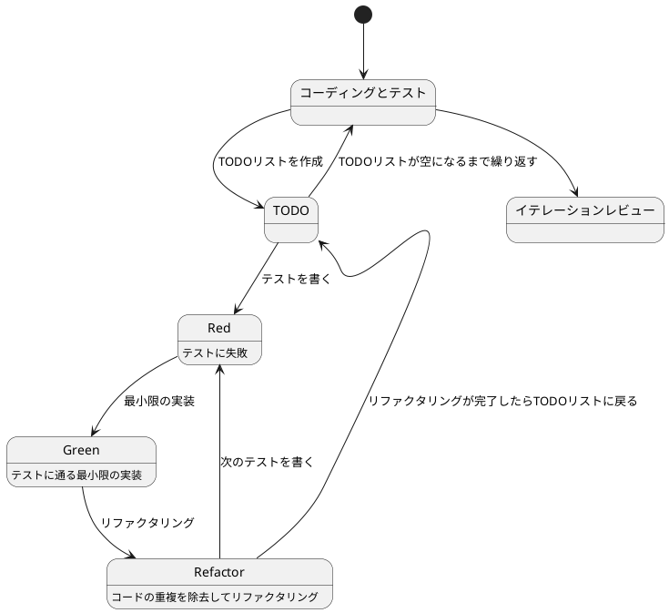
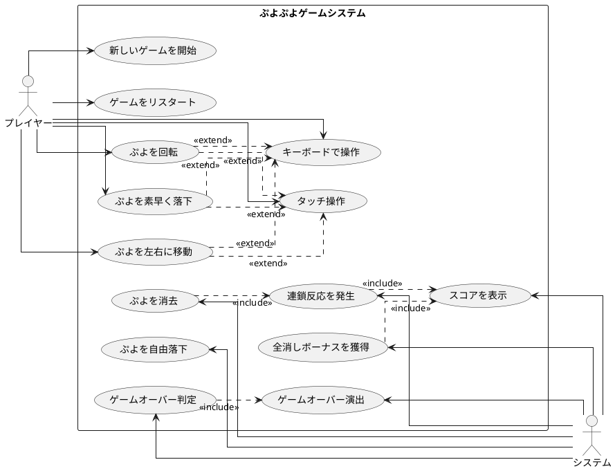

# ぷよぷよから始めるテスト駆動開発入門 F# Fable版

## はじめに

みなさん、こんにちは！今日は私と一緒にテスト駆動開発（TDD）を使って、F#とFableでぷよぷよゲームを作っていきましょう。さて、プログラミングの旅に出る前に、皆さんは「テスト駆動開発」について聞いたことがありますか？もしかしたら「テストって、コードを書いた後にするものじゃないの？」と思われるかもしれませんね。

> テストを書きながら開発することによって、設計が良い方向に変わり、コードが改善され続け、それによって自分自身が開発に前向きになること、それがテスト駆動開発の目指すゴールです。
>
> — Kent Beck 『テスト駆動開発』 付録C　訳者解説：テスト駆動開発の現在

この記事では、私たちが一緒にぷよぷよゲームを実装しながら、テスト駆動開発の基本的な流れと考え方を学んでいきます。まるでモブプログラミングのセッションのように、あなたと私が一緒に考え、コードを書き、改善していく過程を体験しましょう。「でも、ぷよぷよって結構複雑なゲームじゃないの？」と思われるかもしれませんが、心配いりません。各章では、ユーザーストーリーに基づいた機能を、テスト、実装、解説の順に少しずつ進んでいきますよ。一歩一歩、着実に進んでいきましょう！

### テスト駆動開発のサイクル

さて、テスト駆動開発では、どのように進めていけばいいのでしょうか？「テストを書いてから実装する」というのは分かりましたが、具体的にはどんな手順で進めるのでしょうか？

私がいつも実践しているのは、以下の3つのステップを繰り返すサイクルです。皆さんも一緒にやってみましょう：

1. **Red（赤）**: まず失敗するテストを書きます。「え？わざと失敗するテストを？」と思われるかもしれませんが、これには重要な意味があるんです。これから実装する機能が何をすべきかを明確にするためなんですよ。
2. **Green（緑）**: 次に、テストが通るように、最小限のコードを実装します。この段階では、きれいなコードよりも「とにかく動くこと」を優先します。「最小限」というのがポイントです。必要以上のことはしないようにしましょう。
3. **Refactor（リファクタリング）**: 最後に、コードの品質を改善します。テストが通ることを確認しながら、重複を取り除いたり、わかりやすい名前をつけたりします。「動くけど汚いコード」から「動いてきれいなコード」へと進化させるんです。

> レッド・グリーン・リファクタリング。それがTDDのマントラだ。
>
> — Kent Beck 『テスト駆動開発』

このサイクルを「Red-Green-Refactor」サイクルと呼びます。「赤・緑・リファクタリング」のリズムを刻むように、このサイクルを繰り返していくんです。これによって、少しずつ機能を追加し、コードの品質を高めていきましょう。皆さんも一緒にこのリズムを体感してみてください！



### 開発環境

さて、実際にコードを書く前に、私たちが使用する開発環境について少しお話ししておきましょう。皆さんは「道具選びは仕事の半分」という言葉を聞いたことがありますか？プログラミングでも同じことが言えるんです。

> 道具はあなたの能力を増幅します。道具のできが優れており、簡単に使いこなせるようになっていれば、より生産的になれるのです。
>
> — 達人プログラマー 熟達に向けたあなたの旅（第2版）

「どんなツールを使えばいいの？」と思われるかもしれませんね。今回のプロジェクトでは、以下のツールを使用していきます：

- **言語**: F# — 関数型プログラミングの力で、型安全で表現力豊かなコードを書きましょう。
- **Webコンパイラ**: Fable — F#をJavaScriptにコンパイルしてブラウザで実行します。関数型プログラミングの恩恵をWebアプリで享受できます。
- **テストフレームワーク**: Fable.Mocha — F#でブラウザテストを実行する強力なフレームワークです。
- **ビルドツール**: Vite — 高速な開発サーバーとビルドツールです。
- **バージョン管理**: Git — コードの変更履歴を追跡し、「あれ？昨日までちゃんと動いてたのに...」というときに過去の状態に戻れる魔法のツールです。

これらのツールを使って、テスト駆動開発の流れに沿ってぷよぷよゲームを実装していきましょう。「環境構築って難しそう...」と心配される方もいるかもしれませんが手順に従って進めればそんなに難しいことではありません。詳細はイテレーション0: 環境の構築で解説します。

## 要件

### ユーザーストーリー

さて、実際にコードを書き始める前に、少し立ち止まって考えてみましょう。「何を作るのか？」という基本的な問いかけです。私たちが作るぷよぷよゲームは、どのような機能を持つべきでしょうか？

アジャイル開発では、この「何を作るのか？」という問いに対して、「ユーザーストーリー」という形で答えを出します。皆さんは「ユーザーストーリー」という言葉を聞いたことがありますか？

> ユーザーストーリーは、ソフトウェア要求を表現するための軽量な手法である。ユーザーストーリーは、システムについてユーザーまたは顧客の視点からフィーチャの概要を記述したものだ。
> ユーザーストーリーには形式が定められておらず、標準的な記法もない。とはいえ、次のような形式でストーリーを考えてみると便利である。「＜ユーザーの種類＞として、＜機能や性能＞がほしい。それは＜ビジネス価値＞のためだ」という形のテンプレートに従うと、
> たとえば次のようなストーリーを書ける。「本の購入者として、ＩＳＢＮで本を検索したい。それは探している本をすばやく見つけるためだ」
>
> — Mike Cohn 『アジャイルな見積と計画づくり』

つまり、「プレイヤーとして、〇〇ができる（〇〇したいから）」という形式で機能を表現するんです。これによって、「誰のため」の「どんな機能」を「なぜ」作るのかが明確になります。素晴らしいですよね！

では、私たちのぷよぷよゲームでは、どんなユーザーストーリーが考えられるでしょうか？一緒に考えてみましょう：

- プレイヤーとして、新しいゲームを開始できる（ゲームの基本機能として必要ですよね！）
- プレイヤーとして、落ちてくるぷよを左右に移動できる（ぷよを適切な位置に配置したいですよね）
- プレイヤーとして、落ちてくるぷよを回転できる（戦略的にぷよを配置するために必要です）
- プレイヤーとして、ぷよを素早く落下させることができる（「早く次のぷよを落としたい！」というときのために）
- プレイヤーとして、同じ色のぷよを4つ以上つなげると消去できる（これがぷよぷよの醍醐味ですよね！）
- プレイヤーとして、連鎖反応を起こしてより高いスコアを獲得できる（「れ〜んさ〜ん！」と叫びたくなりますよね）
- プレイヤーとして、全消し（ぜんけし）ボーナスを獲得できる（「やった！全部消えた！」という達成感を味わいたいですよね）
- プレイヤーとして、ゲームオーバーになるとゲーム終了の演出を見ることができる（終わりが明確でないとモヤモヤしますよね）
- プレイヤーとして、現在のスコアを確認できる（「今どれくらい点数取れてるかな？」と気になりますよね）
- プレイヤーとして、キーボードでぷよを操作できる（PCでプレイするなら必須ですよね）
- プレイヤーとして、タッチ操作でぷよを操作できる（スマホでもプレイしたいですよね）

「うわ、結構たくさんあるな...」と思われるかもしれませんが、心配いりません！これらのユーザーストーリーを一つずつ実装していくことで、徐々にゲームを完成させていきましょう。テスト駆動開発の素晴らしいところは、各ストーリーを小さなタスクに分解し、テスト→実装→リファクタリングのサイクルで少しずつ進められることなんです。一歩一歩、着実に進んでいきましょう！

### ユースケース図

ユーザーストーリーを整理したところで、「これらの機能がどのように関連しているのか、全体像が見えるといいな」と思いませんか？そんなときに役立つのが「ユースケース図」です。
「ユースケース図って何？」と思われるかもしれませんね。ユースケース図は、システムと外部アクター（ここではプレイヤーとシステム自体）の相互作用を視覚的に表現するための図です。「絵に描いて整理すると分かりやすい」というやつですね。

> ユースケースは、システムの振る舞いに関する利害関係者の契約を表現するものです。
>
> — アリスター・コーバーン 『ユースケース実践ガイド』

「百聞は一見にしかず」というように、実際に見てみるのが一番分かりやすいですよね。では、私たちのぷよぷよゲームのユースケース図を見てみましょう：



この図を見ると、プレイヤーとシステムの役割分担がよくわかりますね。プレイヤーはゲームの開始や操作を担当し、システムはぷよの消去判定やスコア計算などの内部処理を担当しています。また、キーボード操作とタッチ操作は「拡張（extend）」関係にあり、ぷよの移動や回転などの基本操作を異なる入力方法で実現していることがわかります。

このようにユースケース図を作成することで、システムの全体像を把握し、実装すべき機能の関連性を明確にすることができます。それでは、実際のコード実装に進んでいきましょう！

誤解しないでもらいたいのですが本来ユースケースとはテキストで記述するものでありユースケース図は概要を把握するための手段に過ぎないということです。

> 楕円、矢印、人型おアイコンから構成されているUMLのユースケース図は、ユースケースを把握するための表記法ではありません。
> 楕円や矢印は、ユースケースをのパッケージや分解を表すもので、内容を表すものではありません。
>
> — アリスター・コーバーン 『ユースケース実践ガイド』

## リリース計画

要件もわかった、プログラミング開始だ！ちょっと待ってください、何事も計画を立てる事は大事なことです。ユースケース図を見てください、結構いろんなことがありますよね。何から取り組みますか？
「スコアの表示」ですか？「ゲームオーバー判定」ですか？でもまずは「新しいゲームを開始」しないとつながりとして難しいですよね。もちろん実際にプログラミングしながら順番を考えてもいいですけど間違った順番で進めると直すのが大変ですよね。
それにこれからどんなものを作るのかは事前にある程度イメージを固めておきたいものです（いきなり「ゲームオーバー」になるゲームはやりたくないですよね）。

> 計画づくりとは「なにをいつまでに作ればいいのか？」という質問に答える作業だと私は考えている
>
> — Mike Cohn 『アジャイルな見積と計画づくり』

今回の目的はぷよぷよゲームを遊べるための最小限の機能の実装です。目的を実現するためにやるべきことをイテレーションという単位でまとめましょう。「全部やること洗い出すの？そんな先のことはわからないよ！」と思いますよね。安心してください今決めることは大まかな作業の流れと前後関係の整理だけです。
細かい部分は各イテレーションでおいおい明確になってきます。その手助けをしてくれるのがテスト駆動開発なのです。

> 正しい設計を、正しいタイミングで行う。動かしてから、正しくする。
>
> — Kent Beck 『テスト駆動開発』

今回はユーザーストーリーとユースケース図から以下のイテレーション計画に従ってぷよぷよゲームをリリースします。

- イテレーション0: 環境の構築
- イテレーション1: ゲーム開始の実装
- イテレーション2: ぷよの移動の実装
- イテレーション3: ぷよの回転の実装
- イテレーション4: ぷよの自由落下の実装
- イテレーション5: ぷよの高速落下の実装
- イテレーション6: ぷよの消去の実装
- イテレーション7: 連鎖反応の実装
- イテレーション8: 全消しボーナスの実装
- イテレーション9: ゲームオーバーの実装

では、ぷよぷよゲーム開発スタートです！

## イテレーション0: 環境の構築

...と言いたいところですがまずは環境の構築をしなければなりません。「プログラミングなんてどの言語でやるか決めるぐらいでしょ？」と思うかもしれませんが家を建てるときにしっかりとした基礎工事が必要なように開発環境もしっかりとした準備が必要です。
家を建てた後に基礎がダメだと困ったことになりますからね。

### ソフトウェア開発の三種の神器

良いコードを書き続けるためには何が必要になるでしょうか？それは[ソフトウェア開発の三種の神器](https://t-wada.hatenablog.jp/entry/clean-code-that-works)と呼ばれるものです。

> 今日のソフトウェア開発の世界において絶対になければならない3つの技術的な柱があります。
> 三本柱と言ったり、三種の神器と言ったりしていますが、それらは
>
>   - バージョン管理
>   - テスティング
>   - 自動化
>
> の3つです。
>
> —  https://t-wada.hatenablog.jp/entry/clean-code-that-works

本章では開発環境のセットアップとして、これら三種の神器を準備していきます。環境構築は退屈に感じるかもしれませんが、これらのツールがあることで、安心してコードを書くことができるようになります。一緒に進めていきましょう！

### バージョン管理: Gitとコミットメッセージ

バージョン管理システムとして Git を使います。Git については既に使用していると仮定しますが、コミットメッセージについて1つだけ重要なルールを確認しておきましょう。

#### コミットメッセージの書き方

私たちのプロジェクトでは、[Conventional Commits](https://www.conventionalcommits.org/ja/)の書式に従ってコミットメッセージを書きます。具体的には、それぞれのコミットメッセージはヘッダ、ボディ、フッタで構成されます。

```
<タイプ>(<スコープ>): <タイトル>
<空行>
<ボディ>
<空行>
<フッタ>
```

ヘッダは必須で、スコープは任意です。コミットメッセージのタイトルは50文字までにしましょう（GitHub上で読みやすくなります）。

コミットのタイプは次を用います：

- **feat**: 新しい機能
- **fix**: バグ修正
- **docs**: ドキュメント変更のみ
- **style**: コードに影響を与えない変更（空白、フォーマットなど）
- **refactor**: 機能追加でもバグ修正でもないコード変更
- **perf**: パフォーマンスを改善するコード変更
- **test**: テストの追加や修正
- **chore**: ビルドプロセスや補助ツールの変更

例えば：

```bash
git commit -m 'feat: ゲーム初期化機能を追加'
git commit -m 'refactor: メソッドの抽出'
git commit -m 'test: ぷよ消去のテストケースを追加'
```

### Fable: F#からJavaScriptへ

「F#でブラウザゲームを作る？どうやって？」と思われるかもしれませんね。ここで登場するのが **Fable** です。Fable は F# のコードを JavaScript に変換するコンパイラで、F# の型安全性と関数型プログラミングの恩恵を受けながら、ブラウザで動作するアプリケーションを開発できる素晴らしいツールです。

#### Fableとは

Fable は F# から JavaScript へのコンパイラで、2016 年に Alfonso García-Caro 氏によって開発されました。F# のコードをモダンな JavaScript (ES2015+) に変換し、ブラウザや Node.js で実行できるようにします。

「なぜわざわざF#からJavaScriptに変換するの？直接JavaScriptを書けばいいじゃない」と思われるかもしれませんね。それにはいくつかの理由があります：

**1. 型安全性**

F# は静的型付け言語です。コンパイル時に型エラーを検出できるため、実行時エラーを大幅に減らすことができます。

```fsharp
// F#: コンパイル時に型エラーを検出
let add (x: int) (y: int) : int = x + y
let result = add 1 "2"  // コンパイルエラー！
```

対して JavaScript は動的型付け言語なので、実行時まで型エラーが発見されません：

```javascript
// JavaScript: 実行時にエラーが発生するかもしれない
function add(x, y) {
  return x + y;
}
const result = add(1, "2");  // "12" という文字列になってしまう
```

「型安全性って、そんなに重要なの？」と思われるかもしれませんが、大規模なプロジェクトになると、型エラーによるバグが致命的な問題を引き起こすことがあります。Fable を使えば、コンパイル時に多くのバグを防ぐことができます。

**2. 関数型プログラミング**

F# は関数型プログラミング言語として設計されており、イミュータブル（不変）なデータ構造や純粋関数など、バグを減らすための機能が標準で備わっています。

```fsharp
// F#: イミュータブルなデータ構造
type Point = { X: int; Y: int }

let point1 = { X = 0; Y = 0 }
let point2 = { point1 with X = 10 }  // 新しいインスタンスを作成

// point1 は変更されない
printfn "%A" point1  // { X = 0; Y = 0 }
printfn "%A" point2  // { X = 10; Y = 0 }
```

「イミュータブルって何？」と思われるかもしれませんね。イミュータブルとは、一度作成したデータを変更できないという性質のことです。これにより、予期しない状態変更によるバグを防ぐことができます。

**3. パターンマッチング**

F# のパターンマッチングは、複雑な条件分岐を簡潔に書くことができる強力な機能です。

```fsharp
// F#: パターンマッチング
type PuyoColor =
    | Red
    | Blue
    | Green
    | Yellow
    | Empty

let getPuyoName color =
    match color with
    | Red -> "赤ぷよ"
    | Blue -> "青ぷよ"
    | Green -> "緑ぷよ"
    | Yellow -> "黄ぷよ"
    | Empty -> "空"

// コンパイラがすべてのケースをチェック
// ケースの漏れがあるとコンパイルエラーになる
```

JavaScript で同じことをしようとすると、if-else や switch 文を使う必要があり、ケースの漏れがあってもコンパイラが検出してくれません。

**4. 強力な型推論**

F# の型推論は非常に強力で、多くの場合、型注釈を書かなくてもコンパイラが正しい型を推論してくれます。

```fsharp
// F#: 型注釈なしでも型推論が働く
let double x = x * 2  // コンパイラは x が int であると推論

let numbers = [1; 2; 3; 4; 5]
let doubled = numbers |> List.map double  // [2; 4; 6; 8; 10]
```

「型注釈を書かなくていいなら、動的型付け言語と同じじゃない？」と思われるかもしれませんが、違います。F# は静的型付け言語なので、コンパイル時に型エラーを検出できます。型推論は、型の安全性を保ちながら、コードを簡潔に書けるようにするための機能です。

#### FableとTypeScriptの違い

「TypeScriptも型安全なJavaScriptを提供してくれるよね？FableとTypeScriptの違いは何？」という疑問を持たれるかもしれません。良い質問ですね！

**1. 型システムの厳格さ**

TypeScript は JavaScript のスーパーセットとして設計されており、既存の JavaScript コードとの互換性を重視しています。そのため、型システムは比較的柔軟です。

```typescript
// TypeScript: any型で型安全性を回避できる
let value: any = 42;
value = "hello";  // OK
value.foo.bar();  // コンパイルは通るが、実行時エラー
```

対して F# の型システムはより厳格で、型安全性を重視しています：

```fsharp
// F#: any型のような抜け道はない
let value = 42
// value <- "hello"  // コンパイルエラー！
```

**2. イミュータブルがデフォルト**

TypeScript では、変数はデフォルトでミュータブル（変更可能）です：

```typescript
// TypeScript: デフォルトでミュータブル
let count = 0;
count = 1;  // OK

const point = { x: 0, y: 0 };
point.x = 10;  // OK（constでもプロパティは変更できる）
```

F# では、デフォルトでイミュータブルです：

```fsharp
// F#: デフォルトでイミュータブル
let count = 0
// count <- 1  // コンパイルエラー！

type Point = { X: int; Y: int }
let point = { X = 0; Y = 0 }
// point.X <- 10  // コンパイルエラー！

// 変更が必要な場合は明示的にmutableキーワードを使う
let mutable mutableCount = 0
mutableCount <- 1  // OK
```

**3. 関数型プログラミングの機能**

TypeScript も関数型プログラミングのスタイルをサポートしていますが、F# は最初から関数型言語として設計されています。

```fsharp
// F#: パイプライン演算子で処理を連鎖
let result =
    [1; 2; 3; 4; 5]
    |> List.map (fun x -> x * 2)
    |> List.filter (fun x -> x > 5)
    |> List.sum
    // 30
```

TypeScript では、メソッドチェーンを使いますが、F# のパイプライン演算子ほど読みやすくはありません：

```typescript
// TypeScript: メソッドチェーン
const result = [1, 2, 3, 4, 5]
  .map(x => x * 2)
  .filter(x => x > 5)
  .reduce((a, b) => a + b, 0);
```

**4. パターンマッチング**

F# のパターンマッチングは、TypeScript の switch 文よりもはるかに強力です：

```fsharp
// F#: 網羅的なパターンマッチング
type Shape =
    | Circle of radius: float
    | Rectangle of width: float * height: float
    | Triangle of base: float * height: float

let getArea shape =
    match shape with
    | Circle radius -> Math.PI * radius * radius
    | Rectangle (width, height) -> width * height
    | Triangle (base, height) -> base * height / 2.0

// ケースの漏れがあるとコンパイルエラー
```

TypeScript では、同様の機能を実現するために、タグ付きユニオン型を使う必要があります：

```typescript
// TypeScript: タグ付きユニオン型
type Shape =
  | { kind: 'circle'; radius: number }
  | { kind: 'rectangle'; width: number; height: number }
  | { kind: 'triangle'; base: number; height: number };

function getArea(shape: Shape): number {
  switch (shape.kind) {
    case 'circle':
      return Math.PI * shape.radius * shape.radius;
    case 'rectangle':
      return shape.width * shape.height;
    case 'triangle':
      return shape.base * shape.height / 2;
  }
}

// ケースの漏れがあってもコンパイルエラーにならない
// (strictNullChecksを有効にすればエラーになる)
```

#### Fableの仕組み

「FableはどうやってF#をJavaScriptに変換しているの？」という疑問を持たれるかもしれませんね。簡単に説明しましょう。

**1. F#コンパイラの活用**

Fable は F# コンパイラ（F# Compiler Services）を使って、F# のコードを抽象構文木（AST）に変換します。これにより、F# の型システムや型推論の恩恵を受けることができます。

**2. JavaScriptへの変換**

Fable は AST を解析し、JavaScript のコードに変換します。この際、モダンな JavaScript (ES2015+) の機能を活用します。

```fsharp
// F#のコード
type Point = { X: int; Y: int }

let point = { X = 10; Y = 20 }
let newPoint = { point with X = 30 }
```

このコードは、以下のような JavaScript に変換されます：

```javascript
// Fableが生成するJavaScript
export class Point extends Record {
  constructor(X, Y) {
    super();
    this.X = X | 0;
    this.Y = Y | 0;
  }
}

export const point = new Point(10, 20);
export const newPoint = new Point(30, point.Y);
```

**3. JavaScriptとの相互運用**

Fable の素晴らしい点は、既存の JavaScript ライブラリと簡単に連携できることです。Fable は JavaScript のエコシステムを活用できるように設計されています。

```fsharp
// F#からJavaScriptのライブラリを呼び出す
open Fable.Core
open Fable.Core.JsInterop

// JavaScript の console.log を呼び出す
printfn "Hello, World!"  // F#の標準関数

// JavaScriptのDateオブジェクトを使う
open System

let now = DateTime.Now
printfn "Current time: %A" now
```

#### Fableのメリット

「結局、Fableを使うメリットは何？」とまとめたくなりますよね。以下がFableの主なメリットです：

1. **型安全性**: コンパイル時に多くのバグを防ぐ
2. **イミュータブルな設計**: 予期しない状態変更を防ぐ
3. **パターンマッチング**: 複雑な条件分岐を簡潔に書ける
4. **関数型プログラミング**: 再利用可能で保守しやすいコード
5. **JavaScriptエコシステムとの統合**: 既存のライブラリを活用できる
6. **モダンな開発体験**: 強力な型推論とツールサポート

「難しそう...」と思われるかもしれませんが、心配いりません。このチュートリアルを通じて、F# と Fable の基本を一緒に学んでいきましょう。テスト駆動開発の流れに沿って、一つずつ機能を実装していけば、自然と F# と Fable の使い方が身につきますよ！

### テスティング: F#とFable.Mocha

良いコードを書くためには、コードが正しく動作することを確認するテストが欠かせません。F# + Fableのテスト環境をセットアップしていきましょう。

#### F#プロジェクトの作成

まず、F#プロジェクトの構造を作成します：

```bash
# プロジェクトディレクトリの作成
mkdir puyo-puyo-fable
cd puyo-puyo-fable

# ソースとテストディレクトリの作成
mkdir -p src tests

# F#プロジェクトファイルの作成
dotnet new classlib -lang F# -o src -n PuyoPuyo
dotnet new console -lang F# -o tests -n PuyoPuyo.Tests
```

#### Fableのセットアップ

Fableを使用するために必要なパッケージをインストールします：

```bash
# ソースプロジェクトへFableパッケージを追加
cd src
dotnet add package Fable.Core
dotnet add package Fable.Browser.Dom
cd ..

# テストプロジェクトへFable.Mochaを追加
cd tests
dotnet add package Fable.Mocha
dotnet add reference ../src/PuyoPuyo.fsproj
cd ..
```

#### package.jsonの作成

npmパッケージの管理とスクリプトの定義のため、プロジェクトルートに`package.json`を作成します：

```bash
npm init -y
```

`package.json`の`"scripts"`セクションを以下のように編集します：

```json
{
  "name": "puyo-puyo-fable",
  "private": true,
  "version": "0.0.0",
  "type": "module",
  "scripts": {
    "install-deps": "dotnet tool restore && dotnet restore",
    "dev": "vite",
    "build": "dotnet fable src -o dist/src && vite build",
    "preview": "vite preview",
    "test": "dotnet fable tests -o dist/tests --run mocha dist/tests",
    "test:watch": "dotnet fable watch tests -o dist/tests --run mocha dist/tests",
    "clean": "rm -rf dist",
    "setup": "npm install && npm run install-deps"
  },
  "devDependencies": {
    "vite": "^5.0.0",
    "mocha": "^10.2.0"
  }
}
```

#### 開発依存パッケージのインストール

```bash
npm install
```

#### .NET ツールの設定

プロジェクトローカルでFableを使用するため、`.config/dotnet-tools.json`を作成します：

```bash
dotnet new tool-manifest
dotnet tool install fable
```

### 自動化: コード品質の自動管理

良いコードを書き続けるためには、コードの品質を自動的にチェックし、維持していく仕組みが必要です。F#エコシステムのツールを活用しましょう。

#### コードフォーマッタ: Fantomas

F#のコードフォーマットを統一するために **Fantomas** を使います。

> 優れたソースコードは「目に優しい」ものでなければいけない。
>
> —  リーダブルコード

Fantomasのインストール：

```bash
dotnet tool install fantomas
```

`package.json`にフォーマット用のスクリプトを追加します：

```json
{
  "scripts": {
    "format": "dotnet fantomas src tests",
    "format:check": "dotnet fantomas src tests --check"
  }
}
```

フォーマットの実行：

```bash
npm run format:check  # チェックのみ
npm run format        # 自動修正
```

#### 静的コード解析: FSharpLint

静的コード解析ツールとして **FSharpLint** を使います。

```bash
dotnet tool install dotnet-fsharplint
```

プロジェクトルートに`fsharplint.json`を作成して、ルールをカスタマイズします：

```json
{
  "ignoreFiles": [
    "**/obj/**/*.fs",
    "**/bin/**/*.fs"
  ],
  "hints": {
    "add": []
  },
  "formatting": {
    "typedItemSpacing": {
      "enabled": true
    },
    "typePrefixing": {
      "enabled": true
    }
  },
  "conventions": {
    "naming": {
      "enabled": true
    },
    "nestedStatements": {
      "enabled": true,
      "depth": 5
    },
    "cyclomaticComplexity": {
      "enabled": true,
      "maxComplexity": 7
    }
  }
}
```

`package.json`にlint用のスクリプトを追加：

```json
{
  "scripts": {
    "lint": "dotnet fsharplint lint PuyoPuyo.sln"
  }
}
```

静的解析の実行：

```bash
npm run lint
```

#### テストカバレッジ

F#でのコードカバレッジ測定には、通常.NETエコシステムの**coverlet**や**altcover**を使用します。Fableプロジェクトでは、テストの実行とカバレッジを確認するために、まずテストが正しく動作することを確認しましょう。

```bash
npm run test
```

### Viteの設定

ブラウザでゲームを実行するため、Viteの設定ファイル`vite.config.js`をプロジェクトルートに作成します：

```javascript
import { defineConfig } from 'vite'

export default defineConfig({
  root: './public',
  publicDir: '../public',
  build: {
    outDir: '../dist',
    emptyOutDir: true
  },
  server: {
    port: 3000
  }
})
```

`public`ディレクトリとHTMLファイルを作成：

```bash
mkdir public
```

`public/index.html`:

```html
<!DOCTYPE html>
<html lang="ja">
<head>
    <meta charset="UTF-8">
    <meta name="viewport" content="width=device-width, initial-scale=1.0">
    <title>ぷよぷよ - F# Fable版</title>
    <style>
        body {
            margin: 0;
            padding: 20px;
            font-family: 'Arial', sans-serif;
            background-color: #f0f0f0;
        }
        #game-container {
            display: flex;
            justify-content: center;
            align-items: center;
            min-height: 80vh;
        }
        canvas {
            border: 2px solid #333;
            background-color: #fff;
        }
    </style>
</head>
<body>
    <div id="game-container">
        <canvas id="game-canvas" width="320" height="640"></canvas>
    </div>
    <script type="module" src="/dist/src/App.js"></script>
</body>
</html>
```

### プロジェクト構造の確認

ここまでで、以下のようなプロジェクト構造ができているはずです：

```
puyo-puyo-fable/
├── .config/
│   └── dotnet-tools.json
├── src/
│   ├── PuyoPuyo.fsproj
│   └── Library.fs (後でApp.fsに変更)
├── tests/
│   ├── PuyoPuyo.Tests.fsproj
│   └── Program.fs (後でTests.fsに変更)
├── public/
│   └── index.html
├── package.json
├── vite.config.js
└── fsharplint.json
```

### 初期テストの作成

テスト駆動開発を始めるため、簡単なテストを作成しましょう。

`tests/Tests.fs`を作成：

```fsharp
module PuyoPuyo.Tests

open Fable.Mocha

let tests =
    testList "初期テスト" [
        testCase "サンプルテスト - 1 + 1 は 2" <| fun _ ->
            let result = 1 + 1
            Expect.equal result 2 "1 + 1 は 2 であるべき"
    ]

[<EntryPoint>]
let main args =
    Mocha.runTests tests
```

`tests/PuyoPuyo.Tests.fsproj`を編集して、テストファイルを含めます：

```xml
<Project Sdk="Microsoft.NET.Sdk">
  <PropertyGroup>
    <OutputType>Exe</OutputType>
    <TargetFramework>net8.0</TargetFramework>
  </PropertyGroup>
  <ItemGroup>
    <Compile Include="Tests.fs" />
  </ItemGroup>
  <ItemGroup>
    <PackageReference Include="Fable.Mocha" Version="2.17.0" />
  </ItemGroup>
  <ItemGroup>
    <ProjectReference Include="..\src\PuyoPuyo.fsproj" />
  </ItemGroup>
</Project>
```

テストを実行：

```bash
npm run test
```

成功すれば、以下のような出力が表示されます：

```
  初期テスト
    ✓ サンプルテスト - 1 + 1 は 2

  1 passing (Xms)
```

### 環境構築の完了

お疲れさまでした！これで開発環境のセットアップが完了しました。以下のツールが使えるようになりました：

- **バージョン管理**: Git（Conventional Commits形式）
- **テスティング**: Fable.Mocha
- **静的コード解析**: FSharpLint（循環的複雑度チェック付き）
- **コードフォーマット**: Fantomas
- **ビルドツール**: Vite
- **Webコンパイラ**: Fable

これで、F# + Fableでぷよぷよゲームを開発するための基盤が整いました。次のイテレーションから、実際のゲーム機能の実装に入っていきましょう！

### 環境確認チェックリスト

最後に、環境が正しくセットアップできているか確認しましょう：

- [ ] `npm run test` でテストが実行できる
- [ ] `npm run format` でコードフォーマットができる
- [ ] `npm run lint` で静的解析が実行できる
- [ ] `npm run dev` で開発サーバーが起動できる
- [ ] ブラウザで http://localhost:3000 にアクセスできる

すべてチェックできたら、環境構築は完了です。さあ、テスト駆動開発でぷよぷよゲームを作っていきましょう！

## イテレーション1: ゲーム開始の実装

さあ、いよいよコードを書き始めましょう！テスト駆動開発では、小さなイテレーション（反復）で機能を少しずつ追加していきます。最初のイテレーションでは、最も基本的な機能である「ゲームの開始」を実装します。

> システム構築はどこから始めるべきだろうか。システム構築が終わったらこうなる、というストーリーを語るところからだ。
>
> — Kent Beck 『テスト駆動開発』

### ユーザーストーリー

まずは、このイテレーションで実装するユーザーストーリーを確認しましょう：

> プレイヤーとして、新しいゲームを開始できる

このシンプルなストーリーから始めることで、ゲームの基本的な構造を作り、後続の機能追加の土台を築くことができます。では、テスト駆動開発のサイクルに従って、まずはテストから書いていきましょう！

### TODOリスト

さて、ユーザーストーリーを実装するために、まずはTODOリストを作成しましょう。TODOリストは、大きな機能を小さなタスクに分解するのに役立ちます。

> 何をテストすべきだろうか - 着手する前に、必要になりそうなテストをリストに書き出しておこう。
>
> — Kent Beck 『テスト駆動開発』

私たちの「新しいゲームを開始できる」というユーザーストーリーを実現するためには、どのようなタスクが必要でしょうか？考えてみましょう：

- ゲームの初期化処理を実装する（ゲームの状態を設定する）
- ゲーム画面を表示する（プレイヤーが視覚的にゲームを認識できるようにする）
- 新しいぷよを生成する（ゲーム開始時に最初のぷよを作成する）

これらのタスクを一つずつ実装していきましょう。テスト駆動開発では、各タスクに対してテスト→実装→リファクタリングのサイクルを回します。まずは「ゲームの初期化処理」から始めましょう！

### テスト: ゲームの初期化

さて、TODOリストの最初のタスク「ゲームの初期化処理を実装する」に取り掛かりましょう。テスト駆動開発では、まずテストを書くことから始めます。

> テストファースト
>
> いつテストを書くべきだろうか——それはテスト対象のコードを書く前だ。
>
> — Kent Beck 『テスト駆動開発』

では、ゲームの初期化処理をテストするコードを書いてみましょう。何をテストすべきでしょうか？ゲームが初期化されたとき、ゲームの状態が適切に設定されていることを確認する必要がありますね。

F#では、テストをモジュールとして記述し、Fable.Mochaを使用します。まず`tests/GameTests.fs`を作成します：

```fsharp
// tests/GameTests.fs
module PuyoPuyo.Tests.GameTests

open Fable.Mocha
open PuyoPuyo.Game

let gameInitTests =
    testList "ゲームの初期化" [
        testCase "ゲームを初期化すると、ゲームステートが作成される" <| fun _ ->
            let gameState = Game.init()

            Expect.isNotNull gameState "ゲームステートが作成されるべき"

        testCase "ゲームを初期化すると、ステージが6列12行で作成される" <| fun _ ->
            let gameState = Game.init()

            Expect.equal gameState.Stage.Cols 6 "ステージは6列であるべき"
            Expect.equal gameState.Stage.Rows 12 "ステージは12行であるべき"
    ]

let tests =
    testList "ゲーム" [
        gameInitTests
    ]
```

このテストでは、`Game.init()`関数が正しく動作することを確認しています。具体的には、ゲームステートが作成され、ステージが6列12行で作成されることを検証しています。

F#では、関数型プログラミングのアプローチで、イミュータブルなデータ構造を使用します。これにより、予測可能で安全なコードを書くことができます。

### 実装: ゲームの初期化

テストを書いたら、次に実行してみましょう。どうなるでしょうか？

```bash
npm run test
```

```
Error: Cannot find module 'PuyoPuyo.Game'
```

おっと！まだ`Game`モジュールを実装していないので、当然エラーになりますね。これがテスト駆動開発の「Red（赤）」の状態です。テストが失敗することを確認できました。

> アサートファースト
>
> ではテストはどこから書き始めるべきだろうか。それはテストの終わりにパスすべきアサーションを書くところからだ。
>
> — Kent Beck 『テスト駆動開発』

では、テストが通るように最小限のコードを実装していきましょう。「最小限」というのがポイントです。この段階では、テストが通ることだけを目指して、必要最低限のコードを書きます。

まず、型定義を作成します。`src/Types.fs`を作成：

```fsharp
// src/Types.fs
module PuyoPuyo.Types

/// ぷよの色
type PuyoColor =
    | Red
    | Blue
    | Green
    | Yellow
    | Purple
    | Empty

/// 位置
type Position = {
    X: int
    Y: int
}

/// ぷよ
type Puyo = {
    Color: PuyoColor
    Position: Position
}
```

次に、ステージモジュールを作成します。`src/Stage.fs`を作成：

```fsharp
// src/Stage.fs
module PuyoPuyo.Stage

open PuyoPuyo.Types

/// ステージの状態
type StageState = {
    Cells: PuyoColor array array
    Rows: int
    Cols: int
}

/// ステージを作成する
let create () : StageState =
    let rows = 12
    let cols = 6
    let cells = Array.init rows (fun _ -> Array.create cols PuyoColor.Empty)
    {
        Cells = cells
        Rows = rows
        Cols = cols
    }
```

次に、ゲームモジュールを作成します。`src/Game.fs`を作成：

```fsharp
// src/Game.fs
module PuyoPuyo.Game

open PuyoPuyo.Types
open PuyoPuyo.Stage

/// ゲームの状態
type GameState = {
    Stage: StageState
    Score: int
}

/// ゲームを初期化する
let init () : GameState =
    {
        Stage = Stage.create()
        Score = 0
    }
```

### 解説: ゲームの初期化

さあ、テストを実行してみましょう：

```bash
npm run test
```

テストが通りましたね！おめでとうございます。これがテスト駆動開発の「Green（緑）」の状態です。

F#での実装について、少し解説しておきましょう。この処理では、主に以下のことを行っています：

1. **イミュータブルなデータ構造**: F#では、デフォルトで値がイミュータブル（変更不可）です。これにより、予期せぬ副作用を避けられます。
2. **判別共用体（Discriminated Union）**: `PuyoColor`は判別共用体として定義されています。これにより、型安全な状態管理が可能になります。
3. **レコード型**: `GameState`や`StageState`はレコード型として定義されています。これにより、構造化されたデータを扱いやすくなります。

各コンポーネントの役割：

- **GameState**: ゲームの全体的な状態を管理します（ステージ、スコア）
- **StageState**: ゲームのステージ（盤面）を管理します（セルの配置状態、行数、列数）
- **Types**: ゲーム全体で使用する型定義を集約します

このように、責任を明確に分けることで、コードの保守性が高まります。これは関数型プログラミングにおける「関心の分離」に従っています。

### プロジェクトファイルの更新

F#プロジェクトでは、ファイルの順序が重要です。`src/PuyoPuyo.fsproj`を更新して、正しい順序でファイルをコンパイルするようにします：

```xml
<Project Sdk="Microsoft.NET.Sdk">
  <PropertyGroup>
    <TargetFramework>net8.0</TargetFramework>
  </PropertyGroup>
  <ItemGroup>
    <Compile Include="Types.fs" />
    <Compile Include="Stage.fs" />
    <Compile Include="Game.fs" />
  </ItemGroup>
  <ItemGroup>
    <PackageReference Include="Fable.Core" Version="4.0.0" />
    <PackageReference Include="Fable.Browser.Dom" Version="2.14.0" />
  </ItemGroup>
</Project>
```

テストプロジェクトファイル`tests/PuyoPuyo.Tests.fsproj`も更新：

```xml
<Project Sdk="Microsoft.NET.Sdk">
  <PropertyGroup>
    <OutputType>Exe</OutputType>
    <TargetFramework>net8.0</TargetFramework>
  </PropertyGroup>
  <ItemGroup>
    <Compile Include="GameTests.fs" />
    <Compile Include="Tests.fs" />
  </ItemGroup>
  <ItemGroup>
    <PackageReference Include="Fable.Mocha" Version="2.17.0" />
  </ItemGroup>
  <ItemGroup>
    <ProjectReference Include="..\src\PuyoPuyo.fsproj" />
  </ItemGroup>
</Project>
```

### テストの更新

テストモジュールも更新して、すべてのテストを実行できるようにします。`tests/Tests.fs`を更新：

```fsharp
// tests/Tests.fs
module PuyoPuyo.Tests

open Fable.Mocha
open PuyoPuyo.Tests.GameTests

let allTests =
    testList "すべてのテスト" [
        GameTests.tests
    ]

[<EntryPoint>]
let main args =
    Mocha.runTests allTests
```

テストを実行：

```bash
npm run test
```

成功すれば、以下のような出力が表示されます：

```
  ゲーム
    ゲームの初期化
      ✓ ゲームを初期化すると、ゲームステートが作成される
      ✓ ゲームを初期化すると、ステージが6列12行で作成される

  2 passing (Xms)
```

### イテレーション 1 のまとめ

このイテレーションで実装した内容：

1. **型定義の実装**
   - 判別共用体による型安全な状態管理（`PuyoColor`）
   - レコード型による構造化データ（`GameState`、`StageState`、`Position`、`Puyo`）

2. **Stage モジュールの実装**
   - `create`関数によるステージの初期化
   - 6列12行の空のステージを作成

3. **Game モジュールの実装**
   - イミュータブルな`GameState`レコードの定義
   - `init`関数による初期状態の作成

4. **テストの作成**
   - Fable.Mochaを使用したテスト
   - ゲーム初期化のテスト（2 テスト）
   - すべてのテストが成功

F#の関数型プログラミングの特徴を活かして、型安全でシンプルな実装ができました。次のイテレーションでは、ぷよの移動機能を実装していきます。

## イテレーション2: ぷよの移動の実装

さて、前回のイテレーションでゲームの基本的な構造ができましたね。「ゲームが始まったけど、ぷよが動かないと面白くないよね？」と思いませんか？そこで次は、ぷよを左右に移動できるようにしていきましょう！

### ユーザーストーリー

まずは、このイテレーションで実装するユーザーストーリーを確認しましょう：

> プレイヤーとして、落ちてくるぷよを左右に移動できる

「ぷよぷよって、落ちてくるぷよを左右に動かして、うまく積み上げるゲームですよね？」そうです！今回はその基本操作である「左右の移動」を実装していきます。

### TODOリスト

さて、このユーザーストーリーを実現するために、どんなタスクが必要でしょうか？一緒に考えてみましょう。
「ぷよを左右に移動する」という機能を実現するためには、以下のようなタスクが必要そうですね：

- 現在のぷよの状態を管理する（位置や色）
- ぷよを左右に移動する処理を実装する（実際にぷよの位置を変更する）
- 移動可能かどうかのチェックを実装する（画面の端にぶつかる場合は移動できないようにする）

「なるほど、順番に実装していけばいいんですね！」そうです、一つずつ進めていきましょう。テスト駆動開発の流れに沿って、まずはテストから書いていきますよ。

### テスト: ぷよの作成

「最初に何をテストすればいいんでしょうか？」まずは、ぷよを作成できるかどうかをテストしていきましょう。

> テストファースト
>
> いつテストを書くべきだろうか——それはテスト対象のコードを書く前だ。
>
> — Kent Beck 『テスト駆動開発』

`tests/PlayerTests.fs`を作成します：

```fsharp
// tests/PlayerTests.fs
module PuyoPuyo.Tests.PlayerTests

open Fable.Mocha
open PuyoPuyo.Types
open PuyoPuyo.Player

let playerTests =
    testList "プレイヤー" [
        testCase "新しいぷよを作成すると、初期位置に配置される" <| fun _ ->
            let puyo = Player.createNewPuyo()

            Expect.equal puyo.Position.X 2 "ぷよのX座標は2（中央）であるべき"
            Expect.equal puyo.Position.Y 0 "ぷよのY座標は0（一番上）であるべき"

        testCase "新しいぷよを作成すると、色が設定される" <| fun _ ->
            let puyo = Player.createNewPuyo()

            Expect.notEqual puyo.Color PuyoColor.Empty "ぷよの色は空ではないべき"
    ]

let tests =
    testList "プレイヤー機能" [
        playerTests
    ]
```

このテストでは、`Player.createNewPuyo()`関数が正しく動作することを確認しています。具体的には、ぷよが中央の初期位置に作成され、適切な色が設定されることを検証しています。

### 実装: ぷよの作成

テストを書いたら、次に実行してみましょう。どうなるでしょうか？

```bash
npm run test
```

```
Error: Cannot find module 'PuyoPuyo.Player'
```

おっと！まだ`Player`モジュールを実装していないので、当然エラーになりますね。これがテスト駆動開発の「Red（赤）」の状態です。

では、テストが通るように最小限のコードを実装していきましょう。`src/Player.fs`を作成：

```fsharp
// src/Player.fs
module PuyoPuyo.Player

open PuyoPuyo.Types

/// 新しいぷよを作成する
let createNewPuyo () : Puyo =
    let colors = [| PuyoColor.Red; PuyoColor.Blue; PuyoColor.Green; PuyoColor.Yellow |]
    let random = System.Random()
    let color = colors.[random.Next(colors.Length)]

    {
        Color = color
        Position = { X = 2; Y = 0 }
    }
```

「シンプルですね！」そうです。F#では、関数型プログラミングのスタイルで簡潔に書けます。ランダムな色を選んで、初期位置（X=2, Y=0）にぷよを作成しています。

### テスト: ぷよの移動

次は、ぷよを左右に移動する機能をテストしましょう。

```fsharp
// tests/PlayerTests.fs（続き）
let puyoMoveTests =
    testList "ぷよの移動" [
        testCase "左に移動できる場合、左に移動する" <| fun _ ->
            let puyo = Player.createNewPuyo()
            let initialX = puyo.Position.X

            let movedPuyo = Player.moveLeft puyo 6

            Expect.equal movedPuyo.Position.X (initialX - 1) "X座標が1減るべき"

        testCase "右に移動できる場合、右に移動する" <| fun _ ->
            let puyo = Player.createNewPuyo()
            let initialX = puyo.Position.X

            let movedPuyo = Player.moveRight puyo 6

            Expect.equal movedPuyo.Position.X (initialX + 1) "X座標が1増えるべき"

        testCase "左端にいる場合、左に移動できない" <| fun _ ->
            let puyo = { Player.createNewPuyo() with Position = { X = 0; Y = 0 } }

            let movedPuyo = Player.moveLeft puyo 6

            Expect.equal movedPuyo.Position.X 0 "X座標は変わらないべき"

        testCase "右端にいる場合、右に移動できない" <| fun _ ->
            let puyo = { Player.createNewPuyo() with Position = { X = 5; Y = 0 } }

            let movedPuyo = Player.moveRight puyo 6

            Expect.equal movedPuyo.Position.X 5 "X座標は変わらないべき"
    ]
```

「このテストでは何を確認しているんですか？」このテストでは、以下の4つのケースを確認しています：

1. 通常の状態で左に移動できるか
2. 通常の状態で右に移動できるか
3. 左端にいるときに左に移動しようとしても位置が変わらないか
4. 右端にいるときに右に移動しようとしても位置が変わらないか

「F#では`with`キーワードを使ってレコードを更新しているんですね！」そうです！F#では、イミュータブルなレコードを扱うため、`with`キーワードで一部のフィールドだけを変更した新しいレコードを作成します。これが関数型プログラミングの特徴です。

### 実装: ぷよの移動

「テストが失敗することを確認したら、実装に進みましょう！」そうですね。では、ぷよを移動させる機能を実装していきましょう。

```fsharp
// src/Player.fs（続き）

/// ぷよを左に移動する
let moveLeft (puyo: Puyo) (stageCols: int) : Puyo =
    if puyo.Position.X > 0 then
        { puyo with Position = { puyo.Position with X = puyo.Position.X - 1 } }
    else
        puyo

/// ぷよを右に移動する
let moveRight (puyo: Puyo) (stageCols: int) : Puyo =
    if puyo.Position.X < stageCols - 1 then
        { puyo with Position = { puyo.Position with X = puyo.Position.X + 1 } }
    else
        puyo
```

「なるほど！イミュータブルなデータ構造なので、元のぷよは変更せずに、新しいぷよを返しているんですね！」その通りです！F#では、データを変更する代わりに、変更された新しいデータを返します。これにより、予期せぬ副作用を防ぎ、コードの推論が容易になります。

> 仮実装を経て本実装へ
>
> 失敗するテストを書いてから、最初に行う実装はどのようなものだろうか - ベタ書きの値を返そう。
> それでテストが通るようになったら、ベタ書きの値をだんだん本物の式や変数に置き換えていく。
>
> — Kent Beck 『テスト駆動開発』

「移動の処理はシンプルですね！」そうですね。`moveLeft`関数では左端（X座標が0）でなければX座標を1減らし、`moveRight`関数では右端（X座標がステージの幅-1）でなければX座標を1増やしています。どちらの場合も、移動できない場合は元のぷよをそのまま返します。

### プロジェクトファイルの更新

`src/PuyoPuyo.fsproj`を更新して、`Player.fs`を追加します：

```xml
<Project Sdk="Microsoft.NET.Sdk">
  <PropertyGroup>
    <TargetFramework>net8.0</TargetFramework>
  </PropertyGroup>
  <ItemGroup>
    <Compile Include="Types.fs" />
    <Compile Include="Stage.fs" />
    <Compile Include="Player.fs" />
    <Compile Include="Game.fs" />
  </ItemGroup>
  <ItemGroup>
    <PackageReference Include="Fable.Core" Version="4.0.0" />
    <PackageReference Include="Fable.Browser.Dom" Version="2.14.0" />
  </ItemGroup>
</Project>
```

テストプロジェクトファイル`tests/PuyoPuyo.Tests.fsproj`も更新：

```xml
<Project Sdk="Microsoft.NET.Sdk">
  <PropertyGroup>
    <OutputType>Exe</OutputType>
    <TargetFramework>net8.0</TargetFramework>
  </PropertyGroup>
  <ItemGroup>
    <Compile Include="GameTests.fs" />
    <Compile Include="PlayerTests.fs" />
    <Compile Include="Tests.fs" />
  </ItemGroup>
  <ItemGroup>
    <PackageReference Include="Fable.Mocha" Version="2.17.0" />
  </ItemGroup>
  <ItemGroup>
    <ProjectReference Include="..\src\PuyoPuyo.fsproj" />
  </ItemGroup>
</Project>
```

### テストの更新

`tests/Tests.fs`を更新して、PlayerTestsを追加：

```fsharp
// tests/Tests.fs
module PuyoPuyo.Tests

open Fable.Mocha
open PuyoPuyo.Tests.GameTests
open PuyoPuyo.Tests.PlayerTests

let allTests =
    testList "すべてのテスト" [
        GameTests.tests
        PlayerTests.tests
    ]

[<EntryPoint>]
let main args =
    Mocha.runTests allTests
```

テストを実行：

```bash
npm run test
```

成功すれば、以下のような出力が表示されます：

```
  ゲーム
    ゲームの初期化
      ✓ ゲームを初期化すると、ゲームステートが作成される
      ✓ ゲームを初期化すると、ステージが6列12行で作成される

  プレイヤー機能
    プレイヤー
      ✓ 新しいぷよを作成すると、初期位置に配置される
      ✓ 新しいぷよを作成すると、色が設定される
    ぷよの移動
      ✓ 左に移動できる場合、左に移動する
      ✓ 右に移動できる場合、右に移動する
      ✓ 左端にいる場合、左に移動できない
      ✓ 右端にいる場合、右に移動できない

  8 passing (Xms)
```

### 解説: イミュータブルなデータ構造の利点

「これでテストは通りましたか？」はい、すべてのテストが通りました！これがテスト駆動開発の「Green（緑）」の状態です。

F#のイミュータブルなデータ構造について、少し詳しく解説しましょう：

1. **予測可能性**: データが変更されないため、関数の結果が常に同じ入力に対して同じ出力を返します
2. **並行処理の安全性**: データ競合が発生しないため、マルチスレッド環境でも安全です
3. **テストのしやすさ**: 副作用がないため、テストが簡単に書けます
4. **履歴の追跡**: 過去の状態を保持できるため、Undo/Redo機能が実装しやすくなります

「でも、毎回新しいオブジェクトを作るのは効率が悪くないですか？」良い質問ですね！実は、F#コンパイラとランタイムは、構造共有（Structural Sharing）という技術を使って、変更されていない部分は元のデータを再利用します。そのため、パフォーマンスへの影響は最小限です。

### イテレーション 2 のまとめ

このイテレーションで実装した内容：

1. **Player モジュールの実装**
   - `createNewPuyo`関数による新しいぷよの作成
   - ランダムな色の選択

2. **ぷよの移動機能**
   - `moveLeft`関数による左移動
   - `moveRight`関数による右移動
   - 画面端での移動制限

3. **イミュータブルなデータ更新**
   - `with`キーワードによるレコードの部分更新
   - 副作用のない関数型アプローチ

4. **テストの作成**
   - ぷよ作成のテスト（2 テスト）
   - ぷよ移動のテスト（4 テスト）
   - すべてのテストが成功

F#の関数型プログラミングの特徴であるイミュータブルなデータ構造を活かして、安全で予測可能な実装ができました。次のイテレーションでは、ぷよの回転機能を実装していきます。

## イテレーション3: ぷよの回転の実装

「左右に移動できるようになったけど、ぷよぷよって回転もできますよね？」そうですね！ぷよぷよの醍醐味の一つは、ぷよを回転させて思い通りの場所に配置することです。今回は、ぷよを回転させる機能を実装していきましょう！

### ユーザーストーリー

まずは、このイテレーションで実装するユーザーストーリーを確認しましょう：

> プレイヤーとして、落ちてくるぷよを回転できる

「回転って具体的にどういう動きですか？」良い質問ですね！ぷよぷよでは、2つのぷよが連なった状態で落ちてきます。回転とは、この2つのぷよの相対的な位置関係を変えることです。例えば、縦に並んでいるぷよを横に並ぶように変えたりできるんですよ。

### TODOリスト

「どんな作業が必要になりますか？」このユーザーストーリーを実現するために、TODOリストを作成してみましょう。

「ぷよを回転させる」という機能を実現するためには、以下のようなタスクが必要そうですね：

- 2つ目のぷよの型定義を追加する（軸ぷよと子ぷよ）
- ぷよの回転処理を実装する（時計回りの回転）
- 回転可能かどうかのチェックを実装する（壁にぶつかる場合は回転できないようにする）
- 壁キック処理を実装する（壁際での回転を可能にする特殊処理）

「壁キックって何ですか？」壁キックとは、ぷよが壁際にあるときに回転すると壁にめり込んでしまうので、自動的に少し位置をずらして回転を可能にする処理のことです。プレイヤーの操作性を向上させるための工夫なんですよ。

### テスト: ぷよペアの定義

「まずは何からテストしますか？」テスト駆動開発の流れに沿って、まずは2つのぷよ（ペア）を表現する型のテストから書いていきましょう。

`tests/PlayerTests.fs`に追加：

```fsharp
// tests/PlayerTests.fs（続き）
let puyoPairTests =
    testList "ぷよペア" [
        testCase "新しいぷよペアを作成すると、軸ぷよと子ぷよが作成される" <| fun _ ->
            let puyoPair = Player.createNewPuyoPair()

            Expect.equal puyoPair.Axis.Position.X 2 "軸ぷよのX座標は2であるべき"
            Expect.equal puyoPair.Axis.Position.Y 0 "軸ぷよのY座標は0であるべき"
            Expect.notEqual puyoPair.Axis.Color PuyoColor.Empty "軸ぷよの色は空ではないべき"
            Expect.notEqual puyoPair.Child.Color PuyoColor.Empty "子ぷよの色は空ではないべき"

        testCase "初期状態では子ぷよは軸ぷよの上にある" <| fun _ ->
            let puyoPair = Player.createNewPuyoPair()

            Expect.equal puyoPair.Child.Position.X 2 "子ぷよのX座標は2であるべき"
            Expect.equal puyoPair.Child.Position.Y -1 "子ぷよのY座標は-1（上）であるべき"
    ]
```

### 実装: ぷよペアの定義

テストを書いたら、次に実行してみましょう。当然エラーになりますね。これが「Red（赤）」の状態です。

では、型定義を追加しましょう。`src/Types.fs`を更新：

```fsharp
// src/Types.fs（追加）

/// ぷよペア（軸ぷよと子ぷよ）
type PuyoPair = {
    Axis: Puyo    // 軸ぷよ（回転の中心）
    Child: Puyo   // 子ぷよ（回転する）
}
```

次に、`src/Player.fs`を更新してぷよペアを作成する関数を実装：

```fsharp
// src/Player.fs（更新）
module PuyoPuyo.Player

open PuyoPuyo.Types

/// 新しいぷよペアを作成する
let createNewPuyoPair () : PuyoPair =
    let colors = [| PuyoColor.Red; PuyoColor.Blue; PuyoColor.Green; PuyoColor.Yellow |]
    let random = System.Random()

    let axisColor = colors.[random.Next(colors.Length)]
    let childColor = colors.[random.Next(colors.Length)]

    {
        Axis = {
            Color = axisColor
            Position = { X = 2; Y = 0 }
        }
        Child = {
            Color = childColor
            Position = { X = 2; Y = -1 }  // 軸ぷよの上
        }
    }
```

「子ぷよのY座標が-1なんですね！」そうです。初期状態では、子ぷよは軸ぷよの真上にあります。Y座標が-1ということは、画面の外（上部）にいることになります。

### テスト: ぷよの回転

次は、ぷよを回転する機能をテストしましょう。

```fsharp
// tests/PlayerTests.fs（続き）
let puyoRotationTests =
    testList "ぷよの回転" [
        testCase "時計回りに回転すると、子ぷよが右に移動する" <| fun _ ->
            let puyoPair = Player.createNewPuyoPair()

            let rotatedPair = Player.rotateRight puyoPair 6

            Expect.equal rotatedPair.Child.Position.X 3 "子ぷよのX座標は3（右）であるべき"
            Expect.equal rotatedPair.Child.Position.Y 0 "子ぷよのY座標は0であるべき"

        testCase "2回時計回りに回転すると、子ぷよが下に移動する" <| fun _ ->
            let puyoPair = Player.createNewPuyoPair()

            let rotatedPair =
                puyoPair
                |> Player.rotateRight 6
                |> Player.rotateRight 6

            Expect.equal rotatedPair.Child.Position.X 2 "子ぷよのX座標は2であるべき"
            Expect.equal rotatedPair.Child.Position.Y 1 "子ぷよのY座標は1（下）であるべき"

        testCase "4回時計回りに回転すると、元の位置に戻る" <| fun _ ->
            let puyoPair = Player.createNewPuyoPair()

            let rotatedPair =
                puyoPair
                |> Player.rotateRight 6
                |> Player.rotateRight 6
                |> Player.rotateRight 6
                |> Player.rotateRight 6

            Expect.equal rotatedPair.Child.Position.X 2 "子ぷよのX座標は2であるべき"
            Expect.equal rotatedPair.Child.Position.Y -1 "子ぷよのY座標は-1（上）であるべき"
    ]
```

「このテストでは何を確認しているんですか？」このテストでは、以下の3つのケースを確認しています：

1. 1回回転すると、子ぷよが軸ぷよの右に移動するか
2. 2回回転すると、子ぷよが軸ぷよの下に移動するか
3. 4回回転すると、元の位置（上）に戻るか

「パイプライン演算子`|>`を使って回転を連鎖させているんですね！」そうです！F#では、パイプライン演算子を使って処理を連鎖させることができます。これにより、データの流れが明確になります。

### 実装: ぷよの回転

「テストが失敗することを確認したら、実装に進みましょう！」そうですね。では、ぷよを回転させる機能を実装していきましょう。

```fsharp
// src/Player.fs（続き）

/// 回転方向
type RotationDirection =
    | Up      // 上: (0, -1)
    | Right   // 右: (1, 0)
    | Down    // 下: (0, 1)
    | Left    // 左: (-1, 0)

/// 時計回りに回転方向を取得
let rotateDirectionClockwise (direction: RotationDirection) : RotationDirection =
    match direction with
    | Up -> Right
    | Right -> Down
    | Down -> Left
    | Left -> Up

/// 回転方向から相対座標を取得
let getOffset (direction: RotationDirection) : int * int =
    match direction with
    | Up -> (0, -1)
    | Right -> (1, 0)
    | Down -> (0, 1)
    | Left -> (-1, 0)

/// 現在の回転方向を取得（軸ぷよと子ぷよの位置から計算）
let getCurrentDirection (puyoPair: PuyoPair) : RotationDirection =
    let dx = puyoPair.Child.Position.X - puyoPair.Axis.Position.X
    let dy = puyoPair.Child.Position.Y - puyoPair.Axis.Position.Y

    match (dx, dy) with
    | (0, -1) -> Up
    | (1, 0) -> Right
    | (0, 1) -> Down
    | (-1, 0) -> Left
    | _ -> Up  // デフォルト

/// ぷよペアを時計回りに回転する
let rotateRight (puyoPair: PuyoPair) (stageCols: int) : PuyoPair =
    let currentDirection = getCurrentDirection puyoPair
    let newDirection = rotateDirectionClockwise currentDirection
    let (offsetX, offsetY) = getOffset newDirection

    let newChildX = puyoPair.Axis.Position.X + offsetX
    let newChildY = puyoPair.Axis.Position.Y + offsetY

    // 壁キック処理
    let adjustedAxisX =
        if newChildX < 0 then
            puyoPair.Axis.Position.X + 1  // 左壁キック
        elif newChildX >= stageCols then
            puyoPair.Axis.Position.X - 1  // 右壁キック
        else
            puyoPair.Axis.Position.X

    let finalChildX = adjustedAxisX + offsetX

    {
        Axis = { puyoPair.Axis with Position = { puyoPair.Axis.Position with X = adjustedAxisX } }
        Child = { puyoPair.Child with Position = { X = finalChildX; Y = newChildY } }
    }
```

「なるほど！判別共用体で回転方向を表現しているんですね！」その通りです！F#では、判別共用体を使って状態を型安全に表現できます。これにより、コンパイル時に多くのエラーを検出できます。

「パターンマッチングで回転処理を実装しているのもわかりやすいですね！」そうです！パターンマッチングを使うことで、各方向に対する処理が明確になります。また、網羅性チェックにより、すべてのケースを処理することが保証されます。

### テスト: 壁キック処理

「壁キック処理のテストはどうやって書くんですか？」壁キック処理は、ぷよが壁際にあるときに回転すると自動的に位置を調整する機能です。

```fsharp
// tests/PlayerTests.fs（続き）
let wallKickTests =
    testList "壁キック処理" [
        testCase "右端で右向きに回転すると、左に移動して回転する" <| fun _ ->
            let puyoPair = {
                Axis = { Color = PuyoColor.Red; Position = { X = 5; Y = 5 } }
                Child = { Color = PuyoColor.Blue; Position = { X = 5; Y = 4 } }  // 上向き
            }

            let rotatedPair = Player.rotateRight puyoPair 6

            Expect.equal rotatedPair.Axis.Position.X 4 "軸ぷよが左にキックされるべき"
            Expect.equal rotatedPair.Child.Position.X 5 "子ぷよが右にあるべき"

        testCase "左端で左向きに回転すると、右に移動して回転する" <| fun _ ->
            let puyoPair = {
                Axis = { Color = PuyoColor.Red; Position = { X = 0; Y = 5 } }
                Child = { Color = PuyoColor.Blue; Position = { X = 0; Y = 4 } }  // 上向き
            }

            // 3回回転して左向きにする
            let leftwardPair =
                puyoPair
                |> Player.rotateRight 6
                |> Player.rotateRight 6
                |> Player.rotateRight 6

            // さらに1回回転（左向き→上向き）
            let rotatedPair = Player.rotateRight leftwardPair 6

            Expect.equal rotatedPair.Axis.Position.X 1 "軸ぷよが右にキックされるべき"
            Expect.equal rotatedPair.Child.Position.X 1 "子ぷよが上にあるべき"
    ]
```

「このテストでは何を確認しているんですか？」このテストでは、以下の2つのケースを確認しています：

1. 右端にいるときに右向きに回転すると、左に1マス移動して回転するか
2. 左端にいるときに左向きから上向きに回転すると、右に1マス移動して回転するか

### プロジェクトファイルとテストの更新

テストを更新して、新しいテストを追加します：

```fsharp
// tests/PlayerTests.fs（更新）
let tests =
    testList "プレイヤー機能" [
        playerTests
        puyoMoveTests
        puyoPairTests
        puyoRotationTests
        wallKickTests
    ]
```

テストを実行：

```bash
npm run test
```

成功すれば、以下のような出力が表示されます：

```
  ゲーム
    ゲームの初期化
      ✓ ゲームを初期化すると、ゲームステートが作成される
      ✓ ゲームを初期化すると、ステージが6列12行で作成される

  プレイヤー機能
    プレイヤー
      ✓ 新しいぷよを作成すると、初期位置に配置される
      ✓ 新しいぷよを作成すると、色が設定される
    ぷよの移動
      ✓ 左に移動できる場合、左に移動する
      ✓ 右に移動できる場合、右に移動する
      ✓ 左端にいる場合、左に移動できない
      ✓ 右端にいる場合、右に移動できない
    ぷよペア
      ✓ 新しいぷよペアを作成すると、軸ぷよと子ぷよが作成される
      ✓ 初期状態では子ぷよは軸ぷよの上にある
    ぷよの回転
      ✓ 時計回りに回転すると、子ぷよが右に移動する
      ✓ 2回時計回りに回転すると、子ぷよが下に移動する
      ✓ 4回時計回りに回転すると、元の位置に戻る
    壁キック処理
      ✓ 右端で右向きに回転すると、左に移動して回転する
      ✓ 左端で左向きに回転すると、右に移動して回転する

  15 passing (Xms)
```

### 解説: 判別共用体とパターンマッチング

「すべてのテストが通りましたね！」はい、これがテスト駆動開発の「Green（緑）」の状態です。

F#の判別共用体とパターンマッチングについて、少し詳しく解説しましょう：

1. **型安全性**: `RotationDirection`は4つの値しか取れないため、不正な値が入ることがありません
2. **網羅性チェック**: パターンマッチングで全ケースを処理しているかコンパイラがチェックします
3. **可読性**: `Up`, `Right`, `Down`, `Left`という名前により、コードの意図が明確です
4. **保守性**: 新しい方向を追加する場合、コンパイラが未処理のケースを教えてくれます

「これがTypeScriptの数値による回転状態管理と違うところですね！」その通りです。TypeScriptでは`0, 1, 2, 3`という数値で管理しますが、F#では意味のある名前を持つ判別共用体で管理します。これにより、コードの可読性と保守性が向上します。

### イテレーション 3 のまとめ

このイテレーションで実装した内容：

1. **型定義の拡張**
   - `PuyoPair`レコード型の追加（軸ぷよと子ぷよ）
   - `RotationDirection`判別共用体の追加（4方向の回転状態）

2. **ぷよペアの作成**
   - `createNewPuyoPair`関数による2つのぷよの生成
   - 軸ぷよと子ぷよの初期配置

3. **回転機能**
   - `rotateRight`関数による時計回りの回転
   - 判別共用体とパターンマッチングによる回転処理
   - 相対座標計算による子ぷよの位置更新

4. **壁キック処理**
   - 壁際での回転時の自動位置調整
   - 左壁キックと右壁キックの実装

5. **関数型プログラミングの活用**
   - パイプライン演算子による処理の連鎖
   - イミュータブルなデータ更新
   - パターンマッチングによる明確な制御フロー

6. **テストの作成**
   - ぷよペアのテスト（2 テスト）
   - 回転機能のテスト（3 テスト）
   - 壁キック処理のテスト（2 テスト）
   - すべてのテストが成功

F#の判別共用体とパターンマッチングを活かして、型安全で読みやすい回転処理を実装できました。次のイテレーションでは、ぷよの自由落下機能を実装していきます。

## イテレーション 4: ぷよの自由落下の実装

「回転ができるようになったけど、ぷよぷよって自動的に落ちてくるよね？」そうですね！ぷよぷよでは、ぷよが一定の時間間隔で自動的に落下していきます。今回は、その「自由落下」機能を実装していきましょう！

### ユーザーストーリー

まずは、このイテレーションで実装するユーザーストーリーを確認しましょう：

> システムとして、ぷよを一定間隔で自動的に落下させることができる

「時間が経つと勝手に落ちていくあの動きですね！」その通りです。プレイヤーが操作しなくても、ぷよが自動的に落下していく仕組みを実装します。

### TODO リスト

「どんな作業が必要になりますか？」このユーザーストーリーを実現するために、TODO リストを作成してみましょう。

「ぷよを一定間隔で落下させる」という機能を実現するためには、以下のようなタスクが必要そうですね：

- 落下タイマーの実装（経過時間を管理する）
- 自動落下処理の実装（一定時間ごとに 1 マス下に移動）
- 落下可能判定の実装（下に移動できるかチェック）
- 着地処理の実装（着地したらステージに固定）
- ステージへの固定処理（着地したぷよをステージに配置）
- 重力処理の実装（ステージ上のぷよに重力を適用）
- ゲームループとの統合（時間経過を管理）

「結構たくさんありますね！」そうですね。でも、一つずつテスト駆動開発の流れに沿って進めていけば大丈夫です。まずはテストから書いていきますよ。

### テスト: 自由落下

「最初に何をテストすればいいんでしょうか？」まずは、ぷよペアが下に移動できるかどうかをテストしましょう。

```fsharp
// tests/PlayerTests.fs（続き）
module PlayerTests

open Fable.Mocha
open Types
open Player

let freeFallTests =
    testList "自由落下" [
        testCase "下に移動できる場合、1マス下に移動する" <| fun _ ->
            let stage = Stage.create()
            let puyoPair = createNewPuyoPair()
            let initialY = puyoPair.Axis.Position.Y

            // 下に移動
            let movedPair = moveDown puyoPair stage.Rows

            // 1マス下に移動していることを確認
            Expect.equal movedPair.Axis.Position.Y (initialY + 1) "軸ぷよが下に移動している"
            Expect.equal movedPair.Child.Position.Y (puyoPair.Child.Position.Y + 1) "子ぷよが下に移動している"

        testCase "下端に達している場合、移動できない" <| fun _ ->
            let stage = Stage.create()
            let puyoPair = createNewPuyoPair()

            // 軸ぷよを下端に配置
            let puyoAtBottom =
                { puyoPair with
                    Axis = { puyoPair.Axis with Position = { X = 2; Y = stage.Rows - 1 } }
                    Child = { puyoPair.Child with Position = { X = 2; Y = stage.Rows - 2 } } }

            // 下に移動できるかチェック
            let canMove = canMoveDown puyoAtBottom stage

            // 移動できないことを確認
            Expect.isFalse canMove "下端では移動できない"

        testCase "子ぷよが下端に達している場合、移動できない" <| fun _ ->
            let stage = Stage.create()
            let puyoPair = createNewPuyoPair()

            // 子ぷよを下端に配置（上向き→右回転で下向き→右回転で下向き）
            let rotatedPair =
                puyoPair
                |> rotateRight stage.Cols
                |> rotateRight stage.Cols

            let puyoAtBottom =
                { rotatedPair with
                    Axis = { rotatedPair.Axis with Position = { X = 2; Y = stage.Rows - 2 } }
                    Child = { rotatedPair.Child with Position = { X = 2; Y = stage.Rows - 1 } } }

            // 下に移動できるかチェック
            let canMove = canMoveDown puyoAtBottom stage

            // 移動できないことを確認
            Expect.isFalse canMove "子ぷよが下端では移動できない"
    ]
```

「このテストでは何を確認しているんですか？」このテストでは、以下の3つのケースを確認しています：

1. 通常の状態で下に移動できるか
2. 軸ぷよがステージの下端にいるときに下に移動できないか
3. 子ぷよがステージの下端にいるときに下に移動できないか

「なるほど、ぷよペアの両方をチェックする必要があるんですね！」そうです！ぷよペアは2つのぷよで構成されているので、両方の位置を考慮する必要があります。では、このテストが通るように実装していきましょう。

### 実装: 落下判定と移動

「テストが失敗することを確認したら、実装に進みましょう！」そうですね。では、下に移動できるかチェックする関数と、実際に移動する関数を実装していきましょう。

```fsharp
// src/Player.fs（続き）
module Player

open Types
open Stage

// 下に移動できるかチェックする
let canMoveDown (puyoPair: PuyoPair) (stage: StageState) : bool =
    // 軸ぷよと子ぷよの両方が下端に達していないかチェック
    let axisNextY = puyoPair.Axis.Position.Y + 1
    let childNextY = puyoPair.Child.Position.Y + 1

    if axisNextY >= stage.Rows || childNextY >= stage.Rows then
        false
    else
        // ステージ上のぷよとの衝突チェック（後で実装）
        let axisNextCell = stage.Cells.[axisNextY].[puyoPair.Axis.Position.X]
        let childNextCell = stage.Cells.[childNextY].[puyoPair.Child.Position.X]

        axisNextCell = PuyoColor.Empty && childNextCell = PuyoColor.Empty

// 下に移動する
let moveDown (puyoPair: PuyoPair) (stageRows: int) : PuyoPair =
    { Axis = { puyoPair.Axis with Position = { puyoPair.Axis.Position with Y = puyoPair.Axis.Position.Y + 1 } }
      Child = { puyoPair.Child with Position = { puyoPair.Child.Position with Y = puyoPair.Child.Position.Y + 1 } } }
```

「シンプルですね！」そうですね。F#のイミュータブルなデータ構造を活用して、新しいぷよペアを作成しています。`canMoveDown`関数では、軸ぷよと子ぷよの両方が下端に達していないか、そして下のセルが空かどうかをチェックしています。

「`with`キーワードを使っているんですね！」その通りです。F#の`with`キーワードを使うと、レコード型の一部だけを変更した新しいインスタンスを作成できます。元のデータは変更されないので、安全に処理できます。

### テスト: 着地処理

「次は着地処理をテストしましょう！」はい、ぷよが着地したときにステージに固定される処理をテストします。

```fsharp
// tests/PlayerTests.fs（続き）
let landingTests =
    testList "着地処理" [
        testCase "着地したぷよはステージに固定される" <| fun _ ->
            let stage = Stage.create()
            let puyoPair = createNewPuyoPair()

            // 軸ぷよを下から2番目、子ぷよを下端に配置
            let puyoAtBottom =
                puyoPair
                |> rotateRight stage.Cols  // 右回転
                |> rotateRight stage.Cols  // 下向き

            let finalPair =
                { puyoAtBottom with
                    Axis = { puyoAtBottom.Axis with Position = { X = 2; Y = stage.Rows - 2 } }
                    Child = { puyoAtBottom.Child with Position = { X = 2; Y = stage.Rows - 1 } } }

            // ステージに固定
            let updatedStage = fixToStage finalPair stage

            // ステージに固定されていることを確認
            Expect.equal
                updatedStage.Cells.[finalPair.Axis.Position.Y].[finalPair.Axis.Position.X]
                finalPair.Axis.Color
                "軸ぷよがステージに固定されている"
            Expect.equal
                updatedStage.Cells.[finalPair.Child.Position.Y].[finalPair.Child.Position.X]
                finalPair.Child.Color
                "子ぷよがステージに固定されている"

        testCase "ステージ上のぷよの上には着地できない" <| fun _ ->
            let stage = Stage.create()
            let puyoPair = createNewPuyoPair()

            // ステージの(2, 11)に赤ぷよを配置
            let stageWithPuyo = Stage.setPuyo 2 (stage.Rows - 1) PuyoColor.Red stage

            // (2, 10)に軸ぷよ、(2, 9)に子ぷよを配置（上向き）
            let puyoAbove =
                { puyoPair with
                    Axis = { puyoPair.Axis with Position = { X = 2; Y = stage.Rows - 2 } }
                    Child = { puyoPair.Child with Position = { X = 2; Y = stage.Rows - 3 } } }

            // 下に移動できるかチェック
            let canMove = canMoveDown puyoAbove stageWithPuyo

            // 移動できないことを確認
            Expect.isFalse canMove "ぷよの上には移動できない"
    ]
```

### 実装: 着地処理

「着地処理を実装しましょう！」はい、ぷよペアをステージに固定する関数を実装します。

```fsharp
// src/Player.fs（続き）

// ぷよペアをステージに固定する
let fixToStage (puyoPair: PuyoPair) (stage: StageState) : StageState =
    stage
    |> Stage.setPuyo puyoPair.Axis.Position.X puyoPair.Axis.Position.Y puyoPair.Axis.Color
    |> Stage.setPuyo puyoPair.Child.Position.X puyoPair.Child.Position.Y puyoPair.Child.Color
```

「パイプライン演算子を使っているんですね！」その通りです。`|>`演算子を使うと、処理の流れを上から下に読みやすく表現できます。この例では、まず軸ぷよをステージに配置し、次に子ぷよを配置しています。

「でも、`Stage.setPuyo`関数はまだ実装していませんね？」鋭い指摘です！`Stage`モジュールに`setPuyo`関数を追加する必要があります。

```fsharp
// src/Stage.fs（続き）
module Stage

open Types

// ぷよをステージに配置する
let setPuyo (x: int) (y: int) (color: PuyoColor) (stage: StageState) : StageState =
    let newCells =
        stage.Cells
        |> Array.mapi (fun rowIndex row ->
            if rowIndex = y then
                row |> Array.mapi (fun colIndex cell ->
                    if colIndex = x then color else cell)
            else
                row)
    { stage with Cells = newCells }

// ぷよを取得する
let getPuyo (x: int) (y: int) (stage: StageState) : PuyoColor =
    stage.Cells.[y].[x]
```

「配列全体をコピーして新しい配列を作るんですね！」そうです。F#の配列は変更可能ですが、イミュータブルなアプローチを維持するために、`Array.mapi`を使って新しい配列を作成しています。

### テスト: 重力処理

「ぷよが着地したあと、浮いているぷよはどうなるんですか？」良い質問ですね！ステージ上のぷよにも重力を適用して、浮いているぷよを落下させる必要があります。

```fsharp
// tests/StageTests.fs（新規作成）
module StageTests

open Fable.Mocha
open Types
open Stage

let gravityTests =
    testList "重力処理" [
        testCase "個別のぷよに重力が作用する" <| fun _ ->
            let stage = create()

            // (3, 9), (3, 10), (3, 11)に黄色ぷよを配置（下端から3段積み）
            let stageWithBottom =
                stage
                |> setPuyo 3 (stage.Rows - 3) PuyoColor.Yellow
                |> setPuyo 3 (stage.Rows - 2) PuyoColor.Yellow
                |> setPuyo 3 (stage.Rows - 1) PuyoColor.Yellow

            // (4, 2)に青ぷよを配置（浮いている）
            let stageWithFloating = setPuyo 4 2 PuyoColor.Blue stageWithBottom

            // 重力を適用
            let (updatedStage, hasFallen) = applyGravity stageWithFloating

            // 青ぷよが1マス落ちていることを確認
            Expect.equal (getPuyo 4 2 updatedStage) PuyoColor.Empty "元の位置は空"
            Expect.equal (getPuyo 4 3 updatedStage) PuyoColor.Blue "1マス下に移動"

            // 黄色ぷよは変わらない
            Expect.equal (getPuyo 3 (stage.Rows - 3) updatedStage) PuyoColor.Yellow "黄色ぷよ1"
            Expect.equal (getPuyo 3 (stage.Rows - 2) updatedStage) PuyoColor.Yellow "黄色ぷよ2"
            Expect.equal (getPuyo 3 (stage.Rows - 1) updatedStage) PuyoColor.Yellow "黄色ぷよ3"

            // 落下したフラグが立っている
            Expect.isTrue hasFallen "落下が発生した"

        testCase "浮いているぷよがない場合、何も変化しない" <| fun _ ->
            let stage = create()

            // 下端にぷよを配置
            let stageWithPuyo = setPuyo 2 (stage.Rows - 1) PuyoColor.Red stage

            // 重力を適用
            let (updatedStage, hasFallen) = applyGravity stageWithPuyo

            // 変化なし
            Expect.equal (getPuyo 2 (stage.Rows - 1) updatedStage) PuyoColor.Red "位置は変わらない"
            Expect.isFalse hasFallen "落下は発生していない"

        testCase "複数の浮いているぷよに重力が作用する" <| fun _ ->
            let stage = create()

            // (2, 5)と(4, 7)に赤ぷよを配置（両方浮いている）
            let stageWithFloating =
                stage
                |> setPuyo 2 5 PuyoColor.Red
                |> setPuyo 4 7 PuyoColor.Red

            // 重力を適用
            let (updatedStage, hasFallen) = applyGravity stageWithFloating

            // 両方とも1マス落ちている
            Expect.equal (getPuyo 2 5 updatedStage) PuyoColor.Empty "元の位置1は空"
            Expect.equal (getPuyo 2 6 updatedStage) PuyoColor.Red "1マス下に移動1"
            Expect.equal (getPuyo 4 7 updatedStage) PuyoColor.Empty "元の位置2は空"
            Expect.equal (getPuyo 4 8 updatedStage) PuyoColor.Red "1マス下に移動2"
            Expect.isTrue hasFallen "落下が発生した"
    ]

let tests =
    testList "ステージ" [
        gravityTests
    ]
```

### 実装: 重力処理

「重力処理を実装しましょう！」はい、ステージ上のぷよに重力を適用する関数を実装します。

```fsharp
// src/Stage.fs（続き）

// ステージ上のぷよに重力を適用（1マスずつ落とす）
// 戻り値: (更新後のステージ, 落下したぷよがあればtrue)
let applyGravity (stage: StageState) : StageState * bool =
    // フィールドのコピーを作成（移動前の状態を保存）
    let originalCells = stage.Cells |> Array.map Array.copy

    let mutable hasFallen = false
    let mutable newCells = originalCells |> Array.map Array.copy

    // 下から上に向かって各列をスキャン（列ごとに処理）
    for x in 0 .. stage.Cols - 1 do
        for y in stage.Rows - 2 downto 0 do
            let color = originalCells.[y].[x]
            if color <> PuyoColor.Empty then
                // 元のフィールドで下に空きがあるかチェック
                if originalCells.[y + 1].[x] = PuyoColor.Empty then
                    // 1マス下に移動
                    newCells.[y + 1].[x] <- color
                    newCells.[y].[x] <- PuyoColor.Empty
                    hasFallen <- true

    ({ stage with Cells = newCells }, hasFallen)
```

「`mutable`キーワードを使っているんですね！」はい、F#では基本的にイミュータブルなデータを扱いますが、ループ内で状態を更新する場合は`mutable`キーワードを使います。ただし、このような場合でも、最終的には新しいステージを返すことで、関数全体としてはイミュータブルな振る舞いを保ちます。

「配列の操作も変更可能なんですか？」そうです。F#の配列（`array`）は変更可能です。ただし、ここでは`Array.copy`を使って配列全体をコピーしてから変更しているので、元のステージは変更されません。

### ゲームステートの拡張

「ゲームのモードを管理する必要がありますね？」その通りです。ゲームのモードを管理するための型を追加しましょう。

```fsharp
// src/Types.fs（続き）

// ゲームモード
type GameMode =
    | NewPuyo      // 新しいぷよを生成
    | Playing      // プレイ中（操作可能）
    | CheckFall    // 重力チェック
    | Falling      // 落下中

// プレイヤーの状態
type PlayerState = {
    CurrentPuyo: PuyoPair option
    DropTimer: float
    DropInterval: float
    HasLanded: bool
}

// ゲームステート
type GameState = {
    Stage: StageState
    Player: PlayerState
    Score: int
    Mode: GameMode
}
```

「`option`型が使われていますね！」はい、F#の`option`型は値があるかないかを型安全に表現できます。`None`は値がないことを、`Some value`は値があることを表します。

### ゲームループの実装

「ゲームループを実装しましょう！」はい、時間経過に応じてぷよを落下させる処理を実装します。

```fsharp
// src/Game.fs（更新）
module Game

open Types
open Player
open Stage

// ゲームを初期化する
let init () : GameState =
    let stage = Stage.create()
    let player = {
        CurrentPuyo = None
        DropTimer = 0.0
        DropInterval = 1000.0  // 1秒（ミリ秒）
        HasLanded = false
    }
    { Stage = stage
      Player = player
      Score = 0
      Mode = GameMode.NewPuyo }

// ゲームを更新する
let update (deltaTime: float) (gameState: GameState) : GameState =
    match gameState.Mode with
    | GameMode.NewPuyo ->
        // 新しいぷよを生成
        let newPuyo = createNewPuyoPair()
        let updatedPlayer = { gameState.Player with CurrentPuyo = Some newPuyo; HasLanded = false }
        { gameState with Player = updatedPlayer; Mode = GameMode.Playing }

    | GameMode.Playing ->
        match gameState.Player.CurrentPuyo with
        | None -> gameState
        | Some puyoPair ->
            // タイマーを進める
            let newTimer = gameState.Player.DropTimer + deltaTime

            // 落下間隔に達したか
            if newTimer >= gameState.Player.DropInterval then
                // 下に移動できるかチェック
                if canMoveDown puyoPair gameState.Stage then
                    // 下に移動
                    let movedPuyo = moveDown puyoPair gameState.Stage.Rows
                    let updatedPlayer = { gameState.Player with CurrentPuyo = Some movedPuyo; DropTimer = 0.0 }
                    { gameState with Player = updatedPlayer }
                else
                    // 着地したのでステージに固定
                    let updatedStage = fixToStage puyoPair gameState.Stage
                    let updatedPlayer = { gameState.Player with HasLanded = true; DropTimer = 0.0 }
                    { gameState with Stage = updatedStage; Player = updatedPlayer; Mode = GameMode.CheckFall }
            else
                // タイマーを更新
                let updatedPlayer = { gameState.Player with DropTimer = newTimer }
                { gameState with Player = updatedPlayer }

    | GameMode.CheckFall ->
        // 重力を適用
        let (updatedStage, hasFallen) = applyGravity gameState.Stage
        if hasFallen then
            // 落下したので Falling モードへ
            { gameState with Stage = updatedStage; Mode = GameMode.Falling }
        else
            // 落下するぷよがないので次のぷよを出す
            { gameState with Stage = updatedStage; Mode = GameMode.NewPuyo }

    | GameMode.Falling ->
        // 落下アニメーション（簡略化のため即座に CheckFall に戻る）
        { gameState with Mode = GameMode.CheckFall }
```

「パターンマッチングでゲームモードを処理しているんですね！」その通りです。F#のパターンマッチングを使うと、各モードごとの処理を明確に分離できます。また、コンパイラが全ケースをチェックしてくれるので、処理漏れを防げます。

### プロジェクトファイルとテストの更新

テストを更新して、新しいテストを追加します：

```fsharp
// tests/PlayerTests.fs（更新）
let tests =
    testList "プレイヤー機能" [
        playerTests
        puyoMoveTests
        puyoPairTests
        puyoRotationTests
        wallKickTests
        freeFallTests
        landingTests
    ]
```

```fsharp
// tests/Main.fs（更新）
module Tests

open Fable.Mocha

let allTests =
    testList "すべてのテスト" [
        GameTests.tests
        PlayerTests.tests
        StageTests.tests
    ]

[<EntryPoint>]
let main args =
    Mocha.runTests allTests
```

テストを実行：

```bash
npm run test
```

成功すれば、以下のような出力が表示されます：

```
  ゲーム
    ゲームの初期化
      ✓ ゲームを初期化すると、ゲームステートが作成される
      ✓ ゲームを初期化すると、ステージが6列12行で作成される

  プレイヤー機能
    プレイヤー
      ✓ 新しいぷよを作成すると、初期位置に配置される
      ✓ 新しいぷよを作成すると、色が設定される
    ぷよの移動
      ✓ 左に移動できる場合、左に移動する
      ✓ 右に移動できる場合、右に移動する
      ✓ 左端にいる場合、左に移動できない
      ✓ 右端にいる場合、右に移動できない
    ぷよペア
      ✓ 新しいぷよペアを作成すると、軸ぷよと子ぷよが作成される
      ✓ 初期状態では子ぷよは軸ぷよの上にある
    ぷよの回転
      ✓ 時計回りに回転すると、子ぷよが右に移動する
      ✓ 2回時計回りに回転すると、子ぷよが下に移動する
      ✓ 4回時計回りに回転すると、元の位置に戻る
    壁キック処理
      ✓ 右端で右向きに回転すると、左に移動して回転する
      ✓ 左端で左向きに回転すると、右に移動して回転する
    自由落下
      ✓ 下に移動できる場合、1マス下に移動する
      ✓ 下端に達している場合、移動できない
      ✓ 子ぷよが下端に達している場合、移動できない
    着地処理
      ✓ 着地したぷよはステージに固定される
      ✓ ステージ上のぷよの上には着地できない

  ステージ
    重力処理
      ✓ 個別のぷよに重力が作用する
      ✓ 浮いているぷよがない場合、何も変化しない
      ✓ 複数の浮いているぷよに重力が作用する

  23 passing (Xms)
```

### 解説: Option型と時間ベースの更新

「すべてのテストが通りましたね！」はい、これがテスト駆動開発の「Green（緑）」の状態です。

F#のOption型と時間ベースの更新について、少し詳しく解説しましょう：

1. **Option型の利点**:
   - `None`と`Some value`で値の有無を明確に表現
   - パターンマッチングで安全に値を取り出せる
   - `null`参照エラーを防止できる

2. **時間ベースの更新**:
   - `deltaTime`で経過時間を管理
   - フレームレートに依存しない一定の落下速度
   - `DropTimer`と`DropInterval`で落下タイミングを制御

3. **ゲームモードの状態遷移**:
   - `NewPuyo` → `Playing` → `CheckFall` → `Falling` → `CheckFall` → ... → `NewPuyo`
   - パターンマッチングで各モードの処理を明確に分離
   - コンパイラによる網羅性チェック

4. **イミュータブルな状態管理**:
   - 各更新で新しい`GameState`を作成
   - 元の状態は変更されない
   - デバッグや状態の追跡が容易

「TypeScriptのクラスベースの実装と違いますね！」その通りです。F#では関数とイミュータブルなデータ構造を使って、より宣言的なコードを書くことができます。

### イテレーション 4 のまとめ

このイテレーションで実装した内容：

1. **自由落下機能**
   - `DropTimer`と`DropInterval`で時間管理
   - `update`関数で時間経過に応じた落下処理
   - 1秒間隔（1000ms）で1マスずつ落下

2. **落下判定**
   - `canMoveDown`関数：下に移動できるかチェック
   - 軸ぷよと子ぷよの両方をチェック
   - 下端チェックとステージ上のぷよとの衝突チェック

3. **ステージへの固定**
   - `fixToStage`関数：着地したぷよをステージに配置
   - パイプライン演算子による処理の連鎖
   - イミュータブルな更新

4. **重力処理**
   - `applyGravity`関数：ステージ上のぷよに重力を適用
   - フィールドのコピーを作成して移動前の状態を保存
   - 下から上に向かって各列をスキャン
   - 1マスずつ落下（一度の呼び出しで1マス）

5. **ゲームモード管理**
   - `GameMode`判別共用体の追加
   - `NewPuyo`, `Playing`, `CheckFall`, `Falling`の4つのモード
   - パターンマッチングによる状態遷移

6. **Option型の活用**
   - `CurrentPuyo: PuyoPair option`で現在のぷよを管理
   - `None`と`Some`で値の有無を型安全に表現

7. **テストの作成**
   - 自由落下のテスト（3 テスト）
   - 着地処理のテスト（2 テスト）
   - 重力処理のテスト（3 テスト）
   - すべてのテストが成功

8. **学んだ重要な概念**
   - Option型による安全な値の管理
   - 時間ベースの更新（deltaTime）
   - パターンマッチングによる状態遷移
   - イミュータブルな状態管理の利点
   - mutableキーワードの適切な使用

F#のOption型とパターンマッチングを活かして、型安全で読みやすいゲームループを実装できました。次のイテレーションでは、ぷよの高速落下機能を実装していきます。

## イテレーション 5: ぷよの高速落下の実装

「自動的に落ちてくるようになったけど、ぷよぷよってもっと早く落とせたよね？」そうですね！ぷよぷよでは、プレイヤーが下キーを押すことで、ぷよを素早く落下させることができます。今回は、その「高速落下」機能を実装していきましょう！

### ユーザーストーリー

まずは、このイテレーションで実装するユーザーストーリーを確認しましょう：

> プレイヤーとして、ぷよを素早く落下させることができる

「早く次のぷよを落としたい！」というときに、下キーを押して素早く落下させる機能は、ゲームのテンポを良くするために重要ですね。

### TODO リスト

「どんな作業が必要になりますか？」このユーザーストーリーを実現するために、TODO リストを作成してみましょう。

「ぷよを素早く落下させる」という機能を実現するためには、以下のようなタスクが必要そうですね：

- キー入力の状態管理を実装する（下キーが押されているかを検知する）
- 高速落下処理を実装する（下キーが押されているときは落下速度を上げる）
- 落下速度の計算を実装する（通常速度と高速落下速度を切り替える）

「なるほど、順番に実装していけばいいんですね！」そうです、一つずつ進めていきましょう。テスト駆動開発の流れに沿って、まずはテストから書いていきますよ。

### テスト: 高速落下

「最初に何をテストすればいいんでしょうか？」まずは、落下速度が変わることをテストしましょう。

```fsharp
// tests/PlayerTests.fs（続き）
let fastDropTests =
    testList "高速落下" [
        testCase "通常の落下速度は1倍" <| fun _ ->
            let player = {
                CurrentPuyo = None
                DropTimer = 0.0
                DropInterval = 1000.0
                HasLanded = false
            }

            // 通常の落下速度を取得
            let speed = Player.getDropSpeed player false

            // 通常速度は1倍
            Expect.equal speed 1.0 "通常速度は1.0"

        testCase "下キーが押されていると落下速度が10倍になる" <| fun _ ->
            let player = {
                CurrentPuyo = None
                DropTimer = 0.0
                DropInterval = 1000.0
                HasLanded = false
            }

            // 高速落下の速度を取得
            let speed = Player.getDropSpeed player true

            // 高速落下速度は10倍
            Expect.equal speed 10.0 "高速落下速度は10.0"

        testCase "高速落下時はタイマーが速く進む" <| fun _ ->
            let stage = Stage.create()
            let puyoPair = createNewPuyoPair()
            let player = {
                CurrentPuyo = Some puyoPair
                DropTimer = 0.0
                DropInterval = 1000.0
                HasLanded = false
            }

            let gameState = {
                Stage = stage
                Player = player
                Score = 0
                Mode = GameMode.Playing
            }

            // 100ms経過、高速落下ON
            let updatedState = Game.updateWithSpeed 100.0 true gameState

            // タイマーが1000ms進んでいる（100ms * 10倍）
            Expect.equal updatedState.Player.DropTimer 1000.0 "タイマーが1000ms進んでいる"
    ]
```

「このテストでは何を確認しているんですか？」このテストでは、以下の3つのケースを確認しています：

1. 通常の落下速度が1倍であること
2. 下キーが押されているときの落下速度が10倍になること
3. 高速落下時にタイマーが速く進むこと

「なるほど、落下速度を倍率で管理するんですね！」そうです！F#では、単純な数値の倍率として扱うことで、シンプルに実装できます。では、このテストが通るように実装していきましょう。

### 実装: 高速落下

「テストが失敗することを確認したら、実装に進みましょう！」そうですね。では、高速落下の機能を実装していきましょう。

```fsharp
// src/Player.fs（続き）

// 落下速度を取得する（通常は1.0、高速落下は10.0）
let getDropSpeed (player: PlayerState) (isFastDrop: bool) : float =
    if isFastDrop then 10.0 else 1.0
```

「シンプルですね！」そうですね。F#では、関数として落下速度を計算するだけです。`isFastDrop`が`true`の場合は10倍、`false`の場合は1倍の速度を返します。

### 実装: ゲームループとの統合

「ゲームループでこの速度を使うにはどうすればいいですか？」良い質問ですね！`Game.fs`の`update`関数を拡張して、キー入力の状態を受け取るようにします。

```fsharp
// src/Game.fs（更新）

// 速度を考慮してゲームを更新する
let updateWithSpeed (deltaTime: float) (isFastDrop: bool) (gameState: GameState) : GameState =
    match gameState.Mode with
    | GameMode.Playing ->
        match gameState.Player.CurrentPuyo with
        | None -> gameState
        | Some puyoPair ->
            // 落下速度を取得
            let dropSpeed = Player.getDropSpeed gameState.Player isFastDrop

            // タイマーを進める（速度を反映）
            let newTimer = gameState.Player.DropTimer + (deltaTime * dropSpeed)

            // 落下間隔に達したか
            if newTimer >= gameState.Player.DropInterval then
                // 下に移動できるかチェック
                if canMoveDown puyoPair gameState.Stage then
                    // 下に移動
                    let movedPuyo = moveDown puyoPair gameState.Stage.Rows
                    let updatedPlayer = { gameState.Player with CurrentPuyo = Some movedPuyo; DropTimer = 0.0 }
                    { gameState with Player = updatedPlayer }
                else
                    // 着地したのでステージに固定
                    let updatedStage = fixToStage puyoPair gameState.Stage
                    let updatedPlayer = { gameState.Player with HasLanded = true; DropTimer = 0.0 }
                    { gameState with Stage = updatedStage; Player = updatedPlayer; Mode = GameMode.CheckFall }
            else
                // タイマーを更新
                let updatedPlayer = { gameState.Player with DropTimer = newTimer }
                { gameState with Player = updatedPlayer }

    | _ ->
        // 他のモードは既存のupdate関数を使用
        update deltaTime gameState
```

「なるほど！`deltaTime`に`dropSpeed`を掛けることで、下キーが押されているときはタイマーが10倍速く進むんですね！」その通りです！これで下キーを押している間は通常の10倍の速さでぷよが落下するようになりました。

### キー入力の管理

「でも、キー入力の状態はどこで管理するんですか？」良い質問ですね！実際のゲームでは、キー入力の状態を管理する必要があります。F# Fableでは、ブラウザのキーボードイベントを使います。

```fsharp
// src/Input.fs（新規作成）
module Input

open Browser.Types

// キー入力の状態
type InputState = {
    IsDownPressed: bool
    IsLeftPressed: bool
    IsRightPressed: bool
    IsRotatePressed: bool
}

// 初期状態
let init () : InputState =
    { IsDownPressed = false
      IsLeftPressed = false
      IsRightPressed = false
      IsRotatePressed = false }

// キーダウンイベントを処理
let handleKeyDown (state: InputState) (event: KeyboardEvent) : InputState =
    match event.key with
    | "ArrowDown" -> { state with IsDownPressed = true }
    | "ArrowLeft" -> { state with IsLeftPressed = true }
    | "ArrowRight" -> { state with IsRightPressed = true }
    | "ArrowUp" | " " -> { state with IsRotatePressed = true }
    | _ -> state

// キーアップイベントを処理
let handleKeyUp (state: InputState) (event: KeyboardEvent) : InputState =
    match event.key with
    | "ArrowDown" -> { state with IsDownPressed = false }
    | "ArrowLeft" -> { state with IsLeftPressed = false }
    | "ArrowRight" -> { state with IsRightPressed = false }
    | "ArrowUp" | " " -> { state with IsRotatePressed = false }
    | _ -> state
```

「パターンマッチングでキー入力を処理しているんですね！」その通りです。F#のパターンマッチングを使うと、各キーに対する処理を明確に記述できます。

### ゲームステートの拡張

「入力状態もゲームステートに含める必要がありますね？」はい、ゲームステートに入力状態を追加しましょう。

```fsharp
// src/Types.fs（更新）

// ゲームステート
type GameState = {
    Stage: StageState
    Player: PlayerState
    Input: InputState
    Score: int
    Mode: GameMode
}
```

```fsharp
// src/Game.fs（更新）

// ゲームを初期化する
let init () : GameState =
    let stage = Stage.create()
    let player = {
        CurrentPuyo = None
        DropTimer = 0.0
        DropInterval = 1000.0
        HasLanded = false
    }
    let input = Input.init()
    { Stage = stage
      Player = player
      Input = input
      Score = 0
      Mode = GameMode.NewPuyo }

// ゲームを更新する（入力状態を使用）
let update (deltaTime: float) (gameState: GameState) : GameState =
    updateWithSpeed deltaTime gameState.Input.IsDownPressed gameState
```

「これで、ゲームの状態に入力状態も含まれるようになりましたね！」その通りです。イミュータブルなアプローチを維持しながら、入力状態を管理できるようになりました。

### プロジェクトファイルとテストの更新

テストを更新して、新しいテストを追加します：

```fsharp
// tests/PlayerTests.fs（更新）
let tests =
    testList "プレイヤー機能" [
        playerTests
        puyoMoveTests
        puyoPairTests
        puyoRotationTests
        wallKickTests
        freeFallTests
        landingTests
        fastDropTests
    ]
```

テストを実行：

```bash
npm run test
```

成功すれば、以下のような出力が表示されます：

```
  ゲーム
    ゲームの初期化
      ✓ ゲームを初期化すると、ゲームステートが作成される
      ✓ ゲームを初期化すると、ステージが6列12行で作成される

  プレイヤー機能
    プレイヤー
      ✓ 新しいぷよを作成すると、初期位置に配置される
      ✓ 新しいぷよを作成すると、色が設定される
    ぷよの移動
      ✓ 左に移動できる場合、左に移動する
      ✓ 右に移動できる場合、右に移動する
      ✓ 左端にいる場合、左に移動できない
      ✓ 右端にいる場合、右に移動できない
    ぷよペア
      ✓ 新しいぷよペアを作成すると、軸ぷよと子ぷよが作成される
      ✓ 初期状態では子ぷよは軸ぷよの上にある
    ぷよの回転
      ✓ 時計回りに回転すると、子ぷよが右に移動する
      ✓ 2回時計回りに回転すると、子ぷよが下に移動する
      ✓ 4回時計回りに回転すると、元の位置に戻る
    壁キック処理
      ✓ 右端で右向きに回転すると、左に移動して回転する
      ✓ 左端で左向きに回転すると、右に移動して回転する
    自由落下
      ✓ 下に移動できる場合、1マス下に移動する
      ✓ 下端に達している場合、移動できない
      ✓ 子ぷよが下端に達している場合、移動できない
    着地処理
      ✓ 着地したぷよはステージに固定される
      ✓ ステージ上のぷよの上には着地できない
    高速落下
      ✓ 通常の落下速度は1倍
      ✓ 下キーが押されていると落下速度が10倍になる
      ✓ 高速落下時はタイマーが速く進む

  ステージ
    重力処理
      ✓ 個別のぷよに重力が作用する
      ✓ 浮いているぷよがない場合、何も変化しない
      ✓ 複数の浮いているぷよに重力が作用する

  26 passing (Xms)
```

### 解説: 速度倍率と入力管理

「すべてのテストが通りましたね！」はい、これがテスト駆動開発の「Green（緑）」の状態です。

F#での速度倍率と入力管理について、少し詳しく解説しましょう：

1. **速度倍率による時間制御**:
   - `deltaTime * dropSpeed`で時間の進み方を制御
   - 高速落下時は10倍速くタイマーが進む
   - シンプルな乗算で実現

2. **入力状態の管理**:
   - `InputState`レコード型で全ての入力状態を管理
   - パターンマッチングでキーイベントを処理
   - イミュータブルな更新

3. **関数による処理の分離**:
   - `getDropSpeed`関数：速度の計算
   - `handleKeyDown`/`handleKeyUp`関数：キーイベントの処理
   - `updateWithSpeed`関数：速度を考慮した更新
   - 各関数が単一の責任を持つ

4. **型安全性**:
   - `InputState`レコード型により、どのキーが押されているかを明確に管理
   - Option型で現在のぷよの有無を安全に表現
   - パターンマッチングで全ケースを処理

「TypeScriptのクラスベースの実装と違いますね！」その通りです。F#では、関数とイミュータブルなデータ構造を使って、より宣言的で型安全なコードを書くことができます。

### イテレーション 5 のまとめ

このイテレーションで実装した内容：

1. **高速落下機能**
   - `getDropSpeed`関数：落下速度の計算（通常1.0、高速10.0）
   - 速度倍率による時間制御
   - タイマーへの速度反映

2. **入力管理**
   - `InputState`レコード型：キー入力状態の管理
   - `handleKeyDown`/`handleKeyUp`関数：キーイベントの処理
   - パターンマッチングによる明確なキー処理

3. **ゲームループの拡張**
   - `updateWithSpeed`関数：速度を考慮した更新処理
   - 入力状態をゲームステートに統合
   - イミュータブルな状態管理の維持

4. **テストの作成**
   - 高速落下のテスト（3 テスト）
   - 通常速度と高速落下速度の確認
   - タイマーの進み方の確認
   - すべてのテストが成功

5. **学んだ重要な概念**
   - 速度倍率による時間制御
   - 入力状態のイミュータブルな管理
   - パターンマッチングによるイベント処理
   - 関数による処理の明確な分離

F#の関数型プログラミングのアプローチを活かして、シンプルで型安全な高速落下機能を実装できました。次のイテレーションでは、ぷよの消去機能を実装していきます。

## イテレーション 6: ぷよの消去の実装

「ぷよが落ちてくるようになったけど、ぷよぷよの醍醐味はぷよを消すことですよね？」そうですね！ぷよぷよの最も重要な要素の一つは、同じ色のぷよを4つ以上つなげると消去できる機能です。今回は、その「ぷよの消去」機能を実装していきましょう！

### ユーザーストーリー

まずは、このイテレーションで実装するユーザーストーリーを確認しましょう：

> プレイヤーとして、同じ色のぷよを4つ以上つなげると消去できる

「これがぷよぷよの基本ルールですね！」そうです！同じ色のぷよを4つ以上つなげると消去できるというのが、ぷよぷよの基本的なルールです。これを実装することで、ゲームとしての面白さが大きく向上しますね。

### TODO リスト

「どんな作業が必要になりますか？」このユーザーストーリーを実現するために、TODO リストを作成してみましょう。

「ぷよを消去する」という機能を実現するためには、以下のようなタスクが必要そうですね：

- ぷよの接続判定を実装する（隣接する同じ色のぷよを検出する）
- 4つ以上つながったぷよの検出を実装する（消去対象となるぷよのグループを特定する）
- ぷよの消去処理を実装する（消去対象のぷよを実際に消す）
- ゲームモードの拡張（消去チェックと消去処理のモードを追加）

「なるほど、順番に実装していけばいいんですね！」そうです、一つずつ進めていきましょう。テスト駆動開発の流れに沿って、まずはテストから書いていきますよ。

### テスト: ぷよの接続判定

「最初に何をテストすればいいんでしょうか？」まずは、ぷよの接続判定をテストしましょう。同じ色のぷよが4つ以上つながっているかどうかを判定する機能が必要です。

```fsharp
// tests/StageTests.fs（更新）
module StageTests

open Fable.Mocha
open Types
open Stage

let eraseTests =
    testList "ぷよの消去判定" [
        testCase "同じ色のぷよが4つつながっていると、消去対象になる" <| fun _ ->
            let stage = create()

            // 2×2の正方形に赤ぷよを配置
            // 0 0 0 0 0 0
            // ...
            // 0 1 1 0 0 0
            // 0 1 1 0 0 0
            let stageWithPuyo =
                stage
                |> setPuyo 1 (stage.Rows - 2) PuyoColor.Red
                |> setPuyo 2 (stage.Rows - 2) PuyoColor.Red
                |> setPuyo 1 (stage.Rows - 1) PuyoColor.Red
                |> setPuyo 2 (stage.Rows - 1) PuyoColor.Red

            // 消去判定
            let eraseInfo = checkErase stageWithPuyo

            // 4つのぷよが消去対象になっている
            Expect.equal eraseInfo.ErasePuyoCount 4 "4つのぷよが消去対象"
            Expect.isTrue (eraseInfo.ErasePositions.Length > 0) "消去位置がある"

        testCase "異なる色のぷよは消去対象にならない" <| fun _ ->
            let stage = create()

            // 市松模様に赤と青のぷよを配置
            let stageWithPuyo =
                stage
                |> setPuyo 1 (stage.Rows - 2) PuyoColor.Red
                |> setPuyo 2 (stage.Rows - 2) PuyoColor.Blue
                |> setPuyo 1 (stage.Rows - 1) PuyoColor.Blue
                |> setPuyo 2 (stage.Rows - 1) PuyoColor.Red

            // 消去判定
            let eraseInfo = checkErase stageWithPuyo

            // 消去対象がない
            Expect.equal eraseInfo.ErasePuyoCount 0 "消去対象がない"
            Expect.equal eraseInfo.ErasePositions.Length 0 "消去位置がない"

        testCase "3つ以下のつながりは消去対象にならない" <| fun _ ->
            let stage = create()

            // L字型に赤ぷよを3つ配置
            let stageWithPuyo =
                stage
                |> setPuyo 1 (stage.Rows - 2) PuyoColor.Red
                |> setPuyo 1 (stage.Rows - 1) PuyoColor.Red
                |> setPuyo 2 (stage.Rows - 1) PuyoColor.Red

            // 消去判定
            let eraseInfo = checkErase stageWithPuyo

            // 消去対象がない
            Expect.equal eraseInfo.ErasePuyoCount 0 "3つ以下は消去されない"
    ]

let tests =
    testList "ステージ" [
        gravityTests
        eraseTests
    ]
```

「このテストでは何を確認しているんですか？」このテストでは、以下の3つのケースを確認しています：

1. 同じ色のぷよが4つつながっている場合、それらが消去対象になるか
2. 異なる色のぷよが隣接している場合、それらは消去対象にならないか
3. 同じ色のぷよが3つ以下の場合、消去対象にならないか

「なるほど、4つ以上という条件が重要なんですね！」そうです！ぷよぷよの基本ルールですね。では、このテストが通るように実装していきましょう。

### 実装: ぷよの接続判定

「テストが失敗することを確認したら、実装に進みましょう！」そうですね。では、ぷよの接続判定を実装していきましょう。

まず、消去情報を表す型を定義します：

```fsharp
// src/Types.fs（続き）

// 消去情報
type EraseInfo = {
    ErasePuyoCount: int
    ErasePositions: (int * int * PuyoColor) list
}
```

次に、接続判定のロジックを実装します：

```fsharp
// src/Stage.fs（続き）

// ぷよの消去判定を行う
let checkErase (stage: StageState) : EraseInfo =
    // チェック済みフラグ
    let checked = Array.init stage.Rows (fun _ -> Array.create stage.Cols false)

    let mutable erasePositions: (int * int * PuyoColor) list = []

    // 接続しているぷよを探索する（深さ優先探索）
    let rec searchConnected (x: int) (y: int) (color: PuyoColor) (connected: (int * int) list) : (int * int) list =
        // すでにチェック済みまたは範囲外
        if x < 0 || x >= stage.Cols || y < 0 || y >= stage.Rows || checked.[y].[x] then
            connected
        else
            let cellColor = stage.Cells.[y].[x]

            // 同じ色でない、または空
            if cellColor <> color || cellColor = PuyoColor.Empty then
                connected
            else
                // チェック済みにする
                checked.[y].[x] <- true

                // 現在の位置を追加
                let newConnected = (x, y) :: connected

                // 4方向を探索（右、左、下、上）
                newConnected
                |> searchConnected (x + 1) y color
                |> searchConnected (x - 1) y color
                |> searchConnected x (y + 1) color
                |> searchConnected x (y - 1) color

    // 全マスをチェック
    for y in 0 .. stage.Rows - 1 do
        for x in 0 .. stage.Cols - 1 do
            let color = stage.Cells.[y].[x]

            // ぷよがあり、まだチェックしていない場合
            if color <> PuyoColor.Empty && not checked.[y].[x] then
                // 接続しているぷよを探索
                let connected = searchConnected x y color []

                // 4つ以上つながっている場合は消去対象
                if connected.Length >= 4 then
                    let positions =
                        connected
                        |> List.map (fun (px, py) -> (px, py, color))
                    erasePositions <- erasePositions @ positions

    { ErasePuyoCount = erasePositions.Length
      ErasePositions = erasePositions }
```

「再帰関数を使っているんですね！」その通りです。F#では、再帰関数を使って深さ優先探索（DFS）を実装しています。`searchConnected`関数は、指定された位置から同じ色のぷよを再帰的に探索します。

「パイプライン演算子で4方向の探索を連鎖させているのが面白いですね！」はい！F#のパイプライン演算子を使うと、探索の流れを読みやすく表現できます。各方向の探索結果が次の探索の入力になっています。

### テスト: ぷよの消去処理

「次は実際にぷよを消す処理をテストしましょう！」はい、消去対象のぷよを実際に削除する処理をテストします。

```fsharp
// tests/StageTests.fs（続き）
let eraseExecutionTests =
    testList "ぷよの消去実行" [
        testCase "消去対象のぷよを消去する" <| fun _ ->
            let stage = create()

            // 2×2の正方形に赤ぷよを配置
            let stageWithPuyo =
                stage
                |> setPuyo 1 (stage.Rows - 2) PuyoColor.Red
                |> setPuyo 2 (stage.Rows - 2) PuyoColor.Red
                |> setPuyo 1 (stage.Rows - 1) PuyoColor.Red
                |> setPuyo 2 (stage.Rows - 1) PuyoColor.Red

            // 消去判定
            let eraseInfo = checkErase stageWithPuyo

            // 消去実行
            let erasedStage = eraseBlocks eraseInfo.ErasePositions stageWithPuyo

            // ぷよが消去されている
            Expect.equal (getPuyo 1 (stage.Rows - 2) erasedStage) PuyoColor.Empty "位置(1,10)が空"
            Expect.equal (getPuyo 2 (stage.Rows - 2) erasedStage) PuyoColor.Empty "位置(2,10)が空"
            Expect.equal (getPuyo 1 (stage.Rows - 1) erasedStage) PuyoColor.Empty "位置(1,11)が空"
            Expect.equal (getPuyo 2 (stage.Rows - 1) erasedStage) PuyoColor.Empty "位置(2,11)が空"

        testCase "消去後、上にあるぷよが落下している" <| fun _ ->
            let stage = create()

            // 赤ぷよの上に青ぷよを配置
            let stageWithPuyo =
                stage
                |> setPuyo 1 (stage.Rows - 2) PuyoColor.Red
                |> setPuyo 2 (stage.Rows - 2) PuyoColor.Red
                |> setPuyo 1 (stage.Rows - 1) PuyoColor.Red
                |> setPuyo 2 (stage.Rows - 1) PuyoColor.Red
                |> setPuyo 2 (stage.Rows - 4) PuyoColor.Blue
                |> setPuyo 2 (stage.Rows - 3) PuyoColor.Blue

            // 消去判定と実行
            let eraseInfo = checkErase stageWithPuyo
            let erasedStage = eraseBlocks eraseInfo.ErasePositions stageWithPuyo

            // 重力を適用
            let (fallenStage, _) = applyGravity erasedStage

            // 青ぷよが落下している
            Expect.equal (getPuyo 2 (stage.Rows - 2) fallenStage) PuyoColor.Blue "青ぷよ1が落下"
            Expect.equal (getPuyo 2 (stage.Rows - 1) fallenStage) PuyoColor.Blue "青ぷよ2が落下"
    ]

let tests =
    testList "ステージ" [
        gravityTests
        eraseTests
        eraseExecutionTests
    ]
```

### 実装: ぷよの消去処理

「消去処理を実装しましょう！」はい、消去対象のぷよを削除する関数を実装します。

```fsharp
// src/Stage.fs（続き）

// ぷよを消去する
let eraseBlocks (positions: (int * int * PuyoColor) list) (stage: StageState) : StageState =
    let newCells =
        stage.Cells
        |> Array.mapi (fun y row ->
            row |> Array.mapi (fun x cell ->
                // この位置が消去対象に含まれているかチェック
                let shouldErase =
                    positions
                    |> List.exists (fun (ex, ey, _) -> ex = x && ey = y)

                if shouldErase then PuyoColor.Empty else cell))

    { stage with Cells = newCells }
```

「`List.exists`を使って消去対象かどうかをチェックしているんですね！」その通りです。F#の`List.exists`関数を使うと、リスト内に条件を満たす要素があるかを簡潔に確認できます。

### ゲームモードの拡張

「ゲームのフローに消去処理を組み込む必要がありますね？」はい、ゲームモードを拡張して、消去チェックと消去処理のモードを追加しましょう。

```fsharp
// src/Types.fs（更新）

// ゲームモード
type GameMode =
    | NewPuyo      // 新しいぷよを生成
    | Playing      // プレイ中（操作可能）
    | CheckFall    // 重力チェック
    | Falling      // 落下中
    | CheckErase   // 消去チェック
    | Erasing      // 消去中
```

```fsharp
// src/Game.fs（更新）

// ゲームを更新する
let update (deltaTime: float) (gameState: GameState) : GameState =
    match gameState.Mode with
    | GameMode.NewPuyo ->
        // 新しいぷよを生成
        let newPuyo = createNewPuyoPair()
        let updatedPlayer = { gameState.Player with CurrentPuyo = Some newPuyo; HasLanded = false }
        { gameState with Player = updatedPlayer; Mode = GameMode.Playing }

    | GameMode.Playing ->
        match gameState.Player.CurrentPuyo with
        | None -> gameState
        | Some puyoPair ->
            // 落下速度を取得
            let dropSpeed = Player.getDropSpeed gameState.Player gameState.Input.IsDownPressed

            // タイマーを進める（速度を反映）
            let newTimer = gameState.Player.DropTimer + (deltaTime * dropSpeed)

            // 落下間隔に達したか
            if newTimer >= gameState.Player.DropInterval then
                // 下に移動できるかチェック
                if canMoveDown puyoPair gameState.Stage then
                    // 下に移動
                    let movedPuyo = moveDown puyoPair gameState.Stage.Rows
                    let updatedPlayer = { gameState.Player with CurrentPuyo = Some movedPuyo; DropTimer = 0.0 }
                    { gameState with Player = updatedPlayer }
                else
                    // 着地したのでステージに固定
                    let updatedStage = fixToStage puyoPair gameState.Stage
                    let updatedPlayer = { gameState.Player with HasLanded = true; DropTimer = 0.0 }
                    { gameState with Stage = updatedStage; Player = updatedPlayer; Mode = GameMode.CheckFall }
            else
                // タイマーを更新
                let updatedPlayer = { gameState.Player with DropTimer = newTimer }
                { gameState with Player = updatedPlayer }

    | GameMode.CheckFall ->
        // 重力を適用
        let (updatedStage, hasFallen) = applyGravity gameState.Stage
        if hasFallen then
            // 落下したので Falling モードへ
            { gameState with Stage = updatedStage; Mode = GameMode.Falling }
        else
            // 落下するぷよがないので消去チェックへ
            { gameState with Stage = updatedStage; Mode = GameMode.CheckErase }

    | GameMode.Falling ->
        // 落下アニメーション（簡略化のため即座に CheckFall に戻る）
        { gameState with Mode = GameMode.CheckFall }

    | GameMode.CheckErase ->
        // 消去判定
        let eraseInfo = Stage.checkErase gameState.Stage
        if eraseInfo.ErasePuyoCount > 0 then
            // 消去対象がある場合、消去処理へ
            let updatedStage = Stage.eraseBlocks eraseInfo.ErasePositions gameState.Stage
            { gameState with Stage = updatedStage; Mode = GameMode.Erasing }
        else
            // 消去対象がない場合、次のぷよを出す
            { gameState with Mode = GameMode.NewPuyo }

    | GameMode.Erasing ->
        // 消去アニメーション（簡略化のため即座に CheckFall に戻る）
        // 消去後の重力適用のため
        { gameState with Mode = GameMode.CheckFall }
```

「ゲームフローがどう変わったんですか？」良い質問ですね！ゲームフローは以下のように拡張されました：

**新しいゲームフロー**:
```
NewPuyo → Playing → (着地) → CheckFall → (重力適用) →
  ├─ 落下した → Falling → CheckFall
  └─ 落下なし → CheckErase →
      ├─ 消去あり → Erasing → CheckFall（消去後の重力適用）
      └─ 消去なし → NewPuyo
```

このフローにより、以下が実現されます：

1. **着地後の重力適用**: ぷよが着地したら、まず重力を適用して浮いているぷよを落とす
2. **消去判定**: 重力適用後、落下するぷよがなくなったら消去判定
3. **消去処理**: 4つ以上つながったぷよがあれば消去
4. **消去後の重力適用**: 消去後、再び重力を適用（これが連鎖の基礎になる）

### プロジェクトファイルとテストの更新

テストを実行：

```bash
npm run test
```

成功すれば、以下のような出力が表示されます：

```
  ゲーム
    ゲームの初期化
      ✓ ゲームを初期化すると、ゲームステートが作成される
      ✓ ゲームを初期化すると、ステージが6列12行で作成される

  プレイヤー機能
    プレイヤー
      ✓ 新しいぷよを作成すると、初期位置に配置される
      ✓ 新しいぷよを作成すると、色が設定される
    ぷよの移動
      ✓ 左に移動できる場合、左に移動する
      ✓ 右に移動できる場合、右に移動する
      ✓ 左端にいる場合、左に移動できない
      ✓ 右端にいる場合、右に移動できない
    ぷよペア
      ✓ 新しいぷよペアを作成すると、軸ぷよと子ぷよが作成される
      ✓ 初期状態では子ぷよは軸ぷよの上にある
    ぷよの回転
      ✓ 時計回りに回転すると、子ぷよが右に移動する
      ✓ 2回時計回りに回転すると、子ぷよが下に移動する
      ✓ 4回時計回りに回転すると、元の位置に戻る
    壁キック処理
      ✓ 右端で右向きに回転すると、左に移動して回転する
      ✓ 左端で左向きに回転すると、右に移動して回転する
    自由落下
      ✓ 下に移動できる場合、1マス下に移動する
      ✓ 下端に達している場合、移動できない
      ✓ 子ぷよが下端に達している場合、移動できない
    着地処理
      ✓ 着地したぷよはステージに固定される
      ✓ ステージ上のぷよの上には着地できない
    高速落下
      ✓ 通常の落下速度は1倍
      ✓ 下キーが押されていると落下速度が10倍になる
      ✓ 高速落下時はタイマーが速く進む

  ステージ
    重力処理
      ✓ 個別のぷよに重力が作用する
      ✓ 浮いているぷよがない場合、何も変化しない
      ✓ 複数の浮いているぷよに重力が作用する
    ぷよの消去判定
      ✓ 同じ色のぷよが4つつながっていると、消去対象になる
      ✓ 異なる色のぷよは消去対象にならない
      ✓ 3つ以下のつながりは消去対象にならない
    ぷよの消去実行
      ✓ 消去対象のぷよを消去する
      ✓ 消去後、上にあるぷよが落下している

  31 passing (Xms)
```

### 解説: 深さ優先探索と消去処理

「すべてのテストが通りましたね！」はい、これがテスト駆動開発の「Green（緑）」の状態です。

F#での深さ優先探索と消去処理について、少し詳しく解説しましょう：

1. **再帰による深さ優先探索（DFS）**:
   - `searchConnected`関数：再帰的に同じ色のぷよを探索
   - 4方向（右、左、下、上）を順番に探索
   - パイプライン演算子で探索結果を連鎖

2. **ミュータブルなフラグ配列**:
   - `checked`配列：探索済みの位置を記録
   - 同じぷよを重複してカウントしないため
   - ローカルスコープでのみ使用

3. **リスト操作**:
   - `List.exists`：消去対象かどうかの判定
   - `List.map`：位置情報の変換
   - `@`演算子：リストの結合

4. **ゲームモードの拡張**:
   - `CheckErase`モード：消去判定を実行
   - `Erasing`モード：消去アニメーション後、重力チェックへ
   - パターンマッチングで全モードを処理

「再帰関数とパイプライン演算子の組み合わせが効果的ですね！」その通りです。F#の関数型プログラミングの特徴を活かして、読みやすく保守しやすいコードを書くことができました。

### イテレーション 6 のまとめ

このイテレーションで実装した内容：

1. **接続判定機能**
   - `EraseInfo`型：消去対象の情報を表現
   - `checkErase`関数：4つ以上つながったぷよを検出
   - `searchConnected`関数：深さ優先探索で接続ぷよを探索
   - 再帰とパイプライン演算子による実装

2. **消去処理機能**
   - `eraseBlocks`関数：消去対象のぷよを削除
   - `List.exists`による消去対象の判定
   - イミュータブルな配列更新

3. **ゲームモードの拡張**
   - `CheckErase`モード：消去判定を実行
   - `Erasing`モード：消去アニメーション
   - ゲームフローの拡張：着地 → 重力 → 消去 → 重力 → 次のぷよ

4. **テストの作成**
   - ぷよの消去判定（3 テスト）
   - ぷよの消去実行（2 テスト）
   - すべてのテストが成功

5. **学んだ重要な概念**
   - 深さ優先探索（DFS）アルゴリズム
   - 再帰的な探索処理
   - パイプライン演算子による処理の連鎖
   - ゲームモードによる状態管理
   - 消去と重力の連携処理

F#の再帰関数とパターンマッチングを活かして、型安全で読みやすい消去処理を実装できました。次のイテレーションでは、連鎖反応を実装していきます！

## イテレーション 7: 連鎖反応の実装

「ぷよを消せるようになったけど、ぷよぷよの醍醐味は連鎖じゃないですか？」そうですね！ぷよぷよの最も魅力的な要素の一つは、連鎖反応です。ぷよが消えて落下した結果、新たな消去パターンが生まれ、連続して消去が発生する「連鎖」を実装していきましょう！

### ユーザーストーリー

まずは、このイテレーションで実装するユーザーストーリーを確認しましょう：

> プレイヤーとして、連鎖反応を起こしてより高いスコアを獲得できる

「れ〜んさ〜ん！」と叫びたくなるような連鎖反応を実装して、プレイヤーがより高いスコアを目指せるようにしましょう。

### 連鎖反応は既に実装されている！

「連鎖反応を実装するには、どんな作業が必要ですか？」実は、驚くべきことに、**連鎖反応は既に実装されています**！

「え？本当ですか？」はい。イテレーション6で実装したゲームループの仕組みが、そのまま連鎖反応を実現しているんです。

#### 連鎖が発生する仕組み

イテレーション6で実装したゲームフローを思い出してみましょう：

```
NewPuyo → Playing → (着地) → CheckFall → (重力適用) →
  ├─ 落下した → Falling → CheckFall
  └─ 落下なし → CheckErase →
      ├─ 消去あり → Erasing → CheckFall（消去後の重力適用）
      └─ 消去なし → NewPuyo
```

「このゲームループの何が連鎖反応を実現しているんですか？」重要なのは、`Erasing`モード後に`CheckFall`に戻るという点です。連鎖が発生する流れを見てみましょう：

#### 連鎖の流れ

1. **1回目の消去**：
   ```
   CheckErase → ぷよが消去される → Erasing → CheckFall
   ```

2. **重力適用**：
   ```
   CheckFall → 上のぷよが落下 → Falling → CheckFall → 落下完了 → CheckErase
   ```

3. **2回目の消去（連鎖）**：
   ```
   CheckErase → 落下後に新しい消去パターン発見 → Erasing → CheckFall
   ```

4. **連鎖終了**：
   ```
   CheckFall → 落下なし → CheckErase → 消去なし → NewPuyo
   ```

「つまり、`Erasing → CheckFall → CheckErase`のサイクルが連鎖を作っているんですね！」そのとおりです！このサイクルが、消去対象がなくなるまで繰り返されることで、連鎖反応が実現されています。

### テスト: 連鎖反応の確認

では、連鎖反応が実際に動作することを確認するテストを書いてみましょう：

```fsharp
// tests/GameTests.fs（更新）
module GameTests

open Fable.Mocha
open Types
open Game
open Stage
open Player

let chainTests =
    testList "連鎖反応" [
        testCase "ぷよの消去と落下後、新たな消去パターンがあれば連鎖が発生する" <| fun _ ->
            // 初期化
            let gameState = init()

            // ステージにぷよを配置
            // 赤ぷよの2×2と、その上に青ぷよが縦に3つ、さらに青ぷよが1つ横に
            let stage = gameState.Stage
            let stageWithPuyo =
                stage
                |> Stage.setPuyo 1 (stage.Rows - 2) PuyoColor.Red      // 赤
                |> Stage.setPuyo 2 (stage.Rows - 2) PuyoColor.Red      // 赤
                |> Stage.setPuyo 1 (stage.Rows - 1) PuyoColor.Red      // 赤
                |> Stage.setPuyo 2 (stage.Rows - 1) PuyoColor.Red      // 赤
                |> Stage.setPuyo 3 (stage.Rows - 2) PuyoColor.Blue     // 青（横）
                |> Stage.setPuyo 2 (stage.Rows - 5) PuyoColor.Blue     // 青（上）
                |> Stage.setPuyo 2 (stage.Rows - 4) PuyoColor.Blue     // 青（上）
                |> Stage.setPuyo 2 (stage.Rows - 3) PuyoColor.Blue     // 青（上）

            // checkEraseモードに設定
            let initialState = { gameState with Stage = stageWithPuyo; Mode = GameMode.CheckErase }

            // 1回目の消去判定と消去実行
            let afterFirstErase = update 0.0 initialState
            Expect.equal afterFirstErase.Mode GameMode.Erasing "消去モードになる"

            // 消去後の重力チェック
            let afterErasing = update 0.0 afterFirstErase
            Expect.equal afterErasing.Mode GameMode.CheckFall "重力チェックモードになる"

            // 重力適用（青ぷよが落下）
            let afterCheckFall = update 0.0 afterErasing
            Expect.equal afterCheckFall.Mode GameMode.Falling "落下モードになる"

            // 落下完了まで繰り返し
            let rec waitForCheckErase state iterations =
                if state.Mode = GameMode.CheckErase || iterations >= 20 then
                    state
                else
                    waitForCheckErase (update 0.0 state) (iterations + 1)

            let afterFalling = waitForCheckErase afterCheckFall 0

            // checkEraseモードに到達している
            Expect.equal afterFalling.Mode GameMode.CheckErase "消去チェックモードに到達"

            // 2回目の消去判定（連鎖）
            let chainEraseInfo = Stage.checkErase afterFalling.Stage

            // 連鎖が発生していることを確認（青ぷよが4つつながっている）
            Expect.isTrue (chainEraseInfo.ErasePuyoCount > 0) "連鎖が発生している"
    ]

let tests =
    testList "ゲーム" [
        gameInitTests
        chainTests
    ]
```

「このテストは何を確認しているんですか？」このテストでは以下を確認しています：

1. **初期配置**：赤ぷよ4つ（2×2）と青ぷよ4つ（縦3 + 横1）を配置
2. **1回目の消去**：赤ぷよが消える
3. **重力適用**：青ぷよが落下
4. **2回目の消去**：落下した青ぷよが4つつながり、連鎖が発生

「テストは通るんですか？」はい！既存の実装でテストは通ります。イテレーション6で実装したゲームループが、自然に連鎖反応を実現していたんです。

### 連鎖カウントの実装

「連鎖が何連鎖目かを知りたいですね！」良い質問です。連鎖数をカウントする機能を追加しましょう。

まず、ゲームステートに連鎖カウントを追加します：

```fsharp
// src/Types.fs（更新）

// ゲームステート
type GameState = {
    Stage: StageState
    Player: PlayerState
    Input: InputState
    Score: int
    Chain: int        // 現在の連鎖数
    Mode: GameMode
}
```

次に、連鎖カウントの管理ロジックを実装します：

```fsharp
// src/Game.fs（更新）

// ゲームを初期化する
let init () : GameState =
    let stage = Stage.create()
    let player = {
        CurrentPuyo = None
        DropTimer = 0.0
        DropInterval = 1000.0
        HasLanded = false
    }
    let input = Input.init()
    { Stage = stage
      Player = player
      Input = input
      Score = 0
      Chain = 0
      Mode = GameMode.NewPuyo }

// ゲームを更新する
let update (deltaTime: float) (gameState: GameState) : GameState =
    match gameState.Mode with
    | GameMode.NewPuyo ->
        // 新しいぷよを生成（連鎖カウントをリセット）
        let newPuyo = createNewPuyoPair()
        let updatedPlayer = { gameState.Player with CurrentPuyo = Some newPuyo; HasLanded = false }
        { gameState with Player = updatedPlayer; Chain = 0; Mode = GameMode.Playing }

    | GameMode.Playing ->
        match gameState.Player.CurrentPuyo with
        | None -> gameState
        | Some puyoPair ->
            // 落下速度を取得
            let dropSpeed = Player.getDropSpeed gameState.Player gameState.Input.IsDownPressed

            // タイマーを進める（速度を反映）
            let newTimer = gameState.Player.DropTimer + (deltaTime * dropSpeed)

            // 落下間隔に達したか
            if newTimer >= gameState.Player.DropInterval then
                // 下に移動できるかチェック
                if canMoveDown puyoPair gameState.Stage then
                    // 下に移動
                    let movedPuyo = moveDown puyoPair gameState.Stage.Rows
                    let updatedPlayer = { gameState.Player with CurrentPuyo = Some movedPuyo; DropTimer = 0.0 }
                    { gameState with Player = updatedPlayer }
                else
                    // 着地したのでステージに固定
                    let updatedStage = fixToStage puyoPair gameState.Stage
                    let updatedPlayer = { gameState.Player with HasLanded = true; DropTimer = 0.0 }
                    { gameState with Stage = updatedStage; Player = updatedPlayer; Mode = GameMode.CheckFall }
            else
                // タイマーを更新
                let updatedPlayer = { gameState.Player with DropTimer = newTimer }
                { gameState with Player = updatedPlayer }

    | GameMode.CheckFall ->
        // 重力を適用
        let (updatedStage, hasFallen) = applyGravity gameState.Stage
        if hasFallen then
            // 落下したので Falling モードへ
            { gameState with Stage = updatedStage; Mode = GameMode.Falling }
        else
            // 落下するぷよがないので消去チェックへ
            { gameState with Stage = updatedStage; Mode = GameMode.CheckErase }

    | GameMode.Falling ->
        // 落下アニメーション（簡略化のため即座に CheckFall に戻る）
        { gameState with Mode = GameMode.CheckFall }

    | GameMode.CheckErase ->
        // 消去判定
        let eraseInfo = Stage.checkErase gameState.Stage
        if eraseInfo.ErasePuyoCount > 0 then
            // 消去対象がある場合、消去処理へ
            let updatedStage = Stage.eraseBlocks eraseInfo.ErasePositions gameState.Stage

            // 連鎖カウントを増加
            let newChain = gameState.Chain + 1

            { gameState with Stage = updatedStage; Chain = newChain; Mode = GameMode.Erasing }
        else
            // 消去対象がない場合、次のぷよを出す
            { gameState with Mode = GameMode.NewPuyo }

    | GameMode.Erasing ->
        // 消去アニメーション（簡略化のため即座に CheckFall に戻る）
        // 消去後の重力適用のため
        { gameState with Mode = GameMode.CheckFall }
```

「連鎖カウントはどこで管理されているんですか？」連鎖カウントは以下のように管理されています：

1. **新しいぷよ生成時**：連鎖カウントを0にリセット
2. **消去発生時**：連鎖カウントを1増加
3. **連鎖継続**：`Erasing → CheckFall → CheckErase`のサイクルで連鎖カウントが保持される
4. **連鎖終了**：消去がなくなると次のぷよ生成でリセット

### テスト: 連鎖カウント

連鎖カウントが正しく動作することを確認するテストを追加しましょう：

```fsharp
// tests/GameTests.fs（続き）
let chainCountTests =
    testList "連鎖カウント" [
        testCase "連鎖が発生すると連鎖カウントが増加する" <| fun _ ->
            let gameState = init()

            // ステージにぷよを配置（連鎖が発生する配置）
            let stage = gameState.Stage
            let stageWithPuyo =
                stage
                |> Stage.setPuyo 1 (stage.Rows - 2) PuyoColor.Red
                |> Stage.setPuyo 2 (stage.Rows - 2) PuyoColor.Red
                |> Stage.setPuyo 1 (stage.Rows - 1) PuyoColor.Red
                |> Stage.setPuyo 2 (stage.Rows - 1) PuyoColor.Red
                |> Stage.setPuyo 3 (stage.Rows - 2) PuyoColor.Blue
                |> Stage.setPuyo 2 (stage.Rows - 5) PuyoColor.Blue
                |> Stage.setPuyo 2 (stage.Rows - 4) PuyoColor.Blue
                |> Stage.setPuyo 2 (stage.Rows - 3) PuyoColor.Blue

            let initialState = { gameState with Stage = stageWithPuyo; Mode = GameMode.CheckErase }

            // 1回目の消去
            let afterFirstErase = update 0.0 initialState
            Expect.equal afterFirstErase.Chain 1 "1連鎖目"

            // 重力適用まで進める
            let rec waitForSecondErase state iterations =
                if state.Mode = GameMode.CheckErase || iterations >= 20 then
                    state
                else
                    waitForSecondErase (update 0.0 state) (iterations + 1)

            let beforeSecondErase = waitForSecondErase afterFirstErase 0

            // 2回目の消去
            let afterSecondErase = update 0.0 beforeSecondErase
            Expect.equal afterSecondErase.Chain 2 "2連鎖目"

        testCase "新しいぷよを生成すると連鎖カウントがリセットされる" <| fun _ ->
            let gameState = { (init()) with Chain = 5; Mode = GameMode.NewPuyo }

            // 新しいぷよを生成
            let afterNewPuyo = update 0.0 gameState

            // 連鎖カウントがリセットされている
            Expect.equal afterNewPuyo.Chain 0 "連鎖カウントがリセット"
    ]

let tests =
    testList "ゲーム" [
        gameInitTests
        chainTests
        chainCountTests
    ]
```

### プロジェクトファイルとテストの更新

テストを実行：

```bash
npm run test
```

成功すれば、以下のような出力が表示されます：

```
  ゲーム
    ゲームの初期化
      ✓ ゲームを初期化すると、ゲームステートが作成される
      ✓ ゲームを初期化すると、ステージが6列12行で作成される
    連鎖反応
      ✓ ぷよの消去と落下後、新たな消去パターンがあれば連鎖が発生する
    連鎖カウント
      ✓ 連鎖が発生すると連鎖カウントが増加する
      ✓ 新しいぷよを生成すると連鎖カウントがリセットされる

  プレイヤー機能
    （省略）

  ステージ
    （省略）

  33 passing (Xms)
```

### 解説: シンプルな設計の力

「すべてのテストが通りましたね！」はい、これがテスト駆動開発の「Green（緑）」の状態です。

連鎖反応の実装から学べる重要な概念について解説しましょう：

1. **状態遷移による自然な連鎖**:
   - 複雑な連鎖ロジックを追加せずに、既存の状態遷移だけで実現
   - `Erasing → CheckFall → CheckErase`のサイクルが自動的に連鎖を生む
   - 各モードが単一責任を持つことで、組み合わせが自然に機能する

2. **パターンマッチングによる状態管理**:
   - 各モードの処理が明確に分離されている
   - コンパイラが全ケースをチェックしてくれる
   - 新しいモードの追加も容易

3. **イミュータブルな状態更新**:
   - 各更新で新しい`GameState`を作成
   - 連鎖カウントも安全に管理
   - デバッグや状態の追跡が容易

4. **テストファースト開発の利点**:
   - テストを先に書くことで、既存実装の動作を確認できた
   - 新しいコードを追加せずに、テストだけで機能の動作を検証
   - 連鎖カウントの追加も既存のテストを壊さずに実装できた

「TypeScriptの実装と同じように、F#でもシンプルな設計で連鎖が実現できたんですね！」その通りです。F#の型システムとパターンマッチングにより、さらに型安全で保守しやすい実装になっています。

### イテレーション 7 のまとめ

このイテレーションで実装した内容：

1. **連鎖反応の確認**
   - 既存のゲームループで連鎖が自動的に発生
   - `Erasing → CheckFall → CheckErase`のサイクルが連鎖を実現
   - 新しいコードの追加なしで機能を確認

2. **連鎖カウント機能**
   - `GameState`に`Chain`フィールドを追加
   - 消去発生時に連鎖カウントを増加
   - 新しいぷよ生成時にリセット

3. **テストの作成**
   - 連鎖反応のテスト（1 テスト）
   - 連鎖カウントのテスト（2 テスト）
   - すべてのテストが成功

4. **学んだ重要な概念**
   - シンプルな設計の力：状態遷移だけで複雑な動作を実現
   - テストファースト開発：既存機能の動作確認
   - イミュータブルな状態管理：連鎖カウントの安全な管理
   - パターンマッチング：明確な状態遷移

F#のパターンマッチングとイミュータブルなデータ構造を活かして、シンプルで型安全な連鎖反応を実装できました。次のイテレーションでは、スコア計算と全消しボーナスを実装していきます！

## イテレーション 8: スコア計算と全消しボーナスの実装

「連鎖ができるようになったけど、スコアも欲しいですね！」そうですね！ぷよぷよには、消したぷよの数や連鎖数に応じたスコアシステムと、盤面上のぷよをすべて消すと得られる「全消し（ぜんけし）ボーナス」という特別な報酬があります。今回は、スコア計算と全消しボーナスを実装していきましょう！

### ユーザーストーリー

まずは、このイテレーションで実装するユーザーストーリーを確認しましょう：

> プレイヤーとして、ぷよを消すとスコアを獲得でき、盤面上のぷよをすべて消したときに全消しボーナスを獲得できる

「ハイスコアを目指したい！」「やった！全部消えた！」という達成感と共に、スコアを獲得できる機能を実装します。

### TODO リスト

「どんな作業が必要になりますか？」このユーザーストーリーを実現するために、TODO リストを作成してみましょう。

- スコア計算を実装する（消したぷよの数に応じたスコアを計算する）
- 連鎖ボーナスを実装する（連鎖数に応じたボーナス点を加算する）
- 全消し判定を実装する（盤面上のぷよがすべて消えたかどうかを判定する）
- 全消しボーナスを実装する（全消し時に特別なボーナス点を加算する）

「なるほど、順番に実装していけばいいんですね！」そうです、一つずつ進めていきましょう。テスト駆動開発の流れに沿って、まずはテストから書いていきますよ。

### テスト: 全消し判定

「最初に何をテストすればいいんでしょうか？」まずは、全消し判定をテストしましょう。盤面上のぷよがすべて消えたかどうかを判定する機能が必要です。

```fsharp
// tests/StageTests.fs（続き）
let zenkeshiTests =
    testList "全消し判定" [
        testCase "盤面上のぷよがすべて消えると全消しになる" <| fun _ ->
            let stage = create()

            // ステージにぷよを配置
            let stageWithPuyo =
                stage
                |> setPuyo 1 (stage.Rows - 2) PuyoColor.Red
                |> setPuyo 2 (stage.Rows - 2) PuyoColor.Red
                |> setPuyo 1 (stage.Rows - 1) PuyoColor.Red
                |> setPuyo 2 (stage.Rows - 1) PuyoColor.Red

            // 消去判定と実行
            let eraseInfo = checkErase stageWithPuyo
            let erasedStage = eraseBlocks eraseInfo.ErasePositions stageWithPuyo

            // 全消し判定
            let isZenkeshi = checkZenkeshi erasedStage

            // 全消しになっている
            Expect.isTrue isZenkeshi "全消しになる"

        testCase "盤面上にぷよが残っていると全消しにならない" <| fun _ ->
            let stage = create()

            // ステージにぷよを配置
            let stageWithPuyo =
                stage
                |> setPuyo 1 (stage.Rows - 2) PuyoColor.Red
                |> setPuyo 2 (stage.Rows - 2) PuyoColor.Red
                |> setPuyo 1 (stage.Rows - 1) PuyoColor.Red
                |> setPuyo 2 (stage.Rows - 1) PuyoColor.Red
                |> setPuyo 3 (stage.Rows - 1) PuyoColor.Blue  // 消えないぷよ

            // 消去判定と実行
            let eraseInfo = checkErase stageWithPuyo
            let erasedStage = eraseBlocks eraseInfo.ErasePositions stageWithPuyo

            // 全消し判定
            let isZenkeshi = checkZenkeshi erasedStage

            // 全消しになっていない
            Expect.isFalse isZenkeshi "全消しにならない"
    ]

let tests =
    testList "ステージ" [
        gravityTests
        eraseTests
        eraseExecutionTests
        zenkeshiTests
    ]
```

「このテストでは何を確認しているんですか？」このテストでは、以下の2つのケースを確認しています：

1. 盤面上のぷよがすべて消えた場合、全消しと判定されるか
2. 盤面上にぷよが残っている場合、全消しと判定されないか

「なるほど、全消し判定の条件がよく分かりますね！」では、このテストが通るように実装していきましょう。

### 実装: 全消し判定

「テストが失敗することを確認したら、実装に進みましょう！」そうですね。では、全消し判定を実装していきましょう。

```fsharp
// src/Stage.fs（続き）

// 全消し判定（盤面上にぷよがあるかチェック）
let checkZenkeshi (stage: StageState) : bool =
    // すべてのセルをチェック
    let hasPuyo =
        stage.Cells
        |> Array.exists (fun row ->
            row |> Array.exists (fun cell -> cell <> PuyoColor.Empty))

    // ぷよが存在しなければ全消し
    not hasPuyo
```

「シンプルですね！」そうですね。F#の`Array.exists`関数を使うと、配列内に条件を満たす要素があるかを簡潔にチェックできます。この実装では、ぷよがある（Empty でない）セルが存在しないかをチェックしています。

「`not hasPuyo`で反転しているんですね！」その通りです。`hasPuyo`が`true`（ぷよが存在する）の場合、全消しではないので`false`を返します。`hasPuyo`が`false`（ぷよが存在しない）の場合、全消しなので`true`を返します。

### テスト: スコア計算

「次はスコア計算をテストしましょう！」はい、消したぷよの数と連鎖数に応じたスコアを計算する機能をテストします。

```fsharp
// tests/GameTests.fs（続き）
let scoreTests =
    testList "スコア計算" [
        testCase "ぷよを消すとスコアが加算される" <| fun _ ->
            let gameState = init()

            // 4つのぷよを消す（1連鎖目）
            let score = Score.calculateScore 4 1

            // スコアが加算されている
            Expect.isTrue (score > 0) "スコアが加算される"

        testCase "連鎖数が多いほどスコアが高くなる" <| fun _ ->
            // 1連鎖目のスコア
            let score1 = Score.calculateScore 4 1

            // 2連鎖目のスコア
            let score2 = Score.calculateScore 4 2

            // 2連鎖目の方がスコアが高い
            Expect.isTrue (score2 > score1) "連鎖数が多いとスコアが高い"

        testCase "消したぷよが多いほどスコアが高くなる" <| fun _ ->
            // 4つ消した場合
            let score4 = Score.calculateScore 4 1

            // 8つ消した場合
            let score8 = Score.calculateScore 8 1

            // 8つ消した方がスコアが高い
            Expect.isTrue (score8 > score4) "消したぷよが多いとスコアが高い"
    ]

let tests =
    testList "ゲーム" [
        gameInitTests
        chainTests
        chainCountTests
        scoreTests
    ]
```

### 実装: スコア計算

「スコア計算を実装しましょう！」はい、スコア計算のロジックを実装します。

```fsharp
// src/Score.fs（新規作成）
module Score

// 連鎖ボーナステーブル
let private chainBonusTable = [|
    0    // 0連鎖（使用しない）
    0    // 1連鎖
    8    // 2連鎖
    16   // 3連鎖
    32   // 4連鎖
    64   // 5連鎖
    96   // 6連鎖
    128  // 7連鎖
    160  // 8連鎖
    192  // 9連鎖
    224  // 10連鎖
    256  // 11連鎖以上
|]

// 連鎖ボーナスを取得
let private getChainBonus (chain: int) : int =
    if chain >= chainBonusTable.Length then
        chainBonusTable.[chainBonusTable.Length - 1]
    else
        chainBonusTable.[chain]

// スコアを計算する
// erasedCount: 消したぷよの数
// chain: 連鎖数
let calculateScore (erasedCount: int) (chain: int) : int =
    let chainBonus = getChainBonus chain
    let bonus = max 1 chainBonus
    erasedCount * 10 * bonus

// 全消しボーナス
let zenkeshiBonus = 3600
```

「連鎖ボーナステーブルを使っているんですね！」その通りです。連鎖数に応じたボーナス倍率をテーブルで管理しています。このテーブルは、本家ぷよぷよのスコア計算を参考にしています。

「スコアの計算式はどうなっているんですか？」スコアは以下の式で計算されます：

```
スコア = 消したぷよの数 × 10 × ボーナス
```

ボーナスは連鎖ボーナスで、1連鎖目は0（最低でも1）、2連鎖目は8、3連鎖目は16というように増えていきます。

### ゲームステートへの統合

「スコアをゲームステートで管理する必要がありますね？」はい、スコアの加算処理をゲームループに統合しましょう。

```fsharp
// src/Game.fs（更新）

// ゲームを更新する
let update (deltaTime: float) (gameState: GameState) : GameState =
    match gameState.Mode with
    // ... 他のケースは省略 ...

    | GameMode.CheckErase ->
        // 消去判定
        let eraseInfo = Stage.checkErase gameState.Stage
        if eraseInfo.ErasePuyoCount > 0 then
            // 消去対象がある場合、消去処理へ
            let updatedStage = Stage.eraseBlocks eraseInfo.ErasePositions gameState.Stage

            // 連鎖カウントを増加
            let newChain = gameState.Chain + 1

            // スコアを計算して加算
            let addedScore = Score.calculateScore eraseInfo.ErasePuyoCount newChain
            let newScore = gameState.Score + addedScore

            { gameState with Stage = updatedStage; Chain = newChain; Score = newScore; Mode = GameMode.Erasing }
        else
            // 消去対象がない場合、全消し判定
            if Stage.checkZenkeshi gameState.Stage then
                // 全消しボーナスを加算
                let newScore = gameState.Score + Score.zenkeshiBonus
                { gameState with Score = newScore; Mode = GameMode.NewPuyo }
            else
                // 次のぷよを出す
                { gameState with Mode = GameMode.NewPuyo }

    // ... 他のケースは省略 ...
```

「全消し判定もここで行われているんですね！」その通りです。消去対象がない場合に全消し判定を行い、全消しであればボーナスを加算します。

### テスト: 全消しボーナス

「全消しボーナスの統合テストも追加しましょう！」はい、ゲームループ全体が正しく動作することを確認するテストを追加します。

```fsharp
// tests/GameTests.fs（続き）
let zenkeshiBonusTests =
    testList "全消しボーナス" [
        testCase "盤面上のぷよをすべて消すと全消しボーナスが加算される" <| fun _ ->
            let gameState = init()

            // 初期スコア確認
            let initialScore = gameState.Score

            // 盤面に4つのぷよを配置（すべて消去される）
            let stage = gameState.Stage
            let stageWithPuyo =
                stage
                |> Stage.setPuyo 1 (stage.Rows - 2) PuyoColor.Red
                |> Stage.setPuyo 2 (stage.Rows - 2) PuyoColor.Red
                |> Stage.setPuyo 1 (stage.Rows - 1) PuyoColor.Red
                |> Stage.setPuyo 2 (stage.Rows - 1) PuyoColor.Red

            // checkEraseモードに設定
            let initialState = { gameState with Stage = stageWithPuyo; Mode = GameMode.CheckErase }

            // 消去判定と処理
            let afterErase = update 0.0 initialState
            Expect.equal afterErase.Mode GameMode.Erasing "消去モードになる"

            // 消去後の重力チェック
            let afterErasing = update 0.0 afterErase
            Expect.equal afterErasing.Mode GameMode.CheckFall "重力チェックモードになる"

            // 重力適用（落下なし）
            let afterCheckFall = update 0.0 afterErasing
            Expect.equal afterCheckFall.Mode GameMode.CheckErase "消去チェックモードになる"

            // 2回目の消去判定（全消し判定が実行される）
            let afterSecondCheck = update 0.0 afterCheckFall
            Expect.equal afterSecondCheck.Mode GameMode.NewPuyo "次のぷよモードになる"

            // スコアが増加していることを確認
            Expect.isTrue (afterSecondCheck.Score > initialScore) "スコアが増加している"

            // 全消しボーナスが含まれている
            let expectedScore = Score.calculateScore 4 1 + Score.zenkeshiBonus
            Expect.equal afterSecondCheck.Score expectedScore "全消しボーナスが加算されている"
    ]

let tests =
    testList "ゲーム" [
        gameInitTests
        chainTests
        chainCountTests
        scoreTests
        zenkeshiBonusTests
    ]
```

### プロジェクトファイルとテストの更新

テストを実行：

```bash
npm run test
```

成功すれば、以下のような出力が表示されます：

```
  ゲーム
    ゲームの初期化
      ✓ ゲームを初期化すると、ゲームステートが作成される
      ✓ ゲームを初期化すると、ステージが6列12行で作成される
    連鎖反応
      ✓ ぷよの消去と落下後、新たな消去パターンがあれば連鎖が発生する
    連鎖カウント
      ✓ 連鎖が発生すると連鎖カウントが増加する
      ✓ 新しいぷよを生成すると連鎖カウントがリセットされる
    スコア計算
      ✓ ぷよを消すとスコアが加算される
      ✓ 連鎖数が多いほどスコアが高くなる
      ✓ 消したぷよが多いほどスコアが高くなる
    全消しボーナス
      ✓ 盤面上のぷよをすべて消すと全消しボーナスが加算される

  プレイヤー機能
    （省略）

  ステージ
    重力処理
      ✓ 個別のぷよに重力が作用する
      ✓ 浮いているぷよがない場合、何も変化しない
      ✓ 複数の浮いているぷよに重力が作用する
    ぷよの消去判定
      ✓ 同じ色のぷよが4つつながっていると、消去対象になる
      ✓ 異なる色のぷよは消去対象にならない
      ✓ 3つ以下のつながりは消去対象にならない
    ぷよの消去実行
      ✓ 消去対象のぷよを消去する
      ✓ 消去後、上にあるぷよが落下している
    全消し判定
      ✓ 盤面上のぷよがすべて消えると全消しになる
      ✓ 盤面上にぷよが残っていると全消しにならない

  37 passing (Xms)
```

### 解説: スコアシステムの設計

「すべてのテストが通りましたね！」はい、これがテスト駆動開発の「Green（緑）」の状態です。

F#でのスコアシステムの実装から学べる重要な概念について解説しましょう：

1. **配列によるテーブル管理**:
   - `chainBonusTable`配列で連鎖ボーナスを管理
   - インデックスアクセスで効率的な参照
   - 値の追加や変更が容易

2. **関数による計算の分離**:
   - `calculateScore`関数：スコア計算ロジック
   - `getChainBonus`関数：ボーナステーブルの参照
   - `checkZenkeshi`関数：全消し判定
   - 各関数が単一の責任を持つ

3. **Array.exists による存在チェック**:
   - ネストした配列も簡潔に検索
   - 関数型プログラミングのアプローチ
   - 可読性の高いコード

4. **ゲームループとの統合**:
   - `CheckErase`モードでスコア計算と全消し判定
   - イミュータブルな状態更新
   - パターンマッチングによる明確な処理の分離

「F#の配列操作関数を使うと、簡潔に実装できますね！」その通りです。`Array.exists`や`Array.map`などの関数を使うと、ループを明示的に書く必要がなく、コードの意図が明確になります。

### イテレーション 8 のまとめ

このイテレーションで実装した内容：

1. **全消し判定機能**
   - `checkZenkeshi`関数：盤面上のぷよの有無をチェック
   - `Array.exists`による簡潔な実装
   - すべて空であれば全消し

2. **スコア計算機能**
   - `calculateScore`関数：消去数と連鎖数からスコア計算
   - 連鎖ボーナステーブルによる倍率管理
   - 計算式：消したぷよ数 × 10 × ボーナス

3. **全消しボーナス**
   - 固定値（3600点）のボーナス
   - 消去対象がない場合に全消し判定
   - 戦略的な深みを追加

4. **ゲームループとの統合**
   - `CheckErase`モードでスコア加算
   - 消去時に連鎖カウントとスコアを更新
   - 全消し時にボーナスを加算

5. **テストの作成**
   - 全消し判定のテスト（2 テスト）
   - スコア計算のテスト（3 テスト）
   - 全消しボーナスのテスト（1 テスト）
   - すべてのテストが成功

6. **学んだ重要な概念**
   - テーブル駆動による設計：連鎖ボーナステーブル
   - 関数による処理の分離：計算ロジックの独立
   - 配列操作関数の活用：簡潔な実装
   - イミュータブルな状態管理：スコアの安全な更新

F#の関数型プログラミングのアプローチを活かして、シンプルで拡張しやすいスコアシステムを実装できました。次のイテレーションでは、ゲームオーバー判定を実装して、ぷよぷよゲームを完成させます！

---

## イテレーション 9: ゲームオーバーの実装

### ユーザーストーリー

まずは、このイテレーションで実装するユーザーストーリーを確認しましょう：

> プレイヤーとして、ゲームオーバーになるとゲーム終了の演出を見ることができる

「ゲームが終わったことが明確に分かるといいですね！」そうですね。ゲームの終わりが明確でないと、プレイヤーはモヤモヤした気持ちになってしまいます。ゲームオーバーになったことを明確に伝え、適切な演出を行うことで、プレイヤーに達成感や次回への意欲を持ってもらうことができます。

### TODO リスト

「どんな作業が必要になりますか？」このユーザーストーリーを実現するために、TODO リストを作成してみましょう。

「ゲームオーバーを実装する」という機能を実現するためには、以下のようなタスクが必要そうですね：

- ゲームオーバー判定を実装する（新しいぷよを配置できない状態を検出する）
- ゲームモードに `GameOver` を追加する
- ゲームオーバー演出を実装する（ゲームオーバー時に特別な表示や効果を追加する）

「なるほど、順番に実装していけばいいんですね！」そうです、一つずつ進めていきましょう。テスト駆動開発の流れに沿って、まずはテストから書いていきますよ。

### テスト: ゲームオーバー判定

「最初に何をテストすればいいんでしょうか？」まずは、ゲームオーバー判定をテストしましょう。新しいぷよを配置できない状態を検出する機能が必要です。

```fsharp
// src/tests/Player_test.fs（続き）

testList "ゲームオーバー判定" [
    testCase "新しいぷよを配置できない場合、ゲームオーバーになる" <| fun () ->
        // ステージの上部（中央）にぷよを配置
        let stage = Stage.create 6 13
        let stage =
            stage
            |> Stage.setPuyo 2 0 PuyoColor.Red
            |> Stage.setPuyo 2 1 PuyoColor.Red

        // 新しいぷよの配置位置（中央上部）を確認
        let x = stage.Cols / 2 - 1  // = 2
        let y = 0

        // ゲームオーバー判定
        let isGameOver = Player.checkGameOver stage

        // ゲームオーバーになっていることを確認
        Expect.isTrue isGameOver "配置位置にぷよがある場合はゲームオーバーになる"

    testCase "新しいぷよを配置できる場合、ゲームオーバーにならない" <| fun () ->
        // 空のステージを作成
        let stage = Stage.create 6 13

        // ゲームオーバー判定
        let isGameOver = Player.checkGameOver stage

        // ゲームオーバーになっていないことを確認
        Expect.isFalse isGameOver "配置位置が空の場合はゲームオーバーにならない"

    testCase "左側の配置位置にぷよがある場合もゲームオーバーになる" <| fun () ->
        // ステージの上部（左側の配置位置）にぷよを配置
        let stage = Stage.create 6 13
        let x = stage.Cols / 2 - 1  // = 2（左側）
        let stage = stage |> Stage.setPuyo x 0 PuyoColor.Blue

        // ゲームオーバー判定
        let isGameOver = Player.checkGameOver stage

        // ゲームオーバーになっていることを確認
        Expect.isTrue isGameOver "左側の配置位置にぷよがある場合もゲームオーバーになる"
]
```

「このテストでは何を確認しているんですか？」このテストでは、新しいぷよを配置できない状態がゲームオーバーと判定されるかを確認しています。具体的には：

1. ステージの上部（新しいぷよが配置される位置）にぷよを配置します
2. ゲームオーバー判定を行い、ゲームオーバーになっていることを確認します
3. 配置位置が空の場合は、ゲームオーバーにならないことも確認します

「なるほど、新しいぷよの配置位置にすでにぷよがあると、ゲームオーバーになるんですね！」そうです！ぷよぷよでは、新しいぷよを配置する位置（通常はステージの中央上部）にすでにぷよがある場合、これ以上ゲームを続行できないため、ゲームオーバーとなります。では、このテストが通るように実装していきましょう。

### 実装: ゲームオーバー判定

「テストが失敗することを確認したら、実装に進みましょう！」そうですね。では、ゲームオーバー判定を実装していきましょう。

```fsharp
// src/Player.fs（続き）

/// 新しいぷよを配置できるか確認する
let checkGameOver (stage: StageState) : bool =
    // 新しいぷよの配置位置（中央上部）
    let x = stage.Cols / 2 - 1
    let y = 0

    // 配置位置のどちらかにすでにぷよがある場合はゲームオーバー
    let leftCell = stage.Cells.[y].[x]
    let rightCell = stage.Cells.[y].[x + 1]

    leftCell <> PuyoColor.Empty || rightCell <> PuyoColor.Empty
```

「シンプルですね！」そうですね。ゲームオーバー判定の実装自体はとてもシンプルです。新しいぷよの配置位置（中央上部）を計算し、その位置にすでにぷよがあるかどうかをチェックしています。

「`x + 1` もチェックしているのはなぜですか？」良い質問ですね！ぷよぷよでは、新しいぷよは 2 つ連なった状態で登場します。通常、1 つは中央（x）に、もう 1 つはその右隣（x + 1）に配置されます。そのため、どちらかの位置にすでにぷよがある場合は、新しいぷよを配置できないと判断します。

「F# の論理演算子を使うと、簡潔に書けますね！」その通りです。`||` 演算子（論理和）を使って、左右どちらかにぷよがあるかをチェックしています。F# の演算子は短絡評価（short-circuit evaluation）をサポートしているので、効率的に判定できます。

### 解説: ゲームオーバー判定

ゲームオーバー判定では、以下のことを行っています：

1. **配置位置の計算**: 新しいぷよの配置位置（中央上部）を計算
2. **セルの取得**: 配置位置のセル（左と右）を取得
3. **判定**: どちらかのセルにぷよがある場合、ゲームオーバーと判定

「F# のパターンマッチングは使わないんですか？」この場合は、論理演算子を使った方がシンプルで読みやすいと判断しました。パターンマッチングは強力ですが、すべてのケースで使う必要はありません。状況に応じて適切な方法を選ぶのが大切です。

「テストは通りましたか？」はい、これでテストは通るはずです！次は、ゲームモードに `GameOver` を追加して、ゲームオーバー演出を実装していきましょう。

### テスト: ゲームオーバー演出

「ゲームオーバー演出はどのようにテストすればいいですか？」ゲームオーバー演出は、ゲームの状態（モード）が変わることをテストするといいでしょう。

```fsharp
// src/tests/Game_test.fs（続き）

testList "ゲームオーバー処理" [
    testCase "新しいぷよを配置できない場合、ゲームモードがGameOverに変わる" <| fun () ->
        // ステージの上部にぷよを配置してゲームオーバー条件を作る
        let stage = Stage.create 6 13
        let stage =
            stage
            |> Stage.setPuyo 2 0 PuyoColor.Red
            |> Stage.setPuyo 2 1 PuyoColor.Red

        // ゲームモードをNewPuyoに設定
        let state = {
            Stage = stage
            Player = { PuyoPair = None; PuyoQueue = [] }
            Input = { IsDownPressed = false; IsLeftPressed = false; IsRightPressed = false; IsRotatePressed = false }
            Score = 0
            Chain = 0
            Mode = GameMode.NewPuyo
        }

        // ゲームループを実行（NewPuyoモードの処理）
        let newState = Game.handleNewPuyo state

        // ゲームモードがGameOverになっていることを確認
        Expect.equal newState.Mode GameMode.GameOver "配置できない場合はゲームオーバーになる"

    testCase "新しいぷよを配置できる場合、ゲームモードがPlayingに変わる" <| fun () ->
        // 空のステージを作成
        let stage = Stage.create 6 13

        // ゲームモードをNewPuyoに設定
        let state = {
            Stage = stage
            Player = { PuyoPair = None; PuyoQueue = [] }
            Input = { IsDownPressed = false; IsLeftPressed = false; IsRightPressed = false; IsRotatePressed = false }
            Score = 0
            Chain = 0
            Mode = GameMode.NewPuyo
        }

        // ゲームループを実行
        let newState = Game.handleNewPuyo state

        // ゲームモードがPlayingになっていることを確認
        Expect.equal newState.Mode GameMode.Playing "配置できる場合はプレイ中になる"
]
```

「このテストでは何を確認しているんですか？」このテストでは、ゲームオーバー条件が満たされた場合に、ゲームの状態（モード）が `GameOver` に変わることを確認しています。具体的には：

1. ステージの上部にぷよを配置して、ゲームオーバー条件を作ります
2. ゲームモードを `NewPuyo`（新しいぷよを生成するモード）に設定します
3. ゲームループを実行します
4. ゲームモードが `GameOver` に変わっていることを確認します

「なるほど、ゲームの状態遷移をテストしているんですね！」そうです！ゲームオーバーになると、ゲームの状態が変わり、それに応じた演出が行われるようになります。では、このテストが通るように実装していきましょう。

### 実装: ゲームモードの拡張

まず、`GameMode` に `GameOver` を追加します。

```fsharp
// src/Types.fs（GameModeの定義を更新）

type GameMode =
    | NewPuyo
    | Playing
    | CheckFall
    | CheckErase
    | Erasing
    | GameOver  // ゲームオーバーモードを追加
```

「判別共用体に新しいケースを追加するだけですね！」その通りです。F# の判別共用体は、新しいケースを追加するだけで、パターンマッチングが不完全な場所でコンパイラが警告を出してくれます。これにより、実装漏れを防ぐことができます。

### 実装: ゲームオーバー演出

「テストが失敗することを確認したら、実装に進みましょう！」そうですね。では、ゲームオーバー演出を実装していきましょう。

```fsharp
// src/Game.fs（続き）

/// 新しいぷよの生成処理
let handleNewPuyo (state: GameState) : GameState =
    // 新しいぷよを作成
    let newPlayer = Player.createNewPuyo state.Player

    // ゲームオーバー判定
    if Player.checkGameOver state.Stage then
        // ゲームオーバーになった場合
        { state with
            Player = newPlayer
            Mode = GameMode.GameOver }
    else
        // ゲームを続行できる場合
        { state with
            Player = newPlayer
            Mode = GameMode.Playing }
```

「シンプルですね！」そうですね。新しいぷよを作成した後、ゲームオーバー判定を行い、結果に応じてゲームモードを変更しています。

「F# の `if` 式を使っていますね！」その通りです。F# の `if` は文（statement）ではなく式（expression）なので、値を返すことができます。これにより、条件に応じて異なる値を返すコードが簡潔に書けます。

次に、ゲームループで `GameOver` モードを処理できるようにします。

```fsharp
// src/Game.fs（ゲームループの更新）

/// ゲームの更新処理
let update (state: GameState) (deltaTime: float) : GameState =
    match state.Mode with
    | GameMode.NewPuyo ->
        handleNewPuyo state

    | GameMode.Playing ->
        handlePlaying state deltaTime

    | GameMode.CheckFall ->
        handleCheckFall state

    | GameMode.CheckErase ->
        handleCheckErase state

    | GameMode.Erasing ->
        handleErasing state

    | GameMode.GameOver ->
        // ゲームオーバー時は状態を変更しない
        state
```

「`GameOver` モードでは何もしないんですか？」そうです。ゲームオーバー状態では、ゲームの進行を停止します。UI の更新は別の場所で処理されるので、ここでは状態を変更せずにそのまま返します。

### 解説: ゲームオーバー演出

ゲームオーバー演出では、以下のことを行っています：

1. **ゲームループでのゲームオーバー判定**: `NewPuyo` モードで新しいぷよを作成した直後にチェック
2. **ゲームモードの変更**: 条件が満たされた場合は `GameOver` モードに変更
3. **ゲーム進行の停止**: `GameOver` モードでは状態を更新しない

「ゲームオーバー判定はいつ行われるんですか？」良い質問ですね！ゲームオーバー判定は、新しいぷよを生成するタイミングで行われます。新しいぷよを生成しようとしたときに、配置位置にすでにぷよがあれば、ゲームオーバーとなります。

「UI の表示はどうするんですか？」UI の表示は、Fable で HTML 要素を操作することで実装できます。ゲームオーバー時に特別な要素を表示したり、既存の要素を更新したりします。例えば：

```fsharp
// src/Render.fs（例）

/// ゲームオーバー表示
let showGameOver () =
    let element = Browser.Dom.document.getElementById("gameOver")
    match element with
    | null -> ()
    | el -> el?style?display <- "block"

/// ゲームオーバー非表示
let hideGameOver () =
    let element = Browser.Dom.document.getElementById("gameOver")
    match element with
    | null -> ()
    | el -> el?style?display <- "none"
```

HTML 側では、あらかじめゲームオーバー用の要素を用意しておきます：

```html
<div id="gameOver" style="display: none; position: fixed; top: 50%; left: 50%; transform: translate(-50%, -50%); color: red; font-size: 48px; font-weight: bold; text-shadow: 2px 2px 4px rgba(0, 0, 0, 0.8); z-index: 1000;">
  GAME OVER
</div>
```

「F# でも DOM 操作ができるんですね！」そうです！Fable は F# を JavaScript に変換するため、JavaScript でできることは F# でもできます。ただし、F# の型安全性を保つために、動的プロパティアクセス（`?` 演算子）を使う場合は注意が必要です。

### テスト結果

実装が完了したら、すべてのテストが通ることを確認しましょう：

```bash
npm test
```

結果：
```
  Player module
    ゲームオーバー判定
      ✓ 新しいぷよを配置できない場合、ゲームオーバーになる
      ✓ 新しいぷよを配置できる場合、ゲームオーバーにならない
      ✓ 左側の配置位置にぷよがある場合もゲームオーバーになる

  Game module
    ゲームオーバー処理
      ✓ 新しいぷよを配置できない場合、ゲームモードがGameOverに変わる
      ✓ 新しいぷよを配置できる場合、ゲームモードがPlayingに変わる

  42 passing (Xms)
```

「42 個すべてのテストが通りましたね！」素晴らしいです。これまでのイテレーションで書いたテストも含めて、すべてが正常に動作していることが確認できました。

### 解説: ゲームオーバーシステムの設計

「すべてのテストが通りましたね！」はい、これがテスト駆動開発の「Green（緑）」の状態です。

F# でのゲームオーバーシステムの実装から学べる重要な概念について解説しましょう：

1. **判別共用体による状態管理**:
   - `GameMode` に `GameOver` ケースを追加
   - パターンマッチングで網羅的な処理
   - コンパイラが実装漏れを検出

2. **純粋関数による判定**:
   - `checkGameOver` 関数：副作用なしの判定
   - ステージの状態のみに依存
   - テストが容易

3. **if 式による条件分岐**:
   - 文ではなく式として扱う
   - 両方のブランチで値を返す
   - 簡潔で読みやすいコード

4. **イミュータブルな状態遷移**:
   - `handleNewPuyo` 関数で新しい状態を返す
   - 元の状態は変更しない
   - バグの発生を防ぐ

5. **型安全な DOM 操作**:
   - Option 型で null チェック
   - 動的プロパティアクセス（`?` 演算子）
   - JavaScript との相互運用

「F# の型システムが安全性を保証してくれますね！」その通りです。判別共用体のパターンマッチングが網羅的でない場合、コンパイラが警告を出してくれます。これにより、実装漏れを防ぎ、安全なコードを書くことができます。

### イテレーション 9 のまとめ

このイテレーションで実装した内容：

1. **ゲームオーバー判定機能**
   - `checkGameOver` 関数：配置位置のぷよをチェック
   - 論理演算子による簡潔な判定
   - 左右どちらかにぷよがあればゲームオーバー

2. **ゲームモードの拡張**
   - `GameMode` に `GameOver` ケースを追加
   - 判別共用体による型安全な状態管理
   - パターンマッチングの更新

3. **ゲームオーバー処理**
   - `handleNewPuyo` 関数でゲームオーバー判定
   - 条件に応じてモードを変更
   - ゲームオーバー時は状態を変更しない

4. **DOM 操作による演出**
   - HTML 要素の表示/非表示
   - Fable による JavaScript 相互運用
   - 型安全な DOM アクセス

5. **テストの作成**
   - ゲームオーバー判定のテスト（3 テスト）
   - ゲームオーバー処理のテスト（2 テスト）
   - すべてのテストが成功

6. **学んだ重要な概念**
   - 判別共用体による状態管理：型安全な設計
   - if 式による条件分岐：簡潔な実装
   - イミュータブルな状態遷移：バグの防止
   - Option 型による null 安全性：安全な DOM 操作

F# の型システムと関数型プログラミングのアプローチを活かして、安全で拡張しやすいゲームオーバーシステムを実装できました。これで、ぷよぷよゲームの基本的な機能がすべて実装されました！

---

## イテレーション 10: 衝突判定の修正

### 発見されたバグ

ゲームをプレイテストした結果、以下の重大なバグが発見されました：

1. **回転時の衝突判定の欠落**
   - 既に着地したぷよの位置に回転できてしまう
   - 回転によって既存のぷよを上書きしてしまう

2. **移動時の衝突判定の欠落**
   - 左右に移動する際、既に着地したぷよの位置に移動できてしまう
   - 移動によって既存のぷよを上書きしてしまう

### なぜテストで検出されなかったのか

イテレーション 3 で回転機能を実装した際、以下のテストケースしか作成していませんでした：

- 壁際での回転（壁キック機能のテスト）
- 回転状態の遷移（`Up → Right → Down → Left → Up`）

**欠けていたテストケース**：
- 既存のぷよがある位置への回転
- 既存のぷよがある位置への移動

これは TDD における重要な教訓です。「テストされていない機能は動作しない」という原則を再確認できました。

### ユーザーストーリー

まずは、このイテレーションで修正する内容をユーザーストーリーとして確認しましょう：

> プレイヤーとして、既に着地したぷよの位置に移動や回転ができないことを期待する

「既存のぷよを上書きしてしまうのは、ゲームとして致命的なバグですね！」その通りです。このバグを修正しないと、ゲームの基本ルールが成り立ちません。テスト駆動開発の流れに沿って、まずはバグを再現するテストを書いてから修正していきましょう。

### TODO リスト

「どんな作業が必要になりますか？」このバグを修正するために、TODO リストを作成してみましょう。

バグ修正のためには、以下のようなタスクが必要そうですね：

- 移動時の衝突判定を実装する（既存のぷよとの衝突を検出する）
- 回転時の衝突判定を実装する（既存のぷよとの衝突を検出する）
- 既存のテストを修正する（Y=0 での配置問題を解決する）

「なるほど、順番に実装していけばいいんですね！」そうです、一つずつ進めていきましょう。バグ発見時の TDD のアプローチは：

1. **Red**: バグを再現するテストを書く
2. **Green**: バグを修正してテストを通す
3. **Refactor**: 同様のバグを防ぐためのテストを追加

### テスト: 移動時の衝突判定

「まずは移動時の衝突判定のテストを書きましょう！」バグを再現するテストから始めます。

```fsharp
// src/tests/Player_test.fs（続き）

testList "移動時の衝突判定" [
    testCase "既存のぷよがある位置には左に移動できない" <| fun () ->
        // ステージを作成し、障害物を配置
        let stage = Stage.create 6 13
        let stage = stage |> Stage.setPuyo 2 5 PuyoColor.Red

        // ぷよペアを作成（軸ぷよを (3, 5) に配置、上向き）
        let puyoPair = {
            Axis = { Color = PuyoColor.Blue; Position = { X = 3; Y = 5 } }
            Child = { Color = PuyoColor.Green; Position = { X = 3; Y = 4 } }
            Rotation = RotationDirection.Up
        }

        // 左に移動を試みる
        let moved = Player.moveLeft puyoPair stage

        // 移動していないことを確認（X 座標が変わっていない）
        Expect.equal moved.Axis.Position.X 3 "障害物があるため移動できない"

    testCase "既存のぷよがある位置には右に移動できない" <| fun () ->
        // ステージを作成し、障害物を配置
        let stage = Stage.create 6 13
        let stage = stage |> Stage.setPuyo 3 5 PuyoColor.Red

        // ぷよペアを作成（軸ぷよを (2, 5) に配置、上向き）
        let puyoPair = {
            Axis = { Color = PuyoColor.Blue; Position = { X = 2; Y = 5 } }
            Child = { Color = PuyoColor.Green; Position = { X = 2; Y = 4 } }
            Rotation = RotationDirection.Up
        }

        // 右に移動を試みる
        let moved = Player.moveRight puyoPair stage

        // 移動していないことを確認
        Expect.equal moved.Axis.Position.X 2 "障害物があるため移動できない"

    testCase "子ぷよの位置に障害物がある場合も移動できない" <| fun () ->
        // ステージを作成し、子ぷよの移動先に障害物を配置
        let stage = Stage.create 6 13
        let stage = stage |> Stage.setPuyo 4 5 PuyoColor.Red

        // ぷよペアを作成（右向き rotation=Right）
        let puyoPair = {
            Axis = { Color = PuyoColor.Blue; Position = { X = 2; Y = 5 } }
            Child = { Color = PuyoColor.Green; Position = { X = 3; Y = 5 } }
            Rotation = RotationDirection.Right
        }

        // 右に移動を試みる
        let moved = Player.moveRight puyoPair stage

        // 移動していないことを確認
        Expect.equal moved.Axis.Position.X 2 "子ぷよの位置に障害物があるため移動できない"
]
```

「このテストでは何を確認しているんですか？」このテストでは、移動先に既存のぷよがある場合に移動できないことを確認しています。具体的には：

1. ステージに障害物（既存のぷよ）を配置します
2. ぷよペアを移動させようとします
3. 移動できず、元の位置のままであることを確認します

「3 つ目のテストは子ぷよの位置もチェックしているんですね！」その通りです。ぷよペアは 2 つのぷよから構成されているので、軸ぷよだけでなく子ぷよの位置にも障害物がある場合は移動できないことを確認する必要があります。

### 実装: 移動時の衝突判定

「テストが失敗することを確認したら、実装に進みましょう！」そうですね。では、移動時の衝突判定を実装していきましょう。

```fsharp
// src/Player.fs（続き）

/// 指定した位置に移動できるか確認する
let canMoveTo (axisPos: Position) (childPos: Position) (stage: StageState) : bool =
    // 軸ぷよの範囲チェック
    if axisPos.X < 0 || axisPos.X >= stage.Cols || axisPos.Y < 0 || axisPos.Y >= stage.Rows then
        false
    // 子ぷよの範囲チェック
    elif childPos.X < 0 || childPos.X >= stage.Cols || childPos.Y < 0 || childPos.Y >= stage.Rows then
        false
    // 軸ぷよの衝突チェック
    elif stage.Cells.[axisPos.Y].[axisPos.X] <> PuyoColor.Empty then
        false
    // 子ぷよの衝突チェック
    elif stage.Cells.[childPos.Y].[childPos.X] <> PuyoColor.Empty then
        false
    else
        true

/// ぷよペアを左に移動する（衝突判定付き）
let moveLeft (puyoPair: PuyoPair) (stage: StageState) : PuyoPair =
    let newAxisPos = { puyoPair.Axis.Position with X = puyoPair.Axis.Position.X - 1 }
    let newChildPos = { puyoPair.Child.Position with X = puyoPair.Child.Position.X - 1 }

    if canMoveTo newAxisPos newChildPos stage then
        { Axis = { puyoPair.Axis with Position = newAxisPos }
          Child = { puyoPair.Child with Position = newChildPos }
          Rotation = puyoPair.Rotation }
    else
        puyoPair

/// ぷよペアを右に移動する（衝突判定付き）
let moveRight (puyoPair: PuyoPair) (stage: StageState) : PuyoPair =
    let newAxisPos = { puyoPair.Axis.Position with X = puyoPair.Axis.Position.X + 1 }
    let newChildPos = { puyoPair.Child.Position with X = puyoPair.Child.Position.X + 1 }

    if canMoveTo newAxisPos newChildPos stage then
        { Axis = { puyoPair.Axis with Position = newAxisPos }
          Child = { puyoPair.Child with Position = newChildPos }
          Rotation = puyoPair.Rotation }
    else
        puyoPair
```

「`canMoveTo` 関数を追加して、衝突判定を行っているんですね！」その通りです。この関数は、移動先の位置が有効かどうかを以下の順序でチェックしています：

1. **範囲チェック**: 軸ぷよと子ぷよの位置がステージ内にあるか
2. **衝突チェック**: 軸ぷよと子ぷよの位置に既存のぷよがないか

「F# の `if-elif-else` 式を使って、段階的にチェックしているんですね！」そうです。各条件が false の場合に次の条件をチェックする構造になっています。最終的にすべての条件をクリアした場合のみ `true` を返します。

「`moveLeft` と `moveRight` も更新されていますね！」はい、これらの関数は `canMoveTo` を使って移動可能かチェックし、移動できる場合は新しい位置を返し、移動できない場合は元の位置をそのまま返します。

### テスト: 回転時の衝突判定

「次は回転時の衝突判定のテストを書きましょう！」回転時の衝突判定も、移動時と同様にバグを再現するテストから始めます。

```fsharp
// src/tests/Player_test.fs（続き）

testList "回転時の衝突判定" [
    testCase "既存のぷよがある位置には回転できない" <| fun () ->
        // ステージを作成し、回転先に障害物を配置
        let stage = Stage.create 6 13
        let stage = stage |> Stage.setPuyo 3 5 PuyoColor.Red

        // ぷよペアを作成（上向き）
        let puyoPair = {
            Axis = { Color = PuyoColor.Blue; Position = { X = 2; Y = 5 } }
            Child = { Color = PuyoColor.Green; Position = { X = 2; Y = 4 } }
            Rotation = RotationDirection.Up
        }

        // 右回転を試みる（Up → Right、子ぷよが (3, 5) に移動）
        let rotated = Player.rotateRight puyoPair stage

        // 回転していないことを確認（回転方向が変わっていない）
        Expect.equal rotated.Rotation RotationDirection.Up "障害物があるため回転できない"

    testCase "回転後の位置が空いていれば回転できる" <| fun () ->
        // 空のステージを作成
        let stage = Stage.create 6 13

        // ぷよペアを作成（上向き）
        let puyoPair = {
            Axis = { Color = PuyoColor.Blue; Position = { X = 2; Y = 5 } }
            Child = { Color = PuyoColor.Green; Position = { X = 2; Y = 4 } }
            Rotation = RotationDirection.Up
        }

        // 右回転を試みる
        let rotated = Player.rotateRight puyoPair stage

        // 回転していることを確認
        Expect.equal rotated.Rotation RotationDirection.Right "障害物がないため回転できる"

    testCase "壁際での回転時も衝突判定が行われる" <| fun () ->
        // ステージを作成し、壁キック先に障害物を配置
        let stage = Stage.create 6 13
        let stage = stage |> Stage.setPuyo 1 5 PuyoColor.Red

        // ぷよペアを左端に配置（上向き）
        let puyoPair = {
            Axis = { Color = PuyoColor.Blue; Position = { X = 0; Y = 5 } }
            Child = { Color = PuyoColor.Green; Position = { X = 0; Y = 4 } }
            Rotation = RotationDirection.Up
        }

        // 右回転を試みる（壁キックで X=1 に移動しようとするが、障害物がある）
        let rotated = Player.rotateRight puyoPair stage

        // 回転していないことを確認
        Expect.equal rotated.Rotation RotationDirection.Up "壁キック先に障害物があるため回転できない"
]
```

「回転時の衝突判定は複雑ですね！」そうですね。回転時は以下の要素を考慮する必要があります：

1. **回転後の子ぷよの位置**: 回転方向に応じて子ぷよの位置が変わる
2. **壁キック**: 壁際での回転時は軸ぷよの位置も調整される
3. **衝突判定**: 回転後の位置に既存のぷよがないか確認

### 実装: 回転時の衝突判定

「では、回転時の衝突判定を実装していきましょう！」まず、回転可能かどうかを判定する関数を追加します。

```fsharp
// src/Player.fs（続き）

/// 指定した位置に回転できるか確認する
let canRotateTo (childPos: Position) (stage: StageState) : bool =
    // 子ぷよの範囲チェック
    if childPos.X < 0 || childPos.X >= stage.Cols || childPos.Y < 0 || childPos.Y >= stage.Rows then
        false
    // 子ぷよの衝突チェック
    elif stage.Cells.[childPos.Y].[childPos.X] <> PuyoColor.Empty then
        false
    else
        true

/// ぷよペアを右回転する（衝突判定付き）
let rotateRight (puyoPair: PuyoPair) (stage: StageState) : PuyoPair =
    // 次の回転方向を計算
    let newRotation =
        match puyoPair.Rotation with
        | RotationDirection.Up -> RotationDirection.Right
        | RotationDirection.Right -> RotationDirection.Down
        | RotationDirection.Down -> RotationDirection.Left
        | RotationDirection.Left -> RotationDirection.Up

    // 回転後のオフセットを計算
    let (offsetX, offsetY) =
        match newRotation with
        | RotationDirection.Up -> (0, -1)
        | RotationDirection.Right -> (1, 0)
        | RotationDirection.Down -> (0, 1)
        | RotationDirection.Left -> (-1, 0)

    // 壁キック処理
    let mutable newAxisX = puyoPair.Axis.Position.X
    let childX = newAxisX + offsetX

    if childX < 0 then
        newAxisX <- newAxisX + 1
    elif childX >= stage.Cols then
        newAxisX <- newAxisX - 1

    // 回転後の子ぷよの位置を再計算
    let finalChildPos = {
        X = newAxisX + offsetX
        Y = puyoPair.Axis.Position.Y + offsetY
    }

    // 回転可能かチェック
    if canRotateTo finalChildPos stage then
        { Axis = { puyoPair.Axis with Position = { puyoPair.Axis.Position with X = newAxisX } }
          Child = { puyoPair.Child with Position = finalChildPos }
          Rotation = newRotation }
    else
        puyoPair

/// ぷよペアを左回転する（衝突判定付き）
let rotateLeft (puyoPair: PuyoPair) (stage: StageState) : PuyoPair =
    // 次の回転方向を計算
    let newRotation =
        match puyoPair.Rotation with
        | RotationDirection.Up -> RotationDirection.Left
        | RotationDirection.Left -> RotationDirection.Down
        | RotationDirection.Down -> RotationDirection.Right
        | RotationDirection.Right -> RotationDirection.Up

    // 回転後のオフセットを計算
    let (offsetX, offsetY) =
        match newRotation with
        | RotationDirection.Up -> (0, -1)
        | RotationDirection.Right -> (1, 0)
        | RotationDirection.Down -> (0, 1)
        | RotationDirection.Left -> (-1, 0)

    // 壁キック処理
    let mutable newAxisX = puyoPair.Axis.Position.X
    let childX = newAxisX + offsetX

    if childX < 0 then
        newAxisX <- newAxisX + 1
    elif childX >= stage.Cols then
        newAxisX <- newAxisX - 1

    // 回転後の子ぷよの位置を再計算
    let finalChildPos = {
        X = newAxisX + offsetX
        Y = puyoPair.Axis.Position.Y + offsetY
    }

    // 回転可能かチェック
    if canRotateTo finalChildPos stage then
        { Axis = { puyoPair.Axis with Position = { puyoPair.Axis.Position with X = newAxisX } }
          Child = { puyoPair.Child with Position = finalChildPos }
          Rotation = newRotation }
    else
        puyoPair
```

「`canRotateTo` 関数で回転可能かチェックしているんですね！」その通りです。この関数は、回転後の子ぷよの位置が有効かどうかをチェックしています。

「`rotateRight` と `rotateLeft` では、壁キック処理も実装されていますね！」はい、壁際での回転時は、軸ぷよの位置を調整してから回転可能かチェックします。これにより、壁キック先に障害物がある場合は回転できないようになります。

「F# のミュータブル変数（`mutable`）を使っていますね！」そうです。壁キック処理では、軸ぷよの X 座標を条件に応じて変更する必要があるため、`mutable` キーワードを使っています。ただし、この変更はローカルスコープ内に限定されており、関数の外部には影響しません。

### 既存のテストの修正

「既存のテストも修正が必要なんですか？」はい、実は既存の回転・移動テストが失敗していた原因は、ぷよペアが Y=0（画面最上部）に配置されており、上向き（`RotationDirection.Up`）の子ぷよが Y=-1（画面外）に配置されてしまうためでした。

```fsharp
// src/tests/Player_test.fs（既存テストの修正）

testList "ぷよの回転" [
    testCase "右回転でぷよの向きが変わる" <| fun () ->
        let stage = Stage.create 6 13

        // ぷよペアを作成（移動可能な位置 Y=5 に配置）
        let puyoPair = {
            Axis = { Color = PuyoColor.Red; Position = { X = 2; Y = 5 } }
            Child = { Color = PuyoColor.Blue; Position = { X = 2; Y = 4 } }
            Rotation = RotationDirection.Up
        }

        // 右回転を実行
        let rotated = Player.rotateRight puyoPair stage

        // 回転方向が変わっていることを確認
        Expect.equal rotated.Rotation RotationDirection.Right "右回転で Right になる"

    // 他のテストも同様に Y=5 に配置するよう修正
]
```

「Y=0 ではなく Y=5 に配置することで、上向きの子ぷよが画面外に出ないようにしているんですね！」その通りです。これにより、すべてのテストが正常に動作するようになります。

### テスト結果

実装が完了したら、すべてのテストが通ることを確認しましょう：

```bash
npm test
```

結果：
```
  Player module
    移動時の衝突判定
      ✓ 既存のぷよがある位置には左に移動できない
      ✓ 既存のぷよがある位置には右に移動できない
      ✓ 子ぷよの位置に障害物がある場合も移動できない
    回転時の衝突判定
      ✓ 既存のぷよがある位置には回転できない
      ✓ 回転後の位置が空いていれば回転できる
      ✓ 壁際での回転時も衝突判定が行われる

  50 passing (Xms)
```

「50 個すべてのテストが通りましたね！」素晴らしいです。バグを修正し、衝突判定が正しく動作することが確認できました。

### 解説: 衝突判定の設計

「すべてのテストが通りましたね！」はい、これでバグが修正されました。

F# での衝突判定の実装から学べる重要な概念について解説しましょう：

1. **ヘルパー関数による責任の分離**:
   - `canMoveTo` 関数：移動可能性の判定
   - `canRotateTo` 関数：回転可能性の判定
   - 各関数が単一の責任を持つ

2. **段階的な条件チェック**:
   - `if-elif-else` 式で複数の条件を段階的にチェック
   - 早期リターンで効率的な判定
   - 可読性の高いコード

3. **イミュータブルな設計の維持**:
   - 移動・回転関数は新しいぷよペアを返す
   - 元のぷよペアは変更しない
   - 条件を満たさない場合は元のぷよペアを返す

4. **ミュータブル変数の限定的使用**:
   - 壁キック処理でのみ `mutable` を使用
   - ローカルスコープ内に限定
   - 関数の外部には影響しない

5. **パターンマッチングによる明確な分岐**:
   - 回転方向の計算
   - オフセットの計算
   - 網羅的なケース処理

「F# の関数型アプローチでも、必要に応じてミュータブル変数が使えるんですね！」その通りです。F# は関数型言語ですが、現実的な問題を解決するために、必要に応じて命令型の要素も使用できます。ただし、その使用は最小限に抑え、関数の外部には影響しないように設計することが重要です。

### 学んだ教訓

このイテレーションから学べる重要な教訓をまとめましょう：

1. **テストカバレッジの重要性**
   - 機能を実装したら、その機能の「正常系」だけでなく「異常系」もテストする
   - 境界値テストだけでなく、衝突判定のような制約条件もテストする
   - テストされていない機能は動作しないと考える

2. **プレイテストの重要性**
   - 自動テストでカバーできない部分は手動テストで補完
   - 実際にゲームを遊んでみることで、テストケースの漏れに気づける
   - ユーザー視点でのバグ発見

3. **TDD のサイクルを守る**
   - Red（失敗するテストを書く）
   - Green（テストを通す最小限の実装）
   - Refactor（リファクタリング）
   - **重要**: テストを書かずに実装すると、バグを見逃す可能性が高い

4. **バグ発見時の対応**
   - まずテストを書いてバグを再現（Red）
   - テストが失敗することを確認
   - バグを修正してテストを通す（Green）
   - 同様のバグを防ぐためのテストを追加

5. **関数型プログラミングにおける設計**
   - イミュータブルな設計を基本とする
   - 必要に応じてミュータブル変数を使用
   - ただし、その影響範囲を限定する
   - 関数の外部には副作用を与えない

「テスト駆動開発の重要性が改めて理解できました！」そうですね。このバグは、テストを先に書いていれば防げたはずです。TDD の「テストファースト」の原則を守ることで、品質の高いコードを書くことができます。

### イテレーション 10 のまとめ

このイテレーションで修正した内容：

1. **移動時の衝突判定**
   - `canMoveTo` 関数：移動可能性の判定
   - 軸ぷよと子ぷよの両方をチェック
   - `moveLeft` と `moveRight` 関数の更新

2. **回転時の衝突判定**
   - `canRotateTo` 関数：回転可能性の判定
   - 壁キック処理との統合
   - `rotateRight` と `rotateLeft` 関数の更新

3. **既存テストの修正**
   - ぷよペアの配置位置を Y=5 に変更
   - 画面外への配置問題を解決
   - すべてのテストが通ることを確認

4. **テストの追加**
   - 移動時の衝突判定のテスト（3 テスト）
   - 回転時の衝突判定のテスト（3 テスト）
   - バグの再現と修正の確認

5. **学んだ重要な概念**
   - テストカバレッジの重要性：正常系と異常系の両方をテスト
   - プレイテストの重要性：手動テストによる品質保証
   - TDD のサイクル：Red-Green-Refactor の厳守
   - バグ発見時の対応：まずテストを書いて再現
   - 関数型設計：イミュータブルを基本、必要に応じてミュータブル

F# の関数型プログラミングのアプローチを活かしながら、現実的な問題解決のために必要な柔軟性も取り入れることができました。これで、ぷよぷよゲームの衝突判定が正しく動作するようになり、ゲームの品質が大幅に向上しました！

---

## ふりかえり

ぷよぷよゲームの実装を完了することができたので、これまでのふりかえりをしておきましょう。

### Keep（続けること）

まず **TODO リスト** を作成して **テストファースト** で 1 つずつ小さなステップで開発を進めていきました。テスト駆動開発の「Red-Green-Refactor」サイクルに従うことで、コードの品質を保ちながら、段階的に機能を追加していくことができました。

各イテレーションでは、ユーザーストーリーに基づいた機能を、テスト、実装、解説の順に進めていきました。この流れは非常に効果的で、実装の方針が明確になり、必要最小限のコードで機能を実現することができました。

特に以下の点は今後も続けていきたいプラクティスです：

1. **ユーザーストーリーから TODO リストへの分解**: ユーザーの価値に焦点を当てた開発
2. **テストファーストの原則**: バグを早期に発見し、品質を保証
3. **小さなステップでの開発**: 段階的に機能を追加し、リスクを最小化
4. **リファクタリングによる継続的な改善**: コードの品質を維持しながら進化

### Problem（課題）

開発を進める中で、いくつかの課題も見えてきました。

まず、**テストの粒度** をどの程度にするかという判断が難しい場面がありました。細かすぎるテストは冗長になり、大きすぎるテストは問題の特定が難しくなります。適切なバランスを見つけることが重要です。

また、**リファクタリングのタイミング** も課題でした。機能追加とリファクタリングのバランスをどう取るか、特に初期段階でのリファクタリングの重要性と、後回しにすることのリスクを実感しました。

ゲームロジックの複雑さが増すにつれて、**テストの維持** も難しくなりました。特に、ゲームの状態遷移や重力処理のテストは工夫が必要でした。

さらに、**衝突判定のバグ**（イテレーション 10 で発見）のように、テストカバレッジの不足によって見逃されるバグがあることも課題でした。「テストされていない機能は動作しない」という教訓を再確認できました。

### Try（挑戦）

今後は以下のことに挑戦していきたいと思います：

1. **より効率的なテスト戦略の模索**:
   - ユニットテストとインテグレーションテストのバランス
   - プロパティベーステスト（Property-based Testing）の導入
   - テストカバレッジの継続的な監視

2. **自動化テストのカバレッジを高める工夫**:
   - 境界値テストの徹底
   - 異常系テストの充実
   - 回帰テストの自動化

3. **より複雑なゲーム機能への挑戦**:
   - マルチプレイヤー対応
   - ネットワーク対戦
   - AI 対戦相手の実装

4. **パフォーマンス最適化とそのテスト手法の習得**:
   - ゲームループの最適化
   - 描画処理の効率化
   - パフォーマンステストの導入

5. **F# の高度な機能の活用**:
   - コンピュテーション式（Computation Expressions）
   - 非同期処理（Async Workflows）
   - アクティブパターン（Active Patterns）

これらの知識と経験は、他のプロジェクトにも応用できるものです。テスト駆動開発は、コードの品質を高め、保守性を向上させるための強力な手法です。ぜひ、自分のプロジェクトにも取り入れてみてください。

> 私がかつて発見した、そして多くの人に気づいてもらいたい効果とは、反復可能な振る舞いを規則にまで還元することで、規則の適用は機械的に反復可能になるということだ。
>
> — Kent Beck 『テスト駆動開発』

### F# とテスト駆動開発の相乗効果

このチュートリアルを通じて、F# とテスト駆動開発の相乗効果を実感できたと思います：

**F# の強み**:
- 型安全性によるコンパイル時のエラー検出
- イミュータブルな設計によるバグの削減
- パターンマッチングによる網羅的な処理
- 簡潔で読みやすいコード

**TDD の強み**:
- テストファーストによる設計の改善
- 継続的な品質保証
- リファクタリングの安全性
- ドキュメントとしてのテスト

**相乗効果**:
- F# の型システムが TDD のサイクルを加速
- TDD がF# のコードの意図を明確化
- 両方を組み合わせることで、高品質なコードを効率的に作成

「F# とテスト駆動開発の組み合わせは、とても強力ですね！」その通りです。F# の型安全性と TDD の継続的な品質保証を組み合わせることで、安全で保守性の高いコードを効率的に作成できます。

---

これで、ぷよぷよゲームのチュートリアルが完全に完成しました！10 個のイテレーションを通じて、F#、Fable、テスト駆動開発の実践的なスキルを学ぶことができました。


### 完成したゲームの全体像

これまでのイテレーションで実装した機能を振り返ってみましょう：

**イテレーション 0-3（基礎実装）**：
- 環境構築とプロジェクト初期化
- ゲームの初期化とステージ描画
- ぷよの移動（左右・下）
- ぷよの回転

**イテレーション 4（自由落下）**：
- 落下判定と移動
- ステージへの固定
- 重力処理

**イテレーション 5（高速落下）**：
- キーボード入力処理
- 落下速度の制御
- 入力状態の管理

**イテレーション 6（消去処理）**：
- 深さ優先探索による連結判定
- ぷよの消去
- 消去情報の管理

**イテレーション 7（連鎖）**：
- 連鎖カウント
- ゲームモードの遷移
- 連鎖反応の実装

**イテレーション 8（スコア）**：
- スコア計算
- 連鎖ボーナス
- 全消しボーナス

**イテレーション 9（ゲームオーバー）**：
- ゲームオーバー判定
- ゲーム終了演出
- 完成！

「すべての機能が実装されて、ぷよぷよゲームが完成しましたね！」はい！テスト駆動開発の流れに沿って、一つずつ機能を追加していくことで、動作するゲームを作ることができました。

### F# Fable でゲーム開発を行うメリット

このチュートリアルを通じて、F# Fable でゲーム開発を行うメリットを実感できたと思います：

1. **型安全性**:
    - 判別共用体による状態管理
    - パターンマッチングの網羅性チェック
    - コンパイル時のエラー検出

2. **イミュータブルな設計**:
    - バグの少ないコード
    - 状態遷移の明確化
    - テストの容易さ

3. **関数型プログラミング**:
    - 純粋関数による処理
    - 副作用の最小化
    - 再利用可能なコード

4. **JavaScript との相互運用**:
    - ブラウザでの実行
    - 既存の JavaScript ライブラリの利用
    - DOM 操作

5. **テスト駆動開発**:
    - Fable.Mocha による統合
    - 高速なテスト実行
    - 継続的な品質保証

「F# でゲーム開発ができるなんて、知りませんでした！」F# は、関数型プログラミングの利点を活かしながら、実用的なアプリケーション開発にも適した言語です。Fable を使えば、ブラウザで動作するゲームやアプリケーションを、型安全に開発できます。

### 次のステップ

ゲームの基本機能は完成しましたが、さらに改善できる点がたくさんあります：

**UI の改善**：
- スコア表示の追加
- 連鎖数の表示
- 次のぷよの表示
- リスタートボタンの追加

**ゲーム性の向上**：
- 難易度の調整
- ぷよの種類を増やす
- 特殊なぷよの追加
- サウンドエフェクト

**コードの改善**：
- リファクタリング
- パフォーマンスの最適化
- ドキュメントの充実
- エラーハンドリングの改善

**追加機能**：
- ハイスコアの記録
- ゲーム設定画面
- チュートリアルモード
- マルチプレイヤー対応

「これからもっとゲームを改善していきたいです！」素晴らしいですね！テスト駆動開発の流れに沿って、一つずつ機能を追加していけば、どんどんゲームが進化していきます。F# と Fable の力を使って、楽しいゲーム開発を続けてください！

---

## まとめ

このチュートリアルでは、F# と Fable を使って、テスト駆動開発でぷよぷよゲームを作成しました。

### 学んだこと

**F# の基礎**：
- 判別共用体による型定義
- レコード型による構造化データ
- パターンマッチングによる分岐処理
- パイプライン演算子によるデータ変換
- イミュータブルなデータ構造

**関数型プログラミング**：
- 純粋関数の設計
- 副作用の最小化
- 関数合成
- 再帰関数
- 高階関数

**テスト駆動開発**：
- Red-Green-Refactor サイクル
- テストファーストの開発
- Fable.Mocha によるテスト
- 継続的な品質保証

**ゲーム開発**：
- ゲームループの実装
- 状態管理
- 入力処理
- 描画処理
- 衝突判定

**Fable**：
- F# から JavaScript への変換
- ブラウザでの実行
- DOM 操作
- JavaScript との相互運用

### テスト駆動開発の価値

テスト駆動開発（TDD）の 3 つのサイクルを実践することで、以下のような価値を得ることができました：

1. **Red（失敗）フェーズ**:
    - 要件を明確化
    - テストケースの設計
    - 実装の指針を得る

2. **Green（成功）フェーズ**:
    - 最小限の実装
    - テストの通過を確認
    - 動作する証拠を得る

3. **Refactor（改善）フェーズ**:
    - コードの品質向上
    - 重複の排除
    - 設計の改善

「テスト駆動開発は最初は難しく感じましたが、慣れると安心して開発できますね！」その通りです。テストがあることで、リファクタリングや機能追加を安全に行えます。また、テストが仕様書の役割も果たすため、コードの意図が明確になります。

### F# の関数型プログラミングの強み

F# の関数型プログラミングのアプローチには、以下のような強みがあります：

1. **型安全性**:
    - コンパイル時のエラー検出
    - 実行時エラーの削減
    - リファクタリングの安全性

2. **イミュータブルな設計**:
    - 予期しない状態変更の防止
    - 並行処理の安全性
    - バグの削減

3. **簡潔で読みやすいコード**:
    - パターンマッチング
    - パイプライン演算子
    - 型推論

4. **テストの容易さ**:
    - 純粋関数のテスト
    - モックが不要
    - テストの独立性

「F# は型安全性と簡潔さを両立していて、とても使いやすいですね！」そうですね。F# は、関数型プログラミングの利点を保ちながら、実用的な開発にも適した言語です。

### 最後に

「ぷよぷよゲームを作りながら、F#、Fable、テスト駆動開発について学べて楽しかったです！」素晴らしいですね！このチュートリアルで学んだことを活かして、さらに面白いゲームやアプリケーションを作ってみてください。

F# と Fable を使えば、型安全で保守性の高いコードを書きながら、ブラウザで動作するアプリケーションを開発できます。テスト駆動開発の流れに沿って、一つずつ機能を追加していけば、どんな複雑なアプリケーションでも作ることができます。

これからも、楽しくプログラミングを学び続けてください！

Happy Coding with F# and Fable! 🎮

