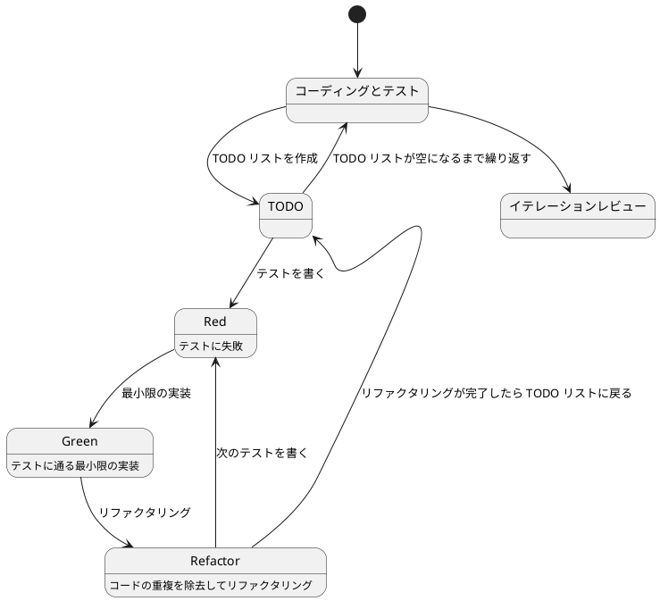
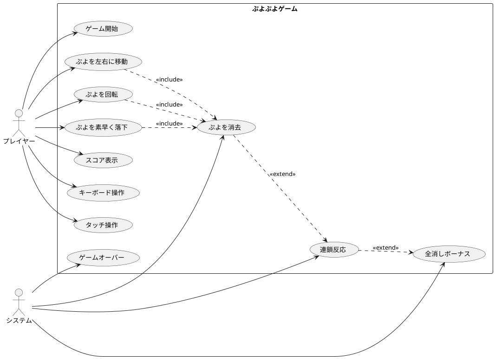

# ぷよぷよから始めるテスト駆動開発入門 - Kotlin Compose Multiplatform 編

## はじめに

みなさん、こんにちは！今日は私と一緒にテスト駆動開発（TDD）を使って、Kotlin Compose Multiplatform でぷよぷよゲームを作っていきましょう。さて、プログラミングの旅に出る前に、皆さんは「テスト駆動開発」について聞いたことがありますか？もしかしたら「テストって、コードを書いた後にするものじゃないの？」と思われるかもしれませんね。

> テストを書きながら開発することによって、設計が良い方向に変わり、コードが改善され続け、それによって自分自身が開発に前向きになること、それがテスト駆動開発の目指すゴールです。
>
> — Kent Beck 『テスト駆動開発』 付録C　訳者解説:テスト駆動開発の現在

この記事では、私たちが一緒にぷよぷよゲームを実装しながら、テスト駆動開発の基本的な流れと考え方を学んでいきます。まるでモブプログラミングのセッションのように、あなたと私が一緒に考え、コードを書き、改善していく過程を体験しましょう。「でも、ぷよぷよって結構複雑なゲームじゃないの？」と思われるかもしれませんが、心配いりません。各章では、ユーザーストーリーに基づいた機能を、テスト、実装、解説の順に少しずつ進めていきますよ。一歩一歩、着実に進んでいきましょう！

### テスト駆動開発のサイクル

さて、テスト駆動開発では、どのように進めていけばいいのでしょうか？「テストを書いてから実装する」というのは分かりましたが、具体的にはどんな手順で進めるのでしょうか？

私がいつも実践しているのは、以下の3つのステップを繰り返すサイクルです。皆さんも一緒にやってみましょう:

1. **Red（赤）**: まず失敗するテストを書きます。「え？わざと失敗するテストを？」と思われるかもしれませんが、これには重要な意味があるんです。これから実装する機能が何をすべきかを明確にするためなんですよ。
2. **Green（緑）**: 次に、テストが通るように、最小限のコードを実装します。この段階では、きれいなコードよりも「とにかく動くこと」を優先します。「最小限」というのがポイントです。必要以上のことはしないようにしましょう。
3. **Refactor（リファクタリング）**: 最後に、コードの品質を改善します。テストが通ることを確認しながら、重複を取り除いたり、わかりやすい名前をつけたりします。「動くけど汚いコード」から「動いてきれいなコード」へと進化させるんです。

> レッド・グリーン・リファクタリング。それが TDD のマントラだ。
>
> — Kent Beck 『テスト駆動開発』

このサイクルを「Red-Green-Refactor」サイクルと呼びます。「赤・緑・リファクタリング」のリズムを刻むように、このサイクルを繰り返していくんです。これによって、少しずつ機能を追加し、コードの品質を高めていきましょう。皆さんも一緒にこのリズムを体感してみてください！



### 開発環境

さて、実際にコードを書く前に、私たちが使用する開発環境について少しお話ししておきましょう。皆さんは「道具選びは仕事の半分」という言葉を聞いたことがありますか？プログラミングでも同じことが言えるんです。

> 道具はあなたの能力を増幅します。道具のできが優れており、簡単に使いこなせるようになっていれば、より生産的になれるのです。
>
> — 達人プログラマー 熟達に向けたあなたの旅（第2版）

「どんなツールを使えばいいの？」と思われるかもしれませんね。今回のプロジェクトでは、以下のツールを使用していきます:

- **言語**: Kotlin — 「Java だけじゃダメなの？」と思われるかもしれませんが、Kotlin は簡潔で安全な構文で、マルチプラットフォーム開発をサポートしてくれるモダンな言語です。
- **UI フレームワーク**: Compose Multiplatform — Android、iOS、デスクトップ、Web で動作する UI を一つのコードベースで書けます。「一度書いてどこでも動く」は魅力的ですよね！
- **ビルドツール**: Gradle — Kotlin プロジェクトの標準ビルドツールです。依存関係管理からビルド、テスト実行まで面倒を見てくれます。
- **テストフレームワーク**: JUnit — Java/Kotlin のデファクトスタンダードなテストフレームワークです。テスト駆動開発には欠かせないツールですね。
- **静的コード解析**: Detekt — Kotlin のコード品質をチェックしてくれます。「コードレビュアー代わりになってくれる」と思うと便利ですよね。
- **コードフォーマッタ**: ktlint — Kotlin の公式スタイルガイドに準拠したフォーマッタです。「コードの見た目を統一するのって大事ですよね！」
- **コードカバレッジ**: JaCoCo — テストがどれだけコードをカバーしているか測定してくれます。
- **バージョン管理**: Git — コードの変更履歴を追跡し、「あれ？昨日までちゃんと動いてたのに...」というときに過去の状態に戻れる魔法のツールです。

これらのツールを使って、テスト駆動開発の流れに沿ってぷよぷよゲームを実装していきましょう。「環境構築って難しそう...」と心配される方もいるかもしれませんが、手順に従って進めればそんなに難しいことではありません。詳細はイテレーション 0: 環境の構築で解説します。

### Kotlin と Compose Multiplatform について

さて、ここで「Kotlin って何？」「Compose Multiplatform ってどういうもの？」と疑問に思われる方もいらっしゃるかもしれませんね。少し詳しく見ていきましょう。

#### Kotlin とは

**Kotlin** は JetBrains 社が開発した、Java プラットフォーム上で動作するモダンなプログラミング言語です。2011 年に発表され、2017 年には Google が Android の公式開発言語として採用したことで大きな注目を集めました。

「Java とどう違うの？」と思われるかもしれませんね。Kotlin の特徴を見てみましょう:

##### Kotlin の主な特徴

1. **簡潔な構文**
   - Java よりも少ないコードで同じ機能を実現できます
   - ボイラープレート（定型的なコード）が大幅に削減されます

2. **Null 安全性**
   - Null ポインタ例外を型システムレベルで防ぎます
   - 「あれ？Null で落ちた...」という経験、ありませんか？Kotlin ならコンパイル時に検出できるんです

3. **関数型プログラミングのサポート**
   - 高階関数、ラムダ式、イミュータブルなデータ構造をサポート
   - 「関数を変数のように扱える」って便利ですよね！

4. **Java との相互運用性**
   - 既存の Java ライブラリをそのまま使用できます
   - Java プロジェクトに段階的に導入することも可能です

5. **マルチプラットフォーム対応**
   - JVM、JavaScript、ネイティブコードへのコンパイルが可能
   - 一度書いたコードを複数のプラットフォームで実行できます

##### Kotlin のコード例

Java と Kotlin の比較を見てみましょう。同じ機能を実装するのに、こんなに違いがあるんです:

**Java での実装:**
```java
public class Config {
    private final int stageWidth;
    private final int stageHeight;
    private final int puyoSize;

    public Config() {
        this.stageWidth = 6;
        this.stageHeight = 13;
        this.puyoSize = 32;
    }

    public int getStageWidth() {
        return stageWidth;
    }

    public int getStageHeight() {
        return stageHeight;
    }

    public int getPuyoSize() {
        return puyoSize;
    }
}
```

**Kotlin での実装:**
```kotlin
class Config {
    val stageWidth: Int = 6
    val stageHeight: Int = 13
    val puyoSize: Int = 32
}
```

「こんなに短くなるの！？」と驚かれるかもしれませんね。Kotlin では getter や setter、コンストラクタが自動生成されるため、本質的なコードだけに集中できるんです。

#### Compose Multiplatform とは

**Compose Multiplatform** は、JetBrains 社が開発した、宣言的 UI フレームワークです。Google の Android 向け UI ツールキット「Jetpack Compose」をベースに、マルチプラットフォーム対応を実現しています。

「宣言的 UI って何？」と思われるかもしれませんね。従来の命令的な UI 構築と比較してみましょう:

##### 命令的 UI vs 宣言的 UI

**命令的 UI（従来の方法）:**
```kotlin
// 「どうやって」UIを変更するかを記述
val button = Button()
button.text = "クリック"
button.setOnClickListener {
    button.text = "クリック済み"
}
```

**宣言的 UI（Compose の方法）:**
```kotlin
// 「何を」表示するかを記述
@Composable
fun MyButton() {
    var clicked by remember { mutableStateOf(false) }

    Button(onClick = { clicked = true }) {
        Text(if (clicked) "クリック済み" else "クリック")
    }
}
```

宣言的 UI では、「UI がどうあるべきか」を記述するだけで、「どうやって変更するか」は Compose が自動的に処理してくれるんです。便利ですよね！

##### Compose Multiplatform の主な特徴

1. **単一のコードベース**
   - Android、iOS、デスクトップ、Web で同じコードが動作します
   - 「一度書いてどこでも動く（Write Once, Run Anywhere）」を実現

2. **宣言的 UI**
   - UI の状態と表示が常に同期されます
   - 「あれ？画面が更新されない...」という問題が減ります

3. **Kotlin との完全な統合**
   - Kotlin の言語機能をフルに活用できます
   - 型安全で、コンパイル時にエラーを検出できます

4. **ホットリロード**
   - コードを変更すると即座に画面に反映されます
   - 「ビルドして実行して確認して...」の繰り返しから解放されます

5. **Material Design 3 サポート**
   - Google の最新デザインガイドラインに準拠した UI コンポーネントが使えます

##### Compose Multiplatform のコード例

Compose でぷよぷよのゲーム画面を作るとこんな感じになります:

```kotlin
@Composable
fun GameScreen(game: Game) {
    Column(
        modifier = Modifier.fillMaxSize(),
        horizontalAlignment = Alignment.CenterHorizontally
    ) {
        // スコア表示
        Text(
            text = "スコア: ${game.score.value}",
            style = MaterialTheme.typography.headlineMedium
        )

        // ゲームフィールド
        Canvas(
            modifier = Modifier
                .size(
                    width = (game.config.stageWidth * game.config.puyoSize).dp,
                    height = (game.config.stageHeight * game.config.puyoSize).dp
                )
        ) {
            // ぷよを描画
            for (y in 0 until game.config.stageHeight) {
                for (x in 0 until game.config.stageWidth) {
                    val puyoType = game.stage.getPuyo(x, y)
                    if (puyoType != 0) {
                        drawPuyo(x, y, puyoType, game.config.puyoSize)
                    }
                }
            }
        }
    }
}
```

「読みやすい！」と思いませんか？Compose では UI の構造がそのままコードの構造になるんです。

##### なぜマルチプラットフォームが重要なのか

「でも、ぷよぷよゲームを作るだけなら、一つのプラットフォームだけでいいんじゃない？」と思われるかもしれませんね。確かにそうなんですが、マルチプラットフォーム対応には大きなメリットがあるんです:

1. **開発コストの削減**
   - プラットフォームごとにコードを書く必要がありません
   - 一つの変更が全プラットフォームに反映されます

2. **一貫したユーザー体験**
   - どのプラットフォームでも同じ操作感
   - バグ修正や機能追加が全プラットフォームで同時に適用されます

3. **チーム効率の向上**
   - iOS チーム、Android チーム、Web チームと分ける必要がありません
   - 一つのチームで全プラットフォームをカバーできます

4. **技術スタックの統一**
   - Kotlin という一つの言語を習得すれば、どのプラットフォームでも開発できます
   - 「iOS は Swift、Android は Kotlin、Web は TypeScript...」という複雑さから解放されます

##### Compose Multiplatform のアーキテクチャ

Compose Multiplatform の構成を見てみましょう:

```
┌─────────────────────────────────────────┐
│     共通ビジネスロジック (commonMain)     │
│  - ゲームロジック、スコア計算、ぷよの移動  │
└─────────────────────────────────────────┘
              ↓ 共有 ↓
┌─────────────────────────────────────────┐
│        共通 UI (commonMain)              │
│  - Compose UI コンポーネント             │
│  - 画面レイアウト、描画ロジック           │
└─────────────────────────────────────────┘
              ↓ 共有 ↓
┌──────┬──────────┬──────────┬──────────┐
│Android│  iOS     │ Desktop  │   Web    │
│ 固有  │  固有     │  固有     │   固有    │
└──────┴──────────┴──────────┴──────────┘
```

「ほとんどのコードが共有できる」って素晴らしいですよね！

#### テスト駆動開発との相性

「テスト駆動開発と Kotlin Compose Multiplatform って相性いいの？」と疑問に思われるかもしれませんね。実は、とても相性がいいんです！

1. **強力な型システム**
   - コンパイル時に多くのエラーを検出できます
   - テストで見つける前に問題を発見できることが多いんです

2. **関数型プログラミング**
   - 純粋関数（副作用のない関数）を書きやすい
   - 純粋関数はテストが簡単なんです

3. **宣言的 UI**
   - UI のテストが状態のテストに置き換えられます
   - 「この状態ならこの UI」という形でテストできます

4. **マルチプラットフォーム対応**
   - 共通のテストコードを書けば、全プラットフォームでテストできます
   - 「一度書いたテストがどこでも動く」んです

これらの特徴により、Kotlin Compose Multiplatform はテスト駆動開発に最適な環境と言えるんです。私たちはこの環境で、安心してぷよぷよゲームを開発していけるんですよ！

## 要件

### ユーザーストーリー

さて、実際にコードを書き始める前に、少し立ち止まって考えてみましょう。「何を作るのか？」という基本的な問いかけです。私たちが作るぷよぷよゲームは、どのような機能を持つべきでしょうか？

アジャイル開発では、この「何を作るのか？」という問いに対して、「ユーザーストーリー」という形で答えを出します。皆さんは「ユーザーストーリー」という言葉を聞いたことがありますか？

> ユーザーストーリーは、ソフトウェア要求を表現するための軽量な手法である。ユーザーストーリーは、システムについてユーザーまたは顧客の視点からフィーチャの概要を記述したものだ。
> ユーザーストーリーには形式が定められておらず、標準的な記法もない。とはいえ、次のような形式でストーリーを考えてみると便利である。「＜ユーザーの種類＞として、＜機能や性能＞がほしい。それは＜ビジネス価値＞のためだ」という形のテンプレートに従うと、
> たとえば次のようなストーリーを書ける。「本の購入者として、ISBN で本を検索したい。それは探している本をすばやく見つけるためだ」
>
> — Mike Cohn 『アジャイルな見積と計画づくり』

つまり、「プレイヤーとして、〇〇ができる（〇〇したいから）」という形式で機能を表現するんです。これによって、「誰のため」の「どんな機能」を「なぜ」作るのかが明確になります。素晴らしいですよね！

では、私たちのぷよぷよゲームでは、どんなユーザーストーリーが考えられるでしょうか？一緒に考えてみましょう:

- プレイヤーとして、新しいゲームを開始できる（ゲームの基本機能として必要ですよね！）
- プレイヤーとして、落ちてくるぷよを左右に移動できる（ぷよを適切な位置に配置したいですよね）
- プレイヤーとして、落ちてくるぷよを回転できる（戦略的にぷよを配置するために必要です）
- プレイヤーとして、ぷよを素早く落下させることができる（「早く次のぷよを落としたい！」というときのために）
- プレイヤーとして、同じ色のぷよを 4 つ以上つなげると消去できる（これがぷよぷよの醍醐味ですよね！）
- プレイヤーとして、連鎖反応を起こしてより高いスコアを獲得できる（「れ〜んさ〜ん！」と叫びたくなりますよね）
- プレイヤーとして、全消し（ぜんけし）ボーナスを獲得できる（「やった！全部消えた！」という達成感を味わいたいですよね）
- プレイヤーとして、ゲームオーバーになるとゲーム終了の演出を見ることができる（終わりが明確でないとモヤモヤしますよね）
- プレイヤーとして、現在のスコアを確認できる（「今どれくらい点数取れてるかな？」と気になりますよね）
- プレイヤーとして、キーボードでぷよを操作できる（PC でプレイするなら必須ですよね）
- プレイヤーとして、タッチ操作でぷよを操作できる（スマホでもプレイしたいですよね）

「うわ、結構たくさんあるな...」と思われるかもしれませんが、心配いりません！これらのユーザーストーリーを一つずつ実装していくことで、徐々にゲームを完成させていきましょう。テスト駆動開発の素晴らしいところは、各ストーリーを小さなタスクに分解し、テスト→実装→リファクタリングのサイクルで少しずつ進められることなんです。一歩一歩、着実に進んでいきましょう！

### ユースケース図

ユーザーストーリーを整理したところで、「これらの機能がどのように関連しているのか、全体像が見えるといいな」と思いませんか？そんなときに役立つのが「ユースケース図」です。「ユースケース図って何？」と思われるかもしれませんね。ユースケース図は、システムと外部アクター（ここではプレイヤーとシステム自体）の相互作用を視覚的に表現するための図です。「絵に描いて整理すると分かりやすい」というやつですね。



このユースケース図を見ると、プレイヤーとシステムがどのように相互作用するかが一目で分かりますね。プレイヤーはぷよを操作し、システムは消去や連鎖の判定を行う。そして、それらが組み合わさってぷよぷよゲームが成り立つんです。

## イテレーション 0: 環境の構築

さて、いよいよ開発を始める準備をしましょう！「イテレーション 0」と聞いて、「あれ？1 からじゃないの？」と思われるかもしれませんね。アジャイル開発では、実際の機能開発を始める前の準備段階を「イテレーション 0」と呼ぶんです。ここでは、開発に必要なツールを揃えて、プロジェクトの基盤を作っていきます。

### ソフトウェア開発の三種の神器

前回はKotlinとテスト駆動開発を使って FizzBuzz プログラムを作りました。プログラムは動くものができたのですが、一人で開発していく上でまだ不便な部分があります。今回は開発していく上で便利になるツールを導入していきます。

> よいソフトウェアを書くのは難しい。よいソフトウェアを書くコツを覚えるのにも時間がかかる。けれども、よいソフトウェアを書くのに役立つツールを知ることはできる。
>
> 「よいコードを書くコツの一つは、よいツールを使うことだ。よいツールが自分のかわりに仕事をしてくれる。」
>
> — [和田卓人（t-wada）さん](https://twitter.com/t_wada)

[和田卓人（t-wada）さん](https://twitter.com/t_wada) が提唱されている [ソフトウェア開発の三種の神器](https://t-wada.hatenablog.jp/entry/clean-code-that-works) を使ってよいソフトウェアを書くためのツールを準備していきます。

三種の神器とは以下のとおりです。

1. **バージョン管理システム**
2. **テスティングフレームワーク**
3. **自動化**

この三種の神器について説明していきます。

#### バージョン管理システム

バージョン管理システムとは、ファイルの作成日時、変更日時、変更点などの履歴を管理するシステムです。これを使うことでファイルをバックアップしなくても、以前のファイルの状態を復元できたり、ファイルの変更内容を確認できたり、バックアップとしての役目も果たします。現在の主流は `Git` です。

#### テスティングフレームワーク

テスティングフレームワークとは、プログラムをテストするために使用するソフトウェアです。前回、プログラムの動作を確認するために対話的 Kotlin シェル（REPL）にプログラムを入力していました。しかし、プログラムの変更を行った場合に前回実施した動作確認を再度実施するのは面倒ですよね。テスティングフレームワークを使うとテストプログラムを作成することで何度でも同じテストを自動実行できるようになります。Kotlin には **JUnit** というテスティングフレームワークが使用できます。

#### 自動化

自動化とは、これまで手動で行っていた作業をツールを使って自動的に実行できるようにすることです。例えば、テストの実行、プログラムの品質をチェックしたり、プログラムのフォーマットを整えたりといった作業を自動化してくれます。Kotlin では **Gradle** というビルドツールを使用して自動化を実現できます。

### 今回準備するツール

今回は Kotlin Compose Multiplatform での開発に向けて以下のツールを準備していきます:

- **バージョン管理システム**: Git
- **テスティングフレームワーク**: JUnit
- **パッケージマネージャ**: Gradle
- **静的コード解析**: Detekt
- **コードフォーマッタ**: ktlint
- **コードカバレッジ**: JaCoCo
- **タスクランナー**: Gradle
- **自動化**: Gradle Watch

それでは、ツールを一つずつ導入していきましょう。

### プロジェクトの作成

まず、Kotlin Compose Multiplatform プロジェクトを作成します。IntelliJ IDEA を使用すると簡単に作成できます:

1. IntelliJ IDEA を起動
2. "New Project" を選択
3. "Kotlin Multiplatform" → "Compose Multiplatform" を選択
4. プロジェクト名を "PuyoPuyoTDD" に設定
5. パッケージ名を "com.example.puyopuyo" に設定
6. ターゲットプラットフォームを選択（Desktop、Android、iOS、Web から選べます）
7. "Create" をクリック

プロジェクトが作成されると、以下のような構造になります:

```
PuyoPuyoTDD/
├── gradle/
├── src/
│   ├── commonMain/
│   │   └── kotlin/
│   ├── commonTest/
│   │   └── kotlin/
│   ├── desktopMain/
│   │   └── kotlin/
│   └── desktopTest/
│       └── kotlin/
├── build.gradle.kts
├── gradle.properties
├── gradlew
├── gradlew.bat
└── settings.gradle.kts
```

### バージョン管理

バージョン管理には Git を使用します。Git は分散型バージョン管理システムです。プロジェクトを Git で管理するための初期化を行いましょう。

Git が初期化されているかどうかを確認します。

```bash
$ git status
On branch main
nothing to commit, working tree clean
```

上記のような出力がされれば Git は初期化されています。もしも `fatal: not a git repository` のようなエラーが出力された場合は、以下のコマンドで Git を初期化してください。

```bash
$ git init
```

次に、リモートリポジトリの設定を確認します。GitHub などにリポジトリを作成している場合は、リモートリポジトリの設定を行います。

```bash
$ git remote -v
origin  https://github.com/username/repository.git (fetch)
origin  https://github.com/username/repository.git (push)
```

リモートリポジトリが設定されていない場合は、以下のコマンドで設定します。

```bash
$ git remote add origin https://github.com/username/repository.git
```

これでバージョン管理の準備は完了です。

### コミットメッセージ

Git を使ったバージョン管理では、変更をコミットする際にコミットメッセージを書きます。このコミットメッセージは後からコードの変更履歴を確認する際に重要な情報となります。

#### Conventional Commits

コミットメッセージを書く際には、一定のルールに従って書くことで、後から変更履歴を確認しやすくなります。そのためのルールとして **Conventional Commits** という規約があります。

> Conventional Commits 仕様は、コミットメッセージのための軽量な規約です。明確なコミット履歴を作成するための簡単なルールを提供します。この規約に従うことで、コミット履歴を元に自動化ツールを作成することが簡単になります。
>
> — [Conventional Commits](https://www.conventionalcommits.org/ja/v1.0.0/)

Conventional Commits では、コミットメッセージを以下の形式で書きます:

```
<type>[optional scope]: <description>

[optional body]

[optional footer(s)]
```

##### type（必須）

コミットの種類を表します。主要な type は以下のとおりです:

- **feat**: 新機能の追加
- **fix**: バグの修正
- **docs**: ドキュメントの変更
- **style**: コードの意味に影響しない変更（空白、フォーマットなど）
- **refactor**: バグ修正や機能追加ではないコードの変更
- **test**: テストの追加や修正
- **chore**: ビルドプロセスや補助ツールの変更

##### scope（任意）

変更された範囲を表します。例: `api`, `ui`, `database` など

##### description（必須）

変更内容の簡潔な説明

##### 例

```bash
feat: Config クラスにゲーム設定機能を追加

fix: ぷよが重なる問題を修正

docs: README.md にプロジェクトの説明を追加

test: Stage クラスの単体テストを追加

chore: Gradle の依存関係を更新
```

このルールに従ってコミットメッセージを書くことで、変更履歴が分かりやすくなります。

### パッケージマネージャ

ソフトウェア開発では、様々な外部ライブラリを使用することがあります。これらのライブラリを手動で管理するのは大変な作業です。そこで **パッケージマネージャ** を使用します。

> パッケージマネージャとは、ソフトウェアのパッケージの検索、インストール、アップデート、削除などを自動化するツールです。
>
> — Wikipedia

Kotlin では **Gradle** というビルドツールがパッケージマネージャの役割も果たします。Gradle は Java プラットフォーム向けのビルド自動化ツールです。

#### Gradle の設定

Compose Multiplatform プロジェクトでは、`build.gradle.kts` ファイルでプロジェクトの設定を行います。基本的な `build.gradle.kts` の例:

```kotlin
plugins {
    kotlin("multiplatform") version "2.0.0"
    id("org.jetbrains.compose") version "1.6.0"
}

group = "com.example.puyopuyo"
version = "1.0.0"

repositories {
    google()
    mavenCentral()
    maven("https://maven.pkg.jetbrains.space/public/p/compose/dev")
}

kotlin {
    jvm("desktop")

    sourceSets {
        val commonMain by getting {
            dependencies {
                implementation(compose.runtime)
                implementation(compose.foundation)
                implementation(compose.material3)
                implementation(compose.ui)
                implementation(compose.components.resources)
            }
        }
        val commonTest by getting {
            dependencies {
                implementation(kotlin("test"))
            }
        }
        val desktopMain by getting {
            dependencies {
                implementation(compose.desktop.currentOs)
            }
        }
    }
}

compose.desktop {
    application {
        mainClass = "MainKt"
    }
}
```

##### plugins ブロック

使用するプラグインを指定します:

- `kotlin("multiplatform")`: Kotlin マルチプラットフォームプロジェクト用のプラグイン
- `org.jetbrains.compose`: Compose Multiplatform 用のプラグイン

##### repositories ブロック

依存関係を取得するリポジトリを指定します:

- `google()`: Google の Maven リポジトリ
- `mavenCentral()`: Maven Central リポジトリ
- `maven("https://maven.pkg.jetbrains.space/public/p/compose/dev")`: JetBrains の Compose 用リポジトリ

##### kotlin ブロック

マルチプラットフォームの設定と依存関係を指定します:

- `sourceSets`: プラットフォームごとのソースセットと依存関係
- `commonMain`: 全プラットフォーム共通のコード
- `commonTest`: 全プラットフォーム共通のテストコード
- `desktopMain`: デスクトップアプリ固有のコード

#### Gradle のタスク実行

Gradle では様々なタスクを実行できます:

```bash
# プロジェクトのビルド
$ ./gradlew build

# テストの実行
$ ./gradlew test

# デスクトップアプリケーションの実行
$ ./gradlew run

# 利用可能なタスクの一覧表示
$ ./gradlew tasks
```

これでパッケージマネージャの設定は完了です。設定をコミットしておきましょう。

```bash
$ git add .
$ git commit -m 'chore: Gradle プロジェクトセットアップ'
```

### 静的コード解析

コードを書いていると、バグや品質の問題が混入することがあります。これらの問題を早期に発見するために **静的コード解析** ツールを使用します。

> 静的コード解析とは、プログラムを実行することなく、ソースコードを解析してバグやコーディング規約違反、セキュリティ上の問題などを検出する手法です。

Kotlin では **Detekt** という静的コード解析ツールを使用できます。

#### Detekt の導入

`build.gradle.kts` に Detekt プラグインを追加します:

```kotlin
plugins {
    kotlin("multiplatform") version "2.0.0"
    id("org.jetbrains.compose") version "1.6.0"
    id("io.gitlab.arturbosch.detekt") version "1.23.0"
}

// ... 既存の設定 ...

dependencies {
    detektPlugins("io.gitlab.arturbosch.detekt:detekt-formatting:1.23.0")
}

// Detekt configuration
detekt {
    buildUponDefaultConfig = true
    allRules = false
    config.setFrom("$projectDir/config/detekt/detekt.yml")
}

tasks.withType<io.gitlab.arturbosch.detekt.Detekt>().configureEach {
    jvmTarget = "17"
}
```

#### Detekt の設定ファイル

プロジェクトに `config/detekt/detekt.yml` ファイルを作成して、Detekt のルールをカスタマイズできます:

```yaml
# detekt.yml
autoCorrect: true

style:
  MaxLineLength:
    maxLineLength: 120

complexity:
  ComplexMethod:
    threshold: 7
  TooManyFunctions:
    active: false

formatting:
  ParameterListWrapping:
    active: false
```

#### Detekt の実行

以下のコマンドで Detekt を実行できます:

```bash
# 静的解析の実行
$ ./gradlew detekt

# 自動修正を含む実行
$ ./gradlew detektMain --auto-correct
```

実行結果の例:

```
> Task :detektMain
Detekt found 3 issues.

/src/commonMain/kotlin/Config.kt:10:1: [style] MagicNumber: This expression contains a magic number. Consider defining it to a well named constant.

BUILD SUCCESSFUL in 2s
```

Detekt は以下のような問題を検出します:

- **コード品質**: 複雑すぎるメソッド、長すぎる行など
- **バグの可能性**: null ポインタ例外の可能性、型キャストエラーなど
- **スタイル**: コーディング規約違反、命名規則違反など
- **パフォーマンス**: 非効率なコード
- **セキュリティ**: セキュリティ上の問題

設定をコミットしておきましょう。

```bash
$ git add .
$ git commit -m 'chore: Detekt 静的コード解析セットアップ'
```

### コードフォーマッタ

コードの書き方にはスタイルがあります。インデント、改行、スペースの使い方などです。チーム開発では、メンバー全員が同じスタイルでコードを書くことが重要です。**コードフォーマッタ** を使用することで、コードのスタイルを自動的に統一できます。

> コードフォーマッタとは、ソースコードを一定のスタイルに自動的に整形するツールです。

Kotlin では **ktlint** というコードフォーマッタを使用できます。ktlint は、Kotlin の公式コーディング規約に準拠したフォーマッタです。

#### ktlint の導入

`build.gradle.kts` に ktlint プラグインを追加します:

```kotlin
plugins {
    kotlin("multiplatform") version "2.0.0"
    id("org.jetbrains.compose") version "1.6.0"
    id("io.gitlab.arturbosch.detekt") version "1.23.0"
    id("org.jlleitschuh.gradle.ktlint") version "11.5.1"
}

// ... 既存の設定 ...

// Ktlint configuration
ktlint {
    verbose.set(true)
    outputToConsole.set(true)
    coloredOutput.set(true)
    reporters {
        reporter(org.jlleitschuh.gradle.ktlint.reporter.ReporterType.CHECKSTYLE)
        reporter(org.jlleitschuh.gradle.ktlint.reporter.ReporterType.JSON)
        reporter(org.jlleitschuh.gradle.ktlint.reporter.ReporterType.HTML)
    }
}
```

#### ktlint の実行

以下のコマンドで ktlint を実行できます:

```bash
# コードスタイルのチェック
$ ./gradlew ktlintCheck

# コードスタイルの自動修正
$ ./gradlew ktlintFormat
```

実行結果の例:

```
> Task :ktlintMainSourceSetCheck
/src/commonMain/kotlin/Config.kt:5:1: Unexpected indentation (4) (should be 8) (indent)
/src/commonMain/kotlin/Config.kt:10:17: Missing spacing after "," (comma-spacing)

2 problems (0 errors, 2 warnings)

BUILD FAILED in 1s
```

ktlint は以下のようなスタイル問題を検出・修正します:

- **インデント**: タブやスペースの統一
- **スペーシング**: 演算子、カンマ、括弧周りのスペース
- **改行**: 適切な位置での改行
- **インポート**: インポート文の整理
- **命名規則**: クラス名、メソッド名の規則

#### 自動修正の例

修正前:

```kotlin
class Config{
    val stageWidth:Int=6
    val stageHeight:Int=13
    val puyoSize:Int=32
}
```

修正後:

```kotlin
class Config {
    val stageWidth: Int = 6
    val stageHeight: Int = 13
    val puyoSize: Int = 32
}
```

設定をコミットしておきましょう。

```bash
$ git add .
$ git commit -m 'chore: ktlint コードフォーマッタセットアップ'
```

### コードカバレッジ

テストを書いていると、「どの程度のコードがテストされているか」を知りたくなります。これを測定するのが **コードカバレッジ** です。

> コードカバレッジとは、テストによって実行されたソースコードの割合を測定する手法です。

Kotlin では **JaCoCo**（Java Code Coverage）というツールでコードカバレッジを測定できます。

#### JaCoCo の導入

`build.gradle.kts` に JaCoCo プラグインを追加します:

```kotlin
plugins {
    kotlin("multiplatform") version "2.0.0"
    id("org.jetbrains.compose") version "1.6.0"
    id("io.gitlab.arturbosch.detekt") version "1.23.0"
    id("org.jlleitschuh.gradle.ktlint") version "11.5.1"
    jacoco
}

// ... 既存の設定 ...

tasks.withType<Test> {
    finalizedBy(tasks.jacocoTestReport)
}

tasks.jacocoTestReport {
    dependsOn(tasks.test)
    reports {
        xml.required = false
        csv.required = false
        html.outputLocation = layout.buildDirectory.dir("jacocoHtml")
    }
}
```

#### JaCoCo の実行

テストを実行すると、自動的にコードカバレッジが測定されます:

```bash
# テスト実行（カバレッジも同時に実行される）
$ ./gradlew test

# カバレッジレポートのみ生成
$ ./gradlew jacocoTestReport
```

実行結果の例:

```
> Task :test
ConfigTest > ステージの幅が正しく設定されている() PASSED
ConfigTest > ステージの高さが正しく設定されている() PASSED
ConfigTest > ぷよのサイズが正しく設定されている() PASSED

> Task :jacocoTestReport

BUILD SUCCESSFUL in 3s
```

#### カバレッジレポートの確認

テスト実行後に `build/jacocoHtml` フォルダが作成されます。その中の `index.html` を開くとカバレッジ状況を確認できます。

```bash
# ブラウザでレポートを開く
$ open build/jacocoHtml/index.html
```

レポートには以下の情報が表示されます:

- **Line Coverage**: 実行された行の割合
- **Branch Coverage**: 実行された分岐の割合
- **Method Coverage**: 実行されたメソッドの割合
- **Class Coverage**: 実行されたクラスの割合

#### カバレッジの例

```
Package              Line Coverage    Branch Coverage    Method Coverage
com.example.puyopuyo 85% (17/20)      75% (6/8)         100% (4/4)
```

この例では:
- 20 行中 17 行がテストで実行された（85%）
- 8 つの分岐中 6 つがテストで実行された（75%）
- 4 つのメソッドすべてがテストで実行された（100%）

コードカバレッジは品質の指標の一つですが、100% である必要はありません。重要なのは、重要な機能がしっかりテストされていることです。

設定をコミットしておきましょう。

```bash
$ git add .
$ git commit -m 'chore: JaCoCo コードカバレッジセットアップ'
```

### タスクランナー

ここまででテストの実行、静的コード解析、コードフォーマット、コードカバレッジを実施することができるようになりました。でもコマンドを実行するのにそれぞれのコマンドを覚えておくのは面倒ですよね。例えばテストの実行は:

```bash
$ ./gradlew test
```

では静的コード解析はどうやりましたか？フォーマットはどうやりましたか？調べるのも面倒ですよね。いちいち調べるのが面倒なことは全部 **タスクランナー** にやらせるようにしましょう。

> タスクランナーとは、アプリケーションのビルドなど、一定の手順で行う作業をコマンド一つで実行できるように予めタスクとして定義したものです。

Kotlin の **タスクランナー** は `Gradle` です。Gradle は単なるパッケージマネージャではなく、強力なタスクランナーでもあります。

#### カスタムタスクの定義

`build.gradle.kts` にカスタムタスクを追加して、よく使うコマンドを簡単に実行できるようにします:

```kotlin
// カスタムタスクの定義
tasks.register("checkAll") {
    description = "全てのチェックを実行"
    group = "verification"
    dependsOn("ktlintCheck", "detekt", "test")
}

tasks.register("fixAll") {
    description = "自動修正可能な全ての問題を修正"
    group = "formatting"
    dependsOn("ktlintFormat")
    finalizedBy("detektMain")
}

tasks.register("qualityCheck") {
    description = "コード品質チェック"
    group = "verification"
    dependsOn("ktlintCheck", "detekt")
}
```

#### タスクの実行

定義したタスクを実行できます:

```bash
# 利用可能なタスクの一覧表示
$ ./gradlew tasks

# 全てのチェックを実行
$ ./gradlew checkAll

# 自動修正を実行
$ ./gradlew fixAll

# コード品質チェックのみ実行
$ ./gradlew qualityCheck
```

実行結果の例:

```
> Task :ktlintCheck
> Task :detekt
> Task :test

BUILD SUCCESSFUL in 5s
```

#### Gradle Wrapper

プロジェクトには `gradlew`（Unix/Linux/Mac）と `gradlew.bat`（Windows）というファイルがあります。これは **Gradle Wrapper** と呼ばれ、Gradle がインストールされていない環境でも同じバージョンの Gradle を使用できるようにするツールです。

```bash
# Unix/Linux/Mac
$ ./gradlew build

# Windows
$ gradlew.bat build
```

チーム開発では、メンバー全員が同じバージョンの Gradle を使用することが重要なので、Gradle Wrapper を使用することが推奨されます。

### 自動化

これまでに導入したツールを使って、開発作業を自動化しましょう。Gradle には **継続的ビルド** 機能があり、ファイルの変更を監視して自動的にタスクを実行できます。

#### ファイル監視による自動実行

```bash
# ファイル変更を監視してテストを自動実行
$ ./gradlew test --continuous

# ファイル変更を監視して品質チェックを自動実行
$ ./gradlew qualityCheck --continuous
```

`--continuous` オプションを使用すると、ソースファイルが変更されるたびに自動的にタスクが実行されます。

実行結果の例:

```
> Task :qualityCheck

BUILD SUCCESSFUL in 2s

Waiting for changes to input files... (ctrl-d to exit)
<-------------> 0% EXECUTING
> :qualityCheck
```

この状態で Kotlin ファイルを編集すると、自動的に品質チェックが実行されます:

```
Change detected, executing build...

> Task :ktlintCheck
> Task :detekt

BUILD SUCCESSFUL in 1s

Waiting for changes to input files... (ctrl-d to exit)
```

#### IDE との連携

多くの IDE は Gradle と連携して、以下のような自動化を提供しています:

- **保存時の自動フォーマット**: ファイル保存時に ktlintFormat を実行
- **リアルタイム解析**: Detekt による静的解析結果をエディタに表示
- **テストの自動実行**: テストファイル変更時にテストを自動実行

これらの機能により、開発中にリアルタイムでコード品質を確認できます。

設定をコミットしておきましょう。

```bash
$ git add .
$ git commit -m 'chore: タスクの自動化セットアップ'
```

これで [ソフトウェア開発の三種の神器](https://t-wada.hatenablog.jp/entry/clean-code-that-works) の最後のアイテムの準備ができました。次回の開発からは最初にコマンドラインで `./gradlew checkAll` を実行すれば良いコードを書くためのタスクを自動で実行してくれるようになるので、コードを書くことに集中できるようになりました。

### まとめ

今回は Kotlin Compose Multiplatform での開発に必要なツールを導入しました:

#### 導入したツール

1. **バージョン管理システム**: Git
2. **テスティングフレームワーク**: JUnit
3. **パッケージマネージャ**: Gradle
4. **静的コード解析**: Detekt
5. **コードフォーマッタ**: ktlint
6. **コードカバレッジ**: JaCoCo
7. **タスクランナー**: Gradle
8. **自動化**: Gradle Watch

#### よく使うコマンド

```bash
# 全てのチェックを実行
$ ./gradlew checkAll

# 自動修正を実行
$ ./gradlew fixAll

# テスト実行（カバレッジ付き）
$ ./gradlew test

# 継続的品質チェック
$ ./gradlew qualityCheck --continuous

# デスクトップアプリの実行
$ ./gradlew run
```

これらのツールを使うことで、以下の利点が得られます:

- **品質の向上**: 静的解析とフォーマッタによりコードの品質が向上
- **効率の向上**: 自動化により手動作業が削減
- **一貫性の確保**: チーム全体で同じ品質基準を共有
- **早期発見**: 問題の早期発見と修正
- **集中力の向上**: コード品質管理から開放され、ロジックに集中可能

次のエピソードでは、これらのツールを活用して実際にぷよぷよゲームの実装を始めていきましょう。まずはゲームの設定から始めて、少しずつ機能を追加していきます。楽しみにしていてくださいね！
