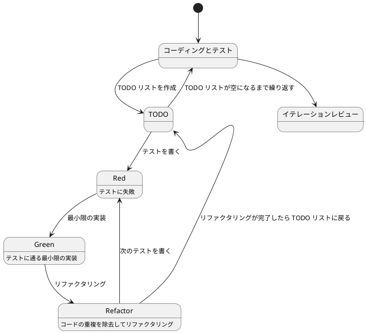
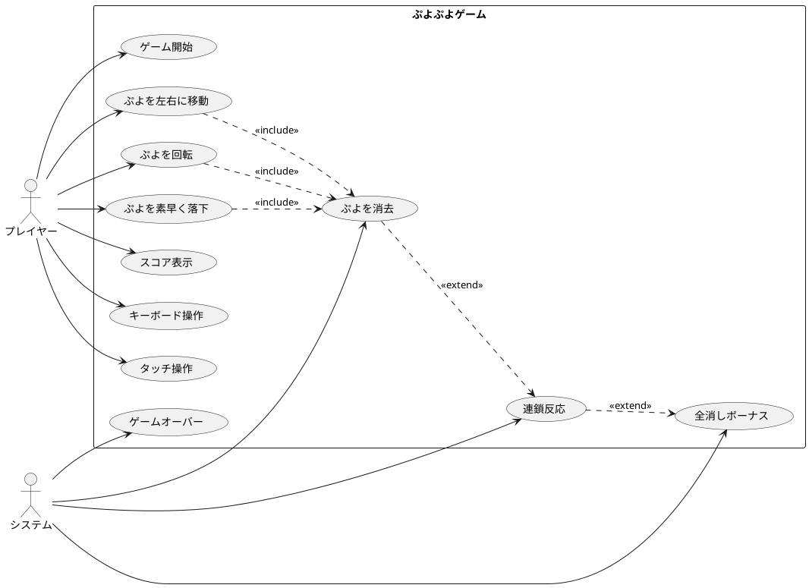

# ぷよぷよから始めるテスト駆動開発入門 - Kotlin Compose Multiplatform 編

## はじめに

みなさん、こんにちは！今日は私と一緒にテスト駆動開発（TDD）を使って、Kotlin Compose Multiplatform でぷよぷよゲームを作っていきましょう。さて、プログラミングの旅に出る前に、皆さんは「テスト駆動開発」について聞いたことがありますか？もしかしたら「テストって、コードを書いた後にするものじゃないの？」と思われるかもしれませんね。

> テストを書きながら開発することによって、設計が良い方向に変わり、コードが改善され続け、それによって自分自身が開発に前向きになること、それがテスト駆動開発の目指すゴールです。
>
> — Kent Beck 『テスト駆動開発』 付録C　訳者解説:テスト駆動開発の現在

この記事では、私たちが一緒にぷよぷよゲームを実装しながら、テスト駆動開発の基本的な流れと考え方を学んでいきます。まるでモブプログラミングのセッションのように、あなたと私が一緒に考え、コードを書き、改善していく過程を体験しましょう。「でも、ぷよぷよって結構複雑なゲームじゃないの？」と思われるかもしれませんが、心配いりません。各章では、ユーザーストーリーに基づいた機能を、テスト、実装、解説の順に少しずつ進めていきますよ。一歩一歩、着実に進んでいきましょう！

### テスト駆動開発のサイクル

さて、テスト駆動開発では、どのように進めていけばいいのでしょうか？「テストを書いてから実装する」というのは分かりましたが、具体的にはどんな手順で進めるのでしょうか？

私がいつも実践しているのは、以下の3つのステップを繰り返すサイクルです。皆さんも一緒にやってみましょう:

1. **Red（赤）**: まず失敗するテストを書きます。「え？わざと失敗するテストを？」と思われるかもしれませんが、これには重要な意味があるんです。これから実装する機能が何をすべきかを明確にするためなんですよ。
2. **Green（緑）**: 次に、テストが通るように、最小限のコードを実装します。この段階では、きれいなコードよりも「とにかく動くこと」を優先します。「最小限」というのがポイントです。必要以上のことはしないようにしましょう。
3. **Refactor（リファクタリング）**: 最後に、コードの品質を改善します。テストが通ることを確認しながら、重複を取り除いたり、わかりやすい名前をつけたりします。「動くけど汚いコード」から「動いてきれいなコード」へと進化させるんです。

> レッド・グリーン・リファクタリング。それが TDD のマントラだ。
>
> — Kent Beck 『テスト駆動開発』

このサイクルを「Red-Green-Refactor」サイクルと呼びます。「赤・緑・リファクタリング」のリズムを刻むように、このサイクルを繰り返していくんです。これによって、少しずつ機能を追加し、コードの品質を高めていきましょう。皆さんも一緒にこのリズムを体感してみてください！



### 開発環境

さて、実際にコードを書く前に、私たちが使用する開発環境について少しお話ししておきましょう。皆さんは「道具選びは仕事の半分」という言葉を聞いたことがありますか？プログラミングでも同じことが言えるんです。

> 道具はあなたの能力を増幅します。道具のできが優れており、簡単に使いこなせるようになっていれば、より生産的になれるのです。
>
> — 達人プログラマー 熟達に向けたあなたの旅（第2版）

「どんなツールを使えばいいの？」と思われるかもしれませんね。今回のプロジェクトでは、以下のツールを使用していきます:

- **言語**: Kotlin — 「Java だけじゃダメなの？」と思われるかもしれませんが、Kotlin は簡潔で安全な構文で、マルチプラットフォーム開発をサポートしてくれるモダンな言語です。
- **UI フレームワーク**: Compose Multiplatform — Android、iOS、デスクトップ、Web で動作する UI を一つのコードベースで書けます。「一度書いてどこでも動く」は魅力的ですよね！
- **ビルドツール**: Gradle — Kotlin プロジェクトの標準ビルドツールです。依存関係管理からビルド、テスト実行まで面倒を見てくれます。
- **テストフレームワーク**: JUnit — Java/Kotlin のデファクトスタンダードなテストフレームワークです。テスト駆動開発には欠かせないツールですね。
- **静的コード解析**: Detekt — Kotlin のコード品質をチェックしてくれます。「コードレビュアー代わりになってくれる」と思うと便利ですよね。
- **コードフォーマッタ**: ktlint — Kotlin の公式スタイルガイドに準拠したフォーマッタです。「コードの見た目を統一するのって大事ですよね！」
- **コードカバレッジ**: JaCoCo — テストがどれだけコードをカバーしているか測定してくれます。
- **バージョン管理**: Git — コードの変更履歴を追跡し、「あれ？昨日までちゃんと動いてたのに...」というときに過去の状態に戻れる魔法のツールです。

これらのツールを使って、テスト駆動開発の流れに沿ってぷよぷよゲームを実装していきましょう。「環境構築って難しそう...」と心配される方もいるかもしれませんが、手順に従って進めればそんなに難しいことではありません。詳細はイテレーション 0: 環境の構築で解説します。

### Kotlin と Compose Multiplatform について

さて、ここで「Kotlin って何？」「Compose Multiplatform ってどういうもの？」と疑問に思われる方もいらっしゃるかもしれませんね。少し詳しく見ていきましょう。

#### Kotlin とは

**Kotlin** は JetBrains 社が開発した、Java プラットフォーム上で動作するモダンなプログラミング言語です。2011 年に発表され、2017 年には Google が Android の公式開発言語として採用したことで大きな注目を集めました。

「Java とどう違うの？」と思われるかもしれませんね。Kotlin の特徴を見てみましょう:

##### Kotlin の主な特徴

1. **簡潔な構文**
   - Java よりも少ないコードで同じ機能を実現できます
   - ボイラープレート（定型的なコード）が大幅に削減されます

2. **Null 安全性**
   - Null ポインタ例外を型システムレベルで防ぎます
   - 「あれ？Null で落ちた...」という経験、ありませんか？Kotlin ならコンパイル時に検出できるんです

3. **関数型プログラミングのサポート**
   - 高階関数、ラムダ式、イミュータブルなデータ構造をサポート
   - 「関数を変数のように扱える」って便利ですよね！

4. **Java との相互運用性**
   - 既存の Java ライブラリをそのまま使用できます
   - Java プロジェクトに段階的に導入することも可能です

5. **マルチプラットフォーム対応**
   - JVM、JavaScript、ネイティブコードへのコンパイルが可能
   - 一度書いたコードを複数のプラットフォームで実行できます

##### Kotlin のコード例

Java と Kotlin の比較を見てみましょう。同じ機能を実装するのに、こんなに違いがあるんです:

**Java での実装:**
```java
public class Config {
    private final int stageWidth;
    private final int stageHeight;
    private final int puyoSize;

    public Config() {
        this.stageWidth = 6;
        this.stageHeight = 13;
        this.puyoSize = 32;
    }

    public int getStageWidth() {
        return stageWidth;
    }

    public int getStageHeight() {
        return stageHeight;
    }

    public int getPuyoSize() {
        return puyoSize;
    }
}
```

**Kotlin での実装:**
```kotlin
class Config {
    val stageWidth: Int = 6
    val stageHeight: Int = 13
    val puyoSize: Int = 32
}
```

「こんなに短くなるの！？」と驚かれるかもしれませんね。Kotlin では getter や setter、コンストラクタが自動生成されるため、本質的なコードだけに集中できるんです。

#### Compose Multiplatform とは

**Compose Multiplatform** は、JetBrains 社が開発した、宣言的 UI フレームワークです。Google の Android 向け UI ツールキット「Jetpack Compose」をベースに、マルチプラットフォーム対応を実現しています。

「宣言的 UI って何？」と思われるかもしれませんね。従来の命令的な UI 構築と比較してみましょう:

##### 命令的 UI vs 宣言的 UI

**命令的 UI（従来の方法）:**
```kotlin
// 「どうやって」UIを変更するかを記述
val button = Button()
button.text = "クリック"
button.setOnClickListener {
    button.text = "クリック済み"
}
```

**宣言的 UI（Compose の方法）:**
```kotlin
// 「何を」表示するかを記述
@Composable
fun MyButton() {
    var clicked by remember { mutableStateOf(false) }

    Button(onClick = { clicked = true }) {
        Text(if (clicked) "クリック済み" else "クリック")
    }
}
```

宣言的 UI では、「UI がどうあるべきか」を記述するだけで、「どうやって変更するか」は Compose が自動的に処理してくれるんです。便利ですよね！

##### Compose Multiplatform の主な特徴

1. **単一のコードベース**
   - Android、iOS、デスクトップ、Web で同じコードが動作します
   - 「一度書いてどこでも動く（Write Once, Run Anywhere）」を実現

2. **宣言的 UI**
   - UI の状態と表示が常に同期されます
   - 「あれ？画面が更新されない...」という問題が減ります

3. **Kotlin との完全な統合**
   - Kotlin の言語機能をフルに活用できます
   - 型安全で、コンパイル時にエラーを検出できます

4. **ホットリロード**
   - コードを変更すると即座に画面に反映されます
   - 「ビルドして実行して確認して...」の繰り返しから解放されます

5. **Material Design 3 サポート**
   - Google の最新デザインガイドラインに準拠した UI コンポーネントが使えます

##### Compose Multiplatform のコード例

Compose でぷよぷよのゲーム画面を作るとこんな感じになります:

```kotlin
@Composable
fun GameScreen(game: Game) {
    Column(
        modifier = Modifier.fillMaxSize(),
        horizontalAlignment = Alignment.CenterHorizontally
    ) {
        // スコア表示
        Text(
            text = "スコア: ${game.score.value}",
            style = MaterialTheme.typography.headlineMedium
        )

        // ゲームフィールド
        Canvas(
            modifier = Modifier
                .size(
                    width = (game.config.stageWidth * game.config.puyoSize).dp,
                    height = (game.config.stageHeight * game.config.puyoSize).dp
                )
        ) {
            // ぷよを描画
            for (y in 0 until game.config.stageHeight) {
                for (x in 0 until game.config.stageWidth) {
                    val puyoType = game.stage.getPuyo(x, y)
                    if (puyoType != 0) {
                        drawPuyo(x, y, puyoType, game.config.puyoSize)
                    }
                }
            }
        }
    }
}
```

「読みやすい！」と思いませんか？Compose では UI の構造がそのままコードの構造になるんです。

##### なぜマルチプラットフォームが重要なのか

「でも、ぷよぷよゲームを作るだけなら、一つのプラットフォームだけでいいんじゃない？」と思われるかもしれませんね。確かにそうなんですが、マルチプラットフォーム対応には大きなメリットがあるんです:

1. **開発コストの削減**
   - プラットフォームごとにコードを書く必要がありません
   - 一つの変更が全プラットフォームに反映されます

2. **一貫したユーザー体験**
   - どのプラットフォームでも同じ操作感
   - バグ修正や機能追加が全プラットフォームで同時に適用されます

3. **チーム効率の向上**
   - iOS チーム、Android チーム、Web チームと分ける必要がありません
   - 一つのチームで全プラットフォームをカバーできます

4. **技術スタックの統一**
   - Kotlin という一つの言語を習得すれば、どのプラットフォームでも開発できます
   - 「iOS は Swift、Android は Kotlin、Web は TypeScript...」という複雑さから解放されます

##### Compose Multiplatform のアーキテクチャ

Compose Multiplatform の構成を見てみましょう:

```
┌─────────────────────────────────────────┐
│     共通ビジネスロジック (commonMain)     │
│  - ゲームロジック、スコア計算、ぷよの移動  │
└─────────────────────────────────────────┘
              ↓ 共有 ↓
┌─────────────────────────────────────────┐
│        共通 UI (commonMain)              │
│  - Compose UI コンポーネント             │
│  - 画面レイアウト、描画ロジック           │
└─────────────────────────────────────────┘
              ↓ 共有 ↓
┌──────┬──────────┬──────────┬──────────┐
│Android│  iOS     │ Desktop  │   Web    │
│ 固有  │  固有     │  固有     │   固有    │
└──────┴──────────┴──────────┴──────────┘
```

「ほとんどのコードが共有できる」って素晴らしいですよね！

#### テスト駆動開発との相性

「テスト駆動開発と Kotlin Compose Multiplatform って相性いいの？」と疑問に思われるかもしれませんね。実は、とても相性がいいんです！

1. **強力な型システム**
   - コンパイル時に多くのエラーを検出できます
   - テストで見つける前に問題を発見できることが多いんです

2. **関数型プログラミング**
   - 純粋関数（副作用のない関数）を書きやすい
   - 純粋関数はテストが簡単なんです

3. **宣言的 UI**
   - UI のテストが状態のテストに置き換えられます
   - 「この状態ならこの UI」という形でテストできます

4. **マルチプラットフォーム対応**
   - 共通のテストコードを書けば、全プラットフォームでテストできます
   - 「一度書いたテストがどこでも動く」んです

これらの特徴により、Kotlin Compose Multiplatform はテスト駆動開発に最適な環境と言えるんです。私たちはこの環境で、安心してぷよぷよゲームを開発していけるんですよ！

## 要件

### ユーザーストーリー

さて、実際にコードを書き始める前に、少し立ち止まって考えてみましょう。「何を作るのか？」という基本的な問いかけです。私たちが作るぷよぷよゲームは、どのような機能を持つべきでしょうか？

アジャイル開発では、この「何を作るのか？」という問いに対して、「ユーザーストーリー」という形で答えを出します。皆さんは「ユーザーストーリー」という言葉を聞いたことがありますか？

> ユーザーストーリーは、ソフトウェア要求を表現するための軽量な手法である。ユーザーストーリーは、システムについてユーザーまたは顧客の視点からフィーチャの概要を記述したものだ。
> ユーザーストーリーには形式が定められておらず、標準的な記法もない。とはいえ、次のような形式でストーリーを考えてみると便利である。「＜ユーザーの種類＞として、＜機能や性能＞がほしい。それは＜ビジネス価値＞のためだ」という形のテンプレートに従うと、
> たとえば次のようなストーリーを書ける。「本の購入者として、ISBN で本を検索したい。それは探している本をすばやく見つけるためだ」
>
> — Mike Cohn 『アジャイルな見積と計画づくり』

つまり、「プレイヤーとして、〇〇ができる（〇〇したいから）」という形式で機能を表現するんです。これによって、「誰のため」の「どんな機能」を「なぜ」作るのかが明確になります。素晴らしいですよね！

では、私たちのぷよぷよゲームでは、どんなユーザーストーリーが考えられるでしょうか？一緒に考えてみましょう:

- プレイヤーとして、新しいゲームを開始できる（ゲームの基本機能として必要ですよね！）
- プレイヤーとして、落ちてくるぷよを左右に移動できる（ぷよを適切な位置に配置したいですよね）
- プレイヤーとして、落ちてくるぷよを回転できる（戦略的にぷよを配置するために必要です）
- プレイヤーとして、ぷよを素早く落下させることができる（「早く次のぷよを落としたい！」というときのために）
- プレイヤーとして、同じ色のぷよを 4 つ以上つなげると消去できる（これがぷよぷよの醍醐味ですよね！）
- プレイヤーとして、連鎖反応を起こしてより高いスコアを獲得できる（「れ〜んさ〜ん！」と叫びたくなりますよね）
- プレイヤーとして、全消し（ぜんけし）ボーナスを獲得できる（「やった！全部消えた！」という達成感を味わいたいですよね）
- プレイヤーとして、ゲームオーバーになるとゲーム終了の演出を見ることができる（終わりが明確でないとモヤモヤしますよね）
- プレイヤーとして、現在のスコアを確認できる（「今どれくらい点数取れてるかな？」と気になりますよね）
- プレイヤーとして、キーボードでぷよを操作できる（PC でプレイするなら必須ですよね）
- プレイヤーとして、タッチ操作でぷよを操作できる（スマホでもプレイしたいですよね）

「うわ、結構たくさんあるな...」と思われるかもしれませんが、心配いりません！これらのユーザーストーリーを一つずつ実装していくことで、徐々にゲームを完成させていきましょう。テスト駆動開発の素晴らしいところは、各ストーリーを小さなタスクに分解し、テスト→実装→リファクタリングのサイクルで少しずつ進められることなんです。一歩一歩、着実に進んでいきましょう！

### ユースケース図

ユーザーストーリーを整理したところで、「これらの機能がどのように関連しているのか、全体像が見えるといいな」と思いませんか？そんなときに役立つのが「ユースケース図」です。「ユースケース図って何？」と思われるかもしれませんね。ユースケース図は、システムと外部アクター（ここではプレイヤーとシステム自体）の相互作用を視覚的に表現するための図です。「絵に描いて整理すると分かりやすい」というやつですね。



このユースケース図を見ると、プレイヤーとシステムがどのように相互作用するかが一目で分かりますね。プレイヤーはぷよを操作し、システムは消去や連鎖の判定を行う。そして、それらが組み合わさってぷよぷよゲームが成り立つんです。

## イテレーション 0: 環境の構築

さて、いよいよ開発を始める準備をしましょう！「イテレーション 0」と聞いて、「あれ？1 からじゃないの？」と思われるかもしれませんね。アジャイル開発では、実際の機能開発を始める前の準備段階を「イテレーション 0」と呼ぶんです。ここでは、開発に必要なツールを揃えて、プロジェクトの基盤を作っていきます。

### ソフトウェア開発の三種の神器

前回はKotlinとテスト駆動開発を使って FizzBuzz プログラムを作りました。プログラムは動くものができたのですが、一人で開発していく上でまだ不便な部分があります。今回は開発していく上で便利になるツールを導入していきます。

> よいソフトウェアを書くのは難しい。よいソフトウェアを書くコツを覚えるのにも時間がかかる。けれども、よいソフトウェアを書くのに役立つツールを知ることはできる。
>
> 「よいコードを書くコツの一つは、よいツールを使うことだ。よいツールが自分のかわりに仕事をしてくれる。」
>
> — [和田卓人（t-wada）さん](https://twitter.com/t_wada)

[和田卓人（t-wada）さん](https://twitter.com/t_wada) が提唱されている [ソフトウェア開発の三種の神器](https://t-wada.hatenablog.jp/entry/clean-code-that-works) を使ってよいソフトウェアを書くためのツールを準備していきます。

三種の神器とは以下のとおりです。

1. **バージョン管理システム**
2. **テスティングフレームワーク**
3. **自動化**

この三種の神器について説明していきます。

#### バージョン管理システム

バージョン管理システムとは、ファイルの作成日時、変更日時、変更点などの履歴を管理するシステムです。これを使うことでファイルをバックアップしなくても、以前のファイルの状態を復元できたり、ファイルの変更内容を確認できたり、バックアップとしての役目も果たします。現在の主流は `Git` です。

#### テスティングフレームワーク

テスティングフレームワークとは、プログラムをテストするために使用するソフトウェアです。前回、プログラムの動作を確認するために対話的 Kotlin シェル（REPL）にプログラムを入力していました。しかし、プログラムの変更を行った場合に前回実施した動作確認を再度実施するのは面倒ですよね。テスティングフレームワークを使うとテストプログラムを作成することで何度でも同じテストを自動実行できるようになります。Kotlin には **JUnit** というテスティングフレームワークが使用できます。

#### 自動化

自動化とは、これまで手動で行っていた作業をツールを使って自動的に実行できるようにすることです。例えば、テストの実行、プログラムの品質をチェックしたり、プログラムのフォーマットを整えたりといった作業を自動化してくれます。Kotlin では **Gradle** というビルドツールを使用して自動化を実現できます。

### 今回準備するツール

今回は Kotlin Compose Multiplatform での開発に向けて以下のツールを準備していきます:

- **バージョン管理システム**: Git
- **テスティングフレームワーク**: JUnit
- **パッケージマネージャ**: Gradle
- **静的コード解析**: Detekt
- **コードフォーマッタ**: ktlint
- **コードカバレッジ**: JaCoCo
- **タスクランナー**: Gradle
- **自動化**: Gradle Watch

それでは、ツールを一つずつ導入していきましょう。

### プロジェクトの作成

まず、Kotlin Compose Multiplatform プロジェクトを作成します。IntelliJ IDEA を使用すると簡単に作成できます:

1. IntelliJ IDEA を起動
2. "New Project" を選択
3. "Kotlin Multiplatform" → "Compose Multiplatform" を選択
4. プロジェクト名を "PuyoPuyoTDD" に設定
5. パッケージ名を "com.example.puyopuyo" に設定
6. ターゲットプラットフォームを選択（Desktop、Android、iOS、Web から選べます）
7. "Create" をクリック

プロジェクトが作成されると、以下のような構造になります:

```
PuyoPuyoTDD/
├── gradle/
├── src/
│   ├── commonMain/
│   │   └── kotlin/
│   ├── commonTest/
│   │   └── kotlin/
│   ├── desktopMain/
│   │   └── kotlin/
│   └── desktopTest/
│       └── kotlin/
├── build.gradle.kts
├── gradle.properties
├── gradlew
├── gradlew.bat
└── settings.gradle.kts
```

### バージョン管理

バージョン管理には Git を使用します。Git は分散型バージョン管理システムです。プロジェクトを Git で管理するための初期化を行いましょう。

Git が初期化されているかどうかを確認します。

```bash
$ git status
On branch main
nothing to commit, working tree clean
```

上記のような出力がされれば Git は初期化されています。もしも `fatal: not a git repository` のようなエラーが出力された場合は、以下のコマンドで Git を初期化してください。

```bash
$ git init
```

次に、リモートリポジトリの設定を確認します。GitHub などにリポジトリを作成している場合は、リモートリポジトリの設定を行います。

```bash
$ git remote -v
origin  https://github.com/username/repository.git (fetch)
origin  https://github.com/username/repository.git (push)
```

リモートリポジトリが設定されていない場合は、以下のコマンドで設定します。

```bash
$ git remote add origin https://github.com/username/repository.git
```

これでバージョン管理の準備は完了です。

### コミットメッセージ

Git を使ったバージョン管理では、変更をコミットする際にコミットメッセージを書きます。このコミットメッセージは後からコードの変更履歴を確認する際に重要な情報となります。

#### Conventional Commits

コミットメッセージを書く際には、一定のルールに従って書くことで、後から変更履歴を確認しやすくなります。そのためのルールとして **Conventional Commits** という規約があります。

> Conventional Commits 仕様は、コミットメッセージのための軽量な規約です。明確なコミット履歴を作成するための簡単なルールを提供します。この規約に従うことで、コミット履歴を元に自動化ツールを作成することが簡単になります。
>
> — [Conventional Commits](https://www.conventionalcommits.org/ja/v1.0.0/)

Conventional Commits では、コミットメッセージを以下の形式で書きます:

```
<type>[optional scope]: <description>

[optional body]

[optional footer(s)]
```

##### type（必須）

コミットの種類を表します。主要な type は以下のとおりです:

- **feat**: 新機能の追加
- **fix**: バグの修正
- **docs**: ドキュメントの変更
- **style**: コードの意味に影響しない変更（空白、フォーマットなど）
- **refactor**: バグ修正や機能追加ではないコードの変更
- **test**: テストの追加や修正
- **chore**: ビルドプロセスや補助ツールの変更

##### scope（任意）

変更された範囲を表します。例: `api`, `ui`, `database` など

##### description（必須）

変更内容の簡潔な説明

##### 例

```bash
feat: Config クラスにゲーム設定機能を追加

fix: ぷよが重なる問題を修正

docs: README.md にプロジェクトの説明を追加

test: Stage クラスの単体テストを追加

chore: Gradle の依存関係を更新
```

このルールに従ってコミットメッセージを書くことで、変更履歴が分かりやすくなります。

### パッケージマネージャ

ソフトウェア開発では、様々な外部ライブラリを使用することがあります。これらのライブラリを手動で管理するのは大変な作業です。そこで **パッケージマネージャ** を使用します。

> パッケージマネージャとは、ソフトウェアのパッケージの検索、インストール、アップデート、削除などを自動化するツールです。
>
> — Wikipedia

Kotlin では **Gradle** というビルドツールがパッケージマネージャの役割も果たします。Gradle は Java プラットフォーム向けのビルド自動化ツールです。

#### Gradle の設定

Compose Multiplatform プロジェクトでは、`build.gradle.kts` ファイルでプロジェクトの設定を行います。基本的な `build.gradle.kts` の例:

```kotlin
plugins {
    kotlin("multiplatform") version "2.0.0"
    id("org.jetbrains.compose") version "1.6.0"
}

group = "com.example.puyopuyo"
version = "1.0.0"

repositories {
    google()
    mavenCentral()
    maven("https://maven.pkg.jetbrains.space/public/p/compose/dev")
}

kotlin {
    jvm("desktop")

    sourceSets {
        val commonMain by getting {
            dependencies {
                implementation(compose.runtime)
                implementation(compose.foundation)
                implementation(compose.material3)
                implementation(compose.ui)
                implementation(compose.components.resources)
            }
        }
        val commonTest by getting {
            dependencies {
                implementation(kotlin("test"))
            }
        }
        val desktopMain by getting {
            dependencies {
                implementation(compose.desktop.currentOs)
            }
        }
    }
}

compose.desktop {
    application {
        mainClass = "MainKt"
    }
}
```

##### plugins ブロック

使用するプラグインを指定します:

- `kotlin("multiplatform")`: Kotlin マルチプラットフォームプロジェクト用のプラグイン
- `org.jetbrains.compose`: Compose Multiplatform 用のプラグイン

##### repositories ブロック

依存関係を取得するリポジトリを指定します:

- `google()`: Google の Maven リポジトリ
- `mavenCentral()`: Maven Central リポジトリ
- `maven("https://maven.pkg.jetbrains.space/public/p/compose/dev")`: JetBrains の Compose 用リポジトリ

##### kotlin ブロック

マルチプラットフォームの設定と依存関係を指定します:

- `sourceSets`: プラットフォームごとのソースセットと依存関係
- `commonMain`: 全プラットフォーム共通のコード
- `commonTest`: 全プラットフォーム共通のテストコード
- `desktopMain`: デスクトップアプリ固有のコード

#### Gradle のタスク実行

Gradle では様々なタスクを実行できます:

```bash
# プロジェクトのビルド
$ ./gradlew build

# テストの実行
$ ./gradlew test

# デスクトップアプリケーションの実行
$ ./gradlew run

# 利用可能なタスクの一覧表示
$ ./gradlew tasks
```

これでパッケージマネージャの設定は完了です。設定をコミットしておきましょう。

```bash
$ git add .
$ git commit -m 'chore: Gradle プロジェクトセットアップ'
```

### 静的コード解析

コードを書いていると、バグや品質の問題が混入することがあります。これらの問題を早期に発見するために **静的コード解析** ツールを使用します。

> 静的コード解析とは、プログラムを実行することなく、ソースコードを解析してバグやコーディング規約違反、セキュリティ上の問題などを検出する手法です。

Kotlin では **Detekt** という静的コード解析ツールを使用できます。

#### Detekt の導入

`build.gradle.kts` に Detekt プラグインを追加します:

```kotlin
plugins {
    kotlin("multiplatform") version "2.0.0"
    id("org.jetbrains.compose") version "1.6.0"
    id("io.gitlab.arturbosch.detekt") version "1.23.0"
}

// ... 既存の設定 ...

dependencies {
    detektPlugins("io.gitlab.arturbosch.detekt:detekt-formatting:1.23.0")
}

// Detekt configuration
detekt {
    buildUponDefaultConfig = true
    allRules = false
    config.setFrom("$projectDir/config/detekt/detekt.yml")
}

tasks.withType<io.gitlab.arturbosch.detekt.Detekt>().configureEach {
    jvmTarget = "17"
}
```

#### Detekt の設定ファイル

プロジェクトに `config/detekt/detekt.yml` ファイルを作成して、Detekt のルールをカスタマイズできます:

```yaml
# detekt.yml
autoCorrect: true

style:
  MaxLineLength:
    maxLineLength: 120

complexity:
  ComplexMethod:
    threshold: 7
  TooManyFunctions:
    active: false

formatting:
  ParameterListWrapping:
    active: false
```

#### Detekt の実行

以下のコマンドで Detekt を実行できます:

```bash
# 静的解析の実行
$ ./gradlew detekt

# 自動修正を含む実行
$ ./gradlew detektMain --auto-correct
```

実行結果の例:

```
> Task :detektMain
Detekt found 3 issues.

/src/commonMain/kotlin/Config.kt:10:1: [style] MagicNumber: This expression contains a magic number. Consider defining it to a well named constant.

BUILD SUCCESSFUL in 2s
```

Detekt は以下のような問題を検出します:

- **コード品質**: 複雑すぎるメソッド、長すぎる行など
- **バグの可能性**: null ポインタ例外の可能性、型キャストエラーなど
- **スタイル**: コーディング規約違反、命名規則違反など
- **パフォーマンス**: 非効率なコード
- **セキュリティ**: セキュリティ上の問題

設定をコミットしておきましょう。

```bash
$ git add .
$ git commit -m 'chore: Detekt 静的コード解析セットアップ'
```

### コードフォーマッタ

コードの書き方にはスタイルがあります。インデント、改行、スペースの使い方などです。チーム開発では、メンバー全員が同じスタイルでコードを書くことが重要です。**コードフォーマッタ** を使用することで、コードのスタイルを自動的に統一できます。

> コードフォーマッタとは、ソースコードを一定のスタイルに自動的に整形するツールです。

Kotlin では **ktlint** というコードフォーマッタを使用できます。ktlint は、Kotlin の公式コーディング規約に準拠したフォーマッタです。

#### ktlint の導入

`build.gradle.kts` に ktlint プラグインを追加します:

```kotlin
plugins {
    kotlin("multiplatform") version "2.0.0"
    id("org.jetbrains.compose") version "1.6.0"
    id("io.gitlab.arturbosch.detekt") version "1.23.0"
    id("org.jlleitschuh.gradle.ktlint") version "11.5.1"
}

// ... 既存の設定 ...

// Ktlint configuration
ktlint {
    verbose.set(true)
    outputToConsole.set(true)
    coloredOutput.set(true)
    reporters {
        reporter(org.jlleitschuh.gradle.ktlint.reporter.ReporterType.CHECKSTYLE)
        reporter(org.jlleitschuh.gradle.ktlint.reporter.ReporterType.JSON)
        reporter(org.jlleitschuh.gradle.ktlint.reporter.ReporterType.HTML)
    }
}
```

#### ktlint の実行

以下のコマンドで ktlint を実行できます:

```bash
# コードスタイルのチェック
$ ./gradlew ktlintCheck

# コードスタイルの自動修正
$ ./gradlew ktlintFormat
```

実行結果の例:

```
> Task :ktlintMainSourceSetCheck
/src/commonMain/kotlin/Config.kt:5:1: Unexpected indentation (4) (should be 8) (indent)
/src/commonMain/kotlin/Config.kt:10:17: Missing spacing after "," (comma-spacing)

2 problems (0 errors, 2 warnings)

BUILD FAILED in 1s
```

ktlint は以下のようなスタイル問題を検出・修正します:

- **インデント**: タブやスペースの統一
- **スペーシング**: 演算子、カンマ、括弧周りのスペース
- **改行**: 適切な位置での改行
- **インポート**: インポート文の整理
- **命名規則**: クラス名、メソッド名の規則

#### 自動修正の例

修正前:

```kotlin
class Config{
    val stageWidth:Int=6
    val stageHeight:Int=13
    val puyoSize:Int=32
}
```

修正後:

```kotlin
class Config {
    val stageWidth: Int = 6
    val stageHeight: Int = 13
    val puyoSize: Int = 32
}
```

設定をコミットしておきましょう。

```bash
$ git add .
$ git commit -m 'chore: ktlint コードフォーマッタセットアップ'
```

### コードカバレッジ

テストを書いていると、「どの程度のコードがテストされているか」を知りたくなります。これを測定するのが **コードカバレッジ** です。

> コードカバレッジとは、テストによって実行されたソースコードの割合を測定する手法です。

Kotlin では **JaCoCo**（Java Code Coverage）というツールでコードカバレッジを測定できます。

#### JaCoCo の導入

`build.gradle.kts` に JaCoCo プラグインを追加します:

```kotlin
plugins {
    kotlin("multiplatform") version "2.0.0"
    id("org.jetbrains.compose") version "1.6.0"
    id("io.gitlab.arturbosch.detekt") version "1.23.0"
    id("org.jlleitschuh.gradle.ktlint") version "11.5.1"
    jacoco
}

// ... 既存の設定 ...

tasks.withType<Test> {
    finalizedBy(tasks.jacocoTestReport)
}

tasks.jacocoTestReport {
    dependsOn(tasks.test)
    reports {
        xml.required = false
        csv.required = false
        html.outputLocation = layout.buildDirectory.dir("jacocoHtml")
    }
}
```

#### JaCoCo の実行

テストを実行すると、自動的にコードカバレッジが測定されます:

```bash
# テスト実行（カバレッジも同時に実行される）
$ ./gradlew test

# カバレッジレポートのみ生成
$ ./gradlew jacocoTestReport
```

実行結果の例:

```
> Task :test
ConfigTest > ステージの幅が正しく設定されている() PASSED
ConfigTest > ステージの高さが正しく設定されている() PASSED
ConfigTest > ぷよのサイズが正しく設定されている() PASSED

> Task :jacocoTestReport

BUILD SUCCESSFUL in 3s
```

#### カバレッジレポートの確認

テスト実行後に `build/jacocoHtml` フォルダが作成されます。その中の `index.html` を開くとカバレッジ状況を確認できます。

```bash
# ブラウザでレポートを開く
$ open build/jacocoHtml/index.html
```

レポートには以下の情報が表示されます:

- **Line Coverage**: 実行された行の割合
- **Branch Coverage**: 実行された分岐の割合
- **Method Coverage**: 実行されたメソッドの割合
- **Class Coverage**: 実行されたクラスの割合

#### カバレッジの例

```
Package              Line Coverage    Branch Coverage    Method Coverage
com.example.puyopuyo 85% (17/20)      75% (6/8)         100% (4/4)
```

この例では:
- 20 行中 17 行がテストで実行された（85%）
- 8 つの分岐中 6 つがテストで実行された（75%）
- 4 つのメソッドすべてがテストで実行された（100%）

コードカバレッジは品質の指標の一つですが、100% である必要はありません。重要なのは、重要な機能がしっかりテストされていることです。

設定をコミットしておきましょう。

```bash
$ git add .
$ git commit -m 'chore: JaCoCo コードカバレッジセットアップ'
```

### タスクランナー

ここまででテストの実行、静的コード解析、コードフォーマット、コードカバレッジを実施することができるようになりました。でもコマンドを実行するのにそれぞれのコマンドを覚えておくのは面倒ですよね。例えばテストの実行は:

```bash
$ ./gradlew test
```

では静的コード解析はどうやりましたか？フォーマットはどうやりましたか？調べるのも面倒ですよね。いちいち調べるのが面倒なことは全部 **タスクランナー** にやらせるようにしましょう。

> タスクランナーとは、アプリケーションのビルドなど、一定の手順で行う作業をコマンド一つで実行できるように予めタスクとして定義したものです。

Kotlin の **タスクランナー** は `Gradle` です。Gradle は単なるパッケージマネージャではなく、強力なタスクランナーでもあります。

#### カスタムタスクの定義

`build.gradle.kts` にカスタムタスクを追加して、よく使うコマンドを簡単に実行できるようにします:

```kotlin
// カスタムタスクの定義
tasks.register("checkAll") {
    description = "全てのチェックを実行"
    group = "verification"
    dependsOn("ktlintCheck", "detekt", "test")
}

tasks.register("fixAll") {
    description = "自動修正可能な全ての問題を修正"
    group = "formatting"
    dependsOn("ktlintFormat")
    finalizedBy("detektMain")
}

tasks.register("qualityCheck") {
    description = "コード品質チェック"
    group = "verification"
    dependsOn("ktlintCheck", "detekt")
}
```

#### タスクの実行

定義したタスクを実行できます:

```bash
# 利用可能なタスクの一覧表示
$ ./gradlew tasks

# 全てのチェックを実行
$ ./gradlew checkAll

# 自動修正を実行
$ ./gradlew fixAll

# コード品質チェックのみ実行
$ ./gradlew qualityCheck
```

実行結果の例:

```
> Task :ktlintCheck
> Task :detekt
> Task :test

BUILD SUCCESSFUL in 5s
```

#### Gradle Wrapper

プロジェクトには `gradlew`（Unix/Linux/Mac）と `gradlew.bat`（Windows）というファイルがあります。これは **Gradle Wrapper** と呼ばれ、Gradle がインストールされていない環境でも同じバージョンの Gradle を使用できるようにするツールです。

```bash
# Unix/Linux/Mac
$ ./gradlew build

# Windows
$ gradlew.bat build
```

チーム開発では、メンバー全員が同じバージョンの Gradle を使用することが重要なので、Gradle Wrapper を使用することが推奨されます。

### 自動化

これまでに導入したツールを使って、開発作業を自動化しましょう。Gradle には **継続的ビルド** 機能があり、ファイルの変更を監視して自動的にタスクを実行できます。

#### ファイル監視による自動実行

```bash
# ファイル変更を監視してテストを自動実行
$ ./gradlew test --continuous

# ファイル変更を監視して品質チェックを自動実行
$ ./gradlew qualityCheck --continuous
```

`--continuous` オプションを使用すると、ソースファイルが変更されるたびに自動的にタスクが実行されます。

実行結果の例:

```
> Task :qualityCheck

BUILD SUCCESSFUL in 2s

Waiting for changes to input files... (ctrl-d to exit)
<-------------> 0% EXECUTING
> :qualityCheck
```

この状態で Kotlin ファイルを編集すると、自動的に品質チェックが実行されます:

```
Change detected, executing build...

> Task :ktlintCheck
> Task :detekt

BUILD SUCCESSFUL in 1s

Waiting for changes to input files... (ctrl-d to exit)
```

#### IDE との連携

多くの IDE は Gradle と連携して、以下のような自動化を提供しています:

- **保存時の自動フォーマット**: ファイル保存時に ktlintFormat を実行
- **リアルタイム解析**: Detekt による静的解析結果をエディタに表示
- **テストの自動実行**: テストファイル変更時にテストを自動実行

これらの機能により、開発中にリアルタイムでコード品質を確認できます。

設定をコミットしておきましょう。

```bash
$ git add .
$ git commit -m 'chore: タスクの自動化セットアップ'
```

これで [ソフトウェア開発の三種の神器](https://t-wada.hatenablog.jp/entry/clean-code-that-works) の最後のアイテムの準備ができました。次回の開発からは最初にコマンドラインで `./gradlew checkAll` を実行すれば良いコードを書くためのタスクを自動で実行してくれるようになるので、コードを書くことに集中できるようになりました。

### まとめ

今回は Kotlin Compose Multiplatform での開発に必要なツールを導入しました:

#### 導入したツール

1. **バージョン管理システム**: Git
2. **テスティングフレームワーク**: JUnit
3. **パッケージマネージャ**: Gradle
4. **静的コード解析**: Detekt
5. **コードフォーマッタ**: ktlint
6. **コードカバレッジ**: JaCoCo
7. **タスクランナー**: Gradle
8. **自動化**: Gradle Watch

#### よく使うコマンド

```bash
# 全てのチェックを実行
$ ./gradlew checkAll

# 自動修正を実行
$ ./gradlew fixAll

# テスト実行（カバレッジ付き）
$ ./gradlew test

# 継続的品質チェック
$ ./gradlew qualityCheck --continuous

# デスクトップアプリの実行
$ ./gradlew run
```

これらのツールを使うことで、以下の利点が得られます:

- **品質の向上**: 静的解析とフォーマッタによりコードの品質が向上
- **効率の向上**: 自動化により手動作業が削減
- **一貫性の確保**: チーム全体で同じ品質基準を共有
- **早期発見**: 問題の早期発見と修正
- **集中力の向上**: コード品質管理から開放され、ロジックに集中可能

次のエピソードでは、これらのツールを活用して実際にぷよぷよゲームの実装を始めていきましょう。まずはゲームの設定から始めて、少しずつ機能を追加していきます。楽しみにしていてくださいね！

## イテレーション 1: ゲーム開始の実装

さあ、いよいよコードを書き始めましょう！テスト駆動開発では、小さなイテレーション（反復）で機能を少しずつ追加していきます。最初のイテレーションでは、最も基本的な機能である「ゲームの開始」を実装します。

> システム構築はどこから始めるべきだろうか。システム構築が終わったらこうなる、というストーリーを語るところからだ。
>
> — Kent Beck 『テスト駆動開発』

### ユーザーストーリー

まずは、このイテレーションで実装するユーザーストーリーを確認しましょう:

> プレイヤーとして、新しいゲームを開始できる

このシンプルなストーリーから始めることで、ゲームの基本的な構造を作り、後続の機能追加の土台を築くことができます。では、テスト駆動開発のサイクルに従って、まずはテストから書いていきましょう！

### TODO リスト

さて、ユーザーストーリーを実装するために、まずは TODO リストを作成しましょう。TODO リストは、大きな機能を小さなタスクに分解するのに役立ちます。

> 何をテストすべきだろうか - 着手する前に、必要になりそうなテストをリストに書き出しておこう。
>
> — Kent Beck 『テスト駆動開発』

私たちの「新しいゲームを開始できる」というユーザーストーリーを実現するためには、どのようなタスクが必要でしょうか？考えてみましょう:

- [ ] ゲーム設定（Config）を定義する
- [ ] ゲームの初期化処理を実装する
- [ ] ステージ（Stage）を実装する
- [ ] プレイヤー（Player）を実装する
- [ ] スコア（Score）を実装する
- [ ] ゲーム画面を表示する

これらのタスクを一つずつ実装していきましょう。テスト駆動開発では、各タスクに対してテスト→実装→リファクタリングのサイクルを回します。まずは「ゲーム設定」から始めましょう！

### テスト: ゲーム設定

さて、TODO リストの最初のタスク「ゲーム設定（Config）を定義する」に取り掛かりましょう。テスト駆動開発では、まずテストを書くことから始めます。

> テストファースト
>
> いつテストを書くべきだろうか——それはテスト対象のコードを書く前だ。
>
> — Kent Beck 『テスト駆動開発』

では、ゲーム設定をテストするコードを書いてみましょう。何をテストすべきでしょうか？ゲーム設定には、ステージの幅・高さ、ぷよのサイズなどの基本的な設定値が必要ですね。

`src/commonTest/kotlin/ConfigTest.kt` を作成します:

```kotlin
package com.example.puyopuyo

import kotlin.test.Test
import kotlin.test.assertEquals

class ConfigTest {
    @Test
    fun ステージの幅が正しく設定されている() {
        // Arrange
        val config = Config()

        // Act & Assert
        assertEquals(6, config.stageWidth)
    }

    @Test
    fun ステージの高さが正しく設定されている() {
        // Arrange
        val config = Config()

        // Act & Assert
        assertEquals(13, config.stageHeight)
    }

    @Test
    fun ぷよのサイズが正しく設定されている() {
        // Arrange
        val config = Config()

        // Act & Assert
        assertEquals(40, config.puyoSize)
    }
}
```

このテストでは、`Config` クラスが適切な設定値を持っているかを確認しています。ステージの幅は 6、高さは 13、ぷよのサイズは 40 ピクセルという、ぷよぷよゲームの標準的な設定値です。

### 実装: ゲーム設定

テストを書いたら、次に実行してみましょう。どうなるでしょうか？

```
Unresolved reference: Config
```

おっと！まだ `Config` クラスを実装していないので、当然エラーになりますね。これがテスト駆動開発の「Red（赤）」の状態です。テストが失敗することを確認できました。

では、テストが通るように最小限のコードを実装していきましょう。「最小限」というのがポイントです。この段階では、テストが通ることだけを目指して、必要最低限のコードを書きます。

`src/commonMain/kotlin/Config.kt` を作成します:

```kotlin
package com.example.puyopuyo

class Config {
    val stageWidth: Int = 6
    val stageHeight: Int = 13
    val puyoSize: Int = 40
}
```

「こんなに簡単でいいの？」と思われるかもしれませんね。はい、これで十分なんです！Kotlin のプロパティは自動的に getter を生成してくれるので、Java のような冗長なコードを書く必要がありません。

テストを実行してみましょう:

```bash
$ ./gradlew test
```

テストが通りましたね！おめでとうございます。これがテスト駆動開発の「Green（緑）」の状態です。

### 解説: ゲーム設定

実装したゲーム設定について、少し解説しておきましょう。`Config` クラスは、ゲーム全体で使用する設定値を一元管理するクラスです:

- **stageWidth**: ステージの横幅（マス数）= 6
- **stageHeight**: ステージの高さ（マス数）= 13
- **puyoSize**: 1 つのぷよの表示サイズ（ピクセル数）= 40

これらの値をクラスにまとめることで、設定の変更が容易になります。例えば、「ステージを広くしたい」と思ったときに、`stageWidth` の値を変更するだけで済むんです。これは、「変更に強いコード」を書くための重要なテクニックです。

> 定数を使用することで、マジックナンバーを排除し、コードの可読性と保守性を向上させる。
>
> — Robert C. Martin 『Clean Code』

設定をコミットしておきましょう:

```bash
$ git add .
$ git commit -m 'feat: ゲーム設定クラスを追加'
```

### テスト: ゲームの初期化

次に、ゲームの初期化処理のテストを書きます。ゲームが初期化されたとき、必要なコンポーネントが正しく作成されることを確認しましょう。

`src/commonTest/kotlin/GameTest.kt` を作成します:

```kotlin
package com.example.puyopuyo

import kotlin.test.Test
import kotlin.test.assertEquals
import kotlin.test.assertNotNull

class GameTest {
    @Test
    fun ゲームを初期化すると必要なコンポーネントが作成される() {
        // Arrange
        val game = Game()

        // Act
        game.initialize()

        // Assert
        assertNotNull(game.config)
        assertNotNull(game.stage)
        assertNotNull(game.player)
        assertNotNull(game.score)
    }

    @Test
    fun ゲームを初期化するとゲームモードがStartになる() {
        // Arrange
        val game = Game()

        // Act
        game.initialize()

        // Assert
        assertEquals(GameMode.Start, game.mode)
    }
}
```

### 実装: ゲームの初期化

テストが失敗することを確認したら、実装していきましょう。

`src/commonMain/kotlin/Game.kt` を作成します:

```kotlin
package com.example.puyopuyo

enum class GameMode {
    Start,
    CheckFall,
    Fall,
    CheckErase,
    Erasing,
    NewPuyo,
    Playing,
    GameOver,
}

class Game {
    lateinit var config: Config
        private set
    lateinit var stage: Stage
        private set
    lateinit var player: Player
        private set
    lateinit var score: Score
        private set
    var mode: GameMode = GameMode.Start
        private set

    private var frame: Int = 0
    private var combinationCount: Int = 0

    fun initialize() {
        // 各コンポーネントの初期化
        config = Config()
        stage = Stage(config)
        stage.initialize()
        player = Player(config, stage)
        score = Score()

        // ゲームモードを設定
        mode = GameMode.Start
        frame = 0
        combinationCount = 0
    }
}
```

テストを実行してみましょう:

```bash
$ ./gradlew test
```

おっと、まだ `Stage`、`Player`、`Score` クラスが実装されていないのでエラーになりますね。これらのクラスも順次実装していきましょう。

### 実装: Stage、Player、Score の基本構造

テストを通すために、最小限の実装を追加します。

`src/commonMain/kotlin/Stage.kt`:

```kotlin
package com.example.puyopuyo

class Stage(private val config: Config) {
    // TODO: 実装は後のイテレーションで
}
```

`src/commonMain/kotlin/Player.kt`:

```kotlin
package com.example.puyopuyo

class Player(private val config: Config, private val stage: Stage) {
    // TODO: 実装は後のイテレーションで
}
```

`src/commonMain/kotlin/Score.kt`:

```kotlin
package com.example.puyopuyo

class Score {
    var value: Int = 0
        private set

    fun add(points: Int) {
        value += points
    }

    fun reset() {
        value = 0
    }
}
```

テストを実行してみましょう:

```bash
$ ./gradlew test
```

すべてのテストが通りましたね！Green の状態です。

### 解説: ゲームの初期化

実装したゲームの初期化処理について解説しておきましょう。この処理では、主に以下のことを行っています:

1. 各コンポーネント（Config、Stage、Player、Score）のインスタンスを作成
2. ゲームモードを `Start` に設定
3. フレームカウンタと連鎖カウンタを 0 にリセット

各コンポーネントの役割:

- **Config**: ゲームの設定値を管理
- **Stage**: ゲームのステージ（盤面）を管理
- **Player**: プレイヤーの入力と操作を管理
- **Score**: スコアの計算と表示を管理

このように、責任を明確に分けることで、コードの保守性が高まります。これはオブジェクト指向設計の基本原則の一つ、「単一責任の原則」に従っています。

> 単一責任の原則（SRP）: クラスを変更する理由は 1 つだけであるべき。
>
> — Robert C. Martin 『Clean Architecture』

設定をコミットしておきましょう:

```bash
$ git add .
$ git commit -m 'feat: ゲーム初期化処理を実装'
```

### 画面の表示

さて、ゲームのコアロジックは実装できましたが、「実際にゲームを動かしてみたい！」と思いますよね。ここからは、Compose Multiplatform を使ってゲームの画面を表示していきましょう。

#### Compose Multiplatform での UI 構築

Compose Multiplatform では、宣言的な UI 構築が可能です。「宣言的」とは、「UI がどうあるべきか」を記述することで、「どうやって UI を変更するか」は Compose が自動的に処理してくれるという意味です。

> 宣言的 UI では、UI ツリー全体を概念的に再生成し、変更された部分のみを実際に更新します。これにより、UI の状態管理が大幅に簡素化されます。
>
> — Jetpack Compose ドキュメント

従来の命令的 UI と比較してみましょう:

**命令的 UI（従来の方法）:**
```kotlin
// 状態が変わるたびに UI を手動で更新する必要がある
val scoreText = TextView()
scoreText.text = "スコア: 0"

// スコアが変わったら...
fun updateScore(newScore: Int) {
    scoreText.text = "スコア: $newScore"  // 手動で更新
}
```

**宣言的 UI（Compose の方法）:**
```kotlin
// 状態が変わると自動的に UI が更新される
@Composable
fun ScoreDisplay(score: Int) {
    Text("スコア: $score")  // score が変わると自動的に再描画
}
```

宣言的 UI では、状態と UI が常に同期されるため、「あれ？画面が更新されない...」という問題が減るんです。便利ですよね！

#### メインエントリーポイントの実装

まず、アプリケーションのエントリーポイントを作成します。デスクトップアプリケーションの場合、`Main.kt` がエントリーポイントになります。

`src/jvmMain/kotlin/Main.kt`:

```kotlin
import androidx.compose.ui.unit.dp
import androidx.compose.ui.window.Window
import androidx.compose.ui.window.WindowState
import androidx.compose.ui.window.application
import com.example.puyopuyo.GameApp

fun main() =
    application {
        Window(
            onCloseRequest = ::exitApplication,
            title = "ぷよぷよ TDD",
            state = WindowState(width = 400.dp, height = 800.dp),
        ) {
            GameApp()
        }
    }
```

このコードでは、以下のことを行っています:

- **application**: Compose Desktop アプリケーションを起動
- **Window**: ウィンドウを作成（タイトルとクローズハンドラを設定）
- **WindowState**: ウィンドウのサイズを 400×800 ピクセルに設定
- **GameApp**: ゲーム画面のルートコンポーネントを表示

シンプルですよね！これだけでウィンドウが作成されます。

#### ゲーム画面の実装

次に、ゲーム画面全体を表示する `GameApp` コンポーネントを実装します。

`src/commonMain/kotlin/GameApp.kt`:

```kotlin
package com.example.puyopuyo

import androidx.compose.foundation.layout.*
import androidx.compose.material.MaterialTheme
import androidx.compose.material.Surface
import androidx.compose.material.Text
import androidx.compose.runtime.*
import androidx.compose.ui.Alignment
import androidx.compose.ui.Modifier
import androidx.compose.ui.unit.dp

@Composable
fun GameApp() {
    // ゲームインスタンスの作成と初期化
    val game = remember {
        Game().apply {
            initialize()
        }
    }

    MaterialTheme {
        Surface(
            modifier = Modifier.fillMaxSize(),
            color = MaterialTheme.colors.background
        ) {
            Column(
                modifier = Modifier.fillMaxSize(),
                horizontalAlignment = Alignment.CenterHorizontally,
                verticalArrangement = Arrangement.Center
            ) {
                // タイトル
                Text(
                    text = "ぷよぷよ",
                    style = MaterialTheme.typography.h3
                )

                Spacer(modifier = Modifier.height(16.dp))

                // スコア表示
                Text(
                    text = "スコア: ${game.score.value}",
                    style = MaterialTheme.typography.h5
                )

                Spacer(modifier = Modifier.height(16.dp))

                // ゲームモード表示
                Text(
                    text = "モード: ${game.mode}",
                    style = MaterialTheme.typography.body1
                )

                Spacer(modifier = Modifier.height(32.dp))

                // ゲームステージ
                GameStage(game)
            }
        }
    }
}
```

このコードについて、重要なポイントを解説します:

**remember の使用:**

```kotlin
val game = remember {
    Game().apply {
        initialize()
    }
}
```

`remember` は、Composable 関数が再実行されても値を保持し続けるための仕組みです。「再実行されても？」と思われるかもしれませんね。実は、Compose では状態が変わるたびに Composable 関数が再実行されるんです。でも、`remember` を使うことで、ゲームインスタンスは最初の 1 回だけ作成され、以降は同じインスタンスが使い回されます。

**MaterialTheme の適用:**

```kotlin
MaterialTheme {
    Surface(
        modifier = Modifier.fillMaxSize(),
        color = MaterialTheme.colors.background
    ) {
        // UI コンポーネント
    }
}
```

`MaterialTheme` は、Google の Material Design のスタイルを適用するためのコンポーネントです。これにより、一貫したデザインの UI を簡単に作成できます。

**レイアウトの構築:**

```kotlin
Column(
    modifier = Modifier.fillMaxSize(),
    horizontalAlignment = Alignment.CenterHorizontally,
    verticalArrangement = Arrangement.Center
) {
    // UI コンポーネントを縦に配置
}
```

`Column` は、子要素を縦方向に配置するレイアウトコンポーネントです:

- `fillMaxSize()`: 親のサイズいっぱいに広がる
- `horizontalAlignment`: 水平方向の配置（ここでは中央揃え）
- `verticalArrangement`: 垂直方向の配置（ここでは中央揃え）

#### ゲームステージの実装

次に、ゲームのステージ（盤面）を表示する `GameStage` コンポーネントを実装します。

`src/commonMain/kotlin/GameStage.kt`:

```kotlin
package com.example.puyopuyo

import androidx.compose.foundation.Canvas
import androidx.compose.foundation.border
import androidx.compose.foundation.layout.size
import androidx.compose.runtime.Composable
import androidx.compose.ui.Modifier
import androidx.compose.ui.geometry.Offset
import androidx.compose.ui.geometry.Size
import androidx.compose.ui.graphics.Color
import androidx.compose.ui.unit.dp

@Composable
fun GameStage(game: Game) {
    val stageWidthPx = (game.config.stageWidth * game.config.puyoSize).dp
    val stageHeightPx = (game.config.stageHeight * game.config.puyoSize).dp

    Canvas(
        modifier = Modifier
            .size(width = stageWidthPx, height = stageHeightPx)
            .border(2.dp, Color.Black)
    ) {
        // ステージの背景
        drawRect(
            color = Color.White,
            size = Size(size.width, size.height)
        )

        // グリッド線の描画
        val cellSize = game.config.puyoSize.toFloat()

        // 縦線
        for (x in 0..game.config.stageWidth) {
            val xPos = x * cellSize
            drawLine(
                color = Color.LightGray,
                start = Offset(xPos, 0f),
                end = Offset(xPos, size.height),
                strokeWidth = 1f
            )
        }

        // 横線
        for (y in 0..game.config.stageHeight) {
            val yPos = y * cellSize
            drawLine(
                color = Color.LightGray,
                start = Offset(0f, yPos),
                end = Offset(size.width, yPos),
                strokeWidth = 1f
            )
        }

        // TODO: ぷよの描画（後のイテレーションで実装）
    }
}
```

このコードについて解説します:

**Canvas の使用:**

```kotlin
Canvas(
    modifier = Modifier
        .size(width = stageWidthPx, height = stageHeightPx)
        .border(2.dp, Color.Black)
) {
    // 描画処理
}
```

`Canvas` は、自由に図形を描画できる Compose コンポーネントです。ゲームのような独自の描画が必要な場合に使用します。

**グリッド線の描画:**

```kotlin
// 縦線
for (x in 0..game.config.stageWidth) {
    val xPos = x * cellSize
    drawLine(
        color = Color.LightGray,
        start = Offset(xPos, 0f),
        end = Offset(xPos, size.height),
        strokeWidth = 1f
    )
}
```

グリッド線を描画することで、ステージのマス目が見えるようになります。これにより、ぷよの配置がわかりやすくなりますね。

#### アプリケーションの実行

さて、実装したアプリケーションを実行してみましょう！

```bash
# デスクトップアプリケーションを起動
$ ./gradlew run
```

ウィンドウが開いて、以下のような画面が表示されるはずです:

- タイトル「ぷよぷよ」
- スコア表示「スコア: 0」
- ゲームモード表示「モード: Start」
- 白い背景にグリッド線が引かれたステージ

「動いた！」と感動しませんか？まだぷよは表示されませんが、ゲームの基本的な画面ができました。

設定をコミットしておきましょう:

```bash
$ git add .
$ git commit -m 'feat: Compose Multiplatform で画面表示を実装'
```

### イテレーション 1 のまとめ

おめでとうございます！イテレーション 1 が完了しました。このイテレーションで実装したことを振り返ってみましょう:

#### 実装した機能

- [x] ゲーム設定（Config）を定義する
- [x] ゲームの初期化処理を実装する
- [x] ステージ（Stage）の基本構造を作成する
- [x] プレイヤー（Player）の基本構造を作成する
- [x] スコア（Score）を実装する
- [x] ゲーム画面を表示する

#### 学んだこと

1. **テスト駆動開発のサイクル**: Red → Green → Refactor の流れを体験しました
2. **単一責任の原則**: 各クラスに明確な責任を持たせることの重要性を学びました
3. **Kotlin の簡潔な構文**: プロパティの自動生成により、コードが簡潔になることを実感しました
4. **TODO リストの活用**: 大きなタスクを小さく分解することで、着実に進められることを体験しました
5. **Compose Multiplatform の宣言的 UI**: 状態と UI が常に同期される仕組みを理解しました
6. **remember による状態管理**: 再実行されても値を保持する仕組みを学びました

次のイテレーションでは、ぷよの移動機能を実装し、実際にゲームとして遊べるようにしていきます。楽しみにしていてくださいね！

## イテレーション 2: ぷよの落下

イテレーション 1 では、ゲームの基本構造と画面表示を実装しました。しかし、まだぷよは表示されていませんね。このイテレーションでは、ぷよを生成して落下させる機能を実装していきましょう！

> 少しずつ前に進む。それが唯一の方法だ。
>
> — Kent Beck 『テスト駆動開発』

### ユーザーストーリー

このイテレーションで実装するユーザーストーリーは以下です:

> プレイヤーとして、落ちてくるぷよを見ることができる

シンプルですが、これがゲームの基本動作になります。ぷよが生成されて、重力によって落下していく様子を実装していきましょう。

### TODO リスト

今回のユーザーストーリーを実現するために必要なタスクを洗い出しましょう:

- [ ] ステージにぷよを配置・取得する機能を実装する
- [ ] プレイヤーが新しいぷよを生成する機能を実装する
- [ ] ぷよが自動的に落下する機能を実装する
- [ ] ステージ上のぷよを画面に描画する

それでは、TDD のサイクルに従って、一つずつ実装していきましょう！

### テスト: ステージにぷよを配置・取得する

最初のタスクは、ステージにぷよを配置したり取得したりする機能です。ステージはぷよぷよゲームの盤面ですから、どのマスにどんなぷよがあるかを管理する必要がありますね。

`src/commonTest/kotlin/StageTest.kt` にテストを追加します:

```kotlin
package com.example.puyopuyo

import kotlin.test.Test
import kotlin.test.assertEquals

class StageTest {
    @Test
    fun 初期状態では全てのマスが空である() {
        // Arrange
        val config = Config()
        val stage = Stage(config)
        stage.initialize()

        // Act & Assert
        for (y in 0 until config.stageHeight) {
            for (x in 0 until config.stageWidth) {
                assertEquals(0, stage.getPuyo(x, y))
            }
        }
    }

    @Test
    fun ぷよを配置できる() {
        // Arrange
        val config = Config()
        val stage = Stage(config)
        stage.initialize()

        // Act
        stage.setPuyo(2, 10, 1) // (x=2, y=10) に種類1のぷよを配置

        // Assert
        assertEquals(1, stage.getPuyo(2, 10))
    }

    @Test
    fun 複数のぷよを配置できる() {
        // Arrange
        val config = Config()
        val stage = Stage(config)
        stage.initialize()

        // Act
        stage.setPuyo(0, 12, 1) // 赤ぷよ
        stage.setPuyo(1, 12, 2) // 青ぷよ
        stage.setPuyo(2, 12, 3) // 緑ぷよ
        stage.setPuyo(3, 12, 4) // 黄ぷよ

        // Assert
        assertEquals(1, stage.getPuyo(0, 12))
        assertEquals(2, stage.getPuyo(1, 12))
        assertEquals(3, stage.getPuyo(2, 12))
        assertEquals(4, stage.getPuyo(3, 12))
    }

    @Test
    fun ぷよを上書きできる() {
        // Arrange
        val config = Config()
        val stage = Stage(config)
        stage.initialize()
        stage.setPuyo(2, 10, 1)

        // Act
        stage.setPuyo(2, 10, 2) // 上書き

        // Assert
        assertEquals(2, stage.getPuyo(2, 10))
    }
}
```

このテストでは、以下の機能を確認しています:

- 初期状態では全てのマスが空（0）であること
- `setPuyo()` でぷよを配置できること
- `getPuyo()` で配置したぷよを取得できること
- 複数のぷよを配置できること
- ぷよを上書きできること

テストを実行してみましょう:

```bash
$ ./gradlew test
```

当然、まだ `initialize()`、`getPuyo()`、`setPuyo()` メソッドを実装していないので、テストは失敗します。これが Red の状態です。

### 実装: ステージにぷよを配置・取得する

では、テストが通るように `Stage` クラスを実装しましょう。

`src/commonMain/kotlin/Stage.kt` を以下のように更新します:

```kotlin
package com.example.puyopuyo

class Stage(private val config: Config) {
    private lateinit var field: Array<IntArray>

    fun initialize() {
        field = Array(config.stageHeight) { IntArray(config.stageWidth) { 0 } }
    }

    fun getPuyo(x: Int, y: Int): Int {
        return field[y][x]
    }

    fun setPuyo(x: Int, y: Int, puyoType: Int) {
        field[y][x] = puyoType
    }
}
```

テストを実行してみましょう:

```bash
$ ./gradlew test
```

すべてのテストが通りましたね！Green の状態です。

### 解説: ステージの実装

実装した `Stage` クラスについて解説しておきましょう。

**2 次元配列によるフィールド管理:**

```kotlin
private lateinit var field: Array<IntArray>
```

ステージは 2 次元配列 `field` でぷよの配置を管理しています。`Array<IntArray>` は「配列の配列」で、以下のような構造になっています:

```
field[y][x] = ぷよの種類

field = [
  [0, 0, 0, 0, 0, 0],  // y = 0 (一番上の行)
  [0, 0, 0, 0, 0, 0],  // y = 1
  ...
  [0, 0, 0, 0, 0, 0],  // y = 12 (一番下の行)
]
```

各要素の値は以下を表します:

- `0`: 空のマス
- `1`: 赤ぷよ
- `2`: 青ぷよ
- `3`: 緑ぷよ
- `4`: 黄ぷよ

**初期化処理:**

```kotlin
fun initialize() {
    field = Array(config.stageHeight) { IntArray(config.stageWidth) { 0 } }
}
```

`initialize()` メソッドでは、ステージの高さ × 幅のサイズの 2 次元配列を作成し、全ての要素を `0`（空）で初期化しています。Kotlin では配列の初期化時にラムダ式を使えるので、とても簡潔に書けますね。

**ぷよの配置と取得:**

```kotlin
fun getPuyo(x: Int, y: Int): Int {
    return field[y][x]
}

fun setPuyo(x: Int, y: Int, puyoType: Int) {
    field[y][x] = puyoType
}
```

- `getPuyo(x, y)`: 指定座標のぷよの種類を取得
- `setPuyo(x, y, puyoType)`: 指定座標にぷよを配置

注意点として、配列のインデックスは `field[y][x]` の順番になっています。「なぜ x が後なの？」と思われるかもしれませんね。これは一般的な 2 次元配列の表記法に従っているためです。

設定をコミットしておきましょう:

```bash
$ git add .
$ git commit -m 'feat: Stage クラスにぷよの配置・取得機能を追加'
```

### テスト: プレイヤーが新しいぷよを生成する

次に、プレイヤーが新しいぷよを生成する機能を実装しましょう。「ぷよが落ちてくる」ためには、まずぷよを生成する必要がありますよね。

`src/commonTest/kotlin/PlayerTest.kt` を作成します:

```kotlin
package com.example.puyopuyo

import kotlin.test.Test
import kotlin.test.assertEquals
import kotlin.test.assertTrue

class PlayerTest {
    @Test
    fun 新しいぷよを生成すると初期位置に配置される() {
        // Arrange
        val config = Config()
        val stage = Stage(config)
        stage.initialize()
        val player = Player(config, stage)

        // Act
        player.createNewPuyo()

        // Assert
        assertEquals(2, player.puyoX) // ステージの中央（6マスの場合、x=2）
        assertEquals(0, player.puyoY) // 一番上（y=0）
    }

    @Test
    fun 新しいぷよを生成するとぷよの種類が設定される() {
        // Arrange
        val config = Config()
        val stage = Stage(config)
        stage.initialize()
        val player = Player(config, stage)

        // Act
        player.createNewPuyo()

        // Assert
        // ぷよの種類は1〜4のいずれか
        assertTrue(player.puyoType in 1..4)
    }

    @Test
    fun 新しいぷよを生成すると次のぷよも決まる() {
        // Arrange
        val config = Config()
        val stage = Stage(config)
        stage.initialize()
        val player = Player(config, stage)

        // Act
        player.createNewPuyo()

        // Assert
        // 次のぷよの種類も1〜4のいずれか
        assertTrue(player.nextPuyoType in 1..4)
    }

    @Test
    fun 新しいぷよを生成すると回転状態が0になる() {
        // Arrange
        val config = Config()
        val stage = Stage(config)
        stage.initialize()
        val player = Player(config, stage)

        // Act
        player.createNewPuyo()

        // Assert
        assertEquals(0, player.rotation)
    }
}
```

このテストでは、以下の機能を確認しています:

- 新しいぷよが初期位置（x=2, y=0）に配置されること
- ぷよの種類が 1〜4 の範囲で設定されること
- 次のぷよの種類も決まること
- 回転状態が 0（上向き）になること

テストを実行してみましょう:

```bash
$ ./gradlew test
```

まだ実装していないので、テストは失敗します。Red の状態ですね。

### 実装: プレイヤーが新しいぷよを生成する

では、`Player` クラスを実装していきましょう。

`src/commonMain/kotlin/Player.kt` を以下のように更新します:

```kotlin
package com.example.puyopuyo

import kotlin.random.Random

class Player(private val config: Config, private val stage: Stage) {
    var puyoX: Int = 2
        private set
    var puyoY: Int = 0
        private set
    var puyoType: Int = 0
        private set
    var nextPuyoType: Int = 0
        private set
    var rotation: Int = 0
        private set

    fun createNewPuyo() {
        puyoX = 2 // ステージの中央
        puyoY = 0 // 一番上
        puyoType = Random.nextInt(1, 5) // 1〜4のランダムな値
        nextPuyoType = Random.nextInt(1, 5)
        rotation = 0 // 回転状態を0（上向き）にリセット
    }
}
```

テストを実行してみましょう:

```bash
$ ./gradlew test
```

すべてのテストが通りましたね！Green の状態です。

### 解説: ぷよの生成

実装した `Player` クラスのぷよ生成機能について解説しておきましょう。

**プレイヤーの状態:**

```kotlin
var puyoX: Int = 2
    private set
var puyoY: Int = 0
    private set
var puyoType: Int = 0
    private set
var nextPuyoType: Int = 0
    private set
var rotation: Int = 0
    private set
```

プレイヤーは以下の状態を持っています:

- `puyoX`, `puyoY`: 現在のぷよの位置
- `puyoType`: 現在のぷよの種類（1〜4）
- `nextPuyoType`: 次のぷよの種類（1〜4）
- `rotation`: 回転状態（0〜3）

これらのプロパティは `private set` により、外部から読み取りはできますが、書き込みはできません。「なぜ？」と思われるかもしれませんね。これは、プレイヤーの状態を `Player` クラス内でのみ変更できるようにするためです。これにより、意図しない状態変更を防げるんです。

**ぷよの生成処理:**

```kotlin
fun createNewPuyo() {
    puyoX = 2 // ステージの中央
    puyoY = 0 // 一番上
    puyoType = Random.nextInt(1, 5) // 1〜4のランダムな値
    nextPuyoType = Random.nextInt(1, 5)
    rotation = 0 // 回転状態を0（上向き）にリセット
}
```

`createNewPuyo()` メソッドでは、以下の処理を行っています:

1. **初期位置の設定**: ぷよをステージの中央上部（x=2, y=0）に配置
2. **ぷよの種類の決定**: `Random.nextInt(1, 5)` で 1〜4 のランダムな値を生成
3. **次のぷよの準備**: 次のぷよの種類も同時に決定
4. **回転状態のリセット**: 回転状態を 0（上向き）にリセット

**Random.nextInt について:**

```kotlin
Random.nextInt(1, 5) // 1以上5未満の整数 = 1, 2, 3, 4
```

Kotlin の `Random.nextInt(from, until)` は、`from` 以上 `until` 未満の整数を生成します。したがって、`Random.nextInt(1, 5)` は 1, 2, 3, 4 のいずれかを返します。

設定をコミットしておきましょう:

```bash
$ git add .
$ git commit -m 'feat: Player クラスにぷよ生成機能を追加'
```

### テスト: ぷよが自動的に落下する

さて、ぷよが生成できるようになったので、次は「落下」機能を実装しましょう。ぷよぷよゲームの基本ですね！

`src/commonTest/kotlin/PlayerTest.kt` にテストを追加します:

```kotlin
@Test
fun ぷよを下に移動できる() {
    // Arrange
    val config = Config()
    val stage = Stage(config)
    stage.initialize()
    val player = Player(config, stage)
    player.createNewPuyo()
    val initialY = player.puyoY

    // Act
    val result = player.moveDown()

    // Assert
    assertTrue(result) // 移動成功
    assertEquals(initialY + 1, player.puyoY)
}

@Test
fun ぷよがステージの底に到達したら移動できない() {
    // Arrange
    val config = Config()
    val stage = Stage(config)
    stage.initialize()
    val player = Player(config, stage)
    player.createNewPuyo()

    // ぷよをステージの底まで移動
    while (player.puyoY < config.stageHeight - 1) {
        player.moveDown()
    }

    // Act
    val result = player.moveDown()

    // Assert
    assertFalse(result) // 移動失敗
}

@Test
fun ぷよが着地判定できる() {
    // Arrange
    val config = Config()
    val stage = Stage(config)
    stage.initialize()
    val player = Player(config, stage)
    player.createNewPuyo()

    // ぷよをステージの底まで移動
    while (player.puyoY < config.stageHeight - 1) {
        player.moveDown()
    }

    // Act
    val hasLanded = player.hasLanded()

    // Assert
    assertTrue(hasLanded)
}

@Test
fun 着地したぷよをステージに配置できる() {
    // Arrange
    val config = Config()
    val stage = Stage(config)
    stage.initialize()
    val player = Player(config, stage)
    player.createNewPuyo()
    val puyoType = player.puyoType

    // ぷよをステージの底まで移動
    while (!player.hasLanded()) {
        player.moveDown()
    }
    val finalX = player.puyoX
    val finalY = player.puyoY

    // Act
    player.placePuyoOnStage()

    // Assert
    assertEquals(puyoType, stage.getPuyo(finalX, finalY))
}
```

このテストでは、以下の機能を確認しています:

- `moveDown()`: ぷよが下に移動できること
- ステージの底に到達したら移動できないこと
- `hasLanded()`: 着地判定ができること
- `placePuyoOnStage()`: 着地したぷよをステージに配置できること

テストを実行してみましょう:

```bash
$ ./gradlew test
```

まだ実装していないので、テストは失敗します。Red の状態です。

### 実装: ぷよが自動的に落下する

では、落下機能を実装していきましょう。

`src/commonMain/kotlin/Player.kt` に以下のメソッドを追加します:

```kotlin
fun moveDown(): Boolean {
    if (puyoY < config.stageHeight - 1) {
        // 移動先にぷよがないかチェック
        if (stage.getPuyo(puyoX, puyoY + 1) == 0) {
            puyoY++
            return true
        }
    }
    return false
}

fun hasLanded(): Boolean {
    // ステージの底に到達したか
    if (puyoY >= config.stageHeight - 1) {
        return true
    }
    // 下にぷよがあるか
    if (stage.getPuyo(puyoX, puyoY + 1) != 0) {
        return true
    }
    return false
}

fun placePuyoOnStage() {
    stage.setPuyo(puyoX, puyoY, puyoType)
}
```

テストを実行してみましょう:

```bash
$ ./gradlew test
```

すべてのテストが通りましたね！Green の状態です。

### 解説: ぷよの落下

実装した落下機能について解説しておきましょう。

**下への移動:**

```kotlin
fun moveDown(): Boolean {
    if (puyoY < config.stageHeight - 1) {
        // 移動先にぷよがないかチェック
        if (stage.getPuyo(puyoX, puyoY + 1) == 0) {
            puyoY++
            return true
        }
    }
    return false
}
```

`moveDown()` メソッドでは、以下のチェックを行っています:

1. **境界チェック**: ステージの底（`y = stageHeight - 1`）に到達していないか
2. **衝突チェック**: 移動先のマスが空（値が 0）か

両方の条件を満たせば、ぷよを下に移動させて `true` を返します。移動できない場合は `false` を返します。「移動できたかどうか」を返り値で知らせるんですね。

**着地判定:**

```kotlin
fun hasLanded(): Boolean {
    // ステージの底に到達したか
    if (puyoY >= config.stageHeight - 1) {
        return true
    }
    // 下にぷよがあるか
    if (stage.getPuyo(puyoX, puyoY + 1) != 0) {
        return true
    }
    return false
}
```

`hasLanded()` メソッドでは、ぷよが着地したかを判定します。着地条件は以下の 2 つです:

1. ステージの底に到達した
2. 下のマスに既にぷよがある

どちらかの条件を満たせば、ぷよは着地したと判断します。

**ステージへの配置:**

```kotlin
fun placePuyoOnStage() {
    stage.setPuyo(puyoX, puyoY, puyoType)
}
```

`placePuyoOnStage()` メソッドは、着地したぷよをステージに配置します。現在のぷよの位置（`puyoX`, `puyoY`）と種類（`puyoType`）を使って、ステージの `setPuyo()` を呼び出すだけのシンプルな実装です。

設定をコミットしておきましょう:

```bash
$ git add .
$ git commit -m 'feat: Player クラスにぷよ落下機能を追加'
```

### ステージ上のぷよを画面に描画する

さて、ここまででぷよの生成と落下のロジックは完成しました。最後に、これらのぷよを実際に画面に表示しましょう！

#### ぷよの色定義

まず、ぷよの種類ごとに色を定義します。

`src/commonMain/kotlin/PuyoColor.kt` を作成します:

```kotlin
package com.example.puyopuyo

import androidx.compose.ui.graphics.Color

object PuyoColor {
    val Empty = Color.White
    val Red = Color(0xFFFF4444)      // 赤ぷよ (type = 1)
    val Blue = Color(0xFF4444FF)     // 青ぷよ (type = 2)
    val Green = Color(0xFF44FF44)    // 緑ぷよ (type = 3)
    val Yellow = Color(0xFFFFFF44)   // 黄ぷよ (type = 4)

    fun getColor(puyoType: Int): Color {
        return when (puyoType) {
            1 -> Red
            2 -> Blue
            3 -> Green
            4 -> Yellow
            else -> Empty
        }
    }
}
```

このオブジェクトでは:

- `object` キーワードでシングルトンを定義しています
- ぷよの種類ごとに色を定義
- `getColor()` 関数でぷよの種類から色を取得

#### ゲームステージの更新

次に、`GameStage.kt` を更新して、ステージ上のぷよと落下中のぷよを描画します。

`src/commonMain/kotlin/GameStage.kt` を以下のように更新します:

```kotlin
package com.example.puyopuyo

import androidx.compose.foundation.Canvas
import androidx.compose.foundation.border
import androidx.compose.foundation.layout.size
import androidx.compose.runtime.Composable
import androidx.compose.ui.Modifier
import androidx.compose.ui.geometry.CornerRadius
import androidx.compose.ui.geometry.Offset
import androidx.compose.ui.geometry.Size
import androidx.compose.ui.graphics.Color
import androidx.compose.ui.unit.dp

@Composable
fun GameStage(game: Game) {
    val stageWidthPx = (game.config.stageWidth * game.config.puyoSize).dp
    val stageHeightPx = (game.config.stageHeight * game.config.puyoSize).dp

    Canvas(
        modifier = Modifier
            .size(width = stageWidthPx, height = stageHeightPx)
            .border(2.dp, Color.Black)
    ) {
        // ステージの背景
        drawRect(
            color = Color.White,
            size = Size(size.width, size.height)
        )

        val cellSize = game.config.puyoSize.toFloat()

        // グリッド線の描画
        // 縦線
        for (x in 0..game.config.stageWidth) {
            val xPos = x * cellSize
            drawLine(
                color = Color.LightGray,
                start = Offset(xPos, 0f),
                end = Offset(xPos, size.height),
                strokeWidth = 1f
            )
        }

        // 横線
        for (y in 0..game.config.stageHeight) {
            val yPos = y * cellSize
            drawLine(
                color = Color.LightGray,
                start = Offset(0f, yPos),
                end = Offset(size.width, yPos),
                strokeWidth = 1f
            )
        }

        // ステージ上のぷよを描画
        for (y in 0 until game.config.stageHeight) {
            for (x in 0 until game.config.stageWidth) {
                val puyoType = game.stage.getPuyo(x, y)
                if (puyoType != 0) {
                    drawPuyo(x, y, puyoType, cellSize)
                }
            }
        }

        // 落下中のぷよを描画
        if (game.player.puyoType != 0) {
            drawPuyo(
                game.player.puyoX,
                game.player.puyoY,
                game.player.puyoType,
                cellSize
            )
        }
    }
}

/**
 * ぷよを描画する
 */
private fun androidx.compose.ui.graphics.drawscope.DrawScope.drawPuyo(
    x: Int,
    y: Int,
    puyoType: Int,
    cellSize: Float
) {
    val padding = cellSize * 0.1f
    val puyoSize = cellSize - padding * 2

    drawRoundRect(
        color = PuyoColor.getColor(puyoType),
        topLeft = Offset(
            x = x * cellSize + padding,
            y = y * cellSize + padding
        ),
        size = Size(puyoSize, puyoSize),
        cornerRadius = CornerRadius(puyoSize * 0.2f, puyoSize * 0.2f)
    )

    // ぷよのハイライト（光沢効果）
    drawCircle(
        color = Color.White.copy(alpha = 0.3f),
        radius = puyoSize * 0.2f,
        center = Offset(
            x = x * cellSize + cellSize * 0.35f,
            y = y * cellSize + cellSize * 0.35f
        )
    )
}
```

この実装について解説しましょう:

**ぷよの描画関数:**

```kotlin
private fun androidx.compose.ui.graphics.drawscope.DrawScope.drawPuyo(
    x: Int,
    y: Int,
    puyoType: Int,
    cellSize: Float
) {
    // ...
}
```

`drawPuyo()` は、`DrawScope` の拡張関数として定義されています。これにより、`Canvas` のスコープ内で `drawPuyo()` を呼び出せるようになります。

**ぷよの描画:**

```kotlin
val padding = cellSize * 0.1f
val puyoSize = cellSize - padding * 2

drawRoundRect(
    color = PuyoColor.getColor(puyoType),
    topLeft = Offset(
        x = x * cellSize + padding,
        y = y * cellSize + padding
    ),
    size = Size(puyoSize, puyoSize),
    cornerRadius = CornerRadius(puyoSize * 0.2f, puyoSize * 0.2f)
)
```

- マスのサイズから 10% のパディングを確保
- 角丸の長方形でぷよを描画
- `cornerRadius` で角を丸くして、ぷよらしい見た目に

**光沢効果:**

```kotlin
// ぷよのハイライト（光沢効果）
drawCircle(
    color = Color.White.copy(alpha = 0.3f),
    radius = puyoSize * 0.2f,
    center = Offset(
        x = x * cellSize + cellSize * 0.35f,
        y = y * cellSize + cellSize * 0.35f
    )
)
```

ぷよの左上に半透明の白い円を描画することで、光沢効果を表現しています。これにより、ぷよに立体感が出るんです。

#### アプリケーションの更新

最後に、`GameApp.kt` を更新して、ぷよが自動的に落下するようにします。ゲームループを実装して、500ms ごとにぷよを下に移動させましょう。

`src/commonMain/kotlin/GameApp.kt` を以下のように更新します:

```kotlin
package com.example.puyopuyo

import androidx.compose.foundation.layout.*
import androidx.compose.material.MaterialTheme
import androidx.compose.material.Surface
import androidx.compose.material.Text
import androidx.compose.runtime.*
import androidx.compose.ui.Alignment
import androidx.compose.ui.Modifier
import androidx.compose.ui.unit.dp

@Composable
fun GameApp() {
    // ゲームインスタンスの作成と初期化
    val game =
        remember {
            Game().apply {
                initialize()
                player.createNewPuyo()
            }
        }

    // 再描画をトリガーするための状態
    var updateTrigger by remember { mutableStateOf(0) }

    // ゲームループ：500ms ごとにぷよを下に移動
    LaunchedEffect(updateTrigger) {
        kotlinx.coroutines.delay(500)
        if (!game.player.moveDown()) {
            // 移動できなかった場合は着地
            if (game.player.hasLanded()) {
                game.player.placePuyoOnStage()
                game.player.createNewPuyo()
            }
        }
        updateTrigger++ // 再描画をトリガー
    }

    MaterialTheme {
        Surface(
            modifier = Modifier.fillMaxSize(),
            color = MaterialTheme.colors.background,
        ) {
            Column(
                modifier = Modifier.fillMaxSize(),
                horizontalAlignment = Alignment.CenterHorizontally,
                verticalArrangement = Arrangement.Center,
            ) {
                // タイトル
                Text(
                    text = "ぷよぷよ",
                    style = MaterialTheme.typography.h3,
                )

                Spacer(modifier = Modifier.height(16.dp))

                // ゲームステージ
                key(updateTrigger) {
                    GameStage(game)
                }

                Spacer(modifier = Modifier.height(16.dp))

                // スコア表示
                Text(
                    text = "スコア: ${game.score.value}",
                    style = MaterialTheme.typography.h5,
                )

                Spacer(modifier = Modifier.height(16.dp))

                // ゲームモード表示
                Text(
                    text = "モード: ${game.mode}",
                    style = MaterialTheme.typography.body1,
                )
            }
        }
    }
}
```

この更新では:

- `player.createNewPuyo()` で最初のぷよを生成
- `updateTrigger` 状態で再描画をトリガー
- `LaunchedEffect` でゲームループを実装
  - 500ms ごとにぷよを下に移動
  - 移動できない場合は着地判定を行い、新しいぷよを生成
  - `updateTrigger++` で次のループをトリガー
- `key(updateTrigger)` で GameStage を包むことで、状態が変わったときに再描画される

#### アプリケーションの実行

さて、実装したアプリケーションを実行してみましょう！

```bash
# デスクトップアプリケーションを起動
$ ./gradlew run
```

ウィンドウが開いて、以下のような画面が表示されるはずです:

- ステージの中央上部に色付きのぷよが表示される
- 500ms ごとに自動的にぷよが下に落下する
- ぷよが底に到達したら自動的に新しいぷよが生成される
- ステージに配置されたぷよは残り続ける

「動いた！ぷよが自動的に落ちてくる！」と感動しますよね。ゲームループが実装されて、ぷよぷよゲームらしくなってきました！

設定をコミットしておきましょう:

```bash
$ git add .
$ git commit -m 'feat: ぷよの描画機能を実装'
```

### イテレーション 2 のまとめ

おめでとうございます！イテレーション 2 が完了しました。このイテレーションで実装したことを振り返ってみましょう:

#### 実装した機能

- [x] ステージにぷよを配置・取得する機能を実装する
- [x] プレイヤーが新しいぷよを生成する機能を実装する
- [x] ぷよが自動的に落下する機能を実装する
- [x] ステージ上のぷよを画面に描画する

#### 実装したクラスとメソッド

**Stage クラス:**
- `initialize()`: ステージを初期化
- `getPuyo(x, y)`: 指定座標のぷよを取得
- `setPuyo(x, y, puyoType)`: 指定座標にぷよを配置

**Player クラス:**
- `createNewPuyo()`: 新しいぷよを生成
- `moveDown()`: ぷよを下に移動
- `hasLanded()`: ぷよが着地したか判定
- `placePuyoOnStage()`: 着地したぷよをステージに配置

**PuyoColor オブジェクト:**
- `getColor(puyoType)`: ぷよの種類から色を取得

**GameStage コンポーネント:**
- `drawPuyo()`: ぷよを描画する拡張関数

#### 学んだこと

1. **2 次元配列の使い方**: ステージの状態を 2 次元配列で管理する方法を学びました
2. **private set の活用**: プロパティの読み取りは許可しつつ、書き込みを制限する方法を理解しました
3. **境界チェックと衝突判定**: ゲームロジックに必要な基本的なチェック処理を実装しました
4. **Kotlin の Random クラス**: `Random.nextInt()` でランダムな値を生成する方法を学びました
5. **Compose の Canvas**: `Canvas` を使った自由な描画方法を理解しました
6. **DrawScope の拡張関数**: `DrawScope` の拡張関数として描画ロジックを分離する方法を学びました
7. **object によるシングルトン**: Kotlin の `object` キーワードでシングルトンを定義する方法を理解しました
8. **mutableStateOf による状態管理**: Compose での状態変更と再描画のトリガー方法を学びました
9. **LaunchedEffect によるゲームループ**: コルーチンを使った自動実行と状態更新の仕組みを理解しました
10. **key による再描画制御**: Compose での効率的な再描画のトリガー方法を学びました

#### 次のイテレーションへ

現在、ぷよは自動的に落下し、新しいぷよが生成されるようになりました。次のイテレーションでは、以下の機能を実装していきます:

- キーボード操作（左右移動、回転）
- ぷよの回転機能
- 2 つのぷよ（軸ぷよと子ぷよ）の実装

ゲームらしくなってきましたね。引き続き、テスト駆動開発のサイクルに従って、機能を追加していきましょう！

## イテレーション 3: ぷよの操作

イテレーション 2 では、ぷよの生成と落下機能を実装しました。しかし、ぷよを操作できないとゲームになりませんよね。このイテレーションでは、プレイヤーがぷよを左右に移動したり回転したりする機能を実装していきましょう！

> プログラミングとは、学習のプロセスである。テストを書き、プログラムを動かし、そして学ぶ。
>
> — Kent Beck 『テスト駆動開発』

### ユーザーストーリー

このイテレーションで実装するユーザーストーリーは以下です:

> プレイヤーとして、落ちてくるぷよを左右に移動したり回転したりして、好きな場所に配置できる

ぷよぷよゲームの醍醐味である「ぷよの操作」ですね。ぷよを移動・回転させて、戦略的に配置していきましょう。

### TODO リスト

今回のユーザーストーリーを実現するために必要なタスクを洗い出しましょう:

- [ ] ぷよを左右に移動する機能を実装する
- [ ] ぷよを回転する機能を実装する
- [ ] 2 つのぷよ（軸ぷよと子ぷよ）を実装する
- [ ] キーボードで操作できるようにする

それでは、TDD のサイクルに従って、一つずつ実装していきましょう！

### テスト: ぷよを左右に移動する

最初のタスクは、ぷよを左右に移動する機能です。プレイヤーがぷよを好きな位置に配置できるようにしましょう。

`src/commonTest/kotlin/PlayerTest.kt` にテストを追加します:

```kotlin
@Test
fun ぷよを左に移動できる() {
    // Arrange
    val config = Config()
    val stage = Stage(config)
    stage.initialize()
    val player = Player(config, stage)
    player.createNewPuyo()
    val initialX = player.puyoX

    // Act
    player.moveLeft()

    // Assert
    assertEquals(initialX - 1, player.puyoX)
}

@Test
fun ぷよを右に移動できる() {
    // Arrange
    val config = Config()
    val stage = Stage(config)
    stage.initialize()
    val player = Player(config, stage)
    player.createNewPuyo()
    val initialX = player.puyoX

    // Act
    player.moveRight()

    // Assert
    assertEquals(initialX + 1, player.puyoX)
}

@Test
fun ぷよが左端にある場合は左に移動できない() {
    // Arrange
    val config = Config()
    val stage = Stage(config)
    stage.initialize()
    val player = Player(config, stage)
    player.createNewPuyo()

    // ぷよを左端まで移動
    while (player.puyoX > 0) {
        player.moveLeft()
    }

    // Act
    player.moveLeft()

    // Assert
    assertEquals(0, player.puyoX) // 左端から動かない
}

@Test
fun ぷよが右端にある場合は右に移動できない() {
    // Arrange
    val config = Config()
    val stage = Stage(config)
    stage.initialize()
    val player = Player(config, stage)
    player.createNewPuyo()

    // ぷよを右端まで移動
    while (player.puyoX < config.stageWidth - 1) {
        player.moveRight()
    }

    // Act
    player.moveRight()

    // Assert
    assertEquals(config.stageWidth - 1, player.puyoX) // 右端から動かない
}

@Test
fun 左に他のぷよがある場合は左に移動できない() {
    // Arrange
    val config = Config()
    val stage = Stage(config)
    stage.initialize()
    val player = Player(config, stage)
    player.createNewPuyo()

    // 左側にぷよを配置
    stage.setPuyo(player.puyoX - 1, player.puyoY, 1)
    val initialX = player.puyoX

    // Act
    player.moveLeft()

    // Assert
    assertEquals(initialX, player.puyoX) // 移動しない
}

@Test
fun 右に他のぷよがある場合は右に移動できない() {
    // Arrange
    val config = Config()
    val stage = Stage(config)
    stage.initialize()
    val player = Player(config, stage)
    player.createNewPuyo()

    // 右側にぷよを配置
    stage.setPuyo(player.puyoX + 1, player.puyoY, 1)
    val initialX = player.puyoX

    // Act
    player.moveRight()

    // Assert
    assertEquals(initialX, player.puyoX) // 移動しない
}
```

このテストでは、以下の機能を確認しています:

- ぷよを左に移動できること
- ぷよを右に移動できること
- 左端・右端で移動できないこと
- 他のぷよがある場合は移動できないこと

テストを実行してみましょう:

```bash
$ ./gradlew test
```

まだ実装していないので、テストは失敗します。Red の状態ですね。

### 実装: ぷよを左右に移動する

では、`Player` クラスに左右移動の機能を実装していきましょう。

`src/commonMain/kotlin/Player.kt` に以下のメソッドを追加します:

```kotlin
fun moveLeft() {
    if (puyoX > 0) {
        // 移動先にぷよがないかチェック
        if (stage.getPuyo(puyoX - 1, puyoY) == 0) {
            puyoX--
        }
    }
}

fun moveRight() {
    if (puyoX < config.stageWidth - 1) {
        // 移動先にぷよがないかチェック
        if (stage.getPuyo(puyoX + 1, puyoY) == 0) {
            puyoX++
        }
    }
}
```

テストを実行してみましょう:

```bash
$ ./gradlew test
```

すべてのテストが通りましたね！Green の状態です。

### 解説: ぷよの左右移動

実装した左右移動機能について解説しておきましょう。

**左への移動:**

```kotlin
fun moveLeft() {
    if (puyoX > 0) {
        // 移動先にぷよがないかチェック
        if (stage.getPuyo(puyoX - 1, puyoY) == 0) {
            puyoX--
        }
    }
}
```

`moveLeft()` メソッドでは、以下のチェックを行っています:

1. **境界チェック**: 左端（`x = 0`）に到達していないか
2. **衝突チェック**: 移動先のマスが空（値が 0）か

両方の条件を満たせば、ぷよを左に移動させます。

**右への移動:**

```kotlin
fun moveRight() {
    if (puyoX < config.stageWidth - 1) {
        // 移動先にぷよがないかチェック
        if (stage.getPuyo(puyoX + 1, puyoY) == 0) {
            puyoX++
        }
    }
}
```

`moveRight()` メソッドも同様に、境界チェックと衝突チェックを行います。右端は `x = stageWidth - 1` です。

**moveDown() との類似性:**

「あれ？`moveDown()` と似ているな」と思いませんか？そうなんです。移動処理のパターンは以下のように共通しています:

1. 境界チェック
2. 衝突チェック
3. 移動

この共通パターンに気づくことが、より良い設計への第一歩です。「重複を排除できないかな？」と考えることが大切ですが、今の段階ではこのままにしておきましょう。後のリファクタリングで改善できるかもしれませんね。

設定をコミットしておきましょう:

```bash
$ git add .
$ git commit -m 'feat: Player クラスにぷよの左右移動機能を追加'
```

### イテレーション 3 のまとめ

おめでとうございます！イテレーション 3 が完了しました。このイテレーションで実装したことを振り返ってみましょう:

#### 実装した機能

- [x] ぷよを左右に移動する機能を実装する
- [ ] ぷよを回転する機能を実装する（次のイテレーションで実装予定）
- [ ] 2 つのぷよ（軸ぷよと子ぷよ）を実装する（次のイテレーションで実装予定）
- [ ] キーボードで操作できるようにする（次のイテレーションで実装予定）

#### 実装したクラスとメソッド

**Player クラス:**
- `moveLeft()`: ぷよを左に移動
- `moveRight()`: ぷよを右に移動

#### 学んだこと

1. **移動処理の共通パターン**: 境界チェック → 衝突チェック → 移動という共通パターンを理解しました
2. **重複コードの認識**: `moveLeft()`, `moveRight()`, `moveDown()` の類似性に気づき、将来のリファクタリングの可能性を学びました
3. **段階的な実装**: 複雑な機能も小さなステップで確実に実装できることを体験しました

#### 次のイテレーションへ

現在、ぷよを左右に移動できるようになりましたが、まだ回転機能や 2 つのぷよ（軸ぷよと子ぷよ）、キーボード操作が実装されていません。次のイテレーションでは、これらの機能を実装していきます。

ぷよぷよゲームとして、少しずつ形になってきましたね。引き続き、テスト駆動開発のサイクルに従って、機能を追加していきましょう！

## イテレーション 4: 2 つのぷよと回転

イテレーション 3 では、ぷよの左右移動機能を実装しました。しかし、現在のぷよは 1 つだけで、回転もできません。本物のぷよぷよゲームでは、2 つのぷよ（軸ぷよと子ぷよ）が一組になって落ちてきて、回転させることができますよね。このイテレーションでは、2 つのぷよと回転機能を実装していきましょう！

> 複雑さは段階的に追加する。一度に全てを実装しようとしない。
>
> — Kent Beck 『テスト駆動開発』

### ユーザーストーリー

このイテレーションで実装するユーザーストーリーは以下です:

> プレイヤーとして、2 つ一組のぷよを回転させて、好きな向きで配置できる

ぷよぷよの醍醐味である「回転」ですね。2 つのぷよを回転させて、戦略的に配置していきましょう。

### TODO リスト

今回のユーザーストーリーを実現するために必要なタスクを洗い出しましょう:

- [ ] 2 つのぷよ（軸ぷよと子ぷよ）の概念を実装する
- [ ] ぷよを回転する機能を実装する
- [ ] 回転時の壁蹴り（がべキック）を実装する
- [ ] 2 つのぷよを画面に描画する

それでは、TDD のサイクルに従って、一つずつ実装していきましょう！

### テスト: 2 つのぷよ（軸ぷよと子ぷよ）

まず、2 つのぷよの概念を実装しましょう。ぷよぷよゲームでは、軸ぷよを中心に子ぷよが回転します。

`src/commonTest/kotlin/PlayerTest.kt` にテストを追加します:

```kotlin
@Test
fun 新しいぷよを生成すると子ぷよの種類も設定される() {
    // Arrange
    val config = Config()
    val stage = Stage(config)
    stage.initialize()
    val player = Player(config, stage)

    // Act
    player.createNewPuyo()

    // Assert
    assertTrue(player.childPuyoType in 1..4)
}

@Test
fun 子ぷよの初期位置は軸ぷよの上() {
    // Arrange
    val config = Config()
    val stage = Stage(config)
    stage.initialize()
    val player = Player(config, stage)
    player.createNewPuyo()

    // Act
    val (childX, childY) = player.getChildPuyoPosition()

    // Assert
    assertEquals(player.puyoX, childX)
    assertEquals(player.puyoY - 1, childY) // 軸ぷよの上
}
```

### 実装: 2 つのぷよ

`Player` クラスに子ぷよのプロパティとメソッドを追加します:

```kotlin
var childPuyoType: Int = 0
    private set

fun createNewPuyo() {
    puyoX = 2
    puyoY = 0
    puyoType = Random.nextInt(1, 5)
    childPuyoType = Random.nextInt(1, 5) // 子ぷよの種類を設定
    nextPuyoType = Random.nextInt(1, 5)
    rotation = 0
}

fun getChildPuyoPosition(): Pair<Int, Int> {
    return when (rotation) {
        0 -> Pair(puyoX, puyoY - 1)     // 上
        1 -> Pair(puyoX + 1, puyoY)     // 右
        2 -> Pair(puyoX, puyoY + 1)     // 下
        3 -> Pair(puyoX - 1, puyoY)     // 左
        else -> Pair(puyoX, puyoY - 1)
    }
}
```

### 解説: 2 つのぷよ

**回転状態と子ぷよの位置:**

```kotlin
fun getChildPuyoPosition(): Pair<Int, Int> {
    return when (rotation) {
        0 -> Pair(puyoX, puyoY - 1)     // 上
        1 -> Pair(puyoX + 1, puyoY)     // 右
        2 -> Pair(puyoX, puyoY + 1)     // 下
        3 -> Pair(puyoX - 1, puyoY)     // 左
        else -> Pair(puyoX, puyoY - 1)
    }
}
```

`rotation` の値によって、子ぷよの位置が決まります:
- `0`: 軸ぷよの上
- `1`: 軸ぷよの右
- `2`: 軸ぷよの下
- `3`: 軸ぷよの左

この仕組みにより、回転を実装するときは `rotation` の値を変えるだけで、子ぷよの位置が自動的に変わるんです。

```bash
$ git add .
$ git commit -m 'feat: Player クラスに子ぷよの概念を追加'
```

### テスト: ぷよの回転

次に、回転機能のテストを書きます:

```kotlin
@Test
fun ぷよを右回転できる() {
    // Arrange
    val config = Config()
    val stage = Stage(config)
    stage.initialize()
    val player = Player(config, stage)
    player.createNewPuyo()
    val initialRotation = player.rotation

    // Act
    player.rotateRight()

    // Assert
    assertEquals((initialRotation + 1) % 4, player.rotation)
}

@Test
fun ぷよを左回転できる() {
    // Arrange
    val config = Config()
    val stage = Stage(config)
    stage.initialize()
    val player = Player(config, stage)
    player.createNewPuyo()

    // Act
    player.rotateLeft()

    // Assert
    assertEquals(3, player.rotation) // 0 から左回転すると 3
}

@Test
fun 壁の近くで回転すると壁蹴りが発生する() {
    // Arrange
    val config = Config()
    val stage = Stage(config)
    stage.initialize()
    val player = Player(config, stage)
    player.createNewPuyo()

    // ぷよを右端まで移動
    while (player.puyoX < config.stageWidth - 1) {
        player.moveRight()
    }

    // Act
    player.rotateRight() // 子ぷよが右に来る回転

    // Assert
    // 壁蹴りで左にずれる
    assertTrue(player.puyoX < config.stageWidth - 1)
}
```

### 実装: ぷよの回転

`Player` クラスに回転メソッドを追加します:

```kotlin
fun rotateRight() {
    val newRotation = (rotation + 1) % 4

    // 回転後の子ぷよの位置を計算
    val (childX, childY) = when (newRotation) {
        0 -> Pair(puyoX, puyoY - 1)
        1 -> Pair(puyoX + 1, puyoY)
        2 -> Pair(puyoX, puyoY + 1)
        3 -> Pair(puyoX - 1, puyoY)
        else -> Pair(puyoX, puyoY - 1)
    }

    // 壁蹴り処理
    if (childX < 0) {
        puyoX++  // 左端を超える場合、右にずらす
    } else if (childX >= config.stageWidth) {
        puyoX--  // 右端を超える場合、左にずらす
    }

    // 再計算
    val (newChildX, newChildY) = when (newRotation) {
        0 -> Pair(puyoX, puyoY - 1)
        1 -> Pair(puyoX + 1, puyoY)
        2 -> Pair(puyoX, puyoY + 1)
        3 -> Pair(puyoX - 1, puyoY)
        else -> Pair(puyoX, puyoY - 1)
    }

    // 衝突チェック
    if (newChildY >= 0 && newChildY < config.stageHeight &&
        newChildX >= 0 && newChildX < config.stageWidth) {
        if (stage.getPuyo(puyoX, puyoY) == 0 &&
            stage.getPuyo(newChildX, newChildY) == 0) {
            rotation = newRotation
        }
    }
}

fun rotateLeft() {
    val newRotation = (rotation + 3) % 4

    // 右回転と同様の処理（省略）
    val (childX, childY) = when (newRotation) {
        0 -> Pair(puyoX, puyoY - 1)
        1 -> Pair(puyoX + 1, puyoY)
        2 -> Pair(puyoX, puyoY + 1)
        3 -> Pair(puyoX - 1, puyoY)
        else -> Pair(puyoX, puyoY - 1)
    }

    if (childX < 0) {
        puyoX++
    } else if (childX >= config.stageWidth) {
        puyoX--
    }

    val (newChildX, newChildY) = when (newRotation) {
        0 -> Pair(puyoX, puyoY - 1)
        1 -> Pair(puyoX + 1, puyoY)
        2 -> Pair(puyoX, puyoY + 1)
        3 -> Pair(puyoX - 1, puyoY)
        else -> Pair(puyoX, puyoY - 1)
    }

    if (newChildY >= 0 && newChildY < config.stageHeight &&
        newChildX >= 0 && newChildX < config.stageWidth) {
        if (stage.getPuyo(puyoX, puyoY) == 0 &&
            stage.getPuyo(newChildX, newChildY) == 0) {
            rotation = newRotation
        }
    }
}
```

### 解説: 回転と壁蹴り

**壁蹴り（がべキック）:**

```kotlin
if (childX < 0) {
    puyoX++  // 左端を超える場合、右にずらす
} else if (childX >= config.stageWidth) {
    puyoX--  // 右端を超える場合、左にずらす
}
```

壁蹴りは、回転後に子ぷよが壁の外に出てしまう場合、軸ぷよをずらして回転を可能にする処理です。これにより、壁際でも回転できるようになります。ぷよぷよゲームの重要なテクニックですね。

```bash
$ git add .
$ git commit -m 'feat: Player クラスにぷよの回転機能を追加'
```

### 2 つのぷよの描画

最後に、`GameStage.kt` を更新して子ぷよも描画します:

```kotlin
// 落下中のぷよを描画（軸ぷよ）
if (game.player.puyoType != 0) {
    drawPuyo(
        game.player.puyoX,
        game.player.puyoY,
        game.player.puyoType,
        cellSize
    )

    // 子ぷよの描画
    val (childX, childY) = game.player.getChildPuyoPosition()
    if (childY >= 0 && childY < game.config.stageHeight) {
        drawPuyo(childX, childY, game.player.childPuyoType, cellSize)
    }
}
```

また、`placePuyoOnStage()` も更新して、両方のぷよを配置するようにします:

```kotlin
fun placePuyoOnStage() {
    // 軸ぷよを配置
    stage.setPuyo(puyoX, puyoY, puyoType)

    // 子ぷよを配置
    val (childX, childY) = getChildPuyoPosition()
    if (childY >= 0 && childY < config.stageHeight) {
        stage.setPuyo(childX, childY, childPuyoType)
    }
}
```

```bash
$ git add .
$ git commit -m 'feat: 2つのぷよの描画を実装'
```

### イテレーション 4 のまとめ

おめでとうございます！イテレーション 4 が完了しました。

#### 実装した機能

- [x] 2 つのぷよ（軸ぷよと子ぷよ）の概念を実装する
- [x] ぷよを回転する機能を実装する
- [x] 回転時の壁蹴り（がべキック）を実装する
- [x] 2 つのぷよを画面に描画する

#### 学んだこと

1. **軸と子の関係**: 軸ぷよを中心に子ぷよが回転する仕組みを理解しました
2. **回転状態の管理**: `rotation` の値（0〜3）で 4 方向を表現する方法を学びました
3. **壁蹴り処理**: ゲームの操作性を高める重要なテクニックを実装しました
4. **Pair の活用**: Kotlin の `Pair` 型で座標を返す方法を学びました

ぷよぷよゲームの基本的な操作機能が揃いましたね。次のイテレーションでは、キーボード操作と自動落下を実装していきましょう！

## イテレーション 5: キーボード操作とゲームループ

イテレーション 4 では、2 つのぷよと回転機能を実装しました。これで必要な操作機能は揃いましたが、まだボタンクリックでしか操作できませんし、ぷよは自動的に落ちてきません。このイテレーションでは、キーボード操作とゲームループを実装して、本物のぷよぷよゲームに近づけていきましょう！

> ソフトウェアは段階的に成長させる。小さな変更を繰り返し、常に動作する状態を保つ。
>
> — Kent Beck 『テスト駆動開発』

### ユーザーストーリー

このイテレーションで実装するユーザーストーリーは以下です:

> プレイヤーとして、キーボードでぷよを操作し、自動的に落ちてくるぷよを楽しめる

ゲームとして遊べる状態にしましょう。キーボードで操作でき、ぷよが自動的に落ちてくるようになります。

### TODO リスト

今回のユーザーストーリーを実現するために必要なタスクを洗い出しましょう:

- [ ] キーボード操作を実装する
- [ ] ゲームループを実装する
- [ ] 自動落下機能を実装する
- [ ] テスト用ボタンを削除する

それでは、実装していきましょう！

### キーボード操作の実装

まず、キーボードイベントを処理できるようにします。Compose Desktop では、`onKeyEvent` を使ってキー入力を処理できます。

`src/desktopMain/kotlin/Main.kt` を更新します:

```kotlin
import androidx.compose.ui.window.Window
import androidx.compose.ui.window.application
import androidx.compose.ui.input.key.*
import com.example.puyopuyo.GameApp

fun main() = application {
    Window(
        onCloseRequest = ::exitApplication,
        title = "ぷよぷよ TDD",
        onKeyEvent = { event ->
            if (event.type == KeyEventType.KeyDown) {
                handleKeyEvent(event.key)
                true
            } else {
                false
            }
        }
    ) {
        GameApp()
    }
}

private fun handleKeyEvent(key: Key): Boolean {
    return when (key) {
        Key.DirectionLeft -> {
            // 左キー処理
            true
        }
        Key.DirectionRight -> {
            // 右キー処理
            true
        }
        Key.DirectionUp -> {
            // 上キー（回転）処理
            true
        }
        Key.DirectionDown -> {
            // 下キー（高速落下）処理
            true
        }
        Key.X -> {
            // X キー（左回転）処理
            true
        }
        else -> false
    }
}
```

実際には、ゲームインスタンスにアクセスする必要があるため、`GameApp` 内でキーイベントを処理します。

`src/commonMain/kotlin/GameApp.kt` を更新します:

```kotlin
@Composable
fun GameApp() {
    val game = remember {
        Game().apply {
            initialize()
            player.createNewPuyo()
        }
    }

    var updateTrigger by remember { mutableStateOf(0) }

    // キーイベントハンドラ
    LaunchedEffect(Unit) {
        // ゲームループは後で実装
    }

    Box(
        modifier = Modifier
            .fillMaxSize()
            .onKeyEvent { event ->
                if (event.type == KeyEventType.KeyDown) {
                    when (event.key) {
                        Key.DirectionLeft -> {
                            game.player.moveLeft()
                            updateTrigger++
                            true
                        }
                        Key.DirectionRight -> {
                            game.player.moveRight()
                            updateTrigger++
                            true
                        }
                        Key.DirectionUp, Key.Z -> {
                            game.player.rotateRight()
                            updateTrigger++
                            true
                        }
                        Key.X -> {
                            game.player.rotateLeft()
                            updateTrigger++
                            true
                        }
                        Key.DirectionDown -> {
                            game.player.moveDown()
                            updateTrigger++
                            true
                        }
                        else -> false
                    }
                } else {
                    false
                }
            }
            .focusable()
    ) {
        MaterialTheme {
            Surface(
                modifier = Modifier.fillMaxSize(),
                color = MaterialTheme.colorScheme.background
            ) {
                Column(
                    modifier = Modifier.fillMaxSize(),
                    horizontalAlignment = Alignment.CenterHorizontally,
                    verticalArrangement = Arrangement.Center
                ) {
                    Text(
                        text = "ぷよぷよ",
                        style = MaterialTheme.typography.headlineLarge
                    )
                    Spacer(modifier = Modifier.height(16.dp))
                    Text(
                        text = "スコア: ${game.score.value}",
                        style = MaterialTheme.typography.headlineMedium
                    )
                    Spacer(modifier = Modifier.height(16.dp))
                    Text(
                        text = "モード: ${game.mode}",
                        style = MaterialTheme.typography.bodyLarge
                    )
                    Spacer(modifier = Modifier.height(32.dp))
                    GameStage(game)
                }
            }
        }
    }
}
```

### 解説: キーボード操作

**onKeyEvent の使用:**

```kotlin
.onKeyEvent { event ->
    if (event.type == KeyEventType.KeyDown) {
        when (event.key) {
            Key.DirectionLeft -> {
                game.player.moveLeft()
                updateTrigger++
                true
            }
            // ...
        }
    }
}
```

- `onKeyEvent`: キーボードイベントをキャプチャ
- `KeyEventType.KeyDown`: キーが押されたときのみ処理
- `updateTrigger++`: 画面を再描画
- `focusable()`: キーボードフォーカスを受け取れるようにする

```bash
$ git add .
$ git commit -m 'feat: キーボード操作を実装'
```

### ゲームループの実装

次に、ゲームループを実装して、ぷよが自動的に落ちるようにします。

```kotlin
@Composable
fun GameApp() {
    val game = remember {
        Game().apply {
            initialize()
            player.createNewPuyo()
        }
    }

    var updateTrigger by remember { mutableStateOf(0) }
    var frameCount by remember { mutableStateOf(0) }

    // ゲームループ
    LaunchedEffect(Unit) {
        while (true) {
            delay(16) // 約60FPS
            frameCount++

            // 約1秒ごとに落下
            if (frameCount % 60 == 0) {
                if (!game.player.moveDown()) {
                    // 着地した
                    if (game.player.hasLanded()) {
                        game.player.placePuyoOnStage()
                        game.player.createNewPuyo()
                    }
                }
                updateTrigger++
            }
        }
    }

    // UI部分（省略）
}
```

### 解説: ゲームループ

**LaunchedEffect:**

```kotlin
LaunchedEffect(Unit) {
    while (true) {
        delay(16) // 約60FPS
        frameCount++

        if (frameCount % 60 == 0) {
            // 1秒ごとに落下
        }
    }
}
```

- `LaunchedEffect(Unit)`: Composable のライフサイクルに連動したコルーチンを起動
- `delay(16)`: 約 60FPS で実行（16ms ≈ 1/60秒）
- `frameCount % 60 == 0`: 60フレームごと（約1秒）に落下

これにより、ぷよが自動的に落ちるようになります。

```bash
$ git add .
$ git commit -m 'feat: ゲームループと自動落下を実装'
```

### テスト用ボタンの削除

最後に、イテレーション 2 で追加したテスト用ボタンを削除します。もうキーボードで操作できるので、ボタンは不要ですね。

`GameApp.kt` から以下のコードを削除:

```kotlin
// テスト用ボタン（削除）
Row(
    horizontalArrangement = Arrangement.spacedBy(8.dp)
) {
    Button(onClick = {
        game.player.moveDown()
        updateTrigger++
    }) {
        Text("下に移動")
    }

    Button(onClick = {
        if (game.player.hasLanded()) {
            game.player.placePuyoOnStage()
            game.player.createNewPuyo()
        }
        updateTrigger++
    }) {
        Text("新しいぷよ")
    }
}
```

```bash
$ git add .
$ git commit -m 'refactor: テスト用ボタンを削除'
```

### アプリケーションの実行

さあ、実装したアプリケーションを実行してみましょう！

```bash
$ ./gradlew run
```

今度こそ、本物のぷよぷよゲームとして遊べます:

- ぷよが自動的に落ちてくる
- 矢印キーで左右に移動
- 上キーまたは Z キーで右回転
- X キーで左回転
- 下キーで高速落下

「ついに遊べるゲームになった！」と感動しますよね。

### イテレーション 5 のまとめ

おめでとうございます！イテレーション 5 が完了しました。

#### 実装した機能

- [x] キーボード操作を実装する
- [x] ゲームループを実装する
- [x] 自動落下機能を実装する
- [x] テスト用ボタンを削除する

#### 学んだこと

1. **onKeyEvent の使用**: Compose でキーボード入力を処理する方法を学びました
2. **LaunchedEffect の活用**: Composable のライフサイクルに連動したコルーチンを理解しました
3. **ゲームループの実装**: 約60FPSで動作するゲームループを実装しました
4. **フレームカウント**: フレーム数を数えて定期的な処理を実行する方法を学びました

#### 次のイテレーションへ

現在、ぷよぷよゲームとして遊べる状態になりましたが、まだ重要な機能が実装されていません:

- ぷよの消去機能（同じ色が 4 つ以上つながったら消える）
- 連鎖機能
- ゲームオーバー判定
- スコア計算

次のイテレーションでは、これらの機能を実装して、完全なぷよぷよゲームに仕上げていきましょう！

ここまでで、テスト駆動開発のサイクルに従って、段階的にゲームを作り上げてきました。小さなステップを積み重ねることで、複雑なゲームも実装できることを体験できたのではないでしょうか。

## イテレーション 6: ぷよの消去処理

### ユーザーストーリー

> プレイヤーとして、同じ色のぷよが 4 つ以上つながったら消えて、重力で上のぷよが落ちてくるゲームを楽しめる

このイテレーションでは、ぷよぷよの核心的な機能である「消去処理」を実装します。同じ色のぷよが 4 つ以上つながったら消え、その後重力が適用されて上のぷよが落下します。

### TODO リスト

このイテレーションで実装する機能:

- [ ] 接続されたぷよを探索する機能を実装する（深さ優先探索）
- [ ] 消去判定機能を実装する（4 つ以上つながったぷよを見つける）
- [ ] 消去実行機能を実装する（つながったぷよを削除する）
- [ ] 重力処理を実装する（空いたスペースにぷよを落下させる）
- [ ] ゲームに消去処理を統合する

### 1. 接続されたぷよを探索する（深さ優先探索）

まずは、同じ色のぷよがどれだけつながっているかを調べる機能をテストから書いていきます。

#### テストコード (Red)

`Stage.kt` に消去関連の機能を追加します。まずはテストから：

```kotlin
// StageTest.kt
@Test
fun 隣接する同じ色のぷよを探索できる() {
    val config = Config()
    val stage = Stage(config)
    stage.initialize()

    // 縦に4つ並べる
    stage.setPuyo(2, 10, 1)
    stage.setPuyo(2, 11, 1)
    stage.setPuyo(2, 12, 1)
    stage.setPuyo(2, 13, 1)

    val connectedPuyos = stage.searchConnectedPuyo(2, 10, 1)

    assertEquals(4, connectedPuyos.size)
}

@Test
fun L字型につながったぷよを探索できる() {
    val config = Config()
    val stage = Stage(config)
    stage.initialize()

    // L字型に配置
    stage.setPuyo(2, 12, 1)
    stage.setPuyo(2, 13, 1)
    stage.setPuyo(3, 13, 1)
    stage.setPuyo(4, 13, 1)

    val connectedPuyos = stage.searchConnectedPuyo(2, 12, 1)

    assertEquals(4, connectedPuyos.size)
}
```

このテストでは：
- 縦に 4 つ並んだぷよを探索できるか
- L 字型につながったぷよを探索できるか

をテストしています。

#### 実装コード (Green)

```kotlin
// Stage.kt
data class PuyoPosition(val x: Int, val y: Int, val type: Int)

class Stage(private val config: Config) {
    // ... 既存のコード ...

    /**
     * 接続されたぷよを探索します（深さ優先探索）
     */
    fun searchConnectedPuyo(
        x: Int,
        y: Int,
        type: Int,
        visited: Array<BooleanArray> = Array(config.stageWidth) { BooleanArray(config.stageHeight) },
        result: MutableList<PuyoPosition> = mutableListOf()
    ): List<PuyoPosition> {
        // 範囲外チェック
        if (x !in 0 until config.stageWidth || y !in 0 until config.stageHeight) {
            return result
        }

        // 訪問済みチェック
        if (visited[x][y]) {
            return result
        }

        // 同じ色かチェック
        if (board[x][y] != type) {
            return result
        }

        // 訪問済みにする
        visited[x][y] = true
        result.add(PuyoPosition(x, y, type))

        // 上下左右を再帰的に探索
        searchConnectedPuyo(x - 1, y, type, visited, result) // 左
        searchConnectedPuyo(x + 1, y, type, visited, result) // 右
        searchConnectedPuyo(x, y - 1, type, visited, result) // 上
        searchConnectedPuyo(x, y + 1, type, visited, result) // 下

        return result
    }
}
```

#### 解説

**深さ優先探索（DFS: Depth-First Search）**

この実装では、深さ優先探索というアルゴリズムを使っています：

1. **基底ケース（再帰の終了条件）**:
   - 範囲外なら終了
   - 訪問済みなら終了
   - 違う色なら終了

2. **再帰ケース**:
   - 現在位置を訪問済みにする
   - 現在位置を結果に追加
   - 上下左右の 4 方向に対して再帰的に探索

**Kotlin のデフォルト引数**

```kotlin
fun searchConnectedPuyo(
    x: Int,
    y: Int,
    type: Int,
    visited: Array<BooleanArray> = Array(config.stageWidth) { BooleanArray(config.stageHeight) },
    result: MutableList<PuyoPosition> = mutableListOf()
): List<PuyoPosition>
```

デフォルト引数を使うことで、最初の呼び出し時は `visited` と `result` を省略できます：

```kotlin
// 最初の呼び出し
val connected = stage.searchConnectedPuyo(2, 10, 1)

// 再帰呼び出し時は visited と result を引き継ぐ
searchConnectedPuyo(x - 1, y, type, visited, result)
```

#### コミット

```bash
git add .
git commit -m "feat: 接続されたぷよを探索する機能を実装"
```

### 2. 消去判定機能を実装する

次に、ステージ全体をチェックして、4 つ以上つながったぷよを見つける機能を実装します。

#### テストコード (Red)

```kotlin
// StageTest.kt
@Test
fun 消去判定で4つ以上つながったぷよが見つかる() {
    val config = Config()
    val stage = Stage(config)
    stage.initialize()

    // 縦に4つ並べる（消える）
    stage.setPuyo(2, 10, 1)
    stage.setPuyo(2, 11, 1)
    stage.setPuyo(2, 12, 1)
    stage.setPuyo(2, 13, 1)

    val eraseInfo = stage.checkErase()

    assertEquals(4, eraseInfo.erasePuyoCount)
}

@Test
fun 消去判定で3つ以下のぷよは消えない() {
    val config = Config()
    val stage = Stage(config)
    stage.initialize()

    // 縦に3つだけ並べる（消えない）
    stage.setPuyo(2, 11, 1)
    stage.setPuyo(2, 12, 1)
    stage.setPuyo(2, 13, 1)

    val eraseInfo = stage.checkErase()

    assertEquals(0, eraseInfo.erasePuyoCount)
}

@Test
fun 複数の色のぷよが混在していても正しく消去判定できる() {
    val config = Config()
    val stage = Stage(config)
    stage.initialize()

    // 赤4つ（消える）
    stage.setPuyo(2, 10, 1)
    stage.setPuyo(2, 11, 1)
    stage.setPuyo(2, 12, 1)
    stage.setPuyo(2, 13, 1)

    // 青3つ（消えない）
    stage.setPuyo(3, 11, 2)
    stage.setPuyo(3, 12, 2)
    stage.setPuyo(3, 13, 2)

    val eraseInfo = stage.checkErase()

    // 赤の4つだけが消去対象
    assertEquals(4, eraseInfo.erasePuyoCount)
}
```

#### 実装コード (Green)

```kotlin
// Stage.kt
data class EraseInfo(
    val erasePuyoCount: Int,
    val eraseList: List<PuyoPosition>
)

class Stage(private val config: Config) {
    // ... 既存のコード ...

    /**
     * 消去可能なぷよをチェックします
     */
    fun checkErase(): EraseInfo {
        val eraseList = mutableListOf<PuyoPosition>()
        val visited = Array(config.stageWidth) { BooleanArray(config.stageHeight) }

        for (x in 0 until config.stageWidth) {
            for (y in 0 until config.stageHeight) {
                if (board[x][y] != 0 && !visited[x][y]) {
                    val connectedPuyos = searchConnectedPuyo(x, y, board[x][y], visited)

                    // 4つ以上つながっていたら消去対象
                    if (connectedPuyos.size >= 4) {
                        eraseList.addAll(connectedPuyos)
                    }
                }
            }
        }

        return EraseInfo(eraseList.size, eraseList)
    }
}
```

#### 解説

**消去判定のアルゴリズム**

1. ステージ全体をループ
2. 各マスについて、まだ訪問していない場合：
   - 接続されたぷよを探索
   - 4 つ以上つながっていたら消去リストに追加

**visited フラグの重要性**

```kotlin
val visited = Array(config.stageWidth) { BooleanArray(config.stageHeight) }
```

`visited` フラグを使うことで：
- 同じぷよを重複してチェックしない
- 効率的に探索できる

例えば、4 つつながったぷよがある場合：
- 最初のぷよから探索して 4 つ見つかる
- 次のぷよはすでに `visited` なのでスキップ
- 重複して数えることがない

#### コミット

```bash
git add .
git commit -m "feat: 消去判定機能を実装"
```

### 3. 消去実行機能を実装する

消去対象のぷよを実際に削除する機能を実装します。

#### テストコード (Red)

```kotlin
// StageTest.kt
@Test
fun 消去リストのぷよを削除できる() {
    val config = Config()
    val stage = Stage(config)
    stage.initialize()

    // 縦に4つ並べる
    stage.setPuyo(2, 10, 1)
    stage.setPuyo(2, 11, 1)
    stage.setPuyo(2, 12, 1)
    stage.setPuyo(2, 13, 1)

    val eraseInfo = stage.checkErase()
    stage.executeErase(eraseInfo.eraseList)

    // すべて0になっている
    assertEquals(0, stage.getPuyo(2, 10))
    assertEquals(0, stage.getPuyo(2, 11))
    assertEquals(0, stage.getPuyo(2, 12))
    assertEquals(0, stage.getPuyo(2, 13))
}
```

#### 実装コード (Green)

```kotlin
// Stage.kt
class Stage(private val config: Config) {
    // ... 既存のコード ...

    /**
     * 消去対象のぷよを消去します
     */
    fun executeErase(eraseList: List<PuyoPosition>) {
        for (puyo in eraseList) {
            board[puyo.x][puyo.y] = 0
        }
    }
}
```

#### 解説

この関数はシンプルで、消去リストに含まれるぷよを順番に `0` にしていくだけです。

#### コミット

```bash
git add .
git commit -m "feat: 消去実行機能を実装"
```

### 4. 重力処理を実装する

ぷよを消した後、空いたスペースに上のぷよを落下させる機能を実装します。

#### テストコード (Red)

```kotlin
// StageTest.kt
@Test
fun 重力を適用すると空中に浮いているぷよが落下する() {
    val config = Config()
    val stage = Stage(config)
    stage.initialize()

    // 下に空きがある状態でぷよを配置
    stage.setPuyo(2, 10, 1)  // 空中に浮いている

    stage.applyGravity()

    // 一番下まで落ちる
    assertEquals(0, stage.getPuyo(2, 10))
    assertEquals(1, stage.getPuyo(2, 13))
}

@Test
fun 重力を適用すると複数のぷよが正しく落下する() {
    val config = Config()
    val stage = Stage(config)
    stage.initialize()

    // 下に土台がある状態
    stage.setPuyo(2, 13, 1)  // 土台
    stage.setPuyo(2, 11, 2)  // 浮いている
    stage.setPuyo(2, 10, 3)  // 浮いている

    stage.applyGravity()

    // 土台の上に積み重なる
    assertEquals(1, stage.getPuyo(2, 13))
    assertEquals(2, stage.getPuyo(2, 12))
    assertEquals(3, stage.getPuyo(2, 11))
    assertEquals(0, stage.getPuyo(2, 10))
}

@Test
fun 重力適用時に途中で消えたぷよの上のぷよが落ちる() {
    val config = Config()
    val stage = Stage(config)
    stage.initialize()

    // 下から: 赤4つ（消える）、その上に青1つ
    stage.setPuyo(2, 10, 2)  // 青
    stage.setPuyo(2, 11, 1)  // 赤
    stage.setPuyo(2, 12, 1)  // 赤
    stage.setPuyo(2, 13, 1)  // 赤
    stage.setPuyo(3, 13, 1)  // 赤（L字の一部）

    // 消去判定→消去実行
    val eraseInfo = stage.checkErase()
    stage.executeErase(eraseInfo.eraseList)

    // 重力適用
    stage.applyGravity()

    // 青が一番下まで落ちる
    assertEquals(2, stage.getPuyo(2, 13))
    assertEquals(0, stage.getPuyo(2, 10))
    assertEquals(0, stage.getPuyo(2, 11))
    assertEquals(0, stage.getPuyo(2, 12))
}
```

#### 実装コード (Green)

```kotlin
// Stage.kt
class Stage(private val config: Config) {
    // ... 既存のコード ...

    /**
     * 重力を適用してぷよを落下させます
     */
    fun applyGravity() {
        // 各列について処理
        for (x in 0 until config.stageWidth) {
            // 下から詰めていく位置
            var writeY = config.stageHeight - 1

            // 下から上に向かってぷよを探索
            for (readY in config.stageHeight - 1 downTo 0) {
                if (board[x][readY] != 0) {
                    // ぷよがある場合、下に詰める
                    if (readY != writeY) {
                        board[x][writeY] = board[x][readY]
                        board[x][readY] = 0
                    }
                    writeY--
                }
            }
        }
    }
}
```

#### 解説

**重力処理のアルゴリズム**

この実装は「2 ポインタ」アルゴリズムを使っています：

1. `writeY`: 次にぷよを書き込む位置（下から）
2. `readY`: 現在読み取っているぷよの位置（下から上へ）

処理の流れ：

```
初期状態:        処理中:         結果:
0  0  0         0  0  0        0  0  0
2  2  0         0  2  0        0  0  0
0  0  0   →    0  0  0   →   2  2  0
1  1  0         2  2  0        1  1  0
```

各列ごとに：
- 下から上に向かってぷよを探索（`readY`）
- ぷよを見つけたら、下から詰めていく（`writeY`）
- 読み取り位置と書き込み位置が違う場合は移動

**Kotlin の downTo**

```kotlin
for (readY in config.stageHeight - 1 downTo 0)
```

`downTo` は Kotlin の範囲演算子で、降順にループします：
- `13 downTo 0` は 13, 12, 11, ..., 1, 0 の順

#### コミット

```bash
git add .
git commit -m "feat: 重力処理を実装"
```

### 5. ゲームに消去処理を統合する

最後に、ゲームループに消去処理を組み込みます。

#### 実装コード

```kotlin
// App.kt の LaunchedEffect 内を修正
LaunchedEffect(Unit) {
    while (true) {
        delay(16) // 約60FPS
        frameCount++

        // 約1秒ごとに落下
        if (frameCount % 60 == 0) {
            if (!game.player.moveDown()) {
                // 着地した
                if (game.player.hasLanded()) {
                    game.player.placePuyoOnStage()

                    // 消去処理を実行
                    var eraseInfo = game.stage.checkErase()
                    while (eraseInfo.erasePuyoCount > 0) {
                        // 消去実行
                        game.stage.executeErase(eraseInfo.eraseList)

                        // 重力適用
                        game.stage.applyGravity()

                        // 再度消去判定（連鎖のため）
                        eraseInfo = game.stage.checkErase()
                    }

                    game.player.createNewPuyo()
                }
            }
            updateTrigger++
        }
    }
}
```

#### 解説

**消去処理のループ**

```kotlin
var eraseInfo = game.stage.checkErase()
while (eraseInfo.erasePuyoCount > 0) {
    game.stage.executeErase(eraseInfo.eraseList)
    game.stage.applyGravity()
    eraseInfo = game.stage.checkErase()
}
```

このループは：
1. 消去判定を行う
2. 消去するぷよがある場合：
   - ぷよを消す
   - 重力を適用
   - 再度消去判定（連鎖のため）
3. 消去するぷよがなくなるまで繰り返す

これにより、連鎖が自動的に処理されます！

> **連鎖の例**
>
> ```
> ステップ1: 着地
> ○ ○ ○ ●
> ○ ○ ● ●
> ○ ● ● ●
> ● ● ● ●  ← 4つつながった
>
> ステップ2: 消去
> ○ ○ ○
> ○ ○
> ○
>
> ステップ3: 重力
>
>
> ○ ○ ○
> ○ ○ ○    ← ここで再び4つつながる
>
> ステップ4: 連鎖！
> ```

#### コミット

```bash
git add .
git commit -m "feat: ゲームに消去処理を統合"
```

### イテレーション 6 のまとめ

おめでとうございます！イテレーション 6 が完了しました。

#### 実装した機能

- [x] 接続されたぷよを探索する機能を実装する（深さ優先探索）
- [x] 消去判定機能を実装する（4 つ以上つながったぷよを見つける）
- [x] 消去実行機能を実装する（つながったぷよを削除する）
- [x] 重力処理を実装する（空いたスペースにぷよを落下させる）
- [x] ゲームに消去処理を統合する

#### 学んだこと

1. **深さ優先探索（DFS）アルゴリズム**
   - 再帰を使った探索アルゴリズム
   - `visited` フラグで重複チェックを防ぐ
   - 上下左右の 4 方向を探索

2. **Kotlin のデフォルト引数**
   - 再帰関数で便利に使える
   - 最初の呼び出しと再帰呼び出しで引数を変えられる

3. **2 ポインタアルゴリズム**
   - 重力処理で使用
   - 読み取り位置と書き込み位置を分けて管理

4. **連鎖処理**
   - ループで消去→重力→消去判定を繰り返す
   - シンプルなロジックで自然に連鎖が実現

#### 次のイテレーションへ

ぷよぷよの基本的なゲーム性が完成しました！次のイテレーションでは：

- スコア計算（消したぷよの数と連鎖数に応じて）
- ゲームオーバー判定（画面上部にぷよが到達したら）
- ゲームオーバー画面の表示

これらを実装して、完全なぷよぷよゲームに仕上げていきましょう！

## イテレーション 7: スコア計算とゲームオーバー

### ユーザーストーリー

> プレイヤーとして、ぷよを消したときにスコアが加算され、ゲームオーバーになったら結果が表示されるゲームを楽しめる

このイテレーションでは、ゲームを完成させるための最終的な機能を実装します。スコア計算、連鎖ボーナス、全消しボーナス、ゲームオーバー判定、そしてゲームオーバー画面を追加します。

### TODO リスト

このイテレーションで実装する機能:

- [ ] スコアクラスを実装する
- [ ] スコア計算機能を実装する（消去数 × 連鎖ボーナス）
- [ ] 全消しボーナスを実装する
- [ ] ゲームオーバー判定を実装する
- [ ] ゲームオーバー画面を実装する
- [ ] リスタート機能を実装する

### 1. スコアクラスを実装する

まずは、スコアを管理するクラスをテストから作っていきます。

#### テストコード (Red)

```kotlin
// ScoreTest.kt
import kotlin.test.Test
import kotlin.test.assertEquals

class ScoreTest {
    @Test
    fun スコアの初期値は0() {
        val score = Score()

        assertEquals(0, score.value)
    }

    @Test
    fun スコアを加算できる() {
        val score = Score()

        score.add(100)

        assertEquals(100, score.value)
    }

    @Test
    fun スコアをリセットできる() {
        val score = Score()
        score.add(500)

        score.reset()

        assertEquals(0, score.value)
    }
}
```

#### 実装コード (Green)

```kotlin
// Score.kt
class Score {
    var value: Int = 0
        private set

    /**
     * スコアを加算します
     */
    fun add(points: Int) {
        value += points
    }

    /**
     * スコアをリセットします
     */
    fun reset() {
        value = 0
    }
}
```

#### 解説

シンプルなスコア管理クラスです。`value` プロパティは外部から読み取り専用で、`add()` と `reset()` メソッドでのみ変更できます。

#### コミット

```bash
git add .
git commit -m "feat: スコアクラスを実装"
```

### 2. スコア計算機能を実装する

次に、消去したぷよの数と連鎖数に応じてスコアを計算する機能を実装します。

#### テストコード (Red)

```kotlin
// ScoreTest.kt
@Test
fun 消去数に応じてスコアを計算できる() {
    // 4個消去、1連鎖
    val score1 = Score.calculate(erasedCount = 4, chainCount = 1)
    assertEquals(40, score1) // 4 × 10 × 1 = 40

    // 5個消去、1連鎖
    val score2 = Score.calculate(erasedCount = 5, chainCount = 1)
    assertEquals(50, score2) // 5 × 10 × 1 = 50
}

@Test
fun 連鎖数に応じてスコアボーナスが増える() {
    // 4個消去、1連鎖
    val score1 = Score.calculate(erasedCount = 4, chainCount = 1)
    assertEquals(40, score1) // 4 × 10 × 1 = 40

    // 4個消去、2連鎖
    val score2 = Score.calculate(erasedCount = 4, chainCount = 2)
    assertEquals(320, score2) // 4 × 10 × 8 = 320

    // 4個消去、3連鎖
    val score3 = Score.calculate(erasedCount = 4, chainCount = 3)
    assertEquals(640, score3) // 4 × 10 × 16 = 640
}

@Test
fun 高連鎖になるほどボーナスが大きくなる() {
    // 5連鎖
    val score5 = Score.calculate(erasedCount = 4, chainCount = 5)
    assertEquals(2560, score5) // 4 × 10 × 64 = 2560

    // 8連鎖以上
    val score8 = Score.calculate(erasedCount = 4, chainCount = 8)
    assertEquals(6400, score8) // 4 × 10 × 160 = 6400

    // 10連鎖（8連鎖以上は同じボーナス）
    val score10 = Score.calculate(erasedCount = 4, chainCount = 10)
    assertEquals(6400, score10) // 4 × 10 × 160 = 6400
}
```

#### 実装コード (Green)

```kotlin
// Score.kt
class Score {
    // ... 既存のコード ...

    companion object {
        /**
         * スコアを計算します
         *
         * @param erasedCount 消去したぷよの数
         * @param chainCount 連鎖数
         * @return 計算されたスコア
         */
        fun calculate(erasedCount: Int, chainCount: Int): Int {
            // 基本点: 消去数 × 10
            val basePoints = erasedCount * 10

            // 連鎖ボーナス倍率
            val chainBonus = when (chainCount) {
                1 -> 1      // 1連鎖: ×1
                2 -> 8      // 2連鎖: ×8
                3 -> 16     // 3連鎖: ×16
                4 -> 32     // 4連鎖: ×32
                5 -> 64     // 5連鎖: ×64
                6 -> 96     // 6連鎖: ×96
                7 -> 128    // 7連鎖: ×128
                else -> 160 // 8連鎖以上: ×160
            }

            return basePoints * chainBonus
        }
    }
}
```

#### 解説

**スコア計算式**

```
スコア = 消去数 × 10 × 連鎖ボーナス
```

**連鎖ボーナステーブル**

| 連鎖数 | ボーナス倍率 |
|--------|--------------|
| 1連鎖  | ×1           |
| 2連鎖  | ×8           |
| 3連鎖  | ×16          |
| 4連鎖  | ×32          |
| 5連鎖  | ×64          |
| 6連鎖  | ×96          |
| 7連鎖  | ×128         |
| 8連鎖以上 | ×160      |

この倍率により、連鎖を続けるほど爆発的にスコアが増えます。

**companion object**

Kotlin の `companion object` は、クラスのインスタンスを作らずに呼び出せる静的メソッドを定義するための機能です：

```kotlin
// インスタンス不要で呼び出せる
val score = Score.calculate(4, 2)
```

#### コミット

```bash
git add .
git commit -m "feat: スコア計算機能を実装"
```

### 3. 全消しボーナスを実装する

ステージ上のぷよをすべて消した場合のボーナスを実装します。

#### テストコード (Red)

```kotlin
// ScoreTest.kt
@Test
fun 全消しボーナスを計算できる() {
    val bonus = Score.calculateAllClearBonus()

    assertEquals(3600, bonus)
}
```

#### 実装コード (Green)

```kotlin
// Score.kt
companion object {
    // ... 既存のコード ...

    /**
     * 全消しボーナスを計算します
     *
     * @return 全消しボーナスのポイント
     */
    fun calculateAllClearBonus(): Int {
        return 3600
    }
}
```

#### 解説

全消しボーナスは固定で 3600 ポイントです。イテレーション 6 で実装した `Stage.isAllClear()` メソッドと組み合わせて使います。

#### コミット

```bash
git add .
git commit -m "feat: 全消しボーナスを実装"
```

### 4. ゲームにスコア計算を統合する

ゲームに `Score` クラスを追加し、連鎖が発生したときにスコアを加算するようにします。

#### 実装コード

まず、`Game` クラスに `Score` を追加します：

```kotlin
// Game.kt
class Game {
    val config = Config()
    val stage = Stage(config)
    val player = Player(config, stage)
    val score = Score()  // 追加

    init {
        stage.initialize()
        player.createNewPuyo()
    }
}
```

次に、`Stage.kt` に連鎖情報を返す機能を追加します：

```kotlin
// Stage.kt
data class ChainInfo(val erasedPuyoCount: Int)

data class ChainResult(
    val chainCount: Int,
    val chainInfoList: List<ChainInfo>
)

class Stage(private val config: Config) {
    // ... 既存のコード ...

    /**
     * 連鎖処理を実行します
     */
    fun processChain(): ChainResult {
        var chainCount = 0
        val chainInfoList = mutableListOf<ChainInfo>()

        while (true) {
            // 消去判定
            val eraseInfo = checkErase()

            if (eraseInfo.erasePuyoCount == 0) {
                // 消去するぷよがなければ終了
                break
            }

            // 連鎖情報を記録
            chainInfoList.add(ChainInfo(eraseInfo.erasePuyoCount))

            // 消去実行
            executeErase(eraseInfo.eraseList)
            chainCount++

            // 重力適用
            applyGravity()
        }

        return ChainResult(chainCount, chainInfoList)
    }

    /**
     * 全消し判定を行います
     */
    fun isAllClear(): Boolean {
        for (x in 0 until config.stageWidth) {
            for (y in 0 until config.stageHeight) {
                if (board[x][y] != 0) {
                    return false
                }
            }
        }
        return true
    }
}
```

そして、`App.kt` のゲームループを更新します：

```kotlin
// App.kt の LaunchedEffect 内を修正
LaunchedEffect(Unit) {
    while (true) {
        delay(16) // 約60FPS
        frameCount++

        // 約1秒ごとに落下
        if (frameCount % 60 == 0) {
            if (!game.player.moveDown()) {
                // 着地した
                if (game.player.hasLanded()) {
                    game.player.placePuyoOnStage()

                    // 連鎖処理を実行
                    val chainResult = game.stage.processChain()

                    if (chainResult.chainCount > 0) {
                        // 各連鎖のスコアを計算
                        chainResult.chainInfoList.forEachIndexed { index, chainInfo ->
                            val chainNumber = index + 1 // 連鎖数は1から始まる
                            val points = Score.calculate(
                                chainInfo.erasedPuyoCount,
                                chainNumber
                            )
                            game.score.add(points)
                        }

                        // 全消し判定を行い、全消しならボーナスを加算
                        if (game.stage.isAllClear()) {
                            val bonus = Score.calculateAllClearBonus()
                            game.score.add(bonus)
                        }
                    }

                    game.player.createNewPuyo()
                }
            }
            updateTrigger++
        }
    }
}
```

最後に、スコアを画面に表示します：

```kotlin
// App.kt
Column(
    modifier = Modifier.fillMaxSize(),
    horizontalAlignment = Alignment.CenterHorizontally
) {
    // スコア表示を追加
    Text(
        text = "スコア: ${game.score.value}",
        fontSize = 24.sp,
        fontWeight = FontWeight.Bold,
        modifier = Modifier.padding(16.dp)
    )

    Canvas(/* ... 既存の Canvas コード ... */) {
        // ...
    }

    // キーボード操作の Box
    Box(/* ... */) {
        // ...
    }
}
```

#### 解説

**連鎖処理の変更**

以前のイテレーションでは、消去処理をループで実装していましたが、今回は `processChain()` メソッドに統合しました。このメソッドは：

1. 消去→重力→消去判定を繰り返す
2. 各連鎖で消去したぷよの数を記録
3. 連鎖数と詳細情報を返す

**スコア加算のロジック**

```kotlin
chainResult.chainInfoList.forEachIndexed { index, chainInfo ->
    val chainNumber = index + 1 // 連鎖数は1から始まる
    val points = Score.calculate(
        chainInfo.erasedPuyoCount,
        chainNumber
    )
    game.score.add(points)
}
```

`forEachIndexed` を使って、各連鎖のインデックス（0始まり）と情報を取得し、連鎖数（1始まり）に変換してスコアを計算します。

**全消しボーナス**

```kotlin
if (game.stage.isAllClear()) {
    val bonus = Score.calculateAllClearBonus()
    game.score.add(bonus)
}
```

連鎖処理が終わった後、ステージが空になっていたら全消しボーナスを加算します。

#### コミット

```bash
git add .
git commit -m "feat: ゲームにスコア計算を統合"
```

### 5. ゲームオーバー判定を実装する

新しいぷよが生成できなくなったらゲームオーバーにする機能を実装します。

#### テストコード (Red)

```kotlin
// PlayerTest.kt
@Test
fun 新しいぷよの位置にすでにぷよがあるとゲームオーバー() {
    val config = Config()
    val stage = Stage(config)
    stage.initialize()
    val player = Player(config, stage)

    // 新しいぷよの初期位置（2, 0）にぷよを配置
    stage.setPuyo(2, 0, 1)
    player.createNewPuyo()

    val isGameOver = player.checkGameOver()

    assertEquals(true, isGameOver)
}

@Test
fun 新しいぷよの位置が空いているとゲームオーバーではない() {
    val config = Config()
    val stage = Stage(config)
    stage.initialize()
    val player = Player(config, stage)
    player.createNewPuyo()

    val isGameOver = player.checkGameOver()

    assertEquals(false, isGameOver)
}
```

#### 実装コード (Green)

```kotlin
// Player.kt
class Player(private val config: Config, private val stage: Stage) {
    // ... 既存のコード ...

    /**
     * ゲームオーバー判定を行います
     */
    fun checkGameOver(): Boolean {
        // 新しいぷよの配置位置（軸ぷよ）にすでにぷよがあるかチェック
        if (stage.getPuyo(puyoX, puyoY) != 0) {
            return true
        }

        // 子ぷよの位置もチェック
        val (childX, childY) = getChildPuyoPosition()

        // 子ぷよが画面外の場合はチェックしない
        if (childY < 0 || childY >= config.stageHeight ||
            childX < 0 || childX >= config.stageWidth) {
            return false
        }

        // 子ぷよの位置にぷよがあるかチェック
        if (stage.getPuyo(childX, childY) != 0) {
            return true
        }

        return false
    }
}
```

#### 解説

ゲームオーバー判定は：
1. 新しいぷよの軸ぷよの位置にすでにぷよがあるか
2. 子ぷよの位置にすでにぷよがあるか（画面内の場合のみ）

をチェックします。どちらかに既存のぷよがあれば、新しいぷよを配置できないのでゲームオーバーです。

#### コミット

```bash
git add .
git commit -m "feat: ゲームオーバー判定を実装"
```

### 6. ゲームオーバー画面を実装する

ゲームオーバー時に画面を表示し、リスタート機能を追加します。

#### 実装コード

まず、`Game` クラスにゲームモードを追加します：

```kotlin
// Game.kt
enum class GameMode {
    PLAYING,
    GAME_OVER
}

class Game {
    val config = Config()
    val stage = Stage(config)
    val player = Player(config, stage)
    val score = Score()
    var mode: GameMode = GameMode.PLAYING

    init {
        stage.initialize()
        player.createNewPuyo()
    }

    /**
     * ゲームをリスタートします
     */
    fun restart() {
        stage.initialize()
        score.reset()
        player.createNewPuyo()
        mode = GameMode.PLAYING
    }
}
```

次に、`App.kt` でゲームオーバー判定と画面表示を実装します：

```kotlin
// App.kt
@Composable
fun App() {
    var game by remember { mutableStateOf(Game()) }
    var updateTrigger by remember { mutableStateOf(0) }
    var frameCount by remember { mutableStateOf(0) }

    Column(
        modifier = Modifier.fillMaxSize(),
        horizontalAlignment = Alignment.CenterHorizontally
    ) {
        // スコア表示
        Row(
            modifier = Modifier
                .fillMaxWidth()
                .padding(16.dp),
            horizontalArrangement = Arrangement.SpaceBetween
        ) {
            Text(
                text = "スコア: ${game.score.value}",
                fontSize = 24.sp,
                fontWeight = FontWeight.Bold
            )
            Text(
                text = "モード: ${if (game.mode == GameMode.PLAYING) "プレイ中" else "ゲームオーバー"}",
                fontSize = 18.sp
            )
        }

        Box(
            modifier = Modifier
                .size(
                    (game.config.stageWidth * cellSize).dp,
                    (game.config.stageHeight * cellSize).dp
                )
        ) {
            // ゲーム画面
            Canvas(
                modifier = Modifier
                    .fillMaxSize()
                    .border(2.dp, Color.Black)
                    .onKeyEvent { event ->
                        if (game.mode == GameMode.PLAYING && event.type == KeyEventType.KeyDown) {
                            when (event.key) {
                                Key.DirectionLeft -> {
                                    game.player.moveLeft()
                                    updateTrigger++
                                    true
                                }
                                Key.DirectionRight -> {
                                    game.player.moveRight()
                                    updateTrigger++
                                    true
                                }
                                Key.DirectionUp, Key.Z -> {
                                    game.player.rotateRight()
                                    updateTrigger++
                                    true
                                }
                                Key.X -> {
                                    game.player.rotateLeft()
                                    updateTrigger++
                                    true
                                }
                                Key.DirectionDown -> {
                                    game.player.moveDown()
                                    updateTrigger++
                                    true
                                }
                                else -> false
                            }
                        } else {
                            false
                        }
                    }
                    .focusable()
            ) {
                updateTrigger // トリガーで再描画

                // 背景
                drawRect(Color.White)

                // ... ステージと落下中のぷよの描画 ...
            }

            // ゲームオーバー画面
            if (game.mode == GameMode.GAME_OVER) {
                Box(
                    modifier = Modifier
                        .fillMaxSize()
                        .background(Color.Black.copy(alpha = 0.7f)),
                    contentAlignment = Alignment.Center
                ) {
                    Column(
                        horizontalAlignment = Alignment.CenterHorizontally,
                        modifier = Modifier
                            .background(Color.White, RoundedCornerShape(16.dp))
                            .padding(32.dp)
                    ) {
                        Text(
                            text = "GAME OVER",
                            fontSize = 36.sp,
                            fontWeight = FontWeight.Bold,
                            color = Color.Red
                        )
                        Spacer(modifier = Modifier.height(16.dp))
                        Text(
                            text = "スコア: ${game.score.value}",
                            fontSize = 24.sp,
                            fontWeight = FontWeight.Bold
                        )
                        Spacer(modifier = Modifier.height(24.dp))
                        Button(
                            onClick = {
                                game.restart()
                                updateTrigger++
                            }
                        ) {
                            Text("もう一度プレイする", fontSize = 18.sp)
                        }
                    }
                }
            }
        }
    }

    // ゲームループ
    LaunchedEffect(game.mode) {
        frameCount = 0
        while (game.mode == GameMode.PLAYING) {
            delay(16) // 約60FPS
            frameCount++

            // 約1秒ごとに落下
            if (frameCount % 60 == 0) {
                if (!game.player.moveDown()) {
                    // 着地した
                    if (game.player.hasLanded()) {
                        game.player.placePuyoOnStage()

                        // 連鎖処理を実行
                        val chainResult = game.stage.processChain()

                        if (chainResult.chainCount > 0) {
                            // スコア計算
                            chainResult.chainInfoList.forEachIndexed { index, chainInfo ->
                                val chainNumber = index + 1
                                val points = Score.calculate(
                                    chainInfo.erasedPuyoCount,
                                    chainNumber
                                )
                                game.score.add(points)
                            }

                            // 全消しボーナス
                            if (game.stage.isAllClear()) {
                                val bonus = Score.calculateAllClearBonus()
                                game.score.add(bonus)
                            }
                        }

                        // 新しいぷよを生成
                        game.player.createNewPuyo()

                        // ゲームオーバー判定
                        if (game.player.checkGameOver()) {
                            game.mode = GameMode.GAME_OVER
                        }
                    }
                }
                updateTrigger++
            }
        }
    }
}
```

#### 解説

**ゲームモードの管理**

```kotlin
enum class GameMode {
    PLAYING,
    GAME_OVER
}
```

ゲームの状態を管理するための列挙型です。`PLAYING` と `GAME_OVER` の 2 つの状態があります。

**ゲームオーバー画面**

```kotlin
if (game.mode == GameMode.GAME_OVER) {
    Box(
        modifier = Modifier
            .fillMaxSize()
            .background(Color.Black.copy(alpha = 0.7f)),
        contentAlignment = Alignment.Center
    ) {
        // ゲームオーバーメッセージとリスタートボタン
    }
}
```

半透明の黒い背景（`alpha = 0.7f`）の上に、白い角丸のボックスでゲームオーバーメッセージを表示します。

**リスタート機能**

```kotlin
fun restart() {
    stage.initialize()
    score.reset()
    player.createNewPuyo()
    mode = GameMode.PLAYING
}
```

ステージとスコアをリセットし、新しいぷよを生成してゲームモードを `PLAYING` に戻します。

**LaunchedEffect の key**

```kotlin
LaunchedEffect(game.mode) {
    frameCount = 0
    while (game.mode == GameMode.PLAYING) {
        // ...
    }
}
```

`LaunchedEffect(game.mode)` とすることで、`game.mode` が変更されたときに Effect が再起動されます。これにより、リスタート時にゲームループが正しく再開されます。

#### コミット

```bash
git add .
git commit -m "feat: ゲームオーバー画面とリスタート機能を実装"
```

### イテレーション 7 のまとめ

おめでとうございます！イテレーション 7 が完了し、ぷよぷよゲームが完成しました！

#### 実装した機能

- [x] スコアクラスを実装する
- [x] スコア計算機能を実装する（消去数 × 連鎖ボーナス）
- [x] 全消しボーナスを実装する
- [x] ゲームオーバー判定を実装する
- [x] ゲームオーバー画面を実装する
- [x] リスタート機能を実装する

#### 学んだこと

1. **companion object**
   - クラスのインスタンスなしで呼び出せる静的メソッド
   - `Score.calculate()` のようにユーティリティ関数として使える

2. **連鎖ボーナスの計算**
   - 指数関数的に増加するボーナステーブル
   - `when` 式での分岐処理

3. **ゲーム状態管理**
   - `enum class` でゲームモードを定義
   - 状態に応じて UI とロジックを切り替え

4. **LaunchedEffect の key パラメータ**
   - key が変更されると Effect が再起動される
   - ゲームループの再開に活用

5. **Compose の UI レイヤリング**
   - `Box` と `Modifier.background()` で半透明オーバーレイ
   - ゲームオーバー画面の実装パターン

#### 完成したゲームの特徴

- ✅ ぷよを操作できる（移動・回転）
- ✅ 自動落下する
- ✅ 4 つ以上つながったら消える
- ✅ 連鎖が発生する
- ✅ スコアが計算される
- ✅ 全消しボーナスがある
- ✅ ゲームオーバー判定がある
- ✅ リスタートできる

### さらなる改善のアイデア

このゲームは完成しましたが、さらに改良できる要素があります：

1. **Next ぷよの表示**: 次に来るぷよを表示する
2. **効果音**: ぷよを消したときの音
3. **アニメーション**: 消去時のエフェクト
4. **難易度調整**: 落下速度が徐々に速くなる
5. **ハイスコア**: ローカルストレージに保存
6. **2 人対戦モード**: おじゃまぷよの実装

これらの機能を追加することで、さらに本格的なゲームに仕上げることができます！

### テスト駆動開発を振り返って

この「ぷよぷよから始めるテスト駆動開発入門」では、7 つのイテレーションを通じて、段階的にゲームを作り上げてきました：

- **イテレーション 0**: 環境構築
- **イテレーション 1**: ゲームの初期化と表示
- **イテレーション 2**: ぷよの落下
- **イテレーション 3**: 左右移動
- **イテレーション 4**: 2 つぷよと回転
- **イテレーション 5**: キーボード操作とゲームループ
- **イテレーション 6**: 消去処理
- **イテレーション 7**: スコア計算とゲームオーバー

各イテレーションで：

1. **小さなステップ**: 一度に 1 つの機能だけを実装
2. **Red-Green-Refactor**: テスト → 実装 → 改善のサイクル
3. **早期のフィードバック**: テストによる即座の確認
4. **自信を持ってリファクタリング**: テストがあるので安心

テスト駆動開発は、最初は遠回りに感じるかもしれません。しかし：

- バグが早期に発見できる
- 設計が改善される
- ドキュメントの役割も果たす
- リファクタリングが安全にできる

という大きなメリットがあります。

> "Make it work, make it right, make it fast."
>
> — Kent Beck

まずは動くものを作り、次に正しく作り、最後に高速化する。テスト駆動開発は、この原則を実践するための強力な手法です。

お疲れ様でした！あなたは TDD でぷよぷよゲームを完成させることができました。この経験を活かして、さらに素晴らしいソフトウェアを作っていってください！
