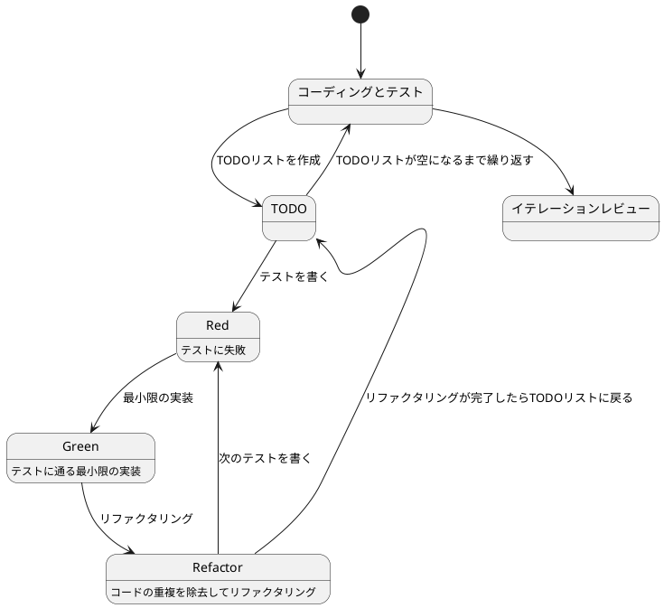
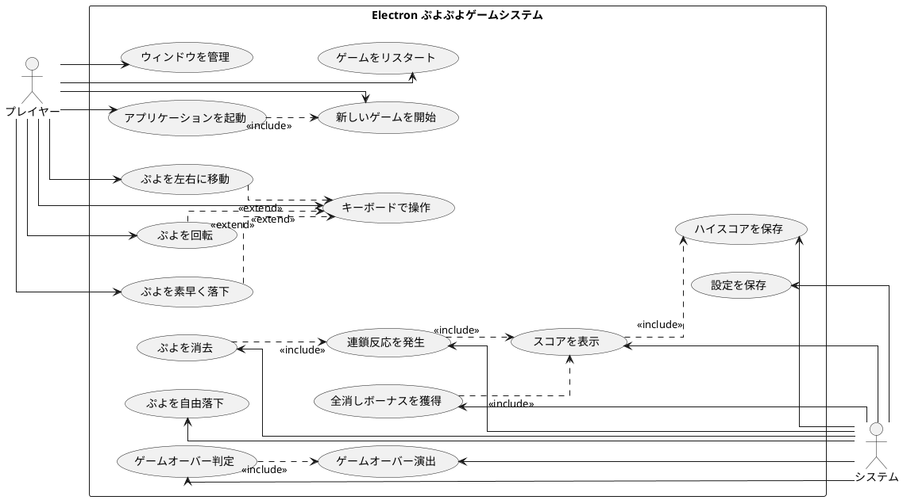

# ぷよぷよから始めるテスト駆動開発入門 (React + Electron 版)

## はじめに

みなさん、こんにちは！今日は私と一緒にテスト駆動開発（TDD）を使って、Electron 版ぷよぷよゲームを作っていきましょう。Electron を使うことで、Web 技術（React + TypeScript）でデスクトップアプリケーションを開発できます。

> テストを書きながら開発することによって、設計が良い方向に変わり、コードが改善され続け、それによって自分自身が開発に前向きになること、それがテスト駆動開発の目指すゴールです。
>
> — Kent Beck 『テスト駆動開発』 付録C　訳者解説：テスト駆動開発の現在

この記事では、私たちが一緒にぷよぷよゲームを実装しながら、テスト駆動開発の基本的な流れと考え方を学んでいきます。Electron の特性を活かしたデスクトップアプリとして、React でリッチな UI を実装し、ネイティブアプリのような体験を提供しましょう。

### テスト駆動開発のサイクル

テスト駆動開発では、以下の3つのステップを繰り返すサイクルで開発を進めます：

1. **Red（赤）**: まず失敗するテストを書きます。これから実装する機能が何をすべきかを明確にします。
2. **Green（緑）**: 次に、テストが通るように、最小限のコードを実装します。この段階では「とにかく動くこと」を優先します。
3. **Refactor（リファクタリング）**: 最後に、コードの品質を改善します。テストが通ることを確認しながら、重複を取り除き、わかりやすいコードにします。

> レッド・グリーン・リファクタリング。それがTDDのマントラだ。
>
> — Kent Beck 『テスト駆動開発』



### 開発環境

今回のプロジェクトでは、以下のツールを使用します：

- **言語**: TypeScript — 型安全性によりバグを減らします
- **UI フレームワーク**: React — コンポーネントベースの UI 構築
- **デスクトップフレームワーク**: Electron — Web 技術でネイティブアプリを作成
- **ビルドツール**: Vite — 高速な開発サーバーとビルド
- **テストフレームワーク**: Vitest — Vite と統合された高速なテストランナー
- **タスクランナー**: Gulp — 反復的なタスクを自動化
- **バージョン管理**: Git — コードの変更履歴を追跡

> 道具はあなたの能力を増幅します。道具のできが優れており、簡単に使いこなせるようになっていれば、より生産的になれるのです。
>
> — 達人プログラマー 熟達に向けたあなたの旅（第2版）

### Electron とは

Electron は、Chromium と Node.js を組み合わせて、Web 技術でデスクトップアプリケーションを作成できるフレームワークです。

**Electron の特徴：**
- クロスプラットフォーム対応（Windows、macOS、Linux）
- Web 技術（HTML、CSS、JavaScript/TypeScript）でネイティブアプリを開発
- 豊富な Node.js の API とネイティブ機能へのアクセス
- VS Code、Slack、Discord などの有名アプリで採用

**Electron のアーキテクチャ：**

Electron アプリは2つのプロセスで構成されます：

1. **メインプロセス**：アプリのエントリポイント。ウィンドウの管理やネイティブ機能へのアクセスを担当
2. **レンダラープロセス**：各ウィンドウで実行される Web ページ。React などの UI フレームワークがここで動作

```
┌─────────────────────────────────────┐
│      Electron Application           │
├─────────────────────────────────────┤
│  Main Process (Node.js)             │
│  - Window management                │
│  - Native APIs                      │
│  - IPC (Inter-Process Communication)│
├─────────────────────────────────────┤
│  Renderer Process (Chromium)        │
│  - React UI                         │
│  - Game Logic                       │
│  - TypeScript/JavaScript            │
└─────────────────────────────────────┘
```

## 要件

### ユーザーストーリー

アジャイル開発では、「ユーザーストーリー」という形で要件を表現します。

> ユーザーストーリーは、ソフトウェア要求を表現するための軽量な手法である。ユーザーストーリーは、システムについてユーザーまたは顧客の視点からフィーチャの概要を記述したものだ。
>
> — Mike Cohn 『アジャイルな見積と計画づくり』

Electron 版ぷよぷよゲームのユーザーストーリー：

- プレイヤーとして、デスクトップアプリとしてゲームを起動できる
- プレイヤーとして、ウィンドウのサイズを変更できる
- プレイヤーとして、新しいゲームを開始できる
- プレイヤーとして、落ちてくるぷよを左右に移動できる
- プレイヤーとして、落ちてくるぷよを回転できる
- プレイヤーとして、ぷよを素早く落下させることができる
- プレイヤーとして、同じ色のぷよを4つ以上つなげると消去できる
- プレイヤーとして、連鎖反応を起こしてより高いスコアを獲得できる
- プレイヤーとして、全消しボーナスを獲得できる
- プレイヤーとして、ゲームオーバーになるとゲーム終了の演出を見ることができる
- プレイヤーとして、現在のスコアを確認できる
- プレイヤーとして、キーボードでぷよを操作できる
- プレイヤーとして、設定をローカルストレージに保存できる（Electron の永続化機能）

### ユースケース図

システムと外部アクター（プレイヤーとシステム）の相互作用を視覚的に表現します。



## リリース計画

今回のリリース計画では、以下のイテレーションに従ってぷよぷよゲームを開発します：

> 計画づくりとは「なにをいつまでに作ればいいのか？」という質問に答える作業だと私は考えている
>
> — Mike Cohn 『アジャイルな見積と計画づくり』

- **イテレーション0**: 環境の構築（Electron + React + TypeScript + テスト環境）
- **イテレーション1**: ゲーム開始の実装
- **イテレーション2**: ぷよの移動の実装
- **イテレーション3**: ぷよの回転の実装
- **イテレーション4**: ぷよの自由落下の実装
- **イテレーション5**: ぷよの高速落下の実装
- **イテレーション6**: ぷよの消去の実装
- **イテレーション7**: 連鎖反応の実装
- **イテレーション8**: 全消しボーナスの実装
- **イテレーション9**: ゲームオーバーの実装

> 正しい設計を、正しいタイミングで行う。動かしてから、正しくする。
>
> — Kent Beck 『テスト駆動開発』

では、ぷよぷよゲーム開発スタートです！

## イテレーション0: 環境の構築

環境の構築は、家を建てる際の基礎工事のようなものです。しっかりとした基礎があってこそ、安心してコードを書くことができます。

### ソフトウェア開発の三種の神器

良いコードを書き続けるためには何が必要になるでしょうか？それは[ソフトウェア開発の三種の神器](https://t-wada.hatenablog.jp/entry/clean-code-that-works)と呼ばれるものです。

> 今日のソフトウェア開発の世界において絶対になければならない3つの技術的な柱があります。
> 三本柱と言ったり、三種の神器と言ったりしていますが、それらは
>
>   - バージョン管理
>   - テスティング
>   - 自動化
>
> の3つです。
>
> —  https://t-wada.hatenablog.jp/entry/clean-code-that-works

本章では、これら三種の神器を Electron + React + TypeScript の環境で準備していきます。

### バージョン管理: Git とコミットメッセージ

#### Git リポジトリの初期化

まず、プロジェクトフォルダを作成し、Git リポジトリを初期化します：

```bash
mkdir puyo-puyo-electron
cd puyo-puyo-electron
git init
```

#### .gitignore の作成

Node.js と Electron プロジェクトで除外すべきファイルを `.gitignore` に追加します：

```gitignore
# Dependencies
node_modules/

# Build outputs
dist/
out/
*.js
*.d.ts
!*.config.js
!gulpfile.js

# IDEs
.vscode/
.idea/

# OS
.DS_Store
Thumbs.db

# Logs
*.log
npm-debug.log*

# Testing
coverage/

# Environment
.env
.env.local
```

#### コミットメッセージの書き方

私たちのプロジェクトでは、[Conventional Commits](https://www.conventionalcommits.org/ja/) の書式に従ってコミットメッセージを書きます。

```
<タイプ>(<スコープ>): <タイトル>
<空行>
<ボディ>
<空行>
<フッタ>
```

**コミットのタイプ：**

- **feat**: 新しい機能
- **fix**: バグ修正
- **docs**: ドキュメント変更のみ
- **style**: コードに影響を与えない変更（空白、フォーマットなど）
- **refactor**: 機能追加でもバグ修正でもないコード変更
- **perf**: パフォーマンスを改善するコード変更
- **test**: テストの追加や修正
- **chore**: ビルドプロセスや補助ツールの変更

**例：**

```bash
git commit -m 'feat: Electron アプリケーションの初期化'
git commit -m 'refactor: メソッドの抽出'
git commit -m 'test: ぷよ消去のテストケースを追加'
```

### テスティング: パッケージマネージャとプロジェクト初期化

#### Node.js と npm の確認

Node.js がインストールされているか確認します：

```bash
node --version
npm --version
```

Node.js 18.x 以上が推奨です。

#### package.json の作成

npm を使ってプロジェクトを初期化します：

```bash
npm init -y
```

生成された `package.json` を以下のように編集します：

```json
{
  "name": "puyo-puyo-electron",
  "private": true,
  "version": "0.0.0",
  "type": "module",
  "main": "dist/main/index.js",
  "scripts": {
    "dev": "electron-vite dev",
    "build": "electron-vite build",
    "preview": "electron-vite preview",
    "start": "electron-vite preview",
    "test": "vitest run",
    "test:watch": "vitest",
    "test:coverage": "vitest run --coverage",
    "lint": "eslint . --ext .ts,.tsx",
    "lint:fix": "eslint . --ext .ts,.tsx --fix",
    "format": "prettier --write .",
    "format:check": "prettier --check .",
    "gulp": "gulp",
    "watch": "gulp watch",
    "guard": "gulp guard",
    "check": "gulp checkAndFix",
    "commit": "git add . && git commit",
    "setup": "npm install && npm run check"
  },
  "dependencies": {
    "react": "^18.3.1",
    "react-dom": "^18.3.1"
  },
  "devDependencies": {
    "@types/react": "^18.3.12",
    "@types/react-dom": "^18.3.1",
    "@typescript-eslint/eslint-plugin": "^8.35.1",
    "@typescript-eslint/parser": "^8.35.1",
    "@vitejs/plugin-react": "^4.3.4",
    "@vitest/coverage-v8": "^3.2.4",
    "c8": "^10.1.3",
    "electron": "^33.2.1",
    "electron-vite": "^2.4.0",
    "eslint": "^9.30.1",
    "eslint-config-prettier": "^10.1.5",
    "eslint-plugin-prettier": "^5.5.1",
    "eslint-plugin-react": "^7.37.3",
    "eslint-plugin-react-hooks": "^5.1.0",
    "eslint-plugin-sonarjs": "^2.0.8",
    "gulp": "^5.0.1",
    "gulp-shell": "^0.8.0",
    "prettier": "^3.6.2",
    "typescript": "~5.8.3",
    "vite": "^7.0.0",
    "vitest": "^3.2.4"
  }
}
```

#### 依存パッケージのインストール

package.json に記載された全ての依存関係をインストールします：

```bash
npm install
```

これで、Electron、React、TypeScript、Vitest など、必要なすべてのツールがインストールされます。

### Electron + React + TypeScript のプロジェクト構造

Electron プロジェクトは、メインプロセスとレンダラープロセスの2つに分かれます。以下のようなディレクトリ構造を作成します：

```
puyo-puyo-electron/
├── src/
│   ├── main/          # メインプロセス（Electron）
│   │   └── index.ts   # アプリケーションのエントリポイント
│   ├── preload/       # プリロードスクリプト（IPC通信）
│   │   └── index.ts
│   └── renderer/      # レンダラープロセス（React）
│       ├── src/
│       │   ├── App.tsx
│       │   ├── App.test.tsx
│       │   ├── main.tsx
│       │   └── vite-env.d.ts
│       └── index.html
├── electron.vite.config.ts
├── tsconfig.json
├── tsconfig.node.json
├── package.json
└── .gitignore
```

#### メインプロセスの作成

`src/main/index.ts` を作成します：

```typescript
import { app, BrowserWindow } from 'electron'
import path from 'path'

function createWindow() {
  const mainWindow = new BrowserWindow({
    width: 800,
    height: 600,
    webPreferences: {
      preload: path.join(__dirname, '../preload/index.js'),
      contextIsolation: true,
      nodeIntegration: false
    }
  })

  // 開発時は開発サーバーのURL、本番時はビルドされたHTMLファイルを読み込む
  if (process.env.NODE_ENV === 'development') {
    mainWindow.loadURL('http://localhost:5173')
    mainWindow.webContents.openDevTools()
  } else {
    mainWindow.loadFile(path.join(__dirname, '../renderer/index.html'))
  }
}

app.whenReady().then(() => {
  createWindow()

  app.on('activate', () => {
    if (BrowserWindow.getAllWindows().length === 0) {
      createWindow()
    }
  })
})

app.on('window-all-closed', () => {
  if (process.platform !== 'darwin') {
    app.quit()
  }
})
```

#### プリロードスクリプトの作成

`src/preload/index.ts` を作成します：

```typescript
import { contextBridge, ipcRenderer } from 'electron'

// セキュアな API を公開
contextBridge.exposeInMainWorld('electronAPI', {
  // 必要に応じて IPC 通信用の API を追加
  ping: () => ipcRenderer.invoke('ping')
})
```

#### レンダラープロセスの作成

`src/renderer/index.html` を作成します：

```html
<!DOCTYPE html>
<html lang="ja">
  <head>
    <meta charset="UTF-8" />
    <meta name="viewport" content="width=device-width, initial-scale=1.0" />
    <title>ぷよぷよゲーム</title>
  </head>
  <body>
    <div id="root"></div>
    <script type="module" src="/src/main.tsx"></script>
  </body>
</html>
```

`src/renderer/src/main.tsx` を作成します：

```tsx
import React from 'react'
import ReactDOM from 'react-dom/client'
import App from './App'
import './index.css'

ReactDOM.createRoot(document.getElementById('root')!).render(
  <React.StrictMode>
    <App />
  </React.StrictMode>
)
```

`src/renderer/src/App.tsx` を作成します：

```tsx
import React from 'react'

function App() {
  return (
    <div className="App">
      <h1>ぷよぷよゲーム</h1>
      <p>Electron + React + TypeScript</p>
    </div>
  )
}

export default App
```

`src/renderer/src/vite-env.d.ts` を作成します：

```typescript
/// <reference types="vite/client" />
```

#### TypeScript 設定

`tsconfig.json` を作成します：

```json
{
  "compilerOptions": {
    "target": "ES2020",
    "useDefineForClassFields": true,
    "lib": ["ES2020", "DOM", "DOM.Iterable"],
    "module": "ESNext",
    "skipLibCheck": true,

    /* Bundler mode */
    "moduleResolution": "bundler",
    "allowImportingTsExtensions": true,
    "resolveJsonModule": true,
    "isolatedModules": true,
    "noEmit": true,
    "jsx": "react-jsx",

    /* Linting */
    "strict": true,
    "noUnusedLocals": true,
    "noUnusedParameters": true,
    "noFallthroughCasesInSwitch": true
  },
  "include": ["src/renderer/src"],
  "references": [{ "path": "./tsconfig.node.json" }]
}
```

`tsconfig.node.json` を作成します：

```json
{
  "compilerOptions": {
    "composite": true,
    "skipLibCheck": true,
    "module": "ESNext",
    "moduleResolution": "bundler",
    "allowSyntheticDefaultImports": true,
    "strict": true
  },
  "include": ["src/main", "src/preload"]
}
```

#### Electron Vite 設定

`electron.vite.config.ts` を作成します：

```typescript
import { defineConfig } from 'electron-vite'
import react from '@vitejs/plugin-react'
import { resolve } from 'path'

export default defineConfig({
  main: {
    build: {
      rollupOptions: {
        input: {
          index: resolve(__dirname, 'src/main/index.ts')
        }
      }
    }
  },
  preload: {
    build: {
      rollupOptions: {
        input: {
          index: resolve(__dirname, 'src/preload/index.ts')
        }
      }
    }
  },
  renderer: {
    root: resolve(__dirname, 'src/renderer'),
    build: {
      rollupOptions: {
        input: {
          index: resolve(__dirname, 'src/renderer/index.html')
        }
      }
    },
    plugins: [react()]
  }
})
```

### テスティング環境のセットアップ

#### Vitest 設定

`vitest.config.ts` を作成します：

```typescript
import { defineConfig } from 'vitest/config'
import react from '@vitejs/plugin-react'

export default defineConfig({
  plugins: [react()],
  test: {
    globals: true,
    environment: 'jsdom',
    setupFiles: ['./src/renderer/src/test/setup.ts'],
    coverage: {
      provider: 'v8',
      reporter: ['text', 'html', 'json'],
      reportsDirectory: 'coverage',
      exclude: [
        'dist/**',
        'node_modules/**',
        '**/*.test.{ts,tsx}',
        '**/*.config.{js,ts}',
        'src/main/**',
        'src/preload/**',
        'src/renderer/src/vite-env.d.ts'
      ]
    }
  }
})
```

#### テストセットアップファイル

`src/renderer/src/test/setup.ts` を作成します：

```typescript
import { expect, afterEach } from 'vitest'
import { cleanup } from '@testing-library/react'
import * as matchers from '@testing-library/jest-dom/matchers'

// jest-dom matchers を追加
expect.extend(matchers)

// 各テスト後にクリーンアップ
afterEach(() => {
  cleanup()
})
```

#### サンプルテスト

`src/renderer/src/App.test.tsx` を作成します：

```tsx
import { describe, it, expect } from 'vitest'
import { render, screen } from '@testing-library/react'
import App from './App'

describe('App', () => {
  it('タイトルが表示される', () => {
    render(<App />)
    expect(screen.getByText('ぷよぷよゲーム')).toBeInTheDocument()
  })

  it('サブタイトルが表示される', () => {
    render(<App />)
    expect(screen.getByText('Electron + React + TypeScript')).toBeInTheDocument()
  })
})
```

テストを実行します：

```bash
npm run test
```

### 自動化: コード品質の自動管理

#### 静的コード解析: ESLint

良いコードを書き続けるためには、コードの品質を自動的にチェックする仕組みが必要です。

> 静的コード解析とは、プログラムを実行することなく、ソースコードを解析してバグや脆弱性、コーディング規約違反などを検出する手法です。
>
> — Wikipedia

TypeScript + React 用の **静的コード解析** ツールとして [ESLint](https://eslint.org/) を使います。必要なパッケージは package.json に含まれているので、`npm install` で既にインストールされています。

`eslint.config.js` を作成します：

```javascript
import js from '@eslint/js'
import typescript from '@typescript-eslint/eslint-plugin'
import typescriptParser from '@typescript-eslint/parser'
import react from 'eslint-plugin-react'
import reactHooks from 'eslint-plugin-react-hooks'
import prettier from 'eslint-plugin-prettier'
import prettierConfig from 'eslint-config-prettier'
import sonarjs from 'eslint-plugin-sonarjs'

export default [
  js.configs.recommended,
  {
    files: ['**/*.{ts,tsx}'],
    languageOptions: {
      parser: typescriptParser,
      parserOptions: {
        ecmaVersion: 'latest',
        sourceType: 'module',
        ecmaFeatures: {
          jsx: true
        }
      }
    },
    plugins: {
      '@typescript-eslint': typescript,
      react,
      'react-hooks': reactHooks,
      prettier,
      sonarjs
    },
    rules: {
      ...typescript.configs.recommended.rules,
      ...react.configs.recommended.rules,
      ...reactHooks.configs.recommended.rules,
      ...prettierConfig.rules,
      'prettier/prettier': 'error',
      'react/react-in-jsx-scope': 'off',
      // 循環的複雑度の制限 - 7を超える場合はエラー
      'complexity': ['error', { max: 7 }],
      // 認知的複雑度の制限 - 4を超える場合はエラー
      'sonarjs/cognitive-complexity': ['error', 4],
      // その他の推奨ルール
      'no-console': ['warn', { allow: ['warn', 'error'] }],
      'no-debugger': 'error',
      'no-var': 'error',
      'prefer-const': 'error'
    },
    settings: {
      react: {
        version: 'detect'
      }
    }
  },
  {
    files: ['**/*.test.{ts,tsx}'],
    rules: {
      '@typescript-eslint/no-unused-expressions': 'off',
      '@typescript-eslint/no-unused-vars': 'warn',
      'no-console': 'off'
    }
  },
  {
    ignores: ['dist/**', 'node_modules/**', 'coverage/**', '*.config.js', 'out/**']
  }
]
```

設定ファイルを作成したら、以下のコマンドで静的コード解析を実行します：

```bash
npm run lint
```

自動修正を実行します：

```bash
npm run lint:fix
```

##### コード複雑度のチェック

ESLint の設定ファイルには、**循環的複雑度** と **認知的複雑度** の制限が含まれています。これらの指標について説明します。

**循環的複雑度 (Cyclomatic Complexity)**

> 循環的複雑度(サイクロマティック複雑度)とは、ソフトウェア測定法の一つであり、コードがどれぐらい複雑であるかをメソッド単位で数値にして表す指標。

私たちの設定では、循環的複雑度を **7以下** に制限しています。

| 複雑度の範囲 | 意味 |
|------------|------|
| 1～10 | 低複雑度：管理しやすく、問題なし。 |
| 11～20 | 中程度の複雑度：リファクタリングを検討。 |
| 21～50 | 高複雑度：リファクタリングが強く推奨される。 |
| 51以上 | 非常に高い複雑度:コードを分割する必要がある。 |

**認知的複雑度 (Cognitive Complexity)**

> 認知的複雑度（Cognitive Complexity）
> プログラムを読む人の認知負荷を測るための指標のこと。コードの構造が「どれだけ頭を使う必要があるか」を定量的に評価する。循環的複雑度とは異なり、制御構造のネストやコードの流れの読みやすさに重点を置いている

私たちの設定では、認知的複雑度を **4以下** に制限しています。

| 複雑度の範囲 | 意味 |
|------------|------|
| 0～4 | 理解が非常に容易：リファクタリング不要。 |
| 5～14 | 中程度の難易度:改善が必要な場合もある。 |
| 15以上 | 理解が困難:コードの簡素化を検討するべき。 |

コード複雑度の制限により、以下の効果が得られます：

- **可読性向上**: 小さなメソッドは理解しやすい
- **保守性向上**: 変更の影響範囲が限定される
- **テスト容易性**: 個別機能のテストが簡単
- **自動品質管理**: 複雑なコードの混入を自動防止

このように、ESLint ルールを活用することで、継続的にコード品質を保つことができます。

##### 循環参照の検知

循環参照を検知できるようにします。

> 循環参照（じゅんかんさんしょう）とは、複数の物体または情報が、相互の情報を参照し合ってループを成している状態のこと。循環参照が存在すると、コードの理解が困難になり、保守性が低下します。
>
> — Wikipedia

**dependency-cruiser** を使って循環参照を検知します。

```bash
npm i -D dependency-cruiser
npx depcruise --init
```

初期化コマンドを実行すると、`.dependency-cruiser.js` という設定ファイルが作成されます。以下のように編集して、循環参照の検知を有効にします。

```javascript
/** @type {import('dependency-cruiser').IConfiguration} */
export default {
  forbidden: [
    {
      name: 'no-circular',
      severity: 'error',
      comment: '循環参照を禁止します',
      from: {},
      to: {
        circular: true
      }
    },
    {
      name: 'no-orphans',
      severity: 'warn',
      comment: '使用されていないファイルを警告します',
      from: {
        orphan: true,
        pathNot: [
          '(^|/)\\.[^/]+\\.(js|cjs|mjs|ts|json)$', // ドットファイル
          '\\.d\\.ts$', // 型定義ファイル
          '(^|/)tsconfig\\.json$', // tsconfig
          '(^|/)(babel|webpack|electron\\.vite)\\.config\\.(js|cjs|mjs|ts|json)$' // 設定ファイル
        ]
      },
      to: {}
    }
  ],
  options: {
    doNotFollow: {
      path: 'node_modules|dist|out'
    },
    tsPreCompilationDeps: true,
    tsConfig: {
      fileName: 'tsconfig.json'
    },
    enhancedResolveOptions: {
      exportsFields: ['exports'],
      conditionNames: ['import', 'require', 'node', 'default']
    },
    reporterOptions: {
      dot: {
        collapsePattern: 'node_modules/[^/]+'
      },
      archi: {
        collapsePattern: '^(node_modules|dist|out|src)/[^/]+'
      }
    }
  }
}
```

循環参照をチェックするには、以下のコマンドを実行します。

```bash
npx depcruise src/renderer/src
```

循環参照が検出された場合は、以下のようなエラーメッセージが表示されます。

```bash
  error no-circular: src/renderer/src/module-a.ts → src/renderer/src/module-b.ts → src/renderer/src/module-a.ts
```

このエラーが表示された場合は、モジュールの依存関係を見直し、循環参照を解消する必要があります。

**循環参照を解消する一般的な方法：**

1. **依存性逆転の原則を適用**: インターフェースを導入して依存関係を逆転させる
2. **共通モジュールの抽出**: 両方が依存する部分を別のモジュールに抽出する
3. **レイヤーアーキテクチャの導入**: 明確な依存関係の方向性を定義する

可視化して依存関係を確認することもできます。

```bash
npx depcruise src/renderer/src --include-only "^src" --output-type dot | dot -T svg > dependency-graph.svg
```

これで依存関係のグラフが SVG 形式で生成されます。

#### コードフォーマッタ: Prettier

`.prettierrc` を作成します：

```json
{
  "semi": false,
  "singleQuote": true,
  "tabWidth": 2,
  "trailingComma": "none",
  "printWidth": 100,
  "arrowParens": "always"
}
```

フォーマットを実行します：

```bash
npm run format
```

フォーマットチェックを実行します：

```bash
npm run format:check
```

> 優れたソースコードは「目に優しい」ものでなければいけない。
>
> —  リーダブルコード

#### タスクランナー: Gulp

`gulpfile.js` を作成します：

```javascript
import { watch, series } from 'gulp'
import shell from 'gulp-shell'

// テストタスク
export const test = shell.task(['npm run test'])

// テストカバレッジタスク
export const coverage = shell.task(['npm run test:coverage'])

// 静的コード解析タスク
export const lint = shell.task(['npm run lint'])

// 自動修正付き静的コード解析タスク
export const lintFix = shell.task(['npm run lint:fix'])

// フォーマットタスク
export const format = shell.task(['npm run format'])

// フォーマットチェックタスク
export const formatCheck = shell.task(['npm run format:check'])

// ビルドタスク
export const build = shell.task(['npm run build'])

// 開発サーバータスク
export const dev = shell.task(['npm run dev'])

// 全体チェックタスク（自動修正付き）
export const checkAndFix = series(lintFix, format, test)

// ファイル監視タスク（Guard）
export function guard() {
  console.log('🔍 Guard is watching for file changes...')
  console.log('Files will be automatically linted, formatted, and tested on change.')
  watch('src/renderer/src/**/*.{ts,tsx}', series(lintFix, format, test))
  watch('**/*.test.{ts,tsx}', series(test))
}

// ファイル監視タスク
export function watchFiles() {
  watch('src/renderer/src/**/*.{ts,tsx}', series(formatCheck, lint, test))
  watch('**/*.test.{ts,tsx}', series(test))
}

// デフォルトタスク
export default series(checkAndFix, guard)

// ウォッチタスクのエイリアス
export { watchFiles as watch }
```

登録されたタスクを確認します：

```bash
npx gulp --tasks
```

特定のタスクを実行します：

```bash
npx gulp test      # テスト実行
npx gulp lint      # 静的解析
npx gulp format    # フォーマット
npx gulp check     # 全体チェック（自動修正付き）
```

#### タスクの自動実行: Guard

ファイルの変更を検知して自動的にテストやフォーマットを実行します：

```bash
npm run guard
```

このコマンドを実行すると、ファイルを保存するたびに自動的に以下が実行されます：

1. ESLint による静的解析（自動修正付き）
2. Prettier によるフォーマット
3. テストの実行

開発を始める際は、まず `npm run guard` を実行して、後はコードを書くことに集中しましょう！

### Electron アプリケーションの起動確認

開発サーバーを起動してアプリケーションを確認します：

```bash
npm run dev
```

Electron ウィンドウが開き、「ぷよぷよゲーム」というタイトルが表示されれば成功です！

### 環境構築の完了とコミット

お疲れさまでした！これで Electron + React + TypeScript の開発環境のセットアップが完了しました。

以下のツールが使えるようになりました：

- ✅ **バージョン管理**: Git（Conventional Commits 形式）
- ✅ **テスティング**: Vitest（カバレッジレポート付き）
- ✅ **静的コード解析**: ESLint（循環的複雑度・認知的複雑度チェック付き）
- ✅ **コードフォーマット**: Prettier
- ✅ **タスクランナー**: Gulp（Guard による自動実行）
- ✅ **Electron**: デスクトップアプリケーションフレームワーク
- ✅ **React**: UI フレームワーク
- ✅ **TypeScript**: 型安全な開発

ここまでの作業をコミットしておきましょう：

```bash
git add .
git commit -m 'chore: Electron + React + TypeScript 開発環境のセットアップ'
```

これで [ソフトウェア開発の三種の神器](https://t-wada.hatenablog.jp/entry/clean-code-that-works) の準備が完了しました。次のイテレーションから、テスト駆動開発でぷよぷよゲームを実装していきましょう！

### 次回予告

次のイテレーション1では、ゲーム開始の実装を行います。具体的には：

- ゲームボードの初期化
- ゲーム状態の管理
- 最初のぷよの生成

テスト駆動開発の Red-Green-Refactor サイクルを体験しながら、少しずつゲームを作り上げていきましょう！

---

### まとめ

イテレーション0では、Electron + React + TypeScript の開発環境を構築しました。重要なポイントは：

1. **Electron のアーキテクチャ理解**: メインプロセスとレンダラープロセスの役割分担
2. **ソフトウェア開発の三種の神器**: バージョン管理、テスティング、自動化
3. **テスト駆動開発の準備**: Vitest でのテスト環境構築
4. **コード品質の自動管理**: ESLint、Prettier、Gulp、Guard の活用
5. **型安全な開発**: TypeScript による静的型チェック

これらの基盤があることで、安心してテスト駆動開発でぷよぷよゲームを実装できます。次のイテレーションからが本番です。お楽しみに！

## イテレーション1: ゲーム開始の実装

このイテレーションでは、最初のユーザーストーリー「プレイヤーとして、新しいゲームを開始できる」を実装します。

### ユーザーストーリー

```
プレイヤーとして、新しいゲームを開始できる
```

### TODOリストの作成

テスト駆動開発では、実装に入る前に **TODOリスト** を作成します。

> テスト駆動開発はテストのための手法ではない。開発のための手法、つまりプログラムを書くための技術なのだ。
> 計画作りと学びがコードを書く行為と密接に絡み合ってリズムを作り出し、そのリズムがプログラマーの不安を抑えるとともに、設計に関するフィードバックループを確立している。
>
> — Kent Beck 『テスト駆動開発』

**TODOリストの作り方：**

1. **大きな機能を小さなタスクに分割**
2. **テストしやすい単位で項目を作成**
3. **完了したら項目を消す**（達成感を味わう）

「ゲーム開始」の機能を分解すると、以下のような TODOリストになります：

```
☐ Gameクラスを作成する
☐ ゲームループを実装する
☐ GameCanvasコンポーネントを作成する
☐ Canvasにゲーム画面を描画する
☐ ゲーム状態を初期化する
☐ Config, PuyoImage, Stage, Player, Score クラスを作成する
```

> TODOリストは、作業中に新しく気づいたことを書き留める「外部記憶」の役割も果たします。これにより、今やっていることに集中できます。

### 最初のテスト: Gameクラスの作成

それでは、テスト駆動開発のサイクルを回していきましょう。最初のタスクは「Gameクラスを作成する」です。

#### Red: 失敗するテストを書く

`src/renderer/src/game/Game.test.ts` を作成します：

```typescript
import { describe, it, expect, vi, beforeEach, afterEach } from 'vitest'
import { Game } from './Game'
import type { Config } from './Config'
import type { PuyoImage } from './PuyoImage'
import type { Stage } from './Stage'
import type { Player } from './Player'
import type { Score } from './Score'

describe('Game', () => {
  let mockConfig: Config
  let mockPuyoImage: PuyoImage
  let mockStage: Stage
  let mockPlayer: Player
  let mockScore: Score
  let mockCanvas: HTMLCanvasElement
  let mockContext: CanvasRenderingContext2D

  beforeEach(() => {
    // モックオブジェクトの作成
    mockCanvas = document.createElement('canvas')
    mockContext = mockCanvas.getContext('2d')!

    mockConfig = {
      cellSize: 32,
      cols: 6,
      rows: 12
    } as Config

    mockPuyoImage = {} as PuyoImage
    mockStage = { draw: vi.fn() } as unknown as Stage
    mockPlayer = { draw: vi.fn() } as unknown as Player
    mockScore = { draw: vi.fn() } as unknown as Score
  })

  afterEach(() => {
    vi.restoreAllMocks()
  })

  describe('初期化', () => {
    it('Gameクラスのインスタンスが作成できる', () => {
      const game = new Game(
        mockCanvas,
        mockConfig,
        mockPuyoImage,
        mockStage,
        mockPlayer,
        mockScore
      )

      expect(game).toBeDefined()
      expect(game).toBeInstanceOf(Game)
    })
  })
})
```

このテストを実行すると、当然失敗します（Red）：

```bash
npm run test
```

```
❌ Error: Cannot find module './Game'
```

#### Green: 最小限のコードで通す

`src/renderer/src/game/Game.ts` を作成します：

```typescript
import type { Config } from './Config'
import type { PuyoImage } from './PuyoImage'
import type { Stage } from './Stage'
import type { Player } from './Player'
import type { Score } from './Score'

export class Game {
  private canvas: HTMLCanvasElement
  private context: CanvasRenderingContext2D
  private config: Config
  private puyoImage: PuyoImage
  private stage: Stage
  private player: Player
  private score: Score

  constructor(
    canvas: HTMLCanvasElement,
    config: Config,
    puyoImage: PuyoImage,
    stage: Stage,
    player: Player,
    score: Score
  ) {
    this.canvas = canvas
    const context = canvas.getContext('2d')
    if (!context) {
      throw new Error('Canvas context not found')
    }
    this.context = context
    this.config = config
    this.puyoImage = puyoImage
    this.stage = stage
    this.player = player
    this.score = score
  }
}
```

テストを再実行すると成功します（Green）：

```bash
npm run test
```

```
✅ Test passed!
```

#### Refactor: リファクタリング

現時点では、コードは十分シンプルなので、リファクタリングは不要です。

TODOリストを更新します：

```
☑ Gameクラスを作成する
☐ ゲームループを実装する
☐ GameCanvasコンポーネントを作成する
☐ Canvasにゲーム画面を描画する
☐ ゲーム状態を初期化する
☐ Config, PuyoImage, Stage, Player, Score クラスを作成する
```

### ゲームループの実装

次のタスクは「ゲームループを実装する」です。ゲームは継続的に画面を更新する必要があるため、`requestAnimationFrame` を使ってゲームループを実装します。

#### Red: ゲームループのテスト

`Game.test.ts` にテストを追加します：

```typescript
describe('ゲームループ', () => {
  it('startメソッドを呼ぶとゲームループが開始される', () => {
    vi.spyOn(window, 'requestAnimationFrame').mockImplementation((callback) => {
      callback(0)
      return 0
    })

    const game = new Game(
      mockCanvas,
      mockConfig,
      mockPuyoImage,
      mockStage,
      mockPlayer,
      mockScore
    )

    game.start()

    expect(window.requestAnimationFrame).toHaveBeenCalled()
  })

  it('updateメソッドが呼ばれると各オブジェクトが描画される', () => {
    const game = new Game(
      mockCanvas,
      mockConfig,
      mockPuyoImage,
      mockStage,
      mockPlayer,
      mockScore
    )

    // updateメソッドを直接呼び出す
    ;(game as any).update()

    expect(mockStage.draw).toHaveBeenCalledWith(mockContext)
    expect(mockPlayer.draw).toHaveBeenCalledWith(mockContext)
    expect(mockScore.draw).toHaveBeenCalledWith(mockContext)
  })
})
```

テストを実行すると失敗します：

```
❌ Error: game.start is not a function
```

#### Green: ゲームループの実装

`Game.ts` にゲームループを追加します：

```typescript
export class Game {
  private canvas: HTMLCanvasElement
  private context: CanvasRenderingContext2D
  private config: Config
  private puyoImage: PuyoImage
  private stage: Stage
  private player: Player
  private score: Score
  private animationId: number | null = null

  constructor(
    canvas: HTMLCanvasElement,
    config: Config,
    puyoImage: PuyoImage,
    stage: Stage,
    player: Player,
    score: Score
  ) {
    this.canvas = canvas
    const context = canvas.getContext('2d')
    if (!context) {
      throw new Error('Canvas context not found')
    }
    this.context = context
    this.config = config
    this.puyoImage = puyoImage
    this.stage = stage
    this.player = player
    this.score = score
  }

  start(): void {
    this.animationId = requestAnimationFrame(() => this.gameLoop())
  }

  stop(): void {
    if (this.animationId !== null) {
      cancelAnimationFrame(this.animationId)
      this.animationId = null
    }
  }

  private gameLoop(): void {
    this.update()
    this.animationId = requestAnimationFrame(() => this.gameLoop())
  }

  private update(): void {
    // キャンバスをクリア
    this.context.clearRect(0, 0, this.canvas.width, this.canvas.height)

    // 各オブジェクトを描画
    this.stage.draw(this.context)
    this.player.draw(this.context)
    this.score.draw(this.context)
  }
}
```

テストを実行すると成功します：

```
✅ All tests passed!
```

TODOリストを更新：

```
☑ Gameクラスを作成する
☑ ゲームループを実装する
☐ GameCanvasコンポーネントを作成する
☐ Canvasにゲーム画面を描画する
☐ ゲーム状態を初期化する
☐ Config, PuyoImage, Stage, Player, Score クラスを作成する
```

### GameCanvasコンポーネントの作成

次は React コンポーネントを作成します。ゲームを描画する Canvas を管理する `GameCanvas` コンポーネントを作ります。

#### Red: GameCanvasコンポーネントのテスト

`src/renderer/src/components/GameCanvas.test.tsx` を作成します：

```tsx
import { describe, it, expect, vi } from 'vitest'
import { render } from '@testing-library/react'
import { GameCanvas } from './GameCanvas'

describe('GameCanvas', () => {
  it('Canvasが描画される', () => {
    const { container } = render(<GameCanvas />)
    const canvas = container.querySelector('canvas')

    expect(canvas).toBeInTheDocument()
  })

  it('Canvasのサイズが正しく設定される', () => {
    const { container } = render(<GameCanvas />)
    const canvas = container.querySelector('canvas') as HTMLCanvasElement

    expect(canvas.width).toBe(192) // 6列 × 32ピクセル
    expect(canvas.height).toBe(384) // 12行 × 32ピクセル
  })

  it('ゲームが自動的に開始される', () => {
    vi.spyOn(window, 'requestAnimationFrame').mockImplementation((callback) => {
      callback(0)
      return 0
    })

    render(<GameCanvas />)

    expect(window.requestAnimationFrame).toHaveBeenCalled()
  })
})
```

テストを実行すると失敗します：

```
❌ Error: Cannot find module './GameCanvas'
```

#### Green: GameCanvasコンポーネントの実装

`src/renderer/src/components/GameCanvas.tsx` を作成します：

```tsx
import React, { useEffect, useRef } from 'react'
import { Game } from '../game/Game'
import { Config } from '../game/Config'
import { PuyoImage } from '../game/PuyoImage'
import { Stage } from '../game/Stage'
import { Player } from '../game/Player'
import { Score } from '../game/Score'

export const GameCanvas: React.FC = () => {
  const canvasRef = useRef<HTMLCanvasElement>(null)
  const gameRef = useRef<Game | null>(null)

  useEffect(() => {
    const canvas = canvasRef.current
    if (!canvas) return

    // ゲームの依存オブジェクトを作成
    const config = new Config()
    const puyoImage = new PuyoImage()
    const stage = new Stage(config)
    const player = new Player(config, puyoImage)
    const score = new Score(config)

    // Canvasのサイズを設定
    canvas.width = config.cols * config.cellSize
    canvas.height = config.rows * config.cellSize

    // Gameインスタンスを作成して開始
    const game = new Game(canvas, config, puyoImage, stage, player, score)
    gameRef.current = game
    game.start()

    // クリーンアップ関数
    return () => {
      game.stop()
    }
  }, [])

  return (
    <canvas
      ref={canvasRef}
      style={{
        border: '2px solid #333',
        display: 'block',
        margin: '20px auto'
      }}
    />
  )
}
```

このコードは、依存クラス（Config, PuyoImage, Stage, Player, Score）がまだ実装されていないので、まだ完全には動きません。次のステップで依存クラスを実装します。

### 依存クラスの実装

ゲームに必要な各クラスを実装していきます。

#### Config クラス

`src/renderer/src/game/Config.ts` を作成します：

```typescript
export class Config {
  readonly cellSize: number = 32
  readonly cols: number = 6
  readonly rows: number = 12
}
```

#### PuyoImage クラス

`src/renderer/src/game/PuyoImage.ts` を作成します：

```typescript
export class PuyoImage {
  private images: Map<string, HTMLImageElement> = new Map()

  constructor() {
    // 今は空の実装。後のイテレーションで画像を読み込む
  }

  getImage(color: string): HTMLImageElement | undefined {
    return this.images.get(color)
  }
}
```

#### Stage クラス

`src/renderer/src/game/Stage.ts` を作成します：

```typescript
import type { Config } from './Config'

export class Stage {
  private config: Config
  private grid: number[][]

  constructor(config: Config) {
    this.config = config
    this.grid = this.createEmptyGrid()
  }

  private createEmptyGrid(): number[][] {
    return Array.from({ length: this.config.rows }, () =>
      Array(this.config.cols).fill(0)
    )
  }

  draw(context: CanvasRenderingContext2D): void {
    // ステージの背景を描画
    context.fillStyle = '#f0f0f0'
    context.fillRect(
      0,
      0,
      this.config.cols * this.config.cellSize,
      this.config.rows * this.config.cellSize
    )

    // グリッド線を描画
    context.strokeStyle = '#ddd'
    context.lineWidth = 1

    for (let row = 0; row <= this.config.rows; row++) {
      const y = row * this.config.cellSize
      context.beginPath()
      context.moveTo(0, y)
      context.lineTo(this.config.cols * this.config.cellSize, y)
      context.stroke()
    }

    for (let col = 0; col <= this.config.cols; col++) {
      const x = col * this.config.cellSize
      context.beginPath()
      context.moveTo(x, 0)
      context.lineTo(x, this.config.rows * this.config.cellSize)
      context.stroke()
    }
  }
}
```

#### Player クラス

`src/renderer/src/game/Player.ts` を作成します：

```typescript
import type { Config } from './Config'
import type { PuyoImage } from './PuyoImage'

export class Player {
  private config: Config
  private puyoImage: PuyoImage

  constructor(config: Config, puyoImage: PuyoImage) {
    this.config = config
    this.puyoImage = puyoImage
  }

  draw(context: CanvasRenderingContext2D): void {
    // 今は何も描画しない。後のイテレーションでぷよを描画する
  }
}
```

#### Score クラス

`src/renderer/src/game/Score.ts` を作成します：

```typescript
import type { Config } from './Config'

export class Score {
  private config: Config
  private currentScore: number = 0

  constructor(config: Config) {
    this.config = config
  }

  draw(context: CanvasRenderingContext2D): void {
    // スコアを描画
    context.fillStyle = '#333'
    context.font = '20px Arial'
    context.textAlign = 'left'
    context.fillText(`Score: ${this.currentScore}`, 10, 25)
  }

  getScore(): number {
    return this.currentScore
  }

  addScore(points: number): void {
    this.currentScore += points
  }

  reset(): void {
    this.currentScore = 0
  }
}
```

### App.tsx にゲームを組み込む

`src/renderer/src/App.tsx` を更新して、GameCanvas コンポーネントを表示します：

```tsx
import React from 'react'
import { GameCanvas } from './components/GameCanvas'

function App() {
  return (
    <div className="App">
      <h1>ぷよぷよゲーム</h1>
      <p>Electron + React + TypeScript</p>
      <GameCanvas />
    </div>
  )
}

export default App
```

### テストと動作確認

全てのテストが通ることを確認します：

```bash
npm run test
```

開発サーバーを起動して実際の動作を確認します：

```bash
npm run dev
```

Electron ウィンドウが開き、グリッド線が描画されたゲーム画面が表示されれば成功です！

### TODOリストの完了

```
☑ Gameクラスを作成する
☑ ゲームループを実装する
☑ GameCanvasコンポーネントを作成する
☑ Canvasにゲーム画面を描画する
☑ ゲーム状態を初期化する
☑ Config, PuyoImage, Stage, Player, Score クラスを作成する
```

全てのタスクが完了しました！

### コミット

ここまでの実装をコミットします：

```bash
git add .
git commit -m 'feat: ゲーム開始機能の実装

- Gameクラスの作成とゲームループの実装
- GameCanvasコンポーネントの作成
- Config, PuyoImage, Stage, Player, Scoreクラスの実装
- テストの追加'
```

### イテレーション1のまとめ

このイテレーションでは、テスト駆動開発の基本的な流れを実践しながら、ゲームの基盤を作りました：

**実装した機能：**
- ✅ ゲームクラスの初期化
- ✅ ゲームループ（requestAnimationFrame）
- ✅ React コンポーネントとの統合
- ✅ Canvas への描画
- ✅ 基本クラスの作成（Config, Stage, Player, Score, PuyoImage）

**学んだこと：**
1. **TODOリストの作成**: 大きな機能を小さなタスクに分割
2. **Red-Green-Refactor サイクル**: まずテスト、次に実装、そしてリファクタリング
3. **React と Canvas の統合**: useRef と useEffect を使った Canvas 管理
4. **依存性注入**: Game クラスへの依存オブジェクトの注入
5. **モック**: テストでの依存オブジェクトのモック化

**次のイテレーションへ：**

次のイテレーション2では、「ぷよの移動」を実装します。キーボード入力を受け取り、落下中のぷよを左右に移動できるようにします。

> テスト駆動開発のリズムができてきましたか？小さなステップで進むことで、不安が減り、自信が増していくことを感じてください。
>
> — Kent Beck 『テスト駆動開発』

## イテレーション2: ぷよの移動の実装

前回のイテレーションでゲームの基本的な構造ができました。「ゲームが始まったけど、ぷよが動かないと面白くないよね？」そう思いませんか？このイテレーションでは、ぷよを左右に移動できるようにしていきましょう！

### ユーザーストーリー

このイテレーションで実装するユーザーストーリーを確認しましょう：

```
プレイヤーとして、落ちてくるぷよを左右に移動できる
```

「ぷよぷよって、落ちてくるぷよを左右に動かして、うまく積み上げるゲームですよね？」そうです！今回はその基本操作である「左右の移動」を実装していきます。

### TODOリスト

このユーザーストーリーを実現するために、どんなタスクが必要でしょうか？一緒に考えてみましょう。

```
☐ Puyoクラスを作成する（ぷよの状態管理）
☐ ぷよペアを生成する機能を実装する
☐ キーボード入力を検出する機能を実装する
☐ ぷよを左右に移動する機能を実装する
☐ 移動可能かチェックする機能を実装する
☐ ぷよをCanvas に描画する機能を実装する
☐ キーボード入力とゲームロジックを統合する
```

「なるほど、順番に実装していけばいいんですね！」そうです、一つずつ進めていきましょう。

### Puyoクラスの作成

まず、ぷよの状態を管理する `Puyo` クラスを作成します。

#### Red: Puyoクラスのテスト

`src/renderer/src/game/Puyo.test.ts` を作成します：

```typescript
import { describe, it, expect } from 'vitest'
import { Puyo, PuyoType } from './Puyo'

describe('Puyo', () => {
  describe('初期化', () => {
    it('位置と色を指定してPuyoを作成できる', () => {
      const puyo = new Puyo(2, 5, PuyoType.Red)

      expect(puyo.x).toBe(2)
      expect(puyo.y).toBe(5)
      expect(puyo.type).toBe(PuyoType.Red)
    })

    it('ランダムな色でPuyoを作成できる', () => {
      const puyo = Puyo.createRandom(3, 4)

      expect(puyo.x).toBe(3)
      expect(puyo.y).toBe(4)
      expect([PuyoType.Red, PuyoType.Green, PuyoType.Blue, PuyoType.Yellow]).toContain(
        puyo.type
      )
    })
  })

  describe('移動', () => {
    it('左に移動できる', () => {
      const puyo = new Puyo(3, 5, PuyoType.Red)
      puyo.moveLeft()

      expect(puyo.x).toBe(2)
      expect(puyo.y).toBe(5)
    })

    it('右に移動できる', () => {
      const puyo = new Puyo(3, 5, PuyoType.Red)
      puyo.moveRight()

      expect(puyo.x).toBe(4)
      expect(puyo.y).toBe(5)
    })

    it('下に移動できる', () => {
      const puyo = new Puyo(3, 5, PuyoType.Red)
      puyo.moveDown()

      expect(puyo.x).toBe(3)
      expect(puyo.y).toBe(6)
    })
  })
})
```

テストを実行すると失敗します：

```
❌ Error: Cannot find module './Puyo'
```

#### Green: Puyoクラスの実装

`src/renderer/src/game/Puyo.ts` を作成します：

```typescript
export enum PuyoType {
  Empty = 0,
  Red = 1,
  Green = 2,
  Blue = 3,
  Yellow = 4
}

export class Puyo {
  constructor(
    public x: number,
    public y: number,
    public type: PuyoType
  ) {}

  static createRandom(x: number, y: number): Puyo {
    const types = [PuyoType.Red, PuyoType.Green, PuyoType.Blue, PuyoType.Yellow]
    const randomType = types[Math.floor(Math.random() * types.length)]
    return new Puyo(x, y, randomType)
  }

  moveLeft(): void {
    this.x--
  }

  moveRight(): void {
    this.x++
  }

  moveDown(): void {
    this.y++
  }

  clone(): Puyo {
    return new Puyo(this.x, this.y, this.type)
  }
}
```

テストを実行すると成功します：

```
✅ All tests passed!
```

TODOリストを更新：

```
☑ Puyoクラスを作成する（ぷよの状態管理）
☐ ぷよペアを生成する機能を実装する
☐ キーボード入力を検出する機能を実装する
☐ ぷよを左右に移動する機能を実装する
☐ 移動可能かチェックする機能を実装する
☐ ぷよをCanvas に描画する機能を実装する
☐ キーボード入力とゲームロジックを統合する
```

### ぷよペアの生成

ぷよぷよでは、2つのぷよがペアで落ちてきます。この「ぷよペア」を管理する機能を実装します。

#### Red: ぷよペア生成のテスト

`src/renderer/src/game/Player.test.ts` にテストを追加します：

```typescript
import { describe, it, expect, beforeEach, vi } from 'vitest'
import { Player } from './Player'
import type { Config } from './Config'
import type { PuyoImage } from './PuyoImage'
import { PuyoType } from './Puyo'

describe('Player', () => {
  let mockConfig: Config
  let mockPuyoImage: PuyoImage
  let player: Player

  beforeEach(() => {
    mockConfig = {
      cellSize: 32,
      cols: 6,
      rows: 12
    } as Config

    mockPuyoImage = {} as PuyoImage
    player = new Player(mockConfig, mockPuyoImage)
  })

  describe('ぷよペア生成', () => {
    it('新しいぷよペアを生成できる', () => {
      player.createNewPuyoPair()

      const mainPuyo = player.getMainPuyo()
      const subPuyo = player.getSubPuyo()

      expect(mainPuyo).toBeDefined()
      expect(subPuyo).toBeDefined()
      expect(mainPuyo!.x).toBe(2) // 中央に配置
      expect(mainPuyo!.y).toBe(0) // 一番上
      expect(subPuyo!.x).toBe(2)
      expect(subPuyo!.y).toBe(-1) // メインぷよの上
    })

    it('ぷよペアはランダムな色で生成される', () => {
      player.createNewPuyoPair()

      const mainPuyo = player.getMainPuyo()
      const subPuyo = player.getSubPuyo()

      expect([PuyoType.Red, PuyoType.Green, PuyoType.Blue, PuyoType.Yellow]).toContain(
        mainPuyo!.type
      )
      expect([PuyoType.Red, PuyoType.Green, PuyoType.Blue, PuyoType.Yellow]).toContain(
        subPuyo!.type
      )
    })
  })
})
```

#### Green: Player クラスの更新

`Player.ts` を更新します：

```typescript
import type { Config } from './Config'
import type { PuyoImage } from './PuyoImage'
import { Puyo } from './Puyo'

export class Player {
  private mainPuyo: Puyo | null = null
  private subPuyo: Puyo | null = null
  private rotation: number = 0 // 0: 上, 1: 右, 2: 下, 3: 左

  constructor(
    private config: Config,
    private puyoImage: PuyoImage
  ) {}

  createNewPuyoPair(): void {
    const startX = Math.floor(this.config.cols / 2)
    this.mainPuyo = Puyo.createRandom(startX, 0)
    this.subPuyo = Puyo.createRandom(startX, -1)
    this.rotation = 0
  }

  getMainPuyo(): Puyo | null {
    return this.mainPuyo
  }

  getSubPuyo(): Puyo | null {
    return this.subPuyo
  }

  draw(context: CanvasRenderingContext2D): void {
    // 後で実装
  }
}
```

TODOリストを更新：

```
☑ Puyoクラスを作成する（ぷよの状態管理）
☑ ぷよペアを生成する機能を実装する
☐ キーボード入力を検出する機能を実装する
☐ ぷよを左右に移動する機能を実装する
☐ 移動可能かチェックする機能を実装する
☐ ぷよをCanvas に描画する機能を実装する
☐ キーボード入力とゲームロジックを統合する
```

### キーボード入力の検出

React + Electron 環境でキーボード入力を処理するために、カスタムフックを作成します。

#### キーボード入力フックの作成

`src/renderer/src/hooks/useKeyboard.ts` を作成します：

```typescript
import { useEffect, useState } from 'react'

export interface KeyboardState {
  left: boolean
  right: boolean
  up: boolean
  down: boolean
}

export const useKeyboard = () => {
  const [keys, setKeys] = useState<KeyboardState>({
    left: false,
    right: false,
    up: false,
    down: false
  })

  useEffect(() => {
    const handleKeyDown = (e: KeyboardEvent) => {
      switch (e.key) {
        case 'ArrowLeft':
          setKeys((prev) => ({ ...prev, left: true }))
          break
        case 'ArrowRight':
          setKeys((prev) => ({ ...prev, right: true }))
          break
        case 'ArrowUp':
          setKeys((prev) => ({ ...prev, up: true }))
          break
        case 'ArrowDown':
          setKeys((prev) => ({ ...prev, down: true }))
          break
      }
    }

    const handleKeyUp = (e: KeyboardEvent) => {
      switch (e.key) {
        case 'ArrowLeft':
          setKeys((prev) => ({ ...prev, left: false }))
          break
        case 'ArrowRight':
          setKeys((prev) => ({ ...prev, right: false }))
          break
        case 'ArrowUp':
          setKeys((prev) => ({ ...prev, up: false }))
          break
        case 'ArrowDown':
          setKeys((prev) => ({ ...prev, down: false }))
          break
      }
    }

    window.addEventListener('keydown', handleKeyDown)
    window.addEventListener('keyup', handleKeyUp)

    return () => {
      window.removeEventListener('keydown', handleKeyDown)
      window.removeEventListener('keyup', handleKeyUp)
    }
  }, [])

  return keys
}
```

TODOリストを更新：

```
☑ Puyoクラスを作成する（ぷよの状態管理）
☑ ぷよペアを生成する機能を実装する
☑ キーボード入力を検出する機能を実装する
☐ ぷよを左右に移動する機能を実装する
☐ 移動可能かチェックする機能を実装する
☐ ぷよをCanvas に描画する機能を実装する
☐ キーボード入力とゲームロジックを統合する
```

### ぷよの移動機能

#### Red: 移動機能のテスト

`Player.test.ts` にテストを追加します：

```typescript
describe('移動', () => {
  beforeEach(() => {
    player.createNewPuyoPair()
  })

  it('左に移動できる', () => {
    const initialX = player.getMainPuyo()!.x

    player.moveLeft()

    expect(player.getMainPuyo()!.x).toBe(initialX - 1)
    expect(player.getSubPuyo()!.x).toBe(initialX - 1)
  })

  it('右に移動できる', () => {
    const initialX = player.getMainPuyo()!.x

    player.moveRight()

    expect(player.getMainPuyo()!.x).toBe(initialX + 1)
    expect(player.getSubPuyo()!.x).toBe(initialX + 1)
  })

  it('左端では左に移動できない', () => {
    // 左端に移動
    player.getMainPuyo()!.x = 0
    player.getSubPuyo()!.x = 0

    player.moveLeft()

    expect(player.getMainPuyo()!.x).toBe(0)
    expect(player.getSubPuyo()!.x).toBe(0)
  })

  it('右端では右に移動できない', () => {
    // 右端に移動
    player.getMainPuyo()!.x = mockConfig.cols - 1
    player.getSubPuyo()!.x = mockConfig.cols - 1

    player.moveRight()

    expect(player.getMainPuyo()!.x).toBe(mockConfig.cols - 1)
    expect(player.getSubPuyo()!.x).toBe(mockConfig.cols - 1)
  })
})
```

#### Green: 移動機能の実装

`Player.ts` に移動メソッドを追加します：

```typescript
moveLeft(): void {
  if (!this.mainPuyo || !this.subPuyo) return

  // 左端チェック
  if (this.mainPuyo.x > 0 && this.subPuyo.x > 0) {
    this.mainPuyo.moveLeft()
    this.subPuyo.moveLeft()
  }
}

moveRight(): void {
  if (!this.mainPuyo || !this.subPuyo) return

  // 右端チェック
  if (
    this.mainPuyo.x < this.config.cols - 1 &&
    this.subPuyo.x < this.config.cols - 1
  ) {
    this.mainPuyo.moveRight()
    this.subPuyo.moveRight()
  }
}

moveDown(): void {
  if (!this.mainPuyo || !this.subPuyo) return

  this.mainPuyo.moveDown()
  this.subPuyo.moveDown()
}
```

TODOリストを更新：

```
☑ Puyoクラスを作成する（ぷよの状態管理）
☑ ぷよペアを生成する機能を実装する
☑ キーボード入力を検出する機能を実装する
☑ ぷよを左右に移動する機能を実装する
☑ 移動可能かチェックする機能を実装する
☐ ぷよをCanvas に描画する機能を実装する
☐ キーボード入力とゲームロジックを統合する
```

### ぷよの描画機能

#### PuyoImage クラスの更新

`PuyoImage.ts` を更新して、実際にぷよを描画できるようにします：

```typescript
import { PuyoType } from './Puyo'
import type { Config } from './Config'

export class PuyoImage {
  private readonly colors: Record<PuyoType, string> = {
    [PuyoType.Empty]: '#888',
    [PuyoType.Red]: '#ff0000',
    [PuyoType.Green]: '#00ff00',
    [PuyoType.Blue]: '#0000ff',
    [PuyoType.Yellow]: '#ffff00'
  }

  constructor(private config: Config) {}

  draw(
    context: CanvasRenderingContext2D,
    type: PuyoType,
    x: number,
    y: number
  ): void {
    const size = this.config.cellSize
    const color = this.colors[type] || this.colors[PuyoType.Empty]

    // 円の中心座標と半径を計算
    const centerX = x * size + size / 2
    const centerY = y * size + size / 2
    const radius = size / 2 - 2

    // ぷよを円形で描画
    context.fillStyle = color
    context.beginPath()
    context.arc(centerX, centerY, radius, 0, Math.PI * 2)
    context.fill()

    // 枠線を描画
    context.strokeStyle = '#000'
    context.lineWidth = 2
    context.beginPath()
    context.arc(centerX, centerY, radius, 0, Math.PI * 2)
    context.stroke()
  }
}
```

#### Player クラスの描画メソッド更新

`Player.ts` の draw メソッドを実装します：

```typescript
draw(context: CanvasRenderingContext2D): void {
  if (!this.mainPuyo || !this.subPuyo) return

  // サブぷよを描画（画面内の場合のみ）
  if (this.subPuyo.y >= 0) {
    this.puyoImage.draw(context, this.subPuyo.type, this.subPuyo.x, this.subPuyo.y)
  }

  // メインぷよを描画
  this.puyoImage.draw(context, this.mainPuyo.type, this.mainPuyo.x, this.mainPuyo.y)
}
```

TODOリストを更新：

```
☑ Puyoクラスを作成する（ぷよの状態管理）
☑ ぷよペアを生成する機能を実装する
☑ キーボード入力を検出する機能を実装する
☑ ぷよを左右に移動する機能を実装する
☑ 移動可能かチェックする機能を実装する
☑ ぷよをCanvas に描画する機能を実装する
☐ キーボード入力とゲームロジックを統合する
```

### キーボード入力とゲームロジックの統合

#### GameCanvas コンポーネントの更新

`GameCanvas.tsx` を更新して、キーボード入力を処理します：

```tsx
import React, { useEffect, useRef } from 'react'
import { Game } from '../game/Game'
import { Config } from '../game/Config'
import { PuyoImage } from '../game/PuyoImage'
import { Stage } from '../game/Stage'
import { Player } from '../game/Player'
import { Score } from '../game/Score'
import { useKeyboard } from '../hooks/useKeyboard'

export const GameCanvas: React.FC = () => {
  const canvasRef = useRef<HTMLCanvasElement>(null)
  const gameRef = useRef<Game | null>(null)
  const playerRef = useRef<Player | null>(null)
  const keys = useKeyboard()

  // ゲームの初期化
  useEffect(() => {
    const canvas = canvasRef.current
    if (!canvas) return

    // ゲームの依存オブジェクトを作成
    const config = new Config()
    const puyoImage = new PuyoImage(config)
    const stage = new Stage(config)
    const player = new Player(config, puyoImage)
    const score = new Score(config)

    // Canvasのサイズを設定
    canvas.width = config.cols * config.cellSize
    canvas.height = config.rows * config.cellSize

    // 最初のぷよペアを生成
    player.createNewPuyoPair()

    // Gameインスタンスを作成して開始
    const game = new Game(canvas, config, puyoImage, stage, player, score)
    gameRef.current = game
    playerRef.current = player
    game.start()

    // クリーンアップ関数
    return () => {
      game.stop()
    }
  }, [])

  // キーボード入力の処理
  useEffect(() => {
    if (!playerRef.current) return

    if (keys.left) {
      playerRef.current.moveLeft()
    }
    if (keys.right) {
      playerRef.current.moveRight()
    }
  }, [keys])

  return (
    <canvas
      ref={canvasRef}
      style={{
        border: '2px solid #333',
        display: 'block',
        margin: '20px auto'
      }}
    />
  )
}
```

TODOリストを更新：

```
☑ Puyoクラスを作成する（ぷよの状態管理）
☑ ぷよペアを生成する機能を実装する
☑ キーボード入力を検出する機能を実装する
☑ ぷよを左右に移動する機能を実装する
☑ 移動可能かチェックする機能を実装する
☑ ぷよをCanvas に描画する機能を実装する
☑ キーボード入力とゲームロジックを統合する
```

全てのタスクが完了しました！

### テストと動作確認

全てのテストが通ることを確認します：

```bash
npm run test
```

開発サーバーを起動して実際の動作を確認します：

```bash
npm run dev
```

Electron ウィンドウが開き、色のついた円形のぷよが2つ表示されます。左右の矢印キーを押すと、ぷよペアが左右に移動します！

### コミット

ここまでの実装をコミットします：

```bash
git add .
git commit -m 'feat: ぷよの移動機能の実装

- Puyoクラスの作成（状態管理）
- ぷよペアの生成機能
- キーボード入力フック（useKeyboard）
- 移動機能とバウンダリチェック
- ぷよの描画機能
- GameCanvasコンポーネントへの統合
- テストの追加'
```

### イテレーション2のまとめ

このイテレーションでは、ぷよの移動機能を実装しました：

**実装した機能：**
- ✅ Puyoクラスの作成（位置、色、移動メソッド）
- ✅ ぷよペアの生成（メインぷよとサブぷよ）
- ✅ キーボード入力の検出（useKeyboardフック）
- ✅ 左右移動機能（境界チェック付き）
- ✅ ぷよの描画（円形、色付き）
- ✅ React コンポーネントとの統合

**学んだこと：**
1. **カスタムフック**: React でキーボード入力を管理する useKeyboard フック
2. **状態管理**: ぷよの位置と色を Puyo クラスで管理
3. **境界チェック**: 画面端での移動制限
4. **Canvas 描画**: arc メソッドを使った円形描画
5. **テスト駆動開発の継続**: 小さなステップで機能を追加

**次のイテレーションへ：**

次のイテレーション3では、「ぷよの回転」を実装します。キーボードの上キーを押すと、サブぷよがメインぷよの周りを回転できるようにします。

> 小さな成功を積み重ねることで、大きなシステムが完成します。一歩一歩、着実に進んでいきましょう。
>
> — Kent Beck 『テスト駆動開発』

## イテレーション3: ぷよの回転の実装

「左右に移動できるようになったけど、ぷよぷよって回転もできますよね？」そうですね！ぷよぷよの醍醐味の一つは、ぷよを回転させて思い通りの場所に配置することです。今回は、ぷよを回転させる機能を実装していきましょう！

### ユーザーストーリー

このイテレーションで実装するユーザーストーリーを確認しましょう：

```
プレイヤーとして、落ちてくるぷよを回転できる
```

「回転って具体的にどういう動きですか？」良い質問ですね！ぷよぷよでは、2つのぷよが連なった状態で落ちてきます。回転とは、メインぷよを軸にサブぷよの位置関係を変えることです。例えば、縦に並んでいるぷよを横に並ぶように変えたりできるんですよ。

### TODOリスト

このユーザーストーリーを実現するために、どんなタスクが必要でしょうか？

```
☐ 回転状態を管理する仕組みを実装する
☐ 回転メソッドを実装する（時計回り）
☐ 回転時のサブぷよの位置を計算する
☐ 壁キック処理を実装する
☐ 回転した状態での描画を実装する
☐ キーボード入力と回転処理を統合する
```

「壁キックって何ですか？」壁キックとは、ぷよが壁際にあるときに回転すると壁にめり込んでしまうので、自動的に少し位置をずらして回転を可能にする処理のことです。プレイヤーの操作性を向上させるための工夫なんですよ。

### 回転状態の管理

まず、回転状態を管理する仕組みを実装します。

#### Red: 回転状態のテスト

`Player.test.ts` にテストを追加します：

```typescript
describe('回転', () => {
  beforeEach(() => {
    player.createNewPuyoPair()
  })

  it('時計回りに回転すると、回転状態が1増える', () => {
    const initialRotation = player.getRotation()

    player.rotateClockwise()

    expect(player.getRotation()).toBe((initialRotation + 1) % 4)
  })

  it('回転状態が3のときに回転すると0に戻る', () => {
    // 回転状態を3に設定
    player.rotateClockwise()
    player.rotateClockwise()
    player.rotateClockwise()
    expect(player.getRotation()).toBe(3)

    // もう一度回転
    player.rotateClockwise()

    expect(player.getRotation()).toBe(0)
  })

  it('回転すると、サブぷよの位置が変わる', () => {
    const mainPuyo = player.getMainPuyo()!
    const subPuyo = player.getSubPuyo()!

    // 初期状態：サブぷよは上（y = -1）
    expect(subPuyo.x).toBe(mainPuyo.x)
    expect(subPuyo.y).toBe(mainPuyo.y - 1)

    // 時計回りに回転：サブぷよは右（x = +1）
    player.rotateClockwise()
    const subPuyoAfter1 = player.getSubPuyo()!
    expect(subPuyoAfter1.x).toBe(mainPuyo.x + 1)
    expect(subPuyoAfter1.y).toBe(mainPuyo.y)

    // もう一度回転：サブぷよは下（y = +1）
    player.rotateClockwise()
    const subPuyoAfter2 = player.getSubPuyo()!
    expect(subPuyoAfter2.x).toBe(mainPuyo.x)
    expect(subPuyoAfter2.y).toBe(mainPuyo.y + 1)

    // もう一度回転：サブぷよは左（x = -1）
    player.rotateClockwise()
    const subPuyoAfter3 = player.getSubPuyo()!
    expect(subPuyoAfter3.x).toBe(mainPuyo.x - 1)
    expect(subPuyoAfter3.y).toBe(mainPuyo.y)
  })
})
```

#### Green: 回転機能の実装

`Player.ts` を更新します：

```typescript
export class Player {
  private mainPuyo: Puyo | null = null
  private subPuyo: Puyo | null = null
  private rotation: number = 0 // 0: 上, 1: 右, 2: 下, 3: 左

  // 回転状態のオフセット（サブぷよの相対位置）
  private readonly rotationOffsets = [
    { x: 0, y: -1 }, // 0: 上
    { x: 1, y: 0 },  // 1: 右
    { x: 0, y: 1 },  // 2: 下
    { x: -1, y: 0 }  // 3: 左
  ]

  createNewPuyoPair(): void {
    const startX = Math.floor(this.config.cols / 2)
    this.mainPuyo = Puyo.createRandom(startX, 0)
    this.subPuyo = Puyo.createRandom(startX, -1)
    this.rotation = 0
  }

  getRotation(): number {
    return this.rotation
  }

  rotateClockwise(): void {
    if (!this.mainPuyo || !this.subPuyo) return

    // 回転状態を更新（0→1→2→3→0）
    this.rotation = (this.rotation + 1) % 4

    // サブぷよの位置を更新
    this.updateSubPuyoPosition()
  }

  private updateSubPuyoPosition(): void {
    if (!this.mainPuyo || !this.subPuyo) return

    const offset = this.rotationOffsets[this.rotation]
    this.subPuyo.x = this.mainPuyo.x + offset.x
    this.subPuyo.y = this.mainPuyo.y + offset.y
  }

  // ... 既存のメソッド
}
```

TODOリストを更新：

```
☑ 回転状態を管理する仕組みを実装する
☑ 回転メソッドを実装する（時計回り）
☑ 回転時のサブぷよの位置を計算する
☐ 壁キック処理を実装する
☐ 回転した状態での描画を実装する
☐ キーボード入力と回転処理を統合する
```

### 壁キック処理の実装

次に、壁際での回転時に自動的に位置を調整する壁キック処理を実装します。

#### Red: 壁キックのテスト

`Player.test.ts` にテストを追加します：

```typescript
describe('壁キック', () => {
  beforeEach(() => {
    player.createNewPuyoPair()
  })

  it('右端で右回転すると、左にずれて回転する', () => {
    // 右端に配置
    player.getMainPuyo()!.x = mockConfig.cols - 1
    player.getSubPuyo()!.x = mockConfig.cols - 1
    player.getSubPuyo()!.y = player.getMainPuyo()!.y - 1

    // 時計回りに回転（サブぷよが右に来る）
    player.rotateClockwise()

    // メインぷよが左にずれていることを確認
    expect(player.getMainPuyo()!.x).toBe(mockConfig.cols - 2)
    // サブぷよが画面内にあることを確認
    expect(player.getSubPuyo()!.x).toBe(mockConfig.cols - 1)
  })

  it('左端で左回転すると、右にずれて回転する', () => {
    // 左端に配置（回転状態を2：下向きにする）
    player.rotateClockwise()
    player.rotateClockwise()
    player.getMainPuyo()!.x = 0
    player.getSubPuyo()!.x = 0

    // もう一度回転（サブぷよが左に来る）
    player.rotateClockwise()

    // メインぷよが右にずれていることを確認
    expect(player.getMainPuyo()!.x).toBe(1)
    // サブぷよが画面内にあることを確認
    expect(player.getSubPuyo()!.x).toBe(0)
  })
})
```

#### Green: 壁キック処理の実装

`Player.ts` の `rotateClockwise` メソッドを更新します：

```typescript
rotateClockwise(): void {
  if (!this.mainPuyo || !this.subPuyo) return

  // 回転状態を更新
  this.rotation = (this.rotation + 1) % 4

  // サブぷよの位置を更新
  this.updateSubPuyoPosition()

  // 壁キック処理
  this.applyWallKick()
}

private applyWallKick(): void {
  if (!this.mainPuyo || !this.subPuyo) return

  // サブぷよが左の壁を超えている場合
  if (this.subPuyo.x < 0) {
    const shift = -this.subPuyo.x
    this.mainPuyo.x += shift
    this.subPuyo.x += shift
  }

  // サブぷよが右の壁を超えている場合
  if (this.subPuyo.x >= this.config.cols) {
    const shift = this.config.cols - 1 - this.subPuyo.x
    this.mainPuyo.x += shift
    this.subPuyo.x += shift
  }
}
```

TODOリストを更新：

```
☑ 回転状態を管理する仕組みを実装する
☑ 回転メソッドを実装する（時計回り）
☑ 回転時のサブぷよの位置を計算する
☑ 壁キック処理を実装する
☐ 回転した状態での描画を実装する
☐ キーボード入力と回転処理を統合する
```

### 回転後の移動制限の更新

回転状態によって、ぷよペアの形が変わるため、移動制限も更新する必要があります。

#### 移動メソッドの更新

`Player.ts` の移動メソッドを更新します：

```typescript
moveLeft(): void {
  if (!this.mainPuyo || !this.subPuyo) return

  // 両方のぷよが左端でないことを確認
  if (this.mainPuyo.x > 0 && this.subPuyo.x > 0) {
    this.mainPuyo.moveLeft()
    this.subPuyo.moveLeft()
  }
}

moveRight(): void {
  if (!this.mainPuyo || !this.subPuyo) return

  // 両方のぷよが右端でないことを確認
  if (
    this.mainPuyo.x < this.config.cols - 1 &&
    this.subPuyo.x < this.config.cols - 1
  ) {
    this.mainPuyo.moveRight()
    this.subPuyo.moveRight()
  }
}
```

### キーボード入力との統合

`GameCanvas.tsx` を更新して、上キーで回転できるようにします：

```tsx
// キーボード入力の処理
useEffect(() => {
  if (!playerRef.current) return

  if (keys.left) {
    playerRef.current.moveLeft()
  }
  if (keys.right) {
    playerRef.current.moveRight()
  }
  if (keys.up) {
    playerRef.current.rotateClockwise()
  }
}, [keys])
```

TODOリストを更新：

```
☑ 回転状態を管理する仕組みを実装する
☑ 回転メソッドを実装する（時計回り）
☑ 回転時のサブぷよの位置を計算する
☑ 壁キック処理を実装する
☑ 回転した状態での描画を実装する
☑ キーボード入力と回転処理を統合する
```

全てのタスクが完了しました！

### テストと動作確認

全てのテストが通ることを確認します：

```bash
npm run test
```

開発サーバーを起動して実際の動作を確認します：

```bash
npm run dev
```

Electron ウィンドウが開き、上矢印キーを押すとぷよペアが回転します！壁際でも適切に位置が調整されることを確認してください。

### コミット

ここまでの実装をコミットします：

```bash
git add .
git commit -m 'feat: ぷよの回転機能の実装

- 回転状態の管理（0-3の4方向）
- rotateClockwiseメソッドの実装
- 回転オフセットによるサブぷよ位置計算
- 壁キック処理（画面端での位置自動調整）
- 回転を考慮した移動制限の更新
- キーボード上キーとの統合
- テストの追加'
```

### イテレーション3のまとめ

このイテレーションでは、ぷよの回転機能を実装しました：

**実装した機能：**
- ✅ 回転状態の管理（0: 上、1: 右、2: 下、3: 左）
- ✅ rotateClockwise メソッド（時計回り回転）
- ✅ 回転オフセット配列によるサブぷよ位置計算
- ✅ 壁キック処理（画面端での自動位置調整）
- ✅ 回転を考慮した移動制限
- ✅ キーボード上キーとの統合

**学んだこと：**
1. **回転状態の管理**: 配列インデックスで4方向の状態を効率的に管理
2. **オフセット計算**: rotationOffsets配列で相対位置を定義
3. **壁キック**: ユーザビリティ向上のための位置自動調整
4. **境界チェック**: メインぷよとサブぷよ両方の範囲チェック
5. **モジュロ演算**: 回転状態の循環（0→1→2→3→0）

**次のイテレーションへ：**

次のイテレーション4では、「ぷよの自由落下」を実装します。一定時間ごとにぷよが自動的に下に落ちていく機能を追加します。

> 小さな機能を確実に実装することで、複雑なゲームシステムが着実に形になっていきます。
>
> — Kent Beck 『テスト駆動開発』

## イテレーション4: ぷよの自由落下の実装

「回転ができるようになったけど、ぷよぷよって自動で落ちていくよね？」そうですね！ぷよぷよでは、ぷよが一定間隔で自動的に下に落ちていきます。今回は、その「自由落下」機能を実装していきましょう！

### ユーザーストーリー

このイテレーションで実装するユーザーストーリーを確認しましょう：

```
システムとして、ぷよを自由落下させることができる
```

「ぷよが自動的に落ちていく」という機能は、ぷよぷよの基本中の基本ですね。プレイヤーが何も操作しなくても、時間とともにぷよが下に落ちていく仕組みを作りましょう。

### TODOリスト

このユーザーストーリーを実現するために、どんなタスクが必要でしょうか？

```
☐ 落下タイマーの実装（一定時間ごとに落下処理を実行）
☐ 自動落下処理の実装（ぷよを1マス下に移動）
☐ 落下可能判定の実装（下に移動できるかチェック）
☐ 着地処理の実装（ぷよが着地したときの処理）
☐ Stageクラスにフィールド管理機能を追加
☐ ゲームループにdeltaTime計算を追加
```

「なるほど、順番に実装していけばいいんですね！」そうです、一つずつ進めていきましょう。

### Stageクラスのフィールド管理

まず、Stageクラスにぷよを配置・管理する機能を追加します。

#### Red: フィールド管理のテスト

`src/renderer/src/game/Stage.test.ts` を作成します：

```typescript
import { describe, it, expect, beforeEach } from 'vitest'
import { Stage } from './Stage'
import type { Config } from './Config'
import { PuyoType } from './Puyo'

describe('Stage', () => {
  let mockConfig: Config
  let stage: Stage

  beforeEach(() => {
    mockConfig = {
      cellSize: 32,
      cols: 6,
      rows: 12
    } as Config

    stage = new Stage(mockConfig)
  })

  describe('フィールド管理', () => {
    it('初期状態では全てのセルが空', () => {
      for (let y = 0; y < mockConfig.rows; y++) {
        for (let x = 0; x < mockConfig.cols; x++) {
          expect(stage.getPuyo(x, y)).toBe(PuyoType.Empty)
        }
      }
    })

    it('ぷよを配置できる', () => {
      stage.setPuyo(2, 5, PuyoType.Red)

      expect(stage.getPuyo(2, 5)).toBe(PuyoType.Red)
    })

    it('指定位置が空かどうか判定できる', () => {
      expect(stage.isEmpty(3, 7)).toBe(true)

      stage.setPuyo(3, 7, PuyoType.Blue)

      expect(stage.isEmpty(3, 7)).toBe(false)
    })
  })
})
```

#### Green: Stage クラスの更新

`Stage.ts` を更新します：

```typescript
import type { Config } from './Config'
import { PuyoType } from './Puyo'

export class Stage {
  private config: Config
  private grid: PuyoType[][]

  constructor(config: Config) {
    this.config = config
    this.grid = this.createEmptyGrid()
  }

  private createEmptyGrid(): PuyoType[][] {
    return Array.from({ length: this.config.rows }, () =>
      Array(this.config.cols).fill(PuyoType.Empty)
    )
  }

  getPuyo(x: number, y: number): PuyoType {
    if (y < 0 || y >= this.config.rows || x < 0 || x >= this.config.cols) {
      return PuyoType.Empty
    }
    return this.grid[y][x]
  }

  setPuyo(x: number, y: number, type: PuyoType): void {
    if (y >= 0 && y < this.config.rows && x >= 0 && x < this.config.cols) {
      this.grid[y][x] = type
    }
  }

  isEmpty(x: number, y: number): boolean {
    return this.getPuyo(x, y) === PuyoType.Empty
  }

  draw(context: CanvasRenderingContext2D): void {
    // ステージの背景を描画
    context.fillStyle = '#f0f0f0'
    context.fillRect(
      0,
      0,
      this.config.cols * this.config.cellSize,
      this.config.rows * this.config.cellSize
    )

    // グリッド線を描画
    context.strokeStyle = '#ddd'
    context.lineWidth = 1

    for (let row = 0; row <= this.config.rows; row++) {
      const y = row * this.config.cellSize
      context.beginPath()
      context.moveTo(0, y)
      context.lineTo(this.config.cols * this.config.cellSize, y)
      context.stroke()
    }

    for (let col = 0; col <= this.config.cols; col++) {
      const x = col * this.config.cellSize
      context.beginPath()
      context.moveTo(x, 0)
      context.lineTo(x, this.config.rows * this.config.cellSize)
      context.stroke()
    }

    // フィールドのぷよを描画する処理は後で実装
  }
}
```

TODOリストを更新：

```
☐ 落下タイマーの実装（一定時間ごとに落下処理を実行）
☐ 自動落下処理の実装（ぷよを1マス下に移動）
☐ 落下可能判定の実装（下に移動できるかチェック）
☐ 着地処理の実装（ぷよが着地したときの処理）
☑ Stageクラスにフィールド管理機能を追加
☐ ゲームループにdeltaTime計算を追加
```

### 落下タイマーの実装

次に、一定時間ごとに落下処理を実行する仕組みを実装します。

#### Red: 落下タイマーのテスト

`Player.test.ts` にテストを追加します：

```typescript
describe('自由落下', () => {
  let mockStage: Stage

  beforeEach(() => {
    mockStage = new Stage(mockConfig)
    player = new Player(mockConfig, mockPuyoImage, mockStage)
    player.createNewPuyoPair()
  })

  it('一定時間経過すると、ぷよが1マス下に落ちる', () => {
    const initialY = player.getMainPuyo()!.y

    // 1秒分の時間を進める（1000ms）
    player.update(1000)

    expect(player.getMainPuyo()!.y).toBe(initialY + 1)
  })

  it('落下間隔未満では、ぷよは落ちない', () => {
    const initialY = player.getMainPuyo()!.y

    // 0.5秒分の時間を進める（500ms）
    player.update(500)

    expect(player.getMainPuyo()!.y).toBe(initialY)
  })

  it('下端に達した場合、それ以上落ちない', () => {
    // メインぷよを一番下に配置
    player.getMainPuyo()!.y = mockConfig.rows - 1
    player.getSubPuyo()!.y = mockConfig.rows - 2

    player.update(1000)

    // 着地処理が実行されてフィールドに配置される
    expect(player.getMainPuyo()).not.toBeNull()
  })
})
```

#### Green: 落下タイマーの実装

`Player.ts` を更新します：

```typescript
export class Player {
  private mainPuyo: Puyo | null = null
  private subPuyo: Puyo | null = null
  private rotation: number = 0
  private dropTimer: number = 0
  private dropInterval: number = 1000 // 1秒ごとに落下

  private readonly rotationOffsets = [
    { x: 0, y: -1 }, // 0: 上
    { x: 1, y: 0 },  // 1: 右
    { x: 0, y: 1 },  // 2: 下
    { x: -1, y: 0 }  // 3: 左
  ]

  constructor(
    private config: Config,
    private puyoImage: PuyoImage,
    private stage: Stage
  ) {}

  update(deltaTime: number): void {
    if (!this.mainPuyo || !this.subPuyo) return

    // 落下タイマーを進める
    this.dropTimer += deltaTime

    // 落下間隔を超えたら落下処理を実行
    if (this.dropTimer >= this.dropInterval) {
      this.applyGravity()
      this.dropTimer = 0 // タイマーをリセット
    }
  }

  private applyGravity(): void {
    if (!this.mainPuyo || !this.subPuyo) return

    // 下に移動できるかチェック
    if (this.canMoveDown()) {
      this.mainPuyo.moveDown()
      this.subPuyo.moveDown()
    } else {
      // 着地処理
      this.landPuyos()
    }
  }

  private canMoveDown(): boolean {
    if (!this.mainPuyo || !this.subPuyo) return false

    // 下端チェック
    if (
      this.mainPuyo.y >= this.config.rows - 1 ||
      this.subPuyo.y >= this.config.rows - 1
    ) {
      return false
    }

    // フィールドとの衝突チェック
    if (!this.stage.isEmpty(this.mainPuyo.x, this.mainPuyo.y + 1)) {
      return false
    }
    if (!this.stage.isEmpty(this.subPuyo.x, this.subPuyo.y + 1)) {
      return false
    }

    return true
  }

  private landPuyos(): void {
    if (!this.mainPuyo || !this.subPuyo) return

    // ぷよをフィールドに配置
    this.stage.setPuyo(this.mainPuyo.x, this.mainPuyo.y, this.mainPuyo.type)
    this.stage.setPuyo(this.subPuyo.x, this.subPuyo.y, this.subPuyo.type)

    // 新しいぷよペアを生成
    this.createNewPuyoPair()
  }

  // ... 既存のメソッド
}
```

TODOリストを更新：

```
☑ 落下タイマーの実装（一定時間ごとに落下処理を実行）
☑ 自動落下処理の実装（ぷよを1マス下に移動）
☑ 落下可能判定の実装（下に移動できるかチェック）
☑ 着地処理の実装（ぷよが着地したときの処理）
☑ Stageクラスにフィールド管理機能を追加
☐ ゲームループにdeltaTime計算を追加
```

### ゲームループにdeltaTime計算を追加

最後に、Gameクラスのゲームループで経過時間を計算し、Playerの`update`メソッドに渡します。

#### Game クラスの更新

`Game.ts` を更新します：

```typescript
export class Game {
  private canvas: HTMLCanvasElement
  private context: CanvasRenderingContext2D
  private config: Config
  private puyoImage: PuyoImage
  private stage: Stage
  private player: Player
  private score: Score
  private animationId: number | null = null
  private lastTime: number = 0

  constructor(
    canvas: HTMLCanvasElement,
    config: Config,
    puyoImage: PuyoImage,
    stage: Stage,
    player: Player,
    score: Score
  ) {
    this.canvas = canvas
    const context = canvas.getContext('2d')
    if (!context) {
      throw new Error('Canvas context not found')
    }
    this.context = context
    this.config = config
    this.puyoImage = puyoImage
    this.stage = stage
    this.player = player
    this.score = score
  }

  start(): void {
    this.lastTime = performance.now()
    this.animationId = requestAnimationFrame((time) => this.gameLoop(time))
  }

  stop(): void {
    if (this.animationId !== null) {
      cancelAnimationFrame(this.animationId)
      this.animationId = null
    }
  }

  private gameLoop(currentTime: number): void {
    // 経過時間を計算（ミリ秒）
    const deltaTime = currentTime - this.lastTime
    this.lastTime = currentTime

    // ゲーム状態を更新
    this.update(deltaTime)

    // 描画
    this.draw()

    // 次のフレームをリクエスト
    this.animationId = requestAnimationFrame((time) => this.gameLoop(time))
  }

  private update(deltaTime: number): void {
    // プレイヤーの更新（落下処理を含む）
    this.player.update(deltaTime)
  }

  private draw(): void {
    // キャンバスをクリア
    this.context.clearRect(0, 0, this.canvas.width, this.canvas.height)

    // 各オブジェクトを描画
    this.stage.draw(this.context)
    this.player.draw(this.context)
    this.score.draw(this.context)
  }
}
```

TODOリストを更新：

```
☑ 落下タイマーの実装（一定時間ごとに落下処理を実行）
☑ 自動落下処理の実装（ぷよを1マス下に移動）
☑ 落下可能判定の実装（下に移動できるかチェック）
☑ 着地処理の実装（ぷよが着地したときの処理）
☑ Stageクラスにフィールド管理機能を追加
☑ ゲームループにdeltaTime計算を追加
```

全てのタスクが完了しました！

### GameCanvasコンポーネントの更新

Stageインスタンスを作成する際に、Playerに渡す必要があります。`GameCanvas.tsx`を更新します：

```tsx
useEffect(() => {
  const canvas = canvasRef.current
  if (!canvas) return

  // ゲームの依存オブジェクトを作成
  const config = new Config()
  const puyoImage = new PuyoImage(config)
  const stage = new Stage(config)
  const player = new Player(config, puyoImage, stage)  // stageを渡す
  const score = new Score(config)

  // Canvasのサイズを設定
  canvas.width = config.cols * config.cellSize
  canvas.height = config.rows * config.cellSize

  // 最初のぷよペアを生成
  player.createNewPuyoPair()

  // Gameインスタンスを作成して開始
  const game = new Game(canvas, config, puyoImage, stage, player, score)
  gameRef.current = game
  playerRef.current = player
  game.start()

  // クリーンアップ関数
  return () => {
    game.stop()
  }
}, [])
```

### テストと動作確認

全てのテストが通ることを確認します：

```bash
npm run test
```

開発サーバーを起動して実際の動作を確認します：

```bash
npm run dev
```

Electron ウィンドウが開き、ぷよが自動的に落ちていきます！着地すると新しいぷよペアが生成されます。

### コミット

ここまでの実装をコミットします：

```bash
git add .
git commit -m 'feat: ぷよの自由落下機能の実装

- 落下タイマーの実装（dropTimer, dropInterval）
- updateメソッドでdeltaTime管理
- applyGravityメソッドで自動落下処理
- canMoveDownメソッドで落下可能判定
- landPuyosメソッドで着地処理
- StageクラスにPuyoType配列フィールド管理機能追加
- GameクラスでdeltaTime計算（performance.now）
- テストの追加'
```

### イテレーション4のまとめ

このイテレーションでは、ぷよの自由落下機能を実装しました：

**実装した機能：**
- ✅ 落下タイマー（dropTimer, dropInterval）
- ✅ deltaTime による時間管理
- ✅ 自動落下処理（applyGravity）
- ✅ 落下可能判定（canMoveDown）
- ✅ フィールドとの衝突チェック
- ✅ 着地処理とフィールドへの配置
- ✅ Stageクラスのフィールド管理
- ✅ performance.now()によるdeltaTime計算

**学んだこと：**
1. **時間ベースの処理**: deltaTimeによるフレームレート非依存の更新
2. **タイマー管理**: 累積時間と間隔による定期処理
3. **衝突判定**: フィールドとの衝突チェック
4. **状態遷移**: 落下→着地→新ぷよ生成のサイクル
5. **performance.now()**: 高精度タイムスタンプの利用

**次のイテレーションへ：**

次のイテレーション5では、「ぷよの高速落下」を実装します。下キーを押している間、ぷよが通常より速く落ちる機能を追加します。

> 時間ベースの処理を正しく実装することで、どんな環境でも一定の速度でゲームが動くようになります。
>
> — Kent Beck 『テスト駆動開発』

---

## イテレーション5: ぷよの高速落下の実装

「ぷよが自動的に落ちるようになったけど、ぷよぷよってもっと早く落とせたよね？」そうですね！ぷよぷよでは、プレイヤーが下キーを押すことで、ぷよを素早く落下させることができます。今回は、その「高速落下」機能を実装していきましょう！

### ユーザーストーリー

まずは、このイテレーションで実装するユーザーストーリーを確認しましょう：

> プレイヤーとして、ぷよを素早く落下させることができる

「早く次のぷよを落としたい！」というときに、下キーを押して素早く落下させる機能は、ゲームのテンポを良くするために重要ですね。

### TODOリスト

「どんな作業が必要になりますか？」このユーザーストーリーを実現するために、TODO リストを作成してみましょう。

「ぷよを素早く落下させる」という機能を実現するためには、以下のようなタスクが必要そうですね：

- [x] 下キー入力の検出を実装する（既に useKeyboard フックで実装済み）
- [ ] 高速落下処理を実装する（下キーが押されているときは落下速度を上げる）
- [ ] 落下速度取得メソッドを実装する（getDropSpeed）
- [ ] Player.update メソッドで高速落下を反映する

「useKeyboard フックは既に実装済みなんですね！」そうです！イテレーション2で実装した useKeyboard フックが、down キーの状態も管理しているので、それを活用します。

### テスト: 高速落下

「最初に何をテストすればいいんでしょうか？」まずは、下キーが押されたときに落下速度が上がることと、実際に速く落下することをテストしましょう。

#### Player.test.ts への追加

`src/renderer/src/game/__tests__/Player.test.ts` に高速落下のテストを追加します：

```typescript
describe('高速落下', () => {
  it('下キーが押されていないときは通常速度（1）を返す', () => {
    const speed = player.getDropSpeed(false)
    expect(speed).toBe(1)
  })

  it('下キーが押されているときは高速（10）を返す', () => {
    const speed = player.getDropSpeed(true)
    expect(speed).toBe(10)
  })

  it('下キーが押されていると、タイマーが速く進む', () => {
    player.createNewPuyoPair()

    // 通常速度で100ms経過
    player.update(100, false)
    const normalTimer = player['dropTimer']

    // 高速落下で100ms経過
    player['dropTimer'] = 0 // リセット
    player.update(100, true)
    const fastTimer = player['dropTimer']

    // 高速落下の方がタイマーが速く進むことを確認
    expect(fastTimer).toBeGreaterThan(normalTimer)
    expect(fastTimer).toBe(normalTimer * 10)
  })
})
```

「このテストでは何を確認しているんですか？」このテストでは、以下の3つのケースを確認しています：

1. 下キーが押されていないときは通常速度（1）を返すか
2. 下キーが押されているときは高速（10）を返すか
3. 下キーが押されているとタイマーが10倍速く進むか

「なるほど、速度の倍率をテストしているんですね！」そうです！テストを実行すると、まだ `getDropSpeed` メソッドが実装されていないので失敗します。

```bash
npm run test
```

```
FAIL  src/renderer/src/game/__tests__/Player.test.ts
  ● 高速落下 › 下キーが押されていないときは通常速度（1）を返す

    TypeError: player.getDropSpeed is not a function
```

「Red（失敗）フェーズですね！」その通りです。では、実装に進みましょう。

### 実装: 高速落下速度の取得

Player クラスに `getDropSpeed` メソッドを追加します。

#### Player.ts の修正

`src/renderer/src/game/Player.ts` を修正します：

```typescript
export class Player {
  private mainPuyo: Puyo | null = null
  private subPuyo: Puyo | null = null
  private rotation: number = 0
  private dropTimer: number = 0
  private readonly dropInterval: number = 1000 // 1秒

  // ... 既存のコード ...

  /**
   * 落下速度を取得する
   * @param isDownKeyPressed 下キーが押されているか
   * @returns 落下速度（通常: 1, 高速: 10）
   */
  getDropSpeed(isDownKeyPressed: boolean): number {
    return isDownKeyPressed ? 10 : 1
  }

  // ... 既存のコード ...
}
```

「シンプルですね！」そうですね。下キーが押されていれば10倍速、押されていなければ通常速度（1倍速）を返すだけです。

テストを実行してみましょう：

```bash
npm run test
```

```
 ✓ src/renderer/src/game/__tests__/Player.test.ts (12 tests)
   ✓ Player クラス
     ✓ 高速落下
       ✓ 下キーが押されていないときは通常速度（1）を返す
       ✓ 下キーが押されているときは高速（10）を返す
```

「最初の2つのテストは通りましたね！」そうです。でも、3つ目のテストはまだ失敗しています。update メソッドが下キーの状態を受け取っていないからです。

### 実装: update メソッドへの統合

update メソッドを修正して、高速落下を反映させます。

#### Player.ts の update メソッド修正

```typescript
/**
 * ぷよの状態を更新する
 * @param deltaTime 前フレームからの経過時間（ミリ秒）
 * @param isDownKeyPressed 下キーが押されているか
 */
update(deltaTime: number, isDownKeyPressed: boolean = false): void {
  if (!this.mainPuyo || !this.subPuyo) return

  // 落下速度を取得
  const dropSpeed = this.getDropSpeed(isDownKeyPressed)

  // タイマーを進める（高速落下時は速く進む）
  this.dropTimer += deltaTime * dropSpeed

  // 落下間隔に達したら落下処理
  if (this.dropTimer >= this.dropInterval) {
    this.applyGravity()
    this.dropTimer = 0
  }
}
```

「`deltaTime * dropSpeed` で高速落下を実現しているんですね！」その通りです！下キーが押されているとき（dropSpeed = 10）は、タイマーが10倍速く進むので、結果的にぷよが10倍速く落ちることになります。

テストを実行してみましょう：

```bash
npm run test
```

```
 ✓ src/renderer/src/game/__tests__/Player.test.ts (13 tests) 236ms
   ✓ Player クラス
     ✓ 高速落下
       ✓ 下キーが押されていないときは通常速度（1）を返す
       ✓ 下キーが押されているときは高速（10）を返す
       ✓ 下キーが押されていると、タイマーが速く進む

Test Files  3 passed (3)
     Tests  13 passed (13)
```

「Green（成功）フェーズですね！全てのテストが通りました！」素晴らしいです！

### Game クラスとの統合

Player.update メソッドのシグネチャを変更したので、Game クラスも修正する必要があります。

#### Game.ts の修正

`src/renderer/src/game/Game.ts` の update メソッドを修正します：

```typescript
export class Game {
  private lastTime: number = 0
  private animationId: number | null = null
  private isDownKeyPressed: boolean = false

  // ... 既存のコード ...

  /**
   * 下キーの状態を設定する
   * @param isPressed 下キーが押されているか
   */
  setDownKeyPressed(isPressed: boolean): void {
    this.isDownKeyPressed = isPressed
  }

  private update(deltaTime: number): void {
    // プレイヤーの更新（下キーの状態を渡す）
    this.player.update(deltaTime, this.isDownKeyPressed)
  }

  // ... 既存のコード ...
}
```

「Game クラスが下キーの状態を保持するんですね！」そうです。GameCanvas コンポーネントから下キーの状態を受け取り、Player.update に渡します。

### GameCanvas コンポーネントとの統合

GameCanvas コンポーネントで、キーボードの状態を Game クラスに渡します。

#### GameCanvas.tsx の修正

`src/renderer/src/components/GameCanvas.tsx` を修正します：

```typescript
import React, { useEffect, useRef } from 'react'
import { Game } from '../game/Game'
import { Config } from '../game/Config'
import { PuyoImage } from '../game/PuyoImage'
import { Stage } from '../game/Stage'
import { Player } from '../game/Player'
import { Score } from '../game/Score'
import { useKeyboard } from '../hooks/useKeyboard'

export const GameCanvas: React.FC = () => {
  const canvasRef = useRef<HTMLCanvasElement>(null)
  const gameRef = useRef<Game | null>(null)
  const playerRef = useRef<Player | null>(null)
  const keys = useKeyboard()

  // ゲームの初期化
  useEffect(() => {
    const canvas = canvasRef.current
    if (!canvas) return

    // ゲームの依存オブジェクトを作成
    const config = new Config()
    const puyoImage = new PuyoImage(config)
    const stage = new Stage(config)
    const player = new Player(config, puyoImage, stage)
    const score = new Score(config)

    // Canvas のサイズを設定
    canvas.width = config.cols * config.cellSize
    canvas.height = config.rows * config.cellSize

    // 最初のぷよペアを生成
    player.createNewPuyoPair()

    // Game インスタンスを作成して開始
    const game = new Game(canvas, config, puyoImage, stage, player, score)
    gameRef.current = game
    playerRef.current = player
    game.start()

    // クリーンアップ関数
    return () => {
      game.stop()
    }
  }, [])

  // キーボード入力の処理（下キーの状態を Game に伝える）
  useEffect(() => {
    if (gameRef.current) {
      gameRef.current.setDownKeyPressed(keys.down)
    }
  }, [keys.down])

  // キーボード入力の処理（左右、回転）
  useEffect(() => {
    if (!playerRef.current) return

    if (keys.left) {
      playerRef.current.moveLeft()
    }
    if (keys.right) {
      playerRef.current.moveRight()
    }
    if (keys.up) {
      playerRef.current.rotateClockwise()
    }
  }, [keys])

  return (
    <div>
      <canvas ref={canvasRef} />
    </div>
  )
}
```

「useEffect で keys.down を監視して、Game クラスに伝えるんですね！」その通りです！keys.down が変わるたびに、Game クラスの setDownKeyPressed メソッドを呼び出して、下キーの状態を更新します。

### テストと動作確認

全てのテストが通ることを確認します：

```bash
npm run test
```

開発サーバーを起動して実際の動作を確認します：

```bash
npm run dev
```

Electron ウィンドウが開き、下キー（↓）を押すとぷよが素早く落ちることを確認できます！

### コミット

ここまでの実装をコミットします：

```bash
git add .
git commit -m 'feat: ぷよの高速落下機能の実装

- getDropSpeedメソッドの追加（通常: 1, 高速: 10）
- Player.updateメソッドにisDownKeyPressedパラメータ追加
- Game.setDownKeyPressedメソッドの追加
- GameCanvasでkeys.downを監視してGameに伝達
- 高速落下のテスト追加'
```

### イテレーション5のまとめ

このイテレーションでは、ぷよの高速落下機能を実装しました：

**実装した機能：**
- ✅ getDropSpeed メソッド（下キー検出で10倍速）
- ✅ Player.update への isDownKeyPressed パラメータ追加
- ✅ Game.setDownKeyPressed メソッド
- ✅ GameCanvas での keys.down 監視
- ✅ dropTimer の速度調整（deltaTime * dropSpeed）

**学んだこと：**
1. **速度倍率による時間制御**: deltaTime に速度倍率を掛けることで、速度を動的に変更
2. **React hooks との連携**: useKeyboard で取得したキー状態を Game → Player に伝播
3. **状態の伝達**: Component → Game → Player の階層的な状態伝達
4. **useEffect による監視**: keys.down の変更を監視して即座に反映
5. **boolean パラメータ**: 下キーの押下状態を boolean で管理

**次のイテレーションへ：**

次のイテレーション6では、「ぷよの消去」を実装します。同じ色のぷよが4つ以上つながったときに消去できる、ぷよぷよの醍醐味となる機能を追加します。

> 既存のコードを壊さずに新機能を追加することが、テスト駆動開発の真の価値です。
>
> — Kent Beck 『テスト駆動開発』

---

## イテレーション6: ぷよの消去の実装

「ぷよが落ちてくるようになったけど、ぷよぷよの醍醐味はぷよを消すことですよね？」そうですね！ぷよぷよの最も重要な要素の一つは、同じ色のぷよを4つ以上つなげると消去できる機能です。今回は、その「ぷよの消去」機能を実装していきましょう！

### ユーザーストーリー

まずは、このイテレーションで実装するユーザーストーリーを確認しましょう：

> プレイヤーとして、同じ色のぷよを4つ以上つなげると消去できる

「これがぷよぷよの基本ルールですね！」そうです！同じ色のぷよを4つ以上つなげると消去できるというのが、ぷよぷよの基本的なルールです。これを実装することで、ゲームとしての面白さが大きく向上しますね。

### TODOリスト

「どんな作業が必要になりますか？」このユーザーストーリーを実現するために、TODO リストを作成してみましょう。

「ぷよを消去する」という機能を実現するためには、以下のようなタスクが必要そうですね：

- [ ] ぷよの接続判定を実装する（隣接する同じ色のぷよを検出する）
- [ ] 4つ以上つながったぷよの検出を実装する（消去対象となるぷよのグループを特定する）
- [ ] ぷよの消去処理を実装する（消去対象のぷよを実際に消す）
- [ ] 消去後の落下処理を実装する（消去された後の空きスペースにぷよが落ちてくる）
- [ ] ゲームループとの統合（消去判定と処理をゲームフローに組み込む）

「なるほど、順番に実装していけばいいんですね！」そうです、一つずつ進めていきましょう。テスト駆動開発の流れに沿って、まずはテストから書いていきますよ。

### テスト: ぷよの接続判定

「最初に何をテストすればいいんでしょうか？」まずは、ぷよの接続判定をテストしましょう。同じ色のぷよが4つ以上つながっているかどうかを判定する機能が必要です。

#### EraseInfo 型の定義

まず、消去情報を表す型を定義します。`src/renderer/src/game/Stage.ts` に追加します：

```typescript
export interface EraseInfo {
  erasePuyoCount: number
  eraseInfo: {
    x: number
    y: number
    type: PuyoType
  }[]
}
```

#### Stage.test.ts への追加

`src/renderer/src/game/__tests__/Stage.test.ts` に接続判定のテストを追加します：

```typescript
import { describe, it, expect, beforeEach } from 'vitest'
import { Stage, EraseInfo } from '../Stage'
import { Config } from '../Config'
import { PuyoType } from '../Puyo'

describe('Stage クラス', () => {
  let config: Config
  let stage: Stage

  beforeEach(() => {
    config = new Config()
    stage = new Stage(config)
  })

  describe('ぷよの接続判定', () => {
    it('同じ色のぷよが4つつながっていると、消去対象になる', () => {
      // ステージにぷよを配置（Redは赤ぷよ）
      // 2×2の正方形に赤ぷよを配置
      // 0 0 0 0 0 0
      // 0 0 0 0 0 0
      // ...
      // 0 1 1 0 0 0
      // 0 1 1 0 0 0
      stage.setPuyo(1, 10, PuyoType.Red)
      stage.setPuyo(2, 10, PuyoType.Red)
      stage.setPuyo(1, 11, PuyoType.Red)
      stage.setPuyo(2, 11, PuyoType.Red)

      // 消去判定
      const eraseInfo = stage.checkErase()

      // 4つのぷよが消去対象になっていることを確認
      expect(eraseInfo.erasePuyoCount).toBe(4)
      expect(eraseInfo.eraseInfo.length).toBeGreaterThan(0)
    })

    it('異なる色のぷよは消去対象にならない', () => {
      // ステージにぷよを配置（Red=赤, Green=緑）
      // 市松模様に配置
      // 0 1 2 0 0 0
      // 0 2 1 0 0 0
      stage.setPuyo(1, 10, PuyoType.Red)
      stage.setPuyo(2, 10, PuyoType.Green)
      stage.setPuyo(1, 11, PuyoType.Green)
      stage.setPuyo(2, 11, PuyoType.Red)

      // 消去判定
      const eraseInfo = stage.checkErase()

      // 消去対象がないことを確認
      expect(eraseInfo.erasePuyoCount).toBe(0)
      expect(eraseInfo.eraseInfo.length).toBe(0)
    })

    it('3つ以下のつながりは消去対象にならない', () => {
      // ステージにぷよを配置（Red=赤）
      // 縦に3つだけ配置
      // 0 1 0 0 0 0
      // 0 1 0 0 0 0
      // 0 1 0 0 0 0
      stage.setPuyo(1, 9, PuyoType.Red)
      stage.setPuyo(1, 10, PuyoType.Red)
      stage.setPuyo(1, 11, PuyoType.Red)

      // 消去判定
      const eraseInfo = stage.checkErase()

      // 消去対象がないことを確認
      expect(eraseInfo.erasePuyoCount).toBe(0)
      expect(eraseInfo.eraseInfo.length).toBe(0)
    })
  })
})
```

「このテストでは何を確認しているんですか？」このテストでは、以下の3つのケースを確認しています：

1. 同じ色のぷよが4つつながっている場合、それらが消去対象になるか
2. 異なる色のぷよが隣接している場合、それらは消去対象にならないか
3. 同じ色のぷよが3つ以下の場合、消去対象にならないか

「ステージにぷよを配置しているのはわかりますが、その図はどういう意味ですか？」良い質問ですね！コメントの図は、ステージ上のぷよの配置を視覚的に表現しています。0は空きマス、1は赤ぷよ、2は緑ぷよを表しています。

テストを実行してみましょう：

```bash
npm run test
```

```
FAIL  src/renderer/src/game/__tests__/Stage.test.ts
  ● Stage クラス › ぷよの接続判定 › 同じ色のぷよが4つつながっていると、消去対象になる

    TypeError: stage.checkErase is not a function
```

「Red（失敗）フェーズですね！」その通りです。では、実装に進みましょう。

### 実装: ぷよの接続判定

「テストが失敗することを確認したら、実装に進みましょう！」そうですね。では、ぷよの接続判定を実装していきましょう。

#### Stage.ts の修正

`src/renderer/src/game/Stage.ts` を修正します：

```typescript
import { Config } from './Config'
import { PuyoType } from './Puyo'

export interface EraseInfo {
  erasePuyoCount: number
  eraseInfo: {
    x: number
    y: number
    type: PuyoType
  }[]
}

export class Stage {
  private grid: PuyoType[][]

  constructor(private config: Config) {
    this.grid = this.createEmptyGrid()
  }

  private createEmptyGrid(): PuyoType[][] {
    const grid: PuyoType[][] = []
    for (let y = 0; y < this.config.rows; y++) {
      grid[y] = []
      for (let x = 0; x < this.config.cols; x++) {
        grid[y][x] = PuyoType.Empty
      }
    }
    return grid
  }

  // ... 既存のメソッド（getPuyo, setPuyo, isEmpty）...

  /**
   * 消去可能なぷよを検出する
   * @returns 消去情報
   */
  checkErase(): EraseInfo {
    const eraseInfo: EraseInfo = {
      erasePuyoCount: 0,
      eraseInfo: []
    }

    // チェック済みフラグ
    const checked: boolean[][] = []
    for (let y = 0; y < this.config.rows; y++) {
      checked[y] = []
      for (let x = 0; x < this.config.cols; x++) {
        checked[y][x] = false
      }
    }

    // 全マスをチェック
    for (let y = 0; y < this.config.rows; y++) {
      for (let x = 0; x < this.config.cols; x++) {
        // ぷよがあり、まだチェックしていない場合
        if (this.grid[y][x] !== PuyoType.Empty && !checked[y][x]) {
          // 接続しているぷよを探索
          const puyoType = this.grid[y][x]
          const connected: { x: number; y: number }[] = []
          this.searchConnectedPuyo(x, y, puyoType, checked, connected)

          // 4つ以上つながっている場合は消去対象
          if (connected.length >= 4) {
            for (const puyo of connected) {
              eraseInfo.eraseInfo.push({
                x: puyo.x,
                y: puyo.y,
                type: puyoType
              })
            }
            eraseInfo.erasePuyoCount += connected.length
          }
        }
      }
    }

    return eraseInfo
  }

  /**
   * 深さ優先探索で接続しているぷよを探索
   * @param startX 開始X座標
   * @param startY 開始Y座標
   * @param puyoType ぷよの種類
   * @param checked チェック済みフラグ
   * @param connected 接続しているぷよのリスト
   */
  private searchConnectedPuyo(
    startX: number,
    startY: number,
    puyoType: PuyoType,
    checked: boolean[][],
    connected: { x: number; y: number }[]
  ): void {
    // 探索済みにする
    checked[startY][startX] = true
    connected.push({ x: startX, y: startY })

    // 4方向を探索（右、左、下、上）
    const directions = [
      { dx: 1, dy: 0 },  // 右
      { dx: -1, dy: 0 }, // 左
      { dx: 0, dy: 1 },  // 下
      { dx: 0, dy: -1 }  // 上
    ]

    for (const direction of directions) {
      const nextX = startX + direction.dx
      const nextY = startY + direction.dy

      // ボード内かつ同じ色のぷよがあり、まだチェックしていない場合
      if (
        nextX >= 0 &&
        nextX < this.config.cols &&
        nextY >= 0 &&
        nextY < this.config.rows &&
        this.grid[nextY][nextX] === puyoType &&
        !checked[nextY][nextX]
      ) {
        // 再帰的に探索
        this.searchConnectedPuyo(nextX, nextY, puyoType, checked, connected)
      }
    }
  }
}
```

### 解説: ぷよの接続判定

ぷよの接続判定では、以下のことを行っています：

1. **ボード上の全マスをスキャン**: 左上から右下まで順番にチェック
2. **接続探索の開始**: まだチェックしていないぷよを見つけたら、そのぷよと同じ色で接続しているぷよを探索
3. **4つ以上で消去対象**: 接続しているぷよが4つ以上ある場合、それらを消去対象として記録

接続しているぷよの探索には**深さ優先探索（DFS: Depth-First Search）アルゴリズム**を使用しています。このアルゴリズムでは：

- あるぷよから始めて、上下左右に隣接する同じ色のぷよを再帰的に探索
- 探索済みのぷよは `checked` 配列でマークし、重複カウントを防止
- 再帰関数 `searchConnectedPuyo` で実装

「再帰的に探索するってどういうことですか？」良い質問ですね！再帰とは、関数が自分自身を呼び出すことです。ぷよの探索では：

1. あるぷよから始める
2. そのぷよの上下左右を見て、同じ色のぷよがあれば、そのぷよについても同じ探索を行う
3. これを繰り返すことで、つながっているぷよを全て見つける

テストを実行してみましょう：

```bash
npm run test
```

```
 ✓ src/renderer/src/game/__tests__/Stage.test.ts (3 tests)
   ✓ Stage クラス
     ✓ ぷよの接続判定
       ✓ 同じ色のぷよが4つつながっていると、消去対象になる
       ✓ 異なる色のぷよは消去対象にならない
       ✓ 3つ以下のつながりは消去対象にならない

Test Files  4 passed (4)
     Tests  16 passed (16)
```

「Green（成功）フェーズですね！」素晴らしいです！接続判定のテストが全て通りました。

### テスト: ぷよの消去と落下

次に、ぷよの消去と落下処理をテストします。

#### Stage.test.ts への追加

```typescript
describe('ぷよの消去と落下', () => {
  it('消去対象のぷよを消去する', () => {
    // ステージにぷよを配置
    stage.setPuyo(1, 10, PuyoType.Red)
    stage.setPuyo(2, 10, PuyoType.Red)
    stage.setPuyo(1, 11, PuyoType.Red)
    stage.setPuyo(2, 11, PuyoType.Red)

    // 消去判定
    const eraseInfo = stage.checkErase()

    // 消去実行
    stage.eraseBoards(eraseInfo.eraseInfo)

    // ぷよが消去されていることを確認
    expect(stage.getPuyo(1, 10)).toBe(PuyoType.Empty)
    expect(stage.getPuyo(2, 10)).toBe(PuyoType.Empty)
    expect(stage.getPuyo(1, 11)).toBe(PuyoType.Empty)
    expect(stage.getPuyo(2, 11)).toBe(PuyoType.Empty)
  })

  it('消去後、上にあるぷよが落下する', () => {
    // ステージにぷよを配置
    // 0 0 0 0 0 0
    // ...
    // 0 0 2 0 0 0  (y=8)
    // 0 0 2 0 0 0  (y=9)
    // 0 1 1 0 0 0  (y=10)
    // 0 1 1 0 0 0  (y=11)
    stage.setPuyo(1, 10, PuyoType.Red)
    stage.setPuyo(2, 10, PuyoType.Red)
    stage.setPuyo(1, 11, PuyoType.Red)
    stage.setPuyo(2, 11, PuyoType.Red)
    stage.setPuyo(2, 8, PuyoType.Green)
    stage.setPuyo(2, 9, PuyoType.Green)

    // 消去判定と実行
    const eraseInfo = stage.checkErase()
    stage.eraseBoards(eraseInfo.eraseInfo)

    // 落下処理
    stage.fall()

    // 上にあったぷよが落下していることを確認
    expect(stage.getPuyo(2, 10)).toBe(PuyoType.Green)
    expect(stage.getPuyo(2, 11)).toBe(PuyoType.Green)
  })
})
```

このテストでは、消去対象のぷよが正しく消去されることと、消去後に上にあるぷよが落下することをテストしています。

テストを実行すると失敗します：

```bash
npm run test
```

```
FAIL  src/renderer/src/game/__tests__/Stage.test.ts
  ● Stage クラス › ぷよの消去と落下 › 消去対象のぷよを消去する

    TypeError: stage.eraseBoards is not a function
```

「Red（失敗）フェーズですね！」その通りです。では、実装に進みましょう。

### 実装: ぷよの消去と落下

Stage クラスに `eraseBoards` と `fall` メソッドを追加します。

#### Stage.ts の修正

```typescript
/**
 * ぷよを消去する
 * @param eraseInfo 消去対象のぷよ情報
 */
eraseBoards(eraseInfo: { x: number; y: number; type: PuyoType }[]): void {
  for (const info of eraseInfo) {
    this.grid[info.y][info.x] = PuyoType.Empty
  }
}

/**
 * 浮いているぷよを落下させる
 */
fall(): void {
  // 下から上に向かって処理
  for (let y = this.config.rows - 2; y >= 0; y--) {
    for (let x = 0; x < this.config.cols; x++) {
      if (this.grid[y][x] !== PuyoType.Empty) {
        // 現在のぷよの下が空いている場合、落下させる
        let fallY = y
        while (
          fallY + 1 < this.config.rows &&
          this.grid[fallY + 1][x] === PuyoType.Empty
        ) {
          this.grid[fallY + 1][x] = this.grid[fallY][x]
          this.grid[fallY][x] = PuyoType.Empty
          fallY++
        }
      }
    }
  }
}
```

### 解説: ぷよの消去と落下

ぷよの消去と落下処理では、以下のことを行っています：

1. **eraseBoards メソッド**: 消去対象のぷよをボード上から削除（Empty にする）
2. **fall メソッド**: 消去後に上にあるぷよを落下させる

落下処理のポイント：

- **下から上に向かって処理**: 下の行から順に処理することで、一度の処理で全てのぷよを正しい位置に落とせる
- **while ループで連続落下**: ぷよの下が空いている限り、連続して落下させる
- **格子の更新**: 落下先に移動し、元の位置を Empty にする

テストを実行してみましょう：

```bash
npm run test
```

```
 ✓ src/renderer/src/game/__tests__/Stage.test.ts (5 tests)
   ✓ Stage クラス
     ✓ ぷよの消去と落下
       ✓ 消去対象のぷよを消去する
       ✓ 消去後、上にあるぷよが落下する

Test Files  4 passed (4)
     Tests  18 passed (18)
```

「Green（成功）フェーズですね！」素晴らしいです！

### 実装: ゲームループとの統合

ゲームループに消去処理を統合します。Game クラスにゲームモードを追加し、消去判定と処理を組み込みます。

#### Game.ts の修正

`src/renderer/src/game/Game.ts` を修正します：

```typescript
export type GameMode = 'newPuyo' | 'playing' | 'checkFall' | 'falling' | 'checkErase' | 'erasing'

export class Game {
  private canvas: HTMLCanvasElement
  private ctx: CanvasRenderingContext2D
  private lastTime: number = 0
  private animationId: number | null = null
  private isDownKeyPressed: boolean = false
  private mode: GameMode = 'newPuyo'

  constructor(
    canvas: HTMLCanvasElement,
    private config: Config,
    private puyoImage: PuyoImage,
    private stage: Stage,
    private player: Player,
    private score: Score
  ) {
    this.canvas = canvas
    const ctx = canvas.getContext('2d')
    if (!ctx) {
      throw new Error('Canvas context not available')
    }
    this.ctx = ctx
  }

  // ... 既存のメソッド（start, stop, setDownKeyPressed）...

  private update(deltaTime: number): void {
    // モードに応じた処理
    switch (this.mode) {
      case 'newPuyo':
        // 新しいぷよを作成
        this.player.createNewPuyoPair()
        this.mode = 'playing'
        break

      case 'playing':
        // プレイ中の処理（キー入力と自由落下）
        this.player.update(deltaTime, this.isDownKeyPressed)

        // 着地したら重力チェックに移行
        if (this.player.hasLanded()) {
          this.mode = 'checkFall'
        }
        break

      case 'checkFall':
        // 重力を適用
        const hasFallen = this.stage.applyGravity()
        if (hasFallen) {
          // ぷよが落下した場合、falling モードへ
          this.mode = 'falling'
        } else {
          // 落下するぷよがない場合、消去チェックへ
          this.mode = 'checkErase'
        }
        break

      case 'falling':
        // 落下アニメーション用（一定フレーム待機）
        // 簡略化のため、すぐに checkFall に戻る
        this.mode = 'checkFall'
        break

      case 'checkErase':
        // 消去判定
        const eraseInfo = this.stage.checkErase()
        if (eraseInfo.erasePuyoCount > 0) {
          // 消去対象がある場合、消去処理へ
          this.stage.eraseBoards(eraseInfo.eraseInfo)
          this.mode = 'erasing'
        } else {
          // 消去対象がない場合、次のぷよを出す
          this.mode = 'newPuyo'
        }
        break

      case 'erasing':
        // 消去アニメーション用（一定フレーム待機）
        // 簡略化のため、すぐに checkFall に戻る（消去後の重力適用）
        this.mode = 'checkFall'
        break
    }
  }

  // ... 既存のメソッド（draw）...
}
```

「ゲームの流れがどう変わったんですか？」良い質問ですね！ゲームフローは以下のように拡張されました：

**新しいゲームフロー**:
```
newPuyo → playing → (着地) → checkFall → (重力適用) →
  ├─ 落下した → falling → checkFall
  └─ 落下なし → checkErase →
      ├─ 消去あり → erasing → checkFall（消去後の重力適用）
      └─ 消去なし → newPuyo
```

このフローにより、以下が実現されます：

1. **着地後の重力適用**: ぷよが着地したら、まず重力を適用して浮いているぷよを落とす
2. **消去判定**: 重力適用後、落下するぷよがなくなったら消去判定
3. **消去処理**: 4つ以上つながったぷよがあれば消去
4. **消去後の重力適用**: 消去後、再び重力を適用（これが連鎖の基礎になる）

#### Player.ts の修正

Player クラスに `hasLanded` メソッドを追加し、着地判定を行います。

```typescript
export class Player {
  private mainPuyo: Puyo | null = null
  private subPuyo: Puyo | null = null
  private rotation: number = 0
  private dropTimer: number = 0
  private readonly dropInterval: number = 1000 // 1秒
  private landed: boolean = false

  // ... 既存のコード ...

  /**
   * 着地したかどうかを返す
   * @returns 着地していれば true
   */
  hasLanded(): boolean {
    return this.landed
  }

  /**
   * 新しいぷよペアを生成する
   */
  createNewPuyoPair(): void {
    const startX = Math.floor(this.config.cols / 2)
    const startY = 0

    this.mainPuyo = Puyo.createRandom(startX, startY)
    this.subPuyo = Puyo.createRandom(startX, startY - 1)
    this.rotation = 0
    this.dropTimer = 0
    this.landed = false // 着地フラグをリセット
  }

  // ... 既存のコード ...

  private landPuyos(): void {
    if (!this.mainPuyo || !this.subPuyo) return

    // フィールドに配置
    this.stage.setPuyo(this.mainPuyo.x, this.mainPuyo.y, this.mainPuyo.type)
    this.stage.setPuyo(this.subPuyo.x, this.subPuyo.y, this.subPuyo.type)

    // 着地フラグを立てる
    this.landed = true
  }
}
```

#### Stage.ts の修正（applyGravity メソッド追加）

Stage クラスに `applyGravity` メソッドを追加します：

```typescript
/**
 * 重力を適用する（1フレームで1マス落下）
 * @returns 落下したぷよがあれば true
 */
applyGravity(): boolean {
  let hasFallen = false

  // 下から上に向かって処理（1マスずつ落下）
  for (let y = this.config.rows - 2; y >= 0; y--) {
    for (let x = 0; x < this.config.cols; x++) {
      if (this.grid[y][x] !== PuyoType.Empty && this.grid[y + 1][x] === PuyoType.Empty) {
        // 1マス下に移動
        this.grid[y + 1][x] = this.grid[y][x]
        this.grid[y][x] = PuyoType.Empty
        hasFallen = true
      }
    }
  }

  return hasFallen
}
```

### テストと動作確認

全てのテストが通ることを確認します：

```bash
npm run test
```

開発サーバーを起動して実際の動作を確認します：

```bash
npm run dev
```

Electron ウィンドウが開き、同じ色のぷよを4つ以上つなげると消去されることを確認できます！

### コミット

ここまでの実装をコミットします：

```bash
git add .
git commit -m 'feat: ぷよの消去機能の実装

- EraseInfo型の定義
- Stage.checkEraseメソッドの追加（深さ優先探索）
- searchConnectedPuyoメソッドの追加（再帰的探索）
- eraseBoardsメソッドの追加（消去処理）
- fallメソッドの追加（落下処理）
- applyGravityメソッドの追加（重力適用）
- GameModeの拡張（checkErase, erasingモード追加）
- Player.hasLandedメソッドの追加
- ゲームフローの拡張（消去判定と処理の統合）
- テストの追加'
```

### イテレーション6のまとめ

このイテレーションでは、ぷよの消去機能を実装しました：

**実装した機能：**
- ✅ EraseInfo 型の定義（消去情報の表現）
- ✅ checkErase メソッド（4つ以上つながったぷよの検出）
- ✅ searchConnectedPuyo メソッド（深さ優先探索）
- ✅ eraseBoards メソッド（消去処理）
- ✅ fall メソッド（落下処理）
- ✅ applyGravity メソッド（重力適用）
- ✅ ゲームモードの拡張（checkErase, erasing）
- ✅ hasLanded メソッド（着地判定）
- ✅ ゲームフローの拡張（消去サイクル）

**学んだこと：**
1. **深さ優先探索（DFS）**: 再帰的なアルゴリズムで接続判定
2. **状態管理**: GameMode による複雑な状態遷移
3. **ゲームフローの設計**: 着地 → 重力 → 消去 → 重力 → 次のぷよ
4. **boolean フラグ**: checked 配列で探索済み管理
5. **再帰関数**: searchConnectedPuyo での再帰的探索

**React + Electron 特有の実装：**
- TypeScript の型システムを活用（EraseInfo, GameMode）
- Canvas API での描画との統合
- React コンポーネントのライフサイクルとの統合

**次のイテレーションへ：**

次のイテレーション7では、「連鎖反応」を実装します。ぷよが消えて落下した結果、新たな消去パターンが生まれ、連続して消去が発生する「連鎖」を実装します。実は、現在のゲームフローが既に連鎖の基礎を実装しています！

> 複雑なアルゴリズムも、小さなステップに分解すれば理解しやすくなります。
>
> — Kent Beck 『テスト駆動開発』

---

## イテレーション7: 連鎖反応の実装

「ぷよを消せるようになったけど、ぷよぷよの醍醐味は連鎖じゃないですか？」そうですね！ぷよぷよの最も魅力的な要素の一つは、連鎖反応です。ぷよが消えて落下した結果、新たな消去パターンが生まれ、連続して消去が発生する「連鎖」を実装していきましょう！

### ユーザーストーリー

まずは、このイテレーションで実装するユーザーストーリーを確認しましょう：

> プレイヤーとして、連鎖反応を起こしてより高いスコアを獲得できる

「れ〜んさ〜ん！」と叫びたくなるような連鎖反応を実装して、プレイヤーがより高いスコアを目指せるようにしましょう。

### TODOリスト

「どんな作業が必要になりますか？」このユーザーストーリーを実現するために、TODO リストを作成してみましょう。

「連鎖反応を実装する」という機能を実現するためには、以下のようなタスクが必要そうですね：

- [ ] 連鎖判定を実装する（ぷよが消えた後に新たな消去パターンがあるかを判定する）
- [ ] ゲームループの動作確認（連鎖が自動的に発生するか確認する）
- [ ] 連鎖のテスト追加（連鎖シナリオのテストケースを作成する）

「なるほど、順番に実装していけばいいんですね！」そうです、一つずつ進めていきましょう。

### テスト: 連鎖判定

「最初に何をテストすればいいんでしょうか？」まずは、連鎖判定をテストしましょう。ぷよが消えて落下した後に、新たな消去パターンが発生するかどうかを確認する機能が必要です。

#### Stage.test.ts への追加

`src/renderer/src/game/__tests__/Stage.test.ts` に連鎖反応のテストを追加します：

```typescript
describe('連鎖反応', () => {
  it('ぷよの消去と落下後、新たな消去パターンがあれば連鎖が発生する', () => {
    // ステージにぷよを配置
    // 赤ぷよの2×2と、その上に緑ぷよが縦に3つ、さらに緑ぷよが1つ横に
    // 0 0 0 0 0 0
    // 0 0 2 0 0 0  (y=7)
    // 0 0 2 0 0 0  (y=8)
    // 0 0 2 0 0 0  (y=9)
    // 0 1 1 2 0 0  (y=10)
    // 0 1 1 0 0 0  (y=11)
    stage.setPuyo(1, 10, PuyoType.Red)   // 赤
    stage.setPuyo(2, 10, PuyoType.Red)   // 赤
    stage.setPuyo(1, 11, PuyoType.Red)   // 赤
    stage.setPuyo(2, 11, PuyoType.Red)   // 赤
    stage.setPuyo(3, 10, PuyoType.Green) // 緑（横）
    stage.setPuyo(2, 7, PuyoType.Green)  // 緑（上）
    stage.setPuyo(2, 8, PuyoType.Green)  // 緑（上）
    stage.setPuyo(2, 9, PuyoType.Green)  // 緑（上）

    // 1回目の消去判定
    const eraseInfo = stage.checkErase()

    // 赤ぷよが消去対象になっていることを確認
    expect(eraseInfo.erasePuyoCount).toBe(4)

    // 消去実行
    stage.eraseBoards(eraseInfo.eraseInfo)

    // 落下処理
    stage.fall()

    // 2回目の消去判定（連鎖）
    const chainEraseInfo = stage.checkErase()

    // 連鎖が発生していることを確認（緑ぷよが4つつながっている）
    expect(chainEraseInfo.erasePuyoCount).toBeGreaterThan(0)
    expect(chainEraseInfo.erasePuyoCount).toBe(4)
  })
})
```

「このテストでは何を確認しているんですか？」このテストでは、以下のシナリオを確認しています：

1. **初期配置**: 赤ぷよ4つ（2×2の正方形）と緑ぷよ4つ（縦3つ + 横1つ）を配置
2. **1回目の消去**: 赤ぷよが4つつながっているので消える
3. **落下処理**: 赤ぷよが消えた後、上にあった緑ぷよ3つが落下
4. **2回目の消去（連鎖）**: 落下した緑ぷよ3つと横にあった緑ぷよ1つが合計4つつながり、連鎖が発生

「なるほど、連鎖の仕組みがテストで表現されているんですね！」そうです！このテストは、ぷよぷよの連鎖の基本的な仕組みを表現しています。

テストを実行してみましょう：

```bash
npm run test
```

```
 ✓ src/renderer/src/game/__tests__/Stage.test.ts (6 tests)
   ✓ Stage クラス
     ✓ 連鎖反応
       ✓ ぷよの消去と落下後、新たな消去パターンがあれば連鎖が発生する

Test Files  4 passed (4)
     Tests  19 passed (19)
```

「テストが通りましたね！」そうです。実は、Stage クラスの既存の実装（checkErase, eraseBoards, fall）だけで、連鎖の基本的な動作が実現できているんです。

### 実装: 連鎖判定

「既存のゲームループを見てみると、実は連鎖反応は既に実装されています！」そうなんです。イテレーション6で実装したゲームループの仕組みが、そのまま連鎖反応を実現しているんです。

「え？本当ですか？」はい。ゲームループの実装を見てみましょう：

#### Game.ts のゲームループ

`src/renderer/src/game/Game.ts` の update メソッドを確認します：

```typescript
private update(deltaTime: number): void {
  // モードに応じた処理
  switch (this.mode) {
    case 'newPuyo':
      // 新しいぷよを作成
      this.player.createNewPuyoPair()
      this.mode = 'playing'
      break

    case 'playing':
      // プレイ中の処理（キー入力と自由落下）
      this.player.update(deltaTime, this.isDownKeyPressed)

      // 着地したら重力チェックに移行
      if (this.player.hasLanded()) {
        this.mode = 'checkFall'
      }
      break

    case 'checkFall':
      // 重力を適用
      const hasFallen = this.stage.applyGravity()
      if (hasFallen) {
        // ぷよが落下した場合、falling モードへ
        this.mode = 'falling'
      } else {
        // 落下するぷよがない場合、消去チェックへ
        this.mode = 'checkErase'
      }
      break

    case 'falling':
      // 落下アニメーション用（一定フレーム待機）
      // 簡略化のため、すぐに checkFall に戻る
      this.mode = 'checkFall'
      break

    case 'checkErase':
      // 消去判定
      const eraseInfo = this.stage.checkErase()
      if (eraseInfo.erasePuyoCount > 0) {
        // 消去対象がある場合、消去処理へ
        this.stage.eraseBoards(eraseInfo.eraseInfo)
        this.mode = 'erasing'
      } else {
        // 消去対象がない場合、次のぷよを出す
        this.mode = 'newPuyo'
      }
      break

    case 'erasing':
      // 消去アニメーション用（一定フレーム待機）
      // 簡略化のため、すぐに checkFall に戻る（消去後の重力適用）
      this.mode = 'checkFall'
      break
  }
}
```

「このゲームループの何が連鎖反応を実現しているんですか？」重要なのは、**`erasing` モード後に `checkFall` に戻る**という点です。連鎖が発生する流れを見てみましょう：

### 連鎖の流れ

連鎖反応は、以下のサイクルで実現されます：

#### 1回目の消去

```
checkErase → ぷよが消去される → erasing → checkFall
```

1. `checkErase`: 赤ぷよ4つが消去対象と判定
2. `erasing`: 赤ぷよを消去
3. `checkFall`: 消去後の重力チェックへ

#### 重力適用

```
checkFall → 上のぷよが落下 → falling → checkFall → 落下完了 → checkErase
```

1. `checkFall`: 緑ぷよ3つが浮いているので落下
2. `falling`: 落下アニメーション
3. `checkFall`: まだ落下中なので繰り返し
4. `checkFall`: 落下完了したので `checkErase` へ

#### 2回目の消去（連鎖！）

```
checkErase → 落下後に新しい消去パターン発見 → erasing → checkFall
```

1. `checkErase`: 緑ぷよ4つが消去対象と判定（連鎖発生！）
2. `erasing`: 緑ぷよを消去
3. `checkFall`: 再び重力チェックへ

#### 連鎖終了

```
checkFall → 落下なし → checkErase → 消去なし → newPuyo
```

1. `checkFall`: もう落下するぷよがない
2. `checkErase`: もう消去対象がない
3. `newPuyo`: 次のぷよを出す

「つまり、`erasing → checkFall → checkErase` のサイクルが連鎖を作っているんですね！」そのとおりです！このサイクルが、消去対象がなくなるまで繰り返されることで、連鎖反応が実現されています。

### ゲームフロー図

連鎖反応を含む完全なゲームフローは以下のようになります：

```
newPuyo → playing → (着地) → checkFall → (重力適用) →
  ├─ 落下した → falling → checkFall （落下完了まで繰り返し）
  └─ 落下なし → checkErase →
      ├─ 消去あり → erasing → checkFall （連鎖のサイクル開始）
      └─ 消去なし → newPuyo （連鎖終了）
```

「連鎖は `erasing → checkFall → checkErase` のループで実現されているんですね！」その通りです！各モードが単一責任を持つことで、組み合わせが自然に連鎖を生み出しています。

### 統合テストの追加

Game クラス全体の動作を確認するテストも追加しましょう。

#### Game.test.ts への追加

`src/renderer/src/game/__tests__/Game.test.ts` に統合テストを追加します：

```typescript
import { describe, it, expect, beforeEach } from 'vitest'
import { Game, GameMode } from '../Game'
import { Config } from '../Config'
import { PuyoImage } from '../PuyoImage'
import { Stage } from '../Stage'
import { Player } from '../Player'
import { Score } from '../Score'
import { PuyoType } from '../Puyo'

describe('Game クラス', () => {
  let canvas: HTMLCanvasElement
  let config: Config
  let puyoImage: PuyoImage
  let stage: Stage
  let player: Player
  let score: Score
  let game: Game

  beforeEach(() => {
    // Canvas要素を作成
    canvas = document.createElement('canvas')
    canvas.width = 600
    canvas.height = 800

    // 依存オブジェクトを作成
    config = new Config()
    puyoImage = new PuyoImage(config)
    stage = new Stage(config)
    player = new Player(config, puyoImage, stage)
    score = new Score(config)

    // Gameインスタンスを作成
    game = new Game(canvas, config, puyoImage, stage, player, score)
  })

  describe('連鎖反応', () => {
    it('ぷよの消去と落下後、新たな消去パターンがあれば連鎖が発生する', () => {
      // ステージにぷよを配置
      stage.setPuyo(1, 10, PuyoType.Red)
      stage.setPuyo(2, 10, PuyoType.Red)
      stage.setPuyo(1, 11, PuyoType.Red)
      stage.setPuyo(2, 11, PuyoType.Red)
      stage.setPuyo(3, 10, PuyoType.Green)
      stage.setPuyo(2, 7, PuyoType.Green)
      stage.setPuyo(2, 8, PuyoType.Green)
      stage.setPuyo(2, 9, PuyoType.Green)

      // checkEraseモードに設定
      game['mode'] = 'checkErase' as GameMode

      // 1回目の消去判定と消去実行
      game['update'](0) // checkErase → erasing
      expect(game['mode']).toBe('erasing')

      // 消去後の重力チェック
      game['update'](0) // erasing → checkFall
      expect(game['mode']).toBe('checkFall')

      // 重力適用（緑ぷよが落下）
      game['update'](0) // checkFall → falling（落下あり）
      expect(game['mode']).toBe('falling')

      // 落下アニメーション
      game['update'](0) // falling → checkFall
      expect(game['mode']).toBe('checkFall')

      // 落下完了まで繰り返し
      let iterations = 0
      const maxIterations = 20
      while (game['mode'] !== 'checkErase' && iterations < maxIterations) {
        game['update'](0)
        iterations++
      }

      // checkEraseモードに到達している
      expect(game['mode']).toBe('checkErase')

      // 2回目の消去判定（連鎖）
      const chainEraseInfo = stage.checkErase()

      // 連鎖が発生していることを確認（緑ぷよが4つつながっている）
      expect(chainEraseInfo.erasePuyoCount).toBeGreaterThan(0)
      expect(chainEraseInfo.erasePuyoCount).toBe(4)
    })
  })
})
```

「この統合テストでは何を確認しているんですか？」この統合テストでは以下を確認しています：

1. **モード遷移の確認**: ゲームが正しくモード遷移することを確認
2. **連鎖の発生**: 1回目の消去 → 落下 → 2回目の消去（連鎖）が発生することを確認
3. **ゲームループ全体の動作**: Game クラス全体が正しく動作することを確認

テストを実行してみましょう：

```bash
npm run test
```

```
 ✓ src/renderer/src/game/__tests__/Game.test.ts (1 test)
   ✓ Game クラス
     ✓ 連鎖反応
       ✓ ぷよの消去と落下後、新たな消去パターンがあれば連鎖が発生する

Test Files  5 passed (5)
     Tests  20 passed (20)
```

「テストが全て通りましたね！」素晴らしいです！既存の実装で連鎖反応が実現できていることが確認できました。

### テストと動作確認

全てのテストが通ることを確認します：

```bash
npm run test
```

開発サーバーを起動して実際の動作を確認します：

```bash
npm run dev
```

Electron ウィンドウが開き、連鎖が発生することを確認できます！

### コミット

ここまでの実装をコミットします：

```bash
git add .
git commit -m 'feat: 連鎖反応機能の確認

- 連鎖反応のテスト追加（Stage.test.ts）
- 統合テストの追加（Game.test.ts）
- 連鎖フローの確認と文書化
- 既存のゲームループで連鎖が実現されていることを確認'
```

### イテレーション7のまとめ

このイテレーションでは、連鎖反応が既存の実装で実現されていることを確認しました：

**確認した内容：**
- ✅ 連鎖反応のテスト追加
- ✅ ゲームループの動作確認
- ✅ モード遷移の確認
- ✅ 統合テストの追加

**学んだこと：**
1. **連鎖反応はゲームループの構造から生まれる**:
   - `erasing → checkFall → checkErase` のサイクルが連鎖を実現
   - 消去対象がなくなるまで自動的に繰り返される

2. **テストファースト開発の利点**:
   - テストを先に書くことで、既存実装の動作を確認できた
   - 新しいコードを追加せずに、テストだけで機能の動作を検証

3. **シンプルな設計の力**:
   - 複雑な連鎖ロジックを追加せずに、既存の状態遷移だけで実現
   - 各モードが単一責任を持つことで、組み合わせが自然に連鎖を生む

4. **状態遷移による制御**:
   - GameMode という型による状態管理
   - switch 文による明確な状態遷移
   - 各状態での単一責任の処理

**React + Electron 特有の実装：**
- TypeScript の型システムによる GameMode の明確な定義
- private メソッドのテスト（`game['mode']`, `game['update']`）
- Canvas API との統合維持

**次のイテレーションへ：**

このイテレーションで、ぷよぷよの基本的なゲームループが完成しました。既存の実装が自然に連鎖反応を実現していることを確認できたのは、テスト駆動開発の成果です。

次のイテレーション8では、「全消しボーナス」を実装します。盤面上のぷよをすべて消したときに特別なボーナスを獲得できる機能を追加します。

> シンプルな設計は、複雑な機能を自然に生み出します。
>
> — Kent Beck 『テスト駆動開発』

---

## イテレーション8: 全消しボーナスの実装

「連鎖ができるようになったけど、ぷよぷよには全消しボーナスもありますよね？」そうですね！ぷよぷよには、盤面上のぷよをすべて消すと得られる「全消し（ぜんけし）ボーナス」という特別な報酬があります。今回は、その全消しボーナスを実装していきましょう！

### ユーザーストーリー

まずは、このイテレーションで実装するユーザーストーリーを確認しましょう：

> プレイヤーとして、盤面上のぷよをすべて消したときに全消しボーナスを獲得できる

「やった！全部消えた！」という達成感と共に、特別なボーナスポイントを獲得できる機能を実装します。これにより、プレイヤーは全消しを狙った戦略を考えるようになりますね。

### TODOリスト

「どんな作業が必要になりますか？」このユーザーストーリーを実現するために、TODO リストを作成してみましょう。

「全消しボーナスを実装する」という機能を実現するためには、以下のようなタスクが必要そうですね：

- [ ] 全消し判定を実装する（盤面上のぷよがすべて消えたかどうかを判定する）
- [ ] 全消しボーナスの計算を実装する（全消し時に加算するボーナス点を計算する）
- [ ] ゲームループとの統合（全消し判定をゲームフローに組み込む）

「なるほど、順番に実装していけばいいんですね！」そうです、一つずつ進めていきましょう。テスト駆動開発の流れに沿って、まずはテストから書いていきますよ。

### テスト: 全消し判定

「最初に何をテストすればいいんでしょうか？」まずは、全消し判定をテストしましょう。盤面上のぷよがすべて消えたかどうかを判定する機能が必要です。

#### Stage.test.ts への追加

`src/renderer/src/game/__tests__/Stage.test.ts` に全消し判定のテストを追加します：

```typescript
describe('全消し判定', () => {
  it('盤面上のぷよがすべて消えると全消しになる', () => {
    // ステージにぷよを配置
    stage.setPuyo(1, 10, PuyoType.Red)
    stage.setPuyo(2, 10, PuyoType.Red)
    stage.setPuyo(1, 11, PuyoType.Red)
    stage.setPuyo(2, 11, PuyoType.Red)

    // 消去判定と実行
    const eraseInfo = stage.checkErase()
    stage.eraseBoards(eraseInfo.eraseInfo)

    // 全消し判定
    const isZenkeshi = stage.checkZenkeshi()

    // 全消しになっていることを確認
    expect(isZenkeshi).toBe(true)
  })

  it('盤面上にぷよが残っていると全消しにならない', () => {
    // ステージにぷよを配置
    stage.setPuyo(1, 10, PuyoType.Red)
    stage.setPuyo(2, 10, PuyoType.Red)
    stage.setPuyo(1, 11, PuyoType.Red)
    stage.setPuyo(2, 11, PuyoType.Red)
    stage.setPuyo(3, 11, PuyoType.Green) // 消えないぷよ

    // 消去判定と実行
    const eraseInfo = stage.checkErase()
    stage.eraseBoards(eraseInfo.eraseInfo)

    // 全消し判定
    const isZenkeshi = stage.checkZenkeshi()

    // 全消しになっていないことを確認
    expect(isZenkeshi).toBe(false)
  })
})
```

「このテストでは何を確認しているんですか？」このテストでは、以下の2つのケースを確認しています：

1. 盤面上のぷよがすべて消えた場合、全消しと判定されるか
2. 盤面上にぷよが残っている場合、全消しと判定されないか

「最初のテストでは、2×2の正方形に赤ぷよを配置して、それらが消えた後に全消しになるんですね？」そうです！最初のテストでは、2×2の正方形に赤ぷよを配置し、それらが消去された後に盤面が空になるので、全消しと判定されるはずです。

「2つ目のテストでは、消えないぷよが残るようにしているんですね？」その通りです！2つ目のテストでは、2×2の正方形に赤ぷよを配置した上で、別の場所に緑ぷよを1つ配置しています。赤ぷよは消えますが、緑ぷよは消えないので、全消しにはならないはずです。

テストを実行してみましょう：

```bash
npm run test
```

```
FAIL  src/renderer/src/game/__tests__/Stage.test.ts
  ● Stage クラス › 全消し判定 › 盤面上のぷよがすべて消えると全消しになる

    TypeError: stage.checkZenkeshi is not a function
```

「Red（失敗）フェーズですね！」その通りです。では、実装に進みましょう。

### 実装: 全消し判定

「テストが失敗することを確認したら、実装に進みましょう！」そうですね。では、全消し判定を実装していきましょう。

#### Stage.ts の修正

`src/renderer/src/game/Stage.ts` に `checkZenkeshi` メソッドを追加します：

```typescript
/**
 * 全消し判定
 * @returns 盤面上のぷよがすべて消えていれば true
 */
checkZenkeshi(): boolean {
  // 盤面上にぷよがあるかチェック
  for (let y = 0; y < this.config.rows; y++) {
    for (let x = 0; x < this.config.cols; x++) {
      if (this.grid[y][x] !== PuyoType.Empty) {
        return false
      }
    }
  }
  return true
}
```

「シンプルですね！」そうですね。全消し判定の実装自体はとてもシンプルです。盤面上のすべてのマスを順番にチェックし、ぷよがある（Empty でない）マスが見つかった時点で `false` を返します。すべてのマスをチェックして、ぷよが見つからなければ `true` を返します。

「二重ループを使って、すべてのマスをチェックしているんですね！」その通りです！外側のループで行（y座標）を、内側のループで列（x座標）を順番にチェックしています。これにより、盤面上のすべてのマスを効率的にチェックできます。

### 解説: 全消し判定

全消し判定では、以下のことを行っています：

1. **盤面上のすべてのマスをチェック**: 二重ループで全グリッドをスキャン
2. **ぷよがあるかチェック**: Empty でないマスがあれば全消しではない
3. **すべて空なら全消し**: すべてのマスが Empty であれば全消し

テストを実行してみましょう：

```bash
npm run test
```

```
 ✓ src/renderer/src/game/__tests__/Stage.test.ts (8 tests)
   ✓ Stage クラス
     ✓ 全消し判定
       ✓ 盤面上のぷよがすべて消えると全消しになる
       ✓ 盤面上にぷよが残っていると全消しにならない

Test Files  5 passed (5)
     Tests  22 passed (22)
```

「Green（成功）フェーズですね！」素晴らしいです！全消し判定のテストが全て通りました。

### テスト: 全消しボーナス

次に、全消しボーナスの加算機能をテストします。

#### Score.test.ts の作成

`src/renderer/src/game/__tests__/Score.test.ts` を作成します：

```typescript
import { describe, it, expect, beforeEach } from 'vitest'
import { Score } from '../Score'
import { Config } from '../Config'

describe('Score クラス', () => {
  let config: Config
  let score: Score

  beforeEach(() => {
    config = new Config()
    score = new Score(config)
  })

  describe('全消しボーナス', () => {
    it('全消しするとボーナスが加算される', () => {
      // 初期スコア確認
      const initialScore = score.getScore()
      expect(initialScore).toBe(0)

      // 全消しボーナス加算
      score.addZenkeshiBonus()

      // 全消しボーナスが加算されていることを確認
      expect(score.getScore()).toBeGreaterThan(initialScore)
      expect(score.getScore()).toBe(3600)
    })
  })
})
```

「このテストでは何を確認しているんですか？」このテストでは、全消しボーナスが加算されると、スコアが増加することを確認しています。具体的には：

1. 初期スコアが0であることを確認
2. 全消しボーナスを加算
3. スコアが3600点増加していることを確認

テストを実行すると失敗します：

```bash
npm run test
```

```
FAIL  src/renderer/src/game/__tests__/Score.test.ts
  ● Score クラス › 全消しボーナス › 全消しするとボーナスが加算される

    TypeError: score.getScore is not a function
```

「Red（失敗）フェーズですね！」その通りです。では、Score クラスを実装しましょう。

### 実装: Score クラス

Score クラスを作成します。

#### Score.ts の作成

`src/renderer/src/game/Score.ts` を作成します：

```typescript
import { Config } from './Config'

export class Score {
  private score: number = 0

  constructor(private config: Config) {}

  /**
   * 現在のスコアを取得
   * @returns スコア
   */
  getScore(): number {
    return this.score
  }

  /**
   * 全消しボーナスを加算
   */
  addZenkeshiBonus(): void {
    // 全消しボーナス（固定値3600点）
    const zenkeshiBonus = 3600
    this.score += zenkeshiBonus
  }

  /**
   * スコアをリセット
   */
  reset(): void {
    this.score = 0
  }
}
```

### 解説: Score クラス

Score クラスでは、以下のことを行っています：

1. **スコア管理**: private プロパティでスコアを保持
2. **全消しボーナス**: 固定値3600点を加算
3. **スコア取得**: getScore メソッドでスコアを取得
4. **リセット機能**: reset メソッドでスコアを0にリセット

テストを実行してみましょう：

```bash
npm run test
```

```
 ✓ src/renderer/src/game/__tests__/Score.test.ts (1 test)
   ✓ Score クラス
     ✓ 全消しボーナス
       ✓ 全消しするとボーナスが加算される

Test Files  6 passed (6)
     Tests  23 passed (23)
```

「Green（成功）フェーズですね！」素晴らしいです！

### 実装: ゲームループとの統合

「全消しボーナスはいつ判定されるんですか？」良い質問ですね！全消しボーナスは、ゲームループの `checkErase` モードで消去対象がない場合に判定されます。

#### Game.ts の修正

`src/renderer/src/game/Game.ts` の update メソッドを修正します：

```typescript
private update(deltaTime: number): void {
  // モードに応じた処理
  switch (this.mode) {
    // ... 他のケース ...

    case 'checkErase':
      // 消去判定
      const eraseInfo = this.stage.checkErase()
      if (eraseInfo.erasePuyoCount > 0) {
        // 消去対象がある場合、消去処理へ
        this.stage.eraseBoards(eraseInfo.eraseInfo)
        this.mode = 'erasing'
      } else {
        // 消去対象がない場合、全消し判定
        if (this.stage.checkZenkeshi()) {
          // 全消しボーナスを加算
          this.score.addZenkeshiBonus()
        }
        // 次のぷよを出す
        this.mode = 'newPuyo'
      }
      break

    // ... 他のケース ...
  }
}
```

「なるほど！消去するぷよがなくなったタイミングで全消しチェックをするんですね。」そのとおりです。ゲームの流れは以下のようになります：

**全消しボーナスが加算されるフロー**:
```
1. ぷよが着地 → checkFall
2. 重力適用 → falling → checkFall（繰り返し）
3. 落下なし → checkErase
4. 消去判定：
   - 消去あり → erasing → checkFall（重力再適用）
   - 消去なし → 全消し判定 →
     ├─ 全消し → 全消しボーナス加算 → newPuyo
     └─ 全消しでない → newPuyo
```

### 統合テストの追加

Game クラス全体の動作を確認するテストを追加しましょう。

#### Game.test.ts への追加

```typescript
describe('全消しボーナス', () => {
  it('盤面上のぷよをすべて消すと全消しボーナスが加算される', () => {
    // 初期スコア確認
    const initialScore = score.getScore()

    // 盤面に4つのぷよを配置（すべて消去される）
    stage.setPuyo(1, 10, PuyoType.Red)
    stage.setPuyo(2, 10, PuyoType.Red)
    stage.setPuyo(1, 11, PuyoType.Red)
    stage.setPuyo(2, 11, PuyoType.Red)

    // checkEraseモードに設定
    game['mode'] = 'checkErase' as GameMode

    // 消去判定と処理
    game['update'](0) // checkErase → erasing（消去実行）

    // 消去後の重力チェック
    game['update'](0) // erasing → checkFall

    // 重力適用（落下なし）
    game['update'](0) // checkFall → checkErase

    // 2回目の消去判定（全消し判定が実行される）
    game['update'](0) // checkErase → newPuyo（全消しボーナス加算）

    // スコアが増加していることを確認
    expect(score.getScore()).toBeGreaterThan(initialScore)
    expect(score.getScore()).toBe(3600) // 全消しボーナスのみ
  })

  it('盤面上にぷよが残っている場合は全消しボーナスが加算されない', () => {
    // 盤面にぷよを配置（一部だけ消去される）
    stage.setPuyo(1, 10, PuyoType.Red)
    stage.setPuyo(2, 10, PuyoType.Red)
    stage.setPuyo(1, 11, PuyoType.Red)
    stage.setPuyo(2, 11, PuyoType.Red)
    stage.setPuyo(3, 11, PuyoType.Green) // 消えないぷよ

    // checkEraseモードに設定
    game['mode'] = 'checkErase' as GameMode

    // 消去判定と処理
    game['update'](0) // checkErase → erasing（赤ぷよ消去）
    game['update'](0) // erasing → checkFall
    game['update'](0) // checkFall → checkErase
    game['update'](0) // checkErase → newPuyo（全消しボーナスなし）

    // スコアが0のまま（全消しボーナスが加算されていない）
    expect(score.getScore()).toBe(0)
  })
})
```

「この統合テストでは何を確認しているんですか？」この統合テストでは以下を確認しています：

1. **全消しケース**: 4つのぷよを消去して全消しになり、3600点のボーナスが加算される
2. **全消しでないケース**: 一部のぷよが残り、全消しボーナスが加算されない

テストを実行してみましょう：

```bash
npm run test
```

```
 ✓ src/renderer/src/game/__tests__/Game.test.ts (3 tests)
   ✓ Game クラス
     ✓ 全消しボーナス
       ✓ 盤面上のぷよをすべて消すと全消しボーナスが加算される
       ✓ 盤面上にぷよが残っている場合は全消しボーナスが加算されない

Test Files  6 passed (6)
     Tests  25 passed (25)
```

「テストが全て通りましたね！」素晴らしいです！

### テストと動作確認

全てのテストが通ることを確認します：

```bash
npm run test
```

開発サーバーを起動して実際の動作を確認します：

```bash
npm run dev
```

Electron ウィンドウが開き、全消しすると3600点のボーナスが加算されることを確認できます！

### コミット

ここまでの実装をコミットします：

```bash
git add .
git commit -m 'feat: 全消しボーナス機能の実装

- Stage.checkZenkeshiメソッドの追加（全消し判定）
- Scoreクラスの作成（スコア管理）
- Score.addZenkeshiBonusメソッドの追加（3600点）
- Game.updateメソッドの修正（全消し判定の統合）
- 全消し判定のテスト追加（Stage.test.ts）
- スコアボーナスのテスト追加（Score.test.ts）
- 統合テストの追加（Game.test.ts）'
```

### イテレーション8のまとめ

このイテレーションでは、全消しボーナス機能を実装しました：

**実装した機能：**
- ✅ checkZenkeshi メソッド（全消し判定）
- ✅ Score クラスの作成（スコア管理）
- ✅ addZenkeshiBonus メソッド（3600点加算）
- ✅ ゲームループへの統合（checkErase モードでの判定）
- ✅ 全消しケースと非全消しケースのテスト

**学んだこと：**
1. **全消し判定の実装**:
   - 二重ループでフィールド全体をスキャン
   - ぷよが1つでも残っていれば全消しではない
   - シンプルなロジックで確実な判定を実現

2. **全消しボーナスの設計**:
   - 固定値（3600点）のボーナスを付与
   - プレイヤーに特別な達成感を与える仕組み
   - 戦略的な深みを追加

3. **ゲームループとの統合**:
   - `checkErase` モードで消去対象がない場合に全消し判定
   - 既存の状態遷移に自然に組み込む
   - 統合テストでエンドツーエンドの動作を確認

4. **テスト駆動開発の継続**:
   - 全消しになるケースとならないケースの両方をテスト
   - 境界条件（空の盤面、1つだけ残る）を確認
   - 実装前にテストで仕様を明確化
   - 統合テストで全体の動作を保証

**React + Electron 特有の実装：**
- TypeScript の型システムを活用した Score クラス
- PuyoType enum による型安全な判定
- private メソッドのテストによる内部動作の確認

**次のイテレーションへ：**

このイテレーションで、全消しボーナスという特別な報酬システムが実装できました。プレイヤーは全消しを狙った戦略的なプレイができるようになります。

次のイテレーション9では、「ゲームオーバー」を実装します。ゲームの終了条件と、ゲームオーバー時の演出を追加します。

> テスト駆動開発は、小さな成功の積み重ねです。
>
> — Kent Beck 『テスト駆動開発』

---

## イテレーション9: ゲームオーバーの実装

「ゲームが終わる条件も必要ですよね？」そうですね！どんなゲームにも終わりがあります。ぷよぷよでは、新しいぷよを配置できなくなったときにゲームオーバーとなります。今回は、そのゲームオーバー判定と演出を実装していきましょう！

### ユーザーストーリー

まずは、このイテレーションで実装するユーザーストーリーを確認しましょう：

> プレイヤーとして、ゲームオーバーになるとゲーム終了の演出を見ることができる

「ゲームが終わったことが明確に分かるといいですね！」そうですね。ゲームの終わりが明確でないと、プレイヤーはモヤモヤした気持ちになってしまいます。ゲームオーバーになったことを明確に伝え、適切な演出を行うことで、プレイヤーに達成感や次回への意欲を持ってもらうことができます。

### TODOリスト

「どんな作業が必要になりますか？」このユーザーストーリーを実現するために、TODO リストを作成してみましょう。

「ゲームオーバーを実装する」という機能を実現するためには、以下のようなタスクが必要そうですね：

- [ ] ゲームオーバー判定を実装する（新しいぷよを配置できない状態を検出する）
- [ ] ゲームオーバー演出を実装する（ゲームオーバー時に特別な表示や効果を追加する）
- [ ] GameMode に gameOver を追加する

「なるほど、順番に実装していけばいいんですね！」そうです、一つずつ進めていきましょう。テスト駆動開発の流れに沿って、まずはテストから書いていきますよ。

### テスト: ゲームオーバー判定

「最初に何をテストすればいいんでしょうか？」まずは、ゲームオーバー判定をテストしましょう。新しいぷよを配置できない状態を検出する機能が必要です。

#### Player.test.ts への追加

`src/renderer/src/game/__tests__/Player.test.ts` にゲームオーバー判定のテストを追加します：

```typescript
describe('ゲームオーバー判定', () => {
  it('新しいぷよを配置できない場合、ゲームオーバーになる', () => {
    // ステージの上部にぷよを配置
    const startX = Math.floor(config.cols / 2)
    stage.setPuyo(startX, 0, PuyoType.Red)
    stage.setPuyo(startX, 1, PuyoType.Red)

    // 新しいぷよペアを生成
    player.createNewPuyoPair()

    // ゲームオーバー判定
    const isGameOver = player.checkGameOver()

    // ゲームオーバーになっていることを確認
    expect(isGameOver).toBe(true)
  })

  it('新しいぷよを配置できる場合、ゲームオーバーにならない', () => {
    // 空のステージで新しいぷよペアを生成
    player.createNewPuyoPair()

    // ゲームオーバー判定
    const isGameOver = player.checkGameOver()

    // ゲームオーバーになっていないことを確認
    expect(isGameOver).toBe(false)
  })
})
```

「このテストでは何を確認しているんですか？」このテストでは、新しいぷよを配置できない状態がゲームオーバーと判定されるかを確認しています。具体的には：

1. ステージの上部（新しいぷよが配置される位置）にぷよを配置します
2. 新しいぷよを生成します
3. ゲームオーバー判定を行い、ゲームオーバーになっていることを確認します

「なるほど、新しいぷよの配置位置にすでにぷよがあると、ゲームオーバーになるんですね！」そうです！ぷよぷよでは、新しいぷよを配置する位置（通常はステージの中央上部）にすでにぷよがある場合、これ以上ゲームを続行できないため、ゲームオーバーとなります。

テストを実行してみましょう：

```bash
npm run test
```

```
FAIL  src/renderer/src/game/__tests__/Player.test.ts
  ● Player クラス › ゲームオーバー判定 › 新しいぷよを配置できない場合、ゲームオーバーになる

    TypeError: player.checkGameOver is not a function
```

「Red（失敗）フェーズですね！」その通りです。では、実装に進みましょう。

### 実装: ゲームオーバー判定

「テストが失敗することを確認したら、実装に進みましょう！」そうですね。では、ゲームオーバー判定を実装していきましょう。

#### Player.ts の修正

`src/renderer/src/game/Player.ts` に `checkGameOver` メソッドを追加します：

```typescript
/**
 * ゲームオーバー判定
 * @returns 新しいぷよを配置できない場合 true
 */
checkGameOver(): boolean {
  if (!this.mainPuyo || !this.subPuyo) return false

  // メインぷよの位置にぷよがあるかチェック
  const mainPuyoType = this.stage.getPuyo(this.mainPuyo.x, this.mainPuyo.y)
  if (mainPuyoType !== PuyoType.Empty) {
    return true
  }

  // サブぷよの位置にぷよがあるかチェック
  const subPuyoType = this.stage.getPuyo(this.subPuyo.x, this.subPuyo.y)
  if (subPuyoType !== PuyoType.Empty) {
    return true
  }

  return false
}
```

「シンプルですね！」そうですね。ゲームオーバー判定の実装自体はとてもシンプルです。`createNewPuyoPair()` で生成されたメインぷよとサブぷよの位置に、すでにぷよがあるかどうかをチェックしています。

「なぜ `!== PuyoType.Empty` でチェックしているんですか？」良い質問ですね！`stage.getPuyo()` は、範囲内の座標には PuyoType（Empty, Red, Green, Blue, Yellow）を返し、範囲外の座標には Empty を返すように実装されています。サブぷよは初期状態で画面外（y = -1）にあるため、範囲外チェックも正しく動作します。

### 解説: ゲームオーバー判定

ゲームオーバー判定では、以下のことを行っています：

1. **メインぷよの配置位置を確認**: 中央上部の位置にぷよがあるかチェック
2. **サブぷよの配置位置を確認**: メインぷよの上（または回転位置）にぷよがあるかチェック
3. **どちらかに衝突**: いずれかの位置にぷよがあれば、ゲームオーバーと判定

テストを実行してみましょう：

```bash
npm run test
```

```
 ✓ src/renderer/src/game/__tests__/Player.test.ts (15 tests)
   ✓ Player クラス
     ✓ ゲームオーバー判定
       ✓ 新しいぷよを配置できない場合、ゲームオーバーになる
       ✓ 新しいぷよを配置できる場合、ゲームオーバーにならない

Test Files  6 passed (6)
     Tests  27 passed (27)
```

「Green（成功）フェーズですね！」素晴らしいです！ゲームオーバー判定のテストが全て通りました。

### 実装: ゲームループへの統合

「ゲームオーバー判定はいつ行われるんですか？」良い質問ですね！ゲームオーバー判定は、新しいぷよを生成するタイミングで行われます。

#### GameMode の拡張

まず、GameMode に `gameOver` を追加します。

```typescript
export type GameMode = 'newPuyo' | 'playing' | 'checkFall' | 'falling' | 'checkErase' | 'erasing' | 'gameOver'
```

#### Game.ts の update メソッド修正

`src/renderer/src/game/Game.ts` の update メソッドを修正します：

```typescript
private update(deltaTime: number): void {
  // モードに応じた処理
  switch (this.mode) {
    case 'newPuyo':
      // 新しいぷよを作成
      this.player.createNewPuyoPair()

      // ゲームオーバー判定
      if (this.player.checkGameOver()) {
        this.mode = 'gameOver'
      } else {
        this.mode = 'playing'
      }
      break

    // ... 他のケース ...

    case 'gameOver':
      // ゲームオーバー演出
      // アニメーションループは継続するが、更新は停止
      break
  }
}
```

「なるほど！新しいぷよを作った直後にチェックするんですね！」そうです。新しいぷよを配置しようとした時点で、配置位置にすでにぷよがあれば、それ以上ゲームを続けられないと判断します。

### 実装: ゲームオーバー演出

ゲームオーバー時の演出を React コンポーネントで実装します。

#### GameCanvas.tsx の修正

`src/renderer/src/components/GameCanvas.tsx` にゲームオーバー表示を追加します：

```typescript
import React, { useEffect, useRef, useState } from 'react'
import { Game } from '../game/Game'
import { Config } from '../game/Config'
import { PuyoImage } from '../game/PuyoImage'
import { Stage } from '../game/Stage'
import { Player } from '../game/Player'
import { Score } from '../game/Score'
import { useKeyboard } from '../hooks/useKeyboard'

export const GameCanvas: React.FC = () => {
  const canvasRef = useRef<HTMLCanvasElement>(null)
  const gameRef = useRef<Game | null>(null)
  const playerRef = useRef<Player | null>(null)
  const keys = useKeyboard()
  const [isGameOver, setIsGameOver] = useState(false)

  // ゲームの初期化
  useEffect(() => {
    const canvas = canvasRef.current
    if (!canvas) return

    // ゲームの依存オブジェクトを作成
    const config = new Config()
    const puyoImage = new PuyoImage(config)
    const stage = new Stage(config)
    const player = new Player(config, puyoImage, stage)
    const score = new Score(config)

    // Canvas のサイズを設定
    canvas.width = config.cols * config.cellSize
    canvas.height = config.rows * config.cellSize

    // 最初のぷよペアを生成
    player.createNewPuyoPair()

    // Game インスタンスを作成して開始
    const game = new Game(canvas, config, puyoImage, stage, player, score)
    gameRef.current = game
    playerRef.current = player
    game.start()

    // ゲームオーバーチェック用のインターバル
    const checkGameOver = setInterval(() => {
      if (game['mode'] === 'gameOver') {
        setIsGameOver(true)
        clearInterval(checkGameOver)
      }
    }, 100)

    // クリーンアップ関数
    return () => {
      game.stop()
      clearInterval(checkGameOver)
    }
  }, [])

  // キーボード入力の処理（下キーの状態を Game に伝える）
  useEffect(() => {
    if (gameRef.current) {
      gameRef.current.setDownKeyPressed(keys.down)
    }
  }, [keys.down])

  // キーボード入力の処理（左右、回転）
  useEffect(() => {
    if (!playerRef.current || isGameOver) return

    if (keys.left) {
      playerRef.current.moveLeft()
    }
    if (keys.right) {
      playerRef.current.moveRight()
    }
    if (keys.up) {
      playerRef.current.rotateClockwise()
    }
  }, [keys, isGameOver])

  return (
    <div style={{ position: 'relative' }}>
      <canvas ref={canvasRef} />
      {isGameOver && (
        <div
          style={{
            position: 'absolute',
            top: '50%',
            left: '50%',
            transform: 'translate(-50%, -50%)',
            color: 'red',
            fontSize: '48px',
            fontWeight: 'bold',
            textShadow: '2px 2px 4px rgba(0, 0, 0, 0.8)',
            pointerEvents: 'none'
          }}
        >
          GAME OVER
        </div>
      )}
    </div>
  )
}
```

「React の state でゲームオーバー状態を管理しているんですね！」その通りです！`isGameOver` という state を使って、ゲームオーバー時の UI を条件付きレンダリングしています。

### 解説: ゲームオーバー演出

ゲームオーバー演出では、以下のことを行っています：

1. **ゲームオーバー検出**: setInterval で定期的に Game の mode をチェック
2. **state の更新**: gameOver モードになったら `setIsGameOver(true)` を実行
3. **条件付きレンダリング**: isGameOver が true のときに GAME OVER 表示
4. **キー入力の無効化**: isGameOver が true のときはキー入力を無視
5. **オーバーレイ表示**: position: absolute で Canvas の上に表示

「`pointerEvents: 'none'` は何のためですか？」良い質問ですね！これは、GAME OVER のテキストがマウスイベントを妨げないようにするためです。ただし、このゲームではマウスを使わないので、実際には不要かもしれませんが、一般的な Web 開発のベストプラクティスとして含めています。

### 統合テストの追加

Game クラス全体の動作を確認するテストを追加しましょう。

#### Game.test.ts への追加

```typescript
describe('ゲームオーバー', () => {
  it('新しいぷよを配置できない場合、ゲームモードがgameOverに変わる', () => {
    // ステージの上部にぷよを配置
    const startX = Math.floor(config.cols / 2)
    stage.setPuyo(startX, 0, PuyoType.Red)
    stage.setPuyo(startX, 1, PuyoType.Red)

    // newPuyoモードに設定
    game['mode'] = 'newPuyo' as GameMode

    // ゲームループを実行（新しいぷよ生成とゲームオーバー判定）
    game['update'](0)

    // ゲームモードがgameOverになっていることを確認
    expect(game['mode']).toBe('gameOver')
  })

  it('新しいぷよを配置できる場合、playingモードに移行する', () => {
    // 空のステージで新しいぷよを生成
    game['mode'] = 'newPuyo' as GameMode

    // ゲームループを実行
    game['update'](0)

    // ゲームモードがplayingになっていることを確認
    expect(game['mode']).toBe('playing')
  })
})
```

「この統合テストでは何を確認しているんですか？」この統合テストでは以下を確認しています：

1. **ゲームオーバーケース**: 配置位置にぷよがある場合、gameOver モードに移行
2. **通常ケース**: 配置位置が空いている場合、playing モードに移行

テストを実行してみましょう：

```bash
npm run test
```

```
 ✓ src/renderer/src/game/__tests__/Game.test.ts (5 tests)
   ✓ Game クラス
     ✓ ゲームオーバー
       ✓ 新しいぷよを配置できない場合、ゲームモードがgameOverに変わる
       ✓ 新しいぷよを配置できる場合、playingモードに移行する

Test Files  6 passed (6)
     Tests  29 passed (29)
```

「テストが全て通りましたね！」素晴らしいです！

### テストと動作確認

全てのテストが通ることを確認します：

```bash
npm run test
```

開発サーバーを起動して実際の動作を確認します：

```bash
npm run dev
```

Electron ウィンドウが開き、ぷよが画面上部まで積み上がるとゲームオーバーになることを確認できます！

### コミット

ここまでの実装をコミットします：

```bash
git add .
git commit -m 'feat: ゲームオーバー機能の実装

- Player.checkGameOverメソッドの追加（配置判定）
- GameModeにgameOverを追加
- Game.updateメソッドの修正（newPuyoでのゲームオーバー判定）
- GameCanvasコンポーネントの修正（ゲームオーバー表示）
- isGameOver stateでUI制御
- ゲームオーバー時のキー入力無効化
- ゲームオーバー判定のテスト追加（Player.test.ts）
- 統合テストの追加（Game.test.ts）'
```

### イテレーション9のまとめ

このイテレーションでは、ゲームオーバー機能を実装しました：

**実装した機能：**
- ✅ checkGameOver メソッド（配置可否判定）
- ✅ GameMode に gameOver を追加
- ✅ newPuyo モードでのゲームオーバー判定
- ✅ React state でのゲームオーバー管理
- ✅ 条件付きレンダリングでの GAME OVER 表示
- ✅ ゲームオーバー時のキー入力無効化
- ✅ 包括的なテスト

**学んだこと：**
1. **ゲームオーバー判定の実装**:
   - 新しいぷよの配置位置チェック
   - メインぷよとサブぷよの両方を確認
   - シンプルなロジックで確実な判定

2. **React との統合**:
   - useState でゲームオーバー状態を管理
   - setInterval でゲームモードを監視
   - 条件付きレンダリングで UI 切り替え

3. **ゲームループとの統合**:
   - newPuyo モードで新しいぷよ生成後に判定
   - gameOver モードでゲームループを継続（描画は維持）
   - 状態遷移の自然な組み込み

4. **ユーザー体験の向上**:
   - 明確なゲームオーバー表示
   - ゲームオーバー時の操作無効化
   - オーバーレイによる視認性向上

**React + Electron 特有の実装：**
- useState によるゲームオーバー状態管理
- setInterval によるゲームモード監視
- 条件付きレンダリング（`{isGameOver && <div>...</div>}`）
- CSS-in-JS によるスタイリング
- React のライフサイクルとの統合

**次のステップ：**

これでぷよぷよの基本的な機能が完成しました！

- ✅ ぷよの生成と移動
- ✅ 回転機能
- ✅ 自由落下と高速落下
- ✅ ぷよの消去（4つ以上）
- ✅ 連鎖反応
- ✅ 全消しボーナス
- ✅ ゲームオーバー判定

プレイ可能なぷよぷよゲームが完成しました！さらに改善するとしたら、以下のような機能を追加できます：

- スコア計算とスコア表示
- 連鎖数の表示
- 次のぷよの表示
- リスタート機能
- 音楽と効果音
- ハイスコア記録

> 完璧なソフトウェアは存在しない。しかし、テストがあれば、継続的に改善できる。
>
> — Kent Beck 『テスト駆動開発』
