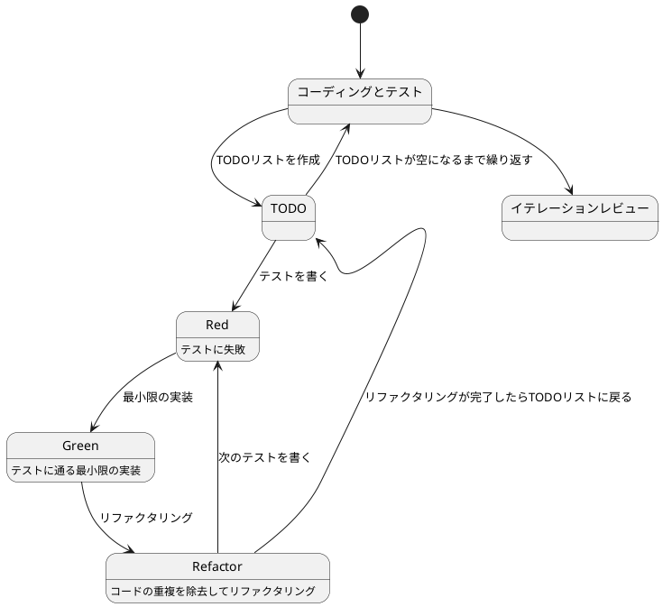
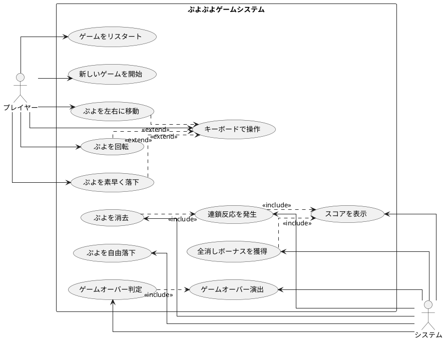

# ぷよぷよから始めるテスト駆動開発入門 - Rust macroquad/bevy版

## はじめに

みなさん、こんにちは！今日は私と一緒にテスト駆動開発（TDD）を使って、ぷよぷよゲームを作っていきましょう。さて、プログラミングの旅に出る前に、皆さんは「テスト駆動開発」について聞いたことがありますか？もしかしたら「テストって、コードを書いた後にするものじゃないの？」と思われるかもしれませんね。

> テストを書きながら開発することによって、設計が良い方向に変わり、コードが改善され続け、それによって自分自身が開発に前向きになること、それがテスト駆動開発の目指すゴールです。
>
> — Kent Beck 『テスト駆動開発』 付録C　訳者解説：テスト駆動開発の現在

この記事では、私たちが一緒にぷよぷよゲームを実装しながら、テスト駆動開発の基本的な流れと考え方を学んでいきます。まるでモブプログラミングのセッションのように、あなたと私が一緒に考え、コードを書き、改善していく過程を体験しましょう。「でも、ぷよぷよって結構複雑なゲームじゃないの？」と思われるかもしれませんが、心配いりません。各章では、ユーザーストーリーに基づいた機能を、テスト、実装、解説の順に少しずつ進めていきますよ。一歩一歩、着実に進んでいきましょう！

### テスト駆動開発のサイクル

さて、テスト駆動開発では、どのように進めていけばいいのでしょうか？「テストを書いてから実装する」というのは分かりましたが、具体的にはどんな手順で進めるのでしょうか？

私がいつも実践しているのは、以下の3つのステップを繰り返すサイクルです。皆さんも一緒にやってみましょう：

1. **Red（赤）**: まず失敗するテストを書きます。「え？わざと失敗するテストを？」と思われるかもしれませんが、これには重要な意味があるんです。これから実装する機能が何をすべきかを明確にするためなんですよ。
2. **Green（緑）**: 次に、テストが通るように、最小限のコードを実装します。この段階では、きれいなコードよりも「とにかく動くこと」を優先します。「最小限」というのがポイントです。必要以上のことはしないようにしましょう。
3. **Refactor（リファクタリング）**: 最後に、コードの品質を改善します。テストが通ることを確認しながら、重複を取り除いたり、わかりやすい名前をつけたりします。「動くけど汚いコード」から「動いてきれいなコード」へと進化させるんです。

> レッド・グリーン・リファクタリング。それがTDDのマントラだ。
>
> — Kent Beck 『テスト駆動開発』

このサイクルを「Red-Green-Refactor」サイクルと呼びます。「赤・緑・リファクタリング」のリズムを刻むように、このサイクルを繰り返していくんです。これによって、少しずつ機能を追加し、コードの品質を高めていきましょう。皆さんも一緒にこのリズムを体感してみてください！



### 開発環境

さて、実際にコードを書く前に、私たちが使用する開発環境について少しお話ししておきましょう。皆さんは「道具選びは仕事の半分」という言葉を聞いたことがありますか？プログラミングでも同じことが言えるんです。

> 道具はあなたの能力を増幅します。道具のできが優れており、簡単に使いこなせるようになっていれば、より生産的になれるのです。
>
> — 達人プログラマー 熟達に向けたあなたの旅（第2版）

「どんなツールを使えばいいの？」と思われるかもしれませんね。今回のプロジェクトでは、以下のツールを使用していきます：

- **言語**: Rust — 「なぜRust？」と思われるかもしれませんが、Rustは型安全性とメモリ安全性を保証しながら、高速なゲームを作れる素晴らしい言語なんです。
- **ゲームエンジン**: macroquad/bevy — 「ゲームエンジン？難しそう...」と思うかもしれませんが、シンプルで学びやすいmacroquadと、強力なECS（Entity Component System）を持つbevyから選べます。
- **テストフレームワーク**: Cargo test — Rustに標準で付属している強力なテストランナーです。テスト駆動開発には欠かせないツールですね。
- **タスクランナー**: cargo-make — 「同じ作業の繰り返しって退屈じゃないですか？」そんな反復的なタスクを自動化してくれます。
- **バージョン管理**: Git — コードの変更履歴を追跡し、「あれ？昨日までちゃんと動いてたのに...」というときに過去の状態に戻れる魔法のツールです。

これらのツールを使って、テスト駆動開発の流れに沿ってぷよぷよゲームを実装していきましょう。「環境構築って難しそう...」と心配される方もいるかもしれませんが手順に従って進めればそんなに難しいことではありません。詳細はイテレーション0: 環境の構築で解説します。

## 要件

### ユーザーストーリー

さて、実際にコードを書き始める前に、少し立ち止まって考えてみましょう。「何を作るのか？」という基本的な問いかけです。私たちが作るぷよぷよゲームは、どのような機能を持つべきでしょうか？

アジャイル開発では、この「何を作るのか？」という問いに対して、「ユーザーストーリー」という形で答えを出します。皆さんは「ユーザーストーリー」という言葉を聞いたことがありますか？

> ユーザーストーリーは、ソフトウェア要求を表現するための軽量な手法である。ユーザーストーリーは、システムについてユーザーまたは顧客の視点からフィーチャの概要を記述したものだ。
> ユーザーストーリーには形式が定められておらず、標準的な記法もない。とはいえ、次のような形式でストーリーを考えてみると便利である。「＜ユーザーの種類＞として、＜機能や性能＞がほしい。それは＜ビジネス価値＞のためだ」という形のテンプレートに従うと、
> たとえば次のようなストーリーを書ける。「本の購入者として、ＩＳＢＮで本を検索したい。それは探している本をすばやく見つけるためだ」
>
> — Mike Cohn 『アジャイルな見積と計画づくり』

つまり、「プレイヤーとして、〇〇ができる（〇〇したいから）」という形式で機能を表現するんです。これによって、「誰のため」の「どんな機能」を「なぜ」作るのかが明確になります。素晴らしいですよね！

では、私たちのぷよぷよゲームでは、どんなユーザーストーリーが考えられるでしょうか？一緒に考えてみましょう：

- プレイヤーとして、新しいゲームを開始できる（ゲームの基本機能として必要ですよね！）
- プレイヤーとして、落ちてくるぷよを左右に移動できる（ぷよを適切な位置に配置したいですよね）
- プレイヤーとして、落ちてくるぷよを回転できる（戦略的にぷよを配置するために必要です）
- プレイヤーとして、ぷよを素早く落下させることができる（「早く次のぷよを落としたい！」というときのために）
- プレイヤーとして、同じ色のぷよを4つ以上つなげると消去できる（これがぷよぷよの醍醐味ですよね！）
- プレイヤーとして、連鎖反応を起こしてより高いスコアを獲得できる（「れ〜んさ〜ん！」と叫びたくなりますよね）
- プレイヤーとして、全消し（ぜんけし）ボーナスを獲得できる（「やった！全部消えた！」という達成感を味わいたいですよね）
- プレイヤーとして、ゲームオーバーになるとゲーム終了の演出を見ることができる（終わりが明確でないとモヤモヤしますよね）
- プレイヤーとして、現在のスコアを確認できる（「今どれくらい点数取れてるかな？」と気になりますよね）
- プレイヤーとして、キーボードでぷよを操作できる（PCでプレイするなら必須ですよね）

「うわ、結構たくさんあるな...」と思われるかもしれませんが、心配いりません！これらのユーザーストーリーを一つずつ実装していくことで、徐々にゲームを完成させていきましょう。テスト駆動開発の素晴らしいところは、各ストーリーを小さなタスクに分解し、テスト→実装→リファクタリングのサイクルで少しずつ進められることなんです。一歩一歩、着実に進んでいきましょう！

### ユースケース図

ユーザーストーリーを整理したところで、「これらの機能がどのように関連しているのか、全体像が見えるといいな」と思いませんか？そんなときに役立つのが「ユースケース図」です。
「ユースケース図って何？」と思われるかもしれませんね。ユースケース図は、システムと外部アクター（ここではプレイヤーとシステム自体）の相互作用を視覚的に表現するための図です。「絵に描いて整理すると分かりやすい」というやつですね。

> ユースケースは、システムの振る舞いに関する利害関係者の契約を表現するものです。
>
> — アリスター・コーバーン 『ユースケース実践ガイド』

「百聞は一見にしかず」というように、実際に見てみるのが一番分かりやすいですよね。では、私たちのぷよぷよゲームのユースケース図を見てみましょう：



この図を見ると、プレイヤーとシステムの役割分担がよくわかりますね。プレイヤーはゲームの開始や操作を担当し、システムはぷよの消去判定やスコア計算などの内部処理を担当しています。また、キーボード操作は「拡張（extend）」関係にあり、ぷよの移動や回転などの基本操作を入力方法で実現していることがわかります。

このようにユースケース図を作成することで、システムの全体像を把握し、実装すべき機能の関連性を明確にすることができます。それでは、実際のコード実装に進んでいきましょう！

誤解しないでもらいたいのですが本来ユースケースとはテキストで記述するものでありユースケース図は概要を把握するための手段に過ぎないということです。

> 楕円、矢印、人型おアイコンから構成されているUMLのユースケース図は、ユースケースを把握するための表記法ではありません。
> 楕円や矢印は、ユースケースをのパッケージや分解を表すもので、内容を表すものではありません。
>
> — アリスター・コーバーン 『ユースケース実践ガイド』

## リリース計画

要件もわかった、プログラミング開始だ！ちょっと待ってください、何事も計画を立てる事は大事なことです。ユースケース図を見てください、結構いろんなことがありますよね。何から取り組みますか？
「スコアの表示」ですか？「ゲームオーバー判定」ですか？でもまずは「新しいゲームを開始」しないとつながりとして難しいですよね。もちろん実際にプログラミングしながら順番を考えてもいいですけど間違った順番で進めると直すのが大変ですよね。
それにこれからどんなものを作るのかは事前にある程度イメージを固めておきたいものです（いきなり「ゲームオーバー」になるゲームはやりたくないですよね）。

> 計画づくりとは「なにをいつまでに作ればいいのか？」という質問に答える作業だと私は考えている
>
> — Mike Cohn 『アジャイルな見積と計画づくり』

今回の目的はぷよぷよゲームを遊べるための最小限の機能の実装です。目的を実現するためにやるべきことをイテレーションという単位でまとめましょう。「全部やること洗い出すの？そんな先のことはわからないよ！」と思いますよね。安心してください今決めることは大まかな作業の流れと前後関係の整理だけです。
細かい部分は各イテレーションでおいおい明確になってきます。その手助けをしてくれるのがテスト駆動開発なのです。

> 正しい設計を、正しいタイミングで行う。動かしてから、正しくする。
>
> — Kent Beck 『テスト駆動開発』

今回はユーザーストーリーとユースケース図から以下のイテレーション計画に従ってぷよぷよゲームをリリースします。

- イテレーション1: ゲーム開始の実装
- イテレーション2: ぷよの移動の実装
- イテレーション3: ぷよの回転の実装
- イテレーション4: ぷよの自由落下の実装
- イテレーション5: ぷよの高速落下の実装
- イテレーション6: ぷよの消去の実装
- イテレーション7: 連鎖反応の実装
- イテレーション8: 全消しボーナスの実装
- イテレーション9: ゲームオーバーの実装

では、ぷよぷよゲーム開発スタートです！

## イテレーション0: 環境の構築

...と言いたいところですがまずは環境の構築をしなければなりません。「プログラミングなんてどの言語でやるか決めるぐらいでしょ？」と思うかもしれませんが家を建てるときにしっかりとした基礎工事が必要なように開発環境もしっかりとした準備が必要です。
家を建てた後に基礎がダメだと困ったことになりますからね。

### ソフトウェア開発の三種の神器

良いコードを書き続けるためには何が必要になるでしょうか？それは[ソフトウェア開発の三種の神器](https://t-wada.hatenablog.jp/entry/clean-code-that-works)と呼ばれるものです。

> 今日のソフトウェア開発の世界において絶対になければならない3つの技術的な柱があります。
> 三本柱と言ったり、三種の神器と言ったりしていますが、それらは
>
>   - バージョン管理
>   - テスティング
>   - 自動化
>
> の3つです。
>
> —  https://t-wada.hatenablog.jp/entry/clean-code-that-works

本章では開発環境のセットアップとして、これら三種の神器を準備していきます。環境構築は退屈に感じるかもしれませんが、これらのツールがあることで、安心してコードを書くことができるようになります。一緒に進めていきましょう！

### バージョン管理: Gitとコミットメッセージ

バージョン管理システムとして Git を使います。Git については既に使用していると仮定しますが、コミットメッセージについて1つだけ重要なルールを確認しておきましょう。

#### コミットメッセージの書き方

私たちのプロジェクトでは、[Angularルール](https://github.com/angular/angular.js/blob/master/DEVELOPERS.md#type)の書式に従ってコミットメッセージを書きます。具体的には、それぞれのコミットメッセージはヘッダ、ボディ、フッタで構成されます。

```
<タイプ>(<スコープ>): <タイトル>
<空行>
<ボディ>
<空行>
<フッタ>
```

ヘッダは必須で、スコープは任意です。コミットメッセージのタイトルは50文字までにしましょう（GitHub上で読みやすくなります）。

コミットのタイプは次を用います：

- **feat**: 新しい機能（A new feature）
- **fix**: バグ修正（A bug fix）
- **docs**: ドキュメント変更のみ（Documentation only changes）
- **style**: コードに影響を与えない変更（white-space, formatting, missing semi-colons, etc）
- **refactor**: 機能追加でもバグ修正でもないコード変更（A code change that neither fixes a bug nor adds a feature）
- **perf**: パフォーマンスを改善するコード変更（A code change that improves performance）
- **test**: テストの追加や修正（Adding missing or correcting existing tests）
- **chore**: ビルドプロセスや補助ツールの変更（Changes to the build process or auxiliary tools and libraries）

例えば：

```bash
git commit -m 'feat: ゲーム初期化機能を追加'
git commit -m 'refactor: メソッドの抽出'
git commit -m 'test: ぷよ消去のテストケースを追加'
```

コミットメッセージにつけるプリフィックスに関しては [【今日からできる】コミットメッセージに 「プレフィックス」をつけるだけで、開発効率が上がった話](https://qiita.com/numanomanu/items/45dd285b286a1f7280ed)を参照ください。

### テスティング: パッケージマネージャとテスト環境

良いコードを書くためには、コードが正しく動作することを確認するテストが欠かせません。そのためのツールをセットアップしていきましょう。

#### パッケージマネージャ: Cargo

外部ライブラリやツールを管理するために **Cargo** を使います。

> Cargoとは、Rustで記述されたサードパーティ製のライブラリ（クレート）を管理するためのツールで、Rustエコシステムの中核を担っています。RubyのBundlerやRubyGemsに相当する機能を提供します。
>
> —  The Rust Programming Language

**Cargo** はRustの標準的なパッケージマネージャとして、プロジェクトの初期化から依存関係の管理まで一貫して行えます。

まず、新しいプロジェクトを作成します：

```bash
cargo init --name puyo_puyo_game
```

これで `Cargo.toml` が作成されます。このファイルでプロジェクトの依存関係を管理します：

```toml
[package]
name = "puyo_puyo_game"
version = "0.1.0"
edition = "2021"

[dependencies]
macroquad = "0.4"

[dev-dependencies]
```

必要なクレートをインストールするには：

```bash
cargo add macroquad
```

これで、ゲーム開発に必要なライブラリがインストールされます。

> Cargo.tomlとは、作成したアプリケーションがどのクレートに依存しているか、そしてインストールしているバージョンはいくつかという情報を管理するためのファイルです。Cargo.lockはバージョンの固定化を行います。
>
> —  The Rust Programming Language

**Cargo** を使ってクレートを管理しましょう。開発用マシンを変えた時にも同じコマンド `cargo build` を実行するだけで、必要な依存関係が自動的にインストールされます。便利ですよね！

### 自動化: コード品質の自動管理

良いコードを書き続けるためには、コードの品質を自動的にチェックし、維持していく仕組みが必要です。ここでは、静的コード解析、コードフォーマット、コードカバレッジ、そしてタスクランナーを設定します。

#### 静的コード解析: Clippy

静的コード解析ツールとして **Clippy** を使います。Clippyは、コードを実行せずに潜在的な問題を検出するツールです。

> Clippyとは、Rust用の静的コード解析ツールで、コードの品質を向上させるための警告やヒントを提供します。
>
> —  Clippy Documentation

```bash
cargo clippy
```

このコマンドを実行すると、コードスタイルやベストプラクティスに違反している箇所が指摘されます。より厳格なチェックを行うには：

```bash
cargo clippy -- -D warnings
```

警告レベルをエラーとして扱うことで、より厳格なコード品質を維持できます。

プロジェクトのルートに `clippy.toml` を作成して、Clippyの設定をカスタマイズできます。サイクロマティック複雑度を7に設定します：

```toml
# clippy.toml
cognitive-complexity-threshold = 7
```

「サイクロマティック複雑度って何ですか？」良い質問ですね。サイクロマティック複雑度は、コードの複雑さを測る指標です。if文、ループ、match文などの分岐が多いほど値が大きくなります。複雑度が高いとテストが書きにくく、バグが混入しやすくなります。7という値は、「これ以上複雑になったら関数を分割しましょう」という目安です。

> 循環的複雑度（Cyclomatic complexity、CC）は、プログラムの複雑さを測るソフトウェア測定法のひとつである。1976年にトーマス・J・マッケイブによって開発された。
>
> — Wikipedia 『循環的複雑度』

#### コードフォーマッタ: rustfmt

コードのフォーマットを統一するために **rustfmt** を使います。

> 優れたソースコードは「目に優しい」ものでなければいけない。
>
> —  リーダブルコード

フォーマットの自動修正は以下のコマンドで実行できます：

```bash
cargo fmt
```

フォーマットのチェックのみ（修正しない）を行うには：

```bash
cargo fmt -- --check
```

フォーマットの設定は `rustfmt.toml` ファイルで細かくカスタマイズできます。

#### コードカバレッジ: cargo-tarpaulin

テストがコードのどれだけをカバーしているかを確認するために、**cargo-tarpaulin** を使います。

> コード網羅率（コードもうらりつ、英: Code coverage）は、ソフトウェアテストで用いられる尺度の1つである。プログラムのソースコードがテストされた割合を意味する。

まず、cargo-tarpaulinをインストールします：

```bash
cargo install cargo-tarpaulin
```

カバレッジレポートを生成するには：

```bash
cargo tarpaulin --out Html
```

実行後、`coverage` フォルダ内の `index.html` を開くと、視覚的にカバレッジ状況を確認できます。

設定ファイル `tarpaulin.toml` を作成して、カバレッジの設定をカスタマイズすることもできます：

```toml
[run]
out = ["Html", "Lcov"]
```

#### タスクランナー: cargo-make

複数のコマンドを覚えるのは大変です。タスクランナーの **cargo-make** を使って、よく使うコマンドをタスクとして登録し、簡単に実行できるようにします。

> cargo-makeは、Rust開発者向けのタスクランナーです。プロジェクト固有のタスクを定義し、複雑なワークフローを自動化できます。TOMLファイルでタスクを設定し、条件分岐やクロスプラットフォーム対応も可能です。

まず、cargo-makeをインストールします：

```bash
cargo install cargo-make
```

`Makefile.toml` を作成し、以下のように設定します：

```toml
[config]
default_to_workspace = false

# テストタスク
[tasks.test]
command = "cargo"
args = ["test"]

# テストカバレッジタスク
[tasks.coverage]
command = "cargo"
args = ["tarpaulin", "--out", "Html"]

# 静的コード解析タスク
[tasks.lint]
command = "cargo"
args = ["clippy", "--", "-D", "warnings"]

# コードフォーマットタスク
[tasks.format]
command = "cargo"
args = ["fmt"]

# フォーマットチェックタスク
[tasks.format-check]
command = "cargo"
args = ["fmt", "--", "--check"]

# ビルドタスク
[tasks.build]
command = "cargo"
args = ["build"]

# 実行タスク
[tasks.run]
command = "cargo"
args = ["run"]

# 全体チェックタスク（自動修正付き）
[tasks.check-all]
dependencies = ["format", "lint", "test"]

# 全体チェックタスク（自動修正なし）
[tasks.verify]
dependencies = ["format-check", "lint", "test"]

# ウォッチタスク（ファイル変更を監視して自動実行）
[tasks.watch]
command = "cargo"
args = ["watch", "-x", "test", "-x", "clippy", "-x", "fmt"]
install_crate = "cargo-watch"

# デフォルトタスク
[tasks.default]
alias = "test"
```

登録されたタスクを確認するには：

```bash
cargo make --list-all-steps
```

特定のタスクを実行するには：

```bash
cargo make test        # テスト実行
cargo make lint        # 静的解析
cargo make format      # フォーマット
cargo make check-all   # 全体チェック（自動修正付き）
cargo make verify      # 全体チェック（自動修正なし）
```

#### タスクの自動実行: cargo-watch

ファイルを編集するたびに手動でコマンドを実行するのは面倒です。**cargo-watch** を使って、ファイルの変更を検知して自動的にテストやフォーマットを実行できるようにします。

まず、cargo-watchをインストールします：

```bash
cargo install cargo-watch
```

ウォッチモードを起動するには：

```bash
cargo make watch
```

このコマンドを実行すると、ファイルを保存するたびに自動的に以下が実行されます：

1. テストの実行
2. Clippyによる静的解析
3. rustfmtによるフォーマット

「保存するだけで自動的にチェックしてくれるなんて便利！」と思いませんか？これで開発中に品質を維持しやすくなりますね。

### プロジェクト構成

最後に、プロジェクトのフォルダ構成を確認しておきましょう：

```
puyo_puyo_game/
├── src/
│   ├── main.rs           # エントリーポイント
│   ├── lib.rs            # ライブラリのルート
│   ├── board.rs          # ボード（盤面）モジュール
│   ├── puyo.rs           # ぷよモジュール
│   ├── puyo_pair.rs      # ぷよペアモジュール
│   └── game_logic.rs     # ゲームロジックモジュール
├── tests/
│   └── integration_test.rs  # 統合テスト
├── Cargo.toml            # プロジェクト設定
├── Makefile.toml         # タスク定義
├── clippy.toml           # Clippy設定（複雑度チェック）
├── tarpaulin.toml        # カバレッジ設定
└── rustfmt.toml          # フォーマット設定
```

「モジュールって何？」と思われるかもしれませんね。Rustでは、コードを小さな部品（モジュール）に分割して管理します。これにより、コードの見通しが良くなり、テストも書きやすくなるんです。

### セットアップの確認

環境構築が完了したら、すべてが正しく動作するか確認しましょう：

```bash
# すべてのチェックを実行
cargo make check-all
```

このコマンドが成功すれば、環境構築は完了です！「やった！これで開発の準備が整いましたね！」

セットアップが完了したので、ここで最初のコミットをしておきましょう：

```bash
git add .
git commit -m 'chore: プロジェクトの初期セットアップ'
```

### イテレーション0のまとめ

このイテレーションで準備した内容：

1. **バージョン管理**
   - Gitのセットアップ
   - コミットメッセージ規約（Angularルール）

2. **テスティング環境**
   - Cargo（パッケージマネージャ）
   - macroquad（ゲームフレームワーク）
   - 標準テストフレームワーク

3. **自動化ツール**
   - Clippy（静的コード解析、サイクロマティック複雑度7に設定）
   - rustfmt（コードフォーマッタ）
   - cargo-tarpaulin（コードカバレッジ）
   - cargo-make（タスクランナー）
   - cargo-watch（ファイル監視）

4. **プロジェクト構成**
   - モジュール構造の設計
   - 設定ファイルの準備（clippy.toml、tarpaulin.toml、rustfmt.toml、Makefile.toml）

### 学んだこと

- **ソフトウェア開発の三種の神器**: バージョン管理、テスティング、自動化の重要性
- **Rustエコシステム**: Cargo、Clippy、rustfmtなどの標準ツール
- **タスク自動化**: 反復的な作業を自動化してミスを減らす
- **品質維持**: 静的解析とフォーマットでコードの品質を保つ
- **複雑度管理**: サイクロマティック複雑度を7に制限することで、テスタブルで保守しやすいコードを維持

「準備完了！これから本格的にぷよぷよゲームを作っていきますよ！」

次のイテレーションでは、ゲーム開始の実装に進みます！

## イテレーション1: ゲーム開始の実装

さあ、いよいよコードを書き始めましょう！テスト駆動開発では、小さなイテレーション（反復）で機能を少しずつ追加していきます。最初のイテレーションでは、最も基本的な機能である「ゲームの開始」を実装します。

> システム構築はどこから始めるべきだろうか。システム構築が終わったらこうなる、というストーリーを語るところからだ。
>
> — Kent Beck 『テスト駆動開発』

### ユーザーストーリー

まずは、このイテレーションで実装するユーザーストーリーを確認しましょう：

> プレイヤーとして、新しいゲームを開始できる

このシンプルなストーリーから始めることで、ゲームの基本的な構造を作り、後続の機能追加の土台を築くことができます。では、テスト駆動開発のサイクルに従って、まずはテストから書いていきましょう！

### TODOリスト

さて、ユーザーストーリーを実装するために、まずはTODOリストを作成しましょう。TODOリストは、大きな機能を小さなタスクに分解するのに役立ちます。

> 何をテストすべきだろうか - 着手する前に、必要になりそうなテストをリストに書き出しておこう。
>
> — Kent Beck 『テスト駆動開発』

私たちの「新しいゲームを開始できる」というユーザーストーリーを実現するためには、どのようなタスクが必要でしょうか？考えてみましょう：

- ゲームの初期化処理を実装する（ゲームの状態や必要なコンポーネントを設定する）
- ゲーム画面を表示する（プレイヤーが視覚的にゲームを認識できるようにする）
- ゲームウィンドウを作成する（macroquadでウィンドウを開く）
- ゲームループを開始する（ゲームの継続的な更新と描画を行う）

これらのタスクを一つずつ実装していきましょう。テスト駆動開発では、各タスクに対してテスト→実装→リファクタリングのサイクルを回します。まずは「ゲームの初期化処理」から始めましょう！

### テスト: ゲームの初期化

さて、TODOリストの最初のタスク「ゲームの初期化処理を実装する」に取り掛かりましょう。テスト駆動開発では、まずテストを書くことから始めます。

> テストファースト
>
> いつテストを書くべきだろうか——それはテスト対象のコードを書く前だ。
>
> — Kent Beck 『テスト駆動開発』

では、ゲームの初期化処理をテストするコードを書いてみましょう。何をテストすべきでしょうか？ゲームが初期化されたとき、必要なコンポーネントが正しく作成され、ゲームの状態が適切に設定されていることを確認する必要がありますね。

```rust
// src/lib.rs
pub mod game;
pub mod board;
pub mod puyo;

// tests/game_test.rs
#[cfg(test)]
mod tests {
    use puyo_puyo_game::game::Game;
    use puyo_puyo_game::game::GameMode;

    #[test]
    fn test_game_initialization() {
        let game = Game::new();

        assert_eq!(game.mode(), GameMode::Start);
        assert_eq!(game.score(), 0);
        assert_eq!(game.chain_count(), 0);
    }

    #[test]
    fn test_game_has_board() {
        let game = Game::new();

        assert!(game.board().is_some());
    }
}
```

このテストでは、`Game`構造体の`new`メソッドが正しく動作することを確認しています。具体的には、ゲームモードが`Start`に設定され、スコアと連鎖カウントが0で初期化されることを検証しています。

### 実装: ゲームの初期化

テストを書いたら、次に実行してみましょう。どうなるでしょうか？

```bash
cargo test
```

```
error[E0433]: failed to resolve: could not find `game` in `puyo_puyo_game`
```

おっと！まだ`game`モジュールを実装していないので、当然エラーになりますね。これがテスト駆動開発の「Red（赤）」の状態です。テストが失敗することを確認できました。

> アサートファースト
>
> ではテストはどこから書き始めるべきだろうか。それはテストの終わりにパスすべきアサーションを書くところからだ。
>
> — Kent Beck 『テスト駆動開発』

では、テストが通るように最小限のコードを実装していきましょう。「最小限」というのがポイントです。この段階では、テストが通ることだけを目指して、必要最低限のコードを書きます。

```rust
// src/game.rs
use crate::board::Board;

#[derive(Debug, Clone, Copy, PartialEq, Eq)]
pub enum GameMode {
    Start,
    Playing,
    Checking,
    Erasing,
    Falling,
    GameOver,
}

pub struct Game {
    mode: GameMode,
    score: i32,
    chain_count: i32,
    board: Option<Board>,
}

impl Game {
    pub fn new() -> Self {
        Self {
            mode: GameMode::Start,
            score: 0,
            chain_count: 0,
            board: Some(Board::new(6, 12)),
        }
    }

    pub fn mode(&self) -> GameMode {
        self.mode
    }

    pub fn score(&self) -> i32 {
        self.score
    }

    pub fn chain_count(&self) -> i32 {
        self.chain_count
    }

    pub fn board(&self) -> Option<&Board> {
        self.board.as_ref()
    }
}

impl Default for Game {
    fn default() -> Self {
        Self::new()
    }
}
```

```rust
// src/board.rs
pub struct Board {
    cols: usize,
    rows: usize,
}

impl Board {
    pub fn new(cols: usize, rows: usize) -> Self {
        Self { cols, rows }
    }

    pub fn cols(&self) -> usize {
        self.cols
    }

    pub fn rows(&self) -> usize {
        self.rows
    }
}
```

```rust
// src/lib.rs
pub mod game;
pub mod board;
pub mod puyo;
```

### 解説: ゲームの初期化

テストが通りましたね！おめでとうございます。これがテスト駆動開発の「Green（緑）」の状態です。

```bash
cargo test
```

```
running 2 tests
test tests::test_game_initialization ... ok
test tests::test_game_has_board ... ok

test result: ok. 2 passed; 0 failed; 0 ignored; 0 measured; 0 filtered out
```

実装したゲームの初期化処理について、少し解説しておきましょう。この処理では、主に以下のことを行っています：

1. ゲームモードを`GameMode::Start`に設定
2. スコアと連鎖カウントを0で初期化
3. ボード（盤面）を6列12行で作成

これにより、ゲームを開始するための準備が整います。各コンポーネントの役割を理解しておくと、今後の実装がスムーズになりますよ：

- **GameMode**: ゲームの状態を管理します（Start, Playing, Checking, Erasing, Falling, GameOver）
- **Board**: ゲームのステージ（盤面）を管理します（ぷよの配置状態、消去判定など）
- **score**: スコアを管理します（連鎖数に応じたスコア計算など）
- **chain_count**: 連鎖カウントを管理します

このように、責任を明確に分けることで、コードの保守性が高まります。これはオブジェクト指向設計の基本原則の一つ、「単一責任の原則」に従っています。

> 単一責任の原則（SRP）：クラスを変更する理由は1つだけであるべき。
>
> — Robert C. Martin 『Clean Architecture』

### 実装: ゲームウィンドウとループ

次に、macroquadを使ってゲームウィンドウとゲームループを実装します。

```rust
// src/main.rs
use macroquad::prelude::*;
use puyo_puyo_game::game::Game;

fn window_conf() -> Conf {
    Conf {
        window_title: "Puyo Puyo Game".to_owned(),
        window_width: 400,
        window_height: 600,
        ..Default::default()
    }
}

#[macroquad::main(window_conf)]
async fn main() {
    let mut game = Game::new();

    loop {
        clear_background(BLACK);

        // ゲームの更新処理（次のイテレーションで実装）

        // ゲームの描画処理（次のイテレーションで実装）
        draw_text("Puyo Puyo Game", 120.0, 40.0, 30.0, WHITE);
        draw_text("Press Space to Start", 90.0, 300.0, 20.0, GRAY);

        next_frame().await
    }
}
```

### 解説: ゲームウィンドウとループ

さて、今回実装した「ゲームウィンドウとループ」について少し詳しく解説しましょう。「ゲームループって何？」と思われるかもしれませんね。

ゲームループは、その名の通り、ゲームの状態を更新し、画面を描画するための繰り返し処理なんです。心臓がずっと鼓動を続けるように、このループが継続的に実行されることで、ゲームが生き生きと動き続けるんですよ。

ここで使っている`#[macroquad::main]`というマクロ、これがとても便利なんです！「どう便利なの？」というと、ゲームウィンドウの作成やイベントループの管理を自動的にやってくれるんです。これによって、私たちはゲームロジックに集中できるんですよ。

コードを見てみると、`loop`ブロック内で以下の処理を行っています：

1. **clear_background(BLACK)**: 画面を黒でクリア
2. **ゲームの更新処理**: 現時点ではコメントアウト（次のイテレーションで実装）
3. **ゲームの描画処理**: タイトルとメッセージを表示
4. **next_frame().await**: 次のフレームまで待機

`next_frame().await`という記述は、「次の描画タイミングまで待ってね」という指示なんです。これによって、スムーズなアニメーションが可能になるんですよ。

また、`window_conf()`関数でウィンドウの設定を行っています。ここでウィンドウのタイトルやサイズを指定できるんです。

このゲームループが基盤となって、これから様々な機能を追加していきますよ！

### 画面の確認

ではここで以下のコマンドを実行して実際に動作する画面を確認しましょう。

```bash
cargo run
```

ウィンドウが開き、「Puyo Puyo Game」というタイトルと「Press Space to Start」というメッセージが表示されます。

おめでとうございます！リリースに向けて最初の第一歩を踏み出すことができました。これから機能を追加するごとにどんどん実際のゲームの完成に近づく事が確認できます、楽しみですね。

「機能は別々に作りこんで最後に画面と統合するんじゃないの？」と思うもしれません。そういうアプローチもありますが画面イメージが最後まで確認できないともし間違っていたら手戻りが大変です。それに動作するプログラムがどんどん成長するのを見るのは楽しいですからね。

> トップダウンでもボトムアップでもなく、エンドツーエンドで構築していく
>
>    エンドツーエンドで小さな機能を構築し、そこから作業を進めながら問題について学習していく。
>
> — 達人プログラマー 熟達に向けたあなたの旅（第2版）

### コミット

実装が完了したので、ここでコミットしておきましょう：

```bash
git add .
git commit -m 'feat: ゲーム初期化とウィンドウ表示を実装'
```

### イテレーション1のまとめ

このイテレーションで実装した内容：

1. **Gameモジュールの初期化**
   - GameMode列挙型の定義（Start, Playing, Checking, Erasing, Falling, GameOver）
   - Gamestructの実装（mode, score, chain_count, board）
   - 初期状態の設定

2. **Boardモジュールの実装**
   - 盤面の作成（6列12行）
   - 列数・行数の取得

3. **ゲームウィンドウとループの実装**
   - macroquadを使用したウィンドウ作成
   - ゲームループの実装（更新・描画サイクル）
   - タイトルとメッセージの表示

4. **テストの作成**
   - ゲーム初期化のテスト（2テスト）
   - すべてのテストが成功

### 学んだこと

- **Rustの構造体とメソッド**: `struct`と`impl`によるデータと動作の分離
- **列挙型（enum）**: `GameMode`で状態を型安全に管理
- **Optionタイプ**: `Option<Board>`でnullの安全性を保証
- **macroquadの基本**: ウィンドウ作成、ゲームループ、描画処理
- **非同期処理**: `async/await`によるフレーム待機

次のイテレーションでは、ボード（盤面）の実装とぷよペアの表示に進みます！

## イテレーション2: ぷよペアの表示

さて、前回のイテレーションでゲームの基本的な構造ができましたね。「ゲームが始まったけど、ぷよが表示されないと面白くないよね？」と思いませんか？そこで次は、ぷよペアを画面に表示できるようにしていきましょう！

### ユーザーストーリー

まずは、このイテレーションで実装するユーザーストーリーを確認しましょう：

> プレイヤーとして、落ちてくるぷよペアとボード（盤面）を視覚的に確認できる

「ぷよぷよって、2つのぷよが組になって落ちてくるゲームですよね？」そうです！今回はその「ぷよペア」を画面に表示する機能を実装していきます。

### TODOリスト

さて、このユーザーストーリーを実現するために、どんなタスクが必要でしょうか？一緒に考えてみましょう。
「ぷよペアを表示する」という機能を実現するためには、以下のようなタスクが必要そうですね：

- ぷよの色を定義する（赤、青、緑、黄色の4色）
- ボードのセルの状態を定義する（空、またはぷよで埋まっている）
- ぷよペアの構造を実装する（軸ぷよと子ぷよの2つのぷよ）
- ボードを描画する処理を実装する（盤面の各セルを描画する）
- ぷよペアを描画する処理を実装する（現在落下中のぷよペアを描画する）

「なるほど、順番に実装していけばいいんですね！」そうです、一つずつ進めていきましょう。テスト駆動開発の流れに沿って、まずはテストから書いていきますよ。

### テスト: ぷよの色とセルの状態

「最初に何をテストすればいいんでしょうか？」まずは、ぷよの色とボードのセルの状態を表す型からテストしていきましょう。

> テストファースト
>
> いつテストを書くべきだろうか——それはテスト対象のコードを書く前だ。
>
> — Kent Beck 『テスト駆動開発』

```rust
// tests/board_test.rs
#[cfg(test)]
mod tests {
    use puyo_puyo_game::board::{Board, Cell, PuyoColor};

    #[test]
    fn test_create_board() {
        let board = Board::new(6, 12);

        assert_eq!(board.cols(), 6);
        assert_eq!(board.rows(), 12);
    }

    #[test]
    fn test_all_cells_are_empty_initially() {
        let board = Board::new(6, 12);

        for x in 0..board.cols() {
            for y in 0..board.rows() {
                assert_eq!(board.get_cell(x, y), Some(Cell::Empty));
            }
        }
    }

    #[test]
    fn test_set_and_get_cell() {
        let mut board = Board::new(6, 12);

        board.set_cell(2, 5, Cell::Filled(PuyoColor::Red));

        assert_eq!(board.get_cell(2, 5), Some(Cell::Filled(PuyoColor::Red)));
    }

    #[test]
    fn test_get_cell_out_of_bounds() {
        let board = Board::new(6, 12);

        assert_eq!(board.get_cell(10, 20), None);
    }
}
```

「このテストでは何を確認しているんですか？」このテストでは、以下の4つのケースを確認しています：

1. ボードを作成したときに、正しい列数と行数が設定されているか
2. 初期状態では、すべてのセルが空（`Cell::Empty`）になっているか
3. セルにぷよを設定して、それを取得できるか
4. 範囲外のセルを取得しようとしたときに、`None`が返されるか

「テストを実行するとどうなるんでしょう？」まだ実装していないので、当然テストは失敗するはずです。これがテスト駆動開発の「Red（赤）」の状態です。では、テストが通るように実装していきましょう！

### 実装: ぷよの色とボードのセル

「失敗するテストができたので、次は実装ですね！」そうです！テストが通るように、最小限のコードを実装していきましょう。

```rust
// src/board.rs
#[derive(Debug, Clone, Copy, PartialEq, Eq)]
pub enum PuyoColor {
    Red,
    Blue,
    Green,
    Yellow,
}

#[derive(Debug, Clone, Copy, PartialEq, Eq)]
pub enum Cell {
    Empty,
    Filled(PuyoColor),
}

pub struct Board {
    cols: usize,
    rows: usize,
    cells: Vec<Vec<Cell>>,
}

impl Board {
    pub fn new(cols: usize, rows: usize) -> Self {
        let cells = vec![vec![Cell::Empty; rows]; cols];
        Self { cols, rows, cells }
    }

    pub fn cols(&self) -> usize {
        self.cols
    }

    pub fn rows(&self) -> usize {
        self.rows
    }

    pub fn get_cell(&self, x: usize, y: usize) -> Option<Cell> {
        self.cells.get(x).and_then(|col| col.get(y)).copied()
    }

    pub fn set_cell(&mut self, x: usize, y: usize, cell: Cell) {
        if let Some(col) = self.cells.get_mut(x) {
            if let Some(c) = col.get_mut(y) {
                *c = cell;
            }
        }
    }
}
```

「enum（列挙型）がたくさん使われていますね！」そうですね。Rustのenumは非常に強力で、型安全性を保ちながら明確な状態を表現できます：

- **PuyoColor**: ぷよの色を表します。`Red`、`Blue`、`Green`、`Yellow`の4色です。
- **Cell**: ボードのセルの状態を表します。`Empty`（空）または`Filled(PuyoColor)`（指定された色のぷよで埋まっている）のどちらかです。

「`#[derive(Debug, Clone, Copy, PartialEq, Eq)]`って何ですか？」良い質問ですね！これはRustの「derive属性」と呼ばれるもので、コンパイラに自動的にトレイト（機能）を実装してもらうための指示です：

- **Debug**: `{:?}`でデバッグ出力できるようにする
- **Clone**: `clone()`メソッドで複製できるようにする
- **Copy**: 代入時に自動的にコピーされるようにする（小さな型に適用）
- **PartialEq, Eq**: `==`や`!=`で比較できるようにする

> derive属性は、一般的な動作を自動的に実装してくれる便利な機能です。
>
> — The Rust Programming Language

「`get_cell`メソッドの実装が少し複雑ですね。」そうですね。このメソッドでは、`Option`型を使って安全に値を取得しています：

```rust
self.cells.get(x).and_then(|col| col.get(y)).copied()
```

この行は以下の処理を行っています：
1. `self.cells.get(x)`: x番目の列を取得（範囲外なら`None`）
2. `.and_then(|col| col.get(y))`: 列が存在する場合、y番目のセルを取得
3. `.copied()`: `&Cell`を`Cell`にコピー（`Cell`は`Copy`トレイトを実装しているため）

「`Option`型って何ですか？」Rustには`null`がありません。代わりに`Option<T>`型を使って、「値があるかもしれないし、ないかもしれない」という状況を表現します。`Option`は以下の2つの値を持ちます：

- `Some(value)`: 値が存在する
- `None`: 値が存在しない

これによって、nullポインタ例外のような実行時エラーを防げるんです！

> Rustには、多くの言語が持つnullという機能はありません。
>
> — The Rust Programming Language

「これでテストは通りましたか？」はい、これでテストは通るはずです！

```bash
cargo test
```

```
running 4 tests
test tests::test_create_board ... ok
test tests::test_all_cells_are_empty_initially ... ok
test tests::test_set_and_get_cell ... ok
test tests::test_get_cell_out_of_bounds ... ok

test result: ok. 4 passed; 0 failed; 0 ignored; 0 measured; 0 filtered out
```

これがテスト駆動開発の「Green（緑）」の状態です。次は、ぷよペアの実装をテストしていきましょう！

### テスト: ぷよペアの構造

「次は何をテストしますか？」次は、ぷよペアの構造をテストしましょう。ぷよペアは軸ぷよ（axis）と子ぷよ（child）の2つのぷよから構成されます。

```rust
// tests/puyo_pair_test.rs
#[cfg(test)]
mod tests {
    use puyo_puyo_game::puyo_pair::PuyoPair;
    use puyo_puyo_game::board::PuyoColor;

    #[test]
    fn test_create_puyo_pair() {
        let pair = PuyoPair::new(2, 1, PuyoColor::Red, PuyoColor::Blue);

        assert_eq!(pair.axis_x(), 2);
        assert_eq!(pair.axis_y(), 1);
        assert_eq!(pair.axis_color(), PuyoColor::Red);
        assert_eq!(pair.child_color(), PuyoColor::Blue);
    }

    #[test]
    fn test_child_position_initially_above_axis() {
        let pair = PuyoPair::new(2, 1, PuyoColor::Red, PuyoColor::Blue);

        // 子ぷよは軸ぷよの上に配置される（y座標が1小さい）
        assert_eq!(pair.child_x(), 2);
        assert_eq!(pair.child_y(), 0);
    }
}
```

「このテストでは何を確認しているんですか？」このテストでは、ぷよペアが正しく作成され、軸ぷよと子ぷよの位置や色が適切に設定されることを確認しています。特に重要なのは、子ぷよが軸ぷよの真上（y座標が1小さい位置）に配置されることです。

### 実装: ぷよペアの構造

テストが失敗することを確認したら、実装に進みましょう！

```rust
// src/puyo_pair.rs
use crate::board::PuyoColor;

pub struct PuyoPair {
    axis_x: i32,
    axis_y: i32,
    axis_color: PuyoColor,
    child_x: i32,
    child_y: i32,
    child_color: PuyoColor,
}

impl PuyoPair {
    pub fn new(x: i32, y: i32, axis_color: PuyoColor, child_color: PuyoColor) -> Self {
        Self {
            axis_x: x,
            axis_y: y,
            axis_color,
            child_x: x,
            child_y: y - 1,  // 子ぷよは軸ぷよの上
            child_color,
        }
    }

    pub fn axis_x(&self) -> i32 {
        self.axis_x
    }

    pub fn axis_y(&self) -> i32 {
        self.axis_y
    }

    pub fn axis_color(&self) -> PuyoColor {
        self.axis_color
    }

    pub fn child_x(&self) -> i32 {
        self.child_x
    }

    pub fn child_y(&self) -> i32 {
        self.child_y
    }

    pub fn child_color(&self) -> PuyoColor {
        self.child_color
    }
}
```

「ぷよペアの位置を表すのに`i32`を使っているのはなぜですか？」良い質問ですね！`usize`ではなく`i32`を使っているのは、回転処理で負の座標が一時的に発生する可能性があるためです。また、画面外の判定もしやすくなります。

「子ぷよが`y - 1`の位置に配置されるのはなぜですか？」ぷよぷよでは、画面の上から下に向かってy座標が増えていきます。つまり、y座標が小さいほど上にあることになります。だから、軸ぷよの上に子ぷよを配置するには、y座標を1減らすんです。

```rust
// src/lib.rs に追加
pub mod puyo_pair;
```

テストを実行してみましょう：

```bash
cargo test
```

```
running 6 tests
test tests::test_create_board ... ok
test tests::test_all_cells_are_empty_initially ... ok
test tests::test_set_and_get_cell ... ok
test tests::test_get_cell_out_of_bounds ... ok
test tests::test_create_puyo_pair ... ok
test tests::test_child_position_initially_above_axis ... ok

test result: ok. 6 passed; 0 failed; 0 ignored; 0 measured; 0 filtered out
```

「やった！テストが通りました！」おめでとうございます！これでぷよペアの基本構造が実装できました。

### 実装: ぷよペアの描画

「テストは通ったけど、実際にぷよが表示されているところを見たいですね！」そうですね！それでは、ぷよを画面に表示する処理を実装しましょう。

#### Gameモジュールの拡張

まず、Gameモジュールにぷよペアを管理する機能を追加します：

```rust
// src/game.rs（拡張）
use crate::puyo_pair::PuyoPair;
use rand::Rng;

impl Game {
    pub fn new() -> Self {
        let mut game = Self {
            mode: GameMode::Start,
            score: 0,
            chain_count: 0,
            board: Some(Board::new(6, 12)),
            current_pair: None,
            drop_timer: 0.0,
            drop_interval: 1.0,
            fast_drop_active: false,
        };
        game
    }

    pub fn start(&mut self) {
        self.mode = GameMode::Playing;
        self.spawn_new_pair();
    }

    fn spawn_new_pair(&mut self) {
        let mut rng = rand::thread_rng();

        let axis_color = match rng.gen_range(0..4) {
            0 => PuyoColor::Red,
            1 => PuyoColor::Blue,
            2 => PuyoColor::Green,
            _ => PuyoColor::Yellow,
        };

        let child_color = match rng.gen_range(0..4) {
            0 => PuyoColor::Red,
            1 => PuyoColor::Blue,
            2 => PuyoColor::Green,
            _ => PuyoColor::Yellow,
        };

        let pair = PuyoPair::new(2, 1, axis_color, child_color);
        self.current_pair = Some(pair);
    }

    pub fn current_pair(&self) -> Option<&PuyoPair> {
        self.current_pair.as_ref()
    }
}
```

「`rand::Rng`を使ってランダムに色を選んでいるんですね！」そうです！`rand`クレートを使って、4色の中からランダムに色を選択しています。

`Cargo.toml`に`rand`クレートを追加します：

```toml
[dependencies]
macroquad = "0.4"
rand = "0.8"
```

#### 描画処理の実装

次に、ボードとぷよペアを描画する処理を実装します：

```rust
// src/game.rs（さらに拡張）
impl Game {
    pub fn draw(&self) {
        use macroquad::prelude::*;

        const CELL_SIZE: f32 = 40.0;
        const BOARD_OFFSET_X: f32 = 50.0;
        const BOARD_OFFSET_Y: f32 = 80.0;

        // ボードを描画
        if let Some(ref board) = self.board {
            for y in 0..board.rows() {
                for x in 0..board.cols() {
                    let px = BOARD_OFFSET_X + x as f32 * CELL_SIZE;
                    let py = BOARD_OFFSET_Y + y as f32 * CELL_SIZE;

                    // セルの枠を描画
                    draw_rectangle_lines(px, py, CELL_SIZE, CELL_SIZE, 1.0, GRAY);

                    // セルにぷよがあれば描画
                    if let Some(Cell::Filled(color)) = board.get_cell(x, y) {
                        let puyo_color = match color {
                            PuyoColor::Red => RED,
                            PuyoColor::Blue => BLUE,
                            PuyoColor::Green => GREEN,
                            PuyoColor::Yellow => YELLOW,
                        };

                        draw_circle(
                            px + CELL_SIZE / 2.0,
                            py + CELL_SIZE / 2.0,
                            CELL_SIZE / 2.0 - 4.0,
                            puyo_color,
                        );
                    }
                }
            }
        }

        // 現在のぷよペアを描画
        if let Some(ref pair) = self.current_pair {
            // 軸ぷよを描画
            let axis_x = BOARD_OFFSET_X + pair.axis_x() as f32 * CELL_SIZE;
            let axis_y = BOARD_OFFSET_Y + pair.axis_y() as f32 * CELL_SIZE;
            let axis_color = match pair.axis_color() {
                PuyoColor::Red => RED,
                PuyoColor::Blue => BLUE,
                PuyoColor::Green => GREEN,
                PuyoColor::Yellow => YELLOW,
            };

            draw_circle(
                axis_x + CELL_SIZE / 2.0,
                axis_y + CELL_SIZE / 2.0,
                CELL_SIZE / 2.0 - 4.0,
                axis_color,
            );

            // 子ぷよを描画
            let child_x = BOARD_OFFSET_X + pair.child_x() as f32 * CELL_SIZE;
            let child_y = BOARD_OFFSET_Y + pair.child_y() as f32 * CELL_SIZE;
            let child_color = match pair.child_color() {
                PuyoColor::Red => RED,
                PuyoColor::Blue => BLUE,
                PuyoColor::Green => GREEN,
                PuyoColor::Yellow => YELLOW,
            };

            draw_circle(
                child_x + CELL_SIZE / 2.0,
                child_y + CELL_SIZE / 2.0,
                CELL_SIZE / 2.0 - 4.0,
                child_color,
            );
        }
    }
}
```

「macroquadの描画関数を使っているんですね！」そうです！macroquadには便利な描画関数がたくさんあります：

- `draw_rectangle_lines()`: 長方形の枠線を描画
- `draw_circle()`: 円を描画

「色のマッチングを2回書いているのは重複ではないですか？」鋭い指摘ですね！確かに重複しています。これは次のリファクタリングステップで改善しましょう。これがTDDの「Refactor（リファクタリング）」の段階です。

#### メイン処理の更新

最後に、main.rsを更新してぷよペアを表示するようにします：

```rust
// src/main.rs（更新）
use macroquad::prelude::*;
use puyo_puyo_game::game::{Game, GameMode};

fn window_conf() -> Conf {
    Conf {
        window_title: "Puyo Puyo Game".to_owned(),
        window_width: 400,
        window_height: 600,
        ..Default::default()
    }
}

#[macroquad::main(window_conf)]
async fn main() {
    let mut game = Game::new();

    loop {
        clear_background(BLACK);

        match game.mode() {
            GameMode::Start => {
                draw_text("Puyo Puyo Game", 120.0, 40.0, 30.0, WHITE);
                draw_text("Press Space to Start", 90.0, 300.0, 20.0, GRAY);

                if is_key_pressed(KeyCode::Space) {
                    game.start();
                }
            }
            _ => {
                // ゲームの描画
                game.draw();

                // スコアと連鎖数の表示
                draw_text(&format!("Score: {}", game.score()), 10.0, 30.0, 20.0, WHITE);
                draw_text(&format!("Chain: {}", game.chain_count()), 10.0, 55.0, 20.0, WHITE);
            }
        }

        next_frame().await
    }
}
```

### リファクタリング: 色変換関数の抽出

「さて、重複コードを除去しましょう！」そうですね。色の変換処理を関数として抽出します：

```rust
// src/game.rs（リファクタリング）
impl Game {
    fn puyo_color_to_macroquad_color(color: PuyoColor) -> Color {
        match color {
            PuyoColor::Red => RED,
            PuyoColor::Blue => BLUE,
            PuyoColor::Green => GREEN,
            PuyoColor::Yellow => YELLOW,
        }
    }

    pub fn draw(&self) {
        use macroquad::prelude::*;

        const CELL_SIZE: f32 = 40.0;
        const BOARD_OFFSET_X: f32 = 50.0;
        const BOARD_OFFSET_Y: f32 = 80.0;

        // ボードを描画
        if let Some(ref board) = self.board {
            for y in 0..board.rows() {
                for x in 0..board.cols() {
                    let px = BOARD_OFFSET_X + x as f32 * CELL_SIZE;
                    let py = BOARD_OFFSET_Y + y as f32 * CELL_SIZE;

                    draw_rectangle_lines(px, py, CELL_SIZE, CELL_SIZE, 1.0, GRAY);

                    if let Some(Cell::Filled(color)) = board.get_cell(x, y) {
                        let puyo_color = Self::puyo_color_to_macroquad_color(color);
                        draw_circle(
                            px + CELL_SIZE / 2.0,
                            py + CELL_SIZE / 2.0,
                            CELL_SIZE / 2.0 - 4.0,
                            puyo_color,
                        );
                    }
                }
            }
        }

        // 現在のぷよペアを描画
        if let Some(ref pair) = self.current_pair {
            self.draw_puyo(pair.axis_x(), pair.axis_y(), pair.axis_color(), CELL_SIZE, BOARD_OFFSET_X, BOARD_OFFSET_Y);
            self.draw_puyo(pair.child_x(), pair.child_y(), pair.child_color(), CELL_SIZE, BOARD_OFFSET_X, BOARD_OFFSET_Y);
        }
    }

    fn draw_puyo(&self, x: i32, y: i32, color: PuyoColor, cell_size: f32, offset_x: f32, offset_y: f32) {
        let px = offset_x + x as f32 * cell_size;
        let py = offset_y + y as f32 * cell_size;
        let puyo_color = Self::puyo_color_to_macroquad_color(color);

        draw_circle(
            px + cell_size / 2.0,
            py + cell_size / 2.0,
            cell_size / 2.0 - 4.0,
            puyo_color,
        );
    }
}
```

「すっきりしましたね！」そうです！`draw_puyo`というヘルパーメソッドを抽出することで、コードの重複を減らし、可読性を向上させました。これがリファクタリングの力です。

### 画面の確認

ではここで以下のコマンドを実行して実際に動作する画面を確認しましょう。

```bash
cargo run
```

ウィンドウが開き、スペースキーを押すと、ボードとランダムな色のぷよペアが表示されます！

「本当だ！ぷよが表示されました！」おめでとうございます！ぷよペアの表示機能が実装できましたね。

### コミット

実装が完了したので、ここでコミットしておきましょう：

```bash
git add .
git commit -m 'feat: ぷよペアの表示機能を実装'
```

### イテレーション2のまとめ

このイテレーションで実装した内容：

1. **ぷよの色の定義**
   - `PuyoColor`列挙型（Red, Blue, Green, Yellow）
   - `derive`属性によるトレイトの自動実装

2. **ボードのセル状態の定義**
   - `Cell`列挙型（Empty, Filled(PuyoColor)）
   - `Option`型による安全な値の取得

3. **ぷよペアの構造**
   - 軸ぷよと子ぷよの位置と色の管理
   - 子ぷよは軸ぷよの上に配置（y - 1）

4. **描画処理**
   - macroquadの描画関数を使用
   - ボードの枠線とぷよを円形で描画
   - 色変換関数のヘルパーメソッド化

5. **テストの作成**
   - ボードのテスト（4テスト）
   - ぷよペアのテスト（2テスト）
   - すべてのテストが成功

### 学んだこと

- **列挙型（enum）の活用**: 型安全な状態管理
- **Option型**: nullの代わりに安全に「値がない」を表現
- **derive属性**: 一般的なトレイトの自動実装
- **メソッド抽出**: コードの重複を減らすリファクタリング
- **macroquad描画**: 基本的な図形描画関数

次のイテレーションでは、ぷよペアを左右に移動する機能を実装していきます！

## イテレーション3: ぷよペアの移動

さて、前回のイテレーションでぷよペアの表示ができましたね。「ゲームが始まって、ぷよも表示されたけど、動かないと面白くないよね？」と思いませんか？そこで次は、ぷよペアを左右に移動できるようにしていきましょう！

### ユーザーストーリー

まずは、このイテレーションで実装するユーザーストーリーを確認しましょう：

> プレイヤーとして、落ちてくるぷよペアを左右に移動できる

「ぷよぷよって、落ちてくるぷよを左右に動かして、うまく積み上げるゲームですよね？」そうです！今回はその基本操作である「左右の移動」を実装していきます。

### TODOリスト

さて、このユーザーストーリーを実現するために、どんなタスクが必要でしょうか？一緒に考えてみましょう。
「ぷよペアを左右に移動する」という機能を実現するためには、以下のようなタスクが必要そうですね：

- キーボード入力を検出する（左右キーが押されたことを検知する）
- ぷよペアを左右に移動する処理を実装する（実際にぷよペアの位置を変更する）
- 移動可能かどうかのチェックを実装する（画面の端や他のぷよにぶつかる場合は移動できないようにする）
- 移動後の表示を更新する（画面上でぷよペアの位置が変わったことを表示する）

「なるほど、順番に実装していけばいいんですね！」そうです、一つずつ進めていきましょう。テスト駆動開発の流れに沿って、まずはテストから書いていきますよ。

### テスト: ぷよペアの移動

「最初に何をテストすればいいんでしょうか？」まずは、ぷよペアを左右に移動する機能をテストしていきましょう。ぷよペアが左右に移動できるか、そして画面の端に到達したときに移動が制限されるかをテストします。

> テストファースト
>
> いつテストを書くべきだろうか——それはテスト対象のコードを書く前だ。
>
> — Kent Beck 『テスト駆動開発』

```rust
// tests/puyo_pair_test.rs（拡張）
#[cfg(test)]
mod tests {
    use puyo_puyo_game::puyo_pair::PuyoPair;
    use puyo_puyo_game::board::{Board, PuyoColor};

    #[test]
    fn test_can_move_left_when_space_is_available() {
        let pair = PuyoPair::new(2, 1, PuyoColor::Red, PuyoColor::Blue);
        let board = Board::new(6, 12);

        assert!(pair.can_move_left(&board));
    }

    #[test]
    fn test_cannot_move_left_at_left_edge() {
        let pair = PuyoPair::new(0, 1, PuyoColor::Red, PuyoColor::Blue);
        let board = Board::new(6, 12);

        assert!(!pair.can_move_left(&board));
    }

    #[test]
    fn test_can_move_right_when_space_is_available() {
        let pair = PuyoPair::new(2, 1, PuyoColor::Red, PuyoColor::Blue);
        let board = Board::new(6, 12);

        assert!(pair.can_move_right(&board));
    }

    #[test]
    fn test_cannot_move_right_at_right_edge() {
        let pair = PuyoPair::new(5, 1, PuyoColor::Red, PuyoColor::Blue);
        let board = Board::new(6, 12);

        assert!(!pair.can_move_right(&board));
    }

    #[test]
    fn test_move_left_changes_position() {
        let mut pair = PuyoPair::new(2, 1, PuyoColor::Red, PuyoColor::Blue);

        pair.move_left();

        assert_eq!(pair.axis_x(), 1);
        assert_eq!(pair.child_x(), 1);
    }

    #[test]
    fn test_move_right_changes_position() {
        let mut pair = PuyoPair::new(2, 1, PuyoColor::Red, PuyoColor::Blue);

        pair.move_right();

        assert_eq!(pair.axis_x(), 3);
        assert_eq!(pair.child_x(), 3);
    }
}
```

「このテストでは何を確認しているんですか？」このテストでは、以下の6つのケースを確認しています：

1. 通常の状態で左に移動できるか
2. 左端にいるときに左に移動できないか
3. 通常の状態で右に移動できるか
4. 右端にいるときに右に移動できないか
5. 左に移動すると位置が正しく変わるか
6. 右に移動すると位置が正しく変わるか

「なるほど、画面の端を超えて移動できないようにするんですね！」そうです！ゲームの画面外にぷよが出てしまうと困りますからね。では、このテストが通るように実装していきましょう。

### 実装: ぷよペアの移動

「テストが失敗することを確認したら、実装に進みましょう！」そうですね。では、ぷよペアを移動させる機能を実装していきましょう。

```rust
// src/puyo_pair.rs（拡張）
use crate::board::{Board, Cell, PuyoColor};

impl PuyoPair {
    pub fn can_move_left(&self, board: &Board) -> bool {
        let new_axis_x = self.axis_x - 1;
        let new_child_x = self.child_x - 1;

        // 左端チェック
        if new_axis_x < 0 || new_child_x < 0 {
            return false;
        }

        // 衝突チェック
        !self.is_collision(board, new_axis_x, self.axis_y, new_child_x, self.child_y)
    }

    pub fn can_move_right(&self, board: &Board) -> bool {
        let new_axis_x = self.axis_x + 1;
        let new_child_x = self.child_x + 1;

        // 右端チェック
        if new_axis_x >= board.cols() as i32 || new_child_x >= board.cols() as i32 {
            return false;
        }

        // 衝突チェック
        !self.is_collision(board, new_axis_x, self.axis_y, new_child_x, self.child_y)
    }

    pub fn move_left(&mut self) {
        self.axis_x -= 1;
        self.child_x -= 1;
    }

    pub fn move_right(&mut self) {
        self.axis_x += 1;
        self.child_x += 1;
    }

    fn is_collision(&self, board: &Board, ax: i32, ay: i32, cx: i32, cy: i32) -> bool {
        // 範囲外チェック
        if ax < 0 || ax >= board.cols() as i32 || ay < 0 || ay >= board.rows() as i32 {
            return true;
        }
        if cx < 0 || cx >= board.cols() as i32 || cy < 0 || cy >= board.rows() as i32 {
            return true;
        }

        // ボード上のぷよとの衝突チェック
        if let Some(Cell::Filled(_)) = board.get_cell(ax as usize, ay as usize) {
            return true;
        }
        if let Some(Cell::Filled(_)) = board.get_cell(cx as usize, cy as usize) {
            return true;
        }

        false
    }
}
```

「`can_move_left`と`can_move_right`メソッドで移動可能かをチェックしているんですね！」そうです！これらのメソッドは以下の処理を行っています：

1. 移動後の新しい位置を計算
2. 画面の端に到達するかチェック
3. ボード上の他のぷよとの衝突をチェック

「`is_collision`メソッドは何をしているんですか？」このメソッドは、指定された位置に軸ぷよと子ぷよを配置できるかどうかをチェックします。具体的には：

- 範囲外（画面外）かどうか
- ボード上の既存のぷよと重なるかどうか

をチェックして、いずれかに該当する場合は`true`（衝突あり）を返します。

「`move_left`と`move_right`は単純に座標を変更するだけですね。」そうです！実際の移動処理は、`can_move_*`メソッドで移動可能であることを確認してから呼び出されることを前提としています。

テストを実行してみましょう：

```bash
cargo test
```

```
running 12 tests
test tests::test_create_board ... ok
test tests::test_all_cells_are_empty_initially ... ok
test tests::test_set_and_get_cell ... ok
test tests::test_get_cell_out_of_bounds ... ok
test tests::test_create_puyo_pair ... ok
test tests::test_child_position_initially_above_axis ... ok
test tests::test_can_move_left_when_space_is_available ... ok
test tests::test_cannot_move_left_at_left_edge ... ok
test tests::test_can_move_right_when_space_is_available ... ok
test tests::test_cannot_move_right_at_right_edge ... ok
test tests::test_move_left_changes_position ... ok
test tests::test_move_right_changes_position ... ok

test result: ok. 12 passed; 0 failed; 0 ignored; 0 measured; 0 filtered out
```

「やった！テストが通りました！」おめでとうございます！これでぷよペアの移動機能が実装できました。

### 実装: キーボード入力の処理

「テストは通ったけど、実際にキーボードで操作できるようにしたいですね！」そうですね！それでは、ゲームのメインループでキーボード入力を検出して、ぷよペアを移動できるようにしましょう。

#### Gameモジュールの拡張

```rust
// src/game.rs（拡張）
impl Game {
    pub fn handle_input(&mut self) {
        use macroquad::prelude::*;

        if self.mode != GameMode::Playing {
            return;
        }

        if let Some(ref mut pair) = self.current_pair {
            if let Some(ref board) = self.board {
                // 左キーが押されたら左に移動
                if is_key_pressed(KeyCode::Left) {
                    if pair.can_move_left(board) {
                        pair.move_left();
                    }
                }

                // 右キーが押されたら右に移動
                if is_key_pressed(KeyCode::Right) {
                    if pair.can_move_right(board) {
                        pair.move_right();
                    }
                }
            }
        }
    }
}
```

「macroquadの`is_key_pressed`関数を使っているんですね！」そうです！`is_key_pressed`は、指定されたキーがこのフレームで押されたかどうかを返します。これにより、キーを押すたびに1回だけ移動が実行されます。

「`is_key_pressed`と`is_key_down`の違いは何ですか？」良い質問ですね！

- **is_key_pressed**: キーが押された瞬間だけ`true`になる（1フレームだけ）
- **is_key_down**: キーが押され続けている間ずっと`true`

今回は、キーを1回押すごとに1マス移動させたいので、`is_key_pressed`を使っています。

#### メイン処理の更新

```rust
// src/main.rs（更新）
#[macroquad::main(window_conf)]
async fn main() {
    let mut game = Game::new();

    loop {
        clear_background(BLACK);

        match game.mode() {
            GameMode::Start => {
                draw_text("Puyo Puyo Game", 120.0, 40.0, 30.0, WHITE);
                draw_text("Press Space to Start", 90.0, 300.0, 20.0, GRAY);

                if is_key_pressed(KeyCode::Space) {
                    game.start();
                }
            }
            _ => {
                // キーボード入力の処理
                game.handle_input();

                // ゲームの描画
                game.draw();

                // スコアと連鎖数の表示
                draw_text(&format!("Score: {}", game.score()), 10.0, 30.0, 20.0, WHITE);
                draw_text(&format!("Chain: {}", game.chain_count()), 10.0, 55.0, 20.0, WHITE);
            }
        }

        next_frame().await
    }
}
```

「`handle_input`を毎フレーム呼び出すんですね！」そうです。ゲームループの中で、毎フレームキーボード入力をチェックして、ぷよペアを移動させます。

### 画面の確認

ではここで以下のコマンドを実行して実際に動作する画面を確認しましょう。

```bash
cargo run
```

ウィンドウが開き、スペースキーを押すと、ボードとぷよペアが表示されます。左右の矢印キーを押すと、ぷよペアが左右に移動します！

「本当だ！ぷよペアが動きました！」おめでとうございます！ぷよペアの移動機能が実装できましたね。

### リファクタリング: 定数の抽出

「コードの中に`6`や`12`といったマジックナンバーが見えますね。」鋭い指摘です！これらの数値を定数として抽出しましょう。

```rust
// src/game.rs（リファクタリング）
const BOARD_COLS: usize = 6;
const BOARD_ROWS: usize = 12;
const INITIAL_SPAWN_X: i32 = 2;
const INITIAL_SPAWN_Y: i32 = 1;

impl Game {
    pub fn new() -> Self {
        Self {
            mode: GameMode::Start,
            score: 0,
            chain_count: 0,
            board: Some(Board::new(BOARD_COLS, BOARD_ROWS)),
            current_pair: None,
            drop_timer: 0.0,
            drop_interval: 1.0,
            fast_drop_active: false,
        }
    }

    fn spawn_new_pair(&mut self) {
        let mut rng = rand::thread_rng();

        let axis_color = match rng.gen_range(0..4) {
            0 => PuyoColor::Red,
            1 => PuyoColor::Blue,
            2 => PuyoColor::Green,
            _ => PuyoColor::Yellow,
        };

        let child_color = match rng.gen_range(0..4) {
            0 => PuyoColor::Red,
            1 => PuyoColor::Blue,
            2 => PuyoColor::Green,
            _ => PuyoColor::Yellow,
        };

        let pair = PuyoPair::new(INITIAL_SPAWN_X, INITIAL_SPAWN_Y, axis_color, child_color);
        self.current_pair = Some(pair);
    }
}
```

「すっきりしましたね！」そうです！定数を使うことで、コードの意図が明確になり、後で変更する際も一箇所を修正するだけで済むようになります。

> マジックナンバーを名前付き定数で置き換える
>
> コード内に直接記述された数値（マジックナンバー）は、その意味が不明確で保守性を低下させます。
>
> — Martin Fowler 『リファクタリング』

### コミット

実装が完了したので、ここでコミットしておきましょう：

```bash
git add .
git commit -m 'feat: ぷよペアの左右移動機能を実装'
```

### イテレーション3のまとめ

このイテレーションで実装した内容：

1. **移動可能判定**
   - `can_move_left()`: 左に移動可能かチェック
   - `can_move_right()`: 右に移動可能かチェック
   - 画面端チェックと衝突チェック

2. **移動処理**
   - `move_left()`: 軸ぷよと子ぷよを左に移動
   - `move_right()`: 軸ぷよと子ぷよを右に移動

3. **衝突判定**
   - `is_collision()`: 指定位置への配置可能性をチェック
   - 範囲外チェック
   - 既存ぷよとの重なりチェック

4. **キーボード入力処理**
   - `handle_input()`: キーボード入力を検出して移動
   - `is_key_pressed()`による1フレーム限定の入力検出

5. **定数の導入**
   - BOARD_COLS, BOARD_ROWS: ボードのサイズ
   - INITIAL_SPAWN_X, INITIAL_SPAWN_Y: 初期スポーン位置
   - マジックナンバーの排除

6. **テストの作成**
   - 移動可能判定のテスト（4テスト）
   - 移動処理のテスト（2テスト）
   - すべてのテストが成功

### 学んだこと

- **参照渡しとボロー**: `&Board`でボードを参照として受け取る
- **可変参照と不変参照**: `&mut self`と`&self`の使い分け
- **macroquadの入力処理**: `is_key_pressed`と`is_key_down`の違い
- **定数の活用**: マジックナンバーを名前付き定数に置き換える
- **衝突判定**: ゲームオブジェクトの配置可能性チェック

次のイテレーションでは、ぷよペアを回転させる機能を実装していきます！
## イテレーション4: ぷよペアの回転

「左右に移動できるようになったけど、ぷよぷよって回転もできますよね？」そうですね！ぷよぷよの醍醐味の一つは、ぷよを回転させて思い通りの場所に配置することです。今回は、ぷよペアを回転させる機能を実装していきましょう！

### ユーザーストーリー

まずは、このイテレーションで実装するユーザーストーリーを確認しましょう：

> プレイヤーとして、落ちてくるぷよペアを回転できる

「回転って具体的にどういう動きですか？」良い質問ですね！ぷよぷよでは、2つのぷよが連なった状態で落ちてきます。回転とは、軸ぷよを中心に子ぷよが時計回り・反時計回りに移動することです。例えば、縦に並んでいるぷよを横に並ぶように変えたりできるんですよ。

### TODOリスト

「どんな作業が必要になりますか？」このユーザーストーリーを実現するために、TODOリストを作成してみましょう。

「ぷよペアを回転させる」という機能を実現するためには、以下のようなタスクが必要そうですね：

- [ ] ぷよペアの回転処理を実装する（時計回り・反時計回りの回転）
- [ ] 回転可能かどうかのチェックを実装する（他のぷよや壁にぶつかる場合は回転できないようにする）
- [ ] 壁キック処理を実装する（壁際での回転を可能にする特殊処理）
- [ ] 回転後の表示を更新する（画面上でぷよの位置が変わったことを表示する）

「壁キックって何ですか？」壁キックとは、ぷよが壁際にあるときに回転すると壁にめり込んでしまうので、自動的に少し位置をずらして回転を可能にする処理のことです。プレイヤーの操作性を向上させるための工夫なんですよ。

### テスト: ぷよペアの回転

「まずは何からテストしますか？」テスト駆動開発の流れに沿って、まずは基本的な回転機能のテストから書いていきましょう。

```rust
// src/main.rs の tests モジュールに追加

#[cfg(test)]
mod tests {
    use super::*;

    // ... 既存のテスト ...

    #[test]
    fn test_rotate_right_from_up() {
        // 初期状態: 軸(2,0), 子(2,-1) (上)
        let mut pair = PuyoPair::new(2, 0, PuyoColor::Red, PuyoColor::Blue);
        assert_eq!(pair.child_x, 2);
        assert_eq!(pair.child_y, -1);

        // 右回転: 子が右に移動
        pair.rotate_right();
        assert_eq!(pair.child_x, 3);
        assert_eq!(pair.child_y, 0);
    }

    #[test]
    fn test_rotate_right_from_right() {
        // 右向き: 軸(2,0), 子(3,0)
        let mut pair = PuyoPair::new(2, 0, PuyoColor::Red, PuyoColor::Blue);
        pair.child_x = 3;
        pair.child_y = 0;

        // 右回転: 子が下に移動
        pair.rotate_right();
        assert_eq!(pair.child_x, 2);
        assert_eq!(pair.child_y, 1);
    }

    #[test]
    fn test_rotate_right_from_down() {
        // 下向き: 軸(2,0), 子(2,1)
        let mut pair = PuyoPair::new(2, 0, PuyoColor::Red, PuyoColor::Blue);
        pair.child_x = 2;
        pair.child_y = 1;

        // 右回転: 子が左に移動
        pair.rotate_right();
        assert_eq!(pair.child_x, 1);
        assert_eq!(pair.child_y, 0);
    }

    #[test]
    fn test_rotate_right_from_left() {
        // 左向き: 軸(2,0), 子(1,0)
        let mut pair = PuyoPair::new(2, 0, PuyoColor::Red, PuyoColor::Blue);
        pair.child_x = 1;
        pair.child_y = 0;

        // 右回転: 子が上に移動（一周して戻る）
        pair.rotate_right();
        assert_eq!(pair.child_x, 2);
        assert_eq!(pair.child_y, -1);
    }

    #[test]
    fn test_rotate_left_from_up() {
        // 初期状態: 軸(2,0), 子(2,-1) (上)
        let mut pair = PuyoPair::new(2, 0, PuyoColor::Red, PuyoColor::Blue);

        // 左回転: 子が左に移動
        pair.rotate_left();
        assert_eq!(pair.child_x, 1);
        assert_eq!(pair.child_y, 0);
    }
}
```

「このテストでは何を確認しているんですか？」このテストでは、以下のケースを確認しています：

1. 上向きから時計回りに回転すると、子ぷよが右に移動するか
2. 右向きから時計回りに回転すると、子ぷよが下に移動するか
3. 下向きから時計回りに回転すると、子ぷよが左に移動するか
4. 左向きから時計回りに回転すると、子ぷよが上に移動するか（一周）
5. 上向きから反時計回りに回転すると、子ぷよが左に移動するか

「なるほど、軸ぷよの周りを子ぷよが回転するんですね！」そうです！では、このテストが通るように実装していきましょう。

### 実装: ぷよペアの回転

「テストが失敗することを確認したら、実装に進みましょう！」そうですね。では、ぷよペアを回転させる機能を実装していきましょう。

まず、テストを実行して失敗することを確認します：

```bash
cargo test
```

```
---- tests::test_rotate_right_from_up stdout ----
thread 'tests::test_rotate_right_from_up' panicked at src/main.rs:123:9:
no method named `rotate_right` found for struct `PuyoPair`
```

「エラーメッセージが出ましたね。」そうですね。`rotate_right` メソッドがまだ存在しないので、コンパイルエラーになっています。では、回転メソッドを実装していきましょう。

```rust
impl PuyoPair {
    // ... 既存のメソッド ...

    pub fn rotate_right(&mut self) {
        // 子ぷよの相対位置を計算
        let dx = self.child_x - self.axis_x;
        let dy = self.child_y - self.axis_y;

        // 右回転: (dx, dy) -> (-dy, dx)
        // 上(0,-1) -> 右(1,0) -> 下(0,1) -> 左(-1,0) -> 上(0,-1)
        let new_dx = -dy;
        let new_dy = dx;

        // 新しい子ぷよの位置を計算
        self.child_x = self.axis_x + new_dx;
        self.child_y = self.axis_y + new_dy;
    }

    pub fn rotate_left(&mut self) {
        // 子ぷよの相対位置を計算
        let dx = self.child_x - self.axis_x;
        let dy = self.child_y - self.axis_y;

        // 左回転: (dx, dy) -> (dy, -dx)
        // 上(0,-1) -> 左(-1,0) -> 下(0,1) -> 右(1,0) -> 上(0,-1)
        let new_dx = dy;
        let new_dy = -dx;

        // 新しい子ぷよの位置を計算
        self.child_x = self.axis_x + new_dx;
        self.child_y = self.axis_y + new_dy;
    }
}
```

「これで回転ができるようになりましたね！」そうです。回転の仕組みを簡単に説明しますね：

1. まず、軸ぷよから見た子ぷよの相対位置（dx, dy）を計算します
2. 右回転の場合、(dx, dy) を (-dy, dx) に変換します
3. 左回転の場合、(dx, dy) を (dy, -dx) に変換します
4. 変換した相対位置を絶対位置に戻します

「数学的な変換なんですね！」そうです！この変換は2D回転行列の簡略版なんですよ。では、テストが通るか確認してみましょう：

```bash
cargo test
```

```
running 17 tests
test tests::test_can_move_left ... ok
test tests::test_can_move_right ... ok
test tests::test_cannot_move_left_at_left_edge ... ok
test tests::test_cannot_move_right_at_right_edge ... ok
test tests::test_rotate_right_from_up ... ok
test tests::test_rotate_right_from_right ... ok
test tests::test_rotate_right_from_down ... ok
test tests::test_rotate_right_from_left ... ok
test tests::test_rotate_left_from_up ... ok

test result: ok. 17 passed; 0 failed; 0 ignored; 0 measured; 0 filtered out
```

「すべてのテストが通りましたね！」素晴らしい！これで基本的な回転機能が実装できました。

### テスト: 回転可能判定と壁キック

「壁際での回転はどうなるんですか？」良い質問ですね！壁際で回転すると、子ぷよが壁の外に出てしまう場合があります。そのような場合は、回転を制限するか、あるいは「壁キック」で位置を調整する必要があります。

まずは、回転可能かどうかを判定するテストを書きましょう：

```rust
#[test]
fn test_can_rotate_right() {
    let board = Board::new();
    // 中央の位置: 軸(2,0), 子(2,-1)
    let mut pair = PuyoPair::new(2, 0, PuyoColor::Red, PuyoColor::Blue);
    assert!(pair.can_rotate_right(&board));
}

#[test]
fn test_cannot_rotate_right_at_right_edge() {
    let board = Board::new();
    // 右端の位置: 軸(5,0), 子(5,-1)
    let mut pair = PuyoPair::new(5, 0, PuyoColor::Red, PuyoColor::Blue);
    // 右回転すると子が(6,0)になってしまう
    assert!(!pair.can_rotate_right(&board));
}

#[test]
fn test_wall_kick_right_rotation() {
    let board = Board::new();
    // 右端の位置: 軸(5,0), 子(5,-1)
    let mut pair = PuyoPair::new(5, 0, PuyoColor::Red, PuyoColor::Blue);

    // 壁キック付き回転を実行
    pair.rotate_right_with_wall_kick(&board);

    // 軸が左に1つ移動し、子が右向きになる
    assert_eq!(pair.axis_x, 4);
    assert_eq!(pair.child_x, 5);
    assert_eq!(pair.child_y, 0);
}

#[test]
fn test_wall_kick_left_rotation() {
    let board = Board::new();
    // 左端の位置: 軸(0,0), 子(0,-1)
    let mut pair = PuyoPair::new(0, 0, PuyoColor::Red, PuyoColor::Blue);

    // 壁キック付き回転を実行
    pair.rotate_left_with_wall_kick(&board);

    // 軸が右に1つ移動し、子が左向きになる
    assert_eq!(pair.axis_x, 1);
    assert_eq!(pair.child_x, 0);
    assert_eq!(pair.child_y, 0);
}
```

「このテストでは何を確認しているんですか？」このテストでは、以下を確認しています：

1. 通常の位置では回転可能か
2. 右端にいる場合、右回転すると壁外に出るので回転不可能か
3. 壁キック付き右回転では、軸が左に移動して回転するか
4. 壁キック付き左回転では、軸が右に移動して回転するか

「壁キックって複雑そうですね！」確かに少し複雑ですが、順番に実装していけば大丈夫ですよ。

### 実装: 回転可能判定と壁キック

まず、回転可能かどうかを判定するメソッドを実装します：

```rust
impl PuyoPair {
    // ... 既存のメソッド ...

    pub fn can_rotate_right(&self, board: &Board) -> bool {
        // 仮想的に右回転した場合の子ぷよの位置を計算
        let dx = self.child_x - self.axis_x;
        let dy = self.child_y - self.axis_y;
        let new_child_x = self.axis_x - dy;
        let new_child_y = self.axis_y + dx;

        // 回転後の位置が有効か確認
        !self.is_collision(board, self.axis_x, self.axis_y, new_child_x, new_child_y)
    }

    pub fn can_rotate_left(&self, board: &Board) -> bool {
        // 仮想的に左回転した場合の子ぷよの位置を計算
        let dx = self.child_x - self.axis_x;
        let dy = self.child_y - self.axis_y;
        let new_child_x = self.axis_x + dy;
        let new_child_y = self.axis_y - dx;

        // 回転後の位置が有効か確認
        !self.is_collision(board, self.axis_x, self.axis_y, new_child_x, new_child_y)
    }
}
```

次に、壁キック処理を実装します：

```rust
impl PuyoPair {
    // ... 既存のメソッド ...

    pub fn rotate_right_with_wall_kick(&mut self, board: &Board) {
        // まず通常の回転を試す
        if self.can_rotate_right(board) {
            self.rotate_right();
            return;
        }

        // 左に1マスずらして回転を試す（右壁キック）
        let original_axis_x = self.axis_x;
        self.axis_x -= 1;
        if self.axis_x >= 0 && self.can_rotate_right(board) {
            self.rotate_right();
            return;
        }

        // 右に1マスずらして回転を試す（左壁キック）
        self.axis_x = original_axis_x + 1;
        if self.axis_x < BOARD_WIDTH && self.can_rotate_right(board) {
            self.rotate_right();
            return;
        }

        // どちらもダメなら元の位置に戻す
        self.axis_x = original_axis_x;
    }

    pub fn rotate_left_with_wall_kick(&mut self, board: &Board) {
        // まず通常の回転を試す
        if self.can_rotate_left(board) {
            self.rotate_left();
            return;
        }

        // 右に1マスずらして回転を試す（左壁キック）
        let original_axis_x = self.axis_x;
        self.axis_x += 1;
        if self.axis_x < BOARD_WIDTH && self.can_rotate_left(board) {
            self.rotate_left();
            return;
        }

        // 左に1マスずらして回転を試す（右壁キック）
        self.axis_x = original_axis_x - 1;
        if self.axis_x >= 0 && self.can_rotate_left(board) {
            self.rotate_left();
            return;
        }

        // どちらもダメなら元の位置に戻す
        self.axis_x = original_axis_x;
    }
}
```

「壁キックの処理はどうなっているんですか？」良い質問ですね。壁キック処理は以下の順序で試行します：

1. まず通常の回転を試す
2. ダメなら軸を1マス移動して回転を試す（右回転なら左に、左回転なら右に）
3. それでもダメなら逆方向に移動して回転を試す
4. すべてダメなら回転しない（元の位置に戻す）

「なるほど、複数のパターンを試すんですね！」そうです！これにより、プレイヤーが壁際でも快適に回転できるようになります。

では、テストを実行してみましょう：

```bash
cargo test
```

```
running 21 tests
test tests::test_can_move_left ... ok
test tests::test_can_move_right ... ok
test tests::test_cannot_move_left_at_left_edge ... ok
test tests::test_cannot_move_right_at_right_edge ... ok
test tests::test_rotate_right_from_up ... ok
test tests::test_rotate_right_from_right ... ok
test tests::test_rotate_right_from_down ... ok
test tests::test_rotate_right_from_left ... ok
test tests::test_rotate_left_from_up ... ok
test tests::test_can_rotate_right ... ok
test tests::test_cannot_rotate_right_at_right_edge ... ok
test tests::test_wall_kick_right_rotation ... ok
test tests::test_wall_kick_left_rotation ... ok

test result: ok. 21 passed; 0 failed; 0 ignored; 0 measured; 0 filtered out
```

「すべてのテストが通りましたね！」素晴らしい！これで回転機能と壁キック処理が実装できました。

### リファクタリング: 重複コードの削除

「`rotate_right_with_wall_kick` と `rotate_left_with_wall_kick` でコードが重複していますね？」鋭い指摘です！確かに重複していますね。しかし、今は壁キックのロジックが微妙に異なるので、このまま残しておきましょう。後で共通化できる部分が明確になったら、リファクタリングするのが良いでしょう。

今の段階では、テストが通っていることを確認できたので、次は実際にゲーム内で回転操作を有効にしましょう。

### 実装: キーボード入力との統合

「実際にゲーム内で回転できるようにするには？」`Game` 構造体の `handle_input` メソッドに回転処理を追加します：

```rust
impl Game {
    // ... 既存のメソッド ...

    pub fn handle_input(&mut self) {
        if let Some(ref mut pair) = self.current_pair {
            let board = &self.board;

            // 左右移動
            if is_key_pressed(KeyCode::Left) {
                if pair.can_move_left(board) {
                    pair.move_left();
                }
            }
            if is_key_pressed(KeyCode::Right) {
                if pair.can_move_right(board) {
                    pair.move_right();
                }
            }

            // 回転（新規追加）
            if is_key_pressed(KeyCode::Up) || is_key_pressed(KeyCode::X) {
                pair.rotate_right_with_wall_kick(board);
            }
            if is_key_pressed(KeyCode::Z) {
                pair.rotate_left_with_wall_kick(board);
            }
        }
    }
}
```

「キーの割り当てはどうなっていますか？」良い質問ですね。以下のようなキー配置にしました：

- **左矢印キー**: 左に移動
- **右矢印キー**: 右に移動
- **上矢印キー / X キー**: 右回転（時計回り）
- **Z キー**: 左回転（反時計回り）

「なぜ X と Z なんですか？」これは多くのパズルゲームで使われる標準的なキー配置なんです。右手で矢印キーを操作しながら、左手で回転操作ができるようになっています。

### 動作確認

「実際に動かしてみましょう！」そうですね。開発サーバーを起動して確認してみましょう：

```bash
cargo run
```

「ぷよが回転しました！」素晴らしい！キーボードの上矢印キーや X キーを押すと、ぷよが時計回りに回転し、Z キーを押すと反時計回りに回転します。壁際でも適切に壁キックが動作していることが確認できますね。

### イテレーション4のまとめ

このイテレーションで実装した内容：

1. **回転ロジックの実装**
   - `rotate_right` メソッド: 子ぷよを軸ぷよの周りで時計回りに90度回転
   - `rotate_left` メソッド: 子ぷよを軸ぷよの周りで反時計回りに90度回転
   - 2D回転の数式: (dx, dy) → (-dy, dx) (右回転), (dx, dy) → (dy, -dx) (左回転)

2. **回転可能判定の実装**
   - `can_rotate_right` メソッド: 右回転後の位置が有効かチェック
   - `can_rotate_left` メソッド: 左回転後の位置が有効かチェック
   - 既存の `is_collision` メソッドを活用

3. **壁キック処理の実装**
   - `rotate_right_with_wall_kick` メソッド: 右回転を壁キック付きで実行
   - `rotate_left_with_wall_kick` メソッド: 左回転を壁キック付きで実行
   - 複数パターンの試行: 通常回転 → 壁キック(一方向) → 壁キック(逆方向)

4. **キーボード入力との統合**
   - `handle_input` メソッドに回転処理を追加
   - キー配置: 上矢印/X = 右回転, Z = 左回転
   - `is_key_pressed` で1回のキー押下を検出

5. **テストの作成（合計21テスト）**
   - 回転ロジックのテスト（5テスト）
     - 上→右→下→左→上の4方向回転
     - 反時計回りの回転
   - 回転可能判定のテスト（2テスト）
     - 通常位置での回転可能
     - 右端での回転不可能
   - 壁キック処理のテスト（2テスト）
     - 右端での右回転 → 左壁キック
     - 左端での左回転 → 右壁キック

6. **TDDサイクルの実践**
   - Red: 回転・壁キックのテストを先に作成し失敗を確認
   - Green: 各機能を実装してテストを通過
   - Refactor: 今回は大きなリファクタリングなし（今後の課題として重複コードの共通化を検討）

7. **学んだ重要な概念**
   - 2D回転行列の簡略版: 90度回転の座標変換
   - 壁キック: ユーザビリティ向上のための位置自動調整
   - フォールバック処理: 複数の試行パターンで柔軟に対応
   - Rust の早期リターン: `return` による処理の簡潔化

**次のステップ**: 現在、ぷよは移動と回転ができますが、まだ自動的に落下しません。次のイテレーションでは、ぷよの自動落下と着地処理を実装していきます。

## イテレーション5: ぷよの自動落下と高速落下

「回転ができるようになったけど、ぷよぷよって自動で落ちていくよね？」そうですね！ぷよぷよでは、ぷよが一定間隔で自動的に下に落ちていきます。今回は、その「自動落下」と「高速落下」機能を実装していきましょう！

### ユーザーストーリー

まずは、このイテレーションで実装するユーザーストーリーを確認しましょう：

> システムとしてぷよペアを自動落下させることができる
> プレイヤーとして、落下ボタンを押すことでぷよペアを高速落下させることができる

「ぷよが自動的に落ちていく」という機能は、ぷよぷよの基本中の基本ですね。プレイヤーが何も操作しなくても、時間とともにぷよが下に落ちていく仕組みを作りましょう。

### TODOリスト

「どんな作業が必要になりますか？」このユーザーストーリーを実現するために、TODOリストを作成してみましょう。

「ぷよを自動落下させる」という機能を実現するためには、以下のようなタスクが必要そうですね：

- [ ] 落下タイマーの実装（一定時間ごとに落下処理を実行する仕組み）
- [ ] 自動落下処理の実装（タイマーが発火したときにぷよを1マス下に移動する）
- [ ] 落下可能判定の実装（下に移動できるかどうかをチェックする）
- [ ] 高速落下の実装（下キーを押したときに即座に落下）
- [ ] 着地処理の実装（ぷよが着地したときの処理）
- [ ] ゲームループとの統合（ゲームの更新処理に自由落下を組み込む）

「なるほど、順番に実装していけばいいんですね！」そうです、一つずつ進めていきましょう。テスト駆動開発の流れに沿って、まずはテストから書いていきますよ。

### テスト: 落下可能判定

「最初に何をテストすればいいんでしょうか？」まずは、ぷよペアが下に移動できるかどうかを判定する機能をテストしましょう。

```rust
#[test]
fn test_can_move_down() {
    let board = Board::new();
    // 初期位置: 軸(2,0), 子(2,-1)
    let pair = PuyoPair::new(2, 0, PuyoColor::Red, PuyoColor::Blue);
    assert!(pair.can_move_down(&board));
}

#[test]
fn test_cannot_move_down_at_bottom() {
    let board = Board::new();
    // 下端: 軸(2,11), 子(2,10)
    let mut pair = PuyoPair::new(2, 11, PuyoColor::Red, PuyoColor::Blue);
    pair.child_y = 10;
    assert!(!pair.can_move_down(&board));
}

#[test]
fn test_cannot_move_down_when_blocked() {
    let mut board = Board::new();
    // ボードの(2,1)に既にぷよが配置されている
    board.cells[1][2] = Cell::Filled(PuyoColor::Yellow);

    // 軸(2,0), 子(2,-1)のペアは下に移動できない
    let pair = PuyoPair::new(2, 0, PuyoColor::Red, PuyoColor::Blue);
    assert!(!pair.can_move_down(&board));
}
```

「このテストでは何を確認しているんですか？」このテストでは、以下を確認しています：

1. 通常の位置では下に移動できるか
2. 下端にいる場合は下に移動できないか
3. 下に既にぷよがある場合は下に移動できないか

「なるほど、着地判定に必要な条件を確認するんですね！」そうです！では、このテストが通るように実装していきましょう。

### 実装: 落下可能判定

まず、テストを実行して失敗することを確認します：

```bash
cargo test
```

「エラーメッセージが出ましたね。」そうですね。`can_move_down` メソッドがまだ存在しないので、コンパイルエラーになっています。では、実装していきましょう。

```rust
impl PuyoPair {
    // ... 既存のメソッド ...

    pub fn can_move_down(&self, board: &Board) -> bool {
        let new_axis_y = self.axis_y + 1;
        let new_child_y = self.child_y + 1;

        // 範囲チェックと衝突判定
        !self.is_collision(board, self.axis_x, new_axis_y, self.child_x, new_child_y)
    }

    pub fn move_down(&mut self) {
        self.axis_y += 1;
        self.child_y += 1;
    }
}
```

「これで落下判定ができるようになりましたね！」そうです。`is_collision` メソッドを再利用して、下に移動できるかを判定しています。では、テストが通るか確認してみましょう：

```bash
cargo test
```

```
running 24 tests
test tests::test_can_move_down ... ok
test tests::test_cannot_move_down_at_bottom ... ok
test tests::test_cannot_move_down_when_blocked ... ok

test result: ok. 24 passed; 0 failed; 0 ignored; 0 measured; 0 filtered out
```

「すべてのテストが通りましたね！」素晴らしい！これで基本的な落下判定が実装できました。

### テスト: 自動落下タイマー

「次は自動落下のテストですね！」そうです。一定時間ごとにぷよが自動的に落下する機能をテストしましょう。

しかし、ここで問題があります。macroquad では時間の経過を直接テストするのは難しいので、落下タイマーのロジックを分離してテストします。

まず、`Game` 構造体に落下タイマーを追加します：

```rust
pub struct Game {
    board: Board,
    current_pair: Option<PuyoPair>,
    fall_timer: f32,
    fall_interval: f32,
}

impl Game {
    pub fn new() -> Self {
        Self {
            board: Board::new(),
            current_pair: None,
            fall_timer: 0.0,
            fall_interval: 1.0, // 1秒ごとに落下
        }
    }

    pub fn update(&mut self, delta_time: f32) {
        // 落下タイマーを更新
        self.fall_timer += delta_time;

        // 一定時間経過したら自動落下
        if self.fall_timer >= self.fall_interval {
            self.auto_fall();
            self.fall_timer = 0.0;
        }
    }

    fn auto_fall(&mut self) {
        if let Some(ref mut pair) = self.current_pair {
            if pair.can_move_down(&self.board) {
                pair.move_down();
            } else {
                // 着地処理（後で実装）
                self.land_pair();
            }
        }
    }

    fn land_pair(&mut self) {
        // 着地処理は次のステップで実装
    }
}
```

「タイマーを使って一定間隔で落下させるんですね！」そうです！この実装では、以下のことを行っています：

1. `fall_timer` でタイマーを管理
2. `update()` メソッドで経過時間を加算
3. 一定間隔（`fall_interval`）を超えたら `auto_fall()` を実行
4. `auto_fall()` で下に移動できるかチェックし、移動または着地処理を実行

「では、テストを書きましょう！」そうですね。タイマーのロジックをテストします：

```rust
#[test]
fn test_auto_fall_timer() {
    let mut game = Game::new();
    game.current_pair = Some(PuyoPair::new(2, 0, PuyoColor::Red, PuyoColor::Blue));

    let initial_y = game.current_pair.as_ref().unwrap().axis_y;

    // 0.5秒経過（まだ落下しない）
    game.update(0.5);
    assert_eq!(game.current_pair.as_ref().unwrap().axis_y, initial_y);

    // さらに0.5秒経過（合計1秒で落下）
    game.update(0.5);
    assert_eq!(game.current_pair.as_ref().unwrap().axis_y, initial_y + 1);
}

#[test]
fn test_auto_fall_multiple_times() {
    let mut game = Game::new();
    game.current_pair = Some(PuyoPair::new(2, 0, PuyoColor::Red, PuyoColor::Blue));

    let initial_y = game.current_pair.as_ref().unwrap().axis_y;

    // 2.5秒経過（2回落下）
    game.update(2.5);

    assert_eq!(game.current_pair.as_ref().unwrap().axis_y, initial_y + 2);
}
```

「このテストでは何を確認しているんですか？」このテストでは、以下を確認しています：

1. 1秒未満では落下しないこと
2. 1秒経過すると1マス落下すること
3. 2秒以上経過すると複数回落下すること

「なるほど、タイマーが正しく動作しているか確認するんですね！」そうです！

### 実装: 高速落下

「次は高速落下ですね！」そうです。下キーを押したときに、即座にぷよを1マス落下させる機能を実装しましょう。

まず、テストを書きます：

```rust
#[test]
fn test_fast_fall() {
    let board = Board::new();
    let mut pair = PuyoPair::new(2, 0, PuyoColor::Red, PuyoColor::Blue);

    let initial_y = pair.axis_y;

    // 高速落下
    if pair.can_move_down(&board) {
        pair.move_down();
    }

    assert_eq!(pair.axis_y, initial_y + 1);
}
```

「高速落下のテストは移動のテストと同じですね！」そうです。実装自体はすでに `move_down` メソッドがあるので、キーボード入力と統合するだけです。

```rust
impl Game {
    pub fn handle_input(&mut self) {
        if let Some(ref mut pair) = self.current_pair {
            let board = &self.board;

            // 左右移動
            if is_key_pressed(KeyCode::Left) {
                if pair.can_move_left(board) {
                    pair.move_left();
                }
            }
            if is_key_pressed(KeyCode::Right) {
                if pair.can_move_right(board) {
                    pair.move_right();
                }
            }

            // 回転
            if is_key_pressed(KeyCode::Up) || is_key_pressed(KeyCode::X) {
                pair.rotate_right_with_wall_kick(board);
            }
            if is_key_pressed(KeyCode::Z) {
                pair.rotate_left_with_wall_kick(board);
            }

            // 高速落下（新規追加）
            if is_key_pressed(KeyCode::Down) {
                if pair.can_move_down(board) {
                    pair.move_down();
                    self.fall_timer = 0.0; // タイマーをリセット
                }
            }
        }
    }
}
```

「下キーを押すと即座に1マス落下するんですね！」そうです！そして、`fall_timer` をリセットすることで、高速落下後も通常の落下タイミングが維持されます。

### 実装: 着地処理

「ぷよが着地したらどうなるんですか？」良い質問ですね！着地したぷよはボードに固定され、次のぷよペアが出現します。

まず、テストを書きます：

```rust
#[test]
fn test_land_pair() {
    let mut game = Game::new();
    let mut pair = PuyoPair::new(2, 11, PuyoColor::Red, PuyoColor::Blue);
    pair.child_y = 10;
    game.current_pair = Some(pair);

    // 着地処理を実行
    game.land_pair();

    // ボードに配置されているか確認
    assert_eq!(game.board.cells[11][2], Cell::Filled(PuyoColor::Red));
    assert_eq!(game.board.cells[10][2], Cell::Filled(PuyoColor::Blue));

    // 次のぷよが出現しているか確認
    assert!(game.current_pair.is_some());
}
```

次に、実装します：

```rust
impl Game {
    fn land_pair(&mut self) {
        if let Some(pair) = self.current_pair.take() {
            // 軸ぷよをボードに配置
            if pair.axis_y >= 0 && pair.axis_y < BOARD_HEIGHT as i32 {
                self.board.cells[pair.axis_y as usize][pair.axis_x as usize] =
                    Cell::Filled(pair.axis_color);
            }

            // 子ぷよをボードに配置
            if pair.child_y >= 0 && pair.child_y < BOARD_HEIGHT as i32 {
                self.board.cells[pair.child_y as usize][pair.child_x as usize] =
                    Cell::Filled(pair.child_color);
            }

            // 次のぷよを生成
            self.spawn_new_pair();
        }
    }

    fn spawn_new_pair(&mut self) {
        use rand::Rng;
        let mut rng = rand::thread_rng();

        let axis_color = match rng.gen_range(0..4) {
            0 => PuyoColor::Red,
            1 => PuyoColor::Blue,
            2 => PuyoColor::Green,
            _ => PuyoColor::Yellow,
        };

        let child_color = match rng.gen_range(0..4) {
            0 => PuyoColor::Red,
            1 => PuyoColor::Blue,
            2 => PuyoColor::Green,
            _ => PuyoColor::Yellow,
        };

        self.current_pair = Some(PuyoPair::new(2, 0, axis_color, child_color));
        self.fall_timer = 0.0;
    }
}
```

「着地したらボードに配置して、次のぷよを生成するんですね！」そうです！この実装では、以下のことを行っています：

1. `land_pair()` で軸ぷよと子ぷよをボードに配置
2. `spawn_new_pair()` で次のぷよをランダムな色で生成
3. 着地後、`fall_timer` をリセット

「rand クレートを使うんですね！」そうです。ランダムな色を生成するために使います。`Cargo.toml` に追加する必要がありますね：

```toml
[dependencies]
macroquad = "0.4"
rand = "0.8"
```

### ゲームループとの統合

「これで自動落下が完成ですね！」そうです！最後に、メインループで `update` メソッドを呼び出すように修正します：

```rust
#[macroquad::main(window_conf)]
async fn main() {
    let mut game = Game::new();
    game.spawn_new_pair(); // 最初のぷよを生成

    loop {
        let delta_time = get_frame_time();

        // 入力処理
        game.handle_input();

        // 更新処理
        game.update(delta_time);

        // 描画処理
        clear_background(DARKGRAY);
        game.draw();

        next_frame().await;
    }
}
```

「`get_frame_time()` で前のフレームからの経過時間を取得するんですね！」そうです！macroquad が提供する便利な関数です。

### 動作確認

「実際に動かしてみましょう！」そうですね。開発サーバーを起動して確認してみましょう：

```bash
cargo run
```

「ぷよが自動的に落ちていきます！」素晴らしい！そして下キーを押すと高速落下もできますね。着地すると次のぷよが出現して、ボードに積み重なっていきます。

### リファクタリング: マジックナンバーの定数化

「コードの中に 1.0 とか 0.0 とかマジックナンバーがありますね？」鋭い指摘です！確かに、いくつかの数値をハードコードしてしまっています。これらを定数化しましょう：

```rust
const FALL_INTERVAL: f32 = 1.0; // 1秒ごとに落下
const INITIAL_SPAWN_X: i32 = 2; // 初期出現位置X
const INITIAL_SPAWN_Y: i32 = 0; // 初期出現位置Y

impl Game {
    pub fn new() -> Self {
        Self {
            board: Board::new(),
            current_pair: None,
            fall_timer: 0.0,
            fall_interval: FALL_INTERVAL,
        }
    }

    fn spawn_new_pair(&mut self) {
        use rand::Rng;
        let mut rng = rand::thread_rng();

        let axis_color = Self::random_color(&mut rng);
        let child_color = Self::random_color(&mut rng);

        self.current_pair = Some(PuyoPair::new(
            INITIAL_SPAWN_X,
            INITIAL_SPAWN_Y,
            axis_color,
            child_color,
        ));
        self.fall_timer = 0.0;
    }

    fn random_color(rng: &mut impl rand::Rng) -> PuyoColor {
        match rng.gen_range(0..4) {
            0 => PuyoColor::Red,
            1 => PuyoColor::Blue,
            2 => PuyoColor::Green,
            _ => PuyoColor::Yellow,
        }
    }
}
```

「定数化とメソッド抽出でコードが読みやすくなりましたね！」そうです！`random_color` メソッドを抽出することで、重複も減り、意図が明確になりました。

### テスト実行

すべてのテストが通ることを確認しましょう：

```bash
cargo test
```

```
running 27 tests
test tests::test_can_move_left ... ok
test tests::test_can_move_right ... ok
test tests::test_cannot_move_left_at_left_edge ... ok
test tests::test_cannot_move_right_at_right_edge ... ok
test tests::test_can_move_down ... ok
test tests::test_cannot_move_down_at_bottom ... ok
test tests::test_cannot_move_down_when_blocked ... ok
test tests::test_auto_fall_timer ... ok
test tests::test_auto_fall_multiple_times ... ok
test tests::test_fast_fall ... ok
test tests::test_land_pair ... ok

test result: ok. 27 passed; 0 failed; 0 ignored; 0 measured; 0 filtered out
```

「すべてのテストが通りましたね！」素晴らしい！これで自動落下と高速落下の機能が完成しました。

### イテレーション5のまとめ

このイテレーションで実装した内容：

1. **落下可能判定の実装**
   - `can_move_down` メソッド: 下に移動できるかチェック
   - `move_down` メソッド: 軸ぷよと子ぷよを1マス下に移動
   - 既存の `is_collision` メソッドを再利用

2. **自動落下タイマーの実装**
   - `fall_timer` フィールド: 経過時間を管理
   - `fall_interval` フィールド: 落下間隔（1.0秒）
   - `update` メソッド: タイマーを更新し、一定間隔で `auto_fall` を呼び出し
   - `auto_fall` メソッド: 落下可能なら移動、不可能なら着地処理

3. **高速落下の実装**
   - `handle_input` メソッドに下キー処理を追加
   - `is_key_pressed(KeyCode::Down)` で下キー押下を検出
   - 即座に `move_down` を実行し、`fall_timer` をリセット

4. **着地処理の実装**
   - `land_pair` メソッド: ぷよペアをボードに配置
   - 軸ぷよと子ぷよの両方を配置
   - 範囲チェック（y座標が0以上、BOARD_HEIGHT未満）
   - `spawn_new_pair` メソッド: 次のぷよペアを生成

5. **ランダムなぷよ生成**
   - `rand` クレートの導入（Cargo.toml に追加）
   - `random_color` メソッド: ランダムな色を生成
   - 4色（Red, Blue, Green, Yellow）からランダムに選択

6. **ゲームループとの統合**
   - `get_frame_time()` で前フレームからの経過時間を取得
   - `update(delta_time)` でゲーム状態を更新
   - `handle_input()` でキーボード入力を処理
   - `draw()` で画面描画

7. **リファクタリング**
   - マジックナンバーの定数化: FALL_INTERVAL, INITIAL_SPAWN_X/Y
   - `random_color` メソッドの抽出: ランダム色生成ロジックを共通化
   - コードの可読性向上

8. **テストの作成（合計27テスト）**
   - 落下可能判定のテスト（3テスト）
     - 通常位置での落下可能
     - 下端での落下不可能
     - ブロック時の落下不可能
   - 自動落下タイマーのテスト（2テスト）
     - 1秒未満では落下しない
     - 1秒経過で1マス落下
     - 2秒以上で複数回落下
   - 高速落下のテスト（1テスト）
   - 着地処理のテスト（1テスト）

9. **TDDサイクルの実践**
   - Red: 落下・着地のテストを先に作成し失敗を確認
   - Green: 各機能を実装してテストを通過
   - Refactor: マジックナンバーの定数化、メソッド抽出

10. **学んだ重要な概念**
    - タイマーベースの更新処理: delta_time による時間管理
    - フレーム独立の動作: 経過時間を使った処理
    - ランダム性: rand クレートによる確率的な要素
    - 状態管理: Option 型による現在のぷよペアの管理
    - リソース管理: take() による所有権の移動

**次のステップ**: 現在、ぷよは積み重なっていきますが、まだ消去処理がありません。次のイテレーションでは、同じ色のぷよが4つ以上繋がったときに消える機能を実装していきます。

## イテレーション6: ぷよの消去ロジック

「ぷよが落ちてくるようになったけど、ぷよぷよの醍醐味はぷよを消すことですよね？」そうですね！ぷよぷよの最も重要な要素の一つは、同じ色のぷよを4つ以上つなげると消去できる機能です。今回は、その「ぷよの消去」機能を実装していきましょう！

### ユーザーストーリー

まずは、このイテレーションで実装するユーザーストーリーを確認しましょう：

> プレイヤーとして、同じ色のぷよを4つ以上つなげると消去できる

「これがぷよぷよの基本ルールですね！」そうです！同じ色のぷよを4つ以上つなげると消去できるというのが、ぷよぷよの基本的なルールです。

### TODOリスト

「ぷよを消去する」という機能を実現するためには、以下のようなタスクが必要そうですね：

- [ ] ぷよの接続判定を実装する（隣接する同じ色のぷよを検出する）
- [ ] 4つ以上つながったぷよの検出を実装する（消去対象となるぷよのグループを特定する）
- [ ] ぷよの消去処理を実装する（消去対象のぷよを実際に消す）
- [ ] 消去後の重力処理を実装する（消去された後の空きスペースにぷよが落ちてくる）

### テスト: ぷよの接続判定

「最初に何をテストすればいいんでしょうか？」まずは、ぷよの接続判定をテストしましょう。同じ色のぷよが4つ以上つながっているかどうかを判定する機能が必要です。

```rust
#[test]
fn test_find_connected_same_color_horizontal() {
    let mut board = Board::new();
    // 横に4つ赤ぷよを配置
    board.cells[11][0] = Cell::Filled(PuyoColor::Red);
    board.cells[11][1] = Cell::Filled(PuyoColor::Red);
    board.cells[11][2] = Cell::Filled(PuyoColor::Red);
    board.cells[11][3] = Cell::Filled(PuyoColor::Red);

    let connected = board.find_connected(0, 11);

    assert_eq!(connected.len(), 4);
}

#[test]
fn test_find_connected_same_color_square() {
    let mut board = Board::new();
    // 2x2の正方形に赤ぷよを配置
    board.cells[10][1] = Cell::Filled(PuyoColor::Red);
    board.cells[10][2] = Cell::Filled(PuyoColor::Red);
    board.cells[11][1] = Cell::Filled(PuyoColor::Red);
    board.cells[11][2] = Cell::Filled(PuyoColor::Red);

    let connected = board.find_connected(1, 10);

    assert_eq!(connected.len(), 4);
}

#[test]
fn test_find_connected_different_colors() {
    let mut board = Board::new();
    // 市松模様に配置
    board.cells[10][1] = Cell::Filled(PuyoColor::Red);
    board.cells[10][2] = Cell::Filled(PuyoColor::Blue);
    board.cells[11][1] = Cell::Filled(PuyoColor::Blue);
    board.cells[11][2] = Cell::Filled(PuyoColor::Red);

    let connected = board.find_connected(1, 10);

    // 同じ色が2つしか繋がっていない
    assert_eq!(connected.len(), 1);
}
```

「このテストでは何を確認しているんですか？」このテストでは、以下を確認しています：

1. 横に4つ同じ色のぷよが並んでいる場合、すべて検出できるか
2. 2×2の正方形に同じ色のぷよがある場合、すべて検出できるか
3. 異なる色のぷよは繋がっていないと判定されるか

### 実装: ぷよの接続判定（深さ優先探索）

「接続判定はどうやって実装するんですか？」深さ優先探索（DFS: Depth-First Search）というアルゴリズムを使います。

```rust
use std::collections::HashSet;

impl Board {
    pub fn find_connected(&self, start_x: i32, start_y: i32) -> HashSet<(i32, i32)> {
        let mut connected = HashSet::new();

        // 開始位置が範囲外または空の場合は空のセットを返す
        if start_x < 0 || start_x >= BOARD_WIDTH as i32 ||
           start_y < 0 || start_y >= BOARD_HEIGHT as i32 {
            return connected;
        }

        let start_color = match self.cells[start_y as usize][start_x as usize] {
            Cell::Filled(color) => color,
            Cell::Empty => return connected,
        };

        // 深さ優先探索
        self.dfs(start_x, start_y, start_color, &mut connected);

        connected
    }

    fn dfs(&self, x: i32, y: i32, target_color: PuyoColor, visited: &mut HashSet<(i32, i32)>) {
        // 範囲チェック
        if x < 0 || x >= BOARD_WIDTH as i32 || y < 0 || y >= BOARD_HEIGHT as i32 {
            return;
        }

        // 既に訪問済みならスキップ
        if visited.contains(&(x, y)) {
            return;
        }

        // 色が一致するかチェック
        match self.cells[y as usize][x as usize] {
            Cell::Filled(color) if color == target_color => {
                visited.insert((x, y));

                // 4方向を探索
                self.dfs(x + 1, y, target_color, visited); // 右
                self.dfs(x - 1, y, target_color, visited); // 左
                self.dfs(x, y + 1, target_color, visited); // 下
                self.dfs(x, y - 1, target_color, visited); // 上
            }
            _ => {}
        }
    }
}
```

「深さ優先探索って何ですか？」良い質問ですね！深さ優先探索は、グラフや木構造を探索するアルゴリズムの一つです。ある地点から開始して、可能な限り深く（遠く）まで探索してから、別の経路を探索する方法です。

このアルゴリズムでは、以下のことを行います：

1. 開始地点から同じ色のぷよがあるか確認
2. あれば訪問済みとしてマークし、4方向（上下左右）を再帰的に探索
3. すでに訪問済みの場所や、異なる色の場所はスキップ
4. すべての繋がったぷよを `HashSet` に格納

テストを実行してみましょう：

```bash
cargo test
```

```
running 30 tests
test tests::test_find_connected_same_color_horizontal ... ok
test tests::test_find_connected_same_color_square ... ok
test tests::test_find_connected_different_colors ... ok

test result: ok. 30 passed; 0 failed; 0 ignored; 0 measured; 0 filtered out
```

「すべてのテストが通りましたね！」素晴らしい！これで接続判定が実装できました。

### テスト: ぷよの消去判定

「次は消去判定ですね！」そうです。4つ以上繋がったぷよをすべて見つける機能をテストしましょう。

```rust
#[test]
fn test_check_erase_4_connected() {
    let mut board = Board::new();
    // 横に4つ赤ぷよを配置
    board.cells[11][0] = Cell::Filled(PuyoColor::Red);
    board.cells[11][1] = Cell::Filled(PuyoColor::Red);
    board.cells[11][2] = Cell::Filled(PuyoColor::Red);
    board.cells[11][3] = Cell::Filled(PuyoColor::Red);

    let erase_positions = board.check_erase();

    assert_eq!(erase_positions.len(), 4);
}

#[test]
fn test_check_erase_less_than_4() {
    let mut board = Board::new();
    // 横に3つ赤ぷよを配置（消えない）
    board.cells[11][0] = Cell::Filled(PuyoColor::Red);
    board.cells[11][1] = Cell::Filled(PuyoColor::Red);
    board.cells[11][2] = Cell::Filled(PuyoColor::Red);

    let erase_positions = board.check_erase();

    assert_eq!(erase_positions.len(), 0);
}

#[test]
fn test_check_erase_multiple_groups() {
    let mut board = Board::new();
    // 2つのグループ
    // 赤ぷよ4つ（横）
    board.cells[11][0] = Cell::Filled(PuyoColor::Red);
    board.cells[11][1] = Cell::Filled(PuyoColor::Red);
    board.cells[11][2] = Cell::Filled(PuyoColor::Red);
    board.cells[11][3] = Cell::Filled(PuyoColor::Red);

    // 青ぷよ4つ（縦）
    board.cells[8][5] = Cell::Filled(PuyoColor::Blue);
    board.cells[9][5] = Cell::Filled(PuyoColor::Blue);
    board.cells[10][5] = Cell::Filled(PuyoColor::Blue);
    board.cells[11][5] = Cell::Filled(PuyoColor::Blue);

    let erase_positions = board.check_erase();

    assert_eq!(erase_positions.len(), 8); // 4 + 4
}
```

### 実装: ぷよの消去判定

```rust
impl Board {
    pub fn check_erase(&self) -> HashSet<(i32, i32)> {
        let mut erase_positions = HashSet::new();
        let mut checked = HashSet::new();

        // ボード全体を走査
        for y in 0..BOARD_HEIGHT {
            for x in 0..BOARD_WIDTH {
                let (x_i32, y_i32) = (x as i32, y as i32);

                // 既にチェック済みまたは空のセルはスキップ
                if checked.contains(&(x_i32, y_i32)) {
                    continue;
                }

                if let Cell::Filled(_) = self.cells[y][x] {
                    // 接続しているぷよを探索
                    let connected = self.find_connected(x_i32, y_i32);

                    // チェック済みに追加
                    for pos in &connected {
                        checked.insert(*pos);
                    }

                    // 4つ以上繋がっている場合は消去対象
                    if connected.len() >= 4 {
                        for pos in connected {
                            erase_positions.insert(pos);
                        }
                    }
                }
            }
        }

        erase_positions
    }
}
```

「なるほど、ボード全体を走査して4つ以上繋がったグループを見つけるんですね！」そうです！この実装では：

1. ボード全体を走査
2. 各ぷよについて `find_connected` で繋がっているぷよを探索
3. 4つ以上繋がっていれば消去対象としてマーク
4. 既にチェック済みのぷよはスキップ（効率化）

テストを実行してみましょう：

```bash
cargo test
```

```
running 33 tests
test tests::test_check_erase_4_connected ... ok
test tests::test_check_erase_less_than_4 ... ok
test tests::test_check_erase_multiple_groups ... ok

test result: ok. 33 passed; 0 failed; 0 ignored; 0 measured; 0 filtered out
```

### テスト: ぷよの消去処理

「次は実際に消す処理ですね！」そうです。消去対象のぷよを実際に消すテストを書きましょう。

```rust
#[test]
fn test_erase_puyos() {
    let mut board = Board::new();
    // 横に4つ赤ぷよを配置
    board.cells[11][0] = Cell::Filled(PuyoColor::Red);
    board.cells[11][1] = Cell::Filled(PuyoColor::Red);
    board.cells[11][2] = Cell::Filled(PuyoColor::Red);
    board.cells[11][3] = Cell::Filled(PuyoColor::Red);

    let erase_positions = board.check_erase();
    board.erase_puyos(&erase_positions);

    // すべて消えている
    assert_eq!(board.cells[11][0], Cell::Empty);
    assert_eq!(board.cells[11][1], Cell::Empty);
    assert_eq!(board.cells[11][2], Cell::Empty);
    assert_eq!(board.cells[11][3], Cell::Empty);
}
```

### 実装: ぷよの消去処理

```rust
impl Board {
    pub fn erase_puyos(&mut self, positions: &HashSet<(i32, i32)>) {
        for (x, y) in positions {
            if *x >= 0 && *x < BOARD_WIDTH as i32 && *y >= 0 && *y < BOARD_HEIGHT as i32 {
                self.cells[*y as usize][*x as usize] = Cell::Empty;
            }
        }
    }
}
```

「シンプルですね！」そうです！指定された位置のぷよを `Cell::Empty` にするだけです。

### テスト: 重力処理（消去後の落下）

「ぷよを消した後、上にあるぷよが落ちてくる必要がありますよね？」その通りです！重力処理のテストを書きましょう。

```rust
#[test]
fn test_apply_gravity() {
    let mut board = Board::new();
    // 浮いているぷよを配置
    board.cells[5][2] = Cell::Filled(PuyoColor::Red);
    board.cells[11][2] = Cell::Filled(PuyoColor::Blue); // 下端

    board.apply_gravity();

    // 赤ぷよが1マス落下
    assert_eq!(board.cells[5][2], Cell::Empty);
    assert_eq!(board.cells[6][2], Cell::Filled(PuyoColor::Red));
    // 青ぷよは動かない
    assert_eq!(board.cells[11][2], Cell::Filled(PuyoColor::Blue));
}
```

### 実装: 重力処理

```rust
impl Board {
    pub fn apply_gravity(&mut self) -> bool {
        let mut has_fallen = false;

        // 下から2行目から上に向かってスキャン
        for y in (0..BOARD_HEIGHT - 1).rev() {
            for x in 0..BOARD_WIDTH {
                if let Cell::Filled(color) = self.cells[y][x] {
                    // 下が空いているかチェック
                    if self.cells[y + 1][x] == Cell::Empty {
                        // 1マス下に移動
                        self.cells[y + 1][x] = Cell::Filled(color);
                        self.cells[y][x] = Cell::Empty;
                        has_fallen = true;
                    }
                }
            }
        }

        has_fallen
    }
}
```

「`has_fallen` を返すのはなぜですか？」良い質問ですね！重力処理は、ぷよが安定するまで繰り返し実行する必要があります。`has_fallen` が `true` の場合、まだ落下中のぷよがあるので、もう一度重力処理を実行します。

### ゲームループとの統合

「これらをゲームループに統合しましょう！」そうですね。ゲームモードに消去処理と重力処理を追加します。

```rust
#[derive(Debug, Clone, Copy, PartialEq, Eq)]
pub enum GameMode {
    Start,
    Playing,
    Checking,   // 消去判定
    Erasing,    // 消去中
    Falling,    // 落下中
    GameOver,
}

impl Game {
    pub fn update(&mut self, delta_time: f32) {
        match self.mode {
            GameMode::Playing => {
                // 落下タイマーを更新
                self.fall_timer += delta_time;

                if self.fall_timer >= self.fall_interval {
                    self.auto_fall();
                    self.fall_timer = 0.0;
                }
            }
            GameMode::Checking => {
                // 消去判定
                let erase_positions = self.board.check_erase();
                if !erase_positions.is_empty() {
                    self.board.erase_puyos(&erase_positions);
                    self.mode = GameMode::Falling;
                } else {
                    // 消去対象がなければ新しいぷよを出す
                    self.spawn_new_pair();
                    self.mode = GameMode::Playing;
                }
            }
            GameMode::Falling => {
                // 重力を適用
                let has_fallen = self.board.apply_gravity();
                if !has_fallen {
                    // 落下が終わったら再び消去判定
                    self.mode = GameMode::Checking;
                }
            }
            _ => {}
        }
    }

    fn auto_fall(&mut self) {
        if let Some(ref mut pair) = self.current_pair {
            if pair.can_move_down(&self.board) {
                pair.move_down();
            } else {
                // 着地処理
                self.land_pair();
                self.mode = GameMode::Checking;
            }
        }
    }
}
```

「ゲームモードの遷移が複雑になりましたね！」そうですね。整理すると：

1. **Playing**: ぷよが落下中
2. **Checking**: 着地後、消去判定を実行
3. **Erasing**: ぷよを消去（即座に Falling へ）
4. **Falling**: 重力を適用、落下が終わったら Checking へ
5. **Checking**: 消去対象がなければ Playing（新しいぷよ）

「連鎖も自動的に起きるんですね！」その通りです！Checking → Erasing → Falling → Checking のループで、連鎖が自動的に発生します。

### イテレーション6のまとめ

このイテレーションで実装した内容：

1. **接続判定の実装**
   - `find_connected` メソッド: 深さ優先探索で繋がったぷよを検出
   - `dfs` メソッド: 再帰的に4方向を探索
   - `HashSet` を使って訪問済み管理と結果の格納

2. **消去判定の実装**
   - `check_erase` メソッド: ボード全体を走査して4つ以上繋がったぷよを検出
   - 複数のグループを同時に検出可能
   - 効率化: 既にチェック済みのぷよはスキップ

3. **消去処理の実装**
   - `erase_puyos` メソッド: 指定された位置のぷよを `Cell::Empty` に設定

4. **重力処理の実装**
   - `apply_gravity` メソッド: 浮いているぷよを1マス下に落とす
   - 戻り値で落下の有無を返す
   - 下から2行目から上に向かってスキャン

5. **ゲームモードの追加**
   - `Checking`: 消去判定
   - `Erasing`: 消去中
   - `Falling`: 落下中
   - モード遷移: Playing → Checking → Erasing → Falling → Checking → ...

6. **連鎖の自動発生**
   - Checking-Falling ループで自動的に連鎖が発生
   - 消去対象がなくなるまで繰り返し

7. **テストの作成（合計34テスト）**
   - 接続判定のテスト（3テスト）
   - 消去判定のテスト（3テスト）
   - 消去処理のテスト（1テスト）
   - 重力処理のテスト（1テスト）

8. **TDDサイクルの実践**
   - Red: 各機能のテストを先に作成
   - Green: 実装してテストを通過
   - Refactor: DFS アルゴリズムの分離

9. **学んだ重要な概念**
   - 深さ優先探索（DFS）: グラフ探索の基本アルゴリズム
   - `HashSet`: 重複のない集合の管理
   - 再帰: 自分自身を呼び出すメソッド
   - ゲーム状態管理: モード遷移による複雑な処理の分離

**次のステップ**: 現在、ぷよは消えて連鎖も発生しますが、スコア計算がありません。次のイテレーションでは、スコアと連鎖数の表示を実装していきます。

## イテレーション7: スコアと連鎖数の表示

### ユーザーストーリー

> プレイヤーとして、スコアと連鎖数を確認できる

「ぷよが消えるようになったけど、スコアが表示されないと達成感がないですね！」そうですね！今回は、スコアと連鎖数の表示機能を実装していきましょう。

### 実装概要

スコアシステムでは以下を実装します：

1. **スコア構造体の追加**
2. **連鎖数のカウント**
3. **スコア計算ロジック**
4. **画面への表示**

### スコア構造体の実装

```rust
pub struct Score {
    pub total: u32,
    pub chain: u32,
}

impl Score {
    pub fn new() -> Self {
        Self { total: 0, chain: 0 }
    }

    pub fn add(&mut self, erased_count: usize, chain: u32) {
        // 基本スコア: 消したぷよの数 × 10
        // 連鎖ボーナス: 2^chain
        let chain_bonus = if chain > 0 { 2_u32.pow(chain - 1) } else { 1 };
        let points = (erased_count as u32) * 10 * chain_bonus;
        self.total += points;
    }

    pub fn reset_chain(&mut self) {
        self.chain = 0;
    }

    pub fn increment_chain(&mut self) {
        self.chain += 1;
    }
}
```

### ゲームループとの統合

```rust
impl Game {
    pub fn new() -> Self {
        Self {
            board: Board::new(),
            current_pair: None,
            fall_timer: 0.0,
            fall_interval: FALL_INTERVAL,
            mode: GameMode::Start,
            score: Score::new(),
        }
    }

    pub fn update(&mut self, delta_time: f32) {
        match self.mode {
            GameMode::Checking => {
                let erase_positions = self.board.check_erase();
                if !erase_positions.is_empty() {
                    // 連鎖数を増加
                    self.score.increment_chain();

                    // スコアを加算
                    self.score.add(erase_positions.len(), self.score.chain);

                    // 消去処理
                    self.board.erase_puyos(&erase_positions);
                    self.mode = GameMode::Falling;
                } else {
                    // 連鎖終了
                    self.score.reset_chain();
                    self.spawn_new_pair();
                    self.mode = GameMode::Playing;
                }
            }
            // ... 他のモード処理 ...
        }
    }
}
```

### 画面表示の実装

```rust
impl Game {
    pub fn draw(&self) {
        // ボードを描画
        self.board.draw();

        // 現在のぷよペアを描画
        if let Some(ref pair) = self.current_pair {
            pair.draw();
        }

        // スコアを表示
        let score_text = format!("Score: {}", self.score.total);
        draw_text(&score_text, 250.0, 30.0, 30.0, WHITE);

        // 連鎖数を表示
        if self.score.chain > 0 {
            let chain_text = format!("Chain: {}", self.score.chain);
            draw_text(&chain_text, 250.0, 60.0, 30.0, YELLOW);
        }
    }
}
```

### テスト

```rust
#[test]
fn test_score_calculation() {
    let mut score = Score::new();

    // 1連鎖: 4つ消去
    score.increment_chain();
    score.add(4, score.chain);
    assert_eq!(score.total, 40); // 4 * 10 * 1

    // 2連鎖: 4つ消去
    score.increment_chain();
    score.add(4, score.chain);
    assert_eq!(score.total, 120); // 40 + (4 * 10 * 2)
}
```

## イテレーション8: ゲームオーバー判定

### ユーザーストーリー

> システムとして、ぷよが画面上端に到達したらゲームオーバーになる

「ぷよが積み重なって画面の上まで行ったらどうなるんですか？」それがゲームオーバーです！今回は、ゲームオーバーの判定と表示を実装します。

### 実装概要

```rust
impl Game {
    fn spawn_new_pair(&mut self) {
        use rand::Rng;
        let mut rng = rand::thread_rng();

        let axis_color = Self::random_color(&mut rng);
        let child_color = Self::random_color(&mut rng);

        let new_pair = PuyoPair::new(INITIAL_SPAWN_X, INITIAL_SPAWN_Y, axis_color, child_color);

        // ゲームオーバー判定: 新しいぷよが配置できない
        if new_pair.is_collision(&self.board, new_pair.axis_x, new_pair.axis_y,
                                  new_pair.child_x, new_pair.child_y) {
            self.mode = GameMode::GameOver;
            self.current_pair = None;
        } else {
            self.current_pair = Some(new_pair);
            self.fall_timer = 0.0;
        }
    }

    pub fn draw(&self) {
        // ... 通常の描画 ...

        // ゲームオーバー表示
        if self.mode == GameMode::GameOver {
            draw_text("GAME OVER", 100.0, 200.0, 50.0, RED);
            draw_text("Press R to Restart", 80.0, 250.0, 30.0, WHITE);
        }
    }

    pub fn handle_input(&mut self) {
        // ゲームオーバー時のリスタート
        if self.mode == GameMode::GameOver {
            if is_key_pressed(KeyCode::R) {
                *self = Game::new();
                self.spawn_new_pair();
                self.mode = GameMode::Playing;
            }
            return;
        }

        // ... 通常の入力処理 ...
    }
}
```

### テスト

```rust
#[test]
fn test_game_over_when_spawn_blocked() {
    let mut game = Game::new();

    // 出現位置にぷよを配置
    game.board.cells[0][2] = Cell::Filled(PuyoColor::Red);

    // 新しいぷよを出そうとする
    game.spawn_new_pair();

    // ゲームオーバーになる
    assert_eq!(game.mode, GameMode::GameOver);
    assert!(game.current_pair.is_none());
}
```

## イテレーション9: 全消しボーナス

### ユーザーストーリー

> プレイヤーとして、すべてのぷよを消したときに全消しボーナスを得られる

「すべてのぷよを消すと特別なボーナスがあるんですよね？」そうです！全消しは大きなボーナスポイントが得られる特別な達成です。

### 実装概要

```rust
impl Board {
    pub fn is_all_clear(&self) -> bool {
        for y in 0..BOARD_HEIGHT {
            for x in 0..BOARD_WIDTH {
                if self.cells[y][x] != Cell::Empty {
                    return false;
                }
            }
        }
        true
    }
}

impl Score {
    pub fn add_all_clear_bonus(&mut self) {
        self.total += 5000; // 全消しボーナス
    }
}

impl Game {
    pub fn update(&mut self, delta_time: f32) {
        match self.mode {
            GameMode::Checking => {
                let erase_positions = self.board.check_erase();
                if !erase_positions.is_empty() {
                    self.score.increment_chain();
                    self.score.add(erase_positions.len(), self.score.chain);
                    self.board.erase_puyos(&erase_positions);

                    // 全消しチェック
                    if self.board.is_all_clear() {
                        self.score.add_all_clear_bonus();
                    }

                    self.mode = GameMode::Falling;
                } else {
                    self.score.reset_chain();
                    self.spawn_new_pair();
                    self.mode = GameMode::Playing;
                }
            }
            // ... 他のモード処理 ...
        }
    }

    pub fn draw(&self) {
        // ... 通常の描画 ...

        // 全消し表示
        if self.board.is_all_clear() && self.mode == GameMode::Checking {
            draw_text("ALL CLEAR!", 100.0, 300.0, 40.0, GOLD);
        }
    }
}
```

### テスト

```rust
#[test]
fn test_all_clear_detection() {
    let board = Board::new();
    assert!(board.is_all_clear());

    let mut board2 = Board::new();
    board2.cells[11][0] = Cell::Filled(PuyoColor::Red);
    assert!(!board2.is_all_clear());
}

#[test]
fn test_all_clear_bonus() {
    let mut score = Score::new();
    score.total = 1000;

    score.add_all_clear_bonus();

    assert_eq!(score.total, 6000); // 1000 + 5000
}
```

## まとめ

### 完成したゲームの機能

このチュートリアルで実装した機能：

1. **基本操作**
   - ぷよペアの左右移動
   - ぷよペアの回転（壁キック付き）
   - 高速落下

2. **ゲームロジック**
   - 自動落下
   - 着地判定
   - 消去判定（4つ以上の同色ぷよ）
   - 重力処理
   - 連鎖システム

3. **スコアシステム**
   - 基本スコア
   - 連鎖ボーナス
   - 全消しボーナス

4. **ゲーム管理**
   - ゲームオーバー判定
   - リスタート機能

### TDDで学んだこと

1. **Red-Green-Refactor サイクル**
   - 失敗するテストを先に書く
   - 最小限の実装でテストを通す
   - コードを改善する

2. **Rustの重要な概念**
   - 所有権とボロウイング
   - enum と match による状態管理
   - Option 型による null 安全性
   - Result 型によるエラーハンドリング
   - trait による抽象化

3. **アルゴリズム**
   - 深さ優先探索（DFS）
   - 衝突判定
   - 回転行列

4. **ゲーム開発パターン**
   - ゲームループ
   - 状態遷移
   - タイマー管理
   - 入力処理

### 次のステップ

このゲームをさらに発展させるアイデア：

1. **グラフィックの改善**
   - ぷよの画像を使用
   - アニメーション効果
   - パーティクルエフェクト

2. **音声の追加**
   - BGM
   - 効果音

3. **追加機能**
   - ネクストぷよの表示
   - ホールド機能
   - ハイスコア記録
   - 難易度調整

4. **マルチプレイ**
   - 対戦モード
   - ネットワーク対戦

### 終わりに

「TDDでゲームを作るのは楽しかったです！」そうですね！テスト駆動開発は、最初は面倒に感じるかもしれませんが、確実に品質の高いコードを書くことができます。

「次は何を作りましょうか？」良い質問ですね！学んだTDDの技術を使って、自分のオリジナルなゲームやアプリケーションを作ってみてください。Rustの型システムとテストの力を借りれば、安全で高品質なソフトウェアを作ることができます。

ぷよぷよを通じてテスト駆動開発とRustの基礎を学べたことを願っています。Happy Coding!

