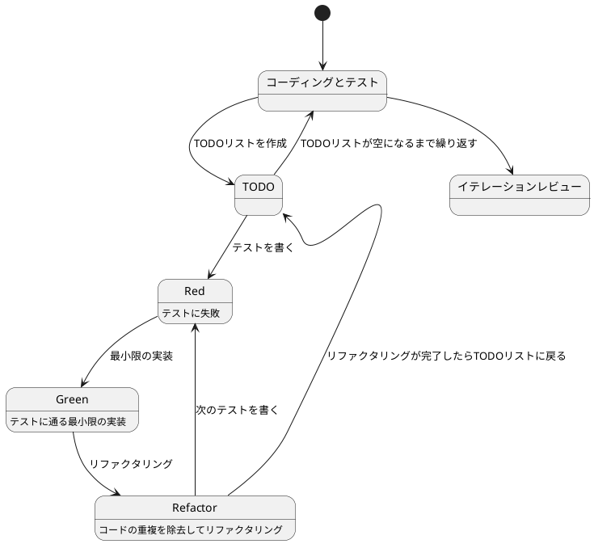

# ぷよぷよから始めるテスト駆動開発入門 Scala.js 日本語コード版

## はじめに

みなさん、こんにちは！今日は私と一緒にテスト駆動開発（TDD）を使って、ぷよぷよゲームを Scala.js で作っていきましょう。さて、プログラミングの旅に出る前に、皆さんは「テスト駆動開発」について聞いたことがありますか？もしかしたら「テストって、コードを書いた後にするものじゃないの？」と思われるかもしれませんね。

> テストを書きながら開発することによって、設計が良い方向に変わり、コードが改善され続け、それによって自分自身が開発に前向きになること、それがテスト駆動開発の目指すゴールです。
>
> — Kent Beck 『テスト駆動開発』 付録C　訳者解説：テスト駆動開発の現在

この記事では、私たちが一緒にぷよぷよゲームを Scala.js で実装しながら、テスト駆動開発の基本的な流れと考え方を学んでいきます。まるでモブプログラミングのセッションのように、あなたと私が一緒に考え、コードを書き、改善していく過程を体験しましょう。「でも、ぷよぷよって結構複雑なゲームじゃないの？」と思われるかもしれませんが、心配いりません。各章では、ユーザーストーリーに基づいた機能を、テスト、実装、解説の順に少しずつ進めていきますよ。一歩一歩、着実に進んでいきましょう！

**この日本語コード版について**：この文書は、識別子（変数名、関数名、クラス名など）に日本語を使用したバージョンです。日本語の識別子を使うことで、コードの意図をより直感的に理解できるようになります。Scala 3 では Unicode の識別子がサポートされているため、日本語の変数名や関数名を自然に使用できます。

### テスト駆動開発のサイクル

さて、テスト駆動開発では、どのように進めていけばいいのでしょうか？「テストを書いてから実装する」というのは分かりましたが、具体的にはどんな手順で進めるのでしょうか？

私がいつも実践しているのは、以下の3つのステップを繰り返すサイクルです。皆さんも一緒にやってみましょう：

1. **Red（赤）**: まず失敗するテストを書きます。「え？わざと失敗するテストを？」と思われるかもしれませんが、これには重要な意味があるんです。これから実装する機能が何をすべきかを明確にするためなんですよ。
2. **Green（緑）**: 次に、テストが通るように、最小限のコードを実装します。この段階では、きれいなコードよりも「とにかく動くこと」を優先します。「最小限」というのがポイントです。必要以上のことはしないようにしましょう。
3. **Refactor（リファクタリング）**: 最後に、コードの品質を改善します。テストが通ることを確認しながら、重複を取り除いたり、わかりやすい名前をつけたりします。「動くけど汚いコード」から「動いてきれいなコード」へと進化させるんです。

> レッド・グリーン・リファクタリング。それがTDDのマントラだ。
>
> — Kent Beck 『テスト駆動開発』

このサイクルを「Red-Green-Refactor」サイクルと呼びます。「赤・緑・リファクタリング」のリズムを刻むように、このサイクルを繰り返していくんです。これによって、少しずつ機能を追加し、コードの品質を高めていきましょう。皆さんも一緒にこのリズムを体感してみてください！



### 開発環境

さて、実際にコードを書く前に、私たちが使用する開発環境について少しお話ししておきましょう。皆さんは「道具選びは仕事の半分」という言葉を聞いたことがありますか？プログラミングでも同じことが言えるんです。

> 道具はあなたの能力を増幅します。道具のできが優れており、簡単に使いこなせるようになっていれば、より生産的になれるのです。
>
> — 達人プログラマー 熟達に向けたあなたの旅（第2版）

「どんなツールを使えばいいの？」と思われるかもしれませんね。今回のプロジェクトでは、以下のツールを使用していきます：

- **言語**: Scala 3 — 強力な型システムと関数型プログラミングの機能を持つ言語です。「型があれば安心してリファクタリングできますよ！」Unicode 識別子のサポートにより、日本語の変数名・関数名が自然に使えます。
- **JavaScript 変換**: Scala.js — Scala のコードを JavaScript に変換し、ブラウザで実行できるようにします。
- **ビルドツール**: sbt — Scala の標準的なビルドツールです。依存関係の管理やコンパイル、テストの実行を担当します。
- **テストフレームワーク**: ScalaTest — Scala における最も人気のあるテストフレームワークの一つです。テスト駆動開発には欠かせないツールですね。
- **静的コード解析**: WartRemover — Scala 用の静的コード解析ツールです。コードの潜在的な問題を検出してくれます。
- **コードフォーマッタ**: Scalafmt — コードのフォーマットを自動で統一してくれます。
- **コードカバレッジ**: scoverage — テストがコードのどれだけをカバーしているかを測定します。
- **バージョン管理**: Git — コードの変更履歴を追跡し、「あれ？昨日までちゃんと動いてたのに...」というときに過去の状態に戻れる魔法のツールです。

これらのツールを使って、テスト駆動開発の流れに沿ってぷよぷよゲームを実装していきましょう。「環境構築って難しそう...」と心配される方もいるかもしれませんが手順に従って進めればそんなに難しいことではありません。詳細はイテレーション0: 環境の構築で解説します。

### 日本語識別子について

「日本語で変数名を書くの？」と驚かれるかもしれませんね。Scala 3 では Unicode 識別子がサポートされているため、以下のように日本語の識別子を使用できます：

```scala
// 日本語識別子の例
val ぷよのX座標 = 2
val ぷよのY座標 = 0
val 回転状態 = 0

def 右に移動する(): Unit = {
  // 実装
}

def 左に移動する(): Unit = {
  // 実装
}

class プレイヤー(設定: 設定情報, ステージ: ステージ, ぷよ画像: ぷよ画像) {
  private var _ぷよのX座標: Int = 設定.ステージ列数 / 2
  private var _ぷよのY座標: Int = 0

  def ぷよのX座標: Int = _ぷよのX座標
  def ぷよのY座標: Int = _ぷよのY座標
}
```

日本語の識別子を使用することで、以下のメリットがあります：

1. **直感的な理解**：コードの意図が母国語で表現されるため、より直感的に理解できます
2. **ドメイン知識の表現**：ゲームの概念（「ぷよ」「回転」「連鎖」など）をそのまま表現できます
3. **コミュニケーション**：チーム内での議論とコードの一貫性が高まります

ただし、ライブラリのインターフェースや設定ファイルなど、外部との境界では英語の識別子を使用することをお勧めします。

## 要件

### ユーザーストーリー

さて、実際にコードを書き始める前に、少し立ち止まって考えてみましょう。「何を作るのか？」という基本的な問いかけです。私たちが作るぷよぷよゲームは、どのような機能を持つべきでしょうか？

アジャイル開発では、この「何を作るのか？」という問いに対して、「ユーザーストーリー」という形で答えを出します。皆さんは「ユーザーストーリー」という言葉を聞いたことがありますか？

> ユーザーストーリーは、ソフトウェア要求を表現するための軽量な手法である。ユーザーストーリーは、システムについてユーザーまたは顧客の視点からフィーチャの概要を記述したものだ。
> ユーザーストーリーには形式が定められておらず、標準的な記法もない。とはいえ、次のような形式でストーリーを考えてみると便利である。「＜ユーザーの種類＞として、＜機能や性能＞がほしい。それは＜ビジネス価値＞のためだ」という形のテンプレートに従うと、
> たとえば次のようなストーリーを書ける。「本の購入者として、ＩＳＢＮで本を検索したい。それは探している本をすばやく見つけるためだ」
>
> — Mike Cohn 『アジャイルな見積と計画づくり』

つまり、「プレイヤーとして、〇〇ができる（〇〇したいから）」という形式で機能を表現するんです。これによって、「誰のため」の「どんな機能」を「なぜ」作るのかが明確になります。素晴らしいですよね！

では、私たちのぷよぷよゲームでは、どんなユーザーストーリーが考えられるでしょうか？一緒に考えてみましょう：

- プレイヤーとして、新しいゲームを開始できる（ゲームの基本機能として必要ですよね！）
- プレイヤーとして、落ちてくるぷよを左右に移動できる（ぷよを適切な位置に配置したいですよね）
- プレイヤーとして、落ちてくるぷよを回転できる（戦略的にぷよを配置するために必要です）
- プレイヤーとして、ぷよを素早く落下させることができる（「早く次のぷよを落としたい！」というときのために）
- プレイヤーとして、同じ色のぷよを4つ以上つなげると消去できる（これがぷよぷよの醍醐味ですよね！）
- プレイヤーとして、連鎖反応を起こしてより高いスコアを獲得できる（「れ〜んさ〜ん！」と叫びたくなりますよね）
- プレイヤーとして、全消し（ぜんけし）ボーナスを獲得できる（「やった！全部消えた！」という達成感を味わいたいですよね）
- プレイヤーとして、ゲームオーバーになるとゲーム終了の演出を見ることができる（終わりが明確でないとモヤモヤしますよね）
- プレイヤーとして、現在のスコアを確認できる（「今どれくらい点数取れてるかな？」と気になりますよね）
- プレイヤーとして、キーボードでぷよを操作できる（PCでプレイするなら必須ですよね）

「うわ、結構たくさんあるな...」と思われるかもしれませんが、心配いりません！これらのユーザーストーリーを一つずつ実装していくことで、徐々にゲームを完成させていきましょう。テスト駆動開発の素晴らしいところは、各ストーリーを小さなタスクに分解し、テスト→実装→リファクタリングのサイクルで少しずつ進められることなんです。一歩一歩、着実に進んでいきましょう！

## イテレーション 1: ぷよを表示する（日本語コード版サンプル）

### ユーザーストーリー

> プレイヤーとして、画面にぷよが表示されることを確認できる

### テスト: ぷよの表示

```scala
// src/test/scala/puyopuyo/プレイヤー仕様.scala
import org.scalatest.flatspec.AnyFlatSpec
import org.scalatest.matchers.should.Matchers

class プレイヤー仕様 extends AnyFlatSpec with Matchers {
  var 設定: 設定情報 = _
  var ぷよ画像: ぷよ画像 = _
  var ステージ: ステージ = _
  var プレイヤー: プレイヤークラス = _

  "ぷよの表示" should "新しいぷよを作成できる" in {
    プレイヤー.新しいぷよを作成()

    // ぷよの初期位置を確認
    プレイヤー.ぷよのX座標 shouldBe (設定.ステージ列数 / 2)
    プレイヤー.ぷよのY座標 shouldBe 0
  }

  it should "ぷよの種類が1から4の範囲である" in {
    プレイヤー.新しいぷよを作成()

    val ぷよの種類 = プレイヤー.ぷよの種類
    ぷよの種類 should (be >= 1 and be <= 4)
  }

  it should "2つ目のぷよの種類が1から4の範囲である" in {
    プレイヤー.新しいぷよを作成()

    val 二つ目のぷよの種類 = プレイヤー.二つ目のぷよの種類
    二つ目のぷよの種類 should (be >= 1 and be <= 4)
  }
}
```

### 実装: ぷよの表示

```scala
// src/main/scala/puyopuyo/プレイヤー.scala
import org.scalajs.dom
import scala.util.Random

class プレイヤークラス(設定: 設定情報, ステージ: ステージ, ぷよ画像: ぷよ画像) {
  private var _ぷよのX座標: Int = 0
  private var _ぷよのY座標: Int = 0
  private var _ぷよの種類: Int = 0
  private var _二つ目のぷよの種類: Int = 0
  private var _回転状態: Int = 0
  private val 乱数生成器 = new Random()

  // アクセサ
  def ぷよのX座標: Int = _ぷよのX座標
  def ぷよのY座標: Int = _ぷよのY座標
  def ぷよの種類: Int = _ぷよの種類
  def 二つ目のぷよの種類: Int = _二つ目のぷよの種類
  def 回転状態: Int = _回転状態

  def 新しいぷよを作成(): Unit = {
    // ぷよの初期位置を設定
    _ぷよのX座標 = 設定.ステージ列数 / 2
    _ぷよのY座標 = 0

    // ランダムにぷよの種類を決定（1〜4）
    _ぷよの種類 = 乱数生成器.nextInt(4) + 1
    _二つ目のぷよの種類 = 乱数生成器.nextInt(4) + 1

    // 回転状態を初期化
    _回転状態 = 0
  }

  def 描画する(): Unit = {
    // 軸ぷよを描画
    ぷよ画像.描画する(
      _ぷよの種類,
      _ぷよのX座標,
      _ぷよのY座標
    )

    // 2つ目のぷよを描画（回転状態に応じて位置を計算）
    val オフセットX = Array(0, 1, 0, -1)
    val オフセットY = Array(-1, 0, 1, 0)

    ぷよ画像.描画する(
      _二つ目のぷよの種類,
      _ぷよのX座標 + オフセットX(_回転状態),
      _ぷよのY座標 + オフセットY(_回転状態)
    )
  }
}
```

### 設定情報クラス

```scala
// src/main/scala/puyopuyo/設定情報.scala
class 設定情報 {
  val ステージ列数: Int = 6
  val ステージ行数: Int = 12
  val ぷよのサイズ: Int = 32

  def ステージの幅: Int = ステージ列数 * ぷよのサイズ
  def ステージの高さ: Int = ステージ行数 * ぷよのサイズ
}
```

### ゲームモード列挙型

```scala
// src/main/scala/puyopuyo/ゲームモード.scala
enum ゲームモード {
  case 新しいぷよ
  case プレイ中
  case 落下チェック
  case 落下中
  case 消去チェック
  case 消去中
}
```

このように、日本語の識別子を使用することで、コードの意図が一目で理解できるようになります。特にゲームのようなドメイン固有の概念が多いプロジェクトでは、日本語の識別子が有効です。

## まとめ

この日本語コード版では、Scala 3 の Unicode 識別子サポートを活用して、より直感的で理解しやすいコードを書く方法を示しました。日本語の識別子を使用することで：

1. **コードの可読性向上**：母国語で記述されるため、コードの意図がより明確になります
2. **ドメイン知識の表現**：ビジネスロジックやゲームの概念をそのまま表現できます
3. **学習コストの削減**：英語の翻訳を考える必要がなく、概念の理解に集中できます

ただし、以下の点に注意が必要です：

- ライブラリのインターフェースは英語のまま使用する
- 設定ファイルやビルド定義は英語を使用する
- チーム内で命名規則を統一する
- IDE のサポート状況を確認する

完全な実装については、通常版のドキュメント『ぷよぷよから始めるテスト駆動開発入門 Scala.js 版』を参照してください。日本語コード版は、識別子を日本語にした場合の実装例を示すものです。
