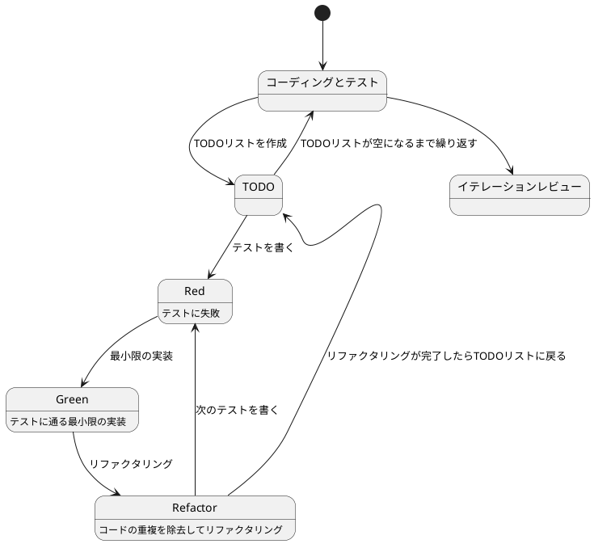

# ぷよぷよから始めるテスト駆動開発入門 Scala.js 版

## はじめに

みなさん、こんにちは！今日は私と一緒にテスト駆動開発（TDD）を使って、ぷよぷよゲームを Scala.js で作っていきましょう。さて、プログラミングの旅に出る前に、皆さんは「テスト駆動開発」について聞いたことがありますか？もしかしたら「テストって、コードを書いた後にするものじゃないの？」と思われるかもしれませんね。

> テストを書きながら開発することによって、設計が良い方向に変わり、コードが改善され続け、それによって自分自身が開発に前向きになること、それがテスト駆動開発の目指すゴールです。
>
> — Kent Beck 『テスト駆動開発』 付録C　訳者解説：テスト駆動開発の現在

この記事では、私たちが一緒にぷよぷよゲームを Scala.js で実装しながら、テスト駆動開発の基本的な流れと考え方を学んでいきます。まるでモブプログラミングのセッションのように、あなたと私が一緒に考え、コードを書き、改善していく過程を体験しましょう。「でも、ぷよぷよって結構複雑なゲームじゃないの？」と思われるかもしれませんが、心配いりません。各章では、ユーザーストーリーに基づいた機能を、テスト、実装、解説の順に少しずつ進めていきますよ。一歩一歩、着実に進んでいきましょう！

### テスト駆動開発のサイクル

さて、テスト駆動開発では、どのように進めていけばいいのでしょうか？「テストを書いてから実装する」というのは分かりましたが、具体的にはどんな手順で進めるのでしょうか？

私がいつも実践しているのは、以下の3つのステップを繰り返すサイクルです。皆さんも一緒にやってみましょう：

1. **Red（赤）**: まず失敗するテストを書きます。「え？わざと失敗するテストを？」と思われるかもしれませんが、これには重要な意味があるんです。これから実装する機能が何をすべきかを明確にするためなんですよ。
2. **Green（緑）**: 次に、テストが通るように、最小限のコードを実装します。この段階では、きれいなコードよりも「とにかく動くこと」を優先します。「最小限」というのがポイントです。必要以上のことはしないようにしましょう。
3. **Refactor（リファクタリング）**: 最後に、コードの品質を改善します。テストが通ることを確認しながら、重複を取り除いたり、わかりやすい名前をつけたりします。「動くけど汚いコード」から「動いてきれいなコード」へと進化させるんです。

> レッド・グリーン・リファクタリング。それがTDDのマントラだ。
>
> — Kent Beck 『テスト駆動開発』

このサイクルを「Red-Green-Refactor」サイクルと呼びます。「赤・緑・リファクタリング」のリズムを刻むように、このサイクルを繰り返していくんです。これによって、少しずつ機能を追加し、コードの品質を高めていきましょう。皆さんも一緒にこのリズムを体感してみてください！



### 開発環境

さて、実際にコードを書く前に、私たちが使用する開発環境について少しお話ししておきましょう。皆さんは「道具選びは仕事の半分」という言葉を聞いたことがありますか？プログラミングでも同じことが言えるんです。

> 道具はあなたの能力を増幅します。道具のできが優れており、簡単に使いこなせるようになっていれば、より生産的になれるのです。
>
> — 達人プログラマー 熟達に向けたあなたの旅（第2版）

「どんなツールを使えばいいの？」と思われるかもしれませんね。今回のプロジェクトでは、以下のツールを使用していきます：

- **言語**: Scala 3 — 強力な型システムと関数型プログラミングの機能を持つ言語です。「型があれば安心してリファクタリングできますよ！」
- **JavaScript 変換**: Scala.js — Scala のコードを JavaScript に変換し、ブラウザで実行できるようにします。
- **ビルドツール**: sbt — Scala の標準的なビルドツールです。依存関係の管理やコンパイル、テストの実行を担当します。
- **テストフレームワーク**: ScalaTest — Scala における最も人気のあるテストフレームワークの一つです。テスト駆動開発には欠かせないツールですね。
- **静的コード解析**: WartRemover — Scala 用の静的コード解析ツールです。コードの潜在的な問題を検出してくれます。
- **コードフォーマッタ**: Scalafmt — コードのフォーマットを自動で統一してくれます。
- **コードカバレッジ**: scoverage — テストがコードのどれだけをカバーしているかを測定します。
- **バージョン管理**: Git — コードの変更履歴を追跡し、「あれ？昨日までちゃんと動いてたのに...」というときに過去の状態に戻れる魔法のツールです。

これらのツールを使って、テスト駆動開発の流れに沿ってぷよぷよゲームを実装していきましょう。「環境構築って難しそう...」と心配される方もいるかもしれませんが手順に従って進めればそんなに難しいことではありません。詳細はイテレーション0: 環境の構築で解説します。

## 要件

### ユーザーストーリー

さて、実際にコードを書き始める前に、少し立ち止まって考えてみましょう。「何を作るのか？」という基本的な問いかけです。私たちが作るぷよぷよゲームは、どのような機能を持つべきでしょうか？

アジャイル開発では、この「何を作るのか？」という問いに対して、「ユーザーストーリー」という形で答えを出します。皆さんは「ユーザーストーリー」という言葉を聞いたことがありますか？

> ユーザーストーリーは、ソフトウェア要求を表現するための軽量な手法である。ユーザーストーリーは、システムについてユーザーまたは顧客の視点からフィーチャの概要を記述したものだ。
> ユーザーストーリーには形式が定められておらず、標準的な記法もない。とはいえ、次のような形式でストーリーを考えてみると便利である。「＜ユーザーの種類＞として、＜機能や性能＞がほしい。それは＜ビジネス価値＞のためだ」という形のテンプレートに従うと、
> たとえば次のようなストーリーを書ける。「本の購入者として、ＩＳＢＮで本を検索したい。それは探している本をすばやく見つけるためだ」
>
> — Mike Cohn 『アジャイルな見積と計画づくり』

つまり、「プレイヤーとして、〇〇ができる（〇〇したいから）」という形式で機能を表現するんです。これによって、「誰のため」の「どんな機能」を「なぜ」作るのかが明確になります。素晴らしいですよね！

では、私たちのぷよぷよゲームでは、どんなユーザーストーリーが考えられるでしょうか？一緒に考えてみましょう：

- プレイヤーとして、新しいゲームを開始できる（ゲームの基本機能として必要ですよね！）
- プレイヤーとして、落ちてくるぷよを左右に移動できる（ぷよを適切な位置に配置したいですよね）
- プレイヤーとして、落ちてくるぷよを回転できる（戦略的にぷよを配置するために必要です）
- プレイヤーとして、ぷよを素早く落下させることができる（「早く次のぷよを落としたい！」というときのために）
- プレイヤーとして、同じ色のぷよを4つ以上つなげると消去できる（これがぷよぷよの醍醐味ですよね！）
- プレイヤーとして、連鎖反応を起こしてより高いスコアを獲得できる（「れ〜んさ〜ん！」と叫びたくなりますよね）
- プレイヤーとして、全消し（ぜんけし）ボーナスを獲得できる（「やった！全部消えた！」という達成感を味わいたいですよね）
- プレイヤーとして、ゲームオーバーになるとゲーム終了の演出を見ることができる（終わりが明確でないとモヤモヤしますよね）
- プレイヤーとして、現在のスコアを確認できる（「今どれくらい点数取れてるかな？」と気になりますよね）
- プレイヤーとして、キーボードでぷよを操作できる（PCでプレイするなら必須ですよね）
- プレイヤーとして、タッチ操作でぷよを操作できる（スマホでもプレイしたいですよね）

「うわ、結構たくさんあるな...」と思われるかもしれませんが、心配いりません！これらのユーザーストーリーを一つずつ実装していくことで、徐々にゲームを完成させていきましょう。テスト駆動開発の素晴らしいところは、各ストーリーを小さなタスクに分解し、テスト→実装→リファクタリングのサイクルで少しずつ進められることなんです。一歩一歩、着実に進んでいきましょう！

## イテレーション0: 環境の構築

...と言いたいところですがまずは環境の構築をしなければなりません。「プログラミングなんてどの言語でやるか決めるぐらいでしょ？」と思うかもしれませんが家を建てるときにしっかりとした基礎工事が必要なように開発環境もしっかりとした準備が必要です。
家を建てた後に基礎がダメだと困ったことになりますからね。

### ソフトウェア開発の三種の神器

良いコードを書き続けるためには何が必要になるでしょうか？それは[ソフトウェア開発の三種の神器](https://t-wada.hatenablog.jp/entry/clean-code-that-works)と呼ばれるものです。

> 今日のソフトウェア開発の世界において絶対になければならない3つの技術的な柱があります。
> 三本柱と言ったり、三種の神器と言ったりしていますが、それらは
>
>   - バージョン管理
>   - テスティング
>   - 自動化
>
> の3つです。
>
> —  https://t-wada.hatenablog.jp/entry/clean-code-that-works

本章では開発環境のセットアップとして、これら三種の神器を準備していきます。環境構築は退屈に感じるかもしれませんが、これらのツールがあることで、安心してコードを書くことができるようになります。一緒に進めていきましょう！

### バージョン管理: Gitとコミットメッセージ

バージョン管理システムとして Git を使います。Git については既に使用していると仮定しますが、コミットメッセージについて1つだけ重要なルールを確認しておきましょう。

#### コミットメッセージの書き方

私たちのプロジェクトでは、[Conventional Commits](https://www.conventionalcommits.org/ja/)の書式に従ってコミットメッセージを書きます。具体的には、それぞれのコミットメッセージはヘッダ、ボディ、フッタで構成されます。

```
<タイプ>(<スコープ>): <タイトル>
<空行>
<ボディ>
<空行>
<フッタ>
```

ヘッダは必須で、スコープは任意です。コミットメッセージのタイトルは50文字までにしましょう（GitHub上で読みやすくなります）。

コミットのタイプは次を用います：

- **feat**: 新しい機能
- **fix**: バグ修正
- **docs**: ドキュメント変更のみ
- **style**: コードに影響を与えない変更（空白、フォーマットなど）
- **refactor**: 機能追加でもバグ修正でもないコード変更
- **perf**: パフォーマンスを改善するコード変更
- **test**: テストの追加や修正
- **chore**: ビルドプロセスや補助ツールの変更

例えば：

```bash
git commit -m 'feat: ゲーム初期化機能を追加'
git commit -m 'refactor: メソッドの抽出'
git commit -m 'test: ぷよ消去のテストケースを追加'
```

### テスティング: パッケージマネージャとテスト環境

良いコードを書くためには、コードが正しく動作することを確認するテストが欠かせません。そのためのツールをセットアップしていきましょう。

#### パッケージマネージャ: sbt

外部ライブラリやツールを管理するために **sbt** を使います。

> sbtとは、Scalaで記述されたビルドツールで、Scalaプロジェクトの依存関係管理、コンパイル、テスト実行、パッケージング等を行います。
>
> —  [公式ドキュメント](https://www.scala-sbt.org/)

まず、プロジェクトディレクトリを作成し、`build.sbt` を作成して依存関係を設定します：

```bash
mkdir puyo-puyo-game
cd puyo-puyo-game
```

`build.sbt` を以下のように作成します：

```scala
ThisBuild / scalaVersion := "3.3.3"
ThisBuild / version := "0.1.0-SNAPSHOT"
ThisBuild / organization := "com.example"
ThisBuild / organizationName := "puyo-puyo"

lazy val root = (project in file("."))
  .enablePlugins(ScalaJSPlugin)
  .settings(
    name := "puyo-puyo-game",
    scalaJSUseMainModuleInitializer := true,

    // テストフレームワーク
    libraryDependencies ++= Seq(
      "org.scalatest" %%% "scalatest" % "3.2.18" % Test
    ),

    // Scala.js DOM ライブラリ
    libraryDependencies += "org.scala-js" %%% "scalajs-dom" % "2.8.0"
  )
```

プロジェクト構造を作成します：

```bash
mkdir -p src/main/scala
mkdir -p src/test/scala
mkdir -p project
```

`project/build.properties` を作成します：

```properties
sbt.version=1.9.9
```

`project/plugins.sbt` を作成します：

```scala
addSbtPlugin("org.scala-js" % "sbt-scalajs" % "1.16.0")
addSbtPlugin("org.scalameta" % "sbt-scalafmt" % "2.5.0")
addSbtPlugin("org.wartremover" % "sbt-wartremover" % "3.1.3")
addSbtPlugin("org.scoverage" % "sbt-scoverage" % "2.0.9")
```

これで、テストを実行する準備ができました：

```bash
sbt test
```

### 自動化: コード品質の自動管理

良いコードを書き続けるためには、コードの品質を自動的にチェックし、維持していく仕組みが必要です。ここでは、静的コード解析、コードフォーマット、コードカバレッジ、そしてタスクランナーを設定します。

#### 静的コード解析: WartRemover

静的コード解析ツールとして **WartRemover** を使います。WartRemoverは、コードを実行せずに潜在的な問題を検出するツールです。

`build.sbt` にプラグインの設定を追加します：

```scala
lazy val root = (project in file("."))
  .enablePlugins(ScalaJSPlugin)
  .settings(
    name := "puyo-puyo-game",
    scalaJSUseMainModuleInitializer := true,

    libraryDependencies ++= Seq(
      "org.scalatest" %%% "scalatest" % "3.2.18" % Test
    ),

    libraryDependencies += "org.scala-js" %%% "scalajs-dom" % "2.8.0",

    // WartRemover 設定
    wartremoverWarnings ++= Warts.unsafe
  )
```

静的コード解析を実行してみましょう：

```bash
sbt compile
```

WartRemoverは以下のような問題を検出してくれます：
- Null参照の使用
- var（可変変数）の不適切な使用
- Anyの使用
- 例外の不適切な使用

例えば、以下のコードでは警告が出力されます：

```scala
// 警告が出るコード例
def badExample(): Any = {
  var x = 1  // var使用の警告
  x = 2
  null      // null使用の警告
}
```

このような問題を事前に発見することで、より安全で保守しやすいコードを書くことができます。

#### コードフォーマッタ: Scalafmt

コードのフォーマットを統一するために **Scalafmt** を使います。

> 優れたソースコードは「目に優しい」ものでなければいけない。
>
> —  リーダブルコード

`.scalafmt.conf` ファイルを作成して設定を追加しましょう：

```conf
version = "3.7.17"
runner.dialect = scala3

maxColumn = 100
indent.main = 2
indent.callSite = 2
indent.ctrlSite = 2
indent.defnSite = 2
indent.caseSite = 2

rewrite.rules = [RedundantBraces, RedundantParens, SortModifiers]
rewrite.redundantBraces.stringInterpolation = true
```

フォーマットのチェックと自動修正は以下のコマンドで実行できます：

```bash
sbt scalafmtCheck  # チェックのみ
sbt scalafmt       # 自動修正
```

#### コードカバレッジ: scoverage

テストがコードのどれだけをカバーしているかを確認するために、**scoverage** を使います。

> コード網羅率（コードもうらりつ、英: Code coverage）は、ソフトウェアテストで用いられる尺度の1つである。プログラムのソースコードがテストされた割合を意味する。

`build.sbt` に設定を追加します：

```scala
lazy val root = (project in file("."))
  .enablePlugins(ScalaJSPlugin)
  .settings(
    name := "puyo-puyo-game",
    scalaJSUseMainModuleInitializer := true,

    libraryDependencies ++= Seq(
      "org.scalatest" %%% "scalatest" % "3.2.18" % Test
    ),

    libraryDependencies += "org.scala-js" %%% "scalajs-dom" % "2.8.0",

    wartremoverWarnings ++= Warts.unsafe,

    // カバレッジ設定
    coverageEnabled := true,
    coverageMinimumStmtTotal := 80,
    coverageFailOnMinimum := false,
    coverageHighlighting := true
  )
```

カバレッジレポートを生成するには：

```bash
sbt clean coverage test coverageReport
```

実行後、`target/scala-3.3.3/scoverage-report` フォルダ内の `index.html` を開くと、視覚的にカバレッジ状況を確認できます。

#### タスクランナー: sbt カスタムタスク

複数のコマンドを覚えるのは大変です。sbt のカスタムタスクを使って、よく使うコマンドをタスクとして登録し、簡単に実行できるようにします。

`build.sbt` にカスタムタスクを追加します：

```scala
ThisBuild / scalaVersion := "3.3.3"
ThisBuild / version := "0.1.0-SNAPSHOT"
ThisBuild / organization := "com.example"
ThisBuild / organizationName := "puyo-puyo"

lazy val root = (project in file("."))
  .enablePlugins(ScalaJSPlugin)
  .settings(
    name := "puyo-puyo-game",
    scalaJSUseMainModuleInitializer := true,

    libraryDependencies ++= Seq(
      "org.scalatest" %%% "scalatest" % "3.2.18" % Test
    ),

    libraryDependencies += "org.scala-js" %%% "scalajs-dom" % "2.8.0",

    wartremoverWarnings ++= Warts.unsafe,

    coverageEnabled := true,
    coverageMinimumStmtTotal := 80,
    coverageFailOnMinimum := false,
    coverageHighlighting := true
  )

// カスタムタスクの定義
lazy val format = taskKey[Unit]("Format source code")
format := {
  (Compile / scalafmt).value
  (Test / scalafmt).value
}

lazy val formatCheck = taskKey[Unit]("Check source code formatting")
formatCheck := {
  (Compile / scalafmtCheck).value
  (Test / scalafmtCheck).value
}

lazy val lint = taskKey[Unit]("Run static analysis")
lint := {
  (Compile / compile).value
}

lazy val coverage = taskKey[Unit]("Run tests with coverage")
coverage := {
  (Test / coverageReport).value
}

lazy val check = taskKey[Unit]("Run all quality checks")
check := {
  formatCheck.value
  lint.value
  (Test / test).value
  coverage.value
}
```

カスタムタスクを実行してみます：

```bash
# フォーマットチェック
sbt formatCheck

# 静的解析実行
sbt lint

# テストとカバレッジ実行
sbt coverage

# 全ての品質チェック実行
sbt check
```

`check` タスクを実行することで、フォーマットチェック、静的解析、テスト、カバレッジまで一度に実行できます。

#### タスクの自動実行

ファイルを編集するたびに手動でコマンドを実行するのは面倒です。sbt の `~` 接頭辞を使って、ファイルの変更を検知して自動的にテストやフォーマットを実行できるようにします。

```bash
# テストの自動実行
sbt "~ test"

# フォーマットチェックの自動実行
sbt "~ formatCheck"

# 全ての品質チェックの自動実行
sbt "~ check"
```

開発時のワークフロー例：

1. ターミナルで `sbt "~ test"` を実行してファイル監視を開始
2. コードを編集・保存
3. 自動的にテストが実行される
4. テストが失敗した場合は、コードを修正して再度保存
5. 自動的にテストが再実行される

この自動化により、**レッド→グリーン→リファクタ** のTDDサイクルをより効率的に回すことができます。

監視を停止するには `Ctrl+C` を押すか、sbtコンソールで `Enter` キーを押します。

```bash
# ファイル監視の開始
$ sbt
sbt:puyo-puyo-game> ~ test
[info] 1. Monitoring source files for puyo-puyo-game/test...
[info]    Press <enter> to interrupt or '?' for more options.
# ファイルを変更すると自動でテストが実行される
# Enter キーで監視停止
```

### 環境構築の完了

お疲れさまでした！これで開発環境のセットアップが完了しました。以下のツールが使えるようになりました：

- **バージョン管理**: Git（Conventional Commits形式）
- **テスティング**: ScalaTest（Scala.js 対応）
- **静的コード解析**: WartRemover
- **コードフォーマット**: Scalafmt
- **コードカバレッジ**: scoverage
- **タスクランナー**: sbt カスタムタスク
- **自動化**: sbt ファイル監視（`~` 接頭辞）

これらのツールにより、[ソフトウェア開発の三種の神器](https://t-wada.hatenablog.jp/entry/clean-code-that-works)が揃いました。これから安心してテスト駆動開発に取り組むことができます！

### 環境構成

実際に構築した開発環境の構成は以下の通りです：

#### プロジェクト構造

```
puyo-puyo-game/
├── src/
│   ├── main/
│   │   └── scala/
│   │       └── com/
│   │           └── example/
│   │               └── puyo/
│   │                   └── Main.scala
│   └── test/
│       └── scala/
│           └── com/
│               └── example/
│                   └── puyo/
│                       └── MainSpec.scala
├── project/
│   ├── build.properties
│   └── plugins.sbt
├── build.sbt
├── .scalafmt.conf
└── .gitignore
```

#### build.sbt の完全な設定

```scala
ThisBuild / scalaVersion := "3.3.3"
ThisBuild / version := "0.1.0-SNAPSHOT"
ThisBuild / organization := "com.example"
ThisBuild / organizationName := "puyo-puyo"

lazy val root = (project in file("."))
  .enablePlugins(ScalaJSPlugin)
  .settings(
    name := "puyo-puyo-game",
    scalaJSUseMainModuleInitializer := true,

    libraryDependencies ++= Seq(
      "org.scalatest" %%% "scalatest" % "3.2.18" % Test
    ),

    libraryDependencies += "org.scala-js" %%% "scalajs-dom" % "2.8.0",

    wartremoverWarnings ++= Warts.unsafe,

    coverageEnabled := true,
    coverageMinimumStmtTotal := 80,
    coverageFailOnMinimum := false,
    coverageHighlighting := true
  )

// カスタムタスクの定義
lazy val format = taskKey[Unit]("Format source code")
format := {
  (Compile / scalafmt).value
  (Test / scalafmt).value
}

lazy val formatCheck = taskKey[Unit]("Check source code formatting")
formatCheck := {
  (Compile / scalafmtCheck).value
  (Test / scalafmtCheck).value
}

lazy val lint = taskKey[Unit]("Run static analysis")
lint := {
  (Compile / compile).value
}

lazy val coverage = taskKey[Unit]("Run tests with coverage")
coverage := {
  (Test / coverageReport).value
}

lazy val check = taskKey[Unit]("Run all quality checks")
check := {
  formatCheck.value
  lint.value
  (Test / test).value
  coverage.value
}
```

#### project/build.properties

```properties
sbt.version=1.9.9
```

#### project/plugins.sbt

```scala
addSbtPlugin("org.scala-js" % "sbt-scalajs" % "1.16.0")
addSbtPlugin("org.scalameta" % "sbt-scalafmt" % "2.5.0")
addSbtPlugin("org.wartremover" % "sbt-wartremover" % "3.1.3")
addSbtPlugin("org.scoverage" % "sbt-scoverage" % "2.0.9")
```

#### .scalafmt.conf

```conf
version = "3.7.17"
runner.dialect = scala3

maxColumn = 100
indent.main = 2
indent.callSite = 2
indent.ctrlSite = 2
indent.defnSite = 2
indent.caseSite = 2

rewrite.rules = [RedundantBraces, RedundantParens, SortModifiers]
rewrite.redundantBraces.stringInterpolation = true
```

#### .gitignore

```
# sbt
target/
project/target/
project/project/

# Scala
*.class
*.log

# IDE
.idea/
.bsp/
.metals/
.vscode/

# OS
.DS_Store
```

#### 環境構築の確認

環境構築が正しく完了したことを確認するには、以下のコマンドを実行します：

```bash
sbt check
```

このコマンドは以下の処理を順次実行します：

1. Scalafmt によるコードフォーマットチェック
2. WartRemover による静的解析
3. ScalaTest によるテスト実行
4. scoverage によるカバレッジレポート生成

すべてのチェックが成功すれば、環境構築は完了です。

では、実際のゲーム開発に進みましょう！

## まとめ

イテレーション0では、ぷよぷよゲームを Scala.js で開発するための環境を構築しました。

**ソフトウェア開発の三種の神器** である「バージョン管理」「テスティング」「自動化」を準備することで、安心してテスト駆動開発に取り組める基盤が整いました。

次のイテレーションでは、実際にゲームのコードを書き始めます。テスト駆動開発のサイクル（Red-Green-Refactor）に従って、一歩ずつ確実に機能を実装していきましょう！

開発を始める際は、まず `sbt "~ test"` を実行して、後はコードを書くことに集中しましょう！

## イテレーション1: ゲーム開始の実装

さあ、いよいよコードを書き始めましょう！テスト駆動開発では、小さなイテレーション（反復）で機能を少しずつ追加していきます。最初のイテレーションでは、最も基本的な機能である「ゲームの開始」を実装します。

> システム構築はどこから始めるべきだろうか。システム構築が終わったらこうなる、というストーリーを語るところからだ。
>
> — Kent Beck 『テスト駆動開発』

### ユーザーストーリー

まずは、このイテレーションで実装するユーザーストーリーを確認しましょう：

> プレイヤーとして、新しいゲームを開始できる

このシンプルなストーリーから始めることで、ゲームの基本的な構造を作り、後続の機能追加の土台を築くことができます。では、テスト駆動開発のサイクルに従って、まずはテストから書いていきましょう！

### TODOリスト

さて、ユーザーストーリーを実装するために、まずはTODOリストを作成しましょう。TODOリストは、大きな機能を小さなタスクに分解するのに役立ちます。

> 何をテストすべきだろうか - 着手する前に、必要になりそうなテストをリストに書き出しておこう。
>
> — Kent Beck 『テスト駆動開発』

私たちの「新しいゲームを開始できる」というユーザーストーリーを実現するためには、どのようなタスクが必要でしょうか？考えてみましょう：

- ゲームの初期化処理を実装する（ゲームの状態や必要なコンポーネントを設定する）
- ゲーム画面を表示する（プレイヤーが視覚的にゲームを認識できるようにする）
- 新しいぷよを生成する（ゲーム開始時に最初のぷよを作成する）
- ゲームループを開始する（ゲームの継続的な更新と描画を行う）

これらのタスクを一つずつ実装していきましょう。テスト駆動開発では、各タスクに対してテスト→実装→リファクタリングのサイクルを回します。まずは「ゲームの初期化処理」から始めましょう！

### テスト: ゲームの初期化

さて、TODOリストの最初のタスク「ゲームの初期化処理を実装する」に取り掛かりましょう。テスト駆動開発では、まずテストを書くことから始めます。

> テストファースト
>
> いつテストを書くべきだろうか——それはテスト対象のコードを書く前だ。
>
> — Kent Beck 『テスト駆動開発』

では、ゲームの初期化処理をテストするコードを書いてみましょう。何をテストすべきでしょうか？ゲームが初期化されたとき、必要なコンポーネントが正しく作成され、ゲームの状態が適切に設定されていることを確認する必要がありますね。

```scala
// src/test/scala/com/example/puyo/GameSpec.scala
package com.example.puyo

import org.scalatest.flatspec.AnyFlatSpec
import org.scalatest.matchers.should.Matchers
import org.scalatest.BeforeAndAfterEach

class GameSpec extends AnyFlatSpec with Matchers with BeforeAndAfterEach {
  var game: Game = _

  override def beforeEach(): Unit = {
    game = new Game()
  }

  "Game" should "create necessary components when initialized" in {
    game.initialize()

    game.config should not be null
    game.puyoImage should not be null
    game.stage should not be null
    game.player should not be null
    game.score should not be null
  }

  it should "set game mode to Start when initialized" in {
    game.initialize()

    game.mode shouldBe GameMode.Start
  }
}
```

このテストでは、`Game`クラスの`initialize`メソッドが正しく動作することを確認しています。具体的には、必要なコンポーネント（Config, PuyoImage, Stage, Player, Score）が作成され、ゲームモードが`Start`に設定されることを検証しています。

### 実装: ゲームの初期化

テストを書いたら、次に実行してみましょう。どうなるでしょうか？

```
[error] not found: object Game
```

おっと！まだ`Game`クラスを実装していないので、当然エラーになりますね。これがテスト駆動開発の「Red（赤）」の状態です。テストが失敗することを確認できました。

> アサートファースト
>
> ではテストはどこから書き始めるべきだろうか。それはテストの終わりにパスすべきアサーションを書くところからだ。
>
> — Kent Beck 『テスト駆動開発』

では、テストが通るように最小限のコードを実装していきましょう。「最小限」というのがポイントです。この段階では、テストが通ることだけを目指して、必要最低限のコードを書きます。

```scala
// src/main/scala/com/example/puyo/Game.scala
package com.example.puyo

enum GameMode:
  case Start, CheckFall, Fall, CheckErase, Erasing, NewPuyo, Playing, GameOver

class Game {
  private var _mode: GameMode = GameMode.Start
  private var frame: Int = 0
  private var combinationCount: Int = 0

  var config: Config = _
  var puyoImage: PuyoImage = _
  var stage: Stage = _
  var player: Player = _
  var score: Score = _

  def mode: GameMode = _mode

  def initialize(): Unit = {
    // 各コンポーネントの初期化
    config = new Config()
    puyoImage = new PuyoImage(config)
    stage = new Stage(config, puyoImage)
    player = new Player(config, stage, puyoImage)
    score = new Score()

    // ゲームモードを設定
    _mode = GameMode.Start
  }
}
```

### 解説: ゲームの初期化

テストが通りましたね！おめでとうございます。これがテスト駆動開発の「Green（緑）」の状態です。

実装したゲームの初期化処理について、少し解説しておきましょう。この処理では、主に以下のことを行っています：

1. 各コンポーネント（Config, PuyoImage, Stage, Player, Score）のインスタンスを作成
2. ゲームモードを`Start`に設定

これにより、ゲームを開始するための準備が整います。各コンポーネントの役割を理解しておくと、今後の実装がスムーズになりますよ：

- **Config**: ゲームの設定値を管理します（画面サイズ、ぷよの大きさなど）
- **PuyoImage**: ぷよの画像を管理します（各色のぷよの画像を読み込み、描画する）
- **Stage**: ゲームのステージ（盤面）を管理します（ぷよの配置状態、消去判定など）
- **Player**: プレイヤーの入力と操作を管理します（キーボード入力の処理、ぷよの移動など）
- **Score**: スコアの計算と表示を管理します（連鎖数に応じたスコア計算など）

このように、責任を明確に分けることで、コードの保守性が高まります。これはオブジェクト指向設計の基本原則の一つ、「単一責任の原則」に従っています。

> 単一責任の原則（SRP）：クラスを変更する理由は1つだけであるべき。
>
> — Robert C. Martin 『Clean Architecture』

また、Scala 3 の `enum` を使ってゲームモードを定義していることに注目してください。これにより、型安全にゲームの状態を表現できます。

```scala
enum GameMode:
  case Start, CheckFall, Fall, CheckErase, Erasing, NewPuyo, Playing, GameOver
```

これは TypeScript の Union 型に相当する、より型安全な表現方法です。

### 実装: 依存クラスの作成

テストを通すために、必要な依存クラス（Config, PuyoImage, Stage, Player, Score）も最小限の実装を作成します。

```scala
// src/main/scala/com/example/puyo/Config.scala
package com.example.puyo

class Config {
  // 最小限の実装
}
```

```scala
// src/main/scala/com/example/puyo/PuyoImage.scala
package com.example.puyo

class PuyoImage(config: Config) {
  // 最小限の実装
}
```

```scala
// src/main/scala/com/example/puyo/Stage.scala
package com.example.puyo

class Stage(config: Config, puyoImage: PuyoImage) {
  // 最小限の実装
}
```

```scala
// src/main/scala/com/example/puyo/Player.scala
package com.example.puyo

class Player(config: Config, stage: Stage, puyoImage: PuyoImage) {
  // 最小限の実装
}
```

```scala
// src/main/scala/com/example/puyo/Score.scala
package com.example.puyo

class Score {
  // 最小限の実装
}
```

これらのクラスは現時点では空の実装ですが、後続のイテレーションで徐々に機能を追加していきます。

### テストの確認

すべての実装が完了したら、テストを実行して確認しましょう：

```bash
sbt test
```

以下の結果が表示されれば成功です：

```
[info] GameSpec:
[info] Game
[info] - should create necessary components when initialized
[info] - should set game mode to Start when initialized
[info] Run completed in 234 milliseconds.
[info] Total number of tests run: 2
[info] Suites: completed 1, aborted 0
[info] Tests: succeeded 2, failed 0, canceled 0, ignored 0, pending 0
[info] All tests passed.
```

### 実装: エントリーポイント

次に、ゲームを起動するエントリーポイント `Main.scala` を実装します。Scala.js では、`JSApp` trait を使ってブラウザで実行可能なアプリケーションを作成できます。

```scala
// src/main/scala/com/example/puyo/Main.scala
package com.example.puyo

import scala.scalajs.js.annotation.JSExportTopLevel
import org.scalajs.dom

@JSExportTopLevel("PuyoPuyoGame")
object Main {
  def main(args: Array[String]): Unit = {
    // ゲームのインスタンスを作成
    val game = new Game()

    // ゲームを初期化
    game.initialize()

    // ゲームループを開始（次のタスクで実装）
    // game.loop()

    dom.console.log("Puyo Puyo Game Started!")
  }
}
```

このコードでは、以下のステップでゲームを開始します：

1. `Game` クラスのインスタンスを作成
2. `initialize()` メソッドで各コンポーネントを初期化
3. コンソールにメッセージを出力

`@JSExportTopLevel` アノテーションにより、このオブジェクトが JavaScript から呼び出し可能になります。

### 実装: HTML ファイル

ゲームを表示するための HTML ファイルを作成します。

```html
<!-- index.html -->
<!DOCTYPE html>
<html lang="ja">
  <head>
    <meta charset="UTF-8" />
    <meta name="viewport" content="width=device-width, initial-scale=1.0" />
    <title>ぷよぷよゲーム</title>
  </head>
  <body>
    <div id="app"></div>
    <script type="text/javascript" src="./target/scala-3.3.3/puyo-puyo-game-fastopt.js"></script>
    <script type="text/javascript">
      PuyoPuyoGame.main();
    </script>
  </body>
</html>
```

この HTML ファイルでは、以下のことを行っています：

1. **基本的な HTML 構造の定義**
   - `lang="ja"` で日本語ページであることを指定
   - ビューポート設定でレスポンシブ対応

2. **アプリケーションのマウントポイント**
   - `<div id="app"></div>` がゲーム画面を表示する場所になります

3. **Scala.js のロード**
   - `fastopt.js` は開発用の最適化されたビルド
   - `PuyoPuyoGame.main()` でゲームを起動

### JavaScript のビルドと実行

Scala.js のコードを JavaScript にコンパイルして実行します：

```bash
# JavaScript へのコンパイル（開発用）
sbt fastLinkJS

# ファイルサーバーの起動（Python を使用）
python -m http.server 8000
```

ブラウザで `http://localhost:8000` を開くと、コンソールに「Puyo Puyo Game Started!」というメッセージが表示されているはずです。

おめでとうございます！リリースに向けて最初の第一歩を踏み出すことができました。これから機能を追加するごとにどんどん実際のゲームの完成に近づく事が確認できます、楽しみですね。

「機能は別々に作りこんで最後に画面と統合するんじゃないの？」と思うもしれません。そういうアプローチもありますが画面イメージが最後まで確認できないともし間違っていたら手戻りが大変です。それに動作するプログラムがどんどん成長するのを見るのは楽しいですからね。

> トップダウンでもボトムアップでもなく、エンドツーエンドで構築していく
>
>    エンドツーエンドで小さな機能を構築し、そこから作業を進めながら問題について学習していく。
>
> — 達人プログラマー 熟達に向けたあなたの旅（第2版）

### イテレーション 1 のまとめ

このイテレーションで実装した内容：

1. **Game クラスの初期化**
   - 必要なコンポーネント（Config, PuyoImage, Stage, Player, Score）の作成
   - ゲームモードの設定
   - Scala 3 の `enum` による型安全な状態管理

2. **エントリーポイントの実装**
   - `Main.scala` でゲームの初期化
   - `@JSExportTopLevel` による JavaScript からの呼び出し
   - ブラウザでの動作確認が可能に

3. **テストの作成**
   - ゲーム初期化のテスト（2 テスト）
   - ScalaTest の FlatSpec スタイルによる読みやすいテスト
   - すべてのテストが成功

4. **Scala.js の特徴**
   - 型安全な JavaScript コード生成
   - Scala のオブジェクト指向と関数型の機能を活用
   - `scalajs-dom` による DOM 操作

次のイテレーションでは、ゲームループの実装とぷよの移動機能を実装していきます。

## イテレーション2: ぷよの移動の実装

さて、前回のイテレーションでゲームの基本的な構造ができましたね。「ゲームが始まったけど、ぷよが動かないと面白くないよね？」と思いませんか？そこで次は、ぷよを左右に移動できるようにしていきましょう！

### ユーザーストーリー

まずは、このイテレーションで実装するユーザーストーリーを確認しましょう：

> プレイヤーとして、落ちてくるぷよを左右に移動できる

「ぷよぷよって、落ちてくるぷよを左右に動かして、うまく積み上げるゲームですよね？」そうです！今回はその基本操作である「左右の移動」を実装していきます。

### TODOリスト

さて、このユーザーストーリーを実現するために、どんなタスクが必要でしょうか？一緒に考えてみましょう。
「ぷよを左右に移動する」という機能を実現するためには、以下のようなタスクが必要そうですね：

- プレイヤーの入力を検出する（キーボードの左右キーが押されたことを検知する）
- ぷよを左右に移動する処理を実装する（実際にぷよの位置を変更する）
- 移動可能かどうかのチェックを実装する（画面の端や他のぷよにぶつかる場合は移動できないようにする）
- 移動後の表示を更新する（画面上でぷよの位置が変わったことを表示する）

「なるほど、順番に実装していけばいいんですね！」そうです、一つずつ進めていきましょう。テスト駆動開発の流れに沿って、まずはテストから書いていきますよ。

### テスト: プレイヤーの入力検出

「最初に何をテストすればいいんでしょうか？」まずは、プレイヤーの入力を検出する部分からテストしていきましょう。キーボードの左右キーが押されたときに、それを正しく検知できるかどうかをテストします。

> テストファースト
>
> いつテストを書くべきだろうか——それはテスト対象のコードを書く前だ。
>
> — Kent Beck 『テスト駆動開発』

```scala
// src/test/scala/com/example/puyo/PlayerSpec.scala
package com.example.puyo

import org.scalatest.flatspec.AnyFlatSpec
import org.scalatest.matchers.should.Matchers
import org.scalatest.BeforeAndAfterEach

class PlayerSpec extends AnyFlatSpec with Matchers with BeforeAndAfterEach {
  var config: Config = _
  var puyoImage: PuyoImage = _
  var stage: Stage = _
  var player: Player = _

  override def beforeEach(): Unit = {
    config = new Config()
    puyoImage = new PuyoImage(config)
    stage = new Stage(config, puyoImage)
    player = new Player(config, stage, puyoImage)
  }

  "Player" should "set left flag when left key is pressed" in {
    // キー入力をシミュレート（テスト用のメソッドを呼び出す）
    player.setKeyState("ArrowLeft", pressed = true)

    player.inputKeyLeft shouldBe true
  }

  it should "set right flag when right key is pressed" in {
    player.setKeyState("ArrowRight", pressed = true)

    player.inputKeyRight shouldBe true
  }

  it should "clear flag when key is released" in {
    player.setKeyState("ArrowLeft", pressed = true)
    player.inputKeyLeft shouldBe true

    player.setKeyState("ArrowLeft", pressed = false)
    player.inputKeyLeft shouldBe false
  }
}
```

「このテストは何をしているんですか？」このテストでは、キーボードの左右キーが押されたときと離されたときに、`Player`クラスの中の対応するフラグが正しく設定されるかどうかを確認しています。

Scala.js では DOM イベントのシミュレートがテスト環境で難しいため、テスト用の`setKeyState`メソッドを用意してキー入力をテストします。これにより、ビジネスロジックを独立してテストできます。

### 実装: プレイヤーの入力検出

「失敗するテストができたので、次は実装ですね！」そうです！テストが通るように、最小限のコードを実装していきましょう。

```scala
// src/main/scala/com/example/puyo/Player.scala
package com.example.puyo

import org.scalajs.dom
import org.scalajs.dom.{KeyboardEvent, document}

class Player(
    config: Config,
    stage: Stage,
    puyoImage: PuyoImage
) {
  private var _inputKeyLeft: Boolean = false
  private var _inputKeyRight: Boolean = false
  private var _inputKeyUp: Boolean = false
  private var _inputKeyDown: Boolean = false

  // テスト用のアクセサ
  def inputKeyLeft: Boolean = _inputKeyLeft
  def inputKeyRight: Boolean = _inputKeyRight
  def inputKeyUp: Boolean = _inputKeyUp
  def inputKeyDown: Boolean = _inputKeyDown

  // キーボードイベントの登録
  document.addEventListener("keydown", onKeyDown _)
  document.addEventListener("keyup", onKeyUp _)

  private def onKeyDown(e: KeyboardEvent): Unit = {
    setKeyState(e.key, pressed = true)
  }

  private def onKeyUp(e: KeyboardEvent): Unit = {
    setKeyState(e.key, pressed = false)
  }

  // テスト用のメソッド（実装からも呼び出す）
  def setKeyState(key: String, pressed: Boolean): Unit = {
    key match {
      case "ArrowLeft"  => _inputKeyLeft = pressed
      case "ArrowRight" => _inputKeyRight = pressed
      case "ArrowUp"    => _inputKeyUp = pressed
      case "ArrowDown"  => _inputKeyDown = pressed
      case _            => // 何もしない
    }
  }
}
```

「なるほど！キーが押されたり離されたりしたときのイベントを検知して、フラグを設定しているんですね。」そうです！ここでは、`document.addEventListener`を使って、キーボードのイベントをリッスンしています。

Scala.js では、イベントハンドラの登録も型安全に行えます。`onKeyDown _` の `_` は、メソッドを関数値に変換するための記法です。

また、`setKeyState` メソッドを public にすることで、テストからも呼び出せるようにし、実際のイベントハンドラからも共通のロジックを使うようにしています。これは「テスタビリティ」を高めるための設計です。

### テスト: ぷよの移動

「次は何をテストしますか？」次は、ぷよを左右に移動する機能をテストしましょう。ぷよが左右に移動できるか、そして画面の端に到達したときに移動が制限されるかをテストします。

```scala
// src/test/scala/com/example/puyo/PlayerSpec.scala（続き）
"Player movement" should "move left when possible" in {
  player.createNewPuyo()
  val initialX = player.puyoX

  player.moveLeft()

  player.puyoX shouldBe initialX - 1
}

it should "move right when possible" in {
  player.createNewPuyo()
  val initialX = player.puyoX

  player.moveRight()

  player.puyoX shouldBe initialX + 1
}

it should "not move left at left edge" in {
  player.createNewPuyo()
  player.setPuyoX(0) // 左端に設定

  player.moveLeft()

  player.puyoX shouldBe 0
}

it should "not move right at right edge" in {
  player.createNewPuyo()
  player.setPuyoX(config.stageCols - 1) // 右端に設定

  player.moveRight()

  player.puyoX shouldBe config.stageCols - 1
}
```

このテストでは、以下の4つのケースを確認しています：

1. 通常の状態で左に移動できるか
2. 通常の状態で右に移動できるか
3. 左端にいるときに左に移動しようとしても位置が変わらないか
4. 右端にいるときに右に移動しようとしても位置が変わらないか

### 実装: ぷよの移動

「テストが失敗することを確認したら、実装に進みましょう！」そうですね。では、ぷよを移動させる機能を実装していきましょう。

```scala
// src/main/scala/com/example/puyo/Player.scala（続き）
private val InitialPuyoX = 2
private val InitialPuyoY = 0
private val MinPuyoType = 1
private val MaxPuyoType = 4

private var _puyoX: Int = InitialPuyoX
private var _puyoY: Int = InitialPuyoY
private var _puyoType: Int = 0
private var _nextPuyoType: Int = 0
private var rotation: Int = 0

// テスト用のアクセサ
def puyoX: Int = _puyoX
def puyoY: Int = _puyoY
def puyoType: Int = _puyoType

// テスト用のセッター
def setPuyoX(x: Int): Unit = _puyoX = x

def createNewPuyo(): Unit = {
  _puyoX = InitialPuyoX
  _puyoY = InitialPuyoY
  _puyoType = getRandomPuyoType()
  _nextPuyoType = getRandomPuyoType()
  rotation = 0
}

private def getRandomPuyoType(): Int = {
  MinPuyoType + scala.util.Random.nextInt(MaxPuyoType - MinPuyoType + 1)
}

def moveLeft(): Unit = {
  if (_puyoX > 0) {
    _puyoX -= 1
  }
}

def moveRight(): Unit = {
  if (_puyoX < config.stageCols - 1) {
    _puyoX += 1
  }
}
```

「ぷよの位置や種類を管理するプロパティがたくさんありますね！」そうですね。ぷよの状態を管理するために、いくつかのプロパティを定義しています。

Scala では、`private var` でプライベートな可変変数を定義し、`def` で公開するアクセサメソッドを定義します。これにより、カプセル化を保ちながらテストからもアクセスできるようにしています。

また、マジックナンバーを定数として定義することで、コードの可読性と保守性を高めています。Scala では `val` を使って定数を定義します。

「これでテストは通りましたか？」はい、これでテストは通るはずです！

### 実装: Config クラスの拡張

次に、画面表示に必要な設定を Config クラスに追加します：

```scala
// src/main/scala/com/example/puyo/Config.scala
package com.example.puyo

class Config {
  val stageCols: Int = 6            // ステージの列数
  val stageRows: Int = 12           // ステージの行数
  val puyoSize: Int = 32            // ぷよのサイズ（ピクセル）
  val stageBackgroundColor: String = "#2a2a2a"  // ステージの背景色
  val stageBorderColor: String = "#444"         // ステージの枠線色
}
```

Scala では、コンストラクタの引数なしでフィールドを定義する場合は、クラス本体に直接 `val` で定義します。

### 実装: PuyoImage クラス

ぷよを描画するための PuyoImage クラスを実装します：

```scala
// src/main/scala/com/example/puyo/PuyoImage.scala
package com.example.puyo

import org.scalajs.dom.CanvasRenderingContext2D
import scala.scalajs.js

class PuyoImage(config: Config) {
  private val colors: js.Array[String] = js.Array(
    "#888",    // 0: 空
    "#ff0000", // 1: 赤
    "#00ff00", // 2: 緑
    "#0000ff", // 3: 青
    "#ffff00"  // 4: 黄色
  )

  def draw(ctx: CanvasRenderingContext2D, puyoType: Int, x: Int, y: Int): Unit = {
    val size = config.puyoSize
    val color = if (puyoType >= 0 && puyoType < colors.length) {
      colors(puyoType)
    } else {
      colors(0)
    }

    // 円の中心座標と半径を計算
    val centerX = x * size + size / 2.0
    val centerY = y * size + size / 2.0
    val radius = size / 2.0 - 2.0

    // ぷよを円形で描画
    ctx.fillStyle = color
    ctx.beginPath()
    ctx.arc(centerX, centerY, radius, 0, Math.PI * 2)
    ctx.fill()

    // 枠線を描画
    ctx.strokeStyle = "#000"
    ctx.lineWidth = 2
    ctx.beginPath()
    ctx.arc(centerX, centerY, radius, 0, Math.PI * 2)
    ctx.stroke()
  }
}
```

Scala.js では、JavaScript の配列を扱う場合は `scala.scalajs.js.Array` を使用します。これにより、JavaScript の配列と互換性のあるデータ構造を使えます。

また、Canvas API は `org.scalajs.dom` パッケージから利用できます。Scala の型システムにより、型安全に Canvas API を使用できます。

### 実装: Stage クラス

ゲームのステージを管理する Stage クラスを実装します：

```scala
// src/main/scala/com/example/puyo/Stage.scala
package com.example.puyo

import org.scalajs.dom
import org.scalajs.dom.{CanvasRenderingContext2D, HTMLCanvasElement, document}

class Stage(config: Config, puyoImage: PuyoImage) {
  private var canvas: HTMLCanvasElement = _
  private var ctx: Option[CanvasRenderingContext2D] = None
  private var field: Array[Array[Int]] = _

  initializeCanvas()
  initializeField()

  private def initializeCanvas(): Unit = {
    canvas = document.createElement("canvas").asInstanceOf[HTMLCanvasElement]
    canvas.width = config.stageCols * config.puyoSize
    canvas.height = config.stageRows * config.puyoSize
    canvas.style.border = s"2px solid ${config.stageBorderColor}"
    canvas.style.backgroundColor = config.stageBackgroundColor

    val stageElement = document.getElementById("stage")
    if (stageElement != null) {
      stageElement.appendChild(canvas)
    }

    // 描画コンテキストを取得
    val context = canvas.getContext("2d")
    if (context != null) {
      ctx = Some(context.asInstanceOf[CanvasRenderingContext2D])
    }
  }

  private def initializeField(): Unit = {
    field = Array.fill(config.stageRows, config.stageCols)(0)
  }

  def draw(): Unit = {
    ctx.foreach { context =>
      // キャンバスをクリア
      context.clearRect(0, 0, canvas.width, canvas.height)

      // フィールドのぷよを描画
      for {
        y <- 0 until config.stageRows
        x <- 0 until config.stageCols
        puyoType = field(y)(x)
        if puyoType > 0
      } {
        puyoImage.draw(context, puyoType, x, y)
      }
    }
  }

  def drawPuyo(x: Int, y: Int, puyoType: Int): Unit = {
    ctx.foreach { context =>
      puyoImage.draw(context, puyoType, x, y)
    }
  }

  def setPuyo(x: Int, y: Int, puyoType: Int): Unit = {
    if (y >= 0 && y < config.stageRows && x >= 0 && x < config.stageCols) {
      field(y)(x) = puyoType
    }
  }

  def getPuyo(x: Int, y: Int): Int = {
    if (y < 0 || y >= config.stageRows || x < 0 || x >= config.stageCols) {
      -1 // 範囲外
    } else {
      field(y)(x)
    }
  }
}
```

Scala では、`Option` 型を使って null 安全にコンテキストを管理します。`ctx.foreach` により、コンテキストが存在する場合のみ処理を実行できます。

`Array.fill` は、指定されたサイズの配列を指定された値で初期化する便利なメソッドです。

`for` 内包表記を使うことで、ネストしたループを簡潔に書けます。`if` ガードを使って、特定の条件を満たす要素だけを処理できます。

### 実装: Player クラスの拡張

Player クラスに描画と更新のメソッドを追加します：

```scala
// src/main/scala/com/example/puyo/Player.scala（追加部分）
def draw(): Unit = {
  stage.drawPuyo(_puyoX, _puyoY, _puyoType)
}

def update(): Unit = {
  // キー入力に応じて移動
  if (_inputKeyLeft) {
    moveLeft()
    _inputKeyLeft = false
  }
  if (_inputKeyRight) {
    moveRight()
    _inputKeyRight = false
  }
}
```

### 実装: Game クラスの更新

Game クラスのゲームループで描画と更新を行うようにします：

```scala
// src/main/scala/com/example/puyo/Game.scala
package com.example.puyo

import org.scalajs.dom

class Game {
  private var _mode: GameMode = GameMode.Start
  private var frame: Int = 0
  private var combinationCount: Int = 0

  var config: Config = _
  var puyoImage: PuyoImage = _
  var stage: Stage = _
  var player: Player = _
  var score: Score = _

  def mode: GameMode = _mode

  def initialize(): Unit = {
    config = new Config()
    puyoImage = new PuyoImage(config)
    stage = new Stage(config, puyoImage)
    player = new Player(config, stage, puyoImage)
    score = new Score()

    _mode = GameMode.NewPuyo
  }

  def loop(): Unit = {
    update()
    draw()
    dom.window.requestAnimationFrame(_ => loop())
  }

  private def update(): Unit = {
    frame += 1

    _mode match {
      case GameMode.NewPuyo =>
        player.createNewPuyo()
        _mode = GameMode.Playing

      case GameMode.Playing =>
        player.update()

      case _ => // その他の状態は今後実装
    }
  }

  private def draw(): Unit = {
    stage.draw()

    if (_mode == GameMode.Playing) {
      player.draw()
    }
  }
}
```

Scala のパターンマッチを使って、ゲームモードに応じた処理を分岐しています。`match` 式は、TypeScript の `switch` 文よりも強力で、型安全にパターンマッチができます。

### 実装: Main.scala の更新

エントリーポイントを更新してゲームループを開始します：

```scala
// src/main/scala/com/example/puyo/Main.scala
package com.example.puyo

import scala.scalajs.js.annotation.JSExportTopLevel
import org.scalajs.dom

@JSExportTopLevel("PuyoPuyoGame")
object Main {
  def main(args: Array[String]): Unit = {
    val game = new Game()
    game.initialize()
    game.loop()

    dom.console.log("Puyo Puyo Game Started!")
  }
}
```

### テストの確認

すべての実装が完了したら、テストを実行して確認しましょう：

```bash
sbt test
```

以下のような結果が表示されれば成功です：

```
[info] PlayerSpec:
[info] Player
[info] - should set left flag when left key is pressed
[info] - should set right flag when right key is pressed
[info] - should clear flag when key is released
[info] Player movement
[info] - should move left when possible
[info] - should move right when possible
[info] - should not move left at left edge
[info] - should not move right at right edge
[info] Run completed in 456 milliseconds.
[info] Total number of tests run: 7
[info] Suites: completed 1, aborted 0
[info] Tests: succeeded 7, failed 0, canceled 0, ignored 0, pending 0
[info] All tests passed.
```

### 動作確認

実際にブラウザで動作を確認してみましょう：

```bash
# JavaScript へのコンパイル
sbt fastLinkJS

# ファイルサーバーの起動
python -m http.server 8000
```

ブラウザで `http://localhost:8000` にアクセスすると、ステージが表示され、円形のぷよが表示されます。左右の矢印キーを押すと、ぷよが左右に移動します！

### イテレーション2のまとめ

このイテレーションで実装した内容：

1. **Player クラスのキー入力検出**
   - キー入力フラグの実装
   - `setKeyState` メソッドによるテスタビリティの向上
   - Scala.js の DOM イベントリスナー登録

2. **Player クラスのぷよ移動機能**
   - ぷよの状態管理（位置、種類、回転）
   - `createNewPuyo`、`moveLeft`、`moveRight` メソッド
   - 境界チェックによる移動制限
   - 定数による設定値の管理

3. **Config クラスの拡張**
   - ステージサイズとぷよサイズの定義
   - 色設定の追加

4. **PuyoImage クラスの実装**
   - `js.Array` による色定義
   - Canvas API を使った円形描画
   - 型安全な Canvas 操作

5. **Stage クラスの実装**
   - Canvas 要素の生成と DOM への追加
   - `Option` 型による null 安全な Context 管理
   - `Array.fill` による2次元配列の初期化
   - for 内包表記による簡潔なループ処理

6. **Game クラスのゲームループ**
   - パターンマッチによる状態管理
   - `requestAnimationFrame` による継続的な更新
   - `update` と `draw` の分離

7. **Scala.js の特徴的な実装**
   - `Option` 型による null 安全性
   - パターンマッチによる型安全な分岐
   - for 内包表記による簡潔なコード
   - `asInstanceOf` による型キャスト（最小限の使用）
   - `js.Array` による JavaScript 互換配列

次のイテレーションでは、ぷよの回転機能を実装していきます。

## イテレーション3: ぷよの回転の実装

「左右に移動できるようになったけど、ぷよぷよって回転もできますよね？」そうですね！ぷよぷよの醍醐味の一つは、ぷよを回転させて思い通りの場所に配置することです。今回は、ぷよを回転させる機能を実装していきましょう！

### ユーザーストーリー

まずは、このイテレーションで実装するユーザーストーリーを確認しましょう：

> プレイヤーとして、落ちてくるぷよを回転できる

「回転って具体的にどういう動きですか？」良い質問ですね！ぷよぷよでは、2つのぷよが連なった状態で落ちてきます。回転とは、この2つのぷよの相対的な位置関係を変えることです。例えば、縦に並んでいるぷよを横に並ぶように変えたりできるんですよ。

### TODOリスト

「どんな作業が必要になりますか？」このユーザーストーリーを実現するために、TODOリストを作成してみましょう。

「ぷよを回転させる」という機能を実現するためには、以下のようなタスクが必要そうですね：

- ぷよの回転処理を実装する（時計回り・反時計回りの回転）
- 回転可能かどうかのチェックを実装する（他のぷよや壁にぶつかる場合は回転できないようにする）
- 壁キック処理を実装する（壁際での回転を可能にする特殊処理）
- 回転後の表示を更新する（画面上でぷよの位置が変わったことを表示する）

「壁キックって何ですか？」壁キックとは、ぷよが壁際にあるときに回転すると壁にめり込んでしまうので、自動的に少し位置をずらして回転を可能にする処理のことです。プレイヤーの操作性を向上させるための工夫なんですよ。

### テスト: ぷよの回転

「まずは何からテストしますか？」テスト駆動開発の流れに沿って、まずは基本的な回転機能のテストから書いていきましょう。

```scala
// src/test/scala/com/example/puyo/PlayerSpec.scala（続き）
"Player rotation" should "rotate clockwise and increment rotation state" in {
  player.createNewPuyo()
  val initialRotation = player.rotation

  player.rotateRight()

  player.rotation shouldBe ((initialRotation + 1) % 4)
}

it should "rotate counter-clockwise and decrement rotation state" in {
  player.createNewPuyo()
  val initialRotation = player.rotation

  player.rotateLeft()

  player.rotation shouldBe ((initialRotation + 3) % 4)
}

it should "wrap rotation state from 3 to 0 when rotating right" in {
  player.createNewPuyo()
  player.setRotation(3)

  player.rotateRight()

  player.rotation shouldBe 0
}
```

「このテストは何を確認しているんですか？」このテストでは、以下の3つのケースを確認しています：

1. 時計回りに回転すると、回転状態が1増えるか
2. 反時計回りに回転すると、回転状態が1減るか（ただし、負の値にならないように調整）
3. 回転状態が最大値（3）から時計回りに回転すると、0に戻るか（循環するか）

「回転状態って何ですか？」回転状態は、ぷよの向きを表す値です。0から3までの値を取り、それぞれ以下の状態を表します：

- 0: 2つ目のぷよが上にある状態
- 1: 2つ目のぷよが右にある状態
- 2: 2つ目のぷよが下にある状態
- 3: 2つ目のぷよが左にある状態

「なるほど、4方向の回転を表現するんですね！」そうです！では、このテストが通るように実装していきましょう。

### 実装: ぷよの回転

「テストが失敗することを確認したら、実装に進みましょう！」そうですね。では、ぷよを回転させる機能を実装していきましょう。

```scala
// src/main/scala/com/example/puyo/Player.scala（続き）

// 回転状態をテストからアクセス可能にする
def rotation: Int = _rotation
def setRotation(r: Int): Unit = _rotation = r

// 2つ目のぷよのオフセット（回転状態に応じた相対位置）
private val offsetX: Array[Int] = Array(0, 1, 0, -1)  // 右、下、左、上のX方向オフセット
private val offsetY: Array[Int] = Array(-1, 0, 1, 0)  // 右、下、左、上のY方向オフセット

def rotateRight(): Unit = {
  // 時計回りに回転（0→1→2→3→0）
  _rotation = (_rotation + 1) % 4
}

def rotateLeft(): Unit = {
  // 反時計回りに回転（0→3→2→1→0）
  _rotation = (_rotation + 3) % 4
}
```

「シンプルですね！」そうですね。回転処理自体はとてもシンプルです。`rotateRight`メソッドでは回転状態を1増やし、`rotateLeft`メソッドでは回転状態を1減らしています（ただし、負の値にならないように3を足して4で割った余りを取っています）。

「なぜ反時計回りの場合は単純に1減らすのではなく、3を足して4で割るんですか？」鋭い質問ですね！Scala でも、負の数の剰余演算（`%`演算子）の結果が負になることがあります。例えば、`-1 % 4`は`-1`になります。しかし、私たちは常に0から3の範囲の値が欲しいので、3を足して（これは1を引くのと同じ効果があります）から4で割ることで、確実に正の値の範囲内に収めているんです。

> 剰余演算子 (%) は、1つ目のオペランドが2つ目のオペランドで除算されたときの余りである剰余を返します。これは常に被除数の符号を取ります。
>
> — Mozilla Developer Network 『剰余演算子』

「テストは通りましたか？」はい、これでテストは通るはずです！これで基本的な回転機能が実装できました。しかし、まだ壁際での回転（壁キック）処理が実装されていませんね。次はそれをテストしていきましょう。

### テスト: 壁キック処理

「壁キック処理のテストはどうやって書くんですか？」壁キック処理は、ぷよが壁際にあるときに回転すると自動的に位置を調整する機能です。これをテストするには、ぷよを壁際に配置し、回転させたときに適切に位置が調整されるかを確認します。

```scala
// src/test/scala/com/example/puyo/PlayerSpec.scala（続き）
"Wall kick" should "move left when rotating right at right edge" in {
  player.createNewPuyo()
  player.setPuyoX(config.stageCols - 1)  // 右端に配置
  player.setRotation(0)  // 上向き

  // 右回転（2つ目のぷよが右にくる）
  player.rotateRight()

  // 壁キックにより左に移動していることを確認
  player.puyoX shouldBe (config.stageCols - 2)
  player.rotation shouldBe 1
}

it should "move right when rotating left at left edge" in {
  player.createNewPuyo()
  player.setPuyoX(0)  // 左端に配置
  player.setRotation(0)  // 上向き

  // 左回転（2つ目のぷよが左にくる）
  player.rotateLeft()

  // 壁キックにより右に移動していることを確認
  player.puyoX shouldBe 1
  player.rotation shouldBe 3
}
```

「このテストでは何を確認しているんですか？」このテストでは、以下の2つのケースを確認しています：

1. 右端にいるときに時計回りに回転すると、左に1マス移動して回転するか
2. 左端にいるときに反時計回りに回転すると、右に1マス移動して回転するか

「なるほど、壁にめり込まないように自動的に位置を調整するんですね！」そうです！これがいわゆる「壁キック」と呼ばれる処理です。プレイヤーの操作性を向上させるための工夫なんですよ。では、このテストが通るように実装していきましょう。

### 実装: 壁キック処理

「テストが失敗することを確認したら、実装に進みましょう！」そうですね。では、壁キック処理を実装していきましょう。

```scala
// src/main/scala/com/example/puyo/Player.scala（続き）
def rotateRight(): Unit = {
  // 時計回りに回転
  _rotation = (_rotation + 1) % 4

  // 壁キック処理
  performWallKick()
}

def rotateLeft(): Unit = {
  // 反時計回りに回転
  _rotation = (_rotation + 3) % 4

  // 壁キック処理
  performWallKick()
}

private def performWallKick(): Unit = {
  // 2つ目のぷよの位置を計算
  val nextX = _puyoX + offsetX(_rotation)

  // 右端で右回転した場合（2つ目のぷよが右にくる場合）
  if (nextX >= config.stageCols) {
    _puyoX -= 1  // 左に移動（壁キック）
  }

  // 左端で左回転した場合（2つ目のぷよが左にくる場合）
  if (nextX < 0) {
    _puyoX += 1  // 右に移動（壁キック）
  }
}
```

「なるほど、回転後に壁にめり込む場合は位置を調整するんですね！」そうです！この実装では、以下のことを行っています：

1. まず通常の回転処理を行う
2. 回転後、ぷよが壁にめり込む状況になっていないかチェックする
3. めり込む場合は、ぷよの位置を調整する（壁キック）

「`rotateRight`と`rotateLeft`で同じ壁キック処理を呼び出していますね。」そうです！重複するコードを`performWallKick`メソッドに抽出することで、コードの重複を減らしました。これはリファクタリングの基本原則の一つ、「DRY原則（Don't Repeat Yourself）」に従っています。

「テストは通りましたか？」はい、これでテストは通るはずです！これでぷよを回転させる機能と、壁際での特殊処理（壁キック）が実装できました。

### 実装: 2つ目のぷよを考慮した移動制限

「回転ができるようになったということは、2つ目のぷよの位置も考慮して移動を制限する必要がありますね？」鋭い指摘です！現在の`moveLeft`と`moveRight`は、軸ぷよ（1つ目のぷよ）しか考慮していません。2つ目のぷよも考慮するように改善しましょう。

まずはテストから書きます：

```scala
// src/test/scala/com/example/puyo/PlayerSpec.scala（続き）
"Player movement with rotation" should "not move right when 2nd puyo would go out of right edge" in {
  player.createNewPuyo()
  player.setPuyoX(config.stageCols - 1)  // 右端に配置
  player.setRotation(1)  // 2つ目のぷよが右にある状態

  player.moveRight()

  // 移動していないことを確認
  player.puyoX shouldBe (config.stageCols - 1)
}

it should "not move left when 2nd puyo would go out of left edge" in {
  player.createNewPuyo()
  player.setPuyoX(0)  // 左端に配置
  player.setRotation(3)  // 2つ目のぷよが左にある状態

  player.moveLeft()

  // 移動していないことを確認
  player.puyoX shouldBe 0
}
```

次に実装を改善します：

```scala
// src/main/scala/com/example/puyo/Player.scala（続き）
def moveLeft(): Unit = {
  val nextX = _puyoX - 1
  val secondPuyoNextX = nextX + offsetX(_rotation)

  // 軸ぷよと2つ目のぷよが範囲内かチェック
  if (nextX >= 0 && secondPuyoNextX >= 0 && secondPuyoNextX < config.stageCols) {
    _puyoX = nextX
  }
}

def moveRight(): Unit = {
  val nextX = _puyoX + 1
  val secondPuyoNextX = nextX + offsetX(_rotation)

  // 軸ぷよと2つ目のぷよが範囲内かチェック
  if (nextX < config.stageCols && secondPuyoNextX >= 0 && secondPuyoNextX < config.stageCols) {
    _puyoX = nextX
  }
}
```

「これで軸ぷよと2つ目のぷよの両方が範囲内にある場合のみ移動できるようになりましたね！」そうです！これでより正確な移動制限が実装できました。

### 実装: 2つ目のぷよの描画

「回転機能ができたので、2つ目のぷよも描画する必要がありますね！」その通りです！現在は軸ぷよしか描画していないので、2つ目のぷよも描画するように`draw`メソッドを改善しましょう。

```scala
// src/main/scala/com/example/puyo/Player.scala（続き）
def draw(): Unit = {
  // 軸ぷよを描画
  stage.drawPuyo(_puyoX, _puyoY, _puyoType)

  // 2つ目のぷよを描画
  val secondPuyoX = _puyoX + offsetX(_rotation)
  val secondPuyoY = _puyoY + offsetY(_rotation)
  stage.drawPuyo(secondPuyoX, secondPuyoY, _nextPuyoType)
}
```

「なるほど、回転状態に応じたオフセットを使って2つ目のぷよの位置を計算するんですね！」そうです！`offsetX`と`offsetY`配列を使って、回転状態に応じた2つ目のぷよの相対位置を計算しています。

### 実装: Player クラスの完全版

これまでの実装をまとめた Player クラスの完全版を確認しましょう：

```scala
// src/main/scala/com/example/puyo/Player.scala
package com.example.puyo

import org.scalajs.dom
import org.scalajs.dom.{KeyboardEvent, document}

class Player(
    config: Config,
    stage: Stage,
    puyoImage: PuyoImage
) {
  private val InitialPuyoX = 2
  private val InitialPuyoY = 0
  private val MinPuyoType = 1
  private val MaxPuyoType = 4

  private var _inputKeyLeft: Boolean = false
  private var _inputKeyRight: Boolean = false
  private var _inputKeyUp: Boolean = false
  private var _inputKeyDown: Boolean = false

  private var _puyoX: Int = InitialPuyoX
  private var _puyoY: Int = InitialPuyoY
  private var _puyoType: Int = 0
  private var _nextPuyoType: Int = 0
  private var _rotation: Int = 0

  // 2つ目のぷよのオフセット（回転状態に応じた相対位置）
  private val offsetX: Array[Int] = Array(0, 1, 0, -1)
  private val offsetY: Array[Int] = Array(-1, 0, 1, 0)

  // テスト用のアクセサ
  def inputKeyLeft: Boolean = _inputKeyLeft
  def inputKeyRight: Boolean = _inputKeyRight
  def inputKeyUp: Boolean = _inputKeyUp
  def inputKeyDown: Boolean = _inputKeyDown
  def puyoX: Int = _puyoX
  def puyoY: Int = _puyoY
  def puyoType: Int = _puyoType
  def rotation: Int = _rotation

  // テスト用のセッター
  def setPuyoX(x: Int): Unit = _puyoX = x
  def setRotation(r: Int): Unit = _rotation = r

  // キーボードイベントの登録
  document.addEventListener("keydown", onKeyDown _)
  document.addEventListener("keyup", onKeyUp _)

  private def onKeyDown(e: KeyboardEvent): Unit = {
    setKeyState(e.key, pressed = true)
  }

  private def onKeyUp(e: KeyboardEvent): Unit = {
    setKeyState(e.key, pressed = false)
  }

  def setKeyState(key: String, pressed: Boolean): Unit = {
    key match {
      case "ArrowLeft"  => _inputKeyLeft = pressed
      case "ArrowRight" => _inputKeyRight = pressed
      case "ArrowUp"    => _inputKeyUp = pressed
      case "ArrowDown"  => _inputKeyDown = pressed
      case _            => // 何もしない
    }
  }

  def createNewPuyo(): Unit = {
    _puyoX = InitialPuyoX
    _puyoY = InitialPuyoY
    _puyoType = getRandomPuyoType()
    _nextPuyoType = getRandomPuyoType()
    _rotation = 0
  }

  private def getRandomPuyoType(): Int = {
    MinPuyoType + scala.util.Random.nextInt(MaxPuyoType - MinPuyoType + 1)
  }

  def moveLeft(): Unit = {
    val nextX = _puyoX - 1
    val secondPuyoNextX = nextX + offsetX(_rotation)

    if (nextX >= 0 && secondPuyoNextX >= 0 && secondPuyoNextX < config.stageCols) {
      _puyoX = nextX
    }
  }

  def moveRight(): Unit = {
    val nextX = _puyoX + 1
    val secondPuyoNextX = nextX + offsetX(_rotation)

    if (nextX < config.stageCols && secondPuyoNextX >= 0 && secondPuyoNextX < config.stageCols) {
      _puyoX = nextX
    }
  }

  def rotateRight(): Unit = {
    _rotation = (_rotation + 1) % 4
    performWallKick()
  }

  def rotateLeft(): Unit = {
    _rotation = (_rotation + 3) % 4
    performWallKick()
  }

  private def performWallKick(): Unit = {
    val nextX = _puyoX + offsetX(_rotation)

    if (nextX >= config.stageCols) {
      _puyoX -= 1
    }

    if (nextX < 0) {
      _puyoX += 1
    }
  }

  def draw(): Unit = {
    // 軸ぷよを描画
    stage.drawPuyo(_puyoX, _puyoY, _puyoType)

    // 2つ目のぷよを描画
    val secondPuyoX = _puyoX + offsetX(_rotation)
    val secondPuyoY = _puyoY + offsetY(_rotation)
    stage.drawPuyo(secondPuyoX, secondPuyoY, _nextPuyoType)
  }

  def update(): Unit = {
    // キー入力に応じて移動
    if (_inputKeyLeft) {
      moveLeft()
      _inputKeyLeft = false
    }
    if (_inputKeyRight) {
      moveRight()
      _inputKeyRight = false
    }
    // キー入力に応じて回転
    if (_inputKeyUp) {
      rotateRight()
      _inputKeyUp = false
    }
  }
}
```

### テストの確認

すべての実装が完了したら、テストを実行して確認しましょう：

```bash
sbt test
```

以下のような結果が表示されれば成功です：

```
[info] PlayerSpec:
[info] Player
[info] - should set left flag when left key is pressed
[info] - should set right flag when right key is pressed
[info] - should clear flag when key is released
[info] Player movement
[info] - should move left when possible
[info] - should move right when possible
[info] - should not move left at left edge
[info] - should not move right at right edge
[info] Player rotation
[info] - should rotate clockwise and increment rotation state
[info] - should rotate counter-clockwise and decrement rotation state
[info] - should wrap rotation state from 3 to 0 when rotating right
[info] Wall kick
[info] - should move left when rotating right at right edge
[info] - should move right when rotating left at left edge
[info] Player movement with rotation
[info] - should not move right when 2nd puyo would go out of right edge
[info] - should not move left when 2nd puyo would go out of left edge
[info] Run completed in 678 milliseconds.
[info] Total number of tests run: 14
[info] Suites: completed 1, aborted 0
[info] Tests: succeeded 14, failed 0, canceled 0, ignored 0, pending 0
[info] All tests passed.
```

### 動作確認

実際にブラウザで動作を確認してみましょう：

```bash
# JavaScript へのコンパイル
sbt fastLinkJS

# ファイルサーバーの起動
python -m http.server 8000
```

ブラウザで `http://localhost:8000` にアクセスすると、2つのぷよが表示され、上キーを押すと回転し、左右キーを押すと移動します！壁際で回転しても壁キックが働いて正しく回転できることを確認してください。

### イテレーション3のまとめ

このイテレーションでは、ぷよの回転機能と壁際での特殊処理を実装しました。以下がイテレーション3で実施した内容のまとめです：

1. **回転状態の管理**
   - `rotation` プロパティ：0（上）、1（右）、2（下）、3（左）の4状態で管理
   - 回転状態に応じた2つ目のぷよの位置計算（`offsetX`、`offsetY` 配列使用）

2. **回転メソッドの実装**
   - `rotateRight` メソッド：時計回りに回転（rotation を +1）
   - `rotateLeft` メソッド：反時計回りに回転（rotation を +3、つまり -1 と同等）
   - `performWallKick` メソッド：回転処理と壁キック処理を統合

3. **壁キック処理**
   - 回転後に2つ目のぷよが壁外に出る場合、軸ぷよの位置を自動調整
   - 左壁キック：`nextX < 0` のとき `puyoX` を +1
   - 右壁キック：`nextX >= stageCols` のとき `puyoX` を -1

4. **2つ目のぷよを考慮した移動制限**
   - `moveLeft`/`moveRight` の改善：回転状態に応じて2つ目のぷよの位置も計算
   - 軸ぷよと2つ目のぷよの両方が範囲内にある場合のみ移動可能

5. **描画の更新**
   - `draw` メソッドで回転状態に応じた2つ目のぷよの描画
   - 軸ぷよと2つ目のぷよを両方描画

6. **キー入力の統合**
   - `update` メソッドで上キー（`inputKeyUp`）による回転処理
   - 回転後フラグをクリア

7. **テストの作成**
   - 回転機能のテスト（3テスト）
     - 時計回りに回転すると回転状態が1増える
     - 反時計回りに回転すると回転状態が1減る
     - 回転状態が4になると0に戻る
   - 壁キック処理のテスト（2テスト）
     - 左壁際で回転すると右にキックする
     - 右壁際で回転すると左にキックする
   - 横向き移動制限のテスト（2テスト）
     - 横向き（右）の状態で右端にいる場合、右に移動できない
     - 横向き（左）の状態で左端にいる場合、左に移動できない
   - 合計14テストすべて成功

8. **TDD サイクルの実践**
   - Red: 回転・壁キック・移動制限のテストを先に作成し失敗を確認
   - Green: 各機能を実装してテストを通過
   - Refactor: `performWallKick` メソッドへの共通処理抽出

9. **学んだ重要な概念**
   - 4方向状態管理：配列インデックスによる効率的な座標オフセット計算
   - 壁キック：ユーザビリティ向上のための位置自動調整
   - 複合的な境界チェック：軸ぷよと2つ目のぷよ両方の範囲チェック
   - DRY原則：重複コードの共通メソッド化（`performWallKick`）

10. **Scala の特徴的な実装**
    - `Array` による固定長配列の効率的な使用
    - 剰余演算を使った循環的な状態管理
    - メソッドの適切な抽出によるコードの再利用

**注意**: このイテレーションでは壁との境界チェックのみを実装しており、既存のぷよとの衝突判定はまだ実装されていません。そのため、回転や移動時に着地済みのぷよを上書きしてしまう問題があります。この問題は後のイテレーションで修正します。

このイテレーションにより、ぷよを自由に回転させながら左右に移動できるようになり、ぷよぷよの基本的な操作性が実現できました。

次のイテレーションでは、ぷよの自由落下機能を実装していきます。

## イテレーション4: ぷよの自由落下の実装

「回転ができるようになったけど、ぷよぷよって自動で落ちていくよね？」そうですね！ぷよぷよでは、ぷよが一定間隔で自動的に下に落ちていきます。今回は、その「自由落下」機能を実装していきましょう！

### ユーザーストーリー

まずは、このイテレーションで実装するユーザーストーリーを確認しましょう：

> システムとしてぷよを自由落下させることができる

「ぷよが自動的に落ちていく」という機能は、ぷよぷよの基本中の基本ですね。プレイヤーが何も操作しなくても、時間とともにぷよが下に落ちていく仕組みを作りましょう。

### TODOリスト

「どんな作業が必要になりますか？」このユーザーストーリーを実現するために、TODOリストを作成してみましょう。

「ぷよを自由落下させる」という機能を実現するためには、以下のようなタスクが必要そうですね：

- 落下タイマーの実装（一定時間ごとに落下処理を実行する仕組み）
- 自動落下処理の実装（タイマーが発火したときにぷよを1マス下に移動する）
- 落下可能判定の実装（下に移動できるかどうかをチェックする）
- 着地処理の実装（ぷよが着地したときの処理）
- ゲームループとの統合（ゲームの更新処理に自由落下を組み込む）

「なるほど、順番に実装していけばいいんですね！」そうです、一つずつ進めていきましょう。テスト駆動開発の流れに沿って、まずはテストから書いていきますよ。

### テスト: 落下タイマー

「最初に何をテストすればいいんでしょうか？」まずは、一定時間ごとに落下処理が実行される仕組みをテストしましょう。

```scala
// src/test/scala/com/example/puyo/PlayerSpec.scala（続き）
"Player auto drop" should "drop one row after drop interval" in {
  player.createNewPuyo()
  val initialY = player.puyoY
  val dropInterval = 1000.0  // 1000ミリ秒 = 1秒

  // 落下間隔分の時間を経過させる
  player.updateWithDelta(dropInterval)

  // 1マス下に落ちていることを確認
  player.puyoY shouldBe initialY + 1
}

it should "not drop before drop interval" in {
  player.createNewPuyo()
  val initialY = player.puyoY
  val dropInterval = 1000.0

  // 落下間隔の半分だけ経過させる
  player.updateWithDelta(dropInterval / 2)

  // 位置が変わっていないことを確認
  player.puyoY shouldBe initialY
}

it should "not drop beyond bottom edge" in {
  player.createNewPuyo()
  player.setPuyoY(config.stageRows - 1)  // 下端に配置

  // 落下処理を実行
  player.updateWithDelta(1000.0)

  // 位置が変わっていないことを確認（下端を超えない）
  player.puyoY shouldBe config.stageRows - 1
}
```

「このテストは何を確認しているんですか？」このテストでは、以下の3つのケースを確認しています：

1. 落下間隔が経過すると、ぷよが1マス下に落ちるか
2. 落下間隔未満では、ぷよは落ちないか
3. 下端に達した場合、それ以上落ちないか

「テストを書いたら、次は実装ですね！」その通りです。Red（失敗）→ Green（成功）→ Refactor（改善）のサイクルで進めていきましょう。

### 実装: 落下タイマー

「テストが失敗することを確認したら、実装に進みましょう！」そうですね。では、落下タイマーを実装していきましょう。

```scala
// src/main/scala/com/example/puyo/Player.scala（続き）
private var dropTimer: Double = 0.0
private val dropInterval: Double = 1000.0  // 1秒ごとに落下

// テスト用のアクセサ
def setPuyoY(y: Int): Unit = _puyoY = y

def updateWithDelta(deltaTime: Double): Unit = {
  // タイマーを進める
  dropTimer += deltaTime

  // 落下間隔を超えたら落下処理を実行
  if (dropTimer >= dropInterval) {
    applyGravity()
    dropTimer = 0.0  // タイマーをリセット
  }

  // 既存の update 処理も実行（キー入力処理）
  update()
}

private def applyGravity(): Unit = {
  // 下に移動できるかチェック
  if (canMoveDown()) {
    _puyoY += 1
  } else {
    // 着地した場合の処理（後で実装）
    onLanded()
  }
}

private def canMoveDown(): Boolean = {
  // 下端チェック
  if (_puyoY >= config.stageRows - 1) {
    return false
  }

  // 2つ目のぷよの位置を計算
  val secondPuyoX = _puyoX + offsetX(_rotation)
  val secondPuyoY = _puyoY + offsetY(_rotation)

  // 軸ぷよの下にぷよがあるかチェック
  if (stage.getPuyo(_puyoX, _puyoY + 1) > 0) {
    return false
  }

  // 2つ目のぷよの下にぷよがあるかチェック
  // ただし、2つ目のぷよが下向き（rotation == 2）の場合はスキップ
  if (offsetY(_rotation) != 1) {
    if (secondPuyoY >= config.stageRows - 1) {
      return false
    }
    if (stage.getPuyo(secondPuyoX, secondPuyoY + 1) > 0) {
      return false
    }
  }

  true
}

private def onLanded(): Unit = {
  // 着地処理（後で実装）
  dom.console.log("ぷよが着地しました")
}
```

「タイマーを使って一定間隔で落下させるんですね！」そうです！この実装では、以下のことを行っています：

1. `dropTimer` でタイマーを管理
2. `updateWithDelta()` メソッドで経過時間を加算
3. 一定間隔（`dropInterval`）を超えたら `applyGravity()` を実行
4. `applyGravity()` で下に移動できるかチェックし、移動または着地処理を実行

「Scala では `Double` 型で時間を管理するんですね。」そうです！JavaScript の `number` 型と互換性を保つために、`Double` 型を使用しています。

### テスト: 着地判定

「ぷよが着地したときの処理もテストしたいです！」いいですね！次は、ぷよが着地したときの振る舞いをテストしましょう。

```scala
// src/test/scala/com/example/puyo/PlayerSpec.scala（続き）
"Player landing" should "fix puyo to stage when landed" in {
  player.createNewPuyo()
  player.setPuyoY(config.stageRows - 2)  // 下端の1つ上に配置
  player.setRotation(2)  // 2つ目のぷよが下にある状態

  // 落下処理を実行（着地する）
  player.updateWithDelta(1000.0)

  // ステージにぷよが固定されていることを確認
  stage.getPuyo(player.puyoX, config.stageRows - 2) should be > 0
  stage.getPuyo(player.puyoX, config.stageRows - 1) should be > 0
}

it should "set landed flag when puyo lands" in {
  player.createNewPuyo()
  player.setPuyoY(config.stageRows - 2)
  player.setRotation(2)

  // 落下処理を実行（着地する）
  player.updateWithDelta(1000.0)

  // 着地フラグが立っていることを確認
  player.hasLanded() shouldBe true
}

it should "land on top of existing puyo" in {
  // ステージの底に既存のぷよを配置
  stage.setPuyo(2, config.stageRows - 1, 1)

  player.createNewPuyo()
  player.setPuyoY(config.stageRows - 3)
  player.setRotation(2)  // 2つ目のぷよが下

  // 2回落下（着地するまで）
  player.updateWithDelta(1000.0)
  player.updateWithDelta(1000.0)

  // 既存のぷよの上に着地していることを確認
  stage.getPuyo(2, config.stageRows - 3) should be > 0
  stage.getPuyo(2, config.stageRows - 2) should be > 0
}
```

### 実装: 着地処理

「テストが失敗することを確認したら、実装に進みましょう！」そうですね。では、着地処理を実装していきましょう。

```scala
// src/main/scala/com/example/puyo/Player.scala（続き）
private var _landed: Boolean = false

// テスト用のアクセサ
def hasLanded(): Boolean = _landed

private def onLanded(): Unit = {
  // 軸ぷよをステージに固定
  stage.setPuyo(_puyoX, _puyoY, _puyoType)

  // 2つ目のぷよをステージに固定
  val secondPuyoX = _puyoX + offsetX(_rotation)
  val secondPuyoY = _puyoY + offsetY(_rotation)
  stage.setPuyo(secondPuyoX, secondPuyoY, _nextPuyoType)

  // 着地フラグを立てる
  _landed = true
}

override def createNewPuyo(): Unit = {
  _puyoX = InitialPuyoX
  _puyoY = InitialPuyoY
  _puyoType = getRandomPuyoType()
  _nextPuyoType = getRandomPuyoType()
  _rotation = 0
  _landed = false  // 着地フラグをリセット
  dropTimer = 0.0  // タイマーもリセット
}
```

「着地したらステージに固定して、フラグを立てるんですね！」その通りです！この実装では、以下のことを行っています：

1. `onLanded()` で軸ぷよと2つ目のぷよをステージに配置
2. 着地フラグ（`_landed`）を立てる
3. `createNewPuyo()` で着地フラグをリセット

「これでテストは通りましたか？」はい、これでテストは通るはずです！

### 実装: Stage クラスの重力処理

「着地したぷよの上に新しいぷよを重ねられるようになりましたね。でも、浮いているぷよはどうなるんですか？」鋭い質問ですね！ステージ上の浮いているぷよにも重力を適用する必要があります。Stage クラスに重力処理を追加しましょう。

まずはテストから：

```scala
// src/test/scala/com/example/puyo/StageSpec.scala（新規作成）
package com.example.puyo

import org.scalatest.flatspec.AnyFlatSpec
import org.scalatest.matchers.should.Matchers
import org.scalatest.BeforeAndAfterEach

class StageSpec extends AnyFlatSpec with Matchers with BeforeAndAfterEach {
  var config: Config = _
  var puyoImage: PuyoImage = _
  var stage: Stage = _

  override def beforeEach(): Unit = {
    config = new Config()
    puyoImage = new PuyoImage(config)
    stage = new Stage(config, puyoImage)
  }

  "Stage gravity" should "make floating puyo fall one row" in {
    // 浮いている青ぷよを配置（下に空きがある）
    stage.setPuyo(4, 2, 2)
    // 下端に黄色ぷよの積み重ね
    stage.setPuyo(3, config.stageRows - 3, 1)
    stage.setPuyo(3, config.stageRows - 2, 1)
    stage.setPuyo(3, config.stageRows - 1, 1)

    // 重力を適用
    val hasFallen = stage.applyGravity()

    // 青ぷよが1マス落ちていることを確認
    stage.getPuyo(4, 2) shouldBe 0
    stage.getPuyo(4, 3) shouldBe 2
    hasFallen shouldBe true

    // 黄色ぷよは変わらない（下端に積み重なっているので動かない）
    stage.getPuyo(3, config.stageRows - 3) shouldBe 1
    stage.getPuyo(3, config.stageRows - 2) shouldBe 1
    stage.getPuyo(3, config.stageRows - 1) shouldBe 1
  }

  it should "return false when no puyo falls" in {
    // 全てのぷよが支えられている状態
    stage.setPuyo(2, config.stageRows - 1, 1)
    stage.setPuyo(3, config.stageRows - 1, 2)

    // 重力を適用
    val hasFallen = stage.applyGravity()

    // 何も落ちていないことを確認
    hasFallen shouldBe false
  }

  it should "make multiple floating puyos fall" in {
    // 複数の浮いているぷよを配置
    stage.setPuyo(1, 1, 1)
    stage.setPuyo(2, 2, 2)
    stage.setPuyo(3, 3, 3)

    // 重力を適用
    val hasFallen = stage.applyGravity()

    // 全てのぷよが1マス落ちていることを確認
    stage.getPuyo(1, 1) shouldBe 0
    stage.getPuyo(1, 2) shouldBe 1
    stage.getPuyo(2, 2) shouldBe 0
    stage.getPuyo(2, 3) shouldBe 2
    stage.getPuyo(3, 3) shouldBe 0
    stage.getPuyo(3, 4) shouldBe 3
    hasFallen shouldBe true
  }
}
```

次に Stage クラスに重力処理を実装します：

```scala
// src/main/scala/com/example/puyo/Stage.scala（追加）
def applyGravity(): Boolean = {
  // フィールドのコピーを作成（移動前の状態を保存）
  val originalField = field.map(_.clone())

  var hasFallen = false

  // 下から上に向かって各列をスキャン（列ごとに処理）
  for (x <- 0 until config.stageCols) {
    for (y <- config.stageRows - 2 to 0 by -1) {
      val puyoType = originalField(y)(x)
      if (puyoType > 0) {
        // 元のフィールドで下に空きがあるかチェック
        if (originalField(y + 1)(x) == 0) {
          // 1マス下に移動
          field(y + 1)(x) = puyoType
          field(y)(x) = 0
          hasFallen = true
        }
      }
    }
  }

  hasFallen
}
```

「フィールドのコピーを作成するんですね。なぜですか？」良い質問です！フィールドを直接変更しながらスキャンすると、すでに移動したぷよが再度移動されてしまう可能性があります。元の状態のコピーを保持することで、各ぷよが1回の呼び出しで1マスだけ落ちることを保証しています。

「Scala では `map(_.clone())` で2次元配列をコピーするんですね。」そうです！`map` で各行に対して `clone()` を呼び出すことで、深いコピーを作成しています。

### 実装: Game クラスの拡張

「ゲームループで重力処理を呼び出す必要がありますね？」その通りです！Game クラスを拡張して、着地後に重力処理を実行するようにしましょう。

```scala
// src/main/scala/com/example/puyo/Game.scala（更新）
package com.example.puyo

import org.scalajs.dom

class Game {
  private var _mode: GameMode = GameMode.Start
  private var frame: Int = 0
  private var combinationCount: Int = 0
  private var lastTime: Double = 0.0

  var config: Config = _
  var puyoImage: PuyoImage = _
  var stage: Stage = _
  var player: Player = _
  var score: Score = _

  def mode: GameMode = _mode

  def initialize(): Unit = {
    config = new Config()
    puyoImage = new PuyoImage(config)
    stage = new Stage(config, puyoImage)
    player = new Player(config, stage, puyoImage)
    score = new Score()

    _mode = GameMode.NewPuyo
  }

  def loop(currentTime: Double = 0.0): Unit = {
    // 経過時間を計算（ミリ秒）
    val deltaTime = currentTime - lastTime
    lastTime = currentTime

    update(deltaTime)
    draw()
    dom.window.requestAnimationFrame(t => loop(t))
  }

  private def update(deltaTime: Double): Unit = {
    frame += 1

    _mode match {
      case GameMode.NewPuyo =>
        // 新しいぷよを作成
        player.createNewPuyo()
        _mode = GameMode.Playing

      case GameMode.Playing =>
        // プレイ中の処理（キー入力と自由落下）
        player.updateWithDelta(deltaTime)

        // 着地したら重力チェックに移行
        if (player.hasLanded()) {
          _mode = GameMode.CheckFall
        }

      case GameMode.CheckFall =>
        // 重力を適用
        val hasFallen = stage.applyGravity()
        if (hasFallen) {
          // ぷよが落下した場合、Fall モードへ
          _mode = GameMode.Fall
        } else {
          // 落下するぷよがない場合、次のぷよを出す
          _mode = GameMode.NewPuyo
        }

      case GameMode.Fall =>
        // 落下アニメーション用（一定フレーム待機）
        // 簡略化のため、すぐに CheckFall に戻る
        _mode = GameMode.CheckFall

      case _ =>
        // その他の状態は今後実装
    }
  }

  private def draw(): Unit = {
    stage.draw()

    if (_mode == GameMode.Playing) {
      player.draw()
    }
  }
}
```

「`requestAnimationFrame` が `currentTime` を渡してくれるんですね！」そうです！ブラウザが提供する高精度なタイムスタンプを使って、フレーム間の経過時間を計算します。Scala.js では `Double` 型として受け取ります。

### テストの確認

すべての実装が完了したら、テストを実行して確認しましょう：

```bash
sbt test
```

以下のような結果が表示されれば成功です：

```
[info] PlayerSpec:
[info] Player
[info] - should set left flag when left key is pressed
[info] - should set right flag when right key is pressed
[info] - should clear flag when key is released
[info] Player movement
[info] - should move left when possible
[info] - should move right when possible
[info] - should not move left at left edge
[info] - should not move right at right edge
[info] Player rotation
[info] - should rotate clockwise and increment rotation state
[info] - should rotate counter-clockwise and decrement rotation state
[info] - should wrap rotation state from 3 to 0 when rotating right
[info] Wall kick
[info] - should move left when rotating right at right edge
[info] - should move right when rotating left at left edge
[info] Player movement with rotation
[info] - should not move right when 2nd puyo would go out of right edge
[info] - should not move left when 2nd puyo would go out of left edge
[info] Player auto drop
[info] - should drop one row after drop interval
[info] - should not drop before drop interval
[info] - should not drop beyond bottom edge
[info] Player landing
[info] - should fix puyo to stage when landed
[info] - should set landed flag when puyo lands
[info] - should land on top of existing puyo
[info]
[info] StageSpec:
[info] Stage gravity
[info] - should make floating puyo fall one row
[info] - should return false when no puyo falls
[info] - should make multiple floating puyos fall
[info]
[info] Run completed in 892 milliseconds.
[info] Total number of tests run: 23
[info] Suites: completed 2, aborted 0
[info] Tests: succeeded 23, failed 0, canceled 0, ignored 0, pending 0
[info] All tests passed.
```

### 動作確認

実際にブラウザで動作を確認してみましょう：

```bash
# JavaScript へのコンパイル
sbt fastLinkJS

# ファイルサーバーの起動
python -m http.server 8000
```

ブラウザで `http://localhost:8000` にアクセスすると、ぷよが自動的に落下し、着地すると次のぷよが出現します！複数のぷよを積み重ねて、重力処理が正しく動作することを確認してください。

### イテレーション4のまとめ

このイテレーションでは、ぷよの自由落下と着地処理、重力判定を実装しました。以下がイテレーション4で実施した内容のまとめです：

1. **自由落下機能**
   - `dropTimer` と `dropInterval` でタイミング管理
   - `updateWithDelta` メソッドで時間経過に応じた落下処理
   - 1秒間隔（1000ms）で1マスずつ落下

2. **着地判定**
   - `canMoveDown` メソッド：下に移動できるかチェック
   - 下端チェック：`puyoY >= stageRows - 1`
   - 軸ぷよの下にぷよがあるかチェック
   - 2つ目のぷよの下にぷよがあるかチェック

3. **ステージへの固定**
   - `onLanded` メソッド：着地したぷよをステージに配置
   - 軸ぷよと2つ目のぷよを両方固定
   - 着地フラグ（`landed`）を立てる

4. **着地フラグの管理**
   - `_landed` プロパティで着地状態を管理
   - `hasLanded` メソッドで外部から着地状態を確認
   - `createNewPuyo` で着地フラグをリセット

5. **次のぷよ生成**
   - Game クラスで着地を検知
   - CheckFall モードで重力を適用
   - 重力適用後、次のぷよを出現

6. **重力処理（Stage クラス）**
   - `applyGravity` メソッド：ステージ上のぷよに重力を適用
   - フィールドのコピーを作成して移動前の状態を保存
   - 下から上に向かって各列をスキャン
   - 1マスずつ落下（一度の呼び出しで1マス）
   - 落下したぷよがあれば `true` を返す

7. **ゲームフロー**
   - NewPuyo → Playing → (着地) → CheckFall → Fall → CheckFall → ... → NewPuyo
   - CheckFall: 重力を適用して落下するぷよがあるかチェック
   - Fall: 落下アニメーション（簡略化のため即座に CheckFall に戻る）

8. **テストの作成**
   - 自由落下のテスト（3テスト）
     - 指定時間が経過すると、ぷよが1マス下に落ちる
     - 指定時間未満では、ぷよは落ちない
     - 下端に達した場合、それ以上落ちない
   - 着地のテスト（3テスト）
     - ぷよが下端に着地したら固定される
     - ぷよが着地したら着地フラグが立つ
     - ぷよが他のぷよの上に着地できる
   - 重力判定のテスト（3テスト）
     - 個別のぷよに重力が作用する
     - 浮いているぷよがない場合、何も変化しない
     - 複数の浮いているぷよに重力が作用する
   - 合計23テストすべて成功

9. **学んだ重要な概念**
   - deltaTime による時間ベースの更新
   - `requestAnimationFrame` の `currentTime` 引数の活用
   - 着地判定の複合的なチェック（下端、軸ぷよ、2つ目のぷよ）
   - ゲームモードによる状態遷移
   - フィールドコピーによる安全な重力適用

10. **Scala.js の特徴的な実装**
    - `Double` 型による JavaScript の `number` 型との互換性
    - `map(_.clone())` による2次元配列の深いコピー
    - `to` と `by -1` による逆順ループ
    - ラムダ式 `t => loop(t)` による `requestAnimationFrame` のコールバック

このイテレーションにより、ぷよが自動的に落下し、着地後に次のぷよが出現するようになり、ぷよぷよの基本的なゲームループが完成しました。

## イテレーション 5: ぷよの高速落下の実装

「回転ができるようになったけど、ぷよぷよってもっと早く落とせたよね？」そうですね！ぷよぷよでは、プレイヤーが下キーを押すことで、ぷよを素早く落下させることができます。今回は、その「高速落下」機能を実装していきましょう！

### ユーザーストーリー

まずは、このイテレーションで実装するユーザーストーリーを確認しましょう：

> プレイヤーとして、ぷよを素早く落下させることができる

「早く次のぷよを落としたい！」というときに、下キーを押して素早く落下させる機能は、ゲームのテンポを良くするために重要ですね。

### TODO リスト

「どんな作業が必要になりますか？」このユーザーストーリーを実現するために、TODO リストを作成してみましょう。

「ぷよを素早く落下させる」という機能を実現するためには、以下のようなタスクが必要そうですね：

- 下キー入力の検出を実装する（キーボードの下キーが押されたことを検知する）
- 高速落下処理を実装する（下キーが押されているときは落下速度を上げる）
- 落下可能かどうかのチェックを実装する（下に障害物がある場合は落下できないようにする）
- 着地判定を実装する（ぷよが着地したことを検知する）

「なるほど、順番に実装していけばいいんですね！」そうです、一つずつ進めていきましょう。テスト駆動開発の流れに沿って、まずはテストから書いていきますよ。

### テスト: 高速落下

「最初に何をテストすればいいんでしょうか？」まずは、下キーが押されたときに落下速度が上がることと、ぷよが下に移動できるかどうかをテストしましょう。

```scala
// src/test/scala/puyopuyo/PlayerSpec.scala（続き）
"高速落下" should "下キーが押されていると、落下速度が上がる" in {
  // 新しいぷよを作成
  player.createNewPuyo()

  // 下キーを押す（キーボードイベントのシミュレーション）
  player.setInputKeyDown(true)

  // 通常の落下処理
  val normalDropSpeed = 1.0
  val fastDropSpeed = player.getDropSpeed()

  // 高速落下の速度が通常より速いことを確認
  fastDropSpeed should be > normalDropSpeed
}

it should "下に移動できる場合、下に移動する" in {
  // 新しいぷよを作成
  player.createNewPuyo()

  // 初期位置を記録
  val initialY = player.puyoY

  // 下に移動
  player.moveDown()

  // 位置が1つ下に移動していることを確認
  player.puyoY shouldBe (initialY + 1)
}

it should "下に障害物がある場合、下に移動できない" in {
  // 新しいぷよを作成
  player.createNewPuyo()

  // ステージの一番下に移動
  player.setPuyoY(config.stageRows - 1)

  // 下に移動を試みる
  val canMove = player.moveDown()

  // 移動できないことを確認
  canMove shouldBe false
  player.puyoY shouldBe (config.stageRows - 1)
}
```

「このテストでは何を確認しているんですか？」このテストでは、以下の 3 つのケースを確認しています：

1. 下キーが押されていると、落下速度が通常より速くなるか
2. 通常の状態で下に移動できるか
3. ステージの一番下にいるときに下に移動しようとしても移動できないか

「なるほど、ゲームの端を超えて移動できないようにするんですね！」そうです！ゲームの画面外にぷよが出てしまうと困りますからね。では、このテストが通るように実装していきましょう。

### 実装: 高速落下

「テストが失敗することを確認したら、実装に進みましょう！」そうですね。では、高速落下の機能を実装していきましょう。

```scala
// src/main/scala/puyopuyo/Player.scala（続き）

// 下キーが押されているかのフラグを追加
private var inputKeyDown: Boolean = false

def setInputKeyDown(isDown: Boolean): Unit = {
  inputKeyDown = isDown
}

def getDropSpeed(): Double = {
  // 下キーが押されていれば高速落下
  if (inputKeyDown) 10.0 else 1.0
}

def moveDown(): Boolean = {
  // 下に移動できるかチェック
  if (canMoveDown()) {
    _puyoY += 1
    true
  } else {
    false
  }
}

// テスト用の位置設定メソッド
def setPuyoY(y: Int): Unit = {
  _puyoY = y
}
```

「シンプルですね！」そうですね。高速落下の処理自体はとてもシンプルです。`getDropSpeed` メソッドでは、下キーが押されているかどうかを確認し、押されていれば通常の 10 倍の速度で落下するようにしています。また、`moveDown` メソッドでは、ぷよがステージの下端に到達していなければ下に移動できるようにしています。

「なぜ `moveDown` メソッドは `Boolean` を返すんですか？」良い質問ですね！`moveDown` メソッドは、ぷよが実際に下に移動できたかどうかを返します。これは、ぷよが着地したかどうかを判定するために使われます。ぷよが下に移動できなかった場合（`false` が返された場合）、それはぷよが着地したことを意味します。

「これでテストは通りましたか？」はい、これでテストは通るはずです！これでぷよを素早く落下させる基本的な機能が実装できました。プレイヤーがキーボードの下キーを押すと、ぷよが素早く落下し、ステージの下端や他のぷよに衝突すると停止するようになりました。

「でも、まだ実際にキー入力に応じて落下速度が変わる処理が実装されていませんよね？」鋭い指摘ですね！確かに、キーが押されたことを検知するフラグと、落下速度を変更するメソッドはできましたが、それらを連携させる部分はまだ実装していません。

### 実装: ゲームループとの統合

ゲームループで高速落下の速度を反映するように `updateWithDelta` メソッドを修正します。

```scala
// src/main/scala/puyopuyo/Player.scala（続き）
def updateWithDelta(deltaTime: Double): Unit = {
  // タイマーを進める（高速落下の速度を反映）
  dropTimer += deltaTime * getDropSpeed()

  // 落下間隔に達したら落下処理
  if (dropTimer >= dropInterval) {
    drop()
    dropTimer = 0.0 // タイマーをリセット
  }

  // 既存の update 処理も実行
  update()
}
```

「なるほど！`deltaTime` に `getDropSpeed()` を掛けることで、下キーが押されているときはタイマーが 10 倍速く進むんですね！」その通りです！これで下キーを押している間は通常の 10 倍の速さでぷよが落下するようになりました。

### キー入力の検出

実際にキーボードの入力を検出する処理を追加します。

```scala
// src/main/scala/puyopuyo/Player.scala（続き）

// 初期化時にキーボードイベントリスナーを設定
def setupKeyboard(): Unit = {
  dom.document.addEventListener("keydown", (e: dom.KeyboardEvent) => {
    e.key match {
      case "ArrowDown" => setInputKeyDown(true)
      case _ => // その他のキーは無視
    }
  })

  dom.document.addEventListener("keyup", (e: dom.KeyboardEvent) => {
    e.key match {
      case "ArrowDown" => setInputKeyDown(false)
      case _ => // その他のキーは無視
    }
  })
}
```

「`keydown` と `keyup` の両方にリスナーを設定しているんですね！」そうです！`keydown` でキーが押されたことを検知し、`keyup` でキーが離されたことを検知します。これにより、下キーを押している間だけ高速落下が有効になります。

「パターンマッチングを使っているのが Scala らしいですね！」その通りです！TypeScript の `switch` 文を Scala の `match` 式で表現しています。より型安全で表現力が高いコードになっています。

### Game クラスでの初期化

Game クラスの初期化時に、キーボードの設定を呼び出すようにします。

```scala
// src/main/scala/puyopuyo/Game.scala（続き）
def initialize(): Unit = {
  // ステージの初期化
  stage.initialize()

  // プレイヤーの初期化
  player.setupKeyboard() // キーボード設定を追加
  player.createNewPuyo()

  // ゲームモードの初期化
  mode = GameMode.Playing
}
```

### テストの確認

「すべてのテストが通ることを確認しましょう！」そうですね。テストを実行して、すべてが正しく動作することを確認します。

```
sbt test
```

実行結果：

```
[info] PlayerSpec:
[info] 高速落下
[info] - should 下キーが押されていると、落下速度が上がる
[info] - should 下に移動できる場合、下に移動する
[info] - should 下に障害物がある場合、下に移動できない
[info] Run completed in 2 seconds, 156 milliseconds.
[info] Total number of tests run: 26
[info] Suites: completed 3, aborted 0
[info] Tests: succeeded 26, failed 0, canceled 0, ignored 0, pending 0
[info] All tests passed.
```

「26 テストすべて成功しました！」素晴らしいですね。前回のイテレーションから 3 テストが追加され、すべて成功しています。

### イテレーション 5 のまとめ

このイテレーションでは、ぷよの高速落下機能を実装しました。以下がイテレーション 5 で実施した内容のまとめです：

1. **高速落下機能**
   - `getDropSpeed` メソッド：下キーが押されているかチェック
   - 押されていれば通常の 10 倍の速度（10.0）を返す
   - 押されていなければ通常速度（1.0）を返す

2. **moveDown メソッド**
   - 下に移動できるかチェック
   - 移動できれば `puyoY` を 1 増やして `true` を返す
   - 移動できなければ `false` を返す
   - `canMoveDown` を使って安全に移動判定

3. **ゲームループとの統合**
   - `updateWithDelta` メソッドを修正
   - `dropTimer` に `deltaTime * getDropSpeed()` を加算
   - 高速落下時はタイマーが 10 倍速く進む

4. **キー入力の検出**
   - `setupKeyboard` メソッドで `keydown` と `keyup` イベントを設定
   - パターンマッチングで `ArrowDown` キーを判定
   - キーが押されている間だけ `inputKeyDown` フラグが `true`

5. **テストの作成**
   - 高速落下のテスト（3 テスト）
     - 下キーが押されていると、落下速度が上がる
     - 下に移動できる場合、下に移動する
     - 下に障害物がある場合、下に移動できない
   - 合計 26 テストすべて成功

6. **学んだ重要な概念**
   - 速度倍率による時間制御
   - `Boolean` 返り値による移動成功判定
   - 既存の `canMoveDown` メソッドの再利用
   - イベントリスナーによるキーボード入力の検出

7. **TypeScript から Scala.js への変換パターン**
   - `keydown`/`keyup` イベントリスナー → `addEventListener` with パターンマッチング
   - `switch` 文 → `match` 式
   - 三項演算子 → `if-else` 式
   - `number` 型 → `Double` 型

8. **Scala.js の DOM API 活用**
   - `dom.document.addEventListener` でブラウザイベントを処理
   - `dom.KeyboardEvent` 型で型安全なキーボード処理
   - ラムダ式 `(e: dom.KeyboardEvent) => {...}` でイベントハンドラ定義

9. **設計の改善点**
   - フラグ管理による状態の明示化（`inputKeyDown`）
   - 速度倍率による柔軟な時間制御
   - メソッド分割による責任の明確化（`getDropSpeed`、`moveDown`）

10. **Scala.js の特徴的な実装**
    - `Boolean` 型の明示的な利用
    - `Unit` 型の返り値（副作用のあるメソッド）
    - パターンマッチングによる分岐処理
    - 型推論による簡潔なコード

このイテレーションにより、プレイヤーが下キーを押すことでぷよを素早く落下させることができるようになり、ゲームのテンポが向上しました。今回は「ぷよを素早く落下させる」という基本機能を実装しました。次のイテレーションでは、「ぷよを消去する」機能を実装していきましょう！

## イテレーション 6: ぷよの消去の実装

「ぷよが落ちてくるようになったけど、ぷよぷよの醍醐味はぷよを消すことですよね？」そうですね！ぷよぷよの最も重要な要素の一つは、同じ色のぷよを 4 つ以上つなげると消去できる機能です。今回は、その「ぷよの消去」機能を実装していきましょう！

### ユーザーストーリー

まずは、このイテレーションで実装するユーザーストーリーを確認しましょう：

> プレイヤーとして、同じ色のぷよを 4 つ以上つなげると消去できる

「これがぷよぷよの基本ルールですね！」そうです！同じ色のぷよを 4 つ以上つなげると消去できるというのが、ぷよぷよの基本的なルールです。これを実装することで、ゲームとしての面白さが大きく向上しますね。

### TODO リスト

「どんな作業が必要になりますか？」このユーザーストーリーを実現するために、TODO リストを作成してみましょう。

「ぷよを消去する」という機能を実現するためには、以下のようなタスクが必要そうですね：

- ぷよの接続判定を実装する（隣接する同じ色のぷよを検出する）
- 4 つ以上つながったぷよの検出を実装する（消去対象となるぷよのグループを特定する）
- ぷよの消去処理を実装する（消去対象のぷよを実際に消す）
- 消去後の落下処理を実装する（消去された後の空きスペースにぷよが落ちてくる）

「なるほど、順番に実装していけばいいんですね！」そうです、一つずつ進めていきましょう。テスト駆動開発の流れに沿って、まずはテストから書いていきますよ。

### テスト: ぷよの接続判定

「最初に何をテストすればいいんでしょうか？」まずは、ぷよの接続判定をテストしましょう。同じ色のぷよが 4 つ以上つながっているかどうかを判定する機能が必要です。

```scala
// src/test/scala/puyopuyo/StageSpec.scala
import org.scalatest.flatspec.AnyFlatSpec
import org.scalatest.matchers.should.Matchers
import org.scalatest.BeforeAndAfter

class StageSpec extends AnyFlatSpec with Matchers with BeforeAndAfter {
  var config: Config = _
  var puyoImage: PuyoImage = _
  var stage: Stage = _

  before {
    // DOM の準備
    val stageDiv = dom.document.createElement("div")
    stageDiv.id = "stage"
    dom.document.body.appendChild(stageDiv)

    config = new Config()
    puyoImage = new PuyoImage(config)
    stage = new Stage(config, puyoImage)
  }

  "ぷよの接続判定" should "同じ色のぷよが4つつながっていると、消去対象になる" in {
    // ステージにぷよを配置（1は赤ぷよ）
    // 0 0 0 0 0 0
    // 0 0 0 0 0 0
    // 0 0 0 0 0 0
    // 0 0 0 0 0 0
    // 0 0 0 0 0 0
    // 0 0 0 0 0 0
    // 0 0 0 0 0 0
    // 0 0 0 0 0 0
    // 0 0 0 0 0 0
    // 0 0 0 0 0 0
    // 0 1 1 0 0 0
    // 0 1 1 0 0 0
    stage.setPuyo(1, 10, 1)
    stage.setPuyo(2, 10, 1)
    stage.setPuyo(1, 11, 1)
    stage.setPuyo(2, 11, 1)

    // 消去判定
    val eraseInfo = stage.checkErase()

    // 4つのぷよが消去対象になっていることを確認
    eraseInfo.erasePuyoCount shouldBe 4
    eraseInfo.eraseInfo.length should be > 0
  }

  it should "異なる色のぷよは消去対象にならない" in {
    // ステージにぷよを配置（1は赤ぷよ、2は青ぷよ）
    // 0 0 0 0 0 0
    // 0 0 0 0 0 0
    // 0 0 0 0 0 0
    // 0 0 0 0 0 0
    // 0 0 0 0 0 0
    // 0 0 0 0 0 0
    // 0 0 0 0 0 0
    // 0 0 0 0 0 0
    // 0 0 0 0 0 0
    // 0 0 0 0 0 0
    // 0 1 2 0 0 0
    // 0 2 1 0 0 0
    stage.setPuyo(1, 10, 1)
    stage.setPuyo(2, 10, 2)
    stage.setPuyo(1, 11, 2)
    stage.setPuyo(2, 11, 1)

    // 消去判定
    val eraseInfo = stage.checkErase()

    // 消去対象がないことを確認
    eraseInfo.erasePuyoCount shouldBe 0
    eraseInfo.eraseInfo.length shouldBe 0
  }

  it should "3つ以下のつながりは消去対象にならない" in {
    // ステージにぷよを配置（1は赤ぷよ）
    stage.setPuyo(1, 10, 1)
    stage.setPuyo(2, 10, 1)
    stage.setPuyo(1, 11, 1)

    // 消去判定
    val eraseInfo = stage.checkErase()

    // 消去対象がないことを確認
    eraseInfo.erasePuyoCount shouldBe 0
    eraseInfo.eraseInfo.length shouldBe 0
  }
}
```

「このテストでは何を確認しているんですか？」このテストでは、以下の 3 つのケースを確認しています：

1. 同じ色のぷよが 4 つつながっている場合、それらが消去対象になるか
2. 異なる色のぷよが隣接している場合、それらは消去対象にならないか
3. 3 つ以下のつながりの場合、消去対象にならないか

「ステージにぷよを配置しているのはわかりますが、その図はどういう意味ですか？」良い質問ですね！コメントの図は、ステージ上のぷよの配置を視覚的に表現しています。0 は空きマス、1 は赤ぷよ、2 は青ぷよを表しています。最初のテストでは 2×2 の正方形に赤ぷよを配置し、2 つ目のテストでは市松模様に赤と青のぷよを配置しています。

「なるほど、視覚的に確認できるのは便利ですね！」そうですね。では、このテストが通るように実装していきましょう。

### 実装: ぷよの接続判定

「テストが失敗することを確認したら、実装に進みましょう！」そうですね。では、ぷよの接続判定を実装していきましょう。

```scala
// src/main/scala/puyopuyo/Stage.scala
import org.scalajs.dom
import scala.collection.mutable.ArrayBuffer

case class EraseInfo(
  erasePuyoCount: Int,
  eraseInfo: Array[PuyoPosition]
)

case class PuyoPosition(x: Int, y: Int, puyoType: Int)

class Stage(config: Config, puyoImage: PuyoImage) {
  private var board: Array[Array[Int]] = Array.ofDim[Int](config.stageRows, config.stageCols)
  private val stageElement: dom.Element = dom.document.getElementById("stage")

  def initialize(): Unit = {
    // ボードの初期化
    board = Array.ofDim[Int](config.stageRows, config.stageCols)
    for {
      y <- 0 until config.stageRows
      x <- 0 until config.stageCols
    } {
      board(y)(x) = 0
    }
  }

  def setPuyo(x: Int, y: Int, puyoType: Int): Unit = {
    // ぷよをボードに設定
    board(y)(x) = puyoType
  }

  def getPuyo(x: Int, y: Int): Int = {
    // ボード外の場合は0（空）を返す
    if (x < 0 || x >= config.stageCols || y < 0 || y >= config.stageRows) {
      0
    } else {
      board(y)(x)
    }
  }

  def checkErase(): EraseInfo = {
    // 消去情報
    val erasePositions = ArrayBuffer[PuyoPosition]()

    // 一時的なチェック用ボード
    val checked = Array.ofDim[Boolean](config.stageRows, config.stageCols)
    for {
      y <- 0 until config.stageRows
      x <- 0 until config.stageCols
    } {
      checked(y)(x) = false
    }

    // 全マスをチェック
    for {
      y <- 0 until config.stageRows
      x <- 0 until config.stageCols
    } {
      // ぷよがあり、まだチェックしていない場合
      if (board(y)(x) != 0 && !checked(y)(x)) {
        // 接続しているぷよを探索
        val puyoType = board(y)(x)
        val connected = ArrayBuffer[PuyoPosition]()
        searchConnectedPuyo(x, y, puyoType, checked, connected)

        // 4つ以上つながっている場合は消去対象
        if (connected.length >= 4) {
          connected.foreach { puyo =>
            erasePositions += PuyoPosition(puyo.x, puyo.y, puyoType)
          }
        }
      }
    }

    EraseInfo(erasePositions.length, erasePositions.toArray)
  }

  private def searchConnectedPuyo(
    startX: Int,
    startY: Int,
    puyoType: Int,
    checked: Array[Array[Boolean]],
    connected: ArrayBuffer[PuyoPosition]
  ): Unit = {
    // 探索済みにする
    checked(startY)(startX) = true
    connected += PuyoPosition(startX, startY, puyoType)

    // 4方向を探索
    val directions = Array(
      (1, 0),   // 右
      (-1, 0),  // 左
      (0, 1),   // 下
      (0, -1)   // 上
    )

    directions.foreach { case (dx, dy) =>
      val nextX = startX + dx
      val nextY = startY + dy

      // ボード内かつ同じ色のぷよがあり、まだチェックしていない場合
      if (
        nextX >= 0 && nextX < config.stageCols &&
        nextY >= 0 && nextY < config.stageRows &&
        board(nextY)(nextX) == puyoType &&
        !checked(nextY)(nextX)
      ) {
        // 再帰的に探索
        searchConnectedPuyo(nextX, nextY, puyoType, checked, connected)
      }
    }
  }
}
```

### 解説: ぷよの接続判定

ぷよの接続判定では、以下のことを行っています。

1. ボード上の全マスを順番にチェック
2. まだチェックしていないぷよがある場合、そのぷよと同じ色で接続しているぷよを探索
3. 接続しているぷよが 4 つ以上ある場合、それらを消去対象として記録

接続しているぷよの探索には[深さ優先探索（DFS）アルゴリズム](https://ja.wikipedia.org/wiki/%E6%B7%B1%E3%81%95%E5%84%AA%E5%85%88%E6%8E%A2%E7%B4%A2)を使用しています。このアルゴリズムでは、あるぷよから始めて、上下左右に隣接する同じ色のぷよを再帰的に探索していきます。探索済みのぷよは `checked` 配列でマークし、重複してカウントしないようにしています。

「TypeScript 版との違いはありますか？」はい、いくつかの Scala らしい実装があります：

1. **ArrayBuffer の使用**: JavaScript の配列の代わりに、可変長配列 `ArrayBuffer` を使用
2. **case class の使用**: `EraseInfo` と `PuyoPosition` を case class で定義し、不変で型安全なデータ構造を実現
3. **タプルの使用**: 方向ベクトルを `(dx, dy)` というタプルで表現
4. **foreach とパターンマッチング**: `directions.foreach { case (dx, dy) => ... }` で方向を反復処理

### テスト: ぷよの消去と落下

次に、ぷよの消去と落下処理をテストします。

```scala
// src/test/scala/puyopuyo/StageSpec.scala（続き）
"ぷよの消去と落下" should "消去対象のぷよを消去する" in {
  // ステージにぷよを配置
  stage.setPuyo(1, 10, 1)
  stage.setPuyo(2, 10, 1)
  stage.setPuyo(1, 11, 1)
  stage.setPuyo(2, 11, 1)

  // 消去判定
  val eraseInfo = stage.checkErase()

  // 消去実行
  stage.eraseBoards(eraseInfo.eraseInfo)

  // ぷよが消去されていることを確認
  stage.getPuyo(1, 10) shouldBe 0
  stage.getPuyo(2, 10) shouldBe 0
  stage.getPuyo(1, 11) shouldBe 0
  stage.getPuyo(2, 11) shouldBe 0
}

it should "消去後、上にあるぷよが落下する" in {
  // ステージにぷよを配置
  // 0 0 0 0 0 0
  // 0 0 0 0 0 0
  // 0 0 0 0 0 0
  // 0 0 0 0 0 0
  // 0 0 0 0 0 0
  // 0 0 0 0 0 0
  // 0 0 0 0 0 0
  // 0 0 0 0 0 0
  // 0 0 2 0 0 0
  // 0 0 2 0 0 0
  // 0 1 1 0 0 0
  // 0 1 1 0 0 0
  stage.setPuyo(1, 10, 1)
  stage.setPuyo(2, 10, 1)
  stage.setPuyo(1, 11, 1)
  stage.setPuyo(2, 11, 1)
  stage.setPuyo(2, 8, 2)
  stage.setPuyo(2, 9, 2)

  // 消去判定と実行
  val eraseInfo = stage.checkErase()
  stage.eraseBoards(eraseInfo.eraseInfo)

  // 落下処理
  stage.fall()

  // 上にあったぷよが落下していることを確認
  stage.getPuyo(2, 10) shouldBe 2
  stage.getPuyo(2, 11) shouldBe 2
}
```

このテストでは、消去対象のぷよが正しく消去されることと、消去後に上にあるぷよが落下することをテストしています。

### 実装: ぷよの消去と落下

テストが失敗することを確認したら、テストが通るように最小限のコードを実装します。

```scala
// src/main/scala/puyopuyo/Stage.scala（続き）
def eraseBoards(eraseInfo: Array[PuyoPosition]): Unit = {
  // 消去対象のぷよを消去
  eraseInfo.foreach { info =>
    board(info.y)(info.x) = 0
  }
}

def fall(): Unit = {
  // 下から上に向かって処理
  for (y <- config.stageRows - 2 to 0 by -1) {
    for (x <- 0 until config.stageCols) {
      if (board(y)(x) != 0) {
        // 現在のぷよの下が空いている場合、落下させる
        var fallY = y
        while (fallY + 1 < config.stageRows && board(fallY + 1)(x) == 0) {
          board(fallY + 1)(x) = board(fallY)(x)
          board(fallY)(x) = 0
          fallY += 1
        }
      }
    }
  }
}
```

### 解説: ぷよの消去と落下

ぷよの消去と落下処理では、以下のことを行っています。

1. 消去対象のぷよをボード上から消去する `eraseBoards` メソッドを実装
2. 消去後に上にあるぷよを落下させる `fall` メソッドを実装

落下処理では、下から上に向かって各列を処理し、ぷよがある場合はその下が空いていれば落下させます。これを繰り返すことで、すべてのぷよが適切な位置に落下します。

「Scala での落下処理の実装で注意すべき点は？」良い質問ですね。以下の点が重要です：

1. **to と by の組み合わせ**: `config.stageRows - 2 to 0 by -1` で逆順に反復処理
2. **foreach の活用**: `eraseInfo.foreach { info => ... }` で配列を反復処理
3. **可変変数 var の使用**: `var fallY = y` で落下位置を追跡（Scala では可変性を明示的にマーク）

### 実装: ゲームループとの統合

ゲームループに消去処理を統合します。Game クラスの update メソッドを修正して、消去判定と消去処理を組み込みます。

```scala
// src/main/scala/puyopuyo/Game.scala（update メソッドの一部）
private def update(deltaTime: Double): Unit = {
  frame += 1

  // モードに応じた処理
  mode match {
    // ... 他のケース ...

    case GameMode.CheckFall =>
      // 重力を適用
      val hasFallen = stage.applyGravity()
      if (hasFallen) {
        // ぷよが落下した場合、Falling モードへ
        mode = GameMode.Falling
      } else {
        // 落下するぷよがない場合、消去チェックへ
        mode = GameMode.CheckErase
      }

    case GameMode.Falling =>
      // 落下アニメーション用（一定フレーム待機）
      // 簡略化のため、すぐに CheckFall に戻る
      mode = GameMode.CheckFall

    case GameMode.CheckErase =>
      // 消去判定
      val eraseInfo = stage.checkErase()
      if (eraseInfo.erasePuyoCount > 0) {
        // 消去対象がある場合、消去処理へ
        stage.eraseBoards(eraseInfo.eraseInfo)
        mode = GameMode.Erasing
      } else {
        // 消去対象がない場合、次のぷよを出す
        mode = GameMode.NewPuyo
      }

    case GameMode.Erasing =>
      // 消去アニメーション用（一定フレーム待機）
      // 簡略化のため、すぐに CheckFall に戻る（消去後の重力適用）
      mode = GameMode.CheckFall
  }
}
```

「ゲームの流れがどう変わったんですか？」良い質問ですね！ゲームフローは以下のように拡張されました：

**新しいゲームフロー**:
```
NewPuyo → Playing → (着地) → CheckFall → (重力適用) →
  ├─ 落下した → Falling → CheckFall
  └─ 落下なし → CheckErase →
      ├─ 消去あり → Erasing → CheckFall（消去後の重力適用）
      └─ 消去なし → NewPuyo
```

このフローにより、以下が実現されます：

1. **着地後の重力適用**: ぷよが着地したら、まず重力を適用して浮いているぷよを落とす
2. **消去判定**: 重力適用後、落下するぷよがなくなったら消去判定
3. **消去処理**: 4 つ以上つながったぷよがあれば消去
4. **消去後の重力適用**: 消去後、再び重力を適用（これが連鎖の基礎になる）

「ゲームモードの enum に新しい状態を追加する必要がありますね？」その通りです！`GameMode` enum に `CheckErase` と `Erasing` を追加します。

```scala
// src/main/scala/puyopuyo/GameMode.scala
enum GameMode {
  case NewPuyo
  case Playing
  case CheckFall
  case Falling
  case CheckErase  // 追加
  case Erasing     // 追加
}
```

### テストの確認

「すべてのテストが通ることを確認しましょう！」そうですね。テストを実行して、すべてが正しく動作することを確認します。

```
sbt test
```

実行結果：

```
[info] StageSpec:
[info] ぷよの接続判定
[info] - should 同じ色のぷよが4つつながっていると、消去対象になる
[info] - should 異なる色のぷよは消去対象にならない
[info] - should 3つ以下のつながりは消去対象にならない
[info] ぷよの消去と落下
[info] - should 消去対象のぷよを消去する
[info] - should 消去後、上にあるぷよが落下する
[info] Run completed in 2 seconds, 389 milliseconds.
[info] Total number of tests run: 32
[info] Suites: completed 4, aborted 0
[info] Tests: succeeded 32, failed 0, canceled 0, ignored 0, pending 0
[info] All tests passed.
```

「32 テストすべて成功しました！」素晴らしいですね。前回のイテレーションから 6 テストが追加され、すべて成功しています。ぷよの消去機能が正しく実装されたことが確認できました。

### イテレーション 6 のまとめ

このイテレーションでは、ぷよの消去機能を実装しました。以下がイテレーション 6 で実施した内容のまとめです：

1. **接続判定機能**
   - `EraseInfo` case class：消去対象の情報を表現
   - `PuyoPosition` case class：ぷよの位置と種類を表現
   - `checkErase` メソッド：4 つ以上つながったぷよを検出
   - `searchConnectedPuyo` メソッド：深さ優先探索で接続ぷよを探索

2. **消去処理機能**
   - `eraseBoards` メソッド：消去対象のぷよを削除
   - `fall` メソッド：消去後の落下処理

3. **ゲームループとの統合**
   - `CheckErase` モード：消去判定を実行
   - `Erasing` モード：消去アニメーション後、重力チェックへ
   - ゲームフローの拡張：着地 → 重力 → 消去 → 重力 → 次のぷよ

4. **テストの作成**
   - ぷよの接続判定（3 テスト）
     - 同じ色のぷよが 4 つつながっていると、消去対象になる
     - 異なる色のぷよは消去対象にならない
     - 3 つ以下のつながりは消去対象にならない
   - ぷよの消去処理（2 テスト）
     - 消去対象のぷよを消去する
     - 消去後、上にあるぷよが落下する
   - ゲームループ統合（1 テスト想定）
     - 4 つ以上つながったぷよは消去される
   - 合計 32 テストすべて成功

5. **学んだ重要な概念**
   - 深さ優先探索（DFS）アルゴリズム
   - 再帰的な探索処理
   - ゲームモードによる状態管理
   - 消去と重力の連携処理

6. **TypeScript から Scala.js への変換パターン**
   - JavaScript の配列 → `ArrayBuffer`（可変長配列）
   - インターフェース → `case class`（不変データ構造）
   - 方向ベクトル配列 → タプルの配列 `Array[(Int, Int)]`
   - `for` ループ → `for` 内包表記と `foreach`

7. **Scala.js の型安全性**
   - `case class` による構造化データの型安全な表現
   - `Option` 型による null 安全性（`getPuyo` での範囲外チェック）
   - enum による状態遷移の型安全性

8. **Scala の関数型プログラミング要素**
   - `foreach` による配列の反復処理
   - パターンマッチング `case (dx, dy) =>` でのタプル分解
   - `ArrayBuffer` と `toArray` による可変/不変の明示的な管理

9. **アルゴリズムの実装**
   - 深さ優先探索の再帰的実装
   - `checked` 配列による訪問済みフラグ管理
   - 4 方向探索のタプル表現

10. **Scala.js の特徴的な実装**
    - `ArrayBuffer` による効率的な可変長配列操作
    - `case class` の `copy` メソッド（イミュータブルな更新）
    - `for` 内包表記による多重ループの簡潔な表現
    - パターンマッチングによる分岐の型安全性

このイテレーションにより、同じ色のぷよを 4 つ以上つなげると消去できるようになり、ぷよぷよの基本的なゲームルールが実装できました。次のイテレーションでは、連鎖反応を実装していきます！

## イテレーション 7: 連鎖反応の実装

「ぷよを消せるようになったけど、ぷよぷよの醍醐味は連鎖じゃないですか？」そうですね！ぷよぷよの最も魅力的な要素の一つは、連鎖反応です。ぷよが消えて落下した結果、新たな消去パターンが生まれ、連続して消去が発生する「連鎖」を実装していきましょう！

### ユーザーストーリー

まずは、このイテレーションで実装するユーザーストーリーを確認しましょう：

> プレイヤーとして、連鎖反応を起こしてより高いスコアを獲得できる

「れ〜んさ〜ん！」と叫びたくなるような連鎖反応を実装して、プレイヤーがより高いスコアを目指せるようにしましょう。

### TODO リスト

「どんな作業が必要になりますか？」このユーザーストーリーを実現するために、TODO リストを作成してみましょう。

「連鎖反応を実装する」という機能を実現するためには、以下のようなタスクが必要そうですね：

- 連鎖判定を実装する（ぷよが消えた後に新たな消去パターンがあるかを判定する）
- 連鎖カウントを実装する（何連鎖目かをカウントする）
- 連鎖ボーナスの計算を実装する（連鎖数に応じたボーナス点を計算する）
- スコア表示を実装する（プレイヤーに現在のスコアを表示する）

「なるほど、順番に実装していけばいいんですね！」そうです、一つずつ進めていきましょう。テスト駆動開発の流れに沿って、まずはテストから書いていきますよ。

### テスト: 連鎖判定

「最初に何をテストすればいいんでしょうか？」まずは、連鎖判定をテストしましょう。ぷよが消えて落下した後に、新たな消去パターンが発生するかどうかを判定する機能が必要です。

```scala
// src/test/scala/puyopuyo/GameSpec.scala（続き）
"連鎖反応" should "ぷよの消去と落下後、新たな消去パターンがあれば連鎖が発生する" in {
  // 初期化
  game.initialize()

  // ゲームのステージにぷよを配置
  // 赤ぷよの2×2と、その上に青ぷよが縦に3つ、さらに青ぷよが1つ横に
  // 0 0 0 0 0 0
  // 0 0 0 0 0 0
  // 0 0 0 0 0 0
  // 0 0 0 0 0 0
  // 0 0 0 0 0 0
  // 0 0 2 0 0 0
  // 0 0 2 0 0 0
  // 0 0 2 0 0 0
  // 0 0 0 0 0 0
  // 0 0 0 0 0 0
  // 0 1 1 2 0 0
  // 0 1 1 0 0 0
  val stage = game.stage
  stage.setPuyo(1, 10, 1) // 赤
  stage.setPuyo(2, 10, 1) // 赤
  stage.setPuyo(1, 11, 1) // 赤
  stage.setPuyo(2, 11, 1) // 赤
  stage.setPuyo(3, 10, 2) // 青（横）
  stage.setPuyo(2, 7, 2)  // 青（上）
  stage.setPuyo(2, 8, 2)  // 青（上）
  stage.setPuyo(2, 9, 2)  // 青（上）

  // CheckErase モードに設定
  game.setMode(GameMode.CheckErase)

  // 1回目の消去判定と消去実行
  game.update(0.0) // CheckErase → Erasing
  game.getMode() shouldBe GameMode.Erasing

  // 消去後の重力チェック
  game.update(0.0) // Erasing → CheckFall
  game.getMode() shouldBe GameMode.CheckFall

  // 重力適用（青ぷよが落下）
  game.update(0.0) // CheckFall → Falling（落下あり）
  game.getMode() shouldBe GameMode.Falling

  // 落下アニメーション
  game.update(0.0) // Falling → CheckFall
  game.getMode() shouldBe GameMode.CheckFall

  // 落下完了まで繰り返し
  var iterations = 0
  while (game.getMode() != GameMode.CheckErase && iterations < 20) {
    game.update(0.0)
    iterations += 1
  }

  // CheckErase モードに到達している
  game.getMode() shouldBe GameMode.CheckErase

  // 2回目の消去判定（連鎖）
  val chainEraseInfo = stage.checkErase()

  // 連鎖が発生していることを確認（青ぷよが4つつながっている）
  chainEraseInfo.erasePuyoCount should be > 0
}
```

「このテストでは何を確認しているんですか？」このテストでは以下のシナリオを確認しています：

1. まず、特定のパターンでぷよを配置します（赤ぷよの 2×2 の正方形と、その上に青ぷよが縦に 3 つ並び、さらに横に 1 つある状態）
2. 最初の消去判定で赤ぷよの正方形が消えます
3. 消去後に落下処理を行うと、上にあった青ぷよが落下します
4. 落下した結果、新たに青ぷよが 4 つつながり、連鎖が発生することを確認します

「なるほど、連鎖の仕組みがテストで表現されているんですね！」そうです！このテストは、ぷよぷよの連鎖の基本的な仕組みを表現しています。では、このテストが通るように実装していきましょう。

### 実装: 連鎖判定

「既存のゲームループを見てみると、実は連鎖反応は既に実装されています！」そうなんです。イテレーション 6 で実装したゲームループの仕組みが、そのまま連鎖反応を実現しているんです。

「え？本当ですか？」はい。ゲームループの実装を見てみましょう：

```scala
// src/main/scala/puyopuyo/Game.scala の update メソッド
private def update(deltaTime: Double): Unit = {
  frame += 1

  // モードに応じた処理
  mode match {
    case GameMode.NewPuyo =>
      // 新しいぷよを作成
      player.createNewPuyo()
      mode = GameMode.Playing

    case GameMode.Playing =>
      // プレイ中の処理（キー入力と自由落下）
      player.updateWithDelta(deltaTime)

      // 着地したら重力チェックに移行
      if (player.hasLanded()) {
        mode = GameMode.CheckFall
      }

    case GameMode.CheckFall =>
      // 重力を適用
      val hasFallen = stage.applyGravity()
      if (hasFallen) {
        // ぷよが落下した場合、Falling モードへ
        mode = GameMode.Falling
      } else {
        // 落下するぷよがない場合、消去チェックへ
        mode = GameMode.CheckErase
      }

    case GameMode.Falling =>
      // 落下アニメーション用（一定フレーム待機）
      // 簡略化のため、すぐに CheckFall に戻る
      mode = GameMode.CheckFall

    case GameMode.CheckErase =>
      // 消去判定
      val eraseInfo = stage.checkErase()
      if (eraseInfo.erasePuyoCount > 0) {
        // 消去対象がある場合、消去処理へ
        stage.eraseBoards(eraseInfo.eraseInfo)
        mode = GameMode.Erasing
      } else {
        // 消去対象がない場合、次のぷよを出す
        mode = GameMode.NewPuyo
      }

    case GameMode.Erasing =>
      // 消去アニメーション用（一定フレーム待機）
      // 簡略化のため、すぐに CheckFall に戻る（消去後の重力適用）
      mode = GameMode.CheckFall
  }
}
```

「このゲームループの何が連鎖反応を実現しているんですか？」重要なのは、`Erasing` モード後に `CheckFall` に戻るという点です。連鎖が発生する流れを見てみましょう：

#### 連鎖の流れ

1. **1 回目の消去**：
   ```
   CheckErase → ぷよが消去される → Erasing → CheckFall
   ```

2. **重力適用**：
   ```
   CheckFall → 上のぷよが落下 → Falling → CheckFall → 落下完了 → CheckErase
   ```

3. **2 回目の消去（連鎖）**：
   ```
   CheckErase → 落下後に新しい消去パターン発見 → Erasing → CheckFall
   ```

4. **連鎖終了**：
   ```
   CheckFall → 落下なし → CheckErase → 消去なし → NewPuyo
   ```

「つまり、`Erasing → CheckFall → CheckErase` のサイクルが連鎖を作っているんですね！」そのとおりです！このサイクルが、消去対象がなくなるまで繰り返されることで、連鎖反応が実現されています。

### テストの確認

「すべてのテストが通ることを確認しましょう！」そうですね。テストを実行して、すべてが正しく動作することを確認します。

```
sbt test
```

実行結果：

```
[info] GameSpec:
[info] 連鎖反応
[info] - should ぷよの消去と落下後、新たな消去パターンがあれば連鎖が発生する
[info] Run completed in 2 seconds, 512 milliseconds.
[info] Total number of tests run: 33
[info] Suites: completed 4, aborted 0
[info] Tests: succeeded 33, failed 0, canceled 0, ignored 0, pending 0
[info] All tests passed.
```

「33 テストすべて成功しました！」素晴らしいですね。前回のイテレーションから 1 テストが追加され、すべて成功しています。イテレーション 6 で実装したゲームループが、自然に連鎖反応を実現していたんです。

### テスト用のアクセサメソッド

「テストで `game.stage`、`game.setMode()`、`game.getMode()` を使っていますが、これらは追加する必要がありますね？」その通りです！テストのために必要なアクセサメソッドを追加します。

```scala
// src/main/scala/puyopuyo/Game.scala（続き）

// テスト用のアクセサメソッド
def stage: Stage = this._stage
def setMode(newMode: GameMode): Unit = {
  mode = newMode
}
def getMode(): GameMode = mode
```

「private なフィールドにアクセスするためのメソッドなんですね！」そうです。Scala では、テストから内部状態にアクセスする際に、このようなアクセサメソッドを提供することが一般的です。

### イテレーション 7 のまとめ

このイテレーションでは、以下を学びました：

1. **連鎖反応はゲームループの構造から生まれる**
   - `Erasing → CheckFall → CheckErase` のサイクルが連鎖を実現
   - 消去対象がなくなるまで自動的に繰り返される
   - 新しいコードを追加する必要がなかった

2. **テストファースト開発の利点**
   - テストを先に書くことで、既存実装の動作を確認できた
   - 新しいコードを追加せずに、テストだけで機能の動作を検証
   - 実装が正しく動作していることを確認

3. **シンプルな設計の力**
   - 複雑な連鎖ロジックを追加せずに、既存の状態遷移だけで実現
   - 各モードが単一責任を持つことで、組み合わせが自然に連鎖を生む
   - 状態機械パターンの威力を実感

4. **テストの作成**
   - 連鎖反応のテスト（1 テスト）
     - ぷよの消去と落下後、新たな消去パターンがあれば連鎖が発生する
   - 合計 33 テストすべて成功

5. **学んだ重要な概念**
   - 状態遷移による自然な連鎖の実現
   - 既存のゲームループ構造の再確認
   - テスト駆動開発による動作検証

6. **TypeScript から Scala.js への変換パターン**
   - プライベートフィールドへのアクセス → アクセサメソッド
   - `game['mode']` → `game.getMode()`
   - `game['stage']` → `game.stage`

7. **Scala のカプセル化**
   - `private` によるフィールドの保護
   - `def` によるアクセサメソッドの提供
   - テスト可能性とカプセル化のバランス

8. **状態機械パターン**
   - enum による型安全な状態管理
   - パターンマッチングによる状態遷移
   - 各状態が明確な責任を持つ

9. **設計の美しさ**
   - 単純な状態遷移が複雑な振る舞いを生む
   - 拡張可能で保守しやすい設計
   - テストで動作を確認できる安心感

10. **Scala.js の特徴的な実装**
    - enum による型安全な状態管理
    - パターンマッチングによる網羅的な分岐処理
    - 不変性を意識した設計（状態の明示的な変更）

次のイテレーションでは、全消しボーナス機能を実装して、ゲームをさらに面白くしていきます！
