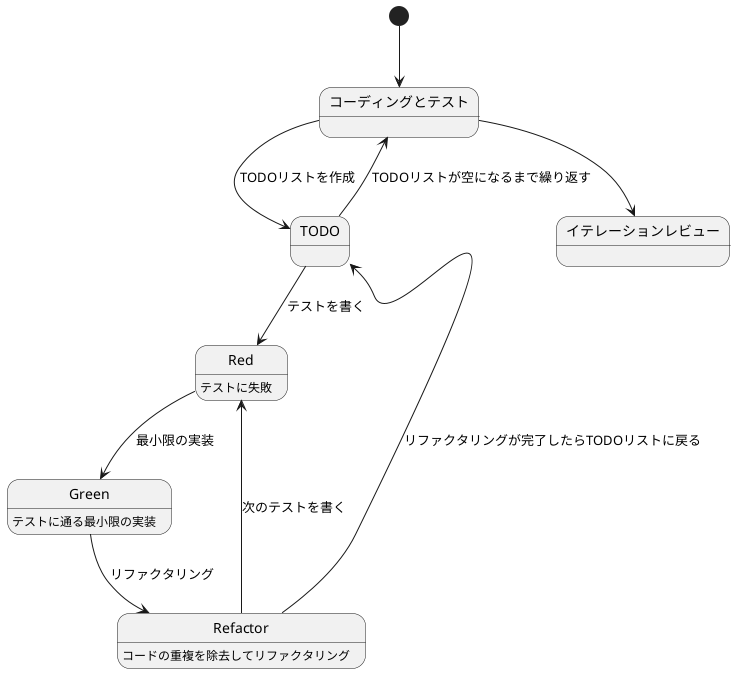

# ぷよぷよから始めるテスト駆動開発入門 Scala.js 版

## はじめに

みなさん、こんにちは！今日は私と一緒にテスト駆動開発（TDD）を使って、ぷよぷよゲームを Scala.js で作っていきましょう。さて、プログラミングの旅に出る前に、皆さんは「テスト駆動開発」について聞いたことがありますか？もしかしたら「テストって、コードを書いた後にするものじゃないの？」と思われるかもしれませんね。

> テストを書きながら開発することによって、設計が良い方向に変わり、コードが改善され続け、それによって自分自身が開発に前向きになること、それがテスト駆動開発の目指すゴールです。
>
> — Kent Beck 『テスト駆動開発』 付録C　訳者解説：テスト駆動開発の現在

この記事では、私たちが一緒にぷよぷよゲームを Scala.js で実装しながら、テスト駆動開発の基本的な流れと考え方を学んでいきます。まるでモブプログラミングのセッションのように、あなたと私が一緒に考え、コードを書き、改善していく過程を体験しましょう。「でも、ぷよぷよって結構複雑なゲームじゃないの？」と思われるかもしれませんが、心配いりません。各章では、ユーザーストーリーに基づいた機能を、テスト、実装、解説の順に少しずつ進めていきますよ。一歩一歩、着実に進んでいきましょう！

### テスト駆動開発のサイクル

さて、テスト駆動開発では、どのように進めていけばいいのでしょうか？「テストを書いてから実装する」というのは分かりましたが、具体的にはどんな手順で進めるのでしょうか？

私がいつも実践しているのは、以下の3つのステップを繰り返すサイクルです。皆さんも一緒にやってみましょう：

1. **Red（赤）**: まず失敗するテストを書きます。「え？わざと失敗するテストを？」と思われるかもしれませんが、これには重要な意味があるんです。これから実装する機能が何をすべきかを明確にするためなんですよ。
2. **Green（緑）**: 次に、テストが通るように、最小限のコードを実装します。この段階では、きれいなコードよりも「とにかく動くこと」を優先します。「最小限」というのがポイントです。必要以上のことはしないようにしましょう。
3. **Refactor（リファクタリング）**: 最後に、コードの品質を改善します。テストが通ることを確認しながら、重複を取り除いたり、わかりやすい名前をつけたりします。「動くけど汚いコード」から「動いてきれいなコード」へと進化させるんです。

> レッド・グリーン・リファクタリング。それがTDDのマントラだ。
>
> — Kent Beck 『テスト駆動開発』

このサイクルを「Red-Green-Refactor」サイクルと呼びます。「赤・緑・リファクタリング」のリズムを刻むように、このサイクルを繰り返していくんです。これによって、少しずつ機能を追加し、コードの品質を高めていきましょう。皆さんも一緒にこのリズムを体感してみてください！



### 開発環境

さて、実際にコードを書く前に、私たちが使用する開発環境について少しお話ししておきましょう。皆さんは「道具選びは仕事の半分」という言葉を聞いたことがありますか？プログラミングでも同じことが言えるんです。

> 道具はあなたの能力を増幅します。道具のできが優れており、簡単に使いこなせるようになっていれば、より生産的になれるのです。
>
> — 達人プログラマー 熟達に向けたあなたの旅（第2版）

「どんなツールを使えばいいの？」と思われるかもしれませんね。今回のプロジェクトでは、以下のツールを使用していきます：

- **言語**: Scala 3 — 強力な型システムと関数型プログラミングの機能を持つ言語です。「型があれば安心してリファクタリングできますよ！」
- **JavaScript 変換**: Scala.js — Scala のコードを JavaScript に変換し、ブラウザで実行できるようにします。
- **ビルドツール**: sbt — Scala の標準的なビルドツールです。依存関係の管理やコンパイル、テストの実行を担当します。
- **テストフレームワーク**: ScalaTest — Scala における最も人気のあるテストフレームワークの一つです。テスト駆動開発には欠かせないツールですね。
- **静的コード解析**: WartRemover — Scala 用の静的コード解析ツールです。コードの潜在的な問題を検出してくれます。
- **コードフォーマッタ**: Scalafmt — コードのフォーマットを自動で統一してくれます。
- **コードカバレッジ**: scoverage — テストがコードのどれだけをカバーしているかを測定します。
- **バージョン管理**: Git — コードの変更履歴を追跡し、「あれ？昨日までちゃんと動いてたのに...」というときに過去の状態に戻れる魔法のツールです。

これらのツールを使って、テスト駆動開発の流れに沿ってぷよぷよゲームを実装していきましょう。「環境構築って難しそう...」と心配される方もいるかもしれませんが手順に従って進めればそんなに難しいことではありません。詳細はイテレーション0: 環境の構築で解説します。

## 要件

### ユーザーストーリー

さて、実際にコードを書き始める前に、少し立ち止まって考えてみましょう。「何を作るのか？」という基本的な問いかけです。私たちが作るぷよぷよゲームは、どのような機能を持つべきでしょうか？

アジャイル開発では、この「何を作るのか？」という問いに対して、「ユーザーストーリー」という形で答えを出します。皆さんは「ユーザーストーリー」という言葉を聞いたことがありますか？

> ユーザーストーリーは、ソフトウェア要求を表現するための軽量な手法である。ユーザーストーリーは、システムについてユーザーまたは顧客の視点からフィーチャの概要を記述したものだ。
> ユーザーストーリーには形式が定められておらず、標準的な記法もない。とはいえ、次のような形式でストーリーを考えてみると便利である。「＜ユーザーの種類＞として、＜機能や性能＞がほしい。それは＜ビジネス価値＞のためだ」という形のテンプレートに従うと、
> たとえば次のようなストーリーを書ける。「本の購入者として、ＩＳＢＮで本を検索したい。それは探している本をすばやく見つけるためだ」
>
> — Mike Cohn 『アジャイルな見積と計画づくり』

つまり、「プレイヤーとして、〇〇ができる（〇〇したいから）」という形式で機能を表現するんです。これによって、「誰のため」の「どんな機能」を「なぜ」作るのかが明確になります。素晴らしいですよね！

では、私たちのぷよぷよゲームでは、どんなユーザーストーリーが考えられるでしょうか？一緒に考えてみましょう：

- プレイヤーとして、新しいゲームを開始できる（ゲームの基本機能として必要ですよね！）
- プレイヤーとして、落ちてくるぷよを左右に移動できる（ぷよを適切な位置に配置したいですよね）
- プレイヤーとして、落ちてくるぷよを回転できる（戦略的にぷよを配置するために必要です）
- プレイヤーとして、ぷよを素早く落下させることができる（「早く次のぷよを落としたい！」というときのために）
- プレイヤーとして、同じ色のぷよを4つ以上つなげると消去できる（これがぷよぷよの醍醐味ですよね！）
- プレイヤーとして、連鎖反応を起こしてより高いスコアを獲得できる（「れ〜んさ〜ん！」と叫びたくなりますよね）
- プレイヤーとして、全消し（ぜんけし）ボーナスを獲得できる（「やった！全部消えた！」という達成感を味わいたいですよね）
- プレイヤーとして、ゲームオーバーになるとゲーム終了の演出を見ることができる（終わりが明確でないとモヤモヤしますよね）
- プレイヤーとして、現在のスコアを確認できる（「今どれくらい点数取れてるかな？」と気になりますよね）
- プレイヤーとして、キーボードでぷよを操作できる（PCでプレイするなら必須ですよね）
- プレイヤーとして、タッチ操作でぷよを操作できる（スマホでもプレイしたいですよね）

「うわ、結構たくさんあるな...」と思われるかもしれませんが、心配いりません！これらのユーザーストーリーを一つずつ実装していくことで、徐々にゲームを完成させていきましょう。テスト駆動開発の素晴らしいところは、各ストーリーを小さなタスクに分解し、テスト→実装→リファクタリングのサイクルで少しずつ進められることなんです。一歩一歩、着実に進んでいきましょう！

## イテレーション0: 環境の構築

...と言いたいところですがまずは環境の構築をしなければなりません。「プログラミングなんてどの言語でやるか決めるぐらいでしょ？」と思うかもしれませんが家を建てるときにしっかりとした基礎工事が必要なように開発環境もしっかりとした準備が必要です。
家を建てた後に基礎がダメだと困ったことになりますからね。

### ソフトウェア開発の三種の神器

良いコードを書き続けるためには何が必要になるでしょうか？それは[ソフトウェア開発の三種の神器](https://t-wada.hatenablog.jp/entry/clean-code-that-works)と呼ばれるものです。

> 今日のソフトウェア開発の世界において絶対になければならない3つの技術的な柱があります。
> 三本柱と言ったり、三種の神器と言ったりしていますが、それらは
>
>   - バージョン管理
>   - テスティング
>   - 自動化
>
> の3つです。
>
> —  https://t-wada.hatenablog.jp/entry/clean-code-that-works

本章では開発環境のセットアップとして、これら三種の神器を準備していきます。環境構築は退屈に感じるかもしれませんが、これらのツールがあることで、安心してコードを書くことができるようになります。一緒に進めていきましょう！

### バージョン管理: Gitとコミットメッセージ

バージョン管理システムとして Git を使います。Git については既に使用していると仮定しますが、コミットメッセージについて1つだけ重要なルールを確認しておきましょう。

#### コミットメッセージの書き方

私たちのプロジェクトでは、[Conventional Commits](https://www.conventionalcommits.org/ja/)の書式に従ってコミットメッセージを書きます。具体的には、それぞれのコミットメッセージはヘッダ、ボディ、フッタで構成されます。

```
<タイプ>(<スコープ>): <タイトル>
<空行>
<ボディ>
<空行>
<フッタ>
```

ヘッダは必須で、スコープは任意です。コミットメッセージのタイトルは50文字までにしましょう（GitHub上で読みやすくなります）。

コミットのタイプは次を用います：

- **feat**: 新しい機能
- **fix**: バグ修正
- **docs**: ドキュメント変更のみ
- **style**: コードに影響を与えない変更（空白、フォーマットなど）
- **refactor**: 機能追加でもバグ修正でもないコード変更
- **perf**: パフォーマンスを改善するコード変更
- **test**: テストの追加や修正
- **chore**: ビルドプロセスや補助ツールの変更

例えば：

```bash
git commit -m 'feat: ゲーム初期化機能を追加'
git commit -m 'refactor: メソッドの抽出'
git commit -m 'test: ぷよ消去のテストケースを追加'
```

### テスティング: パッケージマネージャとテスト環境

良いコードを書くためには、コードが正しく動作することを確認するテストが欠かせません。そのためのツールをセットアップしていきましょう。

#### パッケージマネージャ: sbt

外部ライブラリやツールを管理するために **sbt** を使います。

> sbtとは、Scalaで記述されたビルドツールで、Scalaプロジェクトの依存関係管理、コンパイル、テスト実行、パッケージング等を行います。
>
> —  [公式ドキュメント](https://www.scala-sbt.org/)

まず、プロジェクトディレクトリを作成し、`build.sbt` を作成して依存関係を設定します：

```bash
mkdir puyo-puyo-game
cd puyo-puyo-game
```

`build.sbt` を以下のように作成します：

```scala
ThisBuild / scalaVersion := "3.3.3"
ThisBuild / version := "0.1.0-SNAPSHOT"
ThisBuild / organization := "com.example"
ThisBuild / organizationName := "puyo-puyo"

lazy val root = (project in file("."))
  .enablePlugins(ScalaJSPlugin)
  .settings(
    name := "puyo-puyo-game",
    scalaJSUseMainModuleInitializer := true,

    // テストフレームワーク
    libraryDependencies ++= Seq(
      "org.scalatest" %%% "scalatest" % "3.2.18" % Test
    ),

    // Scala.js DOM ライブラリ
    libraryDependencies += "org.scala-js" %%% "scalajs-dom" % "2.8.0"
  )
```

プロジェクト構造を作成します：

```bash
mkdir -p src/main/scala
mkdir -p src/test/scala
mkdir -p project
```

`project/build.properties` を作成します：

```properties
sbt.version=1.9.9
```

`project/plugins.sbt` を作成します：

```scala
addSbtPlugin("org.scala-js" % "sbt-scalajs" % "1.16.0")
addSbtPlugin("org.scalameta" % "sbt-scalafmt" % "2.5.0")
addSbtPlugin("org.wartremover" % "sbt-wartremover" % "3.1.3")
addSbtPlugin("org.scoverage" % "sbt-scoverage" % "2.0.9")
```

これで、テストを実行する準備ができました：

```bash
sbt test
```

### 自動化: コード品質の自動管理

良いコードを書き続けるためには、コードの品質を自動的にチェックし、維持していく仕組みが必要です。ここでは、静的コード解析、コードフォーマット、コードカバレッジ、そしてタスクランナーを設定します。

#### 静的コード解析: WartRemover

静的コード解析ツールとして **WartRemover** を使います。WartRemoverは、コードを実行せずに潜在的な問題を検出するツールです。

`build.sbt` にプラグインの設定を追加します：

```scala
lazy val root = (project in file("."))
  .enablePlugins(ScalaJSPlugin)
  .settings(
    name := "puyo-puyo-game",
    scalaJSUseMainModuleInitializer := true,

    libraryDependencies ++= Seq(
      "org.scalatest" %%% "scalatest" % "3.2.18" % Test
    ),

    libraryDependencies += "org.scala-js" %%% "scalajs-dom" % "2.8.0",

    // WartRemover 設定
    wartremoverWarnings ++= Warts.unsafe
  )
```

静的コード解析を実行してみましょう：

```bash
sbt compile
```

WartRemoverは以下のような問題を検出してくれます：
- Null参照の使用
- var（可変変数）の不適切な使用
- Anyの使用
- 例外の不適切な使用

例えば、以下のコードでは警告が出力されます：

```scala
// 警告が出るコード例
def badExample(): Any = {
  var x = 1  // var使用の警告
  x = 2
  null      // null使用の警告
}
```

このような問題を事前に発見することで、より安全で保守しやすいコードを書くことができます。

#### コードフォーマッタ: Scalafmt

コードのフォーマットを統一するために **Scalafmt** を使います。

> 優れたソースコードは「目に優しい」ものでなければいけない。
>
> —  リーダブルコード

`.scalafmt.conf` ファイルを作成して設定を追加しましょう：

```conf
version = "3.7.17"
runner.dialect = scala3

maxColumn = 100
indent.main = 2
indent.callSite = 2
indent.ctrlSite = 2
indent.defnSite = 2
indent.caseSite = 2

rewrite.rules = [RedundantBraces, RedundantParens, SortModifiers]
rewrite.redundantBraces.stringInterpolation = true
```

フォーマットのチェックと自動修正は以下のコマンドで実行できます：

```bash
sbt scalafmtCheck  # チェックのみ
sbt scalafmt       # 自動修正
```

#### コードカバレッジ: scoverage

テストがコードのどれだけをカバーしているかを確認するために、**scoverage** を使います。

> コード網羅率（コードもうらりつ、英: Code coverage）は、ソフトウェアテストで用いられる尺度の1つである。プログラムのソースコードがテストされた割合を意味する。

`build.sbt` に設定を追加します：

```scala
lazy val root = (project in file("."))
  .enablePlugins(ScalaJSPlugin)
  .settings(
    name := "puyo-puyo-game",
    scalaJSUseMainModuleInitializer := true,

    libraryDependencies ++= Seq(
      "org.scalatest" %%% "scalatest" % "3.2.18" % Test
    ),

    libraryDependencies += "org.scala-js" %%% "scalajs-dom" % "2.8.0",

    wartremoverWarnings ++= Warts.unsafe,

    // カバレッジ設定
    coverageEnabled := true,
    coverageMinimumStmtTotal := 80,
    coverageFailOnMinimum := false,
    coverageHighlighting := true
  )
```

カバレッジレポートを生成するには：

```bash
sbt clean coverage test coverageReport
```

実行後、`target/scala-3.3.3/scoverage-report` フォルダ内の `index.html` を開くと、視覚的にカバレッジ状況を確認できます。

#### タスクランナー: sbt カスタムタスク

複数のコマンドを覚えるのは大変です。sbt のカスタムタスクを使って、よく使うコマンドをタスクとして登録し、簡単に実行できるようにします。

`build.sbt` にカスタムタスクを追加します：

```scala
ThisBuild / scalaVersion := "3.3.3"
ThisBuild / version := "0.1.0-SNAPSHOT"
ThisBuild / organization := "com.example"
ThisBuild / organizationName := "puyo-puyo"

lazy val root = (project in file("."))
  .enablePlugins(ScalaJSPlugin)
  .settings(
    name := "puyo-puyo-game",
    scalaJSUseMainModuleInitializer := true,

    libraryDependencies ++= Seq(
      "org.scalatest" %%% "scalatest" % "3.2.18" % Test
    ),

    libraryDependencies += "org.scala-js" %%% "scalajs-dom" % "2.8.0",

    wartremoverWarnings ++= Warts.unsafe,

    coverageEnabled := true,
    coverageMinimumStmtTotal := 80,
    coverageFailOnMinimum := false,
    coverageHighlighting := true
  )

// カスタムタスクの定義
lazy val format = taskKey[Unit]("Format source code")
format := {
  (Compile / scalafmt).value
  (Test / scalafmt).value
}

lazy val formatCheck = taskKey[Unit]("Check source code formatting")
formatCheck := {
  (Compile / scalafmtCheck).value
  (Test / scalafmtCheck).value
}

lazy val lint = taskKey[Unit]("Run static analysis")
lint := {
  (Compile / compile).value
}

lazy val coverage = taskKey[Unit]("Run tests with coverage")
coverage := {
  (Test / coverageReport).value
}

lazy val check = taskKey[Unit]("Run all quality checks")
check := {
  formatCheck.value
  lint.value
  (Test / test).value
  coverage.value
}
```

カスタムタスクを実行してみます：

```bash
# フォーマットチェック
sbt formatCheck

# 静的解析実行
sbt lint

# テストとカバレッジ実行
sbt coverage

# 全ての品質チェック実行
sbt check
```

`check` タスクを実行することで、フォーマットチェック、静的解析、テスト、カバレッジまで一度に実行できます。

#### タスクの自動実行

ファイルを編集するたびに手動でコマンドを実行するのは面倒です。sbt の `~` 接頭辞を使って、ファイルの変更を検知して自動的にテストやフォーマットを実行できるようにします。

```bash
# テストの自動実行
sbt "~ test"

# フォーマットチェックの自動実行
sbt "~ formatCheck"

# 全ての品質チェックの自動実行
sbt "~ check"
```

開発時のワークフロー例：

1. ターミナルで `sbt "~ test"` を実行してファイル監視を開始
2. コードを編集・保存
3. 自動的にテストが実行される
4. テストが失敗した場合は、コードを修正して再度保存
5. 自動的にテストが再実行される

この自動化により、**レッド→グリーン→リファクタ** のTDDサイクルをより効率的に回すことができます。

監視を停止するには `Ctrl+C` を押すか、sbtコンソールで `Enter` キーを押します。

```bash
# ファイル監視の開始
$ sbt
sbt:puyo-puyo-game> ~ test
[info] 1. Monitoring source files for puyo-puyo-game/test...
[info]    Press <enter> to interrupt or '?' for more options.
# ファイルを変更すると自動でテストが実行される
# Enter キーで監視停止
```

### 環境構築の完了

お疲れさまでした！これで開発環境のセットアップが完了しました。以下のツールが使えるようになりました：

- **バージョン管理**: Git（Conventional Commits形式）
- **テスティング**: ScalaTest（Scala.js 対応）
- **静的コード解析**: WartRemover
- **コードフォーマット**: Scalafmt
- **コードカバレッジ**: scoverage
- **タスクランナー**: sbt カスタムタスク
- **自動化**: sbt ファイル監視（`~` 接頭辞）

これらのツールにより、[ソフトウェア開発の三種の神器](https://t-wada.hatenablog.jp/entry/clean-code-that-works)が揃いました。これから安心してテスト駆動開発に取り組むことができます！

### 環境構成

実際に構築した開発環境の構成は以下の通りです：

#### プロジェクト構造

```
puyo-puyo-game/
├── src/
│   ├── main/
│   │   └── scala/
│   │       └── com/
│   │           └── example/
│   │               └── puyo/
│   │                   └── Main.scala
│   └── test/
│       └── scala/
│           └── com/
│               └── example/
│                   └── puyo/
│                       └── MainSpec.scala
├── project/
│   ├── build.properties
│   └── plugins.sbt
├── build.sbt
├── .scalafmt.conf
└── .gitignore
```

#### build.sbt の完全な設定

```scala
ThisBuild / scalaVersion := "3.3.3"
ThisBuild / version := "0.1.0-SNAPSHOT"
ThisBuild / organization := "com.example"
ThisBuild / organizationName := "puyo-puyo"

lazy val root = (project in file("."))
  .enablePlugins(ScalaJSPlugin)
  .settings(
    name := "puyo-puyo-game",
    scalaJSUseMainModuleInitializer := true,

    libraryDependencies ++= Seq(
      "org.scalatest" %%% "scalatest" % "3.2.18" % Test
    ),

    libraryDependencies += "org.scala-js" %%% "scalajs-dom" % "2.8.0",

    wartremoverWarnings ++= Warts.unsafe,

    coverageEnabled := true,
    coverageMinimumStmtTotal := 80,
    coverageFailOnMinimum := false,
    coverageHighlighting := true
  )

// カスタムタスクの定義
lazy val format = taskKey[Unit]("Format source code")
format := {
  (Compile / scalafmt).value
  (Test / scalafmt).value
}

lazy val formatCheck = taskKey[Unit]("Check source code formatting")
formatCheck := {
  (Compile / scalafmtCheck).value
  (Test / scalafmtCheck).value
}

lazy val lint = taskKey[Unit]("Run static analysis")
lint := {
  (Compile / compile).value
}

lazy val coverage = taskKey[Unit]("Run tests with coverage")
coverage := {
  (Test / coverageReport).value
}

lazy val check = taskKey[Unit]("Run all quality checks")
check := {
  formatCheck.value
  lint.value
  (Test / test).value
  coverage.value
}
```

#### project/build.properties

```properties
sbt.version=1.9.9
```

#### project/plugins.sbt

```scala
addSbtPlugin("org.scala-js" % "sbt-scalajs" % "1.16.0")
addSbtPlugin("org.scalameta" % "sbt-scalafmt" % "2.5.0")
addSbtPlugin("org.wartremover" % "sbt-wartremover" % "3.1.3")
addSbtPlugin("org.scoverage" % "sbt-scoverage" % "2.0.9")
```

#### .scalafmt.conf

```conf
version = "3.7.17"
runner.dialect = scala3

maxColumn = 100
indent.main = 2
indent.callSite = 2
indent.ctrlSite = 2
indent.defnSite = 2
indent.caseSite = 2

rewrite.rules = [RedundantBraces, RedundantParens, SortModifiers]
rewrite.redundantBraces.stringInterpolation = true
```

#### .gitignore

```
# sbt
target/
project/target/
project/project/

# Scala
*.class
*.log

# IDE
.idea/
.bsp/
.metals/
.vscode/

# OS
.DS_Store
```

#### 環境構築の確認

環境構築が正しく完了したことを確認するには、以下のコマンドを実行します：

```bash
sbt check
```

このコマンドは以下の処理を順次実行します：

1. Scalafmt によるコードフォーマットチェック
2. WartRemover による静的解析
3. ScalaTest によるテスト実行
4. scoverage によるカバレッジレポート生成

すべてのチェックが成功すれば、環境構築は完了です。

では、実際のゲーム開発に進みましょう！

## まとめ

イテレーション0では、ぷよぷよゲームを Scala.js で開発するための環境を構築しました。

**ソフトウェア開発の三種の神器** である「バージョン管理」「テスティング」「自動化」を準備することで、安心してテスト駆動開発に取り組める基盤が整いました。

次のイテレーションでは、実際にゲームのコードを書き始めます。テスト駆動開発のサイクル（Red-Green-Refactor）に従って、一歩ずつ確実に機能を実装していきましょう！

開発を始める際は、まず `sbt "~ test"` を実行して、後はコードを書くことに集中しましょう！

## イテレーション1: ゲーム開始の実装

さあ、いよいよコードを書き始めましょう！テスト駆動開発では、小さなイテレーション（反復）で機能を少しずつ追加していきます。最初のイテレーションでは、最も基本的な機能である「ゲームの開始」を実装します。

> システム構築はどこから始めるべきだろうか。システム構築が終わったらこうなる、というストーリーを語るところからだ。
>
> — Kent Beck 『テスト駆動開発』

### ユーザーストーリー

まずは、このイテレーションで実装するユーザーストーリーを確認しましょう：

> プレイヤーとして、新しいゲームを開始できる

このシンプルなストーリーから始めることで、ゲームの基本的な構造を作り、後続の機能追加の土台を築くことができます。では、テスト駆動開発のサイクルに従って、まずはテストから書いていきましょう！

### TODOリスト

さて、ユーザーストーリーを実装するために、まずはTODOリストを作成しましょう。TODOリストは、大きな機能を小さなタスクに分解するのに役立ちます。

> 何をテストすべきだろうか - 着手する前に、必要になりそうなテストをリストに書き出しておこう。
>
> — Kent Beck 『テスト駆動開発』

私たちの「新しいゲームを開始できる」というユーザーストーリーを実現するためには、どのようなタスクが必要でしょうか？考えてみましょう：

- ゲームの初期化処理を実装する（ゲームの状態や必要なコンポーネントを設定する）
- ゲーム画面を表示する（プレイヤーが視覚的にゲームを認識できるようにする）
- 新しいぷよを生成する（ゲーム開始時に最初のぷよを作成する）
- ゲームループを開始する（ゲームの継続的な更新と描画を行う）

これらのタスクを一つずつ実装していきましょう。テスト駆動開発では、各タスクに対してテスト→実装→リファクタリングのサイクルを回します。まずは「ゲームの初期化処理」から始めましょう！

### テスト: ゲームの初期化

さて、TODOリストの最初のタスク「ゲームの初期化処理を実装する」に取り掛かりましょう。テスト駆動開発では、まずテストを書くことから始めます。

> テストファースト
>
> いつテストを書くべきだろうか——それはテスト対象のコードを書く前だ。
>
> — Kent Beck 『テスト駆動開発』

では、ゲームの初期化処理をテストするコードを書いてみましょう。何をテストすべきでしょうか？ゲームが初期化されたとき、必要なコンポーネントが正しく作成され、ゲームの状態が適切に設定されていることを確認する必要がありますね。

```scala
// src/test/scala/com/example/puyo/GameSpec.scala
package com.example.puyo

import org.scalatest.flatspec.AnyFlatSpec
import org.scalatest.matchers.should.Matchers
import org.scalatest.BeforeAndAfterEach

class GameSpec extends AnyFlatSpec with Matchers with BeforeAndAfterEach {
  var game: Game = _

  override def beforeEach(): Unit = {
    game = new Game()
  }

  "Game" should "create necessary components when initialized" in {
    game.initialize()

    game.config should not be null
    game.puyoImage should not be null
    game.stage should not be null
    game.player should not be null
    game.score should not be null
  }

  it should "set game mode to Start when initialized" in {
    game.initialize()

    game.mode shouldBe GameMode.Start
  }
}
```

このテストでは、`Game`クラスの`initialize`メソッドが正しく動作することを確認しています。具体的には、必要なコンポーネント（Config, PuyoImage, Stage, Player, Score）が作成され、ゲームモードが`Start`に設定されることを検証しています。

### 実装: ゲームの初期化

テストを書いたら、次に実行してみましょう。どうなるでしょうか？

```
[error] not found: object Game
```

おっと！まだ`Game`クラスを実装していないので、当然エラーになりますね。これがテスト駆動開発の「Red（赤）」の状態です。テストが失敗することを確認できました。

> アサートファースト
>
> ではテストはどこから書き始めるべきだろうか。それはテストの終わりにパスすべきアサーションを書くところからだ。
>
> — Kent Beck 『テスト駆動開発』

では、テストが通るように最小限のコードを実装していきましょう。「最小限」というのがポイントです。この段階では、テストが通ることだけを目指して、必要最低限のコードを書きます。

```scala
// src/main/scala/com/example/puyo/Game.scala
package com.example.puyo

enum GameMode:
  case Start, CheckFall, Fall, CheckErase, Erasing, NewPuyo, Playing, GameOver

class Game {
  private var _mode: GameMode = GameMode.Start
  private var frame: Int = 0
  private var combinationCount: Int = 0

  var config: Config = _
  var puyoImage: PuyoImage = _
  var stage: Stage = _
  var player: Player = _
  var score: Score = _

  def mode: GameMode = _mode

  def initialize(): Unit = {
    // 各コンポーネントの初期化
    config = new Config()
    puyoImage = new PuyoImage(config)
    stage = new Stage(config, puyoImage)
    player = new Player(config, stage, puyoImage)
    score = new Score()

    // ゲームモードを設定
    _mode = GameMode.Start
  }
}
```

### 解説: ゲームの初期化

テストが通りましたね！おめでとうございます。これがテスト駆動開発の「Green（緑）」の状態です。

実装したゲームの初期化処理について、少し解説しておきましょう。この処理では、主に以下のことを行っています：

1. 各コンポーネント（Config, PuyoImage, Stage, Player, Score）のインスタンスを作成
2. ゲームモードを`Start`に設定

これにより、ゲームを開始するための準備が整います。各コンポーネントの役割を理解しておくと、今後の実装がスムーズになりますよ：

- **Config**: ゲームの設定値を管理します（画面サイズ、ぷよの大きさなど）
- **PuyoImage**: ぷよの画像を管理します（各色のぷよの画像を読み込み、描画する）
- **Stage**: ゲームのステージ（盤面）を管理します（ぷよの配置状態、消去判定など）
- **Player**: プレイヤーの入力と操作を管理します（キーボード入力の処理、ぷよの移動など）
- **Score**: スコアの計算と表示を管理します（連鎖数に応じたスコア計算など）

このように、責任を明確に分けることで、コードの保守性が高まります。これはオブジェクト指向設計の基本原則の一つ、「単一責任の原則」に従っています。

> 単一責任の原則（SRP）：クラスを変更する理由は1つだけであるべき。
>
> — Robert C. Martin 『Clean Architecture』

また、Scala 3 の `enum` を使ってゲームモードを定義していることに注目してください。これにより、型安全にゲームの状態を表現できます。

```scala
enum GameMode:
  case Start, CheckFall, Fall, CheckErase, Erasing, NewPuyo, Playing, GameOver
```

これは TypeScript の Union 型に相当する、より型安全な表現方法です。

### 実装: 依存クラスの作成

テストを通すために、必要な依存クラス（Config, PuyoImage, Stage, Player, Score）も最小限の実装を作成します。

```scala
// src/main/scala/com/example/puyo/Config.scala
package com.example.puyo

class Config {
  // 最小限の実装
}
```

```scala
// src/main/scala/com/example/puyo/PuyoImage.scala
package com.example.puyo

class PuyoImage(config: Config) {
  // 最小限の実装
}
```

```scala
// src/main/scala/com/example/puyo/Stage.scala
package com.example.puyo

class Stage(config: Config, puyoImage: PuyoImage) {
  // 最小限の実装
}
```

```scala
// src/main/scala/com/example/puyo/Player.scala
package com.example.puyo

class Player(config: Config, stage: Stage, puyoImage: PuyoImage) {
  // 最小限の実装
}
```

```scala
// src/main/scala/com/example/puyo/Score.scala
package com.example.puyo

class Score {
  // 最小限の実装
}
```

これらのクラスは現時点では空の実装ですが、後続のイテレーションで徐々に機能を追加していきます。

### テストの確認

すべての実装が完了したら、テストを実行して確認しましょう：

```bash
sbt test
```

以下の結果が表示されれば成功です：

```
[info] GameSpec:
[info] Game
[info] - should create necessary components when initialized
[info] - should set game mode to Start when initialized
[info] Run completed in 234 milliseconds.
[info] Total number of tests run: 2
[info] Suites: completed 1, aborted 0
[info] Tests: succeeded 2, failed 0, canceled 0, ignored 0, pending 0
[info] All tests passed.
```

### 実装: エントリーポイント

次に、ゲームを起動するエントリーポイント `Main.scala` を実装します。Scala.js では、`JSApp` trait を使ってブラウザで実行可能なアプリケーションを作成できます。

```scala
// src/main/scala/com/example/puyo/Main.scala
package com.example.puyo

import scala.scalajs.js.annotation.JSExportTopLevel
import org.scalajs.dom

@JSExportTopLevel("PuyoPuyoGame")
object Main {
  def main(args: Array[String]): Unit = {
    // ゲームのインスタンスを作成
    val game = new Game()

    // ゲームを初期化
    game.initialize()

    // ゲームループを開始（次のタスクで実装）
    // game.loop()

    dom.console.log("Puyo Puyo Game Started!")
  }
}
```

このコードでは、以下のステップでゲームを開始します：

1. `Game` クラスのインスタンスを作成
2. `initialize()` メソッドで各コンポーネントを初期化
3. コンソールにメッセージを出力

`@JSExportTopLevel` アノテーションにより、このオブジェクトが JavaScript から呼び出し可能になります。

### 実装: HTML ファイル

ゲームを表示するための HTML ファイルを作成します。

```html
<!-- index.html -->
<!DOCTYPE html>
<html lang="ja">
  <head>
    <meta charset="UTF-8" />
    <meta name="viewport" content="width=device-width, initial-scale=1.0" />
    <title>ぷよぷよゲーム</title>
  </head>
  <body>
    <div id="app"></div>
    <script type="text/javascript" src="./target/scala-3.3.3/puyo-puyo-game-fastopt.js"></script>
    <script type="text/javascript">
      PuyoPuyoGame.main();
    </script>
  </body>
</html>
```

この HTML ファイルでは、以下のことを行っています：

1. **基本的な HTML 構造の定義**
   - `lang="ja"` で日本語ページであることを指定
   - ビューポート設定でレスポンシブ対応

2. **アプリケーションのマウントポイント**
   - `<div id="app"></div>` がゲーム画面を表示する場所になります

3. **Scala.js のロード**
   - `fastopt.js` は開発用の最適化されたビルド
   - `PuyoPuyoGame.main()` でゲームを起動

### JavaScript のビルドと実行

Scala.js のコードを JavaScript にコンパイルして実行します：

```bash
# JavaScript へのコンパイル（開発用）
sbt fastLinkJS

# ファイルサーバーの起動（Python を使用）
python -m http.server 8000
```

ブラウザで `http://localhost:8000` を開くと、コンソールに「Puyo Puyo Game Started!」というメッセージが表示されているはずです。

おめでとうございます！リリースに向けて最初の第一歩を踏み出すことができました。これから機能を追加するごとにどんどん実際のゲームの完成に近づく事が確認できます、楽しみですね。

「機能は別々に作りこんで最後に画面と統合するんじゃないの？」と思うもしれません。そういうアプローチもありますが画面イメージが最後まで確認できないともし間違っていたら手戻りが大変です。それに動作するプログラムがどんどん成長するのを見るのは楽しいですからね。

> トップダウンでもボトムアップでもなく、エンドツーエンドで構築していく
>
>    エンドツーエンドで小さな機能を構築し、そこから作業を進めながら問題について学習していく。
>
> — 達人プログラマー 熟達に向けたあなたの旅（第2版）

### イテレーション 1 のまとめ

このイテレーションで実装した内容：

1. **Game クラスの初期化**
   - 必要なコンポーネント（Config, PuyoImage, Stage, Player, Score）の作成
   - ゲームモードの設定
   - Scala 3 の `enum` による型安全な状態管理

2. **エントリーポイントの実装**
   - `Main.scala` でゲームの初期化
   - `@JSExportTopLevel` による JavaScript からの呼び出し
   - ブラウザでの動作確認が可能に

3. **テストの作成**
   - ゲーム初期化のテスト（2 テスト）
   - ScalaTest の FlatSpec スタイルによる読みやすいテスト
   - すべてのテストが成功

4. **Scala.js の特徴**
   - 型安全な JavaScript コード生成
   - Scala のオブジェクト指向と関数型の機能を活用
   - `scalajs-dom` による DOM 操作

次のイテレーションでは、ゲームループの実装とぷよの移動機能を実装していきます。

## イテレーション2: ぷよの移動の実装

さて、前回のイテレーションでゲームの基本的な構造ができましたね。「ゲームが始まったけど、ぷよが動かないと面白くないよね？」と思いませんか？そこで次は、ぷよを左右に移動できるようにしていきましょう！

### ユーザーストーリー

まずは、このイテレーションで実装するユーザーストーリーを確認しましょう：

> プレイヤーとして、落ちてくるぷよを左右に移動できる

「ぷよぷよって、落ちてくるぷよを左右に動かして、うまく積み上げるゲームですよね？」そうです！今回はその基本操作である「左右の移動」を実装していきます。

### TODOリスト

さて、このユーザーストーリーを実現するために、どんなタスクが必要でしょうか？一緒に考えてみましょう。
「ぷよを左右に移動する」という機能を実現するためには、以下のようなタスクが必要そうですね：

- プレイヤーの入力を検出する（キーボードの左右キーが押されたことを検知する）
- ぷよを左右に移動する処理を実装する（実際にぷよの位置を変更する）
- 移動可能かどうかのチェックを実装する（画面の端や他のぷよにぶつかる場合は移動できないようにする）
- 移動後の表示を更新する（画面上でぷよの位置が変わったことを表示する）

「なるほど、順番に実装していけばいいんですね！」そうです、一つずつ進めていきましょう。テスト駆動開発の流れに沿って、まずはテストから書いていきますよ。

### テスト: プレイヤーの入力検出

「最初に何をテストすればいいんでしょうか？」まずは、プレイヤーの入力を検出する部分からテストしていきましょう。キーボードの左右キーが押されたときに、それを正しく検知できるかどうかをテストします。

> テストファースト
>
> いつテストを書くべきだろうか——それはテスト対象のコードを書く前だ。
>
> — Kent Beck 『テスト駆動開発』

```scala
// src/test/scala/com/example/puyo/PlayerSpec.scala
package com.example.puyo

import org.scalatest.flatspec.AnyFlatSpec
import org.scalatest.matchers.should.Matchers
import org.scalatest.BeforeAndAfterEach

class PlayerSpec extends AnyFlatSpec with Matchers with BeforeAndAfterEach {
  var config: Config = _
  var puyoImage: PuyoImage = _
  var stage: Stage = _
  var player: Player = _

  override def beforeEach(): Unit = {
    config = new Config()
    puyoImage = new PuyoImage(config)
    stage = new Stage(config, puyoImage)
    player = new Player(config, stage, puyoImage)
  }

  "Player" should "set left flag when left key is pressed" in {
    // キー入力をシミュレート（テスト用のメソッドを呼び出す）
    player.setKeyState("ArrowLeft", pressed = true)

    player.inputKeyLeft shouldBe true
  }

  it should "set right flag when right key is pressed" in {
    player.setKeyState("ArrowRight", pressed = true)

    player.inputKeyRight shouldBe true
  }

  it should "clear flag when key is released" in {
    player.setKeyState("ArrowLeft", pressed = true)
    player.inputKeyLeft shouldBe true

    player.setKeyState("ArrowLeft", pressed = false)
    player.inputKeyLeft shouldBe false
  }
}
```

「このテストは何をしているんですか？」このテストでは、キーボードの左右キーが押されたときと離されたときに、`Player`クラスの中の対応するフラグが正しく設定されるかどうかを確認しています。

Scala.js では DOM イベントのシミュレートがテスト環境で難しいため、テスト用の`setKeyState`メソッドを用意してキー入力をテストします。これにより、ビジネスロジックを独立してテストできます。

### 実装: プレイヤーの入力検出

「失敗するテストができたので、次は実装ですね！」そうです！テストが通るように、最小限のコードを実装していきましょう。

```scala
// src/main/scala/com/example/puyo/Player.scala
package com.example.puyo

import org.scalajs.dom
import org.scalajs.dom.{KeyboardEvent, document}

class Player(
    config: Config,
    stage: Stage,
    puyoImage: PuyoImage
) {
  private var _inputKeyLeft: Boolean = false
  private var _inputKeyRight: Boolean = false
  private var _inputKeyUp: Boolean = false
  private var _inputKeyDown: Boolean = false

  // テスト用のアクセサ
  def inputKeyLeft: Boolean = _inputKeyLeft
  def inputKeyRight: Boolean = _inputKeyRight
  def inputKeyUp: Boolean = _inputKeyUp
  def inputKeyDown: Boolean = _inputKeyDown

  // キーボードイベントの登録
  document.addEventListener("keydown", onKeyDown _)
  document.addEventListener("keyup", onKeyUp _)

  private def onKeyDown(e: KeyboardEvent): Unit = {
    setKeyState(e.key, pressed = true)
  }

  private def onKeyUp(e: KeyboardEvent): Unit = {
    setKeyState(e.key, pressed = false)
  }

  // テスト用のメソッド（実装からも呼び出す）
  def setKeyState(key: String, pressed: Boolean): Unit = {
    key match {
      case "ArrowLeft"  => _inputKeyLeft = pressed
      case "ArrowRight" => _inputKeyRight = pressed
      case "ArrowUp"    => _inputKeyUp = pressed
      case "ArrowDown"  => _inputKeyDown = pressed
      case _            => // 何もしない
    }
  }
}
```

「なるほど！キーが押されたり離されたりしたときのイベントを検知して、フラグを設定しているんですね。」そうです！ここでは、`document.addEventListener`を使って、キーボードのイベントをリッスンしています。

Scala.js では、イベントハンドラの登録も型安全に行えます。`onKeyDown _` の `_` は、メソッドを関数値に変換するための記法です。

また、`setKeyState` メソッドを public にすることで、テストからも呼び出せるようにし、実際のイベントハンドラからも共通のロジックを使うようにしています。これは「テスタビリティ」を高めるための設計です。

### テスト: ぷよの移動

「次は何をテストしますか？」次は、ぷよを左右に移動する機能をテストしましょう。ぷよが左右に移動できるか、そして画面の端に到達したときに移動が制限されるかをテストします。

```scala
// src/test/scala/com/example/puyo/PlayerSpec.scala（続き）
"Player movement" should "move left when possible" in {
  player.createNewPuyo()
  val initialX = player.puyoX

  player.moveLeft()

  player.puyoX shouldBe initialX - 1
}

it should "move right when possible" in {
  player.createNewPuyo()
  val initialX = player.puyoX

  player.moveRight()

  player.puyoX shouldBe initialX + 1
}

it should "not move left at left edge" in {
  player.createNewPuyo()
  player.setPuyoX(0) // 左端に設定

  player.moveLeft()

  player.puyoX shouldBe 0
}

it should "not move right at right edge" in {
  player.createNewPuyo()
  player.setPuyoX(config.stageCols - 1) // 右端に設定

  player.moveRight()

  player.puyoX shouldBe config.stageCols - 1
}
```

このテストでは、以下の4つのケースを確認しています：

1. 通常の状態で左に移動できるか
2. 通常の状態で右に移動できるか
3. 左端にいるときに左に移動しようとしても位置が変わらないか
4. 右端にいるときに右に移動しようとしても位置が変わらないか

### 実装: ぷよの移動

「テストが失敗することを確認したら、実装に進みましょう！」そうですね。では、ぷよを移動させる機能を実装していきましょう。

```scala
// src/main/scala/com/example/puyo/Player.scala（続き）
private val InitialPuyoX = 2
private val InitialPuyoY = 0
private val MinPuyoType = 1
private val MaxPuyoType = 4

private var _puyoX: Int = InitialPuyoX
private var _puyoY: Int = InitialPuyoY
private var _puyoType: Int = 0
private var _nextPuyoType: Int = 0
private var rotation: Int = 0

// テスト用のアクセサ
def puyoX: Int = _puyoX
def puyoY: Int = _puyoY
def puyoType: Int = _puyoType

// テスト用のセッター
def setPuyoX(x: Int): Unit = _puyoX = x

def createNewPuyo(): Unit = {
  _puyoX = InitialPuyoX
  _puyoY = InitialPuyoY
  _puyoType = getRandomPuyoType()
  _nextPuyoType = getRandomPuyoType()
  rotation = 0
}

private def getRandomPuyoType(): Int = {
  MinPuyoType + scala.util.Random.nextInt(MaxPuyoType - MinPuyoType + 1)
}

def moveLeft(): Unit = {
  if (_puyoX > 0) {
    _puyoX -= 1
  }
}

def moveRight(): Unit = {
  if (_puyoX < config.stageCols - 1) {
    _puyoX += 1
  }
}
```

「ぷよの位置や種類を管理するプロパティがたくさんありますね！」そうですね。ぷよの状態を管理するために、いくつかのプロパティを定義しています。

Scala では、`private var` でプライベートな可変変数を定義し、`def` で公開するアクセサメソッドを定義します。これにより、カプセル化を保ちながらテストからもアクセスできるようにしています。

また、マジックナンバーを定数として定義することで、コードの可読性と保守性を高めています。Scala では `val` を使って定数を定義します。

「これでテストは通りましたか？」はい、これでテストは通るはずです！

### 実装: Config クラスの拡張

次に、画面表示に必要な設定を Config クラスに追加します：

```scala
// src/main/scala/com/example/puyo/Config.scala
package com.example.puyo

class Config {
  val stageCols: Int = 6            // ステージの列数
  val stageRows: Int = 12           // ステージの行数
  val puyoSize: Int = 32            // ぷよのサイズ（ピクセル）
  val stageBackgroundColor: String = "#2a2a2a"  // ステージの背景色
  val stageBorderColor: String = "#444"         // ステージの枠線色
}
```

Scala では、コンストラクタの引数なしでフィールドを定義する場合は、クラス本体に直接 `val` で定義します。

### 実装: PuyoImage クラス

ぷよを描画するための PuyoImage クラスを実装します：

```scala
// src/main/scala/com/example/puyo/PuyoImage.scala
package com.example.puyo

import org.scalajs.dom.CanvasRenderingContext2D
import scala.scalajs.js

class PuyoImage(config: Config) {
  private val colors: js.Array[String] = js.Array(
    "#888",    // 0: 空
    "#ff0000", // 1: 赤
    "#00ff00", // 2: 緑
    "#0000ff", // 3: 青
    "#ffff00"  // 4: 黄色
  )

  def draw(ctx: CanvasRenderingContext2D, puyoType: Int, x: Int, y: Int): Unit = {
    val size = config.puyoSize
    val color = if (puyoType >= 0 && puyoType < colors.length) {
      colors(puyoType)
    } else {
      colors(0)
    }

    // 円の中心座標と半径を計算
    val centerX = x * size + size / 2.0
    val centerY = y * size + size / 2.0
    val radius = size / 2.0 - 2.0

    // ぷよを円形で描画
    ctx.fillStyle = color
    ctx.beginPath()
    ctx.arc(centerX, centerY, radius, 0, Math.PI * 2)
    ctx.fill()

    // 枠線を描画
    ctx.strokeStyle = "#000"
    ctx.lineWidth = 2
    ctx.beginPath()
    ctx.arc(centerX, centerY, radius, 0, Math.PI * 2)
    ctx.stroke()
  }
}
```

Scala.js では、JavaScript の配列を扱う場合は `scala.scalajs.js.Array` を使用します。これにより、JavaScript の配列と互換性のあるデータ構造を使えます。

また、Canvas API は `org.scalajs.dom` パッケージから利用できます。Scala の型システムにより、型安全に Canvas API を使用できます。

### 実装: Stage クラス

ゲームのステージを管理する Stage クラスを実装します：

```scala
// src/main/scala/com/example/puyo/Stage.scala
package com.example.puyo

import org.scalajs.dom
import org.scalajs.dom.{CanvasRenderingContext2D, HTMLCanvasElement, document}

class Stage(config: Config, puyoImage: PuyoImage) {
  private var canvas: HTMLCanvasElement = _
  private var ctx: Option[CanvasRenderingContext2D] = None
  private var field: Array[Array[Int]] = _

  initializeCanvas()
  initializeField()

  private def initializeCanvas(): Unit = {
    canvas = document.createElement("canvas").asInstanceOf[HTMLCanvasElement]
    canvas.width = config.stageCols * config.puyoSize
    canvas.height = config.stageRows * config.puyoSize
    canvas.style.border = s"2px solid ${config.stageBorderColor}"
    canvas.style.backgroundColor = config.stageBackgroundColor

    val stageElement = document.getElementById("stage")
    if (stageElement != null) {
      stageElement.appendChild(canvas)
    }

    // 描画コンテキストを取得
    val context = canvas.getContext("2d")
    if (context != null) {
      ctx = Some(context.asInstanceOf[CanvasRenderingContext2D])
    }
  }

  private def initializeField(): Unit = {
    field = Array.fill(config.stageRows, config.stageCols)(0)
  }

  def draw(): Unit = {
    ctx.foreach { context =>
      // キャンバスをクリア
      context.clearRect(0, 0, canvas.width, canvas.height)

      // フィールドのぷよを描画
      for {
        y <- 0 until config.stageRows
        x <- 0 until config.stageCols
        puyoType = field(y)(x)
        if puyoType > 0
      } {
        puyoImage.draw(context, puyoType, x, y)
      }
    }
  }

  def drawPuyo(x: Int, y: Int, puyoType: Int): Unit = {
    ctx.foreach { context =>
      puyoImage.draw(context, puyoType, x, y)
    }
  }

  def setPuyo(x: Int, y: Int, puyoType: Int): Unit = {
    if (y >= 0 && y < config.stageRows && x >= 0 && x < config.stageCols) {
      field(y)(x) = puyoType
    }
  }

  def getPuyo(x: Int, y: Int): Int = {
    if (y < 0 || y >= config.stageRows || x < 0 || x >= config.stageCols) {
      -1 // 範囲外
    } else {
      field(y)(x)
    }
  }
}
```

Scala では、`Option` 型を使って null 安全にコンテキストを管理します。`ctx.foreach` により、コンテキストが存在する場合のみ処理を実行できます。

`Array.fill` は、指定されたサイズの配列を指定された値で初期化する便利なメソッドです。

`for` 内包表記を使うことで、ネストしたループを簡潔に書けます。`if` ガードを使って、特定の条件を満たす要素だけを処理できます。

### 実装: Player クラスの拡張

Player クラスに描画と更新のメソッドを追加します：

```scala
// src/main/scala/com/example/puyo/Player.scala（追加部分）
def draw(): Unit = {
  stage.drawPuyo(_puyoX, _puyoY, _puyoType)
}

def update(): Unit = {
  // キー入力に応じて移動
  if (_inputKeyLeft) {
    moveLeft()
    _inputKeyLeft = false
  }
  if (_inputKeyRight) {
    moveRight()
    _inputKeyRight = false
  }
}
```

### 実装: Game クラスの更新

Game クラスのゲームループで描画と更新を行うようにします：

```scala
// src/main/scala/com/example/puyo/Game.scala
package com.example.puyo

import org.scalajs.dom

class Game {
  private var _mode: GameMode = GameMode.Start
  private var frame: Int = 0
  private var combinationCount: Int = 0

  var config: Config = _
  var puyoImage: PuyoImage = _
  var stage: Stage = _
  var player: Player = _
  var score: Score = _

  def mode: GameMode = _mode

  def initialize(): Unit = {
    config = new Config()
    puyoImage = new PuyoImage(config)
    stage = new Stage(config, puyoImage)
    player = new Player(config, stage, puyoImage)
    score = new Score()

    _mode = GameMode.NewPuyo
  }

  def loop(): Unit = {
    update()
    draw()
    dom.window.requestAnimationFrame(_ => loop())
  }

  private def update(): Unit = {
    frame += 1

    _mode match {
      case GameMode.NewPuyo =>
        player.createNewPuyo()
        _mode = GameMode.Playing

      case GameMode.Playing =>
        player.update()

      case _ => // その他の状態は今後実装
    }
  }

  private def draw(): Unit = {
    stage.draw()

    if (_mode == GameMode.Playing) {
      player.draw()
    }
  }
}
```

Scala のパターンマッチを使って、ゲームモードに応じた処理を分岐しています。`match` 式は、TypeScript の `switch` 文よりも強力で、型安全にパターンマッチができます。

### 実装: Main.scala の更新

エントリーポイントを更新してゲームループを開始します：

```scala
// src/main/scala/com/example/puyo/Main.scala
package com.example.puyo

import scala.scalajs.js.annotation.JSExportTopLevel
import org.scalajs.dom

@JSExportTopLevel("PuyoPuyoGame")
object Main {
  def main(args: Array[String]): Unit = {
    val game = new Game()
    game.initialize()
    game.loop()

    dom.console.log("Puyo Puyo Game Started!")
  }
}
```

### テストの確認

すべての実装が完了したら、テストを実行して確認しましょう：

```bash
sbt test
```

以下のような結果が表示されれば成功です：

```
[info] PlayerSpec:
[info] Player
[info] - should set left flag when left key is pressed
[info] - should set right flag when right key is pressed
[info] - should clear flag when key is released
[info] Player movement
[info] - should move left when possible
[info] - should move right when possible
[info] - should not move left at left edge
[info] - should not move right at right edge
[info] Run completed in 456 milliseconds.
[info] Total number of tests run: 7
[info] Suites: completed 1, aborted 0
[info] Tests: succeeded 7, failed 0, canceled 0, ignored 0, pending 0
[info] All tests passed.
```

### 動作確認

実際にブラウザで動作を確認してみましょう：

```bash
# JavaScript へのコンパイル
sbt fastLinkJS

# ファイルサーバーの起動
python -m http.server 8000
```

ブラウザで `http://localhost:8000` にアクセスすると、ステージが表示され、円形のぷよが表示されます。左右の矢印キーを押すと、ぷよが左右に移動します！

### イテレーション2のまとめ

このイテレーションで実装した内容：

1. **Player クラスのキー入力検出**
   - キー入力フラグの実装
   - `setKeyState` メソッドによるテスタビリティの向上
   - Scala.js の DOM イベントリスナー登録

2. **Player クラスのぷよ移動機能**
   - ぷよの状態管理（位置、種類、回転）
   - `createNewPuyo`、`moveLeft`、`moveRight` メソッド
   - 境界チェックによる移動制限
   - 定数による設定値の管理

3. **Config クラスの拡張**
   - ステージサイズとぷよサイズの定義
   - 色設定の追加

4. **PuyoImage クラスの実装**
   - `js.Array` による色定義
   - Canvas API を使った円形描画
   - 型安全な Canvas 操作

5. **Stage クラスの実装**
   - Canvas 要素の生成と DOM への追加
   - `Option` 型による null 安全な Context 管理
   - `Array.fill` による2次元配列の初期化
   - for 内包表記による簡潔なループ処理

6. **Game クラスのゲームループ**
   - パターンマッチによる状態管理
   - `requestAnimationFrame` による継続的な更新
   - `update` と `draw` の分離

7. **Scala.js の特徴的な実装**
   - `Option` 型による null 安全性
   - パターンマッチによる型安全な分岐
   - for 内包表記による簡潔なコード
   - `asInstanceOf` による型キャスト（最小限の使用）
   - `js.Array` による JavaScript 互換配列

次のイテレーションでは、ぷよの回転機能を実装していきます。
