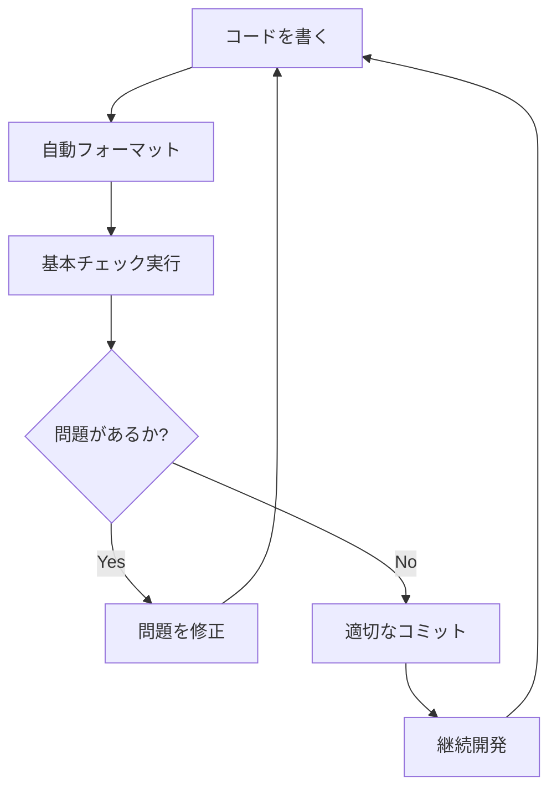

## はじめに

前回の記事「テスト駆動開発から始めるElixir入門 ~2時間でTDDとリファクタリングのエッセンスを体験する~」では、Elixirの基本的な機能とテスト駆動開発の考え方を学びました。

今回は、より実践的な開発環境を構築し、**ソフトウェア開発の三種の神器**を準備することで、「動作するきれいなコード」を継続的に書き続けられる環境を整えます。

### 想定読者
- Elixir入門1を読了した方
- ソフトウェア開発の品質向上に興味がある方
- 自動化による開発効率化を学びたい方

### 学習目標
- ソフトウェア開発の三種の神器を理解する
- Elixirにおける開発環境の構築方法を習得する
- 継続的品質向上の仕組みを理解する
- 自動化による開発効率化を体験する

---

## ソフトウェア開発の三種の神器

優れたソフトウェア開発には、以下の3つの要素が不可欠です：

### 1. バージョン管理
**「いつでも安全に戻れる安心感」**

前回の記事でGitを使用してコードの変更履歴を管理しました。これにより：
- 変更の履歴が保存される
- 問題が発生した時に以前の状態に戻せる
- チーム開発での変更管理が可能

### 2. テスティング
**「コードが正しく動作する保証」**

前回の記事でExUnitを使用してテスト駆動開発を実践しました。これにより：
- コードの動作が保証される
- リファクタリングが安全に行える
- 仕様が文書化される

### 3. 自動化
**「人的ミスを排除し、品質を一定化」**

今回の記事の主要テーマです。自動化により：
- 人的ミスが削減される
- 開発効率が向上する
- 品質が一定化される
- チームでの共通認識が生まれる

---

## エピソード2 - 自動化から始めるテスト駆動開発

前回作成したFizzBuzzプロジェクトを基に、実際にソフトウェア開発の三種の神器を整備していきます。

### 現在のプロジェクト状況

```bash
# プロジェクト構成
fizz_buzz/
├── lib/
│   └── fizz_buzz.ex
├── test/
│   ├── fizz_buzz_test.exs
│   └── test_helper.exs
├── mix.exs
└── README.md
```

### コミット履歴の確認

```bash
git log --oneline -6
# 461e0a9 feat: プリント機能の追加
# c0f6be8 refactor: パターンマッチングとguardによる実装
# e50f01f test: 1から100までのFizzBuzzの配列を返す
# f012342 test: 15を渡したら文字列FizzBuzzを返す
# eaf7081 test: 5を渡したら文字列Buzzを返す
# 372a59a test: 3を渡したら文字列Fizzを返す
```

---

## Phase 1: コミットメッセージの標準化

### Angularコミットメッセージ規約

良いコミットメッセージは、プロジェクトの変更履歴を理解しやすくします。Angularプロジェクトで使用されている規約を採用しましょう：

```
<type>(<scope>): <subject>

<body>

<footer>
```

### 主要なタイプ

- **feat**: 新機能の追加
- **fix**: バグの修正
- **docs**: ドキュメントのみの変更
- **style**: コードの動作に影響しないスタイルの変更
- **refactor**: バグ修正や機能追加以外のコード変更
- **perf**: パフォーマンスを改善するコード変更
- **test**: テストの追加や修正
- **chore**: ビルドプロセスやツールの変更

### 実践例

```bash
# 良い例
git commit -m "feat: FizzBuzz生成機能を追加"
git commit -m "test: 15の場合のテストケースを追加"
git commit -m "refactor: パターンマッチングによる実装改善"
git commit -m "chore: 静的解析ツールCredoを導入"

# 改善の余地がある例
git commit -m "update"
git commit -m "fix bug"
git commit -m "add test"
```

今後のコミットでは、この規約に従ってメッセージを作成していきます。

---

## Phase 2: パッケージマネージャ - Mix

### Mixとは

Elixirには**Mix**という強力なビルドツールが標準で付属しています：

- **依存関係管理**: 外部ライブラリの管理
- **タスク実行**: テスト、ビルド、カスタムタスクの実行
- **プロジェクト構成管理**: 設定の一元化

### mix.exsの拡張

現在のプロジェクトに開発用ツールを追加します：

```elixir
defmodule FizzBuzz.MixProject do
  use Mix.Project

  def project do
    [
      app: :fizz_buzz,
      version: "0.1.0",
      elixir: "~> 1.16",
      start_permanent: Mix.env() == :prod,
      deps: deps(),
      
      # テストカバレッジの設定
      test_coverage: [tool: ExCoveralls],
      preferred_cli_env: [
        coveralls: :test,
        "coveralls.detail": :test,
        "coveralls.html": :test
      ]
    ]
  end

  def application do
    [
      extra_applications: [:logger]
    ]
  end

  defp deps do
    [
      # 静的コード解析
      {:credo, "~> 1.7", only: [:dev, :test], runtime: false},
      # コードカバレッジ
      {:excoveralls, "~> 0.18", only: :test},
      # ファイル監視
      {:mix_test_watch, "~> 1.0", only: [:dev, :test], runtime: false}
    ]
  end
end
```

### 依存関係のインストール

```bash
mix deps.get
```

これで、品質向上のためのツールが利用可能になりました。

---

## Phase 3: 静的コード解析 - Credo

### Credoとは

**Credo**は、Elixir専用の静的コード解析ツールです：

- コードの可読性チェック
- Elixirのベストプラクティス指摘
- コードの一貫性確保
- 潜在的な問題の早期発見

### セットアップ

```bash
# 設定ファイルを生成
mix credo gen.config

# 実行
mix credo
```

### 実際の問題と解決

初回実行時、以下のような指摘を受けました：

```
[R] → Modules should have a @moduledoc tag.
      lib/fizz_buzz.ex:1:11 #(FizzBuzz)
```

**解決策**: モジュールドキュメントを追加

```elixir
defmodule FizzBuzz do
  @moduledoc """
  FizzBuzz問題を解くためのモジュールです。

  数値を受け取り、以下のルールに従って文字列を返します：
  - 3で割り切れる場合: "Fizz"
  - 5で割り切れる場合: "Buzz"  
  - 3と5の両方で割り切れる場合: "FizzBuzz"
  - それ以外: 数値の文字列表現
  """
  
  def generate(number) when rem(number, 15) == 0, do: "FizzBuzz"
  def generate(number) when rem(number, 3) == 0, do: "Fizz"
  def generate(number) when rem(number, 5) == 0, do: "Buzz"
  def generate(number), do: to_string(number)

  def list(max) do
    1..max
    |> Enum.map(&generate/1)
  end

  def print(max \\ 100) do
    list(max)
    |> Enum.each(&IO.puts/1)
  end
end
```

**コミット**:
```bash
git add -A
git commit -m "chore: 静的コード解析ツールCredoの導入とモジュールドキュメント追加"
```

### Credoの結果確認

```bash
mix credo
# Checking 3 source files ...
# Analysis took 0.1 seconds
# 8 mods/funs, found no issues.
```

これで、コードがElixirのベストプラクティスに準拠していることが確認できました。

---

## Phase 4: コードフォーマッタ - mix format

### mix formatとは

**mix format**は、Elixir 1.6以降に標準搭載されたコードフォーマッタです：

- 一貫したコードスタイル
- チーム開発での統一性
- 読みやすいコード
- フォーマットに関する議論の削減

### 設定ファイルの作成

`.formatter.exs`を編集して、プロジェクトの設定を調整：

```elixir
# .formatter.exs
[
  inputs: ["{mix,.formatter}.exs", "{config,lib,test}/**/*.{ex,exs}"],
  line_length: 100,
  import_deps: []
]
```

### 使用方法

```bash
# コードを自動整形
mix format

# フォーマット状態をチェック（CI用）
mix format --check-formatted
```

**コミット**:
```bash
git add -A
git commit -m "chore: コードフォーマッタの設定とコード整形"
```

### フォーマッタの利点

フォーマッタを導入することで：
- **統一性**: チーム全体で同じコードスタイル
- **効率性**: フォーマットを気にせず開発に集中
- **可読性**: 一貫した見た目で理解しやすい
- **自動化**: CI/CDでの自動チェック

---

## Phase 5: コードカバレッジ - ExCoveralls

### ExCoverallsとは

**ExCoveralls**は、Elixir用のコードカバレッジツールです：

- テストカバレッジの測定
- HTML/XMLレポート生成
- CI/CD統合対応
- カバレッジの可視化

### 設定の確認

`mix.exs`で既に設定済みの内容を確認：

```elixir
# テストカバレッジツールとしてExCoverallsを指定
test_coverage: [tool: ExCoveralls],

# テスト環境での実行を指定
preferred_cli_env: [
  coveralls: :test,
  "coveralls.detail": :test,
  "coveralls.html": :test
]
```

### 使用方法と結果

```bash
# カバレッジ測定
mix coveralls
```

**結果**:
```
COV    FILE                  LINES RELEVANT   MISSED
83.3%  lib/fizz_buzz.ex         25        6        1
[TOTAL]  83.3%
```

```bash
# HTMLレポート生成
mix coveralls.html
# Saved to: cover/
```

### カバレッジの解釈

現在のカバレッジは**83.3%**です。これは：
- 6つの実行可能な行のうち、5つがテストでカバーされている
- 1つの行がまだテストされていない
- 一般的に80%以上のカバレッジは良好とされる

**注意**: カバレッジは品質の一つの指標であり、100%が必ずしも最適ではありません。重要なのは、ビジネスロジックが適切にテストされていることです。

---

## Phase 6: タスクランナー - Mix Tasks

### カスタムMixタスクの作成

開発効率を向上させるため、よく使用するコマンドを統合したカスタムタスクを作成します。

```bash
mkdir -p lib/mix/tasks
```

#### 基本チェックタスク

`lib/mix/tasks/check.ex`:

```elixir
defmodule Mix.Tasks.Check do
  @moduledoc """
  開発時の基本チェックを実行するタスクです。

  以下のチェックを実行します：
  - mix format --check-formatted (フォーマットチェック)
  - mix credo (静的解析)
  - mix test (テスト実行)
  """

  use Mix.Task

  @shortdoc "基本的なコード品質チェック"

  def run(_args) do
    Mix.shell().info("==> 基本チェックを開始します")

    # フォーマットチェック
    Mix.shell().info("\n==> フォーマットチェック")
    Mix.Task.run("format", ["--check-formatted"])
    Mix.shell().info("✓ フォーマットチェック 完了")

    # 静的解析
    Mix.shell().info("\n==> 静的解析")
    Mix.Task.run("credo", [])
    Mix.shell().info("✓ 静的解析 完了")

    # テスト実行
    Mix.shell().info("\n==> テスト実行")
    Mix.Task.run("test", [])
    Mix.shell().info("✓ テスト実行 完了")

    Mix.shell().info("\n🎉 基本チェックが完了しました！")
  end
end
```

#### 開発用ショートカットタスク

`lib/mix/tasks/dev.ex`:

```elixir
defmodule Mix.Tasks.Dev do
  @moduledoc """
  開発時によく使用するタスクのためのショートカットです。
  """

  use Mix.Task

  @shortdoc "開発用ショートカットコマンド"

  def run(["test"]) do
    Mix.Task.run("test", [])
  end

  def run(["format"]) do
    Mix.Task.run("format", [])
    Mix.shell().info("✓ コードをフォーマットしました")
  end

  def run(["coverage"]) do
    Mix.Task.run("coveralls.html", [])
    Mix.shell().info("✓ カバレッジレポートを生成しました (cover/excoveralls.html)")
  end

  def run(_) do
    Mix.shell().info("""
    使用可能なコマンド:
    
      mix dev.test          # テストを実行
      mix dev.format        # コードをフォーマット  
      mix dev.coverage      # カバレッジレポートを生成
    """)
  end
end
```

### 使用方法

```bash
# 基本チェック実行
mix check

# 開発用コマンド
mix dev               # ヘルプ表示
mix dev.test          # テスト実行
mix dev.format        # フォーマット
mix dev.coverage      # カバレッジレポート生成
```

**コミット**:
```bash
git add -A
git commit -m "chore: タスクランナーとしてのMixタスクを追加"
```

---

## Phase 7: タスクの自動化 - mix_test_watch

### mix_test_watchとは

**mix_test_watch**は、ファイルの変更を監視して自動的にテストを実行するツールです：

- ファイル変更の監視
- 自動テスト実行
- リアルタイムフィードバック
- 開発効率の向上

### 使用方法

```bash
# ファイル監視を開始
mix test.watch
```

このコマンドを実行すると：
1. ファイルの変更を監視
2. 変更が検出されると自動的にテストを実行
3. 結果をリアルタイムで表示

### 自動化の価値

自動化により以下が実現されます：

- **即座のフィードバック**: コードを書くたびに結果が分かる
- **安心感**: 常にテストが実行されている状態
- **効率性**: 手動でコマンドを実行する必要がない
- **品質向上**: 問題の早期発見

### 開発ガイドの作成

チーム開発のため、開発手順をドキュメント化します。

`DEVELOPMENT.md`:

```markdown
# 開発ガイド

## 使用可能なツール

### 基本コマンド
- `mix test` - テスト実行
- `mix format` - コード整形
- `mix credo` - 静的解析
- `mix coveralls` - カバレッジ測定

### 統合コマンド
- `mix check` - 基本チェック (format, credo, test)

### 開発用コマンド
- `mix dev` - 利用可能なコマンド一覧
- `mix dev.coverage` - HTMLカバレッジレポート生成

### 自動化
- `mix test.watch` - ファイル変更時の自動テスト実行

## 開発フロー

1. **コードを書く**
2. **フォーマット**: `mix format`
3. **チェック**: `mix check`
4. **コミット**

## 品質基準

- **フォーマット**: Elixir標準フォーマッタに準拠
- **静的解析**: Credoのルールをクリア
- **テストカバレッジ**: 80%以上を目標
- **全テスト**: パスすること
```

**コミット**:
```bash
git add -A
git commit -m "chore: タスクの自動化と開発ガイドの追加"
```

---

## 開発フローの確立

### 推奨開発フロー

自動化環境が整ったので、効率的な開発フローを確立しましょう：



#### 1. コードを書く
新機能やバグ修正のコードを書きます。

#### 2. 自動フォーマット
```bash
mix format
```

#### 3. 基本チェック
```bash
mix check
```

#### 4. 問題があれば修正
- フォーマットエラー → `mix format`で自動修正
- Credo警告 → コードの改善
- テスト失敗 → テストまたは実装の修正

#### 5. 適切なコミット
```bash
git add -A
git commit -m "feat: 新機能を追加"
```

#### 6. 継続監視（オプション）
```bash
mix test.watch
```

### 品質基準の設定

開発チームとして以下の基準を設定：

- **フォーマット**: 100%準拠（自動化により保証）
- **静的解析**: Credoルールクリア
- **テストカバレッジ**: 80%以上を目標
- **全テスト**: パス必須

---

## 実践例：完成した開発環境

### プロジェクト構成

```
fizz_buzz/
├── lib/
│   ├── fizz_buzz.ex              # メインモジュール
│   └── mix/
│       └── tasks/
│           ├── check.ex          # 基本チェックタスク
│           └── dev.ex            # 開発用タスク
├── test/
│   ├── fizz_buzz_test.exs        # テストファイル
│   └── test_helper.exs
├── .credo.exs                    # Credo設定
├── .formatter.exs                # フォーマッタ設定
├── mix.exs                       # プロジェクト設定
├── DEVELOPMENT.md                # 開発ガイド
└── README.md                     # プロジェクト説明
```

### 使用可能なコマンド一覧

```bash
# 基本的な開発コマンド
mix test                    # テスト実行
mix format                  # コード整形
mix credo                   # 静的解析
mix coveralls              # カバレッジ測定
mix coveralls.html         # HTMLカバレッジレポート

# 統合コマンド
mix check                   # 基本チェック

# 開発用ショートカット
mix dev                     # ヘルプ表示
mix dev.test               # テスト実行
mix dev.format             # フォーマット実行
mix dev.coverage           # カバレッジレポート生成

# 自動化
mix test.watch             # ファイル監視
```

### コミット履歴の確認

```bash
git log --oneline -10
```

```
033240d chore: タスクの自動化と開発ガイドの追加
91a5383 chore: タスクランナーとしてのMixタスクを追加  
7c5fcce chore: コードフォーマッタの設定とコード整形
6a77eae chore: 静的コード解析ツールCredoの導入とモジュールドキュメント追加
461e0a9 feat: プリント機能の追加
c0f6be8 refactor: パターンマッチングとguardによる実装
e50f01f test: 1から100までのFizzBuzzの配列を返す
f012342 test: 15を渡したら文字列FizzBuzzを返す
eaf7081 test: 5を渡したら文字列Buzzを返す
372a59a test: 3を渡したら文字列Fizzを返す
```

きれいなコミット履歴が形成されています。Angularコミットメッセージ規約に従い、変更の種類が明確に分かります。

---

## トラブルシューティング

### よくある問題と解決策

#### 1. フォーマットエラー

**問題**:
```bash
mix format --check-formatted
# The following files are not formatted: lib/fizz_buzz.ex
```

**解決**:
```bash
mix format
```

#### 2. Credo警告

**問題**:
```
[R] → Modules should have a @moduledoc tag.
```

**解決**:
```elixir
defmodule MyModule do
  @moduledoc """
  モジュールの説明を記述
  """
end
```

#### 3. テストカバレッジ低下

**問題**: カバレッジが目標値を下回る

**解決策**:
- 不足しているテストケースを追加
- 不要なコードの削除
- テストの質を向上

#### 4. 依存関係の問題

**問題**: 新しい依存関係が取得できない

**解決**:
```bash
mix deps.clean --all
mix deps.get
```

---

## Ruby版との比較

### ツール対応表

| 目的 | Ruby | Elixir |
|------|------|--------|
| パッケージマネージャ | Bundler | Mix |
| 静的解析 | RuboCop | Credo |
| コードフォーマッタ | RuboCop（フォーマット機能） | mix format |
| テストカバレッジ | SimpleCov | ExCoveralls |
| タスクランナー | Rake | Mix Tasks |
| ファイル監視 | Guard | mix_test_watch |

### アプローチの違い

#### Ruby: 複数ツールの組み合わせ
- Bundler + RuboCop + SimpleCov + Rake + Guard
- 各ツールが独立している
- 設定ファイルが複数必要

#### Elixir: Mix中心の統合
- Mixが中心的な役割
- 設定の多くがmix.exsに集約
- Elixirエコシステムとの統合が深い

---

## チーム開発での活用

### 共通ルールの設定

1. **コミットメッセージ規約**
   - Angularルールの採用
   - プリフィックスの統一

2. **コード品質基準**
   - フォーマッタの必須使用
   - Credoルールの遵守
   - カバレッジ基準の設定

3. **開発フロー**
   - `mix check`の実行を習慣化
   - コミット前の品質チェック

### CI/CD統合例

GitHub Actionsでの自動化例：

```yaml
# .github/workflows/elixir.yml
name: Elixir CI

on:
  push:
    branches: [ main ]
  pull_request:
    branches: [ main ]

jobs:
  test:
    runs-on: ubuntu-latest

    steps:
    - uses: actions/checkout@v2
    
    - name: Setup Elixir
      uses: erlef/setup-elixir@v1
      with:
        elixir-version: '1.16'
        otp-version: '26'
    
    - name: Install dependencies
      run: mix deps.get
    
    - name: Run quality checks
      run: |
        mix format --check-formatted
        mix credo --strict
        mix test
        mix coveralls
```

---

## まとめ

### 得られたもの

この記事を通じて、以下を実現しました：

#### 1. 継続的品質向上の仕組み
- **静的解析**: コードの問題を早期発見
- **自動フォーマット**: 一貫したコードスタイル
- **カバレッジ測定**: テストの充実度を可視化

#### 2. 効率的な開発環境
- **統合コマンド**: 複数チェックを一度に実行
- **自動化**: ファイル変更時の自動テスト
- **開発ガイド**: チーム共通の開発手順

#### 3. チーム開発での統一性
- **コミット規約**: 変更履歴の理解しやすさ
- **品質基準**: 共通の品質レベル
- **ツール統一**: 同じ環境での開発

#### 4. 自動化による安心感
- **人的ミス削減**: 自動チェックによる品質保証
- **即座のフィードバック**: 問題の早期発見
- **開発効率向上**: 手動作業の削減

### 学習内容の振り返り

#### ソフトウェア開発の三種の神器

1. **バージョン管理** ✅
   - Git による変更履歴管理
   - 適切なコミットメッセージ

2. **テスティング** ✅  
   - ExUnit によるテスト駆動開発
   - ExCoveralls によるカバレッジ測定

3. **自動化** ✅
   - 静的解析の自動実行
   - フォーマットの自動適用
   - テストの自動実行

#### Elixirエコシステムの理解

- **Mix**: プロジェクト管理の中核
- **Credo**: Elixir特有のベストプラクティス
- **mix format**: 言語レベルでのフォーマット支援
- **Mix Tasks**: カスタムタスクによる効率化

### 次のステップ

「動作するきれいなコード」を書く環境が整いました。次回は：

- より高度なリファクタリング技法
- オブジェクト指向的設計パターンのElixir版
- パフォーマンス最適化
- 実際のWebアプリケーション開発

これらの基盤の上に、より実践的なElixirアプリケーション開発を進めていきましょう。

---

## 参考資料

### 公式ドキュメント
- [Elixir公式ドキュメント](https://elixir-lang.org/docs.html)
- [Mix documentation](https://hexdocs.pm/mix/Mix.html)
- [ExUnit documentation](https://hexdocs.pm/ex_unit/ExUnit.html)

### 使用ツール
- [Credo](https://github.com/rrrene/credo) - 静的コード解析
- [ExCoveralls](https://github.com/parroty/excoveralls) - コードカバレッジ
- [mix_test_watch](https://github.com/lpil/mix-test.watch) - ファイル監視

### 参考記事
- [Angularコミットメッセージ規約](https://github.com/angular/angular/blob/master/CONTRIBUTING.md#commit)
- [Elixirのベストプラクティス](https://hexdocs.pm/elixir/main/writing-documentation.html)

Elixirの世界で「動作するきれいなコード」を継続的に書き続ける環境が整いました。開発を楽しんでください！