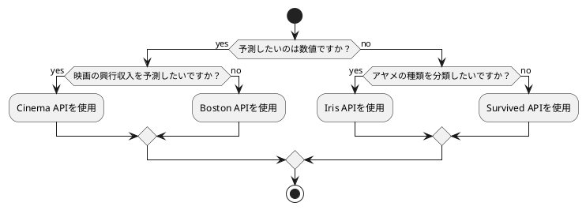
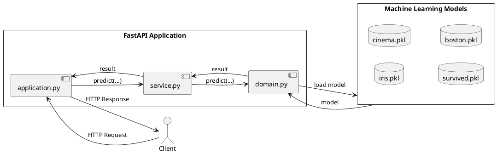

# 実践機械学習

このドキュメントでは、本プロジェクトで実装されている機械学習APIについて解説します。

## 概要

本プロジェクトでは、機械学習モデルの実装とAPI公開にPythonを使用しています。主要なライブラリは以下の通りです。

*   **`pandas`**: データ操作と分析のためのライブラリです。
*   **`scikit-learn`**: 様々な機械学習アルゴリズムを提供するライブラリです。
*   **`FastAPI`**: 高性能なWeb APIを構築するためのPythonフレームワークです。
*   **`uvicorn`**: FastAPIアプリケーションを動かすためのASGIサーバーです。

本プロジェクトには、分類問題と回帰問題を扱う4つの機械学習モデルが実装されています。

*   **分類モデル**:
    *   `Iris API`: アヤメの種類を3つに分類します。
    *   `Survived API`: 乗客が生存したか否かを2値で分類します。
*   **回帰モデル**:
    *   `Cinema API`: 映画の興行収入を予測します。
    *   `Boston API`: 住宅の平均価格を予測します。

以下のフローチャートは、どのモデルを使用すべきかを判断するための指針です。



---

## Iris API

### 目的

アヤメ（Iris）のがく片や花弁のサイズといった特徴量から、そのアヤメがどの種類（setosa, versicolor, virginica）に分類されるかを予測します。

### データ

`src/api/data/iris.csv` を使用します。データには以下の4つの特徴量と1つの正解ラベルが含まれています。

| 列名 | 内容 |
| --- | --- |
| sepal_length | がく片の長さ |
| sepal_width | がく片の幅 |
| petal_length | 花弁の長さ |
| petal_width | 花弁の幅 |
| species | 種類 (setosa, versicolor, virginica) |

### モデル

scikit-learnの決定木（`DecisionTreeClassifier`）を使用しています。訓練済みのモデルは `src/api/model/iris.pkl` として保存されています。

### モデル構築の再現手順

1.  **データの読み込みと前処理**

    欠損値がある場合は、各列の平均値で補完します。

    ```python
    import pandas as pd
    from sklearn.model_selection import train_test_split
    from sklearn import tree
    import pickle

    # データの読み込み
    df = pd.read_csv('src/api/data/iris.csv')

    # 欠損値を平均値で補完する関数
    def df_fillna_mean_cols(df, cols):
        df_fill = df.copy()
        for col in cols:
            mean_value = df_fill[col].mean()
            df_fill[col] = df_fill[col].fillna(mean_value)
        return df_fill

    # 特徴量列を指定して前処理を実行
    xcol = ['sepal_length', 'sepal_width', 'petal_length', 'petal_width']
    df = df_fillna_mean_cols(df, xcol)
    ```

2.  **特徴量と正解ラベルの分割**

    ```python
    x = df[xcol]
    t = df['species']
    ```

3.  **訓練データとテストデータへの分割**

    ```python
    x_train, x_test, y_train, y_test = train_test_split(
        x, t, test_size=0.3, random_state=0)
    ```

4.  **モデルの定義と学習**

    `max_depth=2` の決定木モデルを定義し、訓練データで学習させます。

    ```python
    model = tree.DecisionTreeClassifier(max_depth=2, random_state=0)
    model.fit(x_train, y_train)
    ```

5.  **モデルの評価**

    ```python
    score = model.score(x_test, y_test)
    print(f"正解率: {score:.4f}")
    # 出力例: 正解率: 0.9778
    ```

6.  **モデルの保存**

    ```python
    with open('src/api/model/iris.pkl', 'wb') as f:
        pickle.dump(model, f)
    ```

### 使い方

以下に、訓練済みモデルを読み込み、予測を行うサンプルコードを示します。

```python
import pickle
import pandas as pd

# モデルの読み込み
with open('src/api/model/iris.pkl', 'rb') as f:
    model = pickle.load(f)

# 予測用のサンプルデータを作成
# (がく片の長さ, がく片の幅, 花弁の長さ, 花弁の幅)
sample_data = [[5.1, 3.5, 1.4, 0.2]]
columns = ['sepal_length', 'sepal_width', 'petal_length', 'petal_width']
sample_df = pd.DataFrame(data=sample_data, columns=columns)

# 予測の実行
prediction = model.predict(sample_df)
print(f"予測結果: {prediction[0]}")
```

## Cinema API

### 目的

映画のSNSでの言及数や主演俳優のメディア露出度といった特徴量から、その映画の最終的な興行収入を予測します。

### データ

`src/api/data/cinema.csv` を使用します。データには以下の特徴量と目的変数が含まれています。

| 列名 | 内容 |
| --- | --- |
| cinema_id | 映画作品のID |
| SNS1 | 公開後10日以内にSNS1でつぶやかれた数 |
| SNS2 | 公開後10日以内にSNS2でつぶやかれた数 |
| actor | 主演俳優の昨年のメディア露出度 |
| original | 原作があるかどうか（1:あり, 0:なし） |
| sales | 最終的な興行収入（単位:万円） |

### モデル

scikit-learnの線形回帰（`LinearRegression`）を使用しています。訓練済みのモデルは `src/api/model/cinema.pkl` として保存されています。

### モデル構築の再現手順

1.  **データの読み込みと前処理**

    欠損値を各列の平均値で補完し、特定の外れ値を除外します。

    ```python
    import pandas as pd
    from sklearn.model_selection import train_test_split
    from sklearn.linear_model import LinearRegression
    from sklearn.metrics import mean_absolute_error
    import pickle

    # データの読み込み
    df = pd.read_csv('src/api/data/cinema.csv')

    # 欠損値を平均値で補完
    df2 = df.fillna(df.mean())

    # 外れ値の除外
    no = df2[(df2['SNS2'] > 1000) & (df2['sales'] < 8500)].index
    df3 = df2.drop(no, axis=0)
    ```

2.  **特徴量と目的変数の分割**

    ```python
    x = df3[['SNS1', 'SNS2', 'actor', 'original']]
    t = df3['sales']
    ```

3.  **訓練データとテストデータへの分割**

    ```python
    x_train, x_test, y_train, y_test = train_test_split(
        x, t, test_size=0.2, random_state=0)
    ```

4.  **モデルの定義と学習**

    ```python
    model = LinearRegression()
    model.fit(x_train, y_train)
    ```

5.  **モデルの評価**

    決定係数と平均絶対誤差（MAE）でモデルの性能を評価します。

    ```python
    score = model.score(x_test, y_test)
    print(f'決定係数: {score:.4f}')

    pred = model.predict(x_test)
    mae = mean_absolute_error(y_pred=pred, y_true=y_test)
    print(f'平均絶対誤差: {mae:.2f}')
    # 出力例:
    # 決定係数: 0.8383
    # 平均絶対誤差: 206.83
    ```

6.  **モデルの保存**

    ```python
    with open('src/api/model/cinema.pkl', 'wb') as f:
        pickle.dump(model, f)
    ```

### 使い方

以下に、訓練済みモデルを読み込み、予測を行うサンプルコードを示します。

```python
import pickle
import pandas as pd

# モデルの読み込み
with open('src/api/model/cinema.pkl', 'rb') as f:
    model = pickle.load(f)

# 予測用のサンプルデータを作成
# (SNS1, SNS2, actor, original)
sample_data = [[150, 700, 300, 0]]
columns = ['SNS1', 'SNS2', 'actor', 'original']
sample_df = pd.DataFrame(data=sample_data, columns=columns)

# 予測の実行
prediction = model.predict(sample_df)
print(f"予測興行収入: {prediction[0]:.2f} 万円")
```

## Survived API

### 目的

客船沈没事故の乗客データに基づき、乗客が生存したか否かを予測します。

### データ

`src/api/data/Survived.csv` を使用します。データには以下の乗客情報が含まれています。

| 列名 | 内容 |
| --- | --- |
| Pclass | チケットクラス（1, 2, 3） |
| Age | 年齢 |
| SibSp | 同乗した兄弟や配偶者の総数 |
| Parch | 同乗した親子の総数 |
| Fare | 運賃 |
| Sex | 性別 |
| Survived | 生存状況（1:生存, 0:死亡） |

### モデル

scikit-learnの決定木（`DecisionTreeClassifier`）を使用しています。訓練済みのモデルは `src/api/model/survived.pkl` として保存されています。

### モデル構築の再現手順

1.  **データの読み込みと前処理**

    `Age`の欠損値は、`Pclass`と`Survived`の組み合わせでグループ化し、その中央値で補完します。`Sex`はダミー変数に変換します。

    ```python
    import pandas as pd
    from sklearn.model_selection import train_test_split
    from sklearn import tree
    import pickle

    # データの読み込み
    df = pd.read_csv('src/api/data/Survived.csv')

    # Ageの欠損値をPclassとSurvivedのグループ中央値で補完
    is_null = df['Age'].isnull()
    df.loc[(df['Pclass'] == 1) & (df['Survived'] == 0) & (is_null), 'Age'] = 43
    df.loc[(df['Pclass'] == 1) & (df['Survived'] == 1) & (is_null), 'Age'] = 35
    df.loc[(df['Pclass'] == 2) & (df['Survived'] == 0) & (is_null), 'Age'] = 33
    df.loc[(df['Pclass'] == 2) & (df['Survived'] == 1) & (is_null), 'Age'] = 25
    df.loc[(df['Pclass'] == 3) & (df['Survived'] == 0) & (is_null), 'Age'] = 26
    df.loc[(df['Pclass'] == 3) & (df['Survived'] == 1) & (is_null), 'Age'] = 20

    # Sexをダミー変数に変換
    male = pd.get_dummies(df['Sex'], drop_first=True)
    df_new = pd.concat([df.drop('Sex', axis=1), male], axis=1)
    ```

2.  **特徴量と正解ラベルの分割**

    ```python
    col = ['Pclass', 'Age', 'SibSp', 'Parch', 'Fare', 'male']
    x = df_new[col]
    y = df_new['Survived']
    ```

3.  **訓練データとテストデータへの分割**

    ```python
    x_train, x_test, y_train, y_test = train_test_split(
        x, y, test_size=0.2, random_state=0)
    ```

4.  **モデルの定義と学習**

    `max_depth=9`、`class_weight='balanced'`の決定木モデルを定義し、学習させます。

    ```python
    model = tree.DecisionTreeClassifier(
        max_depth=9, random_state=0, class_weight='balanced')
    model.fit(x_train, y_train)
    ```

5.  **モデルの評価**

    ```python
    score = model.score(x_test, y_test)
    print(f"正解率: {score:.4f}")
    # 出力例: 正解率: 0.8324
    ```

6.  **モデルの保存**

    ```python
    with open('src/api/model/survived.pkl', 'wb') as f:
        pickle.dump(model, f)
    ```

### 使い方

以下に、訓練済みモデルを読み込み、予測を行うサンプルコードを示します。

```python
import pickle
import pandas as pd

# モデルの読み込み
with open('src/api/model/survived.pkl', 'rb') as f:
    model = pickle.load(f)

# 予測用のサンプルデータを作成
# (Pclass, Age, SibSp, Parch, Fare, male)
sample_data = [[3, 22.0, 1, 0, 7.25, 1]] # 3等, 22歳, 兄弟1人, 親子0人, 7.25ドル, 男性
columns = ['Pclass', 'Age', 'SibSp', 'Parch', 'Fare', 'male']
sample_df = pd.DataFrame(data=sample_data, columns=columns)

# 予測の実行
prediction = model.predict(sample_df)
print(f"予測結果: {'生存' if prediction[0] == 1 else '死亡'}")
```

## Boston API

### 目的

ボストン市内の住宅に関する様々な特徴量から、住宅の平均価格を予測します。

### データ

`src/api/data/Boston.csv` を使用します。データには以下のような特徴量と目的変数が含まれています。

| 列名 | 内容 |
| --- | --- |
| RM | 住居の平均部屋数 |
| LSTAT | 人口における低所得者の割合 |
| PTRATIO | 町ごとの教員1人当たりの児童生徒数 |
| PRICE | 住宅価格の平均価格 |

（※その他多数の特徴量が存在しますが、主要なものを抜粋）

### モデル

scikit-learnの線形回帰（`LinearRegression`）を使用しています。特徴量と目的変数は、`StandardScaler`によって標準化されています。

### モデル構築の再現手順

1.  **データの読み込みと前処理**

    `CRIME`列をダミー変数化し、欠損値を訓練データの平均値で補完します。また、特定の外れ値を除外します。

    ```python
    import pandas as pd
    from sklearn.model_selection import train_test_split
    from sklearn.preprocessing import StandardScaler
    from sklearn.linear_model import LinearRegression
    import pickle

    # データの読み込み
    df = pd.read_csv('src/api/data/Boston.csv')

    # CRIME列をダミー変数化
    crime = pd.get_dummies(df['CRIME'], drop_first=True)
    df2 = pd.concat([df, crime], axis=1)
    df2 = df2.drop('CRIME', axis=1)

    # 訓練データとテストデータに分割
    train_val, test = train_test_split(df2, test_size=0.2, random_state=0)

    # 欠損値を訓練データの平均で補完
    train_val_mean = train_val.mean()
    train_val2 = train_val.fillna(train_val_mean)

    # 外れ値の除外
    train_val3 = train_val2.drop([76], axis=0)
    ```

2.  **特徴量エンジニアリング**

    元の特徴量に加えて、2乗の項や交互作用項を追加して、モデルの表現力を高めます。

    ```python
    # 使用する特徴量の選択
    x = train_val3.loc[:, ['RM', 'LSTAT', 'PTRATIO']]
    t = train_val3[['PRICE']]

    # 特徴量の追加
    x['RM2'] = x['RM'] ** 2
    x['LSTAT2'] = x['LSTAT'] ** 2
    x['PTRATIO2'] = x['PTRATIO'] ** 2
    x['RM * LSTAT'] = x['RM'] * x['LSTAT']
    ```

3.  **データの標準化**

    特徴量と目的変数をそれぞれ標準化します。

    ```python
    sc_model_x = StandardScaler()
    sc_model_x.fit(x)
    sc_x = sc_model_x.transform(x)

    sc_model_y = StandardScaler()
    sc_model_y.fit(t)
    sc_y = sc_model_y.transform(t)
    ```

4.  **モデルの定義と学習**

    ```python
    model = LinearRegression()
    model.fit(sc_x, sc_y)
    ```

5.  **モデルの評価**

    テストデータを使って決定係数を評価します。

    ```python
    # テストデータの前処理
    test2 = test.fillna(train_val.mean())
    x_test = test2.loc[:, ['RM', 'LSTAT', 'PTRATIO']]
    y_test = test2[['PRICE']]

    # テストデータにも同様の特徴量エンジニアリングを適用
    x_test['RM2'] = x_test['RM'] ** 2
    x_test['LSTAT2'] = x_test['LSTAT'] ** 2
    x_test['PTRATIO2'] = x_test['PTRATIO'] ** 2
    x_test['RM * LSTAT'] = x_test['RM'] * x_test['LSTAT']

    # テストデータの標準化
    sc_x_test = sc_model_x.transform(x_test)
    sc_y_test = sc_model_y.transform(y_test)

    score = model.score(sc_x_test, sc_y_test)
    print(f"決定係数: {score:.4f}")
    # 出力例: 決定係数: 0.8313
    ```

6.  **モデルとスケーラーの保存**

    ```python
    with open('src/api/model/boston.pkl', 'wb') as f:
        pickle.dump(model, f)
    with open('src/api/model/boston_scx.pkl', 'wb') as f:
        pickle.dump(sc_model_x, f)
    with open('src/api/model/boston_scy.pkl', 'wb') as f:
        pickle.dump(sc_model_y, f)
    ```

### 使い方

以下に、訓練済みモデルを読み込み、予測を行うサンプルコードを示します。

```python
import pickle
import pandas as pd

# モデルとスケーラーの読み込み
with open('src/api/model/boston.pkl', 'rb') as f:
    model = pickle.load(f)
with open('src/api/model/boston_scx.pkl', 'rb') as f:
    sc_x = pickle.load(f)
with open('src/api/model/boston_scy.pkl', 'rb') as f:
    sc_y = pickle.load(f)

# 予測用のサンプルデータを作成
# (RM, LSTAT, PTRATIO)
sample_data = [[6.5, 5.0, 15.0]]
columns = ['RM', 'LSTAT', 'PTRATIO']
sample_df = pd.DataFrame(data=sample_data, columns=columns)

# 特徴量エンジニアリング
sample_df['RM2'] = sample_df['RM'] ** 2
sample_df['LSTAT2'] = sample_df['LSTAT'] ** 2
sample_df['PTRATIO2'] = sample_df['PTRATIO'] ** 2
sample_df['RM * LSTAT'] = sample_df['RM'] * sample_df['LSTAT']

# 特徴量の標準化
sample_df_std = sc_x.transform(sample_df)

# 予測の実行
prediction_std = model.predict(sample_df_std)

# 結果を元のスケールに戻す
prediction = sc_y.inverse_transform(prediction_std)

print(f"予測住宅価格: ${prediction[0][0] * 1000:.2f}")
```

---

## FastAPIとの連携

本プロジェクトの機械学習モデルは、FastAPIを用いてAPIとして公開されています。これにより、HTTPリクエストを通じて各モデルの予測機能を利用できます。

### アーキテクチャ概要

APIのアーキテクチャは以下のようになっています。クライアントからのHTTPリクエストをFastAPIアプリケーション(`application.py`)が受け取り、リクエスト内容に応じて`Service`クラス(`service.py`)のメソッドを呼び出します。`Service`クラスは、各モデルのドメインクラス(`domain.py`)を呼び出し、最終的な予測結果をクライアントに返却します。



### APIの起動方法

以下のコマンドでAPIサーバーを起動します。`src/api`ディレクトリで実行してください。

```bash
# uvicorn app.application:app --reload
```

サーバーが起動すると、`http://127.0.0.1:8000`でAPIにアクセスできます。APIの仕様は、Swagger UI (`http://127.0.0.1:8000/docs`) または ReDoc (`http://127.0.0.1:8000/redoc`) で確認できます。

### 関連コードの詳細解説

#### 1. エンドポイント定義 (`src/api/app/application.py`)

このファイルはAPIのエントリーポイントです。FastAPIアプリケーションを初期化し、各予測モデルへのエンドポイントを定義します。

*   **Pydanticモデルによる型定義**: `IrisModel`, `CinemaModel`などのクラスは、リクエストボディの構造とデータ型を定義します。これにより、FastAPIは自動的にリクエストデータのバリデーションと型変換を行います。不正なデータが送信された場合は、適切なエラーメッセージを返却します。

    ```python
    from pydantic import BaseModel

    class IrisModle(BaseModel):
        sepal_length: int
        sepal_width: int
        petal_length: int
        petal_width: int
    # ... 他のモデルも同様
    ```

*   **エンドポイント関数**: `@app.post(...)` デコレータは、関数を特定のパス（例: `/iris`）へのPOSTリクエストハンドラとして登録します。関数の引数にPydanticモデルを指定すると、FastAPIはリクエストボディをそのモデルのインスタンスに変換して渡します。

    ```python
    # Serviceクラスのインスタンスを作成
    service = Service()

    @app.post("/iris", tags=["Iris"], description="分類1:アヤメの判別")
    async def predict_iris(model: IrisModle):
        # リクエストデータをモデルが予測できる形式に変換
        x = [[
            model.sepal_length,
            model.sepal_width,
            model.petal_length,
            model.petal_width
        ]]
        # Serviceクラスに処理を委譲
        resutl = service.predict_iris(x)
        return resutl[0]
    ```

#### 2. ビジネスロジック (`src/api/app/service.py`)

このファイルは、APIのビジネスロジック（この場合は予測の実行）を担当します。APIのエンドポイントから呼び出され、ドメイン層のクラスを使って実際の処理を行います。

*   **Serviceクラス**: 各予測エンドポイントに対応するメソッドを持ちます。これにより、`application.py`はHTTP関連の処理に専念でき、ビジネスロジックが分離されます。

    ```python
    from src.api.domain import Boston, Cinema, Iris, Survived

    class Service:
        def predict_iris(self, x):
            # Irisドメインクラスをインスタンス化
            iris = Iris()
            # predictメソッドを呼び出し
            return iris.predict(x)

        # ... 他も同様の構造
        def predict_boston(self, rm, lstat, ptratio):
            boston = Boston()
            return boston.predict(rm, lstat, ptratio)
    ```

#### 3. ドメインロジック (`src/api/domain.py`)

このファイルは、各機械学習モデルに関するドメイン固有のロジックをカプセル化します。モデルの読み込みや、モデルに合わせたデータの前処理、予測の実行などが含まれます。

*   **ドメインクラス**: `Iris`, `Cinema`, `Survived`, `Boston`といったクラスが定義されています。各クラスは、対応する訓練済みモデル（`.pkl`ファイル）を読み込み、予測を実行する`predict`メソッドを持ちます。

    ```python
    import pickle
    import os
    path = os.path.dirname(os.path.abspath(__file__))

    class Iris:
        def __init__(self) -> None:
            # コンストラクタでモデルを読み込む
            self.load()

        def load(self):
            with open(file=path + '/model/iris.pkl', mode='rb') as f:
                self.model = pickle.load(f)

        def predict(self, x):
            # 読み込んだモデルで予測を実行
            return self.model.predict(x)

    class Boston:
        def __init__(self) -> None:
            # Bostonモデルは複数のファイル（モデルとスケーラー）を読み込む
            self.load()

        def load(self):
            with open(file=path + '/model/boston.pkl', mode='rb') as f:
                self.model = pickle.load(f)
            with open(file=path + '/model/boston_scx.pkl', mode='rb') as f:
                self.model_scx = pickle.load(f)
            with open(file=path + '/model/boston_scy.pkl', mode='rb') as f:
                self.model_scy = pickle.load(f)

        def predict(self, rm, lstat, ptratio):
            # Bostonモデル固有の前処理（特徴量生成と標準化）を実行
            rm2 = rm ** 2
            lstat2 = lstat ** 2
            ptratio2 = ptratio ** 2
            rm_lstat = rm * lstat
            x_test = [[rm, lstat, ptratio, rm2, lstat2, ptratio2, rm_lstat]]
            sc_x_test = self.model_scx.transform(x_test)
            result = self.model.predict(sc_x_test)

            return result
    ```

このように、関心の分離（Separation of Concerns）の原則に従ってコードが構成されており、保守性と拡張性の高いアーキテクチャとなっています。