# テスト戦略

## 概要

ぷよぷよゲームプロジェクトのテスト戦略について説明します。TDD（テスト駆動開発）開発サイクルを基盤とし、ピラミッド形のテスト戦略を採用します。テストライブラリには、Viteエコシステムとの親和性が高く、関数型プログラミングに適したVitest + React Testing Libraryの組み合わせを使用します。

## テスト戦略の基本方針

### TDD開発サイクル

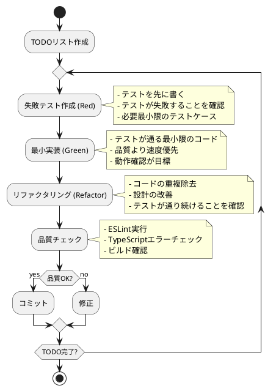

## テストピラミッド戦略

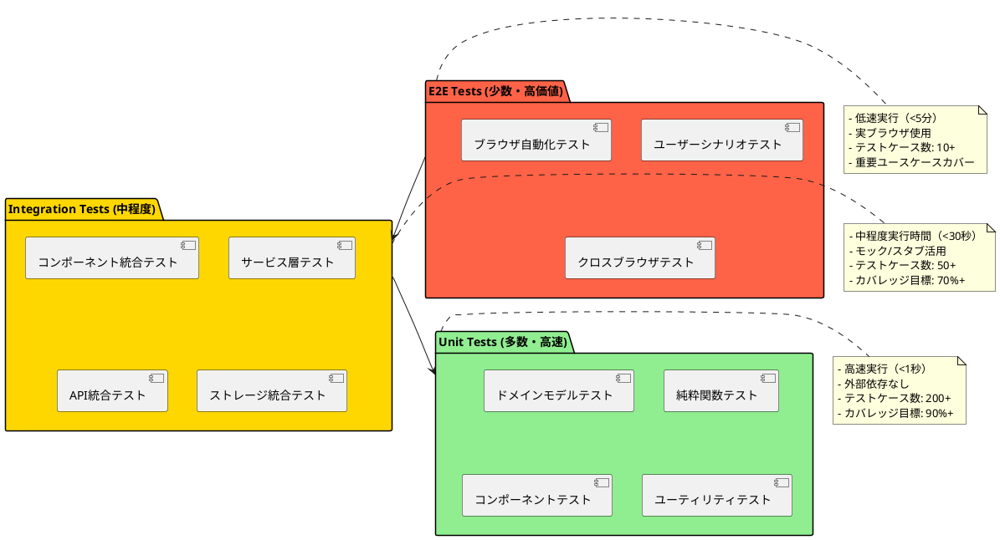

## レイヤー別テスト戦略

### ドメイン層テスト

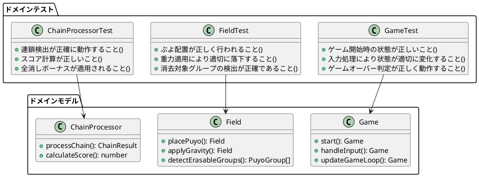

**対象:**

- ドメインモデル（Game, Field, Puyo, Chain）
- ドメインサービス（ChainDetection, ScoreCalculation）
- 値オブジェクト（Position, Score）

**テスト方針:**

- 外部依存なしの純粋なユニットテスト
- 不変条件の検証
- ビジネスルールの詳細な検証
- 境界値テストの実施

### アプリケーション層テスト

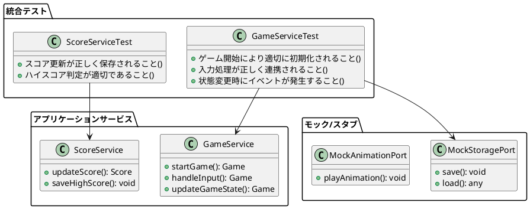

**対象:**

- アプリケーションサービス
- ポートとアダプターの統合
- ドメインイベントの発行

**テスト方針:**

- モック/スタブによる外部依存の分離
- ユースケースレベルでの統合テスト
- イベント発行の検証

### プレゼンテーション層テスト

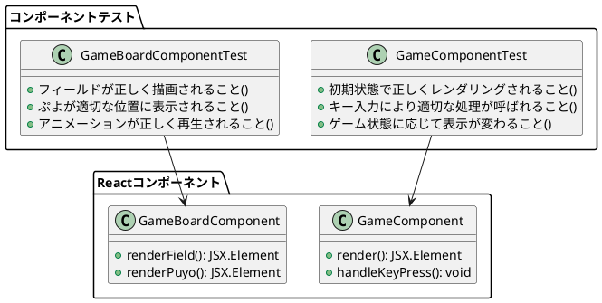

**対象:**

- Reactコンポーネント
- ユーザー入力処理
- 描画ロジック

**テスト方針:**

- Vitest + React Testing Libraryによるコンポーネントテスト
- ユーザー体験重視のテスト設計
- アクセシビリティを考慮した検証
- 実装詳細ではなくユーザー操作のシミュレーション

### インフラストラクチャ層テスト

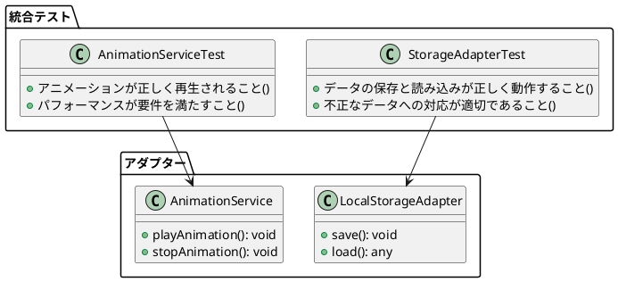

**対象:**

- 外部システムとの統合
- ブラウザAPIの利用
- パフォーマンス検証

**テスト方針:**

- 実際の外部システムとの統合テスト
- エラーハンドリングの検証
- パフォーマンステスト

## E2Eテスト戦略

### 主要ユーザーシナリオ

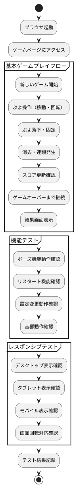

### クロスブラウザテスト

| ブラウザ | バージョン | 優先度 | 対象機能 |
|----------|------------|---------|----------|
| Chrome | 90+ | 高 | 全機能 |
| Firefox | 88+ | 高 | 全機能 |
| Safari | 14+ | 中 | 基本機能 |
| Edge | 90+ | 中 | 基本機能 |

## パフォーマンステスト

### パフォーマンス要件

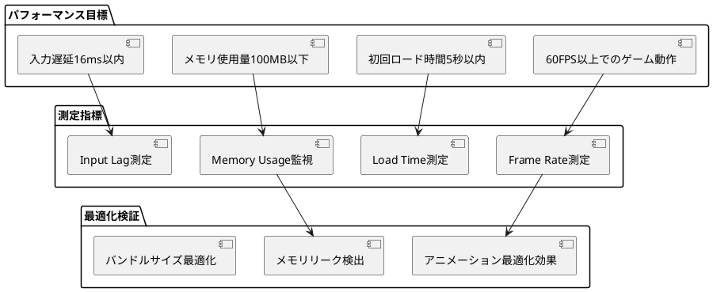

### パフォーマンステストツール

- **Lighthouse:** Web Vitals測定
- **Chrome DevTools:** 詳細パフォーマンス分析
- **Web Vitals Extension:** リアルタイム監視
- **Bundle Analyzer:** バンドルサイズ分析

## テストデータ管理

### テストデータ戦略

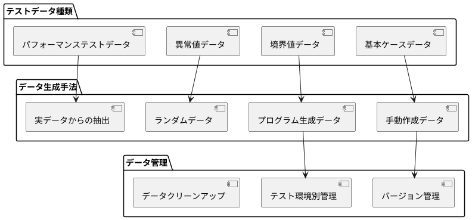

### テストデータビルダーパターン

```typescript
class GameTestDataBuilder {
  private game: Game;
  
  constructor() {
    this.game = this.createDefaultGame();
  }
  
  withField(pattern: string[][]): GameTestDataBuilder {
    const field = FieldFactory.createFromPattern(pattern);
    this.game = this.game.withField(field);
    return this;
  }
  
  withScore(score: number): GameTestDataBuilder {
    this.game = this.game.withScore(new Score(score, 0));
    return this;
  }
  
  build(): Game {
    return this.game;
  }
}

// 使用例
const gameWithChain = new GameTestDataBuilder()
  .withField([
    ['.', '.', '.', '.', '.', '.'],
    ['.', '.', '.', '.', '.', '.'],
    ['R', 'R', 'R', '.', '.', '.'],
    ['R', 'G', 'G', 'G', '.', '.'],
  ])
  .withScore(1000)
  .build();
```

## CI/CDにおけるテスト実行

### テスト実行フロー

```plantuml
@startuml "CI/CDテスト実行フロー"
start

:コード変更;
:Gitプッシュ;

partition "GitHub Actions" {
  :テスト環境セットアップ;
  
  parallel
    :Unit Tests実行;
    note right: 約30秒
  and
    :Integration Tests実行;  
    note right: 約2分
  and
    :Lint & TypeScript実行;
    note right: 約15秒
  end parallel
  
  if (全テスト通過?) then (yes)
    :E2E Tests実行;
    note right: 約5分
    
    if (E2Eテスト通過?) then (yes)
      :ビルド実行;
      :成功通知;
    else (no)
      :E2E失敗通知;
      stop
    endif
  else (no)
    :失敗通知;
    stop
  endif
}

:デプロイ準備完了;
stop
@enduml
```

### テスト環境設定

```yaml
# .github/workflows/test.yml
name: Test Suite with Vitest

on: [push, pull_request]

jobs:
  test:
    runs-on: ubuntu-latest
    
    strategy:
      matrix:
        node-version: [18, 20]
        browser: [chrome, firefox]
    
    steps:
      - uses: actions/checkout@v4
      - name: Setup Node.js
        uses: actions/setup-node@v4
        with:
          node-version: ${{ matrix.node-version }}
          cache: 'npm'
          
      - name: Install dependencies
        run: npm ci
        
      - name: Run unit tests with Vitest
        run: npm run test:unit
        
      - name: Run integration tests with Vitest
        run: npm run test:integration
        
      - name: Generate coverage report
        run: npm run test:coverage
        
      - name: Run E2E tests
        run: npm run test:e2e:${{ matrix.browser }}
        
      - name: Upload coverage reports
        uses: codecov/codecov-action@v3
        with:
          file: ./coverage/coverage-final.json
```

## テスト品質指標

### カバレッジ目標

| レイヤー | Statement | Branch | Function | Line |
|----------|-----------|---------|----------|------|
| ドメイン層 | 95%+ | 90%+ | 95%+ | 95%+ |
| アプリケーション層 | 85%+ | 80%+ | 90%+ | 85%+ |
| プレゼンテーション層 | 70%+ | 65%+ | 75%+ | 70%+ |
| インフラストラクチャ層 | 60%+ | 55%+ | 65%+ | 60%+ |
| **全体** | **80%+** | **75%+** | **85%+** | **80%+** |

### 品質ゲート

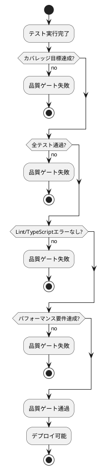

## テストの保守とメンテナンス

### テスト改善サイクル

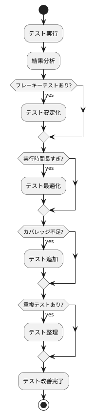

### テストドキュメンテーション

- **テスト計画書:** 全体的なテスト戦略と方針
- **テストケース仕様:** 各テストの詳細仕様
- **テスト実行ログ:** CI/CDでの実行履歴
- **不具合レポート:** テスト失敗時の詳細分析

## まとめ

このテスト戦略により以下を実現：

1. **品質保証:** TDDサイクルによる高品質なコード
2. **効率性:** ピラミッド型による効率的なテスト実行
3. **信頼性:** 包括的なテストカバレッジ
4. **自動化:** CI/CDによる継続的な品質チェック
5. **保守性:** テストコードの継続的改善
6. **透明性:** 品質指標の可視化と監視