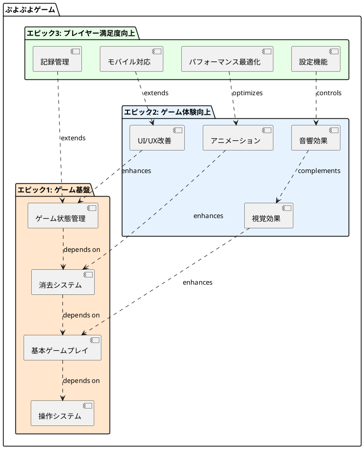
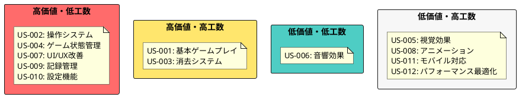

# ユーザーストーリー

## 概要

ぷよぷよゲームのユーザーストーリーを定義します。ユーザーの視点から、どのような機能が必要かを明確にします。

## エピック

### エピック1: ゲーム基盤
基本的なゲーム機能を提供する

### エピック2: ゲーム体験向上
より楽しいゲーム体験を提供する

### エピック3: プレイヤー満足度向上
長期間楽しめる機能を提供する

## ユーザーストーリー

### エピック1: ゲーム基盤

#### US-001: 基本ゲームプレイ
- **As a** プレイヤー
- **I want to** ぷよを操作してゲームをプレイしたい
- **So that** ぷよぷよゲームを楽しむことができる

**受け入れ基準:**

- フィールド(6x12)が表示される
- 上から2個セットのぷよが落下する
- ぷよには複数の色がある
- ぷよは床やother ぷよに衝突すると固定される

**優先度:** 最高  
**見積り:** 8 story points

#### US-002: 操作システム
- **As a** プレイヤー
- **I want to** ぷよを移動・回転させたい
- **So that** 思い通りの位置に配置できる

**受け入れ基準:**

- キーボードで左右移動できる
- キーボードで回転できる
- キーボードで高速落下できる
- 壁や他のぷよとの衝突判定が正しい

**優先度:** 最高  
**見積り:** 5 story points

#### US-003: 消去システム
- **As a** プレイヤー
- **I want to** 同じ色のぷよを4つ以上つなげて消したい
- **So that** 得点を獲得できる

**受け入れ基準:**

- 同じ色のぷよが4つ以上隣接すると消える
- 消去後に上のぷよが落下する
- 連鎖反応が発生する
- 連鎖回数に応じてボーナス得点がある

**優先度:** 最高  
**見積り:** 8 story points

#### US-004: ゲーム状態管理
- **As a** プレイヤー
- **I want to** ゲームの進行状況を把握したい
- **So that** 現在の状態を理解できる

**受け入れ基準:**

- スコアが表示される
- 次に落下するぷよが予告される
- ゲームオーバー判定がある
- ゲーム開始・リスタート機能がある

**優先度:** 高  
**見積り:** 5 story points

### エピック2: ゲーム体験向上

#### US-005: 視覚効果
- **As a** プレイヤー
- **I want to** 美しい視覚効果を見たい
- **So that** より楽しくゲームをプレイできる

**受け入れ基準:**

- ぷよ消去時にエフェクトがある
- 連鎖時に特別なエフェクトがある
- 色分けが明確でわかりやすい
- レスポンシブデザインである

**優先度:** 中  
**見積り:** 5 story points

#### US-006: 音響効果
- **As a** プレイヤー
- **I want to** ゲームの効果音やBGMを聞きたい
- **So that** より没入感のあるゲーム体験ができる

**受け入れ基準:**

- ぷよ落下音がある
- 消去音がある
- 連鎖音がある
- BGMがある
- 音量調節ができる

**優先度:** 中  
**見積り:** 3 story points

#### US-007: UI/UX改善
- **As a** プレイヤー
- **I want to** 使いやすいインターフェースでゲームしたい
- **So that** ストレスなくゲームを楽しめる

**受け入れ基準:**

- 直感的な操作方法の説明がある
- キーボードショートカットが利用できる
- ゲーム中にポーズできる
- メニューがわかりやすい

**優先度:** 中  
**見積り:** 3 story points

#### US-008: アニメーション
- **As a** プレイヤー
- **I want to** スムーズなアニメーションを見たい
- **So that** 自然なゲーム体験ができる

**受け入れ基準:**

- ぷよ落下アニメーションがある
- 消去アニメーションがある
- 連鎖アニメーションがある
- アニメーションの速度が適切である

**優先度:** 中  
**見積り:** 5 story points

### エピック3: プレイヤー満足度向上

#### US-009: 記録管理
- **As a** プレイヤー
- **I want to** ハイスコアを記録したい
- **So that** 過去の成績と比較できる

**受け入れ基準:**

- ハイスコアが保存される
- ローカルストレージに記録される
- 最高連鎖数も記録される
- 記録のリセット機能がある

**優先度:** 低  
**見積り:** 3 story points

#### US-010: 設定機能
- **As a** プレイヤー
- **I want to** ゲーム設定をカスタマイズしたい
- **So that** 自分の好みに合わせられる

**受け入れ基準:**

- 音量設定ができる
- キー設定ができる
- 難易度設定ができる
- 設定が保存される

**優先度:** 低  
**見積り:** 3 story points

#### US-011: モバイル対応
- **As a** モバイルユーザー
- **I want to** スマートフォンでゲームをプレイしたい
- **So that** 場所を選ばずゲームを楽しめる

**受け入れ基準:**

- タッチ操作ができる
- 画面サイズに適応する
- 縦・横画面両方に対応する
- PWA機能がある

**優先度:** 低  
**見積り:** 5 story points

#### US-012: パフォーマンス最適化
- **As a** プレイヤー
- **I want to** 軽快にゲームをプレイしたい
- **So that** ストレスなく長時間楽しめる

**受け入れ基準:**

- 60FPS以上で動作する
- メモリ使用量が最適化されている
- バンドルサイズが小さい
- 初回ロード時間が短い

**優先度:** 低  
**見積り:** 5 story points

## ストーリー優先順位マトリックス

## リリース計画の基準

### MVP (Minimum Viable Product)
- US-001: 基本ゲームプレイ
- US-002: 操作システム
- US-003: 消去システム
- US-004: ゲーム状態管理

### v1.1 (ユーザー体験向上)
- US-005: 視覚効果
- US-006: 音響効果
- US-007: UI/UX改善
- US-008: アニメーション

### v1.2 (機能拡張)
- US-009: 記録管理
- US-010: 設定機能
- US-011: モバイル対応
- US-012: パフォーマンス最適化

## 完了の定義 (Definition of Done)

すべてのユーザーストーリーは以下の基準を満たした時に完了とする：

1. **開発完了:**

    - 受け入れ基準をすべて満たしている
    - 単体テストが書かれ、すべて通過している
    - コードレビューが完了している
    - 統合テストが通過している

2. **品質確保:**

    - ESLintルールに準拠している
    - TypeScriptエラーがない
    - ビルドが成功する
    - パフォーマンステストが通過している

3. **ドキュメント:**

    - README.mdが更新されている
    - 必要に応じてAPIドキュメントが更新されている
    - 変更内容がコミットメッセージに記載されている

4. **デプロイメント:**

    - ステージング環境でのテストが完了している
    - 本番環境へのデプロイが可能な状態である
    - ロールバック手順が確認されている

