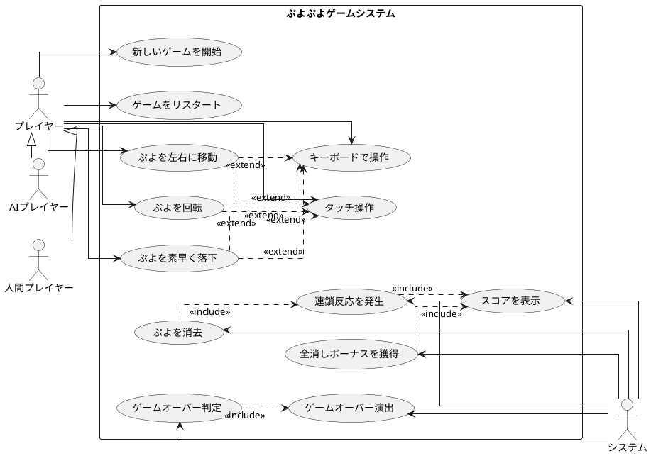
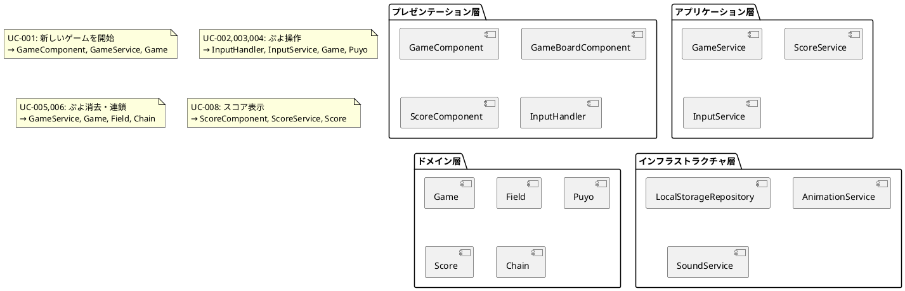
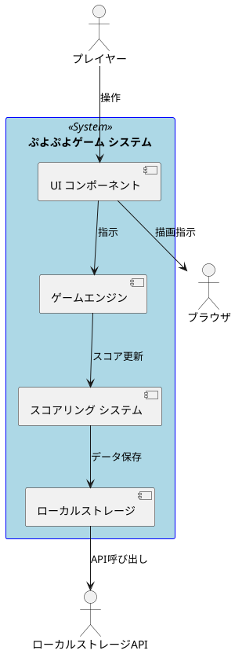

# ユースケース

## ユースケース図

## ユースケース詳細

### UC-001: 新しいゲームを開始

**概要:**
プレイヤーが新しいゲームセッションを開始する

**事前条件:**

- アプリケーションが読み込まれている
- プレイヤーが開始ボタンをクリックまたはキー操作を実行

**主な流れ:**

1. プレイヤーがゲーム開始アクションを実行
2. システムがゲームフィールドを初期化（6×12グリッド）
3. システムが最初のぷよペアを生成
4. システムがスコアを0に初期化
5. システムがゲーム状態を「プレイ中」に設定
6. システムがぷよの落下を開始

**事後条件:**

- ゲームが開始状態になる
- プレイヤーがぷよを操作できる状態になる

**代替フロー:**

- 3a. ぷよ生成に失敗した場合、エラーメッセージを表示してゲーム開始を中止

**例外:**

- システムエラーが発生した場合、エラーメッセージを表示

### UC-002: ぷよを左右に移動

**概要:**
プレイヤーが落下中のぷよを左右に移動させる

**事前条件:**

- ゲームが開始されている
- 落下中のぷよが存在する
- ぷよが移動可能な状態である

**主な流れ:**

1. プレイヤーが左右矢印キーまたはタッチ操作を実行
2. システムが移動先の位置が有効かチェック
3. システムがぷよを新しい位置に移動
4. システムが画面を更新

**事後条件:**

- ぷよが新しい位置に移動される
- プレイヤーが引き続き操作できる状態が維持される

**代替フロー:**

- 2a. 移動先に障害物がある場合、移動をキャンセル
- 2b. フィールドの境界を超える場合、移動をキャンセル

### UC-003: ぷよを回転

**概要:**
プレイヤーが2つのぷよの位置を回転させる

**事前条件:**

- ゲームが開始されている
- 落下中のぷよペアが存在する
- 回転が可能な位置にある

**主な流れ:**

1. プレイヤーが回転キーまたはタッチ操作を実行
2. システムが回転後の位置が有効かチェック
3. システムがぷよペアを90度回転
4. システムが画面を更新

**事後条件:**

- ぷよペアが回転した状態になる
- プレイヤーが引き続き操作できる

**代替フロー:**

- 2a. 回転先に障害物がある場合、回転をキャンセル
- 2b. 壁に接触する回転の場合、可能であれば位置調整

### UC-004: ぷよを素早く落下

**概要:**
プレイヤーがぷよを通常より早く落下させる

**事前条件:**

- ゲームが開始されている
- 落下中のぷよが存在する

**主な流れ:**

1. プレイヤーが下矢印キーまたはタッチ操作を実行
2. システムがぷよの落下速度を加速
3. ぷよが着地位置に到達するまで高速落下継続
4. ぷよが着地したら通常の固定処理に移行

**事後条件:**

- ぷよが着地位置に固定される
- 次のぷよペアが生成される

### UC-005: ぷよを消去

**概要:**
システムが同じ色のぷよが4つ以上隣接した場合に自動的に消去する

**事前条件:**

- ぷよがフィールドに固定されている
- 同じ色のぷよが4つ以上隣接している

**主な流れ:**

1. システムがフィールドをスキャンして消去対象を特定
2. システムが消去対象のぷよを削除
3. システムがスコアを加算
4. システムが消去アニメーションを再生
5. システムが上部のぷよを重力で落下させる
6. 1に戻る（連鎖チェック）

**事後条件:**

- 対象のぷよが削除される
- スコアが加算される
- フィールドが再配置される

**代替フロー:**

- 5a. 連鎖が発生した場合、連鎖ボーナスをスコアに追加

### UC-006: 連鎖反応を発生

**概要:**
ぷよ消去後の落下により新たな消去条件が満たされた場合の処理

**事前条件:**

- ぷよが消去されている
- 上部のぷよが落下している
- 落下後に新たな4つ以上の隣接が形成される

**主な流れ:**

1. システムがぷよの落下処理を実行
2. システムが新たな消去条件をチェック
3. 消去条件が満たされた場合、連鎖カウントを増加
4. システムが連鎖ボーナスを計算してスコアに加算
5. UC-005のぷよ消去処理を実行

**事後条件:**

- 連鎖数が記録される
- 追加スコアが加算される

**代替フロー:**

- 2a. 新たな消去条件が満たされない場合、連鎖終了

### UC-007: 全消しボーナスを獲得

**概要:**
フィールドのすべてのぷよが消去された場合のボーナス処理

**事前条件:**

- ぷよが消去処理中である
- フィールドのすべてのぷよが削除される

**主な流れ:**

1. システムがフィールドが空になったことを検出
2. システムが全消しボーナススコアを計算
3. システムがボーナスをスコアに加算
4. システムが全消し演出を表示

**事後条件:**

- 全消しボーナスがスコアに加算される
- 全消し演出が表示される

### UC-008: スコアを表示

**概要:**
現在のゲームスコアをプレイヤーに表示する

**事前条件:**

- ゲームが開始されている

**主な流れ:**

1. システムが現在のスコア値を取得
2. システムがスコアをUI上に表示
3. スコア変更時にはアニメーション効果を適用

**事後条件:**

- プレイヤーが現在のスコアを確認できる

### UC-009: ゲームオーバー判定

**概要:**
新しいぷよが配置できない状態になった場合の判定処理

**事前条件:**

- 新しいぷよペアが生成される
- 生成位置に既存のぷよが存在する

**主な流れ:**

1. システムが新しいぷよの配置を試行
2. システムが配置位置が占有されていることを検出
3. システムがゲーム状態を「ゲームオーバー」に変更
4. UC-010のゲームオーバー演出を実行

**事後条件:**

- ゲームが終了状態になる
- プレイヤーの入力が無効化される

### UC-010: ゲームオーバー演出

**概要:**
ゲーム終了時の演出とリザルト表示

**事前条件:**

- ゲームオーバー状態になっている

**主な流れ:**

1. システムがゲームオーバー演出を開始
2. システムが最終スコアを表示
3. システムがハイスコアと比較
4. ハイスコア更新の場合、記録を保存
5. システムがリスタートまたは終了オプションを表示

**事後条件:**

- プレイヤーが結果を確認できる
- プレイヤーが次の行動を選択できる

**代替フロー:**

- 4a. ハイスコア更新なしの場合、記録保存をスキップ

### UC-011: キーボードで操作

**概要:**
プレイヤーがキーボードを使用してぷよを操作する

**事前条件:**

- ゲームが開始されている
- キーボードが利用可能である

**主な流れ:**

1. プレイヤーがキーボードのキーを押下
2. システムがキー入力をゲーム操作にマップ
   - 左矢印: 左移動
   - 右矢印: 右移動  
   - 上矢印: 回転
   - 下矢印: 高速落下
   - スペースキー: ポーズ
3. システムが対応する操作を実行

**事後条件:**

- 操作がゲームに反映される

**代替フロー:**

- 2a. 無効なキー入力の場合、無視する
- 2b. ゲームオーバー中の場合、リスタート関連キーのみ有効

### UC-012: タッチ操作

**概要:**
プレイヤーがタッチデバイスでぷよを操作する

**事前条件:**

- ゲームが開始されている
- タッチデバイスが利用可能である

**主な流れ:**

1. プレイヤーがタッチ操作を実行
2. システムがタッチ位置と種類を検出
   - 左側タップ: 左移動
   - 右側タップ: 右移動
   - スワイプアップ: 回転
   - スワイプダウン: 高速落下
3. システムが対応する操作を実行

**事後条件:**

- 操作がゲームに反映される

**代替フロー:**

- 2a. 無効なタッチ範囲の場合、無視する
- 2b. マルチタッチの場合、最初のタッチのみ処理

## ユースケース実現マトリックス

## 非機能ユースケース

### UC-NF-001: パフォーマンス要件

**概要:**
ゲームが適切なパフォーマンスで動作する

**要件:**

- ゲームは60FPS以上で動作する
- キー入力から画面更新まで16ms以内
- 初回ロード時間は5秒以内
- メモリ使用量は100MB以下

### UC-NF-002: レスポンシブデザイン

**概要:**
異なるデバイスサイズに適応する

**要件:**

- スマートフォン（320px以上）で正常動作
- タブレット（768px以上）で最適化表示  
- デスクトップ（1024px以上）で全機能利用

### UC-NF-003: ブラウザ互換性

**概要:**
主要ブラウザで動作する

**要件:**

- Chrome 90+
- Firefox 88+
- Safari 14+
- Edge 90+

### UC-NF-004: アクセシビリティ

**概要:**
障害を持つユーザーも利用できる

**要件:**

- WCAG 2.1 AA レベル準拠
- キーボードのみで全操作が可能
- 色覚多様性に配慮した色設計
- スクリーンリーダー対応

## システム境界とアクター

## トレーサビリティマトリックス

| ユーザーストーリー | ユースケース | 優先度 |
|------------------|-------------|---------|
| US-001 基本ゲームプレイ | UC-001, UC-005 | 最高 |
| US-002 操作システム | UC-002, UC-003, UC-004, UC-011, UC-012 | 最高 |
| US-003 消去システム | UC-005, UC-006, UC-007 | 最高 |
| US-004 ゲーム状態管理 | UC-008, UC-009, UC-010 | 高 |
| US-009 記録管理 | UC-010 (拡張) | 低 |

