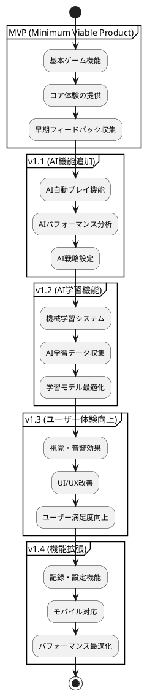
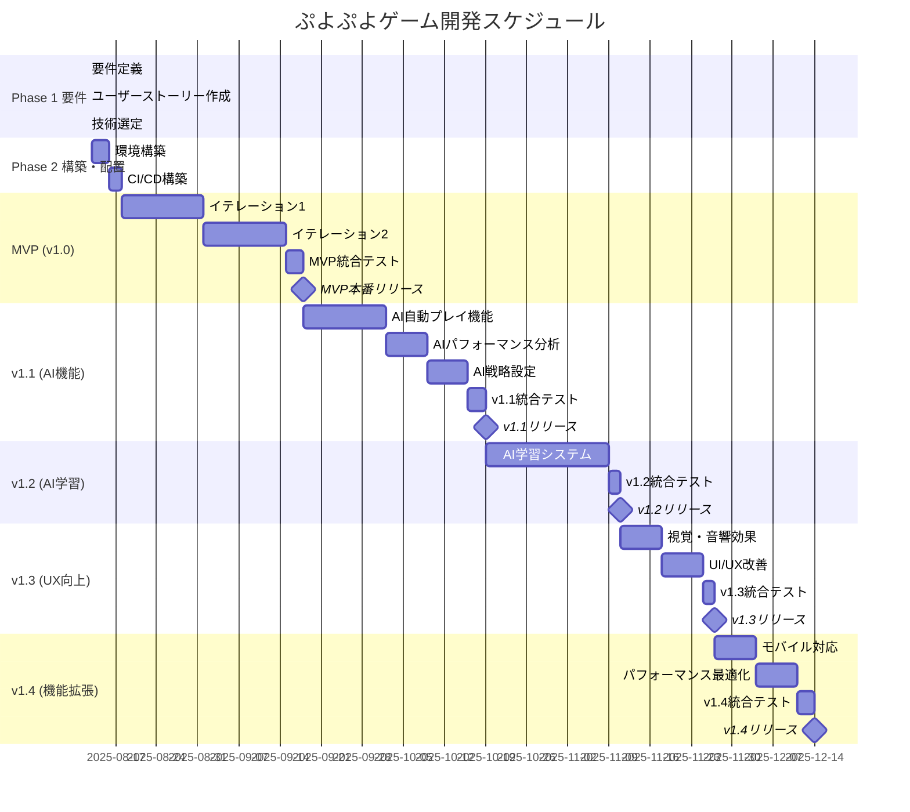
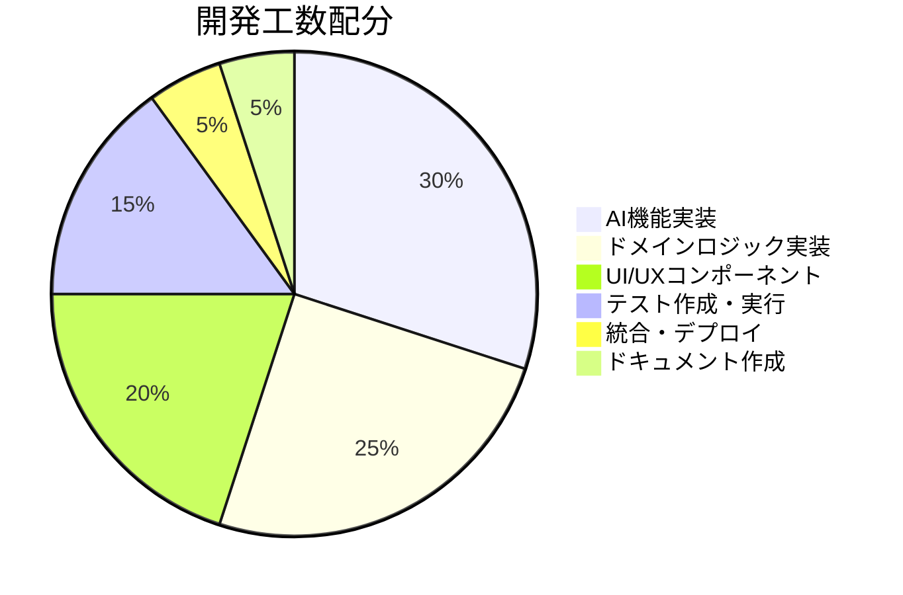
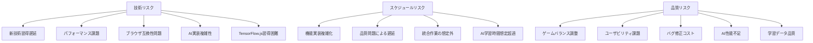
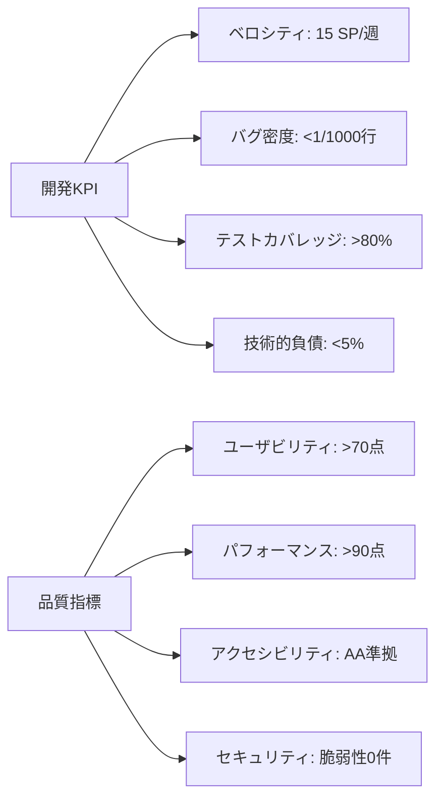
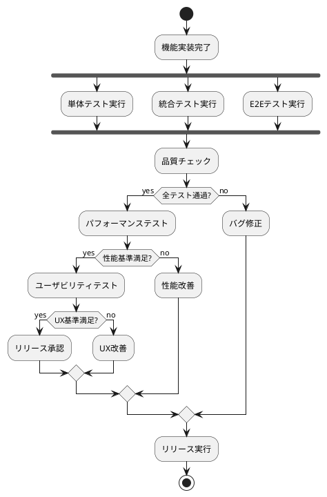
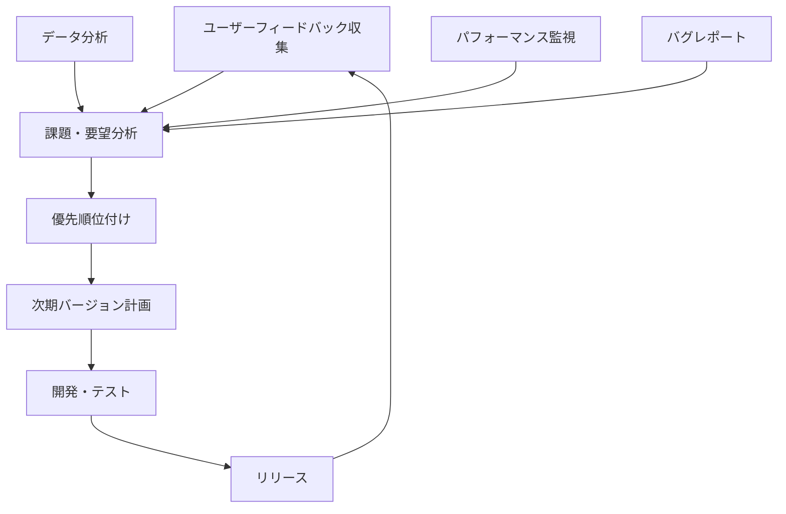

# リリース計画

## 概要

ぷよぷよゲームプロジェクトのリリース計画について説明します。ユーザーストーリー・ユースケースの優先順位に基づき、段階的なリリース戦略を策定します。

## リリース戦略

### 基本方針

### リリース原則

1. **価値駆動:** ユーザー価値を最優先
2. **段階的リリース:** 小さく頻繁なリリース
3. **フィードバック重視:** ユーザーからの継続的フィードバック
4. **品質保証:** 各リリースでの品質基準維持
5. **後方互換:** 既存機能への影響最小化

## リリースバージョン詳細

### MVP (v1.0) - 基本ゲーム体験

**目標:** プレイ可能な最小限のぷよぷよゲーム

#### 含まれる機能

| ユーザーストーリー | Story Points | 優先度 | 受け入れ基準 |
|-------------------|--------------|---------|-------------|
| US-001: 基本ゲームプレイ | 8 | 最高 | フィールド表示、ぷよ落下、基本ルール |
| US-002: 操作システム | 5 | 最高 | キーボード操作、移動・回転 |
| US-003: 消去システム | 8 | 最高 | 4つ以上消去、連鎖、重力適用 |
| US-004: ゲーム状態管理 | 5 | 高 | スコア表示、ゲームオーバー、リスタート |

#### 技術仕様
- **フロントエンド:** React 18 + TypeScript
- **状態管理:** Zustand
- **スタイリング:** Tailwind CSS
- **テスト:** Vitest + React Testing Library
- **デプロイ:** Vercel

#### 成功指標
- ゲーム完了率: 60%以上
- 平均プレイ時間: 5分以上
- 致命的バグ: 0件
- ユーザビリティスコア: 70点以上

### v1.1 - AI機能追加

**目標:** AI自動プレイによる差別化とユーザー学習支援

#### 含まれる機能

| ユーザーストーリー | Story Points | 優先度 | 受け入れ基準 |
|-------------------|--------------|---------|-------------|
| US-005: AI自動プレイ機能 | 13 | 高 | AI自動プレイ、思考可視化、速度調整 |
| US-007: AIパフォーマンス分析 | 8 | 中 | 連鎖成功率、統計データ、比較機能 |
| US-008: AI戦略設定 | 8 | 中 | 戦略選択、パラメータ調整、保存機能 |

#### 技術追加
- **機械学習:** TensorFlow.js
- **AI思考可視化:** Canvas描画
- **データ分析:** 統計ライブラリ
- **ワーカー:** Web Workers（AI処理用）

#### 成功指標
- AI機能利用率: 60%以上
- AIプレイ観戦時間: 3分以上
- AI戦略変更率: 40%以上
- AI機能満足度: 75点以上

### v1.2 - AI学習機能

**目標:** 機械学習による継続的なAI性能向上

#### 含まれる機能

| ユーザーストーリー | Story Points | 優先度 | 受け入れ基準 |
|-------------------|--------------|---------|-------------|
| US-006: AI学習システム | 21 | 中 | 機械学習アルゴリズム、学習データ収集、性能向上 |

#### 技術追加
- **モデル学習:** TensorFlow.js学習機能
- **データ収集:** プレイデータ蓄積システム
- **モデル管理:** バージョニング機能

#### 成功指標
- AI性能向上: 20%以上
- 学習データ収集率: 80%以上
- 学習効果可視化: ダッシュボード完成
- モデル更新頻度: 週次

### v1.3 - ユーザー体験向上

**目標:** 楽しく魅力的なゲーム体験の提供

#### 含まれる機能

| ユーザーストーリー | Story Points | 優先度 | 受け入れ基準 |
|-------------------|--------------|---------|-------------|
| US-009: 視覚効果 | 5 | 中 | 消去エフェクト、連鎖演出 |
| US-010: 音響効果 | 3 | 中 | 効果音、BGM、音量調節 |
| US-011: UI/UX改善 | 3 | 中 | 操作説明、ポーズ機能 |
| US-012: アニメーション | 5 | 中 | 落下・消去アニメーション |

#### 技術追加
- **アニメーション:** Framer Motion
- **音響:** Web Audio API
- **エフェクト:** Canvas アニメーション

#### 成功指標
- ユーザー満足度: 80点以上
- セッション継続率: 70%以上
- 音響機能利用率: 80%以上
- アニメーション評価: 4.0/5.0以上

### v1.4 - 機能拡張・最適化

**目標:** 長期利用とより広いユーザー層への対応

#### 含まれる機能

| ユーザーストーリー | Story Points | 優先度 | 受け入れ基準 |
|-------------------|--------------|---------|-------------|
| US-013: 記録管理 | 3 | 低 | ハイスコア、プレイ履歴 |
| US-014: 設定機能 | 3 | 低 | ゲーム設定、カスタマイゼーション |
| US-015: モバイル対応 | 5 | 低 | タッチ操作、レスポンシブ |
| US-016: パフォーマンス最適化 | 5 | 低 | 60FPS、メモリ最適化 |

#### 技術追加
- **PWA:** Service Worker
- **分析:** Vercel Analytics
- **最適化:** Bundle分析・最適化

#### 成功指標
- モバイル利用率: 40%以上
- パフォーマンススコア: 90点以上
- ハイスコア機能利用率: 60%以上
- 設定変更率: 30%以上

## 開発スケジュール

### ガントチャート

### マイルストーン詳細

#### M1: MVP完成 (2025-09-16)
- 基本ゲーム機能完全動作
- 品質基準クリア
- ユーザビリティテスト合格

#### M2: v1.1完成 (2025-11-11)
- AI自動プレイ機能実装
- AIパフォーマンス分析機能
- AI戦略設定機能
- TensorFlow.js統合完了

#### M3: v1.2完成 (2025-12-09)
- 機械学習システム実装
- AI学習データ収集機能
- モデル最適化機能
- AI性能向上確認

#### M4: v1.3完成 (2025-12-30)
- 視覚・音響効果実装
- ユーザー体験向上確認
- パフォーマンス基準維持

#### M5: v1.4完成 (2026-01-27)
- 全機能完成
- モバイル対応完了
- 最適化効果測定

## イテレーション計画

### Iteration 1: ゲーム基盤 (MVP)

#### 期間
2025-08-16 ～ 2025-08-30 (2週間)

#### 目標
基本的なゲームプレイ機能の実装

#### TODO詳細

**Week 1 (8/16-8/22):**

1. **ドメインモデル実装**

   - [ ] Puyo, Field, Game クラス基本実装
   - [ ] 基本的なゲームロジック
   - [ ] 単体テスト作成

2. **基本UI実装**
 
   - [ ] GameBoard コンポーネント
   - [ ] ゲーム状態表示
   - [ ] 基本スタイリング

**Week 2 (8/23-8/30):**

3. **操作システム**
   - [ ] キーボード入力処理
   - [ ] ぷよ移動・回転ロジック
   - [ ] 統合テスト

#### 受け入れ基準
- [ ] フィールド(6×12)表示
- [ ] ぷよの基本操作(移動・回転・落下)
- [ ] 基本的なゲームルール動作
- [ ] 単体テストカバレッジ80%以上

#### 実績
- 完了日: 
- Story Points: 
- テストカバレッジ: 
- 重大バグ: 

### Iteration 2: 消去・連鎖システム

#### 期間
2025-09-02 ～ 2025-09-13 (2週間)

#### 目標
ぷよ消去・連鎖・スコアシステムの完成

#### TODO詳細

**Week 1 (9/2-9/6):**

1. **連鎖検出**
   - 連結ぷよ検索アルゴリズム
   - 消去判定ロジック
   - 重力適用システム

**Week 2 (9/9-9/13):**

2. **スコア計算**
   - 基本スコア計算
   - 連鎖ボーナス
   - 表示システム

3. **ゲームオーバー**
   - 終了判定
   - 結果表示
   - リトライ機能

#### 受け入れ基準
- 4つ以上の同色ぷよ消去
- 連鎖反応の実装
- スコア計算・表示
- ゲームオーバー処理

#### 実績
- 完了日:
- Story Points:
- テストカバレッジ:
- 重大バグ:

### Iteration 3: AI機能基盤 (v1.1 Phase1)

#### 期間
2025-09-16 ～ 2025-09-27 (2週間)

#### 目標
AI自動プレイ機能の基盤実装

#### TODO詳細
1. **AI基盤システム**
   - TensorFlow.js統合
   - Web Workers実装
   - AI思考エンジン基本実装

2. **AI自動プレイ機能**
   - 基本的なAI判断ロジック
   - ぷよ操作自動化
   - プレイ速度制御

3. **AI可視化**
   - 思考過程の表示
   - 判断理由の説明
   - リアルタイム状況表示

#### 受け入れ基準
- AI基本プレイ動作
- 思考過程可視化
- 手動/AI切り替え機能
- パフォーマンス基準維持

#### 実績
- 完了日:
- Story Points:
- テストカバレッジ:
- 重大バグ:

### Iteration 4: AI分析・戦略機能 (v1.1 Phase2)

#### 期間
2025-09-30 ～ 2025-10-11 (2週間)

#### 目標
AIパフォーマンス分析と戦略設定機能

#### TODO詳細
1. **パフォーマンス分析**
   - 連鎖成功率計算
   - スコア統計収集
   - 人間プレイヤー比較機能

2. **戦略設定システム**
   - 複数AI戦略実装（攻撃型、防御型、連鎖重視）
   - パラメータ調整UI
   - 戦略保存・読み込み機能

3. **データ可視化**
   - パフォーマンスダッシュボード
   - 戦略比較チャート
   - プレイ履歴表示

#### 受け入れ基準
- AI性能分析機能動作
- 戦略切り替え機能
- データ可視化表示
- 設定保存機能

#### 実績
- 完了日:
- Story Points:
- テストカバレッジ:
- 重大バグ:

### Iteration 5: AI学習システム (v1.2)

#### 期間
2025-10-14 ～ 2025-11-01 (3週間)

#### 目標
機械学習による自動改善システム

#### TODO詳細
1. **学習データ収集**
   - プレイデータ蓄積システム
   - 学習用データセット作成
   - データ品質管理

2. **機械学習実装**
   - 強化学習アルゴリズム
   - モデル訓練パイプライン
   - オンライン学習機能

3. **学習効果測定**
   - 性能改善指標
   - A/Bテスト機能
   - 学習進捗可視化

#### 受け入れ基準
- 学習データ自動収集
- AI性能の継続的向上
- 学習効果可視化
- モデル更新機能

### Iteration 6: ユーザー体験向上 (v1.3)

#### 期間
2025-11-04 ～ 2025-11-15 (2週間)

#### 目標
視覚・音響効果によるゲーム体験向上

#### TODO詳細
1. **アニメーション**
   - ぷよ落下アニメーション
   - 消去エフェクト
   - 連鎖演出

2. **音響システム**
   - 効果音実装
   - BGM追加
   - 音量制御

3. **ゲーム機能**
   - ハイスコア機能
   - ポーズ・リスタート
   - 設定画面

### Iteration 7: 最適化・モバイル対応 (v1.4)

#### 期間
2025-11-18 ～ 2025-11-29 (2週間)

#### 目標
パフォーマンス最適化とモバイル対応

#### TODO詳細
1. **パフォーマンス**
   - 描画最適化
   - メモリ管理
   - AI処理最適化
   - バンドル最適化

2. **アクセシビリティ**
   - キーボードナビゲーション
   - ARIA属性追加
   - 色覚多様性対応

3. **モバイル・PWA**
   - タッチ操作実装
   - レスポンシブ改善
   - Service Worker追加

## リソース計画

### 開発リソース

### スキル要件

| スキル領域 | 重要度 | 必要レベル | 学習時間(想定) |
|-----------|---------|------------|----------------|
| TypeScript | 高 | 中級 | 40h |
| React | 高 | 中級 | 60h |
| **TensorFlow.js** | **高** | **中級** | **80h** |
| **機械学習基礎** | **高** | **初級** | **40h** |
| テスト手法 | 高 | 中級 | 30h |
| ゲームロジック | 高 | 上級 | 50h |
| **AI/ML テスト** | **中** | **初級** | **30h** |
| UI/UX設計 | 中 | 初級 | 20h |
| DevOps | 中 | 初級 | 30h |

## リスク管理

### 主要リスク

### リスク対策

| リスク | 影響度 | 発生確率 | 対策 |
|--------|---------|----------|------|
| 技術習得遅延 | 高 | 中 | 事前学習、ペアプログラミング |
| **AI実装複雑性** | **高** | **高** | **段階的実装、プロトタイプファースト** |
| **TensorFlow.js習得困難** | **中** | **中** | **チュートリアル完了、コミュニティ活用** |
| パフォーマンス課題 | 中 | 中 | 早期プロトタイプ、継続測定 |
| **AI性能不足** | **中** | **中** | **複数アルゴリズム検証、性能基準設定** |
| スケジュール遅延 | 高 | 中 | バッファ確保、スコープ調整 |
| **AI学習時間想定超過** | **中** | **高** | **学習時間バッファ、段階的リリース** |
| 品質問題 | 高 | 低 | TDD実践、継続的テスト |

## 成功指標・KPI

### 開発指標

### ユーザー指標

| 指標 | MVP目標 | v1.1目標 | v1.2目標 | v1.3目標 | v1.4目標 |
|------|---------|----------|----------|----------|----------|
| ゲーム完了率 | 60% | 65% | 70% | 75% | 80% |
| 平均プレイ時間 | 5分 | 8分 | 10分 | 12分 | 15分 |
| **AI機能利用率** | **-** | **60%** | **75%** | **80%** | **85%** |
| **AIプレイ観戦時間** | **-** | **3分** | **5分** | **6分** | **7分** |
| 週次利用率 | 30% | 40% | 50% | 55% | 60% |
| 推奨意向(NPS) | 30 | 45 | 60 | 65 | 70 |

## 品質保証計画

### テスト段階

### 品質ゲート

1. **開発完了ゲート:**
   - コードレビュー完了
   - 単体テストカバレッジ80%以上
   - 統合テスト全通過

2. **ステージング移行ゲート:**
   - E2Eテスト全通過
   - パフォーマンステスト基準クリア
   - セキュリティスキャン通過

3. **本番リリースゲート:**
   - ユーザー受け入れテスト合格
   - 運用手順確認完了
   - ロールバック手順確認完了

## 運用・保守計画

### 初期運用サポート

- **監視期間:** リリース後2週間
- **対応体制:** 即座対応(平日9-18時)
- **エスカレーション:** 重大障害時の即時対応

### 継続的改善

### 長期ロードマップ

#### v2.0 (2026年Q1)
- **AI vs AI 対戦機能**
- **高度な機械学習アルゴリズム**
- マルチプレイヤーモード
- ランキング機能

#### v2.1 (2026年Q2)
- **AI教師機能（人間プレイヤーの指導）**
- **AIパーソナライゼーション**
- ソーシャル機能
- カスタムテーマ

#### v3.0 (2026年Q3)
- **AI生成コンテンツ（新ルール、新戦略）**
- 3Dグラフィック対応
- VR対応検討
- クロスプラットフォーム展開

## まとめ

この リリース計画により以下を実現：

1. **段階的価値提供:** MVPから段階的な機能拡張
2. **リスク最小化:** 小刻みなリリースによるリスク分散
3. **品質保証:** 各段階での徹底した品質管理
4. **ユーザー中心:** 継続的フィードバックに基づく改善
5. **持続的成長:** 長期的な機能拡張とユーザー満足度向上
6. **効率的開発:** 明確な目標とメトリクスによる進捗管理