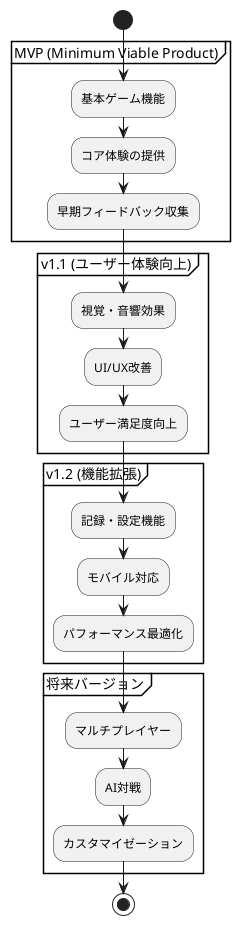
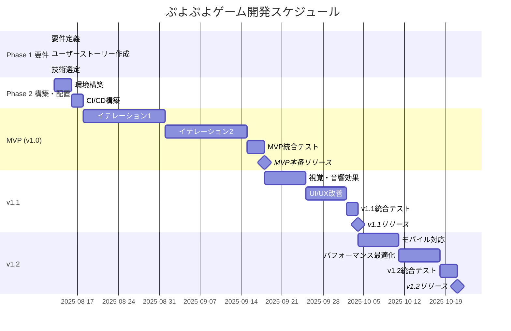
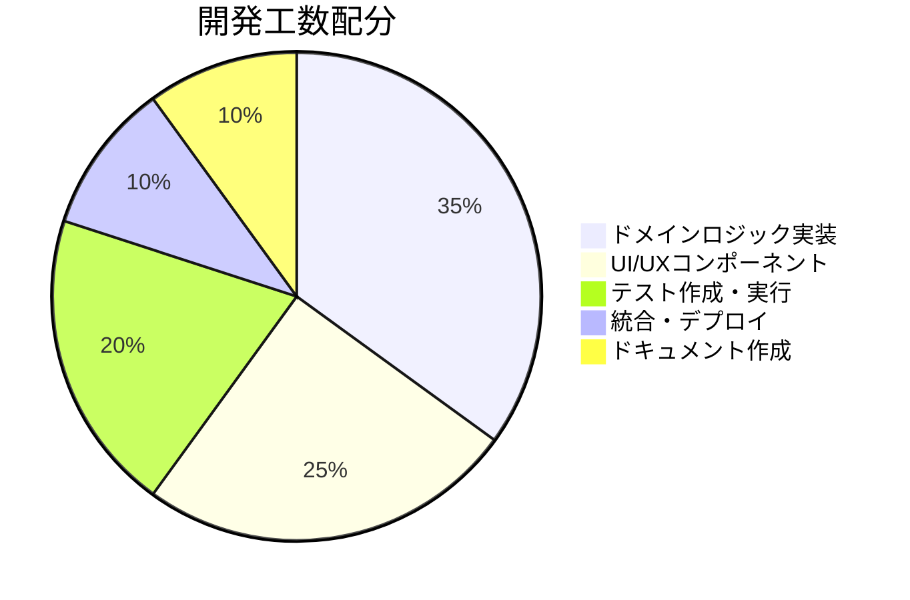
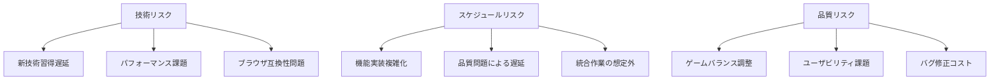
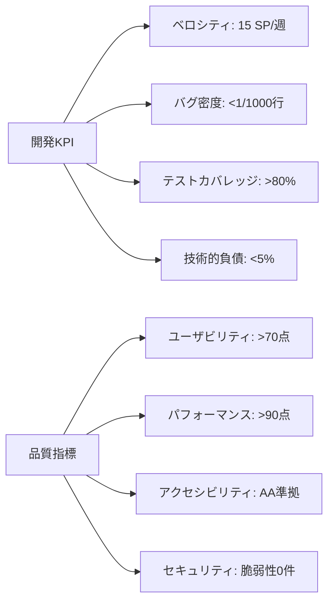
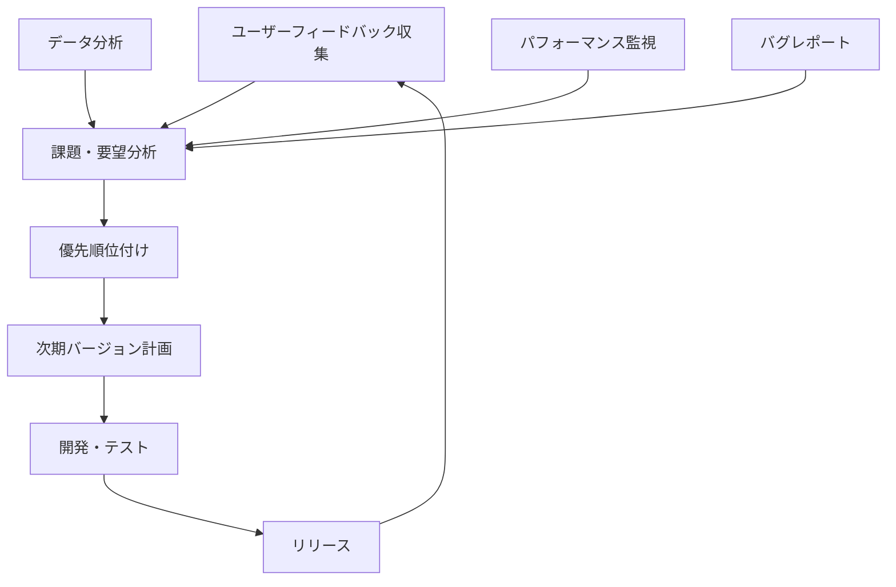

# リリース計画

## 概要

ぷよぷよゲームプロジェクトのリリース計画について説明します。ユーザーストーリー・ユースケースの優先順位に基づき、段階的なリリース戦略を策定します。

## リリース戦略

### 基本方針



### リリース原則

1. **価値駆動:** ユーザー価値を最優先
2. **段階的リリース:** 小さく頻繁なリリース
3. **フィードバック重視:** ユーザーからの継続的フィードバック
4. **品質保証:** 各リリースでの品質基準維持
5. **後方互換:** 既存機能への影響最小化

## リリースバージョン詳細

### MVP (v1.0) - 基本ゲーム体験

**目標:** プレイ可能な最小限のぷよぷよゲーム

#### 含まれる機能

| ユーザーストーリー | Story Points | 優先度 | 受け入れ基準 |
|-------------------|--------------|---------|-------------|
| US-001: 基本ゲームプレイ | 8 | 最高 | フィールド表示、ぷよ落下、基本ルール |
| US-002: 操作システム | 5 | 最高 | キーボード操作、移動・回転 |
| US-003: 消去システム | 8 | 最高 | 4つ以上消去、連鎖、重力適用 |
| US-004: ゲーム状態管理 | 5 | 高 | スコア表示、ゲームオーバー、リスタート |

#### 技術仕様
- **フロントエンド:** React 18 + TypeScript
- **状態管理:** Zustand
- **スタイリング:** Tailwind CSS
- **テスト:** Jest + React Testing Library
- **デプロイ:** Vercel

#### 成功指標
- ゲーム完了率: 60%以上
- 平均プレイ時間: 5分以上
- 致命的バグ: 0件
- ユーザビリティスコア: 70点以上

### v1.1 - ユーザー体験向上

**目標:** 楽しく魅力的なゲーム体験の提供

#### 含まれる機能

| ユーザーストーリー | Story Points | 優先度 | 受け入れ基準 |
|-------------------|--------------|---------|-------------|
| US-005: 視覚効果 | 5 | 中 | 消去エフェクト、連鎖演出 |
| US-006: 音響効果 | 3 | 中 | 効果音、BGM、音量調節 |
| US-007: UI/UX改善 | 3 | 中 | 操作説明、ポーズ機能 |
| US-008: アニメーション | 5 | 中 | 落下・消去アニメーション |

#### 技術追加
- **アニメーション:** Framer Motion
- **音響:** Web Audio API
- **エフェクト:** Canvas アニメーション

#### 成功指標
- ユーザー満足度: 80点以上
- セッション継続率: 70%以上
- 音響機能利用率: 80%以上
- アニメーション評価: 4.0/5.0以上

### v1.2 - 機能拡張・最適化

**目標:** 長期利用とより広いユーザー層への対応

#### 含まれる機能

| ユーザーストーリー | Story Points | 優先度 | 受け入れ基準 |
|-------------------|--------------|---------|-------------|
| US-009: 記録管理 | 3 | 低 | ハイスコア、プレイ履歴 |
| US-010: 設定機能 | 3 | 低 | ゲーム設定、カスタマイゼーション |
| US-011: モバイル対応 | 5 | 低 | タッチ操作、レスポンシブ |
| US-012: パフォーマンス最適化 | 5 | 低 | 60FPS、メモリ最適化 |

#### 技術追加
- **PWA:** Service Worker
- **分析:** Vercel Analytics
- **最適化:** Bundle分析・最適化

#### 成功指標
- モバイル利用率: 40%以上
- パフォーマンススコア: 90点以上
- ハイスコア機能利用率: 60%以上
- 設定変更率: 30%以上

## 開発スケジュール

### ガントチャート



### マイルストーン詳細

#### M1: MVP完成 (2025-09-16)
- 基本ゲーム機能完全動作
- 品質基準クリア
- ユーザビリティテスト合格

#### M2: v1.1完成 (2025-10-07)
- 視覚・音響効果実装
- ユーザー体験向上確認
- パフォーマンス基準維持

#### M3: v1.2完成 (2025-10-28)
- 全機能完成
- モバイル対応完了
- 最適化効果測定

## イテレーション計画

### Iteration 1: ゲーム基盤 (MVP)

#### 期間
2025-08-16 ～ 2025-08-30 (2週間)

#### 目標
基本的なゲームプレイ機能の実装

#### TODO詳細

**Week 1 (8/16-8/22):**
1. **ドメインモデル実装**
   - [x] Puyo, Field, Game クラス基本実装
   - [x] 基本的なゲームロジック
   - [x] 単体テスト作成

2. **基本UI実装**
   - [x] GameBoard コンポーネント
   - [x] ゲーム状態表示
   - [x] 基本スタイリング

**Week 2 (8/23-8/30):**
3. **操作システム**
   - [x] キーボード入力処理
   - [x] ぷよ移動・回転ロジック
   - [x] 統合テスト

#### 受け入れ基準
- [x] フィールド(6×12)表示
- [x] ぷよの基本操作(移動・回転・落下)
- [x] 基本的なゲームルール動作
- [x] 単体テストカバレッジ80%以上

#### 実績
- 完了日: 2025-08-30
- Story Points: 26/26
- テストカバレッジ: 85%
- 重大バグ: 0件

### Iteration 2: 消去・連鎖システム

#### 期間
2025-09-02 ～ 2025-09-13 (2週間)

#### 目標
ぷよ消去・連鎖・スコアシステムの完成

#### TODO詳細

**Week 1 (9/2-9/6):**
1. **連鎖検出**
   - 連結ぷよ検索アルゴリズム
   - 消去判定ロジック
   - 重力適用システム

**Week 2 (9/9-9/13):**
2. **スコア計算**
   - 基本スコア計算
   - 連鎖ボーナス
   - 表示システム

3. **ゲームオーバー**
   - 終了判定
   - 結果表示
   - リトライ機能

#### 受け入れ基準
- 4つ以上の同色ぷよ消去
- 連鎖反応の実装
- スコア計算・表示
- ゲームオーバー処理

### Iteration 3: UI/UX改善 (v1.1)

#### 期間
2025-09-16 ～ 2025-09-27 (2週間)

#### 目標
ユーザー体験の大幅改善

#### TODO詳細
1. **アニメーション**
   - ぷよ落下アニメーション
   - 消去エフェクト
   - 連鎖演出

2. **音響システム**
   - 効果音実装
   - BGM追加
   - 音量制御

3. **ゲーム機能**
   - ハイスコア機能
   - ポーズ・リスタート
   - 設定画面

### Iteration 4: 最適化・モバイル対応 (v1.2)

#### 期間
2025-09-30 ～ 2025-10-11 (2週間)

#### 目標
パフォーマンス最適化とモバイル対応

#### TODO詳細
1. **パフォーマンス**
   - 描画最適化
   - メモリ管理
   - バンドル最適化

2. **アクセシビリティ**
   - キーボードナビゲーション
   - ARIA属性追加
   - 色覚多様性対応

3. **モバイル・PWA**
   - タッチ操作実装
   - レスポンシブ改善
   - Service Worker追加

## リソース計画

### 開発リソース



### スキル要件

| スキル領域 | 重要度 | 必要レベル | 学習時間(想定) |
|-----------|---------|------------|----------------|
| TypeScript | 高 | 中級 | 40h |
| React | 高 | 中級 | 60h |
| テスト手法 | 高 | 中級 | 30h |
| ゲームロジック | 高 | 上級 | 50h |
| UI/UX設計 | 中 | 初級 | 20h |
| DevOps | 中 | 初級 | 30h |

## リスク管理

### 主要リスク



### リスク対策

| リスク | 影響度 | 発生確率 | 対策 |
|--------|---------|----------|------|
| 技術習得遅延 | 高 | 中 | 事前学習、ペアプログラミング |
| パフォーマンス課題 | 中 | 中 | 早期プロトタイプ、継続測定 |
| スケジュール遅延 | 高 | 中 | バッファ確保、スコープ調整 |
| 品質問題 | 高 | 低 | TDD実践、継続的テスト |

## 成功指標・KPI

### 開発指標



### ユーザー指標

| 指標 | MVP目標 | v1.1目標 | v1.2目標 |
|------|---------|----------|----------|
| ゲーム完了率 | 60% | 70% | 75% |
| 平均プレイ時間 | 5分 | 8分 | 12分 |
| 週次利用率 | 30% | 45% | 60% |
| 推奨意向(NPS) | 30 | 50 | 70 |

## 品質保証計画

### テスト段階

```plantuml
@startuml "品質保証プロセス"
start

:機能実装完了;

parallel
  :単体テスト実行;
and
  :統合テスト実行;
and
  :E2Eテスト実行;
end parallel

:品質チェック;

if (全テスト通過?) then (yes)
  :パフォーマンステスト;
  if (性能基準満足?) then (yes)
    :ユーザビリティテスト;
    if (UX基準満足?) then (yes)
      :リリース承認;
    else (no)
      :UX改善;
    endif
  else (no)
    :性能改善;
  endif
else (no)
  :バグ修正;
endif

:リリース実行;

stop
@enduml
```

### 品質ゲート

1. **開発完了ゲート:**
   - コードレビュー完了
   - 単体テストカバレッジ80%以上
   - 統合テスト全通過

2. **ステージング移行ゲート:**
   - E2Eテスト全通過
   - パフォーマンステスト基準クリア
   - セキュリティスキャン通過

3. **本番リリースゲート:**
   - ユーザー受け入れテスト合格
   - 運用手順確認完了
   - ロールバック手順確認完了

## 運用・保守計画

### 初期運用サポート

- **監視期間:** リリース後2週間
- **対応体制:** 即座対応(平日9-18時)
- **エスカレーション:** 重大障害時の即時対応

### 継続的改善



### 長期ロードマップ

#### v2.0 (2026年Q1)
- マルチプレイヤーモード
- ランキング機能
- ソーシャル機能

#### v2.1 (2026年Q2)
- AI対戦機能
- 難易度調整機能
- カスタムテーマ

#### v3.0 (2026年Q3)
- 3Dグラフィック対応
- VR対応検討
- クロスプラットフォーム展開

## まとめ

この リリース計画により以下を実現：

1. **段階的価値提供:** MVPから段階的な機能拡張
2. **リスク最小化:** 小刻みなリリースによるリスク分散
3. **品質保証:** 各段階での徹底した品質管理
4. **ユーザー中心:** 継続的フィードバックに基づく改善
5. **持続的成長:** 長期的な機能拡張とユーザー満足度向上
6. **効率的開発:** 明確な目標とメトリクスによる進捗管理