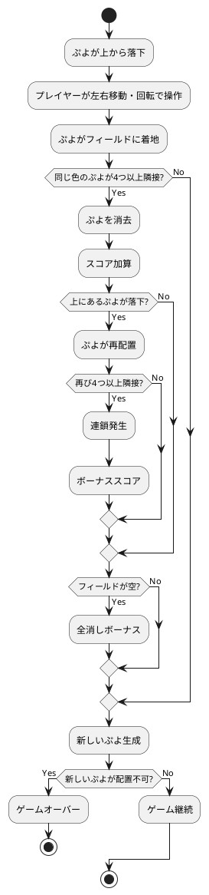

# 仕様

## アプリケーション概要

### ぷよぷよとは

ぷよぷよは、落ちてくる色付きの「ぷよ」を操作して、同じ色のぷよを4つ以上つなげて消去するパズルゲームです。連鎖反応を起こすことで高得点を狙うことができます。

### 基本ルール

- フィールドは基本的に縦12マス×横6マスの格子で構成される。格子の1マスにつき1個のブロック（ぷよぷよ、略してぷよ）を置くことができる。ただし、上方向は、画面外に1マス分だけぷよを置くことができる。
- 上からぷよが2つ1組で落下してくる（「組ぷよ」と呼ばれる）。ぷよは種類ごとに色が異なり、色は3-5色ある。プレイヤーはぷよに対して回転、横移動、高速落下のいずれかの操作を行う。
- 次に落下するぷよはフィールドの枠外に「NEXTぷよ（ネクストぷよ）」として予告される。配られる組ぷよの配分は麻雀のツモに例えられている。
- 落下してきたぷよがフィールドの床やほかのぷよに衝突すると、その位置にぷよが固定される。ただし、組ぷよを横にして置いたりなどして、ぷよに1マス分でも下方向に空白がある場合は、強制的にそのぷよだけ落下する。
- 固定されたぷよと同色のぷよが周囲4方向（縦横のみで斜めではない）にいる場合、それらは互いにくっつく。
- ぷよが4個以上くっつくと消滅し得点となる。 
- ぷよの消滅により上にあったぷよが落下する。このとき再びぷよが4個以上くっつくと消滅し、連鎖が起きる。なお、普通に4つ色を並べて消す行為のみでも1連鎖と考え、消滅した回数（○回）に応じて○連鎖と呼ばれる。複数色を同時に消した場合や同色を別箇所で消した場合でも、1連鎖扱いとなる。
- ぷよを消したときに入る得点は、消したぷよの数に、設定された「連鎖倍率」を掛けることで計算できる。
- ぷよが×印に触れると「窒息」してゲームオーバーとなる。

