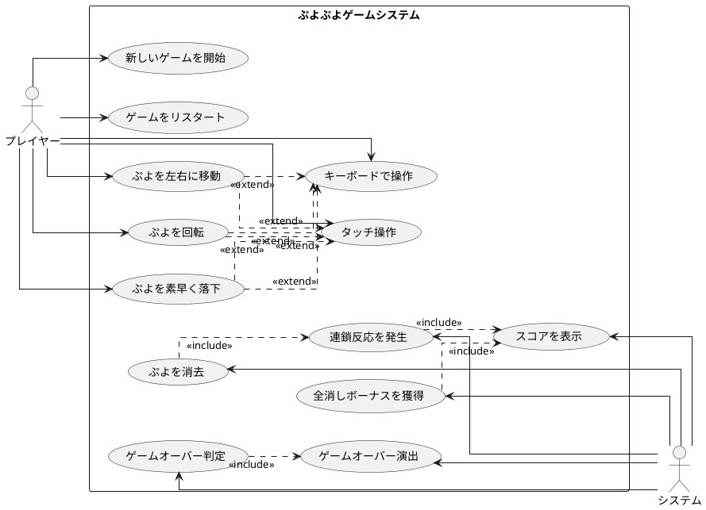

# 仕様

## アプリケーション概要

### ぷよぷよとは

ぷよぷよは、落ちてくる色付きの「ぷよ」を操作して、同じ色のぷよを4つ以上つなげて消去するパズルゲームです。連鎖反応を起こすことで高得点を狙うことができます。

### 基本ルール

- フィールドは基本的に縦12マス×横6マスの格子で構成される。格子の1マスにつき1個のブロック（ぷよぷよ、略してぷよ）を置くことができる。ただし、上方向は、画面外に1マス分だけぷよを置くことができる。
- 上からぷよが2つ1組で落下してくる（「組ぷよ」と呼ばれる）。ぷよは種類ごとに色が異なり、色は3-5色ある。プレイヤーはぷよに対して回転、横移動、高速落下のいずれかの操作を行う。
- 次に落下するぷよはフィールドの枠外に「NEXTぷよ（ネクストぷよ）」として予告される。配られる組ぷよの配分は麻雀のツモに例えられている。
- 落下してきたぷよがフィールドの床やほかのぷよに衝突すると、その位置にぷよが固定される。ただし、組ぷよを横にして置いたりなどして、ぷよに1マス分でも下方向に空白がある場合は、強制的にそのぷよだけ落下する。
- 固定されたぷよと同色のぷよが周囲4方向（縦横のみで斜めではない）にいる場合、それらは互いにくっつく。
- ぷよが4個以上くっつくと消滅し得点となる。 
- ぷよの消滅により上にあったぷよが落下する。このとき再びぷよが4個以上くっつくと消滅し、連鎖が起きる。なお、普通に4つ色を並べて消す行為のみでも1連鎖と考え、消滅した回数（○回）に応じて○連鎖と呼ばれる。複数色を同時に消した場合や同色を別箇所で消した場合でも、1連鎖扱いとなる。
- ぷよを消したときに入る得点は、消したぷよの数に、設定された「連鎖倍率」を掛けることで計算できる。
- ぷよが×印に触れると「窒息」してゲームオーバーとなる。

## ユーザーストーリー

### US-001: 新しいゲームを開始する
**As a** プレイヤー  
**I want to** 新しいゲームを開始できる  
**So that** ぷよぷよゲームを楽しむことができる

**受け入れ基準:**

- [x] スタートボタンをクリックすると新しいゲームが開始される
- [x] ゲーム開始時にスコアが0にリセットされる
- [x] フィールドが空の状態から始まる
- [x] 最初のぷよが上部から落下し始める
- [x] NEXTぷよが表示される

**優先順位:** 高  
**見積もり:** 3ポイント  
**完了定義:** 単体テスト、統合テスト完了、レビュー済み

### US-002: ぷよを左右に移動する
**As a** プレイヤー  
**I want to** 落ちてくるぷよを左右に移動できる  
**So that** 任意の位置にぷよを配置できる

**受け入れ基準:**

- [x] 左矢印キーでぷよが左に1マス移動する
- [x] 右矢印キーでぷよが右に1マス移動する
- [x] フィールドの端を越えて移動しない
- [x] 既存のぷよと重ならない
- [x] 移動はスムーズに実行される

**優先順位:** 高  
**見積もり:** 2ポイント  
**完了定義:** 単体テスト、統合テスト完了、レビュー済み

### US-003: ぷよを回転する
**As a** プレイヤー  
**I want to** 落ちてくるぷよを回転できる  
**So that** 戦略的にぷよを配置できる

**受け入れ基準:**

- [x] 上矢印キーまたはZキーでぷよが時計回りに90度回転する
- [x] 回転時に壁や他のぷよに衝突する場合、適切に位置調整される（壁蹴り）
- [x] 回転は中心ぷよを軸に行われる
- [x] 回転アニメーションがスムーズである

**優先順位:** 高  
**見積もり:** 3ポイント  
**完了定義:** 単体テスト、統合テスト完了、レビュー済み

### US-004: ぷよを素早く落下させる
**As a** プレイヤー  
**I want to** ぷよを素早く落下させることができる  
**So that** ゲームテンポをコントロールできる

**受け入れ基準:**

- [x] 下矢印キーでぷよが高速落下する
- [x] スペースキーでぷよが即座に着地する（ハードドロップ）
- [x] 高速落下中も左右移動・回転が可能
- [x] 落下速度が視覚的に確認できる

**優先順位:** 中  
**見積もり:** 2ポイント  
**完了定義:** 単体テスト、統合テスト完了、レビュー済み

### US-005: ぷよを消去する
**As a** プレイヤー  
**I want to** 同じ色のぷよを4つ以上つなげると消去できる  
**So that** スコアを獲得してゲームを進められる

**受け入れ基準:**

- [x] 同色のぷよが縦横に4つ以上連結すると自動的に消去される
- [x] 消去時にアニメーションが表示される
- [x] 消去したぷよの数に応じてスコアが加算される
- [x] 消去後、上にあるぷよが重力に従って落下する

**優先順位:** 高  
**見積もり:** 5ポイント  
**完了定義:** 単体テスト、統合テスト完了、レビュー済み

### US-006: 連鎖反応を発生させる
**As a** プレイヤー  
**I want to** 連鎖反応を起こしてより高いスコアを獲得できる  
**So that** 戦略的なプレイで高得点を狙える

**受け入れ基準:**

- [x] ぷよ消去後の落下により新たに4つ以上連結すると連鎖が発生する
- [x] 連鎖数が画面に表示される
- [x] 連鎖数に応じて倍率がかかったスコアが加算される
- [x] 連鎖時に特別な効果音とアニメーションが再生される

**優先順位:** 中  
**見積もり:** 5ポイント  
**完了定義:** 単体テスト、統合テスト完了、レビュー済み

### US-007: 全消しボーナスを獲得する
**As a** プレイヤー  
**I want to** 全消し（ぜんけし）ボーナスを獲得できる  
**So that** 特別な達成感とボーナススコアを得られる

**受け入れ基準:**

- [x] フィールド上のすべてのぷよを消去すると全消しボーナスが発生する
- [x] 全消し達成時に特別なアニメーションが表示される
- [x] ボーナススコアが加算される
- [ ] 「全消し！」のメッセージが表示される

**優先順位:** 低  
**見積もり:** 2ポイント  
**完了定義:** 単体テスト、統合テスト完了、レビュー済み

### US-008: ゲームオーバー演出を見る
**As a** プレイヤー  
**I want to** ゲームオーバーになるとゲーム終了の演出を見ることができる  
**So that** ゲームの終了を明確に認識できる

**受け入れ基準:**

- [x] フィールドの上部（×印の位置）にぷよが配置されるとゲームオーバーになる
- [ ] ゲームオーバー時に特別なアニメーションが表示される
- [x] 最終スコアが表示される
- [x] リトライボタンが表示される

**優先順位:** 中  
**見積もり:** 3ポイント  
**完了定義:** 単体テスト、統合テスト完了、レビュー済み

### US-009: スコアを確認する
**As a** プレイヤー  
**I want to** 現在のスコアを確認できる  
**So that** ゲームの進行状況を把握できる

**受け入れ基準:**

- [x] 現在のスコアが常に画面上に表示される
- [ ] スコア加算時にアニメーション効果がある
- [x] スコアは右詰めで表示される
- [x] カンマ区切りで表示される

**優先順位:** 高  
**見積もり:** 2ポイント  
**完了定義:** 単体テスト、統合テスト完了、レビュー済み

### US-010: キーボードで操作する
**As a** プレイヤー  
**I want to** キーボードでぷよを操作できる  
**So that** PCで快適にプレイできる

**受け入れ基準:**

- [x] 矢印キーで移動・回転・落下操作ができる
- [x] スペースキーでハードドロップができる
- [x] キー入力の反応が即座である
- [x] 長押しでリピート操作ができる

**優先順位:** 高  
**見積もり:** 3ポイント  
**完了定義:** 単体テスト、統合テスト完了、レビュー済み

### US-011: タッチ操作で操作する
**As a** プレイヤー  
**I want to** タッチ操作でぷよを操作できる  
**So that** モバイルデバイスでもプレイできる

**受け入れ基準:**

- [ ] スワイプで左右移動ができる
- [ ] タップで回転ができる
- [ ] 下スワイプで高速落下ができる
- [ ] タッチ操作がスムーズで直感的である

**優先順位:** 低  
**見積もり:** 5ポイント  
**完了定義:** 単体テスト、統合テスト完了、レビュー済み

## ユースケース図

## ユースケース詳細

### UC-001: 新しいゲームを開始

**主アクター:** プレイヤー  
**事前条件:** アプリケーションが起動している  
**事後条件:** 新しいゲームセッションが開始される

**主な流れ:**

1. プレイヤーがスタートボタンをクリックする
2. システムがゲーム状態を初期化する
3. システムがスコアを0にリセットする
4. システムがフィールドをクリアする
5. システムが最初のぷよペアを生成する
6. システムがNEXTぷよを生成・表示する
7. システムがぷよの落下を開始する

**代替フロー:**

- 2a. 既にゲームが進行中の場合
  1. システムが確認ダイアログを表示する
  2. プレイヤーが確認すると、現在のゲームを終了して新しいゲームを開始する

### UC-002: ぷよを左右に移動

**主アクター:** プレイヤー  
**事前条件:** ゲームが進行中で、操作可能なぷよが存在する  
**事後条件:** ぷよが指定された方向に移動する

**主な流れ:**

1. プレイヤーが左または右矢印キーを押す
2. システムが移動先の位置を計算する
3. システムが移動可能かチェックする
4. システムがぷよを新しい位置に移動する
5. システムが表示を更新する

**代替フロー:**

- 3a. 移動先がフィールド外または既存のぷよと重なる場合
  1. システムは移動を実行しない
  2. 操作は無視される

### UC-003: ぷよを回転

**主アクター:** プレイヤー  
**事前条件:** ゲームが進行中で、操作可能なぷよペアが存在する  
**事後条件:** ぷよペアが回転される

**主な流れ:**

1. プレイヤーが上矢印キーまたはZキーを押す
2. システムが回転後の位置を計算する
3. システムが回転可能かチェックする
4. システムがぷよペアを時計回りに90度回転する
5. システムが表示を更新する

**代替フロー:**

- 3a. 回転先が壁や既存のぷよと重なる場合（壁蹴り処理）
  1. システムが左右に1マスずらした位置で回転を試みる
  2. 可能な位置が見つかれば、その位置で回転を実行する
  3. どの位置でも回転不可能な場合、回転は実行されない

### UC-004: ぷよを素早く落下

**主アクター:** プレイヤー  
**事前条件:** ゲームが進行中で、操作可能なぷよが存在する  
**事後条件:** ぷよが高速で落下または即座に着地する

**主な流れ（高速落下）:**

1. プレイヤーが下矢印キーを押し続ける
2. システムが通常より高速な落下速度を適用する
3. ぷよが着地するまで高速落下を継続する

**主な流れ（ハードドロップ）:**

1. プレイヤーがスペースキーを押す
2. システムが着地位置を計算する
3. システムがぷよを即座に着地位置に配置する
4. システムがぷよを固定する

### UC-005: ぷよを消去

**主アクター:** システム  
**事前条件:** ぷよが固定された  
**事後条件:** 連結条件を満たすぷよが消去される

**主な流れ:**

1. システムがフィールド全体をスキャンする
2. システムが同色で4つ以上連結しているぷよグループを検出する
3. システムが該当するぷよに消去マークを付ける
4. システムが消去アニメーションを開始する
5. システムが消去したぷよ数に基づいてスコアを計算・加算する
6. システムがぷよを実際に削除する
7. システムが上部のぷよを落下させる

### UC-006: 連鎖反応を発生

**主アクター:** システム  
**事前条件:** ぷよが消去され、上部のぷよが落下した  
**事後条件:** 新たな連結が形成され、連鎖が発生する

**主な流れ:**

1. システムが落下後のフィールドをスキャンする
2. システムが新たに4つ以上連結したぷよグループを検出する
3. システムが連鎖カウンタをインクリメントする
4. システムが連鎖数を画面に表示する
5. システムが連鎖倍率を適用してスコアを計算する
6. UC-005（ぷよを消去）を実行する
7. さらに連鎖が続く場合、1に戻る

### UC-007: 全消しボーナスを獲得

**主アクター:** システム  
**事前条件:** ぷよ消去処理が完了した  
**事後条件:** 全消しボーナスが付与される

**主な流れ:**

1. システムがフィールドにぷよが残っていないかチェックする
2. フィールドが空の場合、システムが全消しフラグを立てる
3. システムが「全消し！」メッセージを表示する
4. システムが特別なアニメーションを再生する
5. システムがボーナススコアを加算する

### UC-008: ゲームオーバー判定

**主アクター:** システム  
**事前条件:** 新しいぷよが生成された  
**事後条件:** ゲームオーバーの判定が行われる

**主な流れ:**

1. システムが新しいぷよの初期位置をチェックする
2. 初期位置（フィールド上部の×印の位置）に既存のぷよがある場合
3. システムがゲームオーバーフラグを立てる
4. システムがゲームオーバー演出を開始する
5. システムが最終スコアを表示する
6. システムがリトライボタンを表示する

### UC-009: スコアを表示

**主アクター:** システム  
**事前条件:** ゲームが開始されている  
**事後条件:** 現在のスコアが表示される

**主な流れ:**

1. システムが現在のスコア値を取得する
2. システムがスコアをカンマ区切りでフォーマットする
3. システムがスコアを画面の指定位置に表示する
4. スコア加算時にはアニメーション効果を適用する

### UC-010: キーボードで操作

**主アクター:** プレイヤー  
**事前条件:** ゲームが進行中  
**事後条件:** キー入力に応じた操作が実行される

**主な流れ:**

1. プレイヤーがキーボードのキーを押す
2. システムがキー入力を検出する
3. システムが対応するアクションを判定する
   - 左矢印: 左移動
   - 右矢印: 右移動
   - 上矢印/Z: 回転
   - 下矢印: 高速落下
   - スペース: ハードドロップ
4. システムが該当するユースケースを実行する

### UC-011: タッチ操作

**主アクター:** プレイヤー  
**事前条件:** ゲームが進行中、タッチデバイスを使用  
**事後条件:** タッチ操作に応じたアクションが実行される

**主な流れ:**

1. プレイヤーが画面をタッチ操作する
2. システムがタッチイベントを検出する
3. システムがジェスチャーを解析する
   - 左スワイプ: 左移動
   - 右スワイプ: 右移動
   - タップ: 回転
   - 下スワイプ: 高速落下
4. システムが該当するユースケースを実行する

## リリース計画

リリース計画の詳細は[リリース計画.md](リリース計画.md)を参照してください。

### リリース計画サマリー

本プロジェクトは以下の3段階でリリースを実施しました：

1. **MVP (v0.1)**: 基本的なゲーム機能の実装 ✅ **完了**
2. **v1.1**: UI/UX改善と機能拡張 ✅ **完了**
3. **v1.2**: 最適化とモバイル対応 ✅ **完了**

各リリースの詳細、イテレーション別TODO、リスク管理、成功指標については[リリース計画.md](リリース計画.md)を参照してください。

**最終成果:**
- 総合品質評価: 91.3点/100点（A評価）
- Clean Architecture完全準拠
- 345テストケース実装
- 依存関係違反0件

