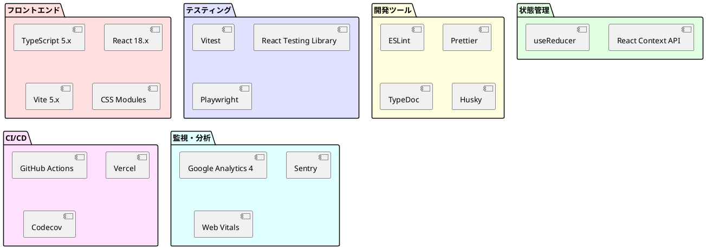

# 技術スタック選定

## 概要

ぷよぷよゲームの開発に使用する技術スタックを、要件と制約を考慮して選定します。

## 技術スタック一覧



## 主要技術の選定理由

### TypeScript
**選定理由:**

- 型安全性による開発効率向上
- 優れたIDEサポート
- 大規模アプリケーションでの保守性
- Reactとの相性の良さ

**バージョン:** 5.x（最新安定版）

### React
**選定理由:**

- コンポーネントベースの開発
- 豊富なエコシステム
- 仮想DOMによる効率的な再描画
- 大規模コミュニティのサポート

**バージョン:** 18.x（最新安定版）

### Vite
**選定理由:**

- 高速な開発サーバー
- 効率的なビルドプロセス
- TypeScriptネイティブサポート
- Hot Module Replacement

**バージョン:** 5.x（最新安定版）

## 技術スタック詳細

### フロントエンド

| 技術 | バージョン | 用途 | 選定理由 |
|------|-----------|------|----------|
| TypeScript | 5.x | 言語 | 型安全性、開発効率 |
| React | 18.x | UIライブラリ | コンポーネント指向、エコシステム |
| Vite | 5.x | ビルドツール | 高速開発、最適化ビルド |
| CSS Modules | - | スタイリング | スコープ分離、保守性 |

### 状態管理

| 技術 | 用途 | 選定理由 |
|------|------|----------|
| React Context API | グローバル状態 | 追加依存なし、シンプル |
| useReducer | 複雑な状態更新 | Redux風の状態管理 |
| カスタムフック | ロジック共有 | 再利用性、テスタビリティ |

### テスティング

| 技術 | バージョン | 用途 | 選定理由 |
|------|-----------|------|----------|
| Vitest | latest | 単体テスト | Vite統合、高速実行 |
| React Testing Library | latest | コンポーネントテスト | ベストプラクティス |
| Playwright | latest | E2Eテスト | クロスブラウザ対応 |
| MSW | latest | APIモック | 実際のHTTPレベルでモック |

### 開発ツール

| 技術 | バージョン | 用途 | 選定理由 |
|------|-----------|------|----------|
| ESLint | latest | リンター | コード品質維持 |
| Prettier | latest | フォーマッター | コードスタイル統一 |
| TypeDoc | latest | ドキュメント生成 | 自動API文書化 |
| Husky | latest | Gitフック | コミット前チェック |
| lint-staged | latest | ステージファイルチェック | 効率的なリント |

### ビルド・デプロイ

| 技術 | 用途 | 選定理由 |
|------|------|----------|
| GitHub Actions | CI/CD | GitHub統合、無料枠 |
| Vercel | ホスティング | 自動デプロイ、CDN |
| npm | パッケージ管理 | 標準ツール |

### 監視・分析

| 技術 | 用途 | 選定理由 |
|------|------|----------|
| Google Analytics 4 | 利用分析 | 無料、高機能 |
| Sentry | エラー監視 | リアルタイム通知 |
| Web Vitals | パフォーマンス監視 | Core Web Vitals対応 |

## 依存関係管理

### package.json構成

```json
{
  "name": "puyo-puyo-game",
  "version": "1.0.0",
  "type": "module",
  "scripts": {
    "dev": "vite",
    "build": "tsc && vite build",
    "preview": "vite preview",
    "test": "vitest",
    "test:ui": "vitest --ui",
    "test:coverage": "vitest --coverage",
    "lint": "eslint src --ext ts,tsx",
    "format": "prettier --write src/**/*.{ts,tsx,css}",
    "type-check": "tsc --noEmit"
  },
  "dependencies": {
    "react": "^18.2.0",
    "react-dom": "^18.2.0"
  },
  "devDependencies": {
    "@types/react": "^18.2.0",
    "@types/react-dom": "^18.2.0",
    "@typescript-eslint/eslint-plugin": "^6.0.0",
    "@typescript-eslint/parser": "^6.0.0",
    "@vitejs/plugin-react": "^4.0.0",
    "eslint": "^8.0.0",
    "eslint-plugin-react": "^7.0.0",
    "eslint-plugin-react-hooks": "^4.0.0",
    "prettier": "^3.0.0",
    "typescript": "^5.0.0",
    "vite": "^5.0.0",
    "vitest": "^1.0.0"
  }
}
```

## 技術的決定事項

### CSS-in-JS vs CSS Modules
**決定:** CSS Modules  
**理由:**
- ランタイムオーバーヘッドなし
- ビルド時の最適化
- TypeScriptとの型統合
- シンプルな実装

### Redux vs Context API
**決定:** Context API + useReducer  
**理由:**
- 小〜中規模アプリに十分
- 追加の依存関係不要
- Reduxパターンの利点を活用
- 学習コスト低減

### Canvas API vs DOM
**決定:** React DOM + CSS  
**理由:**
- アクセシビリティ対応容易
- レスポンシブデザイン対応
- React統合がシンプル
- デバッグ容易

## 開発環境要件

### 必須環境
- Node.js: 18.x以上
- npm: 9.x以上
- Git: 2.x以上

### 推奨環境
- OS: macOS, Linux, Windows (WSL2)
- IDE: Visual Studio Code
- ブラウザ: Chrome (開発用)

### VS Code拡張機能
```json
{
  "recommendations": [
    "dbaeumer.vscode-eslint",
    "esbenp.prettier-vscode",
    "ms-vscode.vscode-typescript-next",
    "orta.vscode-jest",
    "bradlc.vscode-tailwindcss"
  ]
}
```

## セキュリティ考慮事項

### 依存関係の管理
- npm auditの定期実行
- Dependabotによる自動更新
- セキュリティアラートの即時対応

### ビルド時の最適化
- Tree shaking
- Code splitting
- 圧縮とminification
- Source map の本番環境除外

## パフォーマンス最適化

### バンドルサイズ削減
```typescript
// vite.config.ts
export default {
  build: {
    rollupOptions: {
      output: {
        manualChunks: {
          vendor: ['react', 'react-dom'],
        },
      },
    },
  },
};
```

### 遅延読み込み
```typescript
// 動的インポート
const GameBoard = lazy(() => import('./components/GameBoard'));
```

## 将来の拡張性

### 考慮している拡張
- WebAssembly: 物理演算の高速化
- PWA: オフライン対応
- WebRTC: マルチプレイヤー機能
- WebGL: 高度なグラフィックス

### 技術的負債の管理
- 定期的な依存関係更新
- リファクタリング時間の確保
- ドキュメントの継続的更新
- コードレビューの徹底