# 技術スタック選定

## 概要

ぷよぷよゲームプロジェクトの技術スタック選定について説明します。プロジェクトの要件、制約、および戦略的目標に基づいて最適な技術を選定します。

## 技術選定の基準

### 選定基準

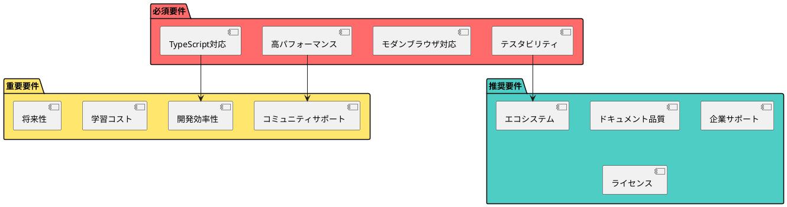

### 評価マトリックス

| 技術領域 | 重要度 | 評価観点 | 重み |
|----------|--------|----------|------|
| フロントエンド | 最高 | 開発速度、パフォーマンス、保守性 | 40% |
| 状態管理 | 高 | 複雑度、デバッグ性、拡張性 | 15% |
| テスト | 高 | カバレッジ、実行速度、保守性 | 15% |
| ビルド | 中 | ビルド速度、設定複雑度 | 10% |
| デプロイ | 中 | 簡単さ、コスト、信頼性 | 10% |
| 開発ツール | 中 | 開発体験、統合性 | 10% |

## コア技術スタック

### プログラミング言語・フレームワーク

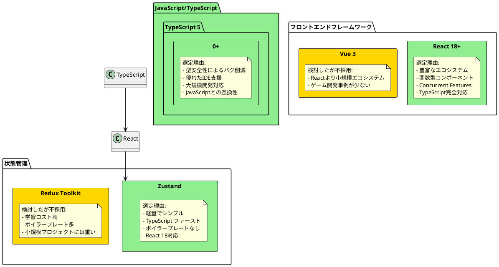

### 開発・ビルドツール

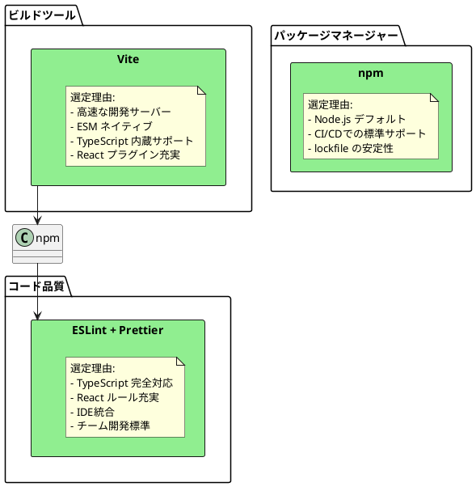

## テスト技術スタック

### テストフレームワーク

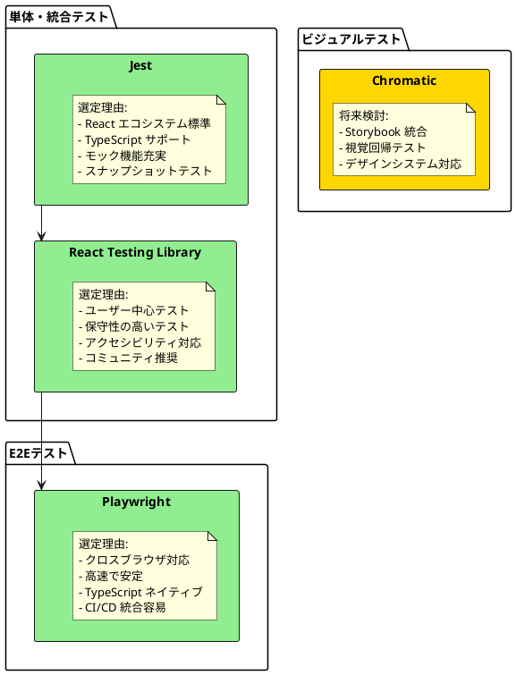

### テストユーティリティ

| テスト種別 | ツール | 選定理由 |
|------------|--------|----------|
| モック・スタブ | Jest | 豊富なモック機能 |
| カバレッジ | c8 (NYC) | Vite ネイティブサポート |
| パフォーマンステスト | Lighthouse CI | Web Vitals 標準対応 |
| アクセシビリティテスト | axe-core | WCAG準拠チェック |

## UI・スタイリング技術

### スタイリング戦略

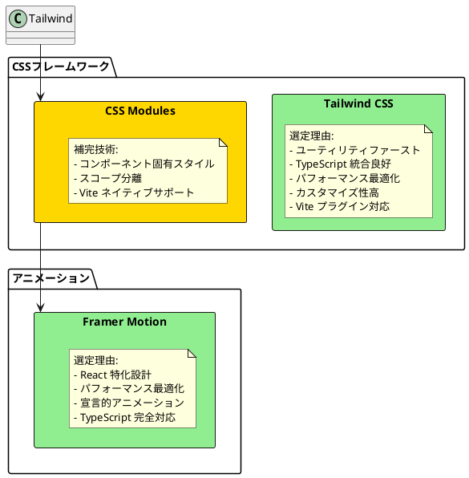

### UI コンポーネント

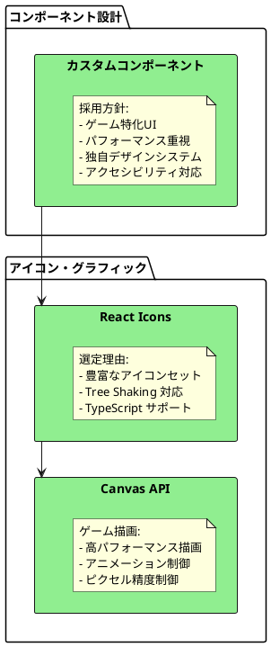

## デプロイメント・インフラ技術

### ホスティング・CDN

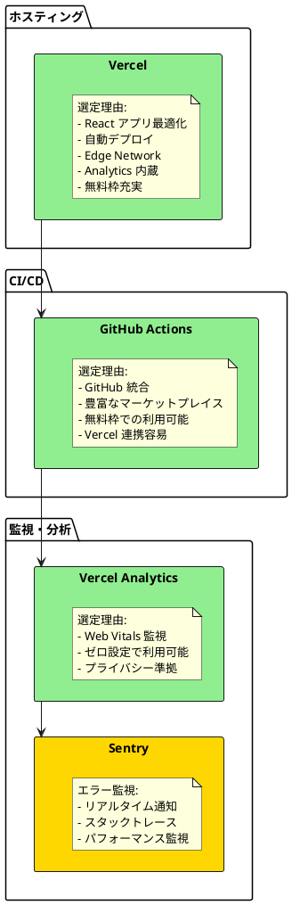

### セキュリティ・品質管理

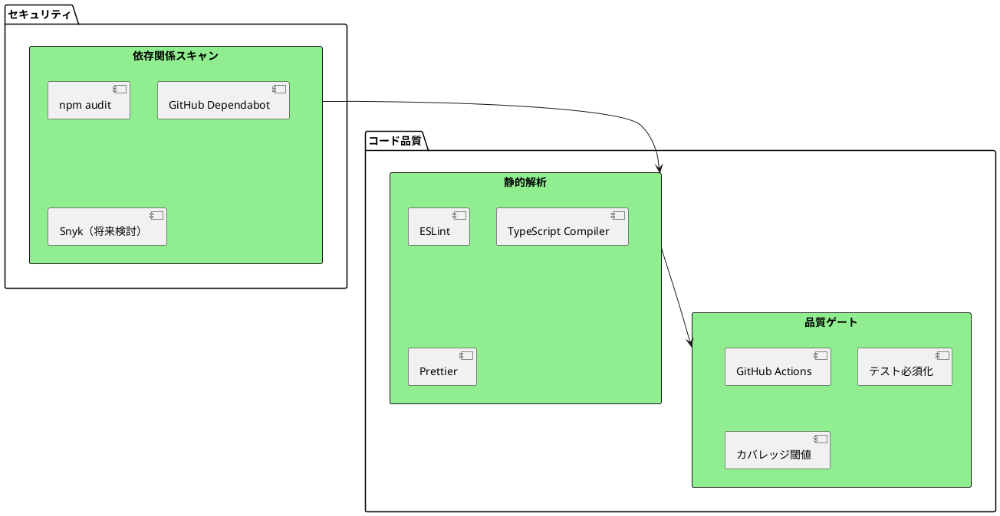

## 開発環境・ツール

### エディタ・IDE

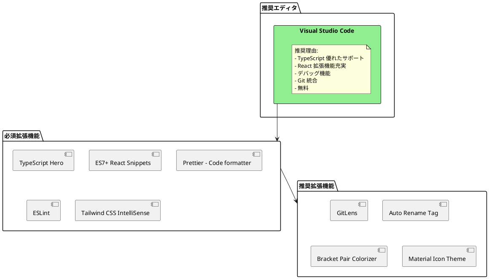

### 開発支援ツール

| カテゴリ | ツール | 目的 |
|----------|--------|------|
| バージョン管理 | Git + GitHub | ソースコード管理・協業 |
| API設計 | TypeScript型定義 | インターフェース設計 |
| ドキュメント | MkDocs | プロジェクトドキュメント |
| デザイン | Figma (将来) | UIデザイン・プロトタイプ |
| プロジェクト管理 | GitHub Projects | タスク管理・イシュー追跡 |

## 技術スタックの依存関係

### 依存関係マップ

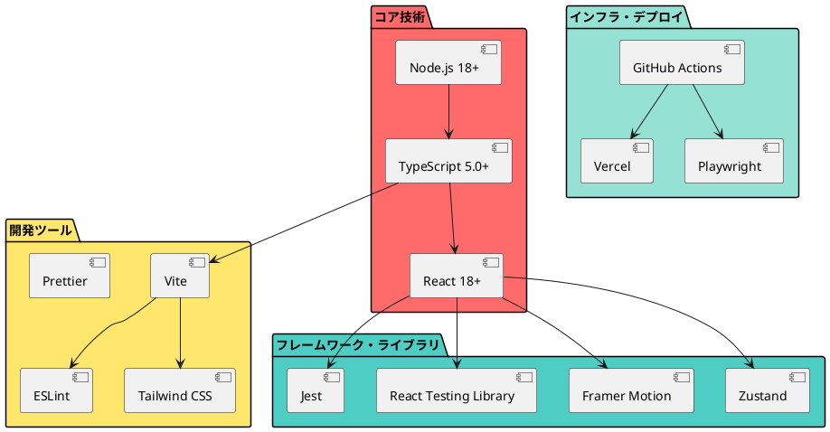

## 代替技術の検討

### 主要な代替案

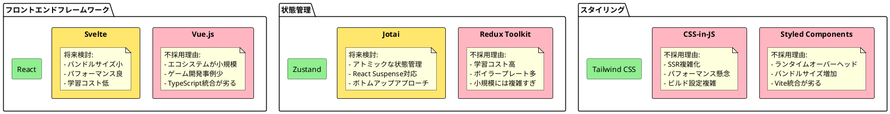

## パッケージ構成

### package.json概要

```json
{
  "name": "puyo-puyo-game",
  "version": "1.0.0",
  "type": "module",
  "dependencies": {
    "react": "^18.2.0",
    "react-dom": "^18.2.0",
    "zustand": "^4.4.0",
    "framer-motion": "^10.16.0"
  },
  "devDependencies": {
    "@types/react": "^18.2.0",
    "@types/react-dom": "^18.2.0",
    "typescript": "^5.0.0",
    "vite": "^4.4.0",
    "@vitejs/plugin-react": "^4.0.0",
    "tailwindcss": "^3.3.0",
    "eslint": "^8.45.0",
    "prettier": "^3.0.0",
    "jest": "^29.6.0",
    "@testing-library/react": "^13.4.0",
    "@playwright/test": "^1.37.0"
  }
}
```

### バージョニング戦略

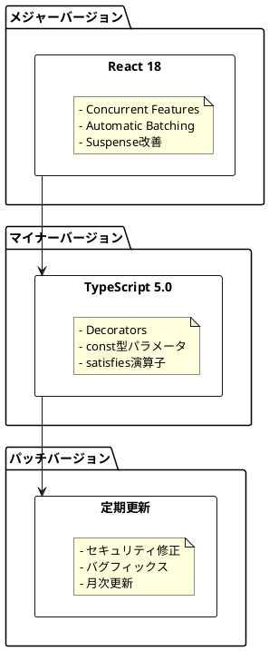

## ライセンス・法的考慮事項

### オープンソースライセンス

| パッケージ | ライセンス | 商用利用 | 注意事項 |
|------------|------------|----------|----------|
| React | MIT | ✅ | なし |
| TypeScript | Apache 2.0 | ✅ | なし |
| Vite | MIT | ✅ | なし |
| Tailwind CSS | MIT | ✅ | なし |
| Jest | MIT | ✅ | なし |
| Zustand | MIT | ✅ | なし |
| Framer Motion | MIT | ✅ | なし |

### ライセンス管理

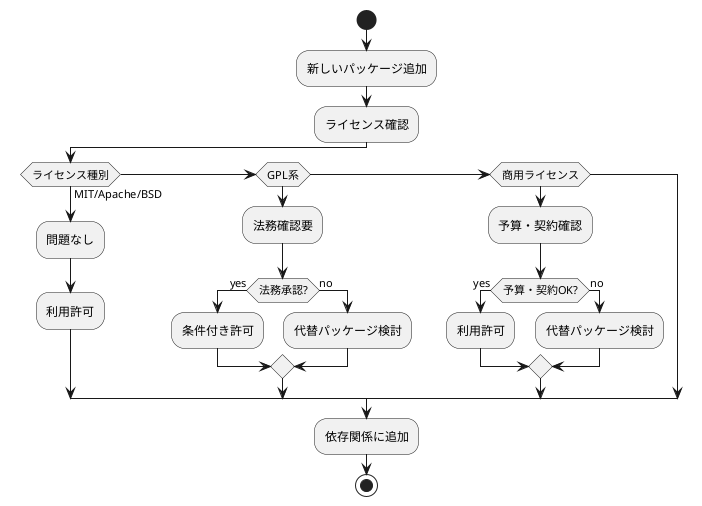

## 技術選定の今後の見直し

### 定期見直しサイクル

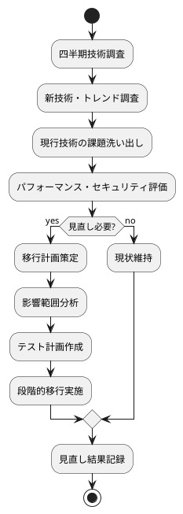

### 移行計画テンプレート

| 項目 | 内容 | 担当 | 期限 |
|------|------|------|------|
| 移行理由 | 課題・メリット明確化 | 技術リーダー | - |
| 影響分析 | 既存機能への影響調査 | 開発チーム | 1週間 |
| 移行計画 | 段階的移行スケジュール | プロジェクトマネージャー | 2週間 |
| テスト計画 | 移行前後のテスト戦略 | QAチーム | 1週間 |
| ロールバック計画 | 問題発生時の復旧手順 | DevOpsチーム | 1週間 |

## まとめ

この技術スタック選定により以下を実現：

1. **開発効率:** モダンなツールチェーンによる高速開発
2. **品質保証:** TypeScript + テストによる堅牢性
3. **パフォーマンス:** 最適化されたビルド・配信
4. **保守性:** 標準的で持続可能な技術選択
5. **拡張性:** 将来の機能追加・技術変更への対応
6. **チーム生産性:** 学習コストと開発体験のバランス
7. **コスト効率:** オープンソース中心の費用対効果
8. **企業サポート:** 安定したエコシステムと長期サポート