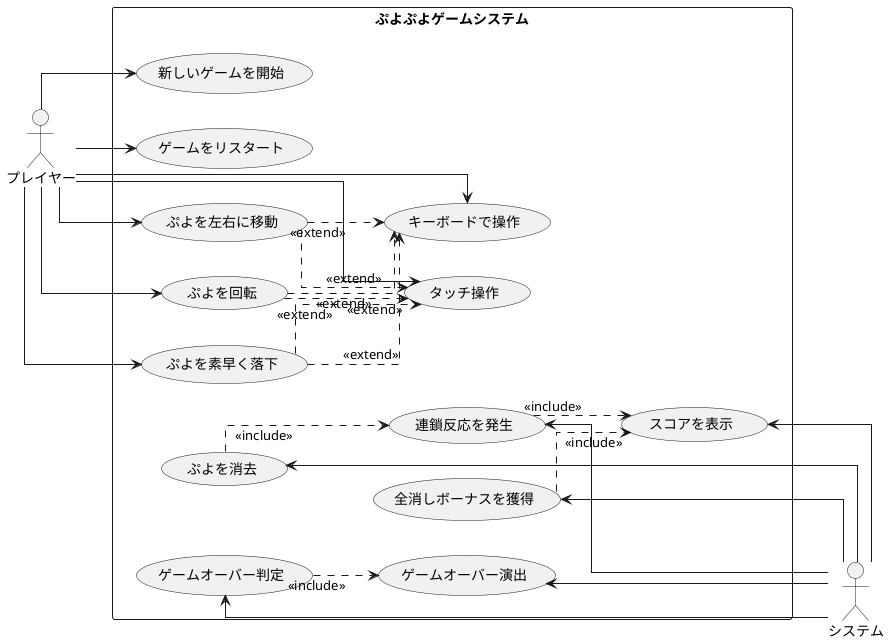

# 要件

## ユーザーストーリー

- プレイヤーとして、新しいゲームを開始できる
- プレイヤーとして、落ちてくるぷよを左右に移動できる
- プレイヤーとして、落ちてくるぷよを回転できる
- プレイヤーとして、ぷよを素早く落下させることができる
- プレイヤーとして、同じ色のぷよを4つ以上つなげると消去できる
- プレイヤーとして、連鎖反応を起こしてより高いスコアを獲得できる
- プレイヤーとして、全消し（ぜんけし）ボーナスを獲得できる
- プレイヤーとして、ゲームオーバーになるとゲーム終了の演出を見ることができる
- プレイヤーとして、現在のスコアを確認できる
- プレイヤーとして、キーボードでぷよを操作できる
- プレイヤーとして、タッチ操作でぷよを操作できる

## ユースケース図

## イテレーション1: ゲーム開始の実装 

### TODO

- [x] ゲームの初期化処理を実装する（ゲームの状態や必要なコンポーネントを設定する）
- [x] ゲーム画面を表示する（プレイヤーが視覚的にゲームを認識できるようにする）
- [x] 新しいぷよを生成する（ゲーム開始時に最初のぷよを作成する）
- [x] ゲームループを開始する（ゲームの継続的な更新と描画を行う）
- [x] ぷよを画面に表示する（生成したぷよを画面上に描画する）

### 受け入れ基準

- [x] ぷよが画面に表示されること
- [x] ゲームループが正常に動作すること
- [x] 新しいぷよが生成されること

### ふりかえり

**Keep**
- テスト駆動開発のアプローチで安全に実装を進められた
- シンプルなクラス設計でGameクラスとPuyoクラスの責務が明確に分離された
- 6列x12行のぷよぷよ標準フィールドサイズが正しく実装された
- TypeScriptの型安全性により、開発時に多くのエラーを未然に防げた
- Vitestによるテストが自動化され、開発サーバーも正常に動作している

**Problem**
- まだ視覚的な表示部分（HTML/CSS）が実装されていない
- ゲームループの実際の更新処理（時間経過での落下など）がまだ実装されていない
- ぷよの色の種類や視覚的な表現が決まっていない

**Try**
- 次のイテレーションでは実際にブラウザで動作する視覚的なゲーム表示を実装する
- ゲームループでの時間管理とぷよの自動落下機能を実装する
- ぷよの色のバリエーションと視覚的な表現を改善する

## イテレーション2: ぷよの移動の実装

### TODO

- [x] ぷよを自由落下させる（ぷよが自動的に下に落ちるようにする）
- [x] プレイヤーの入力を検出する（キーボードの左右キーが押されたことを検知する）
- [x] ぷよを左右に移動する処理を実装する（実際にぷよの位置を変更する）
- [x] 移動可能かどうかのチェックを実装する（画面の端や他のぷよにぶつかる場合は移動できないようにする）
- [x] 移動後の表示を更新する（画面上でぷよの位置が変わったことを表示する）
- [x] ぷよの着地を検出する（ぷよが下に落ちて他のぷよや床にぶつかったことを検知する）
- [x] ぷよが着地したら次のぷよを生成する（新しいぷよを画面に表示する）

### 受け入れ基準

- [x] ぷよが自動的に落下すること
- [x] 左右矢印キーでぷよを移動できること
- [x] 下矢印キーでぷよを高速落下できること
- [x] フィールドの境界で移動が制限されること
- [x] ぷよが着地して新しいぷよが生成されること

### ふりかえり

**Keep**
- テスト駆動開発のアプローチで安全に実装を進められた
- ゲームループとdeltaTimeを使った時間管理が適切に実装された
- キーボード入力の処理が直感的でレスポンシブに動作する
- フィールド境界の衝突判定が正確に動作している
- 着地判定と次のぷよ生成のフローが自然で滑らか
- 循環的複雑度を意識したリファクタリングでコードの可読性が向上
- ランダムな色生成（1-4）により視覚的なバリエーションが追加された

**Problem**
- まだぷよは単体のみで、実際のぷよぷよのようなペア（2個1組）になっていない
- ぷよの回転機能がまだ実装されていない
- ぷよの消去システム（4つ以上つながった時の消去）がまだない
- スコアシステムや連鎖システムがまだ実装されていない

**Try**
- 次のイテレーションではぷよの回転機能を実装する
- ペアぷよ（2個1組）の実装を検討する
- ぷよの消去システムの基盤となる隣接チェック機能の実装を検討する
- UI/UXの改善（スコア表示、次のぷよ予告など）を検討する

## イテレーション3: ぷよの高速落下の実装

### TODO

- [x] 下キー入力の検出を実装する（キーボードの下キーが押されたことを検知する）
- [x] 高速落下処理を実装する（下キーが押されているときは落下速度を上げる）
- [x] 落下可能かどうかのチェックを実装する（下に障害物がある場合は落下できないようにする）
- [x] 着地判定を実装する（ぷよが着地したことを検知する）

### 受け入れ基準

- [x] 下矢印キーを押している間、ぷよが高速で落下する
- [x] 下に障害物がある場合は落下が停止する
- [x] 高速落下中も正常な着地判定が動作する
- [x] 既存の自動落下システムと共存している

### ふりかえり

**Keep**
- テスト駆動開発で4つの詳細なテストケースを作成し、全て成功
- 既存のhandleInputメソッドとの共存を保ちながら新機能を追加
- キー状態管理（Set<string>）によるクリーンな実装
- 高速落下タイマー（50ms）と通常タイマー（1000ms）の適切な分離
- 着地処理でのタイマーリセット機能が正しく動作
- keydown/keyupイベントとRepeatキー制御の適切な統合

**Problem**
- 左右移動のキーリピート対応が不完全（現在はrepeatイベントをブロック）
- まだ単体ぷよのままで、ペア（2個1組）になっていない
- ぷよの回転機能が未実装
- ユーザビリティ面で高速落下速度（50ms）が適切かの検証が必要

**Try**
- 次のイテレーションではぷよの回転機能を実装する
- 左右移動のキーリピート機能の改善を検討する
- 高速落下速度の調整やユーザビリティテストを実施する
- ペアぷよ実装への準備としてPuyoクラスの拡張を検討する

## イテレーション4: ぷよの回転の実装 

### TODO

- [x] ぷよペアを実装する（2個1組のぷよを管理するクラスを作成する）
- [x] ぷよの回転処理を実装する（時計回り・反時計回りの回転）
- [x] 回転可能かどうかのチェックを実装する（他のぷよや壁にぶつかる場合は回転できないようにする）
- [x] 壁キック処理を実装する（壁際での回転を可能にする特殊処理）
- [x] 回転後の表示を更新する（画面上でぷよの位置が変わったことを表示する）

### 受け入れ基準

- [x] ぷよペアが2個1組で管理されること
- [x] 上矢印キーでぷよを時計回りに回転できる
- [x] フィールドの境界や他のぷよとの衝突時は回転が無効になる
- [x] 壁際での回転時に壁キック処理が動作する
- [x] 回転後の表示が正しく更新される

### ふりかえり

**Keep**
- テスト駆動開発のアプローチで安全にぷよペアシステムを実装できた
- PuyoPairクラスの軸-衛星構造（axis-satellite）により直感的な回転システムを実現
- 壁キック機能により、実際のぷよぷよゲームに近い操作感を実現
- 境界チェック問題を段階的に修正し、すべてのテストケースが通るように改善
- updateSatellitePosition()メソッドにより、回転状態に応じた正確な位置計算を実現
- 41個のテストケースすべてが成功し、品質の高い実装を維持

**Problem**
- 初期実装時に境界チェックでupdateSatellitePosition()の呼び出しが不足していた
- 壁キック機能によりテストの期待値が変わり、テストケースの調整が必要だった
- ぷよペアの複雑な状態管理により、デバッグに時間がかかった
- まだぷよの消去システムが未実装で、ゲームとしての完成度が不十分

**Try**
- 次のイテレーションでは同色4つ以上の連結判定とぷよ消去システムを実装する
- 消去後の落下処理（重力処理）の実装を検討する
- 連鎖システムの基盤となる消去判定アルゴリズムの設計を行う
- ユーザビリティ向上のため、次のぷよ予告表示の実装を検討する

## イテレーション5: ぷよの消去の実装 

### TODO

- [x] ぷよの接続判定を実装する（隣接する同じ色のぷよを検出する）
- [x] 4つ以上つながったぷよの検出を実装する（消去対象となるぷよのグループを特定する）
- [x] ぷよの消去処理を実装する（消去対象のぷよを実際に消す）
- [x] 消去後の落下処理を実装する（消去された後の空きスペースにぷよが落ちてくる）
- [x] 消去されない場合の落下処理を実装する（ぷよが重なっている場合に下に落下する）

### 受け入れ基準

- [x] 同じ色のぷよが4つ以上隣接して配置された場合、それらが消去されること
- [x] 消去されたぷよの上にあるぷよが重力により下に落下すること
- [ ] 消去処理が連続で実行されること（連鎖の基盤）
- [ ] 消去されたぷよの数に応じてスコアが加算されること
- [ ] 既存のぷよ操作（移動・回転・落下）と消去システムが正しく連携すること
- [x] ぷよが重なっている場合に下に空間があればぷよが落下すること

### ふりかえり

**Keep**
- テスト駆動開発で5つのTODO項目をすべて完了し、59個のテストケースが成功
- DFS（深度優先探索）を使った効率的な隣接ぷよ検出アルゴリズムを実装
- 循環的複雑度制限により、複雑なDFSメソッドを適切に分割してコードの可読性を向上
- findConnectedPuyos、findErasableGroups、erasePuyos、applyGravityの明確な責務分離
- 底から上に向かってスキャンする効率的な重力処理アルゴリズムを実装
- 包括的なテストケースにより、エッジケースも含めた堅牢な実装を実現

**Problem**
- 消去とゲームループの統合がまだ完了していない（手動でerasePuyos()を呼ぶ必要がある）
- 連鎖システム（消去処理の連続実行）がまだ実装されていない
- スコアシステムが未実装で、消去時の得点計算ができない
- ゲームUIに消去処理が統合されておらず、実際のゲームプレイで動作しない
- パフォーマンス面でDFS探索の最適化の余地がある

**Try**
- 次のイテレーションでは連鎖システムを実装し、消去処理の連続実行を実現する
- ゲームループに消去処理を統合し、ぷよ着地時の自動消去を実装する
- スコアシステムと連鎖ボーナス計算機能を追加する
- UI/UX改善として消去時のエフェクトや連鎖数表示を検討する
- DFS探索のパフォーマンス最適化（visitedフラグの再利用など）を検討する

## イテレーション6: 連鎖反応の実装 

### TODO

- [ ] 連鎖判定を実装する（ぷよが消えた後に新たな消去パターンがあるかを判定する）
- [ ] 連鎖カウントを実装する（何連鎖目かをカウントする）
- [ ] 連鎖ボーナスの計算を実装する（連鎖数に応じたボーナス点を計算する）
- [ ] スコア表示を実装する（プレイヤーに現在のスコアを表示する）
- [ ] ゲームループに消去・連鎖機能を統合する

### 受け入れ基準

- [ ] 連鎖が発生して連鎖数がカウントされること
- [ ] 連鎖ボーナスが正しく計算されること（1連鎖: 1倍, 2連鎖: 2倍, 3連鎖: 4倍...）
- [ ] スコアにボーナスが適用されること
- [ ] ぷよ配置時に自動的に連鎖処理が実行されること
- [ ] 既存のぷよ操作システムと連鎖システムが正しく連携すること

### ふりかえり

**Keep**

**Problem**

**Try**

## イテレーション7: 全消しボーナスの実装 

### TODO

- [ ] 全消し判定を実装する（盤面上のぷよがすべて消えたかどうかを判定する）
- [ ] 全消しボーナスの計算を実装する（全消し時に加算するボーナス点を計算する）
- [ ] 全消し演出を実装する（全消し時に特別な演出を表示する）

### 受け入れ基準

- [ ] 全消し発生時に2000点のボーナスが加算されること
- [ ] 全消しが発生しない場合はボーナスが加算されないこと  
- [ ] 連鎖と全消しが同時発生した場合に正しく計算されること
- [ ] 既存の連鎖システムと全消しボーナスが正しく連携すること

### ふりかえり

**Keep**

**Problem**

**Try**

## イテレーション8: ゲームオーバーの実装 

### TODO

- [ ] ゲームオーバー判定を実装する（新しいぷよを配置できない状態を検出する）
- [ ] ゲームオーバー演出を実装する（ゲームオーバー時に特別な表示や効果を追加する）
- [ ] リスタート機能を実装する（ゲームオーバー後に新しいゲームを始められるようにする）
- [ ] リセットボタン機能を実装する（いつでもゲームを初期状態にリセット）

### 受け入れ基準

- [ ] 新しいぷよが初期位置（2, 0）に配置できない場合にゲームオーバーになること
- [ ] ゲームオーバー時に視覚的なオーバーレイが表示されること
- [ ] ゲームオーバー時に最終スコアが表示されること
- [ ] ゲームオーバー後にRキーでリスタートできること
- [ ] ゲームオーバー時は移動・回転操作が無効になること
- [ ] リセットボタンでいつでもゲームをリセットできること

### ふりかえり

**Keep**

**Problem**

**Try**
