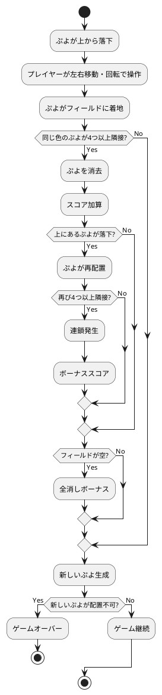
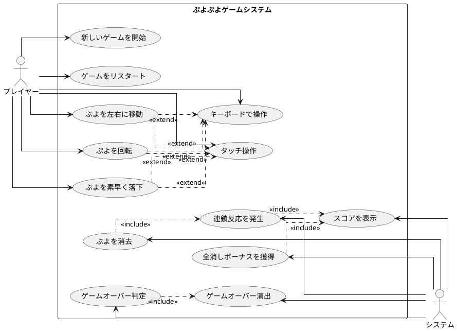

# 要件

## アプリケーション概要

### ぷよぷよゲームとは

ぷよぷよは、落ちてくる色付きの「ぷよ」を操作して、同じ色のぷよを4つ以上つなげて消去するパズルゲームです。連鎖反応を起こすことで高得点を狙うことができます。

### 基本ルール

## ユーザーストーリー

- プレイヤーとして、新しいゲームを開始できる
- プレイヤーとして、落ちてくるぷよを左右に移動できる
- プレイヤーとして、落ちてくるぷよを回転できる
- プレイヤーとして、ぷよを素早く落下させることができる
- プレイヤーとして、同じ色のぷよを4つ以上つなげると消去できる
- プレイヤーとして、連鎖反応を起こしてより高いスコアを獲得できる
- プレイヤーとして、全消し（ぜんけし）ボーナスを獲得できる
- プレイヤーとして、ゲームオーバーになるとゲーム終了の演出を見ることができる
- プレイヤーとして、現在のスコアを確認できる
- プレイヤーとして、キーボードでぷよを操作できる
- プレイヤーとして、タッチ操作でぷよを操作できる

## ユースケース図

