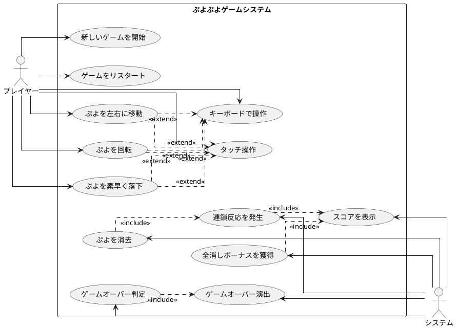

# 要件

## ユーザーストーリー

- プレイヤーとして、新しいゲームを開始できる
- プレイヤーとして、落ちてくるぷよを左右に移動できる
- プレイヤーとして、落ちてくるぷよを回転できる
- プレイヤーとして、ぷよを素早く落下させることができる
- プレイヤーとして、同じ色のぷよを4つ以上つなげると消去できる
- プレイヤーとして、連鎖反応を起こしてより高いスコアを獲得できる
- プレイヤーとして、全消し（ぜんけし）ボーナスを獲得できる
- プレイヤーとして、ゲームオーバーになるとゲーム終了の演出を見ることができる
- プレイヤーとして、現在のスコアを確認できる
- プレイヤーとして、キーボードでぷよを操作できる
- プレイヤーとして、タッチ操作でぷよを操作できる

## ユースケース図

## イテレーション1: ゲーム開始の実装

### TODO

- [ ] ゲームの初期化処理を実装する（ゲームの状態や必要なコンポーネントを設定する）
- [ ] ゲーム画面を表示する（プレイヤーが視覚的にゲームを認識できるようにする）
- [ ] 新しいぷよを生成する（ゲーム開始時に最初のぷよを作成する）
- [ ] ゲームループを開始する（ゲームの継続的な更新と描画を行う）
- [ ] ぷよを画面に表示する（生成したぷよを画面上に描画する）

### 受け入れ基準

### ふりかえり

## イテレーション2: ぷよの移動の実装

### TODO

- [ ] ぷよを自由落下させる（ぷよが自動的に下に落ちるようにする）
- [ ] プレイヤーの入力を検出する（キーボードの左右キーが押されたことを検知する）
- [ ] ぷよを左右に移動する処理を実装する（実際にぷよの位置を変更する）
- [ ] 移動可能かどうかのチェックを実装する（画面の端や他のぷよにぶつかる場合は移動できないようにする）
- [ ] 移動後の表示を更新する（画面上でぷよの位置が変わったことを表示する）
- [ ] ぷよの着地を検出する（ぷよが下に落ちて他のぷよや床にぶつかったことを検知する）
- [ ] ぷよが着地したら次のぷよを生成する（新しいぷよを画面に表示する）

### 受け入れ基準

### ふりかえり

## イテレーション3: ぷよの回転の実装

### TODO

- [ ] ぷよの回転処理を実装する（時計回り・反時計回りの回転）
- [ ] 回転可能かどうかのチェックを実装する（他のぷよや壁にぶつかる場合は回転できないようにする）
- [ ] 壁キック処理を実装する（壁際での回転を可能にする特殊処理）
- [ ] 回転後の表示を更新する（画面上でぷよの位置が変わったことを表示する）

### 受け入れ基準

### ふりかえり

## イテレーション4: ぷよの高速落下の実装

### TODO

- [x] 下キー入力の検出を実装する（キーボードの下キーが押されたことを検知する）
- [x] 高速落下処理を実装する（下キーが押されているときは落下速度を上げる）
- [x] 落下可能かどうかのチェックを実装する（下に障害物がある場合は落下できないようにする）
- [x] 着地判定を実装する（ぷよが着地したことを検知する）

### 受け入れ基準

### ふりかえり

## イテレーション5: ぷよの消去の実装

### TODO

- [ ] ぷよの接続判定を実装する（隣接する同じ色のぷよを検出する）
- [ ] 4つ以上つながったぷよの検出を実装する（消去対象となるぷよのグループを特定する）
- [ ] ぷよの消去処理を実装する（消去対象のぷよを実際に消す）
- [ ] 消去後の落下処理を実装する（消去された後の空きスペースにぷよが落ちてくる）

### 受け入れ基準

### ふりかえり

## イテレーション6: 連鎖反応の実装

### TODO

- [ ] 連鎖判定を実装する（ぷよが消えた後に新たな消去パターンがあるかを判定する）
- [ ] 連鎖カウントを実装する（何連鎖目かをカウントする）
- [ ] 連鎖ボーナスの計算を実装する（連鎖数に応じたボーナス点を計算する）
- [ ] スコア表示を実装する（プレイヤーに現在のスコアを表示する）
- [ ] ゲームループに消去・連鎖機能を統合する

### 受け入れ基準

### ふりかえり

## イテレーション7: 全消しボーナスの実装

### TODO

- [ ] 全消し判定を実装する（盤面上のぷよがすべて消えたかどうかを判定する）
- [ ] 全消しボーナスの計算を実装する（全消し時に加算するボーナス点を計算する）
- [ ] 全消し演出を実装する（全消し時に特別な演出を表示する）

### 受け入れ基準

### ふりかえり

## イテレーション8: ゲームオーバーの実装

### TODO

- [ ] ゲームオーバー判定を実装する（新しいぷよを配置できない状態を検出する）
- [ ] ゲームオーバー演出を実装する（ゲームオーバー時に特別な表示や効果を追加する）
- [ ] リスタート機能を実装する（ゲームオーバー後に新しいゲームを始められるようにする）

### 受け入れ基準

### ふりかえり
