# 運用要件

## 概要

ぷよぷよゲームシステムの運用要件について説明します。Phase 1（要件段階）として概要レベルで定義し、Phase 2（構築・配置段階）で詳細化します。

## CI/CDパイプライン設計

### パイプライン概要

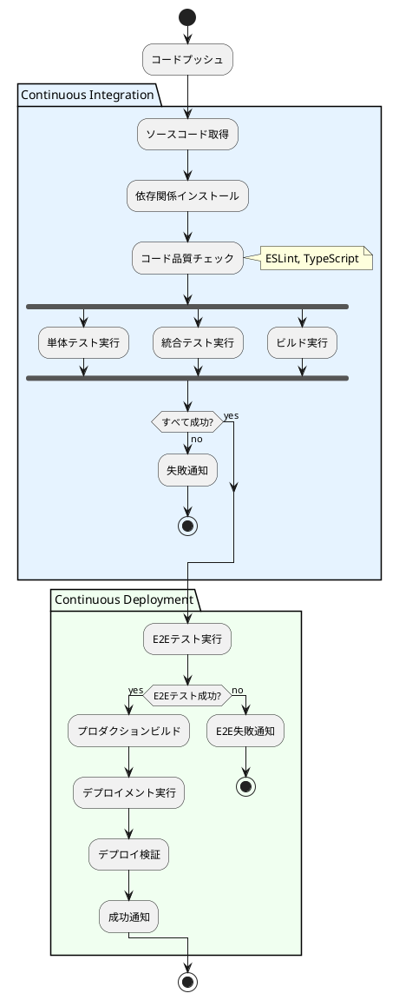

### GitHub Actions設定概要

```yaml
# 概要レベルの設定
name: CI/CD Pipeline
on:
  push:
    branches: [main, develop]
  pull_request:
    branches: [main]

jobs:
  test:
    runs-on: ubuntu-latest
    steps:
      - checkout
      - setup-node
      - install-dependencies
      - run-linting
      - run-unit-tests
      - run-integration-tests
      - build-application
      
  deploy:
    needs: test
    if: github.ref == 'refs/heads/main'
    runs-on: ubuntu-latest
    steps:
      - run-e2e-tests
      - deploy-to-vercel
      - verify-deployment
```

## 環境構成

### 環境種別

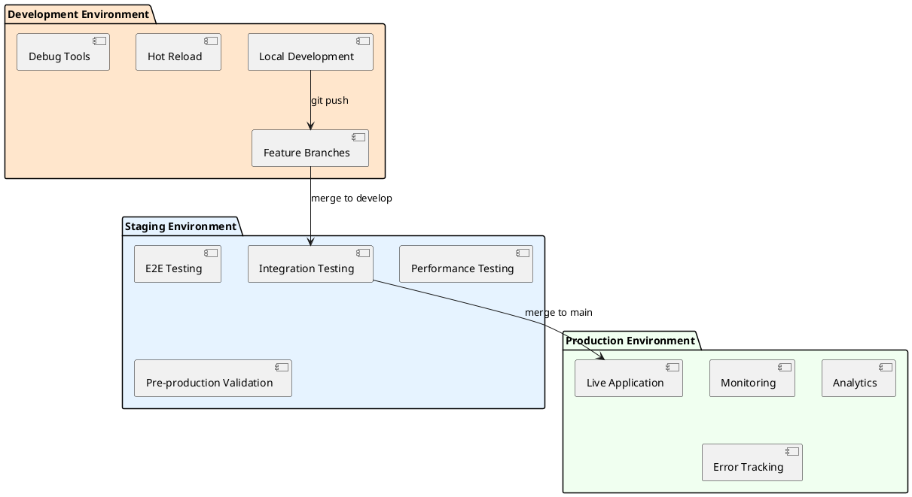

### 環境仕様

| 環境 | 目的 | デプロイ頻度 | データ |
|------|------|--------------|--------|
| Local | 開発・デバッグ | 随時 | モックデータ |
| Staging | 統合テスト・検証 | 日次 | テストデータ |
| Production | 本番サービス | 週次 | 本番データ |

## 監視・観測戦略

### 監視対象

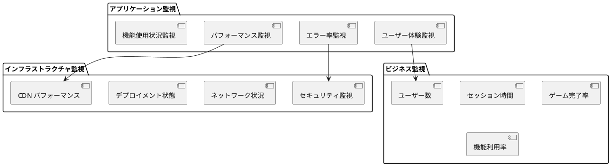

### 監視ツール（候補）

- **パフォーマンス:** Lighthouse CI, Web Vitals
- **エラートラッキング:** Sentry
- **分析:** Google Analytics
- **稼働監視:** Vercel Analytics
- **ログ集約:** Vercel Function Logs

## デプロイメント手順

### デプロイフロー

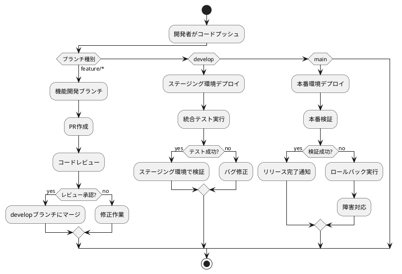

### ロールバック戦略

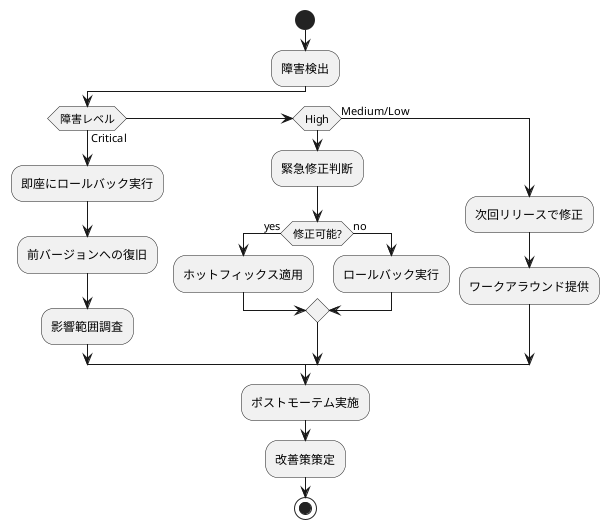

## インシデント対応

### 対応体制

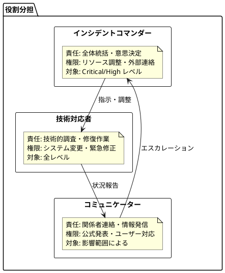

### インシデント分類

| 重要度 | 定義 | 対応時間 | 対応者 |
|--------|------|----------|---------|
| Critical | サービス全停止 | 30分以内 | 全チーム |
| High | 主要機能停止 | 2時間以内 | 開発チーム |
| Medium | 部分機能影響 | 8時間以内 | 担当者 |
| Low | 軽微な問題 | 24時間以内 | 担当者 |

## バックアップ・復旧計画

### バックアップ戦略

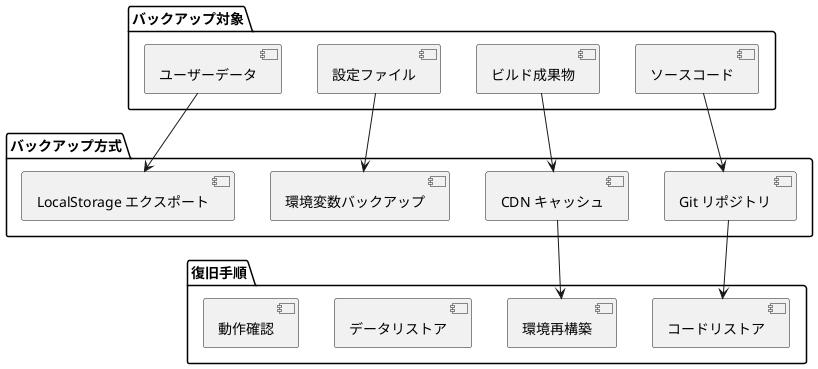

### 災害復旧計画

| 障害シナリオ | RTO (復旧目標時間) | RPO (目標復旧時点) | 対応手順 |
|--------------|--------------------|--------------------|----------|
| コード破損 | 1時間 | 最新コミット | Git復旧 |
| 設定破損 | 30分 | 最新設定 | 環境変数復元 |
| CDN 障害 | 2時間 | 最新ビルド | 代替CDN切り替え |
| 全システム障害 | 4時間 | 24時間前 | フル復旧手順 |

## 開発フロー

### Git Flow 戦略

```plantuml
@startuml "Git Flow"
!define MAIN_COLOR #90EE90
!define DEVELOP_COLOR #FFD700
!define FEATURE_COLOR #E6F3FF
!define HOTFIX_COLOR #FFB6C1

gitgraph:
    options {
        orientation: "top-down",
        theme: "base"
    }
    
    commit id: "Initial"
    
    branch develop
    checkout develop
    commit id: "Setup"
    
    branch feature/game-logic
    checkout feature/game-logic
    commit id: "Add Puyo class"
    commit id: "Add Field class"
    
    checkout develop
    merge feature/game-logic
    commit id: "Integrate game logic"
    
    checkout main
    merge develop
    commit id: "v1.0 Release"
    
    branch hotfix/critical-bug
    checkout hotfix/critical-bug
    commit id: "Fix critical bug"
    
    checkout main
    merge hotfix/critical-bug
    commit id: "v1.0.1 Hotfix"
    
    checkout develop
    merge hotfix/critical-bug
@enduml
```

### ブランチ戦略

| ブランチ種別 | 命名規則 | 目的 | マージ先 |
|--------------|----------|------|----------|
| main | main | 本番リリース | - |
| develop | develop | 開発統合 | main |
| feature | feature/{機能名} | 機能開発 | develop |
| hotfix | hotfix/{修正内容} | 緊急修正 | main, develop |
| release | release/{バージョン} | リリース準備 | main, develop |

## 運用手順書

### 日次運用チェックリスト

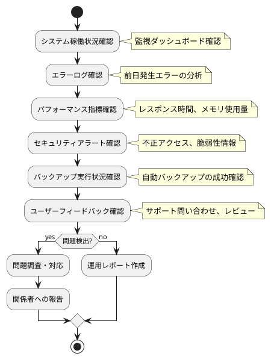

### 週次運用作業

- パフォーマンストレンド分析
- セキュリティパッチ適用検討
- 容量計画見直し
- 運用改善提案作成

### 月次運用作業

- サービスレビュー実施
- SLA達成状況評価
- コスト分析・最適化
- 災害復旧訓練実施

## 運用メトリクス

### KPI (重要業績指標)

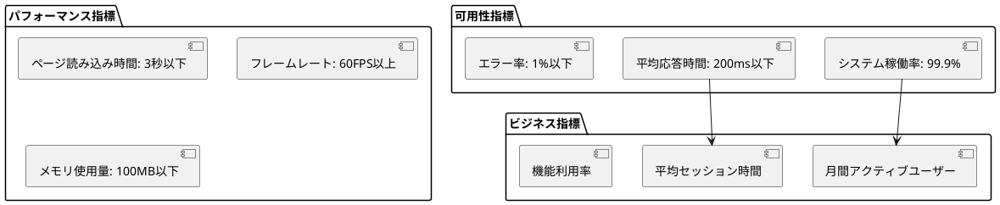

### SLA (Service Level Agreement)

| 項目 | 目標値 | 測定方法 | 報告頻度 |
|------|--------|----------|----------|
| 稼働率 | 99.9% | 自動監視 | 月次 |
| 応答時間 | 平均200ms | RUM | 週次 |
| エラー率 | 1%以下 | ログ分析 | 日次 |
| セキュリティ | インシデント0件 | 監査 | 月次 |

## セキュリティ運用

### セキュリティ監視

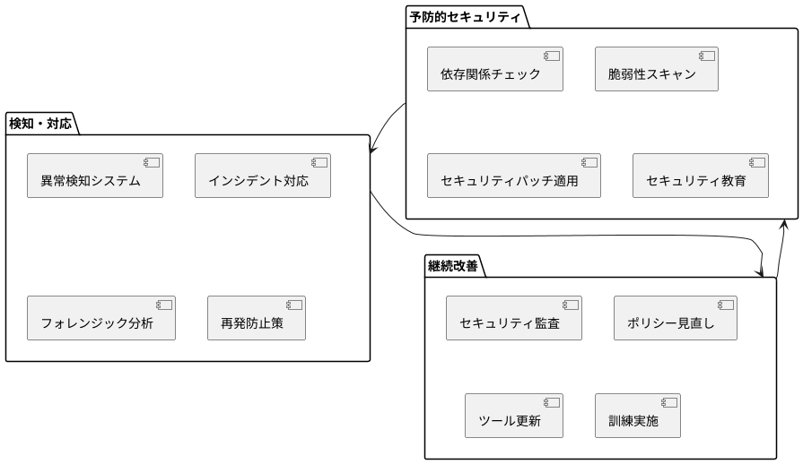

### コンプライアンス管理

- 個人情報保護法対応状況の定期確認
- セキュリティポリシーの更新・周知
- 監査対応・是正措置の実施
- インシデント報告・記録管理

## 運用コスト管理

### コスト構造

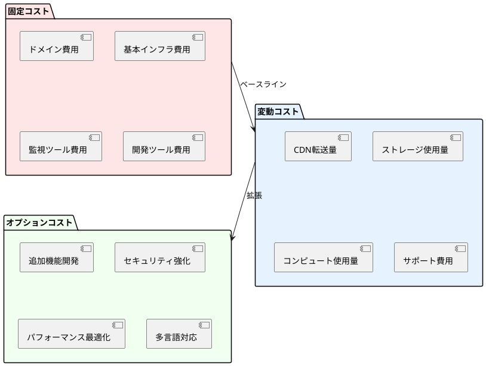

### コスト最適化戦略

- リソース使用量の定期監視
- 不要なサービス・機能の削減
- 自動スケーリングによる効率化
- コスト効果の定期評価

## まとめ

この運用要件により以下を実現：

1. **自動化:** CI/CDによる効率的なデプロイメント
2. **可視性:** 包括的な監視・ログ管理
3. **信頼性:** 適切なバックアップ・復旧体制
4. **セキュリティ:** 継続的なセキュリティ運用
5. **効率性:** 標準化された運用手順
6. **改善:** メトリクスベースの継続的改善

Phase 2（構築・配置段階）でこれらの要件を具体的な設定・手順として詳細化します。